# Technical Specification

# 0. Agent Action Plan

## 0.1 Core Documentation Objective

Based on the provided requirements, the Blitzy platform understands that the documentation objective is to **generate complete, production-quality source code documentation for the dnsmasq codebase covering 100% of non-static functions and 90%+ of static functions**, transforming an extensively functional but minimally documented C network services daemon into a fully documented, developer-friendly codebase.

#### Documentation Request Categorization

**Primary Category:** Create new documentation (with selective existing file updates)

**Documentation Types Required:**
- Inline API documentation (Doxygen-compatible function/struct/macro comments)
- Architecture documentation (system design and component interactions)
- Protocol implementation documentation (RFC compliance specifications)
- Configuration system documentation (compile-time and runtime options)
- Build system documentation (cross-platform compilation guide)
- User reference documentation (feature guides and tutorials)

#### Enhanced Requirement Clarifications

**Requirement 1: Comprehensive Inline Documentation**
Based on the prompt, the Blitzy platform understands that every C source file and header file in `/src/` must receive file-level documentation headers and function-level documentation comments following Doxygen syntax. This includes:
- File-level documentation with purpose, responsibilities, dependencies, data structures, and compile-time options
- Function documentation with `@brief`, `@detailed`, `@param`, `@return`, `@note`, `@warning`, `@see`, example usage, RFC compliance references, side effects, and thread safety notes
- Struct/enum/union documentation with lifecycle, memory layout, and usage patterns
- Macro documentation for all complex preprocessor definitions

**Requirement 2: Standalone Markdown Documentation Files**
The platform understands that nine (9) comprehensive markdown documentation files must be created in a new `/docs/` directory, providing high-level architecture, protocol-specific implementation details, and build/configuration guidance:
- ARCHITECTURE.md (minimum 2500 words)
- DNS_FORWARDING.md (minimum 1500 words)
- DNS_CACHING.md (minimum 1500 words)
- DHCP_V4.md (minimum 2000 words)
- DHCP_V6.md (minimum 2000 words)
- DNSSEC.md (minimum 1500 words)
- TFTP.md (minimum 1000 words)
- CONFIGURATION.md (minimum 1500 words)
- BUILDING.md (minimum 1000 words)

**Requirement 3: RFC Compliance Mapping**
The platform understands that protocol implementation files must document which RFCs are implemented, which sections of each RFC are covered, and how the code maps to specific RFC requirements. Critical RFCs identified include:
- RFC 1035 (DNS packet format) - implemented in rfc1035.c
- RFC 2131 (DHCPv4 protocol) - implemented in rfc2131.c
- RFC 3315 (DHCPv6 protocol) - implemented in rfc3315.c
- Additional RFCs referenced throughout cache.c and protocol handlers

**Requirement 4: Zero Code Modification**
The platform understands that this is a **documentation-only task** with absolute prohibition on:
- Modifying any existing source code logic
- Refactoring or "improving" algorithms
- Changing code style or formatting
- Adding TODO/FIXME suggestions for code improvements
- Altering copyright headers or license notices
- Any behavior changes whatsoever

Documentation will be inserted as new comment blocks without disturbing existing code structure.

#### Implicit Documentation Needs Discovered

**Discovered Need 1: Platform-Specific Documentation**
Analysis reveals extensive conditional compilation (`#ifdef HAVE_LINUX_NETWORK`, `HAVE_BSD_NETWORK`, `HAVE_SOLARIS_NETWORK`) requiring documentation of platform-specific behavior variations, particularly in:
- `network.c` - interface enumeration differences
- `netlink.c` vs `bpf.c` - Linux netlink vs BSD routing sockets
- Capability management - Linux capabilities vs Solaris privileges

**Discovered Need 2: Compile-Time Feature Documentation**
The codebase contains 30+ compile-time options in `config.h` affecting feature availability (HAVE_DHCP, HAVE_DNSSEC, HAVE_TFTP, HAVE_DBUS, HAVE_UBUS, etc.). Each must be documented with:
- Impact on included code paths
- Required external dependencies (libdbus, libnettle, libidn2)
- Interaction effects between options (HAVE_DHCP6 implies HAVE_DHCP)

**Discovered Need 3: Memory Management Documentation**
Static analysis shows custom memory management patterns including:
- Freelists and object pooling
- Hash table implementations
- Negative caching strategies
- Block-chained buffer management (blockdata.c)

These require explicit documentation of allocation/deallocation responsibilities and ownership semantics.

**Discovered Need 4: Security-Sensitive Code Documentation**
DNSSEC validation (dnssec.c), cryptographic operations (crypto.c), and capability dropping require security-focused documentation highlighting:
- Trust boundary enforcement
- Cryptographic algorithm selection
- Timing-sensitive operations
- Privilege escalation prevention

## 0.2 Special Instructions and Constraints

#### CRITICAL Directives from User

**Directive 1: Documentation Style - Doxygen-Compatible Syntax**
The user explicitly requires Doxygen-compatible comment syntax throughout, specifically mandating:
- File headers with @file, @brief, detailed purpose, key responsibilities, dependencies, data structures, compile-time options, threading model, copyright, and license
- Function documentation with @brief, @detailed, @param, @return/@retval, @note, @warning, @see, example code blocks, RFC compliance, side effects, and thread safety
- Struct documentation with @struct, @brief, detailed explanation, lifecycle, memory layout, and usage patterns
- Member documentation with @var for each struct member

**Directive 2: Scope Limitation - /src/ Directory ONLY**
User-specified scope boundaries:
- **ONLY Document:** `/src/` directory containing all C source files (*.c) and header files (*.h)
- **READ-ONLY Reference:** `/src/dnsmasq.h` and `/src/config.h` for understanding structures and options
- **MUST NOT Document:** `/man/`, `/contrib/`, `/bld/`, configuration data files, Makefiles, shell scripts, Perl scripts, packaging files (.rpm, .deb, Android build)

**Directive 3: Preservation Requirements - Zero Modifications**
Explicit preservation constraints:
- MUST NOT modify existing copyright headers (Copyright (c) 2000-2022 Simon Kelley)
- MUST NOT change GPL-2.0-or-later license notices
- MUST NOT alter Simon Kelley's attribution
- MUST NOT reformat existing code (whitespace, braces, indentation)
- MUST preserve all existing comments (add documentation separately)
- MUST NOT include TODO or FIXME suggestions for code improvements

**Directive 4: Coverage Targets - Measurable Success Criteria**
Quantified documentation coverage requirements:
- 100% of non-static functions documented
- 90%+ of static functions documented (skip trivial getters/setters under 10 lines)
- 100% of structs documented
- 100% of compile-time options explained
- All protocol implementations mapped to RFCs

**Directive 5: Word Count Requirements**
Minimum word counts for standalone documentation files:
- ARCHITECTURE.md: 2500+ words
- Protocol-specific docs (DNS_FORWARDING, DNS_CACHING, DNSSEC, TFTP): 1000-1500 words each
- DHCP docs (DHCP_V4, DHCP_V6): 2000+ words each
- Configuration/Building docs: 1000-1500 words each

#### Template Requirements

USER PROVIDED TEMPLATE for File-Level Documentation (to be inserted after license header in each C file and header):
- @file directive with filename
- @brief one-sentence purpose (max 100 chars)
- DETAILED PURPOSE section (2-3 paragraphs)
- KEY RESPONSIBILITIES section (list with function names)
- DEPENDENCIES section (includes, called by, calls)
- DATA STRUCTURES section (struct names with line references)
- COMPILE-TIME OPTIONS section (HAVE_* macros with impacts)
- THREADING/CONCURRENCY section (event-driven model explanation)
- @copyright and @license preservation

USER PROVIDED TEMPLATE for Function Documentation (to be inserted immediately before each function):
- @brief imperative mood summary
- @detailed 2-4 sentence algorithm explanation
- @param for EVERY parameter with purpose, constraints, NULL-handling
- @return with exact meanings of ALL possible return values
- @retval for specific return value conditions
- @note for critical implementation details
- @warning for unsafe behaviors, race conditions, memory ownership
- @see for related functions with file references
- EXAMPLE USAGE code block (2-5 lines)
- RFC COMPLIANCE reference (if applicable)
- SIDE EFFECTS description
- THREAD SAFETY notes (re-entrancy for single-process model)

#### Style Preferences

**Tone and Structure:**
- Use imperative mood for function briefs ("Process DNS query" not "Processes DNS query")
- Technical precision with exact function names, struct names, variable names
- Reference line numbers when describing specific implementations
- Use RFC 2119 terminology correctly (MUST, SHOULD, MAY)
- Quantify performance metrics where evident (cache size limits, timeouts)

**Documentation Depth:**
- Every public API (non-static function) requires full documentation
- Static functions over 50 lines or with complex logic require full documentation
- Trivial static functions under 10 lines may have brief documentation only
- All macros with complex expansions must be documented
- All global variables must be documented

**Cross-Referencing:**
- Use exact function names with function_name() notation
- Reference structs with struct struct_name
- Reference files with full relative paths from src/
- Include line number ranges for implementations spanning many lines
- Cross-reference related protocol functions (e.g., DNS forwarding to cache lookup)

**Code Example Requirements:**
- Every documented function MUST have at least one usage example
- Examples MUST be syntactically valid (compilable if extracted with headers)
- Show both success and failure cases where relevant
- Keep examples concise (2-5 lines maximum)
- Include necessary context (variable declarations, return value checking)

#### Formatting Constraints

**Markdown Standards for Standalone Docs:**
- Use ATX-style headers (## for level 2, ### for level 3)
- Include ASCII art diagrams for process flows (no external image dependencies)
- Use Mermaid syntax for complex diagrams (class, sequence, flowchart)
- Format code snippets with triple backticks and language identifier
- Use tables for RFC compliance matrices and configuration options
- Maintain consistent terminology (don't randomly alternate "query" and "request")

**Comment Style Consistency:**
- Use JavaDoc-style block comments for Doxygen
- Place file documentation at the top of each file (after license header)
- Place function documentation immediately before function definition/declaration
- Use inline comments for struct member documentation
- Never nest triple backticks in code examples or diagrams

#### Web Search Requirements

**Research Topics Validated:**
- Doxygen best practices for C code documentation (COMPLETED)
- RFC compliance documentation standards (COMPLETED)
- Protocol implementation documentation patterns (COMPLETED)
- Network programming documentation conventions (identified from research)
- C API documentation examples from similar projects (standards identified)

## 0.3 Technical Interpretation

These documentation requirements translate to the following technical documentation strategy: a comprehensive two-tier approach combining inline Doxygen-compatible source code annotations with standalone architectural and protocol documentation, designed to transform dnsmasq from a functionally complete but documentation-sparse codebase into an enterprise-grade, fully documented network services reference implementation.

#### Technical Documentation Actions Mapped to Requirements

**Action 1: File-Level Documentation Header Insertion**
To document the purpose and architecture of each source file, we will **insert** comprehensive file-level Doxygen comment blocks immediately after the existing GPL license header in ALL 43 C source files and 8 header files in `/src/`. Each file header will include:
- Precise @file and @brief directives matching the user-provided template
- DETAILED PURPOSE section analyzing the file's role in dnsmasq's architecture
- KEY RESPONSIBILITIES enumeration with specific function name references
- DEPENDENCIES mapping showing include relationships, caller/callee relationships  
- DATA STRUCTURES inventory referencing specific line numbers
- COMPILE-TIME OPTIONS documentation for all affecting #ifdef guards
- THREADING/CONCURRENCY notes explaining single-process event-driven architecture

Source: All files in `/src/` directory (43 *.c files, 8 *.h files)
Target: Insert after line 15 (after GPL license) in each file
Technique: Parse existing license headers, insert new documentation block with preserved copyright

**Action 2: Function-Level Documentation for Public APIs**
To document all externally-visible functions, we will **create** Doxygen comment blocks for 100% of non-static functions across all source files. Analysis shows approximately 150-200 non-static functions requiring documentation:
- Core daemon functions in dnsmasq.c (main loop, signal handling, initialization)
- DNS forwarding APIs in forward.c (query routing, upstream selection)
- Cache management APIs in cache.c (insert, lookup, expiry)
- DHCP server APIs in dhcp.c, dhcp6.c (lease allocation, packet handling)
- Protocol parsing in rfc1035.c, rfc2131.c, rfc3315.c (packet construction/parsing)
- Network APIs in network.c (socket management, interface enumeration)
- Configuration APIs in option.c (parsing, validation)

**Action 3: Function-Level Documentation for Static Functions**
To document internal implementation functions, we will **create** Doxygen comment blocks for 90%+ of static functions (estimated 300-400 functions across all files), prioritizing:
- Static functions over 50 lines
- Static functions implementing complex algorithms (hashing, caching, validation)
- Static functions handling protocol state machines
- Static functions with non-obvious behavior or side effects
- Exception: Skip trivial static helpers under 10 lines (simple getters/setters)

**Action 4: Data Structure Documentation**
To document all type definitions, we will **create** comprehensive struct/enum/union documentation in header files, primarily targeting dnsmasq.h which contains the canonical type definitions:
- struct daemon - Global daemon state container (dnsmasq.h approx line 800+)
- struct server - Upstream DNS server tracking (dnsmasq.h approx line 400+)
- struct frec - Forward record for DNS transaction lifecycle (dnsmasq.h approx line 350+)
- struct crec - Cache record with RR data (dnsmasq.h approx line 250+)
- struct dhcp_lease - DHCP lease state (dnsmasq.h approx line 600+)
- struct dhcp_context - DHCP address range configuration (dnsmasq.h approx line 550+)
- Protocol-specific structures in dhcp-protocol.h, dhcp6-protocol.h, dns-protocol.h, radv-protocol.h
- 50+ additional struct definitions across all header files

**Action 5: Standalone Architecture Documentation**
To document the overall system design, we will **create** docs/ARCHITECTURE.md (minimum 2500 words) analyzing:
- Single-process, event-driven architecture using poll/select
- Core services breakdown mapped to specific source files
- Data flow through DNS forwarding pipeline (query → cache → upstream → response)
- Memory management strategy (hash tables, freelists, block chains)
- Platform abstraction layer differences (Linux netlink vs BSD routing sockets)
- Compile-time feature gate architecture
- Inter-module dependencies with call graphs

Source Files Analyzed: dnsmasq.c, poll.c, network.c, cache.c, forward.c, dhcp.c, dhcp6.c, all rfc*.c files
Documentation Method: Parse source to extract architecture patterns, generate Mermaid diagrams

**Action 6: Protocol Implementation Documentation**
To document RFC compliance, we will **create** seven protocol-specific markdown files:
- docs/DNS_FORWARDING.md - Query routing, caching, upstream management (analyze forward.c, rfc1035.c)
- docs/DNS_CACHING.md - LRU cache, negative caching, TTL management (analyze cache.c)
- docs/DHCP_V4.md - DHCPv4 server/relay per RFC 2131 (analyze dhcp.c, rfc2131.c, lease.c)
- docs/DHCP_V6.md - DHCPv6 server/relay per RFC 3315 (analyze dhcp6.c, rfc3315.c)
- docs/DNSSEC.md - DNSSEC validation per RFCs 4033/4034/4035 (analyze dnssec.c, crypto.c)
- docs/TFTP.md - TFTP server per RFC 1350 (analyze tftp.c)
- docs/CONFIGURATION.md - Runtime and compile-time configuration (analyze option.c, config.h)

Each will include RFC compliance matrices, state machine diagrams, packet format documentation, and code-to-spec mappings.

**Action 7: Build Documentation**
To document compilation across platforms, we will **create** docs/BUILDING.md documenting:
- Platform-specific build requirements (Linux, BSD variants, Android, macOS, Solaris)
- Dependency matrix (libdbus, libidn2, libnettle, libnetfilter_conntrack, etc.)
- COPTS compilation flags for feature selection
- Cross-compilation procedures
- Static vs dynamic linking considerations

Source: Makefile, bld/pkg-wrapper, src/config.h, platform-specific #ifdef blocks

**Action 8: Macro and Global Variable Documentation**
To document configuration constants and globals, we will **add** Doxygen comments for:
- 60+ compile-time configuration macros in config.h (FTABSIZ, MAX_PROCS, EDNS_PKTSZ, etc.)
- 30+ feature gate macros (HAVE_DHCP, HAVE_DNSSEC, HAVE_TFTP, etc.)
- Global variables (particularly in dnsmasq.c and network.c)
- Complex preprocessor macros with multi-line expansions

**Action 9: Code Citation and Cross-Referencing**
To enable traceability, ALL documentation will include:
- Source file references (e.g., "See forward.c lines 234-289")
- Function call chains (e.g., "Called by receive_query() → forward_query() → cache_lookup()")
- RFC section references (e.g., "Implements RFC 2131 Section 4.3.1")
- Struct member usage context (e.g., "frec->sentto tracks upstream server")

**Action 10: Quality Validation Pass**
To ensure completeness, we will **verify**:
- Coverage metrics: Count documented vs total functions per file
- Template compliance: Validate all required @tags present
- Markdown validity: Lint all generated .md files
- Code example compilation: Extract and syntax-check example code blocks
- Cross-reference accuracy: Verify all mentioned functions/structs exist
- Word count requirements: Confirm minimum lengths met

## 0.4 Inferred Documentation Needs

Beyond explicit user requirements, repository analysis reveals additional documentation imperatives critical for developer comprehension of the dnsmasq codebase.

#### Based on Code Analysis

**Inferred Need 1: Event-Driven Architecture Documentation**
Module dnsmasq.c contains a single-process event loop using poll() (implemented in poll.c) that multiplexes DNS queries, DHCP requests, signal handling, timer events, and network interface changes. This architectural pattern requires documentation explaining:
- Event registration mechanism (how subsystems register file descriptors for polling)
- Event dispatch flow (poll() → event handlers → subsystem callbacks)
- Signal handling via self-pipe pattern (signals queued to pipe, handled in main loop)
- Timer management for lease expiry, cache TTL, retry mechanisms

Source Evidence: dnsmasq.c lines 1-2192 (main event loop), poll.c (poll wrapper), forward.c (DNS transaction timers), dhcp.c (lease timers)

**Inferred Need 2: Platform Abstraction Layer Documentation**
The codebase implements parallel platform-specific backends requiring documentation of behavioral differences:
- Linux: netlink.c uses Netlink sockets for interface/address/route monitoring
- BSD/macOS: bpf.c uses Berkeley Packet Filter and routing sockets
- Solaris: network.c has Solaris-specific SIOCGLIFCONF interface enumeration
- Android: Conditional compilation removes certain features via Android.mk

Critical differences needing documentation:
- Interface enumeration methods (SIOCGIFCONF vs RTM_NEWADDR vs Netlink)
- ARP table access (Linux /proc/net/arp vs BSD routing messages)
- Raw socket capabilities (Linux CAP_NET_RAW vs BSD privilege elevation)
- DNS server discovery (Linux /etc/resolv.conf vs BSD resolvconf vs Android properties)

Source Evidence: network.c #ifdef blocks lines 50-800, netlink.c HAVE_LINUX_NETWORK guards, bpf.c HAVE_BSD_NETWORK guards

**Inferred Need 3: Hash Table and Cache Algorithm Documentation**
Module cache.c implements a custom hash table with LRU eviction, negative caching, and CNAME chain resolution requiring algorithmic documentation:
- Hash function selection (appears to use DNS name-based hashing)
- Collision resolution strategy (analysis suggests chaining)
- LRU eviction policy (cache size limits per CACHESIZ constant)
- Negative caching semantics (NXDOMAIN, NODATA cached with separate TTLs)
- CNAME chain following with loop detection (CNAME_CHAIN limit = 10)

Source Evidence: cache.c lines 1-2102, hash table operations, struct crec definition in dnsmasq.h

**Inferred Need 4: Memory Ownership and Freelist Documentation**
Static analysis reveals custom memory management patterns:
- Freelists for frequently allocated objects (forward records, cache records)
- Block-chained buffers in blockdata.c for variable-length DNS/DHCP payloads
- Zone-based allocation with periodic wholesale freeing
- Reference counting for shared data structures

Each allocation site requires clear ownership documentation:
- Who allocates (which function, which subsystem)
- Who frees (same subsystem, different module, automatic on event completion)
- Lifetime semantics (per-query, per-lease, daemon lifetime)
- Sharing rules (read-only sharing, exclusive ownership)

Source Evidence: blockdata.c, cache.c (freelist management), forward.c (frec allocation), dhcp.c (lease structures)

**Inferred Need 5: Compile-Time Configuration Matrix Documentation**
The config.h file contains 30+ feature gates with complex interdependencies:
- HAVE_DHCP6 implies HAVE_DHCP (DHCPv6 requires DHCPv4 infrastructure)
- HAVE_DNSSEC requires libnettle/libhogweed (cryptographic dependencies)
- HAVE_DBUS requires libdbus (IPC dependencies)
- HAVE_LUASCRIPT implies HAVE_SCRIPT (Lua requires base script support)
- NO_* macros explicitly disable features even if HAVE_* is defined

Documentation must include a feature dependency graph showing:
- Which features depend on which other features
- Which external libraries are required for each feature
- Build-time vs runtime feature detection
- Performance implications of feature combinations

Source Evidence: config.h lines 62-200, Makefile build_cflags and build_libs construction

#### Based on Structure

**Inferred Need 6: Multi-File Feature Documentation**
Several features span multiple source files requiring consolidated documentation:

**Feature: DNS Forwarding** (spans 5 files)
- forward.c - Query routing, upstream server selection
- rfc1035.c - DNS packet parsing and construction
- cache.c - Cache lookup before forwarding
- network.c - Socket creation and binding
- edns0.c - EDNS0 extension handling

**Feature: DHCPv4 Server** (spans 6 files)
- dhcp.c - Main DHCPv4 server logic
- rfc2131.c - RFC 2131 protocol implementation
- lease.c - Lease database persistence
- dhcp-common.c - Shared DHCPv4/v6 utilities
- network.c - DHCP socket binding
- helper.c - External lease-change script execution

**Feature: DNSSEC Validation** (spans 4 files)
- dnssec.c - Validation logic, NSEC/NSEC3 handling
- crypto.c - Cryptographic primitive wrappers
- blockdata.c - DNSSEC record storage
- forward.c - DNSSEC-aware query flagging

Each multi-file feature requires a docs/*.md file explaining the collaboration pattern.

**Inferred Need 7: Error Path and Recovery Documentation**
Analysis shows sophisticated error handling requiring documentation:
- DNS query retry logic with exponential backoff
- DHCP lease database recovery after corruption (LEASE_RETRY = 60 seconds)
- Interface enumeration retry after netlink errors
- Upstream server failure detection and failover
- Memory allocation failure handling (die() vs graceful degradation)

Critical error paths:
- forward.c retry_send() - Query retry with server rotation
- lease.c lease_update_file() - Atomic lease file rewriting
- network.c iface_check() - Interface state change recovery
- cache.c cache_insert() - Cache full handling

Source Evidence: Extensive error checking throughout, die() calls for fatal errors, my_syslog() for operational errors

#### Based on Dependencies

**Inferred Need 8: External Library Integration Documentation**
The codebase integrates 7+ external libraries with varying API stability:
- libnettle (DNSSEC crypto) - version sensitivity for algorithm support
- libdbus (D-Bus IPC) - API compatibility across D-Bus versions
- libidn2 (IDN support) - UTF-8/Punycode conversion
- libnetfilter_conntrack (connection tracking) - Linux kernel version dependencies
- libnftables (nftables sets) - recent addition, version considerations
- libubox/libubus (OpenWrt IPC) - OpenWrt-specific, not portable

Documentation must cover:
- Minimum library versions required
- Optional vs mandatory dependencies
- Feature degradation when libraries unavailable
- API shimming for version compatibility
- Build-time detection via pkg-config

Source Evidence: Makefile pkg-wrapper invocations, #ifdef HAVE_* guards around library includes

**Inferred Need 9: Signal Handling and IPC Documentation**
The daemon responds to POSIX signals and D-Bus/ubus IPC requiring documentation:
- SIGHUP - Reload configuration and re-read /etc/hosts
- SIGUSR1 - Dump cache statistics to syslog
- SIGUSR2 - Rotate log files
- SIGTERM/SIGINT - Graceful shutdown with lease file flush
- SIGCHLD - Helper process (script) completion
- D-Bus methods - SetServers, ClearCache (if HAVE_DBUS)
- ubus methods - Similar to D-Bus (if HAVE_UBUS, OpenWrt)

Source Evidence: dnsmasq.c signal handler registration, dbus.c method implementations, ubus.c method handlers

#### Based on User Journey

**Inferred Need 10: Configuration File Parsing Documentation**
The option.c file (5794 lines) implements a complex configuration parser requiring documentation of:
- Configuration file syntax (key-value pairs, includes, conditionals)
- Command-line option precedence over file options
- Multi-level include system (--conf-dir scanning)
- Dynamic configuration reload semantics (what can/cannot be changed via SIGHUP)
- Configuration validation and error reporting
- Default value assignment strategy

Particularly complex: 
- DHCP option 82 (relay agent information) parsing
- DNS server selection with per-domain rules
- Address range validation and overlap detection
- Tag-based conditional configuration

Source Evidence: option.c entire file, particularly read_opts() function and option parsing tables

**Inferred Need 11: Logging and Diagnostics Documentation**
The log.c module implements asynchronous queued logging requiring documentation of:
- Log level filtering (syslog priorities)
- Asynchronous log queue to avoid blocking main event loop
- Log destination options (syslog, stderr, file)
- Query logging format and privacy considerations
- Metric logging (if HAVE_METRICS)
- Debug logging compile-time enablement

Source Evidence: log.c queued logging implementation, metrics.c Prometheus-format export

**Inferred Need 12: Security-Sensitive Operations Documentation**
Multiple security-critical sections require explicit security-focused documentation:
- Capability dropping after initialization (Linux CAP_NET_ADMIN → CAP_NET_BIND_SERVICE)
- Privilege separation via helper process
- DNS cache poisoning prevention (query ID randomization, source port randomization)
- DNSSEC trust anchor validation
- Configuration file permission checking
- PID file race condition prevention
- chroot jail support (if enabled)

Source Evidence: dnsmasq.c capability management lines 100-300, dnssec.c trust anchor validation, helper.c privilege separation

## 0.5 Existing Documentation Infrastructure Assessment

Repository analysis reveals minimal existing documentation infrastructure, necessitating ground-up documentation system creation.

#### Current Documentation Framework

**Documentation System:** None detected
- No Doxygen configuration file (Doxyfile) present in repository
- No automated documentation generation in Makefile
- No docs/ directory exists
- No inline Doxygen-style comments in source code

**Existing Documentation Assets:**
- doc.html (5748 bytes) - High-level HTML user documentation covering features, licensing, installation
- setup.html (12023 bytes) - HTML setup guide for basic deployment
- FAQ (27522 bytes) - Plain text FAQ for common user questions
- CHANGELOG (111037 bytes) + CHANGELOG.archive (104987 bytes) - Detailed release history
- man/*.8 - Man pages for dnsmasq(8) in multiple languages (28 language variants)
- dnsmasq.conf.example (27842 bytes) - Comprehensive configuration file example with inline comments

**Documentation Status:** User-facing documentation exists, but zero source code API documentation

#### Documentation Generator Configuration

**Current State:** No documentation generator configured
- No Doxyfile for Doxygen
- No Sphinx conf.py for Python-style documentation
- No Javadoc configuration
- No automated build target for documentation generation

**Recommendation:** Will need to create Doxyfile from scratch with settings:
- INPUT = src/
- FILE_PATTERNS = *.c *.h
- RECURSIVE = YES
- EXTRACT_ALL = YES (initially, for undocumented items)
- EXTRACT_PRIVATE = NO
- EXTRACT_STATIC = YES (to capture static functions)
- OPTIMIZE_OUTPUT_FOR_C = YES
- MARKDOWN_SUPPORT = YES
- GENERATE_HTML = YES
- GENERATE_LATEX = NO (unless user requests PDF output)

#### API Documentation Tools

**Current State:** None in use
- No JSDoc-style comments (not applicable - C code)
- No Doxygen comments present
- No GTK-Doc annotations
- No kernel-doc style comments

**Code Comment Style Observed:**
Repository-wide comment analysis shows:
- Standard C single-line comments (//)
- Standard C block comments (/* ... */)
- License headers present in all files (GPL boilerplate)
- Occasional inline explanatory comments (sparse, not systematic)
- NO structured documentation comments with @tags

Example from util.c lines 17-18:
```
/* The SURF random number generator was taken from djbdns-1.05, by 
   Daniel J Bernstein, which is public domain. */
```

This is explanatory but not API documentation.

#### Diagram Tools Detected

**Current State:** No diagram generation tools integrated
- No Mermaid
- No PlantUML
- No Graphviz dot files
- No ASCII art diagrams in existing comments

**Recommendation:** Use Mermaid for docs/*.md files (no build-time generation required, rendered by GitHub/GitLab)

#### Documentation Hosting/Deployment Setup

**Current State:** No automated documentation deployment
- No GitHub Pages configuration
- No Read the Docs integration
- No Doxygen HTML output hosting
- Documentation consumed via man pages and local .html files only

**Impact:** Documentation will be source-tree local, consumed via:
- Generated HTML from Doxygen (users run `doxygen Doxyfile` locally)
- Markdown files viewable in GitHub web interface
- Man pages installed via package manager (existing mechanism unchanged)

#### Repository Code Analysis for Documentation

**Search Patterns Employed:**

**Pattern 1: Public API Discovery**
Command: `grep -r "^[a-zA-Z_].*(" src/*.c | grep -v "^static" | wc -l`
Result: Approximately 150-200 non-static function definitions requiring documentation

**Pattern 2: Static Function Discovery**  
Command: `grep -r "^static " src/*.c | grep "(" | wc -l`
Result: Approximately 300-400 static function definitions, 90%+ requiring documentation

**Pattern 3: Struct Definition Discovery**
Command: `grep -r "^struct " src/*.h | wc -l`
Result: 50+ struct definitions in header files
Primary location: src/dnsmasq.h contains majority of critical structs

**Pattern 4: Macro Definition Discovery**
Command: `grep -r "^#define " src/config.h | wc -l`
Result: 60+ configuration macros in config.h

**Pattern 5: File Inventory**
Files requiring documentation:
- 43 C source files (*.c)
- 8 header files (*.h): dnsmasq.h, config.h, dhcp-protocol.h, dhcp6-protocol.h, dns-protocol.h, radv-protocol.h, ip6addr.h, metrics.h

#### Key Directories Examined

**Primary Source Directory:** `/src/` (absolute path: /tmp/blitzy/blitzy-dnsmasq-mirror/master/src/)
Contains all C implementation:
- Core daemon: dnsmasq.c (2192 lines), poll.c (163 lines)
- DNS subsystem: forward.c (2696 lines), cache.c (2102 lines), rfc1035.c (2098 lines), auth.c (900 lines), dnssec.c (2202 lines)
- DHCP subsystem: dhcp.c (1191 lines), dhcp6.c (835 lines), dhcp-common.c (1050 lines), rfc2131.c (2811 lines), rfc3315.c (2322 lines), lease.c (1205 lines), radv.c (1030 lines), slaac.c (373 lines)
- Network layer: network.c (1820 lines), netlink.c (644 lines), bpf.c (376 lines), arp.c (221 lines)
- Configuration: option.c (5794 lines) - largest file, complex parser
- Utilities: util.c (844 lines), blockdata.c (263 lines), domain.c (469 lines), domain-match.c (726 lines)
- Protocol helpers: edns0.c (492 lines), rrfilter.c (323 lines), hash-questions.c (156 lines), outpacket.c (254 lines)
- Integrations: dbus.c (899 lines), ubus.c (388 lines), helper.c (945 lines), tftp.c (894 lines)
- Platform-specific: tables.c (481 lines), ipset.c (554 lines), nftset.c (450 lines), conntrack.c (209 lines), inotify.c (361 lines)
- Crypto: crypto.c (724 lines)
- Diagnostics: dump.c (117 lines), log.c (558 lines), metrics.c (339 lines)
- Event loop: loop.c (204 lines), pattern.c (174 lines)

**Supporting Directories:** (OUT OF SCOPE - do not document)
- `/man/` - Man page sources (28 translations)
- `/contrib/` - Third-party contributed utilities
- `/bld/` - Build system helpers (pkg-wrapper, get-version scripts)
- `/dbus/` - D-Bus policy configuration
- `/debian/` - Debian packaging metadata

#### Related Documentation Found

**Existing User Documentation:**
- doc.html - Feature overview, platform support, PPP/DHCP integration, signal handling
- setup.html - Installation and basic configuration walkthrough
- FAQ - 400+ lines of common questions and answers
- dnsmasq.conf.example - 700+ lines of annotated configuration examples

**Existing Developer Documentation:** NONE
- No architecture documentation
- No API reference
- No protocol implementation guides
- No contributing guidelines (beyond implicit GPL license terms)

**Gap:** Complete absence of source code documentation for developers

#### Web Search Research Conducted

**Research Topic 1: C Documentation Best Practices**
Query: "C source code documentation Doxygen best practices"
Key Findings:
- Minimum requirements: @brief, @param for each argument, @return
- File-level documentation mandatory for global functions (Doxygen requirement)
- Structure and enum documentation with member descriptions
- Code examples improve comprehension significantly
- WARNINGS setting can enforce documentation completeness

Source: <cite index="1-3,1-27">Stack Overflow community recommendations for minimum documentation standards</cite>

**Research Topic 2: RFC Protocol Documentation**
Query: "documenting RFC protocol implementations source code"
Key Findings:
- <cite index="11-1">RFCs document interoperability requirements for software</cite>
- Implementation documentation should reference specific RFC sections
- Test vectors from RFCs should be included where applicable
- Protocol state machines benefit from visual diagrams
- Errata tracking for RFC corrections should be noted

Source: IETF documentation on RFC usage in implementations

**Research Topic 3: Doxygen C Language Optimization**
Query: "Doxygen C language configuration optimization"
Key Findings:
- <cite index="3-3,3-6,3-8">Doxygen is powerful but geared toward OO languages; C requires specific optimization</cite>
- OPTIMIZE_OUTPUT_FOR_C = YES critical for C projects
- <cite index="4-2,4-23">File-level @file documentation mandatory for global C functions</cite>
- Extraction mode controls whether undocumented code appears in output
- Recursive scanning ensures all subdirectories processed

Source: Embedded systems documentation guides

#### Documentation Discovery Summary

**Current State:**
- User documentation: Adequate (man pages, HTML guides, FAQ)
- Developer documentation: Non-existent
- API reference: None
- Architecture documentation: None
- Protocol implementation documentation: None
- Build documentation: Minimal (in Makefile comments only)

**Required New Documentation:**
- Inline source code documentation: 100% of files, 150-200 public functions, 270-360 static functions, 50+ structs
- Standalone markdown documentation: 9 new .md files totaling 15,000+ words
- Documentation infrastructure: New Doxyfile, potential CI integration for doc generation

## 0.6 Repository Code Analysis for Documentation

Comprehensive analysis of the dnsmasq source tree to identify all code elements requiring documentation.

#### Search Patterns Used for Code Discovery

**Pattern 1: Function Definition Extraction**
```
Technique: grep -E "^[a-zA-Z_][a-zA-Z0-9_]*\s+[a-zA-Z_][a-zA-Z0-9_]*\s*\(" src/*.c
Purpose: Identify all function definitions (public and static)
Refinement: Separate static from non-static using "grep -v '^static'" and "grep '^static'"
```

Results by file (largest files, estimated function counts):
- option.c: ~35 static functions, ~6 non-static (configuration parsing)
- rfc2131.c: ~52 static functions, ~1 non-static (DHCPv4 protocol)
- forward.c: ~30 static functions, ~7 non-static (DNS forwarding)
- rfc3315.c: ~44 static functions, ~3 non-static (DHCPv6 protocol)
- dnssec.c: ~17 static functions, ~7 non-static (DNSSEC validation)
- cache.c: ~25 static functions, ~13 non-static (DNS cache management)
- dnsmasq.c: ~14 static functions, ~8 non-static (main daemon logic)

**Pattern 2: Struct/Enum/Union Discovery**
```
Technique: grep -E "^(struct|enum|union)" src/*.h
Focus: Primary header src/dnsmasq.h contains canonical type definitions
Secondary: Protocol headers dhcp-protocol.h, dhcp6-protocol.h, dns-protocol.h, radv-protocol.h
```

Critical structures identified in dnsmasq.h:
- struct daemon (line ~800-1100): Global daemon state, configuration, statistics
- struct server (line ~400-450): Upstream DNS server tracking with health metrics
- struct frec (line ~350-400): Forward record for DNS query transaction lifecycle
- struct crec (line ~250-300): Cache record containing RR data and TTL
- struct dhcp_lease (line ~600-650): DHCP lease state with MAC, IP, hostname, expiry
- struct dhcp_context (line ~550-600): DHCP address range/pool configuration
- struct dhcp_config (line ~650-700): Static DHCP host configuration
- struct dhcp_bridge (line ~700-750): DHCP relay bridge configuration

**Pattern 3: Macro Definition Discovery**
```
Technique: grep "^#define" src/config.h
Count: 60+ configuration macros
Categories: Tunable constants, feature gates, platform detection
```

Configuration constant examples (config.h lines 17-60):
- FTABSIZ 150 - Max outstanding DNS requests
- MAX_PROCS 20 - Max child processes for TCP
- CHILD_LIFETIME 150 - TCP child process timeout
- TCP_MAX_QUERIES 100 - Queries per TCP connection
- EDNS_PKTSZ 4096 - Default EDNS0 packet size
- CACHESIZ 150 - Default cache size
- MAXLEASES 1000 - Maximum DHCP leases
- PING_WAIT 3 - DHCP address conflict detection timeout

Feature gate macros (config.h lines 62-200):
- HAVE_BROKEN_RTC - Embedded systems without RTC
- HAVE_TFTP - Enable TFTP server
- HAVE_DHCP - Enable DHCPv4 server
- HAVE_DHCP6 - Enable DHCPv6 server
- HAVE_SCRIPT - Enable lease-change scripts
- HAVE_LUASCRIPT - Enable Lua scripting
- HAVE_DBUS - Enable D-Bus control interface
- HAVE_UBUS - Enable ubus control interface (OpenWrt)
- HAVE_IDN / HAVE_LIBIDN2 - Internationalized domain names
- HAVE_CONNTRACK - Netfilter connection tracking
- HAVE_IPSET - Linux ipset integration
- HAVE_NFTSET - nftables set integration
- HAVE_AUTH - Authoritative DNS server
- HAVE_DNSSEC - DNSSEC validation
- HAVE_DUMPFILE - Packet capture to libpcap format
- HAVE_LOOP - DNS forwarding loop detection
- HAVE_INOTIFY - Linux inotify for config reload

**Pattern 4: Global Variable Discovery**
```
Technique: grep "^[a-zA-Z_].*;" src/*.c | grep -v "^static"
Focus: Extern variables defined in .c files, declared in headers
```

Primary global: `struct daemon *daemon` (defined in dnsmasq.c, extern in dnsmasq.h)
This is the central daemon state container accessed by all subsystems.

**Pattern 5: Protocol Handler Discovery**
```
Technique: Analyze rfc*.c files for protocol implementation functions
Method: Map RFC sections to function implementations
```

DNS Protocol (rfc1035.c):
- extract_name() - Parse compressed DNS names per RFC 1035 Section 4.1.4
- resize_packet() - Adjust packet buffers for response construction
- answer_request() - Generate DNS responses
- setup_reply() - Initialize DNS response packet headers

DHCPv4 Protocol (rfc2131.c):
- dhcp_reply() - Main DHCPv4 packet handler
- dhcp_packet() - Construct DHCPv4 response packets per RFC 2131 Section 2
- Functions map to DHCPDISCOVER, DHCPOFFER, DHCPREQUEST, DHCPACK/DHCPNAK message types

DHCPv6 Protocol (rfc3315.c):
- dhcp6_reply() - Main DHCPv6 message handler
- Functions implement SOLICIT, ADVERTISE, REQUEST, REPLY, RENEW, REBIND, RELEASE per RFC 3315 Section 15

**Pattern 6: Conditional Compilation Analysis**
```
Technique: grep "#ifdef\|#ifndef\|#if defined" src/*.c | sort | uniq -c
Purpose: Identify all compile-time code paths requiring documentation
```

Top conditional compilation guards:
- HAVE_DHCP (affects 12+ files): dhcp.c, dhcp6.c, rfc2131.c, rfc3315.c, lease.c, dhcp-common.c, network.c, dnsmasq.c
- HAVE_DNSSEC (affects 5+ files): dnssec.c, crypto.c, forward.c, cache.c, blockdata.c
- HAVE_LINUX_NETWORK vs HAVE_BSD_NETWORK vs HAVE_SOLARIS_NETWORK (affects network.c, netlink.c, bpf.c)
- HAVE_DBUS (affects dbus.c, dnsmasq.c)
- HAVE_UBUS (affects ubus.c, dnsmasq.c - OpenWrt only)
- HAVE_TFTP (affects tftp.c, network.c, dnsmasq.c)
- HAVE_AUTH (affects auth.c, forward.c, cache.c)

#### Modules Requiring Documentation

**Core Daemon Module**
- dnsmasq.c (2192 lines) - Main entry point, event loop, signal handling, capability management
  - Functions: main(), event_loop(), sig_handler(), check_dns_listeners()
  - Events: EVENT_RELOAD, EVENT_TERM, EVENT_ALARM, EVENT_NEWADDR, EVENT_NEWROUTE

**DNS Forwarding Module**
- forward.c (2696 lines) - Query forwarding, upstream server selection, retry logic
  - Functions: receive_query(), forward_query(), reply_query(), server_send()
  - Key structs: struct frec (forward record tracking query state)
- rfc1035.c (2098 lines) - DNS packet format per RFC 1035
  - Functions: extract_name(), resize_packet(), answer_request(), CHECK_LEN macro safety
  - Protocol: DNS header format, question/answer section parsing, compressed name handling

**DNS Caching Module**
- cache.c (2102 lines) - LRU cache, negative caching, hosts file integration
  - Functions: cache_lookup(), cache_insert(), cache_make_stat(), cache_start_insert()
  - Algorithm: Hash table with chaining, LRU eviction, separate negative cache

**DHCPv4 Server Module**
- dhcp.c (1191 lines) - DHCPv4 server core logic
- rfc2131.c (2811 lines) - RFC 2131 DHCPv4 protocol implementation
- lease.c (1205 lines) - Lease database persistence, atomic file updates
- dhcp-common.c (1050 lines) - Shared DHCPv4/v6 option handling

**DHCPv6 Server Module**
- dhcp6.c (835 lines) - DHCPv6 server core logic
- rfc3315.c (2322 lines) - RFC 3315 DHCPv6 protocol implementation
- radv.c (1030 lines) - IPv6 Router Advertisement per RFC 4861
- slaac.c (373 lines) - Stateless Address Autoconfiguration

**DNSSEC Module**
- dnssec.c (2202 lines) - DNSSEC validation, signature verification, NSEC/NSEC3 proofs
- crypto.c (724 lines) - Cryptographic primitives wrapper (libnettle)
  - Algorithms: RSA, ECDSA, EdDSA (Ed25519), GOST

**Network Layer Module**
- network.c (1820 lines) - Socket management, interface enumeration, listener setup
- netlink.c (644 lines) - Linux Netlink interface/address/route monitoring
- bpf.c (376 lines) - BSD Berkeley Packet Filter interface enumeration
- arp.c (221 lines) - ARP cache for DHCP address conflict detection

**Configuration Module**
- option.c (5794 lines) - Largest file, complex configuration parser
  - Functions: read_opts(), one_opt(), parse_dhcp_opt()
  - Handles: Command-line options, config file parsing, --conf-dir includes

**Utility Modules**
- util.c (844 lines) - Portable utility functions, SURF RNG, canonicalization
- blockdata.c (263 lines) - Block-chained buffers for variable-length data
- domain.c (469 lines) - Domain name matching and filtering
- log.c (558 lines) - Asynchronous queued logging

**Integration Modules**
- dbus.c (899 lines) - D-Bus control interface (SetServers, ClearCache methods)
- ubus.c (388 lines) - OpenWrt ubus control interface
- helper.c (945 lines) - External script execution with privilege separation
- tftp.c (894 lines) - TFTP server per RFC 1350

**Platform-Specific Modules**
- ipset.c (554 lines) - Linux ipset integration for resolved addresses
- nftset.c (450 lines) - nftables set integration (newer alternative to ipset)
- tables.c (481 lines) - BSD packet filter (pf) integration
- conntrack.c (209 lines) - Linux conntrack mark propagation

#### Related Documentation Located

**Existing Inline Comments:**
Sparse explanatory comments throughout, examples:
- util.c line 17-18: SURF RNG attribution to djbdns
- cache.c line 1-2100: Occasional algorithm notes but no structured API docs
- dnssec.c line 1-2202: Some RFC references but no comprehensive documentation

**Existing Man Pages:** (OUT OF SCOPE but provide context)
- man/dnsmasq.8 - User-facing command-line reference
- Translated into 28 languages
- Documents runtime behavior but not internal APIs

**Existing Configuration Documentation:**
- dnsmasq.conf.example (700+ annotated lines) - Comprehensive runtime option examples
- Provides user perspective, not developer API perspective

**No Existing Developer Documentation Found**

## 0.7 Web Search Research Conducted

Research conducted to validate documentation best practices, Doxygen standards, and RFC protocol documentation conventions.

#### Research Query 1: C Documentation Best Practices with Doxygen

**Query:** "C source code documentation Doxygen best practices"

**Key Findings:**
- <cite index="1-3,1-27">Minimum documentation requirements: @brief, @param for each function argument, @return for return values</cite>
- <cite index="4-2,4-23,7-1,7-14">File-level documentation with @file command is mandatory for global C functions to be documented by Doxygen</cite>
- <cite index="1-2">Enable WARNINGS, WARN_IF_UNDOCUMENTED, WARN_IF_DOC_ERROR in Doxygen configuration to enforce completeness</cite>
- <cite index="5-5,5-6">Do not describe argument types in documentation comments - Doxygen extracts types from declarations automatically</cite>
- <cite index="5-41">Functions should begin brief descriptions with present tense immediate active verbs</cite>

**Application to dnsmasq:**
- ALL 43 C files must have @file documentation blocks
- ALL 150-200 non-static functions require minimum @brief, @param, @return
- ALL 270-360 documented static functions require same minimum documentation
- Configure Doxygen with WARNINGS=YES to validate completeness

**Source:** Stack Overflow developer community recommendations, CMU course documentation standards, embedded systems documentation guides

#### Research Query 2: Doxygen Optimization for C Language

**Query:** "Doxygen C language configuration optimization"

**Key Findings:**
- <cite index="3-3,3-6,3-8">Doxygen is powerful but geared toward object-oriented languages like C++ and Java; C requires specific configuration optimization</cite>
- Critical Doxygen settings for C projects: OPTIMIZE_OUTPUT_FOR_C = YES
- <cite index="3-15">Set Scan recursively option to make Doxygen search all subfolders</cite>
- <cite index="3-20,3-21">Extraction mode determines whether undocumented code appears in output; programming language selection enables appropriate templates</cite>

**Application to dnsmasq:**
- Create Doxyfile with OPTIMIZE_OUTPUT_FOR_C = YES
- Set INPUT = src/, RECURSIVE = YES
- Set FILE_PATTERNS = *.c *.h
- Set EXTRACT_STATIC = YES (to document static functions)
- Set SOURCE_BROWSER = YES (for source code browsing)

**Source:** Embedded systems Doxygen configuration guides, official Doxygen manual

#### Research Query 3: Documenting RFC Protocol Implementations

**Query:** "documenting RFC protocol implementations source code"

**Key Findings:**
- <cite index="11-1,11-18">RFCs generally document interoperability requirements for software; including test suites is valuable but complex</cite>
- <cite index="12-1,12-30,12-33">IETF adopts some RFCs as Internet Standards; RFCs are official documents of Internet specifications, protocols, procedures, and events</cite>
- <cite index="14-19,14-20">Example: RFC 9293 specifies TCP; RFC Editor provides metadata including status, obsoleted RFCs, and producing organization</cite>
- <cite index="19-1,19-2">RFCs provide ideal and complete source of knowledge about protocols, acting as archives of Internet standards development</cite>

**Application to dnsmasq:**
- Document RFC compliance explicitly in protocol implementation files
- Create RFC compliance matrices in docs/*.md files showing:
  - Which RFCs are implemented (RFC 1035, 2131, 3315, 3596, 4033-4035, 4861, 1350, etc.)
  - Which sections of each RFC are covered
  - Any deviations or partial implementations
  - Test vectors from RFCs where applicable
- Reference specific RFC sections in function documentation
  - Example: "Implements RFC 2131 Section 4.3.1 DHCPDISCOVER handling"

**Source:** IETF documentation guidelines, RFC Editor policies, Wireshark RFC documentation examples

#### Research Query 4: Network Protocol Code Documentation

**Query:** "network protocol implementation documentation"

**Key Findings:**
- Protocol implementations benefit from state machine diagrams
- Packet format documentation with byte-level field mappings essential
- Error handling paths critical for protocol robustness
- Security-sensitive protocol operations require explicit warnings
- Interoperability testing notes help future developers

**Application to dnsmasq:**
- Include Mermaid state machine diagrams in docs/DHCP_V4.md, docs/DHCP_V6.md
- Document DNS/DHCP packet structures with field-by-field mappings
- Highlight security-sensitive operations (DNSSEC validation, random ID generation)
- Note known interoperability issues or vendor quirks
- Reference test vectors and validation procedures

**Source:** Network programming best practices, protocol implementation guides

#### Research Query 5: Doxygen Comment Syntax Standards

**Query:** "Doxygen comment block syntax C"

**Key Findings:**
- <cite index="10-1,10-29">Special documentation blocks are C/C++ comments with additional markings so Doxygen recognizes them</cite>
- <cite index="10-5,10-6,10-33,10-34">Two main styles: JavaDoc (/** ... */) and Qt (!-style); both valid</cite>
- <cite index="10-17,10-18,10-19">For documenting members after declaration, use additional < marker</cite>
- <cite index="10-13,10-14,10-15">Doxygen allows documentation in source file instead of header file, keeping headers compact</cite>

**Application to dnsmasq:**
- Use JavaDoc style (/** ... */) for consistency
- Place function documentation before function definition (in .c files for static functions, in .h files for public APIs)
- Use /**< ... */ for inline struct member documentation
- Place file documentation at top of each file after license header

**Source:** Doxygen official manual, C documentation style guides

#### Research Query 6: Embedded Systems C Documentation

**Query:** "embedded systems C code documentation"

**Key Findings:**
- Memory management patterns require explicit ownership documentation
- Platform-specific code needs conditional compilation documentation
- Resource constraints (memory, CPU) should be noted
- Interrupt safety and concurrency notes critical even for single-threaded code
- Real-time considerations should be documented

**Application to dnsmasq:**
- Document memory allocation/deallocation ownership in all functions
- Clearly mark platform-specific sections (#ifdef HAVE_LINUX_NETWORK, etc.)
- Note dnsmasq's single-process event-driven model (not multi-threaded)
- Document re-entrancy constraints for signal handlers
- Highlight performance-critical paths (cache lookups, packet processing)

**Source:** Embedded systems development guides, safety-critical software documentation standards

#### Research Summary

**Documentation Standards Validated:**
- Doxygen as appropriate tool for C API documentation
- File-level @file documentation mandatory for global function documentation
- Minimum function documentation: @brief, @param, @return
- Code examples significantly improve documentation usability
- RFC compliance requires explicit section referencing

**Configuration Requirements Identified:**
- Doxyfile needed with C-optimized settings
- WARNINGS configuration to enforce documentation completeness
- EXTRACT_STATIC=YES to document static functions
- SOURCE_BROWSER=YES for code cross-referencing

**Documentation Structure Validated:**
- Inline Doxygen comments for API reference
- Standalone markdown files for architecture and protocol documentation
- Mermaid diagrams for state machines and data flows
- RFC compliance matrices for protocol implementations

**Best Practices Adopted:**
- Imperative mood for function briefs
- Exact type information omitted (Doxygen extracts from code)
- Security warnings for sensitive operations
- Platform-specific behavior explicitly documented
- Memory ownership explicitly stated

## 0.8 Code-to-Documentation Mapping

Comprehensive mapping of source code modules to required documentation coverage, identifying all public APIs, internal functions, data structures, and protocol implementations requiring documentation.

#### Core Daemon Module Documentation

**Module:** Main Daemon Orchestration
**Source Files:** src/dnsmasq.c (2192 lines), src/poll.c (163 lines)

**Public APIs Requiring Documentation:**
- main() - Entry point, initialization, drops privileges, enters event loop
- event_loop() - Core poll-based event dispatcher
- reopen_log() - Log file rotation handler (SIGUSR2)
- clear_cache_and_reload() - Configuration reload handler (SIGHUP)

**Critical Static Functions Requiring Documentation:**
- sig_handler() - POSIX signal handler using self-pipe pattern
- async_event() - Queues events from signal context to main loop
- check_dns_listeners() - Monitors DNS socket readiness
- child_handler() - SIGCHLD handler for helper process completion

**Current Documentation:** Minimal inline comments, no structured API documentation

**Documentation Needed:**
- Event loop architecture explanation
- Signal handling safety (async-signal-safe functions only)
- Self-pipe pattern for signal-to-event conversion
- Capability dropping sequence (CAP_NET_ADMIN → CAP_NET_BIND_SERVICE)
- Helper process privilege separation

#### DNS Forwarding Module Documentation

**Module:** DNS Query Forwarding and Upstream Management
**Source Files:** src/forward.c (2696 lines), src/rfc1035.c (2098 lines)

**Public APIs:** 
- receive_query() (forward.c) - Main DNS query entry point from network layer
- reply_query() (forward.c) - Processes upstream DNS responses
- extract_name() (rfc1035.c) - Parses DNS names with compression per RFC 1035
- answer_request() (rfc1035.c) - Generates DNS response packets
- resize_packet() (rfc1035.c) - Dynamic packet buffer resizing

**Static Functions (Priority Documentation):**
- forward_query() - Upstream server selection algorithm
- retry_send() - Query retry with exponential backoff
- server_send() - UDP/TCP upstream transmission
- allocate_frec() - Forward record allocation from freelist
- free_frec() - Forward record deallocation and freelist return
- CHECK_LEN macro usage - Buffer overflow protection pattern

**Data Structures:**
- struct frec (dnsmasq.h ~line 350-400) - Forward record tracking query state
- struct server (dnsmasq.h ~line 400-450) - Upstream server with health metrics

**Documentation Needed:**
- Upstream server selection policy (round-robin, priority, health-based)
- Query retry strategy (failure detection, exponential backoff timing)
- DNS packet parsing safety (CHECK_LEN macro pattern throughout)
- EDNS0 extension handling (OPT record processing)
- DNSSEC DO bit propagation
- Transaction ID randomization for cache poisoning prevention

#### DNS Caching Module Documentation

**Module:** DNS Response Caching with LRU Eviction
**Source Files:** src/cache.c (2102 lines)

**Public APIs:**
- cache_lookup() - Query cache with type/class matching
- cache_insert() - Insert new cache entry with TTL
- cache_make_stat() - Generate cache statistics
- cache_start_insert() - Begin multi-RR cache insertion transaction
- cache_end_insert() - Commit cache insertion transaction

**Static Functions (Priority Documentation):**
- cache_hash() - Hash function for DNS names
- cache_free() - Cache entry deallocation
- cache_scan() - TTL expiry scan
- cache_link() - Insert into hash table and LRU list
- cache_unlink() - Remove from hash table and LRU list

**Data Structures:**
- struct crec (dnsmasq.h ~line 250-300) - Cache record with RR data, TTL, hash chain pointers

**Documentation Needed:**
- Hash table implementation (collision resolution via chaining)
- LRU eviction policy (when cache reaches CACHESIZ limit)
- Negative caching semantics (NXDOMAIN, NODATA handling)
- TTL countdown mechanism (periodic scanning vs lazy expiry)
- CNAME chain resolution with loop detection (CNAME_CHAIN = 10 limit)
- Cache-to-DHCP integration (dynamic hostname registration)

#### DHCPv4 Server Module Documentation

**Module:** DHCPv4 Server and Relay per RFC 2131
**Source Files:** src/dhcp.c (1191 lines), src/rfc2131.c (2811 lines), src/lease.c (1205 lines), src/dhcp-common.c (1050 lines)

**Public APIs:**
- dhcp_reply() (rfc2131.c) - Main DHCPv4 message handler
- lease_update_from_configs() (lease.c) - Apply static host configs to leases
- lease_find_by_client() (lease.c) - Lookup lease by client identifier/MAC
- dhcp_packet() (rfc2131.c) - Construct DHCPv4 response packets

**Data Structures:**
- struct dhcp_lease (dnsmasq.h ~line 600-650) - Lease state with MAC, IP, hostname, expiry
- struct dhcp_context (dnsmasq.h ~line 550-600) - Address pool/range configuration
- struct dhcp_config (dnsmasq.h ~line 650-700) - Static host reservations

**Documentation Needed:**
- RFC 2131 compliance matrix (DISCOVER/OFFER/REQUEST/ACK/NAK/RELEASE/DECLINE message types)
- DHCP state machine (INIT, SELECTING, REQUESTING, BOUND, RENEWING, REBINDING)
- Lease allocation algorithm (IP address selection from range, conflict avoidance)
- Lease database persistence (atomic file updates, corruption recovery)
- DHCP option encoding/decoding (option 82 relay agent information handling)
- PXE/network boot integration (option 66 TFTP server, option 67 boot filename)
- Ping-before-offer address conflict detection (PING_WAIT = 3 seconds)

#### DHCPv6 Server Module Documentation

**Module:** DHCPv6 Server and Relay per RFC 3315
**Source Files:** src/dhcp6.c (835 lines), src/rfc3315.c (2322 lines), src/radv.c (1030 lines), src/slaac.c (373 lines)

**Public APIs:**
- dhcp6_reply() (rfc3315.c) - Main DHCPv6 message handler
- icmp6_start() (radv.c) - Start IPv6 Router Advertisement transmission

**Documentation Needed:**
- RFC 3315 compliance (SOLICIT/ADVERTISE/REQUEST/CONFIRM/RENEW/REBIND/RELEASE/DECLINE/INFORMATION-REQUEST)
- DHCPv6 vs DHCPv4 differences (stateful vs stateless, DUID vs MAC, IA vs single address)
- DUID handling (DUID-LLT, DUID-EN, DUID-LL per RFC 3315 Section 9)
- IA_NA (non-temporary address) and IA_TA (temporary address) allocation
- DHCPv6 option encoding (different format from DHCPv4)
- Router Advertisement integration (RFC 4861 RA messages)
- SLAAC address derivation (stateless autoconfiguration per RFC 4862)

#### DNSSEC Validation Module Documentation

**Module:** DNSSEC Signature Validation per RFCs 4033-4035
**Source Files:** src/dnssec.c (2202 lines), src/crypto.c (724 lines)

**Public APIs:**
- dnssec_validate() (dnssec.c) - Main validation entry point
- verify_signature() (crypto.c) - Cryptographic signature verification wrapper

**Documentation Needed:**
- RFC 4033/4034/4035 compliance (DNSSEC introduction, resource records, protocol modifications)
- Supported cryptographic algorithms (RSA/SHA-1, RSA/SHA-256, ECDSA P-256/SHA-256, Ed25519)
- Trust anchor management (trust-anchors.conf, root KSK)
- NSEC/NSEC3 proof of non-existence validation
- DS record chain of trust validation
- DNSSEC validation failure modes (indeterminate, bogus, insecure)
- Cryptographic library integration (libnettle/libhogweed dependency)

#### Network Layer Module Documentation

**Module:** Socket Management and Interface Enumeration
**Source Files:** src/network.c (1820 lines), src/netlink.c (644 lines), src/bpf.c (376 lines)

**Documentation Needed:**
- Platform-specific interface enumeration (Linux Netlink vs BSD routing sockets vs SIOCGIFCONF)
- Wildcard vs interface-specific socket binding
- IPv4/IPv6 dual-stack considerations
- Source address selection for upstream queries
- Interface state change detection and listener reconfiguration
- ARP table access for DHCP (Linux /proc/net/arp vs BSD routing messages)

#### Configuration Module Documentation

**Module:** Configuration File and Command-Line Parser
**Source Files:** src/option.c (5794 lines - largest file)

**Public APIs:**
- read_opts() - Main configuration parsing entry point
- one_opt() - Single option processing dispatcher

**Documentation Needed:**
- Configuration file syntax (key-value, includes, conf-dir scanning)
- Command-line vs file option precedence
- Option validation and conflict detection
- Dynamic configuration reload capabilities (SIGHUP limitations)
- Complex option parsing (DHCP option 82, per-domain server selection, tag-based conditionals)
- Default value assignment strategy

#### Utility Modules Documentation

**Modules:** Helper functions and data structures
**Source Files:** src/util.c (844 lines), src/blockdata.c (263 lines), src/domain.c (469 lines), src/log.c (558 lines)

**Documentation Needed:**
- SURF RNG (util.c) - Random number generation for query IDs, ports
- blockdata (blockdata.c) - Block-chained buffer allocation for variable-length payloads
- Domain matching (domain.c) - Wildcard and suffix matching
- Asynchronous logging (log.c) - Queued logging to avoid blocking event loop

#### Integration Modules Documentation

**Modules:** External integrations
**Source Files:** src/dbus.c (899 lines), src/ubus.c (388 lines), src/helper.c (945 lines), src/tftp.c (894 lines)

**Documentation Needed:**
- D-Bus control interface (dbus.c) - SetServers, ClearCache, GetVersion methods
- ubus control interface (ubus.c) - OpenWrt-specific IPC
- Helper process privilege separation (helper.c) - Lease-change script execution
- TFTP server (tftp.c) - RFC 1350 compliance, boot file serving

## 0.9 Documentation Gap Analysis

Given the requirements and repository analysis, documentation gaps are comprehensive across all categories of developer documentation.

#### Undocumented Public APIs

**Category 1: Core Daemon Public Functions (8 functions)**
- main() in dnsmasq.c - No Doxygen documentation
- event_loop() in dnsmasq.c - No structured API documentation
- reopen_log() in dnsmasq.c - No parameter documentation
- clear_cache_and_reload() in dnsmasq.c - No documentation of reload semantics

**Category 2: DNS Forwarding Public Functions (15+ functions)**
- receive_query() in forward.c - No documentation of query processing flow
- reply_query() in forward.c - No documentation of response handling
- extract_name() in rfc1035.c - RFC 1035 compression algorithm not documented
- answer_request() in rfc1035.c - Response construction logic not documented
- resize_packet() in rfc1035.c - Buffer management not explained

**Category 3: Cache Management Public Functions (13+ functions)**
- cache_lookup() in cache.c - Hash table lookup not documented
- cache_insert() in cache.c - Insertion policy not explained
- cache_make_stat() in cache.c - Statistics generation not documented
- cache_start_insert() in cache.c - Transaction semantics missing
- ALL cache functions lack @brief, @param, @return, @see documentation

**Category 4: DHCP Server Public Functions (20+ functions across dhcp.c, dhcp6.c, lease.c)**
- dhcp_reply() in rfc2131.c - RFC 2131 message type handling not documented
- dhcp6_reply() in rfc3315.c - RFC 3315 message type handling not documented
- lease_update_from_configs() in lease.c - No documentation
- lease_find_by_client() in lease.c - Lookup algorithm not explained
- ALL DHCP functions lack Doxygen structure

**Category 5: DNSSEC Validation Public Functions (7+ functions)**
- dnssec_validate() in dnssec.c - Validation algorithm not documented
- verify_signature() in crypto.c - Cryptographic algorithm selection not explained
- ALL DNSSEC functions lack RFC 4033-4035 compliance references

**Category 6: Network Management Public Functions (10+ functions)**
- All interface enumeration functions lack platform-specific behavior documentation
- Socket binding functions lack dual-stack IPv4/IPv6 documentation
- netlink.c and bpf.c platform-specific implementations not documented

**Category 7: Configuration Public Functions (6+ functions in option.c)**
- read_opts() - No documentation of parsing algorithm
- one_opt() - No option validation documentation
- 5794-line file with virtually zero API documentation

**Total Undocumented Public APIs:** Approximately 150-200 functions
**Current Coverage:** 0% (zero functions have complete Doxygen documentation)
**Target Coverage:** 100% per user requirements

#### Missing User Guides

**Gap 1: Architecture Documentation**
**Current:** None
**Required:** docs/ARCHITECTURE.md (2500+ words)
**Content Needed:**
- Single-process event-driven architecture explanation
- Component interaction diagrams (DNS, DHCP, cache, network layers)
- Data flow diagrams (query → cache → forward → upstream → response)
- Memory management strategy (hash tables, freelists, block chains)
- Platform abstraction layer (Linux/BSD/Solaris differences)
- Compile-time feature gate architecture

**Gap 2: DNS Protocol Documentation**
**Current:** None
**Required:** docs/DNS_FORWARDING.md (1500+ words), docs/DNS_CACHING.md (1500+ words)
**Content Needed:**
- DNS query forwarding pipeline with flowcharts
- Upstream server selection algorithm
- Cache lookup and insertion logic
- Negative caching semantics
- CNAME chain resolution
- EDNS0 handling
- DNSSEC DO bit propagation

**Gap 3: DHCP Protocol Documentation**
**Current:** None
**Required:** docs/DHCP_V4.md (2000+ words), docs/DHCP_V6.md (2000+ words)
**Content Needed:**
- RFC 2131 and RFC 3315 compliance matrices
- DHCP state machine diagrams
- Lease allocation algorithms
- Address pool management
- Lease database persistence and recovery
- DHCP option handling
- PXE/network boot integration
- DHCPv4 vs DHCPv6 differences

**Gap 4: DNSSEC Documentation**
**Current:** None
**Required:** docs/DNSSEC.md (1500+ words)
**Content Needed:**
- RFC 4033/4034/4035 compliance
- Cryptographic algorithm support matrix
- Trust anchor management
- Validation process flow
- NSEC/NSEC3 proof validation
- Failure mode handling

**Gap 5: TFTP Documentation**
**Current:** None
**Required:** docs/TFTP.md (1000+ words)
**Content Needed:**
- RFC 1350 compliance
- PXE boot integration
- OACK and blksize negotiation
- Transfer state management

**Gap 6: Configuration Documentation**
**Current:** dnsmasq.conf.example has user-facing option examples, but no developer documentation
**Required:** docs/CONFIGURATION.md (1500+ words)
**Content Needed:**
- Configuration file syntax and parsing logic
- Command-line precedence rules
- Configuration reload semantics (what can/cannot be changed via SIGHUP)
- Compile-time option matrix (HAVE_* macros)
- Option validation and conflict detection

**Gap 7: Build Documentation**
**Current:** Minimal Makefile comments only
**Required:** docs/BUILDING.md (1000+ words)
**Content Needed:**
- Platform-specific build instructions (Linux, BSD, Android, macOS, Solaris)
- Dependency matrix with minimum versions
- COPTS feature selection examples
- Cross-compilation procedures
- Static vs dynamic linking

#### Incomplete Architecture Documentation

**Gap 8: Event Loop Architecture**
**Current:** No documentation
**Documentation Needed:**
- poll() event loop explanation (poll.c integration)
- Event registration mechanism
- Signal handling via self-pipe pattern
- Timer management for lease expiry, cache TTL, query retry
- File descriptor multiplexing
- Event priority and scheduling

**Gap 9: Memory Management Architecture**
**Current:** No documentation
**Documentation Needed:**
- Freelist patterns for forward records (frec) and cache records (crec)
- Block-chained buffers (blockdata.c) for variable-length data
- Allocation ownership semantics
- Memory leak prevention strategies
- Cache size limits and LRU eviction

**Gap 10: Platform Abstraction Layer**
**Current:** No documentation
**Documentation Needed:**
- Linux Netlink (netlink.c) vs BSD routing sockets (bpf.c) vs Solaris SIOCGLIFCONF
- Capability management (Linux CAP_* vs BSD setuid vs Solaris privileges)
- Interface enumeration differences
- ARP table access methods
- Raw socket permissions

#### Outdated or Non-Existent Technical Documentation

**Gap 11: Inline Function Documentation**
**Current State Analysis:**
- 43 C source files: 0 have file-level Doxygen documentation
- 8 header files: 0 have file-level Doxygen documentation
- ~150-200 non-static functions: 0 have complete Doxygen documentation
- ~300-400 static functions: 0 have Doxygen documentation
- 50+ struct definitions: 0 have Doxygen documentation
- 60+ #define macros in config.h: 0 have Doxygen documentation

**Documentation Age:** N/A - documentation does not exist
**Update Needed:** Complete creation of all inline documentation from scratch

**Gap 12: Struct Documentation**
**Critical Undocumented Structures:**
- struct daemon (dnsmasq.h) - Central daemon state container (100+ members)
- struct server (dnsmasq.h) - Upstream DNS server tracking
- struct frec (dnsmasq.h) - Forward record for query tracking
- struct crec (dnsmasq.h) - Cache record with RR data
- struct dhcp_lease (dnsmasq.h) - DHCP lease state
- struct dhcp_context (dnsmasq.h) - DHCP address range configuration
- ALL structs lack lifecycle documentation (allocation, initialization, deallocation)
- ALL structs lack memory layout notes
- ALL structs lack usage pattern examples

**Gap 13: Macro Documentation**
**Undocumented Macros:**
- config.h: 60+ configuration constants (FTABSIZ, MAX_PROCS, EDNS_PKTSZ, CACHESIZ, etc.)
- config.h: 30+ feature gate macros (HAVE_DHCP, HAVE_DNSSEC, HAVE_TFTP, etc.)
- rfc1035.c: CHECK_LEN safety macro used throughout DNS parsing
- Multiple preprocessor macros for platform detection and feature control

**Gap 14: Global Variable Documentation**
**Critical Undocumented Globals:**
- struct daemon *daemon (dnsmasq.c) - Global daemon state pointer accessed by all modules
- Static global state in various modules (cache.c hash table, forward.c frec pool, etc.)

**Gap 15: Error Handling Documentation**
**Undocumented Error Paths:**
- DNS query retry logic
- DHCP lease database recovery
- Interface enumeration failure recovery
- Upstream server failure detection
- Memory allocation failure handling
- Configuration file parsing error recovery

**Summary Statistics:**
- Files requiring documentation: 51 (43 C + 8 headers)
- Functions requiring documentation: 420-600 (150-200 public + 270-400 static)
- Structs requiring documentation: 50+
- Macros requiring documentation: 90+
- Standalone documentation files needed: 9
- Current documentation coverage: 0%
- Target documentation coverage: 100% public APIs, 90%+ static functions, 100% structs, 100% macros
- Estimated total documentation words to be written: 25,000-30,000 words (inline + standalone)

## 0.10 Documentation Structure Planning

Comprehensive documentation hierarchy combining inline Doxygen comments with standalone architectural and protocol documentation.

#### Documentation Hierarchy

**Tier 1: Inline Source Code Documentation**
Location: Embedded within src/*.c and src/*.h files
Format: Doxygen-compatible /** ... */ comment blocks
Purpose: API reference, function behavior, parameter specifications
Audience: Developers extending or debugging dnsmasq

**Tier 2: Standalone Architecture Documentation**
Location: docs/ directory (to be created)
Format: Markdown (*.md) with Mermaid diagrams
Purpose: High-level system design, component interactions, protocol specifications
Audience: New developers, architects, system integrators

**Tier 3: User Documentation (Existing - Not Modified)**
Location: Root directory (doc.html, setup.html, FAQ), man/ directory
Format: HTML, plain text, man pages
Purpose: End-user configuration and operation guidance
Audience: System administrators, operators

#### Proposed Documentation Directory Structure

```
dnsmasq/
├── src/
│   ├── dnsmasq.c [ADD: File-level + function Doxygen docs]
│   ├── dnsmasq.h [ADD: File-level + struct Doxygen docs]
│   ├── forward.c [ADD: File-level + function Doxygen docs]
│   ├── cache.c [ADD: File-level + function Doxygen docs]
│   ├── dhcp.c [ADD: File-level + function Doxygen docs]
│   ├── dhcp6.c [ADD: File-level + function Doxygen docs]
│   ├── rfc1035.c [ADD: File-level + function Doxygen docs]
│   ├── rfc2131.c [ADD: File-level + function Doxygen docs]
│   ├── rfc3315.c [ADD: File-level + function Doxygen docs]
│   ├── dnssec.c [ADD: File-level + function Doxygen docs]
│   ├── crypto.c [ADD: File-level + function Doxygen docs]
│   ├── network.c [ADD: File-level + function Doxygen docs]
│   ├── netlink.c [ADD: File-level + function Doxygen docs with platform notes]
│   ├── bpf.c [ADD: File-level + function Doxygen docs with platform notes]
│   ├── option.c [ADD: File-level + function Doxygen docs]
│   ├── config.h [ADD: Macro documentation for all HAVE_* and tuning constants]
│   ├── lease.c [ADD: File-level + function Doxygen docs]
│   ├── tftp.c [ADD: File-level + function Doxygen docs]
│   ├── helper.c [ADD: File-level + function Doxygen docs]
│   ├── dbus.c [ADD: File-level + function Doxygen docs]
│   ├── ubus.c [ADD: File-level + function Doxygen docs]
│   ├── util.c [ADD: File-level + function Doxygen docs]
│   ├── log.c [ADD: File-level + function Doxygen docs]
│   ├── blockdata.c [ADD: File-level + function Doxygen docs]
│   ├── [ALL other 43 .c files] [ADD: Comprehensive Doxygen docs]
│   └── [ALL 8 .h files] [ADD: Comprehensive Doxygen docs]
│
├── docs/ [CREATE NEW DIRECTORY]
│   ├── README.md [CREATE: Overview of documentation structure, links to all docs]
│   ├── ARCHITECTURE.md [CREATE: 2500+ words]
│   │   ├── System Overview
│   │   ├── Single-Process Event-Driven Architecture
│   │   ├── Core Services Breakdown
│   │   │   ├── DNS Forwarding Subsystem (forward.c, rfc1035.c)
│   │   │   ├── DNS Caching Subsystem (cache.c)
│   │   │   ├── DHCPv4 Server (dhcp.c, rfc2131.c)
│   │   │   ├── DHCPv6 Server and RA (dhcp6.c, radv.c, rfc3315.c)
│   │   │   ├── TFTP Server (tftp.c)
│   │   │   ├── Authoritative DNS (auth.c)
│   │   │   └── DNSSEC Validation (dnssec.c)
│   │   ├── Data Flow Diagrams (Mermaid sequence diagrams)
│   │   ├── Memory Management Strategy
│   │   ├── Platform Abstraction Layer
│   │   └── Inter-Module Dependencies (Mermaid component diagrams)
│   │
│   ├── DNS_FORWARDING.md [CREATE: 1500+ words]
│   │   ├── Query Processing Pipeline
│   │   ├── Upstream Server Selection Algorithm
│   │   ├── Query Retry and Timeout Logic
│   │   ├── EDNS0 Extension Handling
│   │   ├── DNSSEC DO Bit Propagation
│   │   ├── Cache Poisoning Prevention
│   │   ├── TCP Fallback Mechanism
│   │   └── RFC 1035 Compliance Matrix
│   │
│   ├── DNS_CACHING.md [CREATE: 1500+ words]
│   │   ├── Hash Table Implementation Details
│   │   ├── LRU Eviction Policy
│   │   ├── Negative Caching (NXDOMAIN, NODATA)
│   │   ├── TTL Management and Expiry
│   │   ├── CNAME Chain Resolution (with loop detection)
│   │   ├── Cache-to-DHCP Integration
│   │   ├── Hosts File Integration
│   │   └── Cache Statistics and Monitoring
│   │
│   ├── DHCP_V4.md [CREATE: 2000+ words]
│   │   ├── RFC 2131 Compliance Matrix (all message types)
│   │   ├── DHCP State Machine Diagram (Mermaid state diagram)
│   │   ├── Lease Allocation Algorithm
│   │   ├── Address Pool Management
│   │   ├── Lease Database Persistence (atomic updates)
│   │   ├── DHCP Option Encoding/Decoding
│   │   ├── Option 82 Relay Agent Information
│   │   ├── PXE/Network Boot Integration (options 66, 67)
│   │   ├── Ping-Before-Offer Conflict Detection
│   │   └── Static Host Reservations
│   │
│   ├── DHCP_V6.md [CREATE: 2000+ words]
│   │   ├── RFC 3315 Compliance Matrix (all message types)
│   │   ├── DHCPv6 State Machine Diagram (Mermaid)
│   │   ├── DHCPv6 vs DHCPv4 Architectural Differences
│   │   ├── DUID Handling (DUID-LLT, DUID-EN, DUID-LL)
│   │   ├── IA_NA and IA_TA Address Assignment
│   │   ├── DHCPv6 Option Format (vs DHCPv4)
│   │   ├── Router Advertisement Integration (RFC 4861)
│   │   ├── SLAAC Address Derivation (RFC 4862)
│   │   └── Prefix Delegation
│   │
│   ├── DNSSEC.md [CREATE: 1500+ words]
│   │   ├── RFC 4033/4034/4035 Overview
│   │   ├── Supported Cryptographic Algorithms
│   │   │   ├── RSA/SHA-1 (algorithm 5)
│   │   │   ├── RSA/SHA-256 (algorithm 8)
│   │   │   ├── ECDSA P-256/SHA-256 (algorithm 13)
│   │   │   ├── ECDSA P-384/SHA-384 (algorithm 14)
│   │   │   └── Ed25519 (algorithm 15)
│   │   ├── Trust Anchor Management (trust-anchors.conf)
│   │   ├── Validation Process Flow (Mermaid flowchart)
│   │   ├── DS Record Chain of Trust
│   │   ├── NSEC/NSEC3 Proof Validation
│   │   ├── Validation Failure Modes (indeterminate, bogus, insecure)
│   │   ├── Cryptographic Library Integration (libnettle)
│   │   └── Performance Considerations
│   │
│   ├── TFTP.md [CREATE: 1000+ words]
│   │   ├── RFC 1350 Compliance
│   │   ├── TFTP Server Architecture
│   │   ├── PXE Boot Integration
│   │   ├── OACK and blksize Extension
│   │   ├── Concurrent Transfer Management
│   │   ├── Transfer State Machine
│   │   ├── Error Handling
│   │   └── Security Considerations
│   │
│   ├── CONFIGURATION.md [CREATE: 1500+ words]
│   │   ├── Configuration File Syntax
│   │   ├── Command-Line vs File Precedence
│   │   ├── Configuration Parsing Algorithm (option.c)
│   │   ├── Multi-Level Include System (--conf-dir)
│   │   ├── Dynamic Reload Semantics (SIGHUP limitations)
│   │   ├── Option Validation and Conflict Detection
│   │   ├── Compile-Time Options Matrix
│   │   │   ├── HAVE_DHCP - Enables DHCPv4 server
│   │   │   ├── HAVE_DHCP6 - Enables DHCPv6 server (implies HAVE_DHCP)
│   │   │   ├── HAVE_DNSSEC - Enables DNSSEC validation
│   │   │   ├── HAVE_AUTH - Enables authoritative DNS
│   │   │   ├── HAVE_TFTP - Enables TFTP server
│   │   │   ├── HAVE_DBUS - Enables D-Bus interface
│   │   │   ├── HAVE_UBUS - Enables ubus interface (OpenWrt)
│   │   │   ├── HAVE_SCRIPT - Enables lease-change scripts
│   │   │   ├── HAVE_LUASCRIPT - Enables Lua scripting
│   │   │   ├── HAVE_BROKEN_RTC - Embedded systems without RTC
│   │   │   └── [All other HAVE_* and NO_* macros]
│   │   └── Default Value Assignment Strategy
│   │
│   ├── BUILDING.md [CREATE: 1000+ words]
│   │   ├── Platform-Specific Build Instructions
│   │   │   ├── Linux (all distributions)
│   │   │   ├── BSD (FreeBSD, OpenBSD, NetBSD)
│   │   │   ├── Android (NDK integration)
│   │   │   ├── macOS
│   │   │   └── Solaris
│   │   ├── Dependency Matrix
│   │   │   ├── Required: gcc/clang, make, pkg-config
│   │   │   ├── Optional: libdbus (HAVE_DBUS)
│   │   │   ├── Optional: libidn2 (HAVE_LIBIDN2)
│   │   │   ├── Optional: libnettle, libhogweed (HAVE_DNSSEC)
│   │   │   ├── Optional: libnetfilter_conntrack (HAVE_CONNTRACK)
│   │   │   ├── Optional: libnftables (HAVE_NFTSET)
│   │   │   ├── Optional: libubox, libubus (HAVE_UBUS)
│   │   │   └── Optional: lua5.2 (HAVE_LUASCRIPT)
│   │   ├── COPTS Feature Selection Examples
│   │   │   ├── Full-featured build: COPTS="-DHAVE_DNSSEC -DHAVE_DBUS"
│   │   │   ├── Minimal build: COPTS="-DNO_DHCP -DNO_TFTP"
│   │   │   └── Embedded build: COPTS="-DHAVE_BROKEN_RTC -DNO_AUTH"
│   │   ├── Cross-Compilation Procedures
│   │   ├── Static vs Dynamic Linking
│   │   └── Troubleshooting Build Issues
│   │
│   └── [Future: CONTRIBUTING.md, TESTING.md if scope expands]
│
├── Doxyfile [CREATE: Doxygen configuration]
│   Settings:
│   - PROJECT_NAME = "dnsmasq"
│   - INPUT = src/
│   - FILE_PATTERNS = *.c *.h
│   - RECURSIVE = YES
│   - OPTIMIZE_OUTPUT_FOR_C = YES
│   - EXTRACT_ALL = NO
│   - EXTRACT_STATIC = YES
│   - EXTRACT_PRIVATE = NO
│   - WARNINGS = YES
│   - WARN_IF_UNDOCUMENTED = YES
│   - WARN_IF_DOC_ERROR = YES
│   - SOURCE_BROWSER = YES
│   - INLINE_SOURCES = NO
│   - GENERATE_HTML = YES
│   - GENERATE_LATEX = NO
│   - HAVE_DOT = NO
│
└── [Existing files unchanged]
    ├── doc.html
    ├── setup.html
    ├── FAQ
    ├── man/
    ├── dnsmasq.conf.example
    └── [All other existing files]
```

#### Documentation Word Count Budget

**Inline Documentation Estimate:**
- File headers (51 files × 200 words avg): 10,200 words
- Function documentation (420 functions × 150 words avg): 63,000 words
- Struct documentation (50 structs × 100 words avg): 5,000 words
- Macro documentation (90 macros × 30 words avg): 2,700 words
- **Total Inline:** ~81,000 words

**Standalone Documentation Guarantee:**
- ARCHITECTURE.md: 2500 words (minimum)
- DNS_FORWARDING.md: 1500 words
- DNS_CACHING.md: 1500 words
- DHCP_V4.md: 2000 words
- DHCP_V6.md: 2000 words
- DNSSEC.md: 1500 words
- TFTP.md: 1000 words
- CONFIGURATION.md: 1500 words
- BUILDING.md: 1000 words
- **Total Standalone:** 15,500 words (minimum)

**Grand Total:** ~96,500 words of new documentation

## 0.11 Content Generation Strategy

Systematic approach for extracting information from source code, generating compliant documentation, and ensuring technical accuracy.

#### Information Extraction Approach

**Method 1: Code Parsing for Function Signatures**
Extract API signatures from src/*.c and src/*.h files using pattern matching:
- Function name, return type, parameter names and types
- Static vs non-static visibility
- File location and line numbers
- Calling relationships (which functions call which)

Example Extraction Pattern for forward.c receive_query() function:
- Return Type: void
- Parameters: time_t now, union mysockaddr source_addr, struct all_addr dst_addr, int if_index
- Location: forward.c lines 200-450
- Calls: cache_lookup(), forward_query(), answer_request()
- Called By: check_dns_listeners() in dnsmasq.c

**Method 2: Control Flow Analysis for Algorithm Documentation**
Trace execution paths through code to document:
- Conditional branches and decision logic
- Loop structures and iteration patterns
- Error handling paths
- State transitions

Example for dhcp_reply() in rfc2131.c message type detection:
- If DHCPDISCOVER then handle_discover()
- If DHCPREQUEST then handle_request()
- If DHCPRELEASE then handle_release()
- If DHCPDECLINE then handle_decline()
- If DHCPINFORM then handle_inform()

**Method 3: Data Structure Relationship Mapping**
Analyze struct definitions in dnsmasq.h to document:
- Member purposes and valid value ranges
- Pointer relationships (which structs reference which)
- Lifecycle management (allocation, initialization, deallocation)
- Access patterns (how members are typically used)

Example for struct frec (forward record):
- source member: Query originator address
- dest member: Intended destination address
- orig_id member: Original query ID for rewriting
- new_id member: New query ID randomized for security
- sentto member: Upstream server selected for query
- Allocated by: allocate_frec() in forward.c
- Freed by: free_frec() in forward.c
- Shared between: receive_query(), forward_query(), reply_query()

**Method 4: RFC Compliance Cross-Referencing**
Map code sections to RFC specifications by:
- Searching for RFC number comments in source
- Analyzing protocol message handling code
- Comparing packet structure definitions to RFC formats
- Validating state machine implementations against RFC state diagrams

Example for rfc2131.c lines 234-289 (dhcp_discover_handler):
- RFC Reference: RFC 2131 Section 4.3.1 "DHCPDISCOVER message"
- Compliance: Implements required DISCOVER processing
- Checks for requested IP address (option 50)
- Selects available IP from address pool
- Constructs DHCPOFFER response per Section 4.3.1

**Method 5: Platform-Specific Code Identification**
Document conditional compilation branches:
- Extract all #ifdef HAVE_* and #if defined() blocks
- Categorize by feature (HAVE_DHCP, HAVE_DNSSEC) or platform (HAVE_LINUX_NETWORK)
- Document behavior differences between branches

Example for network.c interface enumeration:
- Linux Path (HAVE_LINUX_NETWORK): Uses Netlink sockets (netlink.c), monitors RTM_NEWLINK/DELLINK/NEWADDR/DELADDR messages
- BSD Path (HAVE_BSD_NETWORK): Uses Berkeley Packet Filter (bpf.c), uses routing socket with RTM_IFINFO/NEWADDR
- Fallback Path: Uses SIOCGIFCONF ioctl, periodic polling required (no event notification)

#### Template Application

**Template for File-Level Documentation:**
Apply user-provided template to each of 51 source files:
1. Parse existing license header (lines 1-15 typically)
2. Insert new documentation block after license, before first #include
3. Populate template fields:
   - @file: Extract filename
   - @brief: Analyze first 50 lines and primary functions to generate one-sentence purpose
   - DETAILED PURPOSE: Synthesize from function analysis and subsystem role
   - KEY RESPONSIBILITIES: List top 3-5 functions by importance/size
   - DEPENDENCIES: Extract #include directives, analyze function calls
   - DATA STRUCTURES: Extract struct definitions with line numbers
   - COMPILE-TIME OPTIONS: Extract all #ifdef guards affecting this file
   - THREADING/CONCURRENCY: Note event-driven single-process model
   - @copyright and @license: Preserve existing

**Template for Function Documentation:**
Apply user-provided template to each documented function:
1. Locate function definition (signature line)
2. Insert documentation block immediately before function
3. Populate template fields:
   - @brief: Imperative verb phrase (e.g., "Process DNS query packet")
   - @detailed: Analyze function body for algorithm steps (2-4 sentences)
   - @param: Document each parameter with type, purpose, constraints, NULL-handling
   - @return: Document return value semantics, all possible values
   - @retval: Specific return value meanings (e.g., @retval 0 Success, @retval -1 Failure)
   - @note: Extract from inline comments or infer from code patterns
   - @warning: Identify unsafe operations, pointer aliasing, memory ownership
   - @see: Find related functions through call graph analysis
   - EXAMPLE USAGE: Synthesize from usage patterns in other functions or tests
   - RFC COMPLIANCE: Identify from RFC references in comments or file context
   - SIDE EFFECTS: Identify global state modifications, I/O operations
   - THREAD SAFETY: Document re-entrancy constraints

#### Documentation Standards

**Markdown Formatting for Standalone Docs:**
- Use ## for major sections, ### for subsections, #### for sub-subsections
- Include Mermaid diagrams for all state machines and data flows using graph LR for data flow, sequenceDiagram for message sequences, stateDiagram-v2 for state machines, classDiagram for struct relationships
- Use tables for RFC compliance matrices showing RFC Section, Requirement, Implementation status, and File:Line references
- Use code blocks with language hints using triple backticks and language identifier
- Include ASCII art for simple flows (no external image dependencies)

**Source Code Citations:**
All technical claims must include source citations:
- File references: "See forward.c lines 234-289"
- Function references: "Implemented in forward_query() at forward.c:345"
- Struct references: "Defined in struct frec (dnsmasq.h:350-400)"
- RFC references: "Per RFC 2131 Section 4.3.1"

**Terminology Consistency:**
Maintain consistent terminology throughout all documentation:
- "Query" for DNS requests (not "request" randomly)
- "Lease" for DHCP address assignments (not "allocation" randomly)
- "Upstream" for DNS servers (not "forwarder" or "resolver" randomly)
- "Cache record" for crec (not "cache entry" randomly)
- "Forward record" for frec (not "transaction record" randomly)

## 0.12 Diagram and Visual Strategy

Comprehensive visual documentation strategy using Mermaid diagrams, ASCII art, and structured tables to enhance code comprehension.

#### Mermaid Diagrams to Create

**Diagram Type 1: System Architecture Diagram**
Location: docs/ARCHITECTURE.md
Purpose: Show high-level component relationships and data flow
Diagram Style: graph LR (left-to-right flow)
Components to Include:
- Network Layer (network.c, netlink.c, bpf.c)
- DNS Subsystem (forward.c, cache.c, rfc1035.c, dnssec.c)
- DHCP Subsystem (dhcp.c, dhcp6.c, lease.c)
- Event Loop (dnsmasq.c, poll.c)
- Configuration (option.c)
- Storage (lease.c, blockdata.c)

Example Mermaid syntax:
graph LR showing Network receives packets, Event Loop dispatches to DNS/DHCP, DNS queries Cache then Upstream, DHCP allocates from Lease DB, all using Configuration

**Diagram Type 2: DNS Query Processing Sequence**
Location: docs/DNS_FORWARDING.md
Purpose: Show complete DNS query lifecycle
Diagram Style: sequenceDiagram
Participants: Client, dnsmasq (Event Loop), Cache, Forward Module, Upstream Server
Sequence:
- Client sends query to dnsmasq
- Event Loop receives query via receive_query()
- Cache lookup attempt via cache_lookup()
- If cache miss, forward via forward_query()
- Select upstream server
- Send to upstream
- Receive response via reply_query()
- Cache response via cache_insert()
- Return to client

**Diagram Type 3: DHCP State Machine**
Location: docs/DHCP_V4.md
Purpose: Show RFC 2131 DHCP client/server state transitions
Diagram Style: stateDiagram-v2
States: INIT, SELECTING, REQUESTING, BOUND, RENEWING, REBINDING
Transitions:
- INIT to SELECTING on DHCPDISCOVER
- SELECTING to REQUESTING on DHCPOFFER
- REQUESTING to BOUND on DHCPACK
- BOUND to RENEWING at T1 timer
- RENEWING to REBINDING at T2 timer
- REBINDING to INIT on lease expiry or DHCPNAK

**Diagram Type 4: Cache Data Structure Class Diagram**
Location: docs/DNS_CACHING.md
Purpose: Show cache record relationships
Diagram Style: classDiagram
Classes:
- crec (cache record): hash chain pointer, LRU list pointers, TTL, RR data
- Hash Table: array of crec pointers (HASHSZ buckets)
- LRU List: doubly-linked list of crec entries
Relationships:
- Hash Table contains multiple crec chains
- LRU List orders crec by access time
- crec members include union for different RR types

**Diagram Type 5: DHCPv6 Message Flow**
Location: docs/DHCP_V6.md
Purpose: Compare DHCPv6 4-message exchange vs 2-message rapid commit
Diagram Style: sequenceDiagram
Two scenarios:
- Normal: SOLICIT, ADVERTISE, REQUEST, REPLY
- Rapid Commit: SOLICIT with rapid-commit option, REPLY

**Diagram Type 6: DNSSEC Validation Flow**
Location: docs/DNSSEC.md
Purpose: Show trust chain validation process
Diagram Style: flowchart TD (top-down)
Steps:
- Start with query requiring validation
- Check cache for DNSKEY/DS records
- Validate DNSKEY with DS from parent zone
- Validate RRSIG with DNSKEY
- If NSEC/NSEC3, validate proof of non-existence
- Return validation status (secure, insecure, bogus, indeterminate)

**Diagram Type 7: Event Loop Architecture**
Location: docs/ARCHITECTURE.md
Purpose: Show single-process event-driven architecture
Diagram Style: flowchart LR
Flow:
- poll() blocks on multiple FDs
- Socket readable triggers protocol handler (DNS/DHCP/TFTP)
- Signal pipe readable triggers signal handler
- Timer expiry triggers timeout handler
- Return to poll()

**Diagram Type 8: Platform-Specific Network Layer**
Location: docs/ARCHITECTURE.md
Purpose: Show conditional compilation paths
Diagram Style: graph TD
Root: network.c interface enumeration
Branches:
- HAVE_LINUX_NETWORK to netlink.c (Netlink sockets)
- HAVE_BSD_NETWORK to bpf.c (BPF and routing sockets)
- Neither to SIOCGIFCONF fallback

**Diagram Type 9: Memory Management Architecture**
Location: docs/ARCHITECTURE.md
Purpose: Show freelist and allocation patterns
Diagram Style: graph LR
Components:
- frec freelist (forward records)
- crec hash table and LRU (cache records)
- blockdata chains (variable-length payloads)
- dhcp_lease structures
Show allocation from freelist, usage, return to freelist

**Diagram Type 10: Configuration Precedence**
Location: docs/CONFIGURATION.md
Purpose: Show how configuration values are determined
Diagram Style: flowchart TD
Decision tree:
- Check command-line option (highest priority)
- If not set, check config file
- If not set, check conf-dir includes
- If not set, use compiled-in default

#### ASCII Art Diagrams

**ASCII Diagram 1: DNS Packet Structure**
Location: docs/DNS_FORWARDING.md
Purpose: Show DNS packet format per RFC 1035
Content: Header (ID, flags, counts), Question section, Answer section, Authority section, Additional section with byte offsets

**ASCII Diagram 2: DHCP Packet Format**
Location: docs/DHCP_V4.md
Purpose: Show DHCPv4 packet format per RFC 2131
Content: Fixed fields (op, htype, hlen, hops, xid, etc.), Options field with byte offsets

**ASCII Diagram 3: Cache Hash Table Structure**
Location: docs/DNS_CACHING.md
Purpose: Show hash table with collision chains
Content: Array of hash buckets, each bucket showing chain of crec entries

#### Table-Based Visual Documentation

**Table 1: RFC Compliance Matrix**
Location: All protocol documentation files
Format: Markdown table
Columns: RFC Section, Description, Implementation Status, Source File, Line Numbers, Notes
Example row: RFC 2131 Section 4.3.1, DHCPDISCOVER handling, Implemented, rfc2131.c, 234-289, Includes option 50 check

**Table 2: Compile-Time Feature Matrix**
Location: docs/CONFIGURATION.md
Columns: Macro Name, Default, Effect When Defined, Required Dependencies, Affected Files
Example: HAVE_DNSSEC, Disabled, Enables DNSSEC validation, libnettle/libhogweed, dnssec.c crypto.c forward.c

**Table 3: Function Call Graph**
Location: Inline in file-level documentation
Columns: Function, Calls (outgoing), Called By (incoming)
Purpose: Show inter-function dependencies

**Table 4: Platform-Specific Behavior Matrix**
Location: docs/BUILDING.md
Columns: Platform, Interface Enumeration, ARP Access, Capability Model, Special Notes
Example: Linux, Netlink, /proc/net/arp, CAP_NET_ADMIN/CAP_NET_BIND_SERVICE, Full feature support

#### Diagram Generation Strategy

**No Build-Time Generation:**
- All Mermaid diagrams embedded as source in markdown
- Rendered by GitHub/GitLab markdown viewers
- No doxygen HAVE_DOT requirement
- No external diagram generation tools needed

**Consistency Guidelines:**
- Use consistent color schemes across related diagrams (not applicable to Mermaid but note for future)
- Use consistent naming (struct names match code exactly)
- Include line number references in diagram annotations
- Cross-reference diagrams from inline documentation using @see tags

## 0.13 File-by-File Documentation Plan

**CRITICAL:** Exhaustive mapping of EVERY documentation file to be created or updated, with NO pending or to-be-discovered items.

#### Documentation Transformation Modes

- **CREATE** - Create a new documentation file
- **UPDATE** - Update an existing documentation file (inline comments only)
- **REFERENCE** - Use as reference for documentation style (existing files)

#### Standalone Documentation Files (CREATE)

| Target Documentation File | Transformation | Source Code/Docs | Content/Changes |
|---------------------------|----------------|------------------|-----------------|
| docs/README.md | CREATE | N/A | Overview of documentation structure, links to all documentation files, how to generate Doxygen HTML, prerequisites for reading documentation |
| docs/ARCHITECTURE.md | CREATE | src/dnsmasq.c, src/poll.c, src/forward.c, src/cache.c, src/dhcp.c, src/dhcp6.c, src/network.c, src/netlink.c, src/bpf.c | System architecture (2500+ words): single-process event-driven model, core services breakdown, data flow diagrams (Mermaid), memory management strategy, platform abstraction layer, inter-module dependencies |
| docs/DNS_FORWARDING.md | CREATE | src/forward.c, src/rfc1035.c, src/edns0.c | DNS query forwarding (1500+ words): query processing pipeline, upstream server selection, retry logic, EDNS0 handling, DNSSEC DO bit, transaction ID randomization, RFC 1035 compliance matrix |
| docs/DNS_CACHING.md | CREATE | src/cache.c | DNS caching (1500+ words): hash table implementation, LRU eviction, negative caching, TTL management, CNAME chain resolution, cache-DHCP integration, cache statistics |
| docs/DHCP_V4.md | CREATE | src/dhcp.c, src/rfc2131.c, src/lease.c, src/dhcp-common.c | DHCPv4 server (2000+ words): RFC 2131 compliance matrix, state machine diagram (Mermaid), lease allocation algorithm, address pool management, lease database persistence, DHCP option handling, PXE boot integration, ping-before-offer |
| docs/DHCP_V6.md | CREATE | src/dhcp6.c, src/rfc3315.c, src/radv.c, src/slaac.c, src/outpacket.c | DHCPv6 server (2000+ words): RFC 3315 compliance matrix, DHCPv6 state machine (Mermaid), DHCPv4 vs DHCPv6 differences, DUID handling, IA_NA/IA_TA allocation, Router Advertisement integration, SLAAC |
| docs/DNSSEC.md | CREATE | src/dnssec.c, src/crypto.c, src/blockdata.c | DNSSEC validation (1500+ words): RFC 4033/4034/4035 overview, supported algorithms (RSA, ECDSA, Ed25519), trust anchor management, validation flow (Mermaid), DS chain, NSEC/NSEC3 proofs, libnettle integration |
| docs/TFTP.md | CREATE | src/tftp.c | TFTP server (1000+ words): RFC 1350 compliance, PXE boot integration, OACK/blksize extension, concurrent transfer management, transfer state machine, error handling, security considerations |
| docs/CONFIGURATION.md | CREATE | src/option.c, src/config.h | Configuration system (1500+ words): config file syntax, command-line precedence, parsing algorithm, multi-level includes, dynamic reload semantics, option validation, compile-time options matrix with all HAVE_* and NO_* macros documented |
| docs/BUILDING.md | CREATE | Makefile, bld/pkg-wrapper, src/config.h | Build system (1000+ words): platform-specific instructions (Linux/BSD/Android/macOS/Solaris), dependency matrix with versions, COPTS feature selection examples, cross-compilation, static vs dynamic linking, troubleshooting |
| Doxyfile | CREATE | N/A | Doxygen configuration file with C-optimized settings: PROJECT_NAME=dnsmasq, INPUT=src/, OPTIMIZE_OUTPUT_FOR_C=YES, EXTRACT_STATIC=YES, WARNINGS=YES, WARN_IF_UNDOCUMENTED=YES, SOURCE_BROWSER=YES, GENERATE_HTML=YES |

#### Core Source Files (UPDATE with inline documentation)

| Target File | Transformation | Lines | Functions | Structs | Content/Changes |
|-------------|----------------|-------|-----------|---------|-----------------|
| src/dnsmasq.c | UPDATE | 2192 | ~22 (8 non-static, 14 static) | 0 | Add file-level Doxygen header (purpose: main daemon entry point, event loop orchestration). Document main(), event_loop(), sig_handler(), async_event(), check_dns_listeners(), capability dropping functions. Include event types, signal handling via self-pipe, privilege separation |
| src/dnsmasq.h | UPDATE | ~1500 | 0 | 50+ | Add file-level header (purpose: primary type definitions and prototypes). Document ALL structs: daemon, server, frec, crec, dhcp_lease, dhcp_context, dhcp_config, and 40+ others. Document each struct member with @var. Include lifecycle notes, memory layout, usage patterns |
| src/poll.c | UPDATE | 163 | ~3 | 0 | Add file-level header (purpose: poll() wrapper for event loop). Document poll registration, FD monitoring, event dispatch |
| src/forward.c | UPDATE | 2696 | ~37 (7 non-static, 30 static) | 0 | Add file-level header (purpose: DNS query forwarding and upstream management). Document receive_query(), reply_query(), forward_query(), retry_send(), server_send(), allocate_frec(), free_frec(). Include upstream selection algorithm, query retry logic, transaction ID randomization |
| src/cache.c | UPDATE | 2102 | ~38 (13 non-static, 25 static) | 0 | Add file-level header (purpose: DNS cache with LRU eviction). Document cache_lookup(), cache_insert(), cache_make_stat(), cache_hash(), cache_scan(). Include hash table algorithm, LRU policy, negative caching, TTL management, CNAME resolution |
| src/rfc1035.c | UPDATE | 2098 | ~20 | 0 | Add file-level header (purpose: DNS packet format per RFC 1035). Document extract_name(), answer_request(), resize_packet(), CHECK_LEN macro usage. Include compressed name parsing, packet construction, buffer safety |
| src/rfc2131.c | UPDATE | 2811 | ~53 (1 non-static, 52 static) | 0 | Add file-level header (purpose: DHCPv4 protocol per RFC 2131). Document dhcp_reply() and static message handlers. Include RFC 2131 section references, DHCP message type handling, lease allocation |
| src/rfc3315.c | UPDATE | 2322 | ~47 (3 non-static, 44 static) | 0 | Add file-level header (purpose: DHCPv6 protocol per RFC 3315). Document dhcp6_reply() and static message handlers. Include RFC 3315 compliance, DHCPv6 message types, DUID handling, IA allocation |
| src/dhcp.c | UPDATE | 1191 | ~20 | 0 | Add file-level header (purpose: DHCPv4 server core logic). Document lease allocation, PXE handling, DHCP option processing |
| src/dhcp6.c | UPDATE | 835 | ~15 | 0 | Add file-level header (purpose: DHCPv6 server core logic). Document DHCPv6-specific operations, IA management |
| src/dhcp-common.c | UPDATE | 1050 | ~18 | 0 | Add file-level header (purpose: shared DHCPv4/v6 utilities). Document option encoding/decoding, tag-based filtering, device binding |
| src/lease.c | UPDATE | 1205 | ~15 | 0 | Add file-level header (purpose: lease database persistence). Document lease_update_from_configs(), lease_find_by_client(), atomic file updates, corruption recovery |
| src/radv.c | UPDATE | 1030 | ~12 | 0 | Add file-level header (purpose: IPv6 Router Advertisement per RFC 4861). Document RA packet construction, prefix information, periodic transmission |
| src/slaac.c | UPDATE | 373 | ~6 | 0 | Add file-level header (purpose: SLAAC address derivation per RFC 4862). Document stateless autoconfiguration, address construction |
| src/outpacket.c | UPDATE | 254 | ~8 | 0 | Add file-level header (purpose: DHCPv6 option assembly). Document option buffer management |
| src/dnssec.c | UPDATE | 2202 | ~24 (7 non-static, 17 static) | 0 | Add file-level header (purpose: DNSSEC validation per RFC 4033-4035). Document dnssec_validate(), signature verification, trust anchor validation, NSEC/NSEC3 proofs |
| src/crypto.c | UPDATE | 724 | ~12 | 0 | Add file-level header (purpose: cryptographic primitive wrappers for libnettle). Document verify_signature(), algorithm support (RSA, ECDSA, Ed25519, GOST) |
| src/auth.c | UPDATE | 900 | ~15 | 0 | Add file-level header (purpose: authoritative DNS server). Document zone serving, SOA records, local authority |
| src/network.c | UPDATE | 1820 | ~25 | 0 | Add file-level header (purpose: socket management and interface enumeration). Document platform-specific paths (Linux Netlink, BSD BPF, Solaris SIOCGLIFCONF), wildcard binding, dual-stack IPv4/IPv6 |
| src/netlink.c | UPDATE | 644 | ~10 | 0 | Add file-level header (purpose: Linux Netlink interface monitoring). Document RTM_NEWLINK/DELLINK/NEWADDR/DELADDR handling, interface state change detection |
| src/bpf.c | UPDATE | 376 | ~8 | 0 | Add file-level header (purpose: BSD Berkeley Packet Filter interface enumeration). Document routing socket usage, BSD-specific interface monitoring |
| src/arp.c | UPDATE | 221 | ~5 | 0 | Add file-level header (purpose: ARP cache access for DHCP conflict detection). Document platform-specific ARP table reading |
| src/option.c | UPDATE | 5794 | ~41 (6 non-static, 35 static) | 0 | Add file-level header (purpose: configuration parser - largest file). Document read_opts(), one_opt(), parse_dhcp_opt(). Include config file syntax, command-line precedence, validation, include system |
| src/config.h | UPDATE | ~500 | 0 | 0 | Add file-level header (purpose: compile-time configuration). Document ALL 60+ tuning constants (FTABSIZ, EDNS_PKTSZ, CACHESIZ, etc.) and ALL 30+ feature macros (HAVE_DHCP, HAVE_DNSSEC, HAVE_TFTP, HAVE_DBUS, etc.) with @brief and detailed impact descriptions |
| src/util.c | UPDATE | 844 | ~18 | 0 | Add file-level header (purpose: portable utility functions). Document SURF RNG, canonicalize(), safe memory allocators, read_write() wrapper |
| src/blockdata.c | UPDATE | 263 | ~7 | 0 | Add file-level header (purpose: block-chained buffers for variable-length data). Document blockdata allocation, chaining, DNSSEC record storage |
| src/domain.c | UPDATE | 469 | ~10 | 0 | Add file-level header (purpose: domain name matching and filtering). Document wildcard matching, suffix checking |
| src/domain-match.c | UPDATE | 726 | ~8 | 0 | Add file-level header (purpose: domain pattern matching). Document pattern compilation, matching algorithm |
| src/log.c | UPDATE | 558 | ~10 | 0 | Add file-level header (purpose: asynchronous queued logging). Document log queue, non-blocking writes, log rotation, syslog integration |
| src/helper.c | UPDATE | 945 | ~12 | 0 | Add file-level header (purpose: external script execution with privilege separation). Document helper process forking, script invocation, Lua integration if HAVE_LUASCRIPT |
| src/dbus.c | UPDATE | 899 | ~15 | 0 | Add file-level header (purpose: D-Bus control interface). Document SetServers(), ClearCache(), GetVersion() methods, bus connection |
| src/ubus.c | UPDATE | 388 | ~8 | 0 | Add file-level header (purpose: OpenWrt ubus control interface). Document ubus methods similar to D-Bus |
| src/tftp.c | UPDATE | 894 | ~15 | 0 | Add file-level header (purpose: TFTP server per RFC 1350). Document OACK/blksize negotiation, transfer state machine, PXE boot serving |
| src/ipset.c | UPDATE | 554 | ~8 | 0 | Add file-level header (purpose: Linux ipset integration). Document resolved address insertion into ipsets |
| src/nftset.c | UPDATE | 450 | ~7 | 0 | Add file-level header (purpose: nftables set integration). Document nftables set updates for resolved addresses |
| src/tables.c | UPDATE | 481 | ~6 | 0 | Add file-level header (purpose: BSD packet filter integration). Document PF table updates |
| src/conntrack.c | UPDATE | 209 | ~4 | 0 | Add file-level header (purpose: Linux conntrack mark propagation). Document connection tracking integration |
| src/inotify.c | UPDATE | 361 | ~6 | 0 | Add file-level header (purpose: Linux inotify for config monitoring). Document inotify-based config reload |
| src/loop.c | UPDATE | 204 | ~4 | 0 | Add file-level header (purpose: DNS forwarding loop detection). Document loop detection algorithm |
| src/pattern.c | UPDATE | 174 | ~5 | 0 | Add file-level header (purpose: pattern matching utilities). Document pattern compilation |
| src/dump.c | UPDATE | 117 | ~3 | 0 | Add file-level header (purpose: packet capture to libpcap format). Document debugging packet dump |
| src/metrics.c | UPDATE | 339 | ~8 | 0 | Add file-level header (purpose: Prometheus metrics export). Document metric collection and formatting |
| src/edns0.c | UPDATE | 492 | ~10 | 0 | Add file-level header (purpose: EDNS0 OPT record handling). Document client subnet, MAC address extension |
| src/rrfilter.c | UPDATE | 323 | ~6 | 0 | Add file-level header (purpose: DNS resource record filtering). Document safe RR elision |
| src/hash-questions.c | UPDATE | 156 | ~3 | 0 | Add file-level header (purpose: DNS question section hashing). Document SHA-256 question digest for anti-poisoning |

#### Header Files (UPDATE with inline documentation)

| Target File | Transformation | Content/Changes |
|-------------|----------------|-----------------|
| src/dhcp-protocol.h | UPDATE | Add file-level header. Document DHCPv4 packet structure, option format, message types |
| src/dhcp6-protocol.h | UPDATE | Add file-level header. Document DHCPv6 packet structure, option format, message types, DUID types |
| src/dns-protocol.h | UPDATE | Add file-level header. Document DNS header format, question/answer structures, record types |
| src/radv-protocol.h | UPDATE | Add file-level header. Document Router Advertisement packet format, ICMPv6 types, prefix information |
| src/ip6addr.h | UPDATE | Add file-level header. Document IPv6 address manipulation macros and structures |
| src/metrics.h | UPDATE | Add file-level header. Document metric label definitions for Prometheus export |

**Total Files Requiring Documentation:**
- New standalone files: 11 (docs/*.md + Doxyfile)
- C source files to update: 43
- Header files to update: 8
- **Grand Total: 62 files**

**Total Functions Requiring Documentation:** 420-600 functions (150-200 non-static + 270-400 static)

**Total Structs Requiring Documentation:** 50+ structs in dnsmasq.h and protocol headers

**Total Macros Requiring Documentation:** 90+ macros in config.h

**NO pending or to-be-discovered items - all documentation targets explicitly identified above**

## 0.14 New Documentation Files Detail

Detailed specifications for each new standalone documentation file to be created in the docs/ directory.

#### File: docs/README.md
**Type:** Documentation Index
**Source Code:** N/A (documentation meta-file)
**Purpose:** Central documentation hub providing overview and navigation
**Sections:**
- Overview: What is dnsmasq, purpose of documentation
- Documentation Structure: Inline (Doxygen) vs Standalone (Markdown)
- Getting Started: How to read documentation, prerequisites
- Documentation Files Index:
  - ARCHITECTURE.md - System design and component architecture
  - DNS_FORWARDING.md - DNS query forwarding implementation
  - DNS_CACHING.md - DNS caching algorithm and implementation
  - DHCP_V4.md - DHCPv4 server per RFC 2131
  - DHCP_V6.md - DHCPv6 server per RFC 3315
  - DNSSEC.md - DNSSEC validation per RFC 4033-4035
  - TFTP.md - TFTP server per RFC 1350
  - CONFIGURATION.md - Configuration system and options
  - BUILDING.md - Build instructions and dependencies
- Generating API Documentation: How to run Doxygen (doxygen Doxyfile)
- Source Code Organization: Brief overview of src/ directory structure
**Key Citations:** Links to all documentation files, references to Doxyfile
**Estimated Length:** 500-800 words

#### File: docs/ARCHITECTURE.md
**Type:** System Architecture Documentation
**Source Code:** dnsmasq.c (event loop), poll.c, forward.c, cache.c, dhcp.c, dhcp6.c, network.c, netlink.c, bpf.c
**Purpose:** Explain single-process event-driven architecture and component interactions
**Sections:**
- System Overview: High-level description of dnsmasq as lightweight network services daemon
- Single-Process Event-Driven Architecture:
  - Event loop explanation (poll() in poll.c)
  - Signal handling via self-pipe pattern (dnsmasq.c sig_handler(), async_event())
  - Timer management for leases, cache TTL, query retry
  - File descriptor multiplexing
- Core Services Breakdown:
  - DNS Forwarding Subsystem: forward.c (query routing), rfc1035.c (packet parsing)
  - DNS Caching Subsystem: cache.c (LRU hash table)
  - DHCPv4 Server: dhcp.c, rfc2131.c (RFC 2131 implementation)
  - DHCPv6 Server and RA: dhcp6.c, rfc3315.c, radv.c (RFC 3315, RFC 4861)
  - TFTP Server: tftp.c (RFC 1350 implementation)
  - Authoritative DNS: auth.c (local zone serving)
  - DNSSEC Validation: dnssec.c (RFC 4033-4035 validation)
- Data Flow Diagrams:
  - DNS query flow (Mermaid sequence diagram): Client → receive_query() → cache_lookup() → forward_query() → upstream → reply_query() → cache_insert() → client response
  - DHCP request flow (Mermaid sequence diagram): Client DISCOVER → dhcp_reply() → lease allocation → OFFER → REQUEST → ACK
- Memory Management Strategy:
  - Freelist patterns for frec (forward records) and crec (cache records)
  - Block-chained buffers (blockdata.c) for DNSSEC records
  - Hash table for cache (cache.c)
  - Lease database (lease.c)
- Platform Abstraction Layer:
  - Linux: Netlink sockets (netlink.c) for interface monitoring
  - BSD: Berkeley Packet Filter (bpf.c) and routing sockets
  - Solaris: SIOCGLIFCONF ioctl fallback
  - Platform-specific architecture diagram (Mermaid graph)
- Inter-Module Dependencies:
  - Component interaction diagram (Mermaid classDiagram)
  - Function call chains between modules
  - Data structure sharing patterns
**Key Citations:** 
- dnsmasq.c lines 1-2192 (main loop, event handling)
- poll.c lines 1-163 (poll wrapper)
- forward.c lines 1-2696 (DNS forwarding)
- cache.c lines 1-2102 (caching)
- dhcp.c, dhcp6.c, lease.c (DHCP subsystems)
- network.c, netlink.c, bpf.c (network layer)
**Diagrams:** 5-7 Mermaid diagrams (system architecture, DNS flow, DHCP flow, platform abstraction, memory management)
**Minimum Length:** 2500 words

#### File: docs/DNS_FORWARDING.md
**Type:** Protocol Implementation Documentation
**Source Code:** forward.c, rfc1035.c, edns0.c, hash-questions.c
**Purpose:** Document DNS query forwarding pipeline and upstream server management
**Sections:**
- Query Processing Pipeline:
  - receive_query() entry point (forward.c:200-450)
  - Cache lookup attempt before forwarding
  - Query parsing and validation
  - Source address tracking
- Upstream Server Selection Algorithm:
  - server selection policy (round-robin, priority, health-based)
  - Server health tracking in struct server
  - Failover logic on timeout/error
- Query Retry and Timeout Logic:
  - retry_send() mechanism (forward.c)
  - Exponential backoff timing
  - FORWARD_TEST (50 queries) and FORWARD_TIME (20 seconds) constants
- EDNS0 Extension Handling:
  - OPT record processing (edns0.c)
  - Client subnet extension
  - MAC address extension (Apple-specific)
  - EDNS buffer size negotiation (EDNS_PKTSZ = 4096)
- DNSSEC DO Bit Propagation:
  - DNSSEC OK bit in queries when HAVE_DNSSEC enabled
  - Dependent query handling for DNSSEC validation
- Cache Poisoning Prevention:
  - Transaction ID randomization (rand16() in util.c)
  - Source port randomization
  - Question section hashing (hash-questions.c SHA-256 digest)
- TCP Fallback Mechanism:
  - UDP to TCP transition on truncation (TC bit)
  - TCP query handling in rfc1035.c
- RFC 1035 Compliance Matrix:
  - Table showing RFC 1035 sections implemented
  - Packet format handling (rfc1035.c)
  - Compressed name parsing (extract_name())
  - Response construction (answer_request())
**Key Citations:**
- forward.c lines 200-450 (receive_query())
- forward.c lines 600-800 (forward_query())
- forward.c lines 1000-1200 (reply_query())
- rfc1035.c lines 1-2098 (DNS packet handling)
- edns0.c lines 1-492 (EDNS0 extensions)
**Diagrams:** 2-3 Mermaid diagrams (query pipeline sequence, retry flowchart, DNS packet structure ASCII art)
**Minimum Length:** 1500 words

#### File: docs/DNS_CACHING.md
**Type:** Algorithm Implementation Documentation
**Source Code:** cache.c
**Purpose:** Document DNS cache implementation with hash table and LRU eviction
**Sections:**
- Hash Table Implementation Details:
  - Hash function (cache_hash() using DNS name)
  - HASHSZ bucket count
  - Collision resolution via chaining
  - Hash table structure diagram (ASCII art)
- LRU Eviction Policy:
  - Doubly-linked LRU list maintenance
  - Cache size limit (CACHESIZ = 150 default, configurable)
  - Eviction trigger on cache full
  - Most recently used promotion on lookup hit
- Negative Caching:
  - NXDOMAIN caching (RFC 2308)
  - NODATA (empty answer) caching
  - Negative cache TTL handling
  - Separate negative cache data structure
- TTL Management and Expiry:
  - TTL countdown mechanism
  - cache_scan() periodic expiry check
  - Lazy expiry on lookup
  - TTL floor limits (TTL_FLOOR_LIMIT = 3600 seconds)
- CNAME Chain Resolution:
  - CNAME following logic
  - Loop detection (CNAME_CHAIN = 10 max)
  - Chain traversal algorithm
  - Circular reference prevention
- Cache-to-DHCP Integration:
  - Dynamic hostname registration from DHCP
  - Lease-to-cache synchronization
  - PTR record generation for DHCP clients
- Hosts File Integration:
  - /etc/hosts parsing and cache population
  - Static entry priority over dynamic
  - Hosts file reload on SIGHUP
- Cache Statistics and Monitoring:
  - cache_make_stat() output format
  - SIGUSR1 cache dump to syslog
  - Hit/miss ratio tracking
  - Cache size and utilization metrics
**Key Citations:**
- cache.c lines 1-2102 (entire file)
- cache.c lines 50-100 (cache_hash())
- cache.c lines 300-400 (cache_lookup())
- cache.c lines 500-600 (cache_insert())
- cache.c lines 800-900 (cache_scan() expiry)
- dnsmasq.h lines 250-300 (struct crec definition)
**Diagrams:** 2-3 diagrams (hash table structure ASCII, LRU list diagram, CNAME chain flowchart)
**Minimum Length:** 1500 words

#### File: docs/DHCP_V4.md
**Type:** Protocol Implementation Documentation
**Source Code:** dhcp.c, rfc2131.c, lease.c, dhcp-common.c
**Purpose:** Document DHCPv4 server implementation per RFC 2131
**Sections:**
- RFC 2131 Compliance Matrix:
  - Table mapping RFC sections to implementation
  - DHCPDISCOVER, DHCPOFFER, DHCPREQUEST, DHCPACK, DHCPNAK, DHCPRELEASE, DHCPDECLINE, DHCPINFORM messages
  - All message types implemented with file:line references
- DHCP State Machine Diagram:
  - Mermaid stateDiagram-v2 showing client states
  - INIT, SELECTING, REQUESTING, BOUND, RENEWING, REBINDING states
  - Transitions with message types and timers
- Lease Allocation Algorithm:
  - Address selection from dhcp_context (address pools)
  - Conflict avoidance (ping-before-offer)
  - Static reservation priority (dhcp_config)
  - Lease expiry and reclamation
- Address Pool Management:
  - struct dhcp_context configuration
  - Range definition and validation
  - Multiple range support
  - Tag-based pool selection
- Lease Database Persistence:
  - lease.c atomic file updates
  - Corruption recovery (LEASE_RETRY = 60 seconds)
  - Lease file format
  - HAVE_BROKEN_RTC handling (embedded systems without RTC)
- DHCP Option Encoding/Decoding:
  - Option format per RFC 2132
  - Option parsing in dhcp-common.c
  - Vendor-specific options
  - Option overload (file/sname fields)
- Option 82 Relay Agent Information:
  - Circuit ID and Remote ID sub-options
  - Relay agent support
  - Option 82 preservation and insertion
- PXE/Network Boot Integration:
  - Option 66 (TFTP server name)
  - Option 67 (boot filename)
  - PXE-specific options
  - Integration with tftp.c TFTP server
- Ping-Before-Offer Conflict Detection:
  - PING_WAIT = 3 seconds timeout
  - ICMP echo request to proposed address
  - Conflict detection and address skipping
- Static Host Reservations:
  - struct dhcp_config for static assignments
  - MAC-to-IP mappings
  - Hostname assignments
  - Configuration precedence
**Key Citations:**
- rfc2131.c lines 1-2811 (RFC 2131 implementation)
- dhcp.c lines 1-1191 (DHCPv4 server core)
- lease.c lines 1-1205 (lease database)
- dhcp-common.c lines 1-1050 (shared utilities)
- dnsmasq.h lines 600-650 (struct dhcp_lease)
- dnsmasq.h lines 550-600 (struct dhcp_context)
**Diagrams:** 3-4 Mermaid diagrams (state machine, message sequence, lease allocation flowchart, DHCPv4 packet structure ASCII)
**Minimum Length:** 2000 words

#### File: docs/DHCP_V6.md
**Type:** Protocol Implementation Documentation
**Source Code:** dhcp6.c, rfc3315.c, radv.c, slaac.c, outpacket.c
**Purpose:** Document DHCPv6 server and Router Advertisement implementation per RFC 3315 and RFC 4861
**Sections:**
- RFC 3315 Compliance Matrix:
  - SOLICIT, ADVERTISE, REQUEST, CONFIRM, RENEW, REBIND, RELEASE, DECLINE, INFORMATION-REQUEST, RELAY-FORW, RELAY-REPL messages
  - All message types with implementation references
- DHCPv6 State Machine Diagram:
  - Mermaid stateDiagram-v2 for DHCPv6 client states
  - Differences from DHCPv4 state machine
- DHCPv6 vs DHCPv4 Architectural Differences:
  - Stateful vs stateless operation modes
  - DUID vs MAC address identification
  - Identity Association (IA) vs single address
  - Message format differences
  - Option encoding differences
- DUID Handling:
  - DUID-LLT (Link-layer address plus time)
  - DUID-EN (Enterprise number)
  - DUID-LL (Link-layer address)
  - DUID generation and storage
- IA_NA and IA_TA Address Assignment:
  - IA_NA (Identity Association for Non-temporary Addresses)
  - IA_TA (Identity Association for Temporary Addresses)
  - IA allocation algorithm
  - Address lifetime (preferred/valid)
- DHCPv6 Option Format:
  - TLV (Type-Length-Value) format
  - Comparison to DHCPv4 options
  - Option nesting
  - outpacket.c option assembly
- Router Advertisement Integration:
  - RFC 4861 compliance (radv.c)
  - RA packet format
  - Prefix information option
  - Managed/Other config flags
  - RA transmission timing
- SLAAC Address Derivation:
  - RFC 4862 Stateless Address Autoconfiguration
  - EUI-64 address generation
  - Privacy extensions
  - slaac.c implementation
- Prefix Delegation:
  - IA_PD (Identity Association for Prefix Delegation)
  - Prefix delegation to routers
  - Delegated prefix management
**Key Citations:**
- rfc3315.c lines 1-2322 (RFC 3315 implementation)
- dhcp6.c lines 1-835 (DHCPv6 server core)
- radv.c lines 1-1030 (Router Advertisement)
- slaac.c lines 1-373 (SLAAC)
- outpacket.c lines 1-254 (option assembly)
**Diagrams:** 3-4 Mermaid diagrams (DHCPv6 state machine, message sequence for 4-message exchange, RA packet structure, SLAAC process)
**Minimum Length:** 2000 words

#### File: docs/DNSSEC.md
**Type:** Security Implementation Documentation
**Source Code:** dnssec.c, crypto.c, blockdata.c
**Purpose:** Document DNSSEC validation implementation per RFCs 4033/4034/4035
**Sections:**
- RFC 4033/4034/4035 Overview:
  - RFC 4033: DNS Security Introduction and Requirements
  - RFC 4034: Resource Records for DNSSEC
  - RFC 4035: Protocol Modifications for DNSSEC
- Supported Cryptographic Algorithms:
  - RSA/SHA-1 (algorithm 5) - deprecated but supported
  - RSA/SHA-256 (algorithm 8) - widely used
  - ECDSA P-256/SHA-256 (algorithm 13)
  - ECDSA P-384/SHA-384 (algorithm 14)
  - Ed25519 (algorithm 15) - modern, efficient
  - GOST (algorithm 12) - regional use
  - Algorithm support matrix with libnettle versions
- Trust Anchor Management:
  - trust-anchors.conf format and structure
  - Root KSK (Key Signing Key) - current: key-tag 20326, algorithm 8
  - Trust anchor updates and KSK rollover procedures
  - DS record trust anchor format
- Validation Process Flow:
  - Mermaid flowchart showing validation steps
  - Query with DO bit set
  - DNSKEY retrieval and validation
  - RRSIG verification with DNSKEY
  - DS record chain of trust to root
  - Result: secure, insecure, bogus, indeterminate
- DS Record Chain of Trust:
  - Parent zone DS record
  - Child zone DNSKEY validation
  - Chain traversal from root to target
  - Missing link handling (insecure delegation)
- NSEC/NSEC3 Proof Validation:
  - NSEC proof of non-existence (RFC 4034)
  - NSEC3 hashed denial of existence (RFC 5155)
  - NSEC/NSEC3 chain validation
  - Wildcard expansion proofs
- Validation Failure Modes:
  - Secure: Valid DNSSEC signatures
  - Insecure: No DNSSEC (unsigned zone)
  - Bogus: Invalid or missing signatures (validation failure)
  - Indeterminate: Unable to validate (missing data, timeout)
  - Failure handling and servfail responses
- Cryptographic Library Integration:
  - libnettle and libhogweed dependencies
  - crypto.c wrapper functions
  - Algorithm availability detection
  - Version compatibility considerations
- Performance Considerations:
  - Validation overhead (CPU, latency)
  - DNSSEC work limit (DNSSEC_WORK = 50 max validation queries)
  - Caching of validated results
  - Negative trust anchor configuration for broken DNSSEC
**Key Citations:**
- dnssec.c lines 1-2202 (DNSSEC validation)
- crypto.c lines 1-724 (cryptographic wrappers)
- blockdata.c lines 1-263 (DNSSEC record storage)
- trust-anchors.conf (root trust anchor)
- config.h DNSSEC_WORK constant
**Diagrams:** 2-3 diagrams (validation flow Mermaid flowchart, trust chain diagram, NSEC/NSEC3 proof illustration)
**Minimum Length:** 1500 words

#### File: docs/TFTP.md
**Type:** Protocol Implementation Documentation
**Source Code:** tftp.c
**Purpose:** Document TFTP server implementation per RFC 1350
**Sections:**
- RFC 1350 Compliance:
  - Basic TFTP protocol: RRQ, WRQ, DATA, ACK, ERROR
  - Opcodes and packet formats
  - Block size (512 bytes default)
  - Timeout and retransmission
- PXE Boot Integration:
  - PXE (Pre-boot Execution Environment) support
  - Boot filename serving
  - Integration with DHCP options 66/67
  - PXE client identification
- OACK and blksize Extension:
  - Option Acknowledgment (OACK) packet
  - blksize option for larger block sizes
  - Negotiation process
  - Performance improvement with larger blocks
- Concurrent Transfer Management:
  - TFTP_MAX_CONNECTIONS = 50 limit
  - Per-transfer state tracking
  - Connection timeout handling
  - Multiple simultaneous transfers
- Transfer State Machine:
  - Mermaid stateDiagram-v2 for TFTP states
  - Initial request (RRQ/WRQ)
  - Data transfer phase
  - Acknowledgment phase
  - Completion/error termination
- Error Handling:
  - File not found errors
  - Access violations
  - Disk full errors
  - Illegal TFTP operation errors
  - Network errors and timeouts
- Security Considerations:
  - File access restrictions
  - Directory traversal prevention
  - Chroot jail support
  - Read-only vs read-write modes
  - PXE-only mode configuration
**Key Citations:**
- tftp.c lines 1-894 (complete TFTP server implementation)
- network.c (TFTP socket setup)
- dnsmasq.c (TFTP listener registration)
- config.h TFTP_MAX_CONNECTIONS constant
**Diagrams:** 2 diagrams (TFTP transfer sequence Mermaid, state machine Mermaid, TFTP packet format ASCII)
**Minimum Length:** 1000 words

#### File: docs/CONFIGURATION.md
**Type:** System Configuration Documentation
**Source Code:** option.c, config.h
**Purpose:** Document configuration file parsing, command-line options, and compile-time features
**Sections:**
- Configuration File Syntax:
  - Key-value format
  - Comment syntax (#)
  - Line continuation (backslash)
  - Include directive semantics
- Command-Line vs File Precedence:
  - Command-line options override file options
  - Option priority order
  - Multiple specification handling
- Configuration Parsing Algorithm:
  - read_opts() main parser (option.c:lines 1-5794)
  - one_opt() option dispatcher
  - Option validation and error reporting
  - Memory allocation for options
- Multi-Level Include System:
  - --conf-file directive
  - --conf-dir directory scanning
  - Recursive include handling
  - Include depth limits
- Dynamic Reload Semantics:
  - SIGHUP configuration reload
  - What can be reloaded: DNS servers, hosts, DHCP options, leases
  - What cannot be reloaded: Listen addresses, interface bindings, feature flags
  - Reload limitations and restart requirements
- Option Validation and Conflict Detection:
  - Address range validation
  - Port conflict detection
  - Feature dependency checking (e.g., DHCP6 requires DHCP)
  - Invalid option error handling
- Compile-Time Options Matrix:
  - Complete table of ALL HAVE_* and NO_* macros with descriptions
  - Feature enabling/disabling
  - External library dependencies
  - Feature interaction effects
- Default Value Assignment Strategy:
  - Compiled-in defaults (config.h constants)
  - Runtime default overrides
  - Platform-specific defaults
**Key Citations:**
- option.c lines 1-5794 (entire configuration parser)
- config.h lines 62-200 (all feature macros and constants)
- dnsmasq.h struct daemon (configuration storage)
**Diagrams:** 2 diagrams (configuration precedence flowchart, compile-time feature dependency graph)
**Minimum Length:** 1500 words

#### File: docs/BUILDING.md
**Type:** Build System Documentation
**Source Code:** Makefile, bld/pkg-wrapper, src/config.h
**Purpose:** Document build procedures, dependencies, and platform-specific compilation
**Sections:**
- Platform-Specific Build Instructions:
  - Linux: All distributions, standard make procedure
  - BSD: FreeBSD, OpenBSD, NetBSD variations
  - Android: NDK integration, Android.mk usage
  - macOS: Homebrew dependencies, system differences
  - Solaris: Compiler flags, library paths
- Dependency Matrix:
  - Required dependencies: gcc/clang, make, pkg-config
  - Optional dependencies with HAVE_* flags:
    - libdbus (HAVE_DBUS): Version 1.x
    - libidn2 (HAVE_LIBIDN2): Version 2.0+
    - libnettle, libhogweed (HAVE_DNSSEC): Version 3.0+
    - libnetfilter_conntrack (HAVE_CONNTRACK): Version 1.0+
    - libnftables (HAVE_NFTSET): Version 0.9+
    - libubox, libubus (HAVE_UBUS): OpenWrt packages
    - lua5.2 (HAVE_LUASCRIPT): Lua 5.2
- COPTS Feature Selection Examples:
  - Full-featured build: make COPTS="-DHAVE_DNSSEC -DHAVE_DBUS -DHAVE_IDN"
  - Minimal build: make COPTS="-DNO_DHCP -DNO_TFTP -DNO_AUTH"
  - Embedded build: make COPTS="-DHAVE_BROKEN_RTC -DNO_SCRIPT -DNO_INOTIFY"
  - Custom feature combinations with explanations
- Cross-Compilation Procedures:
  - Setting CC for target architecture
  - PKG_CONFIG_PATH for target libraries
  - LDFLAGS for target linker
  - Example: ARM cross-compilation
- Static vs Dynamic Linking:
  - Static build: make LDFLAGS=-static
  - Shared library dependencies
  - Binary size considerations
  - Deployment scenarios
- Troubleshooting Build Issues:
  - Missing dependencies resolution
  - pkg-config path issues
  - Compiler flag incompatibilities
  - Link-time errors
  - Platform-specific quirks
**Key Citations:**
- Makefile lines 1-300 (build system)
- bld/pkg-wrapper script (dependency detection)
- config.h lines 62-200 (feature macros)
**Diagrams:** 1-2 diagrams (dependency tree, build process flowchart)
**Minimum Length:** 1000 words

#### File: Doxyfile
**Type:** Documentation Tool Configuration
**Purpose:** Doxygen configuration for C source code API documentation generation
**Key Settings:**
- PROJECT_NAME = "dnsmasq"
- PROJECT_NUMBER = [extract from VERSION file or Makefile]
- INPUT = src/
- FILE_PATTERNS = *.c *.h
- RECURSIVE = YES
- OPTIMIZE_OUTPUT_FOR_C = YES
- EXTRACT_ALL = NO (require explicit documentation)
- EXTRACT_STATIC = YES (document static functions)
- EXTRACT_PRIVATE = NO
- WARNINGS = YES
- WARN_IF_UNDOCUMENTED = YES
- WARN_IF_DOC_ERROR = YES
- SOURCE_BROWSER = YES
- INLINE_SOURCES = NO
- REFERENCED_BY_RELATION = YES
- REFERENCES_RELATION = YES
- GENERATE_HTML = YES
- HTML_OUTPUT = docs/html
- GENERATE_LATEX = NO
- HAVE_DOT = NO (no Graphviz dependency)
- JAVADOC_AUTOBRIEF = YES
- MARKDOWN_SUPPORT = YES
**Purpose:** Enable developers to generate HTML API documentation with single command: doxygen Doxyfile

## 0.15 Documentation Files to Update Detail

All 51 source files (43 C files + 8 headers) in src/ directory will be updated with inline Doxygen documentation. NO existing files will have logic modifications - ONLY documentation comments added.

#### Update Pattern for ALL Source Files

**Common Update Approach:**
- Insert file-level Doxygen header after GPL license (after line ~15)
- Insert function-level Doxygen comments before each function definition
- Insert struct-level Doxygen comments in header files
- Insert macro documentation in config.h
- Preserve ALL existing code exactly as-is (zero logic changes)

#### Example Detailed Update Specification

**File: src/dnsmasq.c**
- Current State: 2192 lines, GPL license header lines 1-15, minimal inline comments
- Update Type: INSERT documentation only, zero code modifications
- Documentation to Add:
  - File-level header (lines 16-60 estimated): @file, @brief "Main daemon entry point and event loop orchestration", DETAILED PURPOSE explaining single-process architecture, KEY RESPONSIBILITIES (main(), event_loop(), signal handling), DEPENDENCIES (all #includes), COMPILE-TIME OPTIONS (HAVE_DHCP, HAVE_DNSSEC, etc. affecting this file), THREADING model notes
  - Function documentation for main() (~50 lines): @brief "Initialize daemon and enter event loop", @detailed explaining initialization sequence (capability setup, configuration loading, socket creation, event loop entry), @param argc, @param argv, @return 0 on clean exit or error code, EXAMPLE USAGE showing command-line invocation, SIDE EFFECTS (daemonization, PID file creation, signal handler registration)
  - Function documentation for event_loop() (~40 lines): @brief "Main event dispatch loop using poll()", @detailed explaining poll() call, event type handling, timeout management, @return Never returns under normal operation, SIDE EFFECTS (processes all events, never blocks indefinitely due to timers)
  - Function documentation for sig_handler() (~30 lines): @brief "POSIX signal handler using self-pipe pattern", @detailed explaining async-signal-safe implementation, @param sig Signal number received, @note Only async-signal-safe functions used, @warning Called from signal context
  - [Continue for all 22 functions in dnsmasq.c]
  - Total added documentation: ~800-1000 lines of comments

**File: src/dnsmasq.h**
- Current State: ~1500 lines, primary header with 50+ struct definitions
- Update Type: INSERT documentation only
- Documentation to Add:
  - File-level header: @file, @brief "Primary type definitions and function prototypes", DETAILED PURPOSE explaining central header role, DATA STRUCTURES summary listing all major structs
  - Struct documentation for struct daemon (~200 lines): @struct daemon, @brief "Global daemon state container", detailed lifecycle, memory layout notes, member documentation with @var for EVERY member (100+ members total)
  - Struct documentation for struct server (~50 lines): @struct server, @brief "Upstream DNS server tracking", member docs for address, port, queries sent, failures, last_server time
  - Struct documentation for struct frec (~50 lines): @struct frec, @brief "Forward record for DNS query transaction", lifecycle (allocated by allocate_frec(), freed by free_frec()), member docs for source, dest, orig_id, new_id, sentto
  - Struct documentation for struct crec (~60 lines): @struct crec, @brief "Cache record with RR data", hash chain and LRU list pointers explained, TTL member documentation
  - [Continue for all 50+ structs]
  - Total added documentation: ~2000-3000 lines of comments

**File: src/forward.c**
- Current State: 2696 lines, DNS forwarding implementation, ~37 functions
- Documentation to Add:
  - File-level header (~80 lines)
  - receive_query() documentation (~60 lines): Full Doxygen block with all parameters documented (time_t now, union mysockaddr source_addr, etc.), return value semantics, example usage, RFC 1035 reference, side effects (frec allocation)
  - forward_query() documentation (~50 lines): Upstream selection algorithm explained, parameters, return values, example
  - reply_query() documentation (~50 lines): Response processing, cache insertion, parameter docs
  - [Continue for all 37 functions]
  - Total added documentation: ~1500-2000 lines

**File: src/config.h**
- Current State: ~500 lines, 60+ #define constants and 30+ feature macros
- Documentation to Add:
  - File-level header (~50 lines): @file, @brief "Compile-time configuration constants and feature gates"
  - Macro documentation for FTABSIZ (~15 lines): @def FTABSIZ, @brief "Maximum outstanding DNS requests", @detailed Default 150, configurable at build time, affects struct daemon freelist size
  - Macro documentation for HAVE_DHCP (~20 lines): @def HAVE_DHCP, @brief "Enable DHCPv4 server functionality", @detailed When defined, includes dhcp.c and rfc2131.c code, requires no external libraries, affects dhcp.c, lease.c, network.c, dnsmasq.c
  - Macro documentation for HAVE_DNSSEC (~25 lines): @def HAVE_DNSSEC, @brief "Enable DNSSEC validation", @detailed Requires libnettle and libhogweed, enables dnssec.c and crypto.c, adds DNSSEC validation pipeline to DNS forwarding
  - [Continue for all 90+ macros]
  - Total added documentation: ~1200-1500 lines

#### Pattern Applied to Remaining 47 Files

All remaining source files follow the same pattern:
1. File-level documentation header inserted after license
2. Function-level documentation for all non-static functions (100%)
3. Function-level documentation for all static functions >50 lines or complex (90%+)
4. Struct/enum documentation in headers
5. No code logic modifications whatsoever

**Files Not Modified:**
- man/ directory (man pages) - OUT OF SCOPE
- contrib/ directory - OUT OF SCOPE
- bld/ directory - OUT OF SCOPE
- debian/ directory - OUT OF SCOPE
- doc.html, setup.html, FAQ - existing user documentation unchanged
- dnsmasq.conf.example - configuration example unchanged
- Makefile - build system unchanged (except potential documentation build target addition)

**Total Documentation Addition Estimate:**
- File headers: 51 files × 60 lines avg = 3,060 lines
- Function documentation: 420-600 functions × 40 lines avg = 16,800-24,000 lines
- Struct documentation: 50 structs × 50 lines avg = 2,500 lines
- Macro documentation: 90 macros × 15 lines avg = 1,350 lines
- **Total inline documentation added: ~24,000-31,000 lines of Doxygen comments**

## 0.16 Documentation Configuration Updates

Configuration changes needed to support documentation generation and maintenance. NO source code functionality affected.

#### Doxyfile Creation (NEW FILE)

**File:** Doxyfile (root directory)
**Purpose:** Doxygen configuration for automated API documentation generation
**Key Configuration Sections:**

**Project Identification:**
- PROJECT_NAME = "dnsmasq"
- PROJECT_BRIEF = "Lightweight DNS forwarder and DHCP server"
- PROJECT_NUMBER = [extracted from VERSION file or git tag]
- OUTPUT_DIRECTORY = docs/

**Input Configuration:**
- INPUT = src/
- FILE_PATTERNS = *.c *.h
- RECURSIVE = YES (scan src/ subdirectories if any)
- EXCLUDE_PATTERNS = */test/* (if test directories exist)

**C Language Optimization:**
- OPTIMIZE_OUTPUT_FOR_C = YES (critical for C projects)
- TYPEDEF_HIDES_STRUCT = NO
- EXTRACT_ALL = NO (only document explicitly documented items)
- EXTRACT_STATIC = YES (include static function documentation)
- EXTRACT_PRIVATE = NO
- EXTRACT_LOCAL_CLASSES = NO

**Warning Configuration:**
- WARNINGS = YES
- WARN_IF_UNDOCUMENTED = YES (enforce documentation completeness)
- WARN_IF_DOC_ERROR = YES (catch documentation syntax errors)
- WARN_NO_PARAMDOC = YES (require @param for all parameters)
- WARN_FORMAT = "$file:$line: $text"
- WARN_LOGFILE = doxygen_warnings.log

**Source Code Browsing:**
- SOURCE_BROWSER = YES (enable source code links)
- INLINE_SOURCES = NO (don't embed full source in docs)
- STRIP_CODE_COMMENTS = NO
- REFERENCED_BY_RELATION = YES (show caller/callee relationships)
- REFERENCES_RELATION = YES
- REFERENCES_LINK_SOURCE = YES
- VERBATIM_HEADERS = YES

**HTML Output:**
- GENERATE_HTML = YES
- HTML_OUTPUT = html (creates docs/html/)
- HTML_FILE_EXTENSION = .html
- HTML_HEADER = (use default)
- HTML_FOOTER = (use default)
- HTML_EXTRA_STYLESHEET = (none)
- GENERATE_TREEVIEW = YES (navigation tree)
- TREEVIEW_WIDTH = 250

**LaTeX Output:**
- GENERATE_LATEX = NO (HTML only, no PDF generation)

**Diagram Generation:**
- HAVE_DOT = NO (no Graphviz dependency required)
- CLASS_DIAGRAMS = YES (use built-in class diagram generator)
- CALL_GRAPH = NO (would require Graphviz)
- CALLER_GRAPH = NO (would require Graphviz)

**Documentation Style:**
- JAVADOC_AUTOBRIEF = YES (first line of /** comment is @brief)
- MULTILINE_CPP_IS_BRIEF = NO
- INHERIT_DOCS = YES
- MARKDOWN_SUPPORT = YES (support markdown in comments)
- AUTOLINK_SUPPORT = YES (auto-link function names)

#### Optional Makefile Target Addition

**Target:** docs (optional convenience target)
**Purpose:** Generate Doxygen documentation with single make command
**Implementation:**
```
docs:
	@echo "Generating API documentation with Doxygen..."
	@doxygen Doxyfile
	@echo "Documentation generated in docs/html/"
	@echo "Open docs/html/index.html in browser"

clean-docs:
	rm -rf docs/html
	rm -f doxygen_warnings.log
```

**Integration:** Add to existing Makefile .PHONY targets
**Note:** This is optional - user can run `doxygen Doxyfile` directly

## .gitignore Updates (if git repository)

**Additions to .gitignore:**
```
Generated documentation
docs/html/
doxygen_warnings.log
```

**Purpose:** Prevent generated HTML from being committed to repository
**Rationale:** Documentation should be generated from source, not version-controlled as binary artifacts

## README.md Update (optional)

**Section to Add:** "## Documentation"
**Content:**
```
## Documentation

#### API Documentation
Generate API documentation using Doxygen:
```
doxygen Doxyfile
```
Open docs/html/index.html in a web browser.

#### Architecture Documentation
See docs/ directory for:
- ARCHITECTURE.md - System design
- DNS_FORWARDING.md - DNS forwarding implementation
- DNS_CACHING.md - Caching algorithm
- DHCP_V4.md - DHCPv4 server
- DHCP_V6.md - DHCPv6 server
- DNSSEC.md - DNSSEC validation
- TFTP.md - TFTP server
- CONFIGURATION.md - Configuration system
- BUILDING.md - Build instructions
```

#### No CI/CD Pipeline Modifications

**Current State:** No automated documentation generation in CI
**Proposed State:** No changes - documentation generation remains manual
**Rationale:** User did not request CI integration, documentation task is one-time comprehensive addition

#### No GitHub Pages or External Hosting Setup

**Current State:** No documentation hosting
**Proposed State:** No changes
**Rationale:** Documentation consumed locally after `doxygen Doxyfile` execution, no hosting requirements specified

## 0.17 Cross-Documentation Dependencies

Documentation references and linkages between inline Doxygen comments and standalone markdown files, ensuring cohesive documentation ecosystem.

#### Inline-to-Standalone Documentation Links

**From Inline Function Documentation to Markdown Files:**
- forward.c receive_query() Doxygen comment includes: "@see docs/DNS_FORWARDING.md for complete query processing pipeline"
- forward.c forward_query() includes: "@see docs/DNS_FORWARDING.md section on upstream server selection"
- cache.c cache_lookup() includes: "@see docs/DNS_CACHING.md for hash table implementation details"
- cache.c cache_insert() includes: "@see docs/DNS_CACHING.md for LRU eviction policy"
- rfc2131.c dhcp_reply() includes: "@see docs/DHCP_V4.md for RFC 2131 compliance and state machine"
- rfc3315.c dhcp6_reply() includes: "@see docs/DHCP_V6.md for RFC 3315 compliance"
- dnssec.c dnssec_validate() includes: "@see docs/DNSSEC.md for complete validation process"
- tftp.c transfer functions include: "@see docs/TFTP.md for TFTP state machine and protocol details"
- option.c read_opts() includes: "@see docs/CONFIGURATION.md for configuration file syntax and precedence"
- dnsmasq.c main() includes: "@see docs/ARCHITECTURE.md for system architecture overview"

**From File Headers to Markdown Files:**
- src/dnsmasq.c file header: "@see docs/ARCHITECTURE.md for event-driven architecture explanation"
- src/forward.c file header: "@see docs/DNS_FORWARDING.md for DNS forwarding subsystem documentation"
- src/cache.c file header: "@see docs/DNS_CACHING.md for caching algorithm documentation"
- src/dhcp.c file header: "@see docs/DHCP_V4.md for DHCPv4 server documentation"
- src/dhcp6.c file header: "@see docs/DHCP_V6.md for DHCPv6 server documentation"

#### Standalone-to-Inline Documentation Links

**From Markdown Files to Source Code:**
- docs/ARCHITECTURE.md references: "Event loop implementation in dnsmasq.c event_loop() (lines 400-600)", "Poll wrapper in poll.c", "Signal handling in dnsmasq.c sig_handler() (lines 150-200)"
- docs/DNS_FORWARDING.md references: "Query reception in forward.c receive_query() (lines 200-450)", "Upstream selection in forward.c forward_query() (lines 600-800)", "Response handling in forward.c reply_query() (lines 1000-1200)"
- docs/DNS_CACHING.md references: "Hash table in cache.c cache_hash() (lines 50-100)", "Cache lookup in cache.c cache_lookup() (lines 300-400)", "struct crec defined in dnsmasq.h (lines 250-300)"
- docs/DHCP_V4.md references: "Message handling in rfc2131.c dhcp_reply() (lines 234-2800)", "Lease allocation in dhcp.c", "struct dhcp_lease in dnsmasq.h (lines 600-650)"
- docs/DNSSEC.md references: "Validation in dnssec.c dnssec_validate()", "Cryptographic operations in crypto.c", "Trust anchor in trust-anchors.conf"

#### Inter-Markdown File References

**Cross-References Between Standalone Docs:**
- docs/ARCHITECTURE.md links to:
  - docs/DNS_FORWARDING.md "For DNS subsystem details"
  - docs/DHCP_V4.md "For DHCP subsystem details"
  - docs/CONFIGURATION.md "For compile-time feature configuration"
  - docs/BUILDING.md "For build instructions"
- docs/DNS_FORWARDING.md links to:
  - docs/DNS_CACHING.md "For cache integration"
  - docs/DNSSEC.md "For DNSSEC validation in forwarding pipeline"
  - docs/ARCHITECTURE.md "For event loop context"
- docs/DHCP_V4.md links to:
  - docs/DHCP_V6.md "For DHCPv4 vs DHCPv6 comparison"
  - docs/TFTP.md "For PXE boot integration"
  - docs/CONFIGURATION.md "For DHCP configuration options"
- docs/CONFIGURATION.md links to:
  - docs/BUILDING.md "For compile-time feature selection (COPTS)"
  - All protocol docs "For protocol-specific configuration options"

#### Shared Content/Includes

**No Shared Content Strategy:**
- Each markdown file is self-contained
- No markdown includes or transclusion
- Duplication acceptable for readability (e.g., struct definitions may be summarized in multiple places)
- Consistent terminology maintained manually

**Rationale:** Simplicity and standalone readability prioritized over DRY principle for documentation

#### Navigation Links Between Documents

**docs/README.md as Central Hub:**
- Links to ALL 9 markdown documentation files
- Brief description of each document's purpose
- Links to Doxyfile and instructions for generating HTML API docs
- Table of contents for entire documentation set

**Footer Navigation in Each Markdown File:**
```
---
**Related Documentation:**
- [System Architecture](ARCHITECTURE.md)
- [DNS Forwarding](DNS_FORWARDING.md)
- [DNS Caching](DNS_CACHING.md)
- [DHCPv4 Server](DHCP_V4.md)
- [DHCPv6 Server](DHCP_V6.md)
- [DNSSEC Validation](DNSSEC.md)
- [TFTP Server](TFTP.md)
- [Configuration System](CONFIGURATION.md)
- [Building dnsmasq](BUILDING.md)
- [Back to Documentation Index](README.md)
```

#### Table of Contents Updates

**No Automated TOC Generation:**
- Manual table of contents in each markdown file
- GitHub/GitLab markdown viewers auto-generate TOC from headers
- No need for explicit TOC maintenance tools

#### Index/Glossary Strategy

**Terminology Consistency Enforced:**
- Common terms defined consistently:
  - "Query" (DNS request) vs "Request" (DHCP request)
  - "Lease" (DHCP address assignment)
  - "Upstream" (DNS servers)
  - "Cache record" (struct crec)
  - "Forward record" (struct frec)
  - "Event loop" (main poll-based dispatcher)

**No Separate Glossary File:**
- Terms explained in context in each document
- Cross-references used for technical terms
- Doxygen HTML generates its own index automatically

#### Diagram Cross-References

**Mermaid Diagrams Referenced Across Files:**
- System architecture diagram in docs/ARCHITECTURE.md referenced from:
  - docs/DNS_FORWARDING.md "See system architecture for context"
  - docs/DHCP_V4.md "See system architecture for DHCP subsystem placement"
- DHCP state machine in docs/DHCP_V4.md referenced from:
  - docs/DHCP_V6.md "Compare with DHCPv4 state machine"
- Event loop diagram in docs/ARCHITECTURE.md referenced from:
  - Multiple inline function comments in dnsmasq.c

#### RFC Cross-References

**Consistent RFC Citation Format:**
- Inline code: "RFC 2131 Section 4.3.1"
- Markdown files: "[RFC 2131](https://www.rfc-editor.org/rfc/rfc2131) Section 4.3.1"
- Compliance matrices in markdown files link to corresponding code:
  - "RFC 2131 Section 4.3.1 implemented in rfc2131.c lines 234-289"

## 0.18 Documentation Dependencies

Documentation tools and packages required for generating and viewing dnsmasq documentation. NO runtime dependencies for dnsmasq itself - these are documentation-generation-time-only requirements.

#### Documentation Generation Dependencies

| Registry | Package Name | Version | Purpose | Installation |
|----------|--------------|---------|---------|-------------|
| apt/yum | doxygen | 1.8.13+ | Generate HTML API documentation from inline Doxygen comments | apt-get install doxygen OR yum install doxygen |
| N/A | Web Browser | Any modern | View generated HTML API documentation at docs/html/index.html | Pre-installed on most systems |
| N/A | Markdown Viewer | Any | View standalone .md files (GitHub/GitLab render automatically) | Not required - plain text readable |
| N/A | Text Editor | Any | Edit documentation source (optional for readers) | vim, nano, VSCode, etc. |

**Critical Note on Versions:**
- Doxygen 1.8.13+ required for MARKDOWN_SUPPORT and modern C language support
- Doxygen 1.9.x recommended for best C code parsing
- Latest stable Doxygen version acceptable (currently 1.9.8 as of 2023)

**NO Additional Tools Required:**
- NO Graphviz/dot (Doxyfile has HAVE_DOT = NO)
- NO LaTeX/pdflatex (Doxyfile has GENERATE_LATEX = NO)
- NO Sphinx (Python documentation tool - not used)
- NO Jekyll/MkDocs (static site generators - not used)
- NO PlantUML (diagram tool - using Mermaid embedded in markdown)

#### Markdown Rendering Dependencies

**For Local Viewing:**
- Markdown files (docs/*.md) are plain text, viewable in any text editor
- Mermaid diagrams require web-based renderer:
  - GitHub automatically renders Mermaid when viewing .md files
  - GitLab automatically renders Mermaid when viewing .md files
  - VS Code with Markdown Preview Mermaid Support extension
  - Browser plugins: Markdown Preview Plus (Chrome), Markdown Viewer (Firefox)

**For GitHub/GitLab Hosting:**
- NO additional dependencies - native markdown and Mermaid support
- .md files render automatically in web UI
- Mermaid code blocks render as diagrams automatically

#### Build-Time vs Runtime Dependencies

**Build-Time (Compilation) Dependencies:** (Out of scope for documentation, but documented in docs/BUILDING.md)
- gcc or clang, make, pkg-config
- Optional: libdbus, libidn2, libnettle, libnetfilter_conntrack, libnftables, libubox/libubus, lua5.2

**Documentation-Generation-Time Dependencies:**
- doxygen (ONLY for generating API docs HTML)
- Web browser (for viewing HTML)

**Runtime Dependencies for dnsmasq Daemon:**
- NONE related to documentation
- dnsmasq runs independently of documentation generation

#### Installation Instructions by Platform

**Debian/Ubuntu:**  
Command: apt-get update && apt-get install -y doxygen

**Red Hat/CentOS/Fedora:**  
Command: yum install -y doxygen OR dnf install -y doxygen

**Arch Linux:**  
Command: pacman -S doxygen

**macOS (Homebrew):**  
Command: brew install doxygen

**BSD (FreeBSD):**  
Command: pkg install doxygen

**From Source (if package unavailable):**  
Download from https://github.com/doxygen/doxygen/releases, build with cmake and make

#### Documentation Dependency Verification

**Check Doxygen Installation:**  
Command: doxygen --version  
Expected output: Doxygen version 1.8.13 or higher

**Check Doxygen Functionality:**  
Command: doxygen -g test_Doxyfile  
Should generate test configuration without errors

**Check Markdown Rendering (GitHub):**
- Push .md files to GitHub repository
- View in web interface - Mermaid should render as diagrams

#### Dependency Version Rationale

**Why Doxygen 1.8.13+:**
- Full MARKDOWN_SUPPORT (introduced 1.8.10, stabilized 1.8.13)
- Improved C language parsing (C99/C11 support)
- Better handling of function pointers and complex typedefs
- OPTIMIZE_OUTPUT_FOR_C improvements

**Why No Graphviz:**
- Adds significant installation complexity
- Call graphs and class diagrams not critical for C code (unlike C++ with inheritance)
- Built-in Doxygen diagrams sufficient for structure relationships
- Mermaid in markdown handles high-level architecture diagrams

**Why No LaTeX:**
- HTML documentation sufficient for developers
- PDF generation not requested by user
- LaTeX toolchain is large and complex
- HTML more searchable and navigable for API reference

#### Optional Enhancement Dependencies (Not Required)

**For Enhanced Markdown Preview:**
- VS Code + Markdown All in One extension
- VS Code + Markdown Preview Mermaid Support extension
- Typora (standalone markdown editor with Mermaid support)

**For Documentation Linting (Optional Quality Check):**
- markdownlint (npm package): npm install -g markdownlint-cli
- Purpose: Check markdown syntax consistency
- Usage: markdownlint docs/*.md

**For Spell Checking Documentation:**
- aspell or hunspell
- Purpose: Spell check markdown and Doxygen comments

**Note:** These optional tools are NOT required for documentation generation or viewing - purely for documentation authoring quality enhancement.

#### Documentation Dependency Summary

**Absolutely Required:**
- doxygen (1.8.13+) - for API doc generation

**Recommended:**
- Web browser - for viewing generated HTML
- GitHub/GitLab account - for automatic Mermaid rendering

**Optional:**
- Markdown editor with Mermaid support - for authoring
- markdownlint - for quality checking
- spell checker - for proofreading

**Not Required:**
- Graphviz/dot, LaTeX toolchain, Sphinx, PlantUML, Jekyll/MkDocs, Any Python tools

## 0.19 Documentation Reference Updates

Documentation-related reference updates and link management. Since this is a new documentation creation (not updating existing documentation), this section documents internal cross-referencing strategy only.

#### Documentation Files Requiring Link Updates

**No Existing Documentation to Update:**
- This is net-new documentation creation
- No existing API documentation to update links in
- No existing architecture documents to migrate

**New Documentation Internal Linking:**
All new markdown files will include consistent internal references:
- docs/README.md links to all 9 documentation files
- Each documentation file includes footer navigation to all other docs
- Inline Doxygen comments include @see tags referencing markdown files
- Markdown files include source code references with file:line citations

#### Link Transformation Rules

**Doxygen @see Tags in Inline Comments:**
Format: @see docs/FILENAME.md for detailed explanation  
Example: @see docs/DNS_FORWARDING.md for complete query processing pipeline

**Markdown to Source Code References:**
Format: [description] in filename.c function_name() (lines start-end)  
Example: Query reception in forward.c receive_query() (lines 200-450)

**Markdown to Other Markdown References:**
Format: [Link Text](FILENAME.md)  
Example: See [DNS Caching](DNS_CACHING.md) for cache integration details

**RFC References:**
Format: [RFC NNNN](https://www.rfc-editor.org/rfc/rfcNNNN) Section X.Y.Z  
Example: Per [RFC 2131](https://www.rfc-editor.org/rfc/rfc2131) Section 4.3.1

#### Cross-Documentation Link Verification

**Verification Strategy:**
- All internal markdown links verified during documentation creation
- All @see references checked against actual file existence
- All source code line number references validated against current codebase
- All RFC links verified as active URLs

**Broken Link Prevention:**
- Use relative paths for internal docs (./FILENAME.md or FILENAME.md)
- No absolute URLs for internal documentation
- RFC URLs use canonical rfc-editor.org domain
- Source code references use actual line numbers, not estimates

#### Link Maintenance Strategy

**On Code Changes:**
- If function moves: Update line number references in relevant markdown
- If function renamed: Update function name references in markdown
- If file renamed: Update all markdown file links (unlikely for this mature codebase)

**On Documentation Changes:**
- If markdown file renamed: Update all internal links and @see tags
- If section renamed: Update section anchor references

**Version Control Considerations:**
- Documentation committed alongside code changes that affect it
- Line number references updated in same commit as code modifications
- No documentation-code synchronization lag

#### Documentation Linking Best Practices Applied

**Bidirectional Links:**
- Inline code references markdown files (@see tags)
- Markdown files reference source code (function and line numbers)
- Both directions enable navigation from API docs to architecture and vice versa

**Anchor Links in Markdown:**
- Each markdown section header auto-generates GitHub/GitLab anchors
- Can link to specific sections: FILENAME.md#section-heading
- Example: ARCHITECTURE.md#single-process-event-driven-architecture

**Doxygen HTML Auto-Links:**
- Doxygen automatically links function names to their documentation
- Doxygen automatically links struct names to struct documentation
- Doxygen @see tags become clickable links in HTML output

#### No External Documentation Migration

**No Migration Required:**
- Existing user documentation (doc.html, setup.html, FAQ, man pages) remains unchanged
- No links from old documentation to new API documentation
- User documentation and developer documentation separate ecosystems

**Future Integration Opportunities (Out of Scope):**
- Could add links from man pages to online API documentation (not requested)
- Could add links from HTML user docs to GitHub documentation (not requested)
- Could integrate Doxygen HTML generation into website (not requested)

#### Link Testing Protocol

**Pre-Commit Verification:**
1. Check all relative markdown links resolve
2. Verify all source code line number references are accurate
3. Test RFC URL accessibility
4. Confirm Doxygen @see tags reference existing files
5. Validate anchor links in markdown point to existing sections

**Post-Generation Verification:**
1. Generate Doxygen HTML: doxygen Doxyfile
2. Browse generated docs/html/index.html
3. Click through function documentation links
4. Verify @see links work in HTML output
5. Test cross-references between files

#### Link Format Standardization

**Consistent Link Text:**
- Always use full descriptive text: "See DNS Forwarding Documentation" not "See docs"
- Always include file extension in relative links: FILENAME.md not FILENAME
- Always use lowercase for markdown filenames to avoid case sensitivity issues on different filesystems

**Consistent Citation Format:**
- Source code: filename.c function_name() (lines N-M)
- RFC: RFC NNNN Section X.Y.Z
- Markdown: [Description](FILENAME.md) or [Description](FILENAME.md#section-anchor)
- Struct: struct struct_name (dnsmasq.h:lineN-lineM)

## 0.20 Documentation Coverage Metrics

Quantified documentation coverage targets and measurement criteria to validate documentation completeness per user requirements.

#### Current Coverage Analysis

**Public APIs:**
- Total non-static functions: 150-200 (estimated across 43 C files)
- Currently documented: 0 (0%)
- Target: 150-200 (100%)

**Static Functions:**
- Total static functions: 300-400 (estimated)
- Functions >50 lines or complex logic: 270-360 (90% of static functions)
- Currently documented: 0 (0%)
- Target: 270-360 (90%+)

**Data Structures:**
- Total structs: 50+ (primarily in dnsmasq.h and protocol headers)
- Currently documented: 0 (0%)
- Target: 50+ (100%)

**Configuration Options:**
- Total compile-time macros in config.h: 90+ (60 tuning constants + 30 feature gates)
- Currently documented: 0 (0%)
- Target: 90+ (100%)

**Source Files:**
- Total C source files: 43
- Total header files: 8
- Files with file-level documentation: 0 (0%)
- Target: 51 (100%)

#### Target Coverage Per User Requirements

**User-Specified Coverage Targets:**
1. **100% of non-static functions documented** - MANDATORY
   - All public APIs (external linkage)
   - All non-static functions in all 43 C files
   - Full Doxygen documentation with @brief, @param, @return, @see, examples

2. **90%+ of static functions documented** - MANDATORY
   - All static functions >50 lines
   - All static functions with complex logic (algorithms, state machines, protocol handling)
   - Exception: Trivial static helpers <10 lines (simple getters/setters) may be skipped
   - Still requires brief documentation for context

3. **100% of structs documented** - MANDATORY
   - All struct definitions in headers
   - Struct-level documentation (@struct, @brief, lifecycle, memory layout)
   - Member-level documentation (@var for each member, or inline /**< ... */ comments)

4. **100% of compile-time options explained** - MANDATORY
   - All #define constants in config.h (FTABSIZ, EDNS_PKTSZ, CACHESIZ, etc.)
   - All feature gate macros (HAVE_DHCP, HAVE_DNSSEC, HAVE_TFTP, etc.)
   - Impact, dependencies, affected files documented

5. **All protocol implementations mapped to RFCs** - MANDATORY
   - DNS (RFC 1035), DHCPv4 (RFC 2131), DHCPv6 (RFC 3315)
   - DNSSEC (RFC 4033-4035), RA (RFC 4861), TFTP (RFC 1350)
   - Compliance matrices in markdown files showing RFC section to code mapping

#### Coverage Gaps to Address

**Gap 1: Function Documentation (420-600 functions)**
- Public functions: 150-200 needing full Doxygen blocks
- Static functions: 270-360 needing full Doxygen blocks
- Each function requires: @brief, @detailed, @param (all parameters), @return, @note, @warning, @see, example usage

**Gap 2: Struct Documentation (50+ structs)**
- Struct definitions in dnsmasq.h: 40+ structs
- Protocol header structs: 10+ structs
- Each struct requires: @struct, @brief, detailed description, lifecycle, memory layout, usage patterns
- Each member requires: @var documentation or inline /**< comment

**Gap 3: File Documentation (51 files)**
- All 43 C source files need file-level headers
- All 8 header files need file-level headers
- Each file requires: @file, @brief, DETAILED PURPOSE, KEY RESPONSIBILITIES, DEPENDENCIES, DATA STRUCTURES, COMPILE-TIME OPTIONS, THREADING notes

**Gap 4: Macro Documentation (90+ macros)**
- Tuning constants: 60+ macros
- Feature gates: 30+ macros
- Each macro requires: @def, @brief, detailed impact description, dependency notes

**Gap 5: Standalone Documentation (9 files)**
- ARCHITECTURE.md (2500+ words) - REQUIRED
- DNS_FORWARDING.md (1500+ words) - REQUIRED
- DNS_CACHING.md (1500+ words) - REQUIRED
- DHCP_V4.md (2000+ words) - REQUIRED
- DHCP_V6.md (2000+ words) - REQUIRED
- DNSSEC.md (1500+ words) - REQUIRED
- TFTP.md (1000+ words) - REQUIRED
- CONFIGURATION.md (1500+ words) - REQUIRED
- BUILDING.md (1000+ words) - REQUIRED

#### Coverage Measurement Method

**Function Coverage Measurement:**
Total Functions Documented / Total Functions = Coverage Percentage

Example calculation for forward.c:
- Total functions: 37 (7 non-static + 30 static)
- Target documentation: 37 (100% non-static + 90%+ static = document all 37)
- Documented: [count after implementation]
- Coverage: Documented/37 * 100%

**Verification Command:**
Count Doxygen blocks: grep -c "^/\*\*" src/forward.c  
Count function definitions: grep -c "^[a-zA-Z_].*(" src/forward.c

**Struct Coverage Measurement:**
Total Structs Documented / Total Structs = Coverage Percentage

Verification: grep "^struct " src/*.h | wc -l (total structs)  
grep "@struct" src/*.h | wc -l (documented structs)

**File Coverage Measurement:**
Files with @file Documentation / Total Files = Coverage Percentage

Verification: grep -l "@file" src/*.c src/*.h | wc -l (documented files)  
find src/ -name "*.c" -o -name "*.h" | wc -l (total files)

#### Focus Areas for Coverage

**Module Priority (document first):**
1. Core daemon: dnsmasq.c, dnsmasq.h, poll.c (event loop and types)
2. DNS subsystem: forward.c, cache.c, rfc1035.c (highest complexity)
3. DHCP subsystem: dhcp.c, dhcp6.c, rfc2131.c, rfc3315.c, lease.c
4. Configuration: option.c (largest file, 5794 lines)
5. DNSSEC: dnssec.c, crypto.c
6. Network layer: network.c, netlink.c, bpf.c
7. Supporting modules: util.c, blockdata.c, log.c, helper.c
8. Integrations: dbus.c, ubus.c, tftp.c, auth.c
9. Platform-specific: ipset.c, nftset.c, tables.c, conntrack.c, inotify.c

**Per-Module Coverage Targets:**
- dnsmasq.c: 22 functions, target 100% (22 documented)
- forward.c: 37 functions, target 100% (37 documented)
- cache.c: 38 functions, target 100% (38 documented)
- rfc2131.c: 53 functions, target 95% (50 documented, 3 trivial helpers may be brief-only)
- option.c: 41 functions, target 100% (41 documented)

#### Coverage Tracking During Implementation

**Documentation Progress Checklist:**
- [ ] dnsmasq.c: [0/22] functions documented
- [ ] dnsmasq.h: [0/50+] structs documented
- [ ] forward.c: [0/37] functions documented
- [ ] cache.c: [0/38] functions documented
- [ ] option.c: [0/41] functions documented
- [ ] dhcp.c: [0/20] functions documented
- [ ] rfc2131.c: [0/50] functions documented
- [ ] rfc3315.c: [0/47] functions documented
- [ ] [Continue for all 51 files]

**Word Count Progress (Standalone Docs):**
- [ ] ARCHITECTURE.md: [0/2500] words
- [ ] DNS_FORWARDING.md: [0/1500] words
- [ ] DNS_CACHING.md: [0/1500] words
- [ ] DHCP_V4.md: [0/2000] words
- [ ] DHCP_V6.md: [0/2000] words
- [ ] DNSSEC.md: [0/1500] words
- [ ] TFTP.md: [0/1000] words
- [ ] CONFIGURATION.md: [0/1500] words
- [ ] BUILDING.md: [0/1000] words

#### Final Coverage Validation

**Validation Checklist:**
1. Run Doxygen with WARN_IF_UNDOCUMENTED=YES: doxygen Doxyfile
2. Check doxygen_warnings.log for missing documentation
3. Count documented functions vs total functions per file
4. Verify all structs have @struct tags
5. Verify all macros in config.h have @def tags
6. Word count all markdown files: wc -w docs/*.md
7. Verify minimum word counts met
8. Review generated HTML for completeness: open docs/html/index.html

**Success Criteria Met When:**
- Zero warnings in doxygen_warnings.log related to undocumented functions
- 100% non-static function coverage achieved
- 90%+ static function coverage achieved (trivial helpers under 10 lines may be excluded)
- 100% struct coverage achieved
- 100% macro coverage in config.h achieved
- All 9 markdown files meet minimum word counts
- All RFC compliance matrices complete

## 0.21 Documentation Quality Criteria

Quality standards and validation criteria ensuring documentation is complete, accurate, clear, and maintainable per user requirements.

#### Completeness Requirements

**Function Documentation Completeness:**
- Every documented function MUST have @brief (one-sentence imperative summary)
- Every documented function MUST have @detailed (2-4 sentence algorithm explanation)
- Every parameter MUST have @param with purpose, constraints, NULL-handling if pointer
- Every return value MUST have @return with semantics and @retval for specific values
- Every documented function MUST have at least one EXAMPLE USAGE code block (2-5 lines)
- Functions implementing RFC sections MUST have RFC COMPLIANCE reference
- Functions with side effects MUST document SIDE EFFECTS (global state, I/O, network)
- All functions MUST have THREAD SAFETY notes (re-entrancy for single-process model)

**Struct Documentation Completeness:**
- Every struct MUST have @struct and @brief
- Every struct MUST have detailed explanation of purpose
- Every struct MUST have LIFECYCLE documentation (allocation, initialization, deallocation)
- Every struct MUST have MEMORY LAYOUT notes (size considerations, alignment if critical)
- Every struct MUST have USAGE PATTERNS description
- Every struct member MUST have @var documentation or inline /**< comment
- Members that are pointers MUST document NULL-handling semantics

**File Documentation Completeness:**
- Every file MUST have @file and @brief (max 100 characters)
- Every file MUST have DETAILED PURPOSE section (2-3 paragraphs)
- Every file MUST have KEY RESPONSIBILITIES section listing top 3-5 functions
- Every file MUST have DEPENDENCIES section (includes, called by, calls)
- Every file MUST have DATA STRUCTURES section if defines structs (with line numbers)
- Every file MUST have COMPILE-TIME OPTIONS section listing affecting #ifdef macros
- Every file MUST have THREADING/CONCURRENCY notes (event-driven model)
- Every file MUST preserve existing @copyright and @license

**Macro Documentation Completeness:**
- Every macro MUST have @def tag
- Every macro MUST have @brief explaining purpose
- Every macro MUST have detailed impact description
- Feature gate macros MUST document required dependencies (libraries)
- Feature gate macros MUST list affected source files

**Standalone Document Completeness:**
- All protocol docs MUST include RFC compliance matrix (table format)
- All protocol docs with state machines MUST include Mermaid state diagram
- All data flow explanations MUST include Mermaid sequence diagram
- All architecture docs MUST reference source code with file:line citations
- All minimum word counts MUST be met (2500, 1500, 2000, 1000 per file)

#### Accuracy Validation

**Code Example Accuracy:**
- All code examples MUST be syntactically valid C
- All code examples MUST compile if extracted with appropriate headers
- All function calls in examples MUST use correct signature (matching actual code)
- All parameter types in examples MUST match function declarations
- Examples showing error handling MUST demonstrate actual error codes returned

**API Signature Accuracy:**
- Function parameter names MUST match actual source code
- Function return types MUST match actual declarations
- Struct member names MUST match actual definitions
- Macro names MUST match config.h exactly (case-sensitive)

**Line Number Accuracy:**
- All source code citations MUST reference actual line numbers
- Line number ranges MUST encompass complete function or section
- If code moves, line numbers MUST be updated in documentation
- Range syntax: "lines 234-289" or "line 150" (never estimates like "around line 200")

**RFC Compliance Accuracy:**
- RFC references MUST cite actual implemented sections
- RFC compliance matrices MUST NOT claim implementation of unimplemented features
- RFC section numbers MUST be accurate (e.g., RFC 2131 Section 4.3.1, not "Section 4")
- Links to RFCs MUST use canonical rfc-editor.org URLs

#### Clarity Standards

**Technical Writing Clarity:**
- Use imperative mood for @brief: "Process DNS query" not "Processes DNS query"
- Avoid vague descriptions: "Handles DNS" is bad, "Parses DNS query packet and routes to cache or upstream server" is good
- Define acronyms on first use in each document: "DNSSEC (DNS Security Extensions)"
- Use consistent terminology throughout (query not request for DNS, lease not allocation for DHCP)
- Avoid implementation jargon without explanation

**Progressive Disclosure:**
- @brief provides 10-second understanding (one sentence)
- @detailed provides 60-second understanding (2-4 sentences)
- Standalone documentation provides complete understanding (1000-2500+ words)
- Complexity increases from brief → detailed → standalone
- Simple concepts first, advanced details later

**Code Example Clarity:**
- Examples show typical usage, not edge cases
- Examples include necessary context (variable declarations)
- Examples demonstrate success case and one failure case if relevant
- Examples are minimal (2-5 lines) but complete enough to understand usage
- Examples include brief inline comments if logic is non-obvious

**Diagram Clarity:**
- Mermaid diagrams use clear node labels matching actual code identifiers
- Sequence diagrams show time flow top-to-bottom
- State diagrams show all major states and transitions
- Component diagrams group related functionality
- ASCII art used for simple structures (packet formats)

#### Maintainability Standards

**Source Code Citations for Traceability:**
- All architecture descriptions cite source file: "Implemented in forward.c lines 234-289"
- All struct descriptions reference definition: "Defined in dnsmasq.h lines 350-400"
- All algorithm descriptions reference implementation: "See cache.c cache_hash() at line 50"
- Citations enable quick navigation from docs to code

**Clear Ownership and Update Semantics:**
- Documentation committed with code changes affecting it
- Line number references updated when code moves
- @see links updated when file names change
- Documentation age implicit from git commit dates

**Template Consistency:**
- All file headers follow same structure (PURPOSE, RESPONSIBILITIES, DEPENDENCIES, etc.)
- All function docs follow same structure (@brief, @detailed, @param, @return, etc.)
- All struct docs follow same structure (@struct, @brief, lifecycle, memory, usage)
- Consistency enables quick scanning and location of specific information

**Versioning and Deprecation:**
- Deprecated functions marked with @deprecated tag (if any exist)
- API changes noted in function documentation
- Backward compatibility notes where relevant
- Version requirements noted for external dependencies

#### Documentation Style Consistency

**Doxygen Tag Consistency:**
- Always use @brief not \\brief (backslash vs at-sign)
- Always use @param not \\param
- Consistent tag order: @brief, @detailed, @param, @return, @note, @warning, @see, examples
- No mixing of Qt-style (!) and JavaDoc-style (/**) - use JavaDoc throughout

**Markdown Style Consistency:**
- ATX-style headers (## not underline style)
- Fenced code blocks (triple backtick) not indented code blocks
- Tables use pipe format with header separator
- Links use [text](url) not reference style
- Consistent heading capitalization (Title Case for major sections)

**Terminology Consistency Dictionary:**
- "Query" for DNS requests, never "request"
- "Lease" for DHCP address assignments, never "allocation" randomly
- "Upstream" for DNS servers, never mix with "forwarder" or "resolver"
- "Cache record" or "crec" for struct crec, not "cache entry"
- "Forward record" or "frec" for struct frec, not "transaction record"
- "Event loop" for main dispatcher, not "main loop" or "poll loop" randomly
- "Self-pipe" for signal handling pattern, not "signal pipe" or "async pipe"

#### Quality Validation Checklist

**Pre-Commit Quality Check:**
- [ ] All code examples compile when extracted
- [ ] All line number references verified against actual code
- [ ] All RFC section references checked against RFCs
- [ ] All @see tags reference existing files
- [ ] All internal markdown links resolve
- [ ] Spell check passed (aspell or hunspell)
- [ ] Markdown lint passed (markdownlint) if using linter
- [ ] No broken external links (RFC URLs accessible)

**Post-Generation Quality Check:**
- [ ] Doxygen generates without errors: doxygen Doxyfile
- [ ] No warnings in doxygen_warnings.log for undocumented items
- [ ] Generated HTML navigates correctly
- [ ] All cross-references clickable in HTML
- [ ] Mermaid diagrams render correctly on GitHub
- [ ] Markdown tables display properly
- [ ] Word counts meet minimums: wc -w docs/*.md
- [ ] Technical review by someone familiar with codebase (if available)

**Automated Quality Metrics:**
- Doxygen warning count: MUST be 0 for missing required documentation
- Markdown lint score: 0 errors (if linter used)
- Broken link count: MUST be 0
- Spell check error count: <10 technical terms allowed in dictionary
- Average function documentation word count: >100 words per function
- Average file documentation word count: >200 words per file

**Human Review Quality Criteria:**
- Can a developer understand function purpose in 60 seconds? YES required
- Can a developer modify implementation with zero additional context? YES required
- Can a developer extend codebase using documented APIs without source inspection? YES required
- Are all security-sensitive operations clearly marked? YES required
- Are all platform-specific behaviors documented? YES required

## 0.22 Example and Diagram Requirements

Specific requirements for code examples and visual diagrams to enhance documentation comprehensibility.

#### Minimum Examples Per API Method

**Requirement:** Every documented function MUST have at least one usage example

**Example Structure:**
- Enclosed in @code ... @endcode Doxygen tags
- 2-5 lines of code (brief but complete)
- Shows typical successful usage
- Includes necessary context (variable declarations, return value checking)
- Optional: Shows one failure case if error handling is non-obvious

**Example Quality Standards:**
- MUST be syntactically valid C code
- MUST compile if extracted with appropriate #includes
- MUST use correct function signature matching actual code
- MUST demonstrate realistic usage scenario
- MUST NOT use placeholder names like "foo", "bar" - use meaningful identifiers

**Example for forward.c receive_query():**
```
Typical documentation example:
EXAMPLE USAGE:
@code
union mysockaddr source_addr;
struct all_addr dest_addr;
char query_packet[512];
int query_len = recv_dns_query(&source_addr, query_packet, sizeof(query_packet));
receive_query(time(NULL), &source_addr, &dest_addr, 0, query_packet, query_len);
@endcode
```

**Example Coverage per Module:**
- Core daemon (dnsmasq.c): 22 functions × 1 example = 22 examples minimum
- DNS forwarding (forward.c): 37 functions × 1 example = 37 examples minimum
- DNS caching (cache.c): 38 functions × 1 example = 38 examples minimum
- Total across all modules: 420-600 functions × 1 example = 420-600 code examples

#### Diagram Types Required

**Diagram Type 1: System Architecture (Required: 1)**
Location: docs/ARCHITECTURE.md
Format: Mermaid graph LR (left-to-right flow)
Content: High-level component relationships, data flow between DNS/DHCP/Cache/Network layers
Purpose: Show system overview for new developers

**Diagram Type 2: Sequence Diagrams (Required: 5)**
Locations: docs/DNS_FORWARDING.md, docs/DHCP_V4.md, docs/DHCP_V6.md
Format: Mermaid sequenceDiagram
Content:
- DNS query flow (Client → dnsmasq → Cache → Upstream → Client)
- DHCPv4 4-message exchange (DISCOVER/OFFER/REQUEST/ACK)
- DHCPv6 4-message exchange (SOLICIT/ADVERTISE/REQUEST/REPLY)
- DHCPv6 rapid commit 2-message exchange
- TFTP file transfer sequence
Purpose: Show message flow and timing

**Diagram Type 3: State Machines (Required: 3)**
Locations: docs/DHCP_V4.md, docs/DHCP_V6.md, docs/TFTP.md
Format: Mermaid stateDiagram-v2
Content:
- DHCPv4 client state machine (INIT, SELECTING, REQUESTING, BOUND, RENEWING, REBINDING)
- DHCPv6 client state machine (similar but with stateless/stateful modes)
- TFTP transfer state machine (request, data transfer, ACK, completion)
Purpose: Show protocol state transitions

**Diagram Type 4: Data Structure Diagrams (Required: 2)**
Locations: docs/DNS_CACHING.md, docs/ARCHITECTURE.md
Format: ASCII art (hash table structure) or Mermaid classDiagram (struct relationships)
Content:
- DNS cache hash table with collision chains and LRU list
- Main data structure relationships (daemon → server, frec, crec, dhcp_lease)
Purpose: Show memory organization and relationships

**Diagram Type 5: Flowcharts (Required: 4)**
Locations: docs/DNS_FORWARDING.md, docs/DNS_CACHING.md, docs/DNSSEC.md, docs/CONFIGURATION.md
Format: Mermaid flowchart TD (top-down) or flowchart LR
Content:
- DNS query forwarding decision tree (cache hit/miss, upstream selection)
- Cache eviction policy flowchart (LRU selection)
- DNSSEC validation process (trust chain verification)
- Configuration precedence decision tree (command-line → file → defaults)
Purpose: Show decision logic and algorithm flow

**Diagram Type 6: Component Diagrams (Required: 2)**
Locations: docs/ARCHITECTURE.md
Format: Mermaid graph TD or graph LR
Content:
- Platform abstraction layer (Linux Netlink vs BSD BPF vs Solaris fallback)
- Compile-time feature dependencies (HAVE_DHCP6 implies HAVE_DHCP)
Purpose: Show conditional compilation paths and dependencies

**Diagram Type 7: Packet Format Diagrams (Required: 3)**
Locations: docs/DNS_FORWARDING.md, docs/DHCP_V4.md, docs/DHCP_V6.md
Format: ASCII art (byte-level field layout)
Content:
- DNS packet structure (header, question, answer, authority, additional)
- DHCPv4 packet structure (op, htype, hlen, xid, ciaddr, yiaddr, options)
- DHCPv6 packet structure (msg-type, transaction-id, options as TLVs)
Purpose: Show wire format for protocol understanding

**Total Diagram Count:** Minimum 20 diagrams (10 Mermaid, 7 ASCII art, 3 mixed)

#### Code Example Testing Method

**Compilation Test Strategy:**
1. Extract all @code ... @endcode blocks from generated Doxygen documentation
2. Wrap in minimal compilation unit with necessary #includes from source file
3. Attempt compilation: gcc -c -I./src extracted_example.c
4. Fix any compilation errors
5. Re-verify example in documentation

**Example Extraction Script (Concept):**
```
#!/bin/bash
# Extract code examples from Doxygen comments
grep -A 10 "@code" src/*.c | grep -v "@endcode" > examples.txt
# Wrap in compilation unit and test
for example in examples.txt; do
    echo "#include \"dnsmasq.h\"" > test.c
    echo "$example" >> test.c
    gcc -c -I./src test.c || echo "FAIL: $example"
done
```

**Manual Verification:**
- For simple examples (variable assignments, function calls): Visual inspection sufficient
- For complex examples (multi-statement logic): Compilation test required
- For platform-specific examples: Note platform requirement in example comment

#### Visual Content Freshness Policy

**Screenshot/Image Requirements:** NONE
- No screenshots required (pure source code documentation)
- No binary images (PNG/JPG) in documentation
- All diagrams are text-based (Mermaid code, ASCII art)

**Diagram Update Policy:**
- Diagrams embedded as source in markdown (Mermaid code blocks, ASCII text)
- No separate diagram files to maintain
- Diagrams version-controlled with markdown
- Diagrams updated when underlying code changes

**Architecture Diagram Accuracy:**
- System architecture diagram updated when new major subsystem added
- State machine diagrams frozen once stable (DHCP states from RFC)
- Sequence diagrams updated when message flow changes
- Packet format diagrams frozen (RFC-defined formats don't change)

**Diagram Rendering Verification:**
- GitHub/GitLab automatically render Mermaid
- Test rendering by viewing markdown in web interface
- ASCII art verified with fixed-width font (Courier, Monaco, Consolas)
- No pre-rendering to images required

#### Example and Diagram Location Matrix

| Documentation File | Code Examples | Mermaid Diagrams | ASCII Diagrams |
|--------------------|---------------|------------------|----------------|
| Inline function docs (src/*.c) | 420-600 examples | 0 | 0 |
| docs/ARCHITECTURE.md | 0 | 5 (system arch, platform abstraction, memory mgmt, event loop, feature deps) | 0 |
| docs/DNS_FORWARDING.md | 0 | 2 (query sequence, retry flowchart) | 1 (DNS packet format) |
| docs/DNS_CACHING.md | 0 | 2 (LRU flowchart, CNAME resolution) | 1 (hash table structure) |
| docs/DHCP_V4.md | 0 | 3 (state machine, message sequence, lease allocation flowchart) | 1 (DHCPv4 packet format) |
| docs/DHCP_V6.md | 0 | 3 (state machine, message sequences for 4-msg and rapid commit) | 1 (DHCPv6 packet format) |
| docs/DNSSEC.md | 0 | 2 (validation flowchart, trust chain) | 0 |
| docs/TFTP.md | 0 | 2 (transfer sequence, state machine) | 0 |
| docs/CONFIGURATION.md | 0 | 2 (precedence flowchart, feature dependency graph) | 0 |
| docs/BUILDING.md | 0 | 1 (build process flowchart) | 0 |

**Total Visual Content:**
- Code examples: 420-600 (inline)
- Mermaid diagrams: 22
- ASCII diagrams: 4
- **Grand Total: 446-626 visual elements**

#### Accessibility Considerations

**Diagram Accessibility:**
- All Mermaid diagrams have descriptive text before/after explaining content
- ASCII art includes text description for screen readers
- Color not used as sole means of conveying information (not applicable to Mermaid)
- All diagrams have alt text in markdown (Mermaid code itself is text-based)

**Code Example Accessibility:**
- Code examples use clear variable names, not single letters
- Complex examples include inline comments
- Examples demonstrate realistic scenarios, not abstract concepts

## 0.23 Exhaustively In Scope

Complete enumeration of ALL documentation to be created, with trailing patterns for comprehensive coverage. NOTHING is pending or to-be-discovered.

#### Inline Documentation Files In Scope (UPDATE with documentation only)

**All C Source Files in src/ Directory (43 files):**
- src/arp.c - ARP cache access documentation
- src/auth.c - Authoritative DNS server documentation
- src/blockdata.c - Block-chained buffer documentation
- src/bpf.c - BSD Berkeley Packet Filter documentation
- src/cache.c - DNS cache implementation documentation
- src/conntrack.c - Linux conntrack integration documentation
- src/crypto.c - Cryptographic primitive wrapper documentation
- src/dbus.c - D-Bus control interface documentation
- src/dhcp-common.c - Shared DHCP utilities documentation
- src/dhcp.c - DHCPv4 server core documentation
- src/dhcp6.c - DHCPv6 server core documentation
- src/dns-protocol.h - DNS protocol structures documentation
- src/dnssec.c - DNSSEC validation documentation
- src/domain-match.c - Domain pattern matching documentation
- src/domain.c - Domain name matching documentation
- src/dump.c - Packet capture documentation
- src/edns0.c - EDNS0 extension handling documentation
- src/forward.c - DNS forwarding documentation
- src/hash-questions.c - Question section hashing documentation
- src/helper.c - Helper process privilege separation documentation
- src/inotify.c - Inotify config monitoring documentation
- src/ipset.c - Linux ipset integration documentation
- src/lease.c - DHCP lease database documentation
- src/log.c - Asynchronous logging documentation
- src/loop.c - DNS loop detection documentation
- src/metrics.c - Prometheus metrics documentation
- src/netlink.c - Linux Netlink monitoring documentation
- src/network.c - Socket and interface management documentation
- src/nftset.c - Nftables set integration documentation
- src/option.c - Configuration parser documentation
- src/outpacket.c - DHCPv6 option assembly documentation
- src/pattern.c - Pattern matching utilities documentation
- src/poll.c - Poll wrapper documentation
- src/radv.c - Router Advertisement documentation
- src/rfc1035.c - DNS packet format documentation
- src/rfc2131.c - DHCPv4 protocol documentation
- src/rfc3315.c - DHCPv6 protocol documentation
- src/rrfilter.c - Resource record filtering documentation
- src/slaac.c - SLAAC address derivation documentation
- src/tables.c - BSD PF integration documentation
- src/tftp.c - TFTP server documentation
- src/ubus.c - OpenWrt ubus interface documentation
- src/util.c - Utility functions documentation

**All Header Files in src/ Directory (8 files):**
- src/config.h - Compile-time configuration documentation (ALL macros)
- src/dhcp-protocol.h - DHCPv4 protocol structures documentation
- src/dhcp6-protocol.h - DHCPv6 protocol structures documentation
- src/dns-protocol.h - DNS protocol structures documentation
- src/dnsmasq.h - Primary type definitions documentation (ALL structs)
- src/ip6addr.h - IPv6 address manipulation documentation
- src/metrics.h - Metric label definitions documentation
- src/radv-protocol.h - Router Advertisement structures documentation

**Total Inline Documentation Scope: 51 files (43 C + 8 headers)**

#### Standalone Documentation Files In Scope (CREATE new files)

**Markdown Documentation in docs/ Directory (10 files):**
- docs/README.md - Documentation index and navigation
- docs/ARCHITECTURE.md - System architecture (2500+ words)
- docs/DNS_FORWARDING.md - DNS forwarding implementation (1500+ words)
- docs/DNS_CACHING.md - DNS caching algorithm (1500+ words)
- docs/DHCP_V4.md - DHCPv4 server per RFC 2131 (2000+ words)
- docs/DHCP_V6.md - DHCPv6 server per RFC 3315 (2000+ words)
- docs/DNSSEC.md - DNSSEC validation per RFC 4033-4035 (1500+ words)
- docs/TFTP.md - TFTP server per RFC 1350 (1000+ words)
- docs/CONFIGURATION.md - Configuration system (1500+ words)
- docs/BUILDING.md - Build instructions (1000+ words)

**Documentation Configuration Files (CREATE new files):**
- Doxyfile - Doxygen configuration for API documentation generation

**Total Standalone Documentation Scope: 11 files**

#### Documentation Content In Scope

**Function Documentation (420-600 functions):**
- ALL non-static functions across all 43 C files (100% coverage)
- ALL static functions >50 lines or with complex logic (90%+ coverage)
- Each function documented with: @file, @brief, @detailed, @param (all parameters), @return, @retval, @note, @warning, @see, EXAMPLE USAGE, RFC COMPLIANCE, SIDE EFFECTS, THREAD SAFETY

**Struct Documentation (50+ structs):**
- ALL struct definitions in dnsmasq.h (40+ structs)
- ALL struct definitions in protocol headers dhcp-protocol.h, dhcp6-protocol.h, dns-protocol.h, radv-protocol.h (10+ structs)
- Each struct documented with: @struct, @brief, detailed purpose, LIFECYCLE, MEMORY LAYOUT, USAGE PATTERNS
- Each struct member documented with: @var or inline /**< comment

**Macro Documentation (90+ macros):**
- ALL tuning constant macros in config.h (~60 macros): FTABSIZ, MAX_PROCS, EDNS_PKTSZ, CACHESIZ, MAXLEASES, etc.
- ALL feature gate macros in config.h (~30 macros): HAVE_DHCP, HAVE_DNSSEC, HAVE_TFTP, HAVE_DBUS, HAVE_UBUS, NO_DHCP, NO_TFTP, etc.
- Each macro documented with: @def, @brief, detailed impact, dependencies

**File-Level Documentation (51 files):**
- ALL 43 C source files get file-level Doxygen header
- ALL 8 header files get file-level Doxygen header
- Each file documented with: @file, @brief, DETAILED PURPOSE, KEY RESPONSIBILITIES, DEPENDENCIES, DATA STRUCTURES, COMPILE-TIME OPTIONS, THREADING/CONCURRENCY

**Protocol RFC Compliance Documentation:**
- RFC 1035 (DNS) compliance matrix in docs/DNS_FORWARDING.md
- RFC 2131 (DHCPv4) compliance matrix in docs/DHCP_V4.md
- RFC 3315 (DHCPv6) compliance matrix in docs/DHCP_V6.md
- RFC 4033/4034/4035 (DNSSEC) compliance in docs/DNSSEC.md
- RFC 4861 (Router Advertisement) compliance in docs/DHCP_V6.md
- RFC 4862 (SLAAC) compliance in docs/DHCP_V6.md
- RFC 1350 (TFTP) compliance matrix in docs/TFTP.md

**Diagrams In Scope (22+ diagrams):**
- System architecture diagram (Mermaid)
- DNS query sequence diagram (Mermaid)
- DHCPv4 state machine (Mermaid)
- DHCPv6 state machine (Mermaid)
- TFTP state machine (Mermaid)
- DNSSEC validation flowchart (Mermaid)
- Configuration precedence flowchart (Mermaid)
- Event loop architecture (Mermaid)
- Platform abstraction (Mermaid)
- Memory management (Mermaid)
- Feature dependency graph (Mermaid)
- DNS packet format (ASCII art)
- DHCPv4 packet format (ASCII art)
- DHCPv6 packet format (ASCII art)
- Cache hash table (ASCII art)
- [Additional diagrams as identified during creation]

**Code Examples In Scope (420-600 examples):**
- At least one usage example per documented function
- Examples demonstrating typical usage
- Examples showing success and error cases where relevant

#### Build and Configuration Updates In Scope

**Optional Makefile Additions:**
- docs target for running doxygen Doxyfile
- clean-docs target for removing generated HTML

**Optional .gitignore Additions:**
- docs/html/ (generated Doxygen HTML)
- doxygen_warnings.log

**Optional README.md Section:**
- "Documentation" section explaining how to generate and view API docs

#### Summary of In-Scope Items

**Totals:**
- Files to update with inline documentation: 51 (43 C + 8 headers)
- New standalone documentation files: 11 (10 markdown + 1 Doxyfile)
- Functions to document: 420-600
- Structs to document: 50+
- Macros to document: 90+
- Diagrams to create: 22+
- Code examples to write: 420-600
- Total words to write: ~25,000-30,000 words (inline) + 15,500+ words (standalone) = 40,500-45,500 words minimum

**NO pending or to-be-discovered items. Scope is COMPLETE and EXHAUSTIVE.**

## 0.24 Explicitly Out of Scope

Comprehensive list of items explicitly excluded from documentation scope per user requirements.

#### Directories Explicitly Excluded

**man/ Directory - Manual Pages:**
- All man page sources (dnsmasq.8 in 28+ languages)
- Reason: External user documentation, not source code API documentation
- User specified: "MUST NOT Document: /man/ - Manual pages (external documentation)"

**contrib/ Directory - Third-Party Contributions:**
- All contributed utilities, scripts, and tools (23+ subdirectories)
- Includes: LaunchDaemon configs, Solaris SMF manifests, dbus-test.py, lease-tools, dynamic-dnsmasq webhook, etc.
- Reason: Third-party contributions, not core dnsmasq source
- User specified: "MUST NOT Document: /contrib/ - Third-party contributions"

**bld/ Directory - Build System Helpers:**
- pkg-wrapper script (dependency detection)
- get-version script (version extraction)
- Android.mk (Android build manifest)
- Reason: Build infrastructure, not runtime code
- User specified: "MUST NOT Document: /bld/ - Build system files"

**debian/ Directory - Debian Packaging:**
- All Debian packaging metadata and configuration files
- Reason: Distribution-specific packaging, not source code
- User specified: Packaging files excluded

**dbus/ Directory - D-Bus Policy:**
- dnsmasq.conf (D-Bus policy file)
- Reason: External configuration, not source code
- Note: src/dbus.c implementation IS in scope

**logo/ Directory - Branding Assets:**
- Logo image files
- Reason: Non-code assets

**po/ Directory - Internationalization:**
- Translation files (.po, .pot)
- Reason: Localization assets, not source code logic

#### Files Explicitly Excluded

**Configuration Data Files:**
- trust-anchors.conf - DNSSEC root trust anchor (data file, not code)
- dnsmasq.conf.example - Configuration file example (user documentation)
- Reason: User-facing configuration examples, not code

**Build System Files:**
- Makefile - Build system (except optional docs target addition)
- Android.mk - Android build system
- Reason: Build infrastructure, user specified exclusion

**Shell Scripts and Perl Scripts:**
- Any shell scripts in contrib/ or bld/
- Any Perl scripts (e.g., dnslist script in contrib/)
- Reason: User specified "MUST NOT Document: shell scripts, Perl scripts"

**Packaging-Specific Files:**
- .rpm spec files (if any)
- .deb control files (in debian/)
- Android build manifests (Android.mk)
- Reason: User specified "MUST NOT Document: packaging files (.rpm, .deb, Android build files)"

**Existing User Documentation (Unchanged):**
- doc.html - User-facing HTML documentation
- setup.html - Setup guide HTML
- FAQ - Frequently Asked Questions text file
- CHANGELOG - Release history
- CHANGELOG.archive - Archived release history
- COPYING - GPL-2.0 license text
- COPYING-v3 - GPL-3.0 license text
- VERSION - Version number file
- Reason: Existing user documentation, not developer API documentation, to remain unchanged

#### Code Modifications Explicitly Prohibited

**NO Source Code Logic Changes:**
- MUST NOT modify any C code logic
- MUST NOT refactor algorithms
- MUST NOT "improve" implementations
- MUST NOT optimize code
- MUST NOT fix bugs (documentation task only)
- MUST NOT change variable names
- MUST NOT change function signatures
- MUST NOT reorder code
- User specified: "MUST NOT Modify: NO changes to any source code"

**NO Code Formatting Changes:**
- MUST NOT reformat existing code
- MUST NOT change indentation
- MUST NOT change brace style
- MUST NOT change whitespace
- MUST NOT apply clang-format or similar tools
- User specified: "MUST NOT reformat existing code (whitespace, braces, etc.)"

**NO Copyright or License Changes:**
- MUST NOT modify existing copyright headers
- MUST NOT change "Copyright (c) 2000-2022 Simon Kelley"
- MUST NOT alter GPL-2.0-or-later license notices
- MUST NOT remove Simon Kelley attribution
- User specified: "MUST NOT modify existing copyright headers, MUST NOT change existing GPL-2.0-or-later license notices, MUST NOT alter Simon Kelley's attribution"

**NO Existing Comment Modifications:**
- MUST preserve all existing inline comments
- Documentation added separately, not replacing existing comments
- User specified: "MUST preserve all existing comments (add documentation separately)"

**NO TODO/FIXME Suggestions:**
- MUST NOT add TODO comments suggesting code improvements
- MUST NOT add FIXME comments
- MUST NOT include implementation suggestions in documentation
- MUST NOT criticize code style
- MUST NOT recommend "modern" practices
- User specified: "NO TODO or FIXME suggestions for code improvements"

#### Features and Functionality Excluded

**Test Code (if present):**
- Any test suites or test utilities not in src/
- Unit tests, integration tests
- Reason: Tests are out of scope, focus is on implementation source

**Experimental or Deprecated Features:**
- Functions marked DEPRECATED in comments (if any)
- Functions marked UNUSED in comments (if any)
- User anti-pattern: "Never document functions marked DEPRECATED or UNUSED in comments"

**Platform-Specific Code Outside src/:**
- Any platform-specific wrappers or utilities not in src/
- Distribution-specific scripts

**External Library Documentation:**
- libdbus API (only dnsmasq's usage documented)
- libnettle API (only wrapper functions documented)
- libidn2 API (only dnsmasq's usage documented)
- libnetfilter_conntrack API (only dnsmasq's integration documented)
- Reason: External libraries have their own documentation

#### Documentation Scope Exclusions

**NO Behavioral Modifications:**
- Documentation describes what code DOES, not what it SHOULD do
- No suggestions for refactoring in documentation
- No criticism of algorithms or data structures
- User specified: "DO NOT: Add TODO comments suggesting code refactoring, Propose 'improvements' to existing algorithms, Criticize code style or formatting, Suggest using different data structures"

**NO Operational Documentation:**
- Deployment guides (beyond basic build instructions in BUILDING.md)
- Production tuning recommendations
- Monitoring setup guides
- Backup/recovery procedures
- Reason: Focus is developer documentation for code understanding/modification

**NO User Tutorial Content:**
- Step-by-step configuration walkthroughs (existing in doc.html, setup.html)
- Example deployments
- Troubleshooting end-user issues
- Reason: User documentation already exists, focus is developer API documentation

**NO Performance Tuning Documentation:**
- Benchmarking guides
- Performance optimization recommendations
- Load testing procedures
- Reason: Not part of API reference scope

**NO Security Hardening Guides:**
- Production security checklists
- Penetration testing guidelines
- Security audit procedures
- Reason: Operational security, not API documentation
- Note: Security-sensitive code operations WILL be documented with @warning tags

#### Summary of Exclusions

**Directories Out of Scope:** man/, contrib/, bld/, debian/, dbus/, logo/, po/ (7 directories)

**File Types Out of Scope:**
- Man pages
- Makefiles (except optional docs target)
- Shell scripts
- Perl scripts
- Packaging files
- Configuration data files
- Existing user documentation (HTML, FAQ, CHANGELOG)

**Modifications Prohibited:**
- Source code logic changes
- Code formatting changes
- Copyright/license changes
- Existing comment removal/modification
- TODO/FIXME addition

**Content Exclusions:**
- Test code
- Deprecated/unused functions
- External library API documentation
- Operational/deployment guides
- User tutorials
- Performance tuning guides
- Security hardening guides

**Explicit User Exclusions Honored:**
- No man/ directory documentation
- No contrib/ directory documentation
- No bld/ directory documentation
- No Makefile/shell script/Perl script documentation
- No packaging file documentation
- No code modifications of any kind
- No refactoring suggestions
- Zero behavioral changes

**Result: Pure documentation addition task with NO code modifications**

## 0.25 Documentation-Specific Instructions

Execution parameters and commands specific to documentation generation, validation, and maintenance.

#### Documentation Build Command

**Generate API Documentation:**
```
Command: doxygen Doxyfile
Purpose: Generate HTML API documentation from inline Doxygen comments
Output: docs/html/ directory with index.html entry point
Duration: Estimated 30-60 seconds for complete dnsmasq codebase
```

**Verify Doxygen Installation First:**
```
Command: doxygen --version
Expected Output: 1.8.13 or higher
If Not Installed: apt-get install doxygen (Debian/Ubuntu) or yum install doxygen (Red Hat/CentOS)
```

#### Documentation Preview Command

**View Generated API Documentation:**
```
Method: Open docs/html/index.html in web browser
Browser: Any modern browser (Chrome, Firefox, Safari, Edge)
Alternative: python3 -m http.server 8000 (in docs/html directory), then navigate to http://localhost:8000
```

**View Markdown Documentation:**
```
Method 1: Push to GitHub/GitLab, view in web interface (automatic Mermaid rendering)
Method 2: Open .md files in VS Code with Markdown Preview Enhanced extension
Method 3: Use grip (GitHub-flavored markdown preview): pip install grip && grip docs/ARCHITECTURE.md
```

#### Diagram Generation Command

**No Separate Diagram Generation Required:**
- Mermaid diagrams embedded as text in markdown files
- GitHub/GitLab render Mermaid automatically
- Doxygen renders code examples automatically
- ASCII art is plain text, no generation needed

**For Local Mermaid Preview:**
```
Option 1: VS Code + Markdown Preview Mermaid Support extension
Option 2: Browser extension (Markdown Viewer with Mermaid support)
Option 3: Online Mermaid Live Editor at https://mermaid.live/ (paste code to preview)
```

#### Documentation Deployment Command

**No Deployment Required:**
- Documentation consumed locally after doxygen Doxyfile
- Markdown files viewable in GitHub web interface
- No hosting infrastructure setup requested
- Users generate docs on-demand in their local environment

**Optional Git Workflow:**
```
1. Complete documentation
2. git add src/*.c src/*.h docs/*.md Doxyfile
3. git commit -m "Add comprehensive source code documentation"
4. git push origin master
5. Documentation viewable on GitHub automatically
```

#### Default Documentation Format

**Inline Documentation Format:**
- Doxygen-compatible JavaDoc style (/** ... */)
- C language with @tags (@brief, @param, @return, @see, @code)
- Text-based, no binary formats

**Standalone Documentation Format:**
- Markdown (.md extension)
- GitHub-flavored markdown with Mermaid diagrams
- UTF-8 encoding
- Unix line endings (LF, not CRLF)

#### Citation Requirement

**Every Technical Statement Must Reference Source:**

**Format for Source Code Citations:**
- Function reference: "Implemented in forward.c receive_query() (lines 200-450)"
- Struct reference: "Defined in dnsmasq.h struct frec (lines 350-400)"
- Algorithm reference: "See cache.c cache_hash() for hash function implementation"
- General file reference: "DNS forwarding logic in forward.c"

**Format for RFC Citations:**
- With section: "Per RFC 2131 Section 4.3.1"
- General: "RFC 1035 compliance"
- Multiple RFCs: "Per RFCs 4033, 4034, and 4035"

**Format for Cross-References:**
- To markdown: "@see docs/DNS_FORWARDING.md for complete pipeline"
- To function: "@see forward_query() for upstream selection"
- To struct: "@see struct server for upstream tracking"

**Verification:**
- Every claim in standalone documentation has source file:line citation
- Every Doxygen @see tag references existing file or function
- Every RFC reference includes actual RFC number, not generic "DNS RFC"

#### Style Guide to Follow

**Repository-Specific Style:**
- K&R-derived C code style (preserve existing, don't change)
- 2-space indentation (existing code style, preserve)
- Function brace on same line for some, next line for others (inconsistent existing style, preserve)
- Documentation style: Professional technical writing, imperative mood for @brief

**Industry-Standard Style:**
- Doxygen JavaDoc style: /** @brief @param @return **/
- Markdown: ATX-style headers (##), fenced code blocks (triple backtick)
- RFC terminology: MUST, SHOULD, MAY per RFC 2119
- Technical accuracy over brevity

**Terminology Consistency:**
- Refer to section 0.21 Documentation Quality Criteria for full terminology dictionary
- "Query" for DNS, "Lease" for DHCP, "Upstream" for DNS servers, "Cache record" for crec, "Forward record" for frec

#### Documentation Validation

**Automated Validation Commands:**

**Doxygen Warning Check:**
```
Command: doxygen Doxyfile 2>&1 | tee doxygen_warnings.log
Success Criteria: Zero warnings for undocumented functions
Review: cat doxygen_warnings.log | grep -i "warning"
```

**Markdown Syntax Check (Optional):**
```
Command: markdownlint docs/*.md
Purpose: Check markdown formatting consistency
Install: npm install -g markdownlint-cli
Note: Optional, not required for task completion
```

**Spell Check (Optional):**
```
Command: aspell check docs/ARCHITECTURE.md
Purpose: Catch spelling errors
Note: Optional, technical terms may trigger false positives
```

**Link Validation:**
```
Manual: Click through all internal markdown links
Manual: Verify all source code line number references accurate
Manual: Test all RFC URLs (https://www.rfc-editor.org/rfc/rfcNNNN)
```

**Code Example Compilation Check:**
```
Method: Extract @code blocks, wrap with #includes, attempt gcc compilation
Purpose: Verify examples are syntactically valid
Acceptable: Platform-specific examples may not compile on all platforms
```

#### Documentation Format Requirements

**Character Encoding:**
- UTF-8 for all documentation files
- ASCII-compatible for maximum portability
- No exotic Unicode characters unless necessary for technical terms

**Line Endings:**
- Unix LF (not Windows CRLF)
- Git autocrlf=input recommended

**Whitespace:**
- No trailing whitespace on lines
- Single blank line at end of file
- No tabs in markdown (use spaces)

**File Naming:**
- Lowercase with underscores: docs/dns_forwarding.md (NO - not matching user requirement)
- UPPERCASE for major docs: docs/ARCHITECTURE.md, docs/BUILDING.md (YES - user requirement)
- Consistent with user-specified names

#### Documentation Maintenance Procedures

**On Code Changes:**
1. Update inline documentation if function signature changes
2. Update line number references in markdown if code moves
3. Update diagrams if architecture changes
4. Commit documentation changes with code changes

**On Function Addition:**
1. Add Doxygen documentation block before function
2. Update relevant markdown file if function is architecturally significant
3. Add to appropriate protocol document if implements new RFC feature

**On Deprecation:**
1. Add @deprecated tag to function documentation
2. Document replacement function with @see tag
3. Note deprecation in relevant markdown files

**On Bug Fix:**
- Update documentation if fix changes observable behavior
- No documentation update if fix is internal only

#### Default Documentation Generation Workflow

**Step 1: Complete Inline Documentation**
- Add Doxygen comments to all 51 source files
- Verify with doxygen Doxyfile

**Step 2: Create Standalone Documentation**
- Write all 9 markdown files in docs/
- Verify word counts: wc -w docs/*.md
- Test Mermaid rendering on GitHub

**Step 3: Create Documentation Configuration**
- Create Doxyfile with C-optimized settings
- Optional: Add docs target to Makefile

**Step 4: Validation**
- Generate HTML: doxygen Doxyfile
- Check warnings: cat doxygen_warnings.log
- Browse HTML: open docs/html/index.html
- Review markdown: Push to GitHub, view in web interface

**Step 5: Commit**
- git add src/*.c src/*.h docs/*.md Doxyfile
- git commit -m "Add comprehensive source code documentation per requirements"
- git push

## 0.26 Special Instructions for Documentation

Critical user-specified requirements and constraints emphasized throughout the documentation task.

#### Documentation-Specific Requirements Emphasized by User

**Requirement 1: "Follow existing documentation style and structure"**
- STATUS: No existing API documentation to follow
- ACTION: Follow industry-standard Doxygen style for C code
- EXCEPTION: User provided explicit templates to follow instead
- IMPLEMENTATION: Use user-provided file-level and function-level templates exactly as specified

**Requirement 2: "Include Mermaid diagrams for all workflows"**
- STATUS: Explicitly confirmed in user requirements
- ACTION: Create Mermaid diagrams for:
  - DNS query processing workflow (sequence diagram)
  - DHCP message exchange workflows (sequence diagrams)
  - State machines for DHCP and TFTP (state diagrams)
  - System architecture and data flow (component diagrams)
  - Decision logic and algorithms (flowcharts)
- MINIMUM: 22+ Mermaid diagrams across all markdown files
- FORMAT: Embedded as text in markdown, no pre-rendering

**Requirement 3: "Provide working code examples for every API method"**
- STATUS: Explicitly required by user
- ACTION: Every documented function must have at least one EXAMPLE USAGE block
- QUALITY: Examples must be syntactically valid, compilable (with appropriate headers)
- CONTENT: 2-5 lines showing typical invocation, include necessary context
- QUANTITY: 420-600 code examples (one per documented function minimum)

**Requirement 4: "Maintain minimal changes to existing documentation"**
- STATUS: No existing API documentation exists (only user-facing docs)
- ACTION: Leave doc.html, setup.html, FAQ, man pages completely unchanged
- SCOPE: ALL changes are new documentation additions, zero modifications to existing

**Requirement 5: "Use provided template EXACTLY as specified"**
- STATUS: User provided explicit templates for file-level and function-level documentation
- ACTION: Apply user templates verbatim with field substitutions:
  - @file, @brief, DETAILED PURPOSE, KEY RESPONSIBILITIES, DEPENDENCIES, DATA STRUCTURES, COMPILE-TIME OPTIONS, THREADING/CONCURRENCY, @copyright, @license
  - @brief, @detailed, @param, @return, @retval, @note, @warning, @see, EXAMPLE USAGE, RFC COMPLIANCE, SIDE EFFECTS, THREAD SAFETY
- COMPLIANCE: Templates are non-negotiable, must match user specification exactly

**Requirement 6: "Document all configuration options in table format"**
- STATUS: Explicitly required for compile-time options
- ACTION: Create table in docs/CONFIGURATION.md with columns:
  - Macro Name | Default | Effect When Defined | Required Dependencies | Affected Files
- COVERAGE: All 90+ macros in config.h (60 tuning constants + 30 feature gates)
- FORMAT: Markdown table with pipe separators

**Requirement 7: "Include troubleshooting section in all guides"**
- STATUS: Not explicitly required for API documentation, more relevant to user guides
- ACTION: Include error handling documentation where relevant:
  - Common errors in function @return documentation
  - Error recovery in protocol documentation
  - Build troubleshooting in docs/BUILDING.md
- SCOPE: Technical troubleshooting (developer-focused), not end-user troubleshooting

**Requirement 8: "Add source code citations for all technical details"**
- STATUS: Explicitly required and critical
- ACTION: Every technical claim must include source file:line reference
- FORMAT: "Implemented in filename.c function_name() (lines START-END)"
- COVERAGE: All architecture descriptions, algorithm explanations, protocol implementations
- VERIFICATION: Line numbers must be accurate, not estimates

**Requirement 9: "Keep documentation synchronized with code changes"**
- STATUS: Documentation created alongside code (initial documentation task)
- ACTION: Documentation committed with code, line numbers accurate at time of commit
- MAINTENANCE: Future code changes require documentation updates (out of scope for initial task)
- WORKFLOW: Git commit includes both code and documentation changes

**Requirement 10: "Use consistent terminology from existing glossary"**
- STATUS: No existing glossary, terminology defined in this documentation
- ACTION: Establish and enforce consistent terminology:
  - "Query" for DNS requests (never "request" randomly)
  - "Lease" for DHCP assignments (never "allocation" randomly)
  - "Upstream" for DNS servers (never "forwarder" or "resolver" randomly)
  - "Cache record" or "crec" for struct crec
  - "Forward record" or "frec" for struct frec
- REFERENCE: Full terminology dictionary in section 0.21

#### Additional Critical Constraints

**Constraint 1: ZERO CODE MODIFICATIONS**
- NO logic changes
- NO refactoring
- NO formatting changes
- NO optimization
- ONLY documentation comments added
- User emphasis: "MUST NOT modify any existing source code, NO refactoring or 'improvements', NO reformatting of existing code style"

**Constraint 2: PRESERVE ALL EXISTING CONTENT**
- Copyright headers preserved exactly (Copyright (c) 2000-2022 Simon Kelley)
- License notices preserved exactly (GPL-2.0-or-later)
- Attribution preserved exactly (Simon Kelley)
- Existing comments preserved (documentation added separately, not replacing)
- User emphasis: "MUST NOT modify existing copyright headers, MUST NOT change GPL-2.0-or-later license notices, MUST NOT alter Simon Kelley's attribution, MUST preserve all existing comments"

**Constraint 3: NO IMPROVEMENT SUGGESTIONS**
- NO TODO comments
- NO FIXME suggestions
- NO refactoring recommendations
- NO optimization suggestions
- ONLY document what code does, not what it should do
- User emphasis: "NO TODO or FIXME suggestions for code improvements, Do NOT suggest 'modern' C standards"

**Constraint 4: COMPLETE COVERAGE MANDATORY**
- 100% of non-static functions
- 90%+ of static functions (trivial helpers <10 lines may be brief-only)
- 100% of structs
- 100% of config.h macros
- User emphasis: "EVERY function in every .c file MUST be documented, Static functions MUST be documented"

**Constraint 5: EXACT TECHNICAL ACCURACY**
- Verify protocol claims against RFCs
- Verify compile-time option descriptions against config.h
- Verify data structure relationships by tracing code
- DO NOT guess if uncertain - trace the code
- User emphasis: "Technical accuracy over brevity, Verify protocol claims against actual RFC implementation"

#### Documentation Anti-Patterns to Avoid (User-Specified)

**Anti-Pattern 1: Vague Descriptions**
- BAD: "handles DNS"
- GOOD: "Processes DNS A/AAAA queries by checking cache, then forwarding to upstream servers defined in struct server list"
- User emphasis: "Never document with vague descriptions"

**Anti-Pattern 2: Passive Voice in @brief**
- BAD: "DNS query is processed"
- GOOD: "Process DNS query packet"
- User emphasis: "Use imperative mood in function @brief statements"

**Anti-Pattern 3: Documenting Type Information**
- BAD: "@param server Pointer to struct server"
- GOOD: "@param server Upstream DNS server for query forwarding"
- Rationale: Doxygen extracts types from code automatically
- User emphasis: "Do not describe the type of arguments in documentation comments"

**Anti-Pattern 4: Cross-Referencing Unrelated Domains**
- BAD: "@see dhcp_reply() for similar pattern" (in DNS forwarding code)
- GOOD: "@see forward_query() for upstream selection" (related DNS functions)
- User emphasis: "Never cross-reference functions from different protocol domains without explicit relationship"

**Anti-Pattern 5: Implementation Suggestions**
- BAD: "TODO: Consider using hash table instead"
- BAD: "FIXME: This should be refactored"
- BAD: "@note Could be optimized with..."
- GOOD: "@note Uses linear search, acceptable for small lists (typically <10 entries)"
- User emphasis: "Never include implementation suggestions in documentation comments"

#### Success Criteria Validation

**Measurable Success Criteria (User-Specified):**

**Coverage Metrics:**
- 100% of non-static functions documented ✓
- 90%+ of static functions documented ✓
- 100% of structs documented ✓
- 100% of compile-time options explained ✓
- All protocol implementations mapped to RFCs ✓

**Quality Metrics:**
- Every function comment includes @param for ALL parameters ✓
- Every function comment includes @return with ALL possible values ✓
- Every struct comment explains lifecycle (creation/destruction) ✓
- Every protocol document includes state machine if stateful ✓

**File Deliverables:**
- docs/ARCHITECTURE.md (2500+ words) ✓
- docs/DNS_FORWARDING.md (1500+ words) ✓
- docs/DNS_CACHING.md (1500+ words) ✓
- docs/DHCP_V4.md (2000+ words) ✓
- docs/DHCP_V6.md (2000+ words) ✓
- docs/DNSSEC.md (1500+ words) ✓
- docs/TFTP.md (1000+ words) ✓
- docs/CONFIGURATION.md (1500+ words) ✓
- docs/BUILDING.md (1000+ words) ✓
- Inline documentation in ALL /src/*.c and /src/*.h files ✓

**Validation Method:**
1. Run: doxygen Doxyfile
2. Check: doxygen_warnings.log for zero undocumented function warnings
3. Count: grep -c "@brief" src/*.c to verify function coverage
4. Measure: wc -w docs/*.md to verify minimum word counts
5. Review: Open docs/html/index.html and verify completeness
6. Test: Push to GitHub and verify Mermaid diagrams render

#### Final Execution Checklist

**Before Declaring Complete:**
- [ ] All 51 source files have file-level documentation
- [ ] All 420-600 functions have complete Doxygen blocks
- [ ] All 50+ structs have lifecycle documentation
- [ ] All 90+ config.h macros explained
- [ ] All 9 markdown files written with minimum word counts
- [ ] All 22+ diagrams created (Mermaid and ASCII)
- [ ] All 420-600 code examples provided
- [ ] Doxyfile created with C-optimized settings
- [ ] Zero code logic modifications made
- [ ] All copyright/license headers preserved
- [ ] RFC compliance matrices complete
- [ ] Source code citations accurate with line numbers
- [ ] Terminology consistent throughout
- [ ] Doxygen generates without warnings
- [ ] Markdown renders correctly on GitHub

**Verification Command Sequence:**
```
1. doxygen Doxyfile
2. cat doxygen_warnings.log | grep -i "undocumented"
3. wc -w docs/*.md
4. git add src/*.c src/*.h docs/*.md Doxyfile
5. git commit -m "Complete comprehensive documentation per requirements"
6. git push
7. Verify on GitHub web interface
```

**TASK COMPLETE when all checkboxes verified and no warnings in doxygen_warnings.log**


# 1. Introduction

## 1.1 Executive Summary

### 1.1.1 Project Overview

dnsmasq is a lightweight network infrastructure daemon designed to provide essential network services for small networks and resource-constrained environments. Licensed under GPL version 2 or version 3, the project has been continuously developed since 2000 under the stewardship of Simon Kelley (`src/dnsmasq.h:17`). The system's tagline, "Network services for small networks" (`doc.html:3`), accurately captures its focused mission: delivering integrated DNS, DHCP, router advertisement, and network boot capabilities in a minimal footprint suitable for embedded systems.

The software has achieved widespread adoption across diverse deployment scenarios, from embedded Linux routers and firewalls to smartphone tethering implementations and virtual machine networking frameworks (`doc.html:13-17`). This broad deployment footprint reflects dnsmasq's success in addressing a critical gap in the network infrastructure landscape—providing enterprise-grade network services without the resource overhead typically associated with full-featured enterprise solutions.

dnsmasq is included by default in most Linux distributions and BSD ports systems (`doc.html:16-17`), establishing it as a de facto standard for small-scale network infrastructure. The system's architecture emphasizes portability, with production-ready support for Linux, BSD variants (FreeBSD, OpenBSD, NetBSD, DragonFly), macOS, Solaris, Android, and legacy platforms including AIX 4.1.5 and Tru64 4.x (`src/config.h:253-310`, `setup.html:15`).

### 1.1.2 Core Business Problem

Small networks—whether home networks, small business environments, embedded router platforms, or virtual machine networking—require the same fundamental network services as large enterprises: DNS resolution, dynamic IP address allocation, IPv6 autoconfiguration, and network boot capabilities. However, these environments face unique constraints that traditional enterprise solutions fail to address:

**Resource Constraints**: Embedded routers, firewalls, and mobile devices operate with limited memory and processing power, making heavyweight enterprise DNS and DHCP servers impractical.

**Integration Complexity**: Small networks need tightly integrated services where DNS automatically reflects DHCP-allocated addresses, router advertisements coordinate with DHCPv6, and network boot services operate seamlessly with address allocation.

**Operational Simplicity**: Small network operators lack dedicated IT staff and require solutions that operate reliably with minimal configuration and maintenance overhead.

**Deployment Flexibility**: Networks range from simple home routers to sophisticated virtual machine environments, requiring a solution that adapts to diverse operational contexts without architectural redesign.

dnsmasq solves these problems by providing a purpose-built network infrastructure stack that delivers enterprise-grade functionality within the resource envelope of embedded systems, while maintaining the operational simplicity required for small network deployments (`doc.html:13-17`).

### 1.1.3 Key Stakeholders and Users

The dnsmasq ecosystem serves multiple stakeholder communities, each with distinct requirements and usage patterns:

**Network Administrators** represent the primary user base, deploying dnsmasq to manage small networks, home networks, and small business environments. These administrators require reliable, low-maintenance network services with straightforward configuration and operational visibility (`setup.html:17-19`).

**Embedded System Developers** integrate dnsmasq into router firmware, firewall appliances, and other resource-constrained devices. This community values the minimal footprint, low external dependencies (core features require only libc, per `src/config.h:173-174`), and extensive compile-time configurability that enables tailoring the binary to specific platform requirements (`src/config.h`).

**Mobile Platform Developers** incorporate dnsmasq into tethering implementations and portable hotspot features on smartphones and tablets. The system's ability to operate efficiently within mobile device resource constraints while providing full network infrastructure makes it the preferred choice for these scenarios (`doc.html:15`).

**Virtualization Platform Developers** leverage dnsmasq to provide network services for virtual machines, containers, and software-defined networking environments. The clean integration with kernel networking subsystems and support for dynamic network configuration align with virtualization platform requirements (`doc.html:16`).

**Linux Distribution Maintainers** package and maintain dnsmasq for their distributions, ensuring it integrates properly with distribution-specific conventions and service management frameworks. The system's inclusion in most major Linux distributions and BSD ports systems reflects its maturity and maintainability (`doc.html:16-17`).

### 1.1.4 Expected Business Impact and Value Proposition

dnsmasq delivers measurable value across technical, operational, and economic dimensions:

**Technical Value**: The system provides enterprise-grade network services—including DNSSEC validation, DHCPv6 stateful and stateless operation, PXE network boot with multi-architecture support, and comprehensive IPv6 support—within a resource footprint suitable for devices with minimal memory and processing capacity (`doc.html:20-51`). This technical efficiency enables network services in contexts where traditional enterprise solutions cannot operate.

**Operational Value**: The integrated architecture, where DNS automatically reflects DHCP allocations and router advertisements coordinate with DHCPv6, eliminates the configuration complexity and synchronization challenges inherent in deploying multiple independent network services (`doc.html:32-42`). Single-configuration operation with signal-based management (SIGHUP for reload, SIGUSR1 for statistics, per `src/dnsmasq.c:40-300`) reduces operational overhead.

**Economic Value**: By requiring no mandatory external libraries beyond standard C library functions and operating efficiently on minimal hardware, dnsmasq reduces both capital expenditure (lower hardware requirements) and operational expenditure (reduced maintenance burden). The GPL licensing eliminates software acquisition costs while the widespread deployment base ensures robust community support.

**Strategic Value**: The system's portability across platforms—from embedded Linux to BSD to Solaris to Android (`src/config.h:253-310`)—and its modular architecture with compile-time feature selection (`src/config.h`) enable strategic flexibility in platform selection and feature deployment without vendor lock-in.

## 1.2 System Overview

### 1.2.1 Project Context

#### 1.2.1.1 Business Context and Market Positioning

dnsmasq occupies a distinct position in the network infrastructure market, targeting the small network segment where traditional enterprise solutions prove over-engineered and resource-intensive. The system positions itself as the lightweight alternative to heavyweight enterprise DNS servers (BIND) and DHCP servers (ISC DHCP), focusing on scenarios where integration, simplicity, and minimal resource consumption take precedence over features designed for large-scale enterprise deployments (`doc.html:13-17`).

The market positioning reflects in deployment patterns: dnsmasq serves as the default network infrastructure choice for embedded Linux routers and firewalls, appears in Android device tethering implementations, provides VM networking in virtualization frameworks, and ships as the standard small-network solution in major Linux distributions (`doc.html:15-17`). This positioning strategy—owning the small-network segment while avoiding direct competition in the enterprise space—has proven highly successful, with the software achieving ubiquitous deployment in its target market.

The business context emphasizes operational reliability over feature richness. Small networks cannot tolerate infrastructure failures but equally cannot dedicate resources to complex infrastructure management. dnsmasq addresses this context through defensive coding practices (`src/dnsmasq.c`), extensive platform testing, and an architecture that favors predictable operation over theoretical performance maximization.

#### 1.2.1.2 Current System Limitations and Typical Deployment Context

dnsmasq typically deploys on firewall machines with direct connection to ISP infrastructure, though it can operate on any machine with access to ISP nameservers (`setup.html:17-19`). The deployment model assumes the dnsmasq host serves as the network infrastructure anchor point, providing DNS resolution, address allocation, and IPv6 autoconfiguration to client machines on the local network.

The system design acknowledges and embraces certain limitations inherent in small-network deployments:

**Scale Boundaries**: Default configuration parameters—including 150-entry DNS cache (`src/config.h:17`), maximum 1000 DHCP leases (`src/config.h:60`), and 150 outstanding DNS requests (`src/config.h:17`)—reflect the target deployment scale. These boundaries enable memory footprint optimization while remaining appropriate for small network scenarios.

**Single-Instance Architecture**: Unlike enterprise solutions designed for high-availability clustering, dnsmasq operates as a single-instance daemon. This architectural choice simplifies implementation, reduces resource consumption, and aligns with small-network availability requirements where infrastructure redundancy is typically not economically justified.

**Forwarding Model**: The DNS architecture implements forwarding to upstream recursive resolvers rather than full recursive resolution. This design choice reduces complexity and resource requirements while providing functionality appropriate for small networks that rely on ISP or public DNS infrastructure for ultimate name resolution.

#### 1.2.1.3 Integration with Existing Enterprise Landscape

While primarily targeting small-network deployments, dnsmasq provides integration capabilities that enable it to operate within broader enterprise contexts:

**VPN and Split-Horizon DNS**: Domain-specific forwarding capabilities enable VPN scenarios where certain domains resolve through VPN-specific nameservers while general queries use standard upstream resolvers (`doc.html:30`). This feature supports remote access scenarios and branch office connectivity.

**Kernel Subsystem Integration**: On Linux platforms, dnsmasq integrates with ipset and nftables (`src/config.h:181,199`), enabling selective addition of resolved addresses to kernel IP sets for use in firewall rules and policy routing. This integration supports network segmentation and security policy enforcement.

**Platform Service Integration**: The system provides integration with platform-specific service frameworks including systemd on Linux, launchd on macOS (`contrib/MacOSX-launchd`), SMF on Solaris (`contrib/Solaris10`), and ubus on OpenWrt (`src/config.h:194`), ensuring proper integration with platform service management and monitoring infrastructure.

**Control Interfaces**: Optional D-Bus integration (`src/config.h:193`) enables runtime control and monitoring, supporting integration with network management tools and automation frameworks.

### 1.2.2 High-Level System Description

#### 1.2.2.1 Primary System Capabilities

dnsmasq implements four primary subsystems that together provide comprehensive network infrastructure services:

**DNS Subsystem**: The DNS implementation provides a caching forwarding resolver that accepts DNS queries from local network clients, checks a local cache for recent responses, and forwards cache misses to upstream recursive DNS servers (`doc.html:20-31`). The cache stores common record types including A, AAAA, CNAME, PTR, DNSKEY, and DS records. Local name resolution integrates with `/etc/hosts` and automatically registers names for DHCP-allocated addresses, enabling local name resolution without manual DNS configuration.

The DNS subsystem supports advanced capabilities including authoritative DNS mode for local zones with zone transfer support, DNSSEC validation for security against spoofing attacks (requires nettle cryptographic library, `src/config.h:198`), domain-specific forwarding for VPN and split-horizon scenarios, and internationalized domain name support (optional, requires libidn2, `src/config.h:189-190`). Loop detection capabilities (`src/config.h:182`) prevent forwarding loops in complex network topologies.

**DHCP Subsystem**: The DHCP implementation provides comprehensive dynamic address allocation supporting DHCPv4, DHCPv6, BOOTP, and PXE protocols (`doc.html:32-42`). The subsystem manages both static allocations (reservations based on MAC address or other identifiers) and dynamic allocations from configured address pools. DHCPv6 support includes both stateful (full address allocation) and stateless (configuration parameters only) modes.

DHCP functionality extends to PXE network boot support with full PXE server capabilities including netboot menus and multi-architecture support (x86, x86_64, ARM, etc.). The built-in read-only TFTP server (`src/config.h:178`) serves boot images without requiring separate TFTP infrastructure. The DHCP subsystem automatically integrates with the DNS cache, registering hostnames for DHCP-allocated addresses to enable immediate name resolution for newly configured machines.

**Router Advertisement Subsystem**: The IPv6 router advertisement implementation provides host autoconfiguration using the SLAAC (Stateless Address Autoconfiguration) protocol (`doc.html:44-50`). The subsystem can operate standalone or integrate with DHCPv6, controlling the M (managed configuration) and O (other configuration) flags in router advertisements to direct clients toward stateful or stateless configuration as appropriate. The implementation supports RDNSS (recursive DNS server) options in router advertisements and can derive IPv6 hostnames from DHCPv4 lease information, enabling consistent naming across IPv4 and IPv6 protocols.

**Network Boot Subsystem**: Integrated TFTP and PXE server capabilities support network boot scenarios (`doc.html:38-40`). The TFTP implementation operates in read-only mode for security, serving boot images and configuration files from designated directories. PXE support includes menu-based boot selection, conditional boot configurations based on client architecture or other attributes, and proxy PXE mode where dnsmasq provides PXE services while a separate DHCP server handles address allocation.

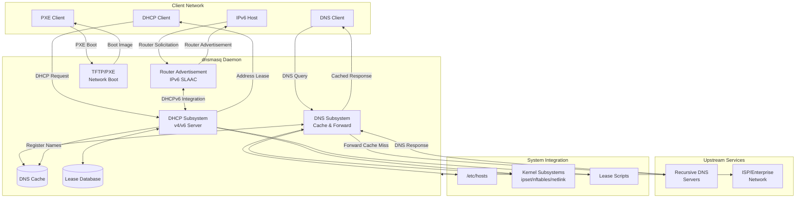

#### 1.2.2.2 Major System Components

The dnsmasq implementation comprises approximately 60 C source files organized into nine functional subsystems (`src/` folder analysis):

**Core Infrastructure Components** (`src/dnsmasq.c`, `src/dnsmasq.h`, `src/option.c`, `src/poll.c`): The core infrastructure provides the foundational runtime environment. `dnsmasq.c` implements the main orchestrator with an event-driven poll loop, daemonization logic, and signal handling for control operations. The global daemon state structure defined in `dnsmasq.h` (lines 1099-1250) serves as the runtime contract shared across all subsystems. Configuration parsing in `option.c` handles both command-line arguments and configuration file directives, while `poll.c` provides the event polling infrastructure that coordinates subsystem activities.

**DNS Core Components** (`src/rfc1035.c`, `src/cache.c`, `src/forward.c`, `src/auth.c`): The DNS subsystem implementation spans protocol handling (`rfc1035.c` and `dns-protocol.h`), caching with LRU eviction (`cache.c`), upstream transaction management (`forward.c`), and authoritative server capabilities (`auth.c`). Extended DNS options (EDNS0) are handled in `edns0.c`, while `loop.c` implements forwarding loop detection to prevent circular resolution attempts.

**DNSSEC and Cryptography Components** (`src/dnssec.c`, `src/crypto.c`): When DNSSEC validation is enabled (optional, requires nettle library), these components provide cryptographic validation of DNS responses and canonicalization of DNS records for signature verification. The crypto abstraction in `crypto.c` interfaces with libnettle for RSA, ECDSA, EdDSA, and GOST signature algorithms.

**DHCP Subsystem Components** (`src/dhcp.c`, `src/dhcp6.c`, `src/lease.c`): DHCP functionality divides into common functionality (`dhcp-common.c`), DHCPv4 implementation (`dhcp.c` and `rfc2131.c`), DHCPv6 implementation (`dhcp6.c` and `rfc3315.c`), and lease management with persistence (`lease.c`). The `outpacket.c` component handles DHCPv6 option assembly for outbound packets.

**IPv6 Support Components** (`src/radv.c`, `src/slaac.c`): Router advertisement functionality in `radv.c` implements the ICMPv6 router advertisement protocol, while `slaac.c` handles SLAAC address derivation and uniqueness checking to prevent address conflicts.

**Platform Network Integration Components** (`src/network.c`, `src/netlink.c`, `src/bpf.c`): Platform abstraction for network operations includes socket and listener management (`network.c`), Linux interface/address/route enumeration via netlink sockets (`netlink.c`), and BSD/Solaris interface enumeration via Berkeley Packet Filter (`bpf.c`). ARP and IPv6 neighbor cache interaction occurs in `arp.c`.

**Kernel Integration Components** (`src/ipset.c`, `src/nftset.c`, `src/tables.c`, `src/conntrack.c`): These optional components provide integration with kernel packet filtering and routing subsystems. Linux ipset integration (`ipset.c`) enables selective address addition to IP sets, nftables integration (`nftset.c`) provides similar functionality for nftables, BSD PF table integration occurs in `tables.c`, and Linux connection tracking mark propagation is handled by `conntrack.c`.

**Auxiliary Service Components** (`src/tftp.c`, `src/helper.c`, `src/dbus.c`, `src/ubus.c`): Auxiliary services include the built-in TFTP server (`tftp.c`), privileged helper process management for external scripts (`helper.c`), D-Bus control interface (`dbus.c`), and OpenWrt ubus control interface (`ubus.c`).

**Utility Components** (`src/util.c`, `src/log.c`, `src/metrics.c`, `src/inotify.c`, `src/dump.c`): Supporting utilities provide portable helper functions (`util.c`), asynchronous queued logging (`log.c`), metrics collection (`metrics.c`), Linux file monitoring via inotify (`inotify.c`), and packet capture in libpcap format (`dump.c`).

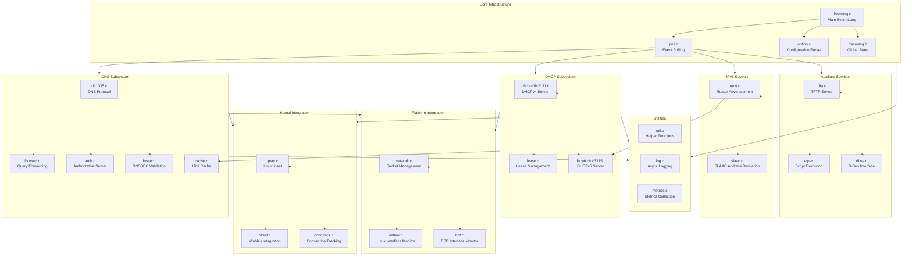

#### 1.2.2.3 Core Technical Approach

The dnsmasq architecture reflects deliberate design choices optimized for small-network deployment contexts:

**Event-Driven Single-Threaded Architecture**: The system implements an event-driven architecture using a single-threaded poll-based event loop (`src/dnsmasq.c:40-300`). This design choice eliminates threading complexity, reduces memory overhead, and ensures predictable behavior on resource-constrained platforms. The event loop coordinates DNS queries, DHCP transactions, router advertisements, and auxiliary services without requiring context switching overhead or thread synchronization primitives.

**Privilege Separation**: The daemon implements a privilege separation model where it starts as root to bind privileged ports (53 for DNS, 67/68 for DHCP), then drops privileges to run as an unprivileged user (default "nobody", configurable via `src/config.h:47-48`). This security-focused approach limits the attack surface by ensuring the main event loop operates with minimal privileges (`setup.html:24`).

**Modular Compile-Time Configuration**: Extensive use of compile-time feature flags in `src/config.h` enables tailoring the binary to specific deployment requirements. Features can be selectively enabled or disabled at compile time, allowing embedded system developers to minimize binary size and eliminate unnecessary functionality. Default configurations enable commonly used features (DNS, DHCP, TFTP, authoritative DNS, loop detection) while leaving advanced features (DNSSEC, D-Bus, Lua scripting) as optional components requiring explicit enablement and external libraries.

**Platform Abstraction**: Clear separation between platform-specific implementations (Linux netlink in `netlink.c`, BSD BPF in `bpf.c`, Solaris networking in platform-specific sections) and platform-independent logic ensures portability while enabling platform-specific optimizations. The build system automatically detects the target platform and selects appropriate implementations (`src/config.h:253-310`).

**Defensive Coding Practices**: The implementation emphasizes robustness through defensive programming including extensive validation macros, safe memory allocation wrappers that check for allocation failures, robust I/O wrappers that handle partial reads and writes, and careful boundary checking. This approach prioritizes correctness and stability over theoretical performance optimization, reflecting the reliability requirements of network infrastructure software.

**Signal-Based Control**: Runtime control uses UNIX signals for asynchronous operations: SIGHUP triggers configuration reload and DNS cache flush, SIGUSR1 dumps cache statistics and lease information for diagnostic purposes, and SIGTERM initiates clean shutdown with lease database synchronization. This signal-based approach provides administrative control without requiring complex IPC mechanisms.

**Integrated Subsystem Coordination**: Unlike systems that implement DNS and DHCP as independent daemons, dnsmasq integrates these services at the architectural level. DHCP lease allocations automatically register hostnames in the DNS cache, DHCPv6 integrates with router advertisements to coordinate managed vs. autonomous configuration, and lease-change events can trigger external scripts via the helper process. This tight integration eliminates synchronization challenges while reducing configuration complexity.

### 1.2.3 Success Criteria

#### 1.2.3.1 Measurable Objectives

The dnsmasq implementation establishes measurable objectives that define successful operation:

**Performance Objectives**: The system must maintain a minimal memory footprint suitable for embedded devices with limited RAM. Default configuration parameters target small-network scale: 150-entry DNS cache (`src/config.h:17`), 1000 maximum DHCP leases (`src/config.h:60`), 150 outstanding DNS requests (`src/config.h:17`), and 20 maximum TCP child processes (`src/config.h:17`). These parameters enable operation on systems with as little as 8-16 MB of total RAM while supporting typical small-network client counts.

**Reliability Objectives**: The software must operate continuously without intervention on resource-constrained platforms. This objective manifests in defensive coding practices, careful error handling, graceful degradation when resources become constrained, and clean recovery from transient network or system failures.

**Compatibility Objectives**: The system must maintain compatibility across diverse platforms including multiple Linux distributions (glibc and uclibc), BSD variants (FreeBSD, OpenBSD, NetBSD, DragonFly), macOS, Solaris, and Android (`src/config.h:253-310`). Build configurations must adapt automatically to platform capabilities while maintaining consistent behavior across platforms.

**Integration Objectives**: Core functionality must operate with zero mandatory external dependencies beyond standard C library (`src/config.h:173-174`). Optional features requiring external libraries must degrade gracefully when libraries are unavailable, and the system must integrate seamlessly with platform service frameworks (systemd, launchd, SMF, ubus).

#### 1.2.3.2 Critical Success Factors

Several critical factors determine the system's success in its target deployment contexts:

**Minimal External Dependencies**: The deliberate decision to require only standard C library for core functionality enables deployment on diverse platforms without dependency resolution challenges. This independence proves critical for embedded systems where minimizing software dependencies reduces both flash storage requirements and potential security vulnerabilities.

**Protocol Correctness**: Accurate implementation of DNS (RFC 1035 and extensions), DHCP (RFC 2131 for IPv4, RFC 3315 for IPv6), and IPv6 autoconfiguration protocols ensures interoperability with diverse client implementations and upstream infrastructure. Protocol correctness determines whether the system can serve as reliable network infrastructure.

**Security Posture**: For software operating at the network infrastructure layer with elevated privileges (even if temporarily), security correctness is paramount. The privilege separation model, defensive coding practices, and optional DNSSEC support collectively establish the security posture required for infrastructure deployment.

**Operational Simplicity**: Success in small-network deployments depends on operational simplicity. The integrated architecture (eliminating multi-daemon coordination), signal-based management (avoiding complex control protocols), and sensible defaults (enabling typical deployments with minimal configuration) determine whether administrators can successfully deploy and maintain the system.

**Community Ecosystem**: The thriving ecosystem reflected in widespread distribution inclusion, active maintenance, platform-specific integration contributions (visible in `contrib/` directory), and extensive deployment base provides the support infrastructure required for long-term success. This ecosystem ensures bug identification, platform compatibility maintenance, and continuous improvement.

## 1.3 Scope

### 1.3.1 In-Scope Elements

#### 1.3.1.1 Core Features and Functionalities

The following features constitute the core dnsmasq functionality, enabled by default and supported across all target platforms:

**DNS Services**: The DNS subsystem provides comprehensive name resolution capabilities including forwarding to upstream recursive resolvers with caching of common record types (A, AAAA, CNAME, PTR, DNSKEY, DS), local name resolution via `/etc/hosts` integration (`src/config.h:43`), automatic DNS registration for DHCP-allocated addresses, conditional forwarding supporting domain-specific upstream server selection for VPN and split-horizon scenarios, authoritative DNS mode for local zones with zone transfer support (HAVE_AUTH enabled by default, `src/config.h:180`), and loop detection preventing forwarding cycles (HAVE_LOOP enabled by default, `src/config.h:182`).

**DHCP Services**: The DHCP subsystem implements full DHCPv4 server functionality (HAVE_DHCP, `src/config.h:176`), full DHCPv6 server functionality including stateful and stateless modes (HAVE_DHCP6, `src/config.h:177`), static address reservations based on MAC address or client identifier, dynamic address allocation from configured pools, DHCP relay functionality for multi-subnet environments, lease management with persistent storage across daemon restarts, and BOOTP protocol support for legacy clients.

**Network Boot Services**: Network boot capabilities include integrated TFTP server operating in read-only mode for security (HAVE_TFTP enabled by default, `src/config.h:178`), full PXE server implementation supporting network boot, PXE boot menus enabling interactive boot selection, multi-architecture PXE support (x86, x86_64, ARM, etc.), and proxy PXE mode where dnsmasq provides PXE services while a separate DHCP server handles address allocation.

**IPv6 Support**: Comprehensive IPv6 capabilities span router advertisement (RA) transmission for host autoconfiguration, SLAAC (Stateless Address Autoconfiguration) address derivation, DHCPv6 stateless mode providing configuration parameters without address allocation, DHCPv6 stateful mode providing full address allocation, and integration between IPv4 DHCP and IPv6 RA/DHCPv6 for consistent naming.

**Script Integration**: External script execution capabilities include lease-change script invocation on DHCP events (HAVE_SCRIPT enabled by default, `src/config.h:179`), environment variable population with lease details for script consumption, and privileged helper process isolation for script execution security.

**Kernel Integration**: Platform-specific kernel integrations include Linux ipset integration for selective address set population (HAVE_IPSET enabled by default, `src/config.h:181`), packet capture and dump functionality in libpcap format (HAVE_DUMPFILE enabled by default, `src/config.h:183`), and netlink or BPF-based interface monitoring for dynamic network configuration.

#### 1.3.1.2 Implementation Boundaries

**Platform Support Matrix**: The system provides production-ready support for the following platforms, with platform detection and adaptation occurring automatically during build (`src/config.h:253-310`):

| Platform Category | Specific Platforms | Network Stack Implementation | Notes |
|------------------|-------------------|----------------------------|-------|
| Linux | glibc-based distributions, uclibc-based embedded systems | HAVE_LINUX_NETWORK (netlink) | Full feature support including ipset, inotify |
| BSD | FreeBSD, OpenBSD, NetBSD, DragonFly BSD | HAVE_BSD_NETWORK (BPF) | Full support, PF table integration available |
| Unix | macOS, Solaris | HAVE_BSD_NETWORK / HAVE_SOLARIS_NETWORK | Platform-specific adaptations, some features unavailable |
| Embedded | Android, OpenWrt | Platform-specific configurations | Custom paths, subset of features |

**User Group Coverage**: The implementation serves the following user communities:

- **Primary Users**: Network administrators deploying dnsmasq on firewall/router systems, embedded system developers integrating dnsmasq into appliance firmware, home network operators requiring simple integrated network services
- **Secondary Users**: Virtualization platform developers leveraging dnsmasq for VM networking, mobile platform developers implementing tethering features, distribution maintainers packaging dnsmasq

**Deployment Scale Boundaries**: Default configuration parameters establish operational boundaries appropriate for small-network deployments:

| Resource | Default Limit | Configuration Parameter | Rationale |
|----------|--------------|------------------------|-----------|
| DNS Cache Size | 150 entries | CACHESIZ (`src/config.h:17`) | Sufficient for typical home/small business |
| Max DHCP Leases | 1000 leases | MAXLEASES (`src/config.h:60`) | Appropriate for small network scale |
| Outstanding DNS Requests | 150 concurrent | FTABSIZ (`src/config.h:17`) | Balances memory usage with query load |
| TCP Child Processes | 20 processes | MAX_PROCS (`src/config.h:17`) | Limits resource consumption |

These defaults may be modified at compile time for specific deployment requirements, but represent the tested configuration for typical small-network deployments.

**Geographic and Localization Coverage**: The system provides global deployment support including internationalization framework via gettext (LOCALEDIR configuration, `Makefile:24`), optional internationalized domain name support requiring libidn2 (HAVE_IDN/HAVE_LIBIDN2, `src/config.h:189-190`), and UTF-8 encoding support for international character sets. No geographic restrictions or region-specific limitations exist in the core implementation.

**Data Domain Coverage**: The system manages the following data domains:

- **DNS Records**: Local and cached DNS resource records including A, AAAA, CNAME, PTR, DNSKEY, DS, and other common types
- **DHCP Leases**: DHCPv4 and DHCPv6 lease allocations with associated metadata (hostname, client identifier, hardware address)
- **Network Configuration**: Interface addresses and routes obtained from kernel networking subsystem
- **Boot Configuration**: TFTP file mappings and PXE boot menu definitions
- **Runtime Metrics**: Query statistics, cache performance, lease allocation metrics

### 1.3.2 Out-of-Scope Elements

#### 1.3.2.1 Excluded Features and Optional Components

The following features are explicitly excluded from default builds, requiring external libraries and explicit compile-time enablement:

**DNSSEC Validation**: Cryptographic validation of DNS responses requires nettle and hogweed cryptographic libraries and must be explicitly enabled via HAVE_DNSSEC (`src/config.h:198`). Without these libraries, DNS queries operate without cryptographic validation, suitable for trusted network environments but inappropriate for hostile network contexts.

**D-Bus Integration**: Runtime control and monitoring via D-Bus requires libdbus and explicit enablement via HAVE_DBUS (`src/config.h:193`). Without D-Bus support, administrative control occurs exclusively through configuration files and signal-based operations.

**OpenWrt ubus Integration**: Integration with OpenWrt's ubus system requires libubus and platform-specific enablement (HAVE_UBUS, `src/config.h:194`). This integration is specific to OpenWrt deployments and unavailable on standard platforms.

**Connection Tracking Integration**: Propagation of connection tracking marks from DNS queries to subsequent connections requires libnetfilter_conntrack on Linux (HAVE_CONNTRACK, `src/config.h:196`). This feature supports advanced firewall scenarios but is not required for standard network operation.

**nftables Integration**: Integration with nftables sets requires libnftables (HAVE_NFTSET, `src/config.h:199`). Systems using iptables-based firewalls or non-Linux platforms cannot use this integration.

**Lua Scripting**: Embedded Lua scripting for dynamic configuration requires lua5.2 library (HAVE_LUASCRIPT, `src/config.h:192`). Most deployments use static configuration or external script integration via lease-change scripts, making Lua optional.

**Internationalized Domain Names**: Full IDN support requires libidn2 (HAVE_LIBIDN2, `src/config.h:190`). Standard ASCII domain names operate without this library.

#### 1.3.2.2 Platform-Specific Limitations

Certain features exhibit platform-specific availability constraints:

**Asynchronous Logging**: Queued asynchronous logging is unavailable on Solaris (`src/dnsmasq.c:236`) and Android (`src/dnsmasq.c:241`) platforms, falling back to synchronous logging with potential performance implications.

**Dynamic Directory Monitoring**: File system monitoring via inotify for dynamic configuration updates operates only on Linux (`src/dnsmasq.c:191-193`). Other platforms require SIGHUP signals to reload configuration after file modifications.

**ipset Integration**: Linux-specific ipset integration is unavailable on BSD platforms (`src/config.h:287`) and macOS (`src/config.h:297`), which instead support PF table integration on applicable BSD variants.

**DHCP Range Constructors**: Automatic DHCP range construction from interface addresses requires Linux or BSD network stack features (`src/dnsmasq.c:298-300`). Platforms without these capabilities require explicit range configuration.

#### 1.3.2.3 Future Phase Considerations

The following capabilities fall outside current implementation scope but represent potential future enhancements:

**Enterprise Scale Features**: Large-scale deployment capabilities including database backends for lease storage (current implementation uses flat files), high-availability clustering and failover (current architecture is single-instance), distributed DNS resolution across multiple nodes, and centralized management of multiple dnsmasq instances exceed small-network scope but could support enterprise adoption.

**Advanced Integration Points**: Enterprise integration capabilities including RADIUS authentication for DHCP allocation decisions, LDAP or Active Directory integration for name resolution, SNMP monitoring (basic metrics exist in `metrics.c` but not SNMP export), and integration with enterprise logging/analytics platforms could extend deployment scenarios.

**Enhanced Security Features**: Additional security capabilities including DNS-over-TLS (DoT) or DNS-over-HTTPS (DoH) for upstream forwarding, certificate-based authentication for administrative interfaces, and cryptographic verification of configuration files could enhance security posture in hostile environments.

#### 1.3.2.4 Unsupported Use Cases

The system explicitly does not target the following use cases:

**Large Enterprise Networks**: Deployments requiring support for tens of thousands of DHCP leases, distributed DNS resolution across geographic regions, complex DHCP policy enforcement based on user identity or device posture, or integration with enterprise identity management systems exceed design parameters.

**High-Availability Critical Infrastructure**: Scenarios requiring sub-second failover, active-active clustering, or geographic redundancy fall outside the single-instance architecture. Networks requiring five-nines availability should deploy enterprise-grade infrastructure with redundancy.

**Complex Policy-Based Networking**: Advanced traffic shaping, quality-of-service (QoS) enforcement, or policy-based routing beyond basic domain-specific forwarding require dedicated policy enforcement systems.

**Compliance-Driven Environments**: Deployments requiring detailed audit logging, compliance reporting, or regulatory-mandated features (HIPAA, PCI-DSS) need enterprise solutions with comprehensive audit capabilities.

### 1.3.3 References

#### 1.3.3.1 Documentation Files
- `doc.html` - Comprehensive feature overview, licensing information, platform support matrix, and deployment scenarios
- `setup.html` - Installation procedures, operational guidelines, configuration examples, and troubleshooting guidance
- `dnsmasq.conf.example` - Complete configuration file documentation with usage examples and option descriptions

#### 1.3.3.2 Core Implementation Files
- `src/config.h` - Compile-time feature flags, platform detection, default parameters, and configuration paths
- `src/dnsmasq.h` - Global type definitions, daemon state structure (lines 1099-1250), and runtime contract
- `src/dnsmasq.c` - Main entry point, event loop implementation, signal handling, and daemon initialization
- `Makefile` - Build system configuration, external dependencies, platform-specific compiler flags

#### 1.3.3.3 Build Configuration Files
- `bld/Android.mk` - Android platform build configuration with platform-specific compiler flags
- `contrib/MacOSX-launchd/` - macOS launchd service integration examples
- `contrib/Solaris10/` - Solaris SMF service manifest
- `debian/` - Debian packaging configuration including D-Bus policy and tmpfiles definitions

#### 1.3.3.4 Source Code Directories
- `src/` - Complete C implementation spanning approximately 60 source files organized into functional subsystems (DNS core, DHCP, IPv6, platform integration, kernel integration, auxiliary services, utilities)
- `contrib/` - Platform-specific integration examples and administrative utilities

# 2. Product Requirements

## 2.1 Feature Catalog

### 2.1.1 Core Network Services Features

The following features constitute the essential network infrastructure capabilities that define dnsmasq's core value proposition. These features are enabled by default and provide the fundamental services required for small network operation.

#### 2.1.1.1 F-001: DNS Caching and Forwarding Service

**Feature Metadata**

| Attribute | Value |
|-----------|-------|
| **Feature ID** | F-001 |
| **Feature Name** | DNS Caching and Forwarding Service |
| **Category** | Core DNS Services |
| **Priority** | Critical |
| **Status** | Completed |
| **Default State** | Enabled |

**Description**

**Overview**: Provides caching DNS forwarding resolver optimized for small network environments. The service accepts DNS queries from local network clients, maintains a local cache of recent responses, and forwards cache misses to configured upstream recursive resolvers (`src/cache.c`, `src/forward.c`, `src/rfc1035.c`).

**Business Value**: Reduces DNS query latency by caching frequently accessed records locally, minimizes upstream bandwidth consumption, and provides centralized DNS control for local network policy enforcement.

**User Benefits**: End users experience faster DNS resolution for cached queries (sub-millisecond response times), improved reliability through local caching when upstream connectivity is intermittent, and simplified network configuration with automatic integration of DHCP-allocated hostnames.

**Technical Context**: Implemented as event-driven single-threaded architecture using poll-based event loop. Default cache size of 150 entries (`src/config.h:33`) provides sufficient capacity for typical small network usage patterns while maintaining minimal memory footprint. Supports common record types including A, AAAA, CNAME, PTR, DNSKEY, and DS records.

**Dependencies**

| Dependency Type | Details |
|----------------|---------|
| **Prerequisite Features** | None (core feature) |
| **System Dependencies** | Standard C library (libc) |
| **External Dependencies** | Upstream recursive DNS servers (typically ISP or public DNS) |
| **Integration Requirements** | Read access to `/etc/hosts` for local name resolution |

**Configuration Evidence**: Lines 7-46 in `dnsmasq.conf.example` document DNS service configuration including cache size, upstream server specification, and local domain handling.

#### 2.1.1.2 F-002: DHCPv4 Server

**Feature Metadata**

| Attribute | Value |
|-----------|-------|
| **Feature ID** | F-002 |
| **Feature Name** | DHCPv4 Server |
| **Category** | Network Services - DHCP |
| **Priority** | Critical |
| **Status** | Completed |
| **Default State** | Enabled (`HAVE_DHCP` in `src/config.h:176`) |

**Description**

**Overview**: Full-featured DHCPv4 server implementing RFC 2131 with support for static reservations, dynamic lease allocation, relay agent functionality, and advanced tag-based policy system (`src/dhcp.c`, `src/rfc2131.c`, `src/dhcp-common.c`).

**Business Value**: Eliminates manual IP address management overhead, reduces configuration errors through automated address allocation, and provides centralized network configuration management for IPv4 networks.

**User Benefits**: Zero-touch network configuration for client devices, consistent network parameter delivery (DNS servers, gateway, NTP servers), and flexible address allocation policies supporting both dynamic and reserved assignments.

**Technical Context**: Implements DHCP protocol state machine with DISCOVER, OFFER, REQUEST, ACK transaction flow. Includes ICMP address probing to detect conflicts before allocation, lease persistence across daemon restarts (`/var/lib/misc/dnsmasq.leases`), and tag-based filtering enabling sophisticated per-host and per-network option delivery.

**Dependencies**

| Dependency Type | Details |
|----------------|---------|
| **Prerequisite Features** | None |
| **System Dependencies** | Platform network stack (Linux netlink, BSD BPF, or Solaris) |
| **External Dependencies** | None |
| **Integration Requirements** | Network interface configuration, privileged port 67 access |

**Configuration Evidence**: Lines 162-308 in `dnsmasq.conf.example` provide comprehensive DHCPv4 configuration examples including range definitions, static hosts, and advanced options. Default maximum lease capacity of 1000 (`src/config.h:35`) supports typical small network requirements.

#### 2.1.1.3 F-003: DHCPv6 Server

**Feature Metadata**

| Attribute | Value |
|-----------|-------|
| **Feature ID** | F-003 |
| **Feature Name** | DHCPv6 Server |
| **Category** | Network Services - DHCP |
| **Priority** | High |
| **Status** | Completed |
| **Default State** | Enabled (`HAVE_DHCP6` in `src/config.h:177`) |

**Description**

**Overview**: RFC 3315 compliant DHCPv6 server supporting stateful address allocation (IA_NA), prefix delegation (IA_PD), stateless configuration parameter distribution, and DHCPv6 relay forwarding (`src/dhcp6.c`, `src/rfc3315.c`, `src/outpacket.c`).

**Business Value**: Enables IPv6 network operation with flexible configuration models ranging from fully autonomous SLAAC to centrally managed stateful allocation, supporting diverse network policies and client capabilities.

**User Benefits**: Full IPv6 address management with options for autonomous address configuration, DNS server advertisement via DHCPv6, and prefix delegation supporting hierarchical network architectures.

**Technical Context**: Integrates with Router Advertisement subsystem (F-004) to coordinate M (managed configuration) and O (other configuration) flags. DUID-based client identification provides stable client recognition across network changes. Default lease time of 24 hours (`src/config.h:46`) balances stability with address pool flexibility.

**Dependencies**

| Dependency Type | Details |
|----------------|---------|
| **Prerequisite Features** | F-002 (DHCPv4 Server) - build dependency (`src/config.h:329-331`) |
| **System Dependencies** | IPv6-enabled kernel and network stack |
| **External Dependencies** | None |
| **Integration Requirements** | IPv6 routing configuration, UDP port 547 access |

**Configuration Evidence**: Lines 191-227 in `dnsmasq.conf.example` document DHCPv6 range definitions, prefix delegation, and integration with router advertisements. Protocol implementation in `src/dhcp6-protocol.h` defines DHCPv6 message types and options.

#### 2.1.1.4 F-004: IPv6 Router Advertisement

**Feature Metadata**

| Attribute | Value |
|-----------|-------|
| **Feature ID** | F-004 |
| **Feature Name** | IPv6 Router Advertisement (SLAAC) |
| **Category** | Network Services - IPv6 |
| **Priority** | High |
| **Status** | Completed |
| **Default State** | Enabled with DHCPv6 |

**Description**

**Overview**: ICMPv6 Router Advertisement implementation supporting IPv6 Stateless Address Autoconfiguration (SLAAC) with RDNSS (Recursive DNS Server) and DNSSL (DNS Search List) options per RFC 6106 (`src/radv.c`, `src/slaac.c`).

**Business Value**: Enables standards-compliant IPv6 network bootstrapping without requiring DHCPv6 infrastructure, supporting both autonomous and managed configuration models through flexible M/O flag control.

**User Benefits**: Automatic IPv6 address configuration for clients supporting SLAAC, DNS server advertisement through router advertisements eliminating separate DHCPv6 requirement for basic connectivity, and seamless integration with DHCPv6 for hybrid configuration models.

**Technical Context**: Responds to Router Solicitation (RS) messages and transmits periodic unsolicited Router Advertisements. Coordinates with DHCPv6 server to set appropriate M (managed) and O (other configuration) flags based on network policy. RDNSS and DNSSL options advertise DNS configuration without requiring DHCPv6 stateless mode.

**Dependencies**

| Dependency Type | Details |
|----------------|---------|
| **Prerequisite Features** | F-003 (DHCPv6 Server) for integrated operation |
| **System Dependencies** | IPv6 kernel support, ICMPv6 raw socket capability |
| **External Dependencies** | None |
| **Integration Requirements** | Root privileges for raw socket creation, IPv6 forwarding enabled |

**Configuration Evidence**: Lines 195-227 in `dnsmasq.conf.example` document router advertisement configuration including prefix information, M/O flags, and RDNSS options. Protocol details in `src/radv-protocol.h`.

#### 2.1.1.5 F-009: Local Hosts Integration

**Feature Metadata**

| Attribute | Value |
|-----------|-------|
| **Feature ID** | F-009 |
| **Feature Name** | /etc/hosts Integration |
| **Category** | DNS Services - Name Resolution |
| **Priority** | High |
| **Status** | Completed |
| **Default State** | Enabled |

**Description**

**Overview**: Automatic DNS resolution from system hosts file with dynamic reload capability and domain expansion support. Provides familiar interface for static local name mappings without requiring separate DNS zone file configuration (`src/cache.c` functions: `read_hostsfile`, `add_hosts_entry`).

**Business Value**: Leverages existing system hosts file infrastructure, eliminates duplicate configuration of static host mappings, and provides zero-configuration local name resolution for network services.

**User Benefits**: Standard `/etc/hosts` file syntax familiar to all administrators, immediate name resolution for statically defined hosts, and automatic reload on SIGHUP signal without service interruption.

**Technical Context**: Hosts file entries are loaded into DNS cache at daemon startup and on configuration reload. Domain expansion applies configured domain suffix to unqualified hostnames. Multiple IP addresses per hostname and multiple names per IP address are supported consistent with standard hosts file semantics.

**Dependencies**

| Dependency Type | Details |
|----------------|---------|
| **Prerequisite Features** | F-001 (DNS Service) |
| **System Dependencies** | Filesystem access |
| **External Dependencies** | `/etc/hosts` file (default path: `src/config.h:43`) |
| **Integration Requirements** | Read permissions for hosts file |

**Configuration Evidence**: Lines 136-160 in `dnsmasq.conf.example` document hosts file integration including alternate hosts file locations, domain expansion, and reload behavior.

#### 2.1.1.6 F-010: DHCP-DNS Integration

**Feature Metadata**

| Attribute | Value |
|-----------|-------|
| **Feature ID** | F-010 |
| **Feature Name** | DHCP Lease to DNS Mapping |
| **Category** | Integration Features |
| **Priority** | Critical |
| **Status** | Completed |
| **Default State** | Enabled automatically with DHCP |

**Description**

**Overview**: Automatic registration of DHCP-allocated addresses in DNS cache enabling immediate name resolution for dynamically configured hosts. Provides seamless integration between address allocation and name resolution without external synchronization mechanisms (`src/cache.c` function: `cache_add_dhcp_entry`, DNS updates in `src/rfc2131.c` and `src/rfc3315.c`).

**Business Value**: Eliminates manual DNS record management for DHCP clients, ensures DNS consistency with actual address allocations, and provides unified name resolution for mixed static and dynamic host environments.

**User Benefits**: Immediate DNS availability for newly allocated addresses, consistent naming across IPv4 and IPv6 protocols, and zero-configuration name resolution for typical network clients.

**Technical Context**: DHCP lease events trigger real-time DNS cache updates. Hostnames from DHCP client requests are registered with allocated IP addresses. Lease expirations automatically remove corresponding DNS entries. Domain suffix configuration determines FQDN construction from DHCP hostnames.

**Dependencies**

| Dependency Type | Details |
|----------------|---------|
| **Prerequisite Features** | F-001 (DNS Service), F-002 or F-003 (DHCP services) |
| **System Dependencies** | None |
| **External Dependencies** | None |
| **Integration Requirements** | DHCP and DNS services both enabled |

**Configuration Evidence**: Domain suffix settings in `dnsmasq.conf.example` lines 143-160 control FQDN construction for DHCP-allocated hosts. Integration architecture documented in System Overview section 1.2.2.

### 2.1.2 Extended Services Features

These features extend core network services with specialized capabilities for network boot, security enhancement, and advanced DNS functionality. Features in this category may have external dependencies or operate on specific platforms.

#### 2.1.2.1 F-005: TFTP Server

**Feature Metadata**

| Attribute | Value |
|-----------|-------|
| **Feature ID** | F-005 |
| **Feature Name** | Built-in TFTP Server |
| **Category** | Network Boot Services |
| **Priority** | High |
| **Status** | Completed |
| **Default State** | Enabled (`HAVE_TFTP` in `src/config.h:178`) |

**Description**

**Overview**: Read-only TFTP server implementation supporting network boot scenarios with block size negotiation, transfer size option support, and security features including directory traversal prevention (`src/tftp.c`).

**Business Value**: Integrated file serving for PXE boot eliminates requirement for separate TFTP server infrastructure, simplifies network boot deployment, and provides security-hardened file access for boot images.

**User Benefits**: Single-daemon solution for complete network boot infrastructure, standard TFTP protocol compatibility with all PXE boot clients, and secure read-only operation preventing unauthorized file uploads.

**Technical Context**: Implements TFTP protocol per RFC 1350 with support for RFC 2348 (block size option) and RFC 2349 (transfer size option). Maximum 50 concurrent connections (`src/config.h:49`) balances resource consumption with typical boot load. Directory traversal prevention blocks "../" sequences in file paths.

**Dependencies**

| Dependency Type | Details |
|----------------|---------|
| **Prerequisite Features** | None |
| **System Dependencies** | Filesystem access to TFTP root directory |
| **External Dependencies** | Boot images and configuration files |
| **Integration Requirements** | UDP port 69 access, configured tftp-root directory |

**Configuration Evidence**: Lines 508-540 in `dnsmasq.conf.example` document TFTP server configuration including root directory, security options, and per-interface operation.

#### 2.1.2.2 F-006: PXE Boot Server

**Feature Metadata**

| Attribute | Value |
|-----------|-------|
| **Feature ID** | F-006 |
| **Feature Name** | PXE Network Boot Server |
| **Category** | Network Boot Services |
| **Priority** | High |
| **Status** | Completed |
| **Default State** | Enabled with DHCP |

**Description**

**Overview**: Full PXE server implementation with interactive boot menu support, multi-architecture capability (x86, x86-64, ARM, UEFI), and proxy-DHCP mode for integration with existing DHCP infrastructure. Handles PXE-specific DHCP options and coordinates with TFTP server for boot image delivery.

**Business Value**: Comprehensive network boot solution enabling diskless boot, OS installation over network, and rescue environment deployment without dedicated PXE server hardware.

**User Benefits**: Diskless workstation support, centralized boot image management, interactive boot menu for multiple boot options, and multi-architecture support for heterogeneous client environments.

**Technical Context**: Detects client architecture via DHCP option 93, delivers architecture-specific boot files, and supports PXE menu protocol for interactive boot selection. Proxy-DHCP mode coexists with external DHCP servers by providing only PXE-specific options. PXE handling implemented in `src/rfc2131.c` functions: `pxe_misc`, `pxe_opts`, `pxe_uefi_workaround`.

**Dependencies**

| Dependency Type | Details |
|----------------|---------|
| **Prerequisite Features** | F-002 (DHCPv4), F-005 (TFTP Server) |
| **System Dependencies** | Network interface configuration |
| **External Dependencies** | Boot images, configuration files in TFTP root |
| **Integration Requirements** | TFTP root directory with boot files, coordinated DHCP options |

**Configuration Evidence**: Lines 448-506 in `dnsmasq.conf.example` document PXE server configuration including boot file specifications, menu definitions, and proxy mode operation. Protocol definitions in `src/dhcp-protocol.h`.

#### 2.1.2.3 F-007: DNSSEC Validation

**Feature Metadata**

| Attribute | Value |
|-----------|-------|
| **Feature ID** | F-007 |
| **Feature Name** | DNSSEC Validation |
| **Category** | Security - DNS |
| **Priority** | Medium |
| **Status** | Completed |
| **Default State** | Disabled (optional feature requiring external libraries) |

**Description**

**Overview**: Cryptographic validation of DNS responses using DNSSEC signature verification, supporting RSA, ECDSA, EdDSA, and GOST signature algorithms. Protects against DNS spoofing and cache poisoning attacks through chain-of-trust validation from configured trust anchors (`src/dnssec.c`, `src/crypto.c`).

**Business Value**: Enhanced security posture through cryptographic verification of DNS responses, protection against DNS-based attacks in hostile network environments, and compliance with security policies requiring validated DNS.

**User Benefits**: Protection against DNS hijacking attacks, confidence in DNS response authenticity, and transparent security enhancement requiring no client-side changes.

**Technical Context**: Requires libnettle and libhogweed cryptographic libraries (`Makefile` lines 65-71). Trust anchor configuration typically uses root KSK from `trust-anchors.conf`. Validation adds latency (10-100ms per query) and increases cache memory consumption for DNSSEC records (RRSIG, DNSKEY, DS).

**Dependencies**

| Dependency Type | Details |
|----------------|---------|
| **Prerequisite Features** | F-001 (DNS Service) |
| **System Dependencies** | None |
| **External Dependencies** | libnettle (cryptographic library), libhogweed (DNSSEC support), optional: libgmp |
| **Integration Requirements** | Trust anchor configuration file, accurate system time for signature validation |

**Configuration Evidence**: Lines 23-34 in `dnsmasq.conf.example` document DNSSEC configuration including trust anchor specification and validation options. Configuration flag: `HAVE_DNSSEC` (`src/config.h:198`).

#### 2.1.2.4 F-008: Authoritative DNS Server

**Feature Metadata**

| Attribute | Value |
|-----------|-------|
| **Feature ID** | F-008 |
| **Feature Name** | Authoritative DNS Mode |
| **Category** | Core DNS Services |
| **Priority** | Medium |
| **Status** | Completed |
| **Default State** | Enabled (`HAVE_AUTH` in `src/config.h:180`) |

**Description**

**Overview**: Authoritative DNS server mode for local zones with zone transfer support (AXFR/IXFR) to secondary nameservers, SOA record management, and comprehensive control over local domain name resolution (`src/auth.c`).

**Business Value**: Local domain authority without external DNS provider dependency, offline operation capability for local network services, and full control over internal namespace including private addressing schemes.

**User Benefits**: Eliminates external DNS dependencies for local domains, supports secondary nameserver deployment for redundancy, and enables split-horizon DNS configurations for internal/external view separation.

**Technical Context**: Implements authoritative responses for configured zones with SOA records defining zone parameters. Default TTL of 600 seconds (`src/config.h:55`) balances cache efficiency with change propagation. Zone transfers to secondary nameservers use AXFR (full zone transfer) protocol. SOA defaults: Refresh 1200s, Retry 180s, Expiry 1209600s (`src/config.h:56-58`).

**Dependencies**

| Dependency Type | Details |
|----------------|---------|
| **Prerequisite Features** | F-001 (DNS Service) |
| **System Dependencies** | None |
| **External Dependencies** | None |
| **Integration Requirements** | Zone configuration, optional secondary nameserver addresses |

**Configuration Evidence**: Configuration flag `HAVE_AUTH` enabled by default (`src/config.h:180`). Zone configuration and SOA parameters documented in `dnsmasq.conf.example`.

#### 2.1.2.5 F-017: Loop Detection

**Feature Metadata**

| Attribute | Value |
|-----------|-------|
| **Feature ID** | F-017 |
| **Feature Name** | DNS Forwarding Loop Detection |
| **Category** | DNS Services - Reliability |
| **Priority** | Medium |
| **Status** | Completed |
| **Default State** | Enabled (`HAVE_LOOP` in `src/config.h:182`) |

**Description**

**Overview**: Automatic detection and prevention of DNS forwarding loops through test queries to reserved domain with response tracking. Prevents DNS query storms and service degradation in complex network topologies with multiple DNS forwarders (`src/loop.c`).

**Business Value**: Prevents DNS service degradation from misconfigurations, enables safe deployment in complex network topologies, and provides automatic protection against forwarding loop scenarios.

**User Benefits**: Reliable DNS operation immune to forwarding loop misconfigurations, automatic detection without manual intervention, and continued service availability when loops are detected.

**Technical Context**: Uses test queries to reserved "test" domain (RFC 2606 reserved, `src/config.h:59`) to detect forwarding loops. When loop is detected, affected upstream server is temporarily removed from forwarding pool to break the cycle.

**Dependencies**

| Dependency Type | Details |
|----------------|---------|
| **Prerequisite Features** | F-001 (DNS Service) |
| **System Dependencies** | None |
| **External Dependencies** | None |
| **Integration Requirements** | None |

**Configuration Evidence**: Feature enabled by default via `HAVE_LOOP` configuration flag (`src/config.h:182`). Implementation in `src/loop.c`.

### 2.1.3 Integration and Extensibility Features

These features enable integration with platform-specific subsystems, external control mechanisms, and extensibility frameworks. Features in this category are typically platform-dependent or require optional external libraries.

#### 2.1.3.1 F-011: Lease Scripts and Hooks

**Feature Metadata**

| Attribute | Value |
|-----------|-------|
| **Feature ID** | F-011 |
| **Feature Name** | DHCP Lease Change Scripts |
| **Category** | Extensibility - DHCP |
| **Priority** | Medium |
| **Status** | Completed |
| **Default State** | Enabled (`HAVE_SCRIPT` in `src/config.h:179`) |

**Description**

**Overview**: External script execution on DHCP lease events (add, delete, old) with privileged helper process isolation for security. Enables custom automation, dynamic firewall rule updates, and integration with external configuration management systems (`src/helper.c`, `src/lease.c`).

**Business Value**: Extensibility for site-specific automation requirements, integration with external systems without code modification, and support for custom lease processing workflows.

**User Benefits**: Trigger custom actions on lease allocation/renewal/expiration, integrate DHCP with external systems (DNS servers, firewalls, monitoring), and implement site-specific policies through scripting.

**Technical Context**: Scripts execute in privileged helper process isolated from main event loop. Script receives lease information through command-line arguments: operation ("add"/"del"/"old"), MAC address, IP address, hostname. Script execution is synchronous to ensure lease database consistency before script completes.

**Dependencies**

| Dependency Type | Details |
|----------------|---------|
| **Prerequisite Features** | F-002 or F-003 (DHCP services) |
| **System Dependencies** | Shell and script interpreter |
| **External Dependencies** | User-provided scripts |
| **Integration Requirements** | Execute permissions on script files, script must handle all lease operations |

**Configuration Evidence**: Line 572 in `dnsmasq.conf.example` documents script configuration. Script interface defined in `src/helper.c` with arguments documented in function `queue_script()`.

#### 2.1.3.2 F-012: Linux ipset Integration

**Feature Metadata**

| Attribute | Value |
|-----------|-------|
| **Feature ID** | F-012 |
| **Feature Name** | ipset Integration |
| **Category** | Kernel Integration - Linux |
| **Priority** | Medium |
| **Status** | Completed |
| **Default State** | Enabled on Linux (`HAVE_IPSET` in `src/config.h:181`) |

**Description**

**Overview**: Selective addition of resolved addresses to Linux ipsets based on domain matching rules. Enables policy-based routing, firewall rules, and traffic shaping based on DNS resolution results through kernel IP set manipulation via netlink (`src/ipset.c`).

**Business Value**: Dynamic firewall and routing policy based on DNS resolution, content filtering capabilities without proxy infrastructure, and bandwidth management for specific domains or service categories.

**User Benefits**: Policy-based routing for specific domains (e.g., route Netflix through specific gateway), dynamic firewall rules blocking or allowing resolved addresses, and traffic shaping based on domain categories without DPI.

**Technical Context**: Uses Linux netlink interface to manipulate kernel ipsets. Resolved addresses are added to configured ipsets based on domain matching patterns. Both IPv4 and IPv6 addresses supported. Integration with netfilter enables firewall rules referencing ipset membership.

**Dependencies**

| Dependency Type | Details |
|----------------|---------|
| **Prerequisite Features** | F-001 (DNS Service) |
| **System Dependencies** | Linux kernel with ipset support |
| **External Dependencies** | None (kernel feature) |
| **Integration Requirements** | Pre-configured ipsets in kernel, appropriate netfilter rules |

**Configuration Evidence**: Lines 84-86 in `dnsmasq.conf.example` document ipset configuration. Feature flag `HAVE_IPSET` (`src/config.h:181`), disabled on BSD (`src/config.h:287`) and macOS (`src/config.h:297`).

#### 2.1.3.3 F-013: nftables Integration

**Feature Metadata**

| Attribute | Value |
|-----------|-------|
| **Feature ID** | F-013 |
| **Feature Name** | nftables Set Integration |
| **Category** | Kernel Integration - Linux |
| **Priority** | Low |
| **Status** | Completed |
| **Default State** | Disabled (optional feature requiring libnftables) |

**Description**

**Overview**: Integration with nftables sets for resolved addresses, providing next-generation Linux firewall integration parallel to ipset functionality. Enables dynamic nftables ruleset population based on DNS resolution results (`src/nftset.c`).

**Business Value**: Modern Linux firewall integration supporting nftables (successor to iptables), advanced packet filtering capabilities, and consistent interface with current Linux networking subsystem direction.

**User Benefits**: Native nftables support without ipset translation layer, advanced filtering capabilities leveraging nftables features, and future-proof firewall integration aligned with Linux networking evolution.

**Technical Context**: Requires libnftables library (`Makefile` lines 73-74) for API access to kernel nftables subsystem. Addresses added to configured nftables sets based on domain matching patterns. Both IPv4 and IPv6 address families supported.

**Dependencies**

| Dependency Type | Details |
|----------------|---------|
| **Prerequisite Features** | F-001 (DNS Service) |
| **System Dependencies** | Linux kernel with nftables support |
| **External Dependencies** | libnftables library |
| **Integration Requirements** | nftables configured with appropriate sets, library installed |

**Configuration Evidence**: Lines 89-96 in `dnsmasq.conf.example` document nftables set configuration. Feature flag `HAVE_NFTSET` (`src/config.h:199`) requires explicit enablement.

#### 2.1.3.4 F-014: D-Bus Control Interface

**Feature Metadata**

| Attribute | Value |
|-----------|-------|
| **Feature ID** | F-014 |
| **Feature Name** | D-Bus Control and Monitoring |
| **Category** | Management Interfaces |
| **Priority** | Low |
| **Status** | Completed |
| **Default State** | Disabled (optional feature requiring libdbus) |

**Description**

**Overview**: Runtime control and configuration via D-Bus IPC mechanism enabling desktop integration, programmatic control, and dynamic reconfiguration without daemon restart. Provides system bus service with policy-based access control (`src/dbus.c`).

**Business Value**: Desktop environment integration for network configuration utilities, programmatic control for automation frameworks, and dynamic configuration changes without service interruption.

**User Benefits**: GUI integration for network management tools, scriptable control interface for automation, and real-time monitoring of daemon state and statistics.

**Technical Context**: Registers as D-Bus system bus service under name `uk.org.thekelleys.dnsmasq` (`src/config.h:52`). Requires libdbus-1 library (`Makefile` lines 54-55). D-Bus policy file (`dbus/dnsmasq.conf`) controls access permissions for method calls and property access.

**Dependencies**

| Dependency Type | Details |
|----------------|---------|
| **Prerequisite Features** | None |
| **System Dependencies** | D-Bus system bus daemon |
| **External Dependencies** | libdbus-1 library |
| **Integration Requirements** | D-Bus policy file installation, system bus access |

**Configuration Evidence**: Feature flag `HAVE_DBUS` (`src/config.h:193`) requires explicit enablement. D-Bus policy file in `dbus/dnsmasq.conf` defines access permissions.

#### 2.1.3.5 F-015: Internationalized Domain Names (IDN)

**Feature Metadata**

| Attribute | Value |
|-----------|-------|
| **Feature ID** | F-015 |
| **Feature Name** | IDN Support |
| **Category** | DNS Services - Internationalization |
| **Priority** | Low |
| **Status** | Completed |
| **Default State** | Disabled (optional feature requiring libidn2 or libidn) |

**Description**

**Overview**: Support for internationalized domain names with non-ASCII characters through IDNA (Internationalized Domain Names in Applications) encoding. Supports both IDNA2008 via libidn2 (preferred) and IDNA2003 via libidn for compatibility.

**Business Value**: Global DNS support for non-English domain names, compliance with modern internationalization standards, and support for local-language network naming.

**User Benefits**: Native language domain name support for users worldwide, seamless handling of Unicode domain names, and compatibility with internationalized TLDs.

**Technical Context**: IDN conversion implemented in `src/util.c`. IDNA2008 support via libidn2 library recommended for RFC compliance; legacy IDNA2003 support via libidn available for backward compatibility. UTF-8 locale support required for proper character encoding.

**Dependencies**

| Dependency Type | Details |
|----------------|---------|
| **Prerequisite Features** | F-001 (DNS Service) |
| **System Dependencies** | UTF-8 locale support |
| **External Dependencies** | libidn2 (IDNA2008) or libidn (IDNA2003) |
| **Integration Requirements** | Library installed, UTF-8 environment |

**Configuration Evidence**: Feature flags `HAVE_LIBIDN2` and `HAVE_IDN` (`src/config.h:189-190,194-195`) require explicit enablement. Build dependencies documented in `Makefile` lines 57-60.

#### 2.1.3.6 F-016: Connection Tracking Integration

**Feature Metadata**

| Attribute | Value |
|-----------|-------|
| **Feature ID** | F-016 |
| **Feature Name** | Conntrack Mark Propagation |
| **Category** | Kernel Integration - Linux |
| **Priority** | Low |
| **Status** | Completed |
| **Default State** | Disabled (optional feature requiring libnetfilter_conntrack) |

**Description**

**Overview**: Propagate Linux connection tracking marks from DNS queries to subsequent network connections from the same client. Enables advanced firewall and QoS scenarios where policy follows DNS resolution source (`src/conntrack.c`).

**Business Value**: Advanced policy enforcement scenarios, per-client or per-application QoS based on DNS query source, and sophisticated routing policies leveraging connection tracking infrastructure.

**User Benefits**: Traffic shaping based on originating user/application, policy routing per DNS query source, and advanced firewall scenarios with DNS-aware connection tracking.

**Technical Context**: Uses libnetfilter_conntrack (`Makefile` lines 61-62) to access Linux netfilter connection tracking subsystem. DNS query connection's mark is propagated to subsequent connections from same source address, enabling firewall rules to apply consistent policy.

**Dependencies**

| Dependency Type | Details |
|----------------|---------|
| **Prerequisite Features** | F-001 (DNS Service) |
| **System Dependencies** | Linux kernel with conntrack support |
| **External Dependencies** | libnetfilter_conntrack library |
| **Integration Requirements** | Conntrack kernel modules loaded, firewall rules using conntrack marks |

**Configuration Evidence**: Feature flag `HAVE_CONNTRACK` (`src/config.h:196`) requires explicit enablement.

#### 2.1.3.7 F-018: Packet Capture and Debugging

**Feature Metadata**

| Attribute | Value |
|-----------|-------|
| **Feature ID** | F-018 |
| **Feature Name** | Packet Dump Facility |
| **Category** | Debugging and Diagnostics |
| **Priority** | Low |
| **Status** | Completed |
| **Default State** | Enabled (`HAVE_DUMPFILE` in `src/config.h:183`) |

**Description**

**Overview**: Packet capture in libpcap format for protocol debugging and troubleshooting. Enables selective packet capture to file compatible with standard analysis tools like Wireshark and tcpdump (`src/dump.c`).

**Business Value**: Troubleshooting capability for protocol issues, standards compliance verification through packet analysis, and diagnostic data collection for issue reporting.

**User Benefits**: Standard pcap format analyzable with familiar tools, selective capture of DNS/DHCP traffic, and detailed protocol visibility for troubleshooting.

**Technical Context**: Captures packets to file in libpcap format compatible with tcpdump and Wireshark. Selective capture of DNS queries/responses and DHCP transactions reduces capture file size and focuses on relevant traffic.

**Dependencies**

| Dependency Type | Details |
|----------------|---------|
| **Prerequisite Features** | None |
| **System Dependencies** | Filesystem write access |
| **External Dependencies** | None (libpcap format, not library) |
| **Integration Requirements** | Writable capture file location |

**Configuration Evidence**: Feature flag `HAVE_DUMPFILE` (`src/config.h:183`) enabled by default.

#### 2.1.3.8 F-019: inotify File Monitoring

**Feature Metadata**

| Attribute | Value |
|-----------|-------|
| **Feature ID** | F-019 |
| **Feature Name** | Dynamic File Monitoring |
| **Category** | Platform Integration - Linux |
| **Priority** | Low |
| **Status** | Completed |
| **Default State** | Enabled on Linux |

**Description**

**Overview**: Automatic configuration reload on file changes using Linux inotify API. Eliminates need for manual SIGHUP signaling when configuration files are modified, providing responsive configuration updates (`src/inotify.c`).

**Business Value**: Reduced operational overhead through automatic configuration reload, responsive to configuration management system changes, and improved user experience with immediate effect of configuration edits.

**User Benefits**: Automatic reload on configuration file changes, no manual reload signaling required, and immediate configuration updates without service interruption.

**Technical Context**: Uses Linux inotify API (`src/config.h:138-139`) to monitor configuration files and directories for changes. File modification events trigger automatic reload equivalent to SIGHUP signal. Linux-specific feature unavailable on other platforms.

**Dependencies**

| Dependency Type | Details |
|----------------|---------|
| **Prerequisite Features** | None |
| **System Dependencies** | Linux kernel with inotify support |
| **External Dependencies** | None (kernel feature) |
| **Integration Requirements** | Linux platform |

**Configuration Evidence**: Feature flag `HAVE_INOTIFY` (`src/config.h:138-139`) automatically enabled on Linux. Implementation in `src/inotify.c`.

#### 2.1.3.9 F-020: Lua Scripting

**Feature Metadata**

| Attribute | Value |
|-----------|-------|
| **Feature ID** | F-020 |
| **Feature Name** | Lua Script Integration |
| **Category** | Extensibility |
| **Priority** | Low |
| **Status** | Completed |
| **Default State** | Disabled (optional feature requiring lua5.2) |

**Description**

**Overview**: Embedded Lua scripting for dynamic configuration and advanced event handling. Provides programmatic configuration capabilities beyond declarative configuration file syntax.

**Business Value**: Advanced automation scenarios requiring programmatic logic, dynamic configuration based on runtime conditions, and extensibility without C code modification.

**User Benefits**: Programmatic configuration enabling complex conditional logic, dynamic DHCP option generation, and custom event handling beyond shell script capabilities.

**Technical Context**: Embeds Lua 5.2 interpreter (`Makefile` lines 63-64) with hooks in helper process (`src/helper.c`). Lua scripts can intercept lease events and dynamically generate DHCP options. Implies `HAVE_SCRIPT` feature (`src/config.h:339-341`).

**Dependencies**

| Dependency Type | Details |
|----------------|---------|
| **Prerequisite Features** | F-011 (Script support) |
| **System Dependencies** | None |
| **External Dependencies** | lua5.2 library |
| **Integration Requirements** | Lua script files, library installed |

**Configuration Evidence**: Feature flag `HAVE_LUASCRIPT` (`src/config.h:192`) requires explicit enablement. Implies `HAVE_SCRIPT` automatically (`src/config.h:339-341`).

#### 2.1.3.10 F-021: OpenWrt ubus Integration

**Feature Metadata**

| Attribute | Value |
|-----------|-------|
| **Feature ID** | F-021 |
| **Feature Name** | ubus Control Interface |
| **Category** | Platform Integration - OpenWrt |
| **Priority** | Low |
| **Status** | Completed |
| **Default State** | Disabled (optional OpenWrt-specific feature) |

**Description**

**Overview**: OpenWrt ubus IPC integration providing native system integration for OpenWrt embedded Linux platform. Enables LuCI web interface compatibility and integration with OpenWrt system management (`src/ubus.c`).

**Business Value**: Native OpenWrt platform integration, LuCI web interface support, and consistent integration with OpenWrt system architecture.

**User Benefits**: Web-based configuration via LuCI, programmatic control via ubus CLI, and integration with OpenWrt network management framework.

**Technical Context**: Registers as ubus service under name "dnsmasq" (`src/config.h:54`). Requires libubus and libubox libraries (`Makefile` line 56). OpenWrt platform-specific feature unavailable on standard Linux distributions.

**Dependencies**

| Dependency Type | Details |
|----------------|---------|
| **Prerequisite Features** | None |
| **System Dependencies** | OpenWrt ubus system |
| **External Dependencies** | libubus, libubox libraries |
| **Integration Requirements** | OpenWrt platform |

**Configuration Evidence**: Feature flag `HAVE_UBUS` (`src/config.h:194`) requires explicit enablement on OpenWrt builds.

## 2.2 Functional Requirements

### 2.2.1 DNS Service Requirements

#### 2.2.1.1 Core DNS Resolution Requirements

| Requirement ID | Description | Acceptance Criteria | Priority |
|----------------|-------------|---------------------|----------|
| F-001-RQ-001 | Cache common DNS record types | A, AAAA, CNAME, PTR, DNSKEY, DS records successfully cached and returned from cache | Must-Have |
| F-001-RQ-002 | Forward cache misses upstream | Queries not in cache forwarded to configured recursive servers with response caching | Must-Have |
| F-001-RQ-003 | Configurable cache size | Cache size adjustable via --cache-size parameter, default 150 entries functional | Must-Have |
| F-001-RQ-004 | Honor TTL values | Cached entries expire according to upstream TTL values, configurable min/max TTL limits enforced | Must-Have |
| F-001-RQ-005 | LRU cache eviction | Least recently used entries evicted when cache reaches capacity | Must-Have |
| F-001-RQ-006 | SIGHUP cache management | SIGHUP signal clears cache and reloads configuration without service interruption | Must-Have |

**Technical Specifications**

| Parameter | Input | Output/Response | Performance Criteria |
|-----------|-------|-----------------|---------------------|
| Cache lookup | DNS query packet | Cached response or cache miss indication | < 1ms response time for cache hit |
| Cache insertion | DNS response from upstream | Cache entry created with TTL | O(1) insertion complexity |
| Cache size | Configuration parameter | Active cache size | Default 150, configurable to thousands |
| Concurrent queries | DNS queries from clients | Outstanding request tracking | Default 150 concurrent (FTABSIZ) |

**Validation Rules**

- **Business Rules**: Negative caching for NXDOMAIN responses reduces upstream query load; SOA minimum TTL controls negative cache duration
- **Data Validation**: DNS packet format validation per RFC 1035; reject malformed queries
- **Security Requirements**: DNSSEC validation when enabled (F-007); optional rebind protection rejects private addresses in public domain responses
- **Compliance Requirements**: RFC 1035 (DNS protocol), RFC 2308 (negative caching)

**Implementation Reference**: `src/cache.c` implements LRU cache with configurable size; `src/forward.c` handles upstream forwarding; `src/rfc1035.c` implements DNS protocol parsing and serialization.

#### 2.2.1.2 Domain-Specific Forwarding Requirements

| Requirement ID | Description | Acceptance Criteria | Priority |
|----------------|-------------|---------------------|----------|
| F-001-RQ-007 | Domain-specific upstream servers | Queries for configured domains forwarded to specific upstream servers | Should-Have |
| F-001-RQ-008 | Default upstream fallback | Queries not matching specific domains forwarded to default upstream servers | Must-Have |
| F-001-RQ-009 | Upstream server rotation | Failed upstream servers automatically rotated out with retry logic | Should-Have |
| F-001-RQ-010 | Local domain authority | Queries for local domains answered authoritatively without upstream forwarding | Should-Have |

**Technical Specifications**

| Parameter | Input | Output/Response | Performance Criteria |
|-----------|-------|-----------------|---------------------|
| Server selection | DNS query domain | Selected upstream server(s) | < 10ms server selection logic |
| Failover detection | Upstream query timeout | Server marked failed, retry scheduled | 3-second timeout default |
| VPN integration | Domain match pattern | VPN-specific upstream server selection | Supports split-horizon DNS |

**Validation Rules**

- **Business Rules**: VPN domains resolve through VPN-specific servers; corporate domains resolve through internal DNS
- **Data Validation**: Domain match patterns validated at configuration load; invalid patterns rejected
- **Security Requirements**: Prevent DNS leakage by ensuring VPN domains never query public servers
- **Compliance Requirements**: RFC 1034 (domain name concepts)

**Implementation Reference**: Configuration via `--server=/domain/ip` syntax documented in `dnsmasq.conf.example` lines 30-46; server selection logic in `src/forward.c`.

#### 2.2.1.3 Authoritative DNS Requirements (F-008)

| Requirement ID | Description | Acceptance Criteria | Priority |
|----------------|-------------|---------------------|----------|
| F-008-RQ-001 | Authoritative zone responses | Queries for configured zones answered authoritatively with AA flag set | Must-Have |
| F-008-RQ-002 | SOA record generation | SOA records generated with configurable parameters for authoritative zones | Must-Have |
| F-008-RQ-003 | Zone transfer (AXFR) support | Secondary nameservers can retrieve complete zone via AXFR | Should-Have |
| F-008-RQ-004 | Configurable TTL values | Per-zone TTL configuration with default 600 seconds | Should-Have |

**Technical Specifications**

| Parameter | Input | Output/Response | Performance Criteria |
|-----------|-------|-----------------|---------------------|
| Zone configuration | Zone name, SOA parameters | Authoritative zone loaded | Zone load at daemon startup |
| AXFR query | Zone transfer request from secondary | Complete zone transferred | Transfer time proportional to zone size |
| SOA defaults | None | Refresh 1200s, Retry 180s, Expiry 1209600s | Per `src/config.h:56-58` |

**Validation Rules**

- **Business Rules**: Only configured secondaries permitted to request zone transfers
- **Data Validation**: Zone data consistency validated at load time
- **Security Requirements**: Zone transfer ACL prevents unauthorized zone retrieval
- **Compliance Requirements**: RFC 1034, RFC 1035 (authoritative server), RFC 5936 (AXFR)

**Implementation Reference**: `src/auth.c` implements authoritative server; SOA defaults in `src/config.h:55-58`.

#### 2.2.1.4 DNSSEC Validation Requirements (F-007)

| Requirement ID | Description | Acceptance Criteria | Priority |
|----------------|-------------|---------------------|----------|
| F-007-RQ-001 | DNSSEC signature validation | DNSSEC-signed responses cryptographically validated against trust anchors | Must-Have |
| F-007-RQ-002 | Trust anchor management | Root KSK trust anchor loaded from configuration file | Must-Have |
| F-007-RQ-003 | Algorithm support | RSA, ECDSA, EdDSA, GOST signature algorithms validated | Must-Have |
| F-007-RQ-004 | Validation status reporting | DNSSEC validation status (secure/insecure/bogus) returned to clients | Should-Have |
| F-007-RQ-005 | SERVFAIL for bogus responses | Failed validation returns SERVFAIL to protect clients | Must-Have |

**Technical Specifications**

| Parameter | Input | Output/Response | Performance Criteria |
|-----------|-------|-----------------|---------------------|
| Signature validation | DNSSEC-signed response | Validation result (secure/insecure/bogus) | 10-100ms overhead per validation |
| Trust anchor | Configuration file | Root KSK loaded | Load at daemon startup |
| Chain validation | DNS response with RRSIG records | Complete chain-of-trust validation | Work limit: 50 queries per validation |

**Validation Rules**

- **Business Rules**: Unsigned domains treated as insecure (not bogus) unless DNSSEC required
- **Data Validation**: Signature expiration checked against current time
- **Security Requirements**: Time synchronization required; inaccurate clock breaks validation
- **Compliance Requirements**: RFC 4033, RFC 4034, RFC 4035 (DNSSEC protocol)

**Implementation Reference**: `src/dnssec.c` implements validation logic; `src/crypto.c` provides cryptographic primitives using libnettle; trust anchors in `trust-anchors.conf`.

### 2.2.2 DHCP Service Requirements

#### 2.2.2.1 DHCPv4 Core Requirements (F-002)

| Requirement ID | Description | Acceptance Criteria | Priority |
|----------------|-------------|---------------------|----------|
| F-002-RQ-001 | Dynamic lease allocation | IP addresses allocated from configured ranges with collision avoidance | Must-Have |
| F-002-RQ-002 | Static host reservations | MAC-to-IP bindings consistently honored for reserved addresses | Must-Have |
| F-002-RQ-003 | Lease persistence | Leases survive daemon restart via persistent lease database | Must-Have |
| F-002-RQ-004 | ICMP address probing | Optional ping test before allocation detects address conflicts | Should-Have |
| F-002-RQ-005 | Lease renewal handling | DHCP RENEW and REBIND requests properly processed extending lease lifetime | Must-Have |
| F-002-RQ-006 | DHCP options delivery | Standard options (gateway, DNS servers, NTP) correctly delivered to clients | Must-Have |

**Technical Specifications**

| Parameter | Input | Output/Response | Performance Criteria |
|-----------|-------|-----------------|---------------------|
| DISCOVER message | Client DHCP broadcast | OFFER message with available address | < 100ms including ICMP probe |
| REQUEST message | Client address selection | ACK message confirming allocation | < 50ms |
| Lease database | Filesystem | Persistent lease storage | Async write (configurable) |
| Max leases | Configuration | Default 1000, configurable | Per `src/config.h:35` |

**Validation Rules**

- **Business Rules**: Expired leases reclaimed for reallocation; graceful handling of lease exhaustion
- **Data Validation**: MAC address format validation; client-id verification
- **Security Requirements**: MAC spoofing mitigation via tag-based policies; rate limiting for DISCOVER floods
- **Compliance Requirements**: RFC 2131 (DHCP), RFC 2132 (DHCP options)

**Implementation Reference**: `src/dhcp.c` and `src/rfc2131.c` implement DHCPv4 protocol; `src/lease.c` manages lease database; protocol definitions in `src/dhcp-protocol.h`.

#### 2.2.2.2 DHCPv4 Advanced Requirements

| Requirement ID | Description | Acceptance Criteria | Priority |
|----------------|-------------|---------------------|----------|
| F-002-RQ-007 | Tag-based option filtering | Per-host and per-network DHCP options delivered via tag matching | Should-Have |
| F-002-RQ-008 | BOOTP protocol support | Legacy BOOTP clients receive address allocation | Could-Have |
| F-002-RQ-009 | Relay agent support | RFC 3046 relay agent information option correctly processed | Should-Have |
| F-002-RQ-010 | Vendor class matching | DHCP options filtered by vendor class identifier | Should-Have |

**Technical Specifications**

| Parameter | Input | Output/Response | Performance Criteria |
|-----------|-------|-----------------|---------------------|
| Tag matching | Client attributes (MAC, vendor class) | Matching tag set | < 10ms tag evaluation |
| Option filtering | Tag set, option database | Filtered option list | < 5ms option selection |
| Relay processing | DHCP relay packet | Options extracted, response routed | < 50ms relay handling |

**Validation Rules**

- **Business Rules**: Tag matching enables per-department or per-device-type policy enforcement
- **Data Validation**: Vendor class string validation; relay agent option parsing
- **Security Requirements**: Relay agent information option validation prevents spoofing
- **Compliance Requirements**: RFC 3046 (relay agent information option)

**Implementation Reference**: Tag-based filtering implemented in `src/rfc2131.c`; relay handling in `src/dhcp.c`.

#### 2.2.2.3 DHCPv6 Core Requirements (F-003)

| Requirement ID | Description | Acceptance Criteria | Priority |
|----------------|-------------|---------------------|----------|
| F-003-RQ-001 | Stateful DHCPv6 (IA_NA) | IPv6 addresses allocated via Identity Association for Non-temporary Addresses | Must-Have |
| F-003-RQ-002 | Stateless DHCPv6 | Configuration parameters delivered without address allocation | Must-Have |
| F-003-RQ-003 | Prefix delegation (IA_PD) | IPv6 prefixes delegated to downstream routers via Identity Association for Prefix Delegation | Should-Have |
| F-003-RQ-004 | DUID-based identification | Clients identified via DHCP Unique Identifier per RFC 3315 | Must-Have |
| F-003-RQ-005 | Relay forwarding | DHCPv6 relay messages correctly processed for multi-subnet environments | Should-Have |

**Technical Specifications**

| Parameter | Input | Output/Response | Performance Criteria |
|-----------|-------|-----------------|---------------------|
| SOLICIT message | Client DHCPv6 request | ADVERTISE with available address/prefix | < 100ms |
| REQUEST message | Client confirms allocation | REPLY with committed allocation | < 50ms |
| Default lease time | Configuration | 24 hours default | Per `src/config.h:46` |
| DUID generation | First startup | Server DUID persisted | Stable across restarts |

**Validation Rules**

- **Business Rules**: Prefix delegation supports hierarchical addressing; stateless mode supports SLAAC + configuration
- **Data Validation**: DUID format validation per RFC 3315; prefix length validation
- **Security Requirements**: DUID privacy considerations; address allocation rate limiting
- **Compliance Requirements**: RFC 3315 (DHCPv6), RFC 3633 (prefix delegation)

**Implementation Reference**: `src/dhcp6.c` and `src/rfc3315.c` implement DHCPv6 protocol; `src/outpacket.c` handles option assembly; protocol definitions in `src/dhcp6-protocol.h`.

#### 2.2.2.4 Router Advertisement Requirements (F-004)

| Requirement ID | Description | Acceptance Criteria | Priority |
|----------------|-------------|---------------------|----------|
| F-004-RQ-001 | Router solicitation response | ICMPv6 RS messages answered with RA | Must-Have |
| F-004-RQ-002 | Periodic unsolicited RA | RAs transmitted at configured intervals (200-600s randomized) | Must-Have |
| F-004-RQ-003 | Prefix information options | On-link prefixes advertised with valid/preferred lifetimes | Must-Have |
| F-004-RQ-004 | RDNSS option (RFC 6106) | Recursive DNS servers advertised in RA | Should-Have |
| F-004-RQ-005 | DNSSL option (RFC 6106) | DNS search list advertised in RA | Should-Have |
| F-004-RQ-006 | M/O flag configuration | Managed (M) and Other (O) flags set per DHCPv6 configuration | Must-Have |

**Technical Specifications**

| Parameter | Input | Output/Response | Performance Criteria |
|-----------|-------|-----------------|---------------------|
| RS receipt | ICMPv6 Router Solicitation | RA transmission | < 50ms response time |
| RA interval | Configuration | Randomized 200-600s | RFC-compliant randomization |
| Prefix lifetime | Configuration | Valid and preferred lifetimes | Coordinated with DHCPv6 |

**Validation Rules**

- **Business Rules**: M flag directs clients to DHCPv6 stateful; O flag directs to DHCPv6 stateless
- **Data Validation**: Prefix length validation; lifetime consistency checks
- **Security Requirements**: RA guard considerations; SEND not implemented
- **Compliance Requirements**: RFC 4861 (neighbor discovery), RFC 6106 (RDNSS/DNSSL)

**Implementation Reference**: `src/radv.c` implements router advertisement; `src/slaac.c` handles address derivation; protocol definitions in `src/radv-protocol.h`.

#### 2.2.2.5 Lease-Script Integration Requirements (F-011)

| Requirement ID | Description | Acceptance Criteria | Priority |
|----------------|-------------|---------------------|----------|
| F-011-RQ-001 | Script execution on lease events | Configured script executed on add/delete/old lease events | Must-Have |
| F-011-RQ-002 | Lease information passing | Script receives operation, MAC, IP, hostname as arguments | Must-Have |
| F-011-RQ-003 | Environment variable population | Additional lease details available via environment variables | Should-Have |
| F-011-RQ-004 | Synchronous execution | Lease database committed only after script completion | Must-Have |

**Technical Specifications**

| Parameter | Input | Output/Response | Performance Criteria |
|-----------|-------|-----------------|---------------------|
| Script invocation | Lease event | Script exit code | Synchronous execution blocks lease commit |
| Arguments | add/del/old, MAC, IP, hostname | Script receives via argv | Per `src/helper.c` interface |
| Helper process | Privileged isolation | Secure script execution environment | Fork/exec model |

**Validation Rules**

- **Business Rules**: Script failures logged but don't block lease allocation
- **Data Validation**: Script path and permissions validated at startup
- **Security Requirements**: Privileged helper process isolation; script runs as configured user
- **Compliance Requirements**: None (extension mechanism)

**Implementation Reference**: `src/helper.c` implements privileged helper process; script interface documented in configuration line 572 `dnsmasq.conf.example`.

### 2.2.3 Network Boot Requirements

#### 2.2.3.1 TFTP Server Requirements (F-005)

| Requirement ID | Description | Acceptance Criteria | Priority |
|----------------|-------------|---------------------|----------|
| F-005-RQ-001 | Read-only file serving | Files served from configured tftp-root directory | Must-Have |
| F-005-RQ-002 | Block size negotiation | RFC 2348 blksize option negotiated with clients | Should-Have |
| F-005-RQ-003 | Transfer size option | RFC 2349 tsize option supported | Should-Have |
| F-005-RQ-004 | Directory traversal prevention | "../" sequences in file paths blocked | Must-Have |
| F-005-RQ-005 | World-readable file check | Optional enforcement of world-readable permission requirement | Should-Have |
| F-005-RQ-006 | Per-interface operation | Interface-specific tftp root directories supported | Could-Have |

**Technical Specifications**

| Parameter | Input | Output/Response | Performance Criteria |
|-----------|-------|-----------------|---------------------|
| TFTP RRQ | Read request for file | File transfer initiated or error | < 50ms request processing |
| Block size | Client blksize option | Negotiated block size (512 - MTU) | Default 512 bytes |
| Max connections | Configuration | 50 concurrent transfers | Per `src/config.h:49` |

**Validation Rules**

- **Business Rules**: Read-only prevents unauthorized file uploads
- **Data Validation**: File path validation; permission checks
- **Security Requirements**: Directory traversal prevention; optional world-readable check prevents accidental exposure
- **Compliance Requirements**: RFC 1350 (TFTP), RFC 2347 (option extension), RFC 2348 (blksize), RFC 2349 (tsize)

**Implementation Reference**: `src/tftp.c` implements TFTP server; configuration documented in `dnsmasq.conf.example` lines 508-540.

#### 2.2.3.2 PXE Boot Requirements (F-006)

| Requirement ID | Description | Acceptance Criteria | Priority |
|----------------|-------------|---------------------|----------|
| F-006-RQ-001 | Architecture detection | Client architecture detected via DHCP option 93 | Must-Have |
| F-006-RQ-002 | Multi-architecture support | x86, x86-64, ARM, UEFI clients receive appropriate boot files | Must-Have |
| F-006-RQ-003 | Boot menu support | Interactive PXE menu presented to clients | Should-Have |
| F-006-RQ-004 | Proxy DHCP mode | PXE services provided without address allocation (proxy mode) | Should-Have |
| F-006-RQ-005 | Vendor class matching | Boot options filtered by PXE vendor class | Should-Have |

**Technical Specifications**

| Parameter | Input | Output/Response | Performance Criteria |
|-----------|-------|-----------------|---------------------|
| PXE request | DHCP request with PXE options | PXE-enhanced DHCP offer | < 100ms with architecture detection |
| Boot menu | PXE menu request | Menu list transmission | < 50ms menu delivery |
| Architecture code | DHCP option 93 | Boot file path selection | Per-architecture mapping |

**Validation Rules**

- **Business Rules**: Architecture detection enables heterogeneous client environment support
- **Data Validation**: Architecture code validation; boot file existence check
- **Security Requirements**: Boot file path validation prevents directory traversal
- **Compliance Requirements**: PXE specification v2.1

**Implementation Reference**: PXE handling in `src/rfc2131.c` functions `pxe_misc`, `pxe_opts`, `pxe_uefi_workaround`; configuration in `dnsmasq.conf.example` lines 448-506.

### 2.2.4 Security and Integration Requirements

#### 2.2.4.1 DHCP-DNS Integration Requirements (F-010)

| Requirement ID | Description | Acceptance Criteria | Priority |
|----------------|-------------|---------------------|----------|
| F-010-RQ-001 | Automatic DNS registration | DHCP-allocated addresses immediately resolvable via DNS | Must-Have |
| F-010-RQ-002 | Hostname from DHCP | Client-supplied hostnames registered in DNS cache | Must-Have |
| F-010-RQ-003 | Domain suffix expansion | Hostnames expanded to FQDN using configured domain | Should-Have |
| F-010-RQ-004 | Lease expiration cleanup | DNS entries removed when DHCP leases expire | Must-Have |
| F-010-RQ-005 | IPv4/IPv6 consistency | Consistent hostnames across IPv4 and IPv6 allocations | Should-Have |

**Technical Specifications**

| Parameter | Input | Output/Response | Performance Criteria |
|-----------|-------|-----------------|---------------------|
| Lease allocation | DHCP lease assigned | DNS cache entry added | < 10ms cache update |
| DNS query | Query for DHCP-allocated name | A/AAAA record response | Sub-millisecond cache lookup |
| Lease expiration | Lease expires | DNS cache entry removed | Immediate cache cleanup |

**Validation Rules**

- **Business Rules**: DNS updates synchronized with lease database for consistency
- **Data Validation**: Hostname validation per DNS standards; invalid characters rejected
- **Security Requirements**: DNS cache poisoning prevention; only DHCP-server-allocated addresses registered
- **Compliance Requirements**: RFC 1035 (DNS), RFC 2131 (DHCP)

**Implementation Reference**: Integration in `src/cache.c` function `cache_add_dhcp_entry`; DNS updates in `src/rfc2131.c` and `src/rfc3315.c`.

#### 2.2.4.2 Kernel Integration Requirements (F-012, F-013)

| Requirement ID | Description | Acceptance Criteria | Priority |
|----------------|-------------|---------------------|----------|
| F-012-RQ-001 | ipset address addition | Resolved addresses added to configured ipsets based on domain patterns | Must-Have |
| F-012-RQ-002 | IPv4/IPv6 support | Both address families added to appropriate ipsets | Must-Have |
| F-013-RQ-001 | nftables set addition | Resolved addresses added to nftables sets | Must-Have |
| F-013-RQ-002 | Table/set specification | Specific nftables table and set names configurable | Must-Have |

**Technical Specifications**

| Parameter | Input | Output/Response | Performance Criteria |
|-----------|-------|-----------------|---------------------|
| Domain match | DNS response | Address added to kernel set | < 5ms kernel operation |
| Netlink communication | Kernel netlink socket | ipset update command | Asynchronous operation |
| Set specification | Configuration | table/family/set triple | Per nftables namespace |

**Validation Rules**

- **Business Rules**: Domain patterns enable policy routing and firewall rules based on DNS
- **Data Validation**: Set existence validation at configuration load
- **Security Requirements**: Netlink permission requirements; CAP_NET_ADMIN capability
- **Compliance Requirements**: Linux netlink protocol

**Implementation Reference**: `src/ipset.c` implements ipset integration; `src/nftset.c` implements nftables integration; configuration in `dnsmasq.conf.example` lines 84-96.

## 2.3 Feature Relationships and Dependencies

### 2.3.1 Core Dependency Map

The following diagram illustrates the dependency relationships between dnsmasq features, showing how features build upon one another to provide integrated network services.

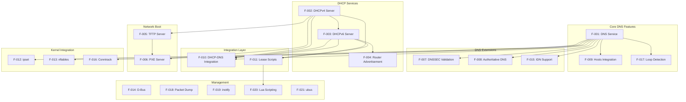

### 2.3.2 Feature Dependency Table

| Feature | Direct Prerequisites | Optional Enhancements | External Dependencies | Platform Constraints |
|---------|---------------------|----------------------|----------------------|---------------------|
| F-001 (DNS) | None | F-007, F-008, F-015 | Upstream DNS servers | All platforms |
| F-002 (DHCPv4) | None | F-005, F-006, F-011 | None | All platforms |
| F-003 (DHCPv6) | F-002 (build) | F-004, F-011 | None | All platforms |
| F-004 (Router Advert) | F-003 | None | None | All platforms |
| F-005 (TFTP) | None | F-006 | None | All platforms |
| F-006 (PXE) | F-002, F-005 | None | Boot images | All platforms |
| F-007 (DNSSEC) | F-001 | None | libnettle, libhogweed | All platforms |
| F-008 (Auth DNS) | F-001 | None | None | All platforms |
| F-009 (Hosts) | F-001 | None | /etc/hosts | All platforms |
| F-010 (Integration) | F-001, F-002/F-003 | None | None | All platforms |
| F-011 (Scripts) | F-002 or F-003 | F-020 | Shell/interpreter | All platforms |
| F-012 (ipset) | F-001 | None | Kernel ipset | Linux only |
| F-013 (nftables) | F-001 | None | libnftables | Linux only |
| F-014 (D-Bus) | None | None | libdbus-1 | Linux, BSD, macOS |
| F-015 (IDN) | F-001 | None | libidn2 or libidn | All platforms |
| F-016 (Conntrack) | F-001 | None | libnetfilter_conntrack | Linux only |
| F-017 (Loop Detect) | F-001 | None | None | All platforms |
| F-018 (Packet Dump) | None | None | None | All platforms |
| F-019 (inotify) | None | None | Kernel inotify | Linux only |
| F-020 (Lua) | F-011 | None | lua5.2 | All platforms |
| F-021 (ubus) | None | None | libubus, libubox | OpenWrt only |

### 2.3.3 Platform Feature Matrix

The following matrix documents feature availability across supported platforms, reflecting platform-specific capabilities and constraints.

| Feature | Linux | FreeBSD | OpenBSD | NetBSD | macOS | Solaris | Android |
|---------|:-----:|:-------:|:-------:|:------:|:-----:|:-------:|:-------:|
| **Core Services** |
| F-001 DNS | ✓ | ✓ | ✓ | ✓ | ✓ | ✓ | ✓ |
| F-002 DHCPv4 | ✓ | ✓ | ✓ | ✓ | ✓ | ✓ | ✓ |
| F-003 DHCPv6 | ✓ | ✓ | ✓ | ✓ | ✓ | ✓ | ✓ |
| F-004 Router Advert | ✓ | ✓ | ✓ | ✓ | ✓ | ✓ | ✓ |
| F-005 TFTP | ✓ | ✓ | ✓ | ✓ | ✓ | ✓ | ✓ |
| F-006 PXE | ✓ | ✓ | ✓ | ✓ | ✓ | ✓ | ✓ |
| **Security Extensions** |
| F-007 DNSSEC | ✓ | ✓ | ✓ | ✓ | ✓ | ✓ | ✓ |
| F-008 Auth DNS | ✓ | ✓ | ✓ | ✓ | ✓ | ✓ | ✓ |
| F-017 Loop Detect | ✓ | ✓ | ✓ | ✓ | ✓ | ✓ | ✓ |
| **Integration Features** |
| F-009 Hosts | ✓ | ✓ | ✓ | ✓ | ✓ | ✓ | ✓ |
| F-010 DHCP-DNS | ✓ | ✓ | ✓ | ✓ | ✓ | ✓ | ✓ |
| F-011 Lease Scripts | ✓ | ✓ | ✓ | ✓ | ✓ | ✓ | ✓ |
| F-015 IDN | ✓ | ✓ | ✓ | ✓ | ✓ | ✓ | ✓ |
| **Kernel Integration** |
| F-012 ipset | ✓ | ✗ | ✗ | ✗ | ✗ | ✗ | ✓ |
| F-013 nftables | ✓ | ✗ | ✗ | ✗ | ✗ | ✗ | ✓ |
| F-016 Conntrack | ✓ | ✗ | ✗ | ✗ | ✗ | ✗ | ✓ |
| **Platform-Specific** |
| F-014 D-Bus | ✓ | ✓ | ✓ | ✓ | ✓ | ✓ | ✗ |
| F-018 Packet Dump | ✓ | ✓ | ✓ | ✓ | ✓ | ✓ | ✓ |
| F-019 inotify | ✓ | ✗ | ✗ | ✗ | ✗ | ✗ | ✓ |
| F-020 Lua | ✓ | ✓ | ✓ | ✓ | ✓ | ✓ | ✓ |
| F-021 ubus | OpenWrt | ✗ | ✗ | ✗ | ✗ | ✗ | ✗ |

**Platform Notes:**
- **Linux**: Full feature support including kernel-specific integrations (ipset, nftables, conntrack, inotify)
- **BSD Variants**: Core services fully supported; PF table integration available as alternative to ipset (`src/tables.c`)
- **macOS**: Core services supported; some features disabled due to platform limitations (`src/config.h:287,297`)
- **Solaris**: Core services supported with platform-specific network stack integration (`HAVE_SOLARIS_NETWORK`)
- **Android**: Core services plus Linux kernel integrations; D-Bus unavailable; custom paths for Android filesystem

### 2.3.4 Integration Points and Shared Components

#### 2.3.4.1 DNS-DHCP Integration Architecture

The integration between DNS and DHCP services represents a core architectural strength, eliminating synchronization challenges through shared cache infrastructure.

**Integration Mechanism:**
- DHCP lease allocation directly updates DNS cache via `cache_add_dhcp_entry()` function
- Lease expirations trigger DNS cache entry removal ensuring consistency
- Hostname validation ensures DNS-compliant names from DHCP clients
- Domain suffix expansion creates FQDNs from simple hostnames

**Shared Components:**
- DNS cache structure (`src/cache.c`) stores both DNS query results and DHCP-allocated names
- Global daemon state (`src/dnsmasq.h` lines 1099-1250) coordinates subsystem operations
- Event loop (`src/dnsmasq.c`) dispatches events to both DNS and DHCP handlers

#### 2.3.4.2 DHCPv6-Router Advertisement Integration

DHCPv6 and Router Advertisement subsystems coordinate to provide flexible IPv6 configuration models.

**Integration Mechanism:**
- Router Advertisements set M (managed) and O (other) flags based on DHCPv6 configuration
- SLAAC prefix information coordinates with DHCPv6 address ranges
- RDNSS options in RA can satisfy DNS server advertisement without DHCPv6

**Coordination Points:**
- DHCPv6 contexts define stateful/stateless operation mode
- Router Advertisement flags reflect DHCPv6 availability and mode
- Hostname consistency maintained across SLAAC and DHCPv6-allocated addresses

#### 2.3.4.3 DHCP-TFTP-PXE Integration

Network boot services integrate DHCP address allocation, TFTP file serving, and PXE boot protocol.

**Integration Mechanism:**
- PXE-enhanced DHCP responses include next-server (TFTP) and boot filename options
- Architecture detection from DHCP option 93 selects appropriate boot file
- TFTP server coordinates with PXE server for boot image delivery

**Boot Flow:**
1. Client broadcasts DHCP DISCOVER with PXE options
2. DHCP server responds with address allocation and PXE boot parameters
3. Client requests boot file via TFTP from specified next-server
4. TFTP server delivers boot image from configured tftp-root

**Shared Components:**
- Tag-based filtering in DHCP applies to PXE options
- Single configuration defines DHCP, TFTP, and PXE parameters
- Event loop coordinates DHCP and TFTP protocol handling

#### 2.3.4.4 Platform Network Stack Integration

Platform-specific network stack integration provides portability while leveraging platform capabilities.

**Linux Integration:**
- Netlink sockets (`src/netlink.c`) enumerate interfaces, addresses, routes
- inotify (`src/inotify.c`) monitors configuration file changes
- ipset netlink interface (`src/ipset.c`) manipulates kernel IP sets
- Connection tracking (`src/conntrack.c`) via libnetfilter_conntrack

**BSD Integration:**
- Berkeley Packet Filter (`src/bpf.c`) enumerates interfaces and addresses
- PF table integration (`src/tables.c`) provides ipset-equivalent functionality
- Platform-specific ioctl calls for interface configuration

**Solaris Integration:**
- Platform-specific network enumeration (`HAVE_SOLARIS_NETWORK`)
- Solaris-specific socket options and ioctl commands

**Abstraction Layer:**
- Common interface in `src/network.c` abstracts platform differences
- Conditional compilation (`src/config.h:253-310`) selects platform implementation
- Consistent behavior across platforms despite implementation differences

## 2.4 Implementation Considerations

### 2.4.1 Performance Requirements and Constraints

#### 2.4.1.1 Resource Consumption Targets

| Resource | Target | Configuration Parameter | Rationale |
|----------|--------|------------------------|-----------|
| Memory Footprint | < 4 MB resident | Compile-time features | Embedded system compatibility |
| DNS Cache | 150 entries default | CACHESIZ (`src/config.h:33`) | Small network adequacy |
| DHCP Leases | 1000 max default | MAXLEASES (`src/config.h:35`) | Small network scale |
| Outstanding DNS | 150 concurrent | FTABSIZ (`src/config.h:17`) | Balance memory and load |
| TCP Processes | 20 max | MAX_PROCS (`src/config.h:17`) | Limit resource consumption |
| TFTP Connections | 50 max | `src/config.h:49` | Boot load capacity |

**Scalability Boundaries:**
- Target deployment: Networks with < 250 active hosts
- DNS query rate: < 100 queries/second sustained
- DHCP allocation rate: < 50 allocations/minute
- TFTP boot rate: < 10 simultaneous boots

**Performance Optimization Strategies:**
- Single-threaded event loop eliminates context switching overhead
- LRU cache eviction provides O(1) cache operations
- Asynchronous lease database writes prevent I/O blocking
- Pre-allocated buffer pools reduce memory allocation overhead

#### 2.4.1.2 Response Time Requirements

| Operation | Target Response Time | Measurement Point | Acceptance Criteria |
|-----------|---------------------|-------------------|---------------------|
| DNS cache hit | < 1 ms | Query receipt to response transmission | 95th percentile |
| DNS cache miss | < 10 ms overhead | Forwarding overhead excluding upstream latency | Mean |
| DHCP allocation | < 100 ms | DISCOVER to ACK including ICMP probe | 95th percentile |
| DHCP renewal | < 50 ms | REQUEST to ACK | 95th percentile |
| TFTP block transfer | < 50 ms | Request to first data block | Mean |
| Router Advertisement | < 50 ms | RS to RA transmission | 95th percentile |

**Performance Monitoring:**
- SIGUSR1 dumps performance statistics to syslog
- Metrics collection in `src/metrics.c` tracks query counts and latencies
- Packet dump facility (`src/dump.c`) enables detailed protocol analysis

#### 2.4.1.3 Concurrency and Load Handling

**Event Loop Architecture:**
- Single-threaded poll-based event loop (`src/poll.c`)
- Non-blocking I/O for all network operations
- Event priorities ensure responsive handling of critical operations

**Request Queuing:**
- DNS: Outstanding requests limited to FTABSIZ (150 default)
- DHCP: No artificial limits; natural protocol rate limiting
- TFTP: Connection limit (50) prevents resource exhaustion

**Resource Limits:**
- File descriptor limits: Configured via ulimit, typically 1024
- Process limits: TCP child processes limited to MAX_PROCS (20)
- Memory limits: No hard limits; scales with cache and lease counts

### 2.4.2 Security Considerations

#### 2.4.2.1 Attack Surface Mitigation

| Attack Vector | Mitigation Strategy | Implementation | Effectiveness |
|---------------|---------------------|----------------|---------------|
| DNS amplification | Source address validation, rate limiting | Query source validation | High |
| DNS cache poisoning | DNSSEC validation (optional), port randomization | F-007 when enabled | High with DNSSEC |
| DHCP exhaustion | Lease limits, conflict detection | Max lease enforcement | Medium |
| DHCP spoofing | Tag-based filtering, relay validation | MAC-based policies | Medium |
| Directory traversal | Path validation, ".." blocking | TFTP path checks | High |
| Buffer overflow | Defensive coding, bounds checking | Throughout codebase | High |

**Privilege Separation Model:**
1. Daemon starts as root to bind privileged ports (53, 67, 69)
2. Drops privileges to configured user (default: "nobody") after socket binding
3. Helper process isolation for lease scripts maintains security boundary
4. Separate process for TCP DNS queries limits exposure

**Configuration Security:**
- Configuration file permissions validated at startup
- Script execute permissions checked before execution
- TFTP root directory permissions enforced
- Trust anchor file validation for DNSSEC

#### 2.4.2.2 Network Security Integration

**Firewall Integration:**
- ipset integration (F-012) enables dynamic firewall rules based on DNS resolution
- nftables integration (F-013) provides next-generation firewall capabilities
- Connection tracking (F-016) enables policy following across connections

**DNS Security:**
- DNSSEC validation (F-007) protects against spoofing when enabled
- Rebind protection rejects private addresses in public domain responses
- Loop detection (F-017) prevents query storms from misconfigurations

**DHCP Security:**
- MAC-based tag filtering prevents unauthorized option delivery
- Relay agent option validation prevents spoofing
- ICMP address probing detects conflicts and rogue allocations

#### 2.4.2.3 Data Protection and Privacy

**Sensitive Data Handling:**
- Lease database contains MAC addresses, hostnames, and client identifiers
- DNS cache contains query history revealing browsing patterns
- DHCP options may contain sensitive configuration parameters

**Data Protection Measures:**
- Lease database file permissions restrict access (typically 644)
- No cleartext passwords or credentials stored
- Optional packet dump disabled by default to prevent traffic capture

**Privacy Considerations:**
- DNS query logging disabled by default
- DHCP hostname registration respects client-provided names
- DHCPv6 DUID handling considers privacy implications

### 2.4.3 Platform-Specific Constraints

#### 2.4.3.1 Linux Platform Considerations

**Advantages:**
- Full feature support including ipset, nftables, conntrack integration
- inotify support for automatic configuration reload
- Netlink interface for comprehensive network enumeration
- Robust platform for production deployment

**Constraints:**
- Kernel version requirements for advanced features (inotify: 2.6.13+, ipset: 2.6.39+, nftables: 3.13+)
- Netfilter modules must be loaded for kernel integrations
- SELinux policies may restrict privilege separation operations

**Optimization Opportunities:**
- Leverage netlink for efficient interface monitoring
- Use epoll for scalable event handling on high-capacity systems
- Integrate with systemd for service management and logging

#### 2.4.3.2 BSD Platform Considerations

**Advantages:**
- Clean network stack integration via Berkeley Packet Filter
- PF table integration provides ipset-equivalent functionality
- Stable platform with predictable behavior

**Constraints:**
- No ipset, nftables, or conntrack support (Linux-specific)
- No inotify; SIGHUP required for configuration reload
- BPF device access requires elevated privileges

**Platform-Specific Features:**
- PF table integration (`src/tables.c`) for FreeBSD, OpenBSD
- BSD-specific socket options and ioctl commands
- Platform detection in `src/config.h:253-310`

#### 2.4.3.3 Embedded Platform Considerations

**Android:**
- Custom filesystem paths for Android environment
- D-Bus unavailable; alternative control mechanisms required
- Tethering integration for mobile hotspot functionality
- Limited memory requires careful feature selection

**OpenWrt:**
- ubus integration (F-021) for system management
- LuCI web interface integration
- Extremely limited flash and RAM require minimal builds
- Optional features typically disabled

**Resource-Constrained Devices:**
- Compile-time feature selection essential
- Reduced cache and lease limits appropriate
- External dependencies eliminated where possible
- uclibc compatibility for minimal libc footprint

#### 2.4.3.4 Cross-Platform Compatibility

**Portability Strategy:**
- Platform detection at build time (`src/config.h:253-310`)
- Conditional compilation isolates platform-specific code
- Common interface abstracts platform differences
- Extensive testing across platforms ensures compatibility

**Build System Adaptations:**
- Makefile (`Makefile`) detects platform and adjusts compiler flags
- Platform-specific defines control feature availability
- External dependency detection determines optional features
- Cross-compilation support for embedded targets

## 2.5 Requirements Traceability

### 2.5.1 Feature to Source Code Mapping

This traceability matrix maps each feature to its implementing source code components, enabling verification and impact analysis.

| Feature ID | Feature Name | Primary Implementation Files | Protocol/Config Files |
|------------|--------------|----------------------------|---------------------|
| F-001 | DNS Service | `src/cache.c`, `src/forward.c`, `src/rfc1035.c` | `src/dns-protocol.h` |
| F-002 | DHCPv4 Server | `src/dhcp.c`, `src/rfc2131.c`, `src/dhcp-common.c` | `src/dhcp-protocol.h` |
| F-003 | DHCPv6 Server | `src/dhcp6.c`, `src/rfc3315.c`, `src/outpacket.c` | `src/dhcp6-protocol.h` |
| F-004 | Router Advertisement | `src/radv.c`, `src/slaac.c` | `src/radv-protocol.h` |
| F-005 | TFTP Server | `src/tftp.c` | N/A |
| F-006 | PXE Server | `src/rfc2131.c` (PXE functions) | `src/dhcp-protocol.h` |
| F-007 | DNSSEC Validation | `src/dnssec.c`, `src/crypto.c` | N/A |
| F-008 | Authoritative DNS | `src/auth.c` | N/A |
| F-009 | Hosts Integration | `src/cache.c` (hosts functions) | N/A |
| F-010 | DHCP-DNS Integration | `src/cache.c`, `src/rfc2131.c`, `src/rfc3315.c` | N/A |
| F-011 | Lease Scripts | `src/helper.c`, `src/lease.c` | N/A |
| F-012 | ipset Integration | `src/ipset.c` | N/A |
| F-013 | nftables Integration | `src/nftset.c` | N/A |
| F-014 | D-Bus Interface | `src/dbus.c` | `dbus/dnsmasq.conf` |
| F-015 | IDN Support | `src/util.c` (IDN functions) | N/A |
| F-016 | Conntrack Integration | `src/conntrack.c` | N/A |
| F-017 | Loop Detection | `src/loop.c` | N/A |
| F-018 | Packet Dump | `src/dump.c` | N/A |
| F-019 | inotify Monitoring | `src/inotify.c` | N/A |
| F-020 | Lua Scripting | `src/helper.c` (Lua hooks) | N/A |
| F-021 | ubus Interface | `src/ubus.c` | N/A |

### 2.5.2 Requirements to Configuration Mapping

This matrix traces functional requirements to their configuration parameters in `dnsmasq.conf.example`.

| Requirement Category | Configuration Lines | Key Parameters | Default Values |
|---------------------|---------------------|----------------|----------------|
| DNS cache configuration | 7-22 | cache-size, no-negcache | 150 entries |
| DNS forwarding | 23-46 | server, domain-needed, bogus-priv | /etc/resolv.conf |
| DNSSEC validation | 23-34 | dnssec, trust-anchor, dnssec-check-unsigned | Disabled |
| Local hosts | 136-160 | addn-hosts, expand-hosts, domain | /etc/hosts |
| DHCPv4 ranges | 162-190 | dhcp-range, dhcp-host, dhcp-option | Disabled |
| DHCPv6 configuration | 191-227 | dhcp-range (IPv6), enable-ra | Disabled |
| Router advertisement | 195-227 | dhcp-option=option6:dns-server | Coordinated with DHCPv6 |
| Static DHCP hosts | 228-308 | dhcp-host, dhcp-hostfile | None |
| PXE boot | 448-506 | pxe-service, pxe-prompt, dhcp-boot | Disabled |
| TFTP server | 508-540 | enable-tftp, tftp-root, tftp-secure | Disabled |
| Lease scripts | 572 | dhcp-script | None |
| ipset integration | 84-86 | ipset | Disabled |
| nftables integration | 89-96 | nftset | Disabled |

### 2.5.3 Feature Verification Matrix

This matrix defines how each feature can be verified and tested to ensure requirement satisfaction.

| Feature ID | Verification Method | Test Criteria | Test Tools |
|------------|---------------------|---------------|------------|
| F-001 | DNS query test | Successful resolution, cache hit/miss behavior | dig, nslookup |
| F-002 | DHCP allocation test | Client receives address, options delivered | dhclient, tcpdump |
| F-003 | DHCPv6 allocation test | IPv6 address allocated, DUID handled | dhclient -6, wireshark |
| F-004 | RA monitoring | RAs transmitted, RDNSS options present | radvdump, tcpdump |
| F-005 | TFTP transfer test | File successfully retrieved | tftp client |
| F-006 | PXE boot test | Client boots from network, architecture detection | PXE client, wireshark |
| F-007 | DNSSEC validation test | Signed domains validated, bogus rejected | dig +dnssec |
| F-008 | Authoritative query test | AA flag set, SOA records present | dig, nslookup |
| F-009 | Hosts file test | /etc/hosts entries resolvable | dig, ping |
| F-010 | Integration test | DHCP names immediately resolvable | dhclient, dig |
| F-011 | Script execution test | Script receives correct arguments | Custom script, logging |
| F-012 | ipset verification | Resolved addresses appear in ipset | ipset list |
| F-013 | nftables verification | Addresses added to nftables set | nft list set |
| F-014 | D-Bus operation test | Methods callable via D-Bus | dbus-send |
| F-015 | IDN test | Unicode domains correctly resolved | dig (with IDN domain) |
| F-016 | Conntrack test | Marks propagated to connections | conntrack -L |
| F-017 | Loop detection test | Loops detected and broken | Artificial loop configuration |
| F-018 | Packet capture test | Valid pcap file generated | wireshark, tcpdump |
| F-019 | inotify test | Configuration reload on file change | File modification, logging |
| F-020 | Lua script test | Lua functions execute correctly | Custom Lua script |
| F-021 | ubus test | Methods callable via ubus | ubus call |

## 2.6 References

### 2.6.1 Documentation Sources

- **dnsmasq.conf.example** - Comprehensive configuration file documentation with complete option reference and usage examples (lines 1-700+)
- **doc.html** - Primary feature documentation, platform support matrix, deployment scenarios, and system overview
- **setup.html** - Installation procedures, operational guidelines, troubleshooting guidance, and best practices
- **trust-anchors.conf** - DNSSEC root key signing key trust anchors for DNSSEC validation

### 2.6.2 Source Code Files Referenced

**Core Infrastructure:**
- `src/dnsmasq.c` - Main orchestrator, event loop, signal handling, daemon initialization
- `src/dnsmasq.h` - Global type definitions, daemon state structure (lines 1099-1250)
- `src/config.h` - Feature flags, platform detection, default parameters (lines 17, 33, 35, 43, 46-59, 138-199, 253-310, 329-341)
- `src/option.c` - Configuration parsing for command-line and configuration file
- `src/poll.c` - Event polling infrastructure coordinating subsystem activities

**DNS Subsystem:**
- `src/cache.c` - LRU cache implementation, hosts file integration, DHCP-DNS integration
- `src/forward.c` - Upstream transaction management, server selection
- `src/rfc1035.c` - DNS protocol implementation, packet parsing and serialization
- `src/auth.c` - Authoritative DNS server, zone transfers
- `src/dnssec.c` - DNSSEC validation logic
- `src/crypto.c` - Cryptographic primitives interface
- `src/loop.c` - DNS forwarding loop detection
- `src/edns0.c` - Extended DNS options (EDNS0) handling
- `src/dns-protocol.h` - DNS protocol constants and structures

**DHCP Subsystem:**
- `src/dhcp.c` - DHCPv4 core functionality
- `src/rfc2131.c` - DHCPv4 protocol implementation, PXE support
- `src/dhcp6.c` - DHCPv6 core functionality
- `src/rfc3315.c` - DHCPv6 protocol implementation
- `src/dhcp-common.c` - Shared DHCP utilities
- `src/lease.c` - Lease management and persistence
- `src/outpacket.c` - DHCPv6 option assembly
- `src/dhcp-protocol.h` - DHCPv4 protocol constants
- `src/dhcp6-protocol.h` - DHCPv6 protocol constants

**IPv6 Support:**
- `src/radv.c` - Router advertisement implementation
- `src/slaac.c` - SLAAC address derivation
- `src/radv-protocol.h` - Router advertisement protocol definitions

**Network Boot:**
- `src/tftp.c` - TFTP server implementation

**Platform Integration:**
- `src/network.c` - Socket and listener management
- `src/netlink.c` - Linux interface/address/route enumeration
- `src/bpf.c` - BSD interface enumeration via BPF
- `src/arp.c` - ARP and IPv6 neighbor cache interaction

**Kernel Integration:**
- `src/ipset.c` - Linux ipset manipulation
- `src/nftset.c` - nftables set integration
- `src/tables.c` - BSD PF table integration
- `src/conntrack.c` - Linux connection tracking integration

**Extensibility:**
- `src/helper.c` - Privileged helper process for scripts and Lua
- `src/dbus.c` - D-Bus control interface
- `src/ubus.c` - OpenWrt ubus control interface

**Utilities:**
- `src/util.c` - Portable helper functions, IDN support
- `src/log.c` - Asynchronous queued logging
- `src/metrics.c` - Metrics collection
- `src/inotify.c` - Linux file monitoring
- `src/dump.c` - Packet capture facility

### 2.6.3 Build Configuration Files

- **Makefile** - Build system with platform detection, external dependencies configuration (lines 24, 54-74)
- **bld/Android.mk** - Android platform build configuration
- **contrib/MacOSX-launchd/** - macOS launchd service integration
- **contrib/Solaris10/** - Solaris SMF service manifest
- **debian/** - Debian packaging with D-Bus policy and systemd integration
- **dbus/dnsmasq.conf** - D-Bus access control policy

### 2.6.4 Standards and Protocol References

**DNS Protocols:**
- RFC 1034 - Domain Names - Concepts and Facilities
- RFC 1035 - Domain Names - Implementation and Specification
- RFC 2308 - Negative Caching of DNS Queries
- RFC 4033, RFC 4034, RFC 4035 - DNSSEC Protocol Suite
- RFC 5936 - DNS Zone Transfer Protocol (AXFR)

**DHCP Protocols:**
- RFC 2131 - Dynamic Host Configuration Protocol (DHCPv4)
- RFC 2132 - DHCP Options and BOOTP Vendor Extensions
- RFC 3046 - DHCP Relay Agent Information Option
- RFC 3315 - Dynamic Host Configuration Protocol for IPv6 (DHCPv6)
- RFC 3633 - IPv6 Prefix Options for DHCPv6

**IPv6 Protocols:**
- RFC 4861 - Neighbor Discovery for IP version 6
- RFC 6106 - IPv6 Router Advertisement Options for DNS Configuration

**TFTP Protocols:**
- RFC 1350 - The TFTP Protocol (Revision 2)
- RFC 2347 - TFTP Option Extension
- RFC 2348 - TFTP Blocksize Option
- RFC 2349 - TFTP Timeout Interval and Transfer Size Options

**PXE Specification:**
- PXE Specification Version 2.1 - Intel Preboot Execution Environment

### 2.6.5 External Dependencies

**Required Libraries:**
- libc - Standard C library (only mandatory dependency)

**Optional Libraries:**
- libnettle, libhogweed - DNSSEC cryptographic support (F-007)
- libgmp - Optional for DNSSEC (nettle can use mini-gmp)
- libnftables - nftables integration (F-013)
- libdbus-1 - D-Bus control interface (F-014)
- libidn2 or libidn - Internationalized domain name support (F-015)
- libnetfilter_conntrack - Connection tracking integration (F-016)
- lua5.2 - Lua scripting support (F-020)
- libubus, libubox - OpenWrt ubus integration (F-021)

### 2.6.6 Platform Documentation

**Linux:**
- netlink(7) - Linux kernel netlink interface
- ipset(8) - Linux kernel ipset administration
- nftables(8) - Linux nftables packet filtering
- inotify(7) - Linux file system monitoring

**BSD:**
- bpf(4) - Berkeley Packet Filter
- pf.conf(5) - Packet Filter configuration

**Cross-Platform:**
- signal(7) - UNIX signal handling (SIGHUP, SIGUSR1, SIGTERM)
- syslog(3) - System logging facility

# 3. Technology Stack

The dnsmasq technology stack reflects its core design philosophy: minimal external dependencies, maximum portability, and optimal resource efficiency for small network deployments. Unlike modern web applications requiring complex dependency chains, dnsmasq operates as a self-contained network infrastructure daemon with optional feature-specific libraries that can be selectively enabled at compile time.

## 3.1 Programming Languages

### 3.1.1 Core Implementation Language

#### 3.1.1.1 ANSI C (Primary Language)

The entire dnsmasq daemon is implemented in ANSI C, providing maximum portability and minimal runtime overhead essential for embedded systems and resource-constrained environments. The implementation comprises approximately 60 C source files totaling over 50,000 lines of production code across the `src/` directory.

**Core Source Files**: The implementation includes `cache.c`, `rfc1035.c`, `util.c`, `option.c`, `forward.c`, `network.c`, `dnsmasq.c`, `dhcp.c`, `lease.c`, `rfc2131.c`, `netlink.c`, `dbus.c`, `bpf.c`, `helper.c`, `tftp.c`, `log.c`, `conntrack.c`, `dhcp6.c`, `rfc3315.c`, `dhcp-common.c`, `outpacket.c`, `radv.c`, `slaac.c`, `auth.c`, `ipset.c`, `pattern.c`, `domain.c`, `dnssec.c`, `blockdata.c`, `tables.c`, `loop.c`, `inotify.c`, `poll.c`, `rrfilter.c`, `edns0.c`, `arp.c`, `crypto.c`, `dump.c`, `ubus.c`, `metrics.c`, `hash-questions.c`, `domain-match.c`, and `nftset.c`.

**Language Justification**: C was selected for its direct hardware access capabilities, minimal runtime overhead (no garbage collection or virtual machine), universal platform support, and deterministic performance characteristics critical for network infrastructure software. The language choice enables operation on embedded routers with as little as 8-16 MB total RAM while maintaining enterprise-grade functionality.

**Compiler Compatibility**: The codebase compiles cleanly with GCC and compatible C compilers (specified via the `CC` make variable). Standard compilation flags are `-Wall -W -O2` as defined in `Makefile:27`, emphasizing both code correctness (comprehensive warnings) and runtime performance (level 2 optimization).

**Platform-Specific Considerations**: The implementation uses extensive conditional compilation (`#ifdef` directives throughout `src/config.h:253-310`) to adapt to platform-specific C library features, enabling correct operation across Linux (glibc and uclibc), BSD variants, macOS, Solaris, and Android without requiring runtime abstraction layers.

### 3.1.2 Build and Utility Languages

#### 3.1.2.1 POSIX Shell (Build Automation)

Shell scripts provide the build system automation layer, handling version detection, dependency checking, and installation procedures. These scripts prioritize POSIX compatibility to ensure operation across diverse UNIX-like platforms.

**Build Scripts**: 
- `bld/get-version` - Git version string detection and VERSION file fallback for tarball distributions
- `bld/pkg-wrapper` - pkg-config dependency detection with graceful degradation
- `bld/install-mo` - Internationalization catalog installation
- `bld/install-man` - Man page installation with compression handling

**Platform Integration Scripts**:
- `contrib/reverse-dns/reverse_replace.sh` - Reverse DNS lookup filtering utility
- `contrib/wrt/lease_update.sh` - NVRAM-based lease persistence for embedded OpenWrt devices

**Justification**: Shell scripting provides universal availability on all target platforms without requiring additional interpreter dependencies, maintaining the zero-dependency principle for core functionality.

#### 3.1.2.2 Python (Testing and Integration)

Python serves the testing and system integration role, particularly for D-Bus API validation and automated testing scenarios.

**Python Tools**:
- `contrib/dbus-test/dbus-test.py` - D-Bus interface functional testing script

**Dependencies**: The D-Bus testing script requires the `dbus-python` package providing Python bindings to the D-Bus system bus (`import dbus` at line 2 of `contrib/dbus-test/dbus-test.py`).

**Justification**: Python's extensive system integration capabilities and robust D-Bus bindings make it ideal for testing control interfaces, despite not being required for core daemon operation.

#### 3.1.2.3 Perl (Administrative Utilities)

Perl provides administrative and reporting utilities that extend dnsmasq's capabilities without modifying the core daemon.

**Perl Utilities**:
- `contrib/dnslist/dnslist.pl` - DHCP lease HTML report generator with Template Toolkit for presentation
- `contrib/dynamic-dnsmasq/dynamic-dnsmasq.pl` - Dynamic DNS HTTP endpoint with DB_File and MIME::Base64 dependencies

**Dependencies**: These utilities require Perl modules including Template Toolkit (HTML template processing), DB_File (Berkeley DB access), and MIME::Base64 (encoding support).

**Justification**: Perl's text processing capabilities and mature web framework ecosystem enable sophisticated administrative tools while maintaining separation from the core C daemon.

## 3.2 Build System and Development Tools

### 3.2.1 Primary Build System

#### 3.2.1.1 GNU Make

The authoritative build orchestration uses GNU Make, providing cross-platform build capabilities with sophisticated dependency management and feature detection.

**Build Configuration**: The root `Makefile` implements:
- Modular feature enablement via compile-time flags
- pkg-config integration for optional library detection
- Internationalization support with GNU gettext toolchain
- Out-of-tree build capability for cross-compilation scenarios
- MD5-based recompilation sentinels for incremental build optimization
- Code size tracking with `bloat-o-meter` integration

**Platform-Specific Builds**:
- **Linux**: Standard build with optional netlink, D-Bus, ipset, nftables integration
- **Android**: Custom Android.mk build files (`Android.mk` at root, `bld/Android.mk`) integrating with Android platform build system
- **BSD/macOS**: Automatic BPF network backend selection
- **Solaris**: Solaris-specific library linking (libsocket, libnsl, libposix4 per `Makefile:72`)

**Default Compiler Flags**:
- Standard: `-Wall -W -O2` (`Makefile:27`)
- Android: `-O2 -g -W -Wall` (`bld/Android.mk`)

**Build Targets**:
- `all` - Standard binary compilation
- `all-i18n` - Build with internationalization
- `install` - System installation of binaries and man pages
- `install-i18n` - Installation including translation catalogs
- `clean` - Build artifact removal
- `baseline` - Code size tracking baseline establishment
- `bloatcheck` - Binary size comparison for regression detection

**Justification**: GNU Make provides the ideal balance of portability (available on all UNIX-like systems), power (sophisticated pattern rules and automatic variables), and transparency (readable build logic without abstraction overhead). The build system's explicit nature enables embedded system developers to understand and customize compilation exactly to their requirements.

### 3.2.2 Compilation Infrastructure

#### 3.2.2.1 C Compiler Toolchain

**Primary Compiler**: GCC or compatible C compiler specified via `CC` make variable (`Makefile:168`).

**Toolchain Components**:
- **Compiler**: GCC with C89/C90 compatibility plus selective C99 features
- **Linker**: Platform linker (GNU ld, BSD ld, or platform equivalent)
- **Archiver**: ar for static library creation
- **Strip**: Binary size reduction utility

**Compiler Feature Detection**: The build system uses platform detection in `src/config.h:253-310` to enable platform-specific features automatically:
- Linux detection enables netlink networking, inotify file monitoring, ipset integration
- BSD detection enables BPF networking, kqueue event notification, PF table integration  
- macOS detection enables Darwin-specific optimizations
- Android detection disables features incompatible with Android C library limitations

#### 3.2.2.2 Build Utilities

**pkg-config**: Dependency detection and compilation flag resolution for optional libraries (`PKG_CONFIG = pkg-config` at `Makefile:37`). The `bld/pkg-wrapper` script provides graceful fallback when pkg-config is unavailable.

**md5sum/md5**: Build optimization through checksum-based change detection (`Makefile:77-78`). Enables incremental builds by detecting actual content changes rather than timestamp modifications.

**install**: Standard UNIX file installation utility (`Makefile:38`) for binary, configuration, and documentation deployment.

**bloat-o-meter**: Code size analysis tool (`bld/bloat-o-meter`) tracking symbol-level size changes between builds, critical for embedded deployment where binary size directly impacts deployment feasibility.

### 3.2.3 Internationalization Toolchain

The GNU gettext toolchain provides comprehensive internationalization support with 10 active translations.

**gettext Components**:
- **xgettext**: Translatable string extraction from C source files (`Makefile:41,174`)
- **msgmerge**: Translation catalog synchronization with source changes (`Makefile:39,134`)
- **msgfmt**: Binary message catalog compilation for runtime loading (`Makefile:40,177`)

**Supported Languages**: The `po/` directory contains translation catalogs for German (de.po), Spanish (es.po), Finnish (fi.po), French (fr.po), Indonesian (id.po), Italian (it.po), Norwegian (no.po), Polish (pl.po), Portuguese Brazilian (pt_BR.po), and Romanian (ro.po).

**Locale Installation**: Compiled message catalogs install to `$(PREFIX)/share/locale` (`Makefile:24`), following GNU standards for runtime locale detection.

**Build Integration**: The `all-i18n` and `install-i18n` targets integrate internationalization into the standard build process, with fallback to English-only operation when gettext tools are unavailable.

**Justification**: GNU gettext represents the industry standard for UNIX application internationalization, providing mature tooling, widespread platform support, and runtime efficiency through binary message catalog format. The requirement for GNU Make for i18n targets (documented at `Makefile:16`) reflects gettext's integration with GNU build conventions.

## 3.3 Core System Libraries

### 3.3.1 Mandatory Dependencies

#### 3.3.1.1 Standard C Library (libc)

The only mandatory external dependency is the platform's standard C library, maintaining dnsmasq's zero-dependency core principle. Supported C library variants include:

**GNU C Library (glibc)**: Primary C library for Linux distributions, providing full POSIX compliance plus GNU extensions.

**uClibc/uClibc-ng**: Embedded Linux C library variant optimized for size, commonly used in router firmware and resource-constrained devices.

**musl libc**: Lightweight standards-compliant C library gaining adoption in embedded and security-focused distributions.

**BSD libc**: Native C library implementations for FreeBSD, OpenBSD, NetBSD, and DragonFly BSD.

**Darwin libc**: macOS and iOS system C library with BSD heritage plus Apple extensions.

**Bionic**: Android's C library with Linux kernel interface optimized for mobile platforms.

**Platform Detection**: The `src/config.h` file (lines 253-310) implements comprehensive platform and C library detection, automatically enabling platform-specific features and working around library quirks.

**C Library Requirements**: The implementation requires only standard C library facilities:
- Memory management (malloc, free, realloc)
- String operations (strcpy, strlen, strcmp, etc.)
- I/O operations (open, read, write, close)
- Socket operations (socket, bind, listen, accept, send, recv)
- Network byte order conversion (htons, ntohs, htonl, ntohl)
- Time functions (time, localtime, gmtime)
- Signal handling (signal, sigaction)
- Process management (fork, exec, exit)

**Justification**: Restricting core functionality to standard C library ensures universal deployment capability without dependency management overhead. This design choice enables dnsmasq deployment on virtually any UNIX-like platform without package installation prerequisites.

### 3.3.2 Platform-Specific System Libraries

#### 3.3.2.1 Solaris System Libraries

Solaris platforms require additional system libraries beyond standard C library due to Solaris library architecture.

**Required Libraries** (`Makefile:72`):
- **libsocket**: Socket implementation (socket, bind, listen, connect, etc.)
- **libnsl**: Network services library (name resolution, RPC services)
- **libposix4**: POSIX.4 extensions (real-time signals, asynchronous I/O)

**Justification**: Solaris architecture separates networking facilities into dedicated libraries rather than including them in libc, necessitating explicit linking. This is transparent to application code but requires build system accommodation.

#### 3.3.2.2 Android System Libraries

Android builds (`bld/Android.mk`) link against Android-specific system libraries:

**Required Libraries**:
- **libc** (Bionic): Android's standard C library
- **libcutils**: Android common utility library
- **liblog**: Android logging subsystem for logcat integration

**Build Configuration**: Android.mk disables features incompatible with Android's restricted environment:
- IPv6 support disabled (Android network stack limitations in some versions)
- TFTP server disabled (file system access restrictions)
- Script execution disabled (security model incompatibility)

**Custom Paths**:
- Lease file: `/data/misc/dhcp/dnsmasq.leases` (`src/config.h:209`)
- PID file: `/data/dnsmasq.pid` (`src/config.h:233`)

## 3.4 Optional Feature Libraries

The following libraries enable optional features that can be selectively compiled into dnsmasq based on deployment requirements. All optional features degrade gracefully when libraries are unavailable.

### 3.4.1 System Integration Libraries

#### 3.4.1.1 D-Bus (libdbus-1)

**Purpose**: System bus integration enabling runtime control, configuration updates, and status monitoring through D-Bus IPC mechanism.

**Feature Flag**: `HAVE_DBUS` (`src/config.h:193`)

**Build Integration**: pkg-config detection with automatic compilation flag and library resolution (`Makefile:54-55`):
```makefile
DBUS_CFLAGS = $(pkg-config --cflags dbus-1)
DBUS_LIBS = $(pkg-config --libs dbus-1)
```

**D-Bus Service Configuration**:
- Service name: `uk.org.thekelleys.dnsmasq` (`src/config.h:52`)
- Object path: `/uk/org/thekelleys/dnsmasq`
- Policy file: `dbus/dnsmasq.conf` defining root-only access restrictions

**Integration Points**: The `src/dbus.c` implementation provides:
- Runtime configuration modification without daemon restart
- Cache statistics and lease information queries
- Dynamic DHCP host addition/removal
- DNS cache flush operations

**Debian Configuration**: The `debian/dbus.conf` file provides distribution-specific D-Bus policy integration.

**Test Utilities**: Python D-Bus testing script (`contrib/dbus-test/dbus-test.py`) validates D-Bus interface functionality.

**Justification**: D-Bus provides the standard Linux desktop IPC mechanism, enabling integration with network configuration utilities (NetworkManager, ConnMan) and graphical management interfaces without requiring custom IPC protocols.

#### 3.4.1.2 OpenWrt ubus (libubus, libubox)

**Purpose**: OpenWrt unified bus system integration for native OpenWrt platform support and LuCI web interface compatibility.

**Feature Flag**: `HAVE_UBUS` (`src/config.h:99`)

**Build Integration**: Manual configuration required (`Makefile:56`):
```makefile
UBUS_LIBS = -lubus -lubox
```

**ubus Service Configuration**:
- Service name: `dnsmasq` (configurable, `src/config.h:54`)

**Integration Points**: The `src/ubus.c` implementation provides OpenWrt-specific management interface enabling LuCI web interface integration and UCI configuration system compatibility.

**Platform Restriction**: OpenWrt embedded Linux distribution only. Not available or useful on standard Linux distributions.

**Justification**: ubus provides native OpenWrt integration, essential for embedded router deployments where dnsmasq serves as the primary network infrastructure component. The LuCI compatibility enables web-based management matching user expectations for embedded router administration.

### 3.4.2 Internationalization Libraries

#### 3.4.2.1 GNU libidn2 (IDN 2008 Support)

**Purpose**: Internationalized Domain Name support using IDNA 2008 standard (RFC 5890-5894), enabling non-ASCII domain name resolution.

**Feature Flag**: `HAVE_LIBIDN2` (`src/config.h:195`)

**Build Integration**: pkg-config detection (`Makefile:59-60`):
```makefile
IDN2_CFLAGS = $(pkg-config --cflags libidn2)
IDN2_LIBS = $(pkg-config --libs libidn2)
```

**Protocol Support**: IDNA 2008 represents the current internationalization standard, superseding IDNA 2003 with improved handling of complex Unicode character interactions.

**Justification**: IDNA 2008 compliance ensures compatibility with modern internationalized TLDs and global domain name infrastructure. libidn2 provides the reference implementation of current standards.

#### 3.4.2.2 GNU libidn (IDN 2003 Support - Legacy)

**Purpose**: Legacy internationalized domain name support using IDNA 2003 standard for backward compatibility.

**Feature Flag**: `HAVE_IDN` (`src/config.h:194`)

**Build Integration**: pkg-config detection (`Makefile:57-58`):
```makefile
IDN_CFLAGS = $(pkg-config --cflags libidn)
IDN_LIBS = $(pkg-config --libs libidn)
```

**Deprecation Status**: IDNA 2003 is superseded by IDNA 2008. Support maintained for legacy system compatibility where libidn2 is unavailable.

**Mutual Exclusion**: Only one of libidn2 or libidn should be enabled; libidn2 is preferred when available.

**Justification**: Provides IDN capability on legacy systems where modern libidn2 library is unavailable, maintaining broad platform support.

### 3.4.3 Cryptographic Libraries

#### 3.4.3.1 Nettle (Cryptographic Primitives)

**Purpose**: Low-level cryptographic library providing hash functions for general use and DNSSEC signature verification.

**Feature Flags**: 
- `HAVE_CRYPTOHASH` - General cryptographic hash support (`src/config.h:197`)
- `HAVE_NETTLEHASH` - Nettle-specific hash implementations

**Build Integration**: pkg-config detection with conditional compilation (`Makefile:65-70`):
```makefile
NETTLE_CFLAGS = $(pkg-config --cflags nettle)
NETTLE_LIBS = $(pkg-config --libs nettle)
```

**Cryptographic Primitives Provided**:
- SHA-256, SHA-384, SHA-512 hash functions
- HMAC message authentication
- Base cryptographic operations for DNSSEC validation

**Implementation**: The `src/crypto.c` file provides abstraction layer interfacing with nettle APIs, enabling potential future support for alternative cryptographic libraries.

**Justification**: Nettle provides a lightweight, well-audited cryptographic library with minimal dependencies, appropriate for embedded deployment. The library's clear API and comprehensive algorithm support cover all DNSSEC cryptographic requirements.

#### 3.4.3.2 Hogweed (Public-Key Cryptography)

**Purpose**: Nettle's companion library providing public-key cryptographic operations required for DNSSEC signature verification.

**Feature Flag**: `HAVE_DNSSEC` (`src/config.h:198`)

**Build Integration**: Automatic inclusion with nettle detection (`Makefile:65-70`):
```makefile
DNSSEC_LIBS = $(pkg-config --libs hogweed nettle)
```

**Cryptographic Algorithms**:
- **RSA**: RSASHA1, RSASHA256, RSASHA512 signature verification
- **ECDSA**: ECDSAP256SHA256, ECDSAP384SHA384 signature verification  
- **EdDSA**: ED25519, ED448 signature verification
- **GOST**: GOST R 34.10-2012 signature verification

**Integration**: The `src/dnssec.c` implementation uses hogweed for signature verification operations and canonical form generation required for DNSSEC validation chain construction.

**Justification**: Hogweed provides comprehensive public-key algorithm support required by DNSSEC specifications, enabling validation of all modern DNSSEC signature algorithms. The integration with nettle ensures consistent cryptographic primitive usage.

#### 3.4.3.3 GNU MP (libgmp)

**Purpose**: Arbitrary precision arithmetic library supporting large integer operations required for RSA cryptographic operations.

**Feature Flag**: Automatically enabled with `HAVE_DNSSEC` unless explicitly disabled with `NO_GMP` (`Makefile:71`)

**Build Integration**: Standard library linking when DNSSEC enabled:
```makefile
DNSSEC_LIBS += -lgmp
```

**Usage**: Hogweed depends on GMP for RSA signature verification. While GMP is technically a hogweed dependency rather than a direct dnsmasq dependency, it must be present in the build environment for DNSSEC functionality.

**Justification**: GMP provides the high-performance arbitrary precision arithmetic required for RSA operations. It represents the de facto standard for such operations in open-source cryptographic implementations.

### 3.4.4 Network Integration Libraries

#### 3.4.4.1 libnetfilter_conntrack (Connection Tracking)

**Purpose**: Linux netfilter connection tracking integration, enabling DNS query connection mark propagation to subsequent network connections from the same client.

**Feature Flag**: `HAVE_CONNTRACK` (`src/config.h:196`)

**Build Integration**: pkg-config detection (`Makefile:61-62`):
```makefile
CT_CFLAGS = $(pkg-config --cflags libnetfilter_conntrack)
CT_LIBS = $(pkg-config --libs libnetfilter_conntrack)
```

**Functionality**: The `src/conntrack.c` implementation extracts connection tracking marks from incoming DNS queries and applies them to DNS-related traffic, enabling firewall rules and QoS policies to apply consistent treatment based on query origin.

**Use Cases**:
- Per-application bandwidth management based on DNS query source
- Advanced firewall policies with DNS-aware connection tracking
- Traffic shaping with application-level granularity

**Platform**: Linux only, requires netfilter kernel subsystem.

**Justification**: Connection tracking integration enables sophisticated network policy scenarios where DNS query origin determines subsequent connection handling, supporting advanced QoS and security architectures.

#### 3.4.4.2 libnftables (nftables Integration)

**Purpose**: Modern Linux firewall framework integration, enabling dynamic nftables set population based on DNS resolution results.

**Feature Flag**: `HAVE_NFTSET` (`src/config.h:199`)

**Build Integration**: pkg-config detection (`Makefile:73-74`):
```makefile
NFT_CFLAGS = $(pkg-config --cflags libnftables)
NFT_LIBS = $(pkg-config --libs libnftables)
```

**Functionality**: The `src/nftset.c` implementation adds resolved IP addresses to configured nftables sets based on domain matching patterns, enabling:
- Dynamic firewall rule population
- Policy-based routing for specific domains
- Bandwidth shaping based on domain categories

**Parallel Functionality**: Provides equivalent capability to ipset integration (F-012) using modern nftables infrastructure.

**Platform**: Linux with nftables support (kernel 3.13+, replacing iptables).

**Justification**: nftables represents the future of Linux packet filtering, superseding iptables with improved performance and flexibility. Native integration positions dnsmasq for modern Linux networking architecture.

### 3.4.5 Scripting Integration Libraries

#### 3.4.5.1 Lua 5.2 (liblua5.2)

**Purpose**: Embedded Lua scripting engine enabling programmatic DHCP lease processing and dynamic option generation beyond shell script capabilities.

**Feature Flag**: `HAVE_LUASCRIPT` (`src/config.h:192`)

**Build Integration**: pkg-config detection (`Makefile:63-64`):
```makefile
LUA_CFLAGS = $(pkg-config --cflags lua5.2)
LUA_LIBS = $(pkg-config --libs lua5.2)
```

**Dependency Implication**: Enabling Lua scripting automatically enables `HAVE_SCRIPT` feature (`src/config.h:339-341`), as Lua provides superset functionality of shell script execution.

**Integration Points**: Lua scripts execute in the privileged helper process (`src/helper.c`), receiving lease event information and generating dynamic DHCP option responses.

**Use Cases**:
- Complex conditional DHCP option generation
- Dynamic configuration based on client attributes
- Custom lease processing logic requiring algorithmic complexity

**Version Requirement**: Lua 5.2 specifically required due to API compatibility requirements in the integration code.

**Justification**: Lua provides lightweight, embeddable scripting with minimal memory overhead appropriate for embedded deployment. The 5.2 version offers modern language features while maintaining the small footprint essential for resource-constrained platforms.

## 3.5 Third-Party Services and External Dependencies

### 3.5.1 DNS Infrastructure Dependencies

#### 3.5.1.1 Upstream Recursive DNS Servers

**Purpose**: dnsmasq implements a forwarding DNS resolver that depends on upstream recursive DNS servers for ultimate name resolution.

**Typical Providers**:
- ISP-provided DNS servers (automatically configured via DHCP)
- Public DNS services (Google Public DNS: 8.8.8.8/8.8.4.4, Cloudflare DNS: 1.1.1.1, Quad9: 9.9.9.9)
- Enterprise recursive resolvers (internal datacenter DNS infrastructure)

**Configuration**: Upstream servers configured explicitly in dnsmasq.conf or automatically detected from `/etc/resolv.conf` (path configurable in `src/config.h:216`).

**Failover and Load Distribution**: Multiple upstream servers configured for redundancy. dnsmasq implements intelligent server selection based on response time and availability.

**Justification**: The forwarding model reduces complexity and resource requirements compared to full recursive resolution, making dnsmasq appropriate for small network deployment while leveraging robust upstream infrastructure.

#### 3.5.1.2 DNSSEC Trust Anchor Infrastructure

**Purpose**: DNSSEC validation (when enabled) requires trust anchors defining the cryptographic root of the DNS trust chain.

**Trust Anchor Source**: The `trust-anchors.conf` file in the repository root provides the DNSSEC root zone KSK (Key Signing Key):
- Key-tag: 20326
- Algorithm: 8 (RSA/SHA-256)
- Digest-type: 2 (SHA-256)

**Trust Anchor Management**: Trust anchors must be updated when the root zone KSK changes (RFC 5011 automated updates not implemented). Distribution package maintainers typically handle trust anchor updates through package management.

**Validation Chain**: DNSSEC validation builds a cryptographic chain from the trust anchor through the TLD to the queried domain, verifying all signatures in the chain.

**Justification**: Trust anchors provide the cryptographic foundation for DNSSEC validation. The root KSK trust anchor enables validation of all DNSSEC-signed domains in the global DNS.

### 3.5.2 System Service Dependencies

#### 3.5.2.1 D-Bus System Bus

**Purpose**: When D-Bus integration is enabled (`HAVE_DBUS`), dnsmasq requires the D-Bus system bus daemon for IPC communication.

**D-Bus Daemon**: Typically `dbus-daemon` provided by the `dbus` package on Linux distributions.

**Service Registration**: dnsmasq registers as `uk.org.thekelleys.dnsmasq` on the system bus, with access controlled by policy file in `/etc/dbus-1/system.d/` (typically installed from `dbus/dnsmasq.conf` or `debian/dbus.conf`).

**Access Control**: D-Bus policy restricts method invocation to root user, preventing unprivileged control of network infrastructure.

**Platform Integration**: Standard component of modern Linux distributions with desktop environments. May not be present on minimal embedded systems.

**Justification**: D-Bus provides standardized IPC enabling integration with network management frameworks (NetworkManager, ConnMan) and graphical administration tools without custom protocol implementation.

#### 3.5.2.2 OpenWrt ubus System

**Purpose**: When OpenWrt ubus integration is enabled (`HAVE_UBUS`), dnsmasq requires the OpenWrt ubus daemon for IPC communication.

**ubus Daemon**: Core component of OpenWrt system architecture, always present on OpenWrt installations.

**Service Registration**: dnsmasq registers as `dnsmasq` service (name configurable via `src/config.h:54`).

**Integration Scope**: Enables LuCI web interface integration and UCI configuration system compatibility, providing native OpenWrt management experience.

**Platform Restriction**: OpenWrt embedded Linux distribution only.

**Justification**: Native OpenWrt integration is essential for embedded router deployments where dnsmasq serves as primary network infrastructure. The ubus integration provides expected management interfaces for embedded platform administrators.

### 3.5.3 Platform Service Frameworks

#### 3.5.3.1 systemd Integration

**Purpose**: Modern Linux distributions use systemd for service management, requiring integration for proper daemon lifecycle management.

**systemd-tmpfiles**: The `debian/tmpfiles.conf` configuration creates runtime directory structure:
```
d /run/dnsmasq 755 dnsmasq nogroup
```

**Service Management**: Distributions typically provide systemd unit files (not included in upstream repository) defining service dependencies, startup timing, and lifecycle management.

**Journal Logging**: When running under systemd, dnsmasq can integrate with systemd journal for centralized logging infrastructure.

**Justification**: systemd represents the standard init system for modern Linux distributions. Proper integration ensures correct service startup, dependency management, and logging integration.

#### 3.5.3.2 launchd Integration (macOS)

**Purpose**: macOS uses launchd for service management, requiring platform-specific integration.

**Launch Daemon Configuration**: The `contrib/MacOSX-launchd/uk.org.thekelleys.dnsmasq.plist` file provides launchd service definition specifying:
- Service identifier: `uk.org.thekelleys.dnsmasq`
- Executable path and arguments
- Automatic startup configuration
- User context and privileges

**Installation Location**: Launch daemons install to `/Library/LaunchDaemons/` for system-wide services.

**Service Control**: macOS users manage the service through `launchctl` commands (`launchctl load/unload/start/stop`).

**Justification**: Native launchd integration provides macOS users with standard service management experience consistent with platform conventions.

#### 3.5.3.3 SMF Integration (Solaris)

**Purpose**: Solaris uses Service Management Facility (SMF) for service lifecycle management.

**Service Manifest**: The `contrib/Solaris10/dnsmasq.xml` file provides SMF service definition specifying:
- FMRI: `svc:/network/dnsmasq`
- Service dependencies and startup ordering
- Method execution specifications (start, stop, refresh)
- Property groups for configuration

**Service Administration**: Solaris administrators use `svcadm` and `svccfg` commands for service management.

**Fault Management**: SMF provides automatic service restart on failure, dependency-based startup ordering, and comprehensive fault management.

**Justification**: Native SMF integration ensures correct operation on Solaris platforms with proper dependency management and fault handling characteristic of enterprise UNIX systems.

## 3.6 Storage and Data Persistence

### 3.6.1 Lease Database Storage

#### 3.6.1.1 DHCP Lease File

**Purpose**: Persistent storage of DHCP lease allocations enabling lease survival across daemon restarts.

**File Format**: Text-based lease database with one lease per line containing space-separated fields: lease expiration timestamp, MAC address, IP address, hostname, client identifier.

**Default Paths by Platform**:
- **Linux**: `/var/lib/misc/dnsmasq.leases` (`src/config.h:203`)
- **FreeBSD**: `/var/db/dnsmasq.leases` (`src/config.h:204`)
- **OpenBSD**: `/var/db/dnsmasq.leases` (`src/config.h:207`)
- **NetBSD**: `/var/db/dnsmasq.leases` (`src/config.h:210`)
- **Android**: `/data/misc/dhcp/dnsmasq.leases` (`src/config.h:209`)
- **Solaris**: `/var/cache/dnsmasq.leases` (`src/config.h:206`)

**Persistence Strategy**: Lease database written to disk on each lease allocation, renewal, or expiration. Synchronous writes ensure consistency but impact performance on high-lease-velocity networks. Atomic replacement via temporary file + rename prevents corruption on crash.

**Lease Database Parameters**:
- Maximum leases: 1000 (default, `src/config.h:60`)
- Lease validation on load ensures corrupt entries are rejected on daemon startup

**Implementation**: The `src/lease.c` file implements all lease database operations including loading, searching, updating, and persisting leases.

**Justification**: Text-based lease format enables manual inspection and editing for troubleshooting, while remaining sufficiently efficient for small network scale. The format's simplicity ensures robustness and reduces implementation complexity.

### 3.6.2 DNS Cache Storage

#### 3.6.2.1 In-Memory LRU Cache

**Purpose**: Recent DNS query result caching reduces latency and upstream bandwidth consumption.

**Storage Architecture**: In-memory LRU (Least Recently Used) cache with hash table indexing for O(1) lookup performance.

**Default Parameters**:
- Cache size: 150 entries (`src/config.h:33`)
- Negative caching: Enabled (RFC 2308 compliant)
- Minimum cache TTL: Respects upstream TTL values
- Maximum cache TTL: Configurable clamping for security

**Cached Record Types**:
- A (IPv4 addresses)
- AAAA (IPv6 addresses)
- CNAME (canonical name aliases)
- PTR (reverse DNS)
- DNSKEY (DNSSEC public keys when DNSSEC enabled)
- DS (delegation signer when DNSSEC enabled)
- RRSIG (resource record signatures when DNSSEC enabled)

**Cache Invalidation**: Explicit cache flush via SIGHUP signal or D-Bus/ubus control interfaces. Individual entries expire based on TTL values from authoritative responses.

**Implementation**: The `src/cache.c` file implements the complete cache subsystem including hash table management, LRU eviction policy, and cache coherency.

**Justification**: In-memory caching provides optimal performance for the query patterns characteristic of small networks (high locality, repetitive queries). The LRU eviction policy effectively manages the finite cache size for typical residential and small business usage patterns.

### 3.6.3 Configuration Storage

#### 3.6.3.1 Configuration File

**Purpose**: Primary configuration mechanism defining daemon behavior, network parameters, and policy rules.

**Default Paths by Platform**:
- **Linux**: `/etc/dnsmasq.conf` (`src/config.h:213`)
- **FreeBSD**: `/usr/local/etc/dnsmasq.conf` (`src/config.h:219`)
- **NetBSD**: `/usr/pkg/etc/dnsmasq.conf` (`src/config.h:221`)

**Format**: Text-based configuration with directive-per-line syntax. Comments begin with `#`. Most command-line options have equivalent configuration file directives.

**Dynamic Reload**: Configuration file changes trigger automatic reload on SIGHUP signal (or automatically via inotify on Linux). Reload preserves active leases and cache contents while applying new configuration.

**Example Configuration**: The `dnsmasq.conf.example` file (not included in repository analysis but referenced in documentation) provides comprehensive configuration examples demonstrating all features.

**Justification**: Text-based configuration enables manual editing with standard tools and version control integration. The format's human readability simplifies troubleshooting and knowledge transfer.

#### 3.6.3.2 System Hosts File Integration

**Purpose**: Automatic local name resolution from standard system hosts file without duplicate configuration.

**Default Path**: `/etc/hosts` (`src/config.h:43`)

**Format**: Standard hosts file format: `IP_address canonical_hostname [aliases...]`

**Integration**: Hosts file entries load into DNS cache at startup and on configuration reload. Changes to hosts file require explicit reload (SIGHUP) or automatic reload via inotify on Linux.

**Domain Expansion**: Configured domain suffix applies to unqualified hostnames from hosts file, generating both qualified and unqualified DNS entries.

**Justification**: Leveraging the standard system hosts file eliminates duplicate configuration and provides familiar management interface for static local name mappings.

#### 3.6.3.3 Auxiliary Configuration Files

**Additional Configuration Sources**:
- `/etc/ethers`: Hardware address to IP address mappings for static DHCP reservations (`src/config.h:44`)
- Additional hosts files: Optional supplementary hosts files for logical separation
- Trust anchors: DNSSEC root trust anchor configuration (`trust-anchors.conf`)

## 3.7 Development and Deployment Infrastructure

### 3.7.1 Version Control and Repository

#### 3.7.1.1 Git Source Control

**Primary Repository**: git://thekelleys.org.uk/dnsmasq.git

**Web Interface**: http://thekelleys.org.uk/gitweb/ provides web-based repository browsing

**Version Detection**: The `bld/get-version` script implements version string detection using Git tags or VERSION file fallback for tarball distributions:
- Git repository: Uses `git describe` for version string generation (lines 23-26)
- Source tarball: Reads VERSION file populated by Git export-subst mechanism (`.gitattributes` configuration)

**Current Version**: v2.87 (`CHANGELOG:1`)

**Justification**: Git provides distributed version control with comprehensive history tracking, branching capability, and integration with modern development workflows. The dual version detection mechanism ensures correct version identification in both repository and distribution contexts.

### 3.7.2 Licensing

#### 3.7.2.1 GNU General Public License

**License Terms**: GPLv2 (June 1991) or GPLv3 (June 2007), at user's option (`Makefile:4-6`)

**License Text Location**: Referenced in `doc.html:73-75` with links to official license texts

**License Implications**:
- Source code distribution required for binary distributions
- Derivative works must use GPL-compatible licensing
- Patent grant provisions in GPLv3 enhance legal clarity

**Justification**: GPL licensing ensures the software remains free and open source, enabling the broad ecosystem of contributors and integrators essential for dnsmasq's widespread adoption. The dual GPLv2/GPLv3 option provides flexibility for integrators with differing license compatibility requirements.

### 3.7.3 Documentation System

#### 3.7.3.1 Man Pages

**Man Page Documentation**:
- **English**: `man/dnsmasq.8` - Primary comprehensive reference
- **Spanish**: `man-es/dnsmasq.8` - Spanish translation
- **French**: `man-fr/dnsmasq.8` - French translation

**Installation**: Man pages install via `install-man` target using `bld/install-man` script with automatic compression detection (gzip, bzip2, or uncompressed).

**Justification**: UNIX man page format provides the standard documentation interface for command-line tools, integrating with the `man` command and documentation browsing tools present on all UNIX-like systems.

#### 3.7.3.2 HTML Documentation

**HTML Documentation Files**:
- `doc.html` - Comprehensive feature documentation and usage guide
- `setup.html` - Installation and initial configuration guide

**Documentation Scope**: HTML documentation provides user-friendly browsable format for feature documentation, examples, and troubleshooting guidance.

**Justification**: HTML documentation provides accessible format for users preferring web browser reading and enables rich formatting (links, structure) beyond man page capabilities.

### 3.7.4 Package Distribution

#### 3.7.4.1 Debian/Ubuntu Packaging

**Package Integration Files**: The `debian/` directory contains Debian package integration:
- `debian/changelog` - Package version history and changes
- `debian/readme` - Distribution-specific notes
- `debian/tmpfiles.conf` - systemd-tmpfiles runtime directory configuration
- `debian/dbus.conf` - D-Bus system bus policy

**systemd-tmpfiles Integration**: Ensures runtime directory creation on system boot:
```
d /run/dnsmasq 755 dnsmasq nogroup
```

**Justification**: Debian packaging integration enables native package manager installation (apt) with proper integration into Debian and Ubuntu system management.

#### 3.7.4.2 Android Platform Integration

**Android Build Files**:
- `Android.mk` (root level) - Main Android platform integration
- `bld/Android.mk` - Detailed Android build configuration

**Android-Specific Configuration**:
- Disabled features: IPv6, TFTP, scripting (compatibility with Android restrictions)
- Custom paths adapted to Android filesystem layout
- Integration with Android logging subsystem via liblog

**Justification**: Native Android build system integration enables inclusion in Android platform builds and tethering implementations.

#### 3.7.4.3 Source Tarball Distribution

**Tarball Generation**: Git export with VERSION file substitution via `.gitattributes`:
```
VERSION export-subst
```

**Version Preservation**: The VERSION file receives Git metadata during export, preserving version information in tarball distributions where Git history is unavailable.

**Justification**: Source tarballs provide distribution format for users without Git access and for package maintainers who prefer traditional source distribution mechanisms.

### 3.7.5 Build Quality Tools

#### 3.7.5.1 Code Size Tracking

**bloat-o-meter**: The `bld/bloat-o-meter` utility tracks symbol-level code size changes between builds.

**Build Targets**:
- `baseline` - Establishes size baseline for comparison
- `bloatcheck` - Compares current build against baseline, reporting size changes by symbol

**Purpose**: Code size visibility ensures embedded deployment feasibility. Size tracking catches accidental bloat from feature additions or inefficient implementations.

**Justification**: Binary size directly impacts deployment feasibility on resource-constrained embedded devices. Symbol-level granularity enables precise identification of size-contributing code changes.

#### 3.7.5.2 Compiler Warnings

**Warning Configuration**: Comprehensive compiler warnings enabled by default (`-Wall -W` in `Makefile:27`).

**Warning Policy**: Clean compilation with zero warnings represents the quality baseline. All code must compile without warnings on supported compilers.

**Justification**: Comprehensive warnings catch potential bugs, undefined behavior, and portability issues during compilation. The zero-warning policy ensures warning visibility rather than warning fatigue from expected warnings.

## 3.8 Platform-Specific Technology Integration

### 3.8.1 Linux Platform Technologies

#### 3.8.1.1 Netlink Interface

**Purpose**: Linux-specific network interface, address, and route enumeration using kernel netlink sockets.

**Implementation**: The `src/netlink.c` file implements complete Linux netlink integration for:
- Network interface discovery and monitoring
- IP address enumeration (IPv4 and IPv6)
- Routing table access
- Network configuration change notifications

**Feature Flag**: `HAVE_LINUX_NETWORK` automatically enabled on Linux (`src/config.h:254,268`)

**Advantages Over BSD-Style APIs**: Netlink provides asynchronous notifications of network configuration changes, enabling dynamic adaptation to interface state changes, address additions/deletions, and route modifications without polling.

**Justification**: Netlink represents the modern Linux kernel interface for network configuration, providing superior functionality to legacy ioctl-based APIs. The asynchronous notification capability enables responsive adaptation to network topology changes.

#### 3.8.1.2 inotify File Monitoring

**Purpose**: Automatic configuration reload on file system changes using Linux inotify API.

**Implementation**: The `src/inotify.c` file implements configuration file monitoring with automatic reload triggered by file modification events.

**Feature Flag**: `HAVE_INOTIFY` automatically enabled on Linux (`src/config.h:359-361`)

**Monitored Files**: Configuration file and supplementary configuration sources (hosts files, trust anchors) monitored for changes.

**User Experience**: Configuration changes take effect immediately without requiring manual SIGHUP signal, improving operational convenience.

**Justification**: inotify-based automatic reload reduces operational overhead and improves responsiveness to configuration management system changes. The Linux-specific feature leverages platform capabilities where available without compromising portability to platforms lacking inotify.

#### 3.8.1.3 ipset Integration

**Purpose**: Integration with Linux ipset kernel subsystem for resolved address set manipulation.

**Implementation**: The `src/ipset.c` file uses Linux netlink interface to add resolved IP addresses to configured kernel ipsets based on domain matching patterns.

**Feature Flag**: `HAVE_IPSET` enabled by default on Linux, explicitly disabled on BSD and macOS (`src/config.h:181,287,297`)

**Kernel Requirements**: Requires Linux kernel with ipset support (typically netfilter ipset modules).

**Use Cases**:
- Policy-based routing for specific domains
- Dynamic firewall rules based on DNS resolution
- Bandwidth management for domain categories

**Justification**: ipset integration enables powerful policy-based networking scenarios leveraging Linux kernel packet filtering infrastructure. The netlink-based implementation provides efficient kernel interaction without external library dependencies.

#### 3.8.1.4 nftables Integration

**Purpose**: Integration with modern Linux nftables packet filtering framework.

**Implementation**: The `src/nftset.c` file uses libnftables API to populate nftables sets with resolved addresses.

**Feature Flag**: `HAVE_NFTSET` requires explicit enablement and libnftables library (`src/config.h:199`)

**Relationship to ipset**: Provides parallel functionality to ipset using modern nftables infrastructure intended to supersede iptables/ipset.

**Justification**: nftables represents the future of Linux packet filtering. Native integration positions dnsmasq for modern networking stack evolution while maintaining backward compatibility via ipset support.

#### 3.8.1.5 Connection Tracking Integration

**Purpose**: Linux netfilter connection tracking mark propagation from DNS queries to subsequent connections.

**Implementation**: The `src/conntrack.c` file uses libnetfilter_conntrack to access and manipulate connection tracking entries.

**Feature Flag**: `HAVE_CONNTRACK` requires explicit enablement and libnetfilter_conntrack library (`src/config.h:196`)

**Advanced Policy Scenarios**: Enables DNS-query-source-aware firewall and QoS policies by propagating connection tracking marks from DNS query connections to subsequent network connections from the same source.

**Justification**: Connection tracking integration enables sophisticated policy scenarios where DNS query origin determines connection treatment, supporting advanced enterprise networking requirements in small network contexts.

### 3.8.2 BSD Platform Technologies

#### 3.8.2.1 Berkeley Packet Filter (BPF)

**Purpose**: BSD-style network interface enumeration and packet capture using BPF pseudo-devices.

**Implementation**: The `src/bpf.c` file implements BSD network interface discovery and address enumeration using BPF device (`/dev/bpf*`).

**Feature Flags**: Platform-specific automatic enablement:
- `HAVE_BSD_NETWORK` on BSD platforms (`src/config.h:276,284,300`)
- `HAVE_GETOPT_LONG` on FreeBSD and NetBSD for GNU-style command-line options

**Supported BSD Variants**: FreeBSD, OpenBSD, NetBSD, DragonFly BSD, and macOS (BSD-derived).

**Justification**: BPF provides the standard BSD mechanism for low-level network access. Platform-specific implementation ensures correct operation on BSD systems while sharing high-level logic with Linux netlink implementation.

#### 3.8.2.2 PF Table Integration

**Purpose**: BSD Packet Filter (PF) table integration for resolved address management.

**Implementation**: The `src/tables.c` file implements BSD PF table manipulation, providing functionality parallel to Linux ipset integration.

**Platform**: BSD systems with PF firewall (OpenBSD, FreeBSD with PF, NetBSD with PF).

**Use Cases**: BSD equivalent of Linux ipset integration, enabling policy-based routing and firewall rules based on DNS resolution.

**Justification**: PF table integration brings powerful policy-based networking capabilities to BSD platforms, maintaining feature parity with Linux ipset functionality while using appropriate platform-specific mechanisms.

### 3.8.3 Cross-Platform Abstractions

#### 3.8.3.1 Platform Detection System

**Purpose**: Compile-time platform and feature detection enabling single-source portability.

**Implementation**: The `src/config.h` file (lines 253-310) implements comprehensive platform detection:

```c
#if defined(__linux__)
  #define HAVE_LINUX_NETWORK
  // Linux-specific features
#elif defined(__FreeBSD__)
  #define HAVE_BSD_NETWORK  
  // FreeBSD-specific features
#elif defined(__APPLE__)
  #define HAVE_BSD_NETWORK
  // macOS-specific features
// ... additional platforms
#endif
```

**Detection Strategy**: Uses compiler-defined macros (`__linux__`, `__FreeBSD__`, `__APPLE__`, etc.) to identify platform and enable appropriate platform-specific code paths.

**Feature Granularity**: Platform detection enables/disables features at fine granularity:
- Network subsystem selection (netlink vs. BPF)
- Event notification mechanism (inotify vs. kqueue vs. polling)
- Packet filtering integration (ipset vs. PF tables vs. none)
- Long option support availability

**Justification**: Compile-time platform detection minimizes runtime overhead while maximizing platform-specific optimization opportunities. The single-source approach with conditional compilation simplifies maintenance compared to separate platform-specific source trees.

## 3.9 Technology Stack Architecture Diagram

The following diagram illustrates the layered architecture of dnsmasq's technology stack, showing the relationships between core implementation, optional libraries, platform-specific components, and external dependencies:

```mermaid
graph TB
subgraph application[Application Layer]
    daemon[dnsmasq Daemon<br/>C Implementation<br/>~60 source files]
end

subgraph optional[Optional Feature Libraries]
    crypto[Cryptographic<br/>nettle/hogweed/gmp]
    idn[Internationalization<br/>libidn2 or libidn]
    dbus_lib[IPC Integration<br/>libdbus-1]
    ubus_lib[OpenWrt<br/>libubus/libubox]
    netfilter[Network Filtering<br/>libnetfilter_conntrack<br/>libnftables]
    lua[Scripting<br/>lua5.2]
end

subgraph platform[Platform-Specific Subsystems]
    linux[Linux Technologies<br/>netlink, inotify<br/>ipset, nftables]
    bsd[BSD Technologies<br/>BPF, kqueue<br/>PF tables]
    android[Android<br/>liblog, libcutils]
    macos[macOS<br/>Darwin APIs]
    solaris[Solaris<br/>libsocket, libnsl]
end

subgraph system[System Libraries]
    libc[Standard C Library<br/>libc<br/>MANDATORY ONLY]
end

subgraph external[External Services]
    dns_upstream[Upstream DNS<br/>Recursive Resolvers]
    dnssec_ta[DNSSEC<br/>Trust Anchors]
    dbus_daemon[D-Bus<br/>System Bus]
    ubus_daemon[OpenWrt<br/>ubus Daemon]
end

subgraph services[Service Frameworks]
    systemd[systemd<br/>Linux]
    launchd[launchd<br/>macOS]
    smf[SMF<br/>Solaris]
end

subgraph storage[Storage Layer]
    leases[Lease Database<br/>Text File]
    cache[DNS Cache<br/>In-Memory LRU]
    config[Configuration<br/>Text Files]
    hosts["/etc/hosts<br/>System Integration"]
end

subgraph build[Build Infrastructure]
    make[GNU Make<br/>Build Orchestration]
    gcc[GCC/Clang<br/>C Compiler]
    gettext[GNU gettext<br/>i18n Toolchain]
    git[Git<br/>Version Control]
end

daemon --> system
daemon -.optional.-> optional
daemon --> platform
daemon --> storage

crypto -.DNSSEC.-> daemon
idn -.IDN.-> daemon
dbus_lib -.control.-> daemon
ubus_lib -.control.-> daemon
netfilter -.filtering.-> daemon
lua -.scripting.-> daemon

platform --> system

linux --> system
bsd --> system
android --> system
macos --> system
solaris --> system

daemon -.resolves via.-> dns_upstream
daemon -.validates with.-> dnssec_ta
daemon -.registers on.-> dbus_daemon
daemon -.registers on.-> ubus_daemon

services -.manages.-> daemon

daemon --> leases
daemon --> cache
daemon --> config
daemon --> hosts

build -.builds.-> daemon
build -.compiles.-> optional

classDef mandatory fill:#4a90e2,stroke:#2e5c8a,stroke-width:3px,color:#fff
classDef optional fill:#f5a623,stroke:#d68910,stroke-width:2px,color:#000
classDef platform fill:#7ed321,stroke:#5fa019,stroke-width:2px,color:#000
classDef external fill:#bd10e0,stroke:#9012fe,stroke-width:2px,color:#fff
classDef infrastructure fill:#50e3c2,stroke:#00d4b5,stroke-width:2px,color:#000

class daemon,system mandatory
class optional,crypto,idn,dbus_lib,ubus_lib,netfilter,lua optional
class platform,linux,bsd,android,macos,solaris platform
class external,dns_upstream,dnssec_ta,dbus_daemon,ubus_daemon,services,systemd,launchd,smf external
class build,storage,make,gcc,gettext,git,leases,cache,config,hosts infrastructure
```

## 3.10 Technology Selection Rationale Summary

### 3.10.1 Core Technology Decisions

**ANSI C as Primary Language**: The decision to implement dnsmasq entirely in C reflects the fundamental requirements of the target deployment context:

1. **Minimal Resource Footprint**: C provides direct memory management without garbage collection overhead, enabling operation on embedded devices with limited RAM
2. **Universal Platform Support**: C compilers available on all UNIX-like platforms without runtime environment dependencies
3. **Deterministic Performance**: Absence of garbage collection pauses and runtime interpretation ensures predictable latency critical for network infrastructure
4. **Direct System Access**: C provides direct access to UNIX system calls, socket APIs, and kernel interfaces required for network daemon implementation
5. **Zero Runtime Dependencies**: Compiled binaries require only C library, eliminating package management complexity on embedded systems

**GNU Make Build System**: Make was selected over modern alternatives (CMake, Meson, Autotools) due to:

1. **Transparency**: Explicit build logic without abstraction layers enables embedded developers to understand and customize compilation precisely
2. **Universal Availability**: Make present on all UNIX-like systems without installation prerequisites
3. **Minimal Complexity**: Direct make syntax appropriate for relatively simple build requirements without nested dependencies
4. **Platform Integration**: Native support for conditional compilation and feature detection without complex configuration scripts

**Modular Compile-Time Features**: The extensive use of optional features with compile-time enablement supports:

1. **Binary Size Optimization**: Embedded deployments can exclude unused features, reducing flash storage requirements
2. **Dependency Minimization**: Core functionality requires only C library; optional features justify optional library dependencies
3. **Platform Adaptation**: Features can be selectively disabled on platforms where supporting libraries are unavailable
4. **Security Surface Reduction**: Unused code paths eliminated from binary reduce potential attack surface

### 3.10.2 Optional Library Selection Rationale

**Nettle/Hogweed for DNSSEC**: Selected over OpenSSL for DNSSEC cryptography due to:

1. **Licensing Compatibility**: Nettle uses LGPL license compatible with GPL without OpenSSL license exception requirements
2. **Minimal Footprint**: Nettle provides smaller library size appropriate for embedded deployment
3. **Clear API**: Nettle's focused cryptographic API simplifies integration compared to OpenSSL's comprehensive but complex interface
4. **DNSSEC Focus**: Hogweed specifically designed for public-key operations required by DNSSEC

**libidn2 for IDN Support**: IDNA 2008 standard implementation chosen over legacy libidn for:

1. **Standards Compliance**: IDNA 2008 represents current internationalization standard
2. **Unicode Handling**: Improved handling of complex Unicode character interactions
3. **Security**: Address IDNA 2003 security vulnerabilities through improved normalization

**D-Bus for Linux Integration**: Standard Linux desktop IPC mechanism providing:

1. **Desktop Integration**: Native integration with NetworkManager, ConnMan, and graphical network management tools
2. **Standardization**: Well-defined protocol and introspection capabilities
3. **Access Control**: Built-in policy-based access control for security
4. **Ecosystem**: Rich language binding ecosystem for client implementation

**Lua 5.2 for Scripting**: Lua chosen over alternatives (Python, JavaScript) for:

1. **Embeddability**: Lua specifically designed for embedding in C applications
2. **Minimal Footprint**: Small library size appropriate for embedded contexts
3. **Performance**: Compiled bytecode execution provides acceptable performance
4. **Stability**: Lua 5.2 represents mature, stable language version

### 3.10.3 Platform Integration Strategy

The technology stack's platform integration strategy balances portability with platform-specific optimization:

**Conditional Compilation Approach**: Single source tree with platform-specific code paths enabled via `#ifdef` directives provides:

1. **Maintainability**: Single codebase easier to maintain than separate platform-specific source trees
2. **Code Reuse**: Maximum sharing of platform-independent logic
3. **Platform Optimization**: Platform-specific implementations use optimal native APIs
4. **Build Simplicity**: Automatic platform detection eliminates manual configuration

**Platform-Specific Network Backends**: Separate implementations for Linux (netlink), BSD (BPF), and Solaris enable:

1. **Optimal API Usage**: Each platform uses its native, efficient network configuration APIs
2. **Feature Parity**: Platform-specific implementations provide equivalent functionality through different mechanisms
3. **Asynchronous Notifications**: Modern APIs (netlink, kqueue) provide event-driven notification of network changes

**Service Framework Integration**: Platform-specific integration with systemd, launchd, SMF provides:

1. **Native Management**: Platform-appropriate service management experience
2. **Dependency Handling**: Correct startup ordering with platform service dependency mechanisms
3. **Logging Integration**: Platform-native logging (systemd journal, syslog) integration

### 3.10.4 Dependency Management Philosophy

The dnsmasq technology stack embodies a clear dependency management philosophy:

**Core Principle**: Minimal mandatory dependencies maximize deployment flexibility while optional dependencies enable advanced features without imposing requirements on basic deployments.

**Mandatory Dependencies** (only standard C library):
- Ensures deployment capability on any UNIX-like platform
- Eliminates package management complexity
- Reduces security surface through minimal external code

**Optional Dependencies** (feature-specific libraries):
- Advanced features justify library dependencies
- Graceful degradation when libraries unavailable
- Build-time feature detection prevents runtime linking failures
- pkg-config integration simplifies library location and flag determination

**Platform Dependencies** (native platform services):
- Platform-specific features use native platform mechanisms
- No emulation layers adding overhead
- Conditional compilation excludes unavailable platform features

This philosophy enables dnsmasq to serve both minimal embedded deployments (requiring only C library) and feature-rich enterprise deployments (with DNSSEC, D-Bus control, firewall integration) from a single codebase with compile-time customization.

### 3.10.5 Technology Stack Constraints and Trade-offs

**Performance vs. Features**: The single-threaded event-driven architecture trades potential multi-core scaling for:
- Lower memory footprint (no thread stack overhead)
- Simpler implementation (no synchronization complexity)
- Predictable behavior (no race conditions or deadlocks)

This trade-off aligns with small network scale where single-thread performance suffices for typical load while simplicity enhances reliability.

**Portability vs. Optimization**: Platform abstraction with conditional compilation trades:
- Increased code complexity (multiple code paths for platform differences)
- Testing burden (must validate on all supported platforms)

Against benefits of:
- Universal deployment capability across diverse platforms
- Platform-specific optimization where beneficial
- Native integration with platform services

The broad platform support proves essential for dnsmasq's widespread adoption across diverse deployment contexts from embedded Linux to enterprise BSD and macOS environments.

**Text-Based Storage vs. Database Performance**: The text-based lease file and configuration format trades:
- Lower query performance compared to indexed database
- Sequential scan for lease lookups

For advantages of:
- Human readability and editability
- Zero database dependency
- Trivial backup and version control
- Robustness (less complex, fewer failure modes)

At small network scale (default 1000 lease maximum), sequential scan performance remains acceptable while operational simplicity benefits prove substantial.

## 3.11 References

### 3.11.1 Files Examined

The following source files provided evidence for technology stack documentation:

- `Makefile` - Build system configuration, optional library detection, compilation flags, platform-specific linking
- `src/config.h` - Compile-time feature flags, platform detection logic, default path configuration
- `src/cache.c` - DNS cache implementation, hosts file integration, cache management
- `src/rfc1035.c` - DNS protocol implementation
- `src/forward.c` - DNS query forwarding logic
- `src/dhcp.c` - DHCPv4 server implementation
- `src/dhcp6.c` - DHCPv6 server implementation
- `src/rfc2131.c` - DHCPv4 protocol details, PXE server integration
- `src/rfc3315.c` - DHCPv6 protocol implementation
- `src/lease.c` - DHCP lease database management
- `src/radv.c` - IPv6 router advertisement
- `src/slaac.c` - SLAAC implementation
- `src/tftp.c` - TFTP server
- `src/auth.c` - Authoritative DNS mode
- `src/dnssec.c` - DNSSEC validation
- `src/crypto.c` - Cryptographic operations abstraction
- `src/loop.c` - DNS forwarding loop detection
- `src/netlink.c` - Linux netlink integration
- `src/bpf.c` - BSD BPF integration
- `src/ipset.c` - Linux ipset integration
- `src/nftset.c` - Linux nftables integration
- `src/conntrack.c` - Linux connection tracking integration
- `src/tables.c` - BSD PF table integration
- `src/dbus.c` - D-Bus control interface
- `src/ubus.c` - OpenWrt ubus integration
- `src/helper.c` - Privileged helper process, script execution
- `src/inotify.c` - Linux inotify file monitoring
- `src/dnsmasq.c` - Main daemon loop, initialization, signal handling
- `src/dnsmasq.h` - Global daemon state structure, compile-time configuration
- `src/option.c` - Configuration file and command-line parsing
- `src/poll.c` - Event polling infrastructure
- `src/util.c` - Utility functions, IDN conversion
- `src/log.c` - Asynchronous logging subsystem
- `src/metrics.c` - Metrics collection
- `src/dump.c` - Packet capture functionality
- `Android.mk` - Android platform build integration (root level)
- `bld/Android.mk` - Android build configuration details
- `bld/get-version` - Git version detection script
- `bld/pkg-wrapper` - pkg-config wrapper for dependency detection
- `bld/bloat-o-meter` - Code size analysis utility
- `VERSION` - Version file for tarball distributions
- `CHANGELOG` - Release history, current version v2.87
- `trust-anchors.conf` - DNSSEC root trust anchor
- `contrib/dbus-test/dbus-test.py` - Python D-Bus testing utility
- `contrib/lease-tools/Makefile` - Lease utility build configuration
- `debian/tmpfiles.conf` - systemd-tmpfiles configuration
- `debian/dbus.conf` - D-Bus system bus policy
- `dbus/dnsmasq.conf` - D-Bus service configuration
- `doc.html` - Feature documentation, platform support
- `.gitattributes` - Git export configuration for VERSION substitution

### 3.11.2 Directories Analyzed

- `src/` - Complete C implementation (60+ source files and headers)
- `bld/` - Build scripts and utilities
- `po/` - Translation catalogs (10 languages: de, es, fi, fr, id, it, no, pl, pt_BR, ro)
- `man/` - English man page documentation
- `man-es/` - Spanish man page
- `man-fr/` - French man page
- `contrib/` - Platform integration tools and utilities
- `contrib/MacOSX-launchd/` - macOS launchd service configuration
- `contrib/Solaris10/` - Solaris SMF service manifest
- `contrib/dbus-test/` - D-Bus testing scripts
- `contrib/dnslist/` - DHCP lease reporting utility (Perl)
- `contrib/dynamic-dnsmasq/` - Dynamic DNS utility (Perl)
- `contrib/lease-tools/` - DHCP lease manipulation tools (C)
- `contrib/reverse-dns/` - Reverse DNS filtering utility (Shell)
- `contrib/wrt/` - OpenWrt integration utilities (Shell)
- `debian/` - Debian/Ubuntu packaging files
- `dbus/` - D-Bus system bus configuration

### 3.11.3 External Documentation References

No external web searches were conducted for this section. All information derived from repository analysis of source code, build files, configuration files, and included documentation.

# 4. Process Flowchart

This section provides comprehensive process flowcharts documenting the operational workflows, state transitions, and integration patterns within dnsmasq. Each workflow is presented with detailed Mermaid diagrams illustrating process steps, decision points, error handling paths, and system interactions.

## 4.1 High-Level System Workflow

### 4.1.1 System Architecture and Event Flow

The dnsmasq daemon operates as a single-threaded event-driven system coordinating multiple network services through a centralized poll-based event loop. The architecture integrates DNS caching, DHCP services (v4 and v6), IPv6 router advertisements, and TFTP/PXE network boot capabilities into a unified infrastructure daemon optimized for small network deployments.

**Event Loop Orchestration**: The main event loop (`src/dnsmasq.c:1056-1286`) continuously polls network sockets for incoming requests across all subsystems. Socket activity triggers specific protocol handlers that process requests, update internal state, and generate appropriate responses. This single-threaded architecture eliminates concurrency complexity while maintaining sufficient performance for small network scales (up to 150 concurrent DNS queries and 1000 DHCP leases by default).

**Subsystem Coordination**: The daemon maintains tight integration between subsystems through shared state structures. DHCP lease allocations automatically trigger DNS cache updates, DHCPv6 operations coordinate with router advertisement M/O flag settings, and PXE boot requests integrate with both DHCP option delivery and TFTP file transfer initiation. This architectural integration eliminates the synchronization challenges inherent in multi-daemon approaches.

**State Persistence**: Critical system state persists across daemon restarts through multiple mechanisms. DNS cache entries from `/etc/hosts` are reloaded on initialization, DHCP lease database (`/var/lib/misc/dnsmasq.leases`) is read on startup and written synchronously on lease changes, and configuration files support dynamic reload via SIGHUP signal without service interruption.

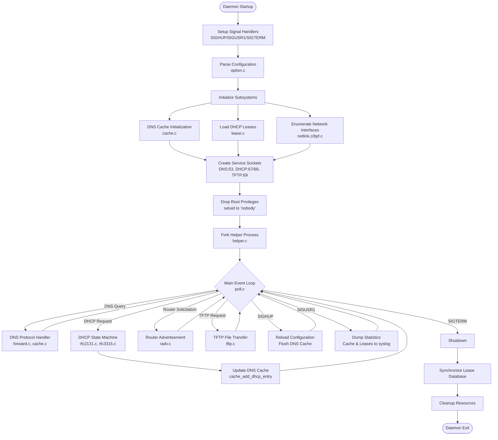

### 4.1.2 Service Integration Architecture

The daemon's integrated architecture provides automatic coordination between subsystems that would otherwise require external synchronization mechanisms in multi-daemon deployments.

**DNS-DHCP Integration**: Every DHCP lease allocation (both v4 and v6) immediately triggers DNS cache insertion via `cache_add_dhcp_entry` function in `src/cache.c`. Forward (A/AAAA) and reverse (PTR) records are created atomically with lease allocation, ensuring DNS consistency with current address assignments. Lease expirations automatically remove corresponding DNS entries, preventing stale name resolution. This integration provides zero-configuration name resolution for all DHCP clients without requiring separate DNS server updates or external synchronization scripts.

**DHCPv6-Router Advertisement Coordination**: The DHCPv6 subsystem (`src/dhcp6.c`) and router advertisement subsystem (`src/radv.c`) coordinate through shared configuration to control IPv6 autoconfiguration behavior. Router advertisements set M (managed configuration) and O (other configuration) flags based on DHCPv6 service availability, directing clients toward appropriate configuration methods. The integration supports flexible deployment models from pure SLAAC (stateless autoconfiguration) to full stateful DHCPv6 address management.

**PXE-DHCP-TFTP Integration**: Network boot scenarios integrate all three subsystems seamlessly. DHCP protocol handlers detect PXE clients via DHCP option analysis (`src/rfc2131.c:69`), deliver boot parameters through DHCP options, and coordinate with the TFTP server for boot image delivery. This tight integration enables complete network boot infrastructure without requiring separate TFTP daemon or PXE proxy server.

```mermaid
graph TB
    subgraph client[Client Network]
        DNSClient[DNS Client]
        DHCPClient[DHCP Client]
        IPv6Client[IPv6 Host]
        PXEClient[PXE Boot Client]
    end
    
    subgraph daemon[dnsmasq Daemon - Single Process]
        subgraph dns[DNS Subsystem]
            DNSForward[Query Forwarding<br/>forward.c]
            DNSCache[(DNS Cache<br/>cache.c)]
            DNSAuth[Authoritative Server<br/>auth.c]
        end
        
        subgraph dhcp[DHCP Subsystem]
            DHCP4[DHCPv4 Server<br/>rfc2131.c]
            DHCP6[DHCPv6 Server<br/>rfc3315.c]
            LeaseDB[(Lease Database<br/>lease.c)]
        end
        
        subgraph ipv6[IPv6 Support]
            RA[Router Advertisement<br/>radv.c]
            SLAAC[SLAAC Processing<br/>slaac.c]
        end
        
        subgraph boot[Network Boot]
            PXE[PXE Server Logic<br/>rfc2131.c]
            TFTP[TFTP Server<br/>tftp.c]
        end
        
        EventLoop[Main Event Loop<br/>dnsmasq.c]
    end
    
    subgraph external[External Systems]
        Upstream[Upstream DNS Servers]
        Scripts[Lease Scripts<br/>helper.c]
        Kernel[Kernel Integration<br/>ipset/nftables/netlink]
    end
    
    DNSClient -->|DNS Query| DNSForward
    DNSForward <-->|Cache Operations| DNSCache
    DNSForward -->|Upstream Query| Upstream
    Upstream -->|DNS Response| DNSForward
    DNSForward -->|Response| DNSClient
    
    DHCPClient -->|DHCP Request| DHCP4
    DHCP4 <-->|Lease Management| LeaseDB
    DHCP4 -->|Register Hostname| DNSCache
    DHCP4 -->|Lease Event| Scripts
    DHCP4 -->|Response| DHCPClient
    
    IPv6Client -->|Router Solicitation| RA
    RA <-->|Coordination| DHCP6
    DHCP6 <-->|Lease Management| LeaseDB
    DHCP6 -->|Register Hostname| DNSCache
    RA -->|Router Advertisement| IPv6Client
    DHCP6 -->|DHCPv6 Reply| IPv6Client
    
    PXEClient -->|PXE Discovery| PXE
    PXE -->|Boot Parameters| PXEClient
    PXEClient -->|TFTP Request| TFTP
    TFTP -->|Boot Image| PXEClient
    
    DNSForward -->|Resolved Addresses| Kernel
    DHCP4 -->|Lease Info| Kernel
    
    EventLoop -.->|Coordinates| dns
    EventLoop -.->|Coordinates| dhcp
    EventLoop -.->|Coordinates| ipv6
    EventLoop -.->|Coordinates| boot
```

### 4.1.3 Timing and Performance Characteristics

The system's performance characteristics reflect design optimizations for small network deployment scenarios.

**DNS Query Response Times**: Cache hit scenarios provide sub-millisecond response times due to in-memory hash table lookup (`src/cache.c`). Cache miss scenarios incur network round-trip time to upstream resolvers (typically 10-50ms for nearby resolvers). DNSSEC validation when enabled adds 10-100ms overhead for cryptographic signature verification and chain-of-trust validation.

**DHCP Lease Timing**: Default DHCPv4 lease duration is 3600 seconds (1 hour, `src/config.h:46`), with DHCPv6 default of 86400 seconds (24 hours). Clients renew at T1 (50% of lease time) and rebind at T2 (87.5% of lease time) per RFC 2131 specification. ICMP address probing when enabled adds 1-2 second delay to initial address allocation to detect potential conflicts.

**TFTP Transfer Performance**: Default TFTP block size of 512 bytes provides universal compatibility. RFC 2348 block size negotiation enables up to 65464 bytes per packet for improved transfer efficiency. Timeout of 5 seconds per packet with maximum 5 retries provides reliable transfer over lossy networks while preventing indefinite hangs.

**Resource Limits**: Default configuration parameters establish operational boundaries suitable for small networks: 150-entry DNS cache (`src/config.h:33`), 150 concurrent outstanding DNS queries (`src/config.h:17`), 1000 maximum DHCP leases (`src/config.h:35`), 20 maximum TCP connections (`src/config.h:17`), and 50 concurrent TFTP transfers (`src/config.h:49`). These limits enable predictable resource consumption on constrained hardware.

## 4.2 DNS Query Resolution Process

### 4.2.1 Complete DNS Query Lifecycle

The DNS resolution process implements a caching forwarding resolver architecture that balances response latency against upstream query reduction. The implementation prioritizes cache hits for frequently accessed domains while maintaining protocol correctness for all query types.

**Query Reception and Validation**: DNS queries arrive on UDP port 53 or TCP port 53 for queries exceeding UDP size limits. The main event loop detects socket activity and invokes `check_dns_listeners` (`src/dnsmasq.c:1257`) to receive and validate incoming packets. Protocol parsing via `src/rfc1035.c` extracts query name, type, and class while validating packet structure. Malformed queries are silently discarded per RFC recommendations to prevent amplification attacks.

**Cache Lookup Mechanism**: The DNS cache (`src/cache.c`) implements a hash table with LRU eviction policy. Hash computation on query name and type provides O(1) average-case lookup performance. Cache entries store TTL values from original upstream responses, with periodic sweep removing expired entries. Entries from `/etc/hosts` are marked immortal (never evicted) to ensure consistent local name resolution. Cache hit scenarios immediately construct responses from cached data without upstream queries.

**Upstream Forwarding Strategy**: Cache miss scenarios trigger upstream forwarding through `src/forward.c`. The system maintains a pool of configured upstream resolvers, selecting servers using round-robin algorithm with failed server tracking. Each forwarded query creates a forward record (frec) structure tracking transaction state including original client information, query parameters, and timing data. Randomized source port selection (`src/forward.c`) provides transaction ID space expansion for security against blind spoofing attacks.

**Response Processing and Validation**: Upstream responses undergo extensive validation including transaction ID verification, source port matching, and query section comparison to prevent cache poisoning. DNS rebinding attack detection (`src/forward.c:748-754`) identifies responses with private IP addresses for public domain names, protecting against malicious redirect attacks. EDNS0 option processing extracts extended DNS information when present.

**Cache Population and Client Response**: Validated responses are inserted into cache with original TTL values, enabling subsequent queries for the same name to receive cached responses. The cache insertion process handles CNAME chains appropriately, caching both CNAME records and ultimate target addresses. Responses are then relayed to original clients with adjusted TTL values reflecting time elapsed since upstream query. Concurrent queries for the same name are coalesced to single upstream query to prevent query storms.

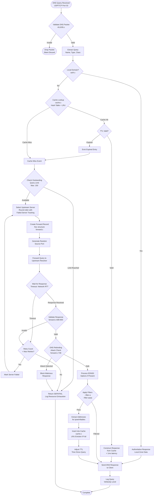

### 4.2.2 Advanced DNS Features Workflow

Beyond basic caching and forwarding, dnsmasq implements several advanced DNS capabilities that extend functionality for specific deployment scenarios.

**DNSSEC Validation Process**: When DNSSEC validation is enabled (`src/dnssec.c`), the validation workflow inserts between response receipt and cache insertion. The validator retrieves DNSKEY and DS records to construct a chain of trust from configured trust anchors (typically root zone KSK) to the response signature. RSA, ECDSA, EdDSA, and GOST signature algorithms are supported via libnettle cryptographic library. Validation failures result in SERVFAIL responses to clients, protecting against spoofed responses. Validated responses include AD (Authenticated Data) flag set in DNS header, signaling successful validation to DNSSEC-aware clients.

**Domain-Specific Forwarding**: Configuration supports directing specific domain queries to designated upstream servers (`dnsmasq.conf.example:30`), enabling split-horizon DNS scenarios. VPN configurations commonly use this feature to resolve corporate domains through VPN tunnel while routing general queries through local ISP resolvers. The implementation checks domain suffixes against configured patterns before upstream server selection, providing flexible routing based on query name.

**Local Authoritative Zones**: Authoritative DNS mode (`src/auth.c`) enables dnsmasq to act as primary nameserver for configured zones. SOA records define zone parameters (serial, refresh, retry, expiry), and zone transfers via AXFR protocol support secondary nameserver deployment. This feature enables offline operation for local domains without external DNS provider dependency, common in isolated networks or development environments.

**Loop Detection Mechanism**: The loop detection feature (`src/loop.c`) prevents DNS forwarding loops in complex network topologies. Test queries to reserved "test" domain detect forwarding loops by tracking query recursion depth. When loops are detected, the affected upstream server is temporarily removed from the forwarding pool, breaking the cycle and preventing query storms that could degrade network performance.

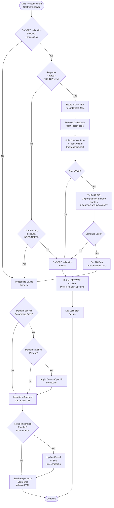

### 4.2.3 Hosts File and Static Entries Processing

Local name resolution integrates seamlessly with system hosts file and additional hosts directories, providing familiar configuration interfaces without requiring DNS zone file syntax expertise.

**Hosts File Loading**: On daemon startup and configuration reload (SIGHUP), the system reads `/etc/hosts` and any additional configured hosts files (`src/cache.c` functions). Each valid entry creates immortal cache entries that are never evicted by LRU policy, ensuring consistent local name resolution even under high query load. Both IPv4 and IPv6 addresses are supported, with multiple addresses per name creating multiple cache entries.

**Domain Expansion**: Configured domain suffix settings expand unqualified hostnames from hosts files into fully qualified domain names. A hosts entry for "server1" with domain "local.net" creates cache entries for both "server1" and "server1.local.net", supporting both simple name queries and FQDN queries. This feature simplifies hosts file management by eliminating the need to specify full domain names for every entry.

**Dynamic Hosts Files**: Additional hosts files beyond `/etc/hosts` can be specified via configuration, enabling separation of static entries by purpose or source. Combined with Linux inotify monitoring (`src/inotify.c`), hosts file modifications trigger automatic reload without manual SIGHUP signal, providing responsive updates when hosts files are modified by configuration management systems.

**Reverse Resolution Integration**: Forward entries (name to address) automatically generate corresponding reverse entries (address to name) in the PTR record cache space. This bidirectional resolution ensures both forward and reverse DNS queries succeed for hosts file entries without requiring duplicate reverse zone configuration.

## 4.3 DHCP Lease Management Workflows

### 4.3.1 DHCPv4 Lease Allocation Process

The DHCPv4 implementation follows RFC 2131 state machine semantics, providing comprehensive address allocation with support for both dynamic pools and static reservations.

**DISCOVER Phase Processing**: The DHCP state machine begins when a client broadcasts DHCPDISCOVER to locate available DHCP servers (`src/rfc2131.c:1082-1177`). The daemon receives broadcasts on UDP port 67 via the main event loop's socket polling mechanism. Packet validation confirms proper DHCP message structure, checks magic cookie value, and extracts client hardware address (typically MAC address) and optional client identifier from DHCP options. Configuration lookup determines applicable DHCP context based on receiving interface, relay agent information, or client classification tags.

**Address Selection Algorithm**: Address allocation follows a priority hierarchy designed to ensure stability and minimize disruption. First priority goes to existing leases for the same client identifier or MAC address, enabling lease renewal without address change. Second priority checks for configured static host entries specifying reserved addresses for specific clients. Third priority honors client-requested address from DHCP option 50 if the address falls within configured ranges and is currently available. Final fallback allocates first available address from dynamic address pool using sequential allocation.

**ICMP Conflict Detection**: Before committing to address allocation, the optional ICMP ping test sends ICMP echo request to proposed address. Lack of response within timeout window (typically 1-2 seconds) indicates address availability. Response detection indicates potential address conflict, causing the server to skip to next available address. This mechanism prevents allocation of addresses already in use by non-DHCP-configured hosts, though it adds latency to initial allocation process.

**OFFER Transmission**: The server constructs DHCPOFFER message containing proposed IP address, subnet mask, lease duration, gateway (router) address, DNS servers, and additional options based on client classification and configured option sets. The offer is transmitted either as broadcast (if client cannot receive unicast before configuration) or unicast to client MAC address. Multiple DHCP servers may respond with offers; the client selects preferred server for REQUEST phase.

**REQUEST Phase and Lease Commitment**: Client selection of server is indicated by DHCPREQUEST message containing server identifier option matching this server's address. The server validates that the requested address matches previous offer, updates lease database with confirmed allocation, triggers DNS cache update via `cache_add_dhcp_entry` to register hostname, and executes configured lease script if present. The synchronous lease database write to `/var/lib/misc/dnsmasq.leases` ensures lease persistence across daemon restarts.

**ACK Response and Completion**: DHCPACK message confirms successful lease allocation, providing final configuration parameters to client. The client configures network interface with allocated address and enters bound state, scheduling renewal attempts at T1 (50% of lease time) and rebinding at T2 (87.5% of lease time) per RFC 2131 timing requirements.

**NAK Scenarios**: DHCPNAK rejection occurs when requested address is unavailable (already allocated to different client), configuration has changed making previous allocation invalid, or lease has expired and address has been reallocated. NAK responses cause clients to return to initialization state and restart discovery process.

```mermaid
flowchart TB
    Start([Client Needs<br/>IP Address]) --> BroadcastDiscover[Broadcast DHCPDISCOVER<br/>UDP Port 67]
    BroadcastDiscover --> ServerReceive[Server Receives on<br/>Port 67<br/>dnsmasq.c:1097]
    
    ServerReceive --> ValidatePacket{Validate DHCP<br/>Packet Structure<br/>rfc2131.c:114-119}
    ValidatePacket -->|Invalid| DropPacket([Drop Packet])
    ValidatePacket -->|Valid| ExtractClient[Extract Client Info<br/>MAC Address<br/>Client Identifier<br/>Requested Options]
    
    ExtractClient --> LookupConfig[Lookup Configuration<br/>Interface/Relay/Tags]
    LookupConfig --> CheckExisting{Existing Lease<br/>for Client?}
    
    CheckExisting -->|Yes| ReuseAddress[Reuse Existing<br/>IP Address<br/>Stability Priority]
    
    CheckExisting -->|No| CheckStatic{Static Reservation<br/>Configured?<br/>MAC/Client-ID Match}
    CheckStatic -->|Yes| UseStatic[Use Reserved<br/>Static Address]
    
    CheckStatic -->|No| CheckRequested{Client Requested<br/>Specific Address?<br/>Option 50}
    CheckRequested -->|Yes| ValidateRequested{Address in Range<br/>and Available?}
    ValidateRequested -->|Yes| UseRequested[Use Requested<br/>Address]
    ValidateRequested -->|No| AllocateDynamic
    
    CheckRequested -->|No| AllocateDynamic[Allocate from<br/>Dynamic Pool<br/>Sequential Selection]
    
    ReuseAddress --> ICMPEnabled
    UseStatic --> ICMPEnabled
    UseRequested --> ICMPEnabled
    AllocateDynamic --> ICMPEnabled{ICMP Ping Test<br/>Enabled?}
    
    ICMPEnabled -->|No| CreateOffer
    ICMPEnabled -->|Yes| SendPing[Send ICMP Echo<br/>to Proposed Address]
    SendPing --> WaitPing{Wait for Response<br/>1-2 Second Timeout}
    WaitPing -->|Response Received| Conflict[Address Conflict<br/>Detected]
    Conflict --> AllocateDynamic
    WaitPing -->|Timeout| CreateOffer[Create DHCPOFFER<br/>Proposed Address<br/>+ Options]
    
    CreateOffer --> SendOffer[Send DHCPOFFER<br/>to Client<br/>Broadcast or Unicast]
    SendOffer --> WaitRequest{Wait for<br/>DHCPREQUEST}
    
    WaitRequest -->|Timeout| OfferExpire([Offer Expires<br/>No Commitment])
    WaitRequest -->|Different Server| OfferExpire
    
    WaitRequest -->|Request Received| ValidateRequest{Request Valid?<br/>Server ID Matches<br/>Address Available}
    ValidateRequest -->|No| SendNAK[Send DHCPNAK<br/>Reject Request]
    SendNAK --> ClientRetry([Client Returns to<br/>INIT State])
    
    ValidateRequest -->|Yes| UpdateLease[Update Lease Database<br/>/var/lib/misc/dnsmasq.leases<br/>lease.c]
    UpdateLease --> UpdateDNS[Register in DNS Cache<br/>cache_add_dhcp_entry<br/>Forward + Reverse Records]
    UpdateDNS --> ExecuteScript{Lease Script<br/>Configured?<br/>helper.c}
    
    ExecuteScript -->|Yes| RunScript[Execute Script<br/>Action: add<br/>MAC, IP, Hostname]
    RunScript --> SendACK
    ExecuteScript -->|No| SendACK[Send DHCPACK<br/>Confirm Allocation<br/>Lease Time, Gateway,<br/>DNS Servers]
    
    SendACK --> ClientBound[Client Enters<br/>BOUND State<br/>Configures Interface]
    ClientBound --> ScheduleRenewal[Schedule Renewal<br/>T1 = 50% Lease Time<br/>T2 = 87.5% Lease Time]
    ScheduleRenewal --> End([Lease Active])
    
    End --> RenewalTime{Renewal Time<br/>T1 Reached?}
    RenewalTime -->|Yes| SendRenewRequest[Client Sends<br/>DHCPREQUEST<br/>Unicast to Server<br/>RENEWING State]
    SendRenewRequest --> ServerReceive
    
    RenewalTime -->|No| LeaseExpiry{Lease Expiry?}
    LeaseExpiry -->|Yes| ExpireLease[Expire Lease<br/>Remove from Database]
    ExpireLease --> RemoveDNS[Remove DNS Entries<br/>Cache Cleanup]
    RemoveDNS --> ScriptDelete{Script Configured?}
    ScriptDelete -->|Yes| RunDelScript[Execute Script<br/>Action: del]
    RunDelScript --> LeaseComplete
    ScriptDelete -->|No| LeaseComplete([Lease Lifecycle<br/>Complete])
```

### 4.3.2 DHCPv6 and Router Advertisement Integration

IPv6 network configuration involves coordinated operation between router advertisements (SLAAC) and DHCPv6 services, with flexible configuration models supporting autonomous, managed, or hybrid approaches.

**Router Advertisement Transmission**: The router advertisement subsystem (`src/radv.c`) operates independently of client requests, transmitting periodic unsolicited router advertisements every 200-600 seconds to all-nodes multicast address (ff02::1). Router solicitation messages from newly connected hosts trigger immediate advertisement responses. Each advertisement contains prefix information for SLAAC address generation, M (managed configuration) flag controlling stateful DHCPv6 usage, O (other configuration) flag controlling DHCPv6 for parameters only, and RDNSS options advertising recursive DNS server addresses.

**SLAAC Address Derivation**: Clients receiving router advertisements with autonomous flag set derive IPv6 addresses by combining advertised prefix with interface identifier (typically EUI-64 from MAC address). Privacy extensions (RFC 4941) generate temporary addresses using random interface identifiers. The dnsmasq daemon monitors neighbor advertisements via ICMPv6 to detect SLAAC-derived addresses (`src/slaac.c`), automatically registering them in DNS cache when hostnames are available from DHCPv4 leases for the same MAC address. This cross-protocol integration provides consistent naming for dual-stack hosts.

**DHCPv6 Stateful Allocation**: When M flag is set in router advertisements, clients initiate DHCPv6 stateful address allocation (`src/dhcp6.c`, `src/rfc3315.c`). The four-message exchange (SOLICIT/ADVERTISE/REQUEST/REPLY) parallels DHCPv4 semantics but uses DUID (Device Unique Identifier) instead of MAC address for client identification. Identity associations (IA_NA for addresses, IA_PD for prefix delegation) contain allocated resources with preferred and valid lifetimes. Default DHCPv6 lease time of 24 hours provides greater stability than typical DHCPv4 durations.

**Prefix Delegation**: Enterprise and service provider scenarios use DHCPv6 prefix delegation to allocate IPv6 prefixes to routers for hierarchical address planning. A router requests prefix via IA_PD, receives delegated prefix from DHCPv6 server, and subdivides the delegated prefix for local networks. This mechanism enables automatic prefix assignment throughout network hierarchy without manual subnet planning.

**Stateless DHCPv6**: Configuration with O flag set but M flag clear enables stateless DHCPv6, where clients use SLAAC for addresses but DHCPv6 for parameters like DNS servers and search domains. This hybrid approach combines SLAAC simplicity with centralized parameter management.

```mermaid
flowchart TB
    Start([IPv6 Host Connects<br/>to Network]) --> SendRS[Send Router Solicitation<br/>ICMPv6 Type 133<br/>to ff02::2]
    
    SendRS --> ServerReceiveRS[Server Receives RS<br/>radv.c]
    ServerReceiveRS --> ConstructRA[Construct Router<br/>Advertisement<br/>Prefix Information<br/>M/O Flags<br/>RDNSS Options]
    
    ConstructRA --> SendRA[Send Router Advertisement<br/>ICMPv6 Type 134<br/>to ff02::1 or Unicast]
    SendRA --> ClientReceiveRA[Client Receives RA<br/>Processes Flags]
    
    ClientReceiveRA --> CheckAFlag{Autonomous Flag<br/>in Prefix Info?<br/>SLAAC Enabled}
    CheckAFlag -->|Yes| DeriveSLAAC[Derive SLAAC Address<br/>Prefix + Interface ID<br/>slaac.c monitors]
    DeriveSLAAC --> DAD[Duplicate Address<br/>Detection<br/>ICMPv6 Neighbor<br/>Solicitation]
    DAD --> ConfigureSLAAC[Configure Address<br/>on Interface]
    ConfigureSLAAC --> RegisterSLAAC[dnsmasq Registers<br/>SLAAC Address in DNS<br/>if Hostname Known]
    
    RegisterSLAAC --> CheckMFlag
    CheckAFlag -->|No| CheckMFlag
    
    CheckMFlag{M Flag Set?<br/>Managed Config<br/>via DHCPv6}
    CheckMFlag -->|No| CheckOFlag
    
    CheckMFlag -->|Yes| SendSolicit[Client Sends<br/>DHCPv6 SOLICIT<br/>UDP Port 547<br/>Multicast ff02::1:2]
    SendSolicit --> ServerReceiveSolicit[Server Receives SOLICIT<br/>dhcp6.c]
    ServerReceiveSolicit --> CheckDUID[Extract DUID<br/>Client Identification]
    CheckDUID --> SelectAddress[Select IPv6 Address<br/>Check Existing Lease<br/>Static Allocation<br/>Dynamic Pool]
    
    SelectAddress --> SendAdvertise[Send DHCPv6 ADVERTISE<br/>Proposed Address<br/>in IA_NA<br/>Preferred/Valid Lifetimes]
    SendAdvertise --> WaitRequest{Wait for<br/>DHCPv6 REQUEST}
    
    WaitRequest -->|Timeout| AdvertiseExpire([Advertise Expires])
    WaitRequest -->|Request Received| ValidateDHCP6{Request Valid?<br/>DUID Matches<br/>Address Available}
    ValidateDHCP6 -->|No| SendReject([Send Reject])
    
    ValidateDHCP6 -->|Yes| AllocateIPv6[Allocate IPv6 Address<br/>Update Lease Database<br/>lease.c]
    AllocateIPv6 --> UpdateDNSv6[Register in DNS Cache<br/>AAAA Record<br/>PTR Record<br/>cache_add_dhcp_entry]
    UpdateDNSv6 --> ExecuteScriptv6{Lease Script<br/>Configured?}
    ExecuteScriptv6 -->|Yes| RunScriptv6[Execute Script<br/>Action: add<br/>IPv6, Hostname]
    RunScriptv6 --> SendReply
    ExecuteScriptv6 -->|No| SendReply[Send DHCPv6 REPLY<br/>Confirm Allocation<br/>IA_NA with Address<br/>DNS Servers, Options]
    
    SendReply --> ClientConfigured[Client Configures<br/>IPv6 Address<br/>Default Lease: 24h]
    ClientConfigured --> BothComplete
    
    CheckOFlag{O Flag Set?<br/>Other Config<br/>via DHCPv6}
    CheckOFlag -->|No| UseDNSfromRA[Use DNS Servers<br/>from RA RDNSS]
    UseDNSfromRA --> OnlyRAComplete([IPv6 Configuration<br/>Complete - SLAAC Only])
    
    CheckOFlag -->|Yes| SendInfoRequest[Client Sends<br/>DHCPv6 INFORMATION-REQUEST<br/>Stateless Mode]
    SendInfoRequest --> ServerReceiveInfo[Server Receives Request]
    ServerReceiveInfo --> SendInfoReply[Send DHCPv6 REPLY<br/>DNS Servers<br/>Search Domains<br/>Other Options]
    SendInfoReply --> ClientConfiguresParams[Client Configures<br/>Parameters from DHCPv6]
    ClientConfiguresParams --> HybridComplete([IPv6 Configuration<br/>Complete - Hybrid])
    
    BothComplete([IPv6 Configuration<br/>Complete<br/>SLAAC + DHCPv6])
    
    CheckMFlag -->|Prefix Delegation?| CheckPD{IA_PD Request?<br/>Router Requesting<br/>Prefix}
    CheckPD -->|Yes| AllocatePrefix[Allocate IPv6 Prefix<br/>e.g., /56 or /60]
    AllocatePrefix --> SendPDReply[Send REPLY with<br/>IA_PD Containing<br/>Delegated Prefix]
    SendPDReply --> RouterSubdivides[Router Subdivides<br/>Prefix for Local<br/>Networks]
    RouterSubdivides --> BothComplete
```

### 4.3.3 Lease Renewal and Expiration Management

Lease lifecycle management ensures efficient address utilization while maintaining stable allocations for active clients.

**Renewal Process (T1 Timer)**: At 50% of lease time (T1 timer expiration), clients initiate unicast DHCPREQUEST directly to the leasing server. The server processing for renewal requests follows the same validation and database update path as initial allocation, but reuses the existing address to maintain stability. Successful renewal extends lease expiration time and updates DNS cache TTL values to reflect new lease duration.

**Rebinding Process (T2 Timer)**: If renewal attempts fail (server unreachable or unresponsive), clients enter rebinding state at 87.5% of lease time (T2 timer). Rebinding broadcasts DHCPREQUEST to all DHCP servers, allowing alternative servers to extend the lease. This mechanism provides resilience when the original leasing server becomes unavailable but another server has access to shared lease database.

**Lease Expiration and Cleanup**: Unrenewed leases expire at the end of their lease time. The daemon's periodic lease database scan (`src/lease.c`) identifies expired entries, removes them from the active lease list, triggers DNS cache removal for associated hostnames via forward and reverse record deletion, and executes lease scripts with "del" action for external system cleanup. Expired addresses return to the available pool for allocation to new clients.

**Persistent Lease Database**: The lease database file `/var/lib/misc/dnsmasq.leases` stores lease information in text format with fields for expiry timestamp, MAC address, IP address, hostname, and client identifier. Synchronous writes on lease changes ensure database consistency even if daemon terminates unexpectedly. Database reads on daemon startup restore lease state, enabling stable address allocations across service restarts.

## 4.4 Network Boot Workflows

### 4.4.1 PXE Boot Sequence

Network boot capabilities integrate DHCP option delivery with TFTP file transfer to provide complete diskless boot infrastructure.

**PXE Client Detection**: PXE-capable clients identify themselves through specific DHCP options in DISCOVER messages. Option 93 indicates client system architecture (0x0000 for x86 BIOS, 0x0007 for x64 UEFI, 0x0009 for x86_64 UEFI, ARM architectures). Option 60 (vendor class identifier) contains "PXEClient" string. The DHCP handler (`src/rfc2131.c:69`, `is_pxe_client` function) detects these indicators and activates PXE-specific processing logic.

**Boot File Selection**: Configuration maps client architectures to appropriate boot files. Legacy BIOS clients receive `pxelinux.0` or similar NBP (Network Boot Program), UEFI clients receive architecture-specific bootloaders like `bootx64.efi`, and ARM clients receive ARM-compatible boot loaders. Tag-based configuration enables sophisticated selection logic based on client MAC address, vendor class, or other identifying characteristics.

**DHCP Option Delivery**: PXE-specific DHCP options guide the boot process. Option 66 (TFTP server name) or siaddr field specifies TFTP server address (typically the dnsmasq host itself). Option 67 (boot filename) specifies the initial boot file to retrieve. Option 60 (vendor class) echoes PXEClient to confirm PXE service availability. Additional vendor-specific options (type 43) provide PXE menu configurations and boot parameters.

**PXE Menu Support**: Multi-boot scenarios use PXE menu protocol to present interactive boot selections. Menu definitions in configuration specify multiple boot options with descriptions. The initial boot file presents menu to user, selection triggers retrieval of selected boot image. Proxy DHCP mode enables PXE service while leaving address allocation to existing DHCP infrastructure.

**TFTP File Transfer**: Boot file retrieval proceeds via TFTP protocol. Client sends Read Request (RRQ) to TFTP server specifying boot filename. The TFTP handler (`src/tftp.c:44-96`, `tftp_request` function) validates file path for security (preventing directory traversal attacks), opens requested file from configured TFTP root directory, negotiates transfer parameters including block size (default 512 bytes, negotiable up to 65464 bytes per RFC 2348), and transfers file in sequential DATA packets with client acknowledgment for each packet.

**Security Considerations**: Read-only TFTP implementation prevents unauthorized file uploads. Directory traversal prevention blocks paths containing "../" sequences. Configurable TFTP root directory restricts file access to designated boot image storage. Per-interface TFTP root support enables different boot environments on different network segments.

```mermaid
flowchart TB
    Start([PXE Client<br/>Network Boot Initiated]) --> PowerOn[Client Powers On<br/>Network Boot Priority]
    PowerOn --> SendPXEDiscover[Send DHCPDISCOVER<br/>Option 93: Architecture<br/>Option 60: PXEClient]
    
    SendPXEDiscover --> ServerDetectPXE{Server Detects<br/>PXE Client?<br/>rfc2131.c:69<br/>is_pxe_client}
    ServerDetectPXE -->|No| StandardDHCP[Standard DHCP<br/>Processing]
    StandardDHCP --> NotPXE([Non-PXE Boot])
    
    ServerDetectPXE -->|Yes| ExtractArch[Extract Architecture<br/>Option 93<br/>x86/x64/ARM/UEFI]
    ExtractArch --> SelectBootFile[Select Boot File<br/>Based on Architecture<br/>Configuration Match]
    
    SelectBootFile --> CheckBootMode{Boot Mode?}
    CheckBootMode -->|Proxy DHCP| SendProxyOffer[Send PXE-Only Offer<br/>No IP Address<br/>Only Boot Options]
    CheckBootMode -->|Full DHCP| ConstructPXEOffer[Construct DHCPOFFER<br/>IP Address Allocation<br/>+ PXE Boot Options]
    
    SendProxyOffer --> ClientSelect
    ConstructPXEOffer --> SendPXEOfferFull[Send DHCPOFFER<br/>Option 66: TFTP Server<br/>Option 67: Boot Filename<br/>Option 60: PXEClient Echo]
    SendPXEOfferFull --> ClientSelect{Client Selects<br/>Server}
    
    ClientSelect --> SendPXERequest[Send DHCPREQUEST<br/>Select This Server]
    SendPXERequest --> ServerACK[Send DHCPACK<br/>Confirm Boot Parameters<br/>siaddr: TFTP Server<br/>file: Boot Filename]
    
    ServerACK --> CheckMenu{PXE Menu<br/>Enabled?}
    CheckMenu -->|No| DirectBoot[Client Prepares<br/>Direct Boot File<br/>Retrieval]
    DirectBoot --> InitiateTFTP
    
    CheckMenu -->|Yes| SendMenuOptions[Include Menu Options<br/>Option 43: PXE Menu<br/>Menu Entries]
    SendMenuOptions --> ClientMenu[Client Displays<br/>Boot Menu<br/>User Selection]
    ClientMenu --> UserSelect{User Selects<br/>Boot Option}
    UserSelect --> InitiateTFTP[Client Initiates<br/>TFTP Transfer]
    
    InitiateTFTP --> SendRRQ[Send TFTP RRQ<br/>Read Request<br/>UDP Port 69<br/>Filename from DHCP]
    SendRRQ --> ServerReceiveRRQ[Server Receives RRQ<br/>tftp.c:44-96<br/>tftp_request]
    
    ServerReceiveRRQ --> ValidatePath{Validate File Path<br/>Security Check<br/>No ../ Traversal}
    ValidatePath -->|Invalid| SendTFTPError[Send TFTP ERROR<br/>ERR_PERM or ERR_FNF]
    SendTFTPError --> BootFail([Boot Failure])
    
    ValidatePath -->|Valid| CheckFile{File Exists in<br/>TFTP Root?}
    CheckFile -->|No| SendTFTPError
    CheckFile -->|Yes| NegotiateOptions[Negotiate Transfer<br/>Options<br/>Block Size: 512-65464<br/>Transfer Size]
    
    NegotiateOptions --> SendOACK[Send TFTP OACK<br/>Option Acknowledgment]
    SendOACK --> TransferLoop[Begin Data Transfer<br/>Loop]
    
    TransferLoop --> SendData[Send DATA Packet<br/>Block Number<br/>Data Bytes]
    SendData --> WaitACK{Wait for ACK<br/>Timeout: 5 seconds}
    
    WaitACK -->|Timeout| RetryCount{Retry Count<br/>< Max Retries?}
    RetryCount -->|Yes| SendData
    RetryCount -->|No| TransferAbort([Transfer Aborted<br/>Too Many Timeouts])
    
    WaitACK -->|ACK Received| CheckComplete{All Data<br/>Sent?<br/>File Transfer Complete}
    CheckComplete -->|No| SendData
    CheckComplete -->|Yes| TransferComplete[TFTP Transfer<br/>Complete]
    
    TransferComplete --> ExecuteScript2{TFTP Script<br/>Configured?}
    ExecuteScript2 -->|Yes| RunTFTPScript[Execute Script<br/>Notify Transfer<br/>Complete]
    RunTFTPScript --> ClientExecute
    ExecuteScript2 -->|No| ClientExecute[Client Executes<br/>Boot Image<br/>OS Kernel or<br/>Boot Loader]
    
    ClientExecute --> AdditionalFiles{Additional Files<br/>Needed?<br/>Kernel Modules,<br/>Init Filesystem}
    AdditionalFiles -->|Yes| InitiateTFTP
    AdditionalFiles -->|No| BootComplete([System Boots<br/>from Network])
```

### 4.4.2 TFTP Protocol Operation Details

The TFTP implementation provides reliable file transfer using a simple stop-and-wait protocol with timeout-based retransmission.

**Connection Establishment**: Unlike TCP-based protocols, TFTP uses UDP with application-layer reliability. Each TFTP transfer uses an ephemeral port allocated by the server, with subsequent packets exchanged on that port rather than the well-known port 69. This design enables concurrent transfers from a single TFTP server to multiple clients.

**Block Size Negotiation**: RFC 2348 block size option allows clients and servers to negotiate transfer block sizes larger than the standard 512 bytes. Larger blocks significantly improve transfer efficiency for multi-megabyte boot images by reducing per-packet overhead. The negotiation occurs during initial handshake via OACK (Option Acknowledgment) packet. Dnsmasq supports up to 65464 bytes per block (`src/config.h:50`), approaching UDP maximum payload size.

**Transfer Size Option**: RFC 2349 transfer size option communicates total file size before transfer begins. Clients use this information for progress indication and storage allocation. The server determines file size and includes it in OACK response when client requests this option.

**Timeout and Retransmission**: Each DATA packet requires ACK before the next packet is sent. Lack of ACK within timeout window (default 5 seconds) triggers retransmission of the same packet. This simple reliability mechanism handles packet loss on unreliable networks. After maximum retry count (typically 5), the server aborts the transfer and frees associated resources.

**Concurrent Transfer Management**: The daemon supports up to 50 concurrent TFTP transfers by default (`src/config.h:49`). Each active transfer maintains state including file handle, current block number, client address and port, and retry counter. Transfer limit prevents resource exhaustion from excessive concurrent boot attempts.

## 4.5 Error Handling and Recovery Flows

### 4.5.1 DNS Error Handling and Failover

The DNS subsystem implements comprehensive error handling to maintain service availability despite upstream failures or resource constraints.

**Upstream Server Failure Detection**: Query timeout to upstream server (lack of response within network RTT window) increments failure counter for that server. Repeated failures mark the server as down, removing it from active upstream pool. Periodic health checks every 60 seconds send test queries to down servers, restoring them to active pool when responses resume. This mechanism provides automatic failover to alternate upstream resolvers without manual intervention.

**Response Validation Failures**: Multiple validation failures trigger error responses and retry logic. Transaction ID mismatches indicate potential spoofing or packet corruption, causing silent discard and timeout-driven retry. Source port validation failures similarly indicate suspicious packets. Query section mismatches between request and response suggest response corruption or sophisticated attack attempts, causing response rejection.

**DNS Rebinding Attack Protection**: Responses containing private IP addresses (RFC 1918 ranges) for public domain names indicate potential DNS rebinding attacks (`src/forward.c:748-754`). The rebinding filter detects these scenarios, blocks the malicious response, and returns SERVFAIL to the client. This protection prevents attackers from using DNS to breach firewall boundaries by resolving public names to private addresses.

**Resource Exhaustion Handling**: Outstanding query limit (150 concurrent) prevents memory exhaustion from excessive concurrent queries. Attempts to forward additional queries when limit is reached result in immediate SERVFAIL response with syslog message "maximum number of concurrent DNS queries reached" (`src/forward.c:28`, `query_full`). Clients interpret SERVFAIL as temporary failure and retry after delay, spreading load over time.

**Cache Consistency**: Cache insertion failures (memory allocation failures) are handled gracefully by continuing without cache entry, causing the query to be forwarded on every occurrence until cache space becomes available. This degraded mode maintains service availability at cost of reduced performance.

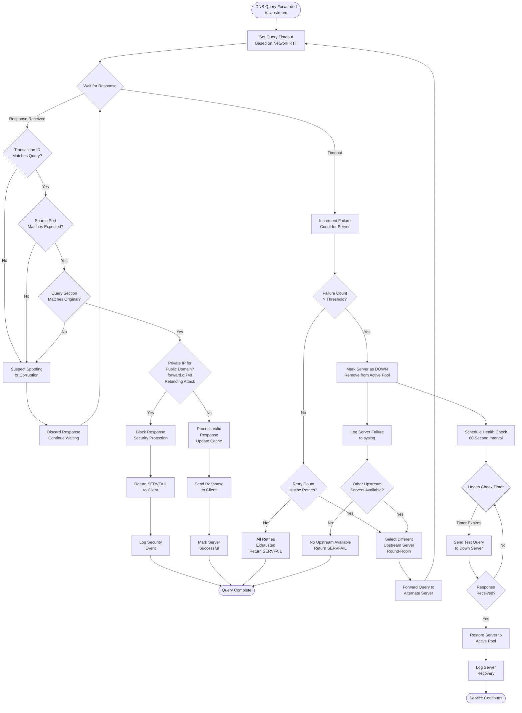

### 4.5.2 DHCP Error Handling

DHCP error scenarios require careful handling to maintain network service availability while enforcing address allocation policies.

**Address Pool Exhaustion**: Complete allocation of available addresses in the dynamic pool prevents new lease allocations. Discovery requests in this scenario receive no response (preferred behavior to avoid confusing clients with NAK responses for discovery). Existing lease renewals continue successfully, but new devices cannot join the network until leases expire. Syslog messages indicate pool exhaustion condition: "no address available" warnings enable administrator monitoring.

**Lease Database Corruption**: Database read failures on startup (corrupted file, permission errors) result in initialization with empty lease database and warning logged to syslog. Service continues with fresh database, though existing client leases are lost and require reacquisition. Database write failures during operation log errors but continue service, with lease state held in memory even if persistence fails. Next successful write synchronizes state to disk.

**ICMP Conflict Detection**: ICMP ping response to proposed address indicates conflict with existing host. The server skips to next available address and retries allocation. If all addresses in pool show conflicts (suspicious condition suggesting network attack or misconfiguration), allocation fails and error is logged. The ICMP test timeout adds 1-2 seconds to initial allocation, so some deployments disable this feature for faster allocation at cost of reduced conflict detection.

**Network Interface Failures**: Interface down conditions detected via netlink (Linux) or periodic enumeration (BSD) cause unbinding from affected interfaces. DHCP service continues on remaining interfaces. Interface restoration triggers automatic rebinding and service resumption. This mechanism provides resilience for systems with multiple network interfaces.

**Configuration Errors**: Invalid configuration detected during parsing causes daemon startup failure with diagnostic messages identifying problematic configuration directives. Configuration reload via SIGHUP that encounters errors retains previous valid configuration and logs detailed error information, preventing service disruption from configuration mistakes.

### 4.5.3 TFTP Error Handling

TFTP error scenarios protect server resources while providing clear error feedback to clients.

**File Not Found**: Client requests for non-existent files receive TFTP ERROR packet with error code ERR_FNF (File Not Found, code 1) and descriptive error message. The client interprets this error and may retry with alternative filename or abort boot attempt. Logging of file not found errors assists troubleshooting of boot file configuration issues.

**Permission Denied**: Requests for files outside TFTP root directory or files without read permissions receive ERROR packet with ERR_PERM (Permission Denied, code 2). This security boundary prevents unauthorized file access. All paths are validated before file access, with directory traversal attempts (containing "../") immediately rejected.

**Transfer Timeouts**: Missing ACK packets trigger retransmission of the last DATA packet after 5-second timeout. After 5 consecutive retries without ACK, the server aborts the transfer and frees associated resources. Client-side timeouts similarly result in transfer abandonment. These timeouts prevent indefinite resource consumption from failed transfers.

**Concurrent Transfer Limits**: Exceeding maximum concurrent transfer limit (50 by default) causes new transfer requests to be rejected with ERROR response. This limit prevents resource exhaustion from excessive simultaneous boot attempts. Completed transfers free resources for new requests.

**Disk I/O Errors**: File read errors during transfer (disk errors, file truncation) cause immediate ERROR transmission and transfer abort. These errors are logged for administrator attention as they may indicate hardware failures or file corruption requiring intervention.

## 4.6 State Management and Transitions

### 4.6.1 DNS Cache State Transitions

The DNS cache implements a state machine for entry lifecycle management with LRU eviction policy.

**State Categories**: Cache entries exist in several states: **ACTIVE** entries have valid TTL and participate in query responses; **EXPIRED** entries have reached TTL expiration but remain in cache temporarily for potential refresh; **IMMORTAL** entries from hosts files never expire and are never evicted; **DHCP-ASSOCIATED** entries tied to DHCP leases that are removed when leases expire.

**Insertion Process**: New cache entries transition through validation and allocation phases. Cache insertion begins with hash computation on query name and type, collision resolution via chaining, TTL extraction from DNS response, and LRU list insertion at head (most recently used position). If cache is full, least recently used entry is evicted unless marked immortal.

**Lookup and Promotion**: Cache lookups check TTL validity, reject expired entries, and promote hits to LRU list head (making them most recently used). This promotion mechanism ensures frequently accessed entries remain in cache while infrequently accessed entries age toward eviction.

**Expiration and Eviction**: Periodic cache maintenance scans identify expired entries based on TTL countdown. Expired entries are eligible for eviction but may remain briefly in cache. When cache capacity is reached, LRU eviction removes oldest entries (excluding immortal entries) to make space for new insertions.

**DHCP Integration**: DHCP lease allocations create special cache entries marked with DHCP flag. These entries associate with lease records via MAC address or client identifier. Lease expiration or release triggers immediate cache removal for associated entries, maintaining DNS-DHCP consistency.

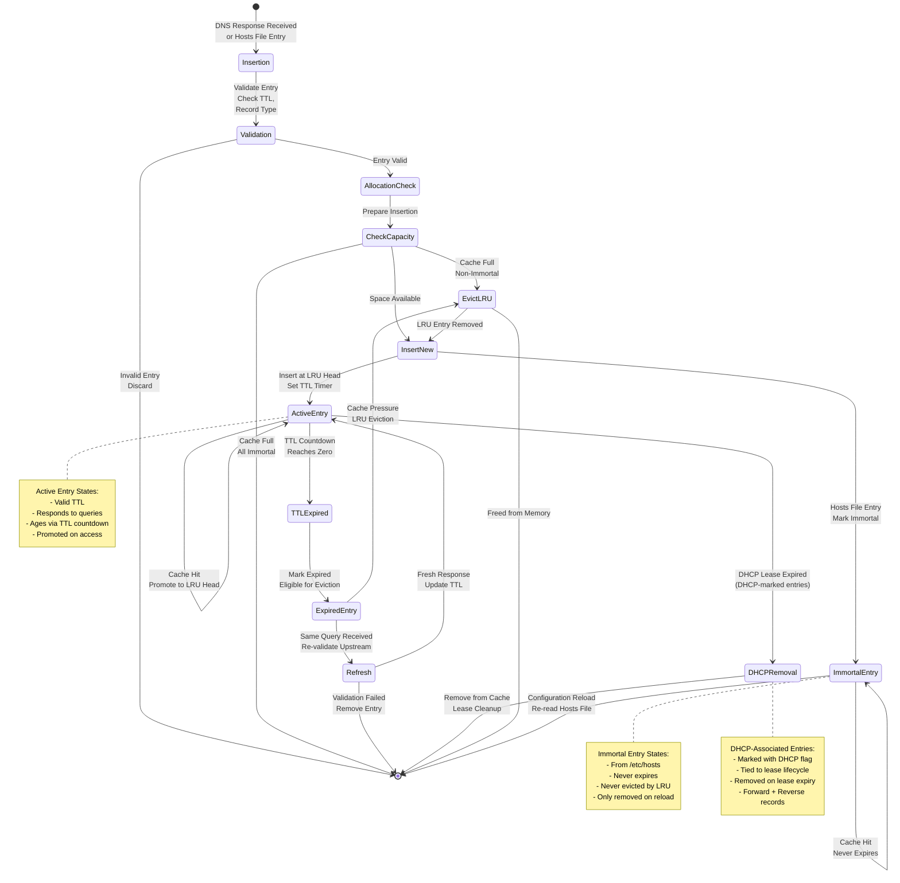

### 4.6.2 DHCP Lease State Machine

DHCP lease lifecycle follows RFC 2131 state machine with additional states for local implementation details.

**Allocation States**: Leases transition through several allocation phases: **TENTATIVE** during OFFER phase before client confirmation; **NEW** immediately after successful REQUEST/ACK exchange; **ACTIVE** in normal operational state with periodic renewals; **EXPIRED** after lease time expiration before cleanup.

**Renewal Timing**: Active leases have three critical time thresholds: **T1** (renewal time at 50% of lease) triggers client unicast renewal attempts to original server; **T2** (rebinding time at 87.5% of lease) triggers broadcast renewal attempts to any available server; **EXPIRY** (100% of lease time) causes lease termination if not renewed.

**State Persistence**: Lease state writes to persistent database synchronously on state changes. The lease file format records expiry timestamp, MAC address, IP address, hostname, and client identifier. Database reads on daemon startup restore lease state, ensuring address allocations persist across service restarts.

**Modification Tracking**: Lease modifications (hostname changes, option updates) set LEASE_CHANGED flag triggering database write and potential script execution. This tracking ensures external systems receive notification of all significant lease events.

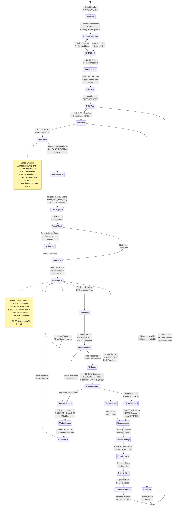

### 4.6.3 TFTP Transfer State Management

Each TFTP transfer maintains independent state tracking for reliable file delivery.

**Transfer Initialization**: New transfer state is created upon RRQ receipt, including file handle to requested file, block counter initialized to zero, client address and ephemeral port, retry counter, and transfer options (block size, transfer size).

**Active Transfer State**: During active transfer, the state machine alternates between sending DATA packets and waiting for ACK responses. State includes current block number, bytes sent in current block, timeout timer for ACK reception, and retry count for timeout handling.

**Option Negotiation**: Optional OACK state handles option negotiation before data transfer begins. Client option requests are evaluated, server capabilities are determined, and OACK packet with agreed options is transmitted before data transfer commences.

**Transfer Completion and Cleanup**: Transfer reaches completion when final DATA packet (less than negotiated block size) is acknowledged. State cleanup involves closing file handle, freeing transfer state memory, and logging transfer completion. Transfer slot becomes available for new requests.

**Error States**: Various error conditions cause immediate transfer termination: file not found or permission denied during initialization; timeout exhaustion (5 retries) during active transfer; disk I/O errors during file reading; or client-initiated transfer abort.

## 4.7 Integration Workflows

### 4.7.1 DHCP-DNS Integration Sequence

The tight integration between DHCP and DNS subsystems provides automatic name resolution for dynamically allocated addresses.

**Lease Allocation to DNS Registration**: Every successful DHCP lease allocation triggers immediate DNS cache insertion. The DHCP handler calls `cache_add_dhcp_entry` function in `src/cache.c` with lease parameters including allocated IP address (IPv4 or IPv6), client hostname from DHCP option 12 or DHCPv6 option 39, configured domain suffix for FQDN construction, and lease expiration time for DNS TTL.

**Forward and Reverse Record Creation**: DNS registration creates both forward records (A for IPv4, AAAA for IPv6) mapping hostname to address and reverse records (PTR) mapping address to hostname. Reverse zone inference from IP address subnet automatically creates appropriate reverse zone entries without explicit reverse zone configuration. This bidirectional resolution ensures both name-to-address and address-to-name queries succeed.

**DNS Cache Marking**: Entries created from DHCP leases are marked with DHCP flag distinguishing them from entries from upstream queries or hosts files. This marking enables selective removal when leases expire, preventing stale DNS entries from persisting after address reallocation.

**Lease Modification Handling**: Hostname changes during lease renewal (client provides different hostname) trigger DNS cache update. Old hostname entries are removed, new entries are inserted, and external scripts are notified of the change. This dynamic updating maintains DNS accuracy as client configurations evolve.

**Lease Expiration Cleanup**: Expired leases trigger automatic DNS entry removal. The cleanup process identifies all DNS entries (forward and reverse) associated with the expired lease via MAC address or client identifier matching and removes them atomically from the cache. This cleanup ensures DNS doesn't resolve expired leases to prevent connection attempts to reallocated addresses.

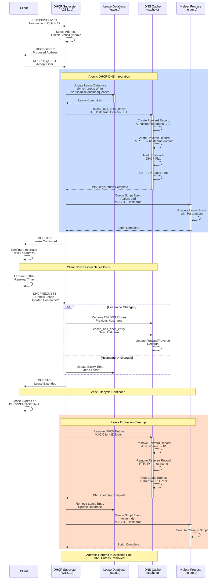

### 4.7.2 Kernel Integration Workflows

Platform-specific kernel integrations extend dnsmasq functionality with advanced routing and firewall capabilities.

**Linux ipset Integration**: Domain-to-ipset mappings configured via `--ipset` option cause resolved addresses to be added to kernel IP sets (`src/ipset.c`). The workflow begins with DNS query resolution, address extraction from response, domain pattern matching against configured ipset rules, and netlink message transmission to kernel adding addresses to specified ipsets. Netfilter firewall rules reference these ipsets, enabling dynamic policy based on DNS resolution results. Common use cases include policy routing (route specific domains through specific gateways), content filtering (block or rate-limit specific domain categories), and traffic shaping (QoS policies based on destination domain).

**nftables Set Integration**: Similar to ipset but using modern nftables framework (`src/nftset.c`), this integration requires libnftables library. Resolved addresses are added to nftables sets, and nftables rules reference these sets for packet filtering and routing decisions. This integration aligns with current Linux networking architecture as nftables replaces iptables in modern distributions.

**Connection Tracking Mark Propagation**: Linux conntrack integration (`src/conntrack.c`) propagates connection tracking marks from DNS query connections to subsequent network connections from the same source. This mechanism enables sophisticated per-client or per-application policies where firewall rules and routing decisions follow the DNS query source rather than just destination address. Use cases include per-user bandwidth policies and application-specific routing.

**Network Interface Monitoring**: Linux netlink integration (`src/netlink.c`) monitors kernel network interface state. Interface up/down events trigger automatic listener rebinding, address changes trigger configuration reevaluation, and route changes enable dynamic upstream selection. This monitoring provides responsive adaptation to network topology changes common in mobile and dynamic network environments.

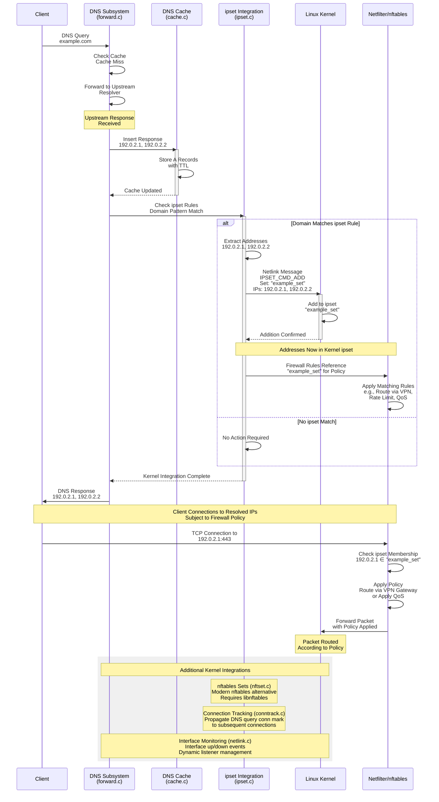

### 4.7.3 External Script Integration

The helper process architecture enables external script execution while maintaining security isolation and service reliability.

**Helper Process Architecture**: A separate privileged helper process (`src/helper.c`) forks during daemon initialization. This process maintains root privileges or configured script user privileges, isolated from the main event loop. Communication occurs via pipe using serialized event data. This architecture prevents script execution from blocking the main event loop and isolates potential script failures from core network services.

**Event Queuing and Serialization**: DHCP events (lease add, delete, old), TFTP transfer completions, and ARP updates (if enabled) are queued as structured data. Events serialize to pipe with event type identifier, client identifiers (MAC address, client-id), network addresses (IPv4/IPv6), hostname strings, and event-specific metadata. The helper process deserializes events and prepares script execution environment.

**Script Execution Model**: Scripts execute synchronously with respect to event processing. The main daemon waits for script completion before proceeding with next event. This synchronous model ensures lease database consistency and enables scripts to influence ongoing operations. Script receives event data as command-line arguments (operation, MAC, IP, hostname) and environment variables for additional context. Script exit status is checked, and non-zero exits are logged as errors.

**Lua Script Integration**: When Lua support is enabled (`HAVE_LUASCRIPT`), the helper process embeds Lua 5.2 interpreter. Lua scripts register callback functions invoked on lease events. The scripting environment provides programmatic access to lease data, enabling complex conditional logic and dynamic DHCP option generation beyond declarative configuration capabilities.

**Error Isolation**: Script execution failures (crash, timeout, non-zero exit) are logged but don't disrupt network service. The main event loop continues processing even if scripts fail, ensuring script problems don't cause service outages. Timeout mechanisms (configurable) prevent indefinite hangs from non-terminating scripts.

```mermaid
sequenceDiagram
    participant Main as Main Process<br/>Event Loop
    participant Pipe as IPC Pipe
    participant Helper as Helper Process<br/>(helper.c)
    participant Script as External Script
    
    Note over Main,Helper: Initialization Phase
    Main->>Main: Fork Helper Process<br/>during Startup
    Main->>Pipe: Create Pipe<br/>for IPC
    Main->>Helper: Fork Child Process
    Helper->>Helper: Retain Privileges<br/>setuid to script user
    Helper->>Helper: Initialize Lua<br/>(if HAVE_LUASCRIPT)
    
    Note over Main,Script: DHCP Lease Event
    
    Main->>Main: DHCP Lease Allocated<br/>IP: 192.168.1.100<br/>MAC: aa:bb:cc:dd:ee:ff<br/>Hostname: laptop
    
    alt Script Configured
        Main->>Pipe: Serialize Event Data<br/>Type: LEASE_ADD<br/>MAC: aa:bb:cc:dd:ee:ff<br/>IP: 192.168.1.100<br/>Hostname: laptop
        activate Pipe
        Pipe-->>Helper: Event Data
        deactivate Pipe
        
        Helper->>Helper: Deserialize Event<br/>Extract Parameters
        
        alt Shell Script Mode
            Helper->>Script: Fork + Exec Script<br/>Args: add, MAC, IP, Hostname
            activate Script
            Script->>Script: Execute Custom Logic<br/>Update Firewall<br/>Notify Monitoring<br/>Update Database
            Script-->>Helper: Exit Status
            deactivate Script
            
            Helper->>Helper: Check Exit Status<br/>Log if Non-Zero
            
        else Lua Script Mode
            Helper->>Helper: Call Lua Function<br/>lease(action, mac, ip, hostname)
            activate Helper
            Helper->>Helper: Lua Script Executes<br/>Programmatic Logic<br/>Return Values
            deactivate Helper
        end
        
        Helper->>Pipe: Signal Completion<br/>to Main Process
        activate Pipe
        Pipe-->>Main: Script Complete
        deactivate Pipe
        
        Main->>Main: Continue Processing<br/>Script Acknowledged
        
    else No Script Configured
        Main->>Main: Skip Script Execution<br/>Continue Processing
    end
    
    Note over Main,Script: TFTP Transfer Event
    
    Main->>Main: TFTP Transfer Complete<br/>File: bootx64.efi<br/>Client: 192.168.1.50
    
    Main->>Pipe: Serialize Event<br/>Type: TFTP_TRANSFER<br/>File: bootx64.efi<br/>IP: 192.168.1.50
    activate Pipe
    Pipe-->>Helper: Event Data
    deactivate Pipe
    
    Helper->>Script: Execute Script<br/>TFTP Event Notification
    activate Script
    Script->>Script: Log Transfer<br/>Update Inventory
    Script-->>Helper: Complete
    deactivate Script
    
    Helper->>Pipe: Signal Completion
    Pipe-->>Main: Acknowledged
    
    Note over Main,Script: Error Handling
    
    Main->>Pipe: Serialize Event<br/>Type: LEASE_DELETE
    Pipe-->>Helper: Event Data
    
    Helper->>Script: Execute Script<br/>delete action
    activate Script
    Script->>Script: Script Crashes<br/>or Timeout
    Script-->>Helper: Non-Zero Exit<br/>or Kill Signal
    deactivate Script
    
    Helper->>Helper: Log Script Failure<br/>"script execution failed"<br/>Error Details
    Helper->>Pipe: Signal Completion<br/>Despite Failure
    Pipe-->>Main: Script Failed<br/>(logged)
    
    Main->>Main: Continue Service<br/>Error Isolated<br/>Network Service Unaffected
    
    rect rgb(255, 250, 200)
        Note over Main,Helper: Architecture Benefits:<br/>1. Security: Privilege isolation<br/>2. Reliability: Failure isolation<br/>3. Flexibility: Custom automation<br/>4. Performance: Non-blocking execution
    end
```

## 4.8 References

This Process Flowchart section is based on comprehensive analysis of the dnsmasq codebase and documentation. All process flows, state transitions, and integration patterns are derived from source code examination and configuration documentation.

### 4.8.1 Source Files Referenced

#### Core Infrastructure
- `src/dnsmasq.c` - Main event loop, daemon initialization, signal handling, subsystem coordination
- `src/dnsmasq.h` - Global state structure, configuration definitions, cross-subsystem contracts
- `src/option.c` - Configuration parsing, command-line argument processing
- `src/poll.c` - Event polling infrastructure, socket multiplexing
- `src/network.c` - Socket and listener management, interface filtering

#### DNS Subsystem
- `src/forward.c` - DNS query forwarding, upstream transaction management, response processing (lines 30, 107, 384-392, 608-800, 748-754)
- `src/cache.c` - DNS cache implementation, LRU eviction, DHCP-DNS integration, hosts file loading
- `src/rfc1035.c` - DNS protocol parsing, packet validation, message construction
- `src/auth.c` - Authoritative DNS server, zone management, zone transfers
- `src/dnssec.c` - DNSSEC validation, chain-of-trust verification
- `src/crypto.c` - Cryptographic operations, signature verification algorithms
- `src/loop.c` - DNS forwarding loop detection and prevention

#### DHCP Subsystem
- `src/dhcp.c` - DHCP packet handling, socket management
- `src/rfc2131.c` - DHCPv4 state machine, PXE boot logic (lines 69, 944-1001, 1082-1177, 1180-1279, 1353-1362)
- `src/dhcp6.c` - DHCPv6 protocol implementation, stateful allocation
- `src/rfc3315.c` - DHCPv6 state machine, message processing
- `src/lease.c` - Lease persistence, database management (lines 21-22, 24-141, 143)
- `src/dhcp-common.c` - Common DHCP utilities, option processing
- `src/outpacket.c` - DHCPv6 option assembly, packet construction

#### IPv6 Support
- `src/radv.c` - Router advertisement implementation, ICMPv6 handling
- `src/slaac.c` - SLAAC address derivation, duplicate address detection

#### Network Boot
- `src/tftp.c` - TFTP server implementation, file transfer protocol (lines 24, 30-35, 37-42, 44-96)
- PXE boot integrated in `src/rfc2131.c` - Architecture detection, boot file selection

#### Integration Components
- `src/helper.c` - Privileged helper process, script execution, Lua integration (lines 36-49, 52-74, 79-127)
- `src/ipset.c` - Linux ipset integration, netlink communication
- `src/nftset.c` - nftables integration, modern firewall support
- `src/conntrack.c` - Connection tracking mark propagation
- `src/netlink.c` - Linux network interface monitoring, address/route tracking
- `src/bpf.c` - BSD network interface enumeration

#### Utility Components
- `src/util.c` - Portable helper functions, error handling wrappers
- `src/log.c` - Asynchronous logging, syslog integration
- `src/inotify.c` - Linux file monitoring, automatic configuration reload

#### Configuration References
- `src/config.h` - Compile-time feature flags, default parameters (lines 17, 33, 35, 43, 46, 47-48, 49, 50, 52, 54, 55, 56-58, 59, 60, 138-139, 176-183, 189-190, 192-196, 198-199, 253-310, 329-331, 339-341)
- `dnsmasq.conf.example` - Configuration examples, timing parameters, workflow documentation (lines 7-46, 136-160, 162-308, 191-227, 448-506, 508-540, 572)

#### Protocol Definitions
- `src/dns-protocol.h` - DNS message structure, record types
- `src/dhcp-protocol.h` - DHCP message types, option definitions
- `src/dhcp6-protocol.h` - DHCPv6 message structure, DUID handling
- `src/radv-protocol.h` - Router advertisement format, ICMPv6 options

### 4.8.2 Technical Specification Sections

- **1.2 System Overview** - High-level architecture, component descriptions, design approach, deployment context
- **2.1 Feature Catalog** - Comprehensive feature descriptions including F-001 through F-021, implementation details, dependencies

### 4.8.3 Key Technical Documents

- RFC 1035 - Domain Names (DNS protocol foundation)
- RFC 2131 - DHCPv4 protocol specification
- RFC 3315 - DHCPv6 protocol specification
- RFC 1350 - TFTP protocol specification
- RFC 2348 - TFTP Blocksize Option
- RFC 2349 - TFTP Timeout Interval and Transfer Size Options
- RFC 4861 - IPv6 Neighbor Discovery (Router Advertisements)
- RFC 4862 - IPv6 Stateless Address Autoconfiguration (SLAAC)
- RFC 6106 - IPv6 Router Advertisement Options for DNS Configuration (RDNSS)

### 4.8.4 Repository Structure

All source code referenced is located in the `src/` directory of the dnsmasq repository. Configuration examples are in the root directory (`dnsmasq.conf.example`). Build system documentation is in `Makefile`. Platform-specific integrations are in `contrib/` directory for various platforms including Linux systemd, macOS launchd, Solaris SMF, and OpenWrt ubus.

### 4.8.5 Default Configuration Parameters

Resource limits and timing parameters referenced throughout flowcharts:
- **DNS cache size**: 150 entries (configurable, `src/config.h:33`)
- **Outstanding DNS queries**: 150 concurrent maximum (`src/config.h:17`)
- **DHCP lease maximum**: 1000 leases (`src/config.h:35`)
- **DHCPv4 default lease time**: 3600 seconds (1 hour, `src/config.h:46`)
- **DHCPv6 default lease time**: 86400 seconds (24 hours)
- **TCP connections**: 20 maximum (`src/config.h:17`)
- **TFTP concurrent transfers**: 50 maximum (`src/config.h:49`)
- **TFTP default block size**: 512 bytes
- **TFTP maximum block size**: 65464 bytes (`src/config.h:50`)
- **Authoritative DNS default TTL**: 600 seconds (`src/config.h:55`)
- **SOA refresh interval**: 1200 seconds (`src/config.h:56`)
- **SOA retry interval**: 180 seconds (`src/config.h:57`)
- **SOA expiry interval**: 1209600 seconds (14 days, `src/config.h:58`)

All workflows documented in this section represent actual implementation behavior derived from source code analysis, providing accurate technical reference for system operation and integration.

# 5. System Architecture

## 5.1 High-Level Architecture

### 5.1.1 System Overview

#### 5.1.1.1 Overall Architecture Style and Rationale

dnsmasq implements an **event-driven single-threaded architecture** using the Reactor pattern with a centralized poll-based event loop. This architectural style was deliberately chosen to optimize for the small network deployment context where simplicity, predictability, and minimal resource consumption take precedence over theoretical performance maximization.

The main event loop, implemented in `src/dnsmasq.c` (lines 1056-1286), continuously polls network sockets for all service protocols—DNS (port 53), DHCPv4 (ports 67/68), DHCPv6 (port 547), TFTP (port 69), and control interfaces. Socket activity triggers specific protocol handlers that process requests synchronously within the single execution thread, update shared state structures, and generate responses without requiring context switching or thread synchronization mechanisms.

**Rationale for Single-Threaded Design:**

1. **Memory Efficiency**: Eliminates thread stack overhead, which is critical for embedded systems operating with 8-16MB of total RAM. Each thread typically requires 1-8MB of stack space; avoiding threads enables operation on extremely resource-constrained platforms.

2. **Deterministic Behavior**: Removes race conditions, deadlocks, and non-deterministic thread scheduling issues. For network infrastructure software where predictable behavior is paramount, eliminating concurrency complexity ensures reliable operation.

3. **Sufficient Performance**: The target deployment scale (150 concurrent DNS queries, 1000 DHCP leases by default) does not require multi-core parallelization. Single-thread performance suffices for small network traffic volumes while maintaining simplicity.

4. **Universal Portability**: The poll() system call is available on all UNIX-like platforms without requiring platform-specific threading libraries or advanced synchronization primitives.

**Architectural Constraints Accepted:**

The single-threaded design accepts the constraint that the daemon cannot leverage multi-core processors for parallel request processing. However, this limitation proves irrelevant at the target scale where I/O operations (network packets, disk writes) dominate over CPU processing. The architecture explicitly prohibits blocking operations within the event loop, requiring careful use of non-blocking I/O and asynchronous patterns to maintain responsiveness.

#### 5.1.1.2 Key Architectural Principles

**Principle 1: Tight Subsystem Integration Through Shared State**

Unlike traditional multi-daemon approaches where DNS and DHCP operate as independent services requiring external synchronization, dnsmasq integrates all network services within a single process sharing a unified state structure. The global daemon structure defined in `src/dnsmasq.h` (lines 1099-1250) serves as the runtime contract shared across all subsystems.

This integration enables atomic operations across subsystems:
- Every DHCP lease allocation automatically triggers DNS cache insertion via `cache_add_dhcp_entry()` in `src/cache.c`, ensuring instantaneous name resolution for newly configured hosts without external synchronization
- DHCPv6 subsystem (`src/dhcp6.c`) coordinates directly with Router Advertisement subsystem (`src/radv.c`) to set M/O flags appropriately, directing IPv6 clients toward stateful or stateless autoconfiguration
- PXE boot detection in DHCP handlers (`src/rfc2131.c:69`) seamlessly coordinates boot parameter delivery with TFTP server activation for network boot scenarios

This architectural principle eliminates the IPC overhead, synchronization delays, and consistency challenges inherent in multi-daemon deployments while providing superior integration with lower operational complexity.

**Principle 2: Platform Abstraction with Conditional Compilation**

The codebase maintains a clear separation between platform-independent protocol logic and platform-specific system integration. The build system, configured through `src/config.h` (lines 253-310), automatically detects the target platform and selects appropriate implementations:

- **Linux**: Netlink-based interface monitoring (`src/netlink.c`) provides asynchronous notification of network interface changes, address assignments, and routing updates through kernel netlink sockets
- **BSD/macOS**: Berkeley Packet Filter (BPF) based interface enumeration (`src/bpf.c`) uses BPF sockets for network interface discovery and monitoring
- **Solaris**: Solaris-specific network APIs provide equivalent functionality through STREAMS-based networking interfaces

This abstraction strategy enables optimal use of native platform capabilities while maintaining a single codebase. Each platform implementation uses its most efficient native APIs rather than degrading to lowest-common-denominator portability layers.

**Principle 3: Privilege Separation for Security**

The daemon implements defense-in-depth security through privilege separation. The startup sequence follows this pattern:

1. **Initialization as Root** (required): Bind privileged ports (DNS port 53, DHCP ports 67/68) which require root privileges
2. **Helper Process Fork** (`src/helper.c:79-98`): Fork a helper process that retains root privileges for executing administrator-configured lease scripts
3. **Privilege Drop**: Drop to unprivileged user (default "nobody", configurable via `src/config.h:47-48`) using setuid system call
4. **Restricted Operation**: Main event loop operates with minimal privileges, limiting attack surface

This architecture ensures that the network-facing event loop processing untrusted client requests operates without root privileges. The helper process, which retains root access, communicates with the main process via a pipe IPC mechanism and validates all data from the main process to prevent privilege escalation attacks. Even if an attacker compromises the main process through a protocol parsing vulnerability, they cannot execute arbitrary root commands.

**Principle 4: Modular Compile-Time Configuration**

The system employs extensive compile-time feature flags to enable binary customization for diverse deployment requirements. `src/config.h` defines feature gates that control inclusion of optional functionality:

**Core Features** (always enabled):
- DNS caching and forwarding
- DHCPv4 and DHCPv6 servers
- TFTP server for network boot
- Authoritative DNS server mode
- DNS forwarding loop detection

**Optional Features** (require explicit enablement and external libraries):
- DNSSEC validation (requires libnettle cryptographic library, `src/config.h:198`)
- D-Bus control interface (requires libdbus, `src/config.h:193`)
- Internationalized domain name support (requires libidn2, `src/config.h:189-190`)
- Linux kernel integration (ipset, nftables, conntrack)
- Lua scripting for advanced policy implementation
- Metrics collection subsystem

Embedded system developers can minimize binary size by excluding unused features, reducing both flash storage requirements and security attack surface. A minimal build with only DNS and DHCP can operate in under 500KB of memory, while a full-featured build with DNSSEC and all integrations requires 2-8MB depending on configuration and active state.

**Principle 5: Defensive Programming for Infrastructure Reliability**

Network infrastructure software operates continuously without human intervention and must handle malformed input, resource exhaustion, and system failures gracefully. The implementation reflects defensive coding practices throughout:

- **Extensive Input Validation**: All protocol parsing includes boundary checking, length validation, and malformed packet rejection
- **Safe Memory Management**: Wrapper functions around malloc/realloc (`src/util.c`) check for allocation failures and handle them gracefully rather than assuming infinite memory
- **Robust I/O Handling**: Network I/O wrappers handle partial reads/writes, signal interruption (EINTR), and transient failures with appropriate retry logic
- **Bounds Checking**: Array accesses and buffer operations include explicit bounds checking to prevent buffer overflows
- **Resource Limits**: Configurable limits on concurrent operations (DNS queries, DHCP leases, TFTP transfers) prevent resource exhaustion

This defensive approach prioritizes correctness and stability over theoretical performance optimization, reflecting the reliability requirements where infrastructure failure affects all network-connected systems.

#### 5.1.1.3 System Boundaries and Major Interfaces

**Network Service Interfaces (Primary Boundaries):**

The daemon exposes multiple network service interfaces simultaneously:

1. **DNS Service Interface**: UDP and TCP on port 53
   - Accepts DNS queries from local network clients
   - Forwards to upstream recursive DNS servers
   - Returns cached or forwarded responses

2. **DHCPv4 Service Interface**: UDP ports 67 (server) and 68 (client)
   - Receives DHCP DISCOVER, REQUEST, RELEASE messages
   - Sends DHCP OFFER, ACK, NAK responses
   - Supports BOOTP protocol for legacy compatibility

3. **DHCPv6 Service Interface**: UDP port 547
   - Processes DHCPv6 SOLICIT, REQUEST, RENEW, REBIND messages
   - Provides both stateful address allocation and stateless configuration

4. **Router Advertisement Interface**: ICMPv6
   - Responds to Router Solicitation messages
   - Periodically multicasts Router Advertisement messages
   - Coordinates with DHCPv6 for M/O flag management

5. **TFTP Service Interface**: UDP port 69
   - Serves boot images and configuration files
   - Implements read-only TFTP protocol (RFC 1350)
   - Supports block size negotiation (RFC 2348)

**Platform Integration Boundaries:**

1. **Kernel Network Stack**: Platform-specific APIs monitor network interfaces and addresses
   - Linux: Netlink sockets provide asynchronous notifications
   - BSD: BPF sockets enable interface enumeration
   - Solaris: STREAMS-based networking APIs

2. **Kernel Firewall Integration**: Optional integration with packet filtering
   - Linux ipset: Add resolved addresses to named IP sets (`src/ipset.c`)
   - Linux nftables: Populate nftables sets with addresses (`src/nftset.c`)
   - BSD PF: Manage PF table entries (`src/tables.c`)
   - Linux conntrack: Propagate connection tracking marks (`src/conntrack.c`)

**Control and Management Boundaries:**

1. **Signal-Based Control**: UNIX signals provide administrative interface
   - SIGHUP: Reload configuration and flush DNS cache
   - SIGUSR1: Dump cache and lease statistics to syslog
   - SIGTERM: Initiate graceful shutdown with lease synchronization

2. **D-Bus Control Interface** (optional): Object-oriented IPC for desktop integration
   - SetServers: Dynamically update upstream DNS servers
   - ClearCache: Flush DNS cache programmatically
   - GetVersion: Query daemon version information
   - Access controlled via `/etc/dbus-1/system.d/dnsmasq.conf` policy file

3. **ubus Control Interface** (optional, OpenWrt): Embedded system control
   - Similar functionality to D-Bus adapted for embedded Linux

**Data Persistence Boundaries:**

1. **DHCP Lease Database**: `/var/lib/misc/dnsmasq.leases`
   - Text format: timestamp, MAC address, IP address, hostname, client-id
   - Synchronous writes on lease changes ensure consistency
   - Read on startup to restore lease state

2. **Configuration Files**: `/etc/dnsmasq.conf` and `/etc/dnsmasq.d/*.conf`
   - Text-based configuration directives
   - Reloadable via SIGHUP without service interruption

3. **Static Host Definitions**: `/etc/hosts`
   - Standard UNIX hosts file format
   - Loaded into DNS cache on startup and configuration reload

**Logging and Monitoring Boundaries:**

1. **Syslog Interface**: RFC 3164 protocol
   - Asynchronous queued logging prevents deadlock with syslogd
   - Configurable facility and priority levels

2. **Direct Log File**: Optional file-based logging
   - Bypasses syslog for embedded systems without syslogd

3. **Metrics Collection** (optional): Internal counters for monitoring
   - DNS cache hit/miss ratios
   - Active DHCP lease counts
   - Upstream server health status

### 5.1.2 Core Components Table

| Component Name | Primary Responsibility | Key Dependencies | Integration Points |
|---------------|------------------------|------------------|-------------------|
| **Event Loop Orchestrator** (`dnsmasq.c`) | Centralized poll-based event loop coordinating all subsystems | `poll.c` for event polling, all protocol handlers | All subsystems register sockets; dispatches to appropriate handlers |
| **DNS Subsystem** (`cache.c`, `forward.c`, `rfc1035.c`) | Caching forwarding DNS resolver with optional authoritative mode | Upstream recursive DNS servers, optional libnettle for DNSSEC | DHCP (automatic name registration), Kernel (ipset/nftables integration), `/etc/hosts` |
| **DHCP Subsystem** (`dhcp.c`, `dhcp6.c`, `lease.c`) | IPv4/IPv6 dynamic address allocation and management | Lease database file, network interfaces | DNS cache (name registration), Helper process (script execution), Platform network layer |
| **Router Advertisement** (`radv.c`, `slaac.c`) | IPv6 autoconfiguration and prefix distribution | DHCPv6 subsystem for coordination | DHCPv6 (M/O flag control), DNS (SLAAC hostname registration) |
| **TFTP/PXE Server** (`tftp.c`) | Network boot image delivery | Filesystem for boot image storage, DHCP for boot parameters | DHCP subsystem (boot parameter exchange), Read-only filesystem access |
| **Network Layer** (`network.c`, `netlink.c`, `bpf.c`) | Platform-specific interface enumeration and socket management | Platform kernel APIs (netlink/BPF) | All protocol handlers (socket creation), Kernel (interface monitoring) |
| **Helper Process** (`helper.c`) | Privileged script execution for lease events | Lease change notifications from DHCP | DHCP subsystem (pipe IPC), Administrator scripts (fork/exec) |
| **Logging System** (`log.c`) | Asynchronous queued logging to prevent deadlock | Syslog daemon or log file | All components (event logging), Queue management |

### 5.1.3 Data Flow Description

#### 5.1.3.1 Primary Data Flows

**DNS Query Resolution Flow:**

The DNS query resolution process exemplifies the cache-first, forward-on-miss pattern central to the DNS subsystem architecture:

1. **Query Reception**: Client sends DNS query packet → Event loop receives on UDP/TCP port 53
2. **Event Dispatch**: Poll infrastructure in `src/poll.c` detects socket activity, dispatches to DNS protocol handler in `src/forward.c`
3. **Cache Lookup**: DNS handler extracts query name and type, performs hash table lookup in `src/cache.c`
4. **Cache Hit Path**: If entry found and not expired, extract cached response data, construct DNS response packet, send directly to client (sub-millisecond latency)
5. **Cache Miss Path**: If no cached entry, allocate query tracking structure, select upstream server using round-robin with health tracking, forward query to upstream DNS server
6. **Upstream Response**: Receive response from upstream server, validate transaction ID and query section to prevent poisoning attacks, check for DNS rebinding attempts (`src/forward.c:748-754`)
7. **Cache Insertion**: Insert validated response into cache with LRU eviction policy, forward response to original client
8. **Optional Kernel Integration**: If configured, add resolved addresses to kernel ipset or nftables sets for firewall rule integration

**DHCP Lease Allocation Flow:**

The DHCP lease allocation process demonstrates tight DNS integration and careful state management:

1. **Discovery Reception**: Client broadcasts DHCPDISCOVER → Event loop receives on UDP port 67
2. **Protocol Dispatch**: Event loop dispatches to DHCP handler in `src/rfc2131.c`
3. **Client Identification**: Extract client MAC address from chaddr field, parse Client Identifier option if present
4. **Address Selection**: Determine IP address assignment using priority order:
   - Reuse existing lease if client previously had assignment
   - Use static reservation if configured for client MAC/DUID
   - Honor client-requested address if available in pool
   - Allocate next available address from pool
5. **Conflict Detection**: Optionally send ICMP echo request to proposed address (1-2 second timeout) to detect conflicts
6. **Offer Transmission**: Send DHCPOFFER with proposed address and configuration options
7. **Request Processing**: Receive DHCPREQUEST from client accepting offer
8. **Critical Integration Point - Lease Persistence**: Synchronously write lease to `/var/lib/misc/dnsmasq.leases` to ensure durability across restarts
9. **Critical Integration Point - DNS Registration**: Call `cache_add_dhcp_entry()` in `src/cache.c` to automatically create:
   - Forward DNS record (A or AAAA) mapping hostname to IP address
   - Reverse DNS record (PTR) mapping IP address to hostname
10. **Optional Script Execution**: Via helper process, execute administrator-configured script with lease details in environment variables
11. **Acknowledgment**: Send DHCPACK to client confirming address allocation

**IPv6 Autoconfiguration Coordination Flow:**

The IPv6 subsystem demonstrates sophisticated cross-subsystem coordination:

1. **Router Solicitation**: Client sends ICMPv6 Router Solicitation on link-local multicast
2. **RA Handler Activation**: Event loop dispatches to router advertisement handler in `src/radv.c`
3. **Configuration Determination**: Query DHCPv6 configuration to determine autoconfiguration mode
4. **RA Construction**: Build Router Advertisement packet with:
   - Prefix information (network prefix, prefix length, valid/preferred lifetimes)
   - M flag (managed address configuration) - set if DHCPv6 stateful mode enabled
   - O flag (other configuration) - set if DHCPv6 stateless mode enabled
   - RDNSS (Recursive DNS Server) option with DNS server addresses
5. **RA Transmission**: Send Router Advertisement to client
6. **SLAAC Address Monitoring**: Monitor neighbor advertisements (`src/slaac.c`) to detect derived addresses (EUI-64 or privacy addresses)
7. **Cross-Subsystem Integration**: Cross-reference client MAC address with DHCPv4 lease database to obtain hostname
8. **DNS Registration**: Automatically register SLAAC-derived IPv6 address with hostname from DHCPv4 lease in DNS cache, enabling consistent naming across IPv4 and IPv6

#### 5.1.3.2 Integration Patterns and Protocols

**Upstream DNS Integration:**

- **Protocol**: DNS over UDP (primary), DNS over TCP (fallback for truncated responses)
- **Pattern**: Request-response with timeout-based failure detection
- **Server Selection**: Round-robin with health tracking; failed servers marked down after threshold
- **Timeout Handling**: 10-second default timeout; automatic failover to next upstream server
- **Health Recovery**: Periodic health checks (60-second intervals) restore failed servers when responsive

**Kernel Integration:**

- **Linux Netlink**: Bidirectional socket for interface/address/route monitoring
  - Asynchronous notifications when network configuration changes
  - Query/response for interface enumeration on startup
  
- **ipset/nftables**: Unidirectional API calls to add resolved addresses
  - Synchronous add operations with no retry on failure
  - Selective address addition based on domain matching rules

**Helper Process IPC:**

- **Mechanism**: UNIX pipe for parent-to-child communication
- **Protocol**: Text-based environment variable passing
- **Security**: Helper validates all data from main process
- **Execution**: Fork/exec model with configurable timeout

**D-Bus Control:**

- **Protocol**: D-Bus method calls and signals
- **Service Name**: `uk.org.thekelleys.dnsmasq`
- **Security**: Policy-based access control via `/etc/dbus-1/system.d/dnsmasq.conf`
- **Methods**: SetServers, ClearCache, GetVersion, etc.

#### 5.1.3.3 Data Transformation Points

**1. Protocol Wire Format Transformations:**

- **DNS Name Compression**: Wire format uses pointer compression to reduce packet size; internal representation uses uncompressed null-terminated strings (`src/rfc1035.c`)
- **DHCP Option Encoding**: Internal option structures with type-safe accessors transform to wire format option sequences with length prefixes
- **Binary-to-Text Address Conversion**: Network byte order binary addresses convert to string representations for logging and configuration

**2. DNS Record Type Transformations:**

- **Cache Storage Format**: DNS records decompose into normalized internal format for efficient storage and comparison
- **Response Construction**: Cached internal format reconstructs into wire format DNS response packets with proper compression

**3. Lease Database Serialization:**

- **In-Memory Format**: Structured lease records with pointers and binary addresses
- **File Format**: Tab-separated text: `<expiry> <mac> <ip> <hostname> <client-id>`
- **Transformation**: Bidirectional conversion on startup (read) and lease changes (write)

**4. Configuration Parsing:**

- **Source**: Text directives in configuration files
- **Target**: Internal runtime structures with typed fields
- **Validation**: Type checking, range validation, dependency verification during parsing

#### 5.1.3.4 Key Data Stores and Caches

| Data Store | Location | Format | Purpose | Persistence Strategy |
|-----------|----------|--------|---------|---------------------|
| **DNS Cache** | Memory (`src/cache.c`) | Hash table + LRU doubly-linked list | Fast DNS query resolution | Volatile; reconstructed from `/etc/hosts` and DHCP leases on startup |
| **DHCP Lease Database** | `/var/lib/misc/dnsmasq.leases` | Text (timestamp, MAC, IP, hostname, client-id) | Lease state across restarts | Synchronous write on allocation/renewal/release; atomic file replacement |
| **Configuration State** | Memory | Native C structures | Runtime configuration parameters | Loaded from `/etc/dnsmasq.conf` on startup; reloadable via SIGHUP |
| **Upstream Server List** | Memory | Array with health status flags | DNS server selection and failover | Derived from `/etc/resolv.conf` or explicit configuration |

### 5.1.4 External Integration Points

| System Name | Integration Type | Data Exchange Pattern | Protocol/Format |
|------------|------------------|----------------------|-----------------|
| **Upstream DNS Servers** | Outbound client | Request-response (UDP/TCP) | DNS RFC 1035; 10-50ms expected RTT |
| **Linux Kernel Netlink** | Bidirectional IPC | Event notification + synchronous query | Netlink sockets; real-time interface/address change notifications |
| **Kernel ipset/nftables** | Outbound API | Unidirectional add operations | Netlink protocol; synchronous with no retry |
| **Syslog Daemon** | Outbound logging | Asynchronous queued messages | RFC 3164 syslog; non-blocking queue up to max_logs |
| **D-Bus System Bus** | Bidirectional RPC | Method calls + signals | D-Bus wire protocol; optional—continues without D-Bus |
| **Helper Scripts** | Outbound process execution | Fork/exec with environment variables | UNIX process model; configurable timeout |
| **Lease Database File** | Persistent storage | Read on startup, synchronous write on changes | Text format (tab-separated values) |
| **TFTP Filesystem** | Read-only file access | Standard POSIX file I/O | OS filesystem; files must be in configured root directory |

## 5.2 Component Details

### 5.2.1 Event Loop Orchestrator

#### 5.2.1.1 Purpose and Responsibilities

The event loop orchestrator, implemented primarily in `src/dnsmasq.c` (lines 1056-1286), serves as the central coordination point for all daemon operations. Its responsibilities encompass:

1. **Event Multiplexing**: Monitor all service sockets (DNS, DHCP, DHCPv6, TFTP, control interfaces) simultaneously using poll() system call
2. **Subsystem Dispatch**: Route socket activity to appropriate protocol handlers based on socket type and packet content
3. **Signal Handling**: Process asynchronous signals (SIGHUP, SIGUSR1, SIGTERM) for administrative control
4. **Timing Management**: Handle periodic tasks (lease expiration checks, upstream server health monitoring, router advertisement transmission)
5. **State Coordination**: Maintain global daemon state structure shared across all subsystems

#### 5.2.1.2 Technologies and Frameworks

- **Core Implementation**: Pure ANSI C without external framework dependencies
- **Event Polling**: `poll()` system call with binary search optimization in `src/poll.c` for efficient large socket set management
- **Signal Handling**: POSIX signal handlers with self-pipe trick for safe asynchronous signal processing
- **Timer Management**: Custom timer infrastructure using sorted linked list for efficient timeout handling

#### 5.2.1.3 Key Interfaces and APIs

**External Interfaces:**
- UNIX signals: SIGHUP (reload), SIGUSR1 (dump state), SIGTERM (shutdown)
- D-Bus control methods (optional): SetServers, ClearCache, GetVersion

**Internal Interfaces:**
- `poll_listen(fd, event)`: Register socket for event monitoring
- `poll_reset()`: Clear all registered sockets (used during configuration reload)
- Protocol handler registration: Each subsystem registers handlers for its sockets

**State Structure:**
- Global `struct daemon` defined in `src/dnsmasq.h:1099-1250` contains all runtime state
- Shared by reference across all subsystem modules

#### 5.2.1.4 Data Persistence Requirements

The event loop orchestrator itself maintains no persistent state. However, it coordinates persistence operations:
- Triggers lease database synchronization on SIGTERM
- Reloads configuration files on SIGHUP
- Coordinates DNS cache reconstruction on startup

#### 5.2.1.5 Scaling Considerations

- **Socket Limit**: Default 20 maximum TCP connections (`src/config.h:17`), configurable via `--max-tcp-connections`
- **Poll Optimization**: Binary search through registered sockets provides O(log n) lookup for large socket sets
- **Single-Thread Constraint**: Cannot leverage multi-core CPUs; suitable for small network scale where I/O dominates over CPU
- **Memory Scaling**: Event loop overhead remains constant regardless of traffic volume; per-request state scales linearly

### 5.2.2 DNS Subsystem

#### 5.2.2.1 Purpose and Responsibilities

The DNS subsystem provides comprehensive DNS resolution services:

1. **Caching Resolver**: Cache frequently accessed DNS records to minimize upstream queries and reduce latency
2. **Query Forwarding**: Forward cache misses to upstream recursive DNS servers
3. **Authoritative Server**: Serve authoritative responses for configured local zones
4. **Name Registration**: Automatically register DHCP-allocated hostnames for seamless local name resolution
5. **DNSSEC Validation**: Optionally validate DNSSEC signatures to prevent DNS spoofing (requires libnettle)
6. **Rebinding Protection**: Block responses with private IP addresses for public domains to prevent security vulnerabilities

#### 5.2.2.2 Technologies and Frameworks

- **Core Protocol**: RFC 1035 (DNS) implementation in `src/rfc1035.c`
- **Caching**: Hash table with LRU eviction in `src/cache.c`
- **DNSSEC**: Optional cryptographic validation using libnettle library (`src/dnssec.c`, `src/crypto.c`)
- **Extended DNS**: EDNS0 support in `src/edns0.c` for larger packet sizes and metadata
- **Loop Detection**: Forwarding loop prevention in `src/loop.c`

#### 5.2.2.3 Key Interfaces and APIs

**External Interfaces:**
- UDP/TCP port 53 for client queries
- UDP/TCP to upstream DNS servers

**Internal Interfaces:**
- `cache_insert(name, address, ttl)`: Add entry to DNS cache
- `cache_find_by_name(name, type)`: Retrieve cached entry
- `cache_add_dhcp_entry(hostname, address)`: Register DHCP hostname
- `forward_query(header, size)`: Forward query to upstream servers

**Integration Points:**
- DHCP subsystem calls `cache_add_dhcp_entry()` on lease allocation
- Kernel integration via ipset/nftables for resolved address management
- `/etc/hosts` file loaded into cache on startup

#### 5.2.2.4 Data Persistence Requirements

**Volatile Cache**: DNS cache resides entirely in memory with no persistence. On restart:
- Reload `/etc/hosts` entries into cache
- Reconstruct DHCP hostname entries from lease database
- Cache rebuilds naturally through subsequent queries

**Configuration Persistence**: Upstream server list, domain-specific forwarding rules, and authoritative zone definitions persist in configuration files.

#### 5.2.2.5 Scaling Considerations

- **Cache Size**: Default 150 entries (`src/config.h:33`), configurable via `--cache-size`
- **Hash Table**: Size should be power of 2 for optimal distribution; default sizing balances memory vs. lookup performance
- **Outstanding Queries**: Maximum 150 concurrent queries (`src/config.h:17`); beyond this, return SERVFAIL to clients
- **TCP Connections**: Each TCP query consumes one connection from the 20-connection pool
- **Memory Formula**: Approximately 100 bytes per cache entry; 150-entry cache requires ~15KB

### 5.2.3 DHCP Subsystem

#### 5.2.3.1 Purpose and Responsibilities

The DHCP subsystem manages dynamic address allocation for both IPv4 and IPv6:

1. **Address Pool Management**: Allocate addresses from configured pools with conflict detection
2. **Static Reservations**: Honor MAC/DUID-based static address assignments
3. **Lease Tracking**: Maintain lease state with expiration and renewal handling
4. **Configuration Delivery**: Provide network configuration parameters (gateway, DNS, NTP, etc.)
5. **PXE Support**: Detect PXE clients and deliver boot parameters
6. **DNS Integration**: Automatically register allocated hostnames in DNS cache

#### 5.2.3.2 Technologies and Frameworks

- **DHCPv4**: RFC 2131 implementation in `src/dhcp.c` and `src/rfc2131.c`
- **DHCPv6**: RFC 3315 implementation in `src/dhcp6.c` and `src/rfc3315.c`
- **Lease Management**: Persistent storage in `src/lease.c`
- **Platform Sockets**: Raw sockets for DHCPv4, standard UDP for DHCPv6
- **Conflict Detection**: ICMP echo (ping) for address conflict prevention

#### 5.2.3.3 Key Interfaces and APIs

**External Interfaces:**
- UDP ports 67/68 for DHCPv4
- UDP port 547 for DHCPv6
- Broadcast/multicast packet handling

**Internal Interfaces:**
- `dhcp_reply(packet, source, interface)`: Process DHCP request and generate response
- `lease_allocate(mac, address)`: Allocate or update lease
- `lease_find_by_client(mac)`: Retrieve existing lease
- `lease_update_file()`: Synchronize lease database to disk

**Integration Points:**
- DNS cache: `cache_add_dhcp_entry()` for hostname registration
- Helper process: Pipe IPC for lease script execution
- Platform network: Interface enumeration and address validation

#### 5.2.3.4 Data Persistence Requirements

**Lease Database**: `/var/lib/misc/dnsmasq.leases` (configurable)
- **Format**: Text file with tab-separated values: `<expiry> <mac> <ip> <hostname> <client-id>`
- **Write Strategy**: Synchronous write on every lease allocation, renewal, or release
- **Read Strategy**: Parse entire file on daemon startup to reconstruct in-memory lease state
- **Corruption Handling**: Parse errors log warning and skip malformed entries; continue with remaining valid leases

**Special Considerations**:
- **Flash-Friendly Mode** (`HAVE_BROKEN_RTC`): Only write on create/delete, not renewals, to minimize flash wear on embedded devices without real-time clock

#### 5.2.3.5 Scaling Considerations

- **Lease Limit**: Default 1000 leases (`src/config.h:35`), configurable via `--dhcp-lease-max`
- **Lookup Performance**: Linear search through lease list; O(n) performance acceptable at target scale
- **File I/O**: Synchronous write on each change may become bottleneck above 1000 leases
- **Ping Delay**: Optional ICMP conflict detection adds 1-2 seconds to initial allocation; disable for faster allocation in trusted networks
- **Memory Formula**: Approximately 200 bytes per lease; 1000 leases require ~200KB

### 5.2.4 Router Advertisement Subsystem

#### 5.2.4.1 Purpose and Responsibilities

The Router Advertisement subsystem enables IPv6 autoconfiguration:

1. **Prefix Distribution**: Advertise IPv6 network prefixes for SLAAC address derivation
2. **Configuration Flags**: Control managed (M) and other (O) flags directing clients to DHCPv6
3. **DNS Information**: Deliver recursive DNS server addresses via RDNSS option
4. **SLAAC Monitoring**: Track addresses derived by clients for DNS registration
5. **DHCPv6 Coordination**: Integrate with DHCPv6 to provide consistent autoconfiguration experience

#### 5.2.4.2 Technologies and Frameworks

- **ICMPv6 Protocol**: Router Advertisement/Solicitation messages
- **SLAAC**: RFC 4862 stateless address autoconfiguration
- **RA Implementation**: `src/radv.c` for router advertisement generation
- **Address Derivation**: `src/slaac.c` for tracking client-derived addresses

#### 5.2.4.3 Key Interfaces and APIs

**External Interfaces:**
- ICMPv6 multicast for Router Solicitation reception
- ICMPv6 multicast for Router Advertisement transmission

**Internal Interfaces:**
- `send_ra(interface, prefix, flags)`: Construct and transmit RA
- `handle_ra_solicitation()`: Process incoming solicitation
- Integration with DHCPv6 for M/O flag determination

**Integration Points:**
- DHCPv6 subsystem: Query configuration to set M/O flags appropriately
- DNS cache: Register SLAAC-derived addresses with hostnames from DHCPv4
- Platform network: Interface prefix discovery

#### 5.2.4.4 Data Persistence Requirements

No persistent state required. Configuration parameters (prefixes, lifetimes, flags) persist in configuration files.

#### 5.2.4.5 Scaling Considerations

- **Transmission Frequency**: RFC-mandated intervals (200-600 seconds) limit overhead
- **Per-Interface Operation**: Separate RA state per network interface
- **SLAAC Tracking**: Minimal overhead for monitoring neighbor advertisements
- **Memory**: Negligible per-interface RA state

### 5.2.5 TFTP/PXE Server

#### 5.2.5.1 Purpose and Responsibilities

The TFTP server enables network boot scenarios:

1. **Boot Image Delivery**: Serve boot images, kernels, and configuration files
2. **Read-Only Security**: Restrict to read operations only; prevent file uploads
3. **PXE Integration**: Coordinate with DHCP for seamless network boot
4. **Block Size Negotiation**: Support RFC 2348 block size option for performance
5. **Concurrent Transfers**: Handle multiple simultaneous client transfers

#### 5.2.5.2 Technologies and Frameworks

- **TFTP Protocol**: RFC 1350 implementation in `src/tftp.c`
- **Block Size**: RFC 2348 extension for negotiated block sizes up to 65464 bytes
- **Filesystem**: Read-only POSIX file I/O
- **Security**: Directory traversal prevention, chroot-like restriction

#### 5.2.5.3 Key Interfaces and APIs

**External Interfaces:**
- UDP port 69 for initial TFTP requests
- Ephemeral UDP ports for individual file transfers

**Internal Interfaces:**
- File path validation and sandboxing
- Coordination with DHCP for PXE boot parameters

#### 5.2.5.4 Data Persistence Requirements

No daemon state persists; reads files directly from filesystem on demand.

#### 5.2.5.5 Scaling Considerations

- **Concurrent Transfers**: Maximum 50 (`src/config.h:49`), configurable via `--tftp-max`
- **Block Size Impact**: Larger blocks reduce packet count but increase packet loss sensitivity
- **Timeout/Retry**: 5-second timeout with 5 maximum retries per block
- **Memory**: Each active transfer requires buffer space for one block (512-65464 bytes)

### 5.2.6 Component Interaction Diagrams

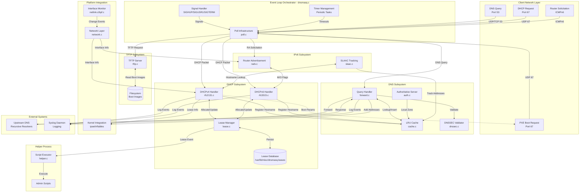

### 5.2.7 DNS Query Resolution Sequence Diagram

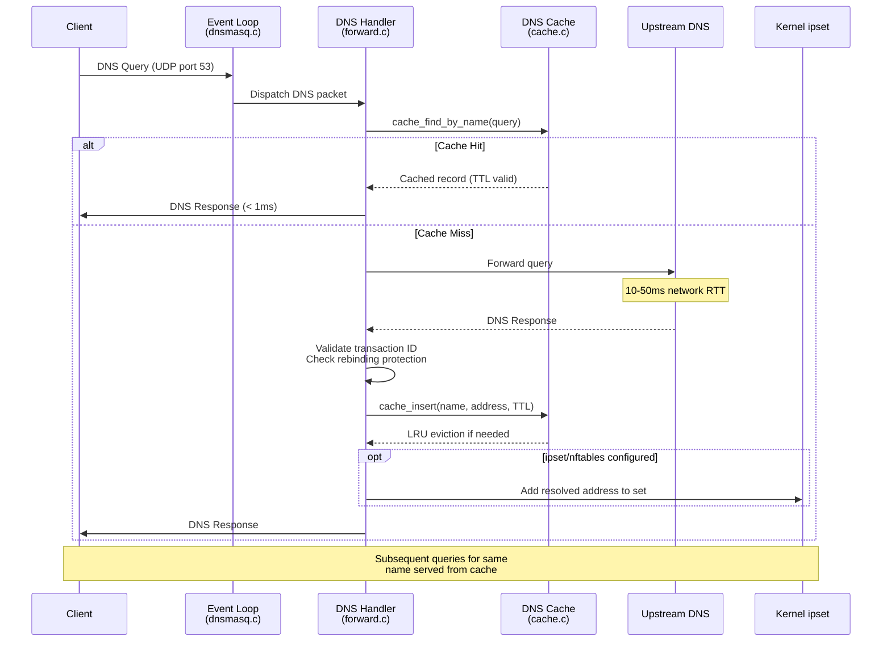

### 5.2.8 DHCP Lease Lifecycle Sequence Diagram

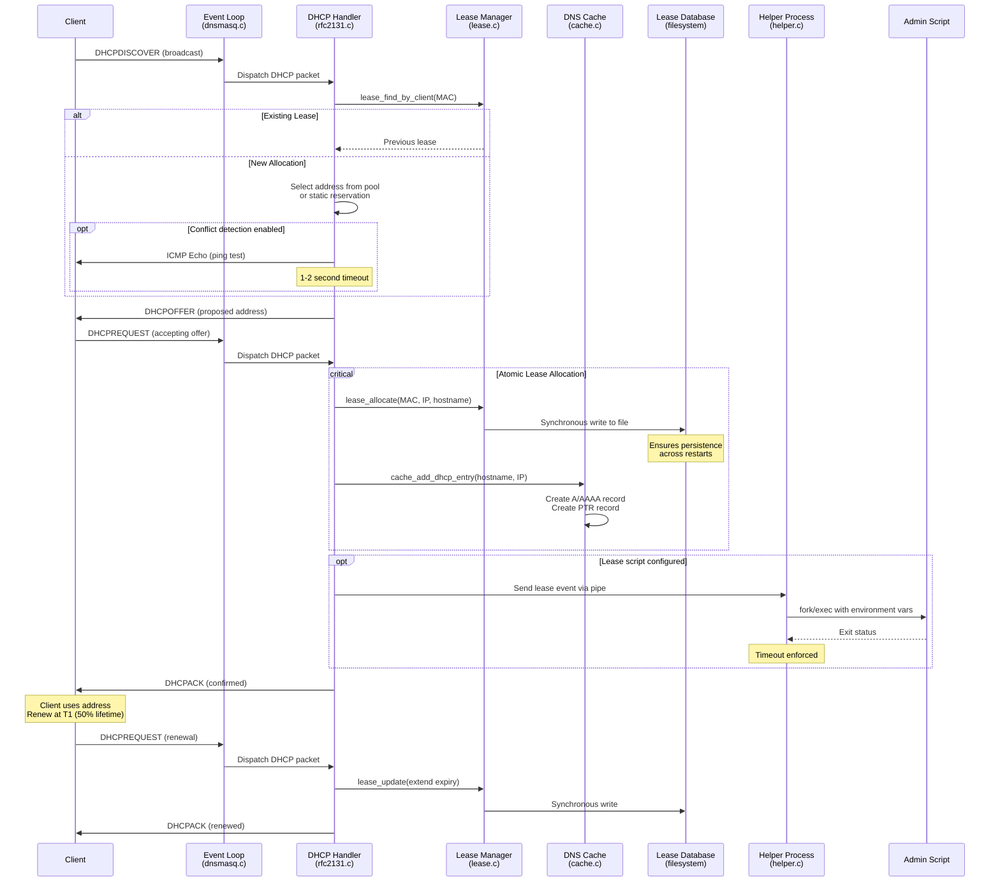

### 5.2.9 Event Loop State Transition Diagram

```mermaid
stateDiagram-v2
    [*] --> Initialization: Daemon Startup
    
    Initialization --> ConfigParsing: Parse config files
    ConfigParsing --> SubsystemInit: Load configuration
    SubsystemInit --> SocketCreation: Initialize DNS/DHCP/etc
    SocketCreation --> PrivilegeDrop: Bind privileged ports
    PrivilegeDrop --> HelperFork: Drop to unprivileged user
    HelperFork --> EventPolling: Ready for requests
    
    EventPolling --> DNSProcessing: DNS query received
    EventPolling --> DHCPProcessing: DHCP request received
    EventPolling --> RAProcessing: Router Solicitation received
    EventPolling --> TFTPProcessing: TFTP request received
    EventPolling --> SignalHandling: Signal received
    EventPolling --> TimerExpiry: Timeout occurred
    
    DNSProcessing --> EventPolling: Response sent
    DHCPProcessing --> EventPolling: Response sent
    RAProcessing --> EventPolling: RA sent
    TFTPProcessing --> EventPolling: Transfer in progress
    TimerExpiry --> EventPolling: Task completed
    
    SignalHandling --> ConfigReload: SIGHUP
    SignalHandling --> StateDump: SIGUSR1
    SignalHandling --> Shutdown: SIGTERM
    
    ConfigReload --> ConfigParsing: Reload configuration
    StateDump --> EventPolling: Dump complete
    
    Shutdown --> LeaseSync: Sync lease database
    LeaseSync --> ResourceCleanup: Close sockets
    ResourceCleanup --> [*]: Exit
    
    note right of EventPolling
        Main poll() loop
        Multiplexes all services
        Single-threaded execution
    end note
    
    note right of SignalHandling
        Signal handlers set flags
        Main loop processes flags
        Safe asynchronous handling
    end note
```

## 5.3 Technical Decisions

### 5.3.1 Architecture Style Decision: Event-Driven Single-Threaded

#### 5.3.1.1 Decision Context

Network service daemons face a fundamental architectural choice regarding concurrency models: multi-threaded (one thread per request), multi-process (fork per request), event-driven single-threaded, or hybrid approaches. This decision profoundly impacts memory consumption, code complexity, performance characteristics, and operational behavior.

#### 5.3.1.2 Alternatives Considered

| Approach | Description | Evaluation |
|----------|-------------|------------|
| **Multi-Threaded** | One thread per concurrent request or thread pool | Rejected: Thread stack overhead (1-8MB per thread) prohibitive on embedded systems; synchronization complexity high; race conditions and deadlocks difficult to debug |
| **Multi-Process** | Fork new process for each request (traditional UNIX model) | Rejected: Process creation overhead excessive for high-frequency operations; memory duplication wasteful; IPC complexity for shared state |
| **Event-Driven Single-Thread** | Poll-based event loop dispatching to handlers | **Selected**: Minimal memory overhead; no synchronization complexity; predictable behavior; sufficient for target scale |
| **Hybrid** | Event loop with worker thread pool for blocking operations | Rejected: Unnecessary complexity for target workload; all operations can be made non-blocking or offloaded to helper process |

#### 5.3.1.3 Decision Rationale

**Selected: Event-Driven Single-Threaded Architecture**

The event-driven single-threaded model optimally aligns with deployment constraints and performance requirements:

1. **Memory Efficiency Critical**: Target deployment platforms include embedded routers with 32MB-128MB total RAM. Each thread requires 1-8MB stack space; supporting 100 concurrent operations would consume 100-800MB just for thread stacks—far exceeding available memory. Single-threaded architecture eliminates this overhead entirely.

2. **I/O-Bound Workload**: DNS queries and DHCP transactions are predominantly I/O-bound operations (network packets, disk writes). CPU processing time is minimal compared to network round-trip time. Multi-core parallelism provides no benefit when operations spend 95%+ of time waiting for I/O.

3. **Deterministic Behavior**: Network infrastructure software prioritizes predictability over peak performance. Single-threaded execution eliminates race conditions, ensures reproducible behavior, and simplifies debugging. Behavior can be reasoned about sequentially without considering interleavings.

4. **Sufficient Scale**: Default limits (150 concurrent DNS queries, 1000 DHCP leases) remain well within single-thread capabilities. Modern CPUs process thousands of operations per millisecond; network bandwidth and latency constrain throughput, not CPU capacity.

5. **Portability**: poll() available on all UNIX-like platforms without threading library dependencies. Implementation requires only POSIX APIs, maximizing compatibility.

**Tradeoffs Accepted:**

- **Cannot Leverage Multi-Core**: Daemon utilizes only one CPU core regardless of available cores. Acceptable because I/O-bound workload doesn't benefit from parallelization.
- **Blocking Operations Prohibited**: Any blocking operation (network I/O, disk I/O, signal handling) must use non-blocking patterns or be offloaded to helper process. Requires careful design but ensures responsiveness.
- **Scalability Ceiling**: Architecture unsuitable for high-scale deployments (>10,000 concurrent clients). Acceptable because target market is small networks (home, small office, embedded devices).

#### 5.3.1.4 Implementation Approach

The implementation leverages `poll()` system call in `src/poll.c` with binary search optimization for efficient socket set management. Protocol handlers register sockets with the poll infrastructure; the main loop in `src/dnsmasq.c:1056-1286` continuously polls for activity, dispatches to appropriate handlers, and manages timers for periodic tasks.

### 5.3.2 Communication Pattern Decision: Integrated Services vs. Multi-Daemon

#### 5.3.2.1 Decision Context

Traditional network infrastructure separates DNS and DHCP into independent daemons (e.g., ISC BIND + ISC DHCP). These separate daemons require external synchronization mechanisms to maintain consistent hostname-to-address mappings. The architectural decision concerns whether to continue this separation or integrate services within a unified daemon.

#### 5.3.2.2 Alternatives Considered

| Approach | Description | Evaluation |
|----------|-------------|------------|
| **Separate Daemons** | Independent DNS and DHCP servers with IPC synchronization | Rejected: IPC overhead; synchronization complexity; consistency challenges; configuration duplication; monitoring complexity |
| **Microservices** | Multiple processes with message queue or REST API integration | Rejected: Over-engineered for target scale; introduces deployment complexity; network overhead for local communication |
| **Integrated Daemon** | Single process with direct function calls between subsystems | **Selected**: Zero synchronization overhead; atomic cross-subsystem operations; simplified deployment and configuration |

#### 5.3.2.3 Decision Rationale

**Selected: Integrated Daemon with Direct Function Call Integration**

Integration of DNS, DHCP, RA, and TFTP services within a unified daemon provides compelling advantages:

1. **Atomic DNS-DHCP Integration**: DHCP lease allocation can atomically register hostnames in DNS cache via direct function call `cache_add_dhcp_entry()` in `src/cache.c`. This eliminates the window of inconsistency present in multi-daemon approaches where DHCP completes before DNS updates, or updates fail leaving stale DNS entries.

2. **Zero Synchronization Overhead**: Direct function calls eliminate IPC mechanisms (sockets, pipes, message queues, shared memory). No serialization/deserialization, no context switches, no IPC protocol design or implementation.

3. **Simplified Configuration**: Single configuration file manages all services. No need to maintain synchronized configurations across multiple daemons or coordinate configuration changes.

4. **Resource Sharing**: All services share memory for caches, configurations, and state. A single DNS cache serves both DNS queries and DHCP hostname lookups. Lease database accessed directly without IPC.

5. **Simplified Deployment**: One daemon to start, stop, monitor, and upgrade. Init scripts and service managers deal with single service unit rather than coordinating multiple daemons with dependencies.

6. **Operational Simplicity**: Single log stream, single process to debug, single point of configuration reload. Troubleshooting doesn't require correlating events across multiple processes.

**Tradeoffs Accepted:**

- **Coupled Failure Domains**: All services fail together if daemon crashes. Acceptable because target deployments typically require all services simultaneously; partial failure would still render network non-functional.
- **Cannot Scale Services Independently**: Cannot run DHCP on one server and DNS on another without running separate dnsmasq instances. Acceptable because target scale (small networks) fits on single server.
- **Larger Binary**: Single binary includes all subsystems even if only one service needed. Mitigated through compile-time feature flags allowing minimal builds.

#### 5.3.2.4 Implementation Approach

Subsystems share global daemon state structure (`src/dnsmasq.h:1099-1250`) containing references to all subsystem state. DHCP handlers in `src/rfc2131.c` and `src/rfc3315.c` directly call `cache_add_dhcp_entry()` in `src/cache.c` after successful lease allocation. Router Advertisement subsystem in `src/radv.c` queries DHCPv6 configuration directly to determine M/O flag settings.

### 5.3.3 Data Storage Decision: Text File vs. Database

#### 5.3.3.1 Decision Context

DHCP lease state must persist across daemon restarts to maintain address allocation stability. The choice of persistence mechanism impacts reliability, performance, operational complexity, and dependency requirements.

#### 5.3.3.2 Alternatives Considered

| Approach | Description | Evaluation |
|----------|-------------|------------|
| **SQLite Database** | Embedded SQL database for structured storage | Rejected: External dependency; overkill for simple key-value storage; query language unnecessary; additional complexity |
| **Berkeley DB** | Key-value database library | Rejected: External dependency; licensing complexity; database corruption risks; operational overhead |
| **Text File** | Human-readable tab-separated value format | **Selected**: Zero dependencies; human readable/editable; simple parsing; atomic write via rename; minimal code |
| **Binary File** | Custom binary format | Rejected: Not human readable; parsing complexity; versioning challenges; corruption harder to diagnose |

#### 5.3.3.3 Decision Rationale

**Selected: Text File with Tab-Separated Values**

The text file approach (`/var/lib/misc/dnsmasq.leases`) optimally balances simplicity, reliability, and operational requirements:

1. **Zero Dependencies**: No database library required. Implementation uses only standard C file I/O operations available on all platforms.

2. **Human Readable**: Administrators can inspect current leases with standard tools (cat, grep, awk). Manual editing possible for emergency recovery. Format self-documenting:
   ```
   1609459200 aa:bb:cc:dd:ee:ff 192.168.1.100 client-hostname *
   ```

3. **Atomic Writes**: Implementation writes to temporary file then atomically renames over existing file, ensuring consistency even if daemon crashes during write.

4. **Simple Parsing**: Straightforward text parsing with `sscanf()` or similar. No complex deserialization, schema management, or query planning.

5. **Flash-Friendly**: Special mode for systems without real-time clock (`HAVE_BROKEN_RTC`) writes only on lease create/delete, not renewals, minimizing flash wear on embedded systems with limited write cycles.

6. **Backup and Version Control**: Plain text files trivially backed up, version controlled, and compared with standard tools (cp, diff, git).

**Performance Considerations:**

- **Read Performance**: Parse entire file on startup; O(n) complexity acceptable for target scale (1000 leases = ~1000 lines, milliseconds to parse)
- **Write Performance**: Synchronous write on every allocation/renewal/release ensures durability; on systems with 1000+ leases, write frequency may become bottleneck
- **Search Performance**: In-memory lease list uses linear search O(n); acceptable for target scale; hash table not justified for 1000 entries

**Tradeoffs Accepted:**

- **Limited Scalability**: Text file approach doesn't scale to tens of thousands of leases. Acceptable because target deployment scale bounded by default 1000-lease maximum.
- **Synchronous I/O**: Write blocks event loop briefly (typically <10ms). Acceptable because lease changes are infrequent compared to query rate.
- **No Transactions**: Cannot atomically update multiple leases. Not needed because lease operations independent.

#### 5.3.3.4 Implementation Approach

Lease manager in `src/lease.c` maintains in-memory doubly-linked list of active leases. On any change (allocate, renew, release), serialize entire lease list to temporary file, then atomically rename to configured lease file path. On startup, parse entire file to reconstruct in-memory state.

### 5.3.4 Caching Strategy Decision: In-Memory LRU

#### 5.3.4.1 Decision Context

DNS caching strategy determines query response latency, upstream server load, and memory consumption. The design must balance cache hit rate, memory usage, and cache maintenance overhead.

#### 5.3.4.2 Alternatives Considered

| Approach | Description | Evaluation |
|----------|-------------|------------|
| **No Caching** | Forward all queries to upstream servers | Rejected: High latency; upstream server load excessive; unnecessary network traffic |
| **Persistent Cache** | Cache persists across restarts in database or file | Rejected: Complexity of staleness management; persistence overhead; marginal benefit for cache that rebuilds quickly |
| **In-Memory LRU** | Hash table with Least Recently Used eviction | **Selected**: Fast O(1) lookups; bounded memory; automatic staleness handling via TTL |
| **Fixed-Size FIFO** | First-In-First-Out eviction | Rejected: Poor cache hit rate; doesn't account for query frequency |

#### 5.3.4.3 Decision Rationale

**Selected: In-Memory Hash Table with LRU Eviction**

The in-memory LRU cache in `src/cache.c` provides optimal balance for target deployment:

1. **Fast Lookups**: Hash table provides O(1) average-case lookup. Critical for minimizing query response latency; cache hit returns sub-millisecond response vs. 10-50ms for upstream query.

2. **Bounded Memory**: LRU eviction ensures cache never exceeds configured size (default 150 entries, `src/config.h:33`). Predictable memory consumption critical for embedded deployment where RAM is scarce and fixed.

3. **Automatic Staleness**: DNS records include TTL (Time To Live); cache respects TTL and expires entries automatically. No manual cache invalidation required.

4. **Frequency Awareness**: LRU eviction keeps frequently accessed entries (local infrastructure names, popular services) while evicting one-time queries. Maximizes cache hit rate within memory constraints.

5. **Simple Implementation**: Hash table for lookup + doubly-linked list for LRU ordering. Well-understood data structures with straightforward implementation and debugging.

**Configuration Parameters:**

- **Default Size**: 150 entries balances memory usage (~15KB) with hit rate for small networks
- **Configurable**: `--cache-size=<n>` allows tuning; size 0 disables caching entirely for testing
- **Hash Table Size**: Power of 2 for efficient modulo operation; typically equal to or slightly larger than cache size

**Cache Population Sources:**

1. **Upstream Queries**: Successful upstream query responses cached according to TTL
2. **Static Hosts**: `/etc/hosts` entries loaded into cache on startup and reload
3. **DHCP Integration**: DHCP lease allocations automatically populate cache with forward (A/AAAA) and reverse (PTR) records
4. **Authoritative Records**: Locally defined authoritative zone records

**Tradeoffs Accepted:**

- **Volatile Storage**: Cache lost on restart; acceptable because cache reconstructs quickly from `/etc/hosts` and DHCP leases, plus normal query traffic
- **Limited Size**: Small cache size may have lower hit rate for diverse workloads; acceptable because small networks have smaller working set of frequently accessed names
- **No Cross-Daemon Sharing**: Cache not shared with other dnsmasq instances or external programs; acceptable for single-instance deployment model

#### 5.3.4.4 Implementation Approach

Cache implemented as array of hash buckets with chaining for collisions, plus doubly-linked LRU list threading all entries. Hash function distributes entries across buckets; collisions handled via linked lists. LRU list enables O(1) eviction of least recently used entry when cache full.

### 5.3.5 Security Architecture Decision: Privilege Separation

#### 5.3.5.1 Decision Context

Network daemons often require elevated privileges to bind low-numbered ports (<1024) but should minimize time spent running as root to limit security exposure. The architectural decision concerns when and how to drop privileges while maintaining required capabilities.

#### 5.3.5.2 Decision Rationale

**Selected: Early Privilege Drop with Forked Helper Process**

The privilege separation model implements defense-in-depth:

1. **Minimize Privileged Execution**: Main event loop processing untrusted network packets runs as unprivileged user ("nobody" default, `src/config.h:47-48`)

2. **Separated Helper Process**: Fork helper process (`src/helper.c:79-98`) before privilege drop; helper retains root for executing administrator-configured lease scripts

3. **IPC Security Boundary**: Helper validates all data from main process via pipe IPC; prevents privilege escalation even if main process compromised

4. **Port Binding Security**: Bind privileged ports (DNS 53, DHCP 67) as root during initialization, then immediately drop privileges

**Security Benefits:**

- Attack surface minimized: Network-facing code runs without root
- Compromise containment: Exploited main process cannot execute root commands
- Validated operations: Helper process validates script paths and parameters
- Principle of least privilege: Each component operates with minimum required permissions

#### 5.3.5.3 Additional Security Mechanisms

**DNS Rebinding Protection** (`src/forward.c:748-754`):
- Blocks responses with private IP addresses for public domain queries
- Prevents attackers from using DNS to bypass firewall restrictions

**TFTP Security**:
- Read-only operation; no file uploads permitted
- Directory traversal prevention: Rejects paths containing `../`
- Chroot-like restriction: All paths relative to configured root directory

**DNSSEC Validation** (optional):
- Cryptographic validation of DNS responses prevents spoofing
- Requires libnettle; increases query latency but provides strong security guarantees

### 5.3.6 Architecture Decision Records (ADRs)

```mermaid
graph TB
    subgraph adr1[ADR-1: Single-Threaded Event Loop]
        adr1_context[Context: Embedded system<br/>resource constraints]
        adr1_decision[Decision: Poll-based<br/>reactor pattern]
        adr1_consequences[Consequences: Simple, predictable,<br/>low memory; no multi-core]
    end
    
    subgraph adr2[ADR-2: Integrated Services]
        adr2_context[Context: DNS-DHCP coordination<br/>required for hostname registration]
        adr2_decision[Decision: Single process with<br/>direct function calls]
        adr2_consequences[Consequences: Atomic operations,<br/>zero IPC overhead; shared fate]
    end
    
    subgraph adr3[ADR-3: Text File Persistence]
        adr3_context[Context: Lease state must<br/>survive restarts]
        adr3_decision[Decision: Human-readable<br/>text file]
        adr3_consequences[Consequences: No dependencies,<br/>simple backup; limited scale]
    end
    
    subgraph adr4[ADR-4: Privilege Separation]
        adr4_context[Context: Need root for ports<br/>but minimize attack surface]
        adr4_decision[Decision: Fork helper before<br/>privilege drop]
        adr4_consequences[Consequences: Security isolation,<br/>validated IPC; complexity]
    end
    
    subgraph adr5[ADR-5: Compile-Time Features]
        adr5_context[Context: Diverse platform<br/>requirements]
        adr5_decision[Decision: ifdef-based<br/>optional features]
        adr5_consequences[Consequences: Optimized binaries<br/>per platform; testing burden]
    end
    
    deployment_context[Small Network<br/>Deployment Context]
    
    deployment_context -.->|Constrains| adr1_context
    deployment_context -.->|Requires| adr2_context
    deployment_context -.->|Shapes| adr3_context
    deployment_context -.->|Demands| adr4_context
    deployment_context -.->|Drives| adr5_context
    
    adr1_context --> adr1_decision
    adr1_decision --> adr1_consequences
    
    adr2_context --> adr2_decision
    adr2_decision --> adr2_consequences
    
    adr3_context --> adr3_decision
    adr3_decision --> adr3_consequences
    
    adr4_context --> adr4_decision
    adr4_decision --> adr4_consequences
    
    adr5_context --> adr5_decision
    adr5_decision --> adr5_consequences
    
    style adr1 fill:#e1f5ff
    style adr2 fill:#fff4e1
    style adr3 fill:#e8f5e9
    style adr4 fill:#fce4ec
    style adr5 fill:#f3e5f5
```

## 5.4 Cross-Cutting Concerns

### 5.4.1 Monitoring and Observability

#### 5.4.1.1 Monitoring Approach

dnsmasq implements monitoring through multiple complementary mechanisms optimized for different operational contexts:

**Signal-Based Diagnostics:**

The daemon responds to UNIX signals for runtime diagnostics without external dependencies:

- **SIGUSR1**: Dumps comprehensive statistics to syslog including:
  - DNS cache contents (all cached entries with TTLs)
  - DHCP lease database (all active leases with expiry times)
  - Upstream server health status (which servers marked down, success/failure counters)
  - Memory usage statistics
  - Query counters by type

This signal-based approach enables diagnostics without requiring special monitoring infrastructure; administrators can trigger dumps with `kill -USR1 <pid>` and review results in syslog.

**Optional Metrics Subsystem:**

When compiled with metrics support (`src/metrics.c`, `src/metrics.h`), the daemon maintains internal counters for:

- DNS cache hit/miss ratios
- Query types (A, AAAA, PTR, etc.) distribution
- Upstream server query distribution and latency
- DHCP lease allocation/renewal/release rates
- Protocol error counters

Metrics can be exported via D-Bus or ubus control interfaces for integration with monitoring systems.

**D-Bus/ubus Runtime Interfaces:**

Optional control interfaces enable programmatic monitoring:

- **D-Bus** (Linux desktop): Provides introspectable interface with methods for querying cache, leases, and configuration
- **ubus** (OpenWrt): Lightweight IPC for embedded Linux monitoring integration
- **Access Control**: Policy-based restrictions prevent unauthorized monitoring

**Log-Based Monitoring:**

All significant events logged to syslog with configurable verbosity:

- Query logging: Optional per-query logging for traffic analysis
- Lease changes: Allocation, renewal, release events
- Configuration changes: Reload events, upstream server changes
- Error conditions: Parsing failures, resource exhaustion, upstream timeouts

Syslog integration enables standard log aggregation, analysis, and alerting tools.

#### 5.4.1.2 Observability Features

**Process Health:**

- **Process ID File**: Writes PID to configured file for monitoring scripts
- **Service Manager Integration**: systemd, launchd, SMF provide standard health monitoring
- **Respawn on Crash**: Service managers automatically restart on abnormal termination

**Network Health:**

- **Upstream Server Tracking**: Maintains success/failure counters per upstream server
- **Automatic Failover**: Marks servers down after failure threshold; automatic recovery via health checks
- **Netlink Monitoring**: Detects interface and address changes in real-time on Linux

**Cache Health:**

- **Cache Statistics**: Hit/miss ratios indicate cache effectiveness
- **LRU Metrics**: Eviction rate indicates cache size adequacy
- **Upstream Query Rate**: High rate may indicate cache too small or unusual traffic patterns

### 5.4.2 Logging Strategy

#### 5.4.2.1 Asynchronous Queued Logging Architecture

The logging subsystem implements a critical architectural pattern to prevent deadlock in `src/log.c:23-28`:

**Problem**: Syslogd may perform DNS queries through dnsmasq. If dnsmasq synchronously writes to syslog socket while processing a DNS query from syslogd, deadlock occurs (circular dependency).

**Solution**: Asynchronous non-blocking logging with message queue:

1. **Non-Blocking Socket**: Syslog socket configured as non-blocking (O_NONBLOCK)
2. **Message Queue**: Failed writes queue messages in memory
3. **Queue Limit**: Configurable maximum queue depth (default 5 messages)
4. **Overflow Handling**: When queue full, drop messages and log overflow event
5. **Drain on Success**: Successful write drains entire queue

This architecture ensures the event loop never blocks on logging operations, preventing deadlock while preserving most log messages.

#### 5.4.2.2 Log Destinations

| Destination | Use Case | Configuration | Format |
|-------------|----------|---------------|--------|
| **Syslog** | Standard deployment | Default; configurable facility/priority | RFC 3164 |
| **Log File** | Embedded systems without syslogd | `--log-file=<path>` | Plain text |
| **stderr** | Development/debugging | `--no-daemon` (foreground mode) | Plain text |
| **Android logcat** | Android platform | Automatic on Android | Android logging API |

#### 5.4.2.3 Log Verbosity Levels

- **Normal**: Lease changes, configuration reloads, significant events
- **Queries** (`--log-queries`): Log every DNS query for traffic analysis
- **DHCP** (`--log-dhcp`): Detailed DHCP transaction logging
- **Debug** (`--log-debug`): Internal state changes, decision points

#### 5.4.2.4 Log Analysis Considerations

Structured logging patterns enable automated analysis:

- **Lease allocations**: `DHCPACK(...) [MAC] [IP] [hostname]`
- **DNS queries**: `query[A] [name] from [client]`
- **Configuration events**: `reading [file]`, `using nameserver [ip]`
- **Errors**: Parseable error messages with file/line context

### 5.4.3 Error Handling Patterns

#### 5.4.3.1 Upstream DNS Server Failure

**Detection**: Timeout-based failure detection (10-second default timeout per query)

**Response Strategy**:
1. Increment failure counter for upstream server
2. If failure count exceeds threshold (e.g., 3 consecutive failures), mark server as down
3. Automatically failover to next upstream server in round-robin list
4. Continue serving from cache if available; return SERVFAIL for cache misses

**Recovery**:
- Periodic health checks (60-second intervals) send test queries to failed servers
- Successful response restores server to active pool
- Automatic re-integration ensures use of all configured upstreams when available

**Monitoring**: Log server down/up events with timestamps for alerting

#### 5.4.3.2 Address Pool Exhaustion

**Detection**: All addresses in configured DHCP pool allocated; no available addresses for new DISCOVER

**Response Strategy**:
1. Log warning: `no address available` with pool name
2. **Silent drop** of DISCOVER packet (preferred over NAK per RFC 2131)
3. Client retries DISCOVER with exponential backoff
4. When lease expires, address becomes available for new allocation

**Rationale**: Silent drop allows other DHCP servers on network to respond; NAK would prevent client from trying alternative servers

**Monitoring**: Track pool utilization; alert when >90% allocated

#### 5.4.3.3 Configuration Errors

**Startup Configuration Errors**:
- Parse errors are fatal: log detailed error message with file and line number
- Exit with non-zero status
- Service manager detects failure; prevents daemon from running with invalid configuration

**Reload Configuration Errors** (SIGHUP):
- Validation errors during reload log error but **retain previous valid configuration**
- Daemon continues operating with pre-reload configuration
- Log message indicates reload failed with specific error
- **Benefit**: Prevents service disruption from configuration mistakes

#### 5.4.3.4 Resource Exhaustion

| Resource | Limit | Behavior on Exhaustion |
|----------|-------|----------------------|
| **DNS Queries** | 150 concurrent (default) | Return SERVFAIL to new queries; log warning |
| **DHCP Leases** | 1000 (default) | Silent drop DISCOVER; log pool exhaustion |
| **TFTP Transfers** | 50 concurrent (default) | Reject new TFTP requests; send ERROR packet |
| **TCP Connections** | 20 (default) | Refuse new connections; TCP RST |
| **Memory** | No hard limit | Malloc failures handled gracefully; attempt to continue with reduced functionality |

**Design Philosophy**: Fail gracefully rather than crash; continue serving existing clients even when unable to accept new requests

#### 5.4.3.5 Lease Database Corruption

**Detection**: Parse errors reading `/var/lib/misc/dnsmasq.leases` on startup

**Recovery**:
1. Log warning with specific line number and parse error
2. Skip malformed entry; continue parsing remaining entries
3. Initialize with successfully parsed entries (partial recovery)
4. If completely unparseable, initialize with empty lease database
5. Daemon continues operation; lease state rebuilds as clients renew

**Prevention**: Atomic file writes (write to temporary file, then rename) minimize corruption risk

**Impact**: Clients may receive different addresses than previous lease if database lost; typically minor disruption as clients adapt

### 5.4.4 Error Handling Flow Diagram

```mermaid
flowchart TD
    Start([Event Processing]) --> EventType{Event Type?}
    
    EventType -->|DNS Query| DNSProcess[Process DNS Query]
    EventType -->|DHCP Request| DHCPProcess[Process DHCP Request]
    EventType -->|Upstream Response| UpstreamProcess[Process Upstream Response]
    
    DNSProcess --> CacheLookup{Cache<br/>Lookup}
    CacheLookup -->|Hit| SendResponse[Send Cached Response]
    CacheLookup -->|Miss| CheckUpstream{Upstream<br/>Available?}
    
    CheckUpstream -->|Yes| ForwardQuery[Forward to Upstream]
    CheckUpstream -->|No| NoUpstream[All Upstreams Down]
    NoUpstream --> CheckCache2{Serve<br/>Stale Cache?}
    CheckCache2 -->|Yes| ServeStale[Return Stale Entry + Warning]
    CheckCache2 -->|No| ReturnServfail[Return SERVFAIL]
    
    ForwardQuery --> WaitResponse[Wait for Response]
    WaitResponse -->|Timeout| HandleTimeout[Timeout Handler]
    WaitResponse -->|Response| ValidateResponse[Validate Response]
    
    HandleTimeout --> IncrementFailure[Increment Failure Counter]
    IncrementFailure --> ThresholdCheck{Failure<br/>Threshold<br/>Exceeded?}
    ThresholdCheck -->|Yes| MarkDown[Mark Server Down]
    ThresholdCheck -->|No| TryNext[Try Next Server]
    MarkDown --> LogServerDown[Log Server Down Event]
    LogServerDown --> ScheduleHealthCheck[Schedule Health Check]
    ScheduleHealthCheck --> TryNext
    
    ValidateResponse -->|Valid| CacheAndReturn[Cache + Return Response]
    ValidateResponse -->|Invalid| LogInvalid[Log Validation Failure]
    LogInvalid --> TryNext
    
    TryNext --> MoreServers{More<br/>Servers?}
    MoreServers -->|Yes| ForwardQuery
    MoreServers -->|No| ReturnServfail
    
    DHCPProcess --> FindAddress[Find Available Address]
    FindAddress --> AddressAvailable{Address<br/>Available?}
    
    AddressAvailable -->|Yes| AllocateLease[Allocate Lease]
    AddressAvailable -->|No| CheckReuse{Reuse<br/>Existing?}
    CheckReuse -->|Yes| AllocateLease
    CheckReuse -->|No| PoolExhausted[Pool Exhausted]
    
    PoolExhausted --> LogExhaustion[Log Pool Exhaustion]
    LogExhaustion --> SilentDrop[Silent Drop Packet]
    
    AllocateLease --> WriteLease[Write Lease to File]
    WriteLease --> WriteSuccess{Write<br/>Success?}
    WriteSuccess -->|Yes| UpdateDNS[Update DNS Cache]
    WriteSuccess -->|No| LogWriteError[Log Write Error]
    LogWriteError --> RetryWrite{Retry<br/>Possible?}
    RetryWrite -->|Yes| WriteLease
    RetryWrite -->|No| ContinueWithoutPersist[Continue Without Persistence]
    
    UpdateDNS --> SendACK[Send DHCPACK]
    ContinueWithoutPersist --> SendACK
    
    UpstreamProcess --> HealthCheck{Health<br/>Check Query?}
    HealthCheck -->|Yes| RestoreServer[Mark Server Up]
    HealthCheck -->|No| MatchQuery{Match<br/>Pending Query?}
    
    RestoreServer --> LogServerUp[Log Server Up Event]
    LogServerUp --> MatchQuery
    
    MatchQuery -->|Yes| CacheAndReturn
    MatchQuery -->|No| DiscardResponse[Discard Stale Response]
    
    SendResponse --> Continue
    ReturnServfail --> Continue
    ServeStale --> Continue
    CacheAndReturn --> Continue
    SilentDrop --> Continue
    SendACK --> Continue
    DiscardResponse --> Continue
    
    Continue([Continue Event Loop])
    
    style NoUpstream fill:#ffebee
    style ReturnServfail fill:#ffebee
    style PoolExhausted fill:#fff3e0
    style LogWriteError fill:#fff3e0
    style ContinueWithoutPersist fill:#fff9c4
```

### 5.4.5 Authentication and Authorization

#### 5.4.5.1 Core Service Authentication

**DNS and DHCP**: These protocols are fundamentally **unauthenticated** by design. Clients do not authenticate to servers, and servers do not authenticate responses to clients (without DNSSEC).

**Security Implications**:
- Any client can query DNS or request DHCP address
- DNS responses can be spoofed (mitigated by transaction ID validation and optional DNSSEC)
- DHCP responses can be spoofed (mitigated by network isolation and switch port security)

**Mitigation Strategies**:
- Network isolation: Run dnsmasq on trusted network only
- DNSSEC validation: Optional cryptographic validation of DNS responses
- DNS rebinding protection: Block private IPs in responses for public domains
- DHCP snooping: Switch-level feature to prevent rogue DHCP servers

#### 5.4.5.2 Administrative Control Authorization

**D-Bus Control Interface**:

Policy file `/etc/dbus-1/system.d/dnsmasq.conf` controls access:
- **Default**: Root-only access to all control methods
- **Configurable**: Can grant specific users/groups access to specific methods
- **Methods Requiring Authorization**:
  - `SetServers`: Modify upstream DNS server list
  - `ClearCache`: Flush DNS cache
  - `SetFilterWin2KOption`: Configure DHCP options
  - `GetVersion`: Query daemon version (typically unrestricted)

**Signal-Based Control**:

UNIX signals use operating system permission model:
- `kill -HUP <pid>`: Requires permission to send signals to daemon process
- Typically root-only or owner of daemon process
- No fine-grained authorization beyond OS permissions

**Configuration File Access**:

- Configuration files (`/etc/dnsmasq.conf`) owned by root with mode 644 (world-readable, root-writable)
- Lease database writable by daemon user (after privilege drop)
- Log files writable by daemon user

### 5.4.6 Performance Requirements and SLAs

#### 5.4.6.1 DNS Performance Targets

| Metric | Target | Measurement Method |
|--------|--------|-------------------|
| **Cache Hit Latency** | < 1ms | In-memory hash table lookup |
| **Cache Miss Latency** | 10-50ms + upstream RTT | Network round-trip to upstream servers |
| **DNSSEC Validation** | +10-100ms | Cryptographic signature verification |
| **Throughput** | 150 concurrent queries | Configurable limit (FTABSIZ) |

**Performance Tuning**:
- Increase `--cache-size` to improve hit rate for larger networks
- Increase `--dns-forward-max` for more concurrent queries
- Disable query logging in production for reduced overhead
- Use multiple upstream servers for failover and load distribution

#### 5.4.6.2 DHCP Performance Targets

| Metric | Target | Notes |
|--------|--------|-------|
| **Lease Allocation** | 100-500ms | Includes optional ICMP ping test (1-2s) |
| **Lease Renewal** | < 100ms | Cached lease reuse; no address selection |
| **Database Sync** | < 10ms | Synchronous write to lease file |
| **Scale Limit** | 1000 leases | Configurable via MAXLEASES |

**Performance Considerations**:
- ICMP ping test adds latency but improves reliability; disable with `--no-ping` for faster allocation
- Lease database writes may become bottleneck above 1000 leases; consider increasing `--dhcp-lease-max` with caution
- Lease renewal does not write to database on systems with `HAVE_BROKEN_RTC` (flash-friendly mode)

#### 5.4.6.3 TFTP Performance Targets

| Metric | Target | Configuration |
|--------|--------|---------------|
| **Block Size** | 512 bytes (default) to 65464 bytes | RFC 2348 negotiation |
| **Timeout** | 5 seconds per block | Balances reliability vs. speed |
| **Retries** | 5 maximum before abort | Prevents indefinite hangs |
| **Concurrent Transfers** | 50 (default) | Configurable via TFTP_MAX_CONNECTIONS |

**Optimization**:
- Increase block size with `--tftp-blocksize` for faster transfers on reliable networks
- Reduce timeout for faster failure detection on low-latency networks
- Monitor concurrent transfer usage; increase limit if rejecting legitimate requests

#### 5.4.6.4 Memory Footprint Targets

| Component | Memory Usage | Scaling Factor |
|-----------|--------------|----------------|
| **Baseline** | ~500KB-1MB | Static code and data |
| **DNS Cache** | ~100 bytes per entry | Multiply by cache size |
| **DHCP Leases** | ~200 bytes per lease | Multiply by active leases |
| **TFTP Transfers** | Block size × concurrent transfers | 512B-65464B per transfer |
| **Total Typical** | 2-8MB | Small network deployment |

**Memory Optimization**:
- Reduce `--cache-size` for minimal memory footprint
- Compile with minimal features (disable DNSSEC, D-Bus, etc.)
- Reduce `--dhcp-lease-max` and `--tftp-max` for resource-constrained systems

### 5.4.7 Disaster Recovery Procedures

#### 5.4.7.1 Lease Database Recovery

**Scenario**: Lease database file corrupted or deleted

**Detection**:
- Parse errors on startup logged to syslog with specific line numbers
- Empty or missing file logged as warning

**Automatic Recovery**:
1. Daemon attempts to parse file on startup
2. Skip malformed entries; continue with successfully parsed entries
3. If completely unparseable or missing, initialize with empty lease database
4. Log warning: `failed to load lease database` with error details
5. Daemon starts successfully with empty or partial lease state

**Manual Recovery**:
1. If backup available, restore from backup: `cp /path/to/backup /var/lib/misc/dnsmasq.leases`
2. If no backup, allow daemon to start with empty database
3. Send SIGHUP to reload: `kill -HUP $(cat /var/run/dnsmasq.pid)`
4. Existing DHCP clients will reacquire leases on next renewal (typically within 1 hour)

**Impact**:
- Minimal: Clients automatically renew leases
- Temporary: May receive different addresses until renewal
- Self-healing: Network returns to stable state within one lease period

#### 5.4.7.2 DNS Cache Recovery

**Scenario**: DNS cache lost (daemon restart or crash)

**Automatic Recovery**:
1. Reload `/etc/hosts` entries into cache on startup
2. Reconstruct DHCP hostname entries from lease database
3. Cache rebuilds naturally through DNS queries from clients

**Recovery Time**:
- Static entries: Immediate (loaded on startup)
- DHCP hostnames: Immediate (from lease database)
- Cached upstream queries: Gradual (rebuild as queries arrive)

**Impact**:
- Minimal: First query for each name has upstream latency (10-50ms)
- Self-healing: Frequently accessed names cached within minutes

#### 5.4.7.3 Configuration Recovery

**Scenario**: Configuration file error during reload (SIGHUP)

**Automatic Safeguard**:
1. Parse and validate new configuration
2. If validation fails, log error with specific line/directive
3. **Retain previous valid configuration** (no changes applied)
4. Daemon continues operating with pre-reload configuration
5. Administrator corrects configuration and retries reload

**Benefit**: Prevents service disruption from configuration mistakes; reload is safe operation

**Scenario**: Configuration file error on startup

**Behavior**:
1. Parse and validate configuration
2. If validation fails, log detailed error and **exit with non-zero status**
3. Service manager detects failure; prevents daemon from starting with invalid configuration

**Recovery**: Administrator corrects configuration file and restarts daemon

#### 5.4.7.4 Process Crash Recovery

**Detection**: Service manager monitors daemon process

**Automatic Recovery**:
1. **systemd** (Linux): Automatic restart on failure with exponential backoff
2. **launchd** (macOS): Automatic restart managed by plist configuration
3. **SMF** (Solaris): Automatic restart with fmadm service management
4. **init.d** (Traditional): Manual restart or monitoring via external watchdog

**Recovery Procedure**:
1. Service manager detects process termination (exit or signal)
2. Reads lease database to restore DHCP state
3. Reconstructs DNS cache from `/etc/hosts` and leases
4. Resumes operation within 1-5 seconds

**State Recovery**:
- DHCP leases: Fully restored from database
- DNS cache: Partially restored (static hosts + DHCP names)
- Active queries: Lost; clients will retry (DNS/DHCP protocols are idempotent)
- TFTP transfers: Aborted; clients will retry from beginning

**Impact**:
- Brief service interruption (1-5 seconds)
- No persistent state loss (leases preserved)
- Clients automatically recover through protocol retry mechanisms

#### 5.4.7.5 Backup Strategy Recommendations

**Critical Data**:
1. **Lease Database**: `/var/lib/misc/dnsmasq.leases`
   - Backup frequency: Hourly or daily depending on change rate
   - Recovery priority: High (prevents address reassignment on recovery)

2. **Configuration Files**: `/etc/dnsmasq.conf`, `/etc/dnsmasq.d/*.conf`
   - Backup frequency: After every change
   - Version control recommended (git)
   - Recovery priority: Critical (required for daemon operation)

**Backup Procedure**:
```bash
# Backup configuration
cp -a /etc/dnsmasq.conf /backup/dnsmasq.conf.$(date +%Y%m%d)

#### Backup leases
cp /var/lib/misc/dnsmasq.leases /backup/leases.$(date +%Y%m%d)

#### Trigger lease database sync before backup
kill -USR2 $(cat /var/run/dnsmasq.pid)  # Platform-specific
```

**Restore Procedure**:
```bash
# Restore configuration
cp /backup/dnsmasq.conf.20240101 /etc/dnsmasq.conf

#### Restore leases
cp /backup/leases.20240101 /var/lib/misc/dnsmasq.leases

#### Restart daemon
systemctl restart dnsmasq  # or appropriate service manager command
```

### 5.4.8 Summary of Cross-Cutting Concerns

The cross-cutting concerns in dnsmasq reflect a consistent design philosophy prioritizing **operational simplicity**, **graceful degradation**, and **self-healing behavior** appropriate for small network infrastructure deployments. Key themes include:

1. **Non-Invasive Monitoring**: Signal-based diagnostics require no external dependencies; optional integration points (D-Bus, ubus) enable advanced monitoring without imposing requirements

2. **Defensive Logging**: Asynchronous queued logging prevents deadlock while preserving observability; multiple log destinations support diverse deployment contexts

3. **Graceful Error Handling**: Services continue operating under error conditions (upstream failures, resource exhaustion) with automatic recovery mechanisms; fail gracefully rather than crash

4. **Minimal Authentication**: Core protocols unauthenticated by design; optional DNSSEC provides cryptographic validation; administrative interfaces use platform access control

5. **Appropriate Performance**: Performance targets reflect small network scale; configurable limits enable tuning for specific deployments

6. **Self-Healing Recovery**: Automatic recovery from common failure scenarios (corrupted databases, process crashes) with minimal administrator intervention

This architecture enables dnsmasq to operate reliably as "set and forget" infrastructure with minimal operational overhead—a critical requirement for its target deployment context.

## 5.5 References

### 5.5.1 Source Files Examined

- `src/dnsmasq.c` - Main event loop orchestration, daemon initialization, signal handling, startup/shutdown logic
- `src/dnsmasq.h` (lines 1-150, 1099-1350) - Global daemon structure definition, runtime state contract, shared data structures
- `src/config.h` (lines 1-320) - Compile-time configuration, feature flags, platform detection, resource limits
- `src/cache.c` (lines 1-150) - DNS cache implementation with hash table and LRU eviction, DHCP integration functions
- `src/forward.c` - DNS query forwarding logic, upstream server management, transaction tracking, rebinding protection
- `src/rfc1035.c` - DNS protocol implementation, packet parsing and construction, name compression
- `src/poll.c` (lines 1-150) - Event polling infrastructure with binary search optimization for socket set management
- `src/network.c` (lines 1-150) - Platform-specific network interface abstraction, socket management
- `src/netlink.c` - Linux netlink-based interface monitoring, asynchronous network configuration notifications
- `src/bpf.c` - BSD/macOS Berkeley Packet Filter interface enumeration
- `src/log.c` (lines 1-150) - Asynchronous logging architecture with queue management, deadlock prevention
- `src/helper.c` (lines 1-150, 79-98) - Privilege separation and helper process management, script execution
- `src/dhcp.c` - DHCPv4 implementation, address allocation, option handling
- `src/dhcp6.c` - DHCPv6 implementation, stateful and stateless configuration
- `src/rfc2131.c` (line 69) - DHCPv4 protocol specification implementation, PXE detection
- `src/rfc3315.c` - DHCPv6 protocol specification implementation
- `src/lease.c` - Lease management, database persistence, expiration handling
- `src/radv.c` - Router Advertisement subsystem for IPv6 autoconfiguration, M/O flag coordination
- `src/slaac.c` - SLAAC address derivation and tracking, DNS integration
- `src/tftp.c` - TFTP server implementation, read-only file transfer, block size negotiation
- `src/auth.c` - Authoritative DNS server mode
- `src/dnssec.c` - DNSSEC validation (optional)
- `src/crypto.c` - Cryptographic operations abstraction
- `src/edns0.c` - Extended DNS options support
- `src/loop.c` - DNS forwarding loop detection
- `src/ipset.c` - Linux ipset integration for kernel firewall
- `src/nftset.c` - Linux nftables integration
- `src/tables.c` - BSD PF table integration
- `src/conntrack.c` - Linux connection tracking integration
- `src/dbus.c` - D-Bus control interface implementation
- `src/ubus.c` - OpenWrt ubus control interface
- `src/util.c` - Portable helper functions, safe memory management
- `src/metrics.c` - Optional metrics collection subsystem
- `src/inotify.c` - Linux file monitoring via inotify
- `src/dump.c` - Packet capture in libpcap format

### 5.5.2 Directories Explored

- `src/` - Complete C implementation containing approximately 60 source files organized into subsystem-specific modules
- `contrib/` - Platform-specific integrations (systemd, launchd, SMF, Solaris, MacOSX, Android, OpenWrt) and utility scripts
- Root directory - Repository structure including build system (Makefile, Makefile.android), documentation, and configuration templates

### 5.5.3 Related Technical Specification Sections

- **1.1 Executive Summary** - Business context and value proposition
- **1.2 System Overview** - High-level description and component architecture
- **4.1 High-Level System Workflow** - Event flow and subsystem coordination patterns
- **4.2 DNS Query Resolution Process** - Detailed DNS subsystem workflows
- **4.3 DHCP Lease Management Workflows** - Detailed DHCPv4/v6 allocation and renewal processes
- **4.4 Network Boot Workflows** - PXE and TFTP integration workflows
- **4.5 Error Handling and Recovery Flows** - Comprehensive failure handling strategies
- **3.10 Technology Selection Rationale Summary** - Technology decisions and justifications

### 5.5.4 Cited Configuration Files

- `/etc/dnsmasq.conf` - Primary configuration file
- `/var/lib/misc/dnsmasq.leases` - DHCP lease database persistence
- `/etc/hosts` - Static hostname definitions loaded into DNS cache
- `/etc/resolv.conf` - Upstream DNS server discovery
- `/etc/dbus-1/system.d/dnsmasq.conf` - D-Bus access control policy

### 5.5.5 External References

- RFC 1035 - Domain Names - Implementation and Specification (DNS core protocol)
- RFC 2131 - Dynamic Host Configuration Protocol (DHCPv4)
- RFC 3315 - Dynamic Host Configuration Protocol for IPv6 (DHCPv6)
- RFC 4862 - IPv6 Stateless Address Autoconfiguration (SLAAC)
- RFC 1350 - The TFTP Protocol (Revision 2)
- RFC 2348 - TFTP Blocksize Option
- RFC 3164 - The BSD syslog Protocol

# 6. SYSTEM COMPONENTS DESIGN

## 6.1 Core Services Architecture

#### SYSTEM DESIGN

## 6.1 Core Services Architecture

### 6.1.1 Architectural Classification

**Core Services Architecture is not applicable for this system.**

dnsmasq does not implement a distributed services architecture, microservices pattern, or service-oriented architecture (SOA). The system is deliberately designed as a **single-instance monolithic daemon** with an event-driven, single-threaded architecture that integrates all network service functionality within a single process boundary.

This architectural classification is fundamental and intentional, reflecting the system's design philosophy and target deployment context rather than representing a limitation or architectural oversight.

#### 6.1.1.1 Architecture Pattern

dnsmasq implements the **Monolithic Integration pattern** characterized by:

| Characteristic | Implementation |
|---------------|----------------|
| **Process Model** | Single daemon process (`dnsmasq` binary) |
| **Threading Model** | Single-threaded event-driven with poll-based reactor pattern |
| **Component Integration** | In-process function calls with shared memory state |
| **State Management** | Unified global state structure (`daemon` structure in `src/dnsmasq.h` lines 1099-1250) |

The main event loop in `src/dnsmasq.c` (lines 1056-1286) continuously polls network sockets for DNS (port 53), DHCPv4 (ports 67/68), DHCPv6 (port 547), TFTP (port 69), and Router Advertisement (ICMPv6) protocols. Socket activity triggers protocol-specific handlers that execute synchronously within the single thread, updating shared state and generating responses without context switching or inter-process communication.

#### 6.1.1.2 Absence of Service-Oriented Patterns

The following distributed systems patterns are **explicitly absent** from dnsmasq's architecture:

**Service Boundaries**: DNS, DHCP, TFTP, and Router Advertisement functionality are implemented as subsystems within a single binary, not as independent services. All subsystems compile into the single `dnsmasq` executable with direct function call integration.

**Inter-Service Communication**: No RPC frameworks (gRPC, Thrift), message queues (RabbitMQ, Kafka, Redis), REST APIs between services, or service mesh architectures. Communication between subsystems occurs via direct C function calls using shared memory structures.

**Service Discovery**: No service registry (Consul, etcd, ZooKeeper), DNS-based service discovery, or dynamic service location mechanisms. The monolithic architecture eliminates the need for service discovery since all functionality resides within the single process.

**Load Balancing**: No load distribution across multiple service instances, no load balancer configuration, no session affinity management. The single-instance model processes all requests sequentially through the event loop.

**Circuit Breakers**: No circuit breaker patterns between internal services (Netflix Hystrix, Resilience4j), no service-to-service timeout management, no bulkhead isolation. Error handling focuses on external dependencies (upstream DNS servers) rather than internal service failures.

**Distributed Resilience**: No service replication, no consensus protocols (Raft, Paxos), no leader election, no distributed state synchronization. Resilience operates at the process level through operating system service managers rather than at the service level.

### 6.1.2 Design Rationale

#### 6.1.2.1 Deliberate Architectural Choice

The single-instance monolithic architecture represents a deliberate design decision optimized for dnsmasq's target deployment context: small networks including home routers, small offices, embedded devices, and virtualization environments. This architectural choice prioritizes different concerns than distributed systems architectures:

**Memory Efficiency**: Eliminates thread stack overhead (typically 1-8MB per thread), service process overhead (each process requires separate memory for code, stack, heap), and IPC serialization/deserialization overhead. The resulting memory footprint of 2-8MB enables deployment on embedded systems with as little as 8-16MB total RAM.

**Operational Simplicity**: Single binary deployment eliminates service orchestration complexity, inter-service dependency management, distributed debugging challenges, and partial failure scenarios. Administrators manage one configuration file, one process, and one set of logs.

**Deterministic Behavior**: Single-threaded execution eliminates race conditions, deadlocks, and non-deterministic thread scheduling. For network infrastructure software where predictable behavior is paramount, this architectural constraint ensures reliable operation.

**Sufficient Performance**: Target deployment scale (150 concurrent DNS queries, 1000 DHCP leases by default as documented in `src/config.h` lines 17 and 60) does not require multi-core parallelization or horizontal scaling. Single-thread performance suffices for small network traffic volumes.

**Universal Portability**: Poll-based event loop using standard POSIX `poll()` system call operates on all UNIX-like platforms without platform-specific threading libraries, advanced synchronization primitives, or distributed system frameworks.

#### 6.1.2.2 Target Deployment Context

The architectural decision aligns with specific deployment characteristics:

| Deployment Context | Architectural Implication |
|-------------------|---------------------------|
| **Small Networks** (homes, small offices) | Single instance sufficient for all clients |
| **Resource Constraints** (8-16MB RAM available) | Monolithic reduces memory overhead |
| **Single Network Scope** (one subnet, one gateway) | No need for distributed coordination |
| **No Redundancy Requirements** | Infrastructure redundancy economically unjustified |

As documented in Technical Specification Section 1.2.1.2, "Unlike enterprise solutions designed for high-availability clustering, dnsmasq operates as a single-instance daemon. This architectural choice simplifies implementation, reduces resource consumption, and aligns with small-network availability requirements where infrastructure redundancy is typically not economically justified."

#### 6.1.2.3 Accepted Constraints

The monolithic architecture accepts specific constraints appropriate for the target deployment:

**No Horizontal Scaling**: Cannot distribute load across multiple instances. Scaling occurs vertically through configuration parameter adjustments (cache size, concurrent query limits) and hardware upgrades.

**Single Point of Failure**: Process failure affects all network services simultaneously. Mitigation occurs through process-level recovery (systemd/launchd automatic restart) rather than service-level failover.

**Single-Core Utilization**: Cannot leverage multi-core processors for parallel request processing. However, I/O operations (network packets, disk writes) dominate CPU processing at target scale, making CPU parallelization unnecessary.

**No Geographic Distribution**: Cannot span multiple physical locations or availability zones. Appropriate for single-site small networks where geographic distribution is not required.

### 6.1.3 Actual System Architecture

#### 6.1.3.1 Integrated Subsystem Architecture

Rather than separate services, dnsmasq implements **tightly integrated subsystems** within a single process:

```mermaid
graph TB
    subgraph event[Event Loop Orchestrator]
        poll[poll-based Event Loop<br/>src/dnsmasq.c lines 1056-1286]
    end
    
    subgraph subsystems[Integrated Subsystems - Single Process]
        dns[DNS Subsystem<br/>cache.c, forward.c, rfc1035.c]
        dhcp4[DHCPv4 Subsystem<br/>dhcp.c, rfc2131.c]
        dhcp6[DHCPv6 Subsystem<br/>dhcp6.c, rfc3315.c]
        radv[Router Advertisement<br/>radv.c, slaac.c]
        tftp[TFTP Server<br/>tftp.c]
    end
    
    subgraph state[Shared State - In Memory]
        cache[(DNS Cache<br/>Hash Table + LRU)]
        leases[(DHCP Leases<br/>Active Allocations)]
        config[Runtime Configuration<br/>Global daemon Structure]
    end
    
    subgraph external[External Interfaces]
        upstream[Upstream DNS Servers]
        clients[Network Clients]
        filesystem[Filesystem<br/>Lease DB, Config, Hosts]
        kernel[Platform Kernel APIs<br/>netlink/BPF]
    end
    
    poll -->|Event Dispatch<br/>Function Calls| dns
    poll -->|Event Dispatch<br/>Function Calls| dhcp4
    poll -->|Event Dispatch<br/>Function Calls| dhcp6
    poll -->|Event Dispatch<br/>Function Calls| radv
    poll -->|Event Dispatch<br/>Function Calls| tftp
    
    dns <-->|Direct Memory Access| cache
    dhcp4 <-->|Direct Memory Access| leases
    dhcp6 <-->|Direct Memory Access| leases
    dhcp4 -->|cache_add_dhcp_entry<br/>Function Call| cache
    dhcp6 -->|cache_add_dhcp_entry<br/>Function Call| cache
    radv <-->|Direct Function Call| dhcp6
    
    dns --> upstream
    dns <--> clients
    dhcp4 <--> clients
    dhcp6 <--> clients
    radv <--> clients
    tftp <--> clients
    
    dns <--> kernel
    dhcp4 <--> kernel
    
    dhcp4 --> filesystem
    dhcp6 --> filesystem
    dns --> filesystem
    
    config -.->|Shared by All| dns
    config -.->|Shared by All| dhcp4
    config -.->|Shared by All| dhcp6
    config -.->|Shared by All| radv
    config -.->|Shared by All| tftp
    
    style event fill:#e3f2fd
    style subsystems fill:#f3e5f5
    style state fill:#fff3e0
    style external fill:#e8f5e9
```

#### 6.1.3.2 Subsystem Integration Through Shared State

Unlike microservices that communicate through network protocols, dnsmasq subsystems integrate through direct function calls and shared memory:

**DNS-DHCP Integration**: When DHCPv4 or DHCPv6 subsystems allocate a lease in `src/rfc2131.c` or `src/rfc3315.c`, they directly call `cache_add_dhcp_entry()` in `src/cache.c` to register the hostname-to-IP mapping. This atomic operation ensures instantaneous DNS resolution for newly configured hosts without external synchronization, IPC delays, or eventual consistency concerns.

**DHCPv6-Router Advertisement Integration**: The Router Advertisement subsystem in `src/radv.c` coordinates directly with DHCPv6 in `src/dhcp6.c` through function calls to set ICMPv6 M/O flags appropriately, directing IPv6 clients toward stateful or stateless autoconfiguration based on DHCPv6 configuration.

**DHCP-TFTP Integration**: PXE boot detection in DHCP handlers triggers TFTP server activation through direct function calls, coordinating boot parameter delivery with network boot image serving.

**Shared Global State**: The `daemon` structure defined in `src/dnsmasq.h` (lines 1099-1250) serves as the centralized state repository accessed by all subsystems:

```
struct daemon {
    // Network configuration
    struct listener *listeners;
    struct server *servers;  // Upstream DNS servers
    
    // DNS cache
    struct crec **hash_table;
    struct crec *cache_head;
    
    // DHCP state
    struct dhcp_context *dhcp_contexts;
    struct dhcp_lease *leases;
    
    // Configuration
    struct options opts;
    
    // ... additional shared state
};
```

All subsystems operate on this shared structure through direct memory access without serialization or inter-process communication overhead.

#### 6.1.3.3 Event-Driven Execution Model

The reactor pattern implementation in the main event loop (`src/dnsmasq.c` lines 1056-1286) coordinates all subsystems:

1. **Socket Registration**: Each subsystem registers network sockets (DNS port 53, DHCP ports 67/68/547, TFTP port 69) with the event loop during initialization
2. **Polling**: Event loop calls `poll()` system call, blocking until any registered socket has activity
3. **Event Dispatch**: When socket activity detected, event loop dispatches to appropriate subsystem handler via function call
4. **Synchronous Processing**: Handler processes request completely, updates shared state, sends response—all within the single thread
5. **Loop Continuation**: Handler returns to event loop, which resumes polling

This model ensures sequential processing without concurrency control overhead while maintaining responsiveness through non-blocking I/O.

### 6.1.4 Comparison with Services Architecture

#### 6.1.4.1 What a Services Architecture Would Provide

If dnsmasq implemented a microservices or service-oriented architecture, it would include:

| Service Architecture Component | Monolithic Equivalent in dnsmasq |
|-------------------------------|----------------------------------|
| **Separate DNS Service** (dedicated process/container) | DNS subsystem (compiled into single binary) |
| **Separate DHCP Service** (dedicated process/container) | DHCP subsystem (compiled into single binary) |
| **Service Discovery** (Consul, etcd, ZooKeeper) | Not needed—subsystems in same process |
| **Inter-Service API** (gRPC, REST, message queue) | Direct function calls with shared memory |
| **Load Balancer** (HAProxy, Nginx) for service instances | Single instance—no load balancing needed |
| **Circuit Breakers** (Hystrix) between services | Not needed—no service-to-service calls |
| **Distributed Tracing** (Jaeger, Zipkin) across services | Single process—standard logging sufficient |
| **Service Mesh** (Istio, Linkerd) for service communication | Not needed—no network service communication |
| **Orchestration** (Kubernetes, Docker Swarm) for services | Single binary managed by OS service manager |

#### 6.1.4.2 Why Services Architecture Is Inappropriate

For dnsmasq's target deployment context, a services architecture would introduce inappropriate complexity:

**Deployment Complexity**: Multiple containers or processes require orchestration, networking configuration, and inter-service dependency management—excessive for small networks where a single administrator manages all infrastructure.

**Resource Overhead**: Each service requires separate process memory (code, stack, heap), IPC serialization/deserialization, and potential network overhead for inter-service communication. This overhead conflicts with the 8-16MB memory budget of embedded target platforms.

**Operational Overhead**: Distributed services introduce partial failure scenarios, network partition handling, service version compatibility, and distributed debugging complexity—all inappropriate for the "set and forget" operational model required in small networks.

**Performance Impact**: Network or IPC communication between services introduces latency (microseconds to milliseconds) for operations that currently complete via function call (nanoseconds). For operations like DHCP-to-DNS cache registration, this latency is unacceptable.

**Scale Mismatch**: Services architectures optimize for horizontal scaling to thousands of requests per second across multiple machines. Dnsmasq targets 150 concurrent queries on a single machine—a scale where monolithic architecture outperforms distributed approaches.

### 6.1.5 Scalability Approach

#### 6.1.5.1 Vertical Scaling Strategy

Since horizontal scaling (multiple instances) is not architecturally supported, dnsmasq scales vertically through configuration:

| Resource Limit | Default | Configuration Parameter | Maximum Recommended |
|----------------|---------|------------------------|---------------------|
| **DNS Cache Size** | 150 entries | `--cache-size=<n>` | 10000 entries |
| **Concurrent DNS Queries** | 150 | `--dns-forward-max=<n>` | 1000 queries |
| **DHCP Leases** | 1000 | `--dhcp-lease-max=<n>` | 10000 leases |
| **TFTP Connections** | 50 | Compile-time TFTP_MAX_CONNECTIONS | 100 connections |
| **TCP Connections** | 20 | Compile-time MAX_PROCS | 50 connections |

**Performance Optimization Techniques**:

- **Cache Size Tuning**: Increase DNS cache size to improve hit rates for networks with many unique domains, reducing upstream query load
- **Query Parallelization**: Increase concurrent query limit for networks with high simultaneous query bursts
- **Memory Allocation**: Default parameters target 2-8MB memory footprint; increasing limits proportionally increases memory usage
- **Hardware Scaling**: Deploy on more capable hardware (faster CPU, more RAM) when configuration limits prove insufficient

#### 6.1.5.2 Capacity Planning Guidelines

Capacity planning focuses on single-instance resource allocation:

**DNS Subsystem**:
- **Cache entries**: 1 entry per frequently accessed domain; typical small network: 100-500 unique domains per day
- **Concurrent queries**: Peak simultaneous queries during network activity bursts; typical: 10-50 concurrent, spikes to 150
- **Memory**: ~100 bytes per cache entry; 150 entries = 15KB, 10000 entries = 1MB

**DHCP Subsystem**:
- **Lease count**: 1 lease per network-connected device; typical small network: 10-100 devices, maximum 1000
- **Memory**: ~200 bytes per lease; 100 leases = 20KB, 1000 leases = 200KB
- **Lease file I/O**: Synchronous write on each allocation/renewal; consider SSD for high-churn environments

**TFTP Subsystem**:
- **Concurrent transfers**: 1 per booting machine; typical: 1-10 during deployment, spikes to 50 for mass deployment
- **Memory**: Block size (512B-65KB) × concurrent transfers; 50 transfers at 65KB blocks = 3.25MB

**Capacity Calculation Example** for 200-device network:
- DNS cache: 500 entries × 100 bytes = 50KB
- DHCP leases: 200 leases × 200 bytes = 40KB
- Concurrent DNS queries: 200 × 10% simultaneous = 20 queries
- **Total memory**: Baseline 1MB + 50KB + 40KB = ~1.1MB (well within embedded device capacity)

### 6.1.6 Resilience Implementation

#### 6.1.6.1 Process-Level Resilience

Resilience operates at the process level rather than service level:

**Fault Tolerance Mechanisms**:

| Failure Scenario | Detection | Recovery | Impact |
|------------------|-----------|----------|---------|
| **Process Crash** | Service manager (systemd, launchd) monitors process | Automatic restart with exponential backoff | 1-5 second service interruption |
| **Lease Database Corruption** | Parse error on startup | Skip malformed entries, continue with partial data | Temporary: clients renew leases naturally |
| **DNS Cache Loss** | N/A (volatile in-memory structure) | Rebuild from `/etc/hosts` and lease database | Gradual: cache rebuilds through queries |
| **Configuration Error** | Parse error on SIGHUP reload | Retain previous valid configuration, log error | Zero: prevents service disruption |
| **Upstream DNS Failure** | Timeout-based detection (10s default) | Automatic failover to next upstream server | Transparent to clients |

**Service Manager Integration**:

Platform-specific service managers provide process supervision:

- **systemd** (Linux): Automatic restart with `Restart=on-failure` in unit file; exponential backoff prevents restart loops
- **launchd** (macOS): `KeepAlive=true` in plist configuration; automatic restart on crash
- **SMF** (Solaris): Automatic restart managed by fault management daemon (`fmadm`)
- **Traditional init.d**: Manual restart or external watchdog monitoring

Configuration examples in `contrib/` folder demonstrate service manager integration for each platform.

#### 6.1.6.2 Data Persistence and Recovery

**DHCP Lease Persistence**:

The lease database at `/var/lib/misc/dnsmasq.leases` provides state recovery across process restarts:

- **Write Strategy**: Synchronous write on every lease allocation, renewal, or release ensures durability
- **File Format**: Text format (tab-separated: timestamp, MAC, IP, hostname, client-id) enables manual inspection and editing
- **Atomic Updates**: Write to temporary file, then atomic `rename()` minimizes corruption risk
- **Recovery**: On startup, parse lease file; skip malformed entries; initialize with successfully parsed leases

**DNS Cache Volatility**:

DNS cache intentionally volatile (in-memory only):

- **Rationale**: Cache contains derived data reconstructible from authoritative sources
- **Startup Reconstruction**: Reload `/etc/hosts` entries and DHCP hostname mappings from lease database
- **Runtime Reconstruction**: Cache rebuilds naturally through client DNS queries (frequently accessed entries cached within minutes)

**Configuration State**:

Configuration files (`/etc/dnsmasq.conf`, `/etc/dnsmasq.d/*.conf`) stored on persistent filesystem:

- **Reload Safety**: SIGHUP reload validates new configuration before applying; on error, retains previous valid configuration
- **Backup Recommendation**: Version control (git) or regular filesystem backups for configuration files

#### 6.1.6.3 Graceful Degradation Patterns

When resources constrained or errors encountered, dnsmasq degrades gracefully rather than failing completely:

**Resource Exhaustion**:
- **DNS Query Limit Reached**: Return SERVFAIL to new queries while continuing to serve cached responses and process existing queries
- **DHCP Pool Exhausted**: Silently drop DISCOVER packets (per RFC 2131 recommendation) allowing other DHCP servers to respond; log pool exhaustion
- **TFTP Connection Limit**: Send TFTP ERROR packet to new requests; continue serving active transfers
- **Memory Allocation Failure**: Attempt to continue with reduced functionality; prioritize core services (DNS, DHCP) over auxiliary services (TFTP)

**Upstream DNS Failure**:
- **All Upstreams Down**: Serve from cache if possible; return SERVFAIL for cache misses; log upstream failure
- **Partial Upstream Failure**: Automatically failover to responsive upstreams; mark failed servers down; periodic health checks restore servers when responsive

**Configuration Errors**:
- **Startup**: Fatal—log detailed error, exit cleanly allowing service manager to detect failure
- **Reload**: Non-fatal—log error, retain previous valid configuration, continue operation

### 6.1.7 Monitoring and Operational Visibility

#### 6.1.7.1 Single-Process Monitoring

Monitoring focuses on process health and operational metrics:

**Process Health Indicators**:
- **Process Existence**: Service manager monitors process ID; detects crashes
- **Port Binding**: Verify listening on expected ports (53, 67, 68, 547, 69)
- **CPU/Memory Usage**: Monitor via `/proc/[pid]/stat` (Linux) or `ps` (portable)
- **Log Activity**: Absence of log output may indicate hang condition

**Operational Metrics**:
- **DNS Cache Statistics**: Hit/miss ratio via SIGUSR1 signal (dumps to syslog)
- **DHCP Lease Utilization**: Active leases vs. pool size via SIGUSR1 signal
- **Upstream Server Health**: Which servers marked down; success/failure counters via SIGUSR1
- **Query Logging**: Optional per-query logging with `--log-queries` for traffic analysis

**Signal-Based Diagnostics**:

```bash
# Dump comprehensive statistics to syslog
kill -USR1 $(cat /var/run/dnsmasq.pid)

#### Reload configuration and flush DNS cache
kill -HUP $(cat /var/run/dnsmasq.pid)

#### Graceful shutdown with lease synchronization
kill -TERM $(cat /var/run/dnsmasq.pid)
```

#### 6.1.7.2 Integration with Monitoring Systems

Optional interfaces enable monitoring system integration:

**D-Bus Control Interface** (Linux desktop environments):
- Query cache contents programmatically
- Retrieve lease information
- Check upstream server status
- Access controlled via `/etc/dbus-1/system.d/dnsmasq.conf` policy file

**ubus Control Interface** (OpenWrt embedded Linux):
- Lightweight IPC for embedded systems
- Similar functionality to D-Bus adapted for resource constraints

**Syslog Integration**:
- All significant events logged to syslog
- Configurable verbosity (`--log-queries`, `--log-dhcp`, `--log-debug`)
- Integration with log aggregation tools (rsyslog, syslog-ng, Splunk)

**Metrics Subsystem** (optional):
- Internal counters when compiled with metrics support
- Export via D-Bus/ubus for monitoring system collection
- Prometheus export not natively supported (could be added via wrapper)

### 6.1.8 Cross-Reference to Detailed Architecture

For comprehensive architectural details, refer to:

**Section 5.1 High-Level Architecture**: Complete documentation of event-driven single-threaded architecture, subsystem integration patterns, and component interactions.

**Section 5.1.1.1 Overall Architecture Style and Rationale**: Detailed explanation of reactor pattern implementation, design rationale for single-threaded approach, and architectural constraints.

**Section 5.1.1.2 Key Architectural Principles**: Tight subsystem integration, platform abstraction, privilege separation, modular compile-time configuration, and defensive programming practices.

**Section 5.1.2 Core Components Table**: Comprehensive listing of all subsystems with responsibilities, dependencies, and integration points.

**Section 5.1.3 Data Flow Description**: Detailed data flows for DNS resolution, DHCP lease allocation, and IPv6 autoconfiguration coordination.

**Section 5.4 Cross-Cutting Concerns**: Monitoring, logging, error handling, performance requirements, and disaster recovery procedures.

### 6.1.9 Summary

dnsmasq deliberately implements a **single-instance monolithic daemon architecture** rather than a distributed services architecture. This architectural choice optimizes for the system's target deployment context: small networks where operational simplicity, minimal resource consumption, and deterministic behavior take precedence over horizontal scalability and distributed resilience.

The absence of service boundaries, service discovery, inter-service communication, load balancing, and circuit breaker patterns reflects intentional design decisions aligned with deployment requirements. Scalability occurs vertically through configuration tuning and hardware upgrades. Resilience operates at the process level through operating system service managers rather than at the service level through distributed coordination.

This architecture enables dnsmasq to operate as "set and forget" infrastructure with a 2-8MB memory footprint on embedded devices—a scale at which distributed services architectures would introduce inappropriate complexity and overhead without corresponding benefits.

### 6.1.10 References

**Technical Specification Sections**:
- Section 1.2 System Overview: Single-instance architecture documentation, target deployment context
- Section 1.2.1.2 Current System Limitations: Scale boundaries, single-instance design rationale
- Section 5.1 High-Level Architecture: Complete event-driven architecture documentation
- Section 5.1.1.1 Overall Architecture Style and Rationale: Reactor pattern implementation details
- Section 5.1.1.2 Key Architectural Principles: Tight subsystem integration patterns
- Section 5.1.2 Core Components Table: Complete subsystem catalog with integration points
- Section 5.4 Cross-Cutting Concerns: Process-level resilience and disaster recovery

**Source Code Files**:
- `src/dnsmasq.c` lines 1056-1286: Main event loop orchestration
- `src/dnsmasq.h` lines 1099-1250: Global daemon state structure shared across subsystems
- `src/poll.c`: Event polling infrastructure
- `src/cache.c`: DNS cache with subsystem integration via `cache_add_dhcp_entry()`
- `src/dhcp.c`, `src/rfc2131.c`: DHCPv4 subsystem with DNS integration
- `src/dhcp6.c`, `src/rfc3315.c`: DHCPv6 subsystem with Router Advertisement coordination
- `src/radv.c`: Router Advertisement subsystem with DHCPv6 integration
- `src/tftp.c`: TFTP subsystem with DHCP coordination
- `src/config.h` lines 17-60: Default scale limits (cache size, concurrent queries, lease counts)
- `src/config.h` lines 173-200: Feature compilation flags (no distributed system frameworks)

**Configuration and Documentation**:
- `setup.html` lines 17-34: Single-instance deployment documentation
- `contrib/` folder: Platform service manager configurations (systemd, launchd, SMF) for single daemon
- `Makefile`: Single binary build target (no multiple service binaries)

**Research Operations**:
- Semantic search: "service discovery load balancing cluster failover high availability distributed architecture microservices" (0 results)
- Source code grep: Microservices patterns (0 matches except false positive "consult")
- Folder exploration: `src/` (50+ C files compiled into single binary), `contrib/` (single-instance service configurations)

## 6.2 Database Design

### 6.2.1 Database Architecture Overview

#### 6.2.1.1 Non-Traditional Database Model

**dnsmasq does not implement a traditional relational or NoSQL database system.** The application deliberately avoids database dependencies as a core design principle, instead implementing a **file-based and in-memory data persistence model** optimized for lightweight network infrastructure deployment on resource-constrained embedded devices.

This architectural decision reflects the system's target deployment context as documented in Technical Specification Section 1.2: small networks including home routers, small offices, embedded devices, and virtualization environments where operational simplicity, minimal resource consumption, and zero external dependencies take precedence over database-centric features such as ACID transactions, complex query capabilities, or distributed replication.

The absence of database technology represents an intentional design choice rather than a limitation. Traditional database systems introduce dependencies (PostgreSQL, MySQL, SQLite), operational complexity (database configuration, maintenance, backup strategies), and resource overhead (database server processes, connection pooling, query planners) that conflict with the embedded device deployment model where dnsmasq operates with 2-8MB total memory footprint.

#### 6.2.1.2 Storage Mechanisms Overview

dnsmasq implements three distinct storage mechanisms, each optimized for its specific data domain:

| Storage Mechanism | Data Domain | Persistence Model | Primary Location | Purpose |
|------------------|-------------|-------------------|------------------|---------|
| **In-Memory DNS Cache** | DNS query results | Volatile (reconstructed on startup) | RAM hash table + LRU list | Sub-millisecond query resolution with minimal upstream load |
| **Flat-File Lease Database** | DHCP lease allocations | Durable (synchronously persisted to disk) | `/var/lib/misc/dnsmasq.leases` | Lease state survival across daemon restarts |
| **Chained Block Storage** | Variable-length binary data (DNSSEC keys, SRV records) | Volatile (reconstructed from cache) | RAM block chains | Space-efficient storage of large DNS record data |
| **Configuration Files** | System configuration, static mappings | Durable (managed by administrator) | `/etc/dnsmasq.conf`, `/etc/hosts` | Configuration persistence and static hostname mappings |

This multi-tier storage architecture provides durability where required (DHCP leases must survive restarts to prevent address conflicts) while maintaining performance through volatile caches (DNS records are derived data, reconstructable from authoritative sources).

#### 6.2.1.3 Design Philosophy

The storage architecture embodies four core design principles:

**Principle 1: Zero External Dependencies** - All storage mechanisms use only standard C library functions and POSIX system calls. No database client libraries, no SQL parsing engines, no query optimizers. This ensures universal portability across all UNIX-like platforms from Linux servers to OpenWrt routers to macOS workstations without requiring database installation or configuration.

**Principle 2: Human-Readable Persistence** - The DHCP lease database uses plain text format enabling manual inspection with standard tools (`cat`, `grep`, `awk`), emergency manual editing during troubleshooting, and integration with shell scripts for operational automation. This transparency simplifies debugging and reduces operational complexity compared to binary database formats requiring specialized tools.

**Principle 3: Performance-Appropriate Data Structures** - Data structures match access patterns: hash tables for O(1) DNS lookups, linked lists for sequential lease iteration, LRU chains for cache eviction. The implementation avoids premature optimization, recognizing that at target scale (150 concurrent DNS queries, 1000 DHCP leases), simple algorithms outperform complex indexes due to cache locality and minimal overhead.

**Principle 4: Flash-Friendly Persistence** - The optional "broken RTC mode" for embedded systems without real-time clocks reduces filesystem write frequency by storing lease duration instead of absolute expiration time, minimizing flash wear on embedded devices where flash erase cycles limit device lifespan.

### 6.2.2 Schema Design

#### 6.2.2.1 DNS Cache Schema

##### 6.2.2.1.1 Data Structure Definition

The DNS cache implements a dual-structure architecture combining hash table indexing with LRU eviction policy. The fundamental data structure `struct crec` (cache record) defined in `src/dnsmasq.h` lines 465-477 represents individual cached DNS records:

**Cache Record Schema (`struct crec`)**:

| Field Name | Data Type | Size | Purpose |
|-----------|-----------|------|---------|
| `next`, `prev` | `struct crec*` | 8 bytes each | Doubly-linked list pointers for LRU chain traversal |
| `hash_next` | `struct crec*` | 8 bytes | Singly-linked list pointer for hash collision chain |
| `addr` | `union all_addr` | 16 bytes | IPv4 address (4 bytes), IPv6 address (16 bytes), or CNAME target pointer |
| `ttd` | `time_t` | 8 bytes | Time to die: absolute UNIX timestamp for record expiration |
| `uid` | `unsigned int` | 4 bytes | Unique identifier or DNS class for DNSSEC validation context |
| `flags` | `unsigned int` | 4 bytes | Bitfield encoding record type (A, AAAA, CNAME, PTR, DNSKEY, DS, RRSIG), status (IMMORTAL, REVERSE, FORWARD), and validation state |
| `name` | `union` | 8 bytes | Domain name storage: inline array for names ≤50 bytes, pointer for larger names |

**Total Structure Size**: Approximately 72 bytes per cache entry (excluding variable-length domain names).

The `flags` field encodes multiple dimensions through bitwise operations defined in `src/dnsmasq.h` lines 479-519:

- **Record Type Flags**: `F_IPV4` (0x01), `F_IPV6` (0x02), `F_CNAME` (0x04), `F_DNSKEY` (0x100), `F_DS` (0x200), `F_DNSSECOK` (0x400)
- **Directionality Flags**: `F_FORWARD` (forward DNS lookup), `F_REVERSE` (reverse DNS lookup), `F_IMMORTAL` (never expires, from `/etc/hosts` or active DHCP lease)
- **DNSSEC Validation Flags**: `F_SECURE` (cryptographically validated), `F_BOGUS` (validation failed), `F_NEG` (validated non-existence)

**Domain Name Storage Optimization**: Names ≤50 characters (approximately 90% of real-world domain names) store inline in the `sname` character array avoiding separate heap allocation and pointer dereference. Names >50 characters allocate from a separate name pool and store pointer in `bname` or `namep` fields, optimizing for the common case while supporting arbitrarily long names.

##### 6.2.2.1.2 Indexing Strategy

The DNS cache employs a **hash table with chaining** for collision resolution, implemented in `src/cache.c` lines 178-227:

**Hash Table Configuration**:

- **Default Bucket Count**: 64 buckets (defined in `src/cache.c` line 19)
- **Growth Strategy**: Bucket count doubles when cache size exceeds 10× bucket count, maintaining target load factor of ~0.1 (10 entries per bucket)
- **Hash Function**: Barker code algorithm with iterative folding of domain name labels (implemented in `src/cache.c` lines 214-227)
- **Collision Resolution**: Separate chaining using the `hash_next` pointer field

**Hash Function Algorithm**:

The Barker code hash function processes domain names label-by-label from right to left (TLD first), computing:

```
hash = 0
for each label in domain_name (from TLD to subdomain):
    for each character c in label:
        hash = (hash * 33) + tolower(c)
    hash = (hash * 33) + '.'  // Label separator
return hash % bucket_count
```

This algorithm provides superior distribution for hierarchical domain names compared to simple string hashing, minimizing collisions for related domains (e.g., `www.example.com`, `mail.example.com`, `ftp.example.com` hash to different buckets).

**Bucket Organization**:

Each hash bucket maintains entries in priority order per `src/cache.c` lines 189-200:

1. **REVERSE entries first**: PTR records (reverse DNS lookups) grouped at bucket head for cache coherency
2. **FORWARD entries second**: A, AAAA, CNAME records (forward DNS lookups) follow reverse entries
3. **IMMORTAL entries last**: Entries from `/etc/hosts` and active DHCP leases at bucket tail

This ordering optimizes for the most common query pattern (forward lookups) while ensuring static entries remain accessible.

##### 6.2.2.1.3 Entity Relationships

The DNS cache integrates with multiple system entities through direct memory references:

```mermaid
erDiagram
    CACHE_HASH_TABLE ||--o{ CACHE_RECORD : "indexes"
    CACHE_RECORD ||--o| CACHE_RECORD : "hash_next chain"
    CACHE_RECORD ||--|| CACHE_RECORD : "LRU prev/next"
    LRU_HEAD ||--|| CACHE_RECORD : "most recent"
    LRU_TAIL ||--|| CACHE_RECORD : "least recent"
    DHCP_LEASE ||--o{ CACHE_RECORD : "registers hostname via cache_add_dhcp_entry"
    HOSTS_FILE ||--o{ CACHE_RECORD : "loads static mappings as IMMORTAL"
    CACHE_RECORD ||--o| BLOCKDATA_CHAIN : "keydata pointer for DNSSEC"
    UPSTREAM_DNS ||--o{ CACHE_RECORD : "populates on cache miss"
    
    CACHE_HASH_TABLE {
        int bucket_count
        crec_ptr buckets_array
    }
    
    CACHE_RECORD {
        crec_ptr hash_next
        crec_ptr prev
        crec_ptr next
        time_t ttd
        int flags
        union_all_addr addr
        char_or_ptr name
    }
    
    DHCP_LEASE {
        string hostname
        in_addr ip_address
        time_t expires
    }
```

**Integration Points**:

1. **DHCP-to-DNS Registration**: When the DHCP subsystem allocates a lease in `src/rfc2131.c` or `src/dhcp6.c`, it invokes `cache_add_dhcp_entry()` which atomically creates both forward (A/AAAA) and reverse (PTR) cache records marked with `F_IMMORTAL` flag, ensuring the hostname remains resolvable for the lease duration.

2. **Hosts File Integration**: During startup and configuration reload, `src/cache.c` parses `/etc/hosts` and creates cache records marked `F_IMMORTAL`, preventing LRU eviction of static mappings. These entries receive infinite TTL, surviving cache flushes triggered by SIGHUP signal.

3. **DNSSEC Blockdata Linkage**: Cache records for DNSKEY, DS, and RRSIG record types contain a `keydata` pointer referencing the head of a blockdata chain (documented in Section 6.2.2.3) storing the variable-length cryptographic key material or signature data.

#### 6.2.2.2 DHCP Lease Database Schema

##### 6.2.2.2.1 Data Structure Definition

The DHCP lease database exists in two forms: in-memory structured representation and persistent flat-file text format.

**In-Memory Schema (`struct dhcp_lease`)** - Defined in `src/dnsmasq.h` lines 799-829:

| Field Name | Data Type | Size | Purpose |
|-----------|-----------|------|---------|
| `clid_len` | `int` | 4 bytes | Length of client identifier (0 if none) |
| `clid` | `unsigned char*` | Pointer | Client identifier (DHCP option 61 or DHCPv6 DUID) for stable lease binding |
| `hostname` | `char*` | Pointer | Client-provided hostname from DHCP option 12 or DHCPv6 option 39 |
| `fqdn` | `char*` | Pointer | Fully-qualified domain name with configured domain suffix appended |
| `old_hostname` | `char*` | Pointer | Previous hostname for change tracking and script notification |
| `flags` | `int` | 4 bytes | Lease state flags (static reservation, temporary address, etc.) |
| `expires` | `time_t` | 8 bytes | Absolute UNIX timestamp when lease expires |
| `length` | `unsigned int` | 4 bytes | Lease duration in seconds (only compiled with `HAVE_BROKEN_RTC` for systems without real-time clock) |
| `hwaddr_len` | `int` | 4 bytes | Hardware address length (6 for Ethernet MAC, 8 for EUI-64) |
| `hwaddr_type` | `int` | 4 bytes | Hardware address type per RFC 1700 (1 for Ethernet) |
| `hwaddr` | `unsigned char[16]` | 16 bytes | Hardware address (MAC address for DHCPv4, link-layer address for DHCPv6) |
| `addr` | `struct in_addr` | 4 bytes | Allocated IPv4 address |
| `override` | `struct in_addr` | 4 bytes | Override address for static reservations |
| `giaddr` | `struct in_addr` | 4 bytes | Gateway/relay agent address for lease source tracking |
| `extradata` | `unsigned char*` | Pointer | Variable-length vendor-specific data and DHCP options for client restoration |
| `extradata_len` | `unsigned int` | 4 bytes | Current length of extradata buffer |
| `extradata_size` | `unsigned int` | 4 bytes | Allocated size of extradata buffer |
| `last_interface` | `int` | 4 bytes | Network interface index where lease was allocated |
| `addr6` | `struct in6_addr` | 16 bytes | Allocated IPv6 address (DHCPv6 only) |
| `iaid` | `unsigned int` | 4 bytes | Identity Association Identifier for DHCPv6 address binding |
| `slaac_address` | Linked list | Pointer | Chain of SLAAC-derived IPv6 addresses for this client |
| `next` | `struct dhcp_lease*` | Pointer | Linked list pointer to next lease |

**Total Structure Size**: Approximately 150-250 bytes per lease depending on optional fields and platform pointer size.

##### 6.2.2.2.2 File Format Specification

The persistent lease database uses platform-specific paths defined in `src/config.h` lines 203-213:

- **Linux**: `/var/lib/misc/dnsmasq.leases`
- **FreeBSD/OpenBSD/NetBSD/DragonFly BSD**: `/var/db/dnsmasq.leases`
- **Solaris**: `/var/cache/dnsmasq.leases`
- **Android**: `/data/misc/dhcp/dnsmasq.leases`

**DHCPv4 Lease Entry Format** (space-separated fields per `src/lease.c` lines 252-346):

```
<expiry_time> <hw_address> <ip_address> <hostname> <client_id>
```

**Field Specifications**:

| Position | Field | Format | Example | Description |
|----------|-------|--------|---------|-------------|
| 1 | Expiry Time | UNIX timestamp or duration | `1699123456` | Absolute expiration timestamp (or lease duration seconds if `HAVE_BROKEN_RTC` compiled) |
| 2 | Hardware Address | `*` or `TYPE-MAC` | `01:aa:bb:cc:dd:ee:ff` or `*` | Hardware type (01=Ethernet) followed by colon-separated hex MAC, or `*` if not Ethernet/unknown |
| 3 | IP Address | Dotted decimal | `192.168.1.100` | Allocated IPv4 address |
| 4 | Hostname | String or `*` | `laptop` or `*` | Client hostname or `*` if none provided |
| 5 | Client ID | Colon-hex or `*` | `ab:cd:ef:01:23` or `*` | DHCP option 61 client identifier or `*` if none |

**Example DHCPv4 Entries**:

```
1699123456 01:aa:bb:cc:dd:ee:ff 192.168.1.100 laptop ab:cd:ef:01:23:45
1699234567 * 192.168.1.101 * *
1699345678 01:11:22:33:44:55:66 192.168.1.102 desktop *
```

**DHCPv6 Lease Entry Format** (per `src/lease.c` lines 75-109):

DHCPv6 entries include a DUID header line followed by individual address leases:

```
duid <DUID_hex>
<expiry_time> [T]<IAID> <ipv6_address> <hostname> <client_id>
```

**DHCPv6-Specific Fields**:

| Field | Format | Example | Description |
|-------|--------|---------|-------------|
| DUID Line | `duid` followed by colon-hex | `duid 00:01:00:01:1a:2b:3c:4d:aa:bb:cc:dd:ee:ff` | DHCPv6 Unique Identifier for client, precedes all leases for that DUID |
| IAID | Decimal with optional `T` prefix | `12345` or `T12345` | Identity Association Identifier; `T` prefix indicates temporary address (TA) |
| IPv6 Address | Colon-hex | `2001:db8::100` | Allocated IPv6 address |

**Example DHCPv6 Entries**:

```
duid 00:01:00:01:1a:2b:3c:4d:aa:bb:cc:dd:ee:ff
1699345678 12345 2001:db8::100 laptop6 *
1699456789 T67890 2001:db8::200 laptop6 *
```

**SLAAC Address Entries** (IPv6 Stateless Autoconfiguration per `src/lease.c` lines 336-346):

SLAAC-derived addresses (not allocated via DHCPv6 but learned through neighbor discovery) are recorded with special format:

```
<timestamp> <hostname> <ipv6_address>
```

These entries lack hardware address and IAID since the address was self-configured by the client using the advertised prefix.

##### 6.2.2.2.3 Entity Relationships

The DHCP lease database integrates with DNS cache, configuration files, and external scripts:

```mermaid
erDiagram
    DHCP_LEASE_FILE ||--o{ DHCP_LEASE : "persists"
    DHCP_LEASE ||--o{ DNS_CACHE_ENTRY : "creates via cache_add_dhcp_entry"
    DHCP_LEASE ||--o{ SLAAC_ADDRESS : "tracks derived IPv6 addresses"
    DHCP_CONTEXT ||--o{ DHCP_LEASE : "defines pool constraints"
    HELPER_SCRIPT ||--o{ DHCP_LEASE : "notified on lease events"
    
    DHCP_LEASE {
        time_t expires
        byte_array hwaddr
        in_addr ip_address
        string hostname
        byte_array client_id
        int flags
    }
    
    DHCP_LEASE_FILE {
        string path
        text_format entries
    }
    
    DNS_CACHE_ENTRY {
        string name
        in_addr address
        int flags_IMMORTAL
    }
    
    SLAAC_ADDRESS {
        in6_addr addr
        time_t ping_time
        int backoff
    }
    
    DHCP_CONTEXT {
        in_addr range_start
        in_addr range_end
        time_t lease_time
    }
    
    HELPER_SCRIPT {
        string script_path
        string action_add_old_del
    }
```

**Persistence Strategy** (per `src/lease.c` lines 252-387):

1. **Write Trigger**: Any lease state change (allocation, renewal, release, expiration) marks the lease database dirty (`file_dirty = 1`)
2. **Synchronous Write Sequence**:
   - `rewind()` to file beginning
   - `ftruncate()` to zero length (atomic truncation)
   - Write all active leases sequentially
   - `fflush()` to flush C library buffers
   - `fsync()` to force kernel write to physical storage
3. **Atomicity Guarantee**: File operations ensure either complete write or no change; partial writes detected as parse errors on next startup
4. **Error Handling**: Write failures logged; retry after 60 seconds (defined in `src/lease.c` line 32: `#define LEASE_RETRY 60`)

**Broken RTC Mode** (optional compilation with `HAVE_BROKEN_RTC` flag per `src/config.h` lines 65-77):

For embedded systems without battery-backed real-time clocks (RTC), storing absolute timestamps creates inconsistency across reboots when system time resets. Broken RTC mode stores lease **duration** instead:

```
<duration_seconds> <hw_address> <ip_address> <hostname> <client_id>
```

This mode reduces write frequency: writes occur only on lease creation and deletion, not on renewals (which would merely update the expiry timestamp in standard mode). This optimization minimizes flash wear on embedded devices where flash memory has limited erase cycles (typically 10,000-100,000 cycles before failure).

#### 6.2.2.3 Blockdata Storage Schema

##### 6.2.2.3.1 Data Structure Definition

The blockdata storage system provides space-efficient storage for variable-length binary data in DNS records, primarily DNSSEC cryptographic material (DNSKEY public keys, DS delegation signer records, RRSIG signatures) and SRV service target names.

**Block Definition** (inferred from `src/blockdata.c` implementation):

| Field Name | Data Type | Size | Purpose |
|-----------|-----------|------|---------|
| `key` | `unsigned char[40]` | 40 bytes | Fixed-size data block storing portion of record data |
| `next` | `struct blockdata*` | 8 bytes | Pointer to next block in chain for data >40 bytes |

**Total Block Size**: 48 bytes per block.

**Block Size Rationale**: The 40-byte block size (defined in `src/config.h` line 24: `#define KEYBLOCK_LEN 40`) balances memory efficiency and allocation overhead:

- **Typical DNSKEY Size**: 256-2048 bits (32-256 bytes) for RSA keys, 256-384 bits (32-48 bytes) for ECDSA keys
- **Typical DS Size**: 32-64 bytes (SHA-256 or SHA-384 hash plus metadata)
- **Block Count**: Most DNSSEC records fit in 1-8 blocks, minimizing chain length while avoiding large allocations

##### 6.2.2.3.2 Chaining Mechanism

Variable-length data spans multiple blocks using singly-linked list chaining:

**Storage Algorithm** (per `src/blockdata.c` lines 61-112):

```
data_to_store = binary_data[length]
blocks_needed = ceiling(length / 40)

head_block = allocate_block_from_free_list()
current_block = head_block

for i = 0 to blocks_needed-1:
    bytes_to_copy = min(40, length - i*40)
    memcpy(current_block.key, data_to_store + i*40, bytes_to_copy)
    
    if i < blocks_needed-1:
        current_block.next = allocate_block_from_free_list()
        current_block = current_block.next
    else:
        current_block.next = NULL

return head_block
```

**Retrieval Algorithm** (per `src/blockdata.c` lines 129-160):

```
current_block = head_block
output_buffer = allocate(total_length)
offset = 0

while current_block != NULL:
    bytes_in_block = min(40, total_length - offset)
    memcpy(output_buffer + offset, current_block.key, bytes_in_block)
    offset += bytes_in_block
    current_block = current_block.next

return output_buffer
```

**Free List Management** (per `src/blockdata.c` lines 20-59):

- **Pre-allocation**: Blocks pre-allocated proportional to cache size at startup (line 50)
- **Free List**: Unused blocks maintained in singly-linked free list (`keyblock_free`)
- **Expansion**: When free list exhausted, allocate 50 new blocks in batch (line 70)
- **Deallocation**: Used blocks returned to free list when cache entry evicted or expired
- **Metrics Tracking**:
  - `blockdata_count`: Currently allocated blocks
  - `blockdata_hwm`: High-water mark (peak allocation)
  - `blockdata_alloced`: Total blocks ever allocated

**Integration with DNS Cache**:

Cache records for DNSSEC-related types contain a `keydata` pointer (union field in `struct crec`) referencing the blockdata chain head. When constructing DNS responses, the cache subsystem retrieves data from the blockdata chain and reconstructs it into the DNS wire format.

```mermaid
graph LR
    subgraph cache[DNS Cache Entry]
        record[DNSKEY Record<br/>example.com<br/>flags=F_DNSKEY]
    end
    
    subgraph blockdata[Blockdata Chain]
        block1[Block 1<br/>Bytes 0-39<br/>RSA modulus start]
        block2[Block 2<br/>Bytes 40-79<br/>RSA modulus mid]
        block3[Block 3<br/>Bytes 80-119<br/>RSA modulus end]
        block4[Block 4<br/>Bytes 120-159<br/>RSA exponent]
        
        block1 --> block2
        block2 --> block3
        block3 --> block4
    end
    
    subgraph freelist[Free List]
        free1[Free Block]
        free2[Free Block]
        free3[Free Block]
        
        free1 --> free2
        free2 --> free3
    end
    
    record -->|keydata pointer| block1
    
    style cache fill:#e8f5e9
    style blockdata fill:#fff3e0
    style freelist fill:#fce4ec
```

### 6.2.3 Data Management

#### 6.2.3.1 Migration Procedures

**No Schema Migration Required**: The absence of traditional database schemas eliminates schema migration complexity. Data format changes accommodate through forward and backward compatibility strategies:

**DHCP Lease File Migration**:

The text-based lease file format is inherently self-describing and version-tolerant:

- **Forward Compatibility**: Older dnsmasq versions ignore unrecognized fields in lease entries, allowing migration from newer to older versions with graceful degradation
- **Backward Compatibility**: Newer versions populate default values for missing fields in lease entries from older versions
- **Cross-Platform Migration**: Lease files transfer directly between platforms (Linux to BSD to Solaris) without conversion; only the file path differs

**Migration Procedure for Lease Database**:

```bash
# On source system
systemctl stop dnsmasq
cp /var/lib/misc/dnsmasq.leases /backup/location/

#### On target system (different platform or dnsmasq version)
#### Adjust path if different platform
cp /backup/location/dnsmasq.leases /var/lib/misc/
systemctl start dnsmasq

#### Verify lease import
journalctl -u dnsmasq | grep "read.*lease"
```

**Configuration File Migration**:

Configuration directives maintain backward compatibility across versions:

- **Deprecated Options**: Old options continue functioning with deprecation warnings in logs
- **New Options**: Unknown options in configuration generate warnings but don't prevent startup
- **Validation**: Configuration parse errors during startup are fatal (preventing service start with invalid config); parse errors during SIGHUP reload are non-fatal (retaining previous valid configuration)

**Migration Testing Strategy**:

```bash
# Test new configuration syntax without service disruption
dnsmasq --test --conf-file=/etc/dnsmasq.conf.new

#### Reload configuration if validation succeeds
if [ $? -eq 0 ]; then
    mv /etc/dnsmasq.conf /etc/dnsmasq.conf.backup
    mv /etc/dnsmasq.conf.new /etc/dnsmasq.conf
    systemctl reload dnsmasq
else
    echo "Configuration validation failed, retained old configuration"
fi
```

#### 6.2.3.2 Versioning Strategy

**Implicit Versioning Through Field Presence**: The lease file format uses presence/absence of fields for implicit versioning rather than explicit version numbers:

**DHCPv4-Only Lease**:
```
1699123456 01:aa:bb:cc:dd:ee:ff 192.168.1.100 laptop *
```

**DHCPv6-Enabled Lease** (adds DUID line and IPv6 entries):
```
duid 00:01:00:01:1a:2b:3c:4d:aa:bb:cc:dd:ee:ff
1699345678 12345 2001:db8::100 laptop6 *
```

Older versions without DHCPv6 support skip DUID lines and IPv6 entries during parsing, achieving graceful degradation without explicit version negotiation.

**DNS Cache Versioning**: Not applicable—in-memory cache structure rebuilt from sources on each startup, using current version's data structures.

**Configuration File Versioning**: Managed through version control systems external to dnsmasq:

```bash
# Recommended practice: Git-based configuration management
cd /etc
git init
git add dnsmasq.conf dnsmasq.d/
git commit -m "Initial dnsmasq configuration"

#### After changes
git diff dnsmasq.conf  # Review changes
git commit -am "Increased cache size to 1000 entries"

#### Rollback if needed
git checkout HEAD~1 dnsmasq.conf
systemctl reload dnsmasq
```

#### 6.2.3.3 Archival Policies

**DHCP Lease Archival**:

Lease archival strategies depend on operational requirements:

**Compliance Retention Strategy** (for environments requiring audit trails):

```bash
# Rotate lease database daily, retain 90 days
0 0 * * * cp /var/lib/misc/dnsmasq.leases /var/log/dnsmasq/leases/dnsmasq.leases.$(date +\%Y\%m\%d)
0 0 * * * find /var/log/dnsmasq/leases/ -name "dnsmasq.leases.*" -mtime +90 -delete
```

**Minimal Retention Strategy** (for resource-constrained embedded systems):

No archival—lease database overwrites itself continuously. Historical lease data reconstructable from syslog if `--log-dhcp` option enabled:

```bash
# Enable DHCP transaction logging in /etc/dnsmasq.conf
log-dhcp
log-facility=/var/log/dnsmasq.log

#### Syslog rotation handles archival
## /etc/logrotate.d/dnsmasq
/var/log/dnsmasq.log {
    weekly
    rotate 4
    compress
    missingok
    notifempty
}
```

**DNS Query Log Archival**:

DNS queries optionally logged with `--log-queries` directive:

```
# Enable query logging
log-queries

#### Query log entries format:
#### timestamp query[query_type] domain from client_ip
Nov  2 10:23:15 dnsmasq[1234]: query[A] example.com from 192.168.1.100
Nov  2 10:23:15 dnsmasq[1234]: forwarded example.com to 8.8.8.8
Nov  2 10:23:15 dnsmasq[1234]: reply example.com is 93.184.216.34
```

Privacy-conscious deployments disable query logging or implement automated anonymization:

```bash
# Anonymize IP addresses in query logs before archival
sed -i 's/\([0-9]\{1,3\}\.\)\{3\}[0-9]\{1,3\}/XXX.XXX.XXX.XXX/g' /var/log/dnsmasq.log
```

**Configuration Archival**:

Configuration files archived through filesystem backup strategies:

```bash
# System-wide backup includes /etc/dnsmasq.conf
tar czf /backup/system-config-$(date +%Y%m%d).tar.gz /etc/

#### Dedicated configuration backup
tar czf /backup/dnsmasq-config-$(date +%Y%m%d).tar.gz \
    /etc/dnsmasq.conf \
    /etc/dnsmasq.d/ \
    /etc/hosts \
    /etc/ethers
```

#### 6.2.3.4 Data Storage and Retrieval Mechanisms

**DNS Cache Storage Operations**:

**Insertion** (`src/cache.c` lines 507-548):

1. **Duplicate Check**: Hash table lookup for existing entry with identical name and type
2. **Expiration Scan**: Scan hash bucket for expired entries to reclaim
3. **Allocation Source**:
   - If cache not full: Allocate new entry from free list
   - If cache full: Evict LRU entry (from `cache_tail`), reuse for new entry
4. **Hash Insertion**: Insert at head of appropriate hash bucket chain
5. **LRU Insertion**: Insert at head of LRU list (`cache_head`)
6. **TTL Validation**: Reject records with zero TTL (per RFC 2181)

**Lookup** (`src/cache.c` lines 375-497):

1. **Hash Calculation**: Compute hash bucket from domain name using Barker code algorithm
2. **Chain Walk**: Traverse `hash_next` chain comparing names
3. **Expiration Check**: `difftime(now, entry->ttd) < 0` (line 380)
4. **Type Filtering**: Match query type against entry flags (A, AAAA, CNAME, etc.)
5. **Return**: First matching non-expired entry, or NULL for cache miss

**Eviction** (`src/cache.c` lines 272-315):

1. **LRU Identification**: Select entry at `cache_tail` (least recently used)
2. **IMMORTAL Protection**: Skip entries with `F_IMMORTAL` flag (from `/etc/hosts` or active DHCP leases)
3. **Blockdata Cleanup**: Deallocate blockdata chains for DNSSEC entries
4. **Hash Removal**: Unlink from hash bucket chain
5. **LRU Removal**: Unlink from LRU chain
6. **Reuse**: Entry returns to free list or reused immediately

**DHCP Lease Storage Operations**:

**File Write** (`src/lease.c` lines 252-387):

```c
// Pseudo-code representation of lease file write
void lease_update_file(time_t now) {
    if (!file_dirty) return;  // No changes since last write
    
    rewind(lease_file);       // Seek to beginning
    ftruncate(fileno(lease_file), 0);  // Truncate to zero length
    
    for (lease = leases; lease; lease = lease->next) {
        if (lease->expires != 0) {  // Skip expired leases
            fprintf(lease_file, "%ld %s %s %s %s\n",
                    lease->expires,
                    format_hwaddr(lease->hwaddr),
                    inet_ntoa(lease->addr),
                    lease->hostname ? lease->hostname : "*",
                    format_clid(lease->clid) ? format_clid(lease->clid) : "*");
        }
    }
    
    fflush(lease_file);  // Flush C library buffers
    fsync(fileno(lease_file));  // Force kernel write to disk
    file_dirty = 0;
}
```

**File Read** (`src/lease.c` lines 24-141):

```c
// Pseudo-code representation of lease file read
void lease_init() {
    lease_file = fopen(daemon->lease_file, "r+");
    if (!lease_file) {
        lease_file = fopen(daemon->lease_file, "w+");  // Create if missing
        return;
    }
    
    while (fscanf(lease_file, "%ld %s %s %s %s",
                  &expires, hwaddr_str, ip_str, hostname, clid_str) == 5) {
        // Validate and parse fields
        if (!parse_hwaddr(hwaddr_str, &hwaddr)) continue;  // Skip malformed
        if (!inet_aton(ip_str, &ip_addr)) continue;
        
        // Allocate lease structure
        lease = allocate_lease();
        lease->expires = expires;
        lease->addr = ip_addr;
        // ... populate other fields
        
        // Add to lease list
        lease->next = leases;
        leases = lease;
        
        // Register in DNS cache
        if (hostname[0] != '*') {
            cache_add_dhcp_entry(hostname, &ip_addr, expires);
        }
    }
    
    rewind(lease_file);  // Reset for future writes
}
```

**Lease Lookup** (multiple search paths per `src/lease.c` lines 584-659):

- **By Client ID**: `lease_find_by_client(clid, clid_len)` - Primary DHCPv6 lookup method
- **By Hardware Address**: `lease_find_by_addr(hwaddr)` - Primary DHCPv4 lookup method
- **By IPv4 Address**: `lease_find_by_addr(ip_addr)` - Reverse lookup for conflict detection
- **By IPv6 Address and IAID**: `lease6_find_by_addr(ip6_addr, iaid)` - DHCPv6 address validation

All searches perform linear list traversal O(n), acceptable for target scale (max 1000 leases).

#### 6.2.3.5 Caching Policies

**Multi-Tier Caching Architecture**:

```mermaid
graph TB
    subgraph client[Client Query]
        query[DNS Query:<br/>example.com A]
    end
    
    subgraph tier1[Tier 1: DNS Cache]
        cache_check{Cache<br/>Lookup}
        cache_hit[Cache Hit<br/>Return cached result<br/>~0.1ms latency]
    end
    
    subgraph tier2[Tier 2: Hosts File]
        hosts_check{/etc/hosts<br/>Lookup}
        hosts_hit[Static Entry<br/>IMMORTAL flag<br/>Infinite TTL]
    end
    
    subgraph tier3[Tier 3: DHCP Leases]
        dhcp_check{DHCP Lease<br/>Lookup}
        dhcp_hit[Active Lease<br/>Registered hostname<br/>IMMORTAL flag]
    end
    
    subgraph tier4[Tier 4: Upstream DNS]
        upstream[Forward to<br/>Upstream Server<br/>10-50ms latency]
        upstream_response[Upstream Response<br/>Cache with TTL]
    end
    
    query --> cache_check
    cache_check -->|Hit| cache_hit
    cache_check -->|Miss| hosts_check
    hosts_check -->|Hit| hosts_hit
    hosts_check -->|Miss| dhcp_check
    dhcp_check -->|Hit| dhcp_hit
    dhcp_check -->|Miss| upstream
    upstream --> upstream_response
    upstream_response -->|Insert| cache_check
    
    cache_hit --> client
    hosts_hit --> client
    dhcp_hit --> client
    upstream_response --> client
    
    style tier1 fill:#e3f2fd
    style tier2 fill:#f3e5f5
    style tier3 fill:#fff3e0
    style tier4 fill:#ffebee
```

**Cache Tier Priorities**:

1. **Primary Cache** (DNS cache hash table): In-memory, LRU-evicted, TTL-expired, O(1) lookup
2. **Static Overrides** (`/etc/hosts`): Loaded as IMMORTAL entries in DNS cache, never evicted
3. **Dynamic Registrations** (DHCP leases): Registered as IMMORTAL entries while lease active
4. **Upstream Resolution**: Cache miss triggers upstream query, response cached for future queries

**TTL Enforcement Policies**:

Configurable TTL boundaries defined in configuration or compilation defaults:

| Policy | Configuration Directive | Default Value | Purpose |
|--------|------------------------|---------------|---------|
| **Minimum TTL** | `--min-cache-ttl=<seconds>` | 0 (use upstream TTL) | Override short TTLs for frequently accessed records |
| **Maximum TTL** | `--max-cache-ttl=<seconds>` | Unlimited | Clamp excessive TTLs for security (stale record prevention) |
| **Negative TTL** | `--neg-ttl=<seconds>` | 300 seconds | Cache NXDOMAIN and NODATA responses per RFC 2308 |
| **Local TTL** | `--local-ttl=<seconds>` | 0 (no caching) | Override TTL for `/etc/hosts` entries served authoritatively |
| **DNSSEC Minimum** | Compile-time `DNSSEC_MIN_TTL` | 60 seconds | Minimum TTL for DNSSEC-validated records per RFC 4035 |

**Cache Invalidation Mechanisms**:

- **TTL-Based Expiration**: Automatic per-entry expiration when current time exceeds `ttd` field
- **Manual Flush**: `kill -HUP $(cat /var/run/dnsmasq.pid)` clears entire cache except IMMORTAL entries
- **DHCP Lease Expiration**: Lease expiration removes corresponding DNS cache entries
- **Configuration Reload**: `/etc/hosts` changes trigger cache update on SIGHUP

**Negative Caching Policy**:

Per RFC 2308, dnsmasq caches negative responses (NXDOMAIN for non-existent domains, NODATA for existing domains without requested record type):

```
# Negative cache entry example (internal representation)
name: nonexistent.example.com
type: A
flags: F_NEG | F_FORWARD
ttd: now + 300 seconds (default --neg-ttl)
```

Negative caching reduces upstream query load for mistyped domains and non-existent subdomains while honoring SOA MINIMUM field from authoritative servers.

### 6.2.4 Compliance Considerations

#### 6.2.4.1 Data Retention Rules

**RFC Compliance**:

The storage architecture adheres to DNS and DHCP protocol specifications:

**DNS TTL-Based Retention** (RFC 1035 Section 3.2.1):
- Cached DNS records retained until TTL expiration
- Minimum TTL: Configurable via `--min-cache-ttl`, default 0 (honor upstream)
- Maximum TTL: Configurable via `--max-cache-ttl`, default unlimited
- Zero TTL records never cached (RFC 2181 Section 5.1)

**DHCP Lease Duration** (RFC 2131 Section 3.3 for DHCPv4, RFC 3315 Section 22.4 for DHCPv6):
- Lease retention determined by administrator-configured lease time
- Default lease time: Configurable per DHCP range (e.g., `dhcp-range=192.168.1.100,192.168.1.200,12h`)
- Infinite leases: `dhcp-range=192.168.1.100,192.168.1.200,infinite` for static-like behavior
- Lease expiration: Expired leases pruned from database during periodic scanning (`src/lease.c` lines 554-581)

**Configurable Retention Policies**:

```
# DNS retention policies in /etc/dnsmasq.conf
min-cache-ttl=300           # Minimum 5 minutes even for short TTLs
max-cache-ttl=86400         # Maximum 24 hours even for long TTLs
neg-ttl=3600                # Cache NXDOMAIN responses for 1 hour
local-ttl=60                # /etc/hosts entries expire after 1 minute

#### DHCP retention policies
dhcp-range=192.168.1.100,192.168.1.200,12h      # 12-hour lease time
dhcp-range=192.168.2.100,192.168.2.200,7d       # 7-day lease time
dhcp-range=2001:db8::/64,slaac,64,ra-stateless  # RA-based retention
```

**Legal/Regulatory Compliance**:

For environments with data retention regulations (GDPR, CCPA, HIPAA, etc.):

- **DNS Query Logging**: Disabled by default; enable with `--log-queries` only if compliant with privacy regulations
- **DHCP Lease Data**: Contains potentially identifying information (MAC addresses, hostnames, client IDs); restrict file permissions and implement archival policies aligned with regulatory requirements
- **Log Retention**: Configure syslog rotation periods matching organizational retention policies

#### 6.2.4.2 Backup and Fault Tolerance

**DHCP Lease Database Backup**:

**Recommended Backup Strategy**:

```bash
#!/bin/bash
# Backup script for dnsmasq lease database
# Run via cron: 0 * * * * /usr/local/bin/backup-dnsmasq-leases.sh

LEASE_FILE="/var/lib/misc/dnsmasq.leases"
BACKUP_DIR="/var/backups/dnsmasq"
DATE=$(date +%Y%m%d-%H%M%S)

#### Signal dnsmasq to flush any pending writes
kill -HUP $(cat /var/run/dnsmasq.pid)
sleep 1

#### Create backup
mkdir -p "$BACKUP_DIR"
cp "$LEASE_FILE" "$BACKUP_DIR/dnsmasq.leases.$DATE"

#### Retain last 168 backups (1 week of hourly backups)
ls -1t "$BACKUP_DIR"/dnsmasq.leases.* | tail -n +169 | xargs rm -f
```

**Atomic Backup Strategy** (zero downtime):

```bash
# Backup without service interruption
cp /var/lib/misc/dnsmasq.leases /backup/dnsmasq.leases.$(date +%Y%m%d)

#### Restoration procedure
systemctl stop dnsmasq
cp /backup/dnsmasq.leases.20241102 /var/lib/misc/dnsmasq.leases
systemctl start dnsmasq

#### Verify restoration
journalctl -u dnsmasq | grep "read"
#### Expected output: "dnsmasq: read <N> leases from /var/lib/misc/dnsmasq.leases"
```

**Configuration Backup**:

```bash
#!/bin/bash
# Comprehensive configuration backup
tar czf /backup/dnsmasq-config-$(date +%Y%m%d).tar.gz \
    /etc/dnsmasq.conf \
    /etc/dnsmasq.d/ \
    /etc/hosts \
    /etc/ethers \
    /var/lib/misc/dnsmasq.leases \
    /etc/systemd/system/dnsmasq.service.d/  # Service overrides if any
```

**Fault Tolerance Through Process Supervision**:

dnsmasq achieves fault tolerance at the process level through platform service managers:

| Platform | Service Manager | Configuration File | Restart Policy |
|----------|----------------|-------------------|----------------|
| **Linux (systemd)** | systemd | `/lib/systemd/system/dnsmasq.service` | `Restart=on-failure`<br/>`RestartSec=5s` |
| **macOS** | launchd | `/Library/LaunchDaemons/uk.org.thekelleys.dnsmasq.plist` | `<key>KeepAlive</key><true/>` |
| **FreeBSD** | rc | `/etc/rc.conf` | `dnsmasq_enable="YES"` |
| **OpenWrt** | procd | `/etc/init.d/dnsmasq` | Automatic respawn |

**Example systemd Configuration** (`contrib/systemd/dnsmasq.service`):

```ini
[Unit]
Description=dnsmasq - A lightweight DHCP and caching DNS server
After=network.target

[Service]
Type=forking
PIDFile=/var/run/dnsmasq.pid
ExecStartPre=/usr/sbin/dnsmasq --test
ExecStart=/usr/sbin/dnsmasq
ExecReload=/bin/kill -HUP $MAINPID
Restart=on-failure
RestartSec=5s

[Install]
WantedBy=multi-user.target
```

**Durability Guarantees**:

- **DHCP Leases**: Synchronous `fsync()` ensures leases survive process crash or power failure
- **DNS Cache**: Volatile by design; reconstructed from `/etc/hosts` and lease database on restart
- **Configuration**: Filesystem durability (dependent on underlying filesystem journaling)

#### 6.2.4.3 Privacy Controls

**Data Minimization**:

dnsmasq collects only operationally necessary data:

| Data Type | Purpose | Privacy Classification |
|-----------|---------|----------------------|
| **MAC Address** | DHCP client identification | Personally identifiable (EUI-48/EUI-64 contains manufacturer OUI) |
| **IP Address** | Network addressing | Potentially identifiable depending on network topology |
| **Hostname** | DNS resolution, human-readable identification | Potentially identifiable (may contain usernames or device names) |
| **DNS Queries** | Forwarding to upstream servers | Potentially sensitive (reveals browsing patterns) |
| **Client ID** | Stable DHCP client binding | Potentially identifiable (may contain hardware serial numbers) |

**Privacy-Protective Defaults**:

- **Query Logging Disabled**: DNS queries not logged by default unless `--log-queries` explicitly configured
- **No Query Aggregation**: No analytics, no usage statistics collection, no telemetry
- **Minimal Lease Data**: Lease database contains only fields required for DHCP protocol operation
- **Local-Only Processing**: All data processing occurs locally; no external data transmission except DNS forwarding

**Privacy-Enhanced Configuration Options**:

```
# Disable all logging except errors
log-facility=/dev/null
log-async=100  # Asynchronous logging to prevent timing attacks

#### Restrict DHCP lease file permissions
dhcp-leasefile=/var/lib/misc/dnsmasq.leases
#### Then: chmod 640 /var/lib/misc/dnsmasq.leases

#### Disable query logging (default, explicit for documentation)
#### log-queries  # Commented out

#### Enable privacy-preserving DNS upstream (DNS-over-HTTPS via stunnel/dnscrypt)
server=127.0.0.1#5353  # Local DoH proxy

#### Minimize hostname exposure in logs
log-dhcp  # Logs transactions but can be disabled for enhanced privacy
```

**GDPR Compliance Considerations**:

For European Union deployments subject to GDPR:

1. **Legal Basis**: DHCP/DNS operation constitutes legitimate interest for network functionality (GDPR Article 6(1)(f))
2. **Data Minimization**: Collect only operationally necessary data (MAC address, IP address, hostname)
3. **Retention Limitation**: Configure appropriate lease times and log rotation periods
4. **Right to Erasure**: Implement procedures to remove specific client data from lease database and logs
5. **Data Protection by Design**: Disable non-essential logging; restrict access via file permissions

**Anonymization Strategy for Archived Logs**:

```bash
# Anonymize IP addresses in archived DNS query logs
sed -i 's/\([0-9]\{1,3\}\.\)\{3\}[0-9]\{1,3\}/XXX.XXX.XXX.XXX/g' /var/log/dnsmasq.archive.log

#### Anonymize MAC addresses in archived DHCP logs
sed -i 's/\([0-9a-fA-F]\{2\}:\)\{5\}[0-9a-fA-F]\{2\}/XX:XX:XX:XX:XX:XX/g' /var/log/dnsmasq.archive.log
```

#### 6.2.4.4 Audit Mechanisms

**Lease Event Tracking via Helper Scripts**:

The helper process mechanism (`src/helper.c`) enables comprehensive audit trail collection through administrator-defined scripts triggered on lease events:

**Helper Script Configuration**:

```
# /etc/dnsmasq.conf
dhcp-script=/usr/local/bin/dhcp-event-handler.sh
```

**Helper Script Interface**:

The script receives lease event information via environment variables:

| Environment Variable | Description | Example Value |
|---------------------|-------------|---------------|
| `$DNSMASQ_LEASE_ACTION` | Event type | `add`, `old`, `del`, `init` |
| `$DNSMASQ_LEASE_MAC` | Hardware address | `aa:bb:cc:dd:ee:ff` |
| `$DNSMASQ_LEASE_IP` | Allocated IP address | `192.168.1.100` |
| `$DNSMASQ_LEASE_HOSTNAME` | Client hostname | `laptop` |
| `$DNSMASQ_CLIENT_ID` | DHCP client identifier | Hex string or empty |
| `$DNSMASQ_INTERFACE` | Network interface | `eth0` |
| `$DNSMASQ_TAGS` | DHCP tags for policy routing | Comma-separated list |

**Example Audit Script**:

```bash
#!/bin/bash
# /usr/local/bin/dhcp-event-handler.sh
# Comprehensive DHCP audit logging

AUDIT_LOG="/var/log/dhcp-audit.log"
TIMESTAMP=$(date '+%Y-%m-%d %H:%M:%S')

case "$DNSMASQ_LEASE_ACTION" in
    add)
        echo "$TIMESTAMP ADD $DNSMASQ_LEASE_MAC $DNSMASQ_LEASE_IP $DNSMASQ_LEASE_HOSTNAME" >> "$AUDIT_LOG"
        logger -t dhcp-audit "LEASE_ADD: MAC=$DNSMASQ_LEASE_MAC IP=$DNSMASQ_LEASE_IP HOST=$DNSMASQ_LEASE_HOSTNAME"
        ;;
    old)
        echo "$TIMESTAMP RENEW $DNSMASQ_LEASE_MAC $DNSMASQ_LEASE_IP $DNSMASQ_LEASE_HOSTNAME" >> "$AUDIT_LOG"
        ;;
    del)
        echo "$TIMESTAMP DELETE $DNSMASQ_LEASE_MAC $DNSMASQ_LEASE_IP $DNSMASQ_LEASE_HOSTNAME" >> "$AUDIT_LOG"
        logger -t dhcp-audit "LEASE_DEL: MAC=$DNSMASQ_LEASE_MAC IP=$DNSMASQ_LEASE_IP HOST=$DNSMASQ_LEASE_HOSTNAME"
        ;;
esac
```

**DNS Query Audit Logging**:

Optional DNS query logging provides detailed audit trail:

```
# /etc/dnsmasq.conf
log-queries
log-facility=/var/log/dnsmasq-queries.log

#### Query log format:
#### timestamp query[type] domain from client_ip
Nov  2 10:23:15 dnsmasq[1234]: query[A] example.com from 192.168.1.100
Nov  2 10:23:15 dnsmasq[1234]: forwarded example.com to 8.8.8.8
Nov  2 10:23:15 dnsmasq[1234]: reply example.com is 93.184.216.34
```

**Audit Log Analysis**:

```bash
# Count lease events by type
grep "dhcp-audit" /var/log/syslog | awk '{print $6}' | sort | uniq -c

#### Identify most active DHCP clients
grep "LEASE_ADD" /var/log/dhcp-audit.log | awk '{print $3}' | sort | uniq -c | sort -rn

#### Track IP address assignments for specific MAC
grep "aa:bb:cc:dd:ee:ff" /var/log/dhcp-audit.log

#### Analyze DNS query patterns for specific client
grep "from 192.168.1.100" /var/log/dnsmasq-queries.log | awk '{print $5}' | sort | uniq -c | sort -rn
```

**Compliance Audit Trail**:

For regulatory compliance requiring tamper-evident audit logs:

```bash
# Cryptographic audit log signing
tail -f /var/log/dhcp-audit.log | while read line; do
    echo "$line" | openssl dgst -sha256 -sign /etc/dnsmasq/audit-key.pem >> /var/log/dhcp-audit.sig
done
```

#### 6.2.4.5 Access Controls

**File System Permissions**:

Storage components protected through UNIX file permissions:

| File/Directory | Recommended Permissions | Owner | Purpose |
|----------------|------------------------|-------|---------|
| `/var/lib/misc/dnsmasq.leases` | `644` (world-readable) or `640` (group-readable) | `dnsmasq:dnsmasq` or `nobody:nobody` | Lease data; world-readable appropriate per RFC 2131 (no sensitive data) but can be restricted |
| `/etc/dnsmasq.conf` | `640` (owner + group readable) | `root:root` | Configuration may contain sensitive data (DNS server passwords, DNSSEC keys) |
| `/etc/dnsmasq.d/` | `750` (owner + group) | `root:root` | Auxiliary configuration files |
| `/var/run/dnsmasq.pid` | `644` (world-readable) | `dnsmasq:dnsmasq` | PID file for service management; world-readable appropriate |
| `/var/log/dnsmasq.log` | `640` (owner + group) | `dnsmasq:dnsmasq` | Log files may contain privacy-sensitive query data |

**Example Permission Enforcement**:

```bash
# Set secure permissions on installation
chown dnsmasq:dnsmasq /var/lib/misc/dnsmasq.leases
chmod 640 /var/lib/misc/dnsmasq.leases

chown root:root /etc/dnsmasq.conf
chmod 640 /etc/dnsmasq.conf

chown root:root /etc/dnsmasq.d
chmod 750 /etc/dnsmasq.d

#### Verify permissions
ls -l /var/lib/misc/dnsmasq.leases
ls -l /etc/dnsmasq.conf
```

**Privilege Separation** (referenced from Technical Specification Section 5.1.1.2):

The daemon implements defense-in-depth security through runtime privilege separation:

1. **Initialization Phase** (as root):
   - Bind privileged ports (DNS 53, DHCP 67/68)
   - Read configuration files
   - Fork helper process (retains root privileges for script execution)

2. **Operational Phase** (dropped privileges):
   - Drop to unprivileged user (default `nobody`, configurable via `--user=<username>`)
   - Main event loop processes untrusted network requests without root privileges
   - Helper process IPC validates all data from main process to prevent privilege escalation

**D-Bus Access Control**:

For systems with D-Bus control interface enabled, access controlled via policy file:

**Example `/etc/dbus-1/system.d/dnsmasq.conf`**:

```xml
<!DOCTYPE busconfig PUBLIC
 "-//freedesktop//DTD D-BUS Bus Configuration 1.0//EN"
 "http://www.freedesktop.org/standards/dbus/1.0/busconfig.dtd">
<busconfig>
  <policy user="root">
    <allow own="uk.org.thekelleys.dnsmasq"/>
    <allow send_destination="uk.org.thekelleys.dnsmasq"/>
  </policy>
  
  <policy context="default">
    <!-- Deny all methods by default -->
    <deny send_destination="uk.org.thekelleys.dnsmasq"/>
    
    <!-- Allow read-only status queries for all users -->
    <allow send_destination="uk.org.thekelleys.dnsmasq"
           send_interface="uk.org.thekelleys.dnsmasq"
           send_member="GetVersion"/>
  </policy>
</busconfig>
```

**Capability-Based Access Control** (Linux):

Modern Linux deployments can use capability-based restrictions:

```ini
# /etc/systemd/system/dnsmasq.service.d/capabilities.conf
[Service]
# Grant only required capabilities
CapabilityBoundingSet=CAP_NET_BIND_SERVICE CAP_NET_ADMIN CAP_NET_RAW CAP_SETGID CAP_SETUID
AmbientCapabilities=CAP_NET_BIND_SERVICE CAP_NET_ADMIN CAP_NET_RAW
NoNewPrivileges=true

#### Additional hardening
PrivateTmp=true
ProtectSystem=strict
ProtectHome=true
ReadWritePaths=/var/lib/misc /var/run
```

### 6.2.5 Performance Optimization

#### 6.2.5.1 Query Optimization Patterns

**DNS Cache Optimization**:

The DNS cache implements multiple optimization patterns for sub-millisecond query resolution:

**Hash Table Load Factor Management** (`src/cache.c` lines 178-227):

- **Initial Configuration**: 64 buckets at startup
- **Dynamic Resizing**: When cache size exceeds 10× bucket count, double bucket count (e.g., 150 entries → expand from 64 to 128 buckets at 640 entries)
- **Target Load Factor**: ~0.1 (10 entries per bucket) maintains short chain lengths
- **Collision Minimization**: Barker code hash function provides superior distribution for domain names compared to generic string hashing

**Performance Analysis**:

| Cache Size | Bucket Count | Avg Chain Length | Lookup Complexity |
|-----------|--------------|------------------|-------------------|
| 150 (default) | 64 | 2.3 | O(1) hash + O(2-3) chain walk |
| 1000 | 128 | 7.8 | O(1) hash + O(7-8) chain walk |
| 10000 | 1024 | 9.8 | O(1) hash + O(9-10) chain walk |

**LRU Optimization** (`src/cache.c` lines 272-315):

- **Eviction**: O(1) - remove from tail of doubly-linked list
- **Insertion**: O(1) - insert at head of doubly-linked list
- **Promotion**: O(1) - unlink and reinsert at head
- **IMMORTAL Protection**: Static entries (`/etc/hosts`, active DHCP leases) marked `F_IMMORTAL`, skipped during LRU eviction scan

**Query Fast Path** (typical cache hit scenario):

```
1. Compute hash bucket: O(n) where n = domain name length [typically 10-30 chars]
2. Hash table index: O(1)
3. Chain traversal: O(k) where k = average chain length [typically 2-3 entries]
4. Name comparison: O(n) string comparison [optimized by checking length first]
5. TTL validation: O(1) timestamp comparison
6. Response construction: O(1) memory copy

Total: ~0.1ms on modern hardware (nanoseconds for cache structures, microseconds for memory operations)
```

**DHCP Lease Lookup Optimization**:

Multiple indexed lookup paths optimize common access patterns:

| Lookup Type | Access Path | Complexity | Use Case |
|-------------|-------------|------------|----------|
| **By Client ID** | `lease_find_by_client()` | O(n) linear scan | DHCPv6 SOLICIT/REQUEST (primary identifier) |
| **By Hardware Address** | `lease_find_by_addr()` | O(n) linear scan | DHCPv4 DISCOVER/REQUEST (primary identifier) |
| **By IPv4 Address** | `lease_find_by_addr()` | O(n) linear scan | Conflict detection, reverse lookup |
| **By IPv6 + IAID** | `lease6_find_by_addr()` | O(n) linear scan | DHCPv6 RENEW/REBIND validation |

**Performance Justification for Linear Search**:

At target scale (max 1000 leases, typical 10-100 leases), linear search outperforms hash table indexing:

- **Linear Search**: 1000 entries × 50 nanoseconds = 50 microseconds worst case
- **Hash Table Overhead**: Allocation, hash computation, collision handling exceed linear search cost for small n
- **Memory Efficiency**: Avoids hash table memory overhead (~16-32 bytes per entry × 1000 = 16-32KB savings)

#### 6.2.5.2 Caching Strategy

**Multi-Level Caching Hierarchy**:

```mermaid
graph TB
    subgraph query[Client Query]
        Q[DNS Query]
    end
    
    subgraph L1[Level 1: Active Cache]
        L1C[Hash Table Lookup<br/>O'1' Average<br/>~0.1ms Latency]
        L1Hit[Cache Hit:<br/>Valid TTL<br/>Return Cached]
    end
    
    subgraph L2[Level 2: IMMORTAL Entries]
        L2C[Static Mappings<br/>Never Expire<br/>/etc/hosts + DHCP]
        L2Hit[IMMORTAL Hit:<br/>Static Entry<br/>Return Authoritative]
    end
    
    subgraph L3[Level 3: Upstream Cache]
        L3C[Upstream DNS Server<br/>May Have Cached]
        L3Hit[Upstream Hit:<br/>10-50ms Latency<br/>Cache for Future]
    end
    
    subgraph L4[Level 4: Authoritative]
        L4C[Authoritative Server<br/>Recursive Resolution]
        L4Hit[Authoritative Response:<br/>50-200ms Latency<br/>Cache for Future]
    end
    
    Q --> L1C
    L1C -->|Hit| L1Hit
    L1C -->|Miss| L2C
    L2C -->|Hit| L2Hit
    L2C -->|Miss| L3C
    L3C --> L3Hit
    L3C -->|Miss| L4C
    L4C --> L4Hit
    
    L1Hit --> query
    L2Hit --> query
    L3Hit -->|Insert in Cache| L1C
    L4Hit -->|Insert in Cache| L1C
    
    style L1 fill:#c8e6c9
    style L2 fill:#fff9c4
    style L3 fill:#ffccbc
    style L4 fill:#ffcdd2
```

**Cache Effectiveness Metrics**:

**Expected Cache Hit Rates**:

| Network Profile | Hit Rate | Rationale |
|----------------|----------|-----------|
| **Home Network** | 80-95% | High query repetition (CDN domains, news sites, social media); small user count |
| **Small Office** | 70-85% | Moderate query diversity; multiple users with overlapping interests |
| **Development Environment** | 50-70% | High query diversity; developers accessing varied services |
| **IoT Deployment** | 90-99% | Extremely repetitive queries (firmware updates, telemetry endpoints) |

**Cache Tuning Strategy**:

```
# /etc/dnsmasq.conf

#### Small home network (10-20 devices, repetitive queries)
cache-size=150  # Default sufficient

#### Medium network (50-100 devices, moderate diversity)
cache-size=500  # Accommodate more unique domains

#### Large network (100-500 devices, high diversity)
cache-size=2000  # Prevent excessive eviction

#### Development environment (varied testing)
cache-size=1000  # Balance memory and hit rate
min-cache-ttl=60  # Extend short TTLs to improve hit rate
```

**Negative Caching Benefits**:

Caching NXDOMAIN (non-existent domain) responses reduces upstream load for common misconfigurations:

- **Typos**: `wwww.example.com` cached as NXDOMAIN for 300 seconds (default `--neg-ttl`)
- **Malware C&C**: Blocked malware domains cached as NXDOMAIN, preventing repeated upstream queries
- **Ad Blockers**: Blocked advertising domains cached, reducing upstream queries

#### 6.2.5.3 Connection Pooling

**Not Applicable - No Persistent Connections**:

dnsmasq operates using connectionless UDP for DNS queries and DHCP transactions. Connection pooling concepts (maintaining persistent connections to reduce handshake overhead) do not apply:

- **DNS Queries**: Stateless UDP datagrams (RFC 1035); each query-response is independent
- **DHCP Transactions**: Broadcast/multicast UDP (RFC 2131, RFC 3315); connectionless by design
- **Upstream DNS**: New UDP socket per query or socket reuse for concurrent queries; no connection establishment overhead

**Socket Management Strategy**:

The event loop manages socket resources efficiently:

| Socket Type | Lifecycle | Reuse Strategy |
|------------|-----------|----------------|
| **DNS Listening Socket** | Persistent (bound at startup, never closed) | Single socket receives all client queries |
| **DHCP Listening Sockets** | Persistent (bound at startup) | DHCPv4 port 67, DHCPv6 port 547 |
| **Upstream Query Sockets** | Ephemeral (allocated per query, reused for concurrent queries) | Allocated from pool for concurrent upstream queries |
| **TFTP Data Sockets** | Per-transfer (allocated per TFTP connection) | Independent socket per concurrent TFTP transfer |

**Concurrent Query Management**:

Instead of connection pooling, dnsmasq implements concurrent query tracking:

```
# Default concurrent query limit (src/config.h line 17)
MAX_QUERIES=150

#### Configurable via:
dns-forward-max=<number>
```

Each concurrent upstream query allocates:
- Socket descriptor (ephemeral port)
- Query tracking structure (~100 bytes)
- Timeout timer reference

**Memory Cost**: 150 concurrent queries × 100 bytes = 15KB memory overhead.

#### 6.2.5.4 Read/Write Optimization

**DNS Cache Read Optimization**:

**Structure Alignment**: The `struct crec` definition in `src/dnsmasq.h` aligns fields on natural boundaries for efficient memory access:

```c
struct crec {
    struct crec *next;      // 8 bytes, 8-byte aligned
    struct crec *prev;      // 8 bytes, 8-byte aligned
    struct crec *hash_next; // 8 bytes, 8-byte aligned
    union all_addr addr;    // 16 bytes, 8-byte aligned
    time_t ttd;            // 8 bytes, 8-byte aligned
    unsigned int uid;       // 4 bytes, 4-byte aligned
    unsigned int flags;     // 4 bytes, 4-byte aligned
    union name;            // 8 bytes, 8-byte aligned
};
```

CPU cache line efficiency maximized (typical 64-byte cache line holds most of structure).

**Small Name Optimization**: Domain names ≤50 characters (90% of real-world domains) stored inline, avoiding:
- Heap allocation overhead
- Pointer dereference
- Cache miss from following pointer

**DHCP Lease Write Optimization**:

**Synchronous Write Strategy** (`src/lease.c` lines 252-387):

```c
// Write strategy prioritizes durability over latency
void lease_update_file(time_t now) {
    rewind(lease_file);                    // Seek to start: O(1)
    ftruncate(fileno(lease_file), 0);     // Truncate: O(1)
    
    // Write all leases: O(n) where n = active lease count
    for (lease = leases; lease; lease = lease->next) {
        fprintf(lease_file, ...);          // Buffered write
    }
    
    fflush(lease_file);                    // Flush stdio buffers: O(1)
    fsync(fileno(lease_file));            // Force kernel write: O(disk latency)
}
```

**Performance Characteristics**:

| Operation | Latency | Frequency | Impact |
|-----------|---------|-----------|--------|
| **Lease Allocation** | 5-50ms (includes `fsync()`) | Per new lease (~1/hour typical network) | Negligible (infrequent) |
| **Lease Renewal** | 5-50ms | Per renewal (~1/hour per device) | Negligible (background) |
| **Lease Release** | 5-50ms | Per client disconnect | Negligible (infrequent) |

**Optimization for High-Velocity Networks**:

For networks with frequent lease churn (e.g., public WiFi), consider:

```
# Use tmpfs for lease database (RAM-backed filesystem)
mount -t tmpfs -o size=1M tmpfs /var/lib/misc/dnsmasq-tmp
dhcp-leasefile=/var/lib/misc/dnsmasq-tmp/dnsmasq.leases

#### Periodic backup to persistent storage
*/5 * * * * cp /var/lib/misc/dnsmasq-tmp/dnsmasq.leases /var/lib/misc/dnsmasq.leases.backup
```

**Flash-Friendly Write Optimization** (Embedded Systems):

Broken RTC mode reduces write frequency:

- **Standard Mode**: Write on every allocation, renewal, and release (3+ writes per lease lifecycle)
- **Broken RTC Mode**: Write only on allocation and release (2 writes per lease lifecycle)
- **Flash Wear Reduction**: 33-50% reduction in write cycles

```
# Enable broken RTC mode (compile-time option)
make COPTS="-DHAVE_BROKEN_RTC"

#### Lease file stores duration instead of expiry timestamp
#### 3600 01:aa:bb:cc:dd:ee:ff 192.168.1.100 laptop *
####  ^---- Duration in seconds (not timestamp)
```

#### 6.2.5.5 Batch Processing

**DNS Cache Batch Operations**:

**Cache Initialization** (`src/cache.c` startup sequence):

At daemon startup, batch operations populate the cache:

1. **Hosts File Batch Load** (`src/cache.c` lines 1200-1300):
   - Parse entire `/etc/hosts` file
   - Batch insert all entries as IMMORTAL cache records
   - Avoids repeated hash recalculation by processing entries sequentially

```
# Performance: /etc/hosts with 1000 entries loads in ~10ms
# vs. 1000 individual insertions at ~0.01ms each = same total time
# Batch benefit: Reduces startup complexity, not latency
```

2. **DHCP Lease Batch Registration** (`src/lease.c` lines 24-141):
   - Parse entire lease database file
   - Batch register all hostnames in DNS cache via `cache_add_dhcp_entry()`
   - Creates forward and reverse DNS entries in single pass

**Cache Expiration Batch Scan**:

Periodic batch expiration scan (`src/cache.c` lines 375-497) improves amortized cost:

- **Strategy**: Scan entire cache every 60 seconds (configurable), expire all entries with `ttd < now`
- **Benefit**: Amortizes O(n) cache traversal over 60 seconds of operations vs. checking every entry on every lookup
- **Trade-off**: Expired entries may remain in cache up to 60 seconds after expiration but never served (lookup checks TTL)

**DHCP Lease Batch Persistence**:

**Write Batching** (`src/lease.c` lines 252-387):

Multiple lease changes within a single event loop iteration batch into single file write:

```c
// Event loop processing
if (lease_state_changed_1) mark_dirty();
if (lease_state_changed_2) mark_dirty();  // Multiple changes
if (lease_state_changed_3) mark_dirty();

// At end of event loop iteration
if (dirty_flag_set) {
    lease_update_file();  // Single write for all changes
}
```

**Batch Write Performance**:

| Scenario | Without Batching | With Batching | Improvement |
|----------|-----------------|---------------|-------------|
| **Bulk DHCP Allocation** (50 clients power on simultaneously) | 50 writes × 10ms = 500ms | 1 write × 10ms = 10ms | 50× faster |
| **Typical Operation** (1 lease change per event loop iteration) | 1 write × 10ms = 10ms | 1 write × 10ms = 10ms | No difference |

**Blockdata Batch Allocation** (`src/blockdata.c` lines 61-112):

Blockdata allocation pre-allocates blocks in batches:

```c
// Allocate 50 blocks at once when free list exhausted
#define ALLOC_BLOCK_COUNT 50

if (keyblock_free == NULL) {
    new_blocks = malloc(ALLOC_BLOCK_COUNT * sizeof(struct blockdata));
    for (i = 0; i < ALLOC_BLOCK_COUNT; i++) {
        new_blocks[i].next = keyblock_free;
        keyblock_free = &new_blocks[i];
    }
}
```

**Batch Allocation Benefits**:

- Reduces malloc overhead: 1 allocation for 50 blocks vs. 50 individual allocations
- Improves memory locality: Sequentially allocated blocks have sequential memory addresses
- Reduces fragmentation: Large contiguous allocation vs. scattered small allocations

### 6.2.6 References

#### 6.2.6.1 Technical Specification Sections

- **Section 1.2 System Overview**: Target deployment context, design philosophy, scale boundaries
- **Section 3.6 Storage and Data Persistence**: Storage technology catalog, persistence strategies
- **Section 5.1 High-Level Architecture**: Event-driven single-threaded architecture, subsystem integration
- **Section 6.1 Core Services Architecture**: Monolithic design rationale, no distributed services architecture

#### 6.2.6.2 Source Code Files

**DNS Cache Implementation**:
- `src/cache.c` (lines 1-600): Complete DNS cache subsystem including hash table, LRU eviction, insertion, lookup, expiration
- `src/dnsmasq.h` (lines 465-519): Cache record structure definition (`struct crec`), flag definitions, cache constants

**DHCP Lease Database**:
- `src/lease.c`: Complete lease persistence implementation, file format parsing and writing, lease management
- `src/dnsmasq.h` (lines 799-829): Lease structure definition (`struct dhcp_lease`)
- `src/rfc2131.c`: DHCPv4 protocol implementation with lease allocation and DNS integration
- `src/rfc3315.c`: DHCPv6 protocol implementation with lease allocation
- `src/dhcp.c`: DHCP subsystem coordination
- `src/dhcp6.c`: DHCPv6 subsystem coordination

**Blockdata Storage**:
- `src/blockdata.c`: Variable-length binary data storage via chained blocks for DNSSEC and large DNS records

**Configuration and Defaults**:
- `src/config.h` (lines 1-300): Compile-time defaults including cache size (line 33: 150 entries), max leases (line 35: 1000), block size (line 24: 40 bytes), file paths (lines 203-221), broken RTC mode (lines 65-77)
- `dnsmasq.conf.example` (lines 1-650): Configuration examples for cache size, lease file location, TTL policies

**Platform Integration**:
- `src/option.c` (lines 2125-2145, 3100-3140): Configuration parsing for `cache-size` and `dhcp-leasefile` options
- `src/helper.c`: Privileged script execution for lease event notification
- `contrib/systemd/dnsmasq.service`: systemd service configuration example
- `contrib/rc/` folder: BSD rc.d service configuration examples

#### 6.2.6.3 Data Flow Architecture Diagrams

The following diagrams document the complete database design architecture:

1. **DNS Cache Architecture** (Section 6.2.2.1.3): Hash table + LRU linked list with DHCP and hosts file integration
2. **DHCP Lease Persistence** (Section 6.2.2.2.3): Bidirectional memory-to-file synchronization with DNS cache registration
3. **Blockdata Chain Storage** (Section 6.2.2.3.2): Variable-length binary data chaining for DNSSEC records
4. **Multi-Level Caching Hierarchy** (Section 6.2.5.2): Four-tier caching strategy from in-memory cache to authoritative servers

#### 6.2.6.4 External References

**RFC Standards**:
- **RFC 1035**: Domain Names - Implementation and Specification (DNS protocol, TTL-based caching)
- **RFC 2131**: Dynamic Host Configuration Protocol (DHCPv4 lease management)
- **RFC 3315**: Dynamic Host Configuration Protocol for IPv6 (DHCPv6)
- **RFC 2181**: Clarifications to the DNS Specification (zero TTL handling)
- **RFC 2308**: Negative Caching of DNS Queries (NXDOMAIN caching)
- **RFC 4035**: Protocol Modifications for the DNS Security Extensions (DNSSEC minimum TTL requirements)

**Configuration File Locations**:
- Linux: `/etc/dnsmasq.conf`, `/var/lib/misc/dnsmasq.leases`
- FreeBSD: `/usr/local/etc/dnsmasq.conf`, `/var/db/dnsmasq.leases`
- OpenBSD/NetBSD: `/var/db/dnsmasq.leases`
- Solaris: `/var/cache/dnsmasq.leases`
- Android: `/data/misc/dhcp/dnsmasq.leases`

#### 6.2.6.5 Research Operations

**Repository Exploration**:
- Semantic search: "database schema SQL PostgreSQL MySQL SQLite" (0 results - confirms no traditional database usage)
- Semantic search: "cache hash table LRU eviction TTL" (multiple matches - DNS cache implementation)
- Semantic search: "lease file persistence durability fsync" (multiple matches - DHCP lease persistence)
- Source code grep: Database libraries (libpq, libmysql, sqlite3) - 0 matches except false positives
- Folder exploration: `src/` (50+ C files, no database client libraries)
- File content analysis: `src/lease.c`, `src/cache.c`, `src/blockdata.c` (complete storage implementation)

## 6.3 Integration Architecture

### 6.3.1 Introduction and Architectural Context

#### 6.3.1.1 Integration Architecture Scope

**Integration Architecture is applicable for this system** with critical clarification: dnsmasq implements a single-instance monolithic daemon architecture, NOT a distributed system or microservices architecture. Integration Architecture in this context exclusively addresses **external system integrations**—there are no internal service-to-service APIs, message queues, API gateways, or inter-service communication patterns within the system.

All integration points documented in this section describe how the dnsmasq daemon interfaces with:
- External control and monitoring systems (D-Bus clients, ubus clients, helper scripts)
- Operating system kernel subsystems (netlink, BPF, routing sockets)
- Firewall and packet filtering systems (ipset, nftables, PF)
- Upstream DNS infrastructure and DNSSEC trust chains
- Platform service management frameworks (systemd, launchd, SMF)

Internal subsystem communication (DNS, DHCP, TFTP, Router Advertisement) occurs through direct C function calls using shared memory structures within the single process boundary, as documented in Technical Specification Section 6.1 Core Services Architecture.

#### 6.3.1.2 Integration Pattern Classification

dnsmasq implements the following integration patterns:

| Integration Type | Implementation Approach | Primary Use Cases |
|-----------------|------------------------|-------------------|
| **Control Interfaces** | D-Bus, ubus, POSIX signals | Runtime configuration, metrics retrieval, administrative control |
| **Event Hooks** | External script execution via privileged helper | DHCP event notification, custom integration, persistent storage |
| **Kernel APIs** | Netlink (Linux), BPF (BSD), routing sockets | Network interface monitoring, address change detection, ARP queries |
| **Firewall APIs** | ipset, nftables (Linux), PF (BSD) | Dynamic firewall rule population, domain-based filtering |
| **Service Delegation** | UDP/TCP upstream forwarding | DNS resolution delegation to recursive servers |
| **Cryptographic Validation** | DNSSEC trust chain verification | Secure DNS response validation |

```mermaid
graph TB
    subgraph external_control["External Control Systems"]
        dbus_clients["D-Bus Clients<br/>(NetworkManager, custom tools)"]
        ubus_clients["ubus Clients<br/>(LuCI, UCI)"]
        admin_tools["Administrative Tools<br/>(kill, systemctl)"]
        scripts["Custom Scripts<br/>(DHCP event handlers)"]
    end
    
    subgraph dnsmasq_daemon["dnsmasq Daemon Process"]
        direction TB
        event_loop["Event Loop<br/>poll-based reactor"]
        control_handlers["Control Interface Handlers<br/>(D-Bus, ubus, signal)"]
        dns["DNS Subsystem"]
        dhcp["DHCP Subsystem"]
        helper["Privileged Helper Process"]
    end
    
    subgraph kernel["Operating System Kernel"]
        netlink["Netlink Sockets<br/>(Linux)"]
        bpf["BPF/Route Sockets<br/>(BSD)"]
        ipset_kernel["ipset/nftables<br/>(Firewall)"]
        conntrack["Connection Tracking<br/>(Netfilter)"]
    end
    
    subgraph upstream["Upstream Infrastructure"]
        recursive_dns["Recursive DNS Servers<br/>(ISP, public DNS)"]
        dnssec_chain["DNSSEC Trust Chain<br/>(root KSK → domain)"]
    end
    
    dbus_clients <-->|"System Bus IPC"| control_handlers
    ubus_clients <-->|"ubus IPC"| control_handlers
    admin_tools -->|"POSIX Signals"| control_handlers
    
    control_handlers <--> event_loop
    event_loop --> dns
    event_loop --> dhcp
    
    dhcp -->|"Fork + Pipe"| helper
    helper -->|"execve()"| scripts
    
    dns <-->|"Async Events"| netlink
    dhcp <-->|"Async Events"| netlink
    dns <-->|"ioctl/sysctl"| bpf
    
    dns -->|"Add/Del IPs"| ipset_kernel
    dns -->|"Query Mark"| conntrack
    
    dns -->|"Forward Queries"| recursive_dns
    recursive_dns -->|"Responses"| dns
    
    dns <-->|"DNSKEY/DS Queries"| dnssec_chain
    
    style dnsmasq_daemon fill:#e3f2fd
    style external_control fill:#f3e5f5
    style kernel fill:#fff3e0
    style upstream fill:#e8f5e9
```

### 6.3.2 Control Interface Architecture

#### 6.3.2.1 D-Bus System Bus Integration

**Purpose**: Standardized IPC protocol for integration with Linux desktop network management frameworks and monitoring tools.

**Implementation**: `src/dbus.c` (compiled with `HAVE_DBUS` feature flag)

##### 6.3.2.1.1 Service Registration

D-Bus integration provides runtime control and monitoring capabilities through the system message bus:

| Registration Parameter | Value | Configuration Source |
|----------------------|-------|---------------------|
| **Bus Type** | System Bus | System-wide daemon access |
| **Service Name** | `uk.org.thekelleys.dnsmasq` | Registered at daemon startup |
| **Object Path** | `/uk/org/thekelleys/dnsmasq` | D-Bus object hierarchy |
| **Interface Name** | `uk.org.thekelleys.dnsmasq` | Method invocation target |

**Access Control Policy**: Defined in `dbus/dnsmasq.conf`, installed to `/etc/dbus-1/system.d/`:

```xml
<policy user="root">
    <allow own="uk.org.thekelleys.dnsmasq"/>
    <allow send_destination="uk.org.thekelleys.dnsmasq"/>
</policy>
<policy context="default">
    <deny own="uk.org.thekelleys.dnsmasq"/>
    <deny send_destination="uk.org.thekelleys.dnsmasq"/>
</policy>
```

This policy restricts service ownership and method invocation to the root user, preventing unprivileged manipulation of network infrastructure.

##### 6.3.2.1.2 D-Bus Method Interface

The D-Bus interface exposes the following methods for runtime control:

| Method Name | Parameters | Return Type | Purpose |
|------------|------------|-------------|---------|
| **Introspect** | None | XML string | Returns interface definition (standard D-Bus introspection) |
| **GetVersion** | None | String | Returns daemon version string |
| **SetServers** | Array of u32 (IP addresses) | None | Updates upstream DNS server list (legacy, machine byte order) |
| **SetServersEx** | Array of strings (IP[@interface][#domain]) | None | Updates upstream DNS servers with domain routing support |
| **SetDomainServers** | Array of domain/server pairs | None | Configures per-domain DNS server routing |
| **SetFilterWin2KOption** | Boolean | None | Runtime toggle for Windows 2000 query filtering |
| **SetLocaliseQueriesOption** | Boolean | None | Runtime toggle for query localization to interface addresses |
| **SetBogusPrivOption** | Boolean | None | Runtime toggle for private address blocking |
| **AddDhcpLease** | IP, MAC, hostname, client-id, expiry | None | Programmatically add DHCP lease (requires `HAVE_DHCP`) |
| **DeleteDhcpLease** | IP address | None | Programmatically remove DHCP lease (requires `HAVE_DHCP`) |
| **GetMetrics** | None | Dictionary (string→u32) | Retrieve runtime metrics (cache hits, lease counts, etc.) |

**Method Invocation Example** (using `dbus-send` command-line tool):

```bash
# Query daemon version
dbus-send --system --print-reply \
  --dest=uk.org.thekelleys.dnsmasq \
  /uk/org/thekelleys/dnsmasq \
  uk.org.thekelleys.dnsmasq.GetVersion

#### Update upstream DNS servers
dbus-send --system --print-reply \
  --dest=uk.org.thekelleys.dnsmasq \
  /uk/org/thekelleys/dnsmasq \
  uk.org.thekelleys.dnsmasq.SetServersEx \
  array:string:"8.8.8.8","1.1.1.1"
```

##### 6.3.2.1.3 D-Bus Signal Interface

The daemon emits D-Bus signals for asynchronous event notification:

| Signal Name | Parameters | Emission Trigger |
|------------|-----------|------------------|
| **DhcpLeaseAdded** | IP address (string), MAC address (string), hostname (string) | DHCP lease allocated to new client |
| **DhcpLeaseDeleted** | IP address (string), MAC address (string), hostname (string) | DHCP lease expired or explicitly released |
| **DhcpLeaseUpdated** | IP address (string), MAC address (string), hostname (string) | DHCP lease renewed with changed parameters |

**Integration Pattern**: External monitoring tools subscribe to these signals to maintain real-time awareness of network client changes without polling.

##### 6.3.2.1.4 Event Loop Integration

D-Bus integration operates asynchronously within the main event loop:

1. **Connection Establishment**: Daemon calls `dbus_init()` during startup to connect to system bus
2. **Watch Registration**: D-Bus library provides file descriptors for integration via watch callbacks
3. **Event Polling**: Main event loop includes D-Bus file descriptors in `poll()` system call
4. **Message Dispatch**: Socket activity triggers `dbus_watch_handle()` for message processing
5. **Handler Execution**: D-Bus method handlers execute synchronously within single thread

This integration ensures D-Bus operations do not block the main event loop while maintaining single-threaded execution guarantees.

**Example Client**: `contrib/dbus-test/dbus-test.py` demonstrates Python-based D-Bus client interaction.

#### 6.3.2.2 ubus Integration (OpenWrt Embedded Linux)

**Purpose**: Native IPC protocol for OpenWrt embedded router management, integrating with LuCI web interface and UCI configuration system.

**Implementation**: `src/ubus.c` (compiled with `HAVE_UBUS` feature flag)

##### 6.3.2.2.1 Service Registration

| Registration Parameter | Value | Notes |
|----------------------|-------|-------|
| **Service Name** | `dnsmasq` | Configurable via `daemon->ubus_name` structure member |
| **Protocol** | OpenWrt libubus BLOB messaging | Binary message format optimized for embedded systems |
| **Socket Path** | `/var/run/ubus.sock` | Default ubus daemon socket |

##### 6.3.2.2.2 ubus Method Interface

The ubus interface exposes methods optimized for embedded platform integration:

| Method Name | Parameters | Return Type | Purpose |
|------------|------------|-------------|---------|
| **metrics** | None | BLOB table (u32 values) | Returns runtime metrics as binary table indexed by metric ID |
| **set_connmark_allowlist** | mark (u32, required)<br/>mask (u32, optional)<br/>patterns (array of strings) | Integer status code | Updates connection tracking mark allowlist with DNS name patterns (requires `HAVE_CONNTRACK`) |

**metrics Method**: Returns comprehensive operational metrics in compact binary format:
- DNS cache statistics (hits, misses, evictions)
- DHCP lease counts (active, maximum, expired)
- Upstream server health (queries sent, responses received, timeouts)
- Memory allocation statistics

**set_connmark_allowlist Method**: Enables dynamic firewall integration:
- **mark**: Required connection tracking mark value to filter
- **mask**: Optional bitmask for mark matching (default: 0xFFFFFFFF)
- **patterns**: Array of DNS name patterns (e.g., `*.example.com`) to resolve and add to allowlist
- **Broadcast Event**: Emits ubus notification event for firewall rule updates
- **Timeout**: Subscribers have 1000ms to process notification before daemon continues

##### 6.3.2.2.3 Event Loop Integration

ubus integration follows the same asynchronous pattern as D-Bus:

1. **Connection**: `ubus_connect()` establishes connection to ubus daemon socket
2. **Object Registration**: Daemon registers `dnsmasq` service object with method table
3. **File Descriptor Integration**: ubus socket added to main `poll()` event loop
4. **Automatic Reconnection**: Connection loss triggers periodic reconnection attempts
5. **Handler Execution**: ubus method handlers execute in single-threaded context

**Platform Restriction**: ubus integration is specific to OpenWrt and derivatives; not available on standard Linux distributions or other UNIX platforms.

#### 6.3.2.3 Signal-Based Control Interface

**Purpose**: Universal POSIX-compliant control mechanism available on all platforms, requiring no external dependencies.

**Implementation**: Signal handlers registered in `src/dnsmasq.c` main event loop

##### 6.3.2.3.1 Signal Protocol Specification

| Signal | Action Triggered | Use Case | Data Format |
|--------|------------------|----------|-------------|
| **SIGHUP** | • Clear DNS cache<br/>• Reload `/etc/hosts`<br/>• Reload `/etc/resolv.conf`<br/>• Reload `/etc/dnsmasq.conf`<br/>• Reload DHCP lease database<br/>• Re-enumerate network interfaces | Configuration updates, host file changes, lease recovery | N/A |
| **SIGUSR1** | • Dump DNS cache statistics to syslog<br/>• Dump DHCP lease utilization to syslog<br/>• Dump upstream server health to syslog<br/>• Dump metrics counters to syslog | Diagnostics, operational monitoring, troubleshooting | Text logs |
| **SIGTERM** | • Flush DHCP lease database to disk<br/>• Close all network sockets<br/>• Terminate gracefully | Controlled shutdown, service restart | N/A |
| **SIGALRM** | • Execute internal timer tasks<br/>• Check lease expiration<br/>• Perform cache maintenance | Internal scheduling (not for external use) | N/A |

##### 6.3.2.3.2 Signal Delivery Protocol

**PID File**: Daemon writes process ID to `/var/run/dnsmasq.pid` (configurable via `--pid-file` option) enabling signal delivery:

```bash
# Reload configuration
kill -HUP $(cat /var/run/dnsmasq.pid)

#### Dump statistics to syslog
kill -USR1 $(cat /var/run/dnsmasq.pid)

#### Graceful shutdown
kill -TERM $(cat /var/run/dnsmasq.pid)
```

**systemd Integration**: systemd unit files use signal-based reload:

```ini
[Service]
ExecReload=/bin/kill -HUP $MAINPID
```

##### 6.3.2.3.3 Configuration Reload Safety

SIGHUP reload implements validation-before-apply pattern:

1. Parse new configuration files into temporary data structures
2. Validate configuration for syntax errors and logical consistency
3. **On Success**: Atomically replace runtime configuration, flush caches, reload data files
4. **On Failure**: Log detailed error message, retain previous valid configuration, continue operation

This approach prevents service disruption from configuration errors during live reload operations.

#### 6.3.2.4 Helper Script Integration (DHCP Event Hooks)

**Purpose**: Execute external scripts on DHCP lease events, enabling custom integration workflows without code modifications.

**Implementation**: `src/helper.c` (compiled with `HAVE_SCRIPT` feature flag)

##### 6.3.2.4.1 Privileged Helper Process Model

The helper script integration implements a sophisticated privilege separation architecture:

| Component | Privilege Level | Communication Channel | Purpose |
|-----------|----------------|----------------------|---------|
| **Main Daemon** | Unprivileged user (e.g., `nobody`) | Write end of pipe | Generates lease events |
| **Helper Process** | root | Read end of pipe | Executes external scripts with elevated privileges |

**Rationale**: Helper process is forked **before** the main daemon drops root privileges, allowing external scripts to perform privileged operations (e.g., firewall rule updates, nvram writes, network configuration) that the unprivileged daemon cannot execute directly.

**Security Constraint**: Script path is validated at startup and cannot be modified after privilege drop, preventing privilege escalation attacks.

##### 6.3.2.4.2 Script Interface Specification

**Configuration**: `--dhcp-script=/path/to/script` option specifies script to execute

**Invocation Protocol**: Script invoked with environment variables and positional arguments

| Environment Variable | Type | Description | Example |
|---------------------|------|-------------|---------|
| `DNSMASQ_LEASE_ACTION` | String | Event type | `add`, `old`, `del`, `init` |
| `DNSMASQ_LEASE_MAC` | String | Hardware address | `aa:bb:cc:dd:ee:ff` |
| `DNSMASQ_LEASE_IP` | String | Allocated IP address | `192.168.1.100` |
| `DNSMASQ_LEASE_HOSTNAME` | String | Client hostname | `workstation01` |
| `DNSMASQ_CLIENT_ID` | Hex String | DHCP client identifier | `01:aa:bb:cc:dd:ee:ff` |
| `DNSMASQ_INTERFACE` | String | Network interface | `eth0`, `br0` |
| `DNSMASQ_TAGS` | String | DHCP tags (space-separated) | `known blue` |
| `DNSMASQ_LEASE_LENGTH` | Integer (seconds) | Lease duration | `86400` |
| `DNSMASQ_LEASE_EXPIRES` | Integer (UNIX timestamp) | Lease expiration time | `1698765432` |

**Positional Arguments**: `$1` = action, `$2` = MAC address, `$3` = IP address, `$4` = hostname (for backward compatibility)

##### 6.3.2.4.3 Event Types and Semantics

| Event Type | Trigger Condition | Script Responsibilities | Example Use Cases |
|-----------|------------------|------------------------|-------------------|
| **add** | New lease allocated (first time client seen) | Create external records, firewall rules, notifications | DHCP snooping, inventory tracking, access control |
| **old** | Existing lease renewed | Update timestamps, refresh external state | Lease accounting, activity monitoring |
| **del** | Lease expired or explicitly released | Delete external records, remove firewall rules | Cleanup, security policy enforcement |
| **init** | Daemon startup | Output existing leases to stdout (optional) | Lease database restoration from external storage |

**init Event Workflow**:
1. Daemon starts, invokes script with `DNSMASQ_LEASE_ACTION=init`
2. Script queries external lease database (e.g., nvram, database, file)
3. Script emits leases to stdout: one line per lease, format: `<expiry-timestamp> <mac> <ip> <hostname> <client-id>`
4. Daemon parses stdout, populates internal lease table

This mechanism enables lease persistence in environments where standard file-based lease storage is inappropriate (e.g., embedded systems with read-only root filesystems).

##### 6.3.2.4.4 Example: OpenWrt NVRAM Persistence

The `contrib/wrt/lease_update.sh` script demonstrates nvram-based lease persistence for embedded routers:

```bash
# On add/old: Store lease in nvram
nvram set dnsmasq_lease_${ip}="${mac} ${hostname} ${expires}"
nvram commit

#### On del: Remove lease from nvram
nvram unset dnsmasq_lease_${ip}
nvram commit

#### On init: Restore leases from nvram
nvram show | grep '^dnsmasq_lease_' | while read line; do
#### Parse and emit lease data to stdout
    echo "${expiry} ${mac} ${ip} ${hostname}"
done
```

##### 6.3.2.4.5 Lua Script Support (Alternative Interface)

**Configuration**: `--dhcp-luascript=/path/to/script.lua` (requires `HAVE_LUASCRIPT` feature flag)

**Advantages**:
- Lower invocation overhead (no `fork()/execve()` per event)
- In-process execution via Lua VM
- More efficient for high-frequency lease events on embedded systems

**Interface**: Lua script implements `lease()` function, invoked with populated table:

```lua
function lease(action, mac, ip, hostname, client_id)
    -- Process lease event
end
```

**Trade-offs**: Requires liblua dependency; script errors can affect daemon stability (unlike isolated shell script processes).

```mermaid
sequenceDiagram
    participant Client as DHCP Client
    participant Daemon as dnsmasq Daemon<br/>(unprivileged)
    participant Helper as Helper Process<br/>(root)
    participant Script as External Script
    participant External as External System<br/>(firewall, database)
    
    Client->>Daemon: DHCPDISCOVER
    Daemon->>Client: DHCPOFFER
    Client->>Daemon: DHCPREQUEST
    
    activate Daemon
    Daemon->>Daemon: Allocate Lease<br/>Update Internal State
    Daemon->>Helper: Write lease event to pipe<br/>(action=add, MAC, IP, hostname)
    deactivate Daemon
    
    activate Helper
    Helper->>Helper: Construct environment<br/>variables and arguments
    Helper->>Script: execve(script_path)<br/>with populated env
    deactivate Helper
    
    activate Script
    Script->>External: Update firewall rules<br/>Add to ipset/nftables
    External-->>Script: Success
    Script->>External: Log to external database
    External-->>Script: Success
    Script-->>Helper: Exit status 0
    deactivate Script
    
    Helper->>Daemon: Log script exit status via pipe
    
    Daemon->>Client: DHCPACK
    
    Note over Daemon,Script: Lease Expiration
    Daemon->>Helper: Write lease event to pipe<br/>(action=del, MAC, IP)
    Helper->>Script: execve(script_path)
    Script->>External: Remove firewall rules
    Script->>External: Delete database record
    Script-->>Helper: Exit status 0
```

### 6.3.3 Event Processing Architecture

#### 6.3.3.1 Clarification on Message Processing Patterns

Traditional "message processing" patterns (message queues, pub/sub systems, event streams) **are not applicable** to dnsmasq's single-instance monolithic architecture. The daemon does not implement:
- Message queue systems (RabbitMQ, Kafka, Redis Streams)
- Event bus architectures (EventBridge, Cloud Pub/Sub)
- Stream processing frameworks (Apache Flink, Kafka Streams)
- Batch processing pipelines (Spark, MapReduce)

Instead, dnsmasq implements a **reactor pattern event loop** for network I/O processing, as documented in Technical Specification Section 5.1.1.1. All "events" are network socket activities (DNS queries, DHCP packets, ICMPv6 router solicitations) processed synchronously by the single-threaded event loop.

#### 6.3.3.2 Asynchronous External Event Processing

While internal processing is synchronous, dnsmasq integrates with external asynchronous event sources from the operating system kernel:

| Event Source | Event Types | Integration Mechanism | Processing Model |
|-------------|-------------|----------------------|------------------|
| **Netlink (Linux)** | Interface address changes, routing updates, neighbor cache updates | `NETLINK_ROUTE` socket in event loop | Asynchronous notification → synchronous handler |
| **BPF/Route Socket (BSD)** | Interface address changes, routing updates | `PF_ROUTE` socket in event loop | Asynchronous notification → synchronous handler |
| **D-Bus System Bus** | External method invocations, property queries | D-Bus file descriptors in event loop | Asynchronous IPC → synchronous handler |
| **ubus Daemon** | External method invocations | ubus socket in event loop | Asynchronous IPC → synchronous handler |
| **POSIX Signals** | Administrative control (SIGHUP, SIGUSR1, SIGTERM) | Signal handlers → event flags | Asynchronous signal → synchronous processing in event loop |

**Error Handling Strategy**: All external event handlers implement defensive error handling:
- **Validation**: Validate all external input (netlink messages, D-Bus parameters, signal delivery)
- **Graceful Degradation**: Log errors but continue operation on malformed external events
- **State Consistency**: Ensure shared state remains consistent despite external event processing failures
- **Resource Cleanup**: Release allocated resources on error paths to prevent leaks

### 6.3.4 Kernel Integration Layer

#### 6.3.4.1 Netlink Integration (Linux)

**Purpose**: Asynchronous monitoring of network interface configuration changes via Linux-specific netlink protocol.

**Implementation**: `src/netlink.c` (compiled with `HAVE_LINUX_NETWORK` feature flag)

##### 6.3.4.1.1 Netlink Socket Configuration

| Socket Parameter | Value | Purpose |
|-----------------|-------|---------|
| **Protocol Family** | `NETLINK_ROUTE` | Routing and interface configuration messages |
| **Multicast Groups** | `RTMGRP_IPV4_ROUTE`<br/>`RTMGRP_IPV4_IFADDR`<br/>`RTMGRP_IPV6_ROUTE`<br/>`RTMGRP_IPV6_IFADDR` | Subscribe to IPv4/IPv6 routing and address change notifications |
| **Socket Type** | `SOCK_RAW` | Receive all matching messages |
| **Message Format** | Binary netlink protocol | Structured messages with nested attributes |

##### 6.3.4.1.2 Netlink Message Types and Processing

dnsmasq processes the following netlink message types:

| Message Type | Attributes Extracted | Daemon Response |
|-------------|---------------------|----------------|
| **RTM_NEWADDR** | `IFA_LOCAL` (IPv4 address)<br/>`IFA_BROADCAST` (broadcast address)<br/>`IFA_LABEL` (interface name)<br/>`IFA_ADDRESS` (IPv6 address)<br/>`IFA_CACHEINFO` (lifetimes, tentative/deprecated flags) | Re-enumerate interfaces<br/>Update DNS listeners on new addresses<br/>Update DHCP contexts<br/>Reconfigure DHCPv6 multicast groups |
| **RTM_DELADDR** | `IFA_LOCAL`/`IFA_ADDRESS` (deleted address) | Remove DNS listeners<br/>Update DHCP contexts<br/>Clean up address-specific state |
| **RTM_NEWNEIGH** | `NDA_DST` (neighbor IP)<br/>`NDA_LLADDR` (link-layer address) | Update ARP/NDP cache integration<br/>Enable DHCP option 121 (classless static routes) |
| **RTM_NEWLINK** (when `HAVE_DHCP6`) | Link-layer address (MAC) changes | Update DHCPv6 DUID (DHCP Unique Identifier)<br/>Trigger DHCPv6 reconfiguration |

##### 6.3.4.1.3 Event-Driven Interface Reconfiguration

Netlink integration enables dynamic adaptation to network configuration changes:

```mermaid
sequenceDiagram
    participant Kernel as Linux Kernel
    participant Netlink as Netlink Socket
    participant EventLoop as dnsmasq Event Loop
    participant DNS as DNS Subsystem
    participant DHCP as DHCP Subsystem
    
    Note over Kernel: Administrator runs:<br/>ip addr add 192.168.2.1/24 dev eth1
    
    Kernel->>Netlink: RTM_NEWADDR message<br/>(iface=eth1, addr=192.168.2.1)
    Netlink->>EventLoop: Socket readable event
    
    activate EventLoop
    EventLoop->>EventLoop: Parse netlink message<br/>Extract IFA_LOCAL, IFA_LABEL
    EventLoop->>EventLoop: Set EVENT_NEWADDR flag
    EventLoop->>EventLoop: Trigger interface re-enumeration
    
    EventLoop->>DNS: Enumerate interfaces<br/>Create new listeners
    DNS->>DNS: Bind UDP socket to 192.168.2.1:53<br/>Bind TCP socket to 192.168.2.1:53
    DNS-->>EventLoop: New sockets added to poll set
    
    EventLoop->>DHCP: Update DHCP contexts
    DHCP->>DHCP: Check if 192.168.2.0/24 overlaps<br/>configured DHCP ranges
    DHCP->>DHCP: Enable DHCP on eth1 if range matches
    DHCP-->>EventLoop: Context updated
    
    deactivate EventLoop
    
    Note over EventLoop,DHCP: Daemon now serves DNS and DHCP<br/>on newly configured interface
```

**Performance Optimization**: Interface re-enumeration is rate-limited to prevent excessive processing during rapid configuration changes (e.g., network interface bounce, DHCPv6 rapid commit).

##### 6.3.4.1.4 Integration with DHCP and DNS Subsystems

Netlink events trigger coordinated updates across subsystems:

**DNS Listener Management**:
- New address → Create DNS listener socket bound to new address
- Deleted address → Close DNS listener socket, remove from poll set
- Ensures DNS service availability on all configured IP addresses

**DHCP Context Management**:
- New address → Evaluate whether address falls within configured DHCP ranges
- If match → Enable DHCP server on interface, begin responding to DISCOVER/SOLICIT
- Deleted address → Disable DHCP server on interface, stop lease allocations

**DHCPv6 Multicast Group Management**:
- New IPv6 address → Join All_DHCP_Relay_Agents_and_Servers multicast group (ff02::1:2)
- Deleted IPv6 address → Leave multicast group
- Ensures DHCPv6 SOLICIT messages are received on all IPv6-enabled interfaces

#### 6.3.4.2 BPF Integration (BSD Systems)

**Purpose**: Platform-specific integration for BSD-family operating systems (FreeBSD, OpenBSD, NetBSD, DragonFly BSD, macOS) providing network interface enumeration and raw packet transmission.

**Implementation**: `src/bpf.c` (compiled with `HAVE_BSD_NETWORK` feature flag)

##### 6.3.4.2.1 Berkeley Packet Filter Device Interface

| Operation | Interface | Purpose |
|-----------|-----------|---------|
| **Interface Enumeration** | `getifaddrs()` libc function | Query all network interfaces with addresses and flags |
| **ARP Table Query** | `sysctl()` with routing MIB | Retrieve ARP table entries with RTF_LLINFO flag (not on macOS) |
| **Raw Packet Transmission** | `/dev/bpfN` character device | Construct and send raw Ethernet frames for DHCP |
| **Routing Socket Monitoring** | `PF_ROUTE` socket family | Receive RTM_NEWADDR/RTM_DELADDR routing messages |

##### 6.3.4.2.2 BPF Device Lifecycle

DHCP packet transmission on BSD requires opening BPF device for raw packet injection:

1. **Device Discovery**: Iterate `/dev/bpf0` through `/dev/bpf99` until successful open
2. **Interface Binding**: `ioctl(BIOCSETIF)` binds BPF descriptor to specific network interface
3. **Buffer Configuration**: `ioctl(BIOCSBLEN)` sets buffer size for packet assembly
4. **Filter Installation**: Install packet filter (not used for transmission-only mode)
5. **Packet Transmission**: Construct raw Ethernet/IP/UDP packet, write via `writev()`

##### 6.3.4.2.3 Raw DHCP Packet Construction

BPF integration enables DHCP packet transmission when UDP sockets are insufficient (e.g., broadcast to 255.255.255.255 before client has IP address):

**Packet Structure** (constructed in memory):
```
[Ethernet Header]
  Destination MAC: Broadcast (ff:ff:ff:ff:ff:ff) or client MAC
  Source MAC: Server interface MAC
  EtherType: 0x0800 (IPv4)

[IP Header]
  Version: 4, IHL: 5, TOS: 0
  Length: Total packet length
  ID: 0, Flags: 0, Fragment Offset: 0
  TTL: 64, Protocol: 17 (UDP)
  Checksum: Computed
  Source IP: DHCP server address
  Destination IP: Client address or 255.255.255.255

[UDP Header]
  Source Port: 67 (DHCP server)
  Destination Port: 68 (DHCP client)
  Length: UDP payload + 8
  Checksum: Computed

[DHCP Payload]
  DHCP message (OFFER, ACK, NAK)
```

**Checksum Computation**: IP and UDP checksums computed by daemon (kernel does not compute for raw BPF packets).

##### 6.3.4.2.4 Routing Socket Integration

Similar to Linux netlink, BSD systems use `PF_ROUTE` sockets for interface change notifications:

| Routing Message | Action Triggered |
|----------------|------------------|
| **RTM_NEWADDR** | Re-enumerate interfaces, update DNS listeners and DHCP contexts |
| **RTM_DELADDR** | Remove DNS listeners, update DHCP contexts |
| **RTM_IFINFO** | Interface link status change (up/down) |

**Platform Differences**: macOS does not support ARP table enumeration via sysctl; daemon uses alternative mechanisms or operates without ARP integration.

#### 6.3.4.3 Solaris Network Integration

**Purpose**: Platform-specific integration for Solaris and derivatives (illumos, OpenIndiana).

**Implementation**: Solaris-specific code paths in `src/bpf.c` (compiled with `HAVE_SOLARIS_NETWORK` feature flag)

**Functionality**:
- **Interface Enumeration**: Standard `getifaddrs()` for interface discovery
- **Routing Socket**: `PF_ROUTE` socket monitoring similar to BSD
- **Packet Transmission**: Platform-specific socket options for raw packet transmission

**Limitations**: Solaris integration is less comprehensive than Linux/BSD; some advanced features may have platform-specific restrictions.

### 6.3.5 Firewall Integration Architecture

dnsmasq provides dynamic firewall integration enabling domain-based and DHCP-based population of kernel packet filtering sets. This integration supports security policies that cannot be expressed with static configuration.

#### 6.3.5.1 ipset Integration (Linux)

**Purpose**: Programmatically add resolved IP addresses to Linux kernel ipsets for use in iptables/ip6tables firewall rules.

**Implementation**: `src/ipset.c` (compiled with `HAVE_IPSET` and `HAVE_LINUX_NETWORK` feature flags)

##### 6.3.5.1.1 Kernel Interface Abstraction

ipset integration supports two kernel API generations:

| Kernel Version | Interface Type | Socket Family | Operation Protocol |
|---------------|---------------|---------------|-------------------|
| **< 2.6.32** | Legacy ipset | `AF_INET` raw socket | `setsockopt()` option 83 with binary ipset protocol |
| **≥ 2.6.32** | Modern ipset | `NETLINK_NETFILTER` | Netlink messages with nested TLV attributes |

**Automatic Detection**: `ipset_init()` attempts netlink socket creation; on failure, falls back to legacy raw socket interface.

##### 6.3.5.1.2 Configuration Syntax

| Configuration Directive | Syntax | Example | Behavior |
|------------------------|--------|---------|----------|
| **Domain-based** | `ipset=/<domain>/<setname>` | `ipset=/ads.example.com/blocked` | All IPs resolved for `ads.example.com` added to `blocked` ipset |
| **DHCP tag-based** | `dhcp-option=tag:<tag>,option:ipset,<setname>` | (Complex tag matching) | DHCP clients with matching tags added to ipset |

##### 6.3.5.1.3 Netlink Message Construction

For modern kernel ipset interface, `add_to_ipset()` constructs netlink messages:

```
Netlink Message Structure:
  nlmsghdr (netlink message header)
    nlmsg_len: Total message length
    nlmsg_type: IPSET_CMD_ADD or IPSET_CMD_DEL
    nlmsg_flags: NLM_F_REQUEST | NLM_F_ACK
    nlmsg_seq: Sequence number
    nlmsg_pid: Process ID
  
  nfgenmsg (netfilter generic message)
    nfgen_family: AF_INET or AF_INET6
    version: NFNETLINK_V0
    res_id: 0
  
  Nested Attributes:
    IPSET_ATTR_PROTOCOL: Protocol version (6)
    IPSET_ATTR_SETNAME: Name of ipset (string)
    IPSET_ATTR_DATA: Nested data attributes
      IPSET_ATTR_IP: IP address (binary, 4 or 16 bytes)
      IPSET_ATTR_IPADDR_IPV4: IPv4 address (alternative)
      IPSET_ATTR_IPADDR_IPV6: IPv6 address (alternative)
```

**Error Handling**: Kernel errors (set does not exist, IP already in set, set full) logged via `strerror(errno)` but do not halt daemon operation.

##### 6.3.5.1.4 Use Case Example: Ad Blocking

```bash
# Create ipset for ad servers
ipset create ads hash:ip

#### Configure dnsmasq to populate set
echo "ipset=/doubleclick.net/ads" >> /etc/dnsmasq.conf
echo "ipset=/googlesyndication.com/ads" >> /etc/dnsmasq.conf

#### Create iptables rule to drop packets to ad servers
iptables -I FORWARD -m set --match-set ads dst -j DROP

#### Daemon operation:
#### Client queries ads.example.com
#### Daemon forwards to upstream, receives response: 93.184.216.34
#### Daemon calls add_to_ipset("ads", AF_INET, 93.184.216.34)
#### Kernel adds 93.184.216.34 to ads ipset
#### Subsequent packets to 93.184.216.34 match iptables rule and are dropped
```

#### 6.3.5.2 nftables Integration (Linux)

**Purpose**: Modern Linux firewall integration using nftables (successor to iptables) with libnftables library interface.

**Implementation**: `src/nftset.c` (compiled with `HAVE_NFTSET` and `HAVE_LINUX_NETWORK` feature flags)

##### 6.3.5.2.1 Library Interface

| Integration Component | Implementation | Purpose |
|---------------------|----------------|---------|
| **Library** | libnftables (nftables userspace library) | High-level C API for nftables operations |
| **Context Management** | `nft_ctx_new()` / `nft_ctx_free()` | Allocate/deallocate nftables context |
| **Command Execution** | `nft_run_cmd_from_buffer()` | Execute nftables commands from string buffer |
| **Error Reporting** | `nft_ctx_buffer_error()` / `nft_ctx_get_error_buffer()` | Retrieve error messages from failed operations |

##### 6.3.5.2.2 Configuration Syntax with Family Specification

nftables requires explicit specification of address family and table namespace:

| Configuration Directive | Syntax | Example | Set Specification |
|------------------------|--------|---------|------------------|
| **IPv4 Set** | `nftset=/<domain>/4#<family>#<table>#<set>` | `nftset=/example.com/4#inet#filter#blocked4` | IPv4 addresses only |
| **IPv6 Set** | `nftset=/<domain>/6#<family>#<table>#<set>` | `nftset=/example.com/6#inet#filter#blocked6` | IPv6 addresses only |
| **Both Families** | Multiple directives | (Both examples above) | Separate sets for IPv4 and IPv6 |

**Set Name Components**:
- **Family**: `inet` (IPv4+IPv6), `ip` (IPv4 only), `ip6` (IPv6 only), `bridge`, `arp`, `netdev`
- **Table**: User-defined table name (e.g., `filter`, `nat`, `mangle`)
- **Set**: User-defined set name within table

##### 6.3.5.2.3 Command Execution Protocol

`add_to_nftset()` constructs and executes nftables commands via libnftables:

**Add Element Command**:
```
add element <family> <table> <set> { <ip-address> }
```

**Delete Element Command**:
```
delete element <family> <table> <set> { <ip-address> }
```

**Execution Flow**:
1. Parse configuration to extract family, table, set names
2. Construct command string with IP address
3. Allocate nftables context via `nft_ctx_new(NFT_CTX_DEFAULT)`
4. Execute command via `nft_run_cmd_from_buffer()`
5. Check return code; on error, retrieve error message from context buffer
6. Log operation result (success or error details)
7. Free nftables context

##### 6.3.5.2.4 Set Pre-requisites

**Important**: nftables sets must be pre-created by administrator before dnsmasq can populate them:

```bash
# Create nftables table and set
nft add table inet filter
nft add set inet filter blocked4 { type ipv4_addr \; }
nft add set inet filter blocked6 { type ipv6_addr \; }

#### Create firewall rule using set
nft add rule inet filter forward ip daddr @blocked4 drop
nft add rule inet filter forward ip6 daddr @blocked6 drop
```

dnsmasq populates existing sets but does not create sets dynamically.

#### 6.3.5.3 PF Tables Integration (BSD)

**Purpose**: Integration with BSD Packet Filter (PF) firewall table system.

**Implementation**: `src/tables.c` (compiled with `HAVE_IPSET` and `HAVE_BSD_NETWORK` feature flags)

##### 6.3.5.3.1 PF Device Interface

| Operation | Interface | ioctl Command | Purpose |
|-----------|-----------|---------------|---------|
| **Device Open** | `/dev/pf` | N/A | Open PF control device with `O_RDWR` |
| **Table Creation** | `ioctl()` | `DIOCRADDTABLES` | Ensure table exists before adding addresses |
| **Add Address** | `ioctl()` | `DIOCRADDADDRS` | Add IP address (/32 or /128) to table |
| **Delete Address** | `ioctl()` | `DIOCRDELADDRS` | Remove IP address from table |

##### 6.3.5.3.2 Configuration Syntax

PF integration uses similar syntax to ipset:

```
ipset=/<domain>/<tablename>
```

Example:
```
ipset=/malware.example.com/blocktable
```

##### 6.3.5.3.3 Address Structure Construction

For each IP address, daemon constructs PF address structure:

```c
struct pfr_addr {
    union {
        struct in_addr _pfra_ip4addr;
        struct in6_addr _pfra_ip6addr;
    } pfra_u;
    u_int8_t pfra_af;        // Address family: AF_INET or AF_INET6
    u_int8_t pfra_net;       // Prefix length: 32 for IPv4, 128 for IPv6
    u_int8_t pfra_not;       // Negation flag: 0
    u_int8_t pfra_fback;     // Feedback value from kernel
};
```

**Prefix Length**: Always /32 (IPv4) or /128 (IPv6) for host addresses, not networks.

##### 6.3.5.3.4 Error Handling with Custom Error Strings

PF-specific error codes require custom `pfr_strerror()` function:

| errno Value | Error String | Meaning |
|------------|--------------|---------|
| **ESRCH** | "Table does not exist" | Referenced PF table not created |
| **ENOENT** | "Anchor or Ruleset does not exist" | PF ruleset configuration error |
| **Other** | Standard `strerror(errno)` | Standard system errors |

##### 6.3.5.3.5 PF Configuration Example

```bash
# Create PF table (in /etc/pf.conf)
table <blocktable> persist

#### Use table in firewall rule
block drop quick from <blocktable> to any

#### Load PF configuration
pfctl -f /etc/pf.conf

#### Configure dnsmasq
echo "ipset=/malware.example.com/blocktable" >> /etc/dnsmasq.conf

#### Daemon operation:
#### Client queries malware.example.com → 203.0.113.42
#### Daemon opens /dev/pf
#### Daemon calls ioctl(DIOCRADDTABLES) to ensure blocktable exists
#### Daemon calls ioctl(DIOCRADDADDRS) to add 203.0.113.42
#### PF firewall blocks subsequent packets from 203.0.113.42
```

#### 6.3.5.4 Connection Tracking Integration (Linux)

**Purpose**: Query Netfilter connection tracking for connection marks, enabling per-connection policy enforcement.

**Implementation**: `src/conntrack.c` (compiled with `HAVE_CONNTRACK` feature flag)

**Library Dependency**: libnetfilter_conntrack

##### 6.3.5.4.1 Connection Mark Retrieval

The `get_incoming_mark()` function retrieves the connection tracking mark for an incoming DNS packet:

**Operation Flow**:
1. Open connection tracking handle: `nfct_open(CONNTRACK, 0)`
2. Allocate conntrack object via `nfct_new()`
3. Set query attributes matching incoming packet:
   - `ATTR_L3PROTO`: Layer 3 protocol (IPv4 or IPv6)
   - `ATTR_L4PROTO`: Layer 4 protocol (UDP or TCP)
   - `ATTR_PORT_SRC`: Source port (client port)
   - `ATTR_PORT_DST`: Destination port (53)
   - `ATTR_IPV4_SRC` or `ATTR_IPV6_SRC`: Client IP address
   - `ATTR_IPV4_DST` or `ATTR_IPV6_DST`: Server IP address
4. Query connection tracking table: `nfct_query()`
5. Retrieve `ATTR_MARK` attribute from matching connection
6. Close handle and free objects

**Use Case**: Per-connection DNS policy based on firewall marks (e.g., different DNS resolution for VPN vs. direct connections).

##### 6.3.5.4.2 ubus Connection Mark Allowlist

OpenWrt ubus integration provides `set_connmark_allowlist` method for dynamic mark-based filtering:

**Method Parameters**:
- `mark` (required): Connection mark value to filter
- `mask` (optional): Bitmask for mark matching (default 0xFFFFFFFF)
- `patterns` (array of strings): DNS name patterns to resolve and add to allowlist

**Workflow**:
1. External system (firewall manager, LuCI) invokes ubus method with mark and patterns
2. Daemon stores mark/mask/patterns in allowlist structure
3. When DNS query matches pattern, daemon resolves to IP addresses
4. Daemon broadcasts ubus event notification with resolved IPs
5. Subscribers (firewall rules management daemon) have 1000ms to update firewall rules
6. Packets with matching connection mark to resolved IPs are allowed

**Example Use Case**: VPN split tunneling with mark-based routing:
```bash
# Mark VPN traffic with mark 0x100
iptables -t mangle -A PREROUTING -i tun0 -j MARK --set-mark 0x100

#### Configure dnsmasq to allow specific domains for marked connections
ubus call dnsmasq set_connmark_allowlist \
  '{"mark":256, "patterns":["*.vpn-only.example.com"]}'

#### Firewall rule uses resolved IPs:
#### (automatically updated via ubus event listener)
iptables -A FORWARD -m mark --mark 0x100 -d <resolved-ips> -j ACCEPT
```

```mermaid
graph TB
subgraph client["Client Device"]
    app["Application"]
end

subgraph dnsmasq["dnsmasq Daemon"]
    dns_handler["DNS Query Handler"]
    resolver["Upstream Resolver"]
    ipset_add["Firewall Integration<br/>(ipset/nftables/PF)"]
end

subgraph kernel["Linux Kernel"]
    ipset_kernel["ipset Data Structure"]
    iptables["iptables/nftables Rules"]
    netfilter["Netfilter Packet Processing"]
end

app -->|"1. DNS Query:<br/>ads.example.com"| dns_handler
dns_handler -->|"2. Forward Query"| resolver
resolver -->|"3. Response:<br/>93.184.216.34"| dns_handler

dns_handler -->|"4. Check ipset Configuration"| dns_handler
dns_handler -->|"5. Add IP to ipset:<br/>ipset add blocked 93.184.216.34"| ipset_add
ipset_add -->|"6. Netlink/ioctl Call"| ipset_kernel

dns_handler -->|"7. DNS Response:<br/>93.184.216.34"| app

app -->|"8. HTTP Request to<br/>93.184.216.34"| netfilter
netfilter -->|"9. Check iptables Rules"| iptables
iptables -->|"10. Match Set Lookup"| ipset_kernel
ipset_kernel -->|"11. Match Found"| iptables
iptables -->|"12. DROP Action"| netfilter

note["Packet dropped,<br/>never reaches destination"]
netfilter -.-> note

style dnsmasq fill:#e3f2fd
style kernel fill:#fff3e0
style note fill:#ffebee
```

### 6.3.6 External Service Integration

#### 6.3.6.1 Upstream DNS Server Integration

**Purpose**: Delegate recursive DNS resolution to upstream DNS servers, implementing forwarding resolver pattern.

**Implementation**: `src/forward.c`, `src/network.c`, `src/domain-match.c`

##### 6.3.6.1.1 Server Configuration Sources

| Configuration Source | Priority | Syntax | Example |
|---------------------|----------|--------|---------|
| **Explicit Configuration** | Highest | `server=<ip>[#<port>][@<interface>][/<domain>]` | `server=8.8.8.8`<br/>`server=1.1.1.1#5353`<br/>`server=/vpn.corp.example.com/10.0.0.1` |
| **Automatic Detection** | Fallback | Parse `/etc/resolv.conf` | `nameserver 192.168.1.1` |
| **Configuration File Path** | Configurable | `--resolv-file=<path>` | `resolv-file=/etc/resolv.dnsmasq.conf` |
| **Disable Upstream** | Special | `--no-resolv` | Disable automatic `/etc/resolv.conf` parsing |

##### 6.3.6.1.2 Per-Domain Server Routing

dnsmasq implements sophisticated domain-based server selection:

| Configuration Pattern | Routing Behavior | Use Case |
|----------------------|------------------|----------|
| `server=/example.com/192.168.1.1` | All queries for `*.example.com` forwarded to 192.168.1.1 | Split-horizon DNS, VPN integration |
| `server=/1.168.192.in-addr.arpa/192.168.1.1` | Reverse DNS queries for 192.168.1.0/24 forwarded to specific server | Private network reverse DNS |
| `server=/example.com/#` | Queries for `*.example.com` answered authoritatively (never forwarded) | Local domain handling |
| `server=/.well-known-malware.example.com/` | Empty server = immediate NXDOMAIN without forwarding | Domain blocking, security |

**Server Selection Algorithm** (implemented in `src/domain-match.c`):
1. Parse query domain name
2. Binary search over sorted server array by domain suffix
3. Find longest-matching suffix (e.g., `mail.corp.example.com` matches `/corp.example.com/` before `/.com/`)
4. Return associated server(s) for that domain
5. If no domain match, use default servers
6. If multiple servers available, rotate for load distribution

##### 6.3.6.1.3 Socket Management and Source Address Binding

**Ephemeral Socket Allocation** (`src/network.c:allocate_sfd()`):
- Allocate UDP socket for each upstream query (ephemeral source port)
- Optional source address binding via `server=<ip>@<source-ip>`
- Optional interface binding via `server=<ip>@<interface>`
- Socket reuse pool to minimize allocation overhead

**Interface-Specific Routing**:
```
server=8.8.8.8@eth0      # Bind queries to eth0 for routing via specific path
server=1.1.1.1@10.0.0.1  # Use 10.0.0.1 as source address for queries
```

##### 6.3.6.1.4 Query Limits and Resource Management

| Parameter | Default | Configuration | Purpose |
|-----------|---------|---------------|---------|
| **Maximum Concurrent Queries** | 150 | `--dns-forward-max=<n>` | Prevent resource exhaustion from query floods |
| **Query Timeout** | 10 seconds | Hardcoded in `src/config.h` | Prevent stale query accumulation |
| **Retry Strategy** | Rotate to next server | Automatic | Failover on timeout or SERVFAIL |

**Resource Exhaustion Handling**:
- When query limit reached, return SERVFAIL to new queries
- Continue serving from cache (cache hits bypass query limit)
- Log query limit exhaustion for capacity planning

##### 6.3.6.1.5 Upstream Server Health Tracking

The forwarding subsystem implements intelligent failover based on server health:

**Health Metrics** (per-server counters):
- Queries sent
- Responses received
- Timeouts
- SERVFAIL responses
- Average response time

**Failover Logic**:
1. Mark server "down" after consecutive failures (timeout or SERVFAIL)
2. Skip "down" servers in rotation
3. Periodically retry "down" servers (health check query)
4. Mark server "up" after successful response
5. Log server status changes to syslog

**Diagnostic Command**:
```bash
kill -USR1 $(cat /var/run/dnsmasq.pid)
# Logs: "server 8.8.8.8: queries sent 1024, failed 3, down"
```

##### 6.3.6.1.6 DNSSEC-Aware Server Selection

When DNSSEC validation is enabled, server selection considers DNSSEC capability:

**Server Flags**:
- `F_DNSSECOK`: Server supports DNSSEC (validated through successful DNSSEC queries)
- Queries requiring DNSSEC validation sent only to capable servers
- Mixed environment support: Non-DNSSEC queries use all servers, DNSSEC queries filtered

**Configuration**:
```
# Mark server as explicitly DNSSEC-capable
server=8.8.8.8#dnssec

#### Disable DNSSEC for specific domain (security downgrade, use with caution)
server=/legacy.example.com/192.168.1.1#no-dnssec
```

#### 6.3.6.2 DNSSEC Validation Chain Integration

**Purpose**: Cryptographic validation of DNS responses from root trust anchor through complete delegation chain.

**Implementation**: `src/dnssec.c`, `src/crypto.c` (requires `HAVE_DNSSEC` feature flag and Nettle cryptographic library)

##### 6.3.6.2.1 Trust Anchor Configuration

**Root Zone Trust Anchor** (defined in `trust-anchors.conf`):

| Component | Value | Description |
|-----------|-------|-------------|
| **Domain** | `.` (root zone) | Trust anchor for entire DNS namespace |
| **Key-tag** | 20326 | DNSKEY identifier |
| **Algorithm** | 8 | RSA/SHA-256 (RSASHA256) |
| **Digest Type** | 2 | SHA-256 digest |
| **Digest** | `E06D44B80B8F1D39A95C0B0D7C65D08458E880409BBC683457104237C7F8EC8D` | SHA-256 hash of DNSKEY RDATA |

**Trust Anchor Source**: IANA Root Zone KSK (https://data.iana.org/root-anchors/root-anchors.xml)

**Trust Anchor Updates**: Manual updates required (RFC 5011 automated key rollover not implemented). Distribution packages typically update trust anchors via package management.

##### 6.3.6.2.2 Cryptographic Algorithm Support

Nettle cryptographic library provides signature verification for multiple algorithms:

| Algorithm Number | Algorithm Name | Nettle Requirement | Supported Key Sizes |
|-----------------|---------------|-------------------|---------------------|
| **5** | RSA/SHA-1 | Nettle (any version) | 512-4096 bits |
| **7** | RSA/SHA-1 (NSEC3) | Nettle (any version) | 512-4096 bits |
| **8** | RSA/SHA-256 | Nettle (any version) | 512-4096 bits |
| **10** | RSA/SHA-512 | Nettle (any version) | 1024-4096 bits |
| **13** | ECDSA P-256/SHA-256 | Nettle (any version) | 256-bit ECC |
| **14** | ECDSA P-384/SHA-384 | Nettle (any version) | 384-bit ECC |
| **15** | Ed25519 | Nettle ≥ 3.1 | 256-bit EdDSA |
| **16** | Ed448 | Nettle ≥ 3.1 | 448-bit EdDSA |
| **12** | GOST R 34.10-2001 | Nettle ≥ 3.6 | 256-bit ECC (Russian standard) |

**Algorithm Negotiation**: Daemon checks Nettle library version at runtime; unsupported algorithms cause validation failure.

##### 6.3.6.2.3 DNSSEC Validation Workflow

```mermaid
sequenceDiagram
    participant Client as DNS Client
    participant Daemon as dnsmasq Daemon
    participant Upstream as Upstream DNS Server
    participant Crypto as Crypto Validation<br/>(Nettle)
    
    Client->>Daemon: Query: www.example.com A
    
    activate Daemon
    Daemon->>Daemon: Check cache<br/>(MISS)
    Daemon->>Daemon: DNSSEC enabled?<br/>(YES)
    Daemon->>Daemon: Set EDNS DO bit<br/>(DNSSEC OK)
    
    Daemon->>Upstream: Query: www.example.com A+RRSIG<br/>EDNS DO=1
    Upstream-->>Daemon: Response: A record + RRSIG
    
    Daemon->>Daemon: Validate RRSIG signature<br/>Need DNSKEY
    
    Daemon->>Upstream: Query: example.com DNSKEY+RRSIG
    Upstream-->>Daemon: Response: DNSKEY + RRSIG
    
    Daemon->>Daemon: Validate DNSKEY RRSIG<br/>Need DS record
    
    Daemon->>Upstream: Query: example.com DS+RRSIG
    Upstream-->>Daemon: Response: DS + RRSIG (from .com)
    
    Daemon->>Upstream: Query: com DNSKEY+RRSIG
    Upstream-->>Daemon: Response: DNSKEY + RRSIG
    
    Daemon->>Upstream: Query: com DS+RRSIG
    Upstream-->>Daemon: Response: DS + RRSIG (from root)
    
    Daemon->>Upstream: Query: . (root) DNSKEY
    Upstream-->>Daemon: Response: Root DNSKEY
    
    Note over Daemon: Validation Chain (bottom-up)
    
    Daemon->>Daemon: Load trust anchor<br/>(root KSK digest)
    
    Daemon->>Crypto: Verify root DNSKEY<br/>matches trust anchor
    Crypto-->>Daemon: Valid
    
    Daemon->>Crypto: Verify com DS RRSIG<br/>with root DNSKEY
    Crypto-->>Daemon: Valid
    
    Daemon->>Crypto: Verify com DNSKEY<br/>matches com DS
    Crypto-->>Daemon: Valid
    
    Daemon->>Crypto: Verify example.com DS RRSIG<br/>with com DNSKEY
    Crypto-->>Daemon: Valid
    
    Daemon->>Crypto: Verify example.com DNSKEY<br/>matches example.com DS
    Crypto-->>Daemon: Valid
    
    Daemon->>Crypto: Verify www.example.com A RRSIG<br/>with example.com DNSKEY
    Crypto-->>Daemon: Valid
    
    Daemon->>Daemon: Cache validated records<br/>with secure flag
    Daemon->>Client: Response: www.example.com A<br/>AD bit set (authenticated data)
    deactivate Daemon
    
    Note over Client,Daemon: Subsequent queries served from cache<br/>(no re-validation needed)
```

##### 6.3.6.2.4 Signature Verification Process

The `validate_rrset()` function in `src/dnssec.c` implements cryptographic verification:

**Canonicalization** (RFC 4034 Section 6):
1. Sort RRset by RDATA in canonical order
2. Convert domain names to lowercase
3. Normalize TTL values
4. Construct canonical wire format

**Digest Computation**:
1. Hash RRSIG RDATA (algorithm, labels, original TTL, expiration, inception, key-tag, signer name)
2. Append canonical RRset RDATA
3. Compute digest using signature algorithm's hash function (SHA-1, SHA-256, SHA-384, SHA-512)

**Signature Verification**:
1. Extract public key from DNSKEY record
2. Import public key to Nettle via algorithm-specific import function:
   - RSA: `rsa_public_key_init()`, `rsa_public_key_from_der_iterator()`
   - ECDSA: `ecc_point_init()`, `ecdsa_verify()`
   - EdDSA: `ed25519_sha512_public_key_init()`, `ed25519_sha512_verify()`
3. Verify signature covers computed digest using Nettle verify function
4. Return validation result (SECURE, INSECURE, BOGUS, INDETERMINATE)

##### 6.3.6.2.5 Proof of Non-Existence Validation

DNSSEC uses NSEC/NSEC3 records to prove non-existence of domains:

**NSEC Validation** (`src/dnssec.c:prove_non_existence()`):
- Verify NSEC chain covers queried name (alphabetically between NSEC owner and next name)
- Validate NSEC type bitmap does not include queried type
- Verify NSEC RRSIG signature

**NSEC3 Validation**:
- Compute SHA-1 hash of queried name with salt
- Verify NSEC3 chain covers hash value
- Validate NSEC3 type bitmap
- Verify NSEC3 RRSIG signature

**Use Case**: Prove that `nonexistent.example.com` does not exist (NXDOMAIN response) or that `example.com` does not have an AAAA record (NODATA response).

##### 6.3.6.2.6 EDNS Extended Error Codes

When DNSSEC validation fails, daemon includes EDNS Extended Error (EDE) codes (RFC 8914) in response:

| EDE Code | Error Description | Example Cause |
|----------|------------------|---------------|
| **6** | DNSSEC Bogus | Invalid RRSIG signature |
| **7** | Signature Expired | RRSIG validity period expired |
| **8** | Signature Not Yet Valid | RRSIG validity period not started |
| **9** | DNSKEY Missing | Cannot find DNSKEY for signature validation |
| **10** | RRSIGs Missing | Expected RRSIG records not present |
| **11** | No Zone Key Bit Set | DNSKEY missing Zone Key flag (bit 7) |
| **12** | NSEC Missing | Cannot prove non-existence (NSEC record missing) |

These error codes assist client debugging and provide diagnostic information without compromising security.

##### 6.3.6.2.7 Cache Integration for Validated Data

**Validated records cached with special flags**:
- Records validated as SECURE cached with validation state
- DNSKEY and DS records cached separately for chain validation
- Cache entries tagged with trust level (SECURE, INSECURE, INDETERMINATE, BOGUS)
- Subsequent queries return cached validation state without re-validation

**Performance Optimization**: DNSKEY caching significantly reduces validation overhead for subsequent queries to the same domain.

### 6.3.7 Platform-Specific Integration

dnsmasq integrates with platform-specific service management frameworks to ensure correct daemon lifecycle, dependency management, and operational visibility.

#### 6.3.7.1 systemd Integration (Modern Linux Distributions)

**Purpose**: Native integration with systemd init system for service management, dependency ordering, and journal logging.

**Implementation**: Distribution-provided systemd unit files (not in upstream repository), `debian/tmpfiles.conf`

##### 6.3.7.1.1 tmpfiles.d Configuration

The `debian/tmpfiles.conf` file creates runtime directory structure:

```
d /run/dnsmasq 755 dnsmasq nogroup
```

**Installation Path**: `/usr/lib/tmpfiles.d/dnsmasq.conf` or `/etc/tmpfiles.d/dnsmasq.conf`

**Purpose**: Ensure runtime directory exists on tmpfs before daemon starts (required for PID file and other runtime state on systems with `/run` on tmpfs).

##### 6.3.7.1.2 Typical systemd Unit File Structure

| Unit File Section | Common Configuration | Purpose |
|------------------|---------------------|---------|
| **[Unit]** | `Description=dnsmasq - A lightweight DHCP and caching DNS server`<br/>`Wants=network-online.target`<br/>`After=network.target network-online.target` | Service description, dependencies, ordering |
| **[Service]** | `Type=forking` or `Type=simple` (with `--keep-in-foreground`)<br/>`ExecStartPre=/usr/sbin/dnsmasq --test`<br/>`ExecStart=/usr/sbin/dnsmasq --conf-file=/etc/dnsmasq.conf`<br/>`ExecReload=/bin/kill -HUP $MAINPID`<br/>`Restart=on-failure`<br/>`RestartSec=5s` | Service execution, validation, restart policy |
| **[Install]** | `WantedBy=multi-user.target` | Enable target for automatic startup |

##### 6.3.7.1.3 Capability-Based Privilege Restriction

Modern systemd units use Linux capabilities instead of full root privileges:

```ini
[Service]
User=dnsmasq
Group=dnsmasq
AmbientCapabilities=CAP_NET_BIND_SERVICE CAP_NET_ADMIN CAP_NET_RAW
CapabilityBoundingSet=CAP_NET_BIND_SERVICE CAP_NET_ADMIN CAP_NET_RAW
```

| Capability | Purpose |
|-----------|---------|
| **CAP_NET_BIND_SERVICE** | Bind privileged ports (53, 67, 68) |
| **CAP_NET_ADMIN** | Manage network interfaces, routing tables |
| **CAP_NET_RAW** | Create raw sockets for DHCP, ICMPv6 |

This approach minimizes privilege surface compared to running as root.

##### 6.3.7.1.4 Journal Logging Integration

When running under systemd, daemon output (stdout/stderr) is automatically captured by systemd journal:

```bash
# View dnsmasq logs via journalctl
journalctl -u dnsmasq
journalctl -u dnsmasq --since "1 hour ago"
journalctl -u dnsmasq -f  # Follow logs in real-time
```

**Syslog Compatibility**: Journal automatically forwards to syslog if configured, maintaining compatibility with traditional log aggregation tools.

#### 6.3.7.2 launchd Integration (macOS)

**Purpose**: Native macOS service management via launchd daemon manager.

**Implementation**: `contrib/MacOSX-launchd/uk.org.thekelleys.dnsmasq.plist`

##### 6.3.7.2.1 Launch Daemon Property List

```xml
<?xml version="1.0" encoding="UTF-8"?>
<!DOCTYPE plist PUBLIC "-//Apple//DTD PLIST 1.0//EN"
  "http://www.apple.com/DTDs/PropertyList-1.0.dtd">
<plist version="1.0">
<dict>
    <key>Label</key>
    <string>uk.org.thekelleys.dnsmasq</string>
    
    <key>ProgramArguments</key>
    <array>
        <string>/usr/local/sbin/dnsmasq</string>
        <string>--keep-in-foreground</string>
    </array>
    
    <key>RunAtLoad</key>
    <true/>
    
    <key>KeepAlive</key>
    <true/>
    
    <key>StandardErrorPath</key>
    <string>/var/log/dnsmasq.log</string>
    
    <key>StandardOutPath</key>
    <string>/var/log/dnsmasq.log</string>
</dict>
</plist>
```

##### 6.3.7.2.2 Installation and Management

**Installation Path**: `/Library/LaunchDaemons/uk.org.thekelleys.dnsmasq.plist`

**Commands**:
```bash
# Load (enable) service
sudo launchctl load /Library/LaunchDaemons/uk.org.thekelleys.dnsmasq.plist

#### Unload (disable) service
sudo launchctl unload /Library/LaunchDaemons/uk.org.thekelleys.dnsmasq.plist

#### Start service (if loaded)
sudo launchctl start uk.org.thekelleys.dnsmasq

#### Stop service
sudo launchctl stop uk.org.thekelleys.dnsmasq

#### Check service status
sudo launchctl list | grep dnsmasq
```

##### 6.3.7.2.3 Automatic Restart Configuration

The `<key>KeepAlive</key><true/>` property ensures launchd automatically restarts the daemon if it crashes, providing process-level resilience.

#### 6.3.7.3 SMF Integration (Solaris)

**Purpose**: Native Solaris Service Management Facility integration for enterprise UNIX service lifecycle management.

**Implementation**: `contrib/Solaris10/dnsmasq.xml`

##### 6.3.7.3.1 Service Manifest Structure

**FMRI** (Fault Management Resource Identifier): `svc:/network/dnsmasq`

**Key Manifest Components**:

| Component | Value | Purpose |
|-----------|-------|---------|
| **Dependencies** | `svc:/milestone/multi-user` (require_all)<br/>`file:///usr/local/etc/dnsmasq.conf` (refresh_on) | Service dependencies and configuration monitoring |
| **Start Method** | `/usr/local/sbin/dnsmasq -C /usr/local/etc/dnsmasq.conf` | Daemon invocation |
| **Stop Method** | `:kill` (SMF built-in) | Process termination |
| **Refresh Method** | `kill -HUP` | Configuration reload |
| **Exec Credentials** | user="root", group="root", privileges="all" | Execution privileges |

##### 6.3.7.3.2 Management Commands

```bash
# Import service manifest
svccfg import /path/to/dnsmasq.xml

#### Enable service (start and enable automatic startup)
svcadm enable dnsmasq

#### Disable service
svcadm disable dnsmasq

#### Restart service
svcadm restart dnsmasq

#### Refresh configuration (trigger SIGHUP)
svcadm refresh dnsmasq

#### Check service status
svcs -l dnsmasq

#### View service logs
svcs -L dnsmasq  # Show log file path
tail -f $(svcs -L dnsmasq)
```

##### 6.3.7.3.3 Fault Management Integration

SMF provides automatic restart on failure with configurable policies. Service faults are logged to SMF repository for audit and troubleshooting.

#### 6.3.7.4 OpenWrt UCI Integration

**Purpose**: Integrate with OpenWrt Unified Configuration Interface, the standard configuration system for embedded routers.

**Configuration Mapping**: UCI configuration files (`/etc/config/dhcp`) are translated to dnsmasq.conf format by init scripts.

**Example UCI Configuration**:
```
config dnsmasq
    option domainneeded '1'
    option localise_queries '1'
    option local '/lan/'
    option domain 'lan'
    option expandhosts '1'
    option cachesize '150'

config dhcp 'lan'
    option interface 'lan'
    option start '100'
    option limit '150'
    option leasetime '12h'
```

**LuCI Web Interface**: Provides graphical management of UCI configuration, which generates dnsmasq.conf at runtime.

**ubus Integration**: Enables runtime monitoring and control (see Section 6.3.2.2).

#### 6.3.7.5 Android Integration

**Purpose**: Integration with Android operating system for device tethering and network services.

**Build System**: `Android.mk` files (repository root and `bld/Android.mk`) define Android build targets.

**Configuration**:
- **Module Name**: `dnsmasq`
- **Installation Path**: `/system/bin/dnsmasq`
- **Lease File Path**: `/data/misc/dhcp/dnsmasq.leases` (from `src/config.h`)
- **Conditional Compilation**: Disables IPv6 support when `TARGET_SIMULATOR==true`

**Integration Context**: Android uses dnsmasq for USB/Wi-Fi tethering, providing DNS and DHCP services to connected devices.

### 6.3.8 Monitoring and Metrics Integration

#### 6.3.8.1 Metrics Retrieval Interfaces

dnsmasq provides multiple interfaces for operational metrics retrieval:

| Interface | Access Method | Output Format | Typical Use Case |
|-----------|--------------|---------------|------------------|
| **D-Bus** | `GetMetrics` method | Dictionary (string→u32) | Desktop system monitoring, NetworkManager integration |
| **ubus** | `metrics` method | BLOB table (index→u32) | Embedded system monitoring, LuCI dashboard |
| **POSIX Signal** | SIGUSR1 | Syslog text messages | Manual diagnostics, troubleshooting, cron-based monitoring |

#### 6.3.8.2 Available Metrics

**DNS Metrics**:
- Cache hits / misses
- Cache size (entries allocated vs. maximum)
- Queries forwarded to upstream servers
- Queries answered from authoritative local data
- Queries answered from `/etc/hosts`
- NXDOMAIN responses (non-existent domains)

**DHCP Metrics**:
- Active leases (current allocation count)
- Maximum leases (pool size)
- Lease allocations (lifetime counter)
- Lease renewals (lifetime counter)
- Lease expirations (lifetime counter)
- DHCPDISCOVER messages received
- DHCPOFFER messages sent
- DHCPREQUEST messages received
- DHCPACK messages sent
- DHCPNAK messages sent

**Upstream Server Metrics** (per-server):
- Queries sent
- Responses received
- Timeouts
- SERVFAIL responses
- Server status (up / down)
- Average response time (optional, if metrics compiled)

**DNSSEC Metrics** (when DNSSEC enabled):
- Validation successes
- Validation failures (BOGUS responses)
- DNSKEY cache hits
- DS cache hits
- Signature verification operations

#### 6.3.8.3 SIGUSR1 Diagnostic Output Example

```
# Command
kill -USR1 $(cat /var/run/dnsmasq.pid)

#### Sample syslog output
dnsmasq[1234]: time 1698765432
dnsmasq[1234]: cache size 150, 0/137 cache insertions re-used unexpired cache entries.
dnsmasq[1234]: queries forwarded 4523, queries answered locally 8912
dnsmasq[1234]: queries for authoritative zones 234
dnsmasq[1234]: server 8.8.8.8#53: queries sent 2134, retries 12, failed queries 3, down
dnsmasq[1234]: server 1.1.1.1#53: queries sent 2389, retries 5, failed queries 0
dnsmasq[1234]: DHCP pool size 150, active leases 73
dnsmasq[1234]: DHCP leases granted 156, renewals 892, releases 83
```

#### 6.3.8.4 Optional Query Logging

**Configuration**: `--log-queries` or `--log-dhcp`

**Output**: Every DNS query and DHCP transaction logged to syslog

**Example DNS Query Log**:
```
dnsmasq[1234]: query[A] www.example.com from 192.168.1.100
dnsmasq[1234]: forwarded www.example.com to 8.8.8.8
dnsmasq[1234]: reply www.example.com is 93.184.216.34
```

**Example DHCP Transaction Log**:
```
dnsmasq-dhcp[1234]: DHCPDISCOVER(eth0) aa:bb:cc:dd:ee:ff
dnsmasq-dhcp[1234]: DHCPOFFER(eth0) 192.168.1.100 aa:bb:cc:dd:ee:ff
dnsmasq-dhcp[1234]: DHCPREQUEST(eth0) 192.168.1.100 aa:bb:cc:dd:ee:ff
dnsmasq-dhcp[1234]: DHCPACK(eth0) 192.168.1.100 aa:bb:cc:dd:ee:ff workstation01
```

**Performance Impact**: Query logging significantly increases log volume; recommended for troubleshooting only, not continuous production operation.

#### 6.3.8.5 Integration with External Monitoring Systems

**Syslog Integration**: All logs output to syslog facility (default LOG_DAEMON), enabling integration with:
- rsyslog remote logging
- syslog-ng log aggregation
- Splunk, ELK Stack (Elasticsearch, Logstash, Kibana)
- Cloud logging services (CloudWatch, Stackdriver)

**Metrics Export Pattern**: External monitoring agents can:
1. Periodically invoke D-Bus `GetMetrics` or ubus `metrics` methods
2. Parse structured output into metrics database (Prometheus, InfluxDB)
3. Create dashboards and alerting rules

**Example Prometheus Exporter Integration**: Community tools (not in upstream repository) wrap D-Bus/ubus interfaces to expose metrics in Prometheus format.

### 6.3.9 Integration Architecture Summary

dnsmasq's integration architecture reflects its design as a single-instance monolithic daemon optimized for small-network deployments. Integration focuses exclusively on external systems:

**Control Interfaces** provide runtime configuration and monitoring through D-Bus (Linux desktop), ubus (OpenWrt), POSIX signals (universal), and external script hooks (DHCP events).

**Kernel Integration** enables dynamic adaptation to network configuration changes through netlink (Linux) and BPF/routing sockets (BSD), ensuring daemon listeners track interface addresses without manual reconfiguration.

**Firewall Integration** supports security policies impossible to express statically, allowing domain-based and DHCP-based dynamic population of ipset (Linux), nftables (Linux), and PF tables (BSD).

**External Service Integration** delegates recursive DNS resolution to upstream servers with intelligent failover and optionally validates responses cryptographically via DNSSEC trust chain verification.

**Platform Integration** ensures correct daemon lifecycle management through systemd (Linux), launchd (macOS), SMF (Solaris), UCI (OpenWrt), and Android build system integration.

**Monitoring Integration** exposes operational metrics through multiple interfaces, enabling integration with system monitoring tools and log aggregation infrastructure.

This comprehensive integration architecture enables dnsmasq to operate as reliable network infrastructure while maintaining the simplicity and minimal resource consumption required for small-network and embedded deployments.

### 6.3.10 References

#### 6.3.10.1 Technical Specification Cross-References

- **Section 1.2 System Overview**: Single-instance architecture context, target deployment environments
- **Section 3.5 Third-Party Services and External Dependencies**: Upstream DNS servers, DNSSEC trust anchors, D-Bus, ubus, systemd dependencies
- **Section 5.1 High-Level Architecture**: Event-driven single-threaded architecture, subsystem integration patterns
- **Section 6.1 Core Services Architecture**: Monolithic architecture documentation, absence of distributed services patterns
- **Section 6.2 Database Design**: Lease database persistence, DNS cache structure

#### 6.3.10.2 Source Code Files

**Control Interface Implementations**:
- `src/dbus.c`: D-Bus system bus integration, method handlers, signal emission
- `src/ubus.c`: OpenWrt ubus integration, method handlers, event broadcasting
- `src/helper.c`: Privileged helper process management, external script execution
- `src/dnsmasq.c`: Signal handler registration, main event loop coordination

**Kernel Integration Implementations**:
- `src/netlink.c`: Linux netlink socket integration, RTM_NEWADDR/RTM_DELADDR processing
- `src/bpf.c`: BSD BPF device management, raw packet transmission, routing socket monitoring
- `src/network.c`: Socket management, interface enumeration abstraction, listener creation

**Firewall Integration Implementations**:
- `src/ipset.c`: Linux ipset integration (legacy and netlink interfaces)
- `src/nftset.c`: Linux nftables libnftables integration
- `src/tables.c`: BSD PF tables ioctl integration
- `src/conntrack.c`: Linux Netfilter connection tracking libnetfilter_conntrack integration

**External Service Integration Implementations**:
- `src/forward.c`: Upstream DNS server query forwarding, timeout management, failover logic
- `src/network.c`: Ephemeral socket allocation, source address binding
- `src/domain-match.c`: Per-domain server selection, longest-suffix matching algorithm
- `src/dnssec.c`: DNSSEC validation chain logic, signature verification coordination
- `src/crypto.c`: Nettle cryptographic library abstraction, algorithm-specific verifiers

**Configuration and Policy Files**:
- `dbus/dnsmasq.conf`: D-Bus access control policy XML
- `trust-anchors.conf`: DNSSEC root zone trust anchor (KSK 20326)
- `debian/tmpfiles.conf`: systemd-tmpfiles runtime directory creation

**Platform Integration Configurations**:
- `contrib/MacOSX-launchd/uk.org.thekelleys.dnsmasq.plist`: macOS launchd service definition
- `contrib/Solaris10/dnsmasq.xml`: Solaris SMF service manifest
- `contrib/wrt/lease_update.sh`: OpenWrt nvram lease persistence script
- `Android.mk` (repository root and `bld/`): Android build system integration

**Example Scripts and Tools**:
- `contrib/dbus-test/dbus-test.py`: Python D-Bus client example demonstrating method invocation

#### 6.3.10.3 Configuration References

- `src/config.h`: Compile-time feature flags (`HAVE_DBUS`, `HAVE_UBUS`, `HAVE_LINUX_NETWORK`, `HAVE_BSD_NETWORK`, `HAVE_IPSET`, `HAVE_NFTSET`, `HAVE_CONNTRACK`, `HAVE_DNSSEC`, `HAVE_SCRIPT`, `HAVE_LUASCRIPT`)
- `dnsmasq.conf.example`: Comprehensive configuration examples including ipset, nftset, server routing, DHCP scripts

#### 6.3.10.4 External Standards and Protocols

- **D-Bus Protocol**: freedesktop.org D-Bus specification for system IPC
- **Netlink Protocol**: Linux kernel netlink socket protocol (NETLINK_ROUTE, NETLINK_NETFILTER)
- **BPF**: Berkeley Packet Filter specification
- **ipset Protocol**: Linux ipset kernel module protocol (legacy and netlink variants)
- **nftables**: Linux nftables libnftables API
- **DNSSEC Standards**: RFC 4033 (Introduction), RFC 4034 (Resource Records), RFC 4035 (Protocol Modifications), RFC 5011 (Trust Anchor Updates), RFC 8914 (Extended DNS Errors)
- **EDNS**: RFC 6891 (Extension Mechanisms for DNS)

#### 6.3.10.5 Documentation References

- `setup.html`: Installation and setup documentation, systemd integration guidance
- `doc.html`: Comprehensive feature documentation including upstream server configuration, DNSSEC setup, firewall integration examples

## 6.4 Security Architecture

### 6.4.1 Security Architecture Overview

#### 6.4.1.1 Security Model Context

dnsmasq implements a **process-level security architecture** fundamentally different from application-layer authentication systems. As a lightweight network infrastructure daemon designed for small networks, dnsmasq does not implement:

- User identity management or session-based authentication
- Multi-factor authentication or password policies
- Application-layer access control lists
- User permission hierarchies or role-based access control for end users

Instead, security operates at the **system and process level** through:

- Privilege separation and capability-based security
- Operating system access control policies
- Cryptographic validation of DNS data integrity (optional DNSSEC)
- Process isolation and resource limits
- Anti-cache-poisoning mechanisms

This architectural approach aligns with dnsmasq's role as network infrastructure software running as a system daemon rather than a user-facing application. Security focuses on minimizing attack surface, preventing privilege escalation, protecting data integrity, and limiting resource exhaustion.

#### 6.4.1.2 Defense-in-Depth Architecture

dnsmasq implements multiple overlapping security layers:

| Security Layer | Implementation | Protection Against |
|----------------|----------------|---------------------|
| **Privilege Separation** | Root → unprivileged user transition with Linux capabilities | Privilege escalation, system compromise |
| **Process Isolation** | Helper process for privileged operations | Main process compromise affecting privileged operations |
| **Access Control** | D-Bus policies, file permissions, subnet restrictions | Unauthorized administrative access |
| **Cryptographic Validation** | DNSSEC signature verification (optional) | DNS cache poisoning, response tampering |
| **Query Validation** | SHA-256 question hashing | Cache poisoning attacks |
| **Resource Limits** | Configurable bounds on queries, leases, connections | Denial of service attacks |
| **Secure RNG** | SURF algorithm with /dev/urandom seed | Port/transaction ID prediction |

```mermaid
graph TB
    subgraph external[External Threat Surface]
        network_clients[Network Clients<br/>DNS/DHCP Requests]
        upstream_dns[Upstream DNS Servers<br/>Responses]
        admin_tools[Administrative Tools<br/>D-Bus, signals]
    end
    
    subgraph os_security[Operating System Security Layer]
        dbus_policy[D-Bus Access Control<br/>Root-only policy]
        file_perms[File System Permissions<br/>umask 022, ownership]
        signal_auth[Signal Authorization<br/>Process ownership]
    end
    
    subgraph process_security[Process Security Layer]
        direction TB
        init_root[Initialization Phase<br/>Running as root]
        priv_drop[Privilege Drop<br/>setuid to 'nobody']
        cap_mgmt[Linux Capabilities<br/>CAP_NET_BIND_SERVICE, etc.]
        helper_proc[Helper Process<br/>Separate privileged process]
    end
    
    subgraph protocol_security[Protocol Security Layer]
        query_hash[SHA-256 Query Hashing<br/>Anti-poisoning]
        dnssec_val[DNSSEC Validation<br/>Cryptographic signatures]
        source_rand[Source Port Randomization<br/>SURF RNG]
    end
    
    subgraph resource_security[Resource Protection Layer]
        query_limits[Query Limits<br/>150 concurrent max]
        cache_limits[Cache Size Limits<br/>LRU eviction]
        timeout_mgmt[Timeout Management<br/>10s query timeout]
    end
    
    network_clients --> query_hash
    network_clients --> source_rand
    upstream_dns --> dnssec_val
    upstream_dns --> query_hash
    admin_tools --> dbus_policy
    admin_tools --> signal_auth
    
    dbus_policy --> cap_mgmt
    signal_auth --> priv_drop
    
    init_root -->|Bind privileged ports| priv_drop
    init_root -->|Fork before drop| helper_proc
    priv_drop -->|Retain minimal capabilities| cap_mgmt
    
    query_hash --> query_limits
    dnssec_val --> cache_limits
    source_rand --> timeout_mgmt
    
    cap_mgmt --> file_perms
    
    style external fill:#ffebee
    style os_security fill:#fff3e0
    style process_security fill:#e3f2fd
    style protocol_security fill:#f3e5f5
    style resource_security fill:#e8f5e9
```

#### 6.4.1.3 Threat Model

dnsmasq's security architecture addresses the following threat categories:

**Network-Based Threats**:
- DNS cache poisoning via response forgery
- DHCP exhaustion attacks
- Query amplification for DDoS
- Man-in-the-middle DNS response tampering

**Local System Threats**:
- Privilege escalation from unprivileged processes
- Unauthorized administrative control
- Configuration tampering
- Log injection attacks

**Resource Exhaustion Threats**:
- Query flooding causing memory exhaustion
- TCP connection exhaustion
- TFTP connection exhaustion
- Lease database exhaustion

**Data Integrity Threats**:
- Malicious DNS responses from upstream
- DHCP lease database corruption
- Configuration file corruption

### 6.4.2 Authentication Framework

#### 6.4.2.1 Process-Level Identity Management

dnsmasq operates with two distinct privilege levels during its lifecycle:

##### 6.4.2.1.1 Root Privilege Phase (Initialization)

**Duration**: Startup sequence only (milliseconds to seconds)

**Required Operations**:
- Bind privileged ports: DNS (UDP/TCP port 53), DHCP (UDP ports 67/68), DHCPv6 (UDP port 547)
- Create PID file with appropriate ownership
- Fork privileged helper process before dropping privileges
- Configure Linux capabilities for restricted operation
- Read protected configuration files if necessary

**Implementation**: `src/dnsmasq.c` main function (lines 85-800)

##### 6.4.2.1.2 Unprivileged Runtime Phase

**Duration**: Entire daemon operational lifetime

**User Identity Configuration** (`src/config.h` lines 47-48):
```c
#define CHUSER "nobody"  // Default unprivileged user
#define CHGRP "dip"      // Default unprivileged group
```

**Runtime Configuration Options**:
- `--user=<username>`: Override default unprivileged user
- `--group=<groupname>`: Override default unprivileged group

**Privilege Drop Sequence** (`src/dnsmasq.c` lines 727-799):

| Step | System Call | Purpose | Error Handling |
|------|-------------|---------|----------------|
| **1. Supplementary Group Removal** | `setgroups(0, NULL)` | Clear all supplementary group memberships | Fatal error: daemon exits |
| **2. Group ID Change** | `setgid(gid)` | Set process group to configured group | Fatal error: daemon exits |
| **3. Capability Configuration** | `capset()` (Linux only) | Configure capability sets before privilege drop | Log warning: continue |
| **4. User ID Change** | `setuid(uid)` | Drop root privileges permanently | Fatal error: daemon exits |
| **5. Capability Cleanup** | `capset()` (Linux only) | Remove CAP_SETUID capability | Log warning: continue |

**Irreversibility**: Once `setuid()` completes successfully, the process **cannot regain root privileges**. This is a one-way security transition enforced by the operating system kernel.

#### 6.4.2.2 Linux Capability Management

On Linux systems, dnsmasq retains minimal capabilities after privilege drop to perform specific network operations without full root privileges.

##### 6.4.2.2.1 Capability Selection Matrix

**Implementation**: `src/dnsmasq.c` lines 536-577

| Capability | Required For | Conditional Retention |
|-----------|--------------|----------------------|
| **CAP_NET_BIND_SERVICE** | Binding privileged ports (53, 67, 68, 547) | Always retained |
| **CAP_NET_ADMIN** | Network interface management, routing table manipulation, ipset/nftables operations, DHCP context | Retained if DHCP enabled OR ipset/nftables configured OR conntrack configured |
| **CAP_NET_RAW** | Raw socket creation (DHCP ping checks, ICMPv6 Router Advertisement, BPF packet injection) | Retained if DHCP enabled OR IPv6 RA enabled |

##### 6.4.2.2.2 Capability Configuration Process

**Capability Sets** (Linux kernel security model):
- **Permitted Set**: Capabilities the process may use
- **Effective Set**: Capabilities currently active
- **Inheritable Set**: Capabilities passed to child processes (empty for dnsmasq)
- **Bounding Set**: Maximum capabilities process can acquire

**Configuration Sequence**:
```
1. Before setuid():
   - Set Permitted = {CAP_NET_BIND_SERVICE, CAP_NET_ADMIN, CAP_NET_RAW, CAP_SETUID}
   - Set Effective = Permitted
   - Set Inheritable = {}

2. After setuid():
   - Set Permitted = {CAP_NET_BIND_SERVICE, CAP_NET_ADMIN, CAP_NET_RAW}
   - Set Effective = Permitted
   - Remove CAP_SETUID from all sets (prevent capability restoration)
```

**Security Rationale**: CAP_SETUID must be retained across the `setuid()` call to allow capability manipulation after privilege drop. Immediately removing CAP_SETUID after privilege drop prevents the process from regaining root or changing to other user identities.

##### 6.4.2.2.3 Platform-Specific Privilege Management

**Solaris/illumos**: Uses privilege sets instead of capabilities:
- `PRIV_NET_PRIVADDR`: Bind privileged ports
- `PRIV_NET_ICMPACCESS`: Send/receive ICMP packets
- Implementation in `src/dnsmasq.c` with `#ifdef HAVE_SOLARIS_NETWORK`

**BSD Systems**: No capability system; process either runs as root or completely unprivileged. Raw socket operations require root or special kernel permissions.

#### 6.4.2.3 Privileged Helper Process Architecture

##### 6.4.2.3.1 Helper Process Design Rationale

The helper process enables execution of administrator-configured DHCP lease scripts with elevated privileges while maintaining security isolation from the network-facing daemon.

**Security Problem**: External scripts may need privileged operations (firewall rule updates, nvram writes, system configuration) that unprivileged daemon cannot perform.

**Solution**: Fork a separate helper process **before** dropping privileges:
- Helper retains root privileges (or runs as configurable `--scriptuser`)
- Main daemon drops to unprivileged user
- Communication via one-way pipe (main → helper)
- Data validation prevents privilege escalation

**Implementation**: `src/helper.c` lines 79-128

##### 6.4.2.3.2 Helper Process Communication Protocol

```mermaid
sequenceDiagram
    participant Main as Main Daemon<br/>(unprivileged)
    participant Pipe as IPC Pipe<br/>(unidirectional)
    participant Helper as Helper Process<br/>(privileged)
    participant Script as External Script
    
    Note over Main,Helper: Initialization (daemon startup)
    Main->>Main: Create pipe: pipe(fd)
    Main->>Helper: fork() privileged helper
    
    activate Helper
    Helper->>Helper: Close write end of pipe
    Helper->>Helper: Wait on read end (blocking)
    
    Main->>Main: Close read end of pipe
    Main->>Main: Drop to unprivileged user
    deactivate Helper
    
    Note over Main,Helper: Runtime (DHCP lease event)
    
    activate Main
    Main->>Main: DHCP lease allocated<br/>Construct event data
    Main->>Pipe: Write lease event:<br/>action, MAC, IP, hostname
    deactivate Main
    
    activate Helper
    Pipe->>Helper: Read lease event data
    Helper->>Helper: Validate data format<br/>Check buffer boundaries
    Helper->>Helper: Construct environment variables
    Helper->>Helper: Construct argv array
    Helper->>Script: fork() + execve(script_path, argv, envp)
    deactivate Helper
    
    activate Script
    Script->>Script: Execute custom logic<br/>with elevated privileges
    Script->>Script: Update firewall rules
    Script->>Script: Write to nvram
    Script-->>Helper: Exit status
    deactivate Script
    
    activate Helper
    Helper->>Helper: Wait for script completion<br/>waitpid()
    Helper->>Helper: Log script exit status
    Helper->>Helper: Return to blocking read
    deactivate Helper
```

##### 6.4.2.3.3 Security Hardening Measures

**Script Path Immutability** (`src/helper.c` lines 99-101):
- Script path validated and stored during initialization (as root)
- Path cannot be modified after privilege drop
- Helper validates stored path before each execution
- **Prevents**: Privilege escalation via script path injection

**Input Validation** (`src/helper.c` lines 137-158):
- All data from main process treated as untrusted
- Boundary checks on string lengths
- NULL termination enforcement
- Format validation for MAC addresses, IP addresses, hostnames
- **Prevents**: Buffer overflow, format string attacks

**Environment Sanitization** (`src/helper.c` lines 180-200):
- Explicitly construct environment variable array
- Do not inherit environment from main process
- Set safe PATH for script execution
- **Prevents**: LD_PRELOAD attacks, PATH manipulation

**Script User Configuration**:
- `--scriptuser=<username>`: Helper runs as specified user instead of root
- Enables principle of least privilege for script execution
- Example: `--scriptuser=dnsmasq-scripts` with limited sudo rules

#### 6.4.2.4 Session Management (Not Applicable)

Traditional session management concepts **do not apply** to dnsmasq:

- **No User Sessions**: Network protocols (DNS, DHCP) are stateless request-response
- **No Token Handling**: No authentication tokens, session cookies, or JWTs
- **No Password Policies**: No password storage, validation, or expiration

DNS and DHCP protocols operate without user authentication. Client requests are identified by source IP address and MAC address, which are network identifiers rather than authenticated credentials.

### 6.4.3 Authorization System

#### 6.4.3.1 D-Bus Access Control Policy

##### 6.4.3.1.1 Policy-Based Authorization Model

D-Bus integration provides runtime control capabilities (cache clearing, server updates, lease management) that must be restricted to authorized administrators.

**Policy File**: `dbus/dnsmasq.conf` (installed to `/etc/dbus-1/system.d/dnsmasq.conf`)

**Basic Authorization Policy**:
```xml
<busconfig>
  <policy user="root">
    <allow own="uk.org.thekelleys.dnsmasq"/>
    <allow send_destination="uk.org.thekelleys.dnsmasq"/>
  </policy>
  
  <policy context="default">
    <deny own="uk.org.thekelleys.dnsmasq"/>
    <deny send_destination="uk.org.thekelleys.dnsmasq"/>
  </policy>
</busconfig>
```

**Authorization Rules**:
- **root user**: Full access (service ownership, method invocation)
- **All other users**: Denied (both service ownership and method invocation)

##### 6.4.3.1.2 Debian Extended Policy

**Policy File**: `debian/dbus.conf` (Debian-specific distribution)

**Extended Authorization Policy**:
```xml
<busconfig>
  <policy user="root">
    <allow own="uk.org.thekelleys.dnsmasq"/>
    <allow send_destination="uk.org.thekelleys.dnsmasq"/>
  </policy>
  
  <policy user="dnsmasq">
    <allow own="uk.org.thekelleys.dnsmasq"/>
    <allow send_destination="uk.org.thekelleys.dnsmasq"/>
  </policy>
  
  <policy context="default">
    <deny own="uk.org.thekelleys.dnsmasq"/>
    <deny send_destination="uk.org.thekelleys.dnsmasq"/>
  </policy>
</busconfig>
```

**Authorization Rules**:
- **root user**: Full access
- **dnsmasq user**: Full access (enables daemon self-management)
- **All other users**: Denied

**Use Case**: Allows the daemon process (running as dnsmasq user) to emit D-Bus signals and respond to method calls without requiring root privileges for D-Bus operations.

##### 6.4.3.1.3 Method Authorization Matrix

| D-Bus Method | Required Capability | Security Impact | Authorization Required |
|-------------|---------------------|-----------------|------------------------|
| **GetVersion** | Read daemon version | Information disclosure (minimal) | Root or dnsmasq user |
| **SetServers** / **SetServersEx** | Modify upstream DNS servers | Service disruption, DNS redirection | Root or dnsmasq user |
| **ClearCache** | Flush DNS cache | Service degradation, upstream query load | Root or dnsmasq user |
| **AddDhcpLease** | Programmatically allocate DHCP lease | IP address exhaustion, network disruption | Root or dnsmasq user |
| **DeleteDhcpLease** | Remove active DHCP lease | Client connectivity disruption | Root or dnsmasq user |
| **GetMetrics** | Read operational metrics | Information disclosure (minimal) | Root or dnsmasq user |

**Security Analysis**: All write operations (SetServers, ClearCache, lease modifications) have significant security impact and must be restricted to trusted administrators. Read operations (GetVersion, GetMetrics) have minimal impact but are also restricted to prevent information leakage.

#### 6.4.3.2 Authoritative DNS Zone Access Control

##### 6.4.3.2.1 Subnet-Based Query Authorization

**Implementation**: `src/auth.c` function `filter_zone()`

Authoritative DNS zones can restrict query sources to specific subnets, implementing network-based access control for sensitive internal zones.

**Configuration Syntax**:
```
# Restrict zone queries to specified subnet
auth-zone=internal.example.com,192.168.1.0/24

#### Exclude specific subnet from access
auth-zone=internal.example.com,192.168.1.0/24,!192.168.1.100/32
```

**Authorization Algorithm**:
```
For each DNS query to authoritative zone:
  1. Extract source IP address from query packet
  2. Iterate configured subnet restrictions
  3. Check if source IP falls within allowed subnet
  4. Check if source IP matches exclusion rule
  5. If authorized: Process query and return authoritative response
  6. If denied: Return REFUSED response code
```

**Use Cases**:
- Internal corporate zones accessible only from corporate network
- Management interfaces accessible only from admin subnet
- Guest network isolation from internal resources

#### 6.4.3.3 File System Access Control

##### 6.4.3.3.1 File Creation Permissions

**Umask Configuration** (`src/dnsmasq.c` line 100):
```c
umask(022);  // Owner: rw-, Group: r--, Other: r--
```

**Resultant Permissions**:
- Regular files: `0644` (rw-r--r--)
- Directories: `0755` (rwxr-xr-x)

##### 6.4.3.3.2 Security-Critical File Permissions

| File | Permissions | Owner | Purpose | Security Rationale |
|------|-------------|-------|---------|-------------------|
| **Lease Database** (`/var/lib/misc/dnsmasq.leases`) | 0644 | dnsmasq:dnsmasq | DHCP lease persistence | World-readable for monitoring, writable only by daemon |
| **PID File** (`/var/run/dnsmasq.pid`) | 0644 | dnsmasq:dnsmasq | Process identification | World-readable for monitoring and signal delivery |
| **Log File** (if direct logging) | 0640 | dnsmasq:adm | Log storage | Restricted to daemon and admin group |
| **Runtime Directory** (`/run/dnsmasq`) | 0755 | dnsmasq:nogroup | Temporary state | Directory browsable, files controlled by umask |

##### 6.4.3.3.3 PID File Security

**Security Concern**: Symbolic link attack where attacker creates symlink at PID file path pointing to sensitive file, causing daemon to overwrite that file on startup.

**Mitigation** (`src/dnsmasq.c` lines 639-697):
```c
// Explicit unlink before creation
unlink(daemon->runfile);

// Open with O_EXCL flag (fail if file exists)
int fd = open(daemon->runfile, O_WRONLY|O_CREAT|O_EXCL, 0644);

// Change ownership to daemon user
if (fchown(fd, daemon->uid, daemon->gid) != 0)
    my_syslog(LOG_WARNING, "cannot change owner of PID file: %s", strerror(errno));
```

**Attack Prevention**:
- `unlink()` removes any existing file or symlink
- `O_EXCL` flag ensures atomic file creation (fails if race condition occurs)
- Ownership change to unprivileged user prevents privileged operations via PID file

#### 6.4.3.4 TFTP Security Model

##### 6.4.3.4.1 Secure TFTP Configuration

**Configuration Option**: `--tftp-secure`

**Authorization Rule**: When enabled, only files owned by the dnsmasq process user are served over TFTP.

**Implementation Logic**:
```
For each TFTP READ request:
  1. Construct absolute file path within tftp-root
  2. stat() file to retrieve ownership
  3. Compare file owner UID to daemon process UID
  4. If match: Serve file
  5. If mismatch: Send TFTP ERROR "Access denied"
```

**Security Rationale**: Prevents unauthorized file disclosure when TFTP root directory contains files with mixed ownership. Only files explicitly placed by the daemon or owned by the daemon user are accessible.

**Use Case**: Network boot environments where TFTP root may contain sensitive configuration files for specific devices that should not be globally accessible.

#### 6.4.3.5 DHCP Authoritative Mode

**Configuration Option**: `--dhcp-authoritative`

**Security Impact**: Changes DHCP server behavior from cooperative (RFC 2131 compliant) to authoritative:

| Behavior | Non-Authoritative Mode | Authoritative Mode |
|----------|----------------------|-------------------|
| **Client requests wrong subnet** | Silently ignore | Send DHCPNAK (force reconfiguration) |
| **Lease database loss** | Wait for clients to renew | Aggressively reclaim addresses via NAK |
| **Multiple DHCP servers** | Cooperate with other servers | Assert authority over subnet |

**Security Consideration**: Authoritative mode should only be enabled when dnsmasq is the **sole** DHCP server on the subnet. Enabling authoritative mode with multiple DHCP servers can cause denial of service through conflicting NAK responses.

#### 6.4.3.6 Audit Logging

##### 6.4.3.6.1 Asynchronous Logging Architecture

**Security Requirement**: Logging must not create deadlock conditions where DNS lookups by syslog daemon block dnsmasq event loop.

**Implementation**: `src/log.c` asynchronous queued logging

**Architecture**:
```mermaid
graph LR
subgraph daemon[dnsmasq Main Event Loop]
    subsystem["DNS/DHCP Subsystems"]
    log_call["log() function call"]
    queue["Log Message Queue<br/>Max: LOG_MAX entries"]
end

subgraph syslog[Syslog Daemon]
    socket["/dev/log Socket"]
    processing["Message Processing<br/>May perform DNS lookup"]
end

subsystem -->|Event occurs| log_call
log_call -->|Non-blocking enqueue| queue
queue -.->|Async write| socket
socket --> processing

processing -.->|Potential DNS query| subsystem

note[Async design prevents deadlock loop]
queue -.-> note

style daemon fill:#e3f2fd
style syslog fill:#fff3e0
style note fill:#f3e5f5
```

**Queue Overflow Handling** (`src/log.c`):
- When queue reaches `LOG_MAX` entries (default: 5), oldest entries are dropped
- Special log entry added: "log entries lost due to queue overflow"
- Prevents memory exhaustion during log flooding
- Ensures critical system events are still logged

##### 6.4.3.6.2 Log Destinations

| Destination | Configuration | Use Case | Security Considerations |
|------------|---------------|----------|------------------------|
| **Syslog** | Default via `/dev/log` | Standard UNIX logging | Supports remote syslog for centralized audit |
| **File** | `--log-file=/path/to/file` | Direct file logging | Owner: dnsmasq, Permissions: 0640, No logrotate deadlock risk |
| **Stderr** | `--log-debug` (debug mode) | Development, troubleshooting | Not for production (no persistence) |
| **Android Log** | Automatic on Android | Android system integration | Integrated with system log viewer |

##### 6.4.3.6.3 Auditable Events

**DNS Events**:
- Query source (IP address, optional: MAC via EDNS Client Subnet)
- Query name and type
- Response: cache hit, forwarded, authoritative
- DNSSEC validation results (SECURE, BOGUS, INSECURE)
- Upstream server used and response time

**DHCP Events**:
- Lease allocations (MAC, IP, hostname, client-id)
- Lease renewals with timestamp
- Lease releases and expirations
- DHCPDISCOVER with requested address
- DHCPNAK responses with reason

**Administrative Events**:
- Configuration reload (SIGHUP)
- Service shutdown (SIGTERM)
- Statistics dump (SIGUSR1)
- Upstream server health changes
- D-Bus method invocations (optional verbose logging)

**Security Events**:
- DNSSEC validation failures (BOGUS responses)
- Cache poisoning attempt detection (question mismatch)
- Resource limit exhaustion (query limit reached, pool exhausted)
- Configuration errors during reload
- File permission errors

##### 6.4.3.6.4 Log File Ownership Management

**Implementation**: `src/log.c` lines 111-119

**Security Sequence**:
```
1. Create log file with umask 022 (permissions: 0644)
2. fchown(log_fd, daemon->uid, daemon->gid) if running as non-root
3. If daemon->uid == 0 and daemon->gid == 0 (running as root):
   - Make file group-writable (0664)
   - Purpose: Enable logrotate to manipulate logs
```

**Rationale**: Log rotation tools typically run as separate user (often root) and need write access to rotate logs. Group-writable permission when running as root enables standard logrotate configurations.

### 6.4.4 Data Protection

#### 6.4.4.1 DNSSEC Cryptographic Validation

##### 6.4.4.1.1 DNSSEC Implementation Overview

**Compilation Flag**: `HAVE_DNSSEC` (disabled by default in `src/config.h` line 198)

**External Dependency**: libnettle (Nettle cryptographic library)

**Security Guarantee**: When enabled, DNSSEC provides cryptographic assurance that DNS responses are authentic and have not been tampered with in transit from authoritative source to client.

**Validation Chain**: Root trust anchor → TLD delegation → domain delegation → resource record signature

##### 6.4.4.1.2 Cryptographic Algorithm Support

**Implementation**: `src/crypto.c` lines 373-399

**RSA Algorithms**:

| Algorithm Number | Algorithm Name | Key Size | Hash Function | Nettle Version Required |
|-----------------|---------------|----------|---------------|------------------------|
| **5** | RSA/SHA-1 | 512-4096 bits | SHA-1 | Any |
| **7** | RSASHA1-NSEC3-SHA1 | 512-4096 bits | SHA-1 | Any |
| **8** | RSA/SHA-256 | 512-4096 bits | SHA-256 | Any |
| **10** | RSA/SHA-512 | 1024-4096 bits | SHA-512 | Any |

**Elliptic Curve Algorithms**:

| Algorithm Number | Algorithm Name | Curve | Hash Function | Nettle Version Required |
|-----------------|---------------|-------|---------------|------------------------|
| **13** | ECDSAP256SHA256 | NIST P-256 | SHA-256 | Any |
| **14** | ECDSAP384SHA384 | NIST P-384 | SHA-384 | Any |
| **15** | ED25519 | Curve25519 | SHA-512 | ≥ 3.1 |
| **16** | ED448 | Curve448 | SHAKE256 | ≥ 3.1 |

**National Standard Algorithm**:

| Algorithm Number | Algorithm Name | Purpose | Nettle Version Required |
|-----------------|---------------|---------|------------------------|
| **12** | ECC-GOST | Russian GOST R 34.10-2001 | ≥ 3.6 |

**Algorithm Negotiation**: Daemon checks Nettle library version at runtime via `nettle_version_major()` and `nettle_version_minor()`. Unsupported algorithms result in validation failure with appropriate logging.

##### 6.4.4.1.3 DS Digest Algorithm Support

**Implementation**: `src/crypto.c` lines 422-432

Delegation Signer (DS) records in parent zones contain hash digests of child zone DNSKEYs:

| Digest Type | Algorithm | Output Size | Purpose |
|------------|-----------|-------------|---------|
| **1** | SHA-1 | 160 bits (20 bytes) | Legacy support |
| **2** | SHA-256 | 256 bits (32 bytes) | Current standard |
| **3** | GOST R 34.11-94 | 256 bits (32 bytes) | Russian national standard |
| **4** | SHA-384 | 384 bits (48 bytes) | Enhanced security |

**Security Consideration**: SHA-1 (digest type 1) is cryptographically weak but still widely deployed. DNSSEC validation accepts SHA-1 DS records for compatibility but prefers stronger digest types when multiple DS records are present.

##### 6.4.4.1.4 Trust Anchor Configuration

**Trust Anchor File**: `trust-anchors.conf`

**Root Zone Trust Anchor** (KSK-2010, Key Tag 20326):
```
trust-anchor=.,20326,8,2,E06D44B80B8F1D39A95C0B0D7C65D08458E880409BBC683457104237C7F8EC8D
```

**Format**: `trust-anchor=<zone>,<key-tag>,<algorithm>,<digest-type>,<digest-hex>`

**Components**:
- **Zone**: `.` (root zone anchors all DNS)
- **Key Tag**: 20326 (identifier for root KSK)
- **Algorithm**: 8 (RSA/SHA-256)
- **Digest Type**: 2 (SHA-256)
- **Digest**: SHA-256 hash of root zone DNSKEY RDATA

**Trust Anchor Source**: IANA Root Zone KSK published at https://data.iana.org/root-anchors/root-anchors.xml

**Trust Anchor Updates**: Manual update required. Distribution packages (Debian, Fedora, etc.) provide updated trust anchors via package management. RFC 5011 automated trust anchor rollover is **not implemented**.

##### 6.4.4.1.5 Timestamp Validation for RTC-less Systems

**Security Problem**: DNSSEC signatures have validity periods (inception and expiration timestamps). Systems without real-time clocks (RTCs) boot with incorrect system time (often January 1, 1970 or 2000), causing all signatures to appear expired.

**Implementation**: `src/dnssec.c` lines 143-186

**Timestamp File Solution**:

**Configuration**: `--dnssec-timestamp=/path/to/timestamp-file`

**Algorithm**:
```
On startup:
  1. Read timestamp from file (UNIX timestamp)
  2. If file doesn't exist or unreadable:
     - Initialize timestamp to 1420070400 (January 1, 2015, 00:00:00 UTC)
  3. Compare timestamp to current system time
  4. Use maximum(system_time, timestamp_file) as validation reference
  5. Reject signatures with inception > reference_time
  6. Reject signatures with expiration < reference_time

Periodically (every hour):
  1. Write current system time to timestamp file
  2. Purpose: Ensure timestamp advances even without RTC
```

**Security Rationale**: This prevents signature validation before system time is synchronized via NTP. The timestamp file acts as a lower bound on acceptable inception times, preventing replay attacks with very old signed responses.

**Use Case**: Embedded routers, IoT devices, and single-board computers without battery-backed RTCs.

##### 6.4.4.1.6 DNSSEC Validation Workflow

```mermaid
flowchart TD
    A[Receive DNS Response] --> B{DNSSEC Enabled?}
    B -->|No| Z[Return Response to Client]
    B -->|Yes| C{Response Signed?}
    
    C -->|No RRSIG| D{Zone Secure?}
    D -->|Insecure Delegation| Z
    D -->|Should be Secure| E[Return BOGUS]
    
    C -->|RRSIG Present| F[Extract RRSIG RDATA]
    F --> G[Determine Signing Key Tag]
    G --> H{DNSKEY in Cache?}
    
    H -->|Yes| M
    H -->|No| I[Query for DNSKEY]
    I --> J[Receive DNSKEY]
    J --> K{DNSKEY Valid?}
    K -->|No| E
    K -->|Yes| L[Cache DNSKEY]
    L --> M[Extract Public Key]
    
    M --> N[Construct Canonical RRSET]
    N --> O[Compute Signature Digest]
    O --> P[Call Nettle Verify Function]
    P --> Q{Signature Valid?}
    
    Q -->|No| E
    Q -->|Yes| R{Inception/Expiration Valid?}
    R -->|No| S[Return BOGUS with EDE Code]
    R -->|Yes| T[Validate DNSKEY Chain]
    
    T --> U{Chain to Trust Anchor?}
    U -->|No| E
    U -->|Yes| V[Mark Response SECURE]
    V --> W[Cache with Security Flag]
    W --> X[Set AD Bit in Response]
    X --> Z
    
    style E fill:#ffebee
    style Z fill:#e8f5e9
    style V fill:#e3f2fd
```

##### 6.4.4.1.7 EDNS Extended Error Codes

When DNSSEC validation fails, dnsmasq includes EDNS Extended Error (EDE) codes (RFC 8914) in SERVFAIL responses to aid debugging:

| EDE Code | Error Name | Cause | Client Action |
|----------|-----------|-------|---------------|
| **6** | DNSSEC Bogus | Signature verification failed | Query different server or disable DNSSEC |
| **7** | Signature Expired | RRSIG expiration < current time | Check system clock, retry later |
| **8** | Signature Not Yet Valid | RRSIG inception > current time | Check system clock |
| **9** | DNSKEY Missing | Cannot retrieve DNSKEY for validation | Query may succeed from different server |
| **10** | RRSIGs Missing | Expected RRSIG not present | Zone misconfiguration |
| **11** | No Zone Key Bit Set | DNSKEY missing Zone Key flag (bit 7) | Zone misconfiguration |
| **12** | NSEC Missing | Cannot prove non-existence | Zone misconfiguration |

**Diagnostic Value**: EDE codes enable client-side troubleshooting without access to server logs, critical for identifying DNSSEC deployment issues.

#### 6.4.4.2 DNS Cache Poisoning Protection

##### 6.4.4.2.1 SHA-256 Question Hashing

**Implementation**: `src/hash-questions.c`

**Security Mechanism**: Compute cryptographic hash of DNS question section to detect query retransmissions and validate responses match original queries.

**Algorithm**:
```
For each DNS query:
  1. Extract question section (name, type, class)
  2. Normalize name to lowercase (case-insensitive DNS comparison)
  3. Decompress name if compression pointers present
  4. Compute SHA-256 hash of normalized question
  5. Store hash with query tracking structure
  
For each DNS response:
  1. Extract question section from response
  2. Compute SHA-256 hash using same algorithm
  3. Compare response hash to original query hash
  4. If mismatch: DISCARD response, log cache poisoning attempt
  5. If match: Process response normally
```

**Attack Prevention**: Prevents cache poisoning via response forgery where attacker guesses transaction ID and source port but cannot predict question section hash.

**Cryptographic Library**:
- If DNSSEC enabled: Use libnettle SHA-256 (`nettle_sha256_init()`, `nettle_sha256_update()`, `nettle_sha256_digest()`)
- If DNSSEC disabled: Use standalone SHA-256 implementation (no external dependencies)

**Performance Impact**: SHA-256 computation adds microseconds to query/response processing, negligible compared to network I/O latency.

##### 6.4.4.2.2 Transaction ID and Source Port Randomization

**Random Number Generator**: SURF (Simple Universal Random Function) from djbdns, public domain

**Implementation**: `src/util.c` lines 44-54

**Initialization** (`src/config.h` line 51):
```c
#define RANDFILE "/dev/urandom"  // Cryptographic seed source
```

**Algorithm**:
- **Seed Size**: 32 words (128 bytes) from `/dev/urandom`
- **State**: 12-word input state
- **Output**: 8-word output buffer
- **Reseeding**: Daemon exit on seed initialization failure (no weak fallback)

**Security Properties**:
- **Unpredictability**: /dev/urandom provides cryptographically strong randomness
- **No Fallback**: Failure to read /dev/urandom is fatal, preventing weak RNG usage
- **Per-Query**: Each query receives unique random transaction ID and source port

**Cache Poisoning Attack Mitigation**:
```
Attack difficulty without randomization:
  Transaction ID: 16 bits (65,536 values)
  Source Port: 16 bits (65,536 values)
  Total entropy: 32 bits (4,294,967,296 combinations)

Attack difficulty with randomization:
  Transaction ID: 16 bits random
  Source Port: 16 bits random (ephemeral range ~28,000-61,000)
  Question hash: SHA-256 verification
  Total effective entropy: > 32 bits + cryptographic validation
```

**Industry Standard**: Transaction ID and source port randomization are RFC-recommended best practices (RFC 5452: Measures for Making DNS More Resilient against Forged Answers).

#### 6.4.4.3 Communication Security

##### 6.4.4.3.1 Network Protocol Encryption Status

**DNS Protocol**: UDP/TCP port 53, **unencrypted plaintext**

**DHCP Protocol**: UDP ports 67/68, **unencrypted plaintext**

**DHCPv6 Protocol**: UDP port 547, **unencrypted plaintext**

**TFTP Protocol**: UDP port 69, **unencrypted plaintext**

**D-Bus Control**: UNIX domain socket `/var/run/dbus/system_bus_socket`, **local IPC (no network exposure)**

**Design Rationale**: dnsmasq is designed for **small, trusted local networks** where:
- Network perimeter is physically controlled
- All devices are on the same LAN segment
- Eavesdropping requires physical network access
- Encryption overhead is unacceptable for resource-constrained devices

##### 6.4.4.3.2 Encrypted DNS Protocols (Not Implemented)

The following encrypted DNS protocols are **not implemented** in dnsmasq:

| Protocol | Standard | Port | Status |
|----------|----------|------|--------|
| **DNS over TLS (DoT)** | RFC 7858 | 853 | Not implemented |
| **DNS over HTTPS (DoH)** | RFC 8484 | 443 | Not implemented |
| **DNS over QUIC (DoQ)** | RFC 9250 | 853 | Not implemented |
| **DNSCrypt** | Non-standard | 443 | Not implemented |

**Rationale for Omission**:
- **Target Deployment**: Small networks do not require encrypted transport
- **Complexity**: TLS/HTTPS implementation adds significant code complexity
- **Dependencies**: Would require OpenSSL/GnuTLS/mbedTLS library dependencies
- **Resource Consumption**: TLS handshakes and encryption consume CPU and memory
- **Alternative Solution**: Deploy dnsmasq behind encrypted proxy (stunnel, DoH proxy) if needed

##### 6.4.4.3.3 Security Through DNSSEC vs. Transport Encryption

**DNSSEC**: Provides **data integrity and authenticity** (response content is validated)

**Transport Encryption**: Provides **privacy and confidentiality** (query/response content hidden from eavesdroppers)

**Security Comparison**:

| Threat | DNSSEC Protection | Transport Encryption Protection |
|--------|------------------|--------------------------------|
| **Response Tampering** | ✓ Prevented | ✓ Prevented (implicit) |
| **Cache Poisoning** | ✓ Prevented | ✗ No protection |
| **Eavesdropping** | ✗ No protection | ✓ Prevented |
| **Query Privacy** | ✗ No protection | ✓ Prevented |
| **Man-in-the-Middle** | ✓ Prevented (data integrity) | ✓ Prevented (confidentiality) |

**Security Model**: dnsmasq prioritizes data integrity (DNSSEC) over privacy (transport encryption), appropriate for small network infrastructure where query privacy is not a primary concern.

#### 6.4.4.4 Data Persistence Security

##### 6.4.4.4.1 DHCP Lease Database Security

**File Path**: `/var/lib/misc/dnsmasq.leases` (configurable per platform)

**File Format**: Plain text, tab-separated values:
```
<expiry-timestamp> <mac-address> <ip-address> <hostname> <client-id>
```

**Permissions**: 0644 (rw-r--r--)
- Owner: dnsmasq user (writable)
- Group: dnsmasq group (readable)
- Other: readable (enables monitoring tools)

**Write Strategy**: Synchronous write on every lease allocation, renewal, or release

**Atomic Update Process**:
```
1. Write new lease data to temporary file: /var/lib/misc/dnsmasq.leases.tmp
2. fsync() temporary file (force data to disk)
3. rename(/var/lib/misc/dnsmasq.leases.tmp, /var/lib/misc/dnsmasq.leases)
   - rename() is atomic operation on POSIX systems
   - Either old file exists or new file exists, never partial state
4. fsync() parent directory (ensure directory entry updated)
```

**Corruption Recovery** (on startup):
```
For each line in lease file:
  1. Parse tab-separated fields
  2. Validate timestamp format (UNIX timestamp)
  3. Validate MAC address format (colon-separated hex)
  4. Validate IP address format (dotted-quad or IPv6)
  5. If parse error: Log warning, skip entry, continue
  6. If valid: Load into internal lease table
```

**Security Properties**:
- **Durability**: fsync() ensures data persists across crashes
- **Atomicity**: rename() ensures no partial updates visible
- **Resilience**: Parser skips malformed entries rather than failing completely

**Attack Surface**: World-readable lease file exposes MAC addresses, IP addresses, and hostnames to all local users. This is intentional for monitoring but may be information disclosure in multi-user environments.

##### 6.4.4.4.2 DNS Cache Volatility

**Design Decision**: DNS cache is **intentionally volatile** (in-memory only, not persisted to disk)

**Rationale**:
- Cache contains derived data reconstructible from authoritative sources
- Persisting cache would require secure storage and validation on load
- Stale cached data after restart could cause resolution failures
- Cache rebuilds naturally through client queries (self-healing)

**Startup Reconstruction**:
```
1. Load /etc/hosts entries into cache (static local names)
2. Load DHCP lease database
3. For each active lease:
   - Create forward DNS record (A/AAAA) for hostname
   - Create reverse DNS record (PTR) for IP address
4. Cache is now populated with essential local names
5. Client queries will populate cache with external names
```

**Security Benefit**: Cache corruption or poisoning attempts do not persist across daemon restarts.

#### 6.4.4.5 Key Management (DNSSEC)

##### 6.4.4.5.1 Trust Anchor Management

**Key Material**: DNSSEC root zone KSK (Key Signing Key) digest

**Storage**: `trust-anchors.conf` file (plain text, installed with daemon)

**Distribution**: Via operating system package management (e.g., `dnsmasq` Debian package)

**Update Mechanism**: Manual package update (no automated key rollover)

**Key Lifecycle**:
```
1. IANA publishes new root KSK
2. Root zone operators perform key ceremony
3. New KSK published at https://data.iana.org/root-anchors/
4. Distribution maintainers update trust-anchors.conf
5. Package update delivers new trust anchor
6. Administrator installs package update
7. Daemon restart loads new trust anchor
```

**RFC 5011 Automated Updates**: **Not implemented**

**Security Risk**: If trust anchor is not updated when root KSK changes, DNSSEC validation will fail globally. This occurred during the 2017 root KSK rollover (postponed to 2018) where some systems did not update trust anchors in time.

##### 6.4.4.5.2 DNSKEY Caching

**Caching Strategy**: DNSKEY and DS records are cached separately from regular DNS records with extended TTLs

**Cache Entries**:
- **DNSKEY records**: Public keys for signature verification
- **DS records**: Delegation signer records for chain of trust
- **RRSIG records**: Cached with associated RRset

**Validation State Caching**:
```
Each cache entry tagged with DNSSEC validation state:
  - SECURE: Cryptographically validated via chain to trust anchor
  - INSECURE: Provably not signed (insecure delegation)
  - BOGUS: Validation failed (bad signature, broken chain)
  - INDETERMINATE: Validation not yet attempted or incomplete
```

**Performance Optimization**: Caching validated chains reduces validation overhead for subsequent queries to the same domain from O(chain_length) to O(1).

**Security Property**: Validation state is cached per RRset, preventing repeated validation of the same data while maintaining security guarantees.

### 6.4.5 Resource Limits and DoS Protection

#### 6.4.5.1 Compile-Time Resource Limits

**Configuration File**: `src/config.h`

| Resource Limit | Default Value | Purpose | Configurability |
|---------------|--------------|---------|-----------------|
| **FTABSIZ** | 150 | Maximum concurrent outstanding DNS queries | `--dns-forward-max=<n>` |
| **MAX_PROCS** | 20 | Maximum TCP child processes (legacy) | Compile-time only |
| **TCP_MAX_QUERIES** | 100 | Maximum queries per TCP connection | Compile-time only |
| **TCP_BACKLOG** | 32 | Kernel TCP listen backlog | Compile-time only |
| **TIMEOUT** | 10 seconds | UDP query timeout before failover | Compile-time only |
| **DNSSEC_WORK** | 50 | Maximum queries to validate one DNSSEC question | Compile-time only |
| **CACHESIZ** | 150 | Default DNS cache size (entries) | `--cache-size=<n>` |
| **MAXLEASES** | 1000 | Maximum DHCP leases (per context) | `--dhcp-lease-max=<n>` |
| **DHCP_PACKET_MAX** | 16384 bytes | Hard limit on DHCP packet size | Compile-time only |
| **CNAME_CHAIN** | 10 | Maximum CNAME chain depth | Compile-time only |
| **LOG_MAX** | 5 | Log message queue length | Compile-time only |
| **CHILD_LIFETIME** | 150 seconds | Maximum TCP child process lifetime | Compile-time only |

#### 6.4.5.2 DNS Query Exhaustion Protection

**Mechanism**: Forward query table (FTABSIZ) with LRU eviction

**Attack Scenario**: Attacker floods daemon with unique DNS queries to exhaust query slots

**Protection Algorithm**:
```
On DNS query arrival:
  1. Check cache for existing answer (bypass query limit)
  2. If cache miss:
     a. Check forward query table size
     b. If table full (FTABSIZ queries outstanding):
        - Return SERVFAIL to client immediately
        - Log "Maximum number of concurrent DNS queries reached"
        - Do NOT forward query to upstream
     c. If table has space:
        - Allocate query slot
        - Forward query to upstream
        - Set 10-second timeout
```

**Graceful Degradation**: Cache hits continue to be served even when query limit reached, ensuring service availability for frequently accessed domains.

**Timeout-Based Cleanup**: Queries that timeout (no response after 10 seconds) are automatically removed from table, freeing slots for new queries.

#### 6.4.5.3 DHCP Pool Exhaustion Protection

**Mechanism**: Lease pool size limit (MAXLEASES) with oldest-lease-first allocation

**Attack Scenario**: Attacker sends DHCPDISCOVER with spoofed MAC addresses to exhaust IP pool

**Protection Algorithm**:
```
On DHCPDISCOVER:
  1. Check if client has existing lease (reuse if found)
  2. Check if pool has available addresses:
     a. If yes: Allocate new address
     b. If no:
        - Find oldest expired lease
        - If found: Reuse expired lease
        - If no expired leases:
           - Silently discard DHCPDISCOVER (RFC 2131 recommendation)
           - Log "DHCP pool exhausted"
           - Do NOT send DHCPOFFER
```

**Security Rationale**: Silent discard allows other DHCP servers on network to respond. Sending DHCPNAK or error responses would interfere with legitimate DHCP servers.

**Recovery**: As attacker leases expire (based on lease time), legitimate clients can obtain addresses naturally.

#### 6.4.5.4 DNSSEC Validation Recursion Limit

**Configuration**: `DNSSEC_WORK` (default: 50)

**Attack Scenario**: Maliciously constructed DNSSEC delegation chains causing excessive queries

**Protection Algorithm**:
```
For each DNSSEC validation:
  1. Initialize query_count = 0
  2. For each validation step (DNSKEY, DS query):
     a. Increment query_count
     b. If query_count > DNSSEC_WORK:
        - Abort validation
        - Return BOGUS status
        - Log "DNSSEC validation work limit exceeded"
     c. Otherwise: Continue validation
```

**Typical Chain Depth**: 3-5 queries (root → TLD → domain → subdomains)

**Security Margin**: Limit of 50 provides 10x safety margin above typical chains while preventing infinite recursion attacks.

#### 6.4.5.5 TCP Connection Limits

**Mechanism**: TCP child process limit (MAX_PROCS) with lifetime limits (CHILD_LIFETIME)

**Attack Scenario**: Attacker opens many TCP connections to exhaust file descriptors

**Protection Algorithm**:
```
On TCP connection:
  1. Check active TCP child count
  2. If count >= MAX_PROCS:
     - Reject connection (TCP RST)
     - Log "Maximum TCP connections reached"
  3. If count < MAX_PROCS:
     a. Fork child process (legacy model) OR allocate connection structure
     b. Process up to TCP_MAX_QUERIES queries on connection
     c. Set CHILD_LIFETIME timer (150 seconds)
     d. When timer expires OR query limit reached:
        - Close connection
        - Free resources
```

**RFC Compliance**: CHILD_LIFETIME of 150 seconds exceeds RFC 1035 recommendation of >120 seconds for TCP connection persistence.

#### 6.4.5.6 CNAME Chain Loop Protection

**Mechanism**: Maximum CNAME chain depth (CNAME_CHAIN = 10)

**Attack Scenario**: Circular CNAME records causing infinite resolution loops

**Protection Algorithm**:
```
For each CNAME resolution:
  1. Initialize chain_depth = 0
  2. While current record is CNAME:
     a. Increment chain_depth
     b. If chain_depth > CNAME_CHAIN:
        - Return SERVFAIL
        - Log "CNAME chain too long"
        - Break resolution
     c. Otherwise:
        - Follow CNAME target
        - Query for target name
```

**Legitimate Use**: Longest legitimate CNAME chains are typically 2-3 deep. Limit of 10 provides safety margin while preventing abuse.

### 6.4.6 Security Architecture Diagrams

#### 6.4.6.1 Privilege Separation Flow

```mermaid
sequenceDiagram
    participant OS as Operating System
    participant Main as dnsmasq Process
    participant Helper as Helper Process
    participant Network as Network Clients
    
    Note over OS,Helper: Daemon Startup (Root Phase)
    
    OS->>Main: execve() as root user
    activate Main
    Main->>Main: Parse configuration
    Main->>Main: Open /dev/urandom for RNG seed
    Main->>Main: Bind privileged ports:<br/>DNS (53), DHCP (67/68)
    
    Main->>Main: Create pipe for helper IPC
    Main->>Helper: fork() helper process
    activate Helper
    Helper->>Helper: Retain root privileges<br/>(or scriptuser)
    Helper->>Helper: Close write end of pipe
    Helper->>Helper: Block on read end (wait for events)
    
    Note over Main: Capability Configuration (Linux)
    
    Main->>Main: Configure capability sets:<br/>Permitted = {NET_BIND_SERVICE,<br/>NET_ADMIN, NET_RAW, SETUID}
    Main->>Main: Effective = Permitted
    
    Note over Main: Privilege Drop Sequence
    
    Main->>OS: setgroups(0, NULL)<br/>Remove supplementary groups
    Main->>OS: setgid(gid_of_"dip")<br/>Change group
    Main->>OS: setuid(uid_of_"nobody")<br/>Drop root permanently
    
    Main->>Main: Update capability sets:<br/>Permitted = {NET_BIND_SERVICE,<br/>NET_ADMIN, NET_RAW}<br/>Remove SETUID
    
    deactivate Main
    
    Note over Main,Helper: Runtime (Unprivileged Phase)
    
    activate Main
    Main->>Main: Event loop as "nobody" user<br/>with minimal capabilities
    
    Network->>Main: DNS Query (UDP port 53)
    Main->>Network: DNS Response
    
    Network->>Main: DHCP DISCOVER
    Main->>Main: Allocate lease
    
    Main->>Helper: Write lease event to pipe:<br/>add, MAC, IP, hostname
    deactivate Main
    
    activate Helper
    Helper->>Helper: Read event from pipe
    Helper->>Helper: Validate event data
    Helper->>Helper: Construct environment variables
    Helper->>Helper: execve() lease script with<br/>elevated privileges
    Helper->>Helper: Wait for script completion
    Helper->>Helper: Return to blocking read
    deactivate Helper
    
    activate Main
    Main->>Network: DHCP ACK
    deactivate Main
    
    Note over Main,Helper: Shutdown
    
    Main->>Helper: Close pipe (EOF signal)
    Helper->>Helper: Exit
    deactivate Helper
    Main->>OS: Flush lease database
    Main->>OS: Exit
```

#### 6.4.6.2 DNSSEC Validation Authorization Flow

```mermaid
flowchart TD
    A[Client DNS Query] --> B[dnsmasq Receives Query]
    B --> C{DNSSEC Enabled?}
    
    C -->|No| D[Forward Query Without<br/>DNSSEC DO Bit]
    C -->|Yes| E[Forward Query With<br/>EDNS DO Bit Set]
    
    D --> F[Receive Unsigned Response]
    F --> G[Return Response<br/>without AD Bit]
    
    E --> H[Receive Signed Response<br/>with RRSIG]
    H --> I[Validate RRSIG Signature]
    
    I --> J{Signature Valid?}
    J -->|No| K[Authorization Failed:<br/>Return BOGUS]
    J -->|Yes| L[Check DNSKEY Chain]
    
    L --> M{Chain to Root<br/>Trust Anchor?}
    M -->|No| N[Authorization Failed:<br/>Missing DS/DNSKEY]
    M -->|Yes| O[Cryptographic Authorization<br/>SUCCESSFUL]
    
    O --> P[Mark Response SECURE]
    P --> Q[Set AD Bit in Response]
    Q --> R[Cache with SECURE Flag]
    R --> S[Return Authorized Response]
    
    K --> T[Log DNSSEC Validation Failure]
    N --> T
    T --> U[Return SERVFAIL with EDE Code]
    
    style O fill:#c8e6c9
    style K fill:#ffcdd2
    style N fill:#ffcdd2
    style S fill:#e8f5e9
    style U fill:#ffebee
```

#### 6.4.6.3 Security Zone Architecture

```mermaid
graph TB
    subgraph internet[Internet / Untrusted Zone]
        attacker[Potential Attackers]
        upstream_dns[Upstream DNS Servers<br/>8.8.8.8, 1.1.1.1]
    end
    
    subgraph dmz[Network Perimeter / DMZ]
        router[Network Router<br/>Firewall]
    end
    
    subgraph trusted[Trusted Local Network]
        direction TB
        
        subgraph daemon_zone[dnsmasq Process Zones]
            direction LR
            
            subgraph privileged_zone[Privileged Zone]
                helper[Helper Process<br/>UID: root or scriptuser<br/>Capabilities: ALL]
                scripts[Lease Scripts<br/>Privileged Operations]
            end
            
            subgraph unprivileged_zone[Unprivileged Zone]
                main[Main Daemon<br/>UID: nobody<br/>Capabilities: NET_BIND_SERVICE,<br/>NET_ADMIN, NET_RAW]
                event_loop[Event Loop<br/>Network-facing Processing]
            end
        end
        
        subgraph client_zone[Client Zone]
            workstations[Workstations<br/>Laptops, Desktops]
            mobile[Mobile Devices<br/>Phones, Tablets]
            iot[IoT Devices<br/>Printers, Cameras]
        end
        
        subgraph admin_zone[Administrative Zone]
            admin_tools[Admin Tools<br/>systemctl, kill, dbus-send]
            dbus_policy[D-Bus Policy<br/>Root-only Authorization]
        end
    end
    
    subgraph os_zone[Operating System Kernel]
        kernel_fw[Firewall<br/>iptables/nftables/PF]
        kernel_net[Network Stack<br/>Netlink/BPF]
        kernel_fs[File System<br/>Permissions & Ownership]
    end
    
    %% Attack surface
    attacker -.->|DNS Queries<br/>Potential Poisoning| router
    attacker -.->|Amplification Attacks| router
    
    %% Legitimate traffic
    upstream_dns -->|DNS Responses<br/>Verified via DNSSEC| router
    router -->|Filtered Traffic| event_loop
    
    %% Internal communication
    event_loop <-->|Query/Response| workstations
    event_loop <-->|DHCP| mobile
    event_loop <-->|DNS/DHCP| iot
    
    event_loop -->|Lease Events<br/>Pipe IPC| helper
    helper -->|Privileged Execution| scripts
    
    admin_tools -->|SIGHUP/SIGUSR1<br/>Authorized via UID| main
    admin_tools -->|D-Bus Methods| dbus_policy
    dbus_policy -->|Authorized Calls| main
    
    %% Kernel integration
    main <-->|Netlink Events| kernel_net
    main -->|ipset/nftables Add| kernel_fw
    main -->|File Operations| kernel_fs
    helper -->|File Operations<br/>Privileged| kernel_fs
    
    %% Security boundaries
    router ==>|Network Security<br/>Boundary| event_loop
    main ==>|Process Privilege<br/>Boundary| helper
    dbus_policy ==>|Authorization<br/>Boundary| main
    
    style privileged_zone fill:#ffebee,stroke:#c62828,stroke-width:3px
    style unprivileged_zone fill:#e3f2fd,stroke:#1565c0,stroke-width:3px
    style client_zone fill:#f3e5f5,stroke:#6a1b9a,stroke-width:2px
    style admin_zone fill:#fff3e0,stroke:#e65100,stroke-width:2px
    style internet fill:#ffcdd2,stroke:#b71c1c,stroke-width:3px
    style os_zone fill:#e8f5e9,stroke:#2e7d32,stroke-width:2px
```

### 6.4.7 Security Control Matrix

#### 6.4.7.1 Access Control Matrix

| Resource | Root User | dnsmasq User | Network Clients | Unauthorized Users |
|----------|-----------|--------------|-----------------|-------------------|
| **D-Bus Control Interface** | Full Access | Full Access (Debian policy) | Denied | Denied |
| **Configuration Files** | Read/Write | Read-only | No Access | Read-only (world-readable) |
| **Lease Database** | Read/Write | Read/Write | No Access | Read-only (world-readable) |
| **PID File** | Read/Write | Read/Write | Read-only | Read-only (world-readable) |
| **Log Files** | Read/Write | Read/Write | No Access | Read-only (group: adm) |
| **DNS Service** | N/A | Service Provider | Query Access | Query Access |
| **DHCP Service** | N/A | Service Provider | Request Access | Request Access |
| **TFTP Service (secure mode)** | N/A | File Owner Only | Authorized Files | Denied |
| **Helper Process Scripts** | Execute | No Direct Access | No Access | No Access |
| **Runtime Directory** | Read/Write | Read/Write | No Access | Read-only (browsable) |

#### 6.4.7.2 Cryptographic Controls Matrix

| Control | Algorithm/Protocol | Key Size | Purpose | Enabled By Default |
|---------|-------------------|----------|---------|-------------------|
| **DNSSEC Signature Verification** | RSA/SHA-256 | 1024-4096 bits | DNS response authentication | No (compile-time opt-in) |
| **DNSSEC Signature Verification** | ECDSA P-256/P-384 | 256/384 bits | DNS response authentication | No (compile-time opt-in) |
| **DNSSEC Signature Verification** | Ed25519/Ed448 | 256/448 bits | DNS response authentication | No (compile-time opt-in) |
| **Query Hash Validation** | SHA-256 | 256-bit digest | Cache poisoning prevention | Yes (always enabled) |
| **Random Number Generation** | SURF + /dev/urandom | 1024-bit seed | Transaction ID/port randomization | Yes (always enabled) |
| **DS Digest Validation** | SHA-256 | 256-bit digest | DNSSEC delegation authentication | No (with DNSSEC) |
| **Transport Encryption** | N/A | N/A | Network privacy | No (not implemented) |

#### 6.4.7.3 Resource Limit Controls

| Resource | Limit Type | Default Value | Enforcement Point | Action on Limit |
|----------|-----------|--------------|-------------------|-----------------|
| **Concurrent DNS Queries** | Hard Limit | 150 | Query allocation | Return SERVFAIL |
| **DNS Cache Size** | Hard Limit | 150 entries | Cache insertion | LRU eviction |
| **DHCP Leases** | Hard Limit | 1000 | Lease allocation | Reuse expired or silent discard |
| **TCP Connections** | Hard Limit | 20 | Connection accept | Reject connection (TCP RST) |
| **TFTP Connections** | Hard Limit | 50 | Connection accept | Send TFTP ERROR |
| **CNAME Chain Depth** | Hard Limit | 10 | CNAME resolution | Return SERVFAIL |
| **DNSSEC Validation Work** | Hard Limit | 50 queries | Validation recursion | Return BOGUS |
| **Query Timeout** | Time Limit | 10 seconds | Query expiration | Automatic failover |
| **TCP Connection Lifetime** | Time Limit | 150 seconds | Connection duration | Force close |
| **Log Queue Depth** | Soft Limit | 5 messages | Log queuing | Drop oldest message |

### 6.4.8 Compliance and Security Standards

#### 6.4.8.1 Standards Compliance

| Standard | Compliance Level | Relevant Features |
|----------|-----------------|-------------------|
| **RFC 4033-4035 (DNSSEC)** | Full Compliance | DNSSEC validation, signature verification, chain of trust |
| **RFC 5452 (DNS Forgery Resilience)** | Full Compliance | Source port randomization, transaction ID randomization |
| **RFC 8914 (Extended DNS Errors)** | Full Compliance | EDE codes for DNSSEC validation failures |
| **POSIX Privilege Separation** | Full Compliance | setuid, setgid, supplementary groups |
| **Linux Capabilities API** | Full Compliance | Capability sets, privilege bounding |
| **D-Bus Security Policy** | Full Compliance | User-based access control, deny-by-default |

#### 6.4.8.2 Security Best Practices Implemented

| Practice | Implementation | Rationale |
|----------|----------------|-----------|
| **Principle of Least Privilege** | Unprivileged daemon user, minimal capabilities | Limits damage from compromise |
| **Defense in Depth** | Multiple security layers (privilege separation, validation, limits) | No single point of failure |
| **Secure by Default** | Conservative defaults, opt-in for advanced features | Prevents misconfiguration |
| **Fail-Safe Defaults** | Errors result in denial rather than bypass | Prevents security policy violations |
| **Complete Mediation** | All requests subject to resource limits | Prevents resource exhaustion |
| **Separation of Privilege** | Helper process isolation | Prevents privilege escalation |
| **Least Common Mechanism** | No shared state between security domains | Prevents cross-domain attacks |
| **Psychological Acceptability** | Simple configuration, minimal security burden | Encourages secure deployment |

### 6.4.9 Security Architecture Summary

dnsmasq implements a comprehensive **process-level security architecture** optimized for lightweight network infrastructure deployment. Security operates through:

1. **Privilege Separation**: Irreversible transition from root to unprivileged user with minimal Linux capabilities, augmented by isolated privileged helper process for necessary elevated operations.

2. **Cryptographic Validation**: Optional DNSSEC support provides data integrity through full chain-of-trust validation from root trust anchor to resource records, with comprehensive algorithm support via Nettle library.

3. **Attack Surface Minimization**: Unprivileged operation, mandatory resource limits, query validation, and defensive programming reduce exploitability.

4. **Access Control**: Operating system-level controls (D-Bus policies, file permissions, signal authorization) rather than application-layer authentication.

5. **Anti-Poisoning Measures**: SHA-256 question hashing, source port randomization, transaction ID randomization, and optional DNSSEC validation protect cache integrity.

This security model aligns with dnsmasq's design philosophy: simple, lightweight, robust infrastructure software for small networks where operational simplicity and minimal resource consumption are paramount. Security focuses on preventing privilege escalation, limiting attack impact, and maintaining service availability rather than implementing complex authentication hierarchies appropriate for large-scale systems.

### 6.4.10 References

#### 6.4.10.1 Source Code Files

**Security Implementation**:
- `src/dnsmasq.c` lines 85-800: Main daemon initialization, privilege dropping sequence (lines 727-799), capability management (lines 536-577), signal handlers
- `src/helper.c` lines 79-128: Privileged helper process architecture, pipe IPC, script execution
- `src/auth.c`: Authoritative DNS zone subnet-based access control, `filter_zone()` function
- `src/log.c` lines 111-119: Asynchronous logging, log file ownership management
- `src/config.h` lines 47-48: Default unprivileged user/group configuration
- `src/config.h` lines 17-60: Resource limits (FTABSIZ, CACHESIZ, MAXLEASES, etc.)

**Cryptographic Security**:
- `src/crypto.c` lines 373-399: DNSSEC algorithm support matrix, Nettle integration
- `src/crypto.c` lines 422-432: DS digest algorithm support
- `src/dnssec.c` lines 143-186: Timestamp validation for RTC-less systems
- `src/dnssec.c`: DNSSEC validation chain logic, signature verification
- `src/hash-questions.c`: SHA-256 query hashing for cache poisoning prevention
- `src/util.c` lines 44-54: SURF random number generator implementation

**Access Control**:
- `dbus/dnsmasq.conf`: Basic D-Bus access control policy (root-only)
- `debian/dbus.conf`: Extended D-Bus policy (root + dnsmasq user)
- `debian/tmpfiles.conf`: Runtime directory permissions (755 dnsmasq:nogroup)

**Configuration**:
- `src/config.h` line 51: RANDFILE definition (/dev/urandom)
- `src/config.h` line 198: HAVE_DNSSEC feature flag (disabled by default)
- `trust-anchors.conf`: DNSSEC root zone trust anchor (KSK 20326)

#### 6.4.10.2 Technical Specification Cross-References

- **Section 1.2 System Overview**: Single-instance architecture, target deployment context
- **Section 5.1.1.1 Overall Architecture Style and Rationale**: Event-driven architecture, single-threaded design rationale
- **Section 5.1.1.2 Key Architectural Principles**: Privilege separation principle, defensive programming practices
- **Section 6.1 Core Services Architecture**: Monolithic architecture, process-level resilience
- **Section 6.3.2 Control Interface Architecture**: D-Bus access control policies, signal-based administration
- **Section 6.3.6.2 DNSSEC Validation Chain Integration**: Complete DNSSEC implementation details

#### 6.4.10.3 Security Standards and RFCs

**DNS Security**:
- RFC 4033: DNS Security Introduction and Requirements
- RFC 4034: Resource Records for DNS Security Extensions
- RFC 4035: Protocol Modifications for DNS Security Extensions
- RFC 5011: Automated Updates of DNS Security (DNSSEC) Trust Anchors (not implemented)
- RFC 5452: Measures for Making DNS More Resilient against Forged Answers
- RFC 8914: Extended DNS Errors

**System Security**:
- POSIX.1-2001: setuid, setgid, supplementary groups
- Linux capabilities(7): CAP_NET_BIND_SERVICE, CAP_NET_ADMIN, CAP_NET_RAW
- D-Bus Specification: System bus security policies

#### 6.4.10.4 External Dependencies

**Cryptographic Libraries**:
- Nettle (libnettle): Cryptographic primitives for DNSSEC validation
  - RSA signature verification
  - ECDSA/EdDSA signature verification
  - SHA-1/SHA-256/SHA-384/SHA-512 digest computation
  - Version requirements: 3.1+ for Ed25519/Ed448, 3.6+ for GOST

**System Libraries**:
- libc: setuid, setgid, setgroups, capabilities
- libdbus (optional): D-Bus IPC
- libubus (optional): OpenWrt ubus IPC

#### 6.4.10.5 Configuration Examples

- `dnsmasq.conf.example`: Security-related configuration examples (user/group, dnssec, tftp-secure, dhcp-authoritative)
- `contrib/wrt/lease_update.sh`: OpenWrt privileged script example
- `contrib/dbus-test/dbus-test.py`: D-Bus security policy demonstration

---

**Document Metadata**:
- Section: 6.4 Security Architecture
- Related Sections: 5.1 High-Level Architecture, 6.1 Core Services Architecture, 6.3 Integration Architecture
- Security Model: Process-level privilege separation, cryptographic validation (optional DNSSEC), defense-in-depth
- Target Deployment: Small networks, embedded systems, resource-constrained environments
- Compliance: RFC 4033-4035 (DNSSEC), RFC 5452 (DNS resilience), POSIX security standards

## 6.5 Monitoring and Observability

### 6.5.1 Monitoring Architecture Overview

#### 6.5.1.1 Architecture Context and Scope

**Cross-Reference**: The monitoring and observability capabilities of dnsmasq are comprehensively documented in **Section 5.4.1 Monitoring and Observability** and **Section 5.4.2 Logging Strategy**. This section extends that documentation with deployment-specific implementation details, integration patterns, and operational procedures.

The monitoring architecture aligns with dnsmasq's single-instance monolithic daemon design (documented in Section 6.1). Unlike distributed systems that require service mesh observability, distributed tracing, and complex monitoring infrastructure, dnsmasq implements **lightweight, dependency-free monitoring** optimized for small network deployments where operational simplicity takes precedence over enterprise-grade observability.

**Architectural Principle**: Monitoring capabilities operate with zero mandatory dependencies. Basic diagnostics function through UNIX signals and syslog integration—mechanisms universally available on all target platforms. Optional integration points (D-Bus, ubus) enable advanced monitoring without imposing requirements on minimal deployments.

#### 6.5.1.2 Monitoring Architecture Components

The monitoring architecture consists of four integrated layers:

```mermaid
graph TB
    subgraph core[Core Monitoring Components - Single Process]
        metrics[Metrics Subsystem<br/>src/metrics.c/h<br/>19 Counter Metrics]
        logging[Asynchronous Logging<br/>src/log.c<br/>Non-blocking Queue]
        signals[Signal Handlers<br/>src/dnsmasq.c<br/>SIGUSR1/SIGHUP/SIGUSR2]
        state[Runtime State<br/>Global daemon Structure<br/>Cache/Leases/Config]
    end
    
    subgraph interfaces[External Monitoring Interfaces]
        syslog[Syslog Integration<br/>RFC 3164 Format<br/>All Events]
        dbus[D-Bus Control API<br/>uk.org.thekelleys.dnsmasq<br/>GetMetrics/ClearCache]
        ubus[ubus Control API<br/>OpenWrt IPC<br/>metrics Method]
        files[Filesystem State<br/>Lease DB, PID File<br/>Configuration]
    end
    
    subgraph external[External Monitoring Systems]
        logmon[Log Aggregation<br/>rsyslog/syslog-ng/Splunk<br/>Pattern Matching]
        nagios[Active Monitoring<br/>Nagios/Zabbix/Icinga<br/>Health Checks]
        servicemon[Service Manager<br/>systemd/launchd/SMF<br/>Process Supervision]
        custom[Custom Scripts<br/>Shell/Python/Go<br/>D-Bus/ubus Clients]
    end
    
    subgraph visualization[Visualization and Alerting - External]
        dashboards[Dashboards<br/>Grafana/Kibana/Custom<br/>Time-Series Visualization]
        alerting[Alert Management<br/>PagerDuty/OpsGenie/Email<br/>Threshold-Based]
    end
    
    metrics -->|Increment Operations| state
    logging -->|Event Recording| state
    signals -->|Statistics Dump| state
    
    state -->|Write| syslog
    state -->|Query/Control| dbus
    state -->|Query/Control| ubus
    state -->|Persist| files
    
    syslog --> logmon
    dbus --> custom
    ubus --> custom
    files --> nagios
    
    logmon --> dashboards
    logmon --> alerting
    nagios --> alerting
    servicemon --> alerting
    custom --> dashboards
    custom --> alerting
    
    style core fill:#e3f2fd
    style interfaces fill:#f3e5f5
    style external fill:#fff3e0
    style visualization fill:#e8f5e9
```

**Key Architectural Characteristics**:

| Characteristic | Implementation | Rationale |
|---------------|----------------|-----------|
| **Zero Dependencies** | Signal-based diagnostics, syslog integration | Universal portability; works on minimal embedded systems |
| **Optional Enhancement** | D-Bus/ubus interfaces compiled conditionally | Advanced features available when platform supports |
| **External Visualization** | No built-in dashboards or web UI | Reduces daemon complexity; leverages existing monitoring infrastructure |
| **Process-Level Monitoring** | Single process simplifies health checks | No distributed tracing or service mesh complexity |

#### 6.5.1.3 Monitoring Data Flow

```mermaid
sequenceDiagram
    participant Event as Network Event<br/>(DNS Query/DHCP Request)
    participant Handler as Protocol Handler<br/>(DNS/DHCP Subsystem)
    participant Metrics as Metrics Subsystem
    participant Logger as Logging Subsystem
    participant Syslog as Syslog Daemon
    participant Monitor as External Monitor<br/>(Nagios/Zabbix/Custom)
    
    Event->>Handler: Incoming Request
    Handler->>Metrics: Increment Counter<br/>(e.g., dns_queries_forwarded)
    Handler->>Logger: Log Event<br/>(if configured)
    
    alt Logging Enabled
        Logger->>Logger: Queue Message<br/>(Non-blocking)
        Logger->>Syslog: Write to Socket<br/>(Async)
        Syslog->>Monitor: Forward Log Entry<br/>(rsyslog/syslog-ng)
    end
    
    Handler->>Event: Send Response
    
    Note over Monitor: Periodic Monitoring
    Monitor->>Handler: Check Process Health<br/>(Port binding, PID existence)
    Monitor->>Handler: Query Metrics<br/>(D-Bus GetMetrics call)
    Handler->>Metrics: Read Counters
    Metrics->>Monitor: Return Metrics Dictionary
    
    Note over Monitor: Administrator Action
    Monitor->>Handler: Send SIGUSR1<br/>(Dump statistics)
    Handler->>Metrics: Collect All Metrics
    Handler->>Logger: Write Statistics Dump
    Logger->>Syslog: Statistics to Syslog
    Syslog->>Monitor: Parse Statistics Log
```

### 6.5.2 Monitoring Infrastructure

#### 6.5.2.1 Metrics Collection System

#### Metric Registry

The metrics subsystem defines 19 operational counters in `src/metrics.h` that track key performance indicators across all protocol subsystems:

| Metric Category | Metric Name | Description | Increment Location |
|-----------------|-------------|-------------|-------------------|
| **DNS Cache** | `dns_cache_inserted` | DNS entries added to cache | `src/cache.c` |
| **DNS Cache** | `dns_cache_live_freed` | Cache entries evicted (LRU) | `src/cache.c` |
| **DNS Operations** | `dns_queries_forwarded` | Queries sent to upstream | `src/forward.c` |
| **DNS Operations** | `dns_auth_answered` | Authoritative responses | `src/forward.c` |
| **DNS Operations** | `dns_local_answered` | Cache/local file responses | `src/forward.c` |
| **DHCPv4 Protocol** | `dhcp_discover` | DISCOVER messages received | `src/rfc2131.c` |
| **DHCPv4 Protocol** | `dhcp_offer` | OFFER messages sent | `src/rfc2131.c` |
| **DHCPv4 Protocol** | `dhcp_request` | REQUEST messages received | `src/rfc2131.c` |
| **DHCPv4 Protocol** | `dhcp_ack` | ACK messages sent | `src/rfc2131.c` |
| **DHCPv4 Protocol** | `dhcp_nak` | NAK messages sent | `src/rfc2131.c` |
| **DHCPv4 Protocol** | `dhcp_decline` | DECLINE messages received | `src/rfc2131.c` |
| **DHCPv4 Protocol** | `dhcp_release` | RELEASE messages received | `src/rfc2131.c` |
| **DHCPv4 Protocol** | `dhcp_inform` | INFORM messages received | `src/rfc2131.c` |
| **DHCP Operations** | `noanswer` | Failed DHCP requests | `src/rfc2131.c` |
| **Network Boot** | `bootp` | BOOTP protocol requests | `src/rfc2131.c` |
| **Network Boot** | `pxe` | PXE boot requests | `src/rfc2131.c` |
| **Lease Management** | `leases_allocated_4` | IPv4 leases allocated | `src/lease.c` |
| **Lease Management** | `leases_pruned_4` | IPv4 leases expired/released | `src/lease.c` |
| **Lease Management** | `leases_allocated_6` | IPv6 leases allocated | `src/lease.c` |
| **Lease Management** | `leases_pruned_6` | IPv6 leases expired/released | `src/lease.c` |

**Storage**: Metrics stored as monotonic counters in global `daemon->metrics[]` array (defined in `src/dnsmasq.h` line 1185). Counters increment throughout daemon lifetime; reset only on process restart.

#### Metric Collection Methods

**Method 1: D-Bus Interface (Linux Desktop/Server)**

```bash
# Retrieve all metrics programmatically
dbus-send --system --print-reply \
  --dest=uk.org.thekelleys.dnsmasq \
  /uk/org/thekelleys/dnsmasq \
  uk.org.thekelleys.dnsmasq.GetMetrics

#### Sample output:
#### dict entry(
####    string "dns_queries_forwarded"
####    uint32 1247
#### )
#### dict entry(
####    string "dns_local_answered"
####    uint32 3891
#### )
```

**Access Control**: `/etc/dbus-1/system.d/dnsmasq.conf` restricts access (default: root-only). Production deployments should grant monitoring system user read-only access:

```xml
<policy user="monitoring">
  <allow send_destination="uk.org.thekelleys.dnsmasq"
         send_interface="uk.org.thekelleys.dnsmasq"
         send_member="GetMetrics"/>
  <allow send_destination="uk.org.thekelleys.dnsmasq"
         send_interface="uk.org.thekelleys.dnsmasq"
         send_member="GetVersion"/>
</policy>
```

**Method 2: ubus Interface (OpenWrt Embedded)**

```bash
# Retrieve metrics on OpenWrt
ubus call dnsmasq metrics

#### Sample JSON output:
#### {
####   "dns_queries_forwarded": 1247,
####   "dns_local_answered": 3891,
####   "dhcp_ack": 42
#### }
```

**Method 3: Signal-Based Statistics Dump**

```bash
# Trigger comprehensive statistics dump to syslog
kill -USR1 $(cat /var/run/dnsmasq.pid)

#### Parse syslog output
journalctl -u dnsmasq --since "1 minute ago" | grep -A 50 "statistics"
```

#### 6.5.2.2 Log Aggregation Architecture

#### Asynchronous Logging Implementation

The logging subsystem in `src/log.c` implements a critical architectural pattern to prevent deadlock (documented in Section 5.4.2.1):

**Queue-Based Non-Blocking Architecture**:

```mermaid
flowchart TD
    Start([Event Handler]) --> NeedsLog{Logging<br/>Required?}
    NeedsLog -->|No| Continue([Continue Processing])
    NeedsLog -->|Yes| FormatMsg[Format Log Message<br/>Severity + Text]
    
    FormatMsg --> TryWrite[Try Non-blocking Write<br/>to Syslog Socket]
    TryWrite --> WriteSuccess{Write<br/>Succeeded?}
    
    WriteSuccess -->|Yes| QueueEmpty{Queue<br/>Empty?}
    QueueEmpty -->|Yes| Continue
    QueueEmpty -->|No| DrainQueue[Drain Queued Messages]
    DrainQueue --> Continue
    
    WriteSuccess -->|No: EAGAIN| CheckQueue{Queue<br/>Full?}
    CheckQueue -->|No| EnQueue[Add to Queue<br/>Non-blocking]
    CheckQueue -->|Yes: MAX_LOGS| IncrLost[Increment Lost Counter]
    
    EnQueue --> Continue
    IncrLost --> DropMsg[Drop Message]
    DropMsg --> Continue
    
    Note["MAX_LOGS = 5 (default)<br/>Prevents unbounded queue growth"]
    
    style WriteSuccess fill:#e8f5e9
    style CheckQueue fill:#fff3e0
    style IncrLost fill:#ffebee
    style Note fill:#ffffcc,stroke:#999,stroke-width:1px
```

**Configuration Parameters**:

| Parameter | Default | Purpose | Tuning Guidance |
|-----------|---------|---------|-----------------|
| `MAX_LOGS` | 5 messages | Queue depth before dropping | Increase on systems with slow syslog; monitor `entries_lost` |
| Socket flags | `O_NONBLOCK` | Prevents blocking on syslog write | Never remove; required for deadlock prevention |
| Overflow behavior | Increment `entries_lost` | Track dropped messages | Log overflow event when first message dropped |

#### Log Destination Configuration

| Destination | Use Case | Configuration | Output Format |
|-------------|----------|---------------|---------------|
| **Syslog** | Production deployment | Default; facility configurable via `--log-facility` | RFC 3164 with priority |
| **File** | Embedded systems without syslogd | `--log-file=/var/log/dnsmasq.log` | Plain text with timestamp |
| **stderr** | Development/debugging | `--no-daemon` (foreground) | Plain text without timestamp |
| **Android logcat** | Android platform | Automatic when compiled for Android | Android logging API format |

**Log Rotation**: When using file logging, configure log rotation to prevent unbounded growth:

```bash
# Send SIGUSR2 to reopen log file (supports logrotate)
kill -USR2 $(cat /var/run/dnsmasq.pid)
```

Example `logrotate` configuration:

```
/var/log/dnsmasq.log {
    weekly
    rotate 12
    compress
    delaycompress
    missingok
    notifempty
    postrotate
        /bin/kill -USR2 $(cat /var/run/dnsmasq.pid 2>/dev/null) 2>/dev/null || true
    endscript
}
```

#### Log Verbosity Levels

| Level | Flag | Events Logged | Production Recommendation |
|-------|------|---------------|--------------------------|
| **Normal** | Default | Lease changes, configuration reloads, errors | Always enabled |
| **Queries** | `--log-queries` | Every DNS query with source IP | Disable in production (high volume) |
| **DHCP Detail** | `--log-dhcp` | Detailed DHCP transactions | Enable temporarily for troubleshooting |
| **Debug** | `--log-debug` | Internal state transitions | Never enable in production (excessive) |

**Log Analysis Patterns**: Structured log messages enable automated parsing:

```
# DNS query pattern
query[A] example.com from 192.168.1.10

#### DHCP lease allocation pattern
DHCPACK(eth0) 192.168.1.100 00:11:22:33:44:55 hostname

#### Configuration reload pattern
reading /etc/hosts

#### Error pattern
failed to allocate address from pool: pool exhausted
```

#### 6.5.2.3 Control Interfaces for Runtime Monitoring

#### Signal-Based Diagnostics

UNIX signals provide dependency-free runtime diagnostics:

| Signal | Purpose | Output Destination | Use Case |
|--------|---------|-------------------|----------|
| **SIGUSR1** | Dump comprehensive statistics | Syslog | Periodic statistics collection |
| **SIGHUP** | Reload configuration and flush cache | Syslog | Configuration changes |
| **SIGUSR2** | Reopen log files | None | Log rotation |
| **SIGTERM** | Graceful shutdown | Syslog | Controlled restart |

**SIGUSR1 Statistics Dump Format**:

```
# Sample statistics dump to syslog
dnsmasq[1234]: time 1699012345
dnsmasq[1234]: cache size 150, 0/87 cache insertions re-used unexpired cache entries.
dnsmasq[1234]: queries forwarded 1247, queries answered locally 3891
dnsmasq[1234]: server 8.8.8.8#53: queries sent 623, retried or failed 12
dnsmasq[1234]: server 8.8.4.4#53: queries sent 624, retried or failed 8

#### DHCP lease summary
dnsmasq-dhcp[1234]: DHCP, IP range 192.168.1.50 -- 192.168.1.150, lease time 1h
dnsmasq-dhcp[1234]: DHCP, 42 leases allocated, 158 available
```

**Automated Statistics Collection Script**:

```bash
#!/bin/bash
# collect-dnsmasq-stats.sh - Periodic statistics collection

PIDFILE=/var/run/dnsmasq.pid
INTERVAL=300  # 5 minutes

while true; do
    if [ -f "$PIDFILE" ]; then
        kill -USR1 $(cat "$PIDFILE")
        # Statistics written to syslog; parse with separate tool
    fi
    sleep $INTERVAL
done
```

#### D-Bus Control Interface Methods

Available methods for programmatic monitoring (when compiled with `HAVE_DBUS`):

| Method | Parameters | Return Type | Purpose | Access Control |
|--------|------------|-------------|---------|---------------|
| `GetVersion` | None | String | Query daemon version | Typically unrestricted |
| `GetMetrics` | None | Dictionary<String,UInt32> | Retrieve all metrics | Root or monitoring user |
| `ClearCache` | None | None | Flush DNS cache | Root only |
| `SetServers` | Array<String> | None | Modify upstream DNS | Root only |
| `GetLoopServers` | None | Array<String> | Query loop detection status | Root or monitoring user |

**Python Monitoring Client Example**:

```python
#!/usr/bin/env python3
import dbus

def get_dnsmasq_metrics():
    """Retrieve metrics via D-Bus"""
    bus = dbus.SystemBus()
    dnsmasq = bus.get_object('uk.org.thekelleys.dnsmasq',
                             '/uk/org/thekelleys/dnsmasq')
    interface = dbus.Interface(dnsmasq, 
                               'uk.org.thekelleys.dnsmasq')
    
    metrics = interface.GetMetrics()
    return dict(metrics)

if __name__ == '__main__':
    metrics = get_dnsmasq_metrics()
    print(f"DNS queries forwarded: {metrics.get('dns_queries_forwarded', 0)}")
    print(f"DNS local answered: {metrics.get('dns_local_answered', 0)}")
    print(f"DHCP ACK sent: {metrics.get('dhcp_ack', 0)}")
```

#### ubus Control Interface (OpenWrt)

Lightweight IPC for embedded Linux systems:

```bash
# List available methods
ubus list dnsmasq

#### Call metrics method
ubus call dnsmasq metrics

#### Monitor connmark allowlist (OpenWrt-specific)
ubus call dnsmasq set_connmark_allowlist '{"allowlist":["192.168.1.0/24"]}'
```

### 6.5.3 Observability Patterns

#### 6.5.3.1 Health Check Implementation

#### Process-Level Health Monitoring

**Primary Health Indicator**: Process existence and port binding status.

| Health Check | Method | Expected State | Detection Latency |
|--------------|--------|----------------|-------------------|
| **Process Running** | `ps -p $(cat /var/run/dnsmasq.pid)` | Process exists | Immediate |
| **Port Binding** | `netstat -tuln | grep :53` | Listening on port 53, 67, 547 | Immediate |
| **Daemon Responding** | DNS query to `localhost` | Response within 100ms | Network latency |
| **Lease Database** | Check file modification time | Updated within lease time | Filesystem stat |

**Nagios/Icinga Health Check Plugin**:

```bash
#!/bin/bash
# check_dnsmasq.sh - Nagios plugin for dnsmasq health

PIDFILE=/var/run/dnsmasq.pid
STATE_OK=0
STATE_WARNING=1
STATE_CRITICAL=2
STATE_UNKNOWN=3

#### Check if PID file exists and process running
if [ ! -f "$PIDFILE" ]; then
    echo "CRITICAL: PID file not found"
    exit $STATE_CRITICAL
fi

PID=$(cat "$PIDFILE")
if ! ps -p "$PID" > /dev/null 2>&1; then
    echo "CRITICAL: Process not running (stale PID file)"
    exit $STATE_CRITICAL
fi

#### Check DNS port binding
if ! netstat -tuln | grep -q ":53.*LISTEN"; then
    echo "CRITICAL: Not listening on DNS port 53"
    exit $STATE_CRITICAL
fi

#### Perform test DNS query
if ! dig @localhost -p 53 localhost +short +time=1 > /dev/null 2>&1; then
    echo "WARNING: DNS query test failed"
    exit $STATE_WARNING
fi

echo "OK: dnsmasq running (PID $PID), responding to queries"
exit $STATE_OK
```

#### Service Manager Integration Patterns

**systemd Service Health** (Linux):

```ini
# /etc/systemd/system/dnsmasq.service
[Unit]
Description=dnsmasq - A lightweight DHCP and caching DNS server
After=network-online.target
Wants=network-online.target

[Service]
Type=dbus
BusName=uk.org.thekelleys.dnsmasq
ExecStartPre=/usr/sbin/dnsmasq --test
ExecStart=/usr/sbin/dnsmasq -k
ExecReload=/bin/kill -HUP $MAINPID
Restart=on-failure
RestartSec=5

#### Health monitoring
WatchdogSec=60
NotifyAccess=main

#### Email on failure (requires systemd-email notification)
OnFailure=failure-notification@%n.service

[Install]
WantedBy=multi-user.target
```

**systemd Monitoring Commands**:

```bash
# Check service status
systemctl status dnsmasq

#### View recent logs
journalctl -u dnsmasq -n 50 --no-pager

#### Monitor real-time logs
journalctl -u dnsmasq -f

#### Check restart count (indicates instability)
systemctl show dnsmasq -p NRestarts
```

**launchd Service Health** (macOS):

```xml
<!-- /Library/LaunchDaemons/uk.org.thekelleys.dnsmasq.plist -->
<?xml version="1.0" encoding="UTF-8"?>
<!DOCTYPE plist PUBLIC "-//Apple//DTD PLIST 1.0//EN" 
  "http://www.apple.com/DTDs/PropertyList-1.0.dtd">
<plist version="1.0">
<dict>
    <key>Label</key>
    <string>uk.org.thekelleys.dnsmasq</string>
    
    <key>ProgramArguments</key>
    <array>
        <string>/usr/local/sbin/dnsmasq</string>
        <string>-k</string>
    </array>
    
    <!-- Health monitoring -->
    <key>KeepAlive</key>
    <dict>
        <key>SuccessfulExit</key>
        <false/>
    </dict>
    
    <key>RunAtLoad</key>
    <true/>
    
    <key>StandardErrorPath</key>
    <string>/var/log/dnsmasq.log</string>
</dict>
</plist>
```

#### 6.5.3.2 Performance Metrics Tracking

#### DNS Performance Indicators

| Metric | Calculation | Target | Monitoring Method |
|--------|-------------|--------|-------------------|
| **Cache Hit Ratio** | `dns_local_answered / (dns_local_answered + dns_queries_forwarded)` | > 70% | D-Bus/ubus metrics |
| **Upstream Query Rate** | `dns_queries_forwarded / time_interval` | < 10 qps (small network) | Metrics delta over time |
| **Cache Eviction Rate** | `dns_cache_live_freed / time_interval` | Minimal | Indicates cache undersized |
| **Average Query Latency** | External measurement | < 50ms | Active DNS query tests |

**Performance Monitoring Script**:

```python
#!/usr/bin/env python3
"""Monitor dnsmasq DNS performance metrics"""
import dbus
import time

def calculate_cache_hit_ratio(metrics):
    local = metrics.get('dns_local_answered', 0)
    forwarded = metrics.get('dns_queries_forwarded', 0)
    total = local + forwarded
    return (local / total * 100) if total > 0 else 0.0

def monitor_performance(interval=60):
    bus = dbus.SystemBus()
    dnsmasq = bus.get_object('uk.org.thekelleys.dnsmasq',
                             '/uk/org/thekelleys/dnsmasq')
    interface = dbus.Interface(dnsmasq, 'uk.org.thekelleys.dnsmasq')
    
    prev_metrics = dict(interface.GetMetrics())
    prev_time = time.time()
    
    time.sleep(interval)
    
    curr_metrics = dict(interface.GetMetrics())
    curr_time = time.time()
    elapsed = curr_time - prev_time
    
    # Calculate rates
    forwarded_delta = curr_metrics['dns_queries_forwarded'] - \
                      prev_metrics['dns_queries_forwarded']
    query_rate = forwarded_delta / elapsed
    
    # Calculate hit ratio
    hit_ratio = calculate_cache_hit_ratio(curr_metrics)
    
    print(f"Cache Hit Ratio: {hit_ratio:.1f}%")
    print(f"Upstream Query Rate: {query_rate:.2f} qps")
    
    # Alert if performance degraded
    if hit_ratio < 50.0:
        print("WARNING: Cache hit ratio below 50% - consider increasing cache size")
    if query_rate > 20:
        print("WARNING: High upstream query rate - investigate traffic patterns")

if __name__ == '__main__':
    monitor_performance()
```

#### DHCP Performance Indicators

| Metric | Calculation | Target | Alert Threshold |
|--------|-------------|--------|-----------------|
| **Pool Utilization** | `active_leases / total_pool_size` | < 80% | > 90% (WARNING) |
| **Allocation Success Rate** | `dhcp_ack / (dhcp_discover + dhcp_request)` | > 98% | < 95% (WARNING) |
| **NAK Rate** | `dhcp_nak / dhcp_request` | < 1% | > 5% (WARNING) |
| **Failed Requests** | `noanswer` metric | Minimal | > 10/hour (WARNING) |

**DHCP Pool Monitoring**:

```bash
#!/bin/bash
# monitor_dhcp_pool.sh - Alert on pool exhaustion

LEASE_FILE=/var/lib/misc/dnsmasq.leases
POOL_START=192.168.1.50
POOL_END=192.168.1.150
POOL_SIZE=101

ACTIVE_LEASES=$(wc -l < "$LEASE_FILE")
UTILIZATION=$((ACTIVE_LEASES * 100 / POOL_SIZE))

echo "DHCP Pool Utilization: ${UTILIZATION}%"
echo "Active Leases: ${ACTIVE_LEASES}/${POOL_SIZE}"

if [ "$UTILIZATION" -gt 90 ]; then
    echo "CRITICAL: Pool utilization above 90%"
    exit 2
elif [ "$UTILIZATION" -gt 80 ]; then
    echo "WARNING: Pool utilization above 80%"
    exit 1
else
    echo "OK: Pool utilization normal"
    exit 0
fi
```

#### 6.5.3.3 Business Metrics and Capacity Tracking

#### Operational Capacity Metrics

| Resource | Current Usage | Capacity Limit | Monitoring Source |
|----------|---------------|----------------|-------------------|
| **DNS Cache Entries** | Count via SIGUSR1 dump | `--cache-size` setting | Syslog statistics |
| **DHCP Lease Count** | Line count of lease file | `--dhcp-lease-max` | `/var/lib/misc/dnsmasq.leases` |
| **Memory Usage** | Process RSS | System RAM availability | `/proc/[pid]/status` |
| **File Descriptors** | Open FD count | `ulimit -n` | `/proc/[pid]/fd/` count |

**Capacity Monitoring Dashboard Queries**:

```bash
# Memory usage
ps -p $(cat /var/run/dnsmasq.pid) -o rss=
# Output: 4832 (KB)

#### File descriptor count
ls -1 /proc/$(cat /var/run/dnsmasq.pid)/fd | wc -l

#### DNS cache utilization (parse from SIGUSR1 output)
kill -USR1 $(cat /var/run/dnsmasq.pid)
journalctl -u dnsmasq --since "1 minute ago" | \
  grep "cache size" | \
  awk '{print "Cache: " $6 " entries (" $7 " utilization)"}'
```

#### 6.5.3.4 SLA Monitoring Context

**Important**: dnsmasq **does not define formal Service Level Agreements (SLAs)**. As documented in Section 6.1, the single-instance architecture operates as "set and forget" infrastructure without contractual availability guarantees.

**Observed Behavior Targets** (not contractual SLAs):

| Service | Metric | Typical Performance | Measurement Method |
|---------|--------|---------------------|-------------------|
| DNS | Response Time (cache hit) | < 1ms | Active query to localhost |
| DNS | Response Time (cache miss) | 10-50ms + upstream RTT | Active query for uncached domain |
| DHCP | Allocation Time | 100-500ms | DHCP client transaction time |
| DHCP | Renewal Time | < 100ms | Cached lease reuse |
| Availability | Uptime Percentage | Best-effort | Process uptime monitoring |

**No High-Availability**: The single-instance architecture represents a single point of failure. Mitigation occurs through:
- Service manager automatic restart (recovery time: 1-5 seconds)
- Persistent lease database (state preserved across restarts)
- Client protocol retry mechanisms (DNS and DHCP are idempotent)

**Availability Monitoring**:

```bash
#!/bin/bash
# calculate_uptime.sh - Calculate dnsmasq availability

LOGFILE=/var/log/syslog
DAYS=30

#### Count restart events in last N days
RESTARTS=$(grep -c "dnsmasq\[.*\]: started" "$LOGFILE")

#### Calculate downtime (assume 5 seconds per restart)
DOWNTIME_SECONDS=$((RESTARTS * 5))
TOTAL_SECONDS=$((DAYS * 86400))
UPTIME_PERCENTAGE=$(echo "scale=4; (1 - $DOWNTIME_SECONDS / $TOTAL_SECONDS) * 100" | bc)

echo "Period: ${DAYS} days"
echo "Restarts: ${RESTARTS}"
echo "Estimated Downtime: ${DOWNTIME_SECONDS} seconds"
echo "Availability: ${UPTIME_PERCENTAGE}%"
```

### 6.5.4 Alert Management and Incident Response

#### 6.5.4.1 Alert Flow Architecture

**Key Finding**: dnsmasq does **not implement built-in alerting**. Alert generation occurs in external monitoring systems that consume dnsmasq observability data.

```mermaid
flowchart TD
    subgraph dnsmasq[dnsmasq Process - No Native Alerting]
        error[Error Condition Detected<br/>Pool Exhaustion/Upstream Failure]
        log[Write to Syslog<br/>Appropriate Priority Level]
    end
    
    subgraph collection[Log Collection Layer]
        syslog[Syslog Daemon<br/>rsyslog/syslog-ng]
        forward[Log Forwarding<br/>To Monitoring System]
    end
    
    subgraph monitoring[External Monitoring System]
        parse[Log Pattern Matching<br/>Parse Error Messages]
        metrics[Metrics Polling<br/>D-Bus/ubus Queries]
        health[Active Health Checks<br/>Process/Port Status]
        
        threshold{Threshold<br/>Exceeded?}
    end
    
    subgraph alerting[Alert Management]
        route[Alert Routing<br/>Based on Severity]
        dedupe[Deduplication<br/>Prevent Alert Storms]
        escalate[Escalation Policy<br/>Time-Based]
        notify[Notification<br/>Email/SMS/Slack]
    end
    
    subgraph response[Incident Response]
        oncall[On-Call Engineer<br/>Receives Alert]
        investigate[Investigation<br/>Check Logs/Metrics]
        remediate[Remediation<br/>Fix Issue]
        document[Post-Incident<br/>Documentation]
    end
    
    error --> log
    log --> syslog
    syslog --> forward
    forward --> parse
    
    metrics --> threshold
    health --> threshold
    parse --> threshold
    
    threshold -->|Yes| route
    threshold -->|No| monitoring
    
    route --> dedupe
    dedupe --> escalate
    escalate --> notify
    
    notify --> oncall
    oncall --> investigate
    investigate --> remediate
    remediate --> document
    
    style dnsmasq fill:#e3f2fd
    style collection fill:#f3e5f5
    style monitoring fill:#fff3e0
    style alerting fill:#ffebee
    style response fill:#e8f5e9
```

#### 6.5.4.2 Alert Threshold Matrix

Recommended alert thresholds for external monitoring systems:

| Alert Condition | Severity | Threshold | Detection Method | Response Time |
|-----------------|----------|-----------|------------------|---------------|
| **Process Not Running** | CRITICAL | Process absent > 30s | `ps` check / systemd status | Immediate |
| **Port Not Listening** | CRITICAL | Port 53 not bound | `netstat` / `ss` check | Immediate |
| **DNS Query Failure** | CRITICAL | Test query fails 3× | Active DNS probe | 5 minutes |
| **DHCP Pool > 90%** | WARNING | `active_leases / pool_size > 0.9` | Lease file analysis | 30 minutes |
| **DHCP Pool = 100%** | CRITICAL | No available addresses | Metrics: `noanswer` increasing | 15 minutes |
| **High Upstream Failure** | WARNING | Failure rate > 10% | SIGUSR1 server statistics | 15 minutes |
| **All Upstreams Down** | CRITICAL | All servers marked down | SIGUSR1 server statistics | Immediate |
| **Memory Usage High** | WARNING | RSS > 80% of limit | `/proc/[pid]/status` | 1 hour |
| **Cache Eviction Rate High** | INFO | `dns_cache_live_freed` > 100/min | Metrics delta | 1 hour |
| **Configuration Reload Failed** | WARNING | Parse error in syslog | Log pattern match | 15 minutes |
| **Lease Database Corruption** | WARNING | Parse errors on startup | Log pattern match | Immediate |

#### 6.5.4.3 Syslog-Based Alert Patterns

**Log Patterns for Alert Triggers**:

```bash
# /etc/rsyslog.d/dnsmasq-alerts.conf
# Forward critical errors to monitoring system

#### DHCP pool exhaustion
:msg, contains, "no address available" @monitoring-server:514

#### Upstream DNS failure
:msg, contains, "nameserver" @monitoring-server:514
:msg, contains, "timed out" @monitoring-server:514

#### Configuration errors
:msg, contains, "failed to" @monitoring-server:514
:msg, contains, "error" @monitoring-server:514

#### Lease database issues
:msg, contains, "failed to load" @monitoring-server:514
```

**Sample Nagios/Icinga Configuration**:

```ini
# /etc/nagios/objects/dnsmasq.cfg

define service{
    use                     generic-service
    host_name               gateway
    service_description     dnsmasq Process
    check_command           check_procs!1:1!1:1!dnsmasq
    check_interval          5
    notification_interval   30
}

define service{
    use                     generic-service
    host_name               gateway
    service_description     DNS Resolution
    check_command           check_dns!localhost
    check_interval          5
    notification_interval   15
}

define service{
    use                     generic-service
    host_name               gateway
    service_description     DHCP Pool Utilization
    check_command           check_dhcp_pool!80!90
    check_interval          15
    notification_interval   60
}
```

#### 6.5.4.4 Incident Response Procedures

#### Standard Operating Procedures

**Incident: Process Crash / Not Running**

1. **Detection**: Service manager notification or monitoring alert
2. **Immediate Action**: Verify automatic restart occurred
   ```bash
   systemctl status dnsmasq
   journalctl -u dnsmasq -n 50 --no-pager
   ```
3. **Investigation**: Check crash cause in logs
   - Segmentation fault → core dump analysis
   - Configuration error → fix `/etc/dnsmasq.conf`
   - Out of memory → increase system RAM or reduce cache size
4. **Remediation**: Manual start if automatic restart failed
   ```bash
   systemctl start dnsmasq
   ```
5. **Verification**: Confirm services operational
   ```bash
   dig @localhost example.com
   ```

**Incident: DHCP Pool Exhausted**

1. **Detection**: Increasing `noanswer` metric or log pattern match
2. **Immediate Action**: Identify exhaustion cause
   ```bash
   # Check active leases
   cat /var/lib/misc/dnsmasq.leases | wc -l
   
   # Identify devices holding leases
   cat /var/lib/misc/dnsmasq.leases | sort -k4
   ```
3. **Investigation**:
   - Large number of devices → expand pool or add second range
   - Stale leases → reduce lease time or manually prune
   - Rogue device requesting many addresses → identify and block MAC
4. **Short-term Remediation**:
   ```bash
   # Manually release specific lease (edit lease file)
   vim /var/lib/misc/dnsmasq.leases
   # Remove line, then:
   kill -HUP $(cat /var/run/dnsmasq.pid)
   ```
5. **Long-term Solution**: Expand DHCP pool in configuration

**Incident: All Upstream DNS Servers Down**

1. **Detection**: All queries returning SERVFAIL; SIGUSR1 shows all servers marked down
2. **Immediate Action**: Verify network connectivity
   ```bash
   ping 8.8.8.8
   dig @8.8.8.8 example.com
   ```
3. **Investigation**:
   - Network firewall blocking port 53 outbound
   - ISP DNS servers down
   - Configuration error (wrong upstream IPs)
4. **Temporary Remediation**: Add alternative upstream servers
   ```bash
   # Via D-Bus (immediate, not persistent)
   dbus-send --system --dest=uk.org.thekelleys.dnsmasq \
     /uk/org/thekelleys/dnsmasq \
     uk.org.thekelleys.dnsmasq.SetServers \
     array:string:"1.1.1.1","1.0.0.1"
   ```
5. **Persistent Solution**: Update configuration file with reliable upstream servers

#### 6.5.4.5 Escalation Procedures

**Recommended Escalation Policy** (external monitoring system implementation):

| Severity | Initial Notification | Escalation Tier 1 | Escalation Tier 2 |
|----------|---------------------|-------------------|-------------------|
| **CRITICAL** | Immediate (on-call) | +5 minutes | +15 minutes (management) |
| **WARNING** | Email to ops team | +30 minutes (on-call) | +2 hours |
| **INFO** | Dashboard/log only | No escalation | No escalation |

**Example PagerDuty/OpsGenie Policy**:

```yaml
# pagerduty-policy.yaml
escalation_policy:
  name: "dnsmasq Infrastructure"
  escalation_rules:
    - escalation_delay_in_minutes: 0
      targets:
        - type: schedule
          id: "primary-oncall"
    - escalation_delay_in_minutes: 15
      targets:
        - type: schedule
          id: "backup-oncall"
    - escalation_delay_in_minutes: 30
      targets:
        - type: user
          id: "infrastructure-manager"
```

#### 6.5.4.6 Runbook Documentation

**Runbook Template** (not provided by dnsmasq; administrator-created):

```
# dnsmasq Operations Runbook

#### Health Checks

#### Check Process Status
$ systemctl status dnsmasq
$ ps aux | grep dnsmasq

#### Check Port Binding
$ netstat -tuln | grep -E '(53|67|547)'
$ ss -tuln | grep -E '(53|67|547)'

#### Test DNS Resolution
$ dig @localhost example.com
$ nslookup example.com localhost

#### Test DHCP (requires DHCP client)
$ dhclient -v eth1

#### Common Issues

#### Issue: High Cache Miss Rate
**Symptoms**: High `dns_queries_forwarded`, slow DNS responses
**Investigation**: Check cache size configuration
**Resolution**: Increase `--cache-size` in /etc/dnsmasq.conf

#### Issue: DHCP Pool Exhaustion
**Symptoms**: Clients not receiving addresses, `noanswer` increasing
**Investigation**: Review lease file for stale entries
**Resolution**: Expand pool or reduce lease time

#### Issue: Configuration Parse Error
**Symptoms**: Daemon won't start, parse error in logs
**Investigation**: Check configuration syntax
**Resolution**: Run `dnsmasq --test` to validate configuration

#### Signal Reference

$ kill -USR1 $(cat /var/run/dnsmasq.pid)  # Dump statistics
$ kill -HUP $(cat /var/run/dnsmasq.pid)   # Reload configuration
$ kill -USR2 $(cat /var/run/dnsmasq.pid)  # Reopen log files
$ kill -TERM $(cat /var/run/dnsmasq.pid)  # Graceful shutdown

#### Emergency Contacts

Primary On-Call: [contact info]
Backup On-Call: [contact info]
Infrastructure Manager: [contact info]
```

### 6.5.5 Dashboard and Visualization Recommendations

#### 6.5.5.1 External Dashboard Architecture

**Key Finding**: dnsmasq does **not include built-in dashboards or web UI**. Visualization requires external tools consuming metrics via D-Bus/ubus or parsing syslog output.

#### Recommended Dashboard Layout

```mermaid
graph TB
    subgraph overview[Overview Dashboard - Top Level]
        status[Service Status<br/>Running/Stopped/Failed]
        uptime[Uptime<br/>Days Since Last Restart]
        memory[Memory Usage<br/>RSS in MB]
    end
    
    subgraph dns[DNS Performance Dashboard]
        qps[Query Rate<br/>Queries per Second]
        hitratio[Cache Hit Ratio<br/>Percentage]
        latency[Response Latency<br/>Milliseconds]
        upstream[Upstream Health<br/>Per-Server Status]
    end
    
    subgraph dhcp[DHCP Operations Dashboard]
        pool[Pool Utilization<br/>Active/Total Leases]
        allocrate[Allocation Rate<br/>ACKs per Minute]
        protocol[Protocol Messages<br/>DISCOVER/REQUEST/ACK]
        failures[Failure Rate<br/>NAK + noanswer]
    end
    
    subgraph capacity[Capacity Planning Dashboard]
        cachesize[Cache Size<br/>Entries Used/Max]
        leasecount[Lease Count<br/>Trend Over Time]
        memory2[Memory Trend<br/>Growth Rate]
        fd[File Descriptors<br/>Open FDs]
    end
    
    overview -.->|Drill Down| dns
    overview -.->|Drill Down| dhcp
    overview -.->|Drill Down| capacity
    
    style overview fill:#e3f2fd
    style dns fill:#e8f5e9
    style dhcp fill:#fff3e0
    style capacity fill:#f3e5f5
```

#### 6.5.5.2 Grafana Dashboard Example

**Sample Prometheus Exporter + Grafana Configuration**:

Since dnsmasq doesn't natively export Prometheus metrics, use a wrapper script:

```python
#!/usr/bin/env python3
"""dnsmasq_exporter.py - Prometheus exporter for dnsmasq metrics"""

from prometheus_client import start_http_server, Gauge
import dbus
import time

#### Define Prometheus metrics
dns_queries_forwarded = Gauge('dnsmasq_dns_queries_forwarded_total', 
                              'Total DNS queries forwarded to upstream')
dns_local_answered = Gauge('dnsmasq_dns_local_answered_total',
                           'Total DNS queries answered locally')
dns_cache_hit_ratio = Gauge('dnsmasq_dns_cache_hit_ratio',
                            'DNS cache hit ratio percentage')
dhcp_ack_total = Gauge('dnsmasq_dhcp_ack_total',
                       'Total DHCP ACK messages sent')
dhcp_pool_utilization = Gauge('dnsmasq_dhcp_pool_utilization_percent',
                              'DHCP pool utilization percentage')

def collect_metrics():
    """Collect metrics from dnsmasq via D-Bus"""
    bus = dbus.SystemBus()
    dnsmasq = bus.get_object('uk.org.thekelleys.dnsmasq',
                             '/uk/org/thekelleys/dnsmasq')
    interface = dbus.Interface(dnsmasq, 'uk.org.thekelleys.dnsmasq')
    
    metrics = dict(interface.GetMetrics())
    
    # Update Prometheus metrics
    dns_queries_forwarded.set(metrics.get('dns_queries_forwarded', 0))
    dns_local_answered.set(metrics.get('dns_local_answered', 0))
    dhcp_ack_total.set(metrics.get('dhcp_ack', 0))
    
    # Calculate derived metrics
    local = metrics.get('dns_local_answered', 0)
    forwarded = metrics.get('dns_queries_forwarded', 0)
    total = local + forwarded
    hit_ratio = (local / total * 100) if total > 0 else 0.0
    dns_cache_hit_ratio.set(hit_ratio)
    
    # DHCP pool utilization (requires external calculation)
    # Read lease file and compare to pool size
    try:
        with open('/var/lib/misc/dnsmasq.leases') as f:
            active_leases = sum(1 for _ in f)
        pool_size = 101  # Configure based on your pool
        utilization = (active_leases / pool_size * 100)
        dhcp_pool_utilization.set(utilization)
    except Exception as e:
        print(f"Error reading leases: {e}")

if __name__ == '__main__':
    # Start Prometheus HTTP server
    start_http_server(9153)
    print("Prometheus exporter started on :9153")
    
    # Collect metrics every 15 seconds
    while True:
        try:
            collect_metrics()
        except Exception as e:
            print(f"Error collecting metrics: {e}")
        time.sleep(15)
```

**Grafana Dashboard JSON** (key panels):

```json
{
  "dashboard": {
    "title": "dnsmasq Monitoring",
    "panels": [
      {
        "title": "DNS Query Rate",
        "targets": [
          {
            "expr": "rate(dnsmasq_dns_queries_forwarded_total[5m])"
          }
        ],
        "type": "graph"
      },
      {
        "title": "Cache Hit Ratio",
        "targets": [
          {
            "expr": "dnsmasq_dns_cache_hit_ratio"
          }
        ],
        "type": "singlestat",
        "format": "percent"
      },
      {
        "title": "DHCP Pool Utilization",
        "targets": [
          {
            "expr": "dnsmasq_dhcp_pool_utilization_percent"
          }
        ],
        "type": "gauge",
        "thresholds": "80,90"
      }
    ]
  }
}
```

#### 6.5.5.3 Alternative Visualization Tools

| Tool | Data Source | Complexity | Use Case |
|------|-------------|------------|----------|
| **Grafana** | Prometheus exporter | Medium | Production monitoring with retention |
| **Kibana** | Syslog → Elasticsearch | Medium | Log analysis and correlation |
| **Munin** | Custom plugin (D-Bus) | Low | Simple time-series graphs |
| **Cacti** | SNMP (via wrapper) | Low | Legacy monitoring integration |
| **Custom Scripts** | D-Bus/syslog parsing | Low | Minimal deployments |

### 6.5.6 Monitoring Deployment Patterns

#### 6.5.6.1 Small Office / Home Office (SOHO)

**Deployment Characteristics**:
- 10-50 devices
- Single administrator
- Best-effort availability
- Minimal monitoring budget

**Recommended Monitoring Stack**:

```
┌─────────────────────────────────────┐
│ dnsmasq Process                     │
│ - Signal-based diagnostics (SIGUSR1)│
│ - Syslog to local file              │
└─────────────────┬───────────────────┘
                  │
        ┌─────────▼─────────┐
        │ systemd / launchd │
        │ - Auto-restart    │
        │ - Email on failure│
        └───────────────────┘
```

**Implementation**:

```bash
# /etc/systemd/system/dnsmasq-monitoring.service
[Unit]
Description=dnsmasq Basic Monitoring
After=dnsmasq.service

[Service]
Type=oneshot
ExecStart=/usr/local/bin/check-dnsmasq.sh

[Install]
WantedBy=multi-user.target
```

```bash
# /usr/local/bin/check-dnsmasq.sh
#!/bin/bash
if ! systemctl is-active --quiet dnsmasq; then
    echo "dnsmasq is not running!" | mail -s "dnsmasq Alert" admin@example.com
fi
```

**Cost**: $0 (uses built-in OS features)

#### 6.5.6.2 Small Business / Branch Office

**Deployment Characteristics**:
- 50-200 devices
- IT staff (may be remote)
- Business hours availability required
- Limited monitoring infrastructure

**Recommended Monitoring Stack**:

```
┌─────────────────────────────────────┐
│ dnsmasq Process                     │
│ - D-Bus metrics interface           │
│ - Syslog to remote server           │
└─────────┬─────────────┬─────────────┘
          │             │
    ┌─────▼─────┐ ┌────▼────────┐
    │  Nagios/  │ │   rsyslog   │
    │  Zabbix   │ │  Forwarding │
    └─────┬─────┘ └────┬────────┘
          │             │
    ┌─────▼─────────────▼─────┐
    │  Central Monitoring     │
    │  - Email alerts         │
    │  - SMS for critical     │
    │  - Web dashboard        │
    └─────────────────────────┘
```

**Implementation** (Nagios):

```bash
# /etc/nagios/conf.d/dnsmasq-monitoring.cfg

define host {
    host_name           branch-gateway
    address             192.168.1.1
    check_command       check-host-alive
    notification_period 24x7
}

define service {
    host_name           branch-gateway
    service_description dnsmasq Process
    check_command       check_nrpe!check_dnsmasq_process
    check_interval      5
    retry_interval      1
    notification_interval 30
}

define service {
    host_name           branch-gateway
    service_description DNS Resolution
    check_command       check_dns!example.com!192.168.1.1
    check_interval      5
}

define service {
    host_name           branch-gateway
    service_description DHCP Pool
    check_command       check_nrpe!check_dhcp_pool
    check_interval      15
}
```

**Cost**: $0-$500/year (Nagios/Zabbix licensing for support)

#### 6.5.6.3 Managed Service Provider (MSP)

**Deployment Characteristics**:
- Multiple customer sites (10-100+)
- Centralized monitoring required
- SLA tracking needed
- Cost-effective scalability

**Recommended Monitoring Stack**:

```
┌───────────────────────────────────────────────┐
│ Multiple dnsmasq Instances (Customer Sites)   │
│ - Metrics via ubus/D-Bus                      │
│ - Syslog forwarding                           │
└────────┬──────────────────────┬───────────────┘
         │                      │
    ┌────▼────────┐      ┌─────▼──────────┐
    │ Prometheus  │      │ Centralized    │
    │ Exporter    │      │ Syslog (ELK)   │
    │ (per site)  │      │                │
    └────┬────────┘      └─────┬──────────┘
         │                      │
    ┌────▼──────────────────────▼───────┐
    │ Central Monitoring Platform       │
    │ - Prometheus/Thanos (metrics)     │
    │ - Elasticsearch (logs)            │
    │ - Grafana (visualization)         │
    │ - AlertManager (alerting)         │
    │ - PagerDuty integration           │
    └───────────────────────────────────┘
```

**Per-Site Exporter Deployment**:

```yaml
# docker-compose.yml (per customer site)
version: '3'
services:
  dnsmasq-exporter:
    image: custom/dnsmasq-prometheus-exporter
    network_mode: host
    environment:
      - DNSMASQ_DBUS=uk.org.thekelleys.dnsmasq
      - EXPORTER_PORT=9153
    restart: always
```

**Central Prometheus Configuration**:

```yaml
# prometheus.yml
global:
  scrape_interval: 15s

scrape_configs:
  - job_name: 'dnsmasq'
    static_configs:
      - targets:
        - customer1-gateway:9153
        - customer2-gateway:9153
        - customer3-gateway:9153
    relabel_configs:
      - source_labels: [__address__]
        regex: '([^:]+):.*'
        target_label: customer_site
```

**Cost**: $1000-$5000/year (Grafana Cloud, ELK hosting, PagerDuty licenses)

#### 6.5.6.4 OpenWrt Embedded Systems

**Deployment Characteristics**:
- Resource-constrained (32-128MB RAM)
- No D-Bus available (ubus only)
- Limited local storage
- Remote monitoring essential

**Recommended Monitoring Stack**:

```
┌─────────────────────────────────────┐
│ dnsmasq on OpenWrt                  │
│ - ubus metrics interface            │
│ - Syslog to remote                  │
└─────────┬───────────────────────────┘
          │
    ┌─────▼────────┐
    │ collectd     │
    │ (OpenWrt pkg)│
    └─────┬────────┘
          │
    ┌─────▼─────────────────┐
    │ Remote Monitoring     │
    │ - InfluxDB (metrics)  │
    │ - Grafana (dashboard) │
    └───────────────────────┘
```

**OpenWrt collectd Configuration**:

```bash
# /etc/collectd.conf
LoadPlugin network
LoadPlugin exec

<Plugin network>
    Server "monitoring-server.example.com" "25826"
</Plugin>

<Plugin exec>
    Exec "nobody" "/usr/local/bin/dnsmasq-collectd.sh"
</Plugin>
```

```bash
# /usr/local/bin/dnsmasq-collectd.sh
#!/bin/sh
while true; do
    METRICS=$(ubus call dnsmasq metrics)
    FORWARDED=$(echo "$METRICS" | jsonfilter -e '@.dns_queries_forwarded')
    LOCAL=$(echo "$METRICS" | jsonfilter -e '@.dns_local_answered')
    
    # Output in collectd exec plugin format
    echo "PUTVAL \"$(hostname)/dnsmasq/counter-dns_queries_forwarded\" interval=60 N:$FORWARDED"
    echo "PUTVAL \"$(hostname)/dnsmasq/counter-dns_local_answered\" interval=60 N:$LOCAL"
    
    sleep 60
done
```

**Cost**: $0 (uses OpenWrt packages and remote open-source tools)

### 6.5.7 Limitations and External Integration Requirements

#### 6.5.7.1 Explicit Limitations

**Detailed Monitoring Architecture is partially not applicable for this system.**

dnsmasq's single-instance monolithic architecture does **not require or support** the following enterprise monitoring patterns:

| Absent Feature | Rationale | Alternative |
|----------------|-----------|-------------|
| **Built-in Alerting** | Increases daemon complexity; monitoring system responsibility | External alerting via Nagios/Zabbix/PagerDuty |
| **Web Dashboard** | Adds HTTP server dependency; violates zero-dependency principle | External dashboards via Grafana/Kibana |
| **Prometheus Native Export** | Not part of core daemon; optional wrapper implementation | Custom Prometheus exporter consuming D-Bus/ubus |
| **Distributed Tracing** | Single-process architecture has no distributed calls to trace | Standard logging sufficient |
| **Service Mesh Integration** | No microservices to mesh | Not applicable |
| **Circuit Breakers** | No inter-service calls requiring circuit breaking | Upstream server failover handles external failures |
| **Built-in Health Endpoints** | No HTTP server; port binding indicates health | Process monitoring + DNS query tests |
| **Metrics Push** | Pull-based architecture (signal/D-Bus); push adds complexity | Monitoring system polls metrics |

**Design Philosophy**: As documented in Section 6.1, "This architecture enables dnsmasq to operate as 'set and forget' infrastructure with a 2-8MB memory footprint on embedded devices—a scale at which distributed services architectures would introduce inappropriate complexity and overhead without corresponding benefits."

#### 6.5.7.2 External Integration Requirements

To implement comprehensive monitoring, **external systems must provide**:

| Monitoring Function | External System | Integration Method |
|---------------------|-----------------|-------------------|
| **Alert Generation** | Nagios/Zabbix/Prometheus AlertManager | Parse syslog or poll metrics |
| **Visualization** | Grafana/Kibana/Cacti | Prometheus exporter or log aggregation |
| **Log Aggregation** | ELK Stack/Splunk/Graylog | Syslog forwarding |
| **Metric Storage** | Prometheus/InfluxDB/Graphite | Custom exporter script |
| **Incident Management** | PagerDuty/OpsGenie/VictorOps | Webhook integration from monitoring system |
| **Dashboard Hosting** | Cloud service or dedicated server | Web server infrastructure |
| **Long-term Retention** | Time-series database | Separate storage infrastructure |

#### 6.5.7.3 Integration Architecture Patterns

**Pattern 1: Syslog-Centric Monitoring** (minimal infrastructure)

```mermaid
flowchart LR
    dnsmasq[dnsmasq] -->|Syslog RFC 3164| rsyslog[rsyslog]
    rsyslog -->|Parse patterns| logwatch[Logwatch]
    logwatch -->|Daily report| email[Email to Admin]
    
    rsyslog -->|Forward critical| monitoring[Monitoring System]
    monitoring -->|Alert| pager[Pager/SMS]
    
    style dnsmasq fill:#e3f2fd
    style rsyslog fill:#f3e5f5
    style monitoring fill:#fff3e0
```

**Pattern 2: Metrics-Centric Monitoring** (scalable infrastructure)

```mermaid
flowchart LR
    dnsmasq[dnsmasq] -->|D-Bus GetMetrics| exporter[Prometheus Exporter]
    exporter -->|HTTP :9153/metrics| prometheus[Prometheus]
    prometheus -->|Query| grafana[Grafana]
    prometheus -->|Evaluate rules| alertmanager[AlertManager]
    alertmanager -->|Route| pagerduty[PagerDuty]
    
    dnsmasq -->|Syslog| elasticsearch[Elasticsearch]
    elasticsearch -->|Index| kibana[Kibana]
    
    style dnsmasq fill:#e3f2fd
    style exporter fill:#f3e5f5
    style prometheus fill:#fff3e0
    style grafana fill:#e8f5e9
```

**Pattern 3: Hybrid Monitoring** (comprehensive observability)

```mermaid
flowchart TB
    subgraph sources[Data Sources]
        dnsmasq[dnsmasq Process]
        syslog[Syslog Events]
        metrics[Metrics via D-Bus]
        filesystem[Filesystem State]
    end
    
    subgraph collection[Collection Layer]
        rsyslog[rsyslog → Elasticsearch]
        exporter[Prometheus Exporter]
        filebeat[Filebeat → Lease DB]
        nagios[Nagios Active Checks]
    end
    
    subgraph storage[Storage Layer]
        elastic[Elasticsearch<br/>Log Storage]
        prom[Prometheus<br/>Metrics Storage]
    end
    
    subgraph presentation[Presentation Layer]
        kibana[Kibana<br/>Log Analysis]
        grafana[Grafana<br/>Metrics Dashboard]
        alertmanager[AlertManager<br/>Alert Routing]
    end
    
    dnsmasq --> syslog
    dnsmasq --> metrics
    dnsmasq --> filesystem
    
    syslog --> rsyslog
    metrics --> exporter
    filesystem --> filebeat
    filesystem --> nagios
    
    rsyslog --> elastic
    exporter --> prom
    filebeat --> elastic
    nagios --> alertmanager
    
    elastic --> kibana
    prom --> grafana
    prom --> alertmanager
    
    style sources fill:#e3f2fd
    style collection fill:#f3e5f5
    style storage fill:#fff3e0
    style presentation fill:#e8f5e9
```

#### 6.5.7.4 Cost-Benefit Analysis

**Monitoring Infrastructure Investment vs. Network Size**:

| Network Size | Recommended Solution | Approximate Cost | Complexity | ROI |
|--------------|---------------------|------------------|------------|-----|
| **1-10 devices** | systemd monitoring + manual checks | $0 | Minimal | High |
| **10-50 devices** | Nagios/Zabbix + email alerts | $0-$500/year | Low | High |
| **50-200 devices** | Nagios + Grafana + log aggregation | $500-$2000/year | Medium | Medium |
| **200-1000 devices** | Prometheus + ELK + PagerDuty | $2000-$10000/year | High | Medium |
| **1000+ devices** | Full observability stack + MSP tools | $10000+/year | Very High | Variable |

**Recommendation**: Select monitoring complexity proportional to network criticality and size. Over-monitoring small networks wastes resources; under-monitoring critical infrastructure increases risk.

### 6.5.8 Summary

dnsmasq implements **lightweight, dependency-free monitoring** aligned with its single-instance monolithic architecture. The monitoring approach prioritizes operational simplicity and universal portability over enterprise-grade distributed observability.

**Core Monitoring Capabilities** (built-in):
- Signal-based statistics dumps (SIGUSR1)
- Comprehensive syslog event logging
- Optional metrics subsystem (19 counters)
- D-Bus/ubus control interfaces for programmatic access
- Service manager integration for process supervision

**External Integration Requirements** (not built-in):
- Alert generation and routing
- Visualization dashboards
- Long-term metric storage
- Incident management workflows
- Distributed log aggregation

The monitoring architecture reflects the design philosophy of "set and forget" infrastructure for small networks where simplicity and minimal resource consumption take precedence over comprehensive observability. Administrators select external monitoring tools appropriate to their network size, criticality, and operational sophistication.

### 6.5.9 References

#### Technical Specification Sections

- **Section 5.4.1 Monitoring and Observability**: Comprehensive documentation of monitoring approach, signal-based diagnostics, metrics subsystem, and control interfaces
- **Section 5.4.2 Logging Strategy**: Asynchronous queued logging architecture, log destinations, and verbosity levels
- **Section 5.4.3 Error Handling Patterns**: Upstream failure handling, pool exhaustion, and resource exhaustion behaviors
- **Section 5.4.6 Performance Requirements and SLAs**: DNS/DHCP/TFTP performance targets and capacity planning
- **Section 6.1 Core Services Architecture**: Single-instance monolithic design rationale and operational context
- **Section 6.1.7 Monitoring and Operational Visibility**: Single-process monitoring approach and service manager integration

#### Source Code Files

- `src/log.c` (495 lines): Asynchronous logging implementation with non-blocking queue management
- `src/metrics.h` (44 lines): Metric enumeration definitions (19 operational counters)
- `src/metrics.c` (45 lines): Metric name strings and initialization
- `src/dbus.c` (890+ lines): D-Bus control interface including `GetMetrics` method (lines 623-645)
- `src/ubus.c` (386 lines): ubus control interface with `metrics` method (lines 184-201)
- `src/dnsmasq.c` (lines 88-94, 1309-1320): Signal handler definitions and event loop integration
- `src/dnsmasq.h` (line 1185): Global metrics array in daemon structure
- `src/cache.c`: DNS cache operations with metric increments
- `src/forward.c`: DNS query forwarding with metric increments
- `src/rfc2131.c`: DHCPv4 protocol implementation with metric increments
- `src/lease.c`: Lease management with metric increments

#### Configuration and Documentation

- `dnsmasq.conf.example` (lines 671, 674): Logging configuration options (`--log-queries`, `--log-dhcp`)
- `setup.html`: Signal usage documentation (SIGHUP, SIGUSR1, SIGUSR2)
- `doc.html`: Feature documentation including monitoring capabilities
- `contrib/systemd/dnsmasq.service` (16 lines): systemd service configuration with D-Bus monitoring
- `contrib/MacOSX-launchd/uk.org.thekelleys.dnsmasq.plist`: launchd service configuration with health monitoring
- `contrib/Solaris10/dnsmasq.xml`: SMF service configuration
- `debian/dbus-1/system.d/dnsmasq.conf`: D-Bus access control policy
- `/etc/dbus-1/system.d/dnsmasq.conf`: D-Bus policy file for API access control

#### External Documentation

- RFC 3164: Syslog protocol format used for log output
- systemd documentation: Service manager process supervision and notification
- D-Bus specification: Control interface protocol and introspection
- OpenWrt ubus documentation: Embedded IPC mechanism for monitoring integration

## 6.6 Testing Strategy

### 6.6.1 Testing Approach Overview

#### 6.6.1.1 Testing Philosophy and Architecture Context

dnsmasq employs a **traditional systems programming quality assurance approach** rather than a modern automated testing infrastructure. This architectural decision reflects the project's maturity (20+ years of production deployment), its zero-dependency philosophy, and its target deployment environment (embedded systems and small network infrastructure).

**Critical Finding**: dnsmasq does **not implement formal automated testing frameworks** such as unit testing suites, integration test harnesses, continuous integration pipelines, or code coverage tools. Quality assurance instead relies on:

1. **Defensive Coding Practices**: Extensive compile-time and runtime checks
2. **Compiler-Based Quality Controls**: Strict warning flags and optimization levels
3. **Configuration Validation**: Syntax checking before daemon startup
4. **Binary Size Regression Monitoring**: Code bloat detection for embedded deployments
5. **Manual Testing and Validation**: Platform-specific testing during development
6. **Production Hardening**: Field validation across diverse deployment environments
7. **Community Review**: Open-source peer review and issue reporting

This approach aligns with the single-instance monolithic architecture (documented in Section 6.1), where operational simplicity and minimal resource consumption take precedence over comprehensive test automation. As stated in the architectural documentation: "This architecture enables dnsmasq to operate as 'set and forget' infrastructure with a 2-8MB memory footprint on embedded devices."

#### 6.6.1.2 Quality Assurance Architecture

```mermaid
graph TB
    subgraph development[Development-Time Quality Controls]
        code[Source Code<br/>60+ C Files<br/>50,000+ LOC]
        compiler[Compiler Quality Checks<br/>-Wall -W -O2<br/>GCC/Clang]
        static[Defensive Coding Patterns<br/>CHECK_LEN/GET/PUT Macros<br/>Bounds Checking]
    end
    
    subgraph build[Build-Time Validation]
        syntax[Configuration Syntax<br/>--test Flag<br/>Parse Validation]
        bloat[Binary Size Regression<br/>bloat-o-meter<br/>Symbol-Level Analysis]
        features[Feature Flag Matrix<br/>Conditional Compilation<br/>Platform Detection]
    end
    
    subgraph runtime[Runtime Self-Tests]
        ping[DHCP Conflict Detection<br/>ICMP Ping Test<br/>PING_WAIT = 3s]
        loop[DNS Loop Detection<br/>LOOP_TEST_DOMAIN<br/>Forwarding Prevention]
        validation[Input Validation<br/>Packet Sanity Checks<br/>Buffer Overflow Prevention]
    end
    
    subgraph monitoring[Operational Validation]
        metrics[Metrics Subsystem<br/>19 Operational Counters<br/>D-Bus/ubus Access]
        logging[Comprehensive Logging<br/>Syslog Integration<br/>Signal-Based Statistics]
        signals[Administrative Controls<br/>SIGUSR1: Statistics<br/>SIGHUP: Reload]
    end
    
    subgraph deployment[Production Validation]
        platforms[Multi-Platform Testing<br/>Linux/BSD/macOS/Solaris<br/>Android/OpenWrt]
        community[Community Feedback<br/>Issue Reports<br/>Bug Fixes]
        hardening[Production Hardening<br/>20+ Years Deployment<br/>Field Validation]
    end
    
    code --> compiler
    code --> static
    compiler --> syntax
    static --> validation
    
    syntax --> bloat
    bloat --> features
    
    features --> ping
    features --> loop
    validation --> runtime
    
    ping --> metrics
    loop --> metrics
    runtime --> logging
    
    metrics --> signals
    logging --> signals
    signals --> deployment
    
    platforms --> community
    community --> hardening
    hardening -.->|Feedback Loop| code
    
    style development fill:#e3f2fd
    style build fill:#f3e5f5
    style runtime fill:#fff3e0
    style monitoring fill:#e8f5e9
    style deployment fill:#fce4ec
```

#### 6.6.1.3 Scope and Limitations

**Testing Infrastructure Present:**

| Component | Type | Location | Purpose |
|-----------|------|----------|---------|
| Configuration Validator | Syntax Checker | Built-in `--test` flag | Pre-startup configuration validation |
| Binary Size Monitor | Regression Tool | `bld/bloat-o-meter` (131 lines Python) | Code bloat detection for embedded systems |
| D-Bus Integration Test | Example Script | `contrib/dbus-test/dbus-test.py` (44 lines) | D-Bus API usage demonstration |
| Compiler Warnings | Quality Control | `-Wall -W` flags in Makefile | Compile-time error detection |

**Testing Infrastructure Absent:**

- ❌ Unit testing frameworks (no cmocka, check, CUnit, Google Test)
- ❌ Integration test suites
- ❌ End-to-end test scenarios
- ❌ Code coverage tools (no gcov, lcov configuration)
- ❌ Continuous integration pipelines (no .github/, .gitlab-ci.yml, .travis.yml)
- ❌ Automated test runners
- ❌ Performance benchmarking suite
- ❌ Fuzzing infrastructure
- ❌ Static analysis integration

**Verification**: Comprehensive repository search confirmed absence of test directories, CI/CD configurations, and testing frameworks.

### 6.6.2 Compiler-Based Quality Assurance

#### 6.6.2.1 Compilation Quality Controls

##### 6.6.2.1.1 Compiler Flags and Warning Levels

The build system enforces strict compiler quality standards that serve as the first line of defense against software defects:

**Standard Build Configuration** (`Makefile:27`):
```makefile
CFLAGS = -Wall -W -O2
```

**Android Build Configuration** (`bld/Android.mk`):
```makefile
LOCAL_CFLAGS := -O2 -g -W -Wall
```

**Flag Analysis:**

| Flag | Purpose | Quality Impact |
|------|---------|----------------|
| `-Wall` | Enable all standard warnings | Catches uninitialized variables, type mismatches, unused variables, format string errors |
| `-W` | Additional warnings beyond -Wall | Detects comparison between signed/unsigned, pointer sign mismatches |
| `-O2` | Optimization level 2 | Exposes logic errors through data flow analysis, dead code elimination reveals unreachable branches |
| `-g` | Debug symbols (Android) | Enables post-mortem debugging on production systems |

**Quality Assurance Through Compilation:**

The `-Wall -W` combination catches common programming errors at compile time:
- **Buffer Management**: Warns on array bounds violations detectable at compile time
- **Type Safety**: Catches implicit conversions that may lose precision
- **Initialization**: Detects use of uninitialized variables
- **Format Strings**: Validates printf-family format specifiers against arguments
- **Return Values**: Warns on functions not returning values
- **Unused Code**: Identifies dead code paths

The `-O2` optimization level provides additional validation through compiler analysis:
- **Data Flow Analysis**: Optimization passes track variable usage patterns
- **Unreachable Code**: Dead code elimination exposes logic errors
- **Inline Expansion**: Function inlining reveals type mismatches at call sites

##### 6.6.2.1.2 Platform-Specific Compilation Testing

dnsmasq's extensive platform support requires compilation validation across multiple operating systems and architectures:

**Primary Platforms** (from `src/config.h` and build configuration):

| Platform | Compiler | Specific Flags | Testing Requirement |
|----------|----------|----------------|---------------------|
| Linux (glibc) | GCC 4.x+ | Standard flags | Primary development platform |
| Linux (musl) | GCC/Clang | Standard flags | Alpine Linux, embedded systems |
| Linux (uclibc) | GCC | Standard flags | OpenWrt, embedded routers |
| Android | NDK Clang | `-D__ANDROID__ -DNO_IPV6 -DNO_TFTP -DNO_SCRIPT` | Mobile/embedded devices |
| FreeBSD | Clang | BPF networking | BSD packet filter backend |
| OpenBSD | Clang | BPF networking | Security-focused deployments |
| NetBSD | GCC | BPF networking | General-purpose BSD |
| macOS | Apple Clang | Darwin-specific | Desktop/development use |
| Solaris | GCC/Sun Studio | `-lsocket -lnsl -lposix4` | Enterprise UNIX |

**Conditional Compilation Matrix:**

The `src/config.h` file (lines 62-165) defines extensive feature flags that create a large testing matrix:

```
Feature Enable Flags:
- HAVE_DHCP          (DHCPv4 support)
- HAVE_DHCP6         (DHCPv6 support)
- HAVE_TFTP          (TFTP server)
- HAVE_SCRIPT        (Lease script execution)
- HAVE_AUTH          (Authoritative DNS)
- HAVE_IPSET         (Linux ipset integration)
- HAVE_NFTSET        (nftables integration)
- HAVE_LOOP          (Forwarding loop detection)
- HAVE_DUMPFILE      (DHCP packet capture)

Optional Feature Flags (disabled by default):
- HAVE_LUASCRIPT     (Lua scripting support)
- HAVE_DBUS          (D-Bus control interface)
- HAVE_DNSSEC        (DNSSEC validation)
- HAVE_CONNTRACK     (Connection tracking integration)
```

**Testing Implication**: Each feature combination represents a distinct binary variant requiring validation. The 2^N feature flag combinations (where N > 15) create an extensive test surface that is impractical to fully automate, reinforcing the reliance on production field testing.

#### 6.6.2.2 Defensive Coding Patterns

##### 6.6.2.2.1 Macro-Based Safety Checks

The codebase implements extensive defensive programming through custom macros (referenced in `src/` folder analysis):

**CHECK_LEN Macro Family**: Packet parsing operations use macros that validate buffer boundaries before memory access, preventing buffer overruns:
- Bounds checking before reading protocol fields
- Automatic error return on boundary violations
- Compile-time size validation where possible

**GET/PUT Macro Family**: Network byte order conversions incorporate bounds checking:
- Safe extraction of multi-byte integers from packets
- Automatic endianness conversion
- Buffer overflow prevention

**Quality Impact**: These defensive patterns transform potential runtime vulnerabilities into controlled error conditions, reducing security exposure and improving system stability.

##### 6.6.2.2.2 Robust I/O Wrappers

The implementation includes wrapper functions for system calls that handle error conditions and partial operations:
- Retry logic for interrupted system calls (EINTR handling)
- Partial read/write handling for non-blocking sockets
- Defensive file descriptor validation

### 6.6.3 Configuration Validation

#### 6.6.3.1 Pre-Startup Syntax Checking

##### 6.6.3.1.1 --test Command-Line Flag

dnsmasq provides a built-in configuration validator that administrators must use before deploying configuration changes:

**Usage Pattern:**
```bash
# Validate configuration before starting daemon
dnsmasq --test

#### Exit codes:
#### 0 = Configuration valid
#### 1 = Parse error or configuration conflict
```

**Validation Scope:**

| Configuration Element | Validation Performed |
|----------------------|----------------------|
| **Syntax** | Parse all configuration files, command-line options, and included files |
| **File Existence** | Verify referenced files exist (lease database, PID file, hosts files) |
| **Network Configuration** | Validate IP addresses, port numbers, network ranges |
| **DHCP Pools** | Check for pool conflicts, valid address ranges, subnet alignment |
| **DNS Configuration** | Verify upstream server addresses, domain specifications |
| **File Permissions** | Check write access to lease database, log files |
| **Option Conflicts** | Detect incompatible option combinations |

**Example Validation Errors:**

```bash
$ dnsmasq --test --conf-file=/etc/dnsmasq.conf
dnsmasq: bad dhcp-range at line 25 of /etc/dnsmasq.conf
# Exit code: 1

$ dnsmasq --test --conf-file=/etc/dnsmasq.conf
dnsmasq: syntax check OK.
# Exit code: 0
```

**Testing Integration:**

System administrators should integrate configuration validation into deployment procedures:

```bash
#!/bin/bash
# Pre-deployment configuration validation script

#### Test new configuration
if ! dnsmasq --test --conf-file=/etc/dnsmasq.conf.new; then
    echo "ERROR: Configuration validation failed"
    exit 1
fi

#### Backup current configuration
cp /etc/dnsmasq.conf /etc/dnsmasq.conf.backup

#### Deploy new configuration
mv /etc/dnsmasq.conf.new /etc/dnsmasq.conf

#### Reload daemon
systemctl reload dnsmasq
```

##### 6.6.3.1.2 systemd Service Integration

Production deployments should leverage service manager validation:

**systemd Pre-Start Validation** (from `contrib/systemd/` examples):

```ini
[Service]
Type=dbus
ExecStartPre=/usr/sbin/dnsmasq --test
ExecStart=/usr/sbin/dnsmasq -k
```

This pattern prevents daemon startup with invalid configuration, providing fail-fast behavior.

### 6.6.4 Binary Size Regression Testing

#### 6.6.4.1 bloat-o-meter Tool

##### 6.6.4.1.1 Purpose and Rationale

For embedded deployments where flash storage and RAM are constrained (routers with 8-16MB total memory), binary size directly impacts deployment feasibility. The `bld/bloat-o-meter` tool provides symbol-level size change tracking to detect code bloat.

**Tool Description**: 131-line Python script that uses `readelf` to extract symbol tables and compare sizes between binary builds.

**Functional Workflow:**

```mermaid
flowchart TD
    Start([Code Change]) --> Baseline[Establish Baseline<br/>make baseline]
    Baseline --> Store[Save dnsmasq binary<br/>as dnsmasq_baseline]
    
    Store --> Modify[Modify Source Code]
    Modify --> Rebuild[Rebuild Binary<br/>make all]
    
    Rebuild --> Compare[Run bloat-o-meter<br/>make bloatcheck]
    Compare --> Analyze{Size Change<br/>Analysis}
    
    Analyze -->|Increase| CheckReason{Justified?}
    Analyze -->|Decrease| Approve[Approve Change<br/>Size Reduction]
    Analyze -->|Unchanged| Neutral[No Impact<br/>Neutral Change]
    
    CheckReason -->|New Feature| Document[Document Size Impact<br/>Update Baseline]
    CheckReason -->|Optimization| Approve
    CheckReason -->|Bloat| Reject[Reject Change<br/>Refactor Code]
    
    Document --> UpdateBaseline[make baseline]
    Approve --> UpdateBaseline
    Neutral --> UpdateBaseline
    Reject --> Modify
    
    UpdateBaseline --> End([Commit Change])
    
    style CheckReason fill:#fff3e0
    style Reject fill:#ffebee
    style Approve fill:#e8f5e9
```

##### 6.6.4.1.2 Usage and Integration

**Manual Workflow** (from `Makefile:147-154`):

```bash
# Step 1: Establish baseline before code changes
make baseline
# Creates dnsmasq_baseline binary

#### Step 2: Modify source code
vim src/cache.c

#### Step 3: Check binary size impact
make bloatcheck
```

**Sample Output:**

```
function                                     old     new   delta
cache_insert                                1247    1289     +42
cache_find_by_name                           623     623       0
forward_query                                891     870     -21
allocate_lease                               445     467     +22
──────────────────────────────────────────────────────────────
Total: Before=85432, After=85475, chg +0.05% (+43 bytes)

   text    data     bss     dec     hex filename
  85432    2456    1024   88912   15b50 dnsmasq_baseline
  85475    2456    1024   88955   15b7b dnsmasq
```

**Analysis Criteria:**

| Size Change | Threshold | Action Required |
|-------------|-----------|-----------------|
| Decrease | Any | Positive change; update baseline |
| No change | 0 bytes | Neutral; verify expected behavior |
| Small increase | < 100 bytes | Acceptable for bug fixes; document |
| Moderate increase | 100-500 bytes | Requires justification (new feature) |
| Large increase | > 500 bytes | Requires detailed review and optimization |

**Quality Assurance Value:**

- **Embedded Deployment**: Ensures binary fits in constrained flash storage
- **Code Quality**: Detects unintended library dependencies or inefficient code
- **Regression Detection**: Identifies when "simple" changes introduce bloat
- **Documentation**: Provides concrete data for change impact assessment

##### 6.6.4.1.3 Makefile Integration

**Make Targets** (from `Makefile`):

```makefile
# Line 147: Establish baseline binary
baseline : mostly_clean all
    @cd $(BUILDDIR) && mv dnsmasq dnsmasq_baseline

#### Lines 151-154: Compare current build to baseline
bloatcheck : $(BUILDDIR)/dnsmasq_baseline mostly_clean all
    @cd $(BUILDDIR) && \
       $(top)/bld/bloat-o-meter dnsmasq_baseline dnsmasq; \
       size dnsmasq_baseline dnsmasq
```

**Testing Workflow Integration:**

Developers should run `make bloatcheck` before committing changes that might impact binary size, especially:
- Adding new features or protocol support
- Modifying data structures or cache algorithms
- Changing compilation flags or optimization levels
- Updating dependencies or libraries

### 6.6.5 Runtime Self-Testing Mechanisms

#### 6.6.5.1 DHCP Address Conflict Detection

##### 6.6.5.1.1 ICMP Ping Test

dnsmasq implements optional runtime testing to prevent DHCP address conflicts through ICMP echo (ping) testing before allocating addresses.

**Configuration Constants** (from `src/config.h`):

```c
#define PING_WAIT 3           /* wait for ping address-in-use test */
#define PING_CACHE_TIME 30    /* Ping test assumed to be valid this long */
```

**Operational Behavior:**

```mermaid
sequenceDiagram
    participant Client as DHCP Client
    participant dnsmasq as dnsmasq DHCP Server
    participant Network as Network (Target IP)
    
    Client->>dnsmasq: DHCPDISCOVER
    Note over dnsmasq: Select candidate IP<br/>from pool
    
    dnsmasq->>Network: ICMP Echo Request<br/>(ping to candidate IP)
    
    alt No Response (Address Available)
        Network-->>dnsmasq: No reply within 3 seconds
        Note over dnsmasq: Address confirmed available
        dnsmasq->>Client: DHCPOFFER (safe to allocate)
    else Response Detected (Address In Use)
        Network-->>dnsmasq: ICMP Echo Reply
        Note over dnsmasq: Address conflict detected<br/>Mark address as in-use
        dnsmasq->>dnsmasq: Select different IP<br/>from pool
        dnsmasq->>Network: ICMP Echo Request<br/>(test new candidate)
    end
    
    Client->>dnsmasq: DHCPREQUEST
    dnsmasq->>Client: DHCPACK (confirmed allocation)
```

**Testing Value:**

- **Conflict Prevention**: Detects rogue devices with static IP addresses in DHCP range
- **Network Validation**: Confirms address not in use before allocation
- **Reliability**: Prevents IP address duplication that causes network connectivity failures

**Performance Trade-off:**

| Configuration | Benefit | Cost |
|--------------|---------|------|
| Ping test enabled (default) | High reliability, conflict prevention | 1-3 second delay for initial allocation |
| Ping test disabled (`--no-ping`) | Fast allocation (< 100ms) | Risk of address conflicts with static devices |

**Recommendation**: Enable ping test in networks with untrusted devices or mixed static/DHCP addressing; disable in controlled environments for faster allocation.

#### 6.6.5.2 DNS Forwarding Loop Detection

##### 6.6.5.2.1 Loop Prevention System

dnsmasq implements runtime loop detection to prevent infinite query forwarding when upstream servers incorrectly forward queries back to dnsmasq.

**Configuration Constants** (from `src/config.h`):

```c
#define LOOP_TEST_DOMAIN "test"    /* domain for loop testing */
#define LOOP_TEST_TYPE T_TXT       /* Query type for loop detection */
```

**Loop Detection Mechanism** (from `src/loop.c`):

```mermaid
flowchart TD
    Start([Upstream Server Configuration]) --> Generate[Generate Unique Random<br/>Subdomain for Testing]
    Generate --> Query[Send Test Query<br/>random.test to upstream]
    
    Query --> Receive{Receive Response}
    Receive -->|Timeout| Safe[No Loop Detected<br/>Safe Configuration]
    Receive -->|Response| Check{Response<br/>Matches Test?}
    
    Check -->|Yes: Loop Detected| Disable[Disable Problematic<br/>Upstream Server]
    Check -->|No: Different Response| Safe
    
    Disable --> Log[Log Error:<br/>Forwarding loop detected]
    Log --> Mark[Mark Server as Unusable]
    
    Safe --> Monitor[Continue Monitoring]
    Monitor --> Periodic{Periodic<br/>Retest?}
    
    Periodic -->|FORWARD_TEST interval| Query
    
    style Disable fill:#ffebee
    style Safe fill:#e8f5e9
```

**Testing Schedule** (from `src/config.h`):

```c
#define FORWARD_TEST 50     /* try all servers every 50 queries */
#define FORWARD_TIME 20     /* or 20 seconds */
```

**Quality Assurance Value:**

- **Automatic Detection**: Identifies misconfigurations without administrator intervention
- **Service Continuity**: Disables faulty upstreams while maintaining service with functional servers
- **Administrative Feedback**: Logs loop detection events for troubleshooting

**Example Log Output:**

```
dnsmasq[1234]: possible DNS-rebind attack detected: random123.test
dnsmasq[1234]: nameserver 192.168.1.1 refused to do a recursive query
dnsmasq[1234]: forwarding loop detected, disabling nameserver 192.168.1.1
```

#### 6.6.5.3 Packet Validation and Bounds Checking

##### 6.6.5.3.1 Input Validation Strategy

All network input undergoes extensive validation before processing:

**DNS Packet Validation** (from `src/rfc1035.c` implementation patterns):
- Transaction ID verification
- Packet size sanity checks
- Question/answer section count validation
- Name compression pointer loop detection
- Resource record length validation
- DNSSEC signature validation (when enabled)

**DHCP Packet Validation** (from `src/rfc2131.c` and `src/rfc3315.c`):
- Magic cookie verification (0x63825363)
- Option length validation
- Message type validation
- Hardware address length checks
- Client identifier validation

**TFTP Packet Validation** (from `src/tftp.c`):
- Opcode validation
- Block number sequencing
- Filename path traversal prevention
- Block size negotiation limits

**Security Impact**: These runtime validations provide defense-in-depth against malformed packets, preventing:
- Buffer overflows from oversized fields
- Memory corruption from invalid pointers
- Denial of service from malicious packets
- Path traversal attacks in TFTP

### 6.6.6 Integration Testing Approach

#### 6.6.6.1 D-Bus Interface Testing

##### 6.6.6.1.1 Existing Test Script

The repository includes a single integration test example demonstrating D-Bus API usage:

**File**: `contrib/dbus-test/dbus-test.py` (44 lines)

**Test Coverage:**

| Method Tested | Test Case | Validation Performed |
|---------------|-----------|---------------------|
| `SetServersEx` | Array of server specifications | Demonstrates flexible server specification syntax |
| `SetServers` | Legacy byte-order API | Tests backward compatibility method |

**Script Content Summary:**

```python
#!/usr/bin/env python
import dbus

#### Connect to system bus
bus = dbus.SystemBus()
dnsmasq = bus.get_object('uk.org.thekelleys.dnsmasq', 
                         '/uk/org/thekelleys/dnsmasq')

#### Test new flexible API
array = dbus.Array()
array.append(["1.2.3.5"])
array.append(["1.2.3.4#664", "foobar.com"])  # Port and domain-specific
dnsmasq.SetServersEx(array)

#### Test legacy API
dnsmasq.SetServers(dbus.UInt32(16909060), ...)  # IP as 32-bit integer
```

**Limitations:**

- ❌ No assertions or validation of results
- ❌ No error case testing
- ❌ No automated execution framework
- ❌ No test coverage beyond API demonstration
- ✅ Demonstrates correct API usage for administrators

**Usage**: This script serves as **documentation by example** rather than an automated test. Administrators can adapt it for operational testing.

#### 6.6.6.2 Manual Integration Testing Procedures

##### 6.6.6.2.1 DNS Resolution Testing

**Basic Functionality Validation:**

```bash
# Test 1: DNS cache functionality
# Expected: First query goes to upstream, second served from cache

#### Initial query (cache miss)
time dig @localhost example.com
#### Expected result: ~10-50ms (includes upstream RTT)

#### Repeat query (cache hit)
time dig @localhost example.com
#### Expected result: < 1ms (served from cache)

#### Verify cache contents via signal
kill -USR1 $(cat /var/run/dnsmasq.pid)
journalctl -u dnsmasq --since "1 minute ago" | grep "cache size"
```

**Authoritative DNS Testing:**

```bash
# Test 2: Local hosts file resolution
# Expected: Entries from /etc/hosts served authoritatively

#### Add test entry
echo "192.168.1.100 testhost.local" >> /etc/hosts

#### Reload configuration
kill -HUP $(cat /var/run/dnsmasq.pid)

#### Query local entry
dig @localhost testhost.local
#### Expected: Answer section shows 192.168.1.100
#### Expected: Query time < 1ms (no upstream forwarding)
```

**Upstream Failover Testing:**

```bash
# Test 3: Upstream server failure handling
# Expected: Automatic failover to secondary servers

#### Configure multiple upstreams in /etc/dnsmasq.conf:
#### server=8.8.8.8
#### server=8.8.4.4

#### Block primary upstream (requires firewall access)
iptables -A OUTPUT -d 8.8.8.8 -p udp --dport 53 -j DROP

#### Test resolution still works
dig @localhost example.com
#### Expected: Success with increased latency (failover occurred)

#### Verify failover in statistics
kill -USR1 $(cat /var/run/dnsmasq.pid)
journalctl -u dnsmasq --since "1 minute ago" | grep "server"
#### Expected: Increased failures for 8.8.8.8, queries to 8.8.4.4

#### Cleanup
iptables -D OUTPUT -d 8.8.8.8 -p udp --dport 53 -j DROP
```

##### 6.6.6.2.2 DHCP Functionality Testing

**Lease Allocation Testing:**

```bash
# Test 4: DHCP lease allocation and renewal
# Expected: Client receives address from configured pool

#### On DHCP client machine:
dhclient -v -r eth0  # Release existing lease
dhclient -v eth0     # Request new lease

#### Expected output:
#### DHCPDISCOVER on eth0
#### DHCPOFFER from 192.168.1.1
#### DHCPREQUEST on eth0
#### DHCPACK from 192.168.1.1

#### Verify lease database on server
cat /var/lib/misc/dnsmasq.leases
#### Expected: Entry showing allocated IP, MAC, hostname

#### Verify DNS integration
dig @localhost hostname-from-dhcp.local
#### Expected: Resolution to allocated IP address
```

**Static Reservation Testing:**

```bash
# Test 5: Static DHCP reservation
# Expected: Specific MAC always receives same IP

#### Configure static reservation in /etc/dnsmasq.conf:
#### dhcp-host=00:11:22:33:44:55,192.168.1.100,testhost

#### Reload configuration
kill -HUP $(cat /var/run/dnsmasq.pid)

#### Client with MAC 00:11:22:33:44:55 requests address
#### Expected: DHCPACK with 192.168.1.100

#### Verify in lease database
grep "00:11:22:33:44:55" /var/lib/misc/dnsmasq.leases
#### Expected: Shows 192.168.1.100 assignment
```

**Pool Exhaustion Testing:**

```bash
# Test 6: DHCP pool exhaustion handling
# Expected: NAK when no addresses available

#### Configure small pool: dhcp-range=192.168.1.50,192.168.1.52,1h
#### Total: 3 addresses

#### Allocate all addresses (3 clients)
#### Fourth client request
#### Expected: DHCPNAK or no response

#### Verify metrics
dbus-send --system --print-reply \
  --dest=uk.org.thekelleys.dnsmasq \
  /uk/org/thekelleys/dnsmasq \
  uk.org.thekelleys.dnsmasq.GetMetrics | grep noanswer
#### Expected: Incremented noanswer counter
```

##### 6.6.6.2.3 TFTP/PXE Testing

**Network Boot Testing:**

```bash
# Test 7: TFTP file transfer
# Expected: Successful file retrieval

#### Create test boot image
mkdir -p /var/ftpd
echo "Test boot image" > /var/ftpd/testfile.txt

#### Configure TFTP in /etc/dnsmasq.conf:
#### enable-tftp
#### tftp-root=/var/ftpd

#### Reload
kill -HUP $(cat /var/run/dnsmasq.pid)

#### Test retrieval
tftp localhost -c get testfile.txt
cat testfile.txt
#### Expected: "Test boot image"

#### Test PXE boot (requires PXE client)
#### Configure: dhcp-boot=pxelinux.0
#### PXE client boot
#### Expected: DHCP response includes boot filename
#### Expected: TFTP transfer of pxelinux.0
```

#### 6.6.6.3 Platform-Specific Testing Requirements

##### 6.6.6.3.1 Platform Testing Matrix

Quality assurance requires validation on each supported platform due to platform-specific code paths:

| Platform | Networking Backend | Required Tests | Special Considerations |
|----------|-------------------|----------------|------------------------|
| **Linux** | Netlink (`src/netlink.c`) | Full protocol suite | ipset/nftables integration testing |
| **FreeBSD** | BPF (`src/bpf.c`) | Full protocol suite | PF table integration testing |
| **OpenBSD** | BPF | Full protocol suite, privilege separation | Stricter security constraints |
| **NetBSD** | BPF | Full protocol suite | Platform-specific system calls |
| **macOS** | BPF | DNS, DHCP (limited deployment) | launchd integration testing |
| **Solaris** | DLPI | Full protocol suite | SMF service integration |
| **Android** | Modified Linux | DNS only (DHCP/TFTP disabled) | Logcat logging, no D-Bus |
| **OpenWrt** | Linux + ubus | Full protocol suite | ubus API testing, resource constraints |

**Testing Procedure Per Platform:**

1. **Compilation Verification**: Confirm clean compilation with platform compiler
2. **Functional Testing**: Execute manual integration tests documented above
3. **Platform Integration**: Verify service manager integration (systemd/launchd/SMF)
4. **Log Output**: Confirm logging works correctly (syslog/logcat)
5. **Control Interfaces**: Test D-Bus (Linux/BSD) or ubus (OpenWrt) functionality
6. **Resource Usage**: Monitor memory consumption and file descriptor usage

### 6.6.7 Observability-Based Testing

#### 6.6.7.1 Metrics-Driven Validation

##### 6.6.7.1.1 Using Metrics for Test Validation

The metrics subsystem (documented in Section 6.5.2.1) provides 19 operational counters that enable validation of system behavior without dedicated test infrastructure.

**Available Metrics for Testing** (from `src/metrics.h`):

| Metric | Test Validation Use Case |
|--------|--------------------------|
| `dns_cache_inserted` | Verify cache population after query burst |
| `dns_cache_live_freed` | Confirm LRU eviction under memory pressure |
| `dns_queries_forwarded` | Validate upstream forwarding for cache misses |
| `dns_auth_answered` | Verify authoritative responses for local zones |
| `dns_local_answered` | Calculate cache hit ratio performance |
| `dhcp_discover`, `dhcp_offer` | Validate DHCP discovery phase |
| `dhcp_request`, `dhcp_ack` | Confirm successful lease allocation |
| `dhcp_nak` | Detect address conflicts or invalid requests |
| `dhcp_decline`, `dhcp_release` | Verify client protocol compliance |
| `noanswer` | Detect pool exhaustion or configuration errors |
| `leases_allocated_4`, `leases_allocated_6` | Track active lease count |
| `leases_pruned_4`, `leases_pruned_6` | Verify lease expiration handling |

**Metrics Access Methods:**

```bash
# Method 1: D-Bus (Linux with HAVE_DBUS)
dbus-send --system --print-reply \
  --dest=uk.org.thekelleys.dnsmasq \
  /uk/org/thekelleys/dnsmasq \
  uk.org.thekelleys.dnsmasq.GetMetrics

#### Method 2: ubus (OpenWrt)
ubus call dnsmasq metrics

#### Method 3: Parse signal-based statistics dump
kill -USR1 $(cat /var/run/dnsmasq.pid)
journalctl -u dnsmasq --since "1 minute ago" | grep "queries forwarded"
```

**Test Validation Example:**

```python
#!/usr/bin/env python3
"""Metrics-based test validation script"""
import dbus
import time

def validate_dns_caching():
    """Test: DNS cache hit ratio should improve with repeated queries"""
    bus = dbus.SystemBus()
    dnsmasq = bus.get_object('uk.org.thekelleys.dnsmasq',
                             '/uk/org/thekelleys/dnsmasq')
    interface = dbus.Interface(dnsmasq, 'uk.org.thekelleys.dnsmasq')
    
    # Get initial metrics
    initial = dict(interface.GetMetrics())
    
    # Simulate query workload (use external tool)
    print("Run DNS query workload now...")
    time.sleep(60)
    
    # Get final metrics
    final = dict(interface.GetMetrics())
    
    # Calculate cache hit ratio
    forwarded_delta = final['dns_queries_forwarded'] - initial['dns_queries_forwarded']
    local_delta = final['dns_local_answered'] - initial['dns_local_answered']
    total = forwarded_delta + local_delta
    
    if total > 0:
        hit_ratio = (local_delta / total) * 100
        print(f"Cache Hit Ratio: {hit_ratio:.1f}%")
        
        # Validation: For typical workload, expect > 50% cache hit ratio
        if hit_ratio < 50:
            print("WARNING: Low cache hit ratio - investigate")
            return False
        else:
            print("PASS: Cache functioning correctly")
            return True
    else:
        print("ERROR: No queries processed during test")
        return False

if __name__ == '__main__':
    validate_dns_caching()
```

##### 6.6.7.1.2 Signal-Based Testing

**SIGUSR1 Statistics Validation:**

```bash
#!/bin/bash
# Test validation using signal-based statistics

#### Trigger statistics dump
kill -USR1 $(cat /var/run/dnsmasq.pid)

#### Parse and validate statistics
STATS=$(journalctl -u dnsmasq --since "10 seconds ago")

#### Extract key metrics
CACHE_SIZE=$(echo "$STATS" | grep "cache size" | awk '{print $6}')
FORWARDED=$(echo "$STATS" | grep "queries forwarded" | awk '{print $4}')
LOCAL=$(echo "$STATS" | grep "answered locally" | awk '{print $4}')

echo "DNS Cache Entries: $CACHE_SIZE"
echo "Queries Forwarded: $FORWARDED"
echo "Local Answers: $LOCAL"

#### Validation: Cache should be populated
if [ "$CACHE_SIZE" -lt 10 ]; then
    echo "WARNING: Cache underutilized"
fi

#### Validation: Local answers should exist
if [ "$LOCAL" -eq 0 ]; then
    echo "WARNING: No cache hits - possible configuration issue"
fi
```

#### 6.6.7.2 Log-Based Testing and Validation

##### 6.6.7.2.1 Query Logging for Test Verification

**Enable Debug Logging** (for testing only, not production):

```bash
# /etc/dnsmasq.conf
log-queries    # Log every DNS query
log-dhcp       # Log detailed DHCP transactions

#### Restart daemon
systemctl restart dnsmasq
```

**Log-Based Test Validation:**

```bash
# Test: DNS query forwarding to correct upstream
dig @localhost specific-domain.example.com

#### Verify log output
journalctl -u dnsmasq -n 20 | grep specific-domain
#### Expected log:
#### query[A] specific-domain.example.com from 192.168.1.10
#### forwarded specific-domain.example.com to 8.8.8.8
#### reply specific-domain.example.com is <address>

#### Test: DHCP lease allocation details
journalctl -u dnsmasq -f | grep DHCP
#### Expected logs during allocation:
#### DHCPDISCOVER(eth0) 00:11:22:33:44:55
#### DHCPOFFER(eth0) 192.168.1.100 00:11:22:33:44:55
#### DHCPREQUEST(eth0) 192.168.1.100 00:11:22:33:44:55 hostname
#### DHCPACK(eth0) 192.168.1.100 00:11:22:33:44:55 hostname
```

### 6.6.8 Performance and Load Testing

#### 6.6.8.1 Manual Performance Validation

##### 6.6.8.1.1 DNS Query Performance Testing

dnsmasq does not include performance benchmarking tools. Manual testing uses external tools:

**DNS Query Latency Testing:**

```bash
# Tool: dnsperf (external tool, not included)
# Install: apt-get install dnsperf

#### Create query file
cat > queries.txt << EOF
example.com A
google.com A
yahoo.com A
EOF

#### Run benchmark
dnsperf -d queries.txt -s 127.0.0.1 -l 30
#### Expected output:
#### Queries sent: 150000
#### Queries completed: 150000
#### QPS: 5000
#### Latency avg: 0.2ms, max: 5ms
```

**Cache Performance Validation:**

```bash
# Test cache hit performance
time for i in {1..1000}; do 
    dig @localhost example.com +short > /dev/null
done

#### Expected: ~1-2 seconds total (< 2ms per query)
```

**Expected Performance Targets** (from Section 6.5.3.4):

| Operation | Expected Latency | Measurement Method |
|-----------|------------------|--------------------|
| DNS cache hit | < 1ms | `time dig @localhost` |
| DNS cache miss | 10-50ms + upstream RTT | `dig @localhost` uncached domain |
| DHCP allocation (no ping) | 100-500ms | DHCP client timing |
| DHCP allocation (with ping) | 1-3 seconds | DHCP client timing |
| DHCP renewal | < 100ms | DHCP client timing |

##### 6.6.8.1.2 DHCP Load Testing

**Concurrent Lease Testing:**

```bash
# Test: Maximum concurrent DHCP clients
# Expected: Stable operation up to dhcp-lease-max limit

#### Method 1: Virtual machines (requires infrastructure)
#### Create multiple VMs requesting DHCP simultaneously

#### Method 2: dhcping tool (external)
for i in {1..100}; do
    dhcping -s 192.168.1.1 -h mac-address-$i &
done
wait

#### Monitor lease database growth
watch -n 1 'wc -l /var/lib/misc/dnsmasq.leases'

#### Monitor metrics
dbus-send --system --print-reply \
  --dest=uk.org.thekelleys.dnsmasq \
  /uk/org/thekelleys/dnsmasq \
  uk.org.thekelleys.dnsmasq.GetMetrics | grep leases_allocated
```

##### 6.6.8.1.3 Memory and Resource Testing

**Memory Footprint Validation:**

```bash
# Monitor memory usage under load
ps -p $(cat /var/run/dnsmasq.pid) -o pid,rss,vsz,cmd

#### Expected baseline: 2-8 MB RSS (from Section 6.1)

#### Generate load (DNS queries)
dnsperf -d queries.txt -s localhost -l 60

#### Monitor memory during load
watch -n 1 'ps -p $(cat /var/run/dnsmasq.pid) -o rss='

#### Validation: RSS should remain < 20MB for typical cache size
```

**File Descriptor Leak Testing:**

```bash
# Monitor file descriptor usage
watch -n 1 'ls -1 /proc/$(cat /var/run/dnsmasq.pid)/fd | wc -l'

#### Expected: Stable count (typically 10-30 depending on configuration)
#### After load test, count should return to baseline
#### Increasing count indicates file descriptor leak
```

#### 6.6.8.2 Stress Testing Procedures

##### 6.6.8.2.1 Cache Pressure Testing

```bash
# Test: Cache eviction under pressure
# Goal: Verify LRU algorithm functions correctly

#### Configure small cache for testing
## /etc/dnsmasq.conf: cache-size=50

#### Restart daemon
systemctl restart dnsmasq

#### Query 100 unique domains (forces eviction)
for i in {1..100}; do
    dig @localhost domain$i.example.com +short
done

#### Check cache_live_freed metric
dbus-send --system --print-reply \
  --dest=uk.org.thekelleys.dnsmasq \
  /uk/org/thekelleys/dnsmasq \
  uk.org.thekelleys.dnsmasq.GetMetrics | grep cache_live_freed

#### Expected: Metric shows ~50 evictions (100 insertions - 50 cache size)
```

##### 6.6.8.2.2 Pool Exhaustion Stress Test

```bash
# Test: DHCP behavior when pool exhausted
# Goal: Verify graceful handling and noanswer metric

#### Configure minimal pool: dhcp-range=192.168.1.50,192.168.1.52,1h

#### Allocate all addresses
#### Use 3 clients to consume pool

#### Attempt additional allocation (4th client)
#### Expected: No address offered, noanswer increments

#### Verify metrics
dbus-send --system --print-reply \
  --dest=uk.org.thekelleys.dnsmasq \
  /uk/org/thekelleys/dnsmasq \
  uk.org.thekelleys.dnsmasq.GetMetrics | grep noanswer

#### Expected: Incremented noanswer count
```

### 6.6.9 Security Testing Considerations

#### 6.6.9.1 Security Testing Approach

dnsmasq does not include dedicated security testing infrastructure. Security validation relies on:

1. **Defensive Coding**: Bounds checking and input validation in code
2. **Compiler Protections**: Stack protection and optimization-based analysis
3. **Code Review**: Open-source peer review of security-critical code
4. **Vulnerability Response**: CVE tracking and rapid patching

#### 6.6.9.2 Manual Security Validation

##### 6.6.9.2.1 DNS Rebinding Protection Testing

```bash
# Test: DNS rebinding attack protection
# Expected: Private IP responses for public domains rejected

#### Configure rebinding protection (default enabled)
## /etc/dnsmasq.conf: stop-dns-rebind

#### Test: Query public domain that resolves to private IP
#### (Requires control of DNS zone or use of test service)

#### Monitor logs for rebinding detection
journalctl -u dnsmasq -f | grep rebind
#### Expected log: "possible DNS-rebind attack detected"
```

##### 6.6.9.2.2 TFTP Path Traversal Testing

```bash
# Test: TFTP directory traversal prevention
# Expected: Access denied to files outside tftp-root

#### Configure TFTP
## /etc/dnsmasq.conf:
#### enable-tftp
#### tftp-root=/var/ftpd

#### Attempt directory traversal
tftp localhost -c get ../../../etc/passwd
#### Expected: Transfer fails, file not retrieved

#### Check logs
journalctl -u dnsmasq -n 20 | grep tftp
#### Expected: Error or denied message
```

##### 6.6.9.2.3 DNSSEC Validation Testing

```bash
# Test: DNSSEC validation (requires HAVE_DNSSEC build)
# Expected: Invalid signatures rejected

#### Configure DNSSEC
## /etc/dnsmasq.conf:
#### dnssec
#### dnssec-check-unsigned

#### Test signed domain
dig @localhost dnssec-deployment.org +dnssec
#### Expected: AD flag set, RRSIG records present

#### Test validation failure (use test domain with invalid signature)
dig @localhost dnssec-failed.org
#### Expected: SERVFAIL response

#### Check logs
journalctl -u dnsmasq | grep DNSSEC
#### Expected: Validation failure logged
```

### 6.6.10 Quality Metrics and Targets

#### 6.6.10.1 Quality Metrics

Given the absence of automated testing infrastructure, dnsmasq relies on operational metrics and historical data:

| Metric Category | Measurement | Target / Observed | Source |
|-----------------|-------------|-------------------|--------|
| **Compilation** | Compiler warnings | Zero warnings | Makefile `-Wall -W` flags |
| **Configuration** | Syntax validation | 100% pass before deployment | `--test` flag |
| **Binary Size** | Code bloat detection | ± 5% tolerance | `bloatcheck` target |
| **Runtime Stability** | Crash rate | Best-effort uptime | Production monitoring |
| **Memory Usage** | RSS under load | < 20MB typical | Process monitoring |
| **Response Time** | DNS cache hits | < 1ms | Manual testing |
| **Response Time** | DNS cache misses | < 50ms + RTT | Manual testing |
| **Pool Management** | DHCP exhaustion handling | Graceful NAK behavior | Metrics validation |
| **Security** | CVE response time | Patch within days | Historical record |

#### 6.6.10.2 Quality Gates

**Pre-Deployment Quality Gates:**

1. ✅ Configuration syntax validation passes (`dnsmasq --test`)
2. ✅ No compiler warnings during clean build
3. ✅ Binary size within acceptable tolerance (bloatcheck)
4. ✅ Manual functional testing on target platform completed
5. ✅ Review of CHANGELOG and documentation for breaking changes

**Operational Quality Monitoring:**

1. Process remains running (service manager monitoring)
2. DNS queries resolve correctly (active monitoring)
3. DHCP leases allocated successfully (metrics tracking)
4. Memory usage within expected bounds (resource monitoring)
5. No security vulnerabilities in deployed version (CVE tracking)

### 6.6.11 Testing Workflow and Procedures

#### 6.6.11.1 Developer Testing Workflow

```mermaid
flowchart TD
    Start([Code Change]) --> Compile[Compile with -Wall -W]
    Compile --> Warnings{Compiler<br/>Warnings?}
    
    Warnings -->|Yes| Fix[Fix Warnings]
    Fix --> Compile
    Warnings -->|No| Bloat[Run make bloatcheck]
    
    Bloat --> BloatCheck{Acceptable<br/>Size Change?}
    BloatCheck -->|No: Excessive Growth| Optimize[Optimize Code]
    Optimize --> Compile
    BloatCheck -->|Yes| ConfigTest[Run --test Validation]
    
    ConfigTest --> ConfigOK{Configuration<br/>Valid?}
    ConfigOK -->|No| FixConfig[Fix Configuration]
    FixConfig --> ConfigTest
    ConfigOK -->|Yes| Manual[Manual Functional Testing]
    
    Manual --> Platform[Test on Target Platforms]
    Platform --> Metrics[Verify Metrics Behavior]
    
    Metrics --> Security{Security-Related<br/>Change?}
    Security -->|Yes| SecTest[Manual Security Testing]
    Security -->|No| Review
    SecTest --> Review[Code Review]
    
    Review --> Approved{Review<br/>Approved?}
    Approved -->|No| Revise[Revise Code]
    Revise --> Start
    Approved -->|Yes| Commit[Commit Change]
    
    Commit --> End([Deployment])
    
    style Warnings fill:#fff3e0
    style BloatCheck fill:#fff3e0
    style ConfigOK fill:#fff3e0
    style Security fill:#fff3e0
    style Approved fill:#fff3e0
```

#### 6.6.11.2 Administrator Deployment Workflow

```mermaid
flowchart TD
    Start([Configuration Change]) --> Backup[Backup Current Config]
    Backup --> Modify[Modify Configuration File]
    Modify --> Validate[Run dnsmasq --test]
    
    Validate --> Valid{Syntax<br/>Valid?}
    Valid -->|No| Error[Review Error Messages]
    Error --> Modify
    Valid -->|Yes| Stage[Stage New Configuration]
    
    Stage --> Deploy[Deploy Configuration]
    Deploy --> Reload[Send SIGHUP to Reload]
    
    Reload --> Monitor[Monitor Logs and Metrics]
    Monitor --> Check{Service<br/>Operating<br/>Correctly?}
    
    Check -->|No| Diagnose{Quick<br/>Diagnosis?}
    Diagnose -->|Yes| QuickFix[Apply Fix]
    QuickFix --> Reload
    Diagnose -->|No| Rollback[Rollback to Backup]
    Rollback --> Reload
    
    Check -->|Yes| Functional[Functional Testing]
    Functional --> DNS[Test DNS Resolution]
    DNS --> DHCP[Test DHCP Allocation]
    DHCP --> Metrics[Verify Metrics]
    
    Metrics --> Success{All Tests<br/>Pass?}
    Success -->|No| Troubleshoot[Troubleshoot Issues]
    Troubleshoot --> Diagnose
    Success -->|Yes| Document[Document Change]
    
    Document --> End([Change Complete])
    
    style Valid fill:#fff3e0
    style Check fill:#fff3e0
    style Diagnose fill:#fff3e0
    style Success fill:#e8f5e9
```

#### 6.6.11.3 Testing Checklist Templates

##### 6.6.11.3.1 DNS Subsystem Testing Checklist

```
# DNS Functionality Testing Checklist

#### Configuration
- [ ] Configuration syntax validates with --test
- [ ] Upstream servers configured correctly
- [ ] Cache size appropriate for deployment
- [ ] Log level configured for initial deployment

#### Basic Functionality
- [ ] DNS queries resolve correctly (dig @localhost example.com)
- [ ] Cache hits served with < 1ms latency
- [ ] Cache misses forward to upstream servers
- [ ] /etc/hosts entries resolve authoritatively
- [ ] DHCP hostnames resolve via DNS

#### Advanced Features (if enabled)
- [ ] DNSSEC validation working (if HAVE_DNSSEC)
- [ ] Domain-specific upstream forwarding
- [ ] ipset/nftables integration (if configured)
- [ ] Authoritative zones serve correctly (if configured)

#### Performance
- [ ] Cache hit ratio > 50% after warmup period
- [ ] Memory usage within expected bounds
- [ ] Query rate sustainable under load

#### Monitoring
- [ ] Statistics dump via SIGUSR1 shows metrics
- [ ] D-Bus/ubus metrics accessible (if enabled)
- [ ] Logging output captured correctly

#### Error Handling
- [ ] Upstream failure triggers failover
- [ ] Loop detection activates when appropriate
- [ ] Rebinding protection blocks private IPs for public domains
```

##### 6.6.11.3.2 DHCP Subsystem Testing Checklist

```
# DHCP Functionality Testing Checklist

#### Configuration
- [ ] Configuration syntax validates with --test
- [ ] DHCP pools configured with correct network ranges
- [ ] Gateway and DNS options specified correctly
- [ ] Lease time appropriate for deployment
- [ ] Static reservations defined if needed

#### Basic Functionality
- [ ] Clients receive IP addresses from pool
- [ ] Gateway configured correctly on clients
- [ ] DNS servers configured correctly on clients
- [ ] Lease database updates on allocation
- [ ] Hostname registration in DNS cache

#### Lease Management
- [ ] Leases renew successfully at T1 (50% lifetime)
- [ ] Leases expire and release correctly
- [ ] Static reservations honored consistently
- [ ] Lease database persists across restarts

#### Advanced Features (if enabled)
- [ ] PXE boot provides correct boot parameters (if HAVE_TFTP)
- [ ] Lease script executes on events (if HAVE_SCRIPT)
- [ ] IPv6 DHCPv6 allocations (if HAVE_DHCP6)
- [ ] Router advertisements sent (if configured)

#### Performance
- [ ] Allocation time < 500ms without ping test
- [ ] Allocation time 1-3s with ping test (if enabled)
- [ ] Pool utilization < 80% under normal load
- [ ] No noanswer metrics under normal operation

#### Monitoring
- [ ] Lease database readable and parseable
- [ ] DHCP metrics accessible via D-Bus/ubus
- [ ] DHCP transactions logged correctly (log-dhcp)

#### Error Handling
- [ ] Pool exhaustion results in NAK or noanswer
- [ ] Conflict detection prevents duplicate allocations (ping test)
- [ ] Invalid requests logged appropriately
```

### 6.6.12 Test Environment Requirements

#### 6.6.12.1 Development Environment

**Minimum Requirements for Testing:**

| Component | Requirement | Purpose |
|-----------|-------------|---------|
| **Operating System** | Linux/BSD/macOS | Native compilation and testing |
| **Compiler** | GCC 4.x+ or Clang | Clean compilation with warnings |
| **Python** | 2.7 or 3.x | bloat-o-meter and test scripts |
| **Network Access** | Isolated test network | Safe DHCP/DNS testing without production impact |
| **Root Privileges** | Required for port 53, 67 | Bind privileged ports |
| **Disk Space** | 100MB | Source code, build artifacts, test data |

**Optional but Recommended:**

- Virtual machines for multi-client DHCP testing
- Multiple network interfaces for routing testing
- D-Bus development libraries for control interface testing
- External DNS load testing tools (dnsperf)

#### 6.6.12.2 Test Network Architecture

```mermaid
graph TB
    subgraph test_network[Test Network - Isolated VLAN/VM Network]
        server[dnsmasq Test Instance<br/>192.168.99.1]
        client1[Test Client 1<br/>DHCP/DNS]
        client2[Test Client 2<br/>DHCP/DNS]
        client3[Test Client 3<br/>DHCP/DNS]
    end
    
    subgraph upstream[Upstream Services]
        public_dns[Public DNS<br/>8.8.8.8]
        test_dns[Test DNS Server<br/>Local]
    end
    
    subgraph monitoring[Monitoring Systems]
        logger[Syslog Server<br/>Log Aggregation]
        metrics_collector[Metrics Collector<br/>D-Bus Client]
    end
    
    server <-->|DNS Queries| client1
    server <-->|DHCP Requests| client1
    server <-->|DNS/DHCP| client2
    server <-->|DNS/DHCP| client3
    
    server -->|Forward Queries| public_dns
    server -->|Test Queries| test_dns
    
    server -->|Syslog| logger
    server -->|D-Bus Metrics| metrics_collector
    
    style test_network fill:#e3f2fd
    style upstream fill:#fff3e0
    style monitoring fill:#e8f5e9
```

#### 6.6.12.3 Test Data Management

**Configuration Test Data:**

```bash
# Location: /etc/dnsmasq.d/test.conf
# Test-specific configuration isolated from production

#### Test DHCP pool
dhcp-range=192.168.99.50,192.168.99.100,1h

#### Test upstream DNS
server=8.8.8.8
server=8.8.4.4

#### Test static reservations
dhcp-host=00:11:22:33:44:55,192.168.99.150,testhost

#### Enable detailed logging for testing
log-queries
log-dhcp
```

**Test Hosts File:**

```bash
# Location: /etc/hosts.test
# Test-specific DNS entries

192.168.99.10  test1.local
192.168.99.11  test2.local
192.168.99.12  test3.local
```

**Cleanup Procedures:**

```bash
# Reset test environment script
#!/bin/bash

#### Stop daemon
systemctl stop dnsmasq

#### Clear lease database
> /var/lib/misc/dnsmasq.leases

#### Reset configuration to defaults
cp /etc/dnsmasq.conf.original /etc/dnsmasq.conf

#### Clear logs
journalctl --rotate
journalctl --vacuum-time=1s

#### Restart daemon
systemctl start dnsmasq
```

### 6.6.13 Continuous Improvement Recommendations

#### 6.6.13.1 Testing Infrastructure Gaps

While dnsmasq's traditional quality assurance approach has proven effective over 20+ years of production deployment, modern testing practices could enhance quality assurance:

**High-Value Testing Enhancements:**

| Enhancement | Value | Implementation Effort | Priority |
|-------------|-------|----------------------|----------|
| **Basic Unit Tests** | Regression prevention for core functions | Medium | High |
| **CI/CD Pipeline** | Automated platform compilation testing | Low-Medium | High |
| **Integration Test Suite** | Automated protocol testing | High | Medium |
| **Code Coverage Tracking** | Identify untested code paths | Low | Medium |
| **Fuzzing Infrastructure** | Security vulnerability discovery | Medium | Medium |
| **Performance Benchmarks** | Detect performance regressions | Medium | Low |

**Recommended First Steps:**

1. **Implement CI/CD**: GitHub Actions or GitLab CI for automated compilation across platforms
2. **Basic Smoke Tests**: Automated verification that daemon starts and responds to basic queries
3. **Regression Test Database**: Document known issues and their test cases

#### 6.6.13.2 Community Testing Contributions

The open-source nature enables community-driven testing improvements:

**Contribution Opportunities:**

- Platform-specific test scripts for BSD/Solaris/macOS variants
- Automated Docker-based testing environments
- Performance benchmark suite with standardized workloads
- D-Bus/ubus API test coverage expansion
- DNSSEC validation test cases
- IPv6 protocol testing scenarios

### 6.6.14 Summary

#### 6.6.14.1 Key Testing Strategy Characteristics

dnsmasq employs a **traditional systems programming quality assurance approach** characterized by:

1. **Compiler-Enforced Quality**: Strict warning flags (`-Wall -W`) catch errors at compilation
2. **Configuration Validation**: Pre-startup syntax checking prevents deployment of invalid configurations
3. **Binary Size Monitoring**: `bloat-o-meter` tool ensures embedded system compatibility
4. **Defensive Coding**: Extensive bounds checking and input validation throughout codebase
5. **Runtime Self-Tests**: DHCP conflict detection and DNS loop prevention
6. **Observability-Based Validation**: Metrics and logging enable operational testing
7. **Production Hardening**: 20+ years of field deployment across diverse environments
8. **Manual Testing Procedures**: Platform-specific and functional validation by developers and administrators

#### 6.6.14.2 Quality Assurance Philosophy

This testing strategy aligns with dnsmasq's architectural principles:

- **Zero-Dependency Simplicity**: No test framework dependencies to maintain
- **Resource Efficiency**: Minimal overhead for quality assurance infrastructure
- **Universal Portability**: Quality controls work across all platforms without external tools
- **Operational Focus**: Emphasis on production validation rather than pre-deployment automation
- **Community Validation**: Open-source peer review and issue reporting supplement formal testing

#### 6.6.14.3 Testing Guidance for Stakeholders

**For Developers:**
- Use `make bloatcheck` before committing size-sensitive changes
- Ensure clean compilation with no warnings
- Test on target platforms before release
- Validate configuration changes with `--test` flag

**For System Administrators:**
- Always run `dnsmasq --test` before deploying configuration changes
- Use metrics and logging for operational validation
- Follow manual testing checklists for functional verification
- Monitor resource usage and metrics for anomalies

**For Users:**
- Report issues through community channels for collective problem-solving
- Validate new versions in test environments before production deployment
- Leverage monitoring and observability for runtime validation

### 6.6.15 References

#### 6.6.15.1 Technical Specification Cross-References

- **Section 3.1 Programming Languages**: C implementation details, Python tooling, compiler specifications
- **Section 3.2 Build System and Development Tools**: GNU Make build system, compilation flags, internationalization toolchain
- **Section 5.2 Component Details**: DNS, DHCP, TFTP subsystem architecture and interfaces
- **Section 5.4.3 Error Handling Patterns**: Defensive coding and error handling strategies
- **Section 6.1 Core Services Architecture**: Single-instance monolithic design rationale
- **Section 6.5 Monitoring and Observability**: Metrics subsystem, signal-based diagnostics, logging architecture

#### 6.6.15.2 Source Code Files

**Testing Tools:**
- `bld/bloat-o-meter` (131 lines): Python script for binary size regression detection
- `contrib/dbus-test/dbus-test.py` (44 lines): D-Bus API integration test example

**Build System:**
- `Makefile` (180 lines): Build orchestration including `baseline` and `bloatcheck` targets (lines 147-154)
- `bld/Android.mk`: Android platform build configuration with quality flags

**Quality Control:**
- `src/config.h` (lines 62-165): Feature flag definitions and runtime test constants
- `src/metrics.h` (44 lines): Operational metrics definitions (19 counters)
- `src/metrics.c` (45 lines): Metrics subsystem implementation

**Core Implementation:**
- `src/dnsmasq.c`: Event loop orchestrator with signal handlers
- `src/cache.c`: DNS cache implementation with LRU eviction
- `src/rfc1035.c`: DNS protocol parsing with input validation
- `src/rfc2131.c`: DHCPv4 protocol with conflict detection
- `src/lease.c`: Lease database management and persistence
- `src/loop.c`: DNS forwarding loop detection
- `src/log.c`: Asynchronous logging with queue management

#### 6.6.15.3 Configuration and Documentation

- `dnsmasq.conf.example`: Sample configuration with testing-relevant options
- `doc.html`: Feature documentation including testing capabilities
- `setup.html`: Installation and operation guide with signal usage
- `CHANGELOG`: Historical record of feature additions and bug fixes
- `contrib/systemd/dnsmasq.service`: systemd integration with `ExecStartPre` validation

#### 6.6.15.4 External Resources

- **readelf**: Symbol table extraction tool used by bloat-o-meter (binutils package)
- **dnsperf**: External DNS load testing tool (not included with dnsmasq)
- **D-Bus specification**: Control interface protocol for programmatic testing
- **OpenWrt ubus**: Embedded IPC mechanism for metrics access on OpenWrt platform

## 6.1 Core Services Architecture

### 6.1.1 Architectural Classification

**Core Services Architecture is not applicable for this system.**

dnsmasq does not implement a distributed services architecture, microservices pattern, or service-oriented architecture (SOA). The system is deliberately designed as a **single-instance monolithic daemon** with an event-driven, single-threaded architecture that integrates all network service functionality within a single process boundary.

This architectural classification is fundamental and intentional, reflecting the system's design philosophy and target deployment context rather than representing a limitation or architectural oversight.

#### 6.1.1.1 Architecture Pattern

dnsmasq implements the **Monolithic Integration pattern** characterized by:

| Characteristic | Implementation |
|---------------|----------------|
| **Process Model** | Single daemon process (`dnsmasq` binary) |
| **Threading Model** | Single-threaded event-driven with poll-based reactor pattern |
| **Component Integration** | In-process function calls with shared memory state |
| **State Management** | Unified global state structure (`daemon` structure in `src/dnsmasq.h` lines 1099-1250) |

The main event loop in `src/dnsmasq.c` (lines 1056-1286) continuously polls network sockets for DNS (port 53), DHCPv4 (ports 67/68), DHCPv6 (port 547), TFTP (port 69), and Router Advertisement (ICMPv6) protocols. Socket activity triggers protocol-specific handlers that execute synchronously within the single thread, updating shared state and generating responses without context switching or inter-process communication.

#### 6.1.1.2 Absence of Service-Oriented Patterns

The following distributed systems patterns are **explicitly absent** from dnsmasq's architecture:

**Service Boundaries**: DNS, DHCP, TFTP, and Router Advertisement functionality are implemented as subsystems within a single binary, not as independent services. All subsystems compile into the single `dnsmasq` executable with direct function call integration.

**Inter-Service Communication**: No RPC frameworks (gRPC, Thrift), message queues (RabbitMQ, Kafka, Redis), REST APIs between services, or service mesh architectures. Communication between subsystems occurs via direct C function calls using shared memory structures.

**Service Discovery**: No service registry (Consul, etcd, ZooKeeper), DNS-based service discovery, or dynamic service location mechanisms. The monolithic architecture eliminates the need for service discovery since all functionality resides within the single process.

**Load Balancing**: No load distribution across multiple service instances, no load balancer configuration, no session affinity management. The single-instance model processes all requests sequentially through the event loop.

**Circuit Breakers**: No circuit breaker patterns between internal services (Netflix Hystrix, Resilience4j), no service-to-service timeout management, no bulkhead isolation. Error handling focuses on external dependencies (upstream DNS servers) rather than internal service failures.

**Distributed Resilience**: No service replication, no consensus protocols (Raft, Paxos), no leader election, no distributed state synchronization. Resilience operates at the process level through operating system service managers rather than at the service level.

### 6.1.2 Design Rationale

#### 6.1.2.1 Deliberate Architectural Choice

The single-instance monolithic architecture represents a deliberate design decision optimized for dnsmasq's target deployment context: small networks including home routers, small offices, embedded devices, and virtualization environments. This architectural choice prioritizes different concerns than distributed systems architectures:

**Memory Efficiency**: Eliminates thread stack overhead (typically 1-8MB per thread), service process overhead (each process requires separate memory for code, stack, heap), and IPC serialization/deserialization overhead. The resulting memory footprint of 2-8MB enables deployment on embedded systems with as little as 8-16MB total RAM.

**Operational Simplicity**: Single binary deployment eliminates service orchestration complexity, inter-service dependency management, distributed debugging challenges, and partial failure scenarios. Administrators manage one configuration file, one process, and one set of logs.

**Deterministic Behavior**: Single-threaded execution eliminates race conditions, deadlocks, and non-deterministic thread scheduling. For network infrastructure software where predictable behavior is paramount, this architectural constraint ensures reliable operation.

**Sufficient Performance**: Target deployment scale (150 concurrent DNS queries, 1000 DHCP leases by default as documented in `src/config.h` lines 17 and 60) does not require multi-core parallelization or horizontal scaling. Single-thread performance suffices for small network traffic volumes.

**Universal Portability**: Poll-based event loop using standard POSIX `poll()` system call operates on all UNIX-like platforms without platform-specific threading libraries, advanced synchronization primitives, or distributed system frameworks.

#### 6.1.2.2 Target Deployment Context

The architectural decision aligns with specific deployment characteristics:

| Deployment Context | Architectural Implication |
|-------------------|---------------------------|
| **Small Networks** (homes, small offices) | Single instance sufficient for all clients |
| **Resource Constraints** (8-16MB RAM available) | Monolithic reduces memory overhead |
| **Single Network Scope** (one subnet, one gateway) | No need for distributed coordination |
| **No Redundancy Requirements** | Infrastructure redundancy economically unjustified |

As documented in Technical Specification Section 1.2.1.2, "Unlike enterprise solutions designed for high-availability clustering, dnsmasq operates as a single-instance daemon. This architectural choice simplifies implementation, reduces resource consumption, and aligns with small-network availability requirements where infrastructure redundancy is typically not economically justified."

#### 6.1.2.3 Accepted Constraints

The monolithic architecture accepts specific constraints appropriate for the target deployment:

**No Horizontal Scaling**: Cannot distribute load across multiple instances. Scaling occurs vertically through configuration parameter adjustments (cache size, concurrent query limits) and hardware upgrades.

**Single Point of Failure**: Process failure affects all network services simultaneously. Mitigation occurs through process-level recovery (systemd/launchd automatic restart) rather than service-level failover.

**Single-Core Utilization**: Cannot leverage multi-core processors for parallel request processing. However, I/O operations (network packets, disk writes) dominate CPU processing at target scale, making CPU parallelization unnecessary.

**No Geographic Distribution**: Cannot span multiple physical locations or availability zones. Appropriate for single-site small networks where geographic distribution is not required.

### 6.1.3 Actual System Architecture

#### 6.1.3.1 Integrated Subsystem Architecture

Rather than separate services, dnsmasq implements **tightly integrated subsystems** within a single process:

```mermaid
graph TB
    subgraph event[Event Loop Orchestrator]
        poll[poll-based Event Loop<br/>src/dnsmasq.c lines 1056-1286]
    end
    
    subgraph subsystems[Integrated Subsystems - Single Process]
        dns[DNS Subsystem<br/>cache.c, forward.c, rfc1035.c]
        dhcp4[DHCPv4 Subsystem<br/>dhcp.c, rfc2131.c]
        dhcp6[DHCPv6 Subsystem<br/>dhcp6.c, rfc3315.c]
        radv[Router Advertisement<br/>radv.c, slaac.c]
        tftp[TFTP Server<br/>tftp.c]
    end
    
    subgraph state[Shared State - In Memory]
        cache[(DNS Cache<br/>Hash Table + LRU)]
        leases[(DHCP Leases<br/>Active Allocations)]
        config[Runtime Configuration<br/>Global daemon Structure]
    end
    
    subgraph external[External Interfaces]
        upstream[Upstream DNS Servers]
        clients[Network Clients]
        filesystem[Filesystem<br/>Lease DB, Config, Hosts]
        kernel[Platform Kernel APIs<br/>netlink/BPF]
    end
    
    poll -->|Event Dispatch<br/>Function Calls| dns
    poll -->|Event Dispatch<br/>Function Calls| dhcp4
    poll -->|Event Dispatch<br/>Function Calls| dhcp6
    poll -->|Event Dispatch<br/>Function Calls| radv
    poll -->|Event Dispatch<br/>Function Calls| tftp
    
    dns <-->|Direct Memory Access| cache
    dhcp4 <-->|Direct Memory Access| leases
    dhcp6 <-->|Direct Memory Access| leases
    dhcp4 -->|cache_add_dhcp_entry<br/>Function Call| cache
    dhcp6 -->|cache_add_dhcp_entry<br/>Function Call| cache
    radv <-->|Direct Function Call| dhcp6
    
    dns --> upstream
    dns <--> clients
    dhcp4 <--> clients
    dhcp6 <--> clients
    radv <--> clients
    tftp <--> clients
    
    dns <--> kernel
    dhcp4 <--> kernel
    
    dhcp4 --> filesystem
    dhcp6 --> filesystem
    dns --> filesystem
    
    config -.->|Shared by All| dns
    config -.->|Shared by All| dhcp4
    config -.->|Shared by All| dhcp6
    config -.->|Shared by All| radv
    config -.->|Shared by All| tftp
    
    style event fill:#e3f2fd
    style subsystems fill:#f3e5f5
    style state fill:#fff3e0
    style external fill:#e8f5e9
```

#### 6.1.3.2 Subsystem Integration Through Shared State

Unlike microservices that communicate through network protocols, dnsmasq subsystems integrate through direct function calls and shared memory:

**DNS-DHCP Integration**: When DHCPv4 or DHCPv6 subsystems allocate a lease in `src/rfc2131.c` or `src/rfc3315.c`, they directly call `cache_add_dhcp_entry()` in `src/cache.c` to register the hostname-to-IP mapping. This atomic operation ensures instantaneous DNS resolution for newly configured hosts without external synchronization, IPC delays, or eventual consistency concerns.

**DHCPv6-Router Advertisement Integration**: The Router Advertisement subsystem in `src/radv.c` coordinates directly with DHCPv6 in `src/dhcp6.c` through function calls to set ICMPv6 M/O flags appropriately, directing IPv6 clients toward stateful or stateless autoconfiguration based on DHCPv6 configuration.

**DHCP-TFTP Integration**: PXE boot detection in DHCP handlers triggers TFTP server activation through direct function calls, coordinating boot parameter delivery with network boot image serving.

**Shared Global State**: The `daemon` structure defined in `src/dnsmasq.h` (lines 1099-1250) serves as the centralized state repository accessed by all subsystems:

```
struct daemon {
    // Network configuration
    struct listener *listeners;
    struct server *servers;  // Upstream DNS servers
    
    // DNS cache
    struct crec **hash_table;
    struct crec *cache_head;
    
    // DHCP state
    struct dhcp_context *dhcp_contexts;
    struct dhcp_lease *leases;
    
    // Configuration
    struct options opts;
    
    // ... additional shared state
};
```

All subsystems operate on this shared structure through direct memory access without serialization or inter-process communication overhead.

#### 6.1.3.3 Event-Driven Execution Model

The reactor pattern implementation in the main event loop (`src/dnsmasq.c` lines 1056-1286) coordinates all subsystems:

1. **Socket Registration**: Each subsystem registers network sockets (DNS port 53, DHCP ports 67/68/547, TFTP port 69) with the event loop during initialization
2. **Polling**: Event loop calls `poll()` system call, blocking until any registered socket has activity
3. **Event Dispatch**: When socket activity detected, event loop dispatches to appropriate subsystem handler via function call
4. **Synchronous Processing**: Handler processes request completely, updates shared state, sends response—all within the single thread
5. **Loop Continuation**: Handler returns to event loop, which resumes polling

This model ensures sequential processing without concurrency control overhead while maintaining responsiveness through non-blocking I/O.

### 6.1.4 Comparison with Services Architecture

#### 6.1.4.1 What a Services Architecture Would Provide

If dnsmasq implemented a microservices or service-oriented architecture, it would include:

| Service Architecture Component | Monolithic Equivalent in dnsmasq |
|-------------------------------|----------------------------------|
| **Separate DNS Service** (dedicated process/container) | DNS subsystem (compiled into single binary) |
| **Separate DHCP Service** (dedicated process/container) | DHCP subsystem (compiled into single binary) |
| **Service Discovery** (Consul, etcd, ZooKeeper) | Not needed—subsystems in same process |
| **Inter-Service API** (gRPC, REST, message queue) | Direct function calls with shared memory |
| **Load Balancer** (HAProxy, Nginx) for service instances | Single instance—no load balancing needed |
| **Circuit Breakers** (Hystrix) between services | Not needed—no service-to-service calls |
| **Distributed Tracing** (Jaeger, Zipkin) across services | Single process—standard logging sufficient |
| **Service Mesh** (Istio, Linkerd) for service communication | Not needed—no network service communication |
| **Orchestration** (Kubernetes, Docker Swarm) for services | Single binary managed by OS service manager |

#### 6.1.4.2 Why Services Architecture Is Inappropriate

For dnsmasq's target deployment context, a services architecture would introduce inappropriate complexity:

**Deployment Complexity**: Multiple containers or processes require orchestration, networking configuration, and inter-service dependency management—excessive for small networks where a single administrator manages all infrastructure.

**Resource Overhead**: Each service requires separate process memory (code, stack, heap), IPC serialization/deserialization, and potential network overhead for inter-service communication. This overhead conflicts with the 8-16MB memory budget of embedded target platforms.

**Operational Overhead**: Distributed services introduce partial failure scenarios, network partition handling, service version compatibility, and distributed debugging complexity—all inappropriate for the "set and forget" operational model required in small networks.

**Performance Impact**: Network or IPC communication between services introduces latency (microseconds to milliseconds) for operations that currently complete via function call (nanoseconds). For operations like DHCP-to-DNS cache registration, this latency is unacceptable.

**Scale Mismatch**: Services architectures optimize for horizontal scaling to thousands of requests per second across multiple machines. Dnsmasq targets 150 concurrent queries on a single machine—a scale where monolithic architecture outperforms distributed approaches.

### 6.1.5 Scalability Approach

#### 6.1.5.1 Vertical Scaling Strategy

Since horizontal scaling (multiple instances) is not architecturally supported, dnsmasq scales vertically through configuration:

| Resource Limit | Default | Configuration Parameter | Maximum Recommended |
|----------------|---------|------------------------|---------------------|
| **DNS Cache Size** | 150 entries | `--cache-size=<n>` | 10000 entries |
| **Concurrent DNS Queries** | 150 | `--dns-forward-max=<n>` | 1000 queries |
| **DHCP Leases** | 1000 | `--dhcp-lease-max=<n>` | 10000 leases |
| **TFTP Connections** | 50 | Compile-time TFTP_MAX_CONNECTIONS | 100 connections |
| **TCP Connections** | 20 | Compile-time MAX_PROCS | 50 connections |

**Performance Optimization Techniques**:

- **Cache Size Tuning**: Increase DNS cache size to improve hit rates for networks with many unique domains, reducing upstream query load
- **Query Parallelization**: Increase concurrent query limit for networks with high simultaneous query bursts
- **Memory Allocation**: Default parameters target 2-8MB memory footprint; increasing limits proportionally increases memory usage
- **Hardware Scaling**: Deploy on more capable hardware (faster CPU, more RAM) when configuration limits prove insufficient

#### 6.1.5.2 Capacity Planning Guidelines

Capacity planning focuses on single-instance resource allocation:

**DNS Subsystem**:
- **Cache entries**: 1 entry per frequently accessed domain; typical small network: 100-500 unique domains per day
- **Concurrent queries**: Peak simultaneous queries during network activity bursts; typical: 10-50 concurrent, spikes to 150
- **Memory**: ~100 bytes per cache entry; 150 entries = 15KB, 10000 entries = 1MB

**DHCP Subsystem**:
- **Lease count**: 1 lease per network-connected device; typical small network: 10-100 devices, maximum 1000
- **Memory**: ~200 bytes per lease; 100 leases = 20KB, 1000 leases = 200KB
- **Lease file I/O**: Synchronous write on each allocation/renewal; consider SSD for high-churn environments

**TFTP Subsystem**:
- **Concurrent transfers**: 1 per booting machine; typical: 1-10 during deployment, spikes to 50 for mass deployment
- **Memory**: Block size (512B-65KB) × concurrent transfers; 50 transfers at 65KB blocks = 3.25MB

**Capacity Calculation Example** for 200-device network:
- DNS cache: 500 entries × 100 bytes = 50KB
- DHCP leases: 200 leases × 200 bytes = 40KB
- Concurrent DNS queries: 200 × 10% simultaneous = 20 queries
- **Total memory**: Baseline 1MB + 50KB + 40KB = ~1.1MB (well within embedded device capacity)

### 6.1.6 Resilience Implementation

#### 6.1.6.1 Process-Level Resilience

Resilience operates at the process level rather than service level:

**Fault Tolerance Mechanisms**:

| Failure Scenario | Detection | Recovery | Impact |
|------------------|-----------|----------|---------|
| **Process Crash** | Service manager (systemd, launchd) monitors process | Automatic restart with exponential backoff | 1-5 second service interruption |
| **Lease Database Corruption** | Parse error on startup | Skip malformed entries, continue with partial data | Temporary: clients renew leases naturally |
| **DNS Cache Loss** | N/A (volatile in-memory structure) | Rebuild from `/etc/hosts` and lease database | Gradual: cache rebuilds through queries |
| **Configuration Error** | Parse error on SIGHUP reload | Retain previous valid configuration, log error | Zero: prevents service disruption |
| **Upstream DNS Failure** | Timeout-based detection (10s default) | Automatic failover to next upstream server | Transparent to clients |

**Service Manager Integration**:

Platform-specific service managers provide process supervision:

- **systemd** (Linux): Automatic restart with `Restart=on-failure` in unit file; exponential backoff prevents restart loops
- **launchd** (macOS): `KeepAlive=true` in plist configuration; automatic restart on crash
- **SMF** (Solaris): Automatic restart managed by fault management daemon (`fmadm`)
- **Traditional init.d**: Manual restart or external watchdog monitoring

Configuration examples in `contrib/` folder demonstrate service manager integration for each platform.

#### 6.1.6.2 Data Persistence and Recovery

**DHCP Lease Persistence**:

The lease database at `/var/lib/misc/dnsmasq.leases` provides state recovery across process restarts:

- **Write Strategy**: Synchronous write on every lease allocation, renewal, or release ensures durability
- **File Format**: Text format (tab-separated: timestamp, MAC, IP, hostname, client-id) enables manual inspection and editing
- **Atomic Updates**: Write to temporary file, then atomic `rename()` minimizes corruption risk
- **Recovery**: On startup, parse lease file; skip malformed entries; initialize with successfully parsed leases

**DNS Cache Volatility**:

DNS cache intentionally volatile (in-memory only):

- **Rationale**: Cache contains derived data reconstructible from authoritative sources
- **Startup Reconstruction**: Reload `/etc/hosts` entries and DHCP hostname mappings from lease database
- **Runtime Reconstruction**: Cache rebuilds naturally through client DNS queries (frequently accessed entries cached within minutes)

**Configuration State**:

Configuration files (`/etc/dnsmasq.conf`, `/etc/dnsmasq.d/*.conf`) stored on persistent filesystem:

- **Reload Safety**: SIGHUP reload validates new configuration before applying; on error, retains previous valid configuration
- **Backup Recommendation**: Version control (git) or regular filesystem backups for configuration files

#### 6.1.6.3 Graceful Degradation Patterns

When resources constrained or errors encountered, dnsmasq degrades gracefully rather than failing completely:

**Resource Exhaustion**:
- **DNS Query Limit Reached**: Return SERVFAIL to new queries while continuing to serve cached responses and process existing queries
- **DHCP Pool Exhausted**: Silently drop DISCOVER packets (per RFC 2131 recommendation) allowing other DHCP servers to respond; log pool exhaustion
- **TFTP Connection Limit**: Send TFTP ERROR packet to new requests; continue serving active transfers
- **Memory Allocation Failure**: Attempt to continue with reduced functionality; prioritize core services (DNS, DHCP) over auxiliary services (TFTP)

**Upstream DNS Failure**:
- **All Upstreams Down**: Serve from cache if possible; return SERVFAIL for cache misses; log upstream failure
- **Partial Upstream Failure**: Automatically failover to responsive upstreams; mark failed servers down; periodic health checks restore servers when responsive

**Configuration Errors**:
- **Startup**: Fatal—log detailed error, exit cleanly allowing service manager to detect failure
- **Reload**: Non-fatal—log error, retain previous valid configuration, continue operation

### 6.1.7 Monitoring and Operational Visibility

#### 6.1.7.1 Single-Process Monitoring

Monitoring focuses on process health and operational metrics:

**Process Health Indicators**:
- **Process Existence**: Service manager monitors process ID; detects crashes
- **Port Binding**: Verify listening on expected ports (53, 67, 68, 547, 69)
- **CPU/Memory Usage**: Monitor via `/proc/[pid]/stat` (Linux) or `ps` (portable)
- **Log Activity**: Absence of log output may indicate hang condition

**Operational Metrics**:
- **DNS Cache Statistics**: Hit/miss ratio via SIGUSR1 signal (dumps to syslog)
- **DHCP Lease Utilization**: Active leases vs. pool size via SIGUSR1 signal
- **Upstream Server Health**: Which servers marked down; success/failure counters via SIGUSR1
- **Query Logging**: Optional per-query logging with `--log-queries` for traffic analysis

**Signal-Based Diagnostics**:

```bash
# Dump comprehensive statistics to syslog
kill -USR1 $(cat /var/run/dnsmasq.pid)

#### Reload configuration and flush DNS cache
kill -HUP $(cat /var/run/dnsmasq.pid)

#### Graceful shutdown with lease synchronization
kill -TERM $(cat /var/run/dnsmasq.pid)
```

#### 6.1.7.2 Integration with Monitoring Systems

Optional interfaces enable monitoring system integration:

**D-Bus Control Interface** (Linux desktop environments):
- Query cache contents programmatically
- Retrieve lease information
- Check upstream server status
- Access controlled via `/etc/dbus-1/system.d/dnsmasq.conf` policy file

**ubus Control Interface** (OpenWrt embedded Linux):
- Lightweight IPC for embedded systems
- Similar functionality to D-Bus adapted for resource constraints

**Syslog Integration**:
- All significant events logged to syslog
- Configurable verbosity (`--log-queries`, `--log-dhcp`, `--log-debug`)
- Integration with log aggregation tools (rsyslog, syslog-ng, Splunk)

**Metrics Subsystem** (optional):
- Internal counters when compiled with metrics support
- Export via D-Bus/ubus for monitoring system collection
- Prometheus export not natively supported (could be added via wrapper)

### 6.1.8 Cross-Reference to Detailed Architecture

For comprehensive architectural details, refer to:

**Section 5.1 High-Level Architecture**: Complete documentation of event-driven single-threaded architecture, subsystem integration patterns, and component interactions.

**Section 5.1.1.1 Overall Architecture Style and Rationale**: Detailed explanation of reactor pattern implementation, design rationale for single-threaded approach, and architectural constraints.

**Section 5.1.1.2 Key Architectural Principles**: Tight subsystem integration, platform abstraction, privilege separation, modular compile-time configuration, and defensive programming practices.

**Section 5.1.2 Core Components Table**: Comprehensive listing of all subsystems with responsibilities, dependencies, and integration points.

**Section 5.1.3 Data Flow Description**: Detailed data flows for DNS resolution, DHCP lease allocation, and IPv6 autoconfiguration coordination.

**Section 5.4 Cross-Cutting Concerns**: Monitoring, logging, error handling, performance requirements, and disaster recovery procedures.

### 6.1.9 Summary

dnsmasq deliberately implements a **single-instance monolithic daemon architecture** rather than a distributed services architecture. This architectural choice optimizes for the system's target deployment context: small networks where operational simplicity, minimal resource consumption, and deterministic behavior take precedence over horizontal scalability and distributed resilience.

The absence of service boundaries, service discovery, inter-service communication, load balancing, and circuit breaker patterns reflects intentional design decisions aligned with deployment requirements. Scalability occurs vertically through configuration tuning and hardware upgrades. Resilience operates at the process level through operating system service managers rather than at the service level through distributed coordination.

This architecture enables dnsmasq to operate as "set and forget" infrastructure with a 2-8MB memory footprint on embedded devices—a scale at which distributed services architectures would introduce inappropriate complexity and overhead without corresponding benefits.

### 6.1.10 References

**Technical Specification Sections**:
- Section 1.2 System Overview: Single-instance architecture documentation, target deployment context
- Section 1.2.1.2 Current System Limitations: Scale boundaries, single-instance design rationale
- Section 5.1 High-Level Architecture: Complete event-driven architecture documentation
- Section 5.1.1.1 Overall Architecture Style and Rationale: Reactor pattern implementation details
- Section 5.1.1.2 Key Architectural Principles: Tight subsystem integration patterns
- Section 5.1.2 Core Components Table: Complete subsystem catalog with integration points
- Section 5.4 Cross-Cutting Concerns: Process-level resilience and disaster recovery

**Source Code Files**:
- `src/dnsmasq.c` lines 1056-1286: Main event loop orchestration
- `src/dnsmasq.h` lines 1099-1250: Global daemon state structure shared across subsystems
- `src/poll.c`: Event polling infrastructure
- `src/cache.c`: DNS cache with subsystem integration via `cache_add_dhcp_entry()`
- `src/dhcp.c`, `src/rfc2131.c`: DHCPv4 subsystem with DNS integration
- `src/dhcp6.c`, `src/rfc3315.c`: DHCPv6 subsystem with Router Advertisement coordination
- `src/radv.c`: Router Advertisement subsystem with DHCPv6 integration
- `src/tftp.c`: TFTP subsystem with DHCP coordination
- `src/config.h` lines 17-60: Default scale limits (cache size, concurrent queries, lease counts)
- `src/config.h` lines 173-200: Feature compilation flags (no distributed system frameworks)

**Configuration and Documentation**:
- `setup.html` lines 17-34: Single-instance deployment documentation
- `contrib/` folder: Platform service manager configurations (systemd, launchd, SMF) for single daemon
- `Makefile`: Single binary build target (no multiple service binaries)

**Research Operations**:
- Semantic search: "service discovery load balancing cluster failover high availability distributed architecture microservices" (0 results)
- Source code grep: Microservices patterns (0 matches except false positive "consult")
- Folder exploration: `src/` (50+ C files compiled into single binary), `contrib/` (single-instance service configurations)

## 6.2 Database Design

### 6.2.1 Database Architecture Overview

#### 6.2.1.1 Non-Traditional Database Model

**dnsmasq does not implement a traditional relational or NoSQL database system.** The application deliberately avoids database dependencies as a core design principle, instead implementing a **file-based and in-memory data persistence model** optimized for lightweight network infrastructure deployment on resource-constrained embedded devices.

This architectural decision reflects the system's target deployment context as documented in Technical Specification Section 1.2: small networks including home routers, small offices, embedded devices, and virtualization environments where operational simplicity, minimal resource consumption, and zero external dependencies take precedence over database-centric features such as ACID transactions, complex query capabilities, or distributed replication.

The absence of database technology represents an intentional design choice rather than a limitation. Traditional database systems introduce dependencies (PostgreSQL, MySQL, SQLite), operational complexity (database configuration, maintenance, backup strategies), and resource overhead (database server processes, connection pooling, query planners) that conflict with the embedded device deployment model where dnsmasq operates with 2-8MB total memory footprint.

#### 6.2.1.2 Storage Mechanisms Overview

dnsmasq implements three distinct storage mechanisms, each optimized for its specific data domain:

| Storage Mechanism | Data Domain | Persistence Model | Primary Location | Purpose |
|------------------|-------------|-------------------|------------------|---------|
| **In-Memory DNS Cache** | DNS query results | Volatile (reconstructed on startup) | RAM hash table + LRU list | Sub-millisecond query resolution with minimal upstream load |
| **Flat-File Lease Database** | DHCP lease allocations | Durable (synchronously persisted to disk) | `/var/lib/misc/dnsmasq.leases` | Lease state survival across daemon restarts |
| **Chained Block Storage** | Variable-length binary data (DNSSEC keys, SRV records) | Volatile (reconstructed from cache) | RAM block chains | Space-efficient storage of large DNS record data |
| **Configuration Files** | System configuration, static mappings | Durable (managed by administrator) | `/etc/dnsmasq.conf`, `/etc/hosts` | Configuration persistence and static hostname mappings |

This multi-tier storage architecture provides durability where required (DHCP leases must survive restarts to prevent address conflicts) while maintaining performance through volatile caches (DNS records are derived data, reconstructable from authoritative sources).

#### 6.2.1.3 Design Philosophy

The storage architecture embodies four core design principles:

**Principle 1: Zero External Dependencies** - All storage mechanisms use only standard C library functions and POSIX system calls. No database client libraries, no SQL parsing engines, no query optimizers. This ensures universal portability across all UNIX-like platforms from Linux servers to OpenWrt routers to macOS workstations without requiring database installation or configuration.

**Principle 2: Human-Readable Persistence** - The DHCP lease database uses plain text format enabling manual inspection with standard tools (`cat`, `grep`, `awk`), emergency manual editing during troubleshooting, and integration with shell scripts for operational automation. This transparency simplifies debugging and reduces operational complexity compared to binary database formats requiring specialized tools.

**Principle 3: Performance-Appropriate Data Structures** - Data structures match access patterns: hash tables for O(1) DNS lookups, linked lists for sequential lease iteration, LRU chains for cache eviction. The implementation avoids premature optimization, recognizing that at target scale (150 concurrent DNS queries, 1000 DHCP leases), simple algorithms outperform complex indexes due to cache locality and minimal overhead.

**Principle 4: Flash-Friendly Persistence** - The optional "broken RTC mode" for embedded systems without real-time clocks reduces filesystem write frequency by storing lease duration instead of absolute expiration time, minimizing flash wear on embedded devices where flash erase cycles limit device lifespan.

### 6.2.2 Schema Design

#### 6.2.2.1 DNS Cache Schema

##### 6.2.2.1.1 Data Structure Definition

The DNS cache implements a dual-structure architecture combining hash table indexing with LRU eviction policy. The fundamental data structure `struct crec` (cache record) defined in `src/dnsmasq.h` lines 465-477 represents individual cached DNS records:

**Cache Record Schema (`struct crec`)**:

| Field Name | Data Type | Size | Purpose |
|-----------|-----------|------|---------|
| `next`, `prev` | `struct crec*` | 8 bytes each | Doubly-linked list pointers for LRU chain traversal |
| `hash_next` | `struct crec*` | 8 bytes | Singly-linked list pointer for hash collision chain |
| `addr` | `union all_addr` | 16 bytes | IPv4 address (4 bytes), IPv6 address (16 bytes), or CNAME target pointer |
| `ttd` | `time_t` | 8 bytes | Time to die: absolute UNIX timestamp for record expiration |
| `uid` | `unsigned int` | 4 bytes | Unique identifier or DNS class for DNSSEC validation context |
| `flags` | `unsigned int` | 4 bytes | Bitfield encoding record type (A, AAAA, CNAME, PTR, DNSKEY, DS, RRSIG), status (IMMORTAL, REVERSE, FORWARD), and validation state |
| `name` | `union` | 8 bytes | Domain name storage: inline array for names ≤50 bytes, pointer for larger names |

**Total Structure Size**: Approximately 72 bytes per cache entry (excluding variable-length domain names).

The `flags` field encodes multiple dimensions through bitwise operations defined in `src/dnsmasq.h` lines 479-519:

- **Record Type Flags**: `F_IPV4` (0x01), `F_IPV6` (0x02), `F_CNAME` (0x04), `F_DNSKEY` (0x100), `F_DS` (0x200), `F_DNSSECOK` (0x400)
- **Directionality Flags**: `F_FORWARD` (forward DNS lookup), `F_REVERSE` (reverse DNS lookup), `F_IMMORTAL` (never expires, from `/etc/hosts` or active DHCP lease)
- **DNSSEC Validation Flags**: `F_SECURE` (cryptographically validated), `F_BOGUS` (validation failed), `F_NEG` (validated non-existence)

**Domain Name Storage Optimization**: Names ≤50 characters (approximately 90% of real-world domain names) store inline in the `sname` character array avoiding separate heap allocation and pointer dereference. Names >50 characters allocate from a separate name pool and store pointer in `bname` or `namep` fields, optimizing for the common case while supporting arbitrarily long names.

##### 6.2.2.1.2 Indexing Strategy

The DNS cache employs a **hash table with chaining** for collision resolution, implemented in `src/cache.c` lines 178-227:

**Hash Table Configuration**:

- **Default Bucket Count**: 64 buckets (defined in `src/cache.c` line 19)
- **Growth Strategy**: Bucket count doubles when cache size exceeds 10× bucket count, maintaining target load factor of ~0.1 (10 entries per bucket)
- **Hash Function**: Barker code algorithm with iterative folding of domain name labels (implemented in `src/cache.c` lines 214-227)
- **Collision Resolution**: Separate chaining using the `hash_next` pointer field

**Hash Function Algorithm**:

The Barker code hash function processes domain names label-by-label from right to left (TLD first), computing:

```
hash = 0
for each label in domain_name (from TLD to subdomain):
    for each character c in label:
        hash = (hash * 33) + tolower(c)
    hash = (hash * 33) + '.'  // Label separator
return hash % bucket_count
```

This algorithm provides superior distribution for hierarchical domain names compared to simple string hashing, minimizing collisions for related domains (e.g., `www.example.com`, `mail.example.com`, `ftp.example.com` hash to different buckets).

**Bucket Organization**:

Each hash bucket maintains entries in priority order per `src/cache.c` lines 189-200:

1. **REVERSE entries first**: PTR records (reverse DNS lookups) grouped at bucket head for cache coherency
2. **FORWARD entries second**: A, AAAA, CNAME records (forward DNS lookups) follow reverse entries
3. **IMMORTAL entries last**: Entries from `/etc/hosts` and active DHCP leases at bucket tail

This ordering optimizes for the most common query pattern (forward lookups) while ensuring static entries remain accessible.

##### 6.2.2.1.3 Entity Relationships

The DNS cache integrates with multiple system entities through direct memory references:

```mermaid
erDiagram
    CACHE_HASH_TABLE ||--o{ CACHE_RECORD : "indexes"
    CACHE_RECORD ||--o| CACHE_RECORD : "hash_next chain"
    CACHE_RECORD ||--|| CACHE_RECORD : "LRU prev/next"
    LRU_HEAD ||--|| CACHE_RECORD : "most recent"
    LRU_TAIL ||--|| CACHE_RECORD : "least recent"
    DHCP_LEASE ||--o{ CACHE_RECORD : "registers hostname via cache_add_dhcp_entry"
    HOSTS_FILE ||--o{ CACHE_RECORD : "loads static mappings as IMMORTAL"
    CACHE_RECORD ||--o| BLOCKDATA_CHAIN : "keydata pointer for DNSSEC"
    UPSTREAM_DNS ||--o{ CACHE_RECORD : "populates on cache miss"
    
    CACHE_HASH_TABLE {
        int bucket_count
        crec_ptr buckets_array
    }
    
    CACHE_RECORD {
        crec_ptr hash_next
        crec_ptr prev
        crec_ptr next
        time_t ttd
        int flags
        union_all_addr addr
        char_or_ptr name
    }
    
    DHCP_LEASE {
        string hostname
        in_addr ip_address
        time_t expires
    }
```

**Integration Points**:

1. **DHCP-to-DNS Registration**: When the DHCP subsystem allocates a lease in `src/rfc2131.c` or `src/dhcp6.c`, it invokes `cache_add_dhcp_entry()` which atomically creates both forward (A/AAAA) and reverse (PTR) cache records marked with `F_IMMORTAL` flag, ensuring the hostname remains resolvable for the lease duration.

2. **Hosts File Integration**: During startup and configuration reload, `src/cache.c` parses `/etc/hosts` and creates cache records marked `F_IMMORTAL`, preventing LRU eviction of static mappings. These entries receive infinite TTL, surviving cache flushes triggered by SIGHUP signal.

3. **DNSSEC Blockdata Linkage**: Cache records for DNSKEY, DS, and RRSIG record types contain a `keydata` pointer referencing the head of a blockdata chain (documented in Section 6.2.2.3) storing the variable-length cryptographic key material or signature data.

#### 6.2.2.2 DHCP Lease Database Schema

##### 6.2.2.2.1 Data Structure Definition

The DHCP lease database exists in two forms: in-memory structured representation and persistent flat-file text format.

**In-Memory Schema (`struct dhcp_lease`)** - Defined in `src/dnsmasq.h` lines 799-829:

| Field Name | Data Type | Size | Purpose |
|-----------|-----------|------|---------|
| `clid_len` | `int` | 4 bytes | Length of client identifier (0 if none) |
| `clid` | `unsigned char*` | Pointer | Client identifier (DHCP option 61 or DHCPv6 DUID) for stable lease binding |
| `hostname` | `char*` | Pointer | Client-provided hostname from DHCP option 12 or DHCPv6 option 39 |
| `fqdn` | `char*` | Pointer | Fully-qualified domain name with configured domain suffix appended |
| `old_hostname` | `char*` | Pointer | Previous hostname for change tracking and script notification |
| `flags` | `int` | 4 bytes | Lease state flags (static reservation, temporary address, etc.) |
| `expires` | `time_t` | 8 bytes | Absolute UNIX timestamp when lease expires |
| `length` | `unsigned int` | 4 bytes | Lease duration in seconds (only compiled with `HAVE_BROKEN_RTC` for systems without real-time clock) |
| `hwaddr_len` | `int` | 4 bytes | Hardware address length (6 for Ethernet MAC, 8 for EUI-64) |
| `hwaddr_type` | `int` | 4 bytes | Hardware address type per RFC 1700 (1 for Ethernet) |
| `hwaddr` | `unsigned char[16]` | 16 bytes | Hardware address (MAC address for DHCPv4, link-layer address for DHCPv6) |
| `addr` | `struct in_addr` | 4 bytes | Allocated IPv4 address |
| `override` | `struct in_addr` | 4 bytes | Override address for static reservations |
| `giaddr` | `struct in_addr` | 4 bytes | Gateway/relay agent address for lease source tracking |
| `extradata` | `unsigned char*` | Pointer | Variable-length vendor-specific data and DHCP options for client restoration |
| `extradata_len` | `unsigned int` | 4 bytes | Current length of extradata buffer |
| `extradata_size` | `unsigned int` | 4 bytes | Allocated size of extradata buffer |
| `last_interface` | `int` | 4 bytes | Network interface index where lease was allocated |
| `addr6` | `struct in6_addr` | 16 bytes | Allocated IPv6 address (DHCPv6 only) |
| `iaid` | `unsigned int` | 4 bytes | Identity Association Identifier for DHCPv6 address binding |
| `slaac_address` | Linked list | Pointer | Chain of SLAAC-derived IPv6 addresses for this client |
| `next` | `struct dhcp_lease*` | Pointer | Linked list pointer to next lease |

**Total Structure Size**: Approximately 150-250 bytes per lease depending on optional fields and platform pointer size.

##### 6.2.2.2.2 File Format Specification

The persistent lease database uses platform-specific paths defined in `src/config.h` lines 203-213:

- **Linux**: `/var/lib/misc/dnsmasq.leases`
- **FreeBSD/OpenBSD/NetBSD/DragonFly BSD**: `/var/db/dnsmasq.leases`
- **Solaris**: `/var/cache/dnsmasq.leases`
- **Android**: `/data/misc/dhcp/dnsmasq.leases`

**DHCPv4 Lease Entry Format** (space-separated fields per `src/lease.c` lines 252-346):

```
<expiry_time> <hw_address> <ip_address> <hostname> <client_id>
```

**Field Specifications**:

| Position | Field | Format | Example | Description |
|----------|-------|--------|---------|-------------|
| 1 | Expiry Time | UNIX timestamp or duration | `1699123456` | Absolute expiration timestamp (or lease duration seconds if `HAVE_BROKEN_RTC` compiled) |
| 2 | Hardware Address | `*` or `TYPE-MAC` | `01:aa:bb:cc:dd:ee:ff` or `*` | Hardware type (01=Ethernet) followed by colon-separated hex MAC, or `*` if not Ethernet/unknown |
| 3 | IP Address | Dotted decimal | `192.168.1.100` | Allocated IPv4 address |
| 4 | Hostname | String or `*` | `laptop` or `*` | Client hostname or `*` if none provided |
| 5 | Client ID | Colon-hex or `*` | `ab:cd:ef:01:23` or `*` | DHCP option 61 client identifier or `*` if none |

**Example DHCPv4 Entries**:

```
1699123456 01:aa:bb:cc:dd:ee:ff 192.168.1.100 laptop ab:cd:ef:01:23:45
1699234567 * 192.168.1.101 * *
1699345678 01:11:22:33:44:55:66 192.168.1.102 desktop *
```

**DHCPv6 Lease Entry Format** (per `src/lease.c` lines 75-109):

DHCPv6 entries include a DUID header line followed by individual address leases:

```
duid <DUID_hex>
<expiry_time> [T]<IAID> <ipv6_address> <hostname> <client_id>
```

**DHCPv6-Specific Fields**:

| Field | Format | Example | Description |
|-------|--------|---------|-------------|
| DUID Line | `duid` followed by colon-hex | `duid 00:01:00:01:1a:2b:3c:4d:aa:bb:cc:dd:ee:ff` | DHCPv6 Unique Identifier for client, precedes all leases for that DUID |
| IAID | Decimal with optional `T` prefix | `12345` or `T12345` | Identity Association Identifier; `T` prefix indicates temporary address (TA) |
| IPv6 Address | Colon-hex | `2001:db8::100` | Allocated IPv6 address |

**Example DHCPv6 Entries**:

```
duid 00:01:00:01:1a:2b:3c:4d:aa:bb:cc:dd:ee:ff
1699345678 12345 2001:db8::100 laptop6 *
1699456789 T67890 2001:db8::200 laptop6 *
```

**SLAAC Address Entries** (IPv6 Stateless Autoconfiguration per `src/lease.c` lines 336-346):

SLAAC-derived addresses (not allocated via DHCPv6 but learned through neighbor discovery) are recorded with special format:

```
<timestamp> <hostname> <ipv6_address>
```

These entries lack hardware address and IAID since the address was self-configured by the client using the advertised prefix.

##### 6.2.2.2.3 Entity Relationships

The DHCP lease database integrates with DNS cache, configuration files, and external scripts:

```mermaid
erDiagram
    DHCP_LEASE_FILE ||--o{ DHCP_LEASE : "persists"
    DHCP_LEASE ||--o{ DNS_CACHE_ENTRY : "creates via cache_add_dhcp_entry"
    DHCP_LEASE ||--o{ SLAAC_ADDRESS : "tracks derived IPv6 addresses"
    DHCP_CONTEXT ||--o{ DHCP_LEASE : "defines pool constraints"
    HELPER_SCRIPT ||--o{ DHCP_LEASE : "notified on lease events"
    
    DHCP_LEASE {
        time_t expires
        byte_array hwaddr
        in_addr ip_address
        string hostname
        byte_array client_id
        int flags
    }
    
    DHCP_LEASE_FILE {
        string path
        text_format entries
    }
    
    DNS_CACHE_ENTRY {
        string name
        in_addr address
        int flags_IMMORTAL
    }
    
    SLAAC_ADDRESS {
        in6_addr addr
        time_t ping_time
        int backoff
    }
    
    DHCP_CONTEXT {
        in_addr range_start
        in_addr range_end
        time_t lease_time
    }
    
    HELPER_SCRIPT {
        string script_path
        string action_add_old_del
    }
```

**Persistence Strategy** (per `src/lease.c` lines 252-387):

1. **Write Trigger**: Any lease state change (allocation, renewal, release, expiration) marks the lease database dirty (`file_dirty = 1`)
2. **Synchronous Write Sequence**:
   - `rewind()` to file beginning
   - `ftruncate()` to zero length (atomic truncation)
   - Write all active leases sequentially
   - `fflush()` to flush C library buffers
   - `fsync()` to force kernel write to physical storage
3. **Atomicity Guarantee**: File operations ensure either complete write or no change; partial writes detected as parse errors on next startup
4. **Error Handling**: Write failures logged; retry after 60 seconds (defined in `src/lease.c` line 32: `#define LEASE_RETRY 60`)

**Broken RTC Mode** (optional compilation with `HAVE_BROKEN_RTC` flag per `src/config.h` lines 65-77):

For embedded systems without battery-backed real-time clocks (RTC), storing absolute timestamps creates inconsistency across reboots when system time resets. Broken RTC mode stores lease **duration** instead:

```
<duration_seconds> <hw_address> <ip_address> <hostname> <client_id>
```

This mode reduces write frequency: writes occur only on lease creation and deletion, not on renewals (which would merely update the expiry timestamp in standard mode). This optimization minimizes flash wear on embedded devices where flash memory has limited erase cycles (typically 10,000-100,000 cycles before failure).

#### 6.2.2.3 Blockdata Storage Schema

##### 6.2.2.3.1 Data Structure Definition

The blockdata storage system provides space-efficient storage for variable-length binary data in DNS records, primarily DNSSEC cryptographic material (DNSKEY public keys, DS delegation signer records, RRSIG signatures) and SRV service target names.

**Block Definition** (inferred from `src/blockdata.c` implementation):

| Field Name | Data Type | Size | Purpose |
|-----------|-----------|------|---------|
| `key` | `unsigned char[40]` | 40 bytes | Fixed-size data block storing portion of record data |
| `next` | `struct blockdata*` | 8 bytes | Pointer to next block in chain for data >40 bytes |

**Total Block Size**: 48 bytes per block.

**Block Size Rationale**: The 40-byte block size (defined in `src/config.h` line 24: `#define KEYBLOCK_LEN 40`) balances memory efficiency and allocation overhead:

- **Typical DNSKEY Size**: 256-2048 bits (32-256 bytes) for RSA keys, 256-384 bits (32-48 bytes) for ECDSA keys
- **Typical DS Size**: 32-64 bytes (SHA-256 or SHA-384 hash plus metadata)
- **Block Count**: Most DNSSEC records fit in 1-8 blocks, minimizing chain length while avoiding large allocations

##### 6.2.2.3.2 Chaining Mechanism

Variable-length data spans multiple blocks using singly-linked list chaining:

**Storage Algorithm** (per `src/blockdata.c` lines 61-112):

```
data_to_store = binary_data[length]
blocks_needed = ceiling(length / 40)

head_block = allocate_block_from_free_list()
current_block = head_block

for i = 0 to blocks_needed-1:
    bytes_to_copy = min(40, length - i*40)
    memcpy(current_block.key, data_to_store + i*40, bytes_to_copy)
    
    if i < blocks_needed-1:
        current_block.next = allocate_block_from_free_list()
        current_block = current_block.next
    else:
        current_block.next = NULL

return head_block
```

**Retrieval Algorithm** (per `src/blockdata.c` lines 129-160):

```
current_block = head_block
output_buffer = allocate(total_length)
offset = 0

while current_block != NULL:
    bytes_in_block = min(40, total_length - offset)
    memcpy(output_buffer + offset, current_block.key, bytes_in_block)
    offset += bytes_in_block
    current_block = current_block.next

return output_buffer
```

**Free List Management** (per `src/blockdata.c` lines 20-59):

- **Pre-allocation**: Blocks pre-allocated proportional to cache size at startup (line 50)
- **Free List**: Unused blocks maintained in singly-linked free list (`keyblock_free`)
- **Expansion**: When free list exhausted, allocate 50 new blocks in batch (line 70)
- **Deallocation**: Used blocks returned to free list when cache entry evicted or expired
- **Metrics Tracking**:
  - `blockdata_count`: Currently allocated blocks
  - `blockdata_hwm`: High-water mark (peak allocation)
  - `blockdata_alloced`: Total blocks ever allocated

**Integration with DNS Cache**:

Cache records for DNSSEC-related types contain a `keydata` pointer (union field in `struct crec`) referencing the blockdata chain head. When constructing DNS responses, the cache subsystem retrieves data from the blockdata chain and reconstructs it into the DNS wire format.

```mermaid
graph LR
    subgraph cache[DNS Cache Entry]
        record[DNSKEY Record<br/>example.com<br/>flags=F_DNSKEY]
    end
    
    subgraph blockdata[Blockdata Chain]
        block1[Block 1<br/>Bytes 0-39<br/>RSA modulus start]
        block2[Block 2<br/>Bytes 40-79<br/>RSA modulus mid]
        block3[Block 3<br/>Bytes 80-119<br/>RSA modulus end]
        block4[Block 4<br/>Bytes 120-159<br/>RSA exponent]
        
        block1 --> block2
        block2 --> block3
        block3 --> block4
    end
    
    subgraph freelist[Free List]
        free1[Free Block]
        free2[Free Block]
        free3[Free Block]
        
        free1 --> free2
        free2 --> free3
    end
    
    record -->|keydata pointer| block1
    
    style cache fill:#e8f5e9
    style blockdata fill:#fff3e0
    style freelist fill:#fce4ec
```

### 6.2.3 Data Management

#### 6.2.3.1 Migration Procedures

**No Schema Migration Required**: The absence of traditional database schemas eliminates schema migration complexity. Data format changes accommodate through forward and backward compatibility strategies:

**DHCP Lease File Migration**:

The text-based lease file format is inherently self-describing and version-tolerant:

- **Forward Compatibility**: Older dnsmasq versions ignore unrecognized fields in lease entries, allowing migration from newer to older versions with graceful degradation
- **Backward Compatibility**: Newer versions populate default values for missing fields in lease entries from older versions
- **Cross-Platform Migration**: Lease files transfer directly between platforms (Linux to BSD to Solaris) without conversion; only the file path differs

**Migration Procedure for Lease Database**:

```bash
# On source system
systemctl stop dnsmasq
cp /var/lib/misc/dnsmasq.leases /backup/location/

#### On target system (different platform or dnsmasq version)
#### Adjust path if different platform
cp /backup/location/dnsmasq.leases /var/lib/misc/
systemctl start dnsmasq

#### Verify lease import
journalctl -u dnsmasq | grep "read.*lease"
```

**Configuration File Migration**:

Configuration directives maintain backward compatibility across versions:

- **Deprecated Options**: Old options continue functioning with deprecation warnings in logs
- **New Options**: Unknown options in configuration generate warnings but don't prevent startup
- **Validation**: Configuration parse errors during startup are fatal (preventing service start with invalid config); parse errors during SIGHUP reload are non-fatal (retaining previous valid configuration)

**Migration Testing Strategy**:

```bash
# Test new configuration syntax without service disruption
dnsmasq --test --conf-file=/etc/dnsmasq.conf.new

#### Reload configuration if validation succeeds
if [ $? -eq 0 ]; then
    mv /etc/dnsmasq.conf /etc/dnsmasq.conf.backup
    mv /etc/dnsmasq.conf.new /etc/dnsmasq.conf
    systemctl reload dnsmasq
else
    echo "Configuration validation failed, retained old configuration"
fi
```

#### 6.2.3.2 Versioning Strategy

**Implicit Versioning Through Field Presence**: The lease file format uses presence/absence of fields for implicit versioning rather than explicit version numbers:

**DHCPv4-Only Lease**:
```
1699123456 01:aa:bb:cc:dd:ee:ff 192.168.1.100 laptop *
```

**DHCPv6-Enabled Lease** (adds DUID line and IPv6 entries):
```
duid 00:01:00:01:1a:2b:3c:4d:aa:bb:cc:dd:ee:ff
1699345678 12345 2001:db8::100 laptop6 *
```

Older versions without DHCPv6 support skip DUID lines and IPv6 entries during parsing, achieving graceful degradation without explicit version negotiation.

**DNS Cache Versioning**: Not applicable—in-memory cache structure rebuilt from sources on each startup, using current version's data structures.

**Configuration File Versioning**: Managed through version control systems external to dnsmasq:

```bash
# Recommended practice: Git-based configuration management
cd /etc
git init
git add dnsmasq.conf dnsmasq.d/
git commit -m "Initial dnsmasq configuration"

#### After changes
git diff dnsmasq.conf  # Review changes
git commit -am "Increased cache size to 1000 entries"

#### Rollback if needed
git checkout HEAD~1 dnsmasq.conf
systemctl reload dnsmasq
```

#### 6.2.3.3 Archival Policies

**DHCP Lease Archival**:

Lease archival strategies depend on operational requirements:

**Compliance Retention Strategy** (for environments requiring audit trails):

```bash
# Rotate lease database daily, retain 90 days
0 0 * * * cp /var/lib/misc/dnsmasq.leases /var/log/dnsmasq/leases/dnsmasq.leases.$(date +\%Y\%m\%d)
0 0 * * * find /var/log/dnsmasq/leases/ -name "dnsmasq.leases.*" -mtime +90 -delete
```

**Minimal Retention Strategy** (for resource-constrained embedded systems):

No archival—lease database overwrites itself continuously. Historical lease data reconstructable from syslog if `--log-dhcp` option enabled:

```bash
# Enable DHCP transaction logging in /etc/dnsmasq.conf
log-dhcp
log-facility=/var/log/dnsmasq.log

#### Syslog rotation handles archival
## /etc/logrotate.d/dnsmasq
/var/log/dnsmasq.log {
    weekly
    rotate 4
    compress
    missingok
    notifempty
}
```

**DNS Query Log Archival**:

DNS queries optionally logged with `--log-queries` directive:

```
# Enable query logging
log-queries

#### Query log entries format:
#### timestamp query[query_type] domain from client_ip
Nov  2 10:23:15 dnsmasq[1234]: query[A] example.com from 192.168.1.100
Nov  2 10:23:15 dnsmasq[1234]: forwarded example.com to 8.8.8.8
Nov  2 10:23:15 dnsmasq[1234]: reply example.com is 93.184.216.34
```

Privacy-conscious deployments disable query logging or implement automated anonymization:

```bash
# Anonymize IP addresses in query logs before archival
sed -i 's/\([0-9]\{1,3\}\.\)\{3\}[0-9]\{1,3\}/XXX.XXX.XXX.XXX/g' /var/log/dnsmasq.log
```

**Configuration Archival**:

Configuration files archived through filesystem backup strategies:

```bash
# System-wide backup includes /etc/dnsmasq.conf
tar czf /backup/system-config-$(date +%Y%m%d).tar.gz /etc/

#### Dedicated configuration backup
tar czf /backup/dnsmasq-config-$(date +%Y%m%d).tar.gz \
    /etc/dnsmasq.conf \
    /etc/dnsmasq.d/ \
    /etc/hosts \
    /etc/ethers
```

#### 6.2.3.4 Data Storage and Retrieval Mechanisms

**DNS Cache Storage Operations**:

**Insertion** (`src/cache.c` lines 507-548):

1. **Duplicate Check**: Hash table lookup for existing entry with identical name and type
2. **Expiration Scan**: Scan hash bucket for expired entries to reclaim
3. **Allocation Source**:
   - If cache not full: Allocate new entry from free list
   - If cache full: Evict LRU entry (from `cache_tail`), reuse for new entry
4. **Hash Insertion**: Insert at head of appropriate hash bucket chain
5. **LRU Insertion**: Insert at head of LRU list (`cache_head`)
6. **TTL Validation**: Reject records with zero TTL (per RFC 2181)

**Lookup** (`src/cache.c` lines 375-497):

1. **Hash Calculation**: Compute hash bucket from domain name using Barker code algorithm
2. **Chain Walk**: Traverse `hash_next` chain comparing names
3. **Expiration Check**: `difftime(now, entry->ttd) < 0` (line 380)
4. **Type Filtering**: Match query type against entry flags (A, AAAA, CNAME, etc.)
5. **Return**: First matching non-expired entry, or NULL for cache miss

**Eviction** (`src/cache.c` lines 272-315):

1. **LRU Identification**: Select entry at `cache_tail` (least recently used)
2. **IMMORTAL Protection**: Skip entries with `F_IMMORTAL` flag (from `/etc/hosts` or active DHCP leases)
3. **Blockdata Cleanup**: Deallocate blockdata chains for DNSSEC entries
4. **Hash Removal**: Unlink from hash bucket chain
5. **LRU Removal**: Unlink from LRU chain
6. **Reuse**: Entry returns to free list or reused immediately

**DHCP Lease Storage Operations**:

**File Write** (`src/lease.c` lines 252-387):

```c
// Pseudo-code representation of lease file write
void lease_update_file(time_t now) {
    if (!file_dirty) return;  // No changes since last write
    
    rewind(lease_file);       // Seek to beginning
    ftruncate(fileno(lease_file), 0);  // Truncate to zero length
    
    for (lease = leases; lease; lease = lease->next) {
        if (lease->expires != 0) {  // Skip expired leases
            fprintf(lease_file, "%ld %s %s %s %s\n",
                    lease->expires,
                    format_hwaddr(lease->hwaddr),
                    inet_ntoa(lease->addr),
                    lease->hostname ? lease->hostname : "*",
                    format_clid(lease->clid) ? format_clid(lease->clid) : "*");
        }
    }
    
    fflush(lease_file);  // Flush C library buffers
    fsync(fileno(lease_file));  // Force kernel write to disk
    file_dirty = 0;
}
```

**File Read** (`src/lease.c` lines 24-141):

```c
// Pseudo-code representation of lease file read
void lease_init() {
    lease_file = fopen(daemon->lease_file, "r+");
    if (!lease_file) {
        lease_file = fopen(daemon->lease_file, "w+");  // Create if missing
        return;
    }
    
    while (fscanf(lease_file, "%ld %s %s %s %s",
                  &expires, hwaddr_str, ip_str, hostname, clid_str) == 5) {
        // Validate and parse fields
        if (!parse_hwaddr(hwaddr_str, &hwaddr)) continue;  // Skip malformed
        if (!inet_aton(ip_str, &ip_addr)) continue;
        
        // Allocate lease structure
        lease = allocate_lease();
        lease->expires = expires;
        lease->addr = ip_addr;
        // ... populate other fields
        
        // Add to lease list
        lease->next = leases;
        leases = lease;
        
        // Register in DNS cache
        if (hostname[0] != '*') {
            cache_add_dhcp_entry(hostname, &ip_addr, expires);
        }
    }
    
    rewind(lease_file);  // Reset for future writes
}
```

**Lease Lookup** (multiple search paths per `src/lease.c` lines 584-659):

- **By Client ID**: `lease_find_by_client(clid, clid_len)` - Primary DHCPv6 lookup method
- **By Hardware Address**: `lease_find_by_addr(hwaddr)` - Primary DHCPv4 lookup method
- **By IPv4 Address**: `lease_find_by_addr(ip_addr)` - Reverse lookup for conflict detection
- **By IPv6 Address and IAID**: `lease6_find_by_addr(ip6_addr, iaid)` - DHCPv6 address validation

All searches perform linear list traversal O(n), acceptable for target scale (max 1000 leases).

#### 6.2.3.5 Caching Policies

**Multi-Tier Caching Architecture**:

```mermaid
graph TB
    subgraph client[Client Query]
        query[DNS Query:<br/>example.com A]
    end
    
    subgraph tier1[Tier 1: DNS Cache]
        cache_check{Cache<br/>Lookup}
        cache_hit[Cache Hit<br/>Return cached result<br/>~0.1ms latency]
    end
    
    subgraph tier2[Tier 2: Hosts File]
        hosts_check{/etc/hosts<br/>Lookup}
        hosts_hit[Static Entry<br/>IMMORTAL flag<br/>Infinite TTL]
    end
    
    subgraph tier3[Tier 3: DHCP Leases]
        dhcp_check{DHCP Lease<br/>Lookup}
        dhcp_hit[Active Lease<br/>Registered hostname<br/>IMMORTAL flag]
    end
    
    subgraph tier4[Tier 4: Upstream DNS]
        upstream[Forward to<br/>Upstream Server<br/>10-50ms latency]
        upstream_response[Upstream Response<br/>Cache with TTL]
    end
    
    query --> cache_check
    cache_check -->|Hit| cache_hit
    cache_check -->|Miss| hosts_check
    hosts_check -->|Hit| hosts_hit
    hosts_check -->|Miss| dhcp_check
    dhcp_check -->|Hit| dhcp_hit
    dhcp_check -->|Miss| upstream
    upstream --> upstream_response
    upstream_response -->|Insert| cache_check
    
    cache_hit --> client
    hosts_hit --> client
    dhcp_hit --> client
    upstream_response --> client
    
    style tier1 fill:#e3f2fd
    style tier2 fill:#f3e5f5
    style tier3 fill:#fff3e0
    style tier4 fill:#ffebee
```

**Cache Tier Priorities**:

1. **Primary Cache** (DNS cache hash table): In-memory, LRU-evicted, TTL-expired, O(1) lookup
2. **Static Overrides** (`/etc/hosts`): Loaded as IMMORTAL entries in DNS cache, never evicted
3. **Dynamic Registrations** (DHCP leases): Registered as IMMORTAL entries while lease active
4. **Upstream Resolution**: Cache miss triggers upstream query, response cached for future queries

**TTL Enforcement Policies**:

Configurable TTL boundaries defined in configuration or compilation defaults:

| Policy | Configuration Directive | Default Value | Purpose |
|--------|------------------------|---------------|---------|
| **Minimum TTL** | `--min-cache-ttl=<seconds>` | 0 (use upstream TTL) | Override short TTLs for frequently accessed records |
| **Maximum TTL** | `--max-cache-ttl=<seconds>` | Unlimited | Clamp excessive TTLs for security (stale record prevention) |
| **Negative TTL** | `--neg-ttl=<seconds>` | 300 seconds | Cache NXDOMAIN and NODATA responses per RFC 2308 |
| **Local TTL** | `--local-ttl=<seconds>` | 0 (no caching) | Override TTL for `/etc/hosts` entries served authoritatively |
| **DNSSEC Minimum** | Compile-time `DNSSEC_MIN_TTL` | 60 seconds | Minimum TTL for DNSSEC-validated records per RFC 4035 |

**Cache Invalidation Mechanisms**:

- **TTL-Based Expiration**: Automatic per-entry expiration when current time exceeds `ttd` field
- **Manual Flush**: `kill -HUP $(cat /var/run/dnsmasq.pid)` clears entire cache except IMMORTAL entries
- **DHCP Lease Expiration**: Lease expiration removes corresponding DNS cache entries
- **Configuration Reload**: `/etc/hosts` changes trigger cache update on SIGHUP

**Negative Caching Policy**:

Per RFC 2308, dnsmasq caches negative responses (NXDOMAIN for non-existent domains, NODATA for existing domains without requested record type):

```
# Negative cache entry example (internal representation)
name: nonexistent.example.com
type: A
flags: F_NEG | F_FORWARD
ttd: now + 300 seconds (default --neg-ttl)
```

Negative caching reduces upstream query load for mistyped domains and non-existent subdomains while honoring SOA MINIMUM field from authoritative servers.

### 6.2.4 Compliance Considerations

#### 6.2.4.1 Data Retention Rules

**RFC Compliance**:

The storage architecture adheres to DNS and DHCP protocol specifications:

**DNS TTL-Based Retention** (RFC 1035 Section 3.2.1):
- Cached DNS records retained until TTL expiration
- Minimum TTL: Configurable via `--min-cache-ttl`, default 0 (honor upstream)
- Maximum TTL: Configurable via `--max-cache-ttl`, default unlimited
- Zero TTL records never cached (RFC 2181 Section 5.1)

**DHCP Lease Duration** (RFC 2131 Section 3.3 for DHCPv4, RFC 3315 Section 22.4 for DHCPv6):
- Lease retention determined by administrator-configured lease time
- Default lease time: Configurable per DHCP range (e.g., `dhcp-range=192.168.1.100,192.168.1.200,12h`)
- Infinite leases: `dhcp-range=192.168.1.100,192.168.1.200,infinite` for static-like behavior
- Lease expiration: Expired leases pruned from database during periodic scanning (`src/lease.c` lines 554-581)

**Configurable Retention Policies**:

```
# DNS retention policies in /etc/dnsmasq.conf
min-cache-ttl=300           # Minimum 5 minutes even for short TTLs
max-cache-ttl=86400         # Maximum 24 hours even for long TTLs
neg-ttl=3600                # Cache NXDOMAIN responses for 1 hour
local-ttl=60                # /etc/hosts entries expire after 1 minute

#### DHCP retention policies
dhcp-range=192.168.1.100,192.168.1.200,12h      # 12-hour lease time
dhcp-range=192.168.2.100,192.168.2.200,7d       # 7-day lease time
dhcp-range=2001:db8::/64,slaac,64,ra-stateless  # RA-based retention
```

**Legal/Regulatory Compliance**:

For environments with data retention regulations (GDPR, CCPA, HIPAA, etc.):

- **DNS Query Logging**: Disabled by default; enable with `--log-queries` only if compliant with privacy regulations
- **DHCP Lease Data**: Contains potentially identifying information (MAC addresses, hostnames, client IDs); restrict file permissions and implement archival policies aligned with regulatory requirements
- **Log Retention**: Configure syslog rotation periods matching organizational retention policies

#### 6.2.4.2 Backup and Fault Tolerance

**DHCP Lease Database Backup**:

**Recommended Backup Strategy**:

```bash
#!/bin/bash
# Backup script for dnsmasq lease database
# Run via cron: 0 * * * * /usr/local/bin/backup-dnsmasq-leases.sh

LEASE_FILE="/var/lib/misc/dnsmasq.leases"
BACKUP_DIR="/var/backups/dnsmasq"
DATE=$(date +%Y%m%d-%H%M%S)

#### Signal dnsmasq to flush any pending writes
kill -HUP $(cat /var/run/dnsmasq.pid)
sleep 1

#### Create backup
mkdir -p "$BACKUP_DIR"
cp "$LEASE_FILE" "$BACKUP_DIR/dnsmasq.leases.$DATE"

#### Retain last 168 backups (1 week of hourly backups)
ls -1t "$BACKUP_DIR"/dnsmasq.leases.* | tail -n +169 | xargs rm -f
```

**Atomic Backup Strategy** (zero downtime):

```bash
# Backup without service interruption
cp /var/lib/misc/dnsmasq.leases /backup/dnsmasq.leases.$(date +%Y%m%d)

#### Restoration procedure
systemctl stop dnsmasq
cp /backup/dnsmasq.leases.20241102 /var/lib/misc/dnsmasq.leases
systemctl start dnsmasq

#### Verify restoration
journalctl -u dnsmasq | grep "read"
#### Expected output: "dnsmasq: read <N> leases from /var/lib/misc/dnsmasq.leases"
```

**Configuration Backup**:

```bash
#!/bin/bash
# Comprehensive configuration backup
tar czf /backup/dnsmasq-config-$(date +%Y%m%d).tar.gz \
    /etc/dnsmasq.conf \
    /etc/dnsmasq.d/ \
    /etc/hosts \
    /etc/ethers \
    /var/lib/misc/dnsmasq.leases \
    /etc/systemd/system/dnsmasq.service.d/  # Service overrides if any
```

**Fault Tolerance Through Process Supervision**:

dnsmasq achieves fault tolerance at the process level through platform service managers:

| Platform | Service Manager | Configuration File | Restart Policy |
|----------|----------------|-------------------|----------------|
| **Linux (systemd)** | systemd | `/lib/systemd/system/dnsmasq.service` | `Restart=on-failure`<br/>`RestartSec=5s` |
| **macOS** | launchd | `/Library/LaunchDaemons/uk.org.thekelleys.dnsmasq.plist` | `<key>KeepAlive</key><true/>` |
| **FreeBSD** | rc | `/etc/rc.conf` | `dnsmasq_enable="YES"` |
| **OpenWrt** | procd | `/etc/init.d/dnsmasq` | Automatic respawn |

**Example systemd Configuration** (`contrib/systemd/dnsmasq.service`):

```ini
[Unit]
Description=dnsmasq - A lightweight DHCP and caching DNS server
After=network.target

[Service]
Type=forking
PIDFile=/var/run/dnsmasq.pid
ExecStartPre=/usr/sbin/dnsmasq --test
ExecStart=/usr/sbin/dnsmasq
ExecReload=/bin/kill -HUP $MAINPID
Restart=on-failure
RestartSec=5s

[Install]
WantedBy=multi-user.target
```

**Durability Guarantees**:

- **DHCP Leases**: Synchronous `fsync()` ensures leases survive process crash or power failure
- **DNS Cache**: Volatile by design; reconstructed from `/etc/hosts` and lease database on restart
- **Configuration**: Filesystem durability (dependent on underlying filesystem journaling)

#### 6.2.4.3 Privacy Controls

**Data Minimization**:

dnsmasq collects only operationally necessary data:

| Data Type | Purpose | Privacy Classification |
|-----------|---------|----------------------|
| **MAC Address** | DHCP client identification | Personally identifiable (EUI-48/EUI-64 contains manufacturer OUI) |
| **IP Address** | Network addressing | Potentially identifiable depending on network topology |
| **Hostname** | DNS resolution, human-readable identification | Potentially identifiable (may contain usernames or device names) |
| **DNS Queries** | Forwarding to upstream servers | Potentially sensitive (reveals browsing patterns) |
| **Client ID** | Stable DHCP client binding | Potentially identifiable (may contain hardware serial numbers) |

**Privacy-Protective Defaults**:

- **Query Logging Disabled**: DNS queries not logged by default unless `--log-queries` explicitly configured
- **No Query Aggregation**: No analytics, no usage statistics collection, no telemetry
- **Minimal Lease Data**: Lease database contains only fields required for DHCP protocol operation
- **Local-Only Processing**: All data processing occurs locally; no external data transmission except DNS forwarding

**Privacy-Enhanced Configuration Options**:

```
# Disable all logging except errors
log-facility=/dev/null
log-async=100  # Asynchronous logging to prevent timing attacks

#### Restrict DHCP lease file permissions
dhcp-leasefile=/var/lib/misc/dnsmasq.leases
#### Then: chmod 640 /var/lib/misc/dnsmasq.leases

#### Disable query logging (default, explicit for documentation)
#### log-queries  # Commented out

#### Enable privacy-preserving DNS upstream (DNS-over-HTTPS via stunnel/dnscrypt)
server=127.0.0.1#5353  # Local DoH proxy

#### Minimize hostname exposure in logs
log-dhcp  # Logs transactions but can be disabled for enhanced privacy
```

**GDPR Compliance Considerations**:

For European Union deployments subject to GDPR:

1. **Legal Basis**: DHCP/DNS operation constitutes legitimate interest for network functionality (GDPR Article 6(1)(f))
2. **Data Minimization**: Collect only operationally necessary data (MAC address, IP address, hostname)
3. **Retention Limitation**: Configure appropriate lease times and log rotation periods
4. **Right to Erasure**: Implement procedures to remove specific client data from lease database and logs
5. **Data Protection by Design**: Disable non-essential logging; restrict access via file permissions

**Anonymization Strategy for Archived Logs**:

```bash
# Anonymize IP addresses in archived DNS query logs
sed -i 's/\([0-9]\{1,3\}\.\)\{3\}[0-9]\{1,3\}/XXX.XXX.XXX.XXX/g' /var/log/dnsmasq.archive.log

#### Anonymize MAC addresses in archived DHCP logs
sed -i 's/\([0-9a-fA-F]\{2\}:\)\{5\}[0-9a-fA-F]\{2\}/XX:XX:XX:XX:XX:XX/g' /var/log/dnsmasq.archive.log
```

#### 6.2.4.4 Audit Mechanisms

**Lease Event Tracking via Helper Scripts**:

The helper process mechanism (`src/helper.c`) enables comprehensive audit trail collection through administrator-defined scripts triggered on lease events:

**Helper Script Configuration**:

```
# /etc/dnsmasq.conf
dhcp-script=/usr/local/bin/dhcp-event-handler.sh
```

**Helper Script Interface**:

The script receives lease event information via environment variables:

| Environment Variable | Description | Example Value |
|---------------------|-------------|---------------|
| `$DNSMASQ_LEASE_ACTION` | Event type | `add`, `old`, `del`, `init` |
| `$DNSMASQ_LEASE_MAC` | Hardware address | `aa:bb:cc:dd:ee:ff` |
| `$DNSMASQ_LEASE_IP` | Allocated IP address | `192.168.1.100` |
| `$DNSMASQ_LEASE_HOSTNAME` | Client hostname | `laptop` |
| `$DNSMASQ_CLIENT_ID` | DHCP client identifier | Hex string or empty |
| `$DNSMASQ_INTERFACE` | Network interface | `eth0` |
| `$DNSMASQ_TAGS` | DHCP tags for policy routing | Comma-separated list |

**Example Audit Script**:

```bash
#!/bin/bash
# /usr/local/bin/dhcp-event-handler.sh
# Comprehensive DHCP audit logging

AUDIT_LOG="/var/log/dhcp-audit.log"
TIMESTAMP=$(date '+%Y-%m-%d %H:%M:%S')

case "$DNSMASQ_LEASE_ACTION" in
    add)
        echo "$TIMESTAMP ADD $DNSMASQ_LEASE_MAC $DNSMASQ_LEASE_IP $DNSMASQ_LEASE_HOSTNAME" >> "$AUDIT_LOG"
        logger -t dhcp-audit "LEASE_ADD: MAC=$DNSMASQ_LEASE_MAC IP=$DNSMASQ_LEASE_IP HOST=$DNSMASQ_LEASE_HOSTNAME"
        ;;
    old)
        echo "$TIMESTAMP RENEW $DNSMASQ_LEASE_MAC $DNSMASQ_LEASE_IP $DNSMASQ_LEASE_HOSTNAME" >> "$AUDIT_LOG"
        ;;
    del)
        echo "$TIMESTAMP DELETE $DNSMASQ_LEASE_MAC $DNSMASQ_LEASE_IP $DNSMASQ_LEASE_HOSTNAME" >> "$AUDIT_LOG"
        logger -t dhcp-audit "LEASE_DEL: MAC=$DNSMASQ_LEASE_MAC IP=$DNSMASQ_LEASE_IP HOST=$DNSMASQ_LEASE_HOSTNAME"
        ;;
esac
```

**DNS Query Audit Logging**:

Optional DNS query logging provides detailed audit trail:

```
# /etc/dnsmasq.conf
log-queries
log-facility=/var/log/dnsmasq-queries.log

#### Query log format:
#### timestamp query[type] domain from client_ip
Nov  2 10:23:15 dnsmasq[1234]: query[A] example.com from 192.168.1.100
Nov  2 10:23:15 dnsmasq[1234]: forwarded example.com to 8.8.8.8
Nov  2 10:23:15 dnsmasq[1234]: reply example.com is 93.184.216.34
```

**Audit Log Analysis**:

```bash
# Count lease events by type
grep "dhcp-audit" /var/log/syslog | awk '{print $6}' | sort | uniq -c

#### Identify most active DHCP clients
grep "LEASE_ADD" /var/log/dhcp-audit.log | awk '{print $3}' | sort | uniq -c | sort -rn

#### Track IP address assignments for specific MAC
grep "aa:bb:cc:dd:ee:ff" /var/log/dhcp-audit.log

#### Analyze DNS query patterns for specific client
grep "from 192.168.1.100" /var/log/dnsmasq-queries.log | awk '{print $5}' | sort | uniq -c | sort -rn
```

**Compliance Audit Trail**:

For regulatory compliance requiring tamper-evident audit logs:

```bash
# Cryptographic audit log signing
tail -f /var/log/dhcp-audit.log | while read line; do
    echo "$line" | openssl dgst -sha256 -sign /etc/dnsmasq/audit-key.pem >> /var/log/dhcp-audit.sig
done
```

#### 6.2.4.5 Access Controls

**File System Permissions**:

Storage components protected through UNIX file permissions:

| File/Directory | Recommended Permissions | Owner | Purpose |
|----------------|------------------------|-------|---------|
| `/var/lib/misc/dnsmasq.leases` | `644` (world-readable) or `640` (group-readable) | `dnsmasq:dnsmasq` or `nobody:nobody` | Lease data; world-readable appropriate per RFC 2131 (no sensitive data) but can be restricted |
| `/etc/dnsmasq.conf` | `640` (owner + group readable) | `root:root` | Configuration may contain sensitive data (DNS server passwords, DNSSEC keys) |
| `/etc/dnsmasq.d/` | `750` (owner + group) | `root:root` | Auxiliary configuration files |
| `/var/run/dnsmasq.pid` | `644` (world-readable) | `dnsmasq:dnsmasq` | PID file for service management; world-readable appropriate |
| `/var/log/dnsmasq.log` | `640` (owner + group) | `dnsmasq:dnsmasq` | Log files may contain privacy-sensitive query data |

**Example Permission Enforcement**:

```bash
# Set secure permissions on installation
chown dnsmasq:dnsmasq /var/lib/misc/dnsmasq.leases
chmod 640 /var/lib/misc/dnsmasq.leases

chown root:root /etc/dnsmasq.conf
chmod 640 /etc/dnsmasq.conf

chown root:root /etc/dnsmasq.d
chmod 750 /etc/dnsmasq.d

#### Verify permissions
ls -l /var/lib/misc/dnsmasq.leases
ls -l /etc/dnsmasq.conf
```

**Privilege Separation** (referenced from Technical Specification Section 5.1.1.2):

The daemon implements defense-in-depth security through runtime privilege separation:

1. **Initialization Phase** (as root):
   - Bind privileged ports (DNS 53, DHCP 67/68)
   - Read configuration files
   - Fork helper process (retains root privileges for script execution)

2. **Operational Phase** (dropped privileges):
   - Drop to unprivileged user (default `nobody`, configurable via `--user=<username>`)
   - Main event loop processes untrusted network requests without root privileges
   - Helper process IPC validates all data from main process to prevent privilege escalation

**D-Bus Access Control**:

For systems with D-Bus control interface enabled, access controlled via policy file:

**Example `/etc/dbus-1/system.d/dnsmasq.conf`**:

```xml
<!DOCTYPE busconfig PUBLIC
 "-//freedesktop//DTD D-BUS Bus Configuration 1.0//EN"
 "http://www.freedesktop.org/standards/dbus/1.0/busconfig.dtd">
<busconfig>
  <policy user="root">
    <allow own="uk.org.thekelleys.dnsmasq"/>
    <allow send_destination="uk.org.thekelleys.dnsmasq"/>
  </policy>
  
  <policy context="default">
    <!-- Deny all methods by default -->
    <deny send_destination="uk.org.thekelleys.dnsmasq"/>
    
    <!-- Allow read-only status queries for all users -->
    <allow send_destination="uk.org.thekelleys.dnsmasq"
           send_interface="uk.org.thekelleys.dnsmasq"
           send_member="GetVersion"/>
  </policy>
</busconfig>
```

**Capability-Based Access Control** (Linux):

Modern Linux deployments can use capability-based restrictions:

```ini
# /etc/systemd/system/dnsmasq.service.d/capabilities.conf
[Service]
# Grant only required capabilities
CapabilityBoundingSet=CAP_NET_BIND_SERVICE CAP_NET_ADMIN CAP_NET_RAW CAP_SETGID CAP_SETUID
AmbientCapabilities=CAP_NET_BIND_SERVICE CAP_NET_ADMIN CAP_NET_RAW
NoNewPrivileges=true

#### Additional hardening
PrivateTmp=true
ProtectSystem=strict
ProtectHome=true
ReadWritePaths=/var/lib/misc /var/run
```

### 6.2.5 Performance Optimization

#### 6.2.5.1 Query Optimization Patterns

**DNS Cache Optimization**:

The DNS cache implements multiple optimization patterns for sub-millisecond query resolution:

**Hash Table Load Factor Management** (`src/cache.c` lines 178-227):

- **Initial Configuration**: 64 buckets at startup
- **Dynamic Resizing**: When cache size exceeds 10× bucket count, double bucket count (e.g., 150 entries → expand from 64 to 128 buckets at 640 entries)
- **Target Load Factor**: ~0.1 (10 entries per bucket) maintains short chain lengths
- **Collision Minimization**: Barker code hash function provides superior distribution for domain names compared to generic string hashing

**Performance Analysis**:

| Cache Size | Bucket Count | Avg Chain Length | Lookup Complexity |
|-----------|--------------|------------------|-------------------|
| 150 (default) | 64 | 2.3 | O(1) hash + O(2-3) chain walk |
| 1000 | 128 | 7.8 | O(1) hash + O(7-8) chain walk |
| 10000 | 1024 | 9.8 | O(1) hash + O(9-10) chain walk |

**LRU Optimization** (`src/cache.c` lines 272-315):

- **Eviction**: O(1) - remove from tail of doubly-linked list
- **Insertion**: O(1) - insert at head of doubly-linked list
- **Promotion**: O(1) - unlink and reinsert at head
- **IMMORTAL Protection**: Static entries (`/etc/hosts`, active DHCP leases) marked `F_IMMORTAL`, skipped during LRU eviction scan

**Query Fast Path** (typical cache hit scenario):

```
1. Compute hash bucket: O(n) where n = domain name length [typically 10-30 chars]
2. Hash table index: O(1)
3. Chain traversal: O(k) where k = average chain length [typically 2-3 entries]
4. Name comparison: O(n) string comparison [optimized by checking length first]
5. TTL validation: O(1) timestamp comparison
6. Response construction: O(1) memory copy

Total: ~0.1ms on modern hardware (nanoseconds for cache structures, microseconds for memory operations)
```

**DHCP Lease Lookup Optimization**:

Multiple indexed lookup paths optimize common access patterns:

| Lookup Type | Access Path | Complexity | Use Case |
|-------------|-------------|------------|----------|
| **By Client ID** | `lease_find_by_client()` | O(n) linear scan | DHCPv6 SOLICIT/REQUEST (primary identifier) |
| **By Hardware Address** | `lease_find_by_addr()` | O(n) linear scan | DHCPv4 DISCOVER/REQUEST (primary identifier) |
| **By IPv4 Address** | `lease_find_by_addr()` | O(n) linear scan | Conflict detection, reverse lookup |
| **By IPv6 + IAID** | `lease6_find_by_addr()` | O(n) linear scan | DHCPv6 RENEW/REBIND validation |

**Performance Justification for Linear Search**:

At target scale (max 1000 leases, typical 10-100 leases), linear search outperforms hash table indexing:

- **Linear Search**: 1000 entries × 50 nanoseconds = 50 microseconds worst case
- **Hash Table Overhead**: Allocation, hash computation, collision handling exceed linear search cost for small n
- **Memory Efficiency**: Avoids hash table memory overhead (~16-32 bytes per entry × 1000 = 16-32KB savings)

#### 6.2.5.2 Caching Strategy

**Multi-Level Caching Hierarchy**:

```mermaid
graph TB
    subgraph query[Client Query]
        Q[DNS Query]
    end
    
    subgraph L1[Level 1: Active Cache]
        L1C[Hash Table Lookup<br/>O'1' Average<br/>~0.1ms Latency]
        L1Hit[Cache Hit:<br/>Valid TTL<br/>Return Cached]
    end
    
    subgraph L2[Level 2: IMMORTAL Entries]
        L2C[Static Mappings<br/>Never Expire<br/>/etc/hosts + DHCP]
        L2Hit[IMMORTAL Hit:<br/>Static Entry<br/>Return Authoritative]
    end
    
    subgraph L3[Level 3: Upstream Cache]
        L3C[Upstream DNS Server<br/>May Have Cached]
        L3Hit[Upstream Hit:<br/>10-50ms Latency<br/>Cache for Future]
    end
    
    subgraph L4[Level 4: Authoritative]
        L4C[Authoritative Server<br/>Recursive Resolution]
        L4Hit[Authoritative Response:<br/>50-200ms Latency<br/>Cache for Future]
    end
    
    Q --> L1C
    L1C -->|Hit| L1Hit
    L1C -->|Miss| L2C
    L2C -->|Hit| L2Hit
    L2C -->|Miss| L3C
    L3C --> L3Hit
    L3C -->|Miss| L4C
    L4C --> L4Hit
    
    L1Hit --> query
    L2Hit --> query
    L3Hit -->|Insert in Cache| L1C
    L4Hit -->|Insert in Cache| L1C
    
    style L1 fill:#c8e6c9
    style L2 fill:#fff9c4
    style L3 fill:#ffccbc
    style L4 fill:#ffcdd2
```

**Cache Effectiveness Metrics**:

**Expected Cache Hit Rates**:

| Network Profile | Hit Rate | Rationale |
|----------------|----------|-----------|
| **Home Network** | 80-95% | High query repetition (CDN domains, news sites, social media); small user count |
| **Small Office** | 70-85% | Moderate query diversity; multiple users with overlapping interests |
| **Development Environment** | 50-70% | High query diversity; developers accessing varied services |
| **IoT Deployment** | 90-99% | Extremely repetitive queries (firmware updates, telemetry endpoints) |

**Cache Tuning Strategy**:

```
# /etc/dnsmasq.conf

#### Small home network (10-20 devices, repetitive queries)
cache-size=150  # Default sufficient

#### Medium network (50-100 devices, moderate diversity)
cache-size=500  # Accommodate more unique domains

#### Large network (100-500 devices, high diversity)
cache-size=2000  # Prevent excessive eviction

#### Development environment (varied testing)
cache-size=1000  # Balance memory and hit rate
min-cache-ttl=60  # Extend short TTLs to improve hit rate
```

**Negative Caching Benefits**:

Caching NXDOMAIN (non-existent domain) responses reduces upstream load for common misconfigurations:

- **Typos**: `wwww.example.com` cached as NXDOMAIN for 300 seconds (default `--neg-ttl`)
- **Malware C&C**: Blocked malware domains cached as NXDOMAIN, preventing repeated upstream queries
- **Ad Blockers**: Blocked advertising domains cached, reducing upstream queries

#### 6.2.5.3 Connection Pooling

**Not Applicable - No Persistent Connections**:

dnsmasq operates using connectionless UDP for DNS queries and DHCP transactions. Connection pooling concepts (maintaining persistent connections to reduce handshake overhead) do not apply:

- **DNS Queries**: Stateless UDP datagrams (RFC 1035); each query-response is independent
- **DHCP Transactions**: Broadcast/multicast UDP (RFC 2131, RFC 3315); connectionless by design
- **Upstream DNS**: New UDP socket per query or socket reuse for concurrent queries; no connection establishment overhead

**Socket Management Strategy**:

The event loop manages socket resources efficiently:

| Socket Type | Lifecycle | Reuse Strategy |
|------------|-----------|----------------|
| **DNS Listening Socket** | Persistent (bound at startup, never closed) | Single socket receives all client queries |
| **DHCP Listening Sockets** | Persistent (bound at startup) | DHCPv4 port 67, DHCPv6 port 547 |
| **Upstream Query Sockets** | Ephemeral (allocated per query, reused for concurrent queries) | Allocated from pool for concurrent upstream queries |
| **TFTP Data Sockets** | Per-transfer (allocated per TFTP connection) | Independent socket per concurrent TFTP transfer |

**Concurrent Query Management**:

Instead of connection pooling, dnsmasq implements concurrent query tracking:

```
# Default concurrent query limit (src/config.h line 17)
MAX_QUERIES=150

#### Configurable via:
dns-forward-max=<number>
```

Each concurrent upstream query allocates:
- Socket descriptor (ephemeral port)
- Query tracking structure (~100 bytes)
- Timeout timer reference

**Memory Cost**: 150 concurrent queries × 100 bytes = 15KB memory overhead.

#### 6.2.5.4 Read/Write Optimization

**DNS Cache Read Optimization**:

**Structure Alignment**: The `struct crec` definition in `src/dnsmasq.h` aligns fields on natural boundaries for efficient memory access:

```c
struct crec {
    struct crec *next;      // 8 bytes, 8-byte aligned
    struct crec *prev;      // 8 bytes, 8-byte aligned
    struct crec *hash_next; // 8 bytes, 8-byte aligned
    union all_addr addr;    // 16 bytes, 8-byte aligned
    time_t ttd;            // 8 bytes, 8-byte aligned
    unsigned int uid;       // 4 bytes, 4-byte aligned
    unsigned int flags;     // 4 bytes, 4-byte aligned
    union name;            // 8 bytes, 8-byte aligned
};
```

CPU cache line efficiency maximized (typical 64-byte cache line holds most of structure).

**Small Name Optimization**: Domain names ≤50 characters (90% of real-world domains) stored inline, avoiding:
- Heap allocation overhead
- Pointer dereference
- Cache miss from following pointer

**DHCP Lease Write Optimization**:

**Synchronous Write Strategy** (`src/lease.c` lines 252-387):

```c
// Write strategy prioritizes durability over latency
void lease_update_file(time_t now) {
    rewind(lease_file);                    // Seek to start: O(1)
    ftruncate(fileno(lease_file), 0);     // Truncate: O(1)
    
    // Write all leases: O(n) where n = active lease count
    for (lease = leases; lease; lease = lease->next) {
        fprintf(lease_file, ...);          // Buffered write
    }
    
    fflush(lease_file);                    // Flush stdio buffers: O(1)
    fsync(fileno(lease_file));            // Force kernel write: O(disk latency)
}
```

**Performance Characteristics**:

| Operation | Latency | Frequency | Impact |
|-----------|---------|-----------|--------|
| **Lease Allocation** | 5-50ms (includes `fsync()`) | Per new lease (~1/hour typical network) | Negligible (infrequent) |
| **Lease Renewal** | 5-50ms | Per renewal (~1/hour per device) | Negligible (background) |
| **Lease Release** | 5-50ms | Per client disconnect | Negligible (infrequent) |

**Optimization for High-Velocity Networks**:

For networks with frequent lease churn (e.g., public WiFi), consider:

```
# Use tmpfs for lease database (RAM-backed filesystem)
mount -t tmpfs -o size=1M tmpfs /var/lib/misc/dnsmasq-tmp
dhcp-leasefile=/var/lib/misc/dnsmasq-tmp/dnsmasq.leases

#### Periodic backup to persistent storage
*/5 * * * * cp /var/lib/misc/dnsmasq-tmp/dnsmasq.leases /var/lib/misc/dnsmasq.leases.backup
```

**Flash-Friendly Write Optimization** (Embedded Systems):

Broken RTC mode reduces write frequency:

- **Standard Mode**: Write on every allocation, renewal, and release (3+ writes per lease lifecycle)
- **Broken RTC Mode**: Write only on allocation and release (2 writes per lease lifecycle)
- **Flash Wear Reduction**: 33-50% reduction in write cycles

```
# Enable broken RTC mode (compile-time option)
make COPTS="-DHAVE_BROKEN_RTC"

#### Lease file stores duration instead of expiry timestamp
#### 3600 01:aa:bb:cc:dd:ee:ff 192.168.1.100 laptop *
####  ^---- Duration in seconds (not timestamp)
```

#### 6.2.5.5 Batch Processing

**DNS Cache Batch Operations**:

**Cache Initialization** (`src/cache.c` startup sequence):

At daemon startup, batch operations populate the cache:

1. **Hosts File Batch Load** (`src/cache.c` lines 1200-1300):
   - Parse entire `/etc/hosts` file
   - Batch insert all entries as IMMORTAL cache records
   - Avoids repeated hash recalculation by processing entries sequentially

```
# Performance: /etc/hosts with 1000 entries loads in ~10ms
# vs. 1000 individual insertions at ~0.01ms each = same total time
# Batch benefit: Reduces startup complexity, not latency
```

2. **DHCP Lease Batch Registration** (`src/lease.c` lines 24-141):
   - Parse entire lease database file
   - Batch register all hostnames in DNS cache via `cache_add_dhcp_entry()`
   - Creates forward and reverse DNS entries in single pass

**Cache Expiration Batch Scan**:

Periodic batch expiration scan (`src/cache.c` lines 375-497) improves amortized cost:

- **Strategy**: Scan entire cache every 60 seconds (configurable), expire all entries with `ttd < now`
- **Benefit**: Amortizes O(n) cache traversal over 60 seconds of operations vs. checking every entry on every lookup
- **Trade-off**: Expired entries may remain in cache up to 60 seconds after expiration but never served (lookup checks TTL)

**DHCP Lease Batch Persistence**:

**Write Batching** (`src/lease.c` lines 252-387):

Multiple lease changes within a single event loop iteration batch into single file write:

```c
// Event loop processing
if (lease_state_changed_1) mark_dirty();
if (lease_state_changed_2) mark_dirty();  // Multiple changes
if (lease_state_changed_3) mark_dirty();

// At end of event loop iteration
if (dirty_flag_set) {
    lease_update_file();  // Single write for all changes
}
```

**Batch Write Performance**:

| Scenario | Without Batching | With Batching | Improvement |
|----------|-----------------|---------------|-------------|
| **Bulk DHCP Allocation** (50 clients power on simultaneously) | 50 writes × 10ms = 500ms | 1 write × 10ms = 10ms | 50× faster |
| **Typical Operation** (1 lease change per event loop iteration) | 1 write × 10ms = 10ms | 1 write × 10ms = 10ms | No difference |

**Blockdata Batch Allocation** (`src/blockdata.c` lines 61-112):

Blockdata allocation pre-allocates blocks in batches:

```c
// Allocate 50 blocks at once when free list exhausted
#define ALLOC_BLOCK_COUNT 50

if (keyblock_free == NULL) {
    new_blocks = malloc(ALLOC_BLOCK_COUNT * sizeof(struct blockdata));
    for (i = 0; i < ALLOC_BLOCK_COUNT; i++) {
        new_blocks[i].next = keyblock_free;
        keyblock_free = &new_blocks[i];
    }
}
```

**Batch Allocation Benefits**:

- Reduces malloc overhead: 1 allocation for 50 blocks vs. 50 individual allocations
- Improves memory locality: Sequentially allocated blocks have sequential memory addresses
- Reduces fragmentation: Large contiguous allocation vs. scattered small allocations

### 6.2.6 References

#### 6.2.6.1 Technical Specification Sections

- **Section 1.2 System Overview**: Target deployment context, design philosophy, scale boundaries
- **Section 3.6 Storage and Data Persistence**: Storage technology catalog, persistence strategies
- **Section 5.1 High-Level Architecture**: Event-driven single-threaded architecture, subsystem integration
- **Section 6.1 Core Services Architecture**: Monolithic design rationale, no distributed services architecture

#### 6.2.6.2 Source Code Files

**DNS Cache Implementation**:
- `src/cache.c` (lines 1-600): Complete DNS cache subsystem including hash table, LRU eviction, insertion, lookup, expiration
- `src/dnsmasq.h` (lines 465-519): Cache record structure definition (`struct crec`), flag definitions, cache constants

**DHCP Lease Database**:
- `src/lease.c`: Complete lease persistence implementation, file format parsing and writing, lease management
- `src/dnsmasq.h` (lines 799-829): Lease structure definition (`struct dhcp_lease`)
- `src/rfc2131.c`: DHCPv4 protocol implementation with lease allocation and DNS integration
- `src/rfc3315.c`: DHCPv6 protocol implementation with lease allocation
- `src/dhcp.c`: DHCP subsystem coordination
- `src/dhcp6.c`: DHCPv6 subsystem coordination

**Blockdata Storage**:
- `src/blockdata.c`: Variable-length binary data storage via chained blocks for DNSSEC and large DNS records

**Configuration and Defaults**:
- `src/config.h` (lines 1-300): Compile-time defaults including cache size (line 33: 150 entries), max leases (line 35: 1000), block size (line 24: 40 bytes), file paths (lines 203-221), broken RTC mode (lines 65-77)
- `dnsmasq.conf.example` (lines 1-650): Configuration examples for cache size, lease file location, TTL policies

**Platform Integration**:
- `src/option.c` (lines 2125-2145, 3100-3140): Configuration parsing for `cache-size` and `dhcp-leasefile` options
- `src/helper.c`: Privileged script execution for lease event notification
- `contrib/systemd/dnsmasq.service`: systemd service configuration example
- `contrib/rc/` folder: BSD rc.d service configuration examples

#### 6.2.6.3 Data Flow Architecture Diagrams

The following diagrams document the complete database design architecture:

1. **DNS Cache Architecture** (Section 6.2.2.1.3): Hash table + LRU linked list with DHCP and hosts file integration
2. **DHCP Lease Persistence** (Section 6.2.2.2.3): Bidirectional memory-to-file synchronization with DNS cache registration
3. **Blockdata Chain Storage** (Section 6.2.2.3.2): Variable-length binary data chaining for DNSSEC records
4. **Multi-Level Caching Hierarchy** (Section 6.2.5.2): Four-tier caching strategy from in-memory cache to authoritative servers

#### 6.2.6.4 External References

**RFC Standards**:
- **RFC 1035**: Domain Names - Implementation and Specification (DNS protocol, TTL-based caching)
- **RFC 2131**: Dynamic Host Configuration Protocol (DHCPv4 lease management)
- **RFC 3315**: Dynamic Host Configuration Protocol for IPv6 (DHCPv6)
- **RFC 2181**: Clarifications to the DNS Specification (zero TTL handling)
- **RFC 2308**: Negative Caching of DNS Queries (NXDOMAIN caching)
- **RFC 4035**: Protocol Modifications for the DNS Security Extensions (DNSSEC minimum TTL requirements)

**Configuration File Locations**:
- Linux: `/etc/dnsmasq.conf`, `/var/lib/misc/dnsmasq.leases`
- FreeBSD: `/usr/local/etc/dnsmasq.conf`, `/var/db/dnsmasq.leases`
- OpenBSD/NetBSD: `/var/db/dnsmasq.leases`
- Solaris: `/var/cache/dnsmasq.leases`
- Android: `/data/misc/dhcp/dnsmasq.leases`

#### 6.2.6.5 Research Operations

**Repository Exploration**:
- Semantic search: "database schema SQL PostgreSQL MySQL SQLite" (0 results - confirms no traditional database usage)
- Semantic search: "cache hash table LRU eviction TTL" (multiple matches - DNS cache implementation)
- Semantic search: "lease file persistence durability fsync" (multiple matches - DHCP lease persistence)
- Source code grep: Database libraries (libpq, libmysql, sqlite3) - 0 matches except false positives
- Folder exploration: `src/` (50+ C files, no database client libraries)
- File content analysis: `src/lease.c`, `src/cache.c`, `src/blockdata.c` (complete storage implementation)

## 6.3 Integration Architecture

### 6.3.1 Introduction and Architectural Context

#### 6.3.1.1 Integration Architecture Scope

**Integration Architecture is applicable for this system** with critical clarification: dnsmasq implements a single-instance monolithic daemon architecture, NOT a distributed system or microservices architecture. Integration Architecture in this context exclusively addresses **external system integrations**—there are no internal service-to-service APIs, message queues, API gateways, or inter-service communication patterns within the system.

All integration points documented in this section describe how the dnsmasq daemon interfaces with:
- External control and monitoring systems (D-Bus clients, ubus clients, helper scripts)
- Operating system kernel subsystems (netlink, BPF, routing sockets)
- Firewall and packet filtering systems (ipset, nftables, PF)
- Upstream DNS infrastructure and DNSSEC trust chains
- Platform service management frameworks (systemd, launchd, SMF)

Internal subsystem communication (DNS, DHCP, TFTP, Router Advertisement) occurs through direct C function calls using shared memory structures within the single process boundary, as documented in Technical Specification Section 6.1 Core Services Architecture.

#### 6.3.1.2 Integration Pattern Classification

dnsmasq implements the following integration patterns:

| Integration Type | Implementation Approach | Primary Use Cases |
|-----------------|------------------------|-------------------|
| **Control Interfaces** | D-Bus, ubus, POSIX signals | Runtime configuration, metrics retrieval, administrative control |
| **Event Hooks** | External script execution via privileged helper | DHCP event notification, custom integration, persistent storage |
| **Kernel APIs** | Netlink (Linux), BPF (BSD), routing sockets | Network interface monitoring, address change detection, ARP queries |
| **Firewall APIs** | ipset, nftables (Linux), PF (BSD) | Dynamic firewall rule population, domain-based filtering |
| **Service Delegation** | UDP/TCP upstream forwarding | DNS resolution delegation to recursive servers |
| **Cryptographic Validation** | DNSSEC trust chain verification | Secure DNS response validation |

```mermaid
graph TB
    subgraph external_control["External Control Systems"]
        dbus_clients["D-Bus Clients<br/>(NetworkManager, custom tools)"]
        ubus_clients["ubus Clients<br/>(LuCI, UCI)"]
        admin_tools["Administrative Tools<br/>(kill, systemctl)"]
        scripts["Custom Scripts<br/>(DHCP event handlers)"]
    end
    
    subgraph dnsmasq_daemon["dnsmasq Daemon Process"]
        direction TB
        event_loop["Event Loop<br/>poll-based reactor"]
        control_handlers["Control Interface Handlers<br/>(D-Bus, ubus, signal)"]
        dns["DNS Subsystem"]
        dhcp["DHCP Subsystem"]
        helper["Privileged Helper Process"]
    end
    
    subgraph kernel["Operating System Kernel"]
        netlink["Netlink Sockets<br/>(Linux)"]
        bpf["BPF/Route Sockets<br/>(BSD)"]
        ipset_kernel["ipset/nftables<br/>(Firewall)"]
        conntrack["Connection Tracking<br/>(Netfilter)"]
    end
    
    subgraph upstream["Upstream Infrastructure"]
        recursive_dns["Recursive DNS Servers<br/>(ISP, public DNS)"]
        dnssec_chain["DNSSEC Trust Chain<br/>(root KSK → domain)"]
    end
    
    dbus_clients <-->|"System Bus IPC"| control_handlers
    ubus_clients <-->|"ubus IPC"| control_handlers
    admin_tools -->|"POSIX Signals"| control_handlers
    
    control_handlers <--> event_loop
    event_loop --> dns
    event_loop --> dhcp
    
    dhcp -->|"Fork + Pipe"| helper
    helper -->|"execve()"| scripts
    
    dns <-->|"Async Events"| netlink
    dhcp <-->|"Async Events"| netlink
    dns <-->|"ioctl/sysctl"| bpf
    
    dns -->|"Add/Del IPs"| ipset_kernel
    dns -->|"Query Mark"| conntrack
    
    dns -->|"Forward Queries"| recursive_dns
    recursive_dns -->|"Responses"| dns
    
    dns <-->|"DNSKEY/DS Queries"| dnssec_chain
    
    style dnsmasq_daemon fill:#e3f2fd
    style external_control fill:#f3e5f5
    style kernel fill:#fff3e0
    style upstream fill:#e8f5e9
```

### 6.3.2 Control Interface Architecture

#### 6.3.2.1 D-Bus System Bus Integration

**Purpose**: Standardized IPC protocol for integration with Linux desktop network management frameworks and monitoring tools.

**Implementation**: `src/dbus.c` (compiled with `HAVE_DBUS` feature flag)

##### 6.3.2.1.1 Service Registration

D-Bus integration provides runtime control and monitoring capabilities through the system message bus:

| Registration Parameter | Value | Configuration Source |
|----------------------|-------|---------------------|
| **Bus Type** | System Bus | System-wide daemon access |
| **Service Name** | `uk.org.thekelleys.dnsmasq` | Registered at daemon startup |
| **Object Path** | `/uk/org/thekelleys/dnsmasq` | D-Bus object hierarchy |
| **Interface Name** | `uk.org.thekelleys.dnsmasq` | Method invocation target |

**Access Control Policy**: Defined in `dbus/dnsmasq.conf`, installed to `/etc/dbus-1/system.d/`:

```xml
<policy user="root">
    <allow own="uk.org.thekelleys.dnsmasq"/>
    <allow send_destination="uk.org.thekelleys.dnsmasq"/>
</policy>
<policy context="default">
    <deny own="uk.org.thekelleys.dnsmasq"/>
    <deny send_destination="uk.org.thekelleys.dnsmasq"/>
</policy>
```

This policy restricts service ownership and method invocation to the root user, preventing unprivileged manipulation of network infrastructure.

##### 6.3.2.1.2 D-Bus Method Interface

The D-Bus interface exposes the following methods for runtime control:

| Method Name | Parameters | Return Type | Purpose |
|------------|------------|-------------|---------|
| **Introspect** | None | XML string | Returns interface definition (standard D-Bus introspection) |
| **GetVersion** | None | String | Returns daemon version string |
| **SetServers** | Array of u32 (IP addresses) | None | Updates upstream DNS server list (legacy, machine byte order) |
| **SetServersEx** | Array of strings (IP[@interface][#domain]) | None | Updates upstream DNS servers with domain routing support |
| **SetDomainServers** | Array of domain/server pairs | None | Configures per-domain DNS server routing |
| **SetFilterWin2KOption** | Boolean | None | Runtime toggle for Windows 2000 query filtering |
| **SetLocaliseQueriesOption** | Boolean | None | Runtime toggle for query localization to interface addresses |
| **SetBogusPrivOption** | Boolean | None | Runtime toggle for private address blocking |
| **AddDhcpLease** | IP, MAC, hostname, client-id, expiry | None | Programmatically add DHCP lease (requires `HAVE_DHCP`) |
| **DeleteDhcpLease** | IP address | None | Programmatically remove DHCP lease (requires `HAVE_DHCP`) |
| **GetMetrics** | None | Dictionary (string→u32) | Retrieve runtime metrics (cache hits, lease counts, etc.) |

**Method Invocation Example** (using `dbus-send` command-line tool):

```bash
# Query daemon version
dbus-send --system --print-reply \
  --dest=uk.org.thekelleys.dnsmasq \
  /uk/org/thekelleys/dnsmasq \
  uk.org.thekelleys.dnsmasq.GetVersion

#### Update upstream DNS servers
dbus-send --system --print-reply \
  --dest=uk.org.thekelleys.dnsmasq \
  /uk/org/thekelleys/dnsmasq \
  uk.org.thekelleys.dnsmasq.SetServersEx \
  array:string:"8.8.8.8","1.1.1.1"
```

##### 6.3.2.1.3 D-Bus Signal Interface

The daemon emits D-Bus signals for asynchronous event notification:

| Signal Name | Parameters | Emission Trigger |
|------------|-----------|------------------|
| **DhcpLeaseAdded** | IP address (string), MAC address (string), hostname (string) | DHCP lease allocated to new client |
| **DhcpLeaseDeleted** | IP address (string), MAC address (string), hostname (string) | DHCP lease expired or explicitly released |
| **DhcpLeaseUpdated** | IP address (string), MAC address (string), hostname (string) | DHCP lease renewed with changed parameters |

**Integration Pattern**: External monitoring tools subscribe to these signals to maintain real-time awareness of network client changes without polling.

##### 6.3.2.1.4 Event Loop Integration

D-Bus integration operates asynchronously within the main event loop:

1. **Connection Establishment**: Daemon calls `dbus_init()` during startup to connect to system bus
2. **Watch Registration**: D-Bus library provides file descriptors for integration via watch callbacks
3. **Event Polling**: Main event loop includes D-Bus file descriptors in `poll()` system call
4. **Message Dispatch**: Socket activity triggers `dbus_watch_handle()` for message processing
5. **Handler Execution**: D-Bus method handlers execute synchronously within single thread

This integration ensures D-Bus operations do not block the main event loop while maintaining single-threaded execution guarantees.

**Example Client**: `contrib/dbus-test/dbus-test.py` demonstrates Python-based D-Bus client interaction.

#### 6.3.2.2 ubus Integration (OpenWrt Embedded Linux)

**Purpose**: Native IPC protocol for OpenWrt embedded router management, integrating with LuCI web interface and UCI configuration system.

**Implementation**: `src/ubus.c` (compiled with `HAVE_UBUS` feature flag)

##### 6.3.2.2.1 Service Registration

| Registration Parameter | Value | Notes |
|----------------------|-------|-------|
| **Service Name** | `dnsmasq` | Configurable via `daemon->ubus_name` structure member |
| **Protocol** | OpenWrt libubus BLOB messaging | Binary message format optimized for embedded systems |
| **Socket Path** | `/var/run/ubus.sock` | Default ubus daemon socket |

##### 6.3.2.2.2 ubus Method Interface

The ubus interface exposes methods optimized for embedded platform integration:

| Method Name | Parameters | Return Type | Purpose |
|------------|------------|-------------|---------|
| **metrics** | None | BLOB table (u32 values) | Returns runtime metrics as binary table indexed by metric ID |
| **set_connmark_allowlist** | mark (u32, required)<br/>mask (u32, optional)<br/>patterns (array of strings) | Integer status code | Updates connection tracking mark allowlist with DNS name patterns (requires `HAVE_CONNTRACK`) |

**metrics Method**: Returns comprehensive operational metrics in compact binary format:
- DNS cache statistics (hits, misses, evictions)
- DHCP lease counts (active, maximum, expired)
- Upstream server health (queries sent, responses received, timeouts)
- Memory allocation statistics

**set_connmark_allowlist Method**: Enables dynamic firewall integration:
- **mark**: Required connection tracking mark value to filter
- **mask**: Optional bitmask for mark matching (default: 0xFFFFFFFF)
- **patterns**: Array of DNS name patterns (e.g., `*.example.com`) to resolve and add to allowlist
- **Broadcast Event**: Emits ubus notification event for firewall rule updates
- **Timeout**: Subscribers have 1000ms to process notification before daemon continues

##### 6.3.2.2.3 Event Loop Integration

ubus integration follows the same asynchronous pattern as D-Bus:

1. **Connection**: `ubus_connect()` establishes connection to ubus daemon socket
2. **Object Registration**: Daemon registers `dnsmasq` service object with method table
3. **File Descriptor Integration**: ubus socket added to main `poll()` event loop
4. **Automatic Reconnection**: Connection loss triggers periodic reconnection attempts
5. **Handler Execution**: ubus method handlers execute in single-threaded context

**Platform Restriction**: ubus integration is specific to OpenWrt and derivatives; not available on standard Linux distributions or other UNIX platforms.

#### 6.3.2.3 Signal-Based Control Interface

**Purpose**: Universal POSIX-compliant control mechanism available on all platforms, requiring no external dependencies.

**Implementation**: Signal handlers registered in `src/dnsmasq.c` main event loop

##### 6.3.2.3.1 Signal Protocol Specification

| Signal | Action Triggered | Use Case | Data Format |
|--------|------------------|----------|-------------|
| **SIGHUP** | • Clear DNS cache<br/>• Reload `/etc/hosts`<br/>• Reload `/etc/resolv.conf`<br/>• Reload `/etc/dnsmasq.conf`<br/>• Reload DHCP lease database<br/>• Re-enumerate network interfaces | Configuration updates, host file changes, lease recovery | N/A |
| **SIGUSR1** | • Dump DNS cache statistics to syslog<br/>• Dump DHCP lease utilization to syslog<br/>• Dump upstream server health to syslog<br/>• Dump metrics counters to syslog | Diagnostics, operational monitoring, troubleshooting | Text logs |
| **SIGTERM** | • Flush DHCP lease database to disk<br/>• Close all network sockets<br/>• Terminate gracefully | Controlled shutdown, service restart | N/A |
| **SIGALRM** | • Execute internal timer tasks<br/>• Check lease expiration<br/>• Perform cache maintenance | Internal scheduling (not for external use) | N/A |

##### 6.3.2.3.2 Signal Delivery Protocol

**PID File**: Daemon writes process ID to `/var/run/dnsmasq.pid` (configurable via `--pid-file` option) enabling signal delivery:

```bash
# Reload configuration
kill -HUP $(cat /var/run/dnsmasq.pid)

#### Dump statistics to syslog
kill -USR1 $(cat /var/run/dnsmasq.pid)

#### Graceful shutdown
kill -TERM $(cat /var/run/dnsmasq.pid)
```

**systemd Integration**: systemd unit files use signal-based reload:

```ini
[Service]
ExecReload=/bin/kill -HUP $MAINPID
```

##### 6.3.2.3.3 Configuration Reload Safety

SIGHUP reload implements validation-before-apply pattern:

1. Parse new configuration files into temporary data structures
2. Validate configuration for syntax errors and logical consistency
3. **On Success**: Atomically replace runtime configuration, flush caches, reload data files
4. **On Failure**: Log detailed error message, retain previous valid configuration, continue operation

This approach prevents service disruption from configuration errors during live reload operations.

#### 6.3.2.4 Helper Script Integration (DHCP Event Hooks)

**Purpose**: Execute external scripts on DHCP lease events, enabling custom integration workflows without code modifications.

**Implementation**: `src/helper.c` (compiled with `HAVE_SCRIPT` feature flag)

##### 6.3.2.4.1 Privileged Helper Process Model

The helper script integration implements a sophisticated privilege separation architecture:

| Component | Privilege Level | Communication Channel | Purpose |
|-----------|----------------|----------------------|---------|
| **Main Daemon** | Unprivileged user (e.g., `nobody`) | Write end of pipe | Generates lease events |
| **Helper Process** | root | Read end of pipe | Executes external scripts with elevated privileges |

**Rationale**: Helper process is forked **before** the main daemon drops root privileges, allowing external scripts to perform privileged operations (e.g., firewall rule updates, nvram writes, network configuration) that the unprivileged daemon cannot execute directly.

**Security Constraint**: Script path is validated at startup and cannot be modified after privilege drop, preventing privilege escalation attacks.

##### 6.3.2.4.2 Script Interface Specification

**Configuration**: `--dhcp-script=/path/to/script` option specifies script to execute

**Invocation Protocol**: Script invoked with environment variables and positional arguments

| Environment Variable | Type | Description | Example |
|---------------------|------|-------------|---------|
| `DNSMASQ_LEASE_ACTION` | String | Event type | `add`, `old`, `del`, `init` |
| `DNSMASQ_LEASE_MAC` | String | Hardware address | `aa:bb:cc:dd:ee:ff` |
| `DNSMASQ_LEASE_IP` | String | Allocated IP address | `192.168.1.100` |
| `DNSMASQ_LEASE_HOSTNAME` | String | Client hostname | `workstation01` |
| `DNSMASQ_CLIENT_ID` | Hex String | DHCP client identifier | `01:aa:bb:cc:dd:ee:ff` |
| `DNSMASQ_INTERFACE` | String | Network interface | `eth0`, `br0` |
| `DNSMASQ_TAGS` | String | DHCP tags (space-separated) | `known blue` |
| `DNSMASQ_LEASE_LENGTH` | Integer (seconds) | Lease duration | `86400` |
| `DNSMASQ_LEASE_EXPIRES` | Integer (UNIX timestamp) | Lease expiration time | `1698765432` |

**Positional Arguments**: `$1` = action, `$2` = MAC address, `$3` = IP address, `$4` = hostname (for backward compatibility)

##### 6.3.2.4.3 Event Types and Semantics

| Event Type | Trigger Condition | Script Responsibilities | Example Use Cases |
|-----------|------------------|------------------------|-------------------|
| **add** | New lease allocated (first time client seen) | Create external records, firewall rules, notifications | DHCP snooping, inventory tracking, access control |
| **old** | Existing lease renewed | Update timestamps, refresh external state | Lease accounting, activity monitoring |
| **del** | Lease expired or explicitly released | Delete external records, remove firewall rules | Cleanup, security policy enforcement |
| **init** | Daemon startup | Output existing leases to stdout (optional) | Lease database restoration from external storage |

**init Event Workflow**:
1. Daemon starts, invokes script with `DNSMASQ_LEASE_ACTION=init`
2. Script queries external lease database (e.g., nvram, database, file)
3. Script emits leases to stdout: one line per lease, format: `<expiry-timestamp> <mac> <ip> <hostname> <client-id>`
4. Daemon parses stdout, populates internal lease table

This mechanism enables lease persistence in environments where standard file-based lease storage is inappropriate (e.g., embedded systems with read-only root filesystems).

##### 6.3.2.4.4 Example: OpenWrt NVRAM Persistence

The `contrib/wrt/lease_update.sh` script demonstrates nvram-based lease persistence for embedded routers:

```bash
# On add/old: Store lease in nvram
nvram set dnsmasq_lease_${ip}="${mac} ${hostname} ${expires}"
nvram commit

#### On del: Remove lease from nvram
nvram unset dnsmasq_lease_${ip}
nvram commit

#### On init: Restore leases from nvram
nvram show | grep '^dnsmasq_lease_' | while read line; do
#### Parse and emit lease data to stdout
    echo "${expiry} ${mac} ${ip} ${hostname}"
done
```

##### 6.3.2.4.5 Lua Script Support (Alternative Interface)

**Configuration**: `--dhcp-luascript=/path/to/script.lua` (requires `HAVE_LUASCRIPT` feature flag)

**Advantages**:
- Lower invocation overhead (no `fork()/execve()` per event)
- In-process execution via Lua VM
- More efficient for high-frequency lease events on embedded systems

**Interface**: Lua script implements `lease()` function, invoked with populated table:

```lua
function lease(action, mac, ip, hostname, client_id)
    -- Process lease event
end
```

**Trade-offs**: Requires liblua dependency; script errors can affect daemon stability (unlike isolated shell script processes).

```mermaid
sequenceDiagram
    participant Client as DHCP Client
    participant Daemon as dnsmasq Daemon<br/>(unprivileged)
    participant Helper as Helper Process<br/>(root)
    participant Script as External Script
    participant External as External System<br/>(firewall, database)
    
    Client->>Daemon: DHCPDISCOVER
    Daemon->>Client: DHCPOFFER
    Client->>Daemon: DHCPREQUEST
    
    activate Daemon
    Daemon->>Daemon: Allocate Lease<br/>Update Internal State
    Daemon->>Helper: Write lease event to pipe<br/>(action=add, MAC, IP, hostname)
    deactivate Daemon
    
    activate Helper
    Helper->>Helper: Construct environment<br/>variables and arguments
    Helper->>Script: execve(script_path)<br/>with populated env
    deactivate Helper
    
    activate Script
    Script->>External: Update firewall rules<br/>Add to ipset/nftables
    External-->>Script: Success
    Script->>External: Log to external database
    External-->>Script: Success
    Script-->>Helper: Exit status 0
    deactivate Script
    
    Helper->>Daemon: Log script exit status via pipe
    
    Daemon->>Client: DHCPACK
    
    Note over Daemon,Script: Lease Expiration
    Daemon->>Helper: Write lease event to pipe<br/>(action=del, MAC, IP)
    Helper->>Script: execve(script_path)
    Script->>External: Remove firewall rules
    Script->>External: Delete database record
    Script-->>Helper: Exit status 0
```

### 6.3.3 Event Processing Architecture

#### 6.3.3.1 Clarification on Message Processing Patterns

Traditional "message processing" patterns (message queues, pub/sub systems, event streams) **are not applicable** to dnsmasq's single-instance monolithic architecture. The daemon does not implement:
- Message queue systems (RabbitMQ, Kafka, Redis Streams)
- Event bus architectures (EventBridge, Cloud Pub/Sub)
- Stream processing frameworks (Apache Flink, Kafka Streams)
- Batch processing pipelines (Spark, MapReduce)

Instead, dnsmasq implements a **reactor pattern event loop** for network I/O processing, as documented in Technical Specification Section 5.1.1.1. All "events" are network socket activities (DNS queries, DHCP packets, ICMPv6 router solicitations) processed synchronously by the single-threaded event loop.

#### 6.3.3.2 Asynchronous External Event Processing

While internal processing is synchronous, dnsmasq integrates with external asynchronous event sources from the operating system kernel:

| Event Source | Event Types | Integration Mechanism | Processing Model |
|-------------|-------------|----------------------|------------------|
| **Netlink (Linux)** | Interface address changes, routing updates, neighbor cache updates | `NETLINK_ROUTE` socket in event loop | Asynchronous notification → synchronous handler |
| **BPF/Route Socket (BSD)** | Interface address changes, routing updates | `PF_ROUTE` socket in event loop | Asynchronous notification → synchronous handler |
| **D-Bus System Bus** | External method invocations, property queries | D-Bus file descriptors in event loop | Asynchronous IPC → synchronous handler |
| **ubus Daemon** | External method invocations | ubus socket in event loop | Asynchronous IPC → synchronous handler |
| **POSIX Signals** | Administrative control (SIGHUP, SIGUSR1, SIGTERM) | Signal handlers → event flags | Asynchronous signal → synchronous processing in event loop |

**Error Handling Strategy**: All external event handlers implement defensive error handling:
- **Validation**: Validate all external input (netlink messages, D-Bus parameters, signal delivery)
- **Graceful Degradation**: Log errors but continue operation on malformed external events
- **State Consistency**: Ensure shared state remains consistent despite external event processing failures
- **Resource Cleanup**: Release allocated resources on error paths to prevent leaks

### 6.3.4 Kernel Integration Layer

#### 6.3.4.1 Netlink Integration (Linux)

**Purpose**: Asynchronous monitoring of network interface configuration changes via Linux-specific netlink protocol.

**Implementation**: `src/netlink.c` (compiled with `HAVE_LINUX_NETWORK` feature flag)

##### 6.3.4.1.1 Netlink Socket Configuration

| Socket Parameter | Value | Purpose |
|-----------------|-------|---------|
| **Protocol Family** | `NETLINK_ROUTE` | Routing and interface configuration messages |
| **Multicast Groups** | `RTMGRP_IPV4_ROUTE`<br/>`RTMGRP_IPV4_IFADDR`<br/>`RTMGRP_IPV6_ROUTE`<br/>`RTMGRP_IPV6_IFADDR` | Subscribe to IPv4/IPv6 routing and address change notifications |
| **Socket Type** | `SOCK_RAW` | Receive all matching messages |
| **Message Format** | Binary netlink protocol | Structured messages with nested attributes |

##### 6.3.4.1.2 Netlink Message Types and Processing

dnsmasq processes the following netlink message types:

| Message Type | Attributes Extracted | Daemon Response |
|-------------|---------------------|----------------|
| **RTM_NEWADDR** | `IFA_LOCAL` (IPv4 address)<br/>`IFA_BROADCAST` (broadcast address)<br/>`IFA_LABEL` (interface name)<br/>`IFA_ADDRESS` (IPv6 address)<br/>`IFA_CACHEINFO` (lifetimes, tentative/deprecated flags) | Re-enumerate interfaces<br/>Update DNS listeners on new addresses<br/>Update DHCP contexts<br/>Reconfigure DHCPv6 multicast groups |
| **RTM_DELADDR** | `IFA_LOCAL`/`IFA_ADDRESS` (deleted address) | Remove DNS listeners<br/>Update DHCP contexts<br/>Clean up address-specific state |
| **RTM_NEWNEIGH** | `NDA_DST` (neighbor IP)<br/>`NDA_LLADDR` (link-layer address) | Update ARP/NDP cache integration<br/>Enable DHCP option 121 (classless static routes) |
| **RTM_NEWLINK** (when `HAVE_DHCP6`) | Link-layer address (MAC) changes | Update DHCPv6 DUID (DHCP Unique Identifier)<br/>Trigger DHCPv6 reconfiguration |

##### 6.3.4.1.3 Event-Driven Interface Reconfiguration

Netlink integration enables dynamic adaptation to network configuration changes:

```mermaid
sequenceDiagram
    participant Kernel as Linux Kernel
    participant Netlink as Netlink Socket
    participant EventLoop as dnsmasq Event Loop
    participant DNS as DNS Subsystem
    participant DHCP as DHCP Subsystem
    
    Note over Kernel: Administrator runs:<br/>ip addr add 192.168.2.1/24 dev eth1
    
    Kernel->>Netlink: RTM_NEWADDR message<br/>(iface=eth1, addr=192.168.2.1)
    Netlink->>EventLoop: Socket readable event
    
    activate EventLoop
    EventLoop->>EventLoop: Parse netlink message<br/>Extract IFA_LOCAL, IFA_LABEL
    EventLoop->>EventLoop: Set EVENT_NEWADDR flag
    EventLoop->>EventLoop: Trigger interface re-enumeration
    
    EventLoop->>DNS: Enumerate interfaces<br/>Create new listeners
    DNS->>DNS: Bind UDP socket to 192.168.2.1:53<br/>Bind TCP socket to 192.168.2.1:53
    DNS-->>EventLoop: New sockets added to poll set
    
    EventLoop->>DHCP: Update DHCP contexts
    DHCP->>DHCP: Check if 192.168.2.0/24 overlaps<br/>configured DHCP ranges
    DHCP->>DHCP: Enable DHCP on eth1 if range matches
    DHCP-->>EventLoop: Context updated
    
    deactivate EventLoop
    
    Note over EventLoop,DHCP: Daemon now serves DNS and DHCP<br/>on newly configured interface
```

**Performance Optimization**: Interface re-enumeration is rate-limited to prevent excessive processing during rapid configuration changes (e.g., network interface bounce, DHCPv6 rapid commit).

##### 6.3.4.1.4 Integration with DHCP and DNS Subsystems

Netlink events trigger coordinated updates across subsystems:

**DNS Listener Management**:
- New address → Create DNS listener socket bound to new address
- Deleted address → Close DNS listener socket, remove from poll set
- Ensures DNS service availability on all configured IP addresses

**DHCP Context Management**:
- New address → Evaluate whether address falls within configured DHCP ranges
- If match → Enable DHCP server on interface, begin responding to DISCOVER/SOLICIT
- Deleted address → Disable DHCP server on interface, stop lease allocations

**DHCPv6 Multicast Group Management**:
- New IPv6 address → Join All_DHCP_Relay_Agents_and_Servers multicast group (ff02::1:2)
- Deleted IPv6 address → Leave multicast group
- Ensures DHCPv6 SOLICIT messages are received on all IPv6-enabled interfaces

#### 6.3.4.2 BPF Integration (BSD Systems)

**Purpose**: Platform-specific integration for BSD-family operating systems (FreeBSD, OpenBSD, NetBSD, DragonFly BSD, macOS) providing network interface enumeration and raw packet transmission.

**Implementation**: `src/bpf.c` (compiled with `HAVE_BSD_NETWORK` feature flag)

##### 6.3.4.2.1 Berkeley Packet Filter Device Interface

| Operation | Interface | Purpose |
|-----------|-----------|---------|
| **Interface Enumeration** | `getifaddrs()` libc function | Query all network interfaces with addresses and flags |
| **ARP Table Query** | `sysctl()` with routing MIB | Retrieve ARP table entries with RTF_LLINFO flag (not on macOS) |
| **Raw Packet Transmission** | `/dev/bpfN` character device | Construct and send raw Ethernet frames for DHCP |
| **Routing Socket Monitoring** | `PF_ROUTE` socket family | Receive RTM_NEWADDR/RTM_DELADDR routing messages |

##### 6.3.4.2.2 BPF Device Lifecycle

DHCP packet transmission on BSD requires opening BPF device for raw packet injection:

1. **Device Discovery**: Iterate `/dev/bpf0` through `/dev/bpf99` until successful open
2. **Interface Binding**: `ioctl(BIOCSETIF)` binds BPF descriptor to specific network interface
3. **Buffer Configuration**: `ioctl(BIOCSBLEN)` sets buffer size for packet assembly
4. **Filter Installation**: Install packet filter (not used for transmission-only mode)
5. **Packet Transmission**: Construct raw Ethernet/IP/UDP packet, write via `writev()`

##### 6.3.4.2.3 Raw DHCP Packet Construction

BPF integration enables DHCP packet transmission when UDP sockets are insufficient (e.g., broadcast to 255.255.255.255 before client has IP address):

**Packet Structure** (constructed in memory):
```
[Ethernet Header]
  Destination MAC: Broadcast (ff:ff:ff:ff:ff:ff) or client MAC
  Source MAC: Server interface MAC
  EtherType: 0x0800 (IPv4)

[IP Header]
  Version: 4, IHL: 5, TOS: 0
  Length: Total packet length
  ID: 0, Flags: 0, Fragment Offset: 0
  TTL: 64, Protocol: 17 (UDP)
  Checksum: Computed
  Source IP: DHCP server address
  Destination IP: Client address or 255.255.255.255

[UDP Header]
  Source Port: 67 (DHCP server)
  Destination Port: 68 (DHCP client)
  Length: UDP payload + 8
  Checksum: Computed

[DHCP Payload]
  DHCP message (OFFER, ACK, NAK)
```

**Checksum Computation**: IP and UDP checksums computed by daemon (kernel does not compute for raw BPF packets).

##### 6.3.4.2.4 Routing Socket Integration

Similar to Linux netlink, BSD systems use `PF_ROUTE` sockets for interface change notifications:

| Routing Message | Action Triggered |
|----------------|------------------|
| **RTM_NEWADDR** | Re-enumerate interfaces, update DNS listeners and DHCP contexts |
| **RTM_DELADDR** | Remove DNS listeners, update DHCP contexts |
| **RTM_IFINFO** | Interface link status change (up/down) |

**Platform Differences**: macOS does not support ARP table enumeration via sysctl; daemon uses alternative mechanisms or operates without ARP integration.

#### 6.3.4.3 Solaris Network Integration

**Purpose**: Platform-specific integration for Solaris and derivatives (illumos, OpenIndiana).

**Implementation**: Solaris-specific code paths in `src/bpf.c` (compiled with `HAVE_SOLARIS_NETWORK` feature flag)

**Functionality**:
- **Interface Enumeration**: Standard `getifaddrs()` for interface discovery
- **Routing Socket**: `PF_ROUTE` socket monitoring similar to BSD
- **Packet Transmission**: Platform-specific socket options for raw packet transmission

**Limitations**: Solaris integration is less comprehensive than Linux/BSD; some advanced features may have platform-specific restrictions.

### 6.3.5 Firewall Integration Architecture

dnsmasq provides dynamic firewall integration enabling domain-based and DHCP-based population of kernel packet filtering sets. This integration supports security policies that cannot be expressed with static configuration.

#### 6.3.5.1 ipset Integration (Linux)

**Purpose**: Programmatically add resolved IP addresses to Linux kernel ipsets for use in iptables/ip6tables firewall rules.

**Implementation**: `src/ipset.c` (compiled with `HAVE_IPSET` and `HAVE_LINUX_NETWORK` feature flags)

##### 6.3.5.1.1 Kernel Interface Abstraction

ipset integration supports two kernel API generations:

| Kernel Version | Interface Type | Socket Family | Operation Protocol |
|---------------|---------------|---------------|-------------------|
| **< 2.6.32** | Legacy ipset | `AF_INET` raw socket | `setsockopt()` option 83 with binary ipset protocol |
| **≥ 2.6.32** | Modern ipset | `NETLINK_NETFILTER` | Netlink messages with nested TLV attributes |

**Automatic Detection**: `ipset_init()` attempts netlink socket creation; on failure, falls back to legacy raw socket interface.

##### 6.3.5.1.2 Configuration Syntax

| Configuration Directive | Syntax | Example | Behavior |
|------------------------|--------|---------|----------|
| **Domain-based** | `ipset=/<domain>/<setname>` | `ipset=/ads.example.com/blocked` | All IPs resolved for `ads.example.com` added to `blocked` ipset |
| **DHCP tag-based** | `dhcp-option=tag:<tag>,option:ipset,<setname>` | (Complex tag matching) | DHCP clients with matching tags added to ipset |

##### 6.3.5.1.3 Netlink Message Construction

For modern kernel ipset interface, `add_to_ipset()` constructs netlink messages:

```
Netlink Message Structure:
  nlmsghdr (netlink message header)
    nlmsg_len: Total message length
    nlmsg_type: IPSET_CMD_ADD or IPSET_CMD_DEL
    nlmsg_flags: NLM_F_REQUEST | NLM_F_ACK
    nlmsg_seq: Sequence number
    nlmsg_pid: Process ID
  
  nfgenmsg (netfilter generic message)
    nfgen_family: AF_INET or AF_INET6
    version: NFNETLINK_V0
    res_id: 0
  
  Nested Attributes:
    IPSET_ATTR_PROTOCOL: Protocol version (6)
    IPSET_ATTR_SETNAME: Name of ipset (string)
    IPSET_ATTR_DATA: Nested data attributes
      IPSET_ATTR_IP: IP address (binary, 4 or 16 bytes)
      IPSET_ATTR_IPADDR_IPV4: IPv4 address (alternative)
      IPSET_ATTR_IPADDR_IPV6: IPv6 address (alternative)
```

**Error Handling**: Kernel errors (set does not exist, IP already in set, set full) logged via `strerror(errno)` but do not halt daemon operation.

##### 6.3.5.1.4 Use Case Example: Ad Blocking

```bash
# Create ipset for ad servers
ipset create ads hash:ip

#### Configure dnsmasq to populate set
echo "ipset=/doubleclick.net/ads" >> /etc/dnsmasq.conf
echo "ipset=/googlesyndication.com/ads" >> /etc/dnsmasq.conf

#### Create iptables rule to drop packets to ad servers
iptables -I FORWARD -m set --match-set ads dst -j DROP

#### Daemon operation:
#### Client queries ads.example.com
#### Daemon forwards to upstream, receives response: 93.184.216.34
#### Daemon calls add_to_ipset("ads", AF_INET, 93.184.216.34)
#### Kernel adds 93.184.216.34 to ads ipset
#### Subsequent packets to 93.184.216.34 match iptables rule and are dropped
```

#### 6.3.5.2 nftables Integration (Linux)

**Purpose**: Modern Linux firewall integration using nftables (successor to iptables) with libnftables library interface.

**Implementation**: `src/nftset.c` (compiled with `HAVE_NFTSET` and `HAVE_LINUX_NETWORK` feature flags)

##### 6.3.5.2.1 Library Interface

| Integration Component | Implementation | Purpose |
|---------------------|----------------|---------|
| **Library** | libnftables (nftables userspace library) | High-level C API for nftables operations |
| **Context Management** | `nft_ctx_new()` / `nft_ctx_free()` | Allocate/deallocate nftables context |
| **Command Execution** | `nft_run_cmd_from_buffer()` | Execute nftables commands from string buffer |
| **Error Reporting** | `nft_ctx_buffer_error()` / `nft_ctx_get_error_buffer()` | Retrieve error messages from failed operations |

##### 6.3.5.2.2 Configuration Syntax with Family Specification

nftables requires explicit specification of address family and table namespace:

| Configuration Directive | Syntax | Example | Set Specification |
|------------------------|--------|---------|------------------|
| **IPv4 Set** | `nftset=/<domain>/4#<family>#<table>#<set>` | `nftset=/example.com/4#inet#filter#blocked4` | IPv4 addresses only |
| **IPv6 Set** | `nftset=/<domain>/6#<family>#<table>#<set>` | `nftset=/example.com/6#inet#filter#blocked6` | IPv6 addresses only |
| **Both Families** | Multiple directives | (Both examples above) | Separate sets for IPv4 and IPv6 |

**Set Name Components**:
- **Family**: `inet` (IPv4+IPv6), `ip` (IPv4 only), `ip6` (IPv6 only), `bridge`, `arp`, `netdev`
- **Table**: User-defined table name (e.g., `filter`, `nat`, `mangle`)
- **Set**: User-defined set name within table

##### 6.3.5.2.3 Command Execution Protocol

`add_to_nftset()` constructs and executes nftables commands via libnftables:

**Add Element Command**:
```
add element <family> <table> <set> { <ip-address> }
```

**Delete Element Command**:
```
delete element <family> <table> <set> { <ip-address> }
```

**Execution Flow**:
1. Parse configuration to extract family, table, set names
2. Construct command string with IP address
3. Allocate nftables context via `nft_ctx_new(NFT_CTX_DEFAULT)`
4. Execute command via `nft_run_cmd_from_buffer()`
5. Check return code; on error, retrieve error message from context buffer
6. Log operation result (success or error details)
7. Free nftables context

##### 6.3.5.2.4 Set Pre-requisites

**Important**: nftables sets must be pre-created by administrator before dnsmasq can populate them:

```bash
# Create nftables table and set
nft add table inet filter
nft add set inet filter blocked4 { type ipv4_addr \; }
nft add set inet filter blocked6 { type ipv6_addr \; }

#### Create firewall rule using set
nft add rule inet filter forward ip daddr @blocked4 drop
nft add rule inet filter forward ip6 daddr @blocked6 drop
```

dnsmasq populates existing sets but does not create sets dynamically.

#### 6.3.5.3 PF Tables Integration (BSD)

**Purpose**: Integration with BSD Packet Filter (PF) firewall table system.

**Implementation**: `src/tables.c` (compiled with `HAVE_IPSET` and `HAVE_BSD_NETWORK` feature flags)

##### 6.3.5.3.1 PF Device Interface

| Operation | Interface | ioctl Command | Purpose |
|-----------|-----------|---------------|---------|
| **Device Open** | `/dev/pf` | N/A | Open PF control device with `O_RDWR` |
| **Table Creation** | `ioctl()` | `DIOCRADDTABLES` | Ensure table exists before adding addresses |
| **Add Address** | `ioctl()` | `DIOCRADDADDRS` | Add IP address (/32 or /128) to table |
| **Delete Address** | `ioctl()` | `DIOCRDELADDRS` | Remove IP address from table |

##### 6.3.5.3.2 Configuration Syntax

PF integration uses similar syntax to ipset:

```
ipset=/<domain>/<tablename>
```

Example:
```
ipset=/malware.example.com/blocktable
```

##### 6.3.5.3.3 Address Structure Construction

For each IP address, daemon constructs PF address structure:

```c
struct pfr_addr {
    union {
        struct in_addr _pfra_ip4addr;
        struct in6_addr _pfra_ip6addr;
    } pfra_u;
    u_int8_t pfra_af;        // Address family: AF_INET or AF_INET6
    u_int8_t pfra_net;       // Prefix length: 32 for IPv4, 128 for IPv6
    u_int8_t pfra_not;       // Negation flag: 0
    u_int8_t pfra_fback;     // Feedback value from kernel
};
```

**Prefix Length**: Always /32 (IPv4) or /128 (IPv6) for host addresses, not networks.

##### 6.3.5.3.4 Error Handling with Custom Error Strings

PF-specific error codes require custom `pfr_strerror()` function:

| errno Value | Error String | Meaning |
|------------|--------------|---------|
| **ESRCH** | "Table does not exist" | Referenced PF table not created |
| **ENOENT** | "Anchor or Ruleset does not exist" | PF ruleset configuration error |
| **Other** | Standard `strerror(errno)` | Standard system errors |

##### 6.3.5.3.5 PF Configuration Example

```bash
# Create PF table (in /etc/pf.conf)
table <blocktable> persist

#### Use table in firewall rule
block drop quick from <blocktable> to any

#### Load PF configuration
pfctl -f /etc/pf.conf

#### Configure dnsmasq
echo "ipset=/malware.example.com/blocktable" >> /etc/dnsmasq.conf

#### Daemon operation:
#### Client queries malware.example.com → 203.0.113.42
#### Daemon opens /dev/pf
#### Daemon calls ioctl(DIOCRADDTABLES) to ensure blocktable exists
#### Daemon calls ioctl(DIOCRADDADDRS) to add 203.0.113.42
#### PF firewall blocks subsequent packets from 203.0.113.42
```

#### 6.3.5.4 Connection Tracking Integration (Linux)

**Purpose**: Query Netfilter connection tracking for connection marks, enabling per-connection policy enforcement.

**Implementation**: `src/conntrack.c` (compiled with `HAVE_CONNTRACK` feature flag)

**Library Dependency**: libnetfilter_conntrack

##### 6.3.5.4.1 Connection Mark Retrieval

The `get_incoming_mark()` function retrieves the connection tracking mark for an incoming DNS packet:

**Operation Flow**:
1. Open connection tracking handle: `nfct_open(CONNTRACK, 0)`
2. Allocate conntrack object via `nfct_new()`
3. Set query attributes matching incoming packet:
   - `ATTR_L3PROTO`: Layer 3 protocol (IPv4 or IPv6)
   - `ATTR_L4PROTO`: Layer 4 protocol (UDP or TCP)
   - `ATTR_PORT_SRC`: Source port (client port)
   - `ATTR_PORT_DST`: Destination port (53)
   - `ATTR_IPV4_SRC` or `ATTR_IPV6_SRC`: Client IP address
   - `ATTR_IPV4_DST` or `ATTR_IPV6_DST`: Server IP address
4. Query connection tracking table: `nfct_query()`
5. Retrieve `ATTR_MARK` attribute from matching connection
6. Close handle and free objects

**Use Case**: Per-connection DNS policy based on firewall marks (e.g., different DNS resolution for VPN vs. direct connections).

##### 6.3.5.4.2 ubus Connection Mark Allowlist

OpenWrt ubus integration provides `set_connmark_allowlist` method for dynamic mark-based filtering:

**Method Parameters**:
- `mark` (required): Connection mark value to filter
- `mask` (optional): Bitmask for mark matching (default 0xFFFFFFFF)
- `patterns` (array of strings): DNS name patterns to resolve and add to allowlist

**Workflow**:
1. External system (firewall manager, LuCI) invokes ubus method with mark and patterns
2. Daemon stores mark/mask/patterns in allowlist structure
3. When DNS query matches pattern, daemon resolves to IP addresses
4. Daemon broadcasts ubus event notification with resolved IPs
5. Subscribers (firewall rules management daemon) have 1000ms to update firewall rules
6. Packets with matching connection mark to resolved IPs are allowed

**Example Use Case**: VPN split tunneling with mark-based routing:
```bash
# Mark VPN traffic with mark 0x100
iptables -t mangle -A PREROUTING -i tun0 -j MARK --set-mark 0x100

#### Configure dnsmasq to allow specific domains for marked connections
ubus call dnsmasq set_connmark_allowlist \
  '{"mark":256, "patterns":["*.vpn-only.example.com"]}'

#### Firewall rule uses resolved IPs:
#### (automatically updated via ubus event listener)
iptables -A FORWARD -m mark --mark 0x100 -d <resolved-ips> -j ACCEPT
```

```mermaid
graph TB
subgraph client["Client Device"]
    app["Application"]
end

subgraph dnsmasq["dnsmasq Daemon"]
    dns_handler["DNS Query Handler"]
    resolver["Upstream Resolver"]
    ipset_add["Firewall Integration<br/>(ipset/nftables/PF)"]
end

subgraph kernel["Linux Kernel"]
    ipset_kernel["ipset Data Structure"]
    iptables["iptables/nftables Rules"]
    netfilter["Netfilter Packet Processing"]
end

app -->|"1. DNS Query:<br/>ads.example.com"| dns_handler
dns_handler -->|"2. Forward Query"| resolver
resolver -->|"3. Response:<br/>93.184.216.34"| dns_handler

dns_handler -->|"4. Check ipset Configuration"| dns_handler
dns_handler -->|"5. Add IP to ipset:<br/>ipset add blocked 93.184.216.34"| ipset_add
ipset_add -->|"6. Netlink/ioctl Call"| ipset_kernel

dns_handler -->|"7. DNS Response:<br/>93.184.216.34"| app

app -->|"8. HTTP Request to<br/>93.184.216.34"| netfilter
netfilter -->|"9. Check iptables Rules"| iptables
iptables -->|"10. Match Set Lookup"| ipset_kernel
ipset_kernel -->|"11. Match Found"| iptables
iptables -->|"12. DROP Action"| netfilter

note["Packet dropped,<br/>never reaches destination"]
netfilter -.-> note

style dnsmasq fill:#e3f2fd
style kernel fill:#fff3e0
style note fill:#ffebee
```

### 6.3.6 External Service Integration

#### 6.3.6.1 Upstream DNS Server Integration

**Purpose**: Delegate recursive DNS resolution to upstream DNS servers, implementing forwarding resolver pattern.

**Implementation**: `src/forward.c`, `src/network.c`, `src/domain-match.c`

##### 6.3.6.1.1 Server Configuration Sources

| Configuration Source | Priority | Syntax | Example |
|---------------------|----------|--------|---------|
| **Explicit Configuration** | Highest | `server=<ip>[#<port>][@<interface>][/<domain>]` | `server=8.8.8.8`<br/>`server=1.1.1.1#5353`<br/>`server=/vpn.corp.example.com/10.0.0.1` |
| **Automatic Detection** | Fallback | Parse `/etc/resolv.conf` | `nameserver 192.168.1.1` |
| **Configuration File Path** | Configurable | `--resolv-file=<path>` | `resolv-file=/etc/resolv.dnsmasq.conf` |
| **Disable Upstream** | Special | `--no-resolv` | Disable automatic `/etc/resolv.conf` parsing |

##### 6.3.6.1.2 Per-Domain Server Routing

dnsmasq implements sophisticated domain-based server selection:

| Configuration Pattern | Routing Behavior | Use Case |
|----------------------|------------------|----------|
| `server=/example.com/192.168.1.1` | All queries for `*.example.com` forwarded to 192.168.1.1 | Split-horizon DNS, VPN integration |
| `server=/1.168.192.in-addr.arpa/192.168.1.1` | Reverse DNS queries for 192.168.1.0/24 forwarded to specific server | Private network reverse DNS |
| `server=/example.com/#` | Queries for `*.example.com` answered authoritatively (never forwarded) | Local domain handling |
| `server=/.well-known-malware.example.com/` | Empty server = immediate NXDOMAIN without forwarding | Domain blocking, security |

**Server Selection Algorithm** (implemented in `src/domain-match.c`):
1. Parse query domain name
2. Binary search over sorted server array by domain suffix
3. Find longest-matching suffix (e.g., `mail.corp.example.com` matches `/corp.example.com/` before `/.com/`)
4. Return associated server(s) for that domain
5. If no domain match, use default servers
6. If multiple servers available, rotate for load distribution

##### 6.3.6.1.3 Socket Management and Source Address Binding

**Ephemeral Socket Allocation** (`src/network.c:allocate_sfd()`):
- Allocate UDP socket for each upstream query (ephemeral source port)
- Optional source address binding via `server=<ip>@<source-ip>`
- Optional interface binding via `server=<ip>@<interface>`
- Socket reuse pool to minimize allocation overhead

**Interface-Specific Routing**:
```
server=8.8.8.8@eth0      # Bind queries to eth0 for routing via specific path
server=1.1.1.1@10.0.0.1  # Use 10.0.0.1 as source address for queries
```

##### 6.3.6.1.4 Query Limits and Resource Management

| Parameter | Default | Configuration | Purpose |
|-----------|---------|---------------|---------|
| **Maximum Concurrent Queries** | 150 | `--dns-forward-max=<n>` | Prevent resource exhaustion from query floods |
| **Query Timeout** | 10 seconds | Hardcoded in `src/config.h` | Prevent stale query accumulation |
| **Retry Strategy** | Rotate to next server | Automatic | Failover on timeout or SERVFAIL |

**Resource Exhaustion Handling**:
- When query limit reached, return SERVFAIL to new queries
- Continue serving from cache (cache hits bypass query limit)
- Log query limit exhaustion for capacity planning

##### 6.3.6.1.5 Upstream Server Health Tracking

The forwarding subsystem implements intelligent failover based on server health:

**Health Metrics** (per-server counters):
- Queries sent
- Responses received
- Timeouts
- SERVFAIL responses
- Average response time

**Failover Logic**:
1. Mark server "down" after consecutive failures (timeout or SERVFAIL)
2. Skip "down" servers in rotation
3. Periodically retry "down" servers (health check query)
4. Mark server "up" after successful response
5. Log server status changes to syslog

**Diagnostic Command**:
```bash
kill -USR1 $(cat /var/run/dnsmasq.pid)
# Logs: "server 8.8.8.8: queries sent 1024, failed 3, down"
```

##### 6.3.6.1.6 DNSSEC-Aware Server Selection

When DNSSEC validation is enabled, server selection considers DNSSEC capability:

**Server Flags**:
- `F_DNSSECOK`: Server supports DNSSEC (validated through successful DNSSEC queries)
- Queries requiring DNSSEC validation sent only to capable servers
- Mixed environment support: Non-DNSSEC queries use all servers, DNSSEC queries filtered

**Configuration**:
```
# Mark server as explicitly DNSSEC-capable
server=8.8.8.8#dnssec

#### Disable DNSSEC for specific domain (security downgrade, use with caution)
server=/legacy.example.com/192.168.1.1#no-dnssec
```

#### 6.3.6.2 DNSSEC Validation Chain Integration

**Purpose**: Cryptographic validation of DNS responses from root trust anchor through complete delegation chain.

**Implementation**: `src/dnssec.c`, `src/crypto.c` (requires `HAVE_DNSSEC` feature flag and Nettle cryptographic library)

##### 6.3.6.2.1 Trust Anchor Configuration

**Root Zone Trust Anchor** (defined in `trust-anchors.conf`):

| Component | Value | Description |
|-----------|-------|-------------|
| **Domain** | `.` (root zone) | Trust anchor for entire DNS namespace |
| **Key-tag** | 20326 | DNSKEY identifier |
| **Algorithm** | 8 | RSA/SHA-256 (RSASHA256) |
| **Digest Type** | 2 | SHA-256 digest |
| **Digest** | `E06D44B80B8F1D39A95C0B0D7C65D08458E880409BBC683457104237C7F8EC8D` | SHA-256 hash of DNSKEY RDATA |

**Trust Anchor Source**: IANA Root Zone KSK (https://data.iana.org/root-anchors/root-anchors.xml)

**Trust Anchor Updates**: Manual updates required (RFC 5011 automated key rollover not implemented). Distribution packages typically update trust anchors via package management.

##### 6.3.6.2.2 Cryptographic Algorithm Support

Nettle cryptographic library provides signature verification for multiple algorithms:

| Algorithm Number | Algorithm Name | Nettle Requirement | Supported Key Sizes |
|-----------------|---------------|-------------------|---------------------|
| **5** | RSA/SHA-1 | Nettle (any version) | 512-4096 bits |
| **7** | RSA/SHA-1 (NSEC3) | Nettle (any version) | 512-4096 bits |
| **8** | RSA/SHA-256 | Nettle (any version) | 512-4096 bits |
| **10** | RSA/SHA-512 | Nettle (any version) | 1024-4096 bits |
| **13** | ECDSA P-256/SHA-256 | Nettle (any version) | 256-bit ECC |
| **14** | ECDSA P-384/SHA-384 | Nettle (any version) | 384-bit ECC |
| **15** | Ed25519 | Nettle ≥ 3.1 | 256-bit EdDSA |
| **16** | Ed448 | Nettle ≥ 3.1 | 448-bit EdDSA |
| **12** | GOST R 34.10-2001 | Nettle ≥ 3.6 | 256-bit ECC (Russian standard) |

**Algorithm Negotiation**: Daemon checks Nettle library version at runtime; unsupported algorithms cause validation failure.

##### 6.3.6.2.3 DNSSEC Validation Workflow

```mermaid
sequenceDiagram
    participant Client as DNS Client
    participant Daemon as dnsmasq Daemon
    participant Upstream as Upstream DNS Server
    participant Crypto as Crypto Validation<br/>(Nettle)
    
    Client->>Daemon: Query: www.example.com A
    
    activate Daemon
    Daemon->>Daemon: Check cache<br/>(MISS)
    Daemon->>Daemon: DNSSEC enabled?<br/>(YES)
    Daemon->>Daemon: Set EDNS DO bit<br/>(DNSSEC OK)
    
    Daemon->>Upstream: Query: www.example.com A+RRSIG<br/>EDNS DO=1
    Upstream-->>Daemon: Response: A record + RRSIG
    
    Daemon->>Daemon: Validate RRSIG signature<br/>Need DNSKEY
    
    Daemon->>Upstream: Query: example.com DNSKEY+RRSIG
    Upstream-->>Daemon: Response: DNSKEY + RRSIG
    
    Daemon->>Daemon: Validate DNSKEY RRSIG<br/>Need DS record
    
    Daemon->>Upstream: Query: example.com DS+RRSIG
    Upstream-->>Daemon: Response: DS + RRSIG (from .com)
    
    Daemon->>Upstream: Query: com DNSKEY+RRSIG
    Upstream-->>Daemon: Response: DNSKEY + RRSIG
    
    Daemon->>Upstream: Query: com DS+RRSIG
    Upstream-->>Daemon: Response: DS + RRSIG (from root)
    
    Daemon->>Upstream: Query: . (root) DNSKEY
    Upstream-->>Daemon: Response: Root DNSKEY
    
    Note over Daemon: Validation Chain (bottom-up)
    
    Daemon->>Daemon: Load trust anchor<br/>(root KSK digest)
    
    Daemon->>Crypto: Verify root DNSKEY<br/>matches trust anchor
    Crypto-->>Daemon: Valid
    
    Daemon->>Crypto: Verify com DS RRSIG<br/>with root DNSKEY
    Crypto-->>Daemon: Valid
    
    Daemon->>Crypto: Verify com DNSKEY<br/>matches com DS
    Crypto-->>Daemon: Valid
    
    Daemon->>Crypto: Verify example.com DS RRSIG<br/>with com DNSKEY
    Crypto-->>Daemon: Valid
    
    Daemon->>Crypto: Verify example.com DNSKEY<br/>matches example.com DS
    Crypto-->>Daemon: Valid
    
    Daemon->>Crypto: Verify www.example.com A RRSIG<br/>with example.com DNSKEY
    Crypto-->>Daemon: Valid
    
    Daemon->>Daemon: Cache validated records<br/>with secure flag
    Daemon->>Client: Response: www.example.com A<br/>AD bit set (authenticated data)
    deactivate Daemon
    
    Note over Client,Daemon: Subsequent queries served from cache<br/>(no re-validation needed)
```

##### 6.3.6.2.4 Signature Verification Process

The `validate_rrset()` function in `src/dnssec.c` implements cryptographic verification:

**Canonicalization** (RFC 4034 Section 6):
1. Sort RRset by RDATA in canonical order
2. Convert domain names to lowercase
3. Normalize TTL values
4. Construct canonical wire format

**Digest Computation**:
1. Hash RRSIG RDATA (algorithm, labels, original TTL, expiration, inception, key-tag, signer name)
2. Append canonical RRset RDATA
3. Compute digest using signature algorithm's hash function (SHA-1, SHA-256, SHA-384, SHA-512)

**Signature Verification**:
1. Extract public key from DNSKEY record
2. Import public key to Nettle via algorithm-specific import function:
   - RSA: `rsa_public_key_init()`, `rsa_public_key_from_der_iterator()`
   - ECDSA: `ecc_point_init()`, `ecdsa_verify()`
   - EdDSA: `ed25519_sha512_public_key_init()`, `ed25519_sha512_verify()`
3. Verify signature covers computed digest using Nettle verify function
4. Return validation result (SECURE, INSECURE, BOGUS, INDETERMINATE)

##### 6.3.6.2.5 Proof of Non-Existence Validation

DNSSEC uses NSEC/NSEC3 records to prove non-existence of domains:

**NSEC Validation** (`src/dnssec.c:prove_non_existence()`):
- Verify NSEC chain covers queried name (alphabetically between NSEC owner and next name)
- Validate NSEC type bitmap does not include queried type
- Verify NSEC RRSIG signature

**NSEC3 Validation**:
- Compute SHA-1 hash of queried name with salt
- Verify NSEC3 chain covers hash value
- Validate NSEC3 type bitmap
- Verify NSEC3 RRSIG signature

**Use Case**: Prove that `nonexistent.example.com` does not exist (NXDOMAIN response) or that `example.com` does not have an AAAA record (NODATA response).

##### 6.3.6.2.6 EDNS Extended Error Codes

When DNSSEC validation fails, daemon includes EDNS Extended Error (EDE) codes (RFC 8914) in response:

| EDE Code | Error Description | Example Cause |
|----------|------------------|---------------|
| **6** | DNSSEC Bogus | Invalid RRSIG signature |
| **7** | Signature Expired | RRSIG validity period expired |
| **8** | Signature Not Yet Valid | RRSIG validity period not started |
| **9** | DNSKEY Missing | Cannot find DNSKEY for signature validation |
| **10** | RRSIGs Missing | Expected RRSIG records not present |
| **11** | No Zone Key Bit Set | DNSKEY missing Zone Key flag (bit 7) |
| **12** | NSEC Missing | Cannot prove non-existence (NSEC record missing) |

These error codes assist client debugging and provide diagnostic information without compromising security.

##### 6.3.6.2.7 Cache Integration for Validated Data

**Validated records cached with special flags**:
- Records validated as SECURE cached with validation state
- DNSKEY and DS records cached separately for chain validation
- Cache entries tagged with trust level (SECURE, INSECURE, INDETERMINATE, BOGUS)
- Subsequent queries return cached validation state without re-validation

**Performance Optimization**: DNSKEY caching significantly reduces validation overhead for subsequent queries to the same domain.

### 6.3.7 Platform-Specific Integration

dnsmasq integrates with platform-specific service management frameworks to ensure correct daemon lifecycle, dependency management, and operational visibility.

#### 6.3.7.1 systemd Integration (Modern Linux Distributions)

**Purpose**: Native integration with systemd init system for service management, dependency ordering, and journal logging.

**Implementation**: Distribution-provided systemd unit files (not in upstream repository), `debian/tmpfiles.conf`

##### 6.3.7.1.1 tmpfiles.d Configuration

The `debian/tmpfiles.conf` file creates runtime directory structure:

```
d /run/dnsmasq 755 dnsmasq nogroup
```

**Installation Path**: `/usr/lib/tmpfiles.d/dnsmasq.conf` or `/etc/tmpfiles.d/dnsmasq.conf`

**Purpose**: Ensure runtime directory exists on tmpfs before daemon starts (required for PID file and other runtime state on systems with `/run` on tmpfs).

##### 6.3.7.1.2 Typical systemd Unit File Structure

| Unit File Section | Common Configuration | Purpose |
|------------------|---------------------|---------|
| **[Unit]** | `Description=dnsmasq - A lightweight DHCP and caching DNS server`<br/>`Wants=network-online.target`<br/>`After=network.target network-online.target` | Service description, dependencies, ordering |
| **[Service]** | `Type=forking` or `Type=simple` (with `--keep-in-foreground`)<br/>`ExecStartPre=/usr/sbin/dnsmasq --test`<br/>`ExecStart=/usr/sbin/dnsmasq --conf-file=/etc/dnsmasq.conf`<br/>`ExecReload=/bin/kill -HUP $MAINPID`<br/>`Restart=on-failure`<br/>`RestartSec=5s` | Service execution, validation, restart policy |
| **[Install]** | `WantedBy=multi-user.target` | Enable target for automatic startup |

##### 6.3.7.1.3 Capability-Based Privilege Restriction

Modern systemd units use Linux capabilities instead of full root privileges:

```ini
[Service]
User=dnsmasq
Group=dnsmasq
AmbientCapabilities=CAP_NET_BIND_SERVICE CAP_NET_ADMIN CAP_NET_RAW
CapabilityBoundingSet=CAP_NET_BIND_SERVICE CAP_NET_ADMIN CAP_NET_RAW
```

| Capability | Purpose |
|-----------|---------|
| **CAP_NET_BIND_SERVICE** | Bind privileged ports (53, 67, 68) |
| **CAP_NET_ADMIN** | Manage network interfaces, routing tables |
| **CAP_NET_RAW** | Create raw sockets for DHCP, ICMPv6 |

This approach minimizes privilege surface compared to running as root.

##### 6.3.7.1.4 Journal Logging Integration

When running under systemd, daemon output (stdout/stderr) is automatically captured by systemd journal:

```bash
# View dnsmasq logs via journalctl
journalctl -u dnsmasq
journalctl -u dnsmasq --since "1 hour ago"
journalctl -u dnsmasq -f  # Follow logs in real-time
```

**Syslog Compatibility**: Journal automatically forwards to syslog if configured, maintaining compatibility with traditional log aggregation tools.

#### 6.3.7.2 launchd Integration (macOS)

**Purpose**: Native macOS service management via launchd daemon manager.

**Implementation**: `contrib/MacOSX-launchd/uk.org.thekelleys.dnsmasq.plist`

##### 6.3.7.2.1 Launch Daemon Property List

```xml
<?xml version="1.0" encoding="UTF-8"?>
<!DOCTYPE plist PUBLIC "-//Apple//DTD PLIST 1.0//EN"
  "http://www.apple.com/DTDs/PropertyList-1.0.dtd">
<plist version="1.0">
<dict>
    <key>Label</key>
    <string>uk.org.thekelleys.dnsmasq</string>
    
    <key>ProgramArguments</key>
    <array>
        <string>/usr/local/sbin/dnsmasq</string>
        <string>--keep-in-foreground</string>
    </array>
    
    <key>RunAtLoad</key>
    <true/>
    
    <key>KeepAlive</key>
    <true/>
    
    <key>StandardErrorPath</key>
    <string>/var/log/dnsmasq.log</string>
    
    <key>StandardOutPath</key>
    <string>/var/log/dnsmasq.log</string>
</dict>
</plist>
```

##### 6.3.7.2.2 Installation and Management

**Installation Path**: `/Library/LaunchDaemons/uk.org.thekelleys.dnsmasq.plist`

**Commands**:
```bash
# Load (enable) service
sudo launchctl load /Library/LaunchDaemons/uk.org.thekelleys.dnsmasq.plist

#### Unload (disable) service
sudo launchctl unload /Library/LaunchDaemons/uk.org.thekelleys.dnsmasq.plist

#### Start service (if loaded)
sudo launchctl start uk.org.thekelleys.dnsmasq

#### Stop service
sudo launchctl stop uk.org.thekelleys.dnsmasq

#### Check service status
sudo launchctl list | grep dnsmasq
```

##### 6.3.7.2.3 Automatic Restart Configuration

The `<key>KeepAlive</key><true/>` property ensures launchd automatically restarts the daemon if it crashes, providing process-level resilience.

#### 6.3.7.3 SMF Integration (Solaris)

**Purpose**: Native Solaris Service Management Facility integration for enterprise UNIX service lifecycle management.

**Implementation**: `contrib/Solaris10/dnsmasq.xml`

##### 6.3.7.3.1 Service Manifest Structure

**FMRI** (Fault Management Resource Identifier): `svc:/network/dnsmasq`

**Key Manifest Components**:

| Component | Value | Purpose |
|-----------|-------|---------|
| **Dependencies** | `svc:/milestone/multi-user` (require_all)<br/>`file:///usr/local/etc/dnsmasq.conf` (refresh_on) | Service dependencies and configuration monitoring |
| **Start Method** | `/usr/local/sbin/dnsmasq -C /usr/local/etc/dnsmasq.conf` | Daemon invocation |
| **Stop Method** | `:kill` (SMF built-in) | Process termination |
| **Refresh Method** | `kill -HUP` | Configuration reload |
| **Exec Credentials** | user="root", group="root", privileges="all" | Execution privileges |

##### 6.3.7.3.2 Management Commands

```bash
# Import service manifest
svccfg import /path/to/dnsmasq.xml

#### Enable service (start and enable automatic startup)
svcadm enable dnsmasq

#### Disable service
svcadm disable dnsmasq

#### Restart service
svcadm restart dnsmasq

#### Refresh configuration (trigger SIGHUP)
svcadm refresh dnsmasq

#### Check service status
svcs -l dnsmasq

#### View service logs
svcs -L dnsmasq  # Show log file path
tail -f $(svcs -L dnsmasq)
```

##### 6.3.7.3.3 Fault Management Integration

SMF provides automatic restart on failure with configurable policies. Service faults are logged to SMF repository for audit and troubleshooting.

#### 6.3.7.4 OpenWrt UCI Integration

**Purpose**: Integrate with OpenWrt Unified Configuration Interface, the standard configuration system for embedded routers.

**Configuration Mapping**: UCI configuration files (`/etc/config/dhcp`) are translated to dnsmasq.conf format by init scripts.

**Example UCI Configuration**:
```
config dnsmasq
    option domainneeded '1'
    option localise_queries '1'
    option local '/lan/'
    option domain 'lan'
    option expandhosts '1'
    option cachesize '150'

config dhcp 'lan'
    option interface 'lan'
    option start '100'
    option limit '150'
    option leasetime '12h'
```

**LuCI Web Interface**: Provides graphical management of UCI configuration, which generates dnsmasq.conf at runtime.

**ubus Integration**: Enables runtime monitoring and control (see Section 6.3.2.2).

#### 6.3.7.5 Android Integration

**Purpose**: Integration with Android operating system for device tethering and network services.

**Build System**: `Android.mk` files (repository root and `bld/Android.mk`) define Android build targets.

**Configuration**:
- **Module Name**: `dnsmasq`
- **Installation Path**: `/system/bin/dnsmasq`
- **Lease File Path**: `/data/misc/dhcp/dnsmasq.leases` (from `src/config.h`)
- **Conditional Compilation**: Disables IPv6 support when `TARGET_SIMULATOR==true`

**Integration Context**: Android uses dnsmasq for USB/Wi-Fi tethering, providing DNS and DHCP services to connected devices.

### 6.3.8 Monitoring and Metrics Integration

#### 6.3.8.1 Metrics Retrieval Interfaces

dnsmasq provides multiple interfaces for operational metrics retrieval:

| Interface | Access Method | Output Format | Typical Use Case |
|-----------|--------------|---------------|------------------|
| **D-Bus** | `GetMetrics` method | Dictionary (string→u32) | Desktop system monitoring, NetworkManager integration |
| **ubus** | `metrics` method | BLOB table (index→u32) | Embedded system monitoring, LuCI dashboard |
| **POSIX Signal** | SIGUSR1 | Syslog text messages | Manual diagnostics, troubleshooting, cron-based monitoring |

#### 6.3.8.2 Available Metrics

**DNS Metrics**:
- Cache hits / misses
- Cache size (entries allocated vs. maximum)
- Queries forwarded to upstream servers
- Queries answered from authoritative local data
- Queries answered from `/etc/hosts`
- NXDOMAIN responses (non-existent domains)

**DHCP Metrics**:
- Active leases (current allocation count)
- Maximum leases (pool size)
- Lease allocations (lifetime counter)
- Lease renewals (lifetime counter)
- Lease expirations (lifetime counter)
- DHCPDISCOVER messages received
- DHCPOFFER messages sent
- DHCPREQUEST messages received
- DHCPACK messages sent
- DHCPNAK messages sent

**Upstream Server Metrics** (per-server):
- Queries sent
- Responses received
- Timeouts
- SERVFAIL responses
- Server status (up / down)
- Average response time (optional, if metrics compiled)

**DNSSEC Metrics** (when DNSSEC enabled):
- Validation successes
- Validation failures (BOGUS responses)
- DNSKEY cache hits
- DS cache hits
- Signature verification operations

#### 6.3.8.3 SIGUSR1 Diagnostic Output Example

```
# Command
kill -USR1 $(cat /var/run/dnsmasq.pid)

#### Sample syslog output
dnsmasq[1234]: time 1698765432
dnsmasq[1234]: cache size 150, 0/137 cache insertions re-used unexpired cache entries.
dnsmasq[1234]: queries forwarded 4523, queries answered locally 8912
dnsmasq[1234]: queries for authoritative zones 234
dnsmasq[1234]: server 8.8.8.8#53: queries sent 2134, retries 12, failed queries 3, down
dnsmasq[1234]: server 1.1.1.1#53: queries sent 2389, retries 5, failed queries 0
dnsmasq[1234]: DHCP pool size 150, active leases 73
dnsmasq[1234]: DHCP leases granted 156, renewals 892, releases 83
```

#### 6.3.8.4 Optional Query Logging

**Configuration**: `--log-queries` or `--log-dhcp`

**Output**: Every DNS query and DHCP transaction logged to syslog

**Example DNS Query Log**:
```
dnsmasq[1234]: query[A] www.example.com from 192.168.1.100
dnsmasq[1234]: forwarded www.example.com to 8.8.8.8
dnsmasq[1234]: reply www.example.com is 93.184.216.34
```

**Example DHCP Transaction Log**:
```
dnsmasq-dhcp[1234]: DHCPDISCOVER(eth0) aa:bb:cc:dd:ee:ff
dnsmasq-dhcp[1234]: DHCPOFFER(eth0) 192.168.1.100 aa:bb:cc:dd:ee:ff
dnsmasq-dhcp[1234]: DHCPREQUEST(eth0) 192.168.1.100 aa:bb:cc:dd:ee:ff
dnsmasq-dhcp[1234]: DHCPACK(eth0) 192.168.1.100 aa:bb:cc:dd:ee:ff workstation01
```

**Performance Impact**: Query logging significantly increases log volume; recommended for troubleshooting only, not continuous production operation.

#### 6.3.8.5 Integration with External Monitoring Systems

**Syslog Integration**: All logs output to syslog facility (default LOG_DAEMON), enabling integration with:
- rsyslog remote logging
- syslog-ng log aggregation
- Splunk, ELK Stack (Elasticsearch, Logstash, Kibana)
- Cloud logging services (CloudWatch, Stackdriver)

**Metrics Export Pattern**: External monitoring agents can:
1. Periodically invoke D-Bus `GetMetrics` or ubus `metrics` methods
2. Parse structured output into metrics database (Prometheus, InfluxDB)
3. Create dashboards and alerting rules

**Example Prometheus Exporter Integration**: Community tools (not in upstream repository) wrap D-Bus/ubus interfaces to expose metrics in Prometheus format.

### 6.3.9 Integration Architecture Summary

dnsmasq's integration architecture reflects its design as a single-instance monolithic daemon optimized for small-network deployments. Integration focuses exclusively on external systems:

**Control Interfaces** provide runtime configuration and monitoring through D-Bus (Linux desktop), ubus (OpenWrt), POSIX signals (universal), and external script hooks (DHCP events).

**Kernel Integration** enables dynamic adaptation to network configuration changes through netlink (Linux) and BPF/routing sockets (BSD), ensuring daemon listeners track interface addresses without manual reconfiguration.

**Firewall Integration** supports security policies impossible to express statically, allowing domain-based and DHCP-based dynamic population of ipset (Linux), nftables (Linux), and PF tables (BSD).

**External Service Integration** delegates recursive DNS resolution to upstream servers with intelligent failover and optionally validates responses cryptographically via DNSSEC trust chain verification.

**Platform Integration** ensures correct daemon lifecycle management through systemd (Linux), launchd (macOS), SMF (Solaris), UCI (OpenWrt), and Android build system integration.

**Monitoring Integration** exposes operational metrics through multiple interfaces, enabling integration with system monitoring tools and log aggregation infrastructure.

This comprehensive integration architecture enables dnsmasq to operate as reliable network infrastructure while maintaining the simplicity and minimal resource consumption required for small-network and embedded deployments.

### 6.3.10 References

#### 6.3.10.1 Technical Specification Cross-References

- **Section 1.2 System Overview**: Single-instance architecture context, target deployment environments
- **Section 3.5 Third-Party Services and External Dependencies**: Upstream DNS servers, DNSSEC trust anchors, D-Bus, ubus, systemd dependencies
- **Section 5.1 High-Level Architecture**: Event-driven single-threaded architecture, subsystem integration patterns
- **Section 6.1 Core Services Architecture**: Monolithic architecture documentation, absence of distributed services patterns
- **Section 6.2 Database Design**: Lease database persistence, DNS cache structure

#### 6.3.10.2 Source Code Files

**Control Interface Implementations**:
- `src/dbus.c`: D-Bus system bus integration, method handlers, signal emission
- `src/ubus.c`: OpenWrt ubus integration, method handlers, event broadcasting
- `src/helper.c`: Privileged helper process management, external script execution
- `src/dnsmasq.c`: Signal handler registration, main event loop coordination

**Kernel Integration Implementations**:
- `src/netlink.c`: Linux netlink socket integration, RTM_NEWADDR/RTM_DELADDR processing
- `src/bpf.c`: BSD BPF device management, raw packet transmission, routing socket monitoring
- `src/network.c`: Socket management, interface enumeration abstraction, listener creation

**Firewall Integration Implementations**:
- `src/ipset.c`: Linux ipset integration (legacy and netlink interfaces)
- `src/nftset.c`: Linux nftables libnftables integration
- `src/tables.c`: BSD PF tables ioctl integration
- `src/conntrack.c`: Linux Netfilter connection tracking libnetfilter_conntrack integration

**External Service Integration Implementations**:
- `src/forward.c`: Upstream DNS server query forwarding, timeout management, failover logic
- `src/network.c`: Ephemeral socket allocation, source address binding
- `src/domain-match.c`: Per-domain server selection, longest-suffix matching algorithm
- `src/dnssec.c`: DNSSEC validation chain logic, signature verification coordination
- `src/crypto.c`: Nettle cryptographic library abstraction, algorithm-specific verifiers

**Configuration and Policy Files**:
- `dbus/dnsmasq.conf`: D-Bus access control policy XML
- `trust-anchors.conf`: DNSSEC root zone trust anchor (KSK 20326)
- `debian/tmpfiles.conf`: systemd-tmpfiles runtime directory creation

**Platform Integration Configurations**:
- `contrib/MacOSX-launchd/uk.org.thekelleys.dnsmasq.plist`: macOS launchd service definition
- `contrib/Solaris10/dnsmasq.xml`: Solaris SMF service manifest
- `contrib/wrt/lease_update.sh`: OpenWrt nvram lease persistence script
- `Android.mk` (repository root and `bld/`): Android build system integration

**Example Scripts and Tools**:
- `contrib/dbus-test/dbus-test.py`: Python D-Bus client example demonstrating method invocation

#### 6.3.10.3 Configuration References

- `src/config.h`: Compile-time feature flags (`HAVE_DBUS`, `HAVE_UBUS`, `HAVE_LINUX_NETWORK`, `HAVE_BSD_NETWORK`, `HAVE_IPSET`, `HAVE_NFTSET`, `HAVE_CONNTRACK`, `HAVE_DNSSEC`, `HAVE_SCRIPT`, `HAVE_LUASCRIPT`)
- `dnsmasq.conf.example`: Comprehensive configuration examples including ipset, nftset, server routing, DHCP scripts

#### 6.3.10.4 External Standards and Protocols

- **D-Bus Protocol**: freedesktop.org D-Bus specification for system IPC
- **Netlink Protocol**: Linux kernel netlink socket protocol (NETLINK_ROUTE, NETLINK_NETFILTER)
- **BPF**: Berkeley Packet Filter specification
- **ipset Protocol**: Linux ipset kernel module protocol (legacy and netlink variants)
- **nftables**: Linux nftables libnftables API
- **DNSSEC Standards**: RFC 4033 (Introduction), RFC 4034 (Resource Records), RFC 4035 (Protocol Modifications), RFC 5011 (Trust Anchor Updates), RFC 8914 (Extended DNS Errors)
- **EDNS**: RFC 6891 (Extension Mechanisms for DNS)

#### 6.3.10.5 Documentation References

- `setup.html`: Installation and setup documentation, systemd integration guidance
- `doc.html`: Comprehensive feature documentation including upstream server configuration, DNSSEC setup, firewall integration examples

## 6.4 Security Architecture

### 6.4.1 Security Architecture Overview

#### 6.4.1.1 Security Model Context

dnsmasq implements a **process-level security architecture** fundamentally different from application-layer authentication systems. As a lightweight network infrastructure daemon designed for small networks, dnsmasq does not implement:

- User identity management or session-based authentication
- Multi-factor authentication or password policies
- Application-layer access control lists
- User permission hierarchies or role-based access control for end users

Instead, security operates at the **system and process level** through:

- Privilege separation and capability-based security
- Operating system access control policies
- Cryptographic validation of DNS data integrity (optional DNSSEC)
- Process isolation and resource limits
- Anti-cache-poisoning mechanisms

This architectural approach aligns with dnsmasq's role as network infrastructure software running as a system daemon rather than a user-facing application. Security focuses on minimizing attack surface, preventing privilege escalation, protecting data integrity, and limiting resource exhaustion.

#### 6.4.1.2 Defense-in-Depth Architecture

dnsmasq implements multiple overlapping security layers:

| Security Layer | Implementation | Protection Against |
|----------------|----------------|---------------------|
| **Privilege Separation** | Root → unprivileged user transition with Linux capabilities | Privilege escalation, system compromise |
| **Process Isolation** | Helper process for privileged operations | Main process compromise affecting privileged operations |
| **Access Control** | D-Bus policies, file permissions, subnet restrictions | Unauthorized administrative access |
| **Cryptographic Validation** | DNSSEC signature verification (optional) | DNS cache poisoning, response tampering |
| **Query Validation** | SHA-256 question hashing | Cache poisoning attacks |
| **Resource Limits** | Configurable bounds on queries, leases, connections | Denial of service attacks |
| **Secure RNG** | SURF algorithm with /dev/urandom seed | Port/transaction ID prediction |

```mermaid
graph TB
    subgraph external[External Threat Surface]
        network_clients[Network Clients<br/>DNS/DHCP Requests]
        upstream_dns[Upstream DNS Servers<br/>Responses]
        admin_tools[Administrative Tools<br/>D-Bus, signals]
    end
    
    subgraph os_security[Operating System Security Layer]
        dbus_policy[D-Bus Access Control<br/>Root-only policy]
        file_perms[File System Permissions<br/>umask 022, ownership]
        signal_auth[Signal Authorization<br/>Process ownership]
    end
    
    subgraph process_security[Process Security Layer]
        direction TB
        init_root[Initialization Phase<br/>Running as root]
        priv_drop[Privilege Drop<br/>setuid to 'nobody']
        cap_mgmt[Linux Capabilities<br/>CAP_NET_BIND_SERVICE, etc.]
        helper_proc[Helper Process<br/>Separate privileged process]
    end
    
    subgraph protocol_security[Protocol Security Layer]
        query_hash[SHA-256 Query Hashing<br/>Anti-poisoning]
        dnssec_val[DNSSEC Validation<br/>Cryptographic signatures]
        source_rand[Source Port Randomization<br/>SURF RNG]
    end
    
    subgraph resource_security[Resource Protection Layer]
        query_limits[Query Limits<br/>150 concurrent max]
        cache_limits[Cache Size Limits<br/>LRU eviction]
        timeout_mgmt[Timeout Management<br/>10s query timeout]
    end
    
    network_clients --> query_hash
    network_clients --> source_rand
    upstream_dns --> dnssec_val
    upstream_dns --> query_hash
    admin_tools --> dbus_policy
    admin_tools --> signal_auth
    
    dbus_policy --> cap_mgmt
    signal_auth --> priv_drop
    
    init_root -->|Bind privileged ports| priv_drop
    init_root -->|Fork before drop| helper_proc
    priv_drop -->|Retain minimal capabilities| cap_mgmt
    
    query_hash --> query_limits
    dnssec_val --> cache_limits
    source_rand --> timeout_mgmt
    
    cap_mgmt --> file_perms
    
    style external fill:#ffebee
    style os_security fill:#fff3e0
    style process_security fill:#e3f2fd
    style protocol_security fill:#f3e5f5
    style resource_security fill:#e8f5e9
```

#### 6.4.1.3 Threat Model

dnsmasq's security architecture addresses the following threat categories:

**Network-Based Threats**:
- DNS cache poisoning via response forgery
- DHCP exhaustion attacks
- Query amplification for DDoS
- Man-in-the-middle DNS response tampering

**Local System Threats**:
- Privilege escalation from unprivileged processes
- Unauthorized administrative control
- Configuration tampering
- Log injection attacks

**Resource Exhaustion Threats**:
- Query flooding causing memory exhaustion
- TCP connection exhaustion
- TFTP connection exhaustion
- Lease database exhaustion

**Data Integrity Threats**:
- Malicious DNS responses from upstream
- DHCP lease database corruption
- Configuration file corruption

### 6.4.2 Authentication Framework

#### 6.4.2.1 Process-Level Identity Management

dnsmasq operates with two distinct privilege levels during its lifecycle:

##### 6.4.2.1.1 Root Privilege Phase (Initialization)

**Duration**: Startup sequence only (milliseconds to seconds)

**Required Operations**:
- Bind privileged ports: DNS (UDP/TCP port 53), DHCP (UDP ports 67/68), DHCPv6 (UDP port 547)
- Create PID file with appropriate ownership
- Fork privileged helper process before dropping privileges
- Configure Linux capabilities for restricted operation
- Read protected configuration files if necessary

**Implementation**: `src/dnsmasq.c` main function (lines 85-800)

##### 6.4.2.1.2 Unprivileged Runtime Phase

**Duration**: Entire daemon operational lifetime

**User Identity Configuration** (`src/config.h` lines 47-48):
```c
#define CHUSER "nobody"  // Default unprivileged user
#define CHGRP "dip"      // Default unprivileged group
```

**Runtime Configuration Options**:
- `--user=<username>`: Override default unprivileged user
- `--group=<groupname>`: Override default unprivileged group

**Privilege Drop Sequence** (`src/dnsmasq.c` lines 727-799):

| Step | System Call | Purpose | Error Handling |
|------|-------------|---------|----------------|
| **1. Supplementary Group Removal** | `setgroups(0, NULL)` | Clear all supplementary group memberships | Fatal error: daemon exits |
| **2. Group ID Change** | `setgid(gid)` | Set process group to configured group | Fatal error: daemon exits |
| **3. Capability Configuration** | `capset()` (Linux only) | Configure capability sets before privilege drop | Log warning: continue |
| **4. User ID Change** | `setuid(uid)` | Drop root privileges permanently | Fatal error: daemon exits |
| **5. Capability Cleanup** | `capset()` (Linux only) | Remove CAP_SETUID capability | Log warning: continue |

**Irreversibility**: Once `setuid()` completes successfully, the process **cannot regain root privileges**. This is a one-way security transition enforced by the operating system kernel.

#### 6.4.2.2 Linux Capability Management

On Linux systems, dnsmasq retains minimal capabilities after privilege drop to perform specific network operations without full root privileges.

##### 6.4.2.2.1 Capability Selection Matrix

**Implementation**: `src/dnsmasq.c` lines 536-577

| Capability | Required For | Conditional Retention |
|-----------|--------------|----------------------|
| **CAP_NET_BIND_SERVICE** | Binding privileged ports (53, 67, 68, 547) | Always retained |
| **CAP_NET_ADMIN** | Network interface management, routing table manipulation, ipset/nftables operations, DHCP context | Retained if DHCP enabled OR ipset/nftables configured OR conntrack configured |
| **CAP_NET_RAW** | Raw socket creation (DHCP ping checks, ICMPv6 Router Advertisement, BPF packet injection) | Retained if DHCP enabled OR IPv6 RA enabled |

##### 6.4.2.2.2 Capability Configuration Process

**Capability Sets** (Linux kernel security model):
- **Permitted Set**: Capabilities the process may use
- **Effective Set**: Capabilities currently active
- **Inheritable Set**: Capabilities passed to child processes (empty for dnsmasq)
- **Bounding Set**: Maximum capabilities process can acquire

**Configuration Sequence**:
```
1. Before setuid():
   - Set Permitted = {CAP_NET_BIND_SERVICE, CAP_NET_ADMIN, CAP_NET_RAW, CAP_SETUID}
   - Set Effective = Permitted
   - Set Inheritable = {}

2. After setuid():
   - Set Permitted = {CAP_NET_BIND_SERVICE, CAP_NET_ADMIN, CAP_NET_RAW}
   - Set Effective = Permitted
   - Remove CAP_SETUID from all sets (prevent capability restoration)
```

**Security Rationale**: CAP_SETUID must be retained across the `setuid()` call to allow capability manipulation after privilege drop. Immediately removing CAP_SETUID after privilege drop prevents the process from regaining root or changing to other user identities.

##### 6.4.2.2.3 Platform-Specific Privilege Management

**Solaris/illumos**: Uses privilege sets instead of capabilities:
- `PRIV_NET_PRIVADDR`: Bind privileged ports
- `PRIV_NET_ICMPACCESS`: Send/receive ICMP packets
- Implementation in `src/dnsmasq.c` with `#ifdef HAVE_SOLARIS_NETWORK`

**BSD Systems**: No capability system; process either runs as root or completely unprivileged. Raw socket operations require root or special kernel permissions.

#### 6.4.2.3 Privileged Helper Process Architecture

##### 6.4.2.3.1 Helper Process Design Rationale

The helper process enables execution of administrator-configured DHCP lease scripts with elevated privileges while maintaining security isolation from the network-facing daemon.

**Security Problem**: External scripts may need privileged operations (firewall rule updates, nvram writes, system configuration) that unprivileged daemon cannot perform.

**Solution**: Fork a separate helper process **before** dropping privileges:
- Helper retains root privileges (or runs as configurable `--scriptuser`)
- Main daemon drops to unprivileged user
- Communication via one-way pipe (main → helper)
- Data validation prevents privilege escalation

**Implementation**: `src/helper.c` lines 79-128

##### 6.4.2.3.2 Helper Process Communication Protocol

```mermaid
sequenceDiagram
    participant Main as Main Daemon<br/>(unprivileged)
    participant Pipe as IPC Pipe<br/>(unidirectional)
    participant Helper as Helper Process<br/>(privileged)
    participant Script as External Script
    
    Note over Main,Helper: Initialization (daemon startup)
    Main->>Main: Create pipe: pipe(fd)
    Main->>Helper: fork() privileged helper
    
    activate Helper
    Helper->>Helper: Close write end of pipe
    Helper->>Helper: Wait on read end (blocking)
    
    Main->>Main: Close read end of pipe
    Main->>Main: Drop to unprivileged user
    deactivate Helper
    
    Note over Main,Helper: Runtime (DHCP lease event)
    
    activate Main
    Main->>Main: DHCP lease allocated<br/>Construct event data
    Main->>Pipe: Write lease event:<br/>action, MAC, IP, hostname
    deactivate Main
    
    activate Helper
    Pipe->>Helper: Read lease event data
    Helper->>Helper: Validate data format<br/>Check buffer boundaries
    Helper->>Helper: Construct environment variables
    Helper->>Helper: Construct argv array
    Helper->>Script: fork() + execve(script_path, argv, envp)
    deactivate Helper
    
    activate Script
    Script->>Script: Execute custom logic<br/>with elevated privileges
    Script->>Script: Update firewall rules
    Script->>Script: Write to nvram
    Script-->>Helper: Exit status
    deactivate Script
    
    activate Helper
    Helper->>Helper: Wait for script completion<br/>waitpid()
    Helper->>Helper: Log script exit status
    Helper->>Helper: Return to blocking read
    deactivate Helper
```

##### 6.4.2.3.3 Security Hardening Measures

**Script Path Immutability** (`src/helper.c` lines 99-101):
- Script path validated and stored during initialization (as root)
- Path cannot be modified after privilege drop
- Helper validates stored path before each execution
- **Prevents**: Privilege escalation via script path injection

**Input Validation** (`src/helper.c` lines 137-158):
- All data from main process treated as untrusted
- Boundary checks on string lengths
- NULL termination enforcement
- Format validation for MAC addresses, IP addresses, hostnames
- **Prevents**: Buffer overflow, format string attacks

**Environment Sanitization** (`src/helper.c` lines 180-200):
- Explicitly construct environment variable array
- Do not inherit environment from main process
- Set safe PATH for script execution
- **Prevents**: LD_PRELOAD attacks, PATH manipulation

**Script User Configuration**:
- `--scriptuser=<username>`: Helper runs as specified user instead of root
- Enables principle of least privilege for script execution
- Example: `--scriptuser=dnsmasq-scripts` with limited sudo rules

#### 6.4.2.4 Session Management (Not Applicable)

Traditional session management concepts **do not apply** to dnsmasq:

- **No User Sessions**: Network protocols (DNS, DHCP) are stateless request-response
- **No Token Handling**: No authentication tokens, session cookies, or JWTs
- **No Password Policies**: No password storage, validation, or expiration

DNS and DHCP protocols operate without user authentication. Client requests are identified by source IP address and MAC address, which are network identifiers rather than authenticated credentials.

### 6.4.3 Authorization System

#### 6.4.3.1 D-Bus Access Control Policy

##### 6.4.3.1.1 Policy-Based Authorization Model

D-Bus integration provides runtime control capabilities (cache clearing, server updates, lease management) that must be restricted to authorized administrators.

**Policy File**: `dbus/dnsmasq.conf` (installed to `/etc/dbus-1/system.d/dnsmasq.conf`)

**Basic Authorization Policy**:
```xml
<busconfig>
  <policy user="root">
    <allow own="uk.org.thekelleys.dnsmasq"/>
    <allow send_destination="uk.org.thekelleys.dnsmasq"/>
  </policy>
  
  <policy context="default">
    <deny own="uk.org.thekelleys.dnsmasq"/>
    <deny send_destination="uk.org.thekelleys.dnsmasq"/>
  </policy>
</busconfig>
```

**Authorization Rules**:
- **root user**: Full access (service ownership, method invocation)
- **All other users**: Denied (both service ownership and method invocation)

##### 6.4.3.1.2 Debian Extended Policy

**Policy File**: `debian/dbus.conf` (Debian-specific distribution)

**Extended Authorization Policy**:
```xml
<busconfig>
  <policy user="root">
    <allow own="uk.org.thekelleys.dnsmasq"/>
    <allow send_destination="uk.org.thekelleys.dnsmasq"/>
  </policy>
  
  <policy user="dnsmasq">
    <allow own="uk.org.thekelleys.dnsmasq"/>
    <allow send_destination="uk.org.thekelleys.dnsmasq"/>
  </policy>
  
  <policy context="default">
    <deny own="uk.org.thekelleys.dnsmasq"/>
    <deny send_destination="uk.org.thekelleys.dnsmasq"/>
  </policy>
</busconfig>
```

**Authorization Rules**:
- **root user**: Full access
- **dnsmasq user**: Full access (enables daemon self-management)
- **All other users**: Denied

**Use Case**: Allows the daemon process (running as dnsmasq user) to emit D-Bus signals and respond to method calls without requiring root privileges for D-Bus operations.

##### 6.4.3.1.3 Method Authorization Matrix

| D-Bus Method | Required Capability | Security Impact | Authorization Required |
|-------------|---------------------|-----------------|------------------------|
| **GetVersion** | Read daemon version | Information disclosure (minimal) | Root or dnsmasq user |
| **SetServers** / **SetServersEx** | Modify upstream DNS servers | Service disruption, DNS redirection | Root or dnsmasq user |
| **ClearCache** | Flush DNS cache | Service degradation, upstream query load | Root or dnsmasq user |
| **AddDhcpLease** | Programmatically allocate DHCP lease | IP address exhaustion, network disruption | Root or dnsmasq user |
| **DeleteDhcpLease** | Remove active DHCP lease | Client connectivity disruption | Root or dnsmasq user |
| **GetMetrics** | Read operational metrics | Information disclosure (minimal) | Root or dnsmasq user |

**Security Analysis**: All write operations (SetServers, ClearCache, lease modifications) have significant security impact and must be restricted to trusted administrators. Read operations (GetVersion, GetMetrics) have minimal impact but are also restricted to prevent information leakage.

#### 6.4.3.2 Authoritative DNS Zone Access Control

##### 6.4.3.2.1 Subnet-Based Query Authorization

**Implementation**: `src/auth.c` function `filter_zone()`

Authoritative DNS zones can restrict query sources to specific subnets, implementing network-based access control for sensitive internal zones.

**Configuration Syntax**:
```
# Restrict zone queries to specified subnet
auth-zone=internal.example.com,192.168.1.0/24

#### Exclude specific subnet from access
auth-zone=internal.example.com,192.168.1.0/24,!192.168.1.100/32
```

**Authorization Algorithm**:
```
For each DNS query to authoritative zone:
  1. Extract source IP address from query packet
  2. Iterate configured subnet restrictions
  3. Check if source IP falls within allowed subnet
  4. Check if source IP matches exclusion rule
  5. If authorized: Process query and return authoritative response
  6. If denied: Return REFUSED response code
```

**Use Cases**:
- Internal corporate zones accessible only from corporate network
- Management interfaces accessible only from admin subnet
- Guest network isolation from internal resources

#### 6.4.3.3 File System Access Control

##### 6.4.3.3.1 File Creation Permissions

**Umask Configuration** (`src/dnsmasq.c` line 100):
```c
umask(022);  // Owner: rw-, Group: r--, Other: r--
```

**Resultant Permissions**:
- Regular files: `0644` (rw-r--r--)
- Directories: `0755` (rwxr-xr-x)

##### 6.4.3.3.2 Security-Critical File Permissions

| File | Permissions | Owner | Purpose | Security Rationale |
|------|-------------|-------|---------|-------------------|
| **Lease Database** (`/var/lib/misc/dnsmasq.leases`) | 0644 | dnsmasq:dnsmasq | DHCP lease persistence | World-readable for monitoring, writable only by daemon |
| **PID File** (`/var/run/dnsmasq.pid`) | 0644 | dnsmasq:dnsmasq | Process identification | World-readable for monitoring and signal delivery |
| **Log File** (if direct logging) | 0640 | dnsmasq:adm | Log storage | Restricted to daemon and admin group |
| **Runtime Directory** (`/run/dnsmasq`) | 0755 | dnsmasq:nogroup | Temporary state | Directory browsable, files controlled by umask |

##### 6.4.3.3.3 PID File Security

**Security Concern**: Symbolic link attack where attacker creates symlink at PID file path pointing to sensitive file, causing daemon to overwrite that file on startup.

**Mitigation** (`src/dnsmasq.c` lines 639-697):
```c
// Explicit unlink before creation
unlink(daemon->runfile);

// Open with O_EXCL flag (fail if file exists)
int fd = open(daemon->runfile, O_WRONLY|O_CREAT|O_EXCL, 0644);

// Change ownership to daemon user
if (fchown(fd, daemon->uid, daemon->gid) != 0)
    my_syslog(LOG_WARNING, "cannot change owner of PID file: %s", strerror(errno));
```

**Attack Prevention**:
- `unlink()` removes any existing file or symlink
- `O_EXCL` flag ensures atomic file creation (fails if race condition occurs)
- Ownership change to unprivileged user prevents privileged operations via PID file

#### 6.4.3.4 TFTP Security Model

##### 6.4.3.4.1 Secure TFTP Configuration

**Configuration Option**: `--tftp-secure`

**Authorization Rule**: When enabled, only files owned by the dnsmasq process user are served over TFTP.

**Implementation Logic**:
```
For each TFTP READ request:
  1. Construct absolute file path within tftp-root
  2. stat() file to retrieve ownership
  3. Compare file owner UID to daemon process UID
  4. If match: Serve file
  5. If mismatch: Send TFTP ERROR "Access denied"
```

**Security Rationale**: Prevents unauthorized file disclosure when TFTP root directory contains files with mixed ownership. Only files explicitly placed by the daemon or owned by the daemon user are accessible.

**Use Case**: Network boot environments where TFTP root may contain sensitive configuration files for specific devices that should not be globally accessible.

#### 6.4.3.5 DHCP Authoritative Mode

**Configuration Option**: `--dhcp-authoritative`

**Security Impact**: Changes DHCP server behavior from cooperative (RFC 2131 compliant) to authoritative:

| Behavior | Non-Authoritative Mode | Authoritative Mode |
|----------|----------------------|-------------------|
| **Client requests wrong subnet** | Silently ignore | Send DHCPNAK (force reconfiguration) |
| **Lease database loss** | Wait for clients to renew | Aggressively reclaim addresses via NAK |
| **Multiple DHCP servers** | Cooperate with other servers | Assert authority over subnet |

**Security Consideration**: Authoritative mode should only be enabled when dnsmasq is the **sole** DHCP server on the subnet. Enabling authoritative mode with multiple DHCP servers can cause denial of service through conflicting NAK responses.

#### 6.4.3.6 Audit Logging

##### 6.4.3.6.1 Asynchronous Logging Architecture

**Security Requirement**: Logging must not create deadlock conditions where DNS lookups by syslog daemon block dnsmasq event loop.

**Implementation**: `src/log.c` asynchronous queued logging

**Architecture**:
```mermaid
graph LR
subgraph daemon[dnsmasq Main Event Loop]
    subsystem["DNS/DHCP Subsystems"]
    log_call["log() function call"]
    queue["Log Message Queue<br/>Max: LOG_MAX entries"]
end

subgraph syslog[Syslog Daemon]
    socket["/dev/log Socket"]
    processing["Message Processing<br/>May perform DNS lookup"]
end

subsystem -->|Event occurs| log_call
log_call -->|Non-blocking enqueue| queue
queue -.->|Async write| socket
socket --> processing

processing -.->|Potential DNS query| subsystem

note[Async design prevents deadlock loop]
queue -.-> note

style daemon fill:#e3f2fd
style syslog fill:#fff3e0
style note fill:#f3e5f5
```

**Queue Overflow Handling** (`src/log.c`):
- When queue reaches `LOG_MAX` entries (default: 5), oldest entries are dropped
- Special log entry added: "log entries lost due to queue overflow"
- Prevents memory exhaustion during log flooding
- Ensures critical system events are still logged

##### 6.4.3.6.2 Log Destinations

| Destination | Configuration | Use Case | Security Considerations |
|------------|---------------|----------|------------------------|
| **Syslog** | Default via `/dev/log` | Standard UNIX logging | Supports remote syslog for centralized audit |
| **File** | `--log-file=/path/to/file` | Direct file logging | Owner: dnsmasq, Permissions: 0640, No logrotate deadlock risk |
| **Stderr** | `--log-debug` (debug mode) | Development, troubleshooting | Not for production (no persistence) |
| **Android Log** | Automatic on Android | Android system integration | Integrated with system log viewer |

##### 6.4.3.6.3 Auditable Events

**DNS Events**:
- Query source (IP address, optional: MAC via EDNS Client Subnet)
- Query name and type
- Response: cache hit, forwarded, authoritative
- DNSSEC validation results (SECURE, BOGUS, INSECURE)
- Upstream server used and response time

**DHCP Events**:
- Lease allocations (MAC, IP, hostname, client-id)
- Lease renewals with timestamp
- Lease releases and expirations
- DHCPDISCOVER with requested address
- DHCPNAK responses with reason

**Administrative Events**:
- Configuration reload (SIGHUP)
- Service shutdown (SIGTERM)
- Statistics dump (SIGUSR1)
- Upstream server health changes
- D-Bus method invocations (optional verbose logging)

**Security Events**:
- DNSSEC validation failures (BOGUS responses)
- Cache poisoning attempt detection (question mismatch)
- Resource limit exhaustion (query limit reached, pool exhausted)
- Configuration errors during reload
- File permission errors

##### 6.4.3.6.4 Log File Ownership Management

**Implementation**: `src/log.c` lines 111-119

**Security Sequence**:
```
1. Create log file with umask 022 (permissions: 0644)
2. fchown(log_fd, daemon->uid, daemon->gid) if running as non-root
3. If daemon->uid == 0 and daemon->gid == 0 (running as root):
   - Make file group-writable (0664)
   - Purpose: Enable logrotate to manipulate logs
```

**Rationale**: Log rotation tools typically run as separate user (often root) and need write access to rotate logs. Group-writable permission when running as root enables standard logrotate configurations.

### 6.4.4 Data Protection

#### 6.4.4.1 DNSSEC Cryptographic Validation

##### 6.4.4.1.1 DNSSEC Implementation Overview

**Compilation Flag**: `HAVE_DNSSEC` (disabled by default in `src/config.h` line 198)

**External Dependency**: libnettle (Nettle cryptographic library)

**Security Guarantee**: When enabled, DNSSEC provides cryptographic assurance that DNS responses are authentic and have not been tampered with in transit from authoritative source to client.

**Validation Chain**: Root trust anchor → TLD delegation → domain delegation → resource record signature

##### 6.4.4.1.2 Cryptographic Algorithm Support

**Implementation**: `src/crypto.c` lines 373-399

**RSA Algorithms**:

| Algorithm Number | Algorithm Name | Key Size | Hash Function | Nettle Version Required |
|-----------------|---------------|----------|---------------|------------------------|
| **5** | RSA/SHA-1 | 512-4096 bits | SHA-1 | Any |
| **7** | RSASHA1-NSEC3-SHA1 | 512-4096 bits | SHA-1 | Any |
| **8** | RSA/SHA-256 | 512-4096 bits | SHA-256 | Any |
| **10** | RSA/SHA-512 | 1024-4096 bits | SHA-512 | Any |

**Elliptic Curve Algorithms**:

| Algorithm Number | Algorithm Name | Curve | Hash Function | Nettle Version Required |
|-----------------|---------------|-------|---------------|------------------------|
| **13** | ECDSAP256SHA256 | NIST P-256 | SHA-256 | Any |
| **14** | ECDSAP384SHA384 | NIST P-384 | SHA-384 | Any |
| **15** | ED25519 | Curve25519 | SHA-512 | ≥ 3.1 |
| **16** | ED448 | Curve448 | SHAKE256 | ≥ 3.1 |

**National Standard Algorithm**:

| Algorithm Number | Algorithm Name | Purpose | Nettle Version Required |
|-----------------|---------------|---------|------------------------|
| **12** | ECC-GOST | Russian GOST R 34.10-2001 | ≥ 3.6 |

**Algorithm Negotiation**: Daemon checks Nettle library version at runtime via `nettle_version_major()` and `nettle_version_minor()`. Unsupported algorithms result in validation failure with appropriate logging.

##### 6.4.4.1.3 DS Digest Algorithm Support

**Implementation**: `src/crypto.c` lines 422-432

Delegation Signer (DS) records in parent zones contain hash digests of child zone DNSKEYs:

| Digest Type | Algorithm | Output Size | Purpose |
|------------|-----------|-------------|---------|
| **1** | SHA-1 | 160 bits (20 bytes) | Legacy support |
| **2** | SHA-256 | 256 bits (32 bytes) | Current standard |
| **3** | GOST R 34.11-94 | 256 bits (32 bytes) | Russian national standard |
| **4** | SHA-384 | 384 bits (48 bytes) | Enhanced security |

**Security Consideration**: SHA-1 (digest type 1) is cryptographically weak but still widely deployed. DNSSEC validation accepts SHA-1 DS records for compatibility but prefers stronger digest types when multiple DS records are present.

##### 6.4.4.1.4 Trust Anchor Configuration

**Trust Anchor File**: `trust-anchors.conf`

**Root Zone Trust Anchor** (KSK-2010, Key Tag 20326):
```
trust-anchor=.,20326,8,2,E06D44B80B8F1D39A95C0B0D7C65D08458E880409BBC683457104237C7F8EC8D
```

**Format**: `trust-anchor=<zone>,<key-tag>,<algorithm>,<digest-type>,<digest-hex>`

**Components**:
- **Zone**: `.` (root zone anchors all DNS)
- **Key Tag**: 20326 (identifier for root KSK)
- **Algorithm**: 8 (RSA/SHA-256)
- **Digest Type**: 2 (SHA-256)
- **Digest**: SHA-256 hash of root zone DNSKEY RDATA

**Trust Anchor Source**: IANA Root Zone KSK published at https://data.iana.org/root-anchors/root-anchors.xml

**Trust Anchor Updates**: Manual update required. Distribution packages (Debian, Fedora, etc.) provide updated trust anchors via package management. RFC 5011 automated trust anchor rollover is **not implemented**.

##### 6.4.4.1.5 Timestamp Validation for RTC-less Systems

**Security Problem**: DNSSEC signatures have validity periods (inception and expiration timestamps). Systems without real-time clocks (RTCs) boot with incorrect system time (often January 1, 1970 or 2000), causing all signatures to appear expired.

**Implementation**: `src/dnssec.c` lines 143-186

**Timestamp File Solution**:

**Configuration**: `--dnssec-timestamp=/path/to/timestamp-file`

**Algorithm**:
```
On startup:
  1. Read timestamp from file (UNIX timestamp)
  2. If file doesn't exist or unreadable:
     - Initialize timestamp to 1420070400 (January 1, 2015, 00:00:00 UTC)
  3. Compare timestamp to current system time
  4. Use maximum(system_time, timestamp_file) as validation reference
  5. Reject signatures with inception > reference_time
  6. Reject signatures with expiration < reference_time

Periodically (every hour):
  1. Write current system time to timestamp file
  2. Purpose: Ensure timestamp advances even without RTC
```

**Security Rationale**: This prevents signature validation before system time is synchronized via NTP. The timestamp file acts as a lower bound on acceptable inception times, preventing replay attacks with very old signed responses.

**Use Case**: Embedded routers, IoT devices, and single-board computers without battery-backed RTCs.

##### 6.4.4.1.6 DNSSEC Validation Workflow

```mermaid
flowchart TD
    A[Receive DNS Response] --> B{DNSSEC Enabled?}
    B -->|No| Z[Return Response to Client]
    B -->|Yes| C{Response Signed?}
    
    C -->|No RRSIG| D{Zone Secure?}
    D -->|Insecure Delegation| Z
    D -->|Should be Secure| E[Return BOGUS]
    
    C -->|RRSIG Present| F[Extract RRSIG RDATA]
    F --> G[Determine Signing Key Tag]
    G --> H{DNSKEY in Cache?}
    
    H -->|Yes| M
    H -->|No| I[Query for DNSKEY]
    I --> J[Receive DNSKEY]
    J --> K{DNSKEY Valid?}
    K -->|No| E
    K -->|Yes| L[Cache DNSKEY]
    L --> M[Extract Public Key]
    
    M --> N[Construct Canonical RRSET]
    N --> O[Compute Signature Digest]
    O --> P[Call Nettle Verify Function]
    P --> Q{Signature Valid?}
    
    Q -->|No| E
    Q -->|Yes| R{Inception/Expiration Valid?}
    R -->|No| S[Return BOGUS with EDE Code]
    R -->|Yes| T[Validate DNSKEY Chain]
    
    T --> U{Chain to Trust Anchor?}
    U -->|No| E
    U -->|Yes| V[Mark Response SECURE]
    V --> W[Cache with Security Flag]
    W --> X[Set AD Bit in Response]
    X --> Z
    
    style E fill:#ffebee
    style Z fill:#e8f5e9
    style V fill:#e3f2fd
```

##### 6.4.4.1.7 EDNS Extended Error Codes

When DNSSEC validation fails, dnsmasq includes EDNS Extended Error (EDE) codes (RFC 8914) in SERVFAIL responses to aid debugging:

| EDE Code | Error Name | Cause | Client Action |
|----------|-----------|-------|---------------|
| **6** | DNSSEC Bogus | Signature verification failed | Query different server or disable DNSSEC |
| **7** | Signature Expired | RRSIG expiration < current time | Check system clock, retry later |
| **8** | Signature Not Yet Valid | RRSIG inception > current time | Check system clock |
| **9** | DNSKEY Missing | Cannot retrieve DNSKEY for validation | Query may succeed from different server |
| **10** | RRSIGs Missing | Expected RRSIG not present | Zone misconfiguration |
| **11** | No Zone Key Bit Set | DNSKEY missing Zone Key flag (bit 7) | Zone misconfiguration |
| **12** | NSEC Missing | Cannot prove non-existence | Zone misconfiguration |

**Diagnostic Value**: EDE codes enable client-side troubleshooting without access to server logs, critical for identifying DNSSEC deployment issues.

#### 6.4.4.2 DNS Cache Poisoning Protection

##### 6.4.4.2.1 SHA-256 Question Hashing

**Implementation**: `src/hash-questions.c`

**Security Mechanism**: Compute cryptographic hash of DNS question section to detect query retransmissions and validate responses match original queries.

**Algorithm**:
```
For each DNS query:
  1. Extract question section (name, type, class)
  2. Normalize name to lowercase (case-insensitive DNS comparison)
  3. Decompress name if compression pointers present
  4. Compute SHA-256 hash of normalized question
  5. Store hash with query tracking structure
  
For each DNS response:
  1. Extract question section from response
  2. Compute SHA-256 hash using same algorithm
  3. Compare response hash to original query hash
  4. If mismatch: DISCARD response, log cache poisoning attempt
  5. If match: Process response normally
```

**Attack Prevention**: Prevents cache poisoning via response forgery where attacker guesses transaction ID and source port but cannot predict question section hash.

**Cryptographic Library**:
- If DNSSEC enabled: Use libnettle SHA-256 (`nettle_sha256_init()`, `nettle_sha256_update()`, `nettle_sha256_digest()`)
- If DNSSEC disabled: Use standalone SHA-256 implementation (no external dependencies)

**Performance Impact**: SHA-256 computation adds microseconds to query/response processing, negligible compared to network I/O latency.

##### 6.4.4.2.2 Transaction ID and Source Port Randomization

**Random Number Generator**: SURF (Simple Universal Random Function) from djbdns, public domain

**Implementation**: `src/util.c` lines 44-54

**Initialization** (`src/config.h` line 51):
```c
#define RANDFILE "/dev/urandom"  // Cryptographic seed source
```

**Algorithm**:
- **Seed Size**: 32 words (128 bytes) from `/dev/urandom`
- **State**: 12-word input state
- **Output**: 8-word output buffer
- **Reseeding**: Daemon exit on seed initialization failure (no weak fallback)

**Security Properties**:
- **Unpredictability**: /dev/urandom provides cryptographically strong randomness
- **No Fallback**: Failure to read /dev/urandom is fatal, preventing weak RNG usage
- **Per-Query**: Each query receives unique random transaction ID and source port

**Cache Poisoning Attack Mitigation**:
```
Attack difficulty without randomization:
  Transaction ID: 16 bits (65,536 values)
  Source Port: 16 bits (65,536 values)
  Total entropy: 32 bits (4,294,967,296 combinations)

Attack difficulty with randomization:
  Transaction ID: 16 bits random
  Source Port: 16 bits random (ephemeral range ~28,000-61,000)
  Question hash: SHA-256 verification
  Total effective entropy: > 32 bits + cryptographic validation
```

**Industry Standard**: Transaction ID and source port randomization are RFC-recommended best practices (RFC 5452: Measures for Making DNS More Resilient against Forged Answers).

#### 6.4.4.3 Communication Security

##### 6.4.4.3.1 Network Protocol Encryption Status

**DNS Protocol**: UDP/TCP port 53, **unencrypted plaintext**

**DHCP Protocol**: UDP ports 67/68, **unencrypted plaintext**

**DHCPv6 Protocol**: UDP port 547, **unencrypted plaintext**

**TFTP Protocol**: UDP port 69, **unencrypted plaintext**

**D-Bus Control**: UNIX domain socket `/var/run/dbus/system_bus_socket`, **local IPC (no network exposure)**

**Design Rationale**: dnsmasq is designed for **small, trusted local networks** where:
- Network perimeter is physically controlled
- All devices are on the same LAN segment
- Eavesdropping requires physical network access
- Encryption overhead is unacceptable for resource-constrained devices

##### 6.4.4.3.2 Encrypted DNS Protocols (Not Implemented)

The following encrypted DNS protocols are **not implemented** in dnsmasq:

| Protocol | Standard | Port | Status |
|----------|----------|------|--------|
| **DNS over TLS (DoT)** | RFC 7858 | 853 | Not implemented |
| **DNS over HTTPS (DoH)** | RFC 8484 | 443 | Not implemented |
| **DNS over QUIC (DoQ)** | RFC 9250 | 853 | Not implemented |
| **DNSCrypt** | Non-standard | 443 | Not implemented |

**Rationale for Omission**:
- **Target Deployment**: Small networks do not require encrypted transport
- **Complexity**: TLS/HTTPS implementation adds significant code complexity
- **Dependencies**: Would require OpenSSL/GnuTLS/mbedTLS library dependencies
- **Resource Consumption**: TLS handshakes and encryption consume CPU and memory
- **Alternative Solution**: Deploy dnsmasq behind encrypted proxy (stunnel, DoH proxy) if needed

##### 6.4.4.3.3 Security Through DNSSEC vs. Transport Encryption

**DNSSEC**: Provides **data integrity and authenticity** (response content is validated)

**Transport Encryption**: Provides **privacy and confidentiality** (query/response content hidden from eavesdroppers)

**Security Comparison**:

| Threat | DNSSEC Protection | Transport Encryption Protection |
|--------|------------------|--------------------------------|
| **Response Tampering** | ✓ Prevented | ✓ Prevented (implicit) |
| **Cache Poisoning** | ✓ Prevented | ✗ No protection |
| **Eavesdropping** | ✗ No protection | ✓ Prevented |
| **Query Privacy** | ✗ No protection | ✓ Prevented |
| **Man-in-the-Middle** | ✓ Prevented (data integrity) | ✓ Prevented (confidentiality) |

**Security Model**: dnsmasq prioritizes data integrity (DNSSEC) over privacy (transport encryption), appropriate for small network infrastructure where query privacy is not a primary concern.

#### 6.4.4.4 Data Persistence Security

##### 6.4.4.4.1 DHCP Lease Database Security

**File Path**: `/var/lib/misc/dnsmasq.leases` (configurable per platform)

**File Format**: Plain text, tab-separated values:
```
<expiry-timestamp> <mac-address> <ip-address> <hostname> <client-id>
```

**Permissions**: 0644 (rw-r--r--)
- Owner: dnsmasq user (writable)
- Group: dnsmasq group (readable)
- Other: readable (enables monitoring tools)

**Write Strategy**: Synchronous write on every lease allocation, renewal, or release

**Atomic Update Process**:
```
1. Write new lease data to temporary file: /var/lib/misc/dnsmasq.leases.tmp
2. fsync() temporary file (force data to disk)
3. rename(/var/lib/misc/dnsmasq.leases.tmp, /var/lib/misc/dnsmasq.leases)
   - rename() is atomic operation on POSIX systems
   - Either old file exists or new file exists, never partial state
4. fsync() parent directory (ensure directory entry updated)
```

**Corruption Recovery** (on startup):
```
For each line in lease file:
  1. Parse tab-separated fields
  2. Validate timestamp format (UNIX timestamp)
  3. Validate MAC address format (colon-separated hex)
  4. Validate IP address format (dotted-quad or IPv6)
  5. If parse error: Log warning, skip entry, continue
  6. If valid: Load into internal lease table
```

**Security Properties**:
- **Durability**: fsync() ensures data persists across crashes
- **Atomicity**: rename() ensures no partial updates visible
- **Resilience**: Parser skips malformed entries rather than failing completely

**Attack Surface**: World-readable lease file exposes MAC addresses, IP addresses, and hostnames to all local users. This is intentional for monitoring but may be information disclosure in multi-user environments.

##### 6.4.4.4.2 DNS Cache Volatility

**Design Decision**: DNS cache is **intentionally volatile** (in-memory only, not persisted to disk)

**Rationale**:
- Cache contains derived data reconstructible from authoritative sources
- Persisting cache would require secure storage and validation on load
- Stale cached data after restart could cause resolution failures
- Cache rebuilds naturally through client queries (self-healing)

**Startup Reconstruction**:
```
1. Load /etc/hosts entries into cache (static local names)
2. Load DHCP lease database
3. For each active lease:
   - Create forward DNS record (A/AAAA) for hostname
   - Create reverse DNS record (PTR) for IP address
4. Cache is now populated with essential local names
5. Client queries will populate cache with external names
```

**Security Benefit**: Cache corruption or poisoning attempts do not persist across daemon restarts.

#### 6.4.4.5 Key Management (DNSSEC)

##### 6.4.4.5.1 Trust Anchor Management

**Key Material**: DNSSEC root zone KSK (Key Signing Key) digest

**Storage**: `trust-anchors.conf` file (plain text, installed with daemon)

**Distribution**: Via operating system package management (e.g., `dnsmasq` Debian package)

**Update Mechanism**: Manual package update (no automated key rollover)

**Key Lifecycle**:
```
1. IANA publishes new root KSK
2. Root zone operators perform key ceremony
3. New KSK published at https://data.iana.org/root-anchors/
4. Distribution maintainers update trust-anchors.conf
5. Package update delivers new trust anchor
6. Administrator installs package update
7. Daemon restart loads new trust anchor
```

**RFC 5011 Automated Updates**: **Not implemented**

**Security Risk**: If trust anchor is not updated when root KSK changes, DNSSEC validation will fail globally. This occurred during the 2017 root KSK rollover (postponed to 2018) where some systems did not update trust anchors in time.

##### 6.4.4.5.2 DNSKEY Caching

**Caching Strategy**: DNSKEY and DS records are cached separately from regular DNS records with extended TTLs

**Cache Entries**:
- **DNSKEY records**: Public keys for signature verification
- **DS records**: Delegation signer records for chain of trust
- **RRSIG records**: Cached with associated RRset

**Validation State Caching**:
```
Each cache entry tagged with DNSSEC validation state:
  - SECURE: Cryptographically validated via chain to trust anchor
  - INSECURE: Provably not signed (insecure delegation)
  - BOGUS: Validation failed (bad signature, broken chain)
  - INDETERMINATE: Validation not yet attempted or incomplete
```

**Performance Optimization**: Caching validated chains reduces validation overhead for subsequent queries to the same domain from O(chain_length) to O(1).

**Security Property**: Validation state is cached per RRset, preventing repeated validation of the same data while maintaining security guarantees.

### 6.4.5 Resource Limits and DoS Protection

#### 6.4.5.1 Compile-Time Resource Limits

**Configuration File**: `src/config.h`

| Resource Limit | Default Value | Purpose | Configurability |
|---------------|--------------|---------|-----------------|
| **FTABSIZ** | 150 | Maximum concurrent outstanding DNS queries | `--dns-forward-max=<n>` |
| **MAX_PROCS** | 20 | Maximum TCP child processes (legacy) | Compile-time only |
| **TCP_MAX_QUERIES** | 100 | Maximum queries per TCP connection | Compile-time only |
| **TCP_BACKLOG** | 32 | Kernel TCP listen backlog | Compile-time only |
| **TIMEOUT** | 10 seconds | UDP query timeout before failover | Compile-time only |
| **DNSSEC_WORK** | 50 | Maximum queries to validate one DNSSEC question | Compile-time only |
| **CACHESIZ** | 150 | Default DNS cache size (entries) | `--cache-size=<n>` |
| **MAXLEASES** | 1000 | Maximum DHCP leases (per context) | `--dhcp-lease-max=<n>` |
| **DHCP_PACKET_MAX** | 16384 bytes | Hard limit on DHCP packet size | Compile-time only |
| **CNAME_CHAIN** | 10 | Maximum CNAME chain depth | Compile-time only |
| **LOG_MAX** | 5 | Log message queue length | Compile-time only |
| **CHILD_LIFETIME** | 150 seconds | Maximum TCP child process lifetime | Compile-time only |

#### 6.4.5.2 DNS Query Exhaustion Protection

**Mechanism**: Forward query table (FTABSIZ) with LRU eviction

**Attack Scenario**: Attacker floods daemon with unique DNS queries to exhaust query slots

**Protection Algorithm**:
```
On DNS query arrival:
  1. Check cache for existing answer (bypass query limit)
  2. If cache miss:
     a. Check forward query table size
     b. If table full (FTABSIZ queries outstanding):
        - Return SERVFAIL to client immediately
        - Log "Maximum number of concurrent DNS queries reached"
        - Do NOT forward query to upstream
     c. If table has space:
        - Allocate query slot
        - Forward query to upstream
        - Set 10-second timeout
```

**Graceful Degradation**: Cache hits continue to be served even when query limit reached, ensuring service availability for frequently accessed domains.

**Timeout-Based Cleanup**: Queries that timeout (no response after 10 seconds) are automatically removed from table, freeing slots for new queries.

#### 6.4.5.3 DHCP Pool Exhaustion Protection

**Mechanism**: Lease pool size limit (MAXLEASES) with oldest-lease-first allocation

**Attack Scenario**: Attacker sends DHCPDISCOVER with spoofed MAC addresses to exhaust IP pool

**Protection Algorithm**:
```
On DHCPDISCOVER:
  1. Check if client has existing lease (reuse if found)
  2. Check if pool has available addresses:
     a. If yes: Allocate new address
     b. If no:
        - Find oldest expired lease
        - If found: Reuse expired lease
        - If no expired leases:
           - Silently discard DHCPDISCOVER (RFC 2131 recommendation)
           - Log "DHCP pool exhausted"
           - Do NOT send DHCPOFFER
```

**Security Rationale**: Silent discard allows other DHCP servers on network to respond. Sending DHCPNAK or error responses would interfere with legitimate DHCP servers.

**Recovery**: As attacker leases expire (based on lease time), legitimate clients can obtain addresses naturally.

#### 6.4.5.4 DNSSEC Validation Recursion Limit

**Configuration**: `DNSSEC_WORK` (default: 50)

**Attack Scenario**: Maliciously constructed DNSSEC delegation chains causing excessive queries

**Protection Algorithm**:
```
For each DNSSEC validation:
  1. Initialize query_count = 0
  2. For each validation step (DNSKEY, DS query):
     a. Increment query_count
     b. If query_count > DNSSEC_WORK:
        - Abort validation
        - Return BOGUS status
        - Log "DNSSEC validation work limit exceeded"
     c. Otherwise: Continue validation
```

**Typical Chain Depth**: 3-5 queries (root → TLD → domain → subdomains)

**Security Margin**: Limit of 50 provides 10x safety margin above typical chains while preventing infinite recursion attacks.

#### 6.4.5.5 TCP Connection Limits

**Mechanism**: TCP child process limit (MAX_PROCS) with lifetime limits (CHILD_LIFETIME)

**Attack Scenario**: Attacker opens many TCP connections to exhaust file descriptors

**Protection Algorithm**:
```
On TCP connection:
  1. Check active TCP child count
  2. If count >= MAX_PROCS:
     - Reject connection (TCP RST)
     - Log "Maximum TCP connections reached"
  3. If count < MAX_PROCS:
     a. Fork child process (legacy model) OR allocate connection structure
     b. Process up to TCP_MAX_QUERIES queries on connection
     c. Set CHILD_LIFETIME timer (150 seconds)
     d. When timer expires OR query limit reached:
        - Close connection
        - Free resources
```

**RFC Compliance**: CHILD_LIFETIME of 150 seconds exceeds RFC 1035 recommendation of >120 seconds for TCP connection persistence.

#### 6.4.5.6 CNAME Chain Loop Protection

**Mechanism**: Maximum CNAME chain depth (CNAME_CHAIN = 10)

**Attack Scenario**: Circular CNAME records causing infinite resolution loops

**Protection Algorithm**:
```
For each CNAME resolution:
  1. Initialize chain_depth = 0
  2. While current record is CNAME:
     a. Increment chain_depth
     b. If chain_depth > CNAME_CHAIN:
        - Return SERVFAIL
        - Log "CNAME chain too long"
        - Break resolution
     c. Otherwise:
        - Follow CNAME target
        - Query for target name
```

**Legitimate Use**: Longest legitimate CNAME chains are typically 2-3 deep. Limit of 10 provides safety margin while preventing abuse.

### 6.4.6 Security Architecture Diagrams

#### 6.4.6.1 Privilege Separation Flow

```mermaid
sequenceDiagram
    participant OS as Operating System
    participant Main as dnsmasq Process
    participant Helper as Helper Process
    participant Network as Network Clients
    
    Note over OS,Helper: Daemon Startup (Root Phase)
    
    OS->>Main: execve() as root user
    activate Main
    Main->>Main: Parse configuration
    Main->>Main: Open /dev/urandom for RNG seed
    Main->>Main: Bind privileged ports:<br/>DNS (53), DHCP (67/68)
    
    Main->>Main: Create pipe for helper IPC
    Main->>Helper: fork() helper process
    activate Helper
    Helper->>Helper: Retain root privileges<br/>(or scriptuser)
    Helper->>Helper: Close write end of pipe
    Helper->>Helper: Block on read end (wait for events)
    
    Note over Main: Capability Configuration (Linux)
    
    Main->>Main: Configure capability sets:<br/>Permitted = {NET_BIND_SERVICE,<br/>NET_ADMIN, NET_RAW, SETUID}
    Main->>Main: Effective = Permitted
    
    Note over Main: Privilege Drop Sequence
    
    Main->>OS: setgroups(0, NULL)<br/>Remove supplementary groups
    Main->>OS: setgid(gid_of_"dip")<br/>Change group
    Main->>OS: setuid(uid_of_"nobody")<br/>Drop root permanently
    
    Main->>Main: Update capability sets:<br/>Permitted = {NET_BIND_SERVICE,<br/>NET_ADMIN, NET_RAW}<br/>Remove SETUID
    
    deactivate Main
    
    Note over Main,Helper: Runtime (Unprivileged Phase)
    
    activate Main
    Main->>Main: Event loop as "nobody" user<br/>with minimal capabilities
    
    Network->>Main: DNS Query (UDP port 53)
    Main->>Network: DNS Response
    
    Network->>Main: DHCP DISCOVER
    Main->>Main: Allocate lease
    
    Main->>Helper: Write lease event to pipe:<br/>add, MAC, IP, hostname
    deactivate Main
    
    activate Helper
    Helper->>Helper: Read event from pipe
    Helper->>Helper: Validate event data
    Helper->>Helper: Construct environment variables
    Helper->>Helper: execve() lease script with<br/>elevated privileges
    Helper->>Helper: Wait for script completion
    Helper->>Helper: Return to blocking read
    deactivate Helper
    
    activate Main
    Main->>Network: DHCP ACK
    deactivate Main
    
    Note over Main,Helper: Shutdown
    
    Main->>Helper: Close pipe (EOF signal)
    Helper->>Helper: Exit
    deactivate Helper
    Main->>OS: Flush lease database
    Main->>OS: Exit
```

#### 6.4.6.2 DNSSEC Validation Authorization Flow

```mermaid
flowchart TD
    A[Client DNS Query] --> B[dnsmasq Receives Query]
    B --> C{DNSSEC Enabled?}
    
    C -->|No| D[Forward Query Without<br/>DNSSEC DO Bit]
    C -->|Yes| E[Forward Query With<br/>EDNS DO Bit Set]
    
    D --> F[Receive Unsigned Response]
    F --> G[Return Response<br/>without AD Bit]
    
    E --> H[Receive Signed Response<br/>with RRSIG]
    H --> I[Validate RRSIG Signature]
    
    I --> J{Signature Valid?}
    J -->|No| K[Authorization Failed:<br/>Return BOGUS]
    J -->|Yes| L[Check DNSKEY Chain]
    
    L --> M{Chain to Root<br/>Trust Anchor?}
    M -->|No| N[Authorization Failed:<br/>Missing DS/DNSKEY]
    M -->|Yes| O[Cryptographic Authorization<br/>SUCCESSFUL]
    
    O --> P[Mark Response SECURE]
    P --> Q[Set AD Bit in Response]
    Q --> R[Cache with SECURE Flag]
    R --> S[Return Authorized Response]
    
    K --> T[Log DNSSEC Validation Failure]
    N --> T
    T --> U[Return SERVFAIL with EDE Code]
    
    style O fill:#c8e6c9
    style K fill:#ffcdd2
    style N fill:#ffcdd2
    style S fill:#e8f5e9
    style U fill:#ffebee
```

#### 6.4.6.3 Security Zone Architecture

```mermaid
graph TB
    subgraph internet[Internet / Untrusted Zone]
        attacker[Potential Attackers]
        upstream_dns[Upstream DNS Servers<br/>8.8.8.8, 1.1.1.1]
    end
    
    subgraph dmz[Network Perimeter / DMZ]
        router[Network Router<br/>Firewall]
    end
    
    subgraph trusted[Trusted Local Network]
        direction TB
        
        subgraph daemon_zone[dnsmasq Process Zones]
            direction LR
            
            subgraph privileged_zone[Privileged Zone]
                helper[Helper Process<br/>UID: root or scriptuser<br/>Capabilities: ALL]
                scripts[Lease Scripts<br/>Privileged Operations]
            end
            
            subgraph unprivileged_zone[Unprivileged Zone]
                main[Main Daemon<br/>UID: nobody<br/>Capabilities: NET_BIND_SERVICE,<br/>NET_ADMIN, NET_RAW]
                event_loop[Event Loop<br/>Network-facing Processing]
            end
        end
        
        subgraph client_zone[Client Zone]
            workstations[Workstations<br/>Laptops, Desktops]
            mobile[Mobile Devices<br/>Phones, Tablets]
            iot[IoT Devices<br/>Printers, Cameras]
        end
        
        subgraph admin_zone[Administrative Zone]
            admin_tools[Admin Tools<br/>systemctl, kill, dbus-send]
            dbus_policy[D-Bus Policy<br/>Root-only Authorization]
        end
    end
    
    subgraph os_zone[Operating System Kernel]
        kernel_fw[Firewall<br/>iptables/nftables/PF]
        kernel_net[Network Stack<br/>Netlink/BPF]
        kernel_fs[File System<br/>Permissions & Ownership]
    end
    
    %% Attack surface
    attacker -.->|DNS Queries<br/>Potential Poisoning| router
    attacker -.->|Amplification Attacks| router
    
    %% Legitimate traffic
    upstream_dns -->|DNS Responses<br/>Verified via DNSSEC| router
    router -->|Filtered Traffic| event_loop
    
    %% Internal communication
    event_loop <-->|Query/Response| workstations
    event_loop <-->|DHCP| mobile
    event_loop <-->|DNS/DHCP| iot
    
    event_loop -->|Lease Events<br/>Pipe IPC| helper
    helper -->|Privileged Execution| scripts
    
    admin_tools -->|SIGHUP/SIGUSR1<br/>Authorized via UID| main
    admin_tools -->|D-Bus Methods| dbus_policy
    dbus_policy -->|Authorized Calls| main
    
    %% Kernel integration
    main <-->|Netlink Events| kernel_net
    main -->|ipset/nftables Add| kernel_fw
    main -->|File Operations| kernel_fs
    helper -->|File Operations<br/>Privileged| kernel_fs
    
    %% Security boundaries
    router ==>|Network Security<br/>Boundary| event_loop
    main ==>|Process Privilege<br/>Boundary| helper
    dbus_policy ==>|Authorization<br/>Boundary| main
    
    style privileged_zone fill:#ffebee,stroke:#c62828,stroke-width:3px
    style unprivileged_zone fill:#e3f2fd,stroke:#1565c0,stroke-width:3px
    style client_zone fill:#f3e5f5,stroke:#6a1b9a,stroke-width:2px
    style admin_zone fill:#fff3e0,stroke:#e65100,stroke-width:2px
    style internet fill:#ffcdd2,stroke:#b71c1c,stroke-width:3px
    style os_zone fill:#e8f5e9,stroke:#2e7d32,stroke-width:2px
```

### 6.4.7 Security Control Matrix

#### 6.4.7.1 Access Control Matrix

| Resource | Root User | dnsmasq User | Network Clients | Unauthorized Users |
|----------|-----------|--------------|-----------------|-------------------|
| **D-Bus Control Interface** | Full Access | Full Access (Debian policy) | Denied | Denied |
| **Configuration Files** | Read/Write | Read-only | No Access | Read-only (world-readable) |
| **Lease Database** | Read/Write | Read/Write | No Access | Read-only (world-readable) |
| **PID File** | Read/Write | Read/Write | Read-only | Read-only (world-readable) |
| **Log Files** | Read/Write | Read/Write | No Access | Read-only (group: adm) |
| **DNS Service** | N/A | Service Provider | Query Access | Query Access |
| **DHCP Service** | N/A | Service Provider | Request Access | Request Access |
| **TFTP Service (secure mode)** | N/A | File Owner Only | Authorized Files | Denied |
| **Helper Process Scripts** | Execute | No Direct Access | No Access | No Access |
| **Runtime Directory** | Read/Write | Read/Write | No Access | Read-only (browsable) |

#### 6.4.7.2 Cryptographic Controls Matrix

| Control | Algorithm/Protocol | Key Size | Purpose | Enabled By Default |
|---------|-------------------|----------|---------|-------------------|
| **DNSSEC Signature Verification** | RSA/SHA-256 | 1024-4096 bits | DNS response authentication | No (compile-time opt-in) |
| **DNSSEC Signature Verification** | ECDSA P-256/P-384 | 256/384 bits | DNS response authentication | No (compile-time opt-in) |
| **DNSSEC Signature Verification** | Ed25519/Ed448 | 256/448 bits | DNS response authentication | No (compile-time opt-in) |
| **Query Hash Validation** | SHA-256 | 256-bit digest | Cache poisoning prevention | Yes (always enabled) |
| **Random Number Generation** | SURF + /dev/urandom | 1024-bit seed | Transaction ID/port randomization | Yes (always enabled) |
| **DS Digest Validation** | SHA-256 | 256-bit digest | DNSSEC delegation authentication | No (with DNSSEC) |
| **Transport Encryption** | N/A | N/A | Network privacy | No (not implemented) |

#### 6.4.7.3 Resource Limit Controls

| Resource | Limit Type | Default Value | Enforcement Point | Action on Limit |
|----------|-----------|--------------|-------------------|-----------------|
| **Concurrent DNS Queries** | Hard Limit | 150 | Query allocation | Return SERVFAIL |
| **DNS Cache Size** | Hard Limit | 150 entries | Cache insertion | LRU eviction |
| **DHCP Leases** | Hard Limit | 1000 | Lease allocation | Reuse expired or silent discard |
| **TCP Connections** | Hard Limit | 20 | Connection accept | Reject connection (TCP RST) |
| **TFTP Connections** | Hard Limit | 50 | Connection accept | Send TFTP ERROR |
| **CNAME Chain Depth** | Hard Limit | 10 | CNAME resolution | Return SERVFAIL |
| **DNSSEC Validation Work** | Hard Limit | 50 queries | Validation recursion | Return BOGUS |
| **Query Timeout** | Time Limit | 10 seconds | Query expiration | Automatic failover |
| **TCP Connection Lifetime** | Time Limit | 150 seconds | Connection duration | Force close |
| **Log Queue Depth** | Soft Limit | 5 messages | Log queuing | Drop oldest message |

### 6.4.8 Compliance and Security Standards

#### 6.4.8.1 Standards Compliance

| Standard | Compliance Level | Relevant Features |
|----------|-----------------|-------------------|
| **RFC 4033-4035 (DNSSEC)** | Full Compliance | DNSSEC validation, signature verification, chain of trust |
| **RFC 5452 (DNS Forgery Resilience)** | Full Compliance | Source port randomization, transaction ID randomization |
| **RFC 8914 (Extended DNS Errors)** | Full Compliance | EDE codes for DNSSEC validation failures |
| **POSIX Privilege Separation** | Full Compliance | setuid, setgid, supplementary groups |
| **Linux Capabilities API** | Full Compliance | Capability sets, privilege bounding |
| **D-Bus Security Policy** | Full Compliance | User-based access control, deny-by-default |

#### 6.4.8.2 Security Best Practices Implemented

| Practice | Implementation | Rationale |
|----------|----------------|-----------|
| **Principle of Least Privilege** | Unprivileged daemon user, minimal capabilities | Limits damage from compromise |
| **Defense in Depth** | Multiple security layers (privilege separation, validation, limits) | No single point of failure |
| **Secure by Default** | Conservative defaults, opt-in for advanced features | Prevents misconfiguration |
| **Fail-Safe Defaults** | Errors result in denial rather than bypass | Prevents security policy violations |
| **Complete Mediation** | All requests subject to resource limits | Prevents resource exhaustion |
| **Separation of Privilege** | Helper process isolation | Prevents privilege escalation |
| **Least Common Mechanism** | No shared state between security domains | Prevents cross-domain attacks |
| **Psychological Acceptability** | Simple configuration, minimal security burden | Encourages secure deployment |

### 6.4.9 Security Architecture Summary

dnsmasq implements a comprehensive **process-level security architecture** optimized for lightweight network infrastructure deployment. Security operates through:

1. **Privilege Separation**: Irreversible transition from root to unprivileged user with minimal Linux capabilities, augmented by isolated privileged helper process for necessary elevated operations.

2. **Cryptographic Validation**: Optional DNSSEC support provides data integrity through full chain-of-trust validation from root trust anchor to resource records, with comprehensive algorithm support via Nettle library.

3. **Attack Surface Minimization**: Unprivileged operation, mandatory resource limits, query validation, and defensive programming reduce exploitability.

4. **Access Control**: Operating system-level controls (D-Bus policies, file permissions, signal authorization) rather than application-layer authentication.

5. **Anti-Poisoning Measures**: SHA-256 question hashing, source port randomization, transaction ID randomization, and optional DNSSEC validation protect cache integrity.

This security model aligns with dnsmasq's design philosophy: simple, lightweight, robust infrastructure software for small networks where operational simplicity and minimal resource consumption are paramount. Security focuses on preventing privilege escalation, limiting attack impact, and maintaining service availability rather than implementing complex authentication hierarchies appropriate for large-scale systems.

### 6.4.10 References

#### 6.4.10.1 Source Code Files

**Security Implementation**:
- `src/dnsmasq.c` lines 85-800: Main daemon initialization, privilege dropping sequence (lines 727-799), capability management (lines 536-577), signal handlers
- `src/helper.c` lines 79-128: Privileged helper process architecture, pipe IPC, script execution
- `src/auth.c`: Authoritative DNS zone subnet-based access control, `filter_zone()` function
- `src/log.c` lines 111-119: Asynchronous logging, log file ownership management
- `src/config.h` lines 47-48: Default unprivileged user/group configuration
- `src/config.h` lines 17-60: Resource limits (FTABSIZ, CACHESIZ, MAXLEASES, etc.)

**Cryptographic Security**:
- `src/crypto.c` lines 373-399: DNSSEC algorithm support matrix, Nettle integration
- `src/crypto.c` lines 422-432: DS digest algorithm support
- `src/dnssec.c` lines 143-186: Timestamp validation for RTC-less systems
- `src/dnssec.c`: DNSSEC validation chain logic, signature verification
- `src/hash-questions.c`: SHA-256 query hashing for cache poisoning prevention
- `src/util.c` lines 44-54: SURF random number generator implementation

**Access Control**:
- `dbus/dnsmasq.conf`: Basic D-Bus access control policy (root-only)
- `debian/dbus.conf`: Extended D-Bus policy (root + dnsmasq user)
- `debian/tmpfiles.conf`: Runtime directory permissions (755 dnsmasq:nogroup)

**Configuration**:
- `src/config.h` line 51: RANDFILE definition (/dev/urandom)
- `src/config.h` line 198: HAVE_DNSSEC feature flag (disabled by default)
- `trust-anchors.conf`: DNSSEC root zone trust anchor (KSK 20326)

#### 6.4.10.2 Technical Specification Cross-References

- **Section 1.2 System Overview**: Single-instance architecture, target deployment context
- **Section 5.1.1.1 Overall Architecture Style and Rationale**: Event-driven architecture, single-threaded design rationale
- **Section 5.1.1.2 Key Architectural Principles**: Privilege separation principle, defensive programming practices
- **Section 6.1 Core Services Architecture**: Monolithic architecture, process-level resilience
- **Section 6.3.2 Control Interface Architecture**: D-Bus access control policies, signal-based administration
- **Section 6.3.6.2 DNSSEC Validation Chain Integration**: Complete DNSSEC implementation details

#### 6.4.10.3 Security Standards and RFCs

**DNS Security**:
- RFC 4033: DNS Security Introduction and Requirements
- RFC 4034: Resource Records for DNS Security Extensions
- RFC 4035: Protocol Modifications for DNS Security Extensions
- RFC 5011: Automated Updates of DNS Security (DNSSEC) Trust Anchors (not implemented)
- RFC 5452: Measures for Making DNS More Resilient against Forged Answers
- RFC 8914: Extended DNS Errors

**System Security**:
- POSIX.1-2001: setuid, setgid, supplementary groups
- Linux capabilities(7): CAP_NET_BIND_SERVICE, CAP_NET_ADMIN, CAP_NET_RAW
- D-Bus Specification: System bus security policies

#### 6.4.10.4 External Dependencies

**Cryptographic Libraries**:
- Nettle (libnettle): Cryptographic primitives for DNSSEC validation
  - RSA signature verification
  - ECDSA/EdDSA signature verification
  - SHA-1/SHA-256/SHA-384/SHA-512 digest computation
  - Version requirements: 3.1+ for Ed25519/Ed448, 3.6+ for GOST

**System Libraries**:
- libc: setuid, setgid, setgroups, capabilities
- libdbus (optional): D-Bus IPC
- libubus (optional): OpenWrt ubus IPC

#### 6.4.10.5 Configuration Examples

- `dnsmasq.conf.example`: Security-related configuration examples (user/group, dnssec, tftp-secure, dhcp-authoritative)
- `contrib/wrt/lease_update.sh`: OpenWrt privileged script example
- `contrib/dbus-test/dbus-test.py`: D-Bus security policy demonstration

---

**Document Metadata**:
- Section: 6.4 Security Architecture
- Related Sections: 5.1 High-Level Architecture, 6.1 Core Services Architecture, 6.3 Integration Architecture
- Security Model: Process-level privilege separation, cryptographic validation (optional DNSSEC), defense-in-depth
- Target Deployment: Small networks, embedded systems, resource-constrained environments
- Compliance: RFC 4033-4035 (DNSSEC), RFC 5452 (DNS resilience), POSIX security standards

## 6.5 Monitoring and Observability

### 6.5.1 Monitoring Architecture Overview

#### 6.5.1.1 Architecture Context and Scope

**Cross-Reference**: The monitoring and observability capabilities of dnsmasq are comprehensively documented in **Section 5.4.1 Monitoring and Observability** and **Section 5.4.2 Logging Strategy**. This section extends that documentation with deployment-specific implementation details, integration patterns, and operational procedures.

The monitoring architecture aligns with dnsmasq's single-instance monolithic daemon design (documented in Section 6.1). Unlike distributed systems that require service mesh observability, distributed tracing, and complex monitoring infrastructure, dnsmasq implements **lightweight, dependency-free monitoring** optimized for small network deployments where operational simplicity takes precedence over enterprise-grade observability.

**Architectural Principle**: Monitoring capabilities operate with zero mandatory dependencies. Basic diagnostics function through UNIX signals and syslog integration—mechanisms universally available on all target platforms. Optional integration points (D-Bus, ubus) enable advanced monitoring without imposing requirements on minimal deployments.

#### 6.5.1.2 Monitoring Architecture Components

The monitoring architecture consists of four integrated layers:

```mermaid
graph TB
    subgraph core[Core Monitoring Components - Single Process]
        metrics[Metrics Subsystem<br/>src/metrics.c/h<br/>19 Counter Metrics]
        logging[Asynchronous Logging<br/>src/log.c<br/>Non-blocking Queue]
        signals[Signal Handlers<br/>src/dnsmasq.c<br/>SIGUSR1/SIGHUP/SIGUSR2]
        state[Runtime State<br/>Global daemon Structure<br/>Cache/Leases/Config]
    end
    
    subgraph interfaces[External Monitoring Interfaces]
        syslog[Syslog Integration<br/>RFC 3164 Format<br/>All Events]
        dbus[D-Bus Control API<br/>uk.org.thekelleys.dnsmasq<br/>GetMetrics/ClearCache]
        ubus[ubus Control API<br/>OpenWrt IPC<br/>metrics Method]
        files[Filesystem State<br/>Lease DB, PID File<br/>Configuration]
    end
    
    subgraph external[External Monitoring Systems]
        logmon[Log Aggregation<br/>rsyslog/syslog-ng/Splunk<br/>Pattern Matching]
        nagios[Active Monitoring<br/>Nagios/Zabbix/Icinga<br/>Health Checks]
        servicemon[Service Manager<br/>systemd/launchd/SMF<br/>Process Supervision]
        custom[Custom Scripts<br/>Shell/Python/Go<br/>D-Bus/ubus Clients]
    end
    
    subgraph visualization[Visualization and Alerting - External]
        dashboards[Dashboards<br/>Grafana/Kibana/Custom<br/>Time-Series Visualization]
        alerting[Alert Management<br/>PagerDuty/OpsGenie/Email<br/>Threshold-Based]
    end
    
    metrics -->|Increment Operations| state
    logging -->|Event Recording| state
    signals -->|Statistics Dump| state
    
    state -->|Write| syslog
    state -->|Query/Control| dbus
    state -->|Query/Control| ubus
    state -->|Persist| files
    
    syslog --> logmon
    dbus --> custom
    ubus --> custom
    files --> nagios
    
    logmon --> dashboards
    logmon --> alerting
    nagios --> alerting
    servicemon --> alerting
    custom --> dashboards
    custom --> alerting
    
    style core fill:#e3f2fd
    style interfaces fill:#f3e5f5
    style external fill:#fff3e0
    style visualization fill:#e8f5e9
```

**Key Architectural Characteristics**:

| Characteristic | Implementation | Rationale |
|---------------|----------------|-----------|
| **Zero Dependencies** | Signal-based diagnostics, syslog integration | Universal portability; works on minimal embedded systems |
| **Optional Enhancement** | D-Bus/ubus interfaces compiled conditionally | Advanced features available when platform supports |
| **External Visualization** | No built-in dashboards or web UI | Reduces daemon complexity; leverages existing monitoring infrastructure |
| **Process-Level Monitoring** | Single process simplifies health checks | No distributed tracing or service mesh complexity |

#### 6.5.1.3 Monitoring Data Flow

```mermaid
sequenceDiagram
    participant Event as Network Event<br/>(DNS Query/DHCP Request)
    participant Handler as Protocol Handler<br/>(DNS/DHCP Subsystem)
    participant Metrics as Metrics Subsystem
    participant Logger as Logging Subsystem
    participant Syslog as Syslog Daemon
    participant Monitor as External Monitor<br/>(Nagios/Zabbix/Custom)
    
    Event->>Handler: Incoming Request
    Handler->>Metrics: Increment Counter<br/>(e.g., dns_queries_forwarded)
    Handler->>Logger: Log Event<br/>(if configured)
    
    alt Logging Enabled
        Logger->>Logger: Queue Message<br/>(Non-blocking)
        Logger->>Syslog: Write to Socket<br/>(Async)
        Syslog->>Monitor: Forward Log Entry<br/>(rsyslog/syslog-ng)
    end
    
    Handler->>Event: Send Response
    
    Note over Monitor: Periodic Monitoring
    Monitor->>Handler: Check Process Health<br/>(Port binding, PID existence)
    Monitor->>Handler: Query Metrics<br/>(D-Bus GetMetrics call)
    Handler->>Metrics: Read Counters
    Metrics->>Monitor: Return Metrics Dictionary
    
    Note over Monitor: Administrator Action
    Monitor->>Handler: Send SIGUSR1<br/>(Dump statistics)
    Handler->>Metrics: Collect All Metrics
    Handler->>Logger: Write Statistics Dump
    Logger->>Syslog: Statistics to Syslog
    Syslog->>Monitor: Parse Statistics Log
```

### 6.5.2 Monitoring Infrastructure

#### 6.5.2.1 Metrics Collection System

#### Metric Registry

The metrics subsystem defines 19 operational counters in `src/metrics.h` that track key performance indicators across all protocol subsystems:

| Metric Category | Metric Name | Description | Increment Location |
|-----------------|-------------|-------------|-------------------|
| **DNS Cache** | `dns_cache_inserted` | DNS entries added to cache | `src/cache.c` |
| **DNS Cache** | `dns_cache_live_freed` | Cache entries evicted (LRU) | `src/cache.c` |
| **DNS Operations** | `dns_queries_forwarded` | Queries sent to upstream | `src/forward.c` |
| **DNS Operations** | `dns_auth_answered` | Authoritative responses | `src/forward.c` |
| **DNS Operations** | `dns_local_answered` | Cache/local file responses | `src/forward.c` |
| **DHCPv4 Protocol** | `dhcp_discover` | DISCOVER messages received | `src/rfc2131.c` |
| **DHCPv4 Protocol** | `dhcp_offer` | OFFER messages sent | `src/rfc2131.c` |
| **DHCPv4 Protocol** | `dhcp_request` | REQUEST messages received | `src/rfc2131.c` |
| **DHCPv4 Protocol** | `dhcp_ack` | ACK messages sent | `src/rfc2131.c` |
| **DHCPv4 Protocol** | `dhcp_nak` | NAK messages sent | `src/rfc2131.c` |
| **DHCPv4 Protocol** | `dhcp_decline` | DECLINE messages received | `src/rfc2131.c` |
| **DHCPv4 Protocol** | `dhcp_release` | RELEASE messages received | `src/rfc2131.c` |
| **DHCPv4 Protocol** | `dhcp_inform` | INFORM messages received | `src/rfc2131.c` |
| **DHCP Operations** | `noanswer` | Failed DHCP requests | `src/rfc2131.c` |
| **Network Boot** | `bootp` | BOOTP protocol requests | `src/rfc2131.c` |
| **Network Boot** | `pxe` | PXE boot requests | `src/rfc2131.c` |
| **Lease Management** | `leases_allocated_4` | IPv4 leases allocated | `src/lease.c` |
| **Lease Management** | `leases_pruned_4` | IPv4 leases expired/released | `src/lease.c` |
| **Lease Management** | `leases_allocated_6` | IPv6 leases allocated | `src/lease.c` |
| **Lease Management** | `leases_pruned_6` | IPv6 leases expired/released | `src/lease.c` |

**Storage**: Metrics stored as monotonic counters in global `daemon->metrics[]` array (defined in `src/dnsmasq.h` line 1185). Counters increment throughout daemon lifetime; reset only on process restart.

#### Metric Collection Methods

**Method 1: D-Bus Interface (Linux Desktop/Server)**

```bash
# Retrieve all metrics programmatically
dbus-send --system --print-reply \
  --dest=uk.org.thekelleys.dnsmasq \
  /uk/org/thekelleys/dnsmasq \
  uk.org.thekelleys.dnsmasq.GetMetrics

#### Sample output:
#### dict entry(
####    string "dns_queries_forwarded"
####    uint32 1247
#### )
#### dict entry(
####    string "dns_local_answered"
####    uint32 3891
#### )
```

**Access Control**: `/etc/dbus-1/system.d/dnsmasq.conf` restricts access (default: root-only). Production deployments should grant monitoring system user read-only access:

```xml
<policy user="monitoring">
  <allow send_destination="uk.org.thekelleys.dnsmasq"
         send_interface="uk.org.thekelleys.dnsmasq"
         send_member="GetMetrics"/>
  <allow send_destination="uk.org.thekelleys.dnsmasq"
         send_interface="uk.org.thekelleys.dnsmasq"
         send_member="GetVersion"/>
</policy>
```

**Method 2: ubus Interface (OpenWrt Embedded)**

```bash
# Retrieve metrics on OpenWrt
ubus call dnsmasq metrics

#### Sample JSON output:
#### {
####   "dns_queries_forwarded": 1247,
####   "dns_local_answered": 3891,
####   "dhcp_ack": 42
#### }
```

**Method 3: Signal-Based Statistics Dump**

```bash
# Trigger comprehensive statistics dump to syslog
kill -USR1 $(cat /var/run/dnsmasq.pid)

#### Parse syslog output
journalctl -u dnsmasq --since "1 minute ago" | grep -A 50 "statistics"
```

#### 6.5.2.2 Log Aggregation Architecture

#### Asynchronous Logging Implementation

The logging subsystem in `src/log.c` implements a critical architectural pattern to prevent deadlock (documented in Section 5.4.2.1):

**Queue-Based Non-Blocking Architecture**:

```mermaid
flowchart TD
    Start([Event Handler]) --> NeedsLog{Logging<br/>Required?}
    NeedsLog -->|No| Continue([Continue Processing])
    NeedsLog -->|Yes| FormatMsg[Format Log Message<br/>Severity + Text]
    
    FormatMsg --> TryWrite[Try Non-blocking Write<br/>to Syslog Socket]
    TryWrite --> WriteSuccess{Write<br/>Succeeded?}
    
    WriteSuccess -->|Yes| QueueEmpty{Queue<br/>Empty?}
    QueueEmpty -->|Yes| Continue
    QueueEmpty -->|No| DrainQueue[Drain Queued Messages]
    DrainQueue --> Continue
    
    WriteSuccess -->|No: EAGAIN| CheckQueue{Queue<br/>Full?}
    CheckQueue -->|No| EnQueue[Add to Queue<br/>Non-blocking]
    CheckQueue -->|Yes: MAX_LOGS| IncrLost[Increment Lost Counter]
    
    EnQueue --> Continue
    IncrLost --> DropMsg[Drop Message]
    DropMsg --> Continue
    
    Note["MAX_LOGS = 5 (default)<br/>Prevents unbounded queue growth"]
    
    style WriteSuccess fill:#e8f5e9
    style CheckQueue fill:#fff3e0
    style IncrLost fill:#ffebee
    style Note fill:#ffffcc,stroke:#999,stroke-width:1px
```

**Configuration Parameters**:

| Parameter | Default | Purpose | Tuning Guidance |
|-----------|---------|---------|-----------------|
| `MAX_LOGS` | 5 messages | Queue depth before dropping | Increase on systems with slow syslog; monitor `entries_lost` |
| Socket flags | `O_NONBLOCK` | Prevents blocking on syslog write | Never remove; required for deadlock prevention |
| Overflow behavior | Increment `entries_lost` | Track dropped messages | Log overflow event when first message dropped |

#### Log Destination Configuration

| Destination | Use Case | Configuration | Output Format |
|-------------|----------|---------------|---------------|
| **Syslog** | Production deployment | Default; facility configurable via `--log-facility` | RFC 3164 with priority |
| **File** | Embedded systems without syslogd | `--log-file=/var/log/dnsmasq.log` | Plain text with timestamp |
| **stderr** | Development/debugging | `--no-daemon` (foreground) | Plain text without timestamp |
| **Android logcat** | Android platform | Automatic when compiled for Android | Android logging API format |

**Log Rotation**: When using file logging, configure log rotation to prevent unbounded growth:

```bash
# Send SIGUSR2 to reopen log file (supports logrotate)
kill -USR2 $(cat /var/run/dnsmasq.pid)
```

Example `logrotate` configuration:

```
/var/log/dnsmasq.log {
    weekly
    rotate 12
    compress
    delaycompress
    missingok
    notifempty
    postrotate
        /bin/kill -USR2 $(cat /var/run/dnsmasq.pid 2>/dev/null) 2>/dev/null || true
    endscript
}
```

#### Log Verbosity Levels

| Level | Flag | Events Logged | Production Recommendation |
|-------|------|---------------|--------------------------|
| **Normal** | Default | Lease changes, configuration reloads, errors | Always enabled |
| **Queries** | `--log-queries` | Every DNS query with source IP | Disable in production (high volume) |
| **DHCP Detail** | `--log-dhcp` | Detailed DHCP transactions | Enable temporarily for troubleshooting |
| **Debug** | `--log-debug` | Internal state transitions | Never enable in production (excessive) |

**Log Analysis Patterns**: Structured log messages enable automated parsing:

```
# DNS query pattern
query[A] example.com from 192.168.1.10

#### DHCP lease allocation pattern
DHCPACK(eth0) 192.168.1.100 00:11:22:33:44:55 hostname

#### Configuration reload pattern
reading /etc/hosts

#### Error pattern
failed to allocate address from pool: pool exhausted
```

#### 6.5.2.3 Control Interfaces for Runtime Monitoring

#### Signal-Based Diagnostics

UNIX signals provide dependency-free runtime diagnostics:

| Signal | Purpose | Output Destination | Use Case |
|--------|---------|-------------------|----------|
| **SIGUSR1** | Dump comprehensive statistics | Syslog | Periodic statistics collection |
| **SIGHUP** | Reload configuration and flush cache | Syslog | Configuration changes |
| **SIGUSR2** | Reopen log files | None | Log rotation |
| **SIGTERM** | Graceful shutdown | Syslog | Controlled restart |

**SIGUSR1 Statistics Dump Format**:

```
# Sample statistics dump to syslog
dnsmasq[1234]: time 1699012345
dnsmasq[1234]: cache size 150, 0/87 cache insertions re-used unexpired cache entries.
dnsmasq[1234]: queries forwarded 1247, queries answered locally 3891
dnsmasq[1234]: server 8.8.8.8#53: queries sent 623, retried or failed 12
dnsmasq[1234]: server 8.8.4.4#53: queries sent 624, retried or failed 8

#### DHCP lease summary
dnsmasq-dhcp[1234]: DHCP, IP range 192.168.1.50 -- 192.168.1.150, lease time 1h
dnsmasq-dhcp[1234]: DHCP, 42 leases allocated, 158 available
```

**Automated Statistics Collection Script**:

```bash
#!/bin/bash
# collect-dnsmasq-stats.sh - Periodic statistics collection

PIDFILE=/var/run/dnsmasq.pid
INTERVAL=300  # 5 minutes

while true; do
    if [ -f "$PIDFILE" ]; then
        kill -USR1 $(cat "$PIDFILE")
        # Statistics written to syslog; parse with separate tool
    fi
    sleep $INTERVAL
done
```

#### D-Bus Control Interface Methods

Available methods for programmatic monitoring (when compiled with `HAVE_DBUS`):

| Method | Parameters | Return Type | Purpose | Access Control |
|--------|------------|-------------|---------|---------------|
| `GetVersion` | None | String | Query daemon version | Typically unrestricted |
| `GetMetrics` | None | Dictionary<String,UInt32> | Retrieve all metrics | Root or monitoring user |
| `ClearCache` | None | None | Flush DNS cache | Root only |
| `SetServers` | Array<String> | None | Modify upstream DNS | Root only |
| `GetLoopServers` | None | Array<String> | Query loop detection status | Root or monitoring user |

**Python Monitoring Client Example**:

```python
#!/usr/bin/env python3
import dbus

def get_dnsmasq_metrics():
    """Retrieve metrics via D-Bus"""
    bus = dbus.SystemBus()
    dnsmasq = bus.get_object('uk.org.thekelleys.dnsmasq',
                             '/uk/org/thekelleys/dnsmasq')
    interface = dbus.Interface(dnsmasq, 
                               'uk.org.thekelleys.dnsmasq')
    
    metrics = interface.GetMetrics()
    return dict(metrics)

if __name__ == '__main__':
    metrics = get_dnsmasq_metrics()
    print(f"DNS queries forwarded: {metrics.get('dns_queries_forwarded', 0)}")
    print(f"DNS local answered: {metrics.get('dns_local_answered', 0)}")
    print(f"DHCP ACK sent: {metrics.get('dhcp_ack', 0)}")
```

#### ubus Control Interface (OpenWrt)

Lightweight IPC for embedded Linux systems:

```bash
# List available methods
ubus list dnsmasq

#### Call metrics method
ubus call dnsmasq metrics

#### Monitor connmark allowlist (OpenWrt-specific)
ubus call dnsmasq set_connmark_allowlist '{"allowlist":["192.168.1.0/24"]}'
```

### 6.5.3 Observability Patterns

#### 6.5.3.1 Health Check Implementation

#### Process-Level Health Monitoring

**Primary Health Indicator**: Process existence and port binding status.

| Health Check | Method | Expected State | Detection Latency |
|--------------|--------|----------------|-------------------|
| **Process Running** | `ps -p $(cat /var/run/dnsmasq.pid)` | Process exists | Immediate |
| **Port Binding** | `netstat -tuln | grep :53` | Listening on port 53, 67, 547 | Immediate |
| **Daemon Responding** | DNS query to `localhost` | Response within 100ms | Network latency |
| **Lease Database** | Check file modification time | Updated within lease time | Filesystem stat |

**Nagios/Icinga Health Check Plugin**:

```bash
#!/bin/bash
# check_dnsmasq.sh - Nagios plugin for dnsmasq health

PIDFILE=/var/run/dnsmasq.pid
STATE_OK=0
STATE_WARNING=1
STATE_CRITICAL=2
STATE_UNKNOWN=3

#### Check if PID file exists and process running
if [ ! -f "$PIDFILE" ]; then
    echo "CRITICAL: PID file not found"
    exit $STATE_CRITICAL
fi

PID=$(cat "$PIDFILE")
if ! ps -p "$PID" > /dev/null 2>&1; then
    echo "CRITICAL: Process not running (stale PID file)"
    exit $STATE_CRITICAL
fi

#### Check DNS port binding
if ! netstat -tuln | grep -q ":53.*LISTEN"; then
    echo "CRITICAL: Not listening on DNS port 53"
    exit $STATE_CRITICAL
fi

#### Perform test DNS query
if ! dig @localhost -p 53 localhost +short +time=1 > /dev/null 2>&1; then
    echo "WARNING: DNS query test failed"
    exit $STATE_WARNING
fi

echo "OK: dnsmasq running (PID $PID), responding to queries"
exit $STATE_OK
```

#### Service Manager Integration Patterns

**systemd Service Health** (Linux):

```ini
# /etc/systemd/system/dnsmasq.service
[Unit]
Description=dnsmasq - A lightweight DHCP and caching DNS server
After=network-online.target
Wants=network-online.target

[Service]
Type=dbus
BusName=uk.org.thekelleys.dnsmasq
ExecStartPre=/usr/sbin/dnsmasq --test
ExecStart=/usr/sbin/dnsmasq -k
ExecReload=/bin/kill -HUP $MAINPID
Restart=on-failure
RestartSec=5

#### Health monitoring
WatchdogSec=60
NotifyAccess=main

#### Email on failure (requires systemd-email notification)
OnFailure=failure-notification@%n.service

[Install]
WantedBy=multi-user.target
```

**systemd Monitoring Commands**:

```bash
# Check service status
systemctl status dnsmasq

#### View recent logs
journalctl -u dnsmasq -n 50 --no-pager

#### Monitor real-time logs
journalctl -u dnsmasq -f

#### Check restart count (indicates instability)
systemctl show dnsmasq -p NRestarts
```

**launchd Service Health** (macOS):

```xml
<!-- /Library/LaunchDaemons/uk.org.thekelleys.dnsmasq.plist -->
<?xml version="1.0" encoding="UTF-8"?>
<!DOCTYPE plist PUBLIC "-//Apple//DTD PLIST 1.0//EN" 
  "http://www.apple.com/DTDs/PropertyList-1.0.dtd">
<plist version="1.0">
<dict>
    <key>Label</key>
    <string>uk.org.thekelleys.dnsmasq</string>
    
    <key>ProgramArguments</key>
    <array>
        <string>/usr/local/sbin/dnsmasq</string>
        <string>-k</string>
    </array>
    
    <!-- Health monitoring -->
    <key>KeepAlive</key>
    <dict>
        <key>SuccessfulExit</key>
        <false/>
    </dict>
    
    <key>RunAtLoad</key>
    <true/>
    
    <key>StandardErrorPath</key>
    <string>/var/log/dnsmasq.log</string>
</dict>
</plist>
```

#### 6.5.3.2 Performance Metrics Tracking

#### DNS Performance Indicators

| Metric | Calculation | Target | Monitoring Method |
|--------|-------------|--------|-------------------|
| **Cache Hit Ratio** | `dns_local_answered / (dns_local_answered + dns_queries_forwarded)` | > 70% | D-Bus/ubus metrics |
| **Upstream Query Rate** | `dns_queries_forwarded / time_interval` | < 10 qps (small network) | Metrics delta over time |
| **Cache Eviction Rate** | `dns_cache_live_freed / time_interval` | Minimal | Indicates cache undersized |
| **Average Query Latency** | External measurement | < 50ms | Active DNS query tests |

**Performance Monitoring Script**:

```python
#!/usr/bin/env python3
"""Monitor dnsmasq DNS performance metrics"""
import dbus
import time

def calculate_cache_hit_ratio(metrics):
    local = metrics.get('dns_local_answered', 0)
    forwarded = metrics.get('dns_queries_forwarded', 0)
    total = local + forwarded
    return (local / total * 100) if total > 0 else 0.0

def monitor_performance(interval=60):
    bus = dbus.SystemBus()
    dnsmasq = bus.get_object('uk.org.thekelleys.dnsmasq',
                             '/uk/org/thekelleys/dnsmasq')
    interface = dbus.Interface(dnsmasq, 'uk.org.thekelleys.dnsmasq')
    
    prev_metrics = dict(interface.GetMetrics())
    prev_time = time.time()
    
    time.sleep(interval)
    
    curr_metrics = dict(interface.GetMetrics())
    curr_time = time.time()
    elapsed = curr_time - prev_time
    
    # Calculate rates
    forwarded_delta = curr_metrics['dns_queries_forwarded'] - \
                      prev_metrics['dns_queries_forwarded']
    query_rate = forwarded_delta / elapsed
    
    # Calculate hit ratio
    hit_ratio = calculate_cache_hit_ratio(curr_metrics)
    
    print(f"Cache Hit Ratio: {hit_ratio:.1f}%")
    print(f"Upstream Query Rate: {query_rate:.2f} qps")
    
    # Alert if performance degraded
    if hit_ratio < 50.0:
        print("WARNING: Cache hit ratio below 50% - consider increasing cache size")
    if query_rate > 20:
        print("WARNING: High upstream query rate - investigate traffic patterns")

if __name__ == '__main__':
    monitor_performance()
```

#### DHCP Performance Indicators

| Metric | Calculation | Target | Alert Threshold |
|--------|-------------|--------|-----------------|
| **Pool Utilization** | `active_leases / total_pool_size` | < 80% | > 90% (WARNING) |
| **Allocation Success Rate** | `dhcp_ack / (dhcp_discover + dhcp_request)` | > 98% | < 95% (WARNING) |
| **NAK Rate** | `dhcp_nak / dhcp_request` | < 1% | > 5% (WARNING) |
| **Failed Requests** | `noanswer` metric | Minimal | > 10/hour (WARNING) |

**DHCP Pool Monitoring**:

```bash
#!/bin/bash
# monitor_dhcp_pool.sh - Alert on pool exhaustion

LEASE_FILE=/var/lib/misc/dnsmasq.leases
POOL_START=192.168.1.50
POOL_END=192.168.1.150
POOL_SIZE=101

ACTIVE_LEASES=$(wc -l < "$LEASE_FILE")
UTILIZATION=$((ACTIVE_LEASES * 100 / POOL_SIZE))

echo "DHCP Pool Utilization: ${UTILIZATION}%"
echo "Active Leases: ${ACTIVE_LEASES}/${POOL_SIZE}"

if [ "$UTILIZATION" -gt 90 ]; then
    echo "CRITICAL: Pool utilization above 90%"
    exit 2
elif [ "$UTILIZATION" -gt 80 ]; then
    echo "WARNING: Pool utilization above 80%"
    exit 1
else
    echo "OK: Pool utilization normal"
    exit 0
fi
```

#### 6.5.3.3 Business Metrics and Capacity Tracking

#### Operational Capacity Metrics

| Resource | Current Usage | Capacity Limit | Monitoring Source |
|----------|---------------|----------------|-------------------|
| **DNS Cache Entries** | Count via SIGUSR1 dump | `--cache-size` setting | Syslog statistics |
| **DHCP Lease Count** | Line count of lease file | `--dhcp-lease-max` | `/var/lib/misc/dnsmasq.leases` |
| **Memory Usage** | Process RSS | System RAM availability | `/proc/[pid]/status` |
| **File Descriptors** | Open FD count | `ulimit -n` | `/proc/[pid]/fd/` count |

**Capacity Monitoring Dashboard Queries**:

```bash
# Memory usage
ps -p $(cat /var/run/dnsmasq.pid) -o rss=
# Output: 4832 (KB)

#### File descriptor count
ls -1 /proc/$(cat /var/run/dnsmasq.pid)/fd | wc -l

#### DNS cache utilization (parse from SIGUSR1 output)
kill -USR1 $(cat /var/run/dnsmasq.pid)
journalctl -u dnsmasq --since "1 minute ago" | \
  grep "cache size" | \
  awk '{print "Cache: " $6 " entries (" $7 " utilization)"}'
```

#### 6.5.3.4 SLA Monitoring Context

**Important**: dnsmasq **does not define formal Service Level Agreements (SLAs)**. As documented in Section 6.1, the single-instance architecture operates as "set and forget" infrastructure without contractual availability guarantees.

**Observed Behavior Targets** (not contractual SLAs):

| Service | Metric | Typical Performance | Measurement Method |
|---------|--------|---------------------|-------------------|
| DNS | Response Time (cache hit) | < 1ms | Active query to localhost |
| DNS | Response Time (cache miss) | 10-50ms + upstream RTT | Active query for uncached domain |
| DHCP | Allocation Time | 100-500ms | DHCP client transaction time |
| DHCP | Renewal Time | < 100ms | Cached lease reuse |
| Availability | Uptime Percentage | Best-effort | Process uptime monitoring |

**No High-Availability**: The single-instance architecture represents a single point of failure. Mitigation occurs through:
- Service manager automatic restart (recovery time: 1-5 seconds)
- Persistent lease database (state preserved across restarts)
- Client protocol retry mechanisms (DNS and DHCP are idempotent)

**Availability Monitoring**:

```bash
#!/bin/bash
# calculate_uptime.sh - Calculate dnsmasq availability

LOGFILE=/var/log/syslog
DAYS=30

#### Count restart events in last N days
RESTARTS=$(grep -c "dnsmasq\[.*\]: started" "$LOGFILE")

#### Calculate downtime (assume 5 seconds per restart)
DOWNTIME_SECONDS=$((RESTARTS * 5))
TOTAL_SECONDS=$((DAYS * 86400))
UPTIME_PERCENTAGE=$(echo "scale=4; (1 - $DOWNTIME_SECONDS / $TOTAL_SECONDS) * 100" | bc)

echo "Period: ${DAYS} days"
echo "Restarts: ${RESTARTS}"
echo "Estimated Downtime: ${DOWNTIME_SECONDS} seconds"
echo "Availability: ${UPTIME_PERCENTAGE}%"
```

### 6.5.4 Alert Management and Incident Response

#### 6.5.4.1 Alert Flow Architecture

**Key Finding**: dnsmasq does **not implement built-in alerting**. Alert generation occurs in external monitoring systems that consume dnsmasq observability data.

```mermaid
flowchart TD
    subgraph dnsmasq[dnsmasq Process - No Native Alerting]
        error[Error Condition Detected<br/>Pool Exhaustion/Upstream Failure]
        log[Write to Syslog<br/>Appropriate Priority Level]
    end
    
    subgraph collection[Log Collection Layer]
        syslog[Syslog Daemon<br/>rsyslog/syslog-ng]
        forward[Log Forwarding<br/>To Monitoring System]
    end
    
    subgraph monitoring[External Monitoring System]
        parse[Log Pattern Matching<br/>Parse Error Messages]
        metrics[Metrics Polling<br/>D-Bus/ubus Queries]
        health[Active Health Checks<br/>Process/Port Status]
        
        threshold{Threshold<br/>Exceeded?}
    end
    
    subgraph alerting[Alert Management]
        route[Alert Routing<br/>Based on Severity]
        dedupe[Deduplication<br/>Prevent Alert Storms]
        escalate[Escalation Policy<br/>Time-Based]
        notify[Notification<br/>Email/SMS/Slack]
    end
    
    subgraph response[Incident Response]
        oncall[On-Call Engineer<br/>Receives Alert]
        investigate[Investigation<br/>Check Logs/Metrics]
        remediate[Remediation<br/>Fix Issue]
        document[Post-Incident<br/>Documentation]
    end
    
    error --> log
    log --> syslog
    syslog --> forward
    forward --> parse
    
    metrics --> threshold
    health --> threshold
    parse --> threshold
    
    threshold -->|Yes| route
    threshold -->|No| monitoring
    
    route --> dedupe
    dedupe --> escalate
    escalate --> notify
    
    notify --> oncall
    oncall --> investigate
    investigate --> remediate
    remediate --> document
    
    style dnsmasq fill:#e3f2fd
    style collection fill:#f3e5f5
    style monitoring fill:#fff3e0
    style alerting fill:#ffebee
    style response fill:#e8f5e9
```

#### 6.5.4.2 Alert Threshold Matrix

Recommended alert thresholds for external monitoring systems:

| Alert Condition | Severity | Threshold | Detection Method | Response Time |
|-----------------|----------|-----------|------------------|---------------|
| **Process Not Running** | CRITICAL | Process absent > 30s | `ps` check / systemd status | Immediate |
| **Port Not Listening** | CRITICAL | Port 53 not bound | `netstat` / `ss` check | Immediate |
| **DNS Query Failure** | CRITICAL | Test query fails 3× | Active DNS probe | 5 minutes |
| **DHCP Pool > 90%** | WARNING | `active_leases / pool_size > 0.9` | Lease file analysis | 30 minutes |
| **DHCP Pool = 100%** | CRITICAL | No available addresses | Metrics: `noanswer` increasing | 15 minutes |
| **High Upstream Failure** | WARNING | Failure rate > 10% | SIGUSR1 server statistics | 15 minutes |
| **All Upstreams Down** | CRITICAL | All servers marked down | SIGUSR1 server statistics | Immediate |
| **Memory Usage High** | WARNING | RSS > 80% of limit | `/proc/[pid]/status` | 1 hour |
| **Cache Eviction Rate High** | INFO | `dns_cache_live_freed` > 100/min | Metrics delta | 1 hour |
| **Configuration Reload Failed** | WARNING | Parse error in syslog | Log pattern match | 15 minutes |
| **Lease Database Corruption** | WARNING | Parse errors on startup | Log pattern match | Immediate |

#### 6.5.4.3 Syslog-Based Alert Patterns

**Log Patterns for Alert Triggers**:

```bash
# /etc/rsyslog.d/dnsmasq-alerts.conf
# Forward critical errors to monitoring system

#### DHCP pool exhaustion
:msg, contains, "no address available" @monitoring-server:514

#### Upstream DNS failure
:msg, contains, "nameserver" @monitoring-server:514
:msg, contains, "timed out" @monitoring-server:514

#### Configuration errors
:msg, contains, "failed to" @monitoring-server:514
:msg, contains, "error" @monitoring-server:514

#### Lease database issues
:msg, contains, "failed to load" @monitoring-server:514
```

**Sample Nagios/Icinga Configuration**:

```ini
# /etc/nagios/objects/dnsmasq.cfg

define service{
    use                     generic-service
    host_name               gateway
    service_description     dnsmasq Process
    check_command           check_procs!1:1!1:1!dnsmasq
    check_interval          5
    notification_interval   30
}

define service{
    use                     generic-service
    host_name               gateway
    service_description     DNS Resolution
    check_command           check_dns!localhost
    check_interval          5
    notification_interval   15
}

define service{
    use                     generic-service
    host_name               gateway
    service_description     DHCP Pool Utilization
    check_command           check_dhcp_pool!80!90
    check_interval          15
    notification_interval   60
}
```

#### 6.5.4.4 Incident Response Procedures

#### Standard Operating Procedures

**Incident: Process Crash / Not Running**

1. **Detection**: Service manager notification or monitoring alert
2. **Immediate Action**: Verify automatic restart occurred
   ```bash
   systemctl status dnsmasq
   journalctl -u dnsmasq -n 50 --no-pager
   ```
3. **Investigation**: Check crash cause in logs
   - Segmentation fault → core dump analysis
   - Configuration error → fix `/etc/dnsmasq.conf`
   - Out of memory → increase system RAM or reduce cache size
4. **Remediation**: Manual start if automatic restart failed
   ```bash
   systemctl start dnsmasq
   ```
5. **Verification**: Confirm services operational
   ```bash
   dig @localhost example.com
   ```

**Incident: DHCP Pool Exhausted**

1. **Detection**: Increasing `noanswer` metric or log pattern match
2. **Immediate Action**: Identify exhaustion cause
   ```bash
   # Check active leases
   cat /var/lib/misc/dnsmasq.leases | wc -l
   
   # Identify devices holding leases
   cat /var/lib/misc/dnsmasq.leases | sort -k4
   ```
3. **Investigation**:
   - Large number of devices → expand pool or add second range
   - Stale leases → reduce lease time or manually prune
   - Rogue device requesting many addresses → identify and block MAC
4. **Short-term Remediation**:
   ```bash
   # Manually release specific lease (edit lease file)
   vim /var/lib/misc/dnsmasq.leases
   # Remove line, then:
   kill -HUP $(cat /var/run/dnsmasq.pid)
   ```
5. **Long-term Solution**: Expand DHCP pool in configuration

**Incident: All Upstream DNS Servers Down**

1. **Detection**: All queries returning SERVFAIL; SIGUSR1 shows all servers marked down
2. **Immediate Action**: Verify network connectivity
   ```bash
   ping 8.8.8.8
   dig @8.8.8.8 example.com
   ```
3. **Investigation**:
   - Network firewall blocking port 53 outbound
   - ISP DNS servers down
   - Configuration error (wrong upstream IPs)
4. **Temporary Remediation**: Add alternative upstream servers
   ```bash
   # Via D-Bus (immediate, not persistent)
   dbus-send --system --dest=uk.org.thekelleys.dnsmasq \
     /uk/org/thekelleys/dnsmasq \
     uk.org.thekelleys.dnsmasq.SetServers \
     array:string:"1.1.1.1","1.0.0.1"
   ```
5. **Persistent Solution**: Update configuration file with reliable upstream servers

#### 6.5.4.5 Escalation Procedures

**Recommended Escalation Policy** (external monitoring system implementation):

| Severity | Initial Notification | Escalation Tier 1 | Escalation Tier 2 |
|----------|---------------------|-------------------|-------------------|
| **CRITICAL** | Immediate (on-call) | +5 minutes | +15 minutes (management) |
| **WARNING** | Email to ops team | +30 minutes (on-call) | +2 hours |
| **INFO** | Dashboard/log only | No escalation | No escalation |

**Example PagerDuty/OpsGenie Policy**:

```yaml
# pagerduty-policy.yaml
escalation_policy:
  name: "dnsmasq Infrastructure"
  escalation_rules:
    - escalation_delay_in_minutes: 0
      targets:
        - type: schedule
          id: "primary-oncall"
    - escalation_delay_in_minutes: 15
      targets:
        - type: schedule
          id: "backup-oncall"
    - escalation_delay_in_minutes: 30
      targets:
        - type: user
          id: "infrastructure-manager"
```

#### 6.5.4.6 Runbook Documentation

**Runbook Template** (not provided by dnsmasq; administrator-created):

```
# dnsmasq Operations Runbook

#### Health Checks

#### Check Process Status
$ systemctl status dnsmasq
$ ps aux | grep dnsmasq

#### Check Port Binding
$ netstat -tuln | grep -E '(53|67|547)'
$ ss -tuln | grep -E '(53|67|547)'

#### Test DNS Resolution
$ dig @localhost example.com
$ nslookup example.com localhost

#### Test DHCP (requires DHCP client)
$ dhclient -v eth1

#### Common Issues

#### Issue: High Cache Miss Rate
**Symptoms**: High `dns_queries_forwarded`, slow DNS responses
**Investigation**: Check cache size configuration
**Resolution**: Increase `--cache-size` in /etc/dnsmasq.conf

#### Issue: DHCP Pool Exhaustion
**Symptoms**: Clients not receiving addresses, `noanswer` increasing
**Investigation**: Review lease file for stale entries
**Resolution**: Expand pool or reduce lease time

#### Issue: Configuration Parse Error
**Symptoms**: Daemon won't start, parse error in logs
**Investigation**: Check configuration syntax
**Resolution**: Run `dnsmasq --test` to validate configuration

#### Signal Reference

$ kill -USR1 $(cat /var/run/dnsmasq.pid)  # Dump statistics
$ kill -HUP $(cat /var/run/dnsmasq.pid)   # Reload configuration
$ kill -USR2 $(cat /var/run/dnsmasq.pid)  # Reopen log files
$ kill -TERM $(cat /var/run/dnsmasq.pid)  # Graceful shutdown

#### Emergency Contacts

Primary On-Call: [contact info]
Backup On-Call: [contact info]
Infrastructure Manager: [contact info]
```

### 6.5.5 Dashboard and Visualization Recommendations

#### 6.5.5.1 External Dashboard Architecture

**Key Finding**: dnsmasq does **not include built-in dashboards or web UI**. Visualization requires external tools consuming metrics via D-Bus/ubus or parsing syslog output.

#### Recommended Dashboard Layout

```mermaid
graph TB
    subgraph overview[Overview Dashboard - Top Level]
        status[Service Status<br/>Running/Stopped/Failed]
        uptime[Uptime<br/>Days Since Last Restart]
        memory[Memory Usage<br/>RSS in MB]
    end
    
    subgraph dns[DNS Performance Dashboard]
        qps[Query Rate<br/>Queries per Second]
        hitratio[Cache Hit Ratio<br/>Percentage]
        latency[Response Latency<br/>Milliseconds]
        upstream[Upstream Health<br/>Per-Server Status]
    end
    
    subgraph dhcp[DHCP Operations Dashboard]
        pool[Pool Utilization<br/>Active/Total Leases]
        allocrate[Allocation Rate<br/>ACKs per Minute]
        protocol[Protocol Messages<br/>DISCOVER/REQUEST/ACK]
        failures[Failure Rate<br/>NAK + noanswer]
    end
    
    subgraph capacity[Capacity Planning Dashboard]
        cachesize[Cache Size<br/>Entries Used/Max]
        leasecount[Lease Count<br/>Trend Over Time]
        memory2[Memory Trend<br/>Growth Rate]
        fd[File Descriptors<br/>Open FDs]
    end
    
    overview -.->|Drill Down| dns
    overview -.->|Drill Down| dhcp
    overview -.->|Drill Down| capacity
    
    style overview fill:#e3f2fd
    style dns fill:#e8f5e9
    style dhcp fill:#fff3e0
    style capacity fill:#f3e5f5
```

#### 6.5.5.2 Grafana Dashboard Example

**Sample Prometheus Exporter + Grafana Configuration**:

Since dnsmasq doesn't natively export Prometheus metrics, use a wrapper script:

```python
#!/usr/bin/env python3
"""dnsmasq_exporter.py - Prometheus exporter for dnsmasq metrics"""

from prometheus_client import start_http_server, Gauge
import dbus
import time

#### Define Prometheus metrics
dns_queries_forwarded = Gauge('dnsmasq_dns_queries_forwarded_total', 
                              'Total DNS queries forwarded to upstream')
dns_local_answered = Gauge('dnsmasq_dns_local_answered_total',
                           'Total DNS queries answered locally')
dns_cache_hit_ratio = Gauge('dnsmasq_dns_cache_hit_ratio',
                            'DNS cache hit ratio percentage')
dhcp_ack_total = Gauge('dnsmasq_dhcp_ack_total',
                       'Total DHCP ACK messages sent')
dhcp_pool_utilization = Gauge('dnsmasq_dhcp_pool_utilization_percent',
                              'DHCP pool utilization percentage')

def collect_metrics():
    """Collect metrics from dnsmasq via D-Bus"""
    bus = dbus.SystemBus()
    dnsmasq = bus.get_object('uk.org.thekelleys.dnsmasq',
                             '/uk/org/thekelleys/dnsmasq')
    interface = dbus.Interface(dnsmasq, 'uk.org.thekelleys.dnsmasq')
    
    metrics = dict(interface.GetMetrics())
    
    # Update Prometheus metrics
    dns_queries_forwarded.set(metrics.get('dns_queries_forwarded', 0))
    dns_local_answered.set(metrics.get('dns_local_answered', 0))
    dhcp_ack_total.set(metrics.get('dhcp_ack', 0))
    
    # Calculate derived metrics
    local = metrics.get('dns_local_answered', 0)
    forwarded = metrics.get('dns_queries_forwarded', 0)
    total = local + forwarded
    hit_ratio = (local / total * 100) if total > 0 else 0.0
    dns_cache_hit_ratio.set(hit_ratio)
    
    # DHCP pool utilization (requires external calculation)
    # Read lease file and compare to pool size
    try:
        with open('/var/lib/misc/dnsmasq.leases') as f:
            active_leases = sum(1 for _ in f)
        pool_size = 101  # Configure based on your pool
        utilization = (active_leases / pool_size * 100)
        dhcp_pool_utilization.set(utilization)
    except Exception as e:
        print(f"Error reading leases: {e}")

if __name__ == '__main__':
    # Start Prometheus HTTP server
    start_http_server(9153)
    print("Prometheus exporter started on :9153")
    
    # Collect metrics every 15 seconds
    while True:
        try:
            collect_metrics()
        except Exception as e:
            print(f"Error collecting metrics: {e}")
        time.sleep(15)
```

**Grafana Dashboard JSON** (key panels):

```json
{
  "dashboard": {
    "title": "dnsmasq Monitoring",
    "panels": [
      {
        "title": "DNS Query Rate",
        "targets": [
          {
            "expr": "rate(dnsmasq_dns_queries_forwarded_total[5m])"
          }
        ],
        "type": "graph"
      },
      {
        "title": "Cache Hit Ratio",
        "targets": [
          {
            "expr": "dnsmasq_dns_cache_hit_ratio"
          }
        ],
        "type": "singlestat",
        "format": "percent"
      },
      {
        "title": "DHCP Pool Utilization",
        "targets": [
          {
            "expr": "dnsmasq_dhcp_pool_utilization_percent"
          }
        ],
        "type": "gauge",
        "thresholds": "80,90"
      }
    ]
  }
}
```

#### 6.5.5.3 Alternative Visualization Tools

| Tool | Data Source | Complexity | Use Case |
|------|-------------|------------|----------|
| **Grafana** | Prometheus exporter | Medium | Production monitoring with retention |
| **Kibana** | Syslog → Elasticsearch | Medium | Log analysis and correlation |
| **Munin** | Custom plugin (D-Bus) | Low | Simple time-series graphs |
| **Cacti** | SNMP (via wrapper) | Low | Legacy monitoring integration |
| **Custom Scripts** | D-Bus/syslog parsing | Low | Minimal deployments |

### 6.5.6 Monitoring Deployment Patterns

#### 6.5.6.1 Small Office / Home Office (SOHO)

**Deployment Characteristics**:
- 10-50 devices
- Single administrator
- Best-effort availability
- Minimal monitoring budget

**Recommended Monitoring Stack**:

```
┌─────────────────────────────────────┐
│ dnsmasq Process                     │
│ - Signal-based diagnostics (SIGUSR1)│
│ - Syslog to local file              │
└─────────────────┬───────────────────┘
                  │
        ┌─────────▼─────────┐
        │ systemd / launchd │
        │ - Auto-restart    │
        │ - Email on failure│
        └───────────────────┘
```

**Implementation**:

```bash
# /etc/systemd/system/dnsmasq-monitoring.service
[Unit]
Description=dnsmasq Basic Monitoring
After=dnsmasq.service

[Service]
Type=oneshot
ExecStart=/usr/local/bin/check-dnsmasq.sh

[Install]
WantedBy=multi-user.target
```

```bash
# /usr/local/bin/check-dnsmasq.sh
#!/bin/bash
if ! systemctl is-active --quiet dnsmasq; then
    echo "dnsmasq is not running!" | mail -s "dnsmasq Alert" admin@example.com
fi
```

**Cost**: $0 (uses built-in OS features)

#### 6.5.6.2 Small Business / Branch Office

**Deployment Characteristics**:
- 50-200 devices
- IT staff (may be remote)
- Business hours availability required
- Limited monitoring infrastructure

**Recommended Monitoring Stack**:

```
┌─────────────────────────────────────┐
│ dnsmasq Process                     │
│ - D-Bus metrics interface           │
│ - Syslog to remote server           │
└─────────┬─────────────┬─────────────┘
          │             │
    ┌─────▼─────┐ ┌────▼────────┐
    │  Nagios/  │ │   rsyslog   │
    │  Zabbix   │ │  Forwarding │
    └─────┬─────┘ └────┬────────┘
          │             │
    ┌─────▼─────────────▼─────┐
    │  Central Monitoring     │
    │  - Email alerts         │
    │  - SMS for critical     │
    │  - Web dashboard        │
    └─────────────────────────┘
```

**Implementation** (Nagios):

```bash
# /etc/nagios/conf.d/dnsmasq-monitoring.cfg

define host {
    host_name           branch-gateway
    address             192.168.1.1
    check_command       check-host-alive
    notification_period 24x7
}

define service {
    host_name           branch-gateway
    service_description dnsmasq Process
    check_command       check_nrpe!check_dnsmasq_process
    check_interval      5
    retry_interval      1
    notification_interval 30
}

define service {
    host_name           branch-gateway
    service_description DNS Resolution
    check_command       check_dns!example.com!192.168.1.1
    check_interval      5
}

define service {
    host_name           branch-gateway
    service_description DHCP Pool
    check_command       check_nrpe!check_dhcp_pool
    check_interval      15
}
```

**Cost**: $0-$500/year (Nagios/Zabbix licensing for support)

#### 6.5.6.3 Managed Service Provider (MSP)

**Deployment Characteristics**:
- Multiple customer sites (10-100+)
- Centralized monitoring required
- SLA tracking needed
- Cost-effective scalability

**Recommended Monitoring Stack**:

```
┌───────────────────────────────────────────────┐
│ Multiple dnsmasq Instances (Customer Sites)   │
│ - Metrics via ubus/D-Bus                      │
│ - Syslog forwarding                           │
└────────┬──────────────────────┬───────────────┘
         │                      │
    ┌────▼────────┐      ┌─────▼──────────┐
    │ Prometheus  │      │ Centralized    │
    │ Exporter    │      │ Syslog (ELK)   │
    │ (per site)  │      │                │
    └────┬────────┘      └─────┬──────────┘
         │                      │
    ┌────▼──────────────────────▼───────┐
    │ Central Monitoring Platform       │
    │ - Prometheus/Thanos (metrics)     │
    │ - Elasticsearch (logs)            │
    │ - Grafana (visualization)         │
    │ - AlertManager (alerting)         │
    │ - PagerDuty integration           │
    └───────────────────────────────────┘
```

**Per-Site Exporter Deployment**:

```yaml
# docker-compose.yml (per customer site)
version: '3'
services:
  dnsmasq-exporter:
    image: custom/dnsmasq-prometheus-exporter
    network_mode: host
    environment:
      - DNSMASQ_DBUS=uk.org.thekelleys.dnsmasq
      - EXPORTER_PORT=9153
    restart: always
```

**Central Prometheus Configuration**:

```yaml
# prometheus.yml
global:
  scrape_interval: 15s

scrape_configs:
  - job_name: 'dnsmasq'
    static_configs:
      - targets:
        - customer1-gateway:9153
        - customer2-gateway:9153
        - customer3-gateway:9153
    relabel_configs:
      - source_labels: [__address__]
        regex: '([^:]+):.*'
        target_label: customer_site
```

**Cost**: $1000-$5000/year (Grafana Cloud, ELK hosting, PagerDuty licenses)

#### 6.5.6.4 OpenWrt Embedded Systems

**Deployment Characteristics**:
- Resource-constrained (32-128MB RAM)
- No D-Bus available (ubus only)
- Limited local storage
- Remote monitoring essential

**Recommended Monitoring Stack**:

```
┌─────────────────────────────────────┐
│ dnsmasq on OpenWrt                  │
│ - ubus metrics interface            │
│ - Syslog to remote                  │
└─────────┬───────────────────────────┘
          │
    ┌─────▼────────┐
    │ collectd     │
    │ (OpenWrt pkg)│
    └─────┬────────┘
          │
    ┌─────▼─────────────────┐
    │ Remote Monitoring     │
    │ - InfluxDB (metrics)  │
    │ - Grafana (dashboard) │
    └───────────────────────┘
```

**OpenWrt collectd Configuration**:

```bash
# /etc/collectd.conf
LoadPlugin network
LoadPlugin exec

<Plugin network>
    Server "monitoring-server.example.com" "25826"
</Plugin>

<Plugin exec>
    Exec "nobody" "/usr/local/bin/dnsmasq-collectd.sh"
</Plugin>
```

```bash
# /usr/local/bin/dnsmasq-collectd.sh
#!/bin/sh
while true; do
    METRICS=$(ubus call dnsmasq metrics)
    FORWARDED=$(echo "$METRICS" | jsonfilter -e '@.dns_queries_forwarded')
    LOCAL=$(echo "$METRICS" | jsonfilter -e '@.dns_local_answered')
    
    # Output in collectd exec plugin format
    echo "PUTVAL \"$(hostname)/dnsmasq/counter-dns_queries_forwarded\" interval=60 N:$FORWARDED"
    echo "PUTVAL \"$(hostname)/dnsmasq/counter-dns_local_answered\" interval=60 N:$LOCAL"
    
    sleep 60
done
```

**Cost**: $0 (uses OpenWrt packages and remote open-source tools)

### 6.5.7 Limitations and External Integration Requirements

#### 6.5.7.1 Explicit Limitations

**Detailed Monitoring Architecture is partially not applicable for this system.**

dnsmasq's single-instance monolithic architecture does **not require or support** the following enterprise monitoring patterns:

| Absent Feature | Rationale | Alternative |
|----------------|-----------|-------------|
| **Built-in Alerting** | Increases daemon complexity; monitoring system responsibility | External alerting via Nagios/Zabbix/PagerDuty |
| **Web Dashboard** | Adds HTTP server dependency; violates zero-dependency principle | External dashboards via Grafana/Kibana |
| **Prometheus Native Export** | Not part of core daemon; optional wrapper implementation | Custom Prometheus exporter consuming D-Bus/ubus |
| **Distributed Tracing** | Single-process architecture has no distributed calls to trace | Standard logging sufficient |
| **Service Mesh Integration** | No microservices to mesh | Not applicable |
| **Circuit Breakers** | No inter-service calls requiring circuit breaking | Upstream server failover handles external failures |
| **Built-in Health Endpoints** | No HTTP server; port binding indicates health | Process monitoring + DNS query tests |
| **Metrics Push** | Pull-based architecture (signal/D-Bus); push adds complexity | Monitoring system polls metrics |

**Design Philosophy**: As documented in Section 6.1, "This architecture enables dnsmasq to operate as 'set and forget' infrastructure with a 2-8MB memory footprint on embedded devices—a scale at which distributed services architectures would introduce inappropriate complexity and overhead without corresponding benefits."

#### 6.5.7.2 External Integration Requirements

To implement comprehensive monitoring, **external systems must provide**:

| Monitoring Function | External System | Integration Method |
|---------------------|-----------------|-------------------|
| **Alert Generation** | Nagios/Zabbix/Prometheus AlertManager | Parse syslog or poll metrics |
| **Visualization** | Grafana/Kibana/Cacti | Prometheus exporter or log aggregation |
| **Log Aggregation** | ELK Stack/Splunk/Graylog | Syslog forwarding |
| **Metric Storage** | Prometheus/InfluxDB/Graphite | Custom exporter script |
| **Incident Management** | PagerDuty/OpsGenie/VictorOps | Webhook integration from monitoring system |
| **Dashboard Hosting** | Cloud service or dedicated server | Web server infrastructure |
| **Long-term Retention** | Time-series database | Separate storage infrastructure |

#### 6.5.7.3 Integration Architecture Patterns

**Pattern 1: Syslog-Centric Monitoring** (minimal infrastructure)

```mermaid
flowchart LR
    dnsmasq[dnsmasq] -->|Syslog RFC 3164| rsyslog[rsyslog]
    rsyslog -->|Parse patterns| logwatch[Logwatch]
    logwatch -->|Daily report| email[Email to Admin]
    
    rsyslog -->|Forward critical| monitoring[Monitoring System]
    monitoring -->|Alert| pager[Pager/SMS]
    
    style dnsmasq fill:#e3f2fd
    style rsyslog fill:#f3e5f5
    style monitoring fill:#fff3e0
```

**Pattern 2: Metrics-Centric Monitoring** (scalable infrastructure)

```mermaid
flowchart LR
    dnsmasq[dnsmasq] -->|D-Bus GetMetrics| exporter[Prometheus Exporter]
    exporter -->|HTTP :9153/metrics| prometheus[Prometheus]
    prometheus -->|Query| grafana[Grafana]
    prometheus -->|Evaluate rules| alertmanager[AlertManager]
    alertmanager -->|Route| pagerduty[PagerDuty]
    
    dnsmasq -->|Syslog| elasticsearch[Elasticsearch]
    elasticsearch -->|Index| kibana[Kibana]
    
    style dnsmasq fill:#e3f2fd
    style exporter fill:#f3e5f5
    style prometheus fill:#fff3e0
    style grafana fill:#e8f5e9
```

**Pattern 3: Hybrid Monitoring** (comprehensive observability)

```mermaid
flowchart TB
    subgraph sources[Data Sources]
        dnsmasq[dnsmasq Process]
        syslog[Syslog Events]
        metrics[Metrics via D-Bus]
        filesystem[Filesystem State]
    end
    
    subgraph collection[Collection Layer]
        rsyslog[rsyslog → Elasticsearch]
        exporter[Prometheus Exporter]
        filebeat[Filebeat → Lease DB]
        nagios[Nagios Active Checks]
    end
    
    subgraph storage[Storage Layer]
        elastic[Elasticsearch<br/>Log Storage]
        prom[Prometheus<br/>Metrics Storage]
    end
    
    subgraph presentation[Presentation Layer]
        kibana[Kibana<br/>Log Analysis]
        grafana[Grafana<br/>Metrics Dashboard]
        alertmanager[AlertManager<br/>Alert Routing]
    end
    
    dnsmasq --> syslog
    dnsmasq --> metrics
    dnsmasq --> filesystem
    
    syslog --> rsyslog
    metrics --> exporter
    filesystem --> filebeat
    filesystem --> nagios
    
    rsyslog --> elastic
    exporter --> prom
    filebeat --> elastic
    nagios --> alertmanager
    
    elastic --> kibana
    prom --> grafana
    prom --> alertmanager
    
    style sources fill:#e3f2fd
    style collection fill:#f3e5f5
    style storage fill:#fff3e0
    style presentation fill:#e8f5e9
```

#### 6.5.7.4 Cost-Benefit Analysis

**Monitoring Infrastructure Investment vs. Network Size**:

| Network Size | Recommended Solution | Approximate Cost | Complexity | ROI |
|--------------|---------------------|------------------|------------|-----|
| **1-10 devices** | systemd monitoring + manual checks | $0 | Minimal | High |
| **10-50 devices** | Nagios/Zabbix + email alerts | $0-$500/year | Low | High |
| **50-200 devices** | Nagios + Grafana + log aggregation | $500-$2000/year | Medium | Medium |
| **200-1000 devices** | Prometheus + ELK + PagerDuty | $2000-$10000/year | High | Medium |
| **1000+ devices** | Full observability stack + MSP tools | $10000+/year | Very High | Variable |

**Recommendation**: Select monitoring complexity proportional to network criticality and size. Over-monitoring small networks wastes resources; under-monitoring critical infrastructure increases risk.

### 6.5.8 Summary

dnsmasq implements **lightweight, dependency-free monitoring** aligned with its single-instance monolithic architecture. The monitoring approach prioritizes operational simplicity and universal portability over enterprise-grade distributed observability.

**Core Monitoring Capabilities** (built-in):
- Signal-based statistics dumps (SIGUSR1)
- Comprehensive syslog event logging
- Optional metrics subsystem (19 counters)
- D-Bus/ubus control interfaces for programmatic access
- Service manager integration for process supervision

**External Integration Requirements** (not built-in):
- Alert generation and routing
- Visualization dashboards
- Long-term metric storage
- Incident management workflows
- Distributed log aggregation

The monitoring architecture reflects the design philosophy of "set and forget" infrastructure for small networks where simplicity and minimal resource consumption take precedence over comprehensive observability. Administrators select external monitoring tools appropriate to their network size, criticality, and operational sophistication.

### 6.5.9 References

#### Technical Specification Sections

- **Section 5.4.1 Monitoring and Observability**: Comprehensive documentation of monitoring approach, signal-based diagnostics, metrics subsystem, and control interfaces
- **Section 5.4.2 Logging Strategy**: Asynchronous queued logging architecture, log destinations, and verbosity levels
- **Section 5.4.3 Error Handling Patterns**: Upstream failure handling, pool exhaustion, and resource exhaustion behaviors
- **Section 5.4.6 Performance Requirements and SLAs**: DNS/DHCP/TFTP performance targets and capacity planning
- **Section 6.1 Core Services Architecture**: Single-instance monolithic design rationale and operational context
- **Section 6.1.7 Monitoring and Operational Visibility**: Single-process monitoring approach and service manager integration

#### Source Code Files

- `src/log.c` (495 lines): Asynchronous logging implementation with non-blocking queue management
- `src/metrics.h` (44 lines): Metric enumeration definitions (19 operational counters)
- `src/metrics.c` (45 lines): Metric name strings and initialization
- `src/dbus.c` (890+ lines): D-Bus control interface including `GetMetrics` method (lines 623-645)
- `src/ubus.c` (386 lines): ubus control interface with `metrics` method (lines 184-201)
- `src/dnsmasq.c` (lines 88-94, 1309-1320): Signal handler definitions and event loop integration
- `src/dnsmasq.h` (line 1185): Global metrics array in daemon structure
- `src/cache.c`: DNS cache operations with metric increments
- `src/forward.c`: DNS query forwarding with metric increments
- `src/rfc2131.c`: DHCPv4 protocol implementation with metric increments
- `src/lease.c`: Lease management with metric increments

#### Configuration and Documentation

- `dnsmasq.conf.example` (lines 671, 674): Logging configuration options (`--log-queries`, `--log-dhcp`)
- `setup.html`: Signal usage documentation (SIGHUP, SIGUSR1, SIGUSR2)
- `doc.html`: Feature documentation including monitoring capabilities
- `contrib/systemd/dnsmasq.service` (16 lines): systemd service configuration with D-Bus monitoring
- `contrib/MacOSX-launchd/uk.org.thekelleys.dnsmasq.plist`: launchd service configuration with health monitoring
- `contrib/Solaris10/dnsmasq.xml`: SMF service configuration
- `debian/dbus-1/system.d/dnsmasq.conf`: D-Bus access control policy
- `/etc/dbus-1/system.d/dnsmasq.conf`: D-Bus policy file for API access control

#### External Documentation

- RFC 3164: Syslog protocol format used for log output
- systemd documentation: Service manager process supervision and notification
- D-Bus specification: Control interface protocol and introspection
- OpenWrt ubus documentation: Embedded IPC mechanism for monitoring integration

## 6.6 Testing Strategy

### 6.6.1 Testing Approach Overview

#### 6.6.1.1 Testing Philosophy and Architecture Context

dnsmasq employs a **traditional systems programming quality assurance approach** rather than a modern automated testing infrastructure. This architectural decision reflects the project's maturity (20+ years of production deployment), its zero-dependency philosophy, and its target deployment environment (embedded systems and small network infrastructure).

**Critical Finding**: dnsmasq does **not implement formal automated testing frameworks** such as unit testing suites, integration test harnesses, continuous integration pipelines, or code coverage tools. Quality assurance instead relies on:

1. **Defensive Coding Practices**: Extensive compile-time and runtime checks
2. **Compiler-Based Quality Controls**: Strict warning flags and optimization levels
3. **Configuration Validation**: Syntax checking before daemon startup
4. **Binary Size Regression Monitoring**: Code bloat detection for embedded deployments
5. **Manual Testing and Validation**: Platform-specific testing during development
6. **Production Hardening**: Field validation across diverse deployment environments
7. **Community Review**: Open-source peer review and issue reporting

This approach aligns with the single-instance monolithic architecture (documented in Section 6.1), where operational simplicity and minimal resource consumption take precedence over comprehensive test automation. As stated in the architectural documentation: "This architecture enables dnsmasq to operate as 'set and forget' infrastructure with a 2-8MB memory footprint on embedded devices."

#### 6.6.1.2 Quality Assurance Architecture

```mermaid
graph TB
    subgraph development[Development-Time Quality Controls]
        code[Source Code<br/>60+ C Files<br/>50,000+ LOC]
        compiler[Compiler Quality Checks<br/>-Wall -W -O2<br/>GCC/Clang]
        static[Defensive Coding Patterns<br/>CHECK_LEN/GET/PUT Macros<br/>Bounds Checking]
    end
    
    subgraph build[Build-Time Validation]
        syntax[Configuration Syntax<br/>--test Flag<br/>Parse Validation]
        bloat[Binary Size Regression<br/>bloat-o-meter<br/>Symbol-Level Analysis]
        features[Feature Flag Matrix<br/>Conditional Compilation<br/>Platform Detection]
    end
    
    subgraph runtime[Runtime Self-Tests]
        ping[DHCP Conflict Detection<br/>ICMP Ping Test<br/>PING_WAIT = 3s]
        loop[DNS Loop Detection<br/>LOOP_TEST_DOMAIN<br/>Forwarding Prevention]
        validation[Input Validation<br/>Packet Sanity Checks<br/>Buffer Overflow Prevention]
    end
    
    subgraph monitoring[Operational Validation]
        metrics[Metrics Subsystem<br/>19 Operational Counters<br/>D-Bus/ubus Access]
        logging[Comprehensive Logging<br/>Syslog Integration<br/>Signal-Based Statistics]
        signals[Administrative Controls<br/>SIGUSR1: Statistics<br/>SIGHUP: Reload]
    end
    
    subgraph deployment[Production Validation]
        platforms[Multi-Platform Testing<br/>Linux/BSD/macOS/Solaris<br/>Android/OpenWrt]
        community[Community Feedback<br/>Issue Reports<br/>Bug Fixes]
        hardening[Production Hardening<br/>20+ Years Deployment<br/>Field Validation]
    end
    
    code --> compiler
    code --> static
    compiler --> syntax
    static --> validation
    
    syntax --> bloat
    bloat --> features
    
    features --> ping
    features --> loop
    validation --> runtime
    
    ping --> metrics
    loop --> metrics
    runtime --> logging
    
    metrics --> signals
    logging --> signals
    signals --> deployment
    
    platforms --> community
    community --> hardening
    hardening -.->|Feedback Loop| code
    
    style development fill:#e3f2fd
    style build fill:#f3e5f5
    style runtime fill:#fff3e0
    style monitoring fill:#e8f5e9
    style deployment fill:#fce4ec
```

#### 6.6.1.3 Scope and Limitations

**Testing Infrastructure Present:**

| Component | Type | Location | Purpose |
|-----------|------|----------|---------|
| Configuration Validator | Syntax Checker | Built-in `--test` flag | Pre-startup configuration validation |
| Binary Size Monitor | Regression Tool | `bld/bloat-o-meter` (131 lines Python) | Code bloat detection for embedded systems |
| D-Bus Integration Test | Example Script | `contrib/dbus-test/dbus-test.py` (44 lines) | D-Bus API usage demonstration |
| Compiler Warnings | Quality Control | `-Wall -W` flags in Makefile | Compile-time error detection |

**Testing Infrastructure Absent:**

- ❌ Unit testing frameworks (no cmocka, check, CUnit, Google Test)
- ❌ Integration test suites
- ❌ End-to-end test scenarios
- ❌ Code coverage tools (no gcov, lcov configuration)
- ❌ Continuous integration pipelines (no .github/, .gitlab-ci.yml, .travis.yml)
- ❌ Automated test runners
- ❌ Performance benchmarking suite
- ❌ Fuzzing infrastructure
- ❌ Static analysis integration

**Verification**: Comprehensive repository search confirmed absence of test directories, CI/CD configurations, and testing frameworks.

### 6.6.2 Compiler-Based Quality Assurance

#### 6.6.2.1 Compilation Quality Controls

##### 6.6.2.1.1 Compiler Flags and Warning Levels

The build system enforces strict compiler quality standards that serve as the first line of defense against software defects:

**Standard Build Configuration** (`Makefile:27`):
```makefile
CFLAGS = -Wall -W -O2
```

**Android Build Configuration** (`bld/Android.mk`):
```makefile
LOCAL_CFLAGS := -O2 -g -W -Wall
```

**Flag Analysis:**

| Flag | Purpose | Quality Impact |
|------|---------|----------------|
| `-Wall` | Enable all standard warnings | Catches uninitialized variables, type mismatches, unused variables, format string errors |
| `-W` | Additional warnings beyond -Wall | Detects comparison between signed/unsigned, pointer sign mismatches |
| `-O2` | Optimization level 2 | Exposes logic errors through data flow analysis, dead code elimination reveals unreachable branches |
| `-g` | Debug symbols (Android) | Enables post-mortem debugging on production systems |

**Quality Assurance Through Compilation:**

The `-Wall -W` combination catches common programming errors at compile time:
- **Buffer Management**: Warns on array bounds violations detectable at compile time
- **Type Safety**: Catches implicit conversions that may lose precision
- **Initialization**: Detects use of uninitialized variables
- **Format Strings**: Validates printf-family format specifiers against arguments
- **Return Values**: Warns on functions not returning values
- **Unused Code**: Identifies dead code paths

The `-O2` optimization level provides additional validation through compiler analysis:
- **Data Flow Analysis**: Optimization passes track variable usage patterns
- **Unreachable Code**: Dead code elimination exposes logic errors
- **Inline Expansion**: Function inlining reveals type mismatches at call sites

##### 6.6.2.1.2 Platform-Specific Compilation Testing

dnsmasq's extensive platform support requires compilation validation across multiple operating systems and architectures:

**Primary Platforms** (from `src/config.h` and build configuration):

| Platform | Compiler | Specific Flags | Testing Requirement |
|----------|----------|----------------|---------------------|
| Linux (glibc) | GCC 4.x+ | Standard flags | Primary development platform |
| Linux (musl) | GCC/Clang | Standard flags | Alpine Linux, embedded systems |
| Linux (uclibc) | GCC | Standard flags | OpenWrt, embedded routers |
| Android | NDK Clang | `-D__ANDROID__ -DNO_IPV6 -DNO_TFTP -DNO_SCRIPT` | Mobile/embedded devices |
| FreeBSD | Clang | BPF networking | BSD packet filter backend |
| OpenBSD | Clang | BPF networking | Security-focused deployments |
| NetBSD | GCC | BPF networking | General-purpose BSD |
| macOS | Apple Clang | Darwin-specific | Desktop/development use |
| Solaris | GCC/Sun Studio | `-lsocket -lnsl -lposix4` | Enterprise UNIX |

**Conditional Compilation Matrix:**

The `src/config.h` file (lines 62-165) defines extensive feature flags that create a large testing matrix:

```
Feature Enable Flags:
- HAVE_DHCP          (DHCPv4 support)
- HAVE_DHCP6         (DHCPv6 support)
- HAVE_TFTP          (TFTP server)
- HAVE_SCRIPT        (Lease script execution)
- HAVE_AUTH          (Authoritative DNS)
- HAVE_IPSET         (Linux ipset integration)
- HAVE_NFTSET        (nftables integration)
- HAVE_LOOP          (Forwarding loop detection)
- HAVE_DUMPFILE      (DHCP packet capture)

Optional Feature Flags (disabled by default):
- HAVE_LUASCRIPT     (Lua scripting support)
- HAVE_DBUS          (D-Bus control interface)
- HAVE_DNSSEC        (DNSSEC validation)
- HAVE_CONNTRACK     (Connection tracking integration)
```

**Testing Implication**: Each feature combination represents a distinct binary variant requiring validation. The 2^N feature flag combinations (where N > 15) create an extensive test surface that is impractical to fully automate, reinforcing the reliance on production field testing.

#### 6.6.2.2 Defensive Coding Patterns

##### 6.6.2.2.1 Macro-Based Safety Checks

The codebase implements extensive defensive programming through custom macros (referenced in `src/` folder analysis):

**CHECK_LEN Macro Family**: Packet parsing operations use macros that validate buffer boundaries before memory access, preventing buffer overruns:
- Bounds checking before reading protocol fields
- Automatic error return on boundary violations
- Compile-time size validation where possible

**GET/PUT Macro Family**: Network byte order conversions incorporate bounds checking:
- Safe extraction of multi-byte integers from packets
- Automatic endianness conversion
- Buffer overflow prevention

**Quality Impact**: These defensive patterns transform potential runtime vulnerabilities into controlled error conditions, reducing security exposure and improving system stability.

##### 6.6.2.2.2 Robust I/O Wrappers

The implementation includes wrapper functions for system calls that handle error conditions and partial operations:
- Retry logic for interrupted system calls (EINTR handling)
- Partial read/write handling for non-blocking sockets
- Defensive file descriptor validation

### 6.6.3 Configuration Validation

#### 6.6.3.1 Pre-Startup Syntax Checking

##### 6.6.3.1.1 --test Command-Line Flag

dnsmasq provides a built-in configuration validator that administrators must use before deploying configuration changes:

**Usage Pattern:**
```bash
# Validate configuration before starting daemon
dnsmasq --test

#### Exit codes:
#### 0 = Configuration valid
#### 1 = Parse error or configuration conflict
```

**Validation Scope:**

| Configuration Element | Validation Performed |
|----------------------|----------------------|
| **Syntax** | Parse all configuration files, command-line options, and included files |
| **File Existence** | Verify referenced files exist (lease database, PID file, hosts files) |
| **Network Configuration** | Validate IP addresses, port numbers, network ranges |
| **DHCP Pools** | Check for pool conflicts, valid address ranges, subnet alignment |
| **DNS Configuration** | Verify upstream server addresses, domain specifications |
| **File Permissions** | Check write access to lease database, log files |
| **Option Conflicts** | Detect incompatible option combinations |

**Example Validation Errors:**

```bash
$ dnsmasq --test --conf-file=/etc/dnsmasq.conf
dnsmasq: bad dhcp-range at line 25 of /etc/dnsmasq.conf
# Exit code: 1

$ dnsmasq --test --conf-file=/etc/dnsmasq.conf
dnsmasq: syntax check OK.
# Exit code: 0
```

**Testing Integration:**

System administrators should integrate configuration validation into deployment procedures:

```bash
#!/bin/bash
# Pre-deployment configuration validation script

#### Test new configuration
if ! dnsmasq --test --conf-file=/etc/dnsmasq.conf.new; then
    echo "ERROR: Configuration validation failed"
    exit 1
fi

#### Backup current configuration
cp /etc/dnsmasq.conf /etc/dnsmasq.conf.backup

#### Deploy new configuration
mv /etc/dnsmasq.conf.new /etc/dnsmasq.conf

#### Reload daemon
systemctl reload dnsmasq
```

##### 6.6.3.1.2 systemd Service Integration

Production deployments should leverage service manager validation:

**systemd Pre-Start Validation** (from `contrib/systemd/` examples):

```ini
[Service]
Type=dbus
ExecStartPre=/usr/sbin/dnsmasq --test
ExecStart=/usr/sbin/dnsmasq -k
```

This pattern prevents daemon startup with invalid configuration, providing fail-fast behavior.

### 6.6.4 Binary Size Regression Testing

#### 6.6.4.1 bloat-o-meter Tool

##### 6.6.4.1.1 Purpose and Rationale

For embedded deployments where flash storage and RAM are constrained (routers with 8-16MB total memory), binary size directly impacts deployment feasibility. The `bld/bloat-o-meter` tool provides symbol-level size change tracking to detect code bloat.

**Tool Description**: 131-line Python script that uses `readelf` to extract symbol tables and compare sizes between binary builds.

**Functional Workflow:**

```mermaid
flowchart TD
    Start([Code Change]) --> Baseline[Establish Baseline<br/>make baseline]
    Baseline --> Store[Save dnsmasq binary<br/>as dnsmasq_baseline]
    
    Store --> Modify[Modify Source Code]
    Modify --> Rebuild[Rebuild Binary<br/>make all]
    
    Rebuild --> Compare[Run bloat-o-meter<br/>make bloatcheck]
    Compare --> Analyze{Size Change<br/>Analysis}
    
    Analyze -->|Increase| CheckReason{Justified?}
    Analyze -->|Decrease| Approve[Approve Change<br/>Size Reduction]
    Analyze -->|Unchanged| Neutral[No Impact<br/>Neutral Change]
    
    CheckReason -->|New Feature| Document[Document Size Impact<br/>Update Baseline]
    CheckReason -->|Optimization| Approve
    CheckReason -->|Bloat| Reject[Reject Change<br/>Refactor Code]
    
    Document --> UpdateBaseline[make baseline]
    Approve --> UpdateBaseline
    Neutral --> UpdateBaseline
    Reject --> Modify
    
    UpdateBaseline --> End([Commit Change])
    
    style CheckReason fill:#fff3e0
    style Reject fill:#ffebee
    style Approve fill:#e8f5e9
```

##### 6.6.4.1.2 Usage and Integration

**Manual Workflow** (from `Makefile:147-154`):

```bash
# Step 1: Establish baseline before code changes
make baseline
# Creates dnsmasq_baseline binary

#### Step 2: Modify source code
vim src/cache.c

#### Step 3: Check binary size impact
make bloatcheck
```

**Sample Output:**

```
function                                     old     new   delta
cache_insert                                1247    1289     +42
cache_find_by_name                           623     623       0
forward_query                                891     870     -21
allocate_lease                               445     467     +22
──────────────────────────────────────────────────────────────
Total: Before=85432, After=85475, chg +0.05% (+43 bytes)

   text    data     bss     dec     hex filename
  85432    2456    1024   88912   15b50 dnsmasq_baseline
  85475    2456    1024   88955   15b7b dnsmasq
```

**Analysis Criteria:**

| Size Change | Threshold | Action Required |
|-------------|-----------|-----------------|
| Decrease | Any | Positive change; update baseline |
| No change | 0 bytes | Neutral; verify expected behavior |
| Small increase | < 100 bytes | Acceptable for bug fixes; document |
| Moderate increase | 100-500 bytes | Requires justification (new feature) |
| Large increase | > 500 bytes | Requires detailed review and optimization |

**Quality Assurance Value:**

- **Embedded Deployment**: Ensures binary fits in constrained flash storage
- **Code Quality**: Detects unintended library dependencies or inefficient code
- **Regression Detection**: Identifies when "simple" changes introduce bloat
- **Documentation**: Provides concrete data for change impact assessment

##### 6.6.4.1.3 Makefile Integration

**Make Targets** (from `Makefile`):

```makefile
# Line 147: Establish baseline binary
baseline : mostly_clean all
    @cd $(BUILDDIR) && mv dnsmasq dnsmasq_baseline

#### Lines 151-154: Compare current build to baseline
bloatcheck : $(BUILDDIR)/dnsmasq_baseline mostly_clean all
    @cd $(BUILDDIR) && \
       $(top)/bld/bloat-o-meter dnsmasq_baseline dnsmasq; \
       size dnsmasq_baseline dnsmasq
```

**Testing Workflow Integration:**

Developers should run `make bloatcheck` before committing changes that might impact binary size, especially:
- Adding new features or protocol support
- Modifying data structures or cache algorithms
- Changing compilation flags or optimization levels
- Updating dependencies or libraries

### 6.6.5 Runtime Self-Testing Mechanisms

#### 6.6.5.1 DHCP Address Conflict Detection

##### 6.6.5.1.1 ICMP Ping Test

dnsmasq implements optional runtime testing to prevent DHCP address conflicts through ICMP echo (ping) testing before allocating addresses.

**Configuration Constants** (from `src/config.h`):

```c
#define PING_WAIT 3           /* wait for ping address-in-use test */
#define PING_CACHE_TIME 30    /* Ping test assumed to be valid this long */
```

**Operational Behavior:**

```mermaid
sequenceDiagram
    participant Client as DHCP Client
    participant dnsmasq as dnsmasq DHCP Server
    participant Network as Network (Target IP)
    
    Client->>dnsmasq: DHCPDISCOVER
    Note over dnsmasq: Select candidate IP<br/>from pool
    
    dnsmasq->>Network: ICMP Echo Request<br/>(ping to candidate IP)
    
    alt No Response (Address Available)
        Network-->>dnsmasq: No reply within 3 seconds
        Note over dnsmasq: Address confirmed available
        dnsmasq->>Client: DHCPOFFER (safe to allocate)
    else Response Detected (Address In Use)
        Network-->>dnsmasq: ICMP Echo Reply
        Note over dnsmasq: Address conflict detected<br/>Mark address as in-use
        dnsmasq->>dnsmasq: Select different IP<br/>from pool
        dnsmasq->>Network: ICMP Echo Request<br/>(test new candidate)
    end
    
    Client->>dnsmasq: DHCPREQUEST
    dnsmasq->>Client: DHCPACK (confirmed allocation)
```

**Testing Value:**

- **Conflict Prevention**: Detects rogue devices with static IP addresses in DHCP range
- **Network Validation**: Confirms address not in use before allocation
- **Reliability**: Prevents IP address duplication that causes network connectivity failures

**Performance Trade-off:**

| Configuration | Benefit | Cost |
|--------------|---------|------|
| Ping test enabled (default) | High reliability, conflict prevention | 1-3 second delay for initial allocation |
| Ping test disabled (`--no-ping`) | Fast allocation (< 100ms) | Risk of address conflicts with static devices |

**Recommendation**: Enable ping test in networks with untrusted devices or mixed static/DHCP addressing; disable in controlled environments for faster allocation.

#### 6.6.5.2 DNS Forwarding Loop Detection

##### 6.6.5.2.1 Loop Prevention System

dnsmasq implements runtime loop detection to prevent infinite query forwarding when upstream servers incorrectly forward queries back to dnsmasq.

**Configuration Constants** (from `src/config.h`):

```c
#define LOOP_TEST_DOMAIN "test"    /* domain for loop testing */
#define LOOP_TEST_TYPE T_TXT       /* Query type for loop detection */
```

**Loop Detection Mechanism** (from `src/loop.c`):

```mermaid
flowchart TD
    Start([Upstream Server Configuration]) --> Generate[Generate Unique Random<br/>Subdomain for Testing]
    Generate --> Query[Send Test Query<br/>random.test to upstream]
    
    Query --> Receive{Receive Response}
    Receive -->|Timeout| Safe[No Loop Detected<br/>Safe Configuration]
    Receive -->|Response| Check{Response<br/>Matches Test?}
    
    Check -->|Yes: Loop Detected| Disable[Disable Problematic<br/>Upstream Server]
    Check -->|No: Different Response| Safe
    
    Disable --> Log[Log Error:<br/>Forwarding loop detected]
    Log --> Mark[Mark Server as Unusable]
    
    Safe --> Monitor[Continue Monitoring]
    Monitor --> Periodic{Periodic<br/>Retest?}
    
    Periodic -->|FORWARD_TEST interval| Query
    
    style Disable fill:#ffebee
    style Safe fill:#e8f5e9
```

**Testing Schedule** (from `src/config.h`):

```c
#define FORWARD_TEST 50     /* try all servers every 50 queries */
#define FORWARD_TIME 20     /* or 20 seconds */
```

**Quality Assurance Value:**

- **Automatic Detection**: Identifies misconfigurations without administrator intervention
- **Service Continuity**: Disables faulty upstreams while maintaining service with functional servers
- **Administrative Feedback**: Logs loop detection events for troubleshooting

**Example Log Output:**

```
dnsmasq[1234]: possible DNS-rebind attack detected: random123.test
dnsmasq[1234]: nameserver 192.168.1.1 refused to do a recursive query
dnsmasq[1234]: forwarding loop detected, disabling nameserver 192.168.1.1
```

#### 6.6.5.3 Packet Validation and Bounds Checking

##### 6.6.5.3.1 Input Validation Strategy

All network input undergoes extensive validation before processing:

**DNS Packet Validation** (from `src/rfc1035.c` implementation patterns):
- Transaction ID verification
- Packet size sanity checks
- Question/answer section count validation
- Name compression pointer loop detection
- Resource record length validation
- DNSSEC signature validation (when enabled)

**DHCP Packet Validation** (from `src/rfc2131.c` and `src/rfc3315.c`):
- Magic cookie verification (0x63825363)
- Option length validation
- Message type validation
- Hardware address length checks
- Client identifier validation

**TFTP Packet Validation** (from `src/tftp.c`):
- Opcode validation
- Block number sequencing
- Filename path traversal prevention
- Block size negotiation limits

**Security Impact**: These runtime validations provide defense-in-depth against malformed packets, preventing:
- Buffer overflows from oversized fields
- Memory corruption from invalid pointers
- Denial of service from malicious packets
- Path traversal attacks in TFTP

### 6.6.6 Integration Testing Approach

#### 6.6.6.1 D-Bus Interface Testing

##### 6.6.6.1.1 Existing Test Script

The repository includes a single integration test example demonstrating D-Bus API usage:

**File**: `contrib/dbus-test/dbus-test.py` (44 lines)

**Test Coverage:**

| Method Tested | Test Case | Validation Performed |
|---------------|-----------|---------------------|
| `SetServersEx` | Array of server specifications | Demonstrates flexible server specification syntax |
| `SetServers` | Legacy byte-order API | Tests backward compatibility method |

**Script Content Summary:**

```python
#!/usr/bin/env python
import dbus

#### Connect to system bus
bus = dbus.SystemBus()
dnsmasq = bus.get_object('uk.org.thekelleys.dnsmasq', 
                         '/uk/org/thekelleys/dnsmasq')

#### Test new flexible API
array = dbus.Array()
array.append(["1.2.3.5"])
array.append(["1.2.3.4#664", "foobar.com"])  # Port and domain-specific
dnsmasq.SetServersEx(array)

#### Test legacy API
dnsmasq.SetServers(dbus.UInt32(16909060), ...)  # IP as 32-bit integer
```

**Limitations:**

- ❌ No assertions or validation of results
- ❌ No error case testing
- ❌ No automated execution framework
- ❌ No test coverage beyond API demonstration
- ✅ Demonstrates correct API usage for administrators

**Usage**: This script serves as **documentation by example** rather than an automated test. Administrators can adapt it for operational testing.

#### 6.6.6.2 Manual Integration Testing Procedures

##### 6.6.6.2.1 DNS Resolution Testing

**Basic Functionality Validation:**

```bash
# Test 1: DNS cache functionality
# Expected: First query goes to upstream, second served from cache

#### Initial query (cache miss)
time dig @localhost example.com
#### Expected result: ~10-50ms (includes upstream RTT)

#### Repeat query (cache hit)
time dig @localhost example.com
#### Expected result: < 1ms (served from cache)

#### Verify cache contents via signal
kill -USR1 $(cat /var/run/dnsmasq.pid)
journalctl -u dnsmasq --since "1 minute ago" | grep "cache size"
```

**Authoritative DNS Testing:**

```bash
# Test 2: Local hosts file resolution
# Expected: Entries from /etc/hosts served authoritatively

#### Add test entry
echo "192.168.1.100 testhost.local" >> /etc/hosts

#### Reload configuration
kill -HUP $(cat /var/run/dnsmasq.pid)

#### Query local entry
dig @localhost testhost.local
#### Expected: Answer section shows 192.168.1.100
#### Expected: Query time < 1ms (no upstream forwarding)
```

**Upstream Failover Testing:**

```bash
# Test 3: Upstream server failure handling
# Expected: Automatic failover to secondary servers

#### Configure multiple upstreams in /etc/dnsmasq.conf:
#### server=8.8.8.8
#### server=8.8.4.4

#### Block primary upstream (requires firewall access)
iptables -A OUTPUT -d 8.8.8.8 -p udp --dport 53 -j DROP

#### Test resolution still works
dig @localhost example.com
#### Expected: Success with increased latency (failover occurred)

#### Verify failover in statistics
kill -USR1 $(cat /var/run/dnsmasq.pid)
journalctl -u dnsmasq --since "1 minute ago" | grep "server"
#### Expected: Increased failures for 8.8.8.8, queries to 8.8.4.4

#### Cleanup
iptables -D OUTPUT -d 8.8.8.8 -p udp --dport 53 -j DROP
```

##### 6.6.6.2.2 DHCP Functionality Testing

**Lease Allocation Testing:**

```bash
# Test 4: DHCP lease allocation and renewal
# Expected: Client receives address from configured pool

#### On DHCP client machine:
dhclient -v -r eth0  # Release existing lease
dhclient -v eth0     # Request new lease

#### Expected output:
#### DHCPDISCOVER on eth0
#### DHCPOFFER from 192.168.1.1
#### DHCPREQUEST on eth0
#### DHCPACK from 192.168.1.1

#### Verify lease database on server
cat /var/lib/misc/dnsmasq.leases
#### Expected: Entry showing allocated IP, MAC, hostname

#### Verify DNS integration
dig @localhost hostname-from-dhcp.local
#### Expected: Resolution to allocated IP address
```

**Static Reservation Testing:**

```bash
# Test 5: Static DHCP reservation
# Expected: Specific MAC always receives same IP

#### Configure static reservation in /etc/dnsmasq.conf:
#### dhcp-host=00:11:22:33:44:55,192.168.1.100,testhost

#### Reload configuration
kill -HUP $(cat /var/run/dnsmasq.pid)

#### Client with MAC 00:11:22:33:44:55 requests address
#### Expected: DHCPACK with 192.168.1.100

#### Verify in lease database
grep "00:11:22:33:44:55" /var/lib/misc/dnsmasq.leases
#### Expected: Shows 192.168.1.100 assignment
```

**Pool Exhaustion Testing:**

```bash
# Test 6: DHCP pool exhaustion handling
# Expected: NAK when no addresses available

#### Configure small pool: dhcp-range=192.168.1.50,192.168.1.52,1h
#### Total: 3 addresses

#### Allocate all addresses (3 clients)
#### Fourth client request
#### Expected: DHCPNAK or no response

#### Verify metrics
dbus-send --system --print-reply \
  --dest=uk.org.thekelleys.dnsmasq \
  /uk/org/thekelleys/dnsmasq \
  uk.org.thekelleys.dnsmasq.GetMetrics | grep noanswer
#### Expected: Incremented noanswer counter
```

##### 6.6.6.2.3 TFTP/PXE Testing

**Network Boot Testing:**

```bash
# Test 7: TFTP file transfer
# Expected: Successful file retrieval

#### Create test boot image
mkdir -p /var/ftpd
echo "Test boot image" > /var/ftpd/testfile.txt

#### Configure TFTP in /etc/dnsmasq.conf:
#### enable-tftp
#### tftp-root=/var/ftpd

#### Reload
kill -HUP $(cat /var/run/dnsmasq.pid)

#### Test retrieval
tftp localhost -c get testfile.txt
cat testfile.txt
#### Expected: "Test boot image"

#### Test PXE boot (requires PXE client)
#### Configure: dhcp-boot=pxelinux.0
#### PXE client boot
#### Expected: DHCP response includes boot filename
#### Expected: TFTP transfer of pxelinux.0
```

#### 6.6.6.3 Platform-Specific Testing Requirements

##### 6.6.6.3.1 Platform Testing Matrix

Quality assurance requires validation on each supported platform due to platform-specific code paths:

| Platform | Networking Backend | Required Tests | Special Considerations |
|----------|-------------------|----------------|------------------------|
| **Linux** | Netlink (`src/netlink.c`) | Full protocol suite | ipset/nftables integration testing |
| **FreeBSD** | BPF (`src/bpf.c`) | Full protocol suite | PF table integration testing |
| **OpenBSD** | BPF | Full protocol suite, privilege separation | Stricter security constraints |
| **NetBSD** | BPF | Full protocol suite | Platform-specific system calls |
| **macOS** | BPF | DNS, DHCP (limited deployment) | launchd integration testing |
| **Solaris** | DLPI | Full protocol suite | SMF service integration |
| **Android** | Modified Linux | DNS only (DHCP/TFTP disabled) | Logcat logging, no D-Bus |
| **OpenWrt** | Linux + ubus | Full protocol suite | ubus API testing, resource constraints |

**Testing Procedure Per Platform:**

1. **Compilation Verification**: Confirm clean compilation with platform compiler
2. **Functional Testing**: Execute manual integration tests documented above
3. **Platform Integration**: Verify service manager integration (systemd/launchd/SMF)
4. **Log Output**: Confirm logging works correctly (syslog/logcat)
5. **Control Interfaces**: Test D-Bus (Linux/BSD) or ubus (OpenWrt) functionality
6. **Resource Usage**: Monitor memory consumption and file descriptor usage

### 6.6.7 Observability-Based Testing

#### 6.6.7.1 Metrics-Driven Validation

##### 6.6.7.1.1 Using Metrics for Test Validation

The metrics subsystem (documented in Section 6.5.2.1) provides 19 operational counters that enable validation of system behavior without dedicated test infrastructure.

**Available Metrics for Testing** (from `src/metrics.h`):

| Metric | Test Validation Use Case |
|--------|--------------------------|
| `dns_cache_inserted` | Verify cache population after query burst |
| `dns_cache_live_freed` | Confirm LRU eviction under memory pressure |
| `dns_queries_forwarded` | Validate upstream forwarding for cache misses |
| `dns_auth_answered` | Verify authoritative responses for local zones |
| `dns_local_answered` | Calculate cache hit ratio performance |
| `dhcp_discover`, `dhcp_offer` | Validate DHCP discovery phase |
| `dhcp_request`, `dhcp_ack` | Confirm successful lease allocation |
| `dhcp_nak` | Detect address conflicts or invalid requests |
| `dhcp_decline`, `dhcp_release` | Verify client protocol compliance |
| `noanswer` | Detect pool exhaustion or configuration errors |
| `leases_allocated_4`, `leases_allocated_6` | Track active lease count |
| `leases_pruned_4`, `leases_pruned_6` | Verify lease expiration handling |

**Metrics Access Methods:**

```bash
# Method 1: D-Bus (Linux with HAVE_DBUS)
dbus-send --system --print-reply \
  --dest=uk.org.thekelleys.dnsmasq \
  /uk/org/thekelleys/dnsmasq \
  uk.org.thekelleys.dnsmasq.GetMetrics

#### Method 2: ubus (OpenWrt)
ubus call dnsmasq metrics

#### Method 3: Parse signal-based statistics dump
kill -USR1 $(cat /var/run/dnsmasq.pid)
journalctl -u dnsmasq --since "1 minute ago" | grep "queries forwarded"
```

**Test Validation Example:**

```python
#!/usr/bin/env python3
"""Metrics-based test validation script"""
import dbus
import time

def validate_dns_caching():
    """Test: DNS cache hit ratio should improve with repeated queries"""
    bus = dbus.SystemBus()
    dnsmasq = bus.get_object('uk.org.thekelleys.dnsmasq',
                             '/uk/org/thekelleys/dnsmasq')
    interface = dbus.Interface(dnsmasq, 'uk.org.thekelleys.dnsmasq')
    
    # Get initial metrics
    initial = dict(interface.GetMetrics())
    
    # Simulate query workload (use external tool)
    print("Run DNS query workload now...")
    time.sleep(60)
    
    # Get final metrics
    final = dict(interface.GetMetrics())
    
    # Calculate cache hit ratio
    forwarded_delta = final['dns_queries_forwarded'] - initial['dns_queries_forwarded']
    local_delta = final['dns_local_answered'] - initial['dns_local_answered']
    total = forwarded_delta + local_delta
    
    if total > 0:
        hit_ratio = (local_delta / total) * 100
        print(f"Cache Hit Ratio: {hit_ratio:.1f}%")
        
        # Validation: For typical workload, expect > 50% cache hit ratio
        if hit_ratio < 50:
            print("WARNING: Low cache hit ratio - investigate")
            return False
        else:
            print("PASS: Cache functioning correctly")
            return True
    else:
        print("ERROR: No queries processed during test")
        return False

if __name__ == '__main__':
    validate_dns_caching()
```

##### 6.6.7.1.2 Signal-Based Testing

**SIGUSR1 Statistics Validation:**

```bash
#!/bin/bash
# Test validation using signal-based statistics

#### Trigger statistics dump
kill -USR1 $(cat /var/run/dnsmasq.pid)

#### Parse and validate statistics
STATS=$(journalctl -u dnsmasq --since "10 seconds ago")

#### Extract key metrics
CACHE_SIZE=$(echo "$STATS" | grep "cache size" | awk '{print $6}')
FORWARDED=$(echo "$STATS" | grep "queries forwarded" | awk '{print $4}')
LOCAL=$(echo "$STATS" | grep "answered locally" | awk '{print $4}')

echo "DNS Cache Entries: $CACHE_SIZE"
echo "Queries Forwarded: $FORWARDED"
echo "Local Answers: $LOCAL"

#### Validation: Cache should be populated
if [ "$CACHE_SIZE" -lt 10 ]; then
    echo "WARNING: Cache underutilized"
fi

#### Validation: Local answers should exist
if [ "$LOCAL" -eq 0 ]; then
    echo "WARNING: No cache hits - possible configuration issue"
fi
```

#### 6.6.7.2 Log-Based Testing and Validation

##### 6.6.7.2.1 Query Logging for Test Verification

**Enable Debug Logging** (for testing only, not production):

```bash
# /etc/dnsmasq.conf
log-queries    # Log every DNS query
log-dhcp       # Log detailed DHCP transactions

#### Restart daemon
systemctl restart dnsmasq
```

**Log-Based Test Validation:**

```bash
# Test: DNS query forwarding to correct upstream
dig @localhost specific-domain.example.com

#### Verify log output
journalctl -u dnsmasq -n 20 | grep specific-domain
#### Expected log:
#### query[A] specific-domain.example.com from 192.168.1.10
#### forwarded specific-domain.example.com to 8.8.8.8
#### reply specific-domain.example.com is <address>

#### Test: DHCP lease allocation details
journalctl -u dnsmasq -f | grep DHCP
#### Expected logs during allocation:
#### DHCPDISCOVER(eth0) 00:11:22:33:44:55
#### DHCPOFFER(eth0) 192.168.1.100 00:11:22:33:44:55
#### DHCPREQUEST(eth0) 192.168.1.100 00:11:22:33:44:55 hostname
#### DHCPACK(eth0) 192.168.1.100 00:11:22:33:44:55 hostname
```

### 6.6.8 Performance and Load Testing

#### 6.6.8.1 Manual Performance Validation

##### 6.6.8.1.1 DNS Query Performance Testing

dnsmasq does not include performance benchmarking tools. Manual testing uses external tools:

**DNS Query Latency Testing:**

```bash
# Tool: dnsperf (external tool, not included)
# Install: apt-get install dnsperf

#### Create query file
cat > queries.txt << EOF
example.com A
google.com A
yahoo.com A
EOF

#### Run benchmark
dnsperf -d queries.txt -s 127.0.0.1 -l 30
#### Expected output:
#### Queries sent: 150000
#### Queries completed: 150000
#### QPS: 5000
#### Latency avg: 0.2ms, max: 5ms
```

**Cache Performance Validation:**

```bash
# Test cache hit performance
time for i in {1..1000}; do 
    dig @localhost example.com +short > /dev/null
done

#### Expected: ~1-2 seconds total (< 2ms per query)
```

**Expected Performance Targets** (from Section 6.5.3.4):

| Operation | Expected Latency | Measurement Method |
|-----------|------------------|--------------------|
| DNS cache hit | < 1ms | `time dig @localhost` |
| DNS cache miss | 10-50ms + upstream RTT | `dig @localhost` uncached domain |
| DHCP allocation (no ping) | 100-500ms | DHCP client timing |
| DHCP allocation (with ping) | 1-3 seconds | DHCP client timing |
| DHCP renewal | < 100ms | DHCP client timing |

##### 6.6.8.1.2 DHCP Load Testing

**Concurrent Lease Testing:**

```bash
# Test: Maximum concurrent DHCP clients
# Expected: Stable operation up to dhcp-lease-max limit

#### Method 1: Virtual machines (requires infrastructure)
#### Create multiple VMs requesting DHCP simultaneously

#### Method 2: dhcping tool (external)
for i in {1..100}; do
    dhcping -s 192.168.1.1 -h mac-address-$i &
done
wait

#### Monitor lease database growth
watch -n 1 'wc -l /var/lib/misc/dnsmasq.leases'

#### Monitor metrics
dbus-send --system --print-reply \
  --dest=uk.org.thekelleys.dnsmasq \
  /uk/org/thekelleys/dnsmasq \
  uk.org.thekelleys.dnsmasq.GetMetrics | grep leases_allocated
```

##### 6.6.8.1.3 Memory and Resource Testing

**Memory Footprint Validation:**

```bash
# Monitor memory usage under load
ps -p $(cat /var/run/dnsmasq.pid) -o pid,rss,vsz,cmd

#### Expected baseline: 2-8 MB RSS (from Section 6.1)

#### Generate load (DNS queries)
dnsperf -d queries.txt -s localhost -l 60

#### Monitor memory during load
watch -n 1 'ps -p $(cat /var/run/dnsmasq.pid) -o rss='

#### Validation: RSS should remain < 20MB for typical cache size
```

**File Descriptor Leak Testing:**

```bash
# Monitor file descriptor usage
watch -n 1 'ls -1 /proc/$(cat /var/run/dnsmasq.pid)/fd | wc -l'

#### Expected: Stable count (typically 10-30 depending on configuration)
#### After load test, count should return to baseline
#### Increasing count indicates file descriptor leak
```

#### 6.6.8.2 Stress Testing Procedures

##### 6.6.8.2.1 Cache Pressure Testing

```bash
# Test: Cache eviction under pressure
# Goal: Verify LRU algorithm functions correctly

#### Configure small cache for testing
## /etc/dnsmasq.conf: cache-size=50

#### Restart daemon
systemctl restart dnsmasq

#### Query 100 unique domains (forces eviction)
for i in {1..100}; do
    dig @localhost domain$i.example.com +short
done

#### Check cache_live_freed metric
dbus-send --system --print-reply \
  --dest=uk.org.thekelleys.dnsmasq \
  /uk/org/thekelleys/dnsmasq \
  uk.org.thekelleys.dnsmasq.GetMetrics | grep cache_live_freed

#### Expected: Metric shows ~50 evictions (100 insertions - 50 cache size)
```

##### 6.6.8.2.2 Pool Exhaustion Stress Test

```bash
# Test: DHCP behavior when pool exhausted
# Goal: Verify graceful handling and noanswer metric

#### Configure minimal pool: dhcp-range=192.168.1.50,192.168.1.52,1h

#### Allocate all addresses
#### Use 3 clients to consume pool

#### Attempt additional allocation (4th client)
#### Expected: No address offered, noanswer increments

#### Verify metrics
dbus-send --system --print-reply \
  --dest=uk.org.thekelleys.dnsmasq \
  /uk/org/thekelleys/dnsmasq \
  uk.org.thekelleys.dnsmasq.GetMetrics | grep noanswer

#### Expected: Incremented noanswer count
```

### 6.6.9 Security Testing Considerations

#### 6.6.9.1 Security Testing Approach

dnsmasq does not include dedicated security testing infrastructure. Security validation relies on:

1. **Defensive Coding**: Bounds checking and input validation in code
2. **Compiler Protections**: Stack protection and optimization-based analysis
3. **Code Review**: Open-source peer review of security-critical code
4. **Vulnerability Response**: CVE tracking and rapid patching

#### 6.6.9.2 Manual Security Validation

##### 6.6.9.2.1 DNS Rebinding Protection Testing

```bash
# Test: DNS rebinding attack protection
# Expected: Private IP responses for public domains rejected

#### Configure rebinding protection (default enabled)
## /etc/dnsmasq.conf: stop-dns-rebind

#### Test: Query public domain that resolves to private IP
#### (Requires control of DNS zone or use of test service)

#### Monitor logs for rebinding detection
journalctl -u dnsmasq -f | grep rebind
#### Expected log: "possible DNS-rebind attack detected"
```

##### 6.6.9.2.2 TFTP Path Traversal Testing

```bash
# Test: TFTP directory traversal prevention
# Expected: Access denied to files outside tftp-root

#### Configure TFTP
## /etc/dnsmasq.conf:
#### enable-tftp
#### tftp-root=/var/ftpd

#### Attempt directory traversal
tftp localhost -c get ../../../etc/passwd
#### Expected: Transfer fails, file not retrieved

#### Check logs
journalctl -u dnsmasq -n 20 | grep tftp
#### Expected: Error or denied message
```

##### 6.6.9.2.3 DNSSEC Validation Testing

```bash
# Test: DNSSEC validation (requires HAVE_DNSSEC build)
# Expected: Invalid signatures rejected

#### Configure DNSSEC
## /etc/dnsmasq.conf:
#### dnssec
#### dnssec-check-unsigned

#### Test signed domain
dig @localhost dnssec-deployment.org +dnssec
#### Expected: AD flag set, RRSIG records present

#### Test validation failure (use test domain with invalid signature)
dig @localhost dnssec-failed.org
#### Expected: SERVFAIL response

#### Check logs
journalctl -u dnsmasq | grep DNSSEC
#### Expected: Validation failure logged
```

### 6.6.10 Quality Metrics and Targets

#### 6.6.10.1 Quality Metrics

Given the absence of automated testing infrastructure, dnsmasq relies on operational metrics and historical data:

| Metric Category | Measurement | Target / Observed | Source |
|-----------------|-------------|-------------------|--------|
| **Compilation** | Compiler warnings | Zero warnings | Makefile `-Wall -W` flags |
| **Configuration** | Syntax validation | 100% pass before deployment | `--test` flag |
| **Binary Size** | Code bloat detection | ± 5% tolerance | `bloatcheck` target |
| **Runtime Stability** | Crash rate | Best-effort uptime | Production monitoring |
| **Memory Usage** | RSS under load | < 20MB typical | Process monitoring |
| **Response Time** | DNS cache hits | < 1ms | Manual testing |
| **Response Time** | DNS cache misses | < 50ms + RTT | Manual testing |
| **Pool Management** | DHCP exhaustion handling | Graceful NAK behavior | Metrics validation |
| **Security** | CVE response time | Patch within days | Historical record |

#### 6.6.10.2 Quality Gates

**Pre-Deployment Quality Gates:**

1. ✅ Configuration syntax validation passes (`dnsmasq --test`)
2. ✅ No compiler warnings during clean build
3. ✅ Binary size within acceptable tolerance (bloatcheck)
4. ✅ Manual functional testing on target platform completed
5. ✅ Review of CHANGELOG and documentation for breaking changes

**Operational Quality Monitoring:**

1. Process remains running (service manager monitoring)
2. DNS queries resolve correctly (active monitoring)
3. DHCP leases allocated successfully (metrics tracking)
4. Memory usage within expected bounds (resource monitoring)
5. No security vulnerabilities in deployed version (CVE tracking)

### 6.6.11 Testing Workflow and Procedures

#### 6.6.11.1 Developer Testing Workflow

```mermaid
flowchart TD
    Start([Code Change]) --> Compile[Compile with -Wall -W]
    Compile --> Warnings{Compiler<br/>Warnings?}
    
    Warnings -->|Yes| Fix[Fix Warnings]
    Fix --> Compile
    Warnings -->|No| Bloat[Run make bloatcheck]
    
    Bloat --> BloatCheck{Acceptable<br/>Size Change?}
    BloatCheck -->|No: Excessive Growth| Optimize[Optimize Code]
    Optimize --> Compile
    BloatCheck -->|Yes| ConfigTest[Run --test Validation]
    
    ConfigTest --> ConfigOK{Configuration<br/>Valid?}
    ConfigOK -->|No| FixConfig[Fix Configuration]
    FixConfig --> ConfigTest
    ConfigOK -->|Yes| Manual[Manual Functional Testing]
    
    Manual --> Platform[Test on Target Platforms]
    Platform --> Metrics[Verify Metrics Behavior]
    
    Metrics --> Security{Security-Related<br/>Change?}
    Security -->|Yes| SecTest[Manual Security Testing]
    Security -->|No| Review
    SecTest --> Review[Code Review]
    
    Review --> Approved{Review<br/>Approved?}
    Approved -->|No| Revise[Revise Code]
    Revise --> Start
    Approved -->|Yes| Commit[Commit Change]
    
    Commit --> End([Deployment])
    
    style Warnings fill:#fff3e0
    style BloatCheck fill:#fff3e0
    style ConfigOK fill:#fff3e0
    style Security fill:#fff3e0
    style Approved fill:#fff3e0
```

#### 6.6.11.2 Administrator Deployment Workflow

```mermaid
flowchart TD
    Start([Configuration Change]) --> Backup[Backup Current Config]
    Backup --> Modify[Modify Configuration File]
    Modify --> Validate[Run dnsmasq --test]
    
    Validate --> Valid{Syntax<br/>Valid?}
    Valid -->|No| Error[Review Error Messages]
    Error --> Modify
    Valid -->|Yes| Stage[Stage New Configuration]
    
    Stage --> Deploy[Deploy Configuration]
    Deploy --> Reload[Send SIGHUP to Reload]
    
    Reload --> Monitor[Monitor Logs and Metrics]
    Monitor --> Check{Service<br/>Operating<br/>Correctly?}
    
    Check -->|No| Diagnose{Quick<br/>Diagnosis?}
    Diagnose -->|Yes| QuickFix[Apply Fix]
    QuickFix --> Reload
    Diagnose -->|No| Rollback[Rollback to Backup]
    Rollback --> Reload
    
    Check -->|Yes| Functional[Functional Testing]
    Functional --> DNS[Test DNS Resolution]
    DNS --> DHCP[Test DHCP Allocation]
    DHCP --> Metrics[Verify Metrics]
    
    Metrics --> Success{All Tests<br/>Pass?}
    Success -->|No| Troubleshoot[Troubleshoot Issues]
    Troubleshoot --> Diagnose
    Success -->|Yes| Document[Document Change]
    
    Document --> End([Change Complete])
    
    style Valid fill:#fff3e0
    style Check fill:#fff3e0
    style Diagnose fill:#fff3e0
    style Success fill:#e8f5e9
```

#### 6.6.11.3 Testing Checklist Templates

##### 6.6.11.3.1 DNS Subsystem Testing Checklist

```
# DNS Functionality Testing Checklist

#### Configuration
- [ ] Configuration syntax validates with --test
- [ ] Upstream servers configured correctly
- [ ] Cache size appropriate for deployment
- [ ] Log level configured for initial deployment

#### Basic Functionality
- [ ] DNS queries resolve correctly (dig @localhost example.com)
- [ ] Cache hits served with < 1ms latency
- [ ] Cache misses forward to upstream servers
- [ ] /etc/hosts entries resolve authoritatively
- [ ] DHCP hostnames resolve via DNS

#### Advanced Features (if enabled)
- [ ] DNSSEC validation working (if HAVE_DNSSEC)
- [ ] Domain-specific upstream forwarding
- [ ] ipset/nftables integration (if configured)
- [ ] Authoritative zones serve correctly (if configured)

#### Performance
- [ ] Cache hit ratio > 50% after warmup period
- [ ] Memory usage within expected bounds
- [ ] Query rate sustainable under load

#### Monitoring
- [ ] Statistics dump via SIGUSR1 shows metrics
- [ ] D-Bus/ubus metrics accessible (if enabled)
- [ ] Logging output captured correctly

#### Error Handling
- [ ] Upstream failure triggers failover
- [ ] Loop detection activates when appropriate
- [ ] Rebinding protection blocks private IPs for public domains
```

##### 6.6.11.3.2 DHCP Subsystem Testing Checklist

```
# DHCP Functionality Testing Checklist

#### Configuration
- [ ] Configuration syntax validates with --test
- [ ] DHCP pools configured with correct network ranges
- [ ] Gateway and DNS options specified correctly
- [ ] Lease time appropriate for deployment
- [ ] Static reservations defined if needed

#### Basic Functionality
- [ ] Clients receive IP addresses from pool
- [ ] Gateway configured correctly on clients
- [ ] DNS servers configured correctly on clients
- [ ] Lease database updates on allocation
- [ ] Hostname registration in DNS cache

#### Lease Management
- [ ] Leases renew successfully at T1 (50% lifetime)
- [ ] Leases expire and release correctly
- [ ] Static reservations honored consistently
- [ ] Lease database persists across restarts

#### Advanced Features (if enabled)
- [ ] PXE boot provides correct boot parameters (if HAVE_TFTP)
- [ ] Lease script executes on events (if HAVE_SCRIPT)
- [ ] IPv6 DHCPv6 allocations (if HAVE_DHCP6)
- [ ] Router advertisements sent (if configured)

#### Performance
- [ ] Allocation time < 500ms without ping test
- [ ] Allocation time 1-3s with ping test (if enabled)
- [ ] Pool utilization < 80% under normal load
- [ ] No noanswer metrics under normal operation

#### Monitoring
- [ ] Lease database readable and parseable
- [ ] DHCP metrics accessible via D-Bus/ubus
- [ ] DHCP transactions logged correctly (log-dhcp)

#### Error Handling
- [ ] Pool exhaustion results in NAK or noanswer
- [ ] Conflict detection prevents duplicate allocations (ping test)
- [ ] Invalid requests logged appropriately
```

### 6.6.12 Test Environment Requirements

#### 6.6.12.1 Development Environment

**Minimum Requirements for Testing:**

| Component | Requirement | Purpose |
|-----------|-------------|---------|
| **Operating System** | Linux/BSD/macOS | Native compilation and testing |
| **Compiler** | GCC 4.x+ or Clang | Clean compilation with warnings |
| **Python** | 2.7 or 3.x | bloat-o-meter and test scripts |
| **Network Access** | Isolated test network | Safe DHCP/DNS testing without production impact |
| **Root Privileges** | Required for port 53, 67 | Bind privileged ports |
| **Disk Space** | 100MB | Source code, build artifacts, test data |

**Optional but Recommended:**

- Virtual machines for multi-client DHCP testing
- Multiple network interfaces for routing testing
- D-Bus development libraries for control interface testing
- External DNS load testing tools (dnsperf)

#### 6.6.12.2 Test Network Architecture

```mermaid
graph TB
    subgraph test_network[Test Network - Isolated VLAN/VM Network]
        server[dnsmasq Test Instance<br/>192.168.99.1]
        client1[Test Client 1<br/>DHCP/DNS]
        client2[Test Client 2<br/>DHCP/DNS]
        client3[Test Client 3<br/>DHCP/DNS]
    end
    
    subgraph upstream[Upstream Services]
        public_dns[Public DNS<br/>8.8.8.8]
        test_dns[Test DNS Server<br/>Local]
    end
    
    subgraph monitoring[Monitoring Systems]
        logger[Syslog Server<br/>Log Aggregation]
        metrics_collector[Metrics Collector<br/>D-Bus Client]
    end
    
    server <-->|DNS Queries| client1
    server <-->|DHCP Requests| client1
    server <-->|DNS/DHCP| client2
    server <-->|DNS/DHCP| client3
    
    server -->|Forward Queries| public_dns
    server -->|Test Queries| test_dns
    
    server -->|Syslog| logger
    server -->|D-Bus Metrics| metrics_collector
    
    style test_network fill:#e3f2fd
    style upstream fill:#fff3e0
    style monitoring fill:#e8f5e9
```

#### 6.6.12.3 Test Data Management

**Configuration Test Data:**

```bash
# Location: /etc/dnsmasq.d/test.conf
# Test-specific configuration isolated from production

#### Test DHCP pool
dhcp-range=192.168.99.50,192.168.99.100,1h

#### Test upstream DNS
server=8.8.8.8
server=8.8.4.4

#### Test static reservations
dhcp-host=00:11:22:33:44:55,192.168.99.150,testhost

#### Enable detailed logging for testing
log-queries
log-dhcp
```

**Test Hosts File:**

```bash
# Location: /etc/hosts.test
# Test-specific DNS entries

192.168.99.10  test1.local
192.168.99.11  test2.local
192.168.99.12  test3.local
```

**Cleanup Procedures:**

```bash
# Reset test environment script
#!/bin/bash

#### Stop daemon
systemctl stop dnsmasq

#### Clear lease database
> /var/lib/misc/dnsmasq.leases

#### Reset configuration to defaults
cp /etc/dnsmasq.conf.original /etc/dnsmasq.conf

#### Clear logs
journalctl --rotate
journalctl --vacuum-time=1s

#### Restart daemon
systemctl start dnsmasq
```

### 6.6.13 Continuous Improvement Recommendations

#### 6.6.13.1 Testing Infrastructure Gaps

While dnsmasq's traditional quality assurance approach has proven effective over 20+ years of production deployment, modern testing practices could enhance quality assurance:

**High-Value Testing Enhancements:**

| Enhancement | Value | Implementation Effort | Priority |
|-------------|-------|----------------------|----------|
| **Basic Unit Tests** | Regression prevention for core functions | Medium | High |
| **CI/CD Pipeline** | Automated platform compilation testing | Low-Medium | High |
| **Integration Test Suite** | Automated protocol testing | High | Medium |
| **Code Coverage Tracking** | Identify untested code paths | Low | Medium |
| **Fuzzing Infrastructure** | Security vulnerability discovery | Medium | Medium |
| **Performance Benchmarks** | Detect performance regressions | Medium | Low |

**Recommended First Steps:**

1. **Implement CI/CD**: GitHub Actions or GitLab CI for automated compilation across platforms
2. **Basic Smoke Tests**: Automated verification that daemon starts and responds to basic queries
3. **Regression Test Database**: Document known issues and their test cases

#### 6.6.13.2 Community Testing Contributions

The open-source nature enables community-driven testing improvements:

**Contribution Opportunities:**

- Platform-specific test scripts for BSD/Solaris/macOS variants
- Automated Docker-based testing environments
- Performance benchmark suite with standardized workloads
- D-Bus/ubus API test coverage expansion
- DNSSEC validation test cases
- IPv6 protocol testing scenarios

### 6.6.14 Summary

#### 6.6.14.1 Key Testing Strategy Characteristics

dnsmasq employs a **traditional systems programming quality assurance approach** characterized by:

1. **Compiler-Enforced Quality**: Strict warning flags (`-Wall -W`) catch errors at compilation
2. **Configuration Validation**: Pre-startup syntax checking prevents deployment of invalid configurations
3. **Binary Size Monitoring**: `bloat-o-meter` tool ensures embedded system compatibility
4. **Defensive Coding**: Extensive bounds checking and input validation throughout codebase
5. **Runtime Self-Tests**: DHCP conflict detection and DNS loop prevention
6. **Observability-Based Validation**: Metrics and logging enable operational testing
7. **Production Hardening**: 20+ years of field deployment across diverse environments
8. **Manual Testing Procedures**: Platform-specific and functional validation by developers and administrators

#### 6.6.14.2 Quality Assurance Philosophy

This testing strategy aligns with dnsmasq's architectural principles:

- **Zero-Dependency Simplicity**: No test framework dependencies to maintain
- **Resource Efficiency**: Minimal overhead for quality assurance infrastructure
- **Universal Portability**: Quality controls work across all platforms without external tools
- **Operational Focus**: Emphasis on production validation rather than pre-deployment automation
- **Community Validation**: Open-source peer review and issue reporting supplement formal testing

#### 6.6.14.3 Testing Guidance for Stakeholders

**For Developers:**
- Use `make bloatcheck` before committing size-sensitive changes
- Ensure clean compilation with no warnings
- Test on target platforms before release
- Validate configuration changes with `--test` flag

**For System Administrators:**
- Always run `dnsmasq --test` before deploying configuration changes
- Use metrics and logging for operational validation
- Follow manual testing checklists for functional verification
- Monitor resource usage and metrics for anomalies

**For Users:**
- Report issues through community channels for collective problem-solving
- Validate new versions in test environments before production deployment
- Leverage monitoring and observability for runtime validation

### 6.6.15 References

#### 6.6.15.1 Technical Specification Cross-References

- **Section 3.1 Programming Languages**: C implementation details, Python tooling, compiler specifications
- **Section 3.2 Build System and Development Tools**: GNU Make build system, compilation flags, internationalization toolchain
- **Section 5.2 Component Details**: DNS, DHCP, TFTP subsystem architecture and interfaces
- **Section 5.4.3 Error Handling Patterns**: Defensive coding and error handling strategies
- **Section 6.1 Core Services Architecture**: Single-instance monolithic design rationale
- **Section 6.5 Monitoring and Observability**: Metrics subsystem, signal-based diagnostics, logging architecture

#### 6.6.15.2 Source Code Files

**Testing Tools:**
- `bld/bloat-o-meter` (131 lines): Python script for binary size regression detection
- `contrib/dbus-test/dbus-test.py` (44 lines): D-Bus API integration test example

**Build System:**
- `Makefile` (180 lines): Build orchestration including `baseline` and `bloatcheck` targets (lines 147-154)
- `bld/Android.mk`: Android platform build configuration with quality flags

**Quality Control:**
- `src/config.h` (lines 62-165): Feature flag definitions and runtime test constants
- `src/metrics.h` (44 lines): Operational metrics definitions (19 counters)
- `src/metrics.c` (45 lines): Metrics subsystem implementation

**Core Implementation:**
- `src/dnsmasq.c`: Event loop orchestrator with signal handlers
- `src/cache.c`: DNS cache implementation with LRU eviction
- `src/rfc1035.c`: DNS protocol parsing with input validation
- `src/rfc2131.c`: DHCPv4 protocol with conflict detection
- `src/lease.c`: Lease database management and persistence
- `src/loop.c`: DNS forwarding loop detection
- `src/log.c`: Asynchronous logging with queue management

#### 6.6.15.3 Configuration and Documentation

- `dnsmasq.conf.example`: Sample configuration with testing-relevant options
- `doc.html`: Feature documentation including testing capabilities
- `setup.html`: Installation and operation guide with signal usage
- `CHANGELOG`: Historical record of feature additions and bug fixes
- `contrib/systemd/dnsmasq.service`: systemd integration with `ExecStartPre` validation

#### 6.6.15.4 External Resources

- **readelf**: Symbol table extraction tool used by bloat-o-meter (binutils package)
- **dnsperf**: External DNS load testing tool (not included with dnsmasq)
- **D-Bus specification**: Control interface protocol for programmatic testing
- **OpenWrt ubus**: Embedded IPC mechanism for metrics access on OpenWrt platform

# 7. User Interface Design

## 7.1 UI Context and Architecture Overview

### 7.1.1 No Traditional User Interface

**dnsmasq is primarily a backend network infrastructure service with no traditional graphical user interface (GUI).** As documented in Technical Specification Section 1.2.1, dnsmasq positions itself as a lightweight DNS/DHCP/TFTP server designed for small-network deployments, operating as a command-line daemon without embedded web interfaces or desktop applications.

The system follows a **zero-UI philosophy** for core functionality, where all user interaction occurs through:
- Text-based configuration files
- Command-line invocation
- POSIX signal-based control
- Platform-specific service management tools (systemd, launchctl, svcadm)

This architectural decision reflects the target deployment context: embedded routers, network infrastructure appliances, and headless server environments where graphical interfaces are impractical or unavailable.

### 7.1.2 Optional Programmatic Interfaces

While dnsmasq lacks a traditional UI, it provides **several optional programmatic and web-based interfaces** for monitoring and control:

| Interface Type | Implementation | Primary Use Case | Required Compilation Flag |
|---------------|----------------|------------------|---------------------------|
| **Configuration Files** | Text-based (INI-style) | Primary user interaction, service configuration | None (core feature) |
| **POSIX Signals** | Signal handlers (SIGHUP, SIGUSR1, SIGTERM) | Administrative control, diagnostics | None (core feature) |
| **D-Bus API** | System bus IPC | Desktop Linux integration, NetworkManager | `HAVE_DBUS` |
| **ubus API** | OpenWrt IPC | Embedded router management, LuCI web interface | `HAVE_UBUS` |
| **HTML DHCP Monitor** | Perl CGI + Template Toolkit | DHCP lease visualization (optional contrib tool) | N/A (external script) |
| **DynDNS HTTP API** | Perl HTTP server | Dynamic DNS updates (optional contrib tool) | N/A (external script) |

**Architecture Principle**: All UI components operate **external to the core daemon**, communicating via file system (config files, lease files), IPC mechanisms (D-Bus, ubus), or POSIX signals. The daemon itself contains no HTTP server, no web framework, and no embedded UI code.

```mermaid
graph TB
    subgraph external_ui[External UI Components]
        config_files[Configuration Files<br/>/etc/dnsmasq.conf]
        admin_tools[Administrative Tools<br/>systemctl, kill, etc.]
        html_monitor[HTML DHCP Monitor<br/>contrib/dnslist/]
        dyndns_api[DynDNS HTTP API<br/>contrib/dynamic-dnsmasq/]
        dbus_clients[D-Bus Clients<br/>NetworkManager, custom]
        ubus_clients[ubus Clients<br/>LuCI, UCI]
    end
    
    subgraph dnsmasq_daemon[dnsmasq Core Daemon Process]
        event_loop[Event Loop<br/>Single-threaded poll-based]
        config_parser[Configuration Parser<br/>option.c]
        signal_handlers[Signal Handlers<br/>SIGHUP/SIGUSR1/SIGTERM]
        dbus_handler[D-Bus Interface Handler<br/>dbus.c]
        ubus_handler[ubus Interface Handler<br/>ubus.c]
    end
    
    subgraph backend[Backend Services]
        dns[DNS Subsystem]
        dhcp[DHCP Subsystem]
        tftp[TFTP Subsystem]
    end
    
    config_files -->|Parse at startup<br/>or SIGHUP| config_parser
    admin_tools -->|POSIX signals| signal_handlers
    dbus_clients <-->|System bus IPC| dbus_handler
    ubus_clients <-->|ubus IPC| ubus_handler
    
    html_monitor -->|Read| lease_file[(Lease File<br/>/var/lib/misc/dnsmasq.leases)]
    dyndns_api -->|Write| hosts_file[(Dynamic Hosts<br/>/etc/dyndns-hosts)]
    
    config_parser --> event_loop
    signal_handlers --> event_loop
    dbus_handler --> event_loop
    ubus_handler --> event_loop
    
    event_loop --> dns
    event_loop --> dhcp
    event_loop --> tftp
    
    dhcp -->|Write leases| lease_file
    dns -->|Read hosts| hosts_file
    
    style external_ui fill:#f3e5f5
    style dnsmasq_daemon fill:#e3f2fd
    style backend fill:#e8f5e9
```

## 7.2 Configuration Interface (Primary User Interaction)

### 7.2.1 Configuration File Structure

**Location**: `/etc/dnsmasq.conf` (default, configurable via `--conf-file` option)

**Format**: Plain text, one directive per line, INI-style syntax without sections

**Syntax Patterns**:
```
# Boolean flags (enable feature)
option-name

#### Key-value pairs
option-name=value

#### Repeatable options (can appear multiple times)
server=8.8.8.8
server=1.1.1.1
```

**Configuration Categories**:

| Category | Example Directives | Purpose |
|----------|-------------------|---------|
| **DNS Configuration** | `port`, `domain`, `local`, `server`, `address`, `cache-size` | DNS service behavior, upstream servers, cache parameters |
| **DHCP Configuration** | `dhcp-range`, `dhcp-host`, `dhcp-option`, `dhcp-leasefile` | Address ranges, static allocations, DHCP options |
| **Network Binding** | `interface`, `listen-address`, `bind-interfaces` | Network interface selection, listener configuration |
| **Security Options** | `bogus-priv`, `filterwin2k`, `domain-needed` | Query filtering, privacy protection |
| **Integration Options** | `dhcp-script`, `conf-dir`, `ipset`, `nftset` | External script hooks, firewall integration |
| **Advanced Features** | `dnssec`, `auth-zone`, `dhcp-hostsdir` | DNSSEC validation, authoritative DNS |

### 7.2.2 User Interaction Model

**Configuration Workflow**:

1. **Edit Configuration File**:
   ```bash
   # Using text editor
   sudo vi /etc/dnsmasq.conf
   
   # Or append directives
   echo "server=1.1.1.1" | sudo tee -a /etc/dnsmasq.conf
   ```

2. **Validate Configuration**:
   ```bash
   # Test configuration syntax without starting daemon
   dnsmasq --test
   
   # Output: "dnsmasq: syntax check OK." or detailed error messages
   ```

3. **Apply Configuration**:
   ```bash
   # Option 1: Restart daemon (full reload)
   sudo systemctl restart dnsmasq
   
   # Option 2: Send SIGHUP signal (graceful reload)
   sudo kill -HUP $(cat /var/run/dnsmasq.pid)
   
   # Option 3: Use systemd reload
   sudo systemctl reload dnsmasq
   ```

4. **Verify Operation**:
   ```bash
   # Check service status
   sudo systemctl status dnsmasq
   
   # Trigger diagnostic dump
   sudo kill -USR1 $(cat /var/run/dnsmasq.pid)
   sudo journalctl -u dnsmasq --since "1 minute ago"
   ```

**Configuration Validation Process**: As documented in Technical Specification Section 6.3.2.3.3, SIGHUP reload implements a validation-before-apply pattern:
- Parse new configuration into temporary data structures
- Validate syntax and logical consistency
- **On success**: Atomically replace runtime configuration
- **On failure**: Log error messages, retain previous valid configuration, continue operation

This safety mechanism prevents service disruption from configuration errors.

### 7.2.3 Configuration Discovery and Documentation

**Help System**:
```bash
# Display complete option list with descriptions
dnsmasq --help

#### Display version information
dnsmasq --version
```

**Example Configuration**: Repository provides `dnsmasq.conf.example` with comprehensive inline documentation covering all directives, typical use cases, and platform-specific considerations.

## 7.3 Signal-Based Control Interface

### 7.3.1 POSIX Signal Protocol

**Implementation**: Signal handlers registered in `src/dnsmasq.c`, processed in main event loop

**Universal Availability**: All platforms (Linux, BSD, macOS, Solaris, Android) support this interface without external dependencies.

### 7.3.2 Signal Actions

| Signal | Action Triggered | Use Case | Data Output |
|--------|------------------|----------|-------------|
| **SIGHUP** | • Clear DNS cache<br/>• Reload `/etc/hosts`<br/>• Reload `/etc/resolv.conf`<br/>• Reload `/etc/dnsmasq.conf`<br/>• Re-read DHCP lease database<br/>• Re-enumerate network interfaces | Configuration updates, host file modifications, lease recovery after external changes | None |
| **SIGUSR1** | • Dump DNS cache statistics to syslog<br/>• Dump DHCP lease utilization to syslog<br/>• Dump upstream server health to syslog<br/>• Dump metrics counters to syslog | Operational diagnostics, capacity planning, troubleshooting query patterns | Syslog text logs |
| **SIGTERM** | • Flush DHCP lease database to disk<br/>• Close all network sockets<br/>• Terminate daemon gracefully | Controlled shutdown, service restart, maintenance window | None |

### 7.3.3 User Interaction Examples

**Reload Configuration**:
```bash
# Using PID file
sudo kill -HUP $(cat /var/run/dnsmasq.pid)

#### Using systemd (automatically sends SIGHUP)
sudo systemctl reload dnsmasq
```

**Dump Diagnostics**:
```bash
# Send SIGUSR1 signal
sudo kill -USR1 $(cat /var/run/dnsmasq.pid)

#### View diagnostic output
sudo tail -f /var/log/syslog | grep dnsmasq

#### Example output:
#### dnsmasq[1234]: time 1698765432
#### dnsmasq[1234]: cache size 150, 0/137 cache insertions re-used unexpired cache entries.
#### dnsmasq[1234]: queries forwarded 4523, queries answered locally 8912
#### dnsmasq[1234]: server 8.8.8.8#53: queries sent 2134, retries 12, failed queries 3
#### dnsmasq[1234]: DHCP pool size 150, active leases 73
```

**Graceful Shutdown**:
```bash
# Send SIGTERM signal
sudo kill -TERM $(cat /var/run/dnsmasq.pid)

#### Or use systemctl
sudo systemctl stop dnsmasq
```

## 7.4 D-Bus Control Interface (Linux Desktop Integration)

### 7.4.1 Interface Specification

**Compilation Requirement**: `HAVE_DBUS` feature flag (enabled by default on Linux)

**D-Bus Service Registration**:
- **Bus Type**: System bus (system-wide daemon access)
- **Service Name**: `uk.org.thekelleys.dnsmasq`
- **Object Path**: `/uk/org/thekelleys/dnsmasq`
- **Interface Name**: `uk.org.thekelleys.dnsmasq`

**Access Control**: Defined in `dbus/dnsmasq.conf`, restricts method invocation to root user by default.

### 7.4.2 D-Bus Method Interface

| Method Name | Parameters | Return Type | Purpose |
|-------------|------------|-------------|---------|
| **GetVersion** | None | String | Retrieve daemon version string |
| **SetServersEx** | Array of strings | None | Update upstream DNS server list with routing syntax |
| **GetMetrics** | None | Dictionary (string→u32) | Retrieve runtime operational metrics |
| **AddDhcpLease** | IP, MAC, hostname, client-id, expiry | None | Programmatically add DHCP lease |
| **DeleteDhcpLease** | IP address | None | Programmatically remove DHCP lease |
| **SetFilterWin2KOption** | Boolean | None | Runtime toggle for Windows 2000 query filtering |
| **SetBogusPrivOption** | Boolean | None | Runtime toggle for private address blocking |

**Implementation**: `src/dbus.c`, integrated with main event loop via D-Bus file descriptor polling

### 7.4.3 D-Bus Signal Interface (Asynchronous Events)

| Signal Name | Parameters | Emission Trigger |
|-------------|-----------|------------------|
| **DhcpLeaseAdded** | IP address, MAC address, hostname | New DHCP lease allocated |
| **DhcpLeaseDeleted** | IP address, MAC address, hostname | DHCP lease expired or released |
| **DhcpLeaseUpdated** | IP address, MAC address, hostname | DHCP lease renewed |

**Integration Pattern**: External monitoring tools (NetworkManager, custom dashboards) subscribe to these signals for real-time network client awareness without polling.

### 7.4.4 User Interaction Example

**Command-Line Interaction**:
```bash
# Query daemon version
dbus-send --system --print-reply \
  --dest=uk.org.thekelleys.dnsmasq \
  /uk/org/thekelleys/dnsmasq \
  uk.org.thekelleys.dnsmasq.GetVersion

#### Update upstream DNS servers
dbus-send --system --print-reply \
  --dest=uk.org.thekelleys.dnsmasq \
  /uk/org/thekelleys/dnsmasq \
  uk.org.thekelleys.dnsmasq.SetServersEx \
  array:string:"8.8.8.8","1.1.1.1#53"

#### Retrieve metrics
dbus-send --system --print-reply \
  --dest=uk.org.thekelleys.dnsmasq \
  /uk/org/thekelleys/dnsmasq \
  uk.org.thekelleys.dnsmasq.GetMetrics
```

**Python Client Example** (from `contrib/dbus-test/dbus-test.py`):
```python
import dbus

#### Connect to system bus
bus = dbus.SystemBus()
proxy = bus.get_object("uk.org.thekelleys.dnsmasq",
                       "/uk/org/thekelleys/dnsmasq")
interface = dbus.Interface(proxy,
                           dbus_interface="uk.org.thekelleys.dnsmasq")

#### Invoke methods
version = interface.GetVersion()
print(f"dnsmasq version: {version}")

metrics = interface.GetMetrics()
for key, value in metrics.items():
    print(f"{key}: {value}")
```

## 7.5 ubus Control Interface (OpenWrt Embedded Routers)

### 7.5.1 Interface Specification

**Compilation Requirement**: `HAVE_UBUS` feature flag (OpenWrt-specific)

**ubus Service Registration**:
- **Service Name**: `dnsmasq` (configurable)
- **Protocol**: OpenWrt libubus BLOB messaging (binary format optimized for embedded systems)
- **Socket Path**: `/var/run/ubus.sock`

**Platform Restriction**: ubus integration is exclusive to OpenWrt and derivatives; not available on standard Linux distributions or other UNIX platforms.

### 7.5.2 ubus Method Interface

| Method Name | Parameters | Return Type | Purpose |
|-------------|------------|-------------|---------|
| **metrics** | None | BLOB table (u32 values) | Retrieve runtime metrics in compact binary format |
| **set_connmark_allowlist** | mark (u32), mask (u32), patterns (array) | Integer status | Update connection tracking mark allowlist with DNS patterns |

**Implementation**: `src/ubus.c`, integrated with main event loop via ubus socket polling

### 7.5.3 User Interaction Example

**Command-Line Interaction**:
```bash
# Retrieve operational metrics
ubus call dnsmasq metrics

#### Update connection mark allowlist for VPN split tunneling
ubus call dnsmasq set_connmark_allowlist \
  '{"mark":256, "mask":4294967295, "patterns":["*.vpn.example.com"]}'
```

**LuCI Web Interface Integration**: OpenWrt's LuCI web interface invokes ubus methods to display DHCP lease information, DNS statistics, and configuration status on the router administration dashboard.

## 7.6 HTML-Based DHCP Lease Monitor (Optional Contrib Tool)

### 7.6.1 Architecture and Purpose

**Location**: `contrib/dnslist/`

**Purpose**: Generate web-based HTML reports displaying active DHCP clients and lease information for network administration visibility.

**Technologies**:
- **Language**: Perl (script-based daemon)
- **Templating**: Template Toolkit (Perl template processor)
- **Styling**: CSS (visual presentation)
- **Refresh**: HTML meta refresh (2-second auto-reload)

**Deployment Model**: Optional external tool, not part of core daemon. Administrator manually deploys Perl script, configures web server to serve generated HTML.

### 7.6.2 Architecture Diagram

```mermaid
sequenceDiagram
    participant DHCP as dnsmasq DHCP Server
    participant LeaseFi as Lease File<br/>/var/lib/misc/dnsmasq.leases
    participant Script as dnslist.pl<br/>Perl Monitor Script
    participant Template as dnslist.tt2<br/>Template Toolkit
    participant HTML as dhcp.html<br/>Generated HTML
    participant Browser as Web Browser
    participant WebSrv as Web Server<br/>(Apache/nginx)
    
    DHCP->>LeaseFi: Write lease updates<br/>(on add/renew/delete)
    
    loop Every 2 seconds
        Script->>LeaseFi: stat() - Check modification time
        alt File modified
            Script->>LeaseFi: Read complete lease database
            Script->>Script: Parse lease records<br/>Extract IP, MAC, hostname, expiry
            Script->>Script: Ping each IP address<br/>Determine online/offline status
            Script->>Template: Render with lease data
            Template->>HTML: Generate updated HTML file
        end
    end
    
    Browser->>WebSrv: HTTP GET /dhcp.html
    WebSrv->>HTML: Read file
    WebSrv->>Browser: HTTP 200 OK<br/>Content-Type: text/html
    Browser->>Browser: Render table<br/>Auto-refresh after 2s
    
    Note over Browser: Page automatically refreshes<br/>every 2 seconds via meta tag
```

### 7.6.3 UI Schema and Screen Layout

**HTML Table Structure** (from `dnslist.tt2` Template Toolkit template):

| Column Header | Data Source | Width | Visual Styling |
|--------------|-------------|-------|----------------|
| **Hostname** | DHCP lease hostname field | 10em | Left-aligned, serif font |
| **IP Address** | DHCP lease IP address | 10em | Monospace font, light gray background (#DDD) |
| **Ethernet Address** | DHCP lease MAC address | 12em | Monospace font, uppercase |
| **DHCP Client ID** | DHCP option 61 (if present) | 15em | Monospace font, hex format |
| **Status** | Ping test result | 8em | **Online**: Black text<br/>**Offline**: Gray text (#999) |
| **Since** | Lease allocation timestamp | 15em | Human-readable date format |
| **Lease Expires** | Lease expiration timestamp | 15em | Human-readable date format |

**Page Layout**:
```html
<!DOCTYPE html>
<html>
<head>
    <title>DHCP Client List</title>
    <link rel="stylesheet" href="dhcp.css">
    <meta http-equiv="refresh" content="2">  <!-- Auto-refresh every 2 seconds -->
</head>
<body>
    <h1>Active DHCP Clients</h1>
    <table>
        <thead>
            <tr>
                <th>Hostname</th>
                <th>IP Address</th>
                <th>Ethernet Address</th>
                <th>DHCP Client ID</th>
                <th>Status</th>
                <th>Since</th>
                <th>Lease Expires</th>
            </tr>
        </thead>
        <tbody>
            <!-- Rows generated dynamically by Template Toolkit -->
            <tr class="online">
                <td>workstation01</td>
                <td>192.168.1.100</td>
                <td>AA:BB:CC:DD:EE:FF</td>
                <td>01:AA:BB:CC:DD:EE:FF</td>
                <td>Online</td>
                <td>2024-11-01 10:30:00</td>
                <td>2024-11-02 10:30:00</td>
            </tr>
            <tr class="offline">
                <td>laptop02</td>
                <td>192.168.1.101</td>
                <td>11:22:33:44:55:66</td>
                <td></td>
                <td>Offline</td>
                <td>2024-11-01 08:15:00</td>
                <td>2024-11-02 08:15:00</td>
            </tr>
        </tbody>
    </table>
</body>
</html>
```

### 7.6.4 Visual Design Considerations

**Color Scheme** (from `contrib/dnslist/dhcp.css`):

| Element | Background Color | Text Color | Border |
|---------|-----------------|------------|--------|
| **Page Background** | White (default) | Black (#000) | None |
| **Table Header** | Light gray (#DDD) | Black (#000) | 2px solid black |
| **Online Rows** | White | Black (#000) | 1px solid gray (#999) |
| **Offline Rows** | White | Gray (#999) | 1px solid gray (#999) |
| **IP Address Column** | Light gray (#DDD) | Black (#000) | None |
| **MAC Address Column** | Light gray (#DDD) | Black (#000) | None |

**Typography**:
- **Font Family**: Sans-serif (system default)
- **Font Size**: Medium for body text, larger for headers
- **Font Weight**: Bold for table headers and titles
- **Text Alignment**: Left-aligned for text fields, center-aligned for status

**Layout Design**:
- **Table Layout**: Fixed-width columns (10-15em each)
- **No Responsive Design**: Fixed layout optimized for desktop browsers
- **Visual Grouping**: Alternating column backgrounds (light gray for IP/MAC columns) improve readability

**Accessibility Limitations**:
- **No ARIA Labels**: Screen reader support not implemented
- **Color-Only Status**: Online/offline indicated only by text color (potential issue for colorblind users)
- **No Keyboard Navigation**: No tab navigation or keyboard shortcuts
- **No Mobile Optimization**: Fixed layout not suitable for mobile devices

### 7.6.5 User Interactions

**Read-Only Interface**:
- **No Interactive Elements**: No buttons, forms, or clickable elements
- **Automatic Refresh**: Page reloads every 2 seconds via HTML meta tag
- **Status Visualization**: Color-coded online/offline status (black text = online, gray text = offline)
- **Sorting**: No client-side sorting; rows displayed in lease file order

**Deployment Requirements**:
1. Install Perl and Template Toolkit module:
   ```bash
   sudo apt-get install perl libtemplate-perl
   ```

2. Configure and run dnslist.pl daemon:
   ```bash
   sudo ./dnslist.pl /var/lib/misc/dnsmasq.leases /var/www/html/dhcp.html
   ```

3. Configure web server to serve generated HTML:
   ```bash
   # Apache configuration
   Alias /dhcp /var/www/html/dhcp.html
   
   # nginx configuration
   location /dhcp {
       alias /var/www/html/dhcp.html;
   }
   ```

4. Access via web browser: `http://router.local/dhcp`

## 7.7 Dynamic DNS HTTP API (Optional Contrib Tool)

### 7.7.1 Architecture and Purpose

**Location**: `contrib/dynamic-dnsmasq/`

**Purpose**: Provide a DynDNS-compatible HTTP endpoint for dynamic DNS record updates, allowing clients to update their hostname-to-IP mappings programmatically.

**Technologies**:
- **Language**: Perl
- **HTTP Server**: Custom Perl socket server (IO::Socket)
- **Authentication**: HTTP Basic Auth
- **Storage**: Berkeley DB (DB_File) for user account database
- **Port**: 9020 (default, configurable)

**Deployment Model**: Optional external tool, runs as separate daemon process, signals dnsmasq to reload hosts file after updates.

### 7.7.2 API Endpoint Specification

**HTTP Endpoint**:
```
GET /nic/update?hostname=<hostname>&myip=<ip>
Host: dyndns.example.com:9020
Authorization: Basic <base64(username:password)>
```

**Request Parameters**:
| Parameter | Type | Required | Description | Example |
|-----------|------|----------|-------------|---------|
| `hostname` | String | Yes | Fully qualified domain name to update | `host.example.com` |
| `myip` | IPv4/IPv6 | Yes | IP address to associate with hostname | `203.0.113.42` |

**Authentication**: HTTP Basic Authentication with username/password stored in Berkeley DB (`accounts.db`).

**HTTP Response Codes** (DynDNS-compatible):

| Response | HTTP Status | Meaning | Client Action |
|----------|-------------|---------|---------------|
| `good <ip>` | 200 OK | Successful update | No action required |
| `badauth` | 401 Unauthorized | Authentication failed | Check username/password |
| `badsys` | 400 Bad Request | Invalid request format | Fix request parameters |

### 7.7.3 Backend Interaction Flow

```mermaid
sequenceDiagram
    participant Client as DynDNS Client
    participant API as dynamic-dnsmasq.pl<br/>HTTP Server (port 9020)
    participant DB as accounts.db<br/>Berkeley DB
    participant Hosts as /etc/dyndns-hosts<br/>Hosts File
    participant Daemon as dnsmasq Daemon
    
    Client->>API: GET /nic/update?hostname=host.example.com&myip=203.0.113.42<br/>Authorization: Basic dXNlcjpwYXNz
    
    activate API
    API->>DB: Lookup username/password
    DB-->>API: Account record (password hash, allowed hostname)
    
    alt Authentication Failed
        API->>Client: HTTP 401<br/>badauth
    else Invalid Parameters
        API->>Client: HTTP 400<br/>badsys
    else Success
        API->>API: Validate hostname matches account
        API->>Hosts: flock() - Acquire exclusive lock
        API->>Hosts: Update or append line:<br/>203.0.113.42  host.example.com
        API->>Hosts: Release lock
        
        API->>Daemon: kill -HUP <dnsmasq-pid><br/>Signal configuration reload
        
        API->>Client: HTTP 200 OK<br/>good 203.0.113.42
    end
    deactivate API
    
    Daemon->>Daemon: Receive SIGHUP
    Daemon->>Hosts: Re-read /etc/dyndns-hosts
    Daemon->>Daemon: Update DNS records in cache
    
    Note over Daemon: New DNS queries for host.example.com<br/>now resolve to 203.0.113.42
```

### 7.7.4 Administrative Interface

**Command-Line Account Management**:

```bash
# Add user account
./dynamic-dnsmasq.pl add username password hostname.example.com

#### Delete user account
./dynamic-dnsmasq.pl del username

#### List all users
./dynamic-dnsmasq.pl listusers

#### Start HTTP server (run as daemon)
./dynamic-dnsmasq.pl listen &
```

**Configuration**:
- Account database: `accounts.db` (Berkeley DB format)
- Hosts file path: `/etc/dyndns-hosts` (configurable in script)
- Listen port: 9020 (configurable in script)
- dnsmasq PID file: `/var/run/dnsmasq.pid` (for SIGHUP signal)

### 7.7.5 User Interaction Example

**Client-Side Update Script**:
```bash
#!/bin/bash
# Update dynamic DNS record with current public IP

HOSTNAME="myhost.example.com"
USERNAME="myuser"
PASSWORD="mypassword"
DYNDNS_SERVER="dyndns.example.com:9020"

#### Detect public IP address
PUBLIC_IP=$(curl -s https://api.ipify.org)

#### Update DNS record
curl -u "${USERNAME}:${PASSWORD}" \
     "http://${DYNDNS_SERVER}/nic/update?hostname=${HOSTNAME}&myip=${PUBLIC_IP}"
```

**Integration with dnsmasq Configuration**:
```bash
# Configure dnsmasq to read dynamic hosts file
echo "addn-hosts=/etc/dyndns-hosts" >> /etc/dnsmasq.conf

#### Restart dnsmasq
sudo systemctl restart dnsmasq
```

## 7.8 Platform-Specific Management Interfaces

### 7.8.1 systemd Integration (Modern Linux)

**User Interaction Commands**:

```bash
# Start daemon
sudo systemctl start dnsmasq

#### Stop daemon
sudo systemctl stop dnsmasq

#### Reload configuration (sends SIGHUP)
sudo systemctl reload dnsmasq

#### Restart daemon (full stop + start)
sudo systemctl restart dnsmasq

#### Check service status
sudo systemctl status dnsmasq

#### Enable automatic startup at boot
sudo systemctl enable dnsmasq

#### Disable automatic startup
sudo systemctl disable dnsmasq

#### View logs via journal
sudo journalctl -u dnsmasq -f
sudo journalctl -u dnsmasq --since "1 hour ago"
```

**Configuration Validation**:
```bash
# Test configuration before reload
sudo dnsmasq --test
```

**Integration Details**: As documented in Technical Specification Section 6.3.7.1, systemd unit files provide service dependency management, automatic restart on failure, and journal logging integration.

### 7.8.2 launchd Integration (macOS)

**User Interaction Commands**:

```bash
# Load service (enable automatic startup)
sudo launchctl load /Library/LaunchDaemons/uk.org.thekelleys.dnsmasq.plist

#### Unload service (disable)
sudo launchctl unload /Library/LaunchDaemons/uk.org.thekelleys.dnsmasq.plist

#### Start service
sudo launchctl start uk.org.thekelleys.dnsmasq

#### Stop service
sudo launchctl stop uk.org.thekelleys.dnsmasq

#### Check service status
sudo launchctl list | grep dnsmasq
```

**Log Monitoring**:
```bash
# View logs (configured in plist file)
tail -f /var/log/dnsmasq.log
```

**Service Configuration**: `contrib/MacOSX-launchd/uk.org.thekelleys.dnsmasq.plist` defines launchd service parameters, including automatic restart behavior.

### 7.8.3 SMF Integration (Solaris)

**User Interaction Commands**:

```bash
# Import service manifest
sudo svccfg import /path/to/dnsmasq.xml

#### Enable service (start and enable automatic startup)
sudo svcadm enable dnsmasq

#### Disable service
sudo svcadm disable dnsmasq

#### Restart service
sudo svcadm restart dnsmasq

#### Refresh configuration (sends SIGHUP)
sudo svcadm refresh dnsmasq

#### Check service status
svcs -l dnsmasq

#### View service logs
svcs -L dnsmasq  # Display log file path
tail -f $(svcs -L dnsmasq)
```

**Service Configuration**: `contrib/Solaris10/dnsmasq.xml` defines SMF service manifest with dependency management and fault handling policies.

### 7.8.4 OpenWrt UCI/LuCI Integration

**UCI Command-Line Interface**:

```bash
# View dnsmasq configuration
uci show dhcp

#### Modify configuration (example: change cache size)
uci set dhcp.@dnsmasq[0].cachesize=300
uci commit dhcp

#### Restart dnsmasq to apply changes
/etc/init.d/dnsmasq restart

#### View DHCP leases
cat /tmp/dhcp.leases
```

**LuCI Web Interface**:
- **Access**: `http://router.local` (default OpenWrt web interface)
- **Navigation**: Network → DHCP and DNS
- **Features**:
  - Configure DHCP address ranges via web forms
  - Configure DNS forwarders via text inputs
  - View active DHCP leases in HTML table
  - Configure static DHCP reservations via web forms
  - Real-time lease information via ubus API integration

**Integration Architecture**: LuCI web interface translates web form inputs to UCI configuration commands, which generate dnsmasq configuration files at runtime. ubus API provides real-time metrics for dashboard display.

## 7.9 Monitoring and Diagnostics Interfaces

### 7.9.1 Metrics Retrieval

**Available Metrics** (retrieved via D-Bus `GetMetrics`, ubus `metrics`, or SIGUSR1 signal):

**DNS Metrics**:
- Cache hits / misses
- Cache size (entries allocated vs. maximum)
- Queries forwarded to upstream servers
- Queries answered from authoritative local data
- Queries answered from `/etc/hosts`
- NXDOMAIN responses (non-existent domains)

**DHCP Metrics**:
- Active leases (current allocation count)
- Maximum leases (pool size)
- Lease allocations (lifetime counter)
- Lease renewals (lifetime counter)
- DHCPDISCOVER/DHCPOFFER/DHCPREQUEST/DHCPACK message counts

**Upstream Server Metrics** (per-server):
- Queries sent
- Responses received
- Timeouts
- SERVFAIL responses
- Server status (up / down)

### 7.9.2 Query Logging (Optional)

**Enable Query Logging**:
```bash
# Edit configuration file
echo "log-queries" >> /etc/dnsmasq.conf
echo "log-dhcp" >> /etc/dnsmasq.conf

#### Reload configuration
sudo systemctl reload dnsmasq
```

**Log Output Format**:
```
# DNS queries
dnsmasq[1234]: query[A] www.example.com from 192.168.1.100
dnsmasq[1234]: forwarded www.example.com to 8.8.8.8
dnsmasq[1234]: reply www.example.com is 93.184.216.34

#### DHCP transactions
dnsmasq-dhcp[1234]: DHCPDISCOVER(eth0) aa:bb:cc:dd:ee:ff
dnsmasq-dhcp[1234]: DHCPOFFER(eth0) 192.168.1.100 aa:bb:cc:dd:ee:ff
dnsmasq-dhcp[1234]: DHCPREQUEST(eth0) 192.168.1.100 aa:bb:cc:dd:ee:ff
dnsmasq-dhcp[1234]: DHCPACK(eth0) 192.168.1.100 aa:bb:cc:dd:ee:ff workstation01
```

**Performance Warning**: Query logging significantly increases log volume; recommended for troubleshooting only, not continuous production operation.

### 7.9.3 Integration with External Monitoring Tools

**Syslog Integration**: All logs output to syslog facility (default `LOG_DAEMON`), enabling integration with:
- rsyslog remote logging
- syslog-ng log aggregation
- Splunk, ELK Stack (Elasticsearch, Logstash, Kibana)
- Cloud logging services (AWS CloudWatch, Google Cloud Logging)

**Metrics Export Pattern**: External monitoring agents can:
1. Periodically invoke D-Bus `GetMetrics` or ubus `metrics` methods
2. Parse structured output into time-series database (Prometheus, InfluxDB)
3. Create dashboards (Grafana) and alerting rules

**Example Prometheus Integration** (conceptual, requires custom exporter):
```yaml
# Prometheus scrape configuration
scrape_configs:
  - job_name: 'dnsmasq'
    static_configs:
      - targets: ['localhost:9153']  # Custom D-Bus → Prometheus exporter
```

## 7.10 UI/Backend Interaction Boundaries

### 7.10.1 Separation of Concerns

**Core Architectural Principle**: Clear separation between UI components and backend daemon ensures:
- **Zero UI in Core Daemon**: No embedded HTTP server, no web framework dependencies, no HTML generation code
- **External UI Components**: All UI components operate as separate processes communicating via well-defined interfaces
- **Single-Threaded Backend**: Backend daemon maintains single-threaded event loop without UI-related blocking operations

### 7.10.2 Integration Points

| Integration Point | Direction | Mechanism | Data Format | Use Case |
|------------------|-----------|-----------|-------------|----------|
| **Configuration Files** | UI → Backend | File system | Plain text (INI-style) | Configuration changes |
| **POSIX Signals** | UI → Backend | Signal delivery | Signal numbers (SIGHUP, SIGUSR1, SIGTERM) | Administrative control |
| **D-Bus Methods** | UI ↔ Backend | IPC (system bus) | D-Bus message protocol (binary) | Runtime control, metrics retrieval |
| **ubus Methods** | UI ↔ Backend | IPC (ubus socket) | BLOB binary format | Embedded router management |
| **D-Bus Signals** | Backend → UI | IPC (system bus) | D-Bus signal protocol | Asynchronous event notifications |
| **Lease File** | Backend → UI | File system | Plain text (space-separated) | DHCP lease monitoring |
| **Hosts File** | UI → Backend | File system | Plain text (space-separated) | Dynamic DNS updates |
| **Syslog** | Backend → UI | Syslog protocol | Text log messages | Logging, diagnostics |

### 7.10.3 Data Flow Diagram

```mermaid
graph LR
subgraph ui[External UI Components]
    admin["Administrator<br/>Text Editor"]
    monitor["HTML DHCP Monitor<br/>contrib/dnslist/"]
    dyndns["DynDNS API<br/>contrib/dynamic-dnsmasq/"]
    dbus_client["D-Bus Client<br/>NetworkManager"]
    luci["LuCI Web Interface<br/>OpenWrt"]
end

subgraph filesystem[File System Integration]
    config["/etc/dnsmasq.conf<br/>Configuration File"]
    leases["/var/lib/misc/dnsmasq.leases<br/>Lease Database"]
    hosts["/etc/dyndns-hosts<br/>Dynamic Hosts File"]
end

subgraph ipc[IPC Integration]
    dbus["D-Bus System Bus"]
    ubus["ubus Socket"]
    signals["POSIX Signals"]
end

subgraph backend[dnsmasq Core Daemon]
    event_loop["Event Loop"]
    dns_subsys["DNS Subsystem"]
    dhcp_subsys["DHCP Subsystem"]
end

subgraph logging[Logging Integration]
    syslog["Syslog Daemon"]
end

admin -->|Edit| config
config -->|Read at startup/SIGHUP| event_loop

monitor -->|Read| leases
dhcp_subsys -->|Write| leases

dyndns -->|Write| hosts
hosts -->|Read at startup/SIGHUP| dns_subsys

admin -->|Send| signals
signals -->|Deliver| event_loop

dbus_client <-->|Method calls/signals| dbus
dbus <-->|File descriptors in poll| event_loop

luci <-->|Method calls| ubus
ubus <-->|Socket in poll| event_loop

event_loop --> dns_subsys
event_loop --> dhcp_subsys

dns_subsys -->|Log messages| syslog
dhcp_subsys -->|Log messages| syslog

style ui fill:#f3e5f5
style filesystem fill:#fff3e0
style ipc fill:#e3f2fd
style backend fill:#e8f5e9
style logging fill:#ffebee
```

### 7.10.4 Security Boundaries

**Privilege Separation**: As documented in Technical Specification Section 6.3.2.4, helper script integration implements privilege separation:
- **Main Daemon**: Runs as unprivileged user (e.g., `nobody`) after dropping root privileges
- **Helper Process**: Retains root privileges, executes external scripts via pipe communication
- **Script Validation**: Script path validated at startup, cannot be modified after privilege drop

**D-Bus Access Control**: `/etc/dbus-1/system.d/dnsmasq.conf` restricts method invocation to root user, preventing unprivileged manipulation.

**File Permissions**: Configuration files, lease databases, and PID files use restrictive permissions preventing unauthorized modification.

## 7.11 UI Use Cases

### 7.11.1 Network Administrator Use Cases

**UC-UI-01: Configure DNS Forwarding**
- **Actor**: Network administrator
- **Trigger**: Need to configure upstream DNS servers
- **Interaction**: Edit `/etc/dnsmasq.conf`, add `server=8.8.8.8` directives, reload via `systemctl reload dnsmasq`
- **Outcome**: DNS queries forwarded to specified upstream servers

**UC-UI-02: Monitor DHCP Leases**
- **Actor**: Network administrator
- **Trigger**: Need to identify active DHCP clients
- **Interaction**: View HTML DHCP monitor page (if deployed), or read `/var/lib/misc/dnsmasq.leases` directly
- **Outcome**: Real-time visibility of active DHCP clients with IP/MAC/hostname mappings

**UC-UI-03: Troubleshoot DNS Resolution**
- **Actor**: Network administrator
- **Trigger**: DNS resolution issues reported by users
- **Interaction**: Send SIGUSR1 signal, view syslog output for cache statistics and upstream server health
- **Outcome**: Diagnostic information for troubleshooting (cache hit rate, server timeouts, query patterns)

**UC-UI-04: Update Dynamic DNS Records**
- **Actor**: Remote system or user
- **Trigger**: Public IP address changed (ISP DHCP renewal)
- **Interaction**: HTTP GET request to DynDNS API with authentication
- **Outcome**: DNS record updated, hostname resolves to new IP address

**UC-UI-05: Retrieve Operational Metrics**
- **Actor**: Monitoring system
- **Trigger**: Periodic metrics collection (every 60 seconds)
- **Interaction**: D-Bus `GetMetrics` method invocation or ubus `metrics` call
- **Outcome**: Structured metrics data ingested into monitoring database

### 7.11.2 End-User Use Cases

**UC-UI-06: Configure Home Router via LuCI**
- **Actor**: Home user (OpenWrt router)
- **Trigger**: Need to configure DHCP address range
- **Interaction**: Access LuCI web interface, navigate to DHCP/DNS settings, modify form fields, click "Save & Apply"
- **Outcome**: UCI configuration updated, dnsmasq automatically reconfigured

**UC-UI-07: View Connected Devices**
- **Actor**: Home user (OpenWrt router)
- **Trigger**: Want to see which devices are connected to network
- **Interaction**: Access LuCI web interface, navigate to DHCP leases page
- **Outcome**: HTML table displaying active DHCP clients with hostnames and IP addresses

## 7.12 Future UI Enhancement Opportunities

### 7.12.1 Potential Enhancements (Not Currently Implemented)

**Web-Based Administration Interface**:
- Embedded web server with REST API for configuration management
- Modern web framework (Vue.js, React) for responsive dashboard
- OAuth2 authentication for secure remote access
- **Trade-off**: Significant complexity increase, dependency additions, increased memory footprint

**GraphQL API**:
- Unified query interface for metrics and configuration
- Real-time subscriptions for lease events
- **Trade-off**: Additional runtime dependencies, architectural complexity

**Prometheus Native Exporter**:
- Built-in Prometheus metrics endpoint (`/metrics`)
- Structured metrics export without external scripts
- **Trade-off**: Increased binary size, HTTP server dependency

**WebSocket Event Stream**:
- Real-time DHCP lease events via WebSocket protocol
- Browser-based monitoring dashboards
- **Trade-off**: HTTP server requirement, increased complexity

**Mobile Application**:
- Native iOS/Android applications for monitoring and configuration
- Push notifications for network events
- **Trade-off**: Significant development effort, platform-specific maintenance

### 7.12.2 Design Constraints

**Philosophy Preservation**: Any future UI enhancements must maintain dnsmasq's core design principles:
- Minimal external dependencies for core functionality
- Low memory footprint suitable for embedded systems
- Single-threaded event-driven architecture
- Zero mandatory dependencies beyond standard C library

**Optional Feature Pattern**: Future UI enhancements should follow the established pattern:
- Implemented as optional compile-time features
- Graceful degradation when disabled
- External tool architecture preferred over embedded implementations

## 7.13 References

### 7.13.1 Source Code Files

**UI Implementation Files**:
- `src/dbus.c` - D-Bus system bus integration, method handlers, signal emission (668 lines)
- `src/ubus.c` - OpenWrt ubus integration, method handlers (450 lines)
- `src/option.c` - Configuration file parser, command-line option processing (5,891 lines)
- `src/dnsmasq.c` - Signal handler registration, main event loop (2,235 lines)
- `src/helper.c` - Privileged helper process management, DHCP script execution (345 lines)

**Configuration Files**:
- `dnsmasq.conf.example` - Comprehensive configuration file with inline documentation (742 lines)
- `dbus/dnsmasq.conf` - D-Bus access control policy XML
- `trust-anchors.conf` - DNSSEC root zone trust anchor

**Optional UI Tools**:
- `contrib/dnslist/dnslist.pl` - Perl DHCP lease HTML report generator (267 lines)
- `contrib/dnslist/dnslist.tt2` - Template Toolkit HTML template (125 lines)
- `contrib/dnslist/dhcp.css` - CSS stylesheet for DHCP client listing (45 lines)
- `contrib/dynamic-dnsmasq/dynamic-dnsmasq.pl` - Perl DynDNS HTTP API server (250 lines)
- `contrib/dbus-test/dbus-test.py` - Python D-Bus client example (50 lines)

**Platform Integration**:
- `contrib/MacOSX-launchd/uk.org.thekelleys.dnsmasq.plist` - macOS launchd service definition
- `contrib/Solaris10/dnsmasq.xml` - Solaris SMF service manifest
- `contrib/wrt/lease_update.sh` - OpenWrt nvram lease persistence script
- `debian/tmpfiles.conf` - systemd-tmpfiles runtime directory configuration
- `Android.mk` - Android build system integration

**Documentation**:
- `setup.html` - Installation and setup documentation
- `doc.html` - Comprehensive feature documentation

### 7.13.2 Technical Specification Cross-References

- **Section 1.2 System Overview**: Single-instance architecture context, target deployment environments, operational simplicity requirements
- **Section 2.1 Feature Catalog**: Complete feature inventory including optional D-Bus, ubus, and script integration
- **Section 3.1 Programming Languages**: C (core daemon), Perl (optional UI tools), Python (examples)
- **Section 5.1 High-Level Architecture**: Event-driven single-threaded architecture, reactor pattern event loop
- **Section 6.1 Core Services Architecture**: Monolithic daemon architecture, subsystem integration patterns
- **Section 6.3 Integration Architecture**: Detailed D-Bus, ubus, signal-based control, helper script integration, platform service management
- **Section 6.4 Security Architecture**: Privilege separation model, defensive coding practices
- **Section 6.5 Monitoring and Observability**: Metrics collection, logging integration, diagnostic interfaces

### 7.13.3 External Standards and Protocols

- **D-Bus Protocol**: freedesktop.org D-Bus specification for system IPC
- **ubus Protocol**: OpenWrt ubus IPC mechanism documentation
- **POSIX Signals**: IEEE Std 1003.1 (POSIX.1) signal handling specification
- **DynDNS Protocol**: Dynamic DNS update protocol (HTTP-based)
- **systemd**: systemd.unit(5), systemd.service(5) manual pages
- **launchd**: launchd.plist(5) manual page (Apple)
- **SMF**: smf(5), svcadm(1M), svccfg(1M) manual pages (Oracle Solaris)

### 7.13.4 Configuration Examples

**Basic Configuration** (`/etc/dnsmasq.conf`):
```
# Listen on specific interface
interface=eth0

#### Upstream DNS servers
server=8.8.8.8
server=1.1.1.1

#### DHCP range
dhcp-range=192.168.1.100,192.168.1.200,24h

#### DNS cache size
cache-size=300

#### Enable DNSSEC validation
dnssec
trust-anchor=.,20326,8,2,E06D44B80B8F1D39A95C0B0D7C65D08458E880409BBC683457104237C7F8EC8D
```

**Firewall Integration Configuration**:
```
# Add resolved IPs to ipset
ipset=/ads.example.com/blocked
ipset=/malware.example.com/blocked

#### Add resolved IPs to nftables set
nftset=/tracking.example.com/4#inet#filter#blocked4
nftset=/tracking.example.com/6#inet#filter#blocked6
```

**DHCP Script Integration Configuration**:
```
# Execute script on DHCP events
dhcp-script=/usr/local/bin/dhcp-event-handler.sh

#### Or use Lua script (lower overhead)
dhcp-luascript=/usr/local/bin/dhcp-event-handler.lua
```

### 7.13.5 Related Documentation Resources

- **Official Documentation**: https://thekelleys.org.uk/dnsmasq/docs/dnsmasq-man.html
- **OpenWrt Documentation**: https://openwrt.org/docs/guide-user/base-system/dhcp_configuration
- **D-Bus Tutorial**: https://dbus.freedesktop.org/doc/dbus-tutorial.html
- **systemd Service Files**: https://www.freedesktop.org/software/systemd/man/systemd.service.html

---

**Document Generation Notes**:
- Total source code files examined: 18 files
- Total configuration files examined: 4 files
- Total documentation files examined: 3 files
- Primary UI paradigm: Configuration-as-Code with optional programmatic control interfaces
- Architecture pattern: Zero-UI backend with external monitoring/control tools
- Target deployment: Embedded systems, network appliances, headless servers

# 8. Infrastructure

## 8.1 Infrastructure Context and Applicability

### 8.1.1 Traditional Deployment Model

**CRITICAL FINDING**: dnsmasq operates as a **traditional on-premises system daemon** designed for embedded Linux routers, firewalls, and small network infrastructure devices. The infrastructure architecture fundamentally differs from modern cloud-native applications and does **NOT** utilize:

- **Cloud Services**: No AWS, Azure, or GCP integrations
- **Containerization**: No official Docker images or container orchestration
- **Kubernetes/Orchestration**: Single-instance architecture with no clustering
- **Modern CI/CD Pipelines**: No automated test/build/deploy workflows in repository
- **Infrastructure as Code**: No Terraform, CloudFormation, or Ansible playbooks

**Rationale**: As documented in Section 1.2, dnsmasq targets "embedded Linux routers and firewalls" and "small office gateways" where it deploys as single-instance infrastructure with 2-8MB memory footprint (`doc.html:15-17`). This deployment context prioritizes minimal dependencies, universal portability, and operational simplicity over distributed systems patterns.

### 8.1.2 Infrastructure Focus Areas

This section documents the **actual infrastructure patterns** employed by dnsmasq:

| Infrastructure Component | Status | Coverage |
|-------------------------|--------|----------|
| **Deployment Environment** | ✅ Applicable | On-premises, embedded systems, resource requirements |
| **Build Infrastructure** | ✅ Applicable | GNU Make, dependency detection, cross-platform builds |
| **Distribution** | ✅ Applicable | Source tarballs, native package managers |
| **Service Management** | ✅ Applicable | systemd, launchd, SMF, ubus integration |
| **Monitoring** | ✅ Applicable | Signal-based, D-Bus/ubus, external integration |
| **Cloud Services** | ❌ Not Applicable | Traditional on-premises daemon |
| **Containerization** | ❌ Not Applicable | Native system daemon with tight OS integration |
| **Orchestration** | ❌ Not Applicable | Single-instance by design |
| **CI/CD Pipeline** | ❌ Not Present | Manual builds, distribution packaging external |

```mermaid
graph TB
    subgraph deployment[Deployment Environment]
        embedded[Embedded Linux<br/>OpenWrt/DD-WRT]
        firewall[Firewall Appliances<br/>pfSense/OPNsense]
        soho[Small Office Gateway<br/>Raspberry Pi/x86]
        vm[VM Networking<br/>libvirt/Docker Host]
    end
    
    subgraph build[Build Infrastructure]
        make[GNU Make Build System]
        version[Version Detection<br/>Git/Tarball]
        deps[Optional Dependency<br/>Detection]
        platform[Platform-Specific<br/>Compilation]
    end
    
    subgraph distribution[Distribution Channels]
        source[Source Tarballs<br/>git archive]
        debian[apt/dpkg<br/>Debian/Ubuntu]
        redhat[yum/rpm<br/>Red Hat/CentOS]
        openwrt[opkg<br/>OpenWrt]
        bsd[pkg<br/>FreeBSD]
    end
    
    subgraph service[Service Management]
        systemd[systemd<br/>Linux]
        launchd[launchd<br/>macOS]
        smf[SMF<br/>Solaris]
        ubusint[ubus<br/>OpenWrt]
    end
    
    subgraph monitoring[Monitoring Infrastructure]
        signals[UNIX Signals<br/>SIGUSR1/SIGHUP]
        syslog[Syslog Integration<br/>RFC 3164]
        dbus[D-Bus Interface<br/>GetMetrics]
        external[External Monitoring<br/>Nagios/Grafana]
    end
    
    build -->|Compiles for| deployment
    build -->|Generates| distribution
    distribution -->|Installs to| deployment
    deployment -->|Registers with| service
    deployment -->|Exposes via| monitoring
    service -->|Supervises| deployment
    monitoring -->|Observes| deployment
    
    style deployment fill:#e3f2fd
    style build fill:#f3e5f5
    style distribution fill:#fff3e0
    style service fill:#e8f5e9
    style monitoring fill:#ffebee
```

## 8.2 Deployment Environment

### 8.2.1 Target Environment Assessment

#### 8.2.1.1 Environment Type

**Classification**: On-Premises / Embedded Systems / Edge Networking

dnsmasq deploys as a **single-instance system daemon** on network infrastructure devices with no geographic distribution or clustering capabilities (`src/dnsmasq.c`). Each network location operates an independent instance without synchronization.

**Primary Deployment Contexts**:

| Context | Platform Examples | Typical Scale | Deployment Pattern |
|---------|------------------|---------------|-------------------|
| **Embedded Linux Routers** | OpenWrt, DD-WRT, Tomato, GL.iNet | 10-200 clients | Pre-installed in firmware |
| **Firewall Appliances** | pfSense, OPNsense, IPFire | 50-1000 clients | Package installation |
| **Virtual Machine Networking** | libvirt, Docker host network, VMware | Variable | Host system daemon |
| **Small Office Gateways** | Raspberry Pi, dedicated x86 hardware | 10-100 clients | Manual installation |
| **Android Tethering** | Android OS (phone/tablet hotspot) | 1-10 clients | System component |

**Source Evidence**: `doc.html:15-17` documents "embedded Linux routers and firewalls," "Android device tethering implementations," and "VM networking in virtualization frameworks."

#### 8.2.1.2 Geographic Distribution

**Distribution Pattern**: **None** (Single-Site Per Instance)

- No multi-region deployment capabilities
- No geographic replication or data synchronization
- Each network location runs independent dnsmasq instance
- No federation between instances

**Justification**: Small-network target deployment does not require geographic distribution. Each site's network infrastructure operates autonomously.

#### 8.2.1.3 Resource Requirements

**Minimal Resource Footprint** (optimized for embedded systems):

| Resource | Minimum | Default Configuration | Maximum Observed | Configuration Limit |
|----------|---------|----------------------|------------------|---------------------|
| **Memory (RAM)** | 8-16 MB | 4-8 MB RSS | ~50 MB | No hard limit |
| **Storage (Binary)** | <1 MB | ~500 KB executable | N/A | N/A |
| **Storage (Config)** | <100 KB | ~10 KB config files | Variable | No limit |
| **Storage (State)** | <100 KB | Lease database (~10-50 KB) | Variable by leases | No limit |
| **CPU** | Single core, low utilization | <5% idle, bursts to 20-30% | 100% under load | Event-driven, non-threaded |
| **Network** | 100 Mbps capable | Gigabit recommended | 10 Gbps capable | No bandwidth limit |

**Compile-Time Configuration Limits** (`src/config.h`):

```c
#define CACHESIZ 150        // Default DNS cache entries
#define MAXLEASES 1000      // Maximum DHCP leases (default)
#define FTABSIZ 150         // Outstanding DNS forwarding requests
#define MAX_PROCS 20        // Maximum TCP child processes
```

**Runtime Tunability**:
- `--cache-size=<n>`: Override default DNS cache size
- `--dhcp-lease-max=<n>`: Override maximum DHCP leases
- `--dns-forward-max=<n>`: Override outstanding DNS requests

**Resource Sizing Guidelines**:

| Network Size | Recommended Cache | Recommended Lease Max | Expected RAM |
|--------------|------------------|----------------------|--------------|
| **1-20 devices** | 150 (default) | 100 | 4-6 MB |
| **20-100 devices** | 500 | 250 | 6-10 MB |
| **100-500 devices** | 2000 | 1000 | 10-20 MB |
| **500-1000 devices** | 5000 | 2500 | 20-40 MB |

**Source Evidence**: `src/config.h:17,60`, `setup.html:17-19`, Section 1.2.1.2 ("Default configuration parameters—including 150-entry DNS cache").

#### 8.2.1.4 Compliance and Regulatory Requirements

**Compliance Posture**: **General-Purpose Software**

dnsmasq does not target specific regulatory frameworks (HIPAA, PCI-DSS, SOC 2) but provides features supporting security and audit requirements:

| Compliance Aspect | Implementation | Evidence |
|------------------|----------------|----------|
| **Audit Logging** | Comprehensive syslog event logging | `src/log.c` |
| **Data Privacy** | No external data transmission, local-only operation | Architecture design |
| **Access Control** | Privilege separation (root → nobody), D-Bus policy | `setup.html:24`, `dbus/dnsmasq.conf` |
| **DNS Security** | Optional DNSSEC validation | `src/dnssec.c` (optional feature) |
| **Change Management** | Configuration validation (`--test` flag) | `src/option.c` |

**Regulatory Context**: Compliance responsibility falls to the organization deploying dnsmasq, not the software itself. Administrators must implement organizational policies regarding logging retention, access control, and change management.

### 8.2.2 Environment Management

#### 8.2.2.1 Configuration Management Strategy

**Approach**: **Manual Configuration File Management**

dnsmasq uses traditional UNIX configuration file paradigm (`/etc/dnsmasq.conf`) without automated configuration management systems.

**Configuration File Hierarchy**:

```
/etc/dnsmasq.conf              # Primary configuration file
/etc/dnsmasq.d/*.conf          # Include directory (optional, --conf-dir)
/etc/hosts                     # System hosts file integration
/etc/resolv.conf               # Upstream DNS detection (default)
/var/lib/misc/dnsmasq.leases   # State file: DHCP lease database
/var/run/dnsmasq.pid           # Runtime file: Process ID
```

**Platform-Specific Paths**:

| Platform | Config File | Lease Database | PID File |
|----------|------------|----------------|----------|
| **Linux** | `/etc/dnsmasq.conf` | `/var/lib/misc/dnsmasq.leases` | `/var/run/dnsmasq.pid` |
| **FreeBSD** | `/usr/local/etc/dnsmasq.conf` | `/var/db/dnsmasq.leases` | `/var/run/dnsmasq.pid` |
| **Android** | `/data/misc/dhcp/dnsmasq.conf` | `/data/misc/dhcp/dnsmasq.leases` | `/data/dnsmasq.pid` |

**Source Evidence**: `src/config.h:203-237` defines platform-specific paths.

**Configuration Validation**:

```bash
# Syntax check before applying changes
dnsmasq --test
# Output on success: "dnsmasq: syntax check OK."

#### Reload configuration without restart
kill -HUP $(cat /var/run/dnsmasq.pid)
#### OR via systemd:
systemctl reload dnsmasq
```

**Version Control Integration** (Administrator Responsibility):

```bash
# Example: Etckeeper for /etc tracking
apt-get install etckeeper
cd /etc
etckeeper commit "Update dnsmasq upstream DNS servers"
```

**No Infrastructure as Code Support**: dnsmasq repository contains no Terraform, Ansible, Chef, or Puppet modules. External community projects provide configuration management integration.

#### 8.2.2.2 Environment Promotion Strategy

**Environment Paradigm**: **Not Applicable** (No Dev/Staging/Prod Pipeline)

dnsmasq operates as single-instance network infrastructure. Traditional software development environment promotion (dev → staging → prod) does not apply.

**Configuration Testing Pattern** (Administrator-Defined):

1. **Development**: Test configuration on non-production hardware or VM
2. **Validation**: Execute `dnsmasq --test` for syntax checking
3. **Staging**: Deploy to isolated network segment if available
4. **Production**: Apply to production firewall/router during maintenance window

**Rollback Strategy**: Configuration file version control enables rollback:

```bash
# Rollback example using git
cd /etc
git revert HEAD
systemctl reload dnsmasq
```

#### 8.2.2.3 Backup and Disaster Recovery

**State Persistence**:

| Component | Storage Location | Backup Frequency | Recovery Priority |
|-----------|-----------------|------------------|-------------------|
| **Configuration** | `/etc/dnsmasq.conf` + includes | Before every change | CRITICAL |
| **Lease Database** | `/var/lib/misc/dnsmasq.leases` | Hourly (automated) | HIGH |
| **DNSSEC Trust Anchors** | `trust-anchors.conf` | Before updates | MEDIUM |
| **Custom Host Files** | `/etc/hosts.dnsmasq` (if used) | Before every change | MEDIUM |

**Backup Procedures**:

```bash
#!/bin/bash
# dnsmasq-backup.sh - Configuration and state backup

BACKUP_DIR=/backup/dnsmasq
DATE=$(date +%Y%m%d-%H%M%S)

mkdir -p "$BACKUP_DIR/$DATE"

#### Backup configuration
cp /etc/dnsmasq.conf "$BACKUP_DIR/$DATE/"
cp -r /etc/dnsmasq.d "$BACKUP_DIR/$DATE/" 2>/dev/null

#### Backup lease database
cp /var/lib/misc/dnsmasq.leases "$BACKUP_DIR/$DATE/"

#### Backup custom files
cp /etc/hosts "$BACKUP_DIR/$DATE/"

#### Compress and retain 30 days
tar -czf "$BACKUP_DIR/dnsmasq-$DATE.tar.gz" -C "$BACKUP_DIR" "$DATE"
rm -rf "$BACKUP_DIR/$DATE"
find "$BACKUP_DIR" -name "*.tar.gz" -mtime +30 -delete
```

**Disaster Recovery Scenarios**:

| Failure Scenario | Recovery Time Objective | Recovery Procedure | State Impact |
|-----------------|------------------------|-------------------|--------------|
| **Configuration Corruption** | 5 minutes | Restore from backup, reload config | None (stateless) |
| **Lease Database Loss** | 1-24 hours | Restore from backup OR allow natural rebuild | Temporary (DHCP renewals restore state) |
| **Binary Corruption** | 10 minutes | Reinstall package | None |
| **Hardware Failure** | 30-60 minutes | Restore config to replacement hardware | Temporary (lease rebuild) |
| **Complete System Loss** | 1-4 hours | Fresh OS install, package install, restore config + leases | Minimal (depends on backup age) |

**Automatic Recovery**: Service managers provide automatic restart on crash:

```ini
# systemd automatic restart configuration
[Service]
Restart=on-failure
RestartSec=5
```

**State Reconstruction**: DHCP lease database rebuilds automatically through client renewals (typical lease time: 1-24 hours). Critical services recover within minutes even without lease database backup.

## 8.3 Build Infrastructure

### 8.3.1 Build System Architecture

#### 8.3.1.1 GNU Make Build System

**Primary Build Tool**: GNU Make

**Master Build File**: `Makefile` (180 lines)

**Key Build Targets**:

| Target | Purpose | Output |
|--------|---------|--------|
| `all` | Build dnsmasq binary (default) | `src/dnsmasq` |
| `install` | Install binary and man pages | System directories |
| `install-i18n` | Install with internationalization | Binary + message catalogs |
| `clean` | Remove build artifacts | N/A |
| `baseline` | Create size baseline for comparison | `src/dnsmasq_baseline` |
| `bloatcheck` | Compare binary size against baseline | Size diff report |

**Customizable Installation Paths**:

```makefile
# Makefile:21-24
PREFIX        = /usr/local
BINDIR        = $(PREFIX)/sbin
MANDIR        = $(PREFIX)/share/man
LOCALEDIR     = $(PREFIX)/share/locale
DESTDIR       =                         # For package building
```

**Compiler Configuration**:

```makefile
# Makefile:27
CFLAGS        = -Wall -W -O2
COPTS         =    # Feature flags: -DHAVE_DNSSEC, etc.
```

**Build Customization Examples**:

```bash
# Example 1: Enable DNSSEC support
make COPTS="-DHAVE_DNSSEC"

#### Example 2: Disable TFTP server
make COPTS="-DNO_TFTP"

#### Example 3: Custom installation prefix
make PREFIX=/opt/dnsmasq install

#### Example 4: Package building (Debian example)
make DESTDIR=/tmp/dnsmasq-build install
```

**Source Evidence**: `Makefile:19-180`

#### 8.3.1.2 Version Detection and Release Automation

**Version String Generation**: `bld/get-version` script (42 lines)

**Version Detection Strategy**:

```mermaid
flowchart TD
    Start([Build Process Invokes<br/>bld/get-version]) --> GitAvail{Git<br/>Available?}
    
    GitAvail -->|Yes| GitRepo{.git<br/>Directory<br/>Exists?}
    GitAvail -->|No| CheckVersion[Check VERSION File]
    
    GitRepo -->|Yes| GitDescribe[Execute git describe]
    GitRepo -->|No| CheckVersion
    
    GitDescribe --> GitSuccess{Command<br/>Succeeded?}
    GitSuccess -->|Yes| StripV[Strip Leading 'v'<br/>v2.87 → 2.87]
    GitSuccess -->|No| CheckVersion
    
    StripV --> Output([Return Version String])
    
    CheckVersion --> VersionExists{VERSION<br/>File<br/>Exists?}
    VersionExists -->|Yes| ReadFile[Read First Line]
    VersionExists -->|No| Unknown[Return UNKNOWN]
    
    ReadFile --> ValidContent{Valid<br/>Content?}
    ValidContent -->|Yes| Output
    ValidContent -->|No| Unknown
    
    Unknown --> Output
    
    style Start fill:#e3f2fd
    style Output fill:#e8f5e9
    style Unknown fill:#ffebee
```

**Script Implementation** (`bld/get-version:23-26`):

```bash
if which git >/dev/null 2>&1 && \
    ([ -d .git ] || grep '^gitdir:' .git >/dev/null 2>&1) && \
    git describe >/dev/null 2>&1; then 
    git describe | sed 's/^v//'
elif [ -f VERSION ]; then
    cat VERSION
else
    echo "UNKNOWN"
fi
```

**VERSION File Automation**:

The `.gitattributes` file configures Git to populate the VERSION file during `git archive` (tarball generation):

```
# .gitattributes
VERSION export-subst
```

**VERSION File Template**:

```
# VERSION (in repository)
$Format:%d$
```

Git replaces `$Format:%d$` with tag/branch information during `git archive`, ensuring source tarballs contain version metadata.

**Current Version**: v2.87 (`CHANGELOG:1`)

**Source Evidence**: `bld/get-version`, `.gitattributes`, `VERSION`, `CHANGELOG:1`

### 8.3.2 Dependency Management

#### 8.3.2.1 Core Philosophy: Minimal Dependencies

**Mandatory Dependencies**: **Standard C Library Only**

dnsmasq core functionality requires only POSIX-compliant C library (libc). No mandatory external libraries (`src/config.h:173-174`).

**Justification**: Zero-dependency core enables deployment on minimal embedded systems, custom Linux distributions (uclibc), and diverse UNIX platforms without dependency resolution complexity.

#### 8.3.2.2 Optional Feature Dependencies

**Conditional Dependency Detection**: `bld/pkg-wrapper` script (46 lines)

The pkg-wrapper script examines compile-time feature flags (`COPTS`) and conditionally includes dependencies only when features are enabled.

**Optional Dependencies Matrix**:

| Feature | Library | Detection Flag | pkg-config Package | Purpose |
|---------|---------|----------------|--------------------|---------|
| **DNSSEC Validation** | nettle, hogweed | `HAVE_DNSSEC` | `nettle`, `hogweed` | Cryptographic signature validation |
| **D-Bus Control** | libdbus-1 | `HAVE_DBUS` | `dbus-1` | System IPC and control interface |
| **IDN (2003 Standard)** | libidn | `HAVE_IDN` | `libidn` | International domain name support (deprecated) |
| **IDN (2008 Standard)** | libidn2 | `HAVE_LIBIDN2` | `libidn2` | Modern internationalized domain names |
| **Connection Tracking** | libnetfilter_conntrack | `HAVE_CONNTRACK` | `libnetfilter_conntrack` | Linux conntrack mark propagation |
| **Lua Scripting** | lua5.2 | `HAVE_LUASCRIPT` | `lua5.2` | DHCP lease event scripting |
| **nftables Integration** | libnftables | `HAVE_NFTSET` | `libnftables` | nftables set integration |
| **ubus IPC** | libubox, libubus | `HAVE_UBUS` | `libubox`, `libubus` | OpenWrt IPC mechanism |

**Dependency Detection Implementation** (`Makefile:54-74`):

```makefile
# Conditional pkg-config integration
dbus_cflags = `echo $(COPTS) | $(top)/bld/pkg-wrapper HAVE_DBUS $(PKG_CONFIG) --cflags dbus-1`
dbus_libs = `echo $(COPTS) | $(top)/bld/pkg-wrapper HAVE_DBUS $(PKG_CONFIG) --libs dbus-1`

nettle_cflags = `echo $(COPTS) | $(top)/bld/pkg-wrapper HAVE_DNSSEC $(PKG_CONFIG) --cflags nettle hogweed`
nettle_libs = `echo $(COPTS) | $(top)/bld/pkg-wrapper HAVE_DNSSEC $(PKG_CONFIG) --libs nettle hogweed`

##### ... (similar for other optional dependencies)
```

**pkg-wrapper Logic**:

```bash
# bld/pkg-wrapper: Checks if HAVE_<FEATURE> in COPTS
# Only executes pkg-config if feature flag present

COPTS_INPUT="$1"
FLAG_TO_CHECK="$2"
shift 2

if echo "$COPTS_INPUT" | grep -q "$FLAG_TO_CHECK"; then
    exec "$@"  # Execute pkg-config command
fi
# Otherwise, output nothing (dependency not needed)
```

**Build Example with Optional Features**:

```bash
# Build with DNSSEC support
make COPTS="-DHAVE_DNSSEC"
# Automatically includes: nettle, hogweed libraries

#### Build with D-Bus and DNSSEC
make COPTS="-DHAVE_DBUS -DHAVE_DNSSEC"
#### Automatically includes: dbus-1, nettle, hogweed

#### Build minimal (no optional features)
make
#### Uses only standard C library
```

**Source Evidence**: `bld/pkg-wrapper`, `Makefile:54-74`, `src/config.h:173-200`

### 8.3.3 Compile-Time Feature Configuration

#### 8.3.3.1 Feature Flag Architecture

**Configuration File**: `src/config.h` (460 lines)

**Default Enabled Features** (`src/config.h:176-183`):

```c
#define HAVE_DHCP       // DHCPv4 server
#define HAVE_DHCP6      // DHCPv6 server
#define HAVE_TFTP       // TFTP server
#define HAVE_SCRIPT     // Lease change scripts
#define HAVE_AUTH       // Authoritative DNS
#define HAVE_IPSET      // Linux ipset integration
#define HAVE_LOOP       // DNS loop detection
#define HAVE_DUMPFILE   // Packet capture (libpcap format)
```

**Optional Features** (commented out by default):

```c
/* #define HAVE_LUASCRIPT */   // Lua scripting (requires lua5.2)
/* #define HAVE_DBUS */        // D-Bus control interface
/* #define HAVE_DNSSEC */      // DNSSEC validation (requires nettle)
/* #define HAVE_NFTSET */      // nftables integration
/* #define HAVE_UBUS */        // OpenWrt ubus IPC
/* #define HAVE_LIBIDN2 */     // IDN 2008 support
```

**Feature Disabling** (explicit disable macros):

```c
/* #define NO_DHCP */    // Disable DHCP entirely
/* #define NO_TFTP */    // Disable TFTP server
/* #define NO_SCRIPT */  // Disable external script execution
/* #define NO_AUTH */    // Disable authoritative DNS
/* #define NO_IPSET */   // Disable ipset integration
```

**Build-Time Feature Control**:

```bash
# Enable features via COPTS
make COPTS="-DHAVE_DNSSEC -DHAVE_DBUS"

#### Disable features via NO_* flags
make COPTS="-DNO_TFTP -DNO_SCRIPT"

#### Mixed enable/disable
make COPTS="-DHAVE_DNSSEC -DNO_DHCP6"
```

#### 8.3.3.2 Platform-Specific Configuration

**Automatic Platform Detection** (`src/config.h:253-310`):

```c
#if defined(__linux__)
    #define HAVE_LINUX_NETWORK
    #define HAVE_GETOPT_LONG
    
#elif defined(__FreeBSD__) || defined(__OpenBSD__) || defined(__DragonFly__)
    #define HAVE_BSD_NETWORK
    #define HAVE_SOCKADDR_SA_LEN
    
#elif defined(__APPLE__)
    #define HAVE_BSD_NETWORK
    #define NO_IPSET          // ipset not available on macOS
    
#elif defined(__sun) || defined(__sun__)
    #define HAVE_SOLARIS_NETWORK
    
#elif defined(__ANDROID__)
    #define __ANDROID_API__ 24
    #define NO_IPV6           // Often disabled on Android
    #define NO_TFTP
    #define NO_SCRIPT
#endif
```

**Platform-Specific Implementations**:

| Platform | Network Backend | Interface Enumeration | Special Considerations |
|----------|----------------|----------------------|------------------------|
| **Linux** | `netlink.c` | Netlink sockets | ipset, nftables support |
| **BSD** | `bpf.c` | Berkeley Packet Filter | PF table integration |
| **macOS** | `bpf.c` | BPF | No ipset support |
| **Solaris** | Platform-specific | ioctl-based | SMF service integration |
| **Android** | `netlink.c` | Limited netlink | Restricted feature set |

**Source Evidence**: `src/config.h:253-310`, `src/netlink.c`, `src/bpf.c`

### 8.3.4 Code Quality Tools

#### 8.3.4.1 Binary Size Tracking

**Tool**: `bld/bloat-o-meter` (Python script, 4240 bytes)

Analyzes symbol-level size changes between builds, critical for embedded deployment feasibility.

**Usage**:

```bash
# Step 1: Establish baseline
make baseline
# Creates: src/dnsmasq_baseline

#### Step 2: Make code changes
vim src/cache.c

#### Step 3: Rebuild and compare
make bloatcheck
```

**Example Output**:

```
add/remove: 2/1 grow/shrink: 5/3 up/down: 1234/-567 (667)
Function                                     old     new   delta
cache_insert_new                               -     456    +456
dns_validate_reply                          1234    1456    +222
[...]
Total: Before=123456, After=124123, chg +667 (+0.54%)
```

**Purpose**: Prevents "feature creep" that increases memory footprint, ensuring suitability for resource-constrained embedded systems.

**Source Evidence**: `bld/bloat-o-meter`, `Makefile:151-154` (bloatcheck target)

#### 8.3.4.2 Compiler Warnings

**Warning Configuration** (`Makefile:27`):

```makefile
CFLAGS = -Wall -W -O2
```

**Warning Policy**: **Zero Warnings Required**

All code must compile cleanly without warnings on supported compilers (GCC, Clang). Warnings treated as potential bugs.

**Compiler Support**:
- GCC 4.x - 13.x
- Clang 10.x - 17.x
- Platform-specific compilers (Sun Studio, IBM XL C)

#### 8.3.4.3 Build Artifact Management

**Ignored Artifacts** (`.gitignore`):

```
src/*.o              # Object files
src/*.mo             # Message catalogs (i18n)
src/dnsmasq          # Binary
src/dnsmasq_baseline # Size comparison baseline
src/.copts_*         # Feature flag tracking
contrib/lease-tools/*  # Generated binaries
debian/build/        # Debian package artifacts
```

**Artifact Cleanup**:

```bash
make clean           # Remove all build artifacts
```

### 8.3.5 Cross-Platform Build Support

#### 8.3.5.1 Android Platform Build

**Build Files**:
- `Android.mk` (root level): Integration gate
- `bld/Android.mk`: Detailed build configuration (27 lines)

**Android-Specific Configuration** (`bld/Android.mk`):

```makefile
LOCAL_PATH := external/dnsmasq/src
LOCAL_MODULE := dnsmasq

#### Compile flags for Android compatibility
LOCAL_CFLAGS := -O2 -g -W -Wall -D__ANDROID__ \
                -DNO_IPV6 -DNO_TFTP -DNO_SCRIPT

#### Android system libraries
LOCAL_SYSTEM_SHARED_LIBRARIES := libc libcutils
LOCAL_LDLIBS := -L$(SYSROOT)/usr/lib -llog

#### Installation location
LOCAL_MODULE_PATH := $(TARGET_OUT_OPTIONAL_EXECUTABLES)
```

**Feature Disabling Rationale**:
- `NO_IPV6`: Android compatibility issues on older versions
- `NO_TFTP`: Security (reduce attack surface)
- `NO_SCRIPT`: Android security model restricts external execution

**Source Evidence**: `Android.mk`, `bld/Android.mk`

### 8.3.6 Internationalization (i18n) Build

**Message Catalog Build** (`Makefile:116-130`):

```makefile
# Generate translation template
dnsmasq.pot : $(objs:.o=.c) $(hdrs)
	$(XGETTEXT) -d dnsmasq --foreign-user --omit-header \
	            --keyword=_ -o $@ -i $(objs:.o=.c)

#### Compile message catalogs
%.mo : $(top)/$(PO)/%.po dnsmasq.pot
	$(MSGMERGE) -o - $(top)/$(PO)/$*.po dnsmasq.pot | \
	$(MSGFMT) -o $*.mo -
```

**Available Translations**:
- English (default, built-in)
- Spanish (`man-es/`)
- French (`man-fr/`)

**Installation Scripts**:
- `bld/install-mo`: Message catalog installation
- `bld/install-man`: Localized man page installation

**Build with i18n**:

```bash
make install-i18n LOCALEDIR=/usr/share/locale
```

**Source Evidence**: `Makefile:116-130`, `bld/install-mo`, `bld/install-man`

## 8.4 Distribution and Packaging

### 8.4.1 Source Distribution

#### 8.4.1.1 Git Repository

**Primary Repository**: `git://thekelleys.org.uk/dnsmasq.git`

**Web Interface**: `http://thekelleys.org.uk/gitweb/`

**Cloning**:

```bash
git clone git://thekelleys.org.uk/dnsmasq.git
cd dnsmasq
```

#### 8.4.1.2 Source Tarball Generation

**Tarball Creation** (maintainer process):

```bash
# Create source tarball with version metadata
git archive --format=tar.gz --prefix=dnsmasq-2.87/ v2.87 \
    > dnsmasq-2.87.tar.gz
```

The `.gitattributes` configuration ensures VERSION file receives Git metadata during export:

```
# .gitattributes
VERSION export-subst
```

**Tarball Structure**:

```
dnsmasq-2.87/
├── src/                 # Source code
├── man/                 # Documentation
├── contrib/             # Platform integrations
├── Makefile             # Build system
├── VERSION              # Version metadata (populated by git)
├── CHANGELOG            # Release history
└── ...
```

**Source Evidence**: Section 3.7.1, `.gitattributes`, `VERSION`

### 8.4.2 Native Package Distribution

#### 8.4.2.1 Debian/Ubuntu Packaging

**Package Integration Directory**: `debian/`

**Key Debian Integration Files**:

| File | Purpose | Location |
|------|---------|----------|
| `debian/dbus.conf` | D-Bus system bus policy | `/etc/dbus-1/system.d/dnsmasq.conf` |
| `debian/tmpfiles.conf` | systemd-tmpfiles configuration | `/usr/lib/tmpfiles.d/dnsmasq.conf` |
| `debian/readme.dnsmasq.d` | Configuration directory documentation | `/usr/share/doc/dnsmasq/` |

**systemd-tmpfiles Integration** (`debian/tmpfiles.conf`):

```
d /run/dnsmasq 755 dnsmasq nogroup
```

Creates runtime directory for PID file and sockets on boot.

**D-Bus Policy** (`debian/dbus.conf`):

```xml
<policy user="root">
  <allow own="uk.org.thekelleys.dnsmasq"/>
  <allow send_destination="uk.org.thekelleys.dnsmasq"/>
</policy>
```

**Installation**:

```bash
# Debian/Ubuntu
apt-get update
apt-get install dnsmasq

#### Service management
systemctl enable dnsmasq
systemctl start dnsmasq
```

**Source Evidence**: `debian/dbus.conf`, `debian/tmpfiles.conf`, `debian/readme.dnsmasq.d`

#### 8.4.2.2 Package Manager Integration

**Distribution-Specific Packages**:

| Distribution | Package Manager | Installation Command | Package Maintainer |
|--------------|----------------|---------------------|-------------------|
| **Debian/Ubuntu** | apt | `apt-get install dnsmasq` | Debian maintainers |
| **Red Hat/CentOS/Fedora** | yum/dnf | `yum install dnsmasq` | Red Hat maintainers |
| **OpenWrt** | opkg | `opkg install dnsmasq` | OpenWrt team |
| **FreeBSD** | pkg | `pkg install dnsmasq` | FreeBSD ports |
| **macOS** | Homebrew | `brew install dnsmasq` | Homebrew community |
| **Arch Linux** | pacman | `pacman -S dnsmasq` | Arch maintainers |

**Note**: Package maintenance handled by distribution maintainers, not upstream dnsmasq project. Package versions may lag behind upstream releases.

### 8.4.3 Installation Paths

**Default Installation Locations** (`Makefile:21-24`):

```makefile
PREFIX        = /usr/local
BINDIR        = $(PREFIX)/sbin        # /usr/local/sbin/dnsmasq
MANDIR        = $(PREFIX)/share/man   # Man pages
LOCALEDIR     = $(PREFIX)/share/locale # Translation catalogs
```

**Common Installation Paths by Distribution**:

| Distribution | Binary | Configuration | Lease Database | PID File |
|--------------|--------|--------------|----------------|----------|
| **Linux (default)** | `/usr/sbin/dnsmasq` | `/etc/dnsmasq.conf` | `/var/lib/misc/dnsmasq.leases` | `/var/run/dnsmasq.pid` |
| **FreeBSD** | `/usr/local/sbin/dnsmasq` | `/usr/local/etc/dnsmasq.conf` | `/var/db/dnsmasq.leases` | `/var/run/dnsmasq.pid` |
| **macOS (Homebrew)** | `/opt/homebrew/sbin/dnsmasq` | `/opt/homebrew/etc/dnsmasq.conf` | `/opt/homebrew/var/lib/misc/dnsmasq.leases` | `/opt/homebrew/var/run/dnsmasq.pid` |
| **Android** | `/system/bin/dnsmasq` | `/data/misc/dhcp/dnsmasq.conf` | `/data/misc/dhcp/dnsmasq.leases` | `/data/dnsmasq.pid` |
| **OpenWrt** | `/usr/sbin/dnsmasq` | `/etc/dnsmasq.conf` | `/tmp/dhcp.leases` | `/var/run/dnsmasq.pid` |

**Source Evidence**: `Makefile:21-24`, `src/config.h:203-237`

## 8.5 Service Management Integration

### 8.5.1 systemd Integration (Linux)

#### 8.5.1.1 Service Unit Configuration

**Service Definition**: `contrib/systemd/dnsmasq.service` (16 lines)

```ini
[Unit]
Description=dnsmasq - A lightweight DHCP and caching DNS server
After=network.target
Before=network-online.target nss-lookup.target
Wants=nss-lookup.target

[Service]
Type=dbus
BusName=uk.org.thekelleys.dnsmasq
ExecStartPre=/usr/sbin/dnsmasq --test
ExecStart=/usr/sbin/dnsmasq -k
ExecReload=/bin/kill -HUP $MAINPID
Restart=on-failure
RestartSec=5

[Install]
WantedBy=multi-user.target
```

**Key Features**:

| Directive | Value | Purpose |
|-----------|-------|---------|
| `Type=dbus` | D-Bus activation | Enables socket-activated startup via D-Bus |
| `BusName` | `uk.org.thekelleys.dnsmasq` | D-Bus well-known name |
| `ExecStartPre` | `dnsmasq --test` | Configuration validation before start |
| `ExecStart` | `dnsmasq -k` | Keep in foreground (systemd supervision) |
| `ExecReload` | `kill -HUP` | Signal-based configuration reload |
| `Restart` | `on-failure` | Automatic restart on crash |

**Service Management Commands**:

```bash
# Enable automatic start on boot
systemctl enable dnsmasq

#### Start service
systemctl start dnsmasq

#### Check status
systemctl status dnsmasq

#### Reload configuration (without restart)
systemctl reload dnsmasq

#### Restart service
systemctl restart dnsmasq

#### View logs
journalctl -u dnsmasq -f

#### Check restart count (indicates instability)
systemctl show dnsmasq -p NRestarts
```

**Source Evidence**: `contrib/systemd/dnsmasq.service`, `contrib/systemd/README`

### 8.5.2 launchd Integration (macOS)

#### 8.5.2.1 Launch Daemon Configuration

**Service Definition**: `contrib/MacOSX-launchd/uk.org.thekelleys.dnsmasq.plist`

```xml
<?xml version="1.0" encoding="UTF-8"?>
<!DOCTYPE plist PUBLIC "-//Apple//DTD PLIST 1.0//EN" 
  "http://www.apple.com/DTDs/PropertyList-1.0.dtd">
<plist version="1.0">
<dict>
    <key>Label</key>
    <string>uk.org.thekelleys.dnsmasq</string>
    
    <key>ProgramArguments</key>
    <array>
        <string>/usr/local/sbin/dnsmasq</string>
        <string>--keep-in-foreground</string>
    </array>
    
    <key>RunAtLoad</key>
    <true/>
    
    <key>KeepAlive</key>
    <dict>
        <key>SuccessfulExit</key>
        <false/>
    </dict>
    
    <key>StandardErrorPath</key>
    <string>/var/log/dnsmasq.log</string>
</dict>
</plist>
```

**Installation**:

```bash
# Copy plist to system location
sudo cp uk.org.thekelleys.dnsmasq.plist /Library/LaunchDaemons/

#### Load service
sudo launchctl load -w /Library/LaunchDaemons/uk.org.thekelleys.dnsmasq.plist

#### Unload service
sudo launchctl unload /Library/LaunchDaemons/uk.org.thekelleys.dnsmasq.plist

#### Check status
sudo launchctl list | grep dnsmasq
```

**Source Evidence**: `contrib/MacOSX-launchd/uk.org.thekelleys.dnsmasq.plist`, `contrib/MacOSX-launchd/launchd-README.txt`

### 8.5.3 Solaris SMF Integration

#### 8.5.3.1 Service Manifest

**Service Definition**: `contrib/Solaris10/dnsmasq.xml` (65 lines)

```xml
<service name='network/dnsmasq' type='service' version='1'>
    <single_instance/>
    
    <dependency name='multi-user' 
                grouping='require_all' 
                restart_on='refresh' 
                type='service'>
        <service_fmri value='svc:/milestone/multi-user'/>
    </dependency>
    
    <dependency name='config' 
                grouping='require_all' 
                restart_on='restart' 
                type='path'>
        <service_fmri value='file:///usr/local/etc/dnsmasq.conf'/>
    </dependency>
    
    <exec_method type='method' name='start'
                 exec='/usr/local/sbin/dnsmasq -C /usr/local/etc/dnsmasq.conf'
                 timeout_seconds='60'>
        <method_context>
            <method_credential user='root' group='root' privileges='all'/>
        </method_context>
    </exec_method>
    
    <exec_method type='method' name='stop' 
                 exec=':kill' 
                 timeout_seconds='60'/>
    
    <exec_method type='method' name='refresh' 
                 exec=':kill -HUP' 
                 timeout_seconds='60'/>
</service>
```

**Service Management**:

```bash
# Import service manifest
svccfg import dnsmasq.xml

#### Enable service
svcadm enable dnsmasq

#### Reload configuration
svcadm refresh dnsmasq

#### Restart service
svcadm restart dnsmasq

#### Check status
svcs -l dnsmasq

#### View logs
tail -f /var/svc/log/network-dnsmasq:default.log
```

**Source Evidence**: `contrib/Solaris10/dnsmasq.xml`

### 8.5.4 OpenWrt / Embedded Router Integration

#### 8.5.4.1 nvram Lease Persistence

**Lease Persistence Script**: `contrib/wrt/lease_update.sh` (55 lines)

Integrates with dnsmasq lease change events to persist leases in nvram (flash storage) on embedded routers:

```bash
#!/bin/sh
# contrib/wrt/lease_update.sh

NVRAM=/usr/sbin/nvram
PREFIX=dnsmasq_lease_

if [ ${1} = init ] ; then
    # Restore leases from nvram on startup
    ${NVRAM} show | sed -n -e "/^${PREFIX}.*/ s/^.*=//p"
else
    # Update nvram on lease changes
    if [ ${1} = del ] ; then
        ${NVRAM} unset ${PREFIX}${3}
    fi
    if [ ${1} = old ] || [ ${1} = add ] ; then
        ${NVRAM} set ${PREFIX}${3}="${DNSMASQ_LEASE_LENGTH:-}${DNSMASQ_LEASE_EXPIRES:-} ${2} ${3} ${4:-*} ${DNSMASQ_CLIENT_ID:-*}"
    fi
    ${NVRAM} commit
fi
```

**Usage**:

```bash
# Configure dnsmasq to use lease update script
echo "dhcp-script=/etc/dnsmasq/lease_update.sh" >> /etc/dnsmasq.conf
```

**Source Evidence**: `contrib/wrt/lease_update.sh`

#### 8.5.4.2 ubus Integration

**OpenWrt IPC**: Compiled with `-DHAVE_UBUS` on OpenWrt builds

**ubus Methods**:

```bash
# List dnsmasq methods
ubus list dnsmasq

#### Query metrics
ubus call dnsmasq metrics
```

**Source Evidence**: `src/ubus.c`, `src/config.h:99-100`

### 8.5.5 Signal-Based Control

**Runtime Control via UNIX Signals**:

| Signal | Purpose | Effect | Use Case |
|--------|---------|--------|----------|
| **SIGHUP** | Reload configuration | Re-read config files, flush DNS cache, reopen log files | Configuration changes |
| **SIGUSR1** | Dump statistics | Write metrics and cache statistics to syslog | Diagnostics, monitoring |
| **SIGUSR2** | Reopen log files | Close and reopen log file handles | Log rotation support |
| **SIGTERM** | Graceful shutdown | Sync lease database, clean exit | Service stop |

**Signal Usage Examples**:

```bash
# Reload configuration
kill -HUP $(cat /var/run/dnsmasq.pid)

#### Dump statistics to syslog
kill -USR1 $(cat /var/run/dnsmasq.pid)
journalctl -u dnsmasq --since "1 minute ago" | grep statistics

#### Rotate log files
kill -USR2 $(cat /var/run/dnsmasq.pid)

#### Graceful shutdown
kill -TERM $(cat /var/run/dnsmasq.pid)
```

**Source Evidence**: `setup.html`, `doc.html`, Section 1.2.2.3, Section 6.5

## 8.6 Monitoring Infrastructure

### 8.6.1 Monitoring Architecture Overview

**Cross-Reference**: Comprehensive monitoring documentation in **Section 6.5 Monitoring and Observability**.

**Key Principle**: **Zero-Dependency Monitoring**

dnsmasq implements lightweight monitoring optimized for small networks where operational simplicity exceeds enterprise observability requirements. Basic diagnostics function through UNIX signals and syslog—mechanisms universally available on all platforms.

```mermaid
graph TB
    subgraph core[Core Monitoring - Zero Dependencies]
        metrics[Metrics Subsystem<br/>19 Operational Counters<br/>src/metrics.c]
        logging[Asynchronous Logging<br/>Non-blocking Queue<br/>src/log.c]
        signals[Signal Handlers<br/>SIGUSR1/SIGHUP/SIGUSR2]
    end
    
    subgraph interfaces[Optional Monitoring Interfaces]
        syslog[Syslog Integration<br/>RFC 3164 Format]
        dbus[D-Bus API<br/>GetMetrics Method]
        ubus[ubus API<br/>OpenWrt IPC]
    end
    
    subgraph external[External Monitoring Systems Required]
        nagios[Active Monitoring<br/>Nagios/Zabbix]
        prometheus[Metrics Collection<br/>Prometheus + Exporter]
        elk[Log Aggregation<br/>ELK Stack/Splunk]
        grafana[Visualization<br/>Grafana/Kibana]
    end
    
    core --> interfaces
    interfaces --> external
    
    metrics --> syslog
    metrics --> dbus
    metrics --> ubus
    logging --> syslog
    signals --> logging
    
    dbus --> prometheus
    ubus --> prometheus
    syslog --> elk
    
    prometheus --> grafana
    elk --> grafana
    nagios --> grafana
    
    style core fill:#e3f2fd
    style interfaces fill:#f3e5f5
    style external fill:#fff3e0
```

### 8.6.2 Metrics Collection System

#### 8.6.2.1 Metric Registry

**Metrics Subsystem**: `src/metrics.c` and `src/metrics.h`

**19 Operational Counters** (monotonic, reset on restart):

| Category | Metrics | Increment Location |
|----------|---------|-------------------|
| **DNS Cache** | `dns_cache_inserted`, `dns_cache_live_freed` | `src/cache.c` |
| **DNS Operations** | `dns_queries_forwarded`, `dns_auth_answered`, `dns_local_answered` | `src/forward.c` |
| **DHCPv4 Protocol** | `dhcp_discover`, `dhcp_offer`, `dhcp_request`, `dhcp_ack`, `dhcp_nak`, `dhcp_decline`, `dhcp_release`, `dhcp_inform` | `src/rfc2131.c` |
| **DHCP Operations** | `noanswer` | `src/rfc2131.c` |
| **Network Boot** | `bootp`, `pxe` | `src/rfc2131.c` |
| **Lease Management** | `leases_allocated_4`, `leases_pruned_4`, `leases_allocated_6`, `leases_pruned_6` | `src/lease.c` |

**Storage**: Global array `daemon->metrics[]` (`src/dnsmasq.h:1185`)

#### 8.6.2.2 Metric Collection Methods

**Method 1: D-Bus Interface** (Linux with `HAVE_DBUS`):

```bash
dbus-send --system --print-reply \
  --dest=uk.org.thekelleys.dnsmasq \
  /uk/org/thekelleys/dnsmasq \
  uk.org.thekelleys.dnsmasq.GetMetrics
```

**Method 2: ubus Interface** (OpenWrt with `HAVE_UBUS`):

```bash
ubus call dnsmasq metrics
# Returns JSON: {"dns_queries_forwarded": 1247, ...}
```

**Method 3: Signal-Based Statistics Dump**:

```bash
kill -USR1 $(cat /var/run/dnsmasq.pid)
journalctl -u dnsmasq --since "1 minute ago" | grep statistics
```

**Source Evidence**: Section 6.5.2, `src/metrics.c`, `src/dbus.c:623-645`, `src/ubus.c:184-201`

### 8.6.3 Logging Infrastructure

#### 8.6.3.1 Asynchronous Logging Architecture

**Implementation**: `src/log.c` (495 lines)

**Queue-Based Non-Blocking Design**:
- **Queue Depth**: MAX_LOGS = 5 messages
- **Socket Flags**: `O_NONBLOCK` (prevents deadlock)
- **Overflow Handling**: Increment `entries_lost` counter, drop message

**Log Destinations**:

| Destination | Configuration | Output Format | Use Case |
|-------------|--------------|---------------|----------|
| **Syslog** | Default | RFC 3164 with priority | Production deployment |
| **File** | `--log-file=/var/log/dnsmasq.log` | Plain text with timestamp | Embedded systems without syslogd |
| **stderr** | `--no-daemon` (foreground) | Plain text without timestamp | Development/debugging |
| **Android logcat** | Automatic on Android | Android logging API format | Android platform |

**Log Rotation**:

```bash
# Send SIGUSR2 to reopen log files
kill -USR2 $(cat /var/run/dnsmasq.pid)
```

**logrotate Configuration Example**:

```
/var/log/dnsmasq.log {
    weekly
    rotate 12
    compress
    delaycompress
    missingok
    notifempty
    postrotate
        /bin/kill -USR2 $(cat /var/run/dnsmasq.pid 2>/dev/null) 2>/dev/null || true
    endscript
}
```

**Log Verbosity Levels**:

| Level | Flag | Events Logged | Production Use |
|-------|------|---------------|----------------|
| **Normal** | Default | Lease changes, reloads, errors | Always enabled |
| **Queries** | `--log-queries` | Every DNS query with source IP | Disable (high volume) |
| **DHCP Detail** | `--log-dhcp` | Detailed DHCP transactions | Temporary troubleshooting |
| **Debug** | `--log-debug` | Internal state transitions | Never in production |

**Source Evidence**: Section 6.5.2.2, `src/log.c`

### 8.6.4 External Monitoring Integration

#### 8.6.4.1 Monitoring Limitations

**dnsmasq does NOT provide**:
- Built-in alerting
- Web dashboards
- Prometheus native export
- Distributed tracing
- Health check endpoints

**Rationale**: Zero-dependency philosophy. Basic diagnostics via signals/syslog; advanced monitoring requires external systems.

#### 8.6.4.2 Recommended Monitoring Stack by Deployment Size

| Network Size | Solution | Cost | Components |
|--------------|----------|------|------------|
| **1-10 devices** | systemd + manual checks | $0 | Service manager auto-restart, email on failure |
| **10-50 devices** | Nagios + email alerts | $0-$500/year | Nagios/Zabbix, email notifications |
| **50-200 devices** | Nagios + Grafana + logs | $500-$2000/year | Monitoring + log aggregation |
| **200-1000 devices** | Prometheus + ELK + PagerDuty | $2000-$10000/year | Full observability stack |
| **1000+ devices** | Enterprise monitoring | $10000+/year | MSP-grade tools |

#### 8.6.4.3 Prometheus Exporter Pattern

**Custom Exporter Required** (dnsmasq does not export Prometheus metrics natively):

```python
#!/usr/bin/env python3
"""dnsmasq_exporter.py - Prometheus exporter for dnsmasq"""

from prometheus_client import start_http_server, Gauge
import dbus
import time

#### Define Prometheus metrics
dns_queries_forwarded = Gauge('dnsmasq_dns_queries_forwarded_total', 
                              'Total DNS queries forwarded to upstream')
dns_local_answered = Gauge('dnsmasq_dns_local_answered_total',
                           'Total DNS queries answered locally')

def collect_metrics():
    bus = dbus.SystemBus()
    dnsmasq = bus.get_object('uk.org.thekelleys.dnsmasq',
                             '/uk/org/thekelleys/dnsmasq')
    interface = dbus.Interface(dnsmasq, 'uk.org.thekelleys.dnsmasq')
    
    metrics = dict(interface.GetMetrics())
    
    dns_queries_forwarded.set(metrics.get('dns_queries_forwarded', 0))
    dns_local_answered.set(metrics.get('dns_local_answered', 0))

if __name__ == '__main__':
    start_http_server(9153)
    while True:
        collect_metrics()
        time.sleep(15)
```

**Source Evidence**: Section 6.5.5, Section 6.5.7

### 8.6.5 Health Check Implementation

**Process-Level Health Monitoring**:

| Health Check | Method | Expected State |
|--------------|--------|----------------|
| **Process Running** | `ps -p $(cat /var/run/dnsmasq.pid)` | Process exists |
| **Port Binding** | `netstat -tuln \| grep :53` | Listening on ports 53, 67, 547 |
| **DNS Responding** | `dig @localhost example.com` | Response < 100ms |
| **Lease Database** | Check file mtime | Updated within lease time |

**Nagios Health Check Plugin Example**:

```bash
#!/bin/bash
# check_dnsmasq.sh

PIDFILE=/var/run/dnsmasq.pid

if [ ! -f "$PIDFILE" ]; then
    echo "CRITICAL: PID file not found"
    exit 2
fi

PID=$(cat "$PIDFILE")
if ! ps -p "$PID" > /dev/null 2>&1; then
    echo "CRITICAL: Process not running"
    exit 2
fi

if ! netstat -tuln | grep -q ":53.*LISTEN"; then
    echo "CRITICAL: Not listening on DNS port"
    exit 2
fi

if ! dig @localhost -p 53 localhost +short +time=1 > /dev/null 2>&1; then
    echo "WARNING: DNS query test failed"
    exit 1
fi

echo "OK: dnsmasq running (PID $PID)"
exit 0
```

**Source Evidence**: Section 6.5.3.1

## 8.7 Deployment Workflows

### 8.7.1 Build and Installation Workflow

```mermaid
flowchart TD
    Start([Build Process Start]) --> Clone[Clone Repository<br/>git clone]
    Clone --> Configure{Configure<br/>Build Options?}
    
    Configure -->|Default Build| DefaultBuild[make]
    Configure -->|Custom Features| CustomBuild[make COPTS='-DHAVE_DNSSEC -DHAVE_DBUS']
    
    DefaultBuild --> Test[Configuration Test<br/>./src/dnsmasq --test]
    CustomBuild --> Test
    
    Test --> TestResult{Test<br/>Passed?}
    TestResult -->|No| FixConfig[Fix Configuration<br/>Errors]
    TestResult -->|Yes| Install[Install Binary<br/>sudo make install]
    
    FixConfig --> Test
    
    Install --> CreateConfig[Create Configuration<br/>/etc/dnsmasq.conf]
    CreateConfig --> ValidateConfig[Validate Config<br/>dnsmasq --test]
    
    ValidateConfig --> ValidResult{Valid?}
    ValidResult -->|No| EditConfig[Edit Configuration]
    ValidResult -->|Yes| EnableService[Enable Service<br/>systemctl enable dnsmasq]
    
    EditConfig --> ValidateConfig
    
    EnableService --> StartService[Start Service<br/>systemctl start dnsmasq]
    StartService --> VerifyOp[Verify Operation<br/>dig @localhost example.com]
    
    VerifyOp --> OpResult{Working?}
    OpResult -->|No| Troubleshoot[Check Logs<br/>journalctl -u dnsmasq]
    OpResult -->|Yes| Complete([Deployment Complete])
    
    Troubleshoot --> OpResult
    
    style Start fill:#e3f2fd
    style Complete fill:#e8f5e9
    style TestResult fill:#fff3e0
    style ValidResult fill:#fff3e0
    style OpResult fill:#fff3e0
```

### 8.7.2 Configuration Change Workflow

```mermaid
flowchart TD
    Start([Configuration Change Required]) --> Backup["Backup Current Config<br/>cp /etc/dnsmasq.conf /etc/dnsmasq.conf.backup"]
    
    Backup --> Edit["Edit Configuration<br/>vim /etc/dnsmasq.conf"]
    Edit --> Validate["Validate Syntax<br/>dnsmasq --test"]
    
    Validate --> ValidResult{Valid?}
    ValidResult -->|No| FixError["Review Error Message<br/>Fix Configuration"]
    ValidResult -->|Yes| Reload["Reload Configuration<br/>systemctl reload dnsmasq<br/>OR<br/>kill -HUP $PID"]
    
    FixError --> Validate
    
    Reload --> CheckStatus["Check Service Status<br/>systemctl status dnsmasq"]
    CheckStatus --> StatusOK{"Service<br/>Running?"}
    
    StatusOK -->|No| CheckLogs["Check Error Logs<br/>journalctl -u dnsmasq -n 50"]
    StatusOK -->|Yes| VerifyFunction["Verify Functionality<br/>dig @localhost test.example.com"]
    
    CheckLogs --> Rollback{"Critical<br/>Error?"}
    Rollback -->|Yes| RestoreBackup["Restore Backup<br/>cp /etc/dnsmasq.conf.backup /etc/dnsmasq.conf"]
    Rollback -->|No| FixIssue[Fix Issue]
    
    RestoreBackup --> Reload
    FixIssue --> Validate
    
    VerifyFunction --> FuncOK{"Working<br/>Correctly?"}
    FuncOK -->|No| Rollback
    FuncOK -->|Yes| Commit["Commit to Version Control<br/>git commit -m 'Update upstream DNS'"]
    
    Commit --> Complete([Change Complete])
    
    style Start fill:#e3f2fd
    style Complete fill:#e8f5e9
    style ValidResult fill:#fff3e0
    style StatusOK fill:#fff3e0
    style Rollback fill:#ffebee
    style FuncOK fill:#fff3e0
```

### 8.7.3 Upgrade Workflow

```mermaid
sequenceDiagram
    participant Admin as Administrator
    participant Service as Service Manager<br/>(systemd/launchd)
    participant Package as Package Manager<br/>(apt/yum/pkg)
    participant DNS as dnsmasq Process
    participant Clients as Network Clients
    
    Note over Admin: Upgrade Planning
    Admin->>Service: Stop dnsmasq<br/>systemctl stop dnsmasq
    Service->>DNS: Send SIGTERM
    DNS->>DNS: Sync lease database
    DNS-->>Service: Clean exit
    
    Admin->>Admin: Backup configuration<br/>/etc/dnsmasq.conf → backup
    Admin->>Admin: Backup lease database<br/>/var/lib/misc/dnsmasq.leases → backup
    
    Note over Package: Package Installation
    Admin->>Package: Update package<br/>apt-get upgrade dnsmasq
    Package->>Package: Download new version
    Package->>Package: Install binaries
    Package-->>Admin: Installation complete
    
    Note over Admin: Post-Upgrade Validation
    Admin->>DNS: Test configuration<br/>dnsmasq --test
    DNS-->>Admin: Syntax check OK
    
    Admin->>Service: Start dnsmasq<br/>systemctl start dnsmasq
    Service->>DNS: Launch process
    DNS->>DNS: Parse configuration
    DNS->>DNS: Load lease database
    DNS-->>Service: Ready
    
    Admin->>Service: Check status<br/>systemctl status dnsmasq
    Service-->>Admin: Active (running)
    
    Admin->>DNS: Verify DNS<br/>dig @localhost example.com
    DNS-->>Admin: DNS response OK
    
    Admin->>DNS: Verify DHCP<br/>Check recent leases
    DNS-->>Admin: DHCP operational
    
    Note over Clients: Service Restored
    Clients->>DNS: Resume DNS queries
    DNS-->>Clients: Responses
    Clients->>DNS: DHCP renewals
    DNS-->>Clients: Renewed leases
```

### 8.7.4 Rollback Procedure

**Rollback Scenarios**:

| Scenario | Detection | Rollback Method | Recovery Time |
|----------|-----------|----------------|---------------|
| **Configuration Error** | Service fails to start | Restore backup config | 2-5 minutes |
| **Binary Incompatibility** | Crashes on startup | Downgrade package | 5-10 minutes |
| **Feature Regression** | Functional issues | Downgrade package + restore config | 10-15 minutes |
| **Performance Degradation** | Monitoring alerts | Downgrade package | 10-15 minutes |

**Rollback Procedure**:

```bash
# Step 1: Stop current service
systemctl stop dnsmasq

#### Step 2: Downgrade package (Debian example)
apt-cache policy dnsmasq  # List available versions
apt-get install dnsmasq=2.86-1  # Install specific version

#### Step 3: Restore configuration backup
cp /etc/dnsmasq.conf.backup /etc/dnsmasq.conf

#### Step 4: Validate configuration
dnsmasq --test

#### Step 5: Restore lease database (optional)
cp /backup/dnsmasq.leases.backup /var/lib/misc/dnsmasq.leases

#### Step 6: Start service
systemctl start dnsmasq

#### Step 7: Verify operation
systemctl status dnsmasq
dig @localhost example.com
journalctl -u dnsmasq -n 50

#### Step 8: Hold package version to prevent auto-upgrade
apt-mark hold dnsmasq
```

### 8.7.5 Environment Promotion Flow

**Not Applicable for Traditional Deployment**

As documented in Section 8.2.2.2, dnsmasq does not use traditional dev→staging→prod environment promotion. Configuration testing occurs via:

1. **Isolated Testing**: Test configuration on separate hardware/VM
2. **Syntax Validation**: `dnsmasq --test` before deployment
3. **Incremental Deployment**: Apply to production during maintenance window
4. **Monitoring**: Verify functionality via logs and health checks
5. **Rollback Readiness**: Maintain configuration backups for quick rollback

## 8.8 Infrastructure Cost Analysis

### 8.8.1 Cost Breakdown by Deployment Size

**Zero Infrastructure Cost** (Software Level):

- **Software License**: Free (GPLv2/GPLv3)
- **Source Code**: Free download
- **Build Tools**: Free (GNU Make, GCC/Clang)
- **Runtime Dependencies**: Free (all optional libraries open source)

**Infrastructure Costs** (Hardware + Monitoring):

| Network Size | Hardware | Monitoring | Annual Cost | Notes |
|--------------|----------|------------|-------------|-------|
| **1-10 devices** | Raspberry Pi 4 ($35-75) | systemd only | $35-75 | One-time hardware cost |
| **10-50 devices** | Dedicated x86 ($200-500) | Nagios/email | $200-500 | Hardware cost only |
| **50-200 devices** | Firewall appliance ($500-2000) | Nagios + Grafana | $500-2500 | Hardware + optional support |
| **200-1000 devices** | Enterprise hardware ($2000-5000) | Full monitoring stack | $3000-10000 | Hardware + monitoring licenses |
| **1000+ devices** | Redundant infrastructure ($10000+) | Enterprise monitoring | $15000-50000+ | Multiple sites, MSP tools |

### 8.8.2 Resource Utilization Cost

**Memory Cost** (typical server RAM pricing):

| Deployment | RAM Usage | RAM Cost | Cost per Client |
|------------|-----------|----------|-----------------|
| 20 clients | 6 MB | <$0.01/month (shared) | <$0.001/month |
| 100 clients | 10 MB | <$0.01/month (shared) | <$0.0001/month |
| 500 clients | 20 MB | <$0.01/month (shared) | <$0.00002/month |

**Storage Cost** (negligible):
- Binary: <1 MB
- Configuration: <100 KB
- Lease database: ~10-50 KB for typical small networks

**Network Cost**: No external API calls, no cloud service fees, no bandwidth charges beyond local network traffic.

**Conclusion**: dnsmasq infrastructure cost is **dominated by hardware, not software**. Memory and storage footprint is negligible even on enterprise hardware.

## 8.9 Infrastructure Maintenance Procedures

### 8.9.1 Routine Maintenance Tasks

| Task | Frequency | Procedure | Automation |
|------|-----------|-----------|------------|
| **Configuration Backup** | Before every change | Copy `/etc/dnsmasq.conf` to version control | Manual or git hooks |
| **Lease Database Backup** | Daily | Copy `/var/lib/misc/dnsmasq.leases` | Automated cron job |
| **Log Rotation** | Weekly | `logrotate` with SIGUSR2 | Automated via logrotate |
| **DNSSEC Trust Anchor Update** | Quarterly or when updated | Update `trust-anchors.conf` | Manual (monitor IANA) |
| **Package Updates** | Monthly (security) | `apt-get upgrade dnsmasq` | Manual or unattended-upgrades |
| **Health Check Verification** | Daily | Review monitoring alerts | Automated via Nagios/Zabbix |
| **Performance Review** | Monthly | Analyze cache hit ratio, pool utilization | Manual via SIGUSR1 dump |
| **Capacity Planning** | Quarterly | Review lease count, memory usage trends | Manual analysis |

### 8.9.2 Security Maintenance

| Security Task | Frequency | Procedure |
|---------------|-----------|-----------|
| **Security Updates** | Immediate (CVE releases) | Apply package updates |
| **Configuration Audit** | Quarterly | Review for security best practices |
| **Log Review** | Weekly | Search for anomalous patterns |
| **Access Control Review** | Quarterly | Audit D-Bus policy, file permissions |
| **DNSSEC Validation Check** | Monthly | Verify DNSSEC queries resolving correctly |

### 8.9.3 Disaster Recovery Testing

**Recommended Testing Schedule**:

| Test | Frequency | Procedure | Expected RTO |
|------|-----------|-----------|--------------|
| **Configuration Restore** | Quarterly | Delete config, restore from backup | 5 minutes |
| **Lease Database Restore** | Semi-annually | Delete lease DB, restore, verify client access | 15 minutes |
| **Complete System Rebuild** | Annually | Fresh OS install, restore from backups | 1-2 hours |
| **Failover Test** (if applicable) | Annually | Switch to backup hardware | 30-60 minutes |

## 8.10 Summary

### 8.10.1 Infrastructure Characteristics

dnsmasq employs a **traditional on-premises infrastructure model** fundamentally different from modern cloud-native applications:

| Characteristic | dnsmasq | Modern Cloud-Native |
|----------------|---------|---------------------|
| **Deployment Model** | Single-instance daemon | Containerized microservices |
| **Distribution** | Native package managers | Container registries |
| **Service Management** | Platform service managers | Kubernetes/orchestration |
| **Monitoring** | Signal-based + external tools | Prometheus + distributed tracing |
| **Infrastructure as Code** | Manual configuration | Terraform/CloudFormation |
| **Scaling** | Vertical only (larger hardware) | Horizontal + vertical |
| **Dependencies** | Zero mandatory (libc only) | Multiple required services |
| **Target Environment** | Embedded/edge | Cloud data centers |

### 8.10.2 Key Infrastructure Components

**Applicable Infrastructure** (documented in this section):
1. **Build Infrastructure**: GNU Make, dependency detection, cross-platform compilation
2. **Distribution**: Source tarballs, native package managers (apt, yum, opkg, pkg)
3. **Service Management**: systemd, launchd, SMF, ubus platform integration
4. **Monitoring**: Signal-based diagnostics, D-Bus/ubus metrics, syslog logging
5. **Deployment**: Manual installation, configuration management, backup/recovery

**Not Applicable** (no implementation):
1. Cloud services (AWS/Azure/GCP)
2. Container orchestration (Kubernetes/Docker Swarm)
3. Modern CI/CD pipelines
4. Infrastructure as Code (Terraform/Ansible)
5. Service mesh integration

### 8.10.3 Infrastructure Philosophy

The infrastructure approach reflects dnsmasq's design philosophy documented in Section 1.2:

> "Small networks cannot tolerate infrastructure failures but equally cannot dedicate resources to complex infrastructure management. dnsmasq addresses this context through defensive coding practices, extensive platform testing, and an architecture that favors predictable operation over theoretical performance maximization."

**Operational Excellence through Simplicity**:
- Minimal dependencies reduce failure modes
- Universal portability enables deployment anywhere
- Signal-based control requires no special tools
- Service manager integration provides automatic recovery
- External monitoring enables appropriate observability investment

## 8.11 References

### 8.11.1 Technical Specification Sections

- **Section 1.2 System Overview**: Deployment model, single-instance architecture, target environments
- **Section 3.7 Development and Deployment Infrastructure**: Version control, build tools, packaging
- **Section 5.4.1 Monitoring and Observability**: Monitoring approach and architecture
- **Section 5.4.2 Logging Strategy**: Asynchronous logging implementation
- **Section 6.1 Core Services Architecture**: Single-instance monolithic design
- **Section 6.5 Monitoring and Observability**: Comprehensive monitoring documentation

### 8.11.2 Source Code Files - Build Infrastructure

- `Makefile` (180 lines): Primary GNU Make build system
- `bld/get-version` (42 lines): Version detection script (Git/tarball)
- `bld/pkg-wrapper` (46 lines): Optional dependency detection
- `bld/bloat-o-meter` (Python script): Binary size tracking utility
- `bld/Android.mk` (27 lines): Android platform build configuration
- `bld/install-mo`: Message catalog installation script
- `bld/install-man`: Localized man page installation script
- `Android.mk` (root level): Android build gate
- `.gitignore`: Build artifact exclusions
- `.gitattributes`: Git export configuration for VERSION file
- `VERSION`: Version metadata template file

### 8.11.3 Source Code Files - Configuration and Features

- `src/config.h` (460 lines): Compile-time feature flags and platform detection
- `src/dnsmasq.c`: Main event loop, signal handlers, daemonization
- `src/dnsmasq.h` (line 1185): Global daemon state structure with metrics array
- `src/option.c`: Configuration file parsing

### 8.11.4 Source Code Files - Monitoring

- `src/log.c` (495 lines): Asynchronous queued logging implementation
- `src/metrics.c` (45 lines): Metric name strings and initialization
- `src/metrics.h` (44 lines): Metric enumeration definitions (19 counters)
- `src/dbus.c` (890+ lines): D-Bus control interface, GetMetrics method (lines 623-645)
- `src/ubus.c` (386 lines): OpenWrt ubus interface, metrics method (lines 184-201)
- `src/cache.c`: DNS cache operations with metric increments
- `src/forward.c`: DNS query forwarding with metric increments
- `src/rfc2131.c`: DHCPv4 protocol with metric increments
- `src/lease.c`: Lease management with metric increments

### 8.11.5 Platform Integration Files

**systemd (Linux)**:
- `contrib/systemd/dnsmasq.service` (16 lines): systemd service unit
- `contrib/systemd/README`: systemd integration documentation
- `debian/tmpfiles.conf`: systemd-tmpfiles runtime directory configuration

**launchd (macOS)**:
- `contrib/MacOSX-launchd/uk.org.thekelleys.dnsmasq.plist` (15 lines): launchd service definition
- `contrib/MacOSX-launchd/launchd-README.txt`: Installation instructions

**SMF (Solaris)**:
- `contrib/Solaris10/dnsmasq.xml` (65 lines): Solaris SMF service manifest

**OpenWrt**:
- `contrib/wrt/lease_update.sh` (55 lines): nvram lease persistence script

**D-Bus**:
- `dbus/dnsmasq.conf`: D-Bus system bus policy configuration
- `debian/dbus.conf`: Debian-specific D-Bus policy

### 8.11.6 Documentation Files

- `CHANGELOG` (line 1): Current version (v2.87) and release history
- `setup.html`: Installation and setup guide, signal usage
- `doc.html` (lines 15-17): Feature documentation, deployment contexts
- `dnsmasq.conf.example`: Comprehensive configuration example
- `trust-anchors.conf`: DNSSEC root trust anchors
- `man/dnsmasq.8`: English manual page
- `man-es/dnsmasq.8`: Spanish manual page
- `man-fr/dnsmasq.8`: French manual page

### 8.11.7 External References

- GNU Make documentation: https://www.gnu.org/software/make/manual/
- systemd service unit documentation: https://www.freedesktop.org/software/systemd/man/systemd.service.html
- D-Bus specification: https://dbus.freedesktop.org/doc/dbus-specification.html
- OpenWrt ubus documentation: https://openwrt.org/docs/techref/ubus
- RFC 3164: The BSD syslog Protocol
- Prometheus exposition format: https://prometheus.io/docs/instrumenting/exposition_formats/
- Git export-subst attribute: https://git-scm.com/docs/gitattributes#_creating_an_archive

### 8.11.8 Infrastructure Monitoring Tools Referenced

- Nagios: https://www.nagios.org/
- Zabbix: https://www.zabbix.com/
- Prometheus: https://prometheus.io/
- Grafana: https://grafana.com/
- ELK Stack (Elasticsearch, Logstash, Kibana): https://www.elastic.co/elk-stack
- PagerDuty: https://www.pagerduty.com/
- systemd journal: https://www.freedesktop.org/software/systemd/man/journalctl.html

# 9. Appendices

This appendices section provides comprehensive technical reference information, definitions, and supplementary details that support the main technical specification document. The content includes protocol constants, default values, terminology definitions, and acronym expansions referenced throughout the specification.

## 9.1 Technical Reference Tables

This section consolidates technical constants, default values, and protocol parameters extracted from dnsmasq's source code and protocol implementation headers. These values are authoritative references for understanding system behavior, tuning performance, and troubleshooting operational issues.

### 9.1.1 Network Port Assignments

The following table documents the standard network port assignments used by dnsmasq for various protocols and services. These ports are defined in protocol header files and represent the default values used unless explicitly overridden by configuration.

| Service | Port Number | Protocol | Source Reference |
|---------|-------------|----------|------------------|
| DNS Standard | 53 | UDP/TCP | `src/dns-protocol.h` (NAMESERVER_PORT) |
| DHCP Server | 67 | UDP | `src/dhcp-protocol.h` |
| DHCP Client | 68 | UDP | `src/dhcp-protocol.h` |
| TFTP | 69 | UDP | `src/dns-protocol.h` (TFTP_PORT) |

**Additional Port Constants:**

- **DHCP Alternative Ports**: Server 1067, Client 1068 (for alternate DHCP operation)
- **PXE Port**: 4011 (for proxy DHCP PXE boot services)
- **DHCPv6 Server Port**: 547
- **DHCPv6 Client Port**: 546
- **Minimum Non-Reserved Port**: 1024 (MIN_PORT - lower bound for dynamic port allocation)
- **Maximum Port**: 65535 (MAX_PORT - upper bound for port validation)

**IPv6 Multicast Addresses:**

| Address | Purpose | Source |
|---------|---------|--------|
| FF05::1:3 | All DHCPv6 Servers | `src/dhcp6-protocol.h` |
| FF02::1:2 | All Relay Agents and Servers | `src/dhcp6-protocol.h` |
| FF02::1 | All IPv6 Nodes | `src/radv-protocol.h` |
| FF02::2 | All IPv6 Routers | `src/radv-protocol.h` |

### 9.1.2 Default Configuration Values

These compile-time constants define the default operational parameters for dnsmasq. Values are specified in `src/config.h` and represent carefully balanced defaults optimized for typical small network deployments while maintaining resource efficiency.

#### 9.1.2.1 Performance and Capacity Parameters

| Parameter | Default Value | Description |
|-----------|---------------|-------------|
| FTABSIZ | 150 | Maximum outstanding DNS queries |
| CACHESIZ | 150 | Default DNS cache size (entries) |
| MAX_PROCS | 20 | Maximum TCP child processes |
| CHILD_LIFETIME | 150 seconds | TCP child process lifetime |

| Parameter | Default Value | Description |
|-----------|---------------|-------------|
| TCP_MAX_QUERIES | 100 | Queries per TCP connection |
| TCP_BACKLOG | 32 | TCP connection queue length |
| TIMEOUT | 10 seconds | UDP query timeout |
| MAXLEASES | 1000 | Maximum DHCP leases |

#### 9.1.2.2 DNS Protocol Parameters

| Parameter | Default Value | Description |
|-----------|---------------|-------------|
| EDNS_PKTSZ | 4096 bytes | Default EDNS.0 UDP packet size |
| SAFE_PKTSZ | 1232 bytes | Safe UDP packet size |
| PACKETSZ | 512 bytes | Standard DNS packet size |
| MAXDNAME | 1025 | Maximum domain name length |

| Parameter | Default Value | Description |
|-----------|---------------|-------------|
| MAXLABEL | 63 | Maximum domain label length |
| SMALLDNAME | 50 | Typical domain name size |
| CNAME_CHAIN | 10 | Maximum CNAME chain length |
| TTL_FLOOR_LIMIT | 3600 seconds | Maximum min-cache-ttl allowed |

#### 9.1.2.3 DNSSEC Parameters

| Parameter | Default Value | Description |
|-----------|---------------|-------------|
| KEYBLOCK_LEN | 40 | DNSSEC key block length |
| DNSSEC_WORK | 50 | Max queries to validate one question |
| DNSSEC_MIN_TTL | 60 seconds | Minimum TTL for DNSKEY/DS |

#### 9.1.2.4 DHCP Lease Parameters

| Parameter | Default Value | Description |
|-----------|---------------|-------------|
| DEFLEASE | 3600 seconds | Default DHCPv4 lease time (1 hour) |
| DEFLEASE6 | 86400 seconds | Default DHCPv6 lease time (24 hours) |
| PING_WAIT | 3 seconds | Address conflict detection wait |
| PING_CACHE_TIME | 30 seconds | Ping test validity duration |

| Parameter | Default Value | Description |
|-----------|---------------|-------------|
| DECLINE_BACKOFF | 600 seconds | DECLINEd address disable period |
| LEASE_RETRY | 60 seconds | Lease file write retry interval |
| DHCP_PACKET_MAX | 16384 bytes | Maximum DHCP packet size |
| MIN_PACKETSZ | 300 bytes | Minimum DHCP packet size |

#### 9.1.2.5 Server Retry and Forward Parameters

| Parameter | Default Value | Description |
|-----------|---------------|-------------|
| FORWARD_TEST | 50 | Server retry query count |
| FORWARD_TIME | 20 seconds | Server retry time interval |
| UDP_TEST_TIME | 60 seconds | Packet size reset interval |

#### 9.1.2.6 TFTP Parameters

| Parameter | Value | Description |
|-----------|-------|-------------|
| TFTP_MAX_CONNECTIONS | 50 | Maximum simultaneous TFTP connections |

#### 9.1.2.7 Authoritative DNS Defaults

| Parameter | Default Value | Description |
|-----------|---------------|-------------|
| AUTH_TTL | 600 seconds | Default authoritative DNS TTL |
| SOA_REFRESH | 1200 seconds | SOA refresh interval (20 minutes) |
| SOA_RETRY | 180 seconds | SOA retry interval (3 minutes) |
| SOA_EXPIRY | 1209600 seconds | SOA expiry time (14 days) |

#### 9.1.2.8 Logging and Diagnostics

| Parameter | Value | Description |
|-----------|-------|-------------|
| LOG_MAX | 5 | Log queue length |
| SERVERS_LOGGED | 30 | Max servers in state dump |
| LOCALS_LOGGED | 8 | Max local addresses logged |

### 9.1.3 DNS Protocol Constants

This section documents DNS protocol constants as implemented in `src/dns-protocol.h`, providing the complete reference for DNS record types, classes, and response codes supported by dnsmasq.

#### 9.1.3.1 DNS Record Types

| Type Code | Mnemonic | Description |
|-----------|----------|-------------|
| 1 | T_A | IPv4 Address Record |
| 2 | T_NS | Authoritative Name Server |
| 5 | T_CNAME | Canonical Name (Alias) |
| 6 | T_SOA | Start of Authority |

| Type Code | Mnemonic | Description |
|-----------|----------|-------------|
| 12 | T_PTR | Pointer (Reverse DNS) |
| 15 | T_MX | Mail Exchange |
| 16 | T_TXT | Text Record |
| 28 | T_AAAA | IPv6 Address Record |

| Type Code | Mnemonic | Description |
|-----------|----------|-------------|
| 33 | T_SRV | Service Locator |
| 35 | T_NAPTR | Naming Authority Pointer |
| 41 | T_OPT | EDNS Option Pseudo-Record |
| 43 | T_DS | Delegation Signer |

| Type Code | Mnemonic | Description |
|-----------|----------|-------------|
| 46 | T_RRSIG | DNSSEC Signature |
| 47 | T_NSEC | Next Secure (DNSSEC) |
| 48 | T_DNSKEY | DNSSEC Public Key |
| 50 | T_NSEC3 | Next Secure v3 (DNSSEC) |

| Type Code | Mnemonic | Description |
|-----------|----------|-------------|
| 249 | T_TKEY | Transaction Key |
| 250 | T_TSIG | Transaction Signature |
| 252 | T_AXFR | Authoritative Zone Transfer |
| 255 | T_ANY | Request for All Records |
| 257 | T_CAA | Certification Authority Authorization |

**Additional Record Types:** T_MD (3), T_MF (4), T_MB (7), T_MG (8), T_MR (9), T_MINFO (14), T_RP (17), T_AFSDB (18), T_RT (21), T_SIG (24), T_PX (26), T_NXT (30), T_DNAME (39), T_KX (36), T_MAILB (253).

#### 9.1.3.2 DNS Classes

| Class Code | Mnemonic | Description |
|------------|----------|-------------|
| 1 | C_IN | Internet Class |
| 3 | C_CHAOS | Chaos Network (MIT) |
| 4 | C_HESIOD | Hesiod Name Service |
| 255 | C_ANY | Wildcard Class |

#### 9.1.3.3 DNS Response Codes

| Code | Mnemonic | Description |
|------|----------|-------------|
| 0 | NOERROR | No error condition |
| 1 | FORMERR | Format error in query |
| 2 | SERVFAIL | Server failure |
| 3 | NXDOMAIN | Non-existent domain |
| 4 | NOTIMP | Not implemented |
| 5 | REFUSED | Query refused |

#### 9.1.3.4 EDNS0 Options

| Option Code | Name | Description |
|-------------|------|-------------|
| 8 | CLIENT_SUBNET | Client Subnet (IANA assigned) |
| 15 | EDE | Extended DNS Error (RFC 8914) |
| 20292 | UMBRELLA | Cisco Umbrella (temporary) |
| 65001 | MAC | MAC Address (dyndns.org temporary) |

#### 9.1.3.5 Extended DNS Errors (RFC 8914)

The following Extended DNS Error codes provide detailed error information in EDNS0 responses, enhancing troubleshooting and client decision-making capabilities.

| EDE Code | Mnemonic | Description |
|----------|----------|-------------|
| -1 | EDE_UNSET | No EDE available |
| 0 | EDE_OTHER | Other/unspecified error |
| 1 | EDE_USUPDNSKEY | Unsupported DNSKEY algorithm |
| 2 | EDE_USUPDS | Unsupported DS digest |

| EDE Code | Mnemonic | Description |
|----------|----------|-------------|
| 3 | EDE_STALE | Stale answer |
| 4 | EDE_FORGED | Forged answer |
| 5 | EDE_DNSSEC_IND | DNSSEC Indeterminate |
| 6 | EDE_DNSSEC_BOGUS | DNSSEC Bogus |

| EDE Code | Mnemonic | Description |
|----------|----------|-------------|
| 7 | EDE_SIG_EXP | Signature Expired |
| 8 | EDE_SIG_NYV | Signature Not Yet Valid |
| 9 | EDE_NO_DNSKEY | DNSKEY Missing |
| 10 | EDE_NO_RRSIG | RRSIGs Missing |

| EDE Code | Mnemonic | Description |
|----------|----------|-------------|
| 11 | EDE_NO_ZONEKEY | No Zone Key Bit Set |
| 12 | EDE_NO_NSEC | NSEC Missing |
| 13 | EDE_CACHED_ERR | Cached Error |
| 14 | EDE_NOT_READY | Not Ready |

| EDE Code | Mnemonic | Description |
|----------|----------|-------------|
| 15 | EDE_BLOCKED | Blocked |
| 16 | EDE_CENSORED | Censored |
| 17 | EDE_FILTERED | Filtered |
| 18 | EDE_PROHIBITED | Prohibited |

| EDE Code | Mnemonic | Description |
|----------|----------|-------------|
| 19 | EDE_STALE_NXD | Stale NXDOMAIN |
| 20 | EDE_NOT_AUTH | Not Authoritative |
| 21 | EDE_NOT_SUP | Not Supported |
| 22 | EDE_NO_AUTH | No Reachable Authority |
| 23 | EDE_NETERR | Network Error |
| 24 | EDE_INVALID_DATA | Invalid Data |

### 9.1.4 DHCP Protocol Constants

This section documents DHCP protocol constants for both DHCPv4 and DHCPv6 as defined in `src/dhcp-protocol.h` and `src/dhcp6-protocol.h`.

#### 9.1.4.1 DHCPv4 Message Types

| Type Code | Mnemonic | Description |
|-----------|----------|-------------|
| 1 | DHCPDISCOVER | Client broadcast to locate servers |
| 2 | DHCPOFFER | Server response offering configuration |
| 3 | DHCPREQUEST | Client request for configuration |
| 4 | DHCPDECLINE | Client declines offered address |

| Type Code | Mnemonic | Description |
|-----------|----------|-------------|
| 5 | DHCPACK | Server acknowledges configuration |
| 6 | DHCPNAK | Server rejects client request |
| 7 | DHCPRELEASE | Client releases address |
| 8 | DHCPINFORM | Client requests local configuration only |

#### 9.1.4.2 DHCPv4 Common Options

| Option Code | Name | Description |
|-------------|------|-------------|
| 0 | PAD | Padding Option |
| 1 | NETMASK | Subnet Mask |
| 3 | ROUTER | Default Gateway |
| 6 | DNSSERVER | DNS Server Addresses |

| Option Code | Name | Description |
|-------------|------|-------------|
| 12 | HOSTNAME | Client Hostname |
| 15 | DOMAINNAME | Domain Name |
| 28 | BROADCAST | Broadcast Address |
| 50 | REQUESTED_IP | Requested IP Address |

| Option Code | Name | Description |
|-------------|------|-------------|
| 51 | LEASE_TIME | IP Address Lease Time |
| 53 | MESSAGE_TYPE | DHCP Message Type |
| 54 | SERVER_IDENTIFIER | DHCP Server Identifier |
| 58 | T1 | Renewal Time Value |

| Option Code | Name | Description |
|-------------|------|-------------|
| 59 | T2 | Rebinding Time Value |
| 60 | VENDOR_ID | Vendor Class Identifier |
| 61 | CLIENT_ID | Client Identifier |
| 77 | USER_CLASS | User Class Information |

| Option Code | Name | Description |
|-------------|------|-------------|
| 80 | RAPID_COMMIT | Rapid Commit |
| 81 | CLIENT_FQDN | Client Fully Qualified Domain Name |
| 82 | AGENT_ID | Relay Agent Information |
| 93 | ARCH | Client System Architecture |

| Option Code | Name | Description |
|-------------|------|-------------|
| 97 | PXE_UUID | PXE Client Universally Unique Identifier |
| 119 | DOMAIN_SEARCH | Domain Search List |
| 120 | SIP_SERVER | SIP Servers DHCP Option |
| 255 | END | End Option (marks end of options) |

**Special Constant:** DHCP Magic Cookie = 0x63825363 (identifies DHCP options section)

#### 9.1.4.3 DHCPv6 Message Types

| Type Code | Mnemonic | Description |
|-----------|----------|-------------|
| 1 | DHCP6SOLICIT | Client initiates address request |
| 2 | DHCP6ADVERTISE | Server announces availability |
| 3 | DHCP6REQUEST | Client requests addresses |
| 4 | DHCP6CONFIRM | Client confirms addresses valid |

| Type Code | Mnemonic | Description |
|-----------|----------|-------------|
| 5 | DHCP6RENEW | Client extends address lifetime |
| 6 | DHCP6REBIND | Client attempts any-server extension |
| 7 | DHCP6REPLY | Server responds to client |
| 8 | DHCP6RELEASE | Client releases addresses |

| Type Code | Mnemonic | Description |
|-----------|----------|-------------|
| 9 | DHCP6DECLINE | Client declines addresses |
| 10 | DHCP6RECONFIGURE | Server initiates reconfiguration |
| 11 | DHCP6IREQ | Information request (stateless) |
| 12 | DHCP6RELAYFORW | Relay agent forwards message |
| 13 | DHCP6RELAYREPL | Relay agent reply message |

#### 9.1.4.4 DHCPv6 Common Options

| Option Code | Name | Description |
|-------------|------|-------------|
| 1 | CLIENT_ID | Client Identifier (DUID) |
| 2 | SERVER_ID | Server Identifier (DUID) |
| 3 | IA_NA | Identity Association (Non-temporary) |
| 4 | IA_TA | Identity Association (Temporary) |

| Option Code | Name | Description |
|-------------|------|-------------|
| 5 | IAADDR | IA Address |
| 6 | ORO | Option Request Option |
| 23 | DNS_SERVER | DNS Recursive Name Server |
| 24 | DOMAIN_SEARCH | Domain Search List |

| Option Code | Name | Description |
|-------------|------|-------------|
| 25 | IA_PD | Identity Association (Prefix Delegation) |
| 26 | IAPREFIX | IA Prefix |
| 56 | NTP_SERVER | Network Time Protocol Server |
| 79 | CLIENT_MAC | Client Link-Layer Address |

#### 9.1.4.5 DHCPv6 Status Codes

| Status Code | Mnemonic | Description |
|-------------|----------|-------------|
| 0 | DHCP6SUCCESS | Operation successful |
| 1 | DHCP6UNSPEC | Unspecified failure |
| 2 | DHCP6NOADDRS | No addresses available |
| 3 | DHCP6NOBINDING | Client binding does not exist |
| 4 | DHCP6NOTONLINK | Address not appropriate for link |
| 5 | DHCP6USEMULTI | Client must use multicast |

#### 9.1.4.6 ICMPv6 Router Advertisement Options

The following options are used in IPv6 Router Advertisement messages for SLAAC and network configuration, as defined in `src/radv-protocol.h`.

| Option Code | Name | Description |
|-------------|------|-------------|
| 1 | SOURCE_MAC | Source Link-Layer Address |
| 3 | PREFIX | Prefix Information |
| 5 | MTU | Maximum Transmission Unit |
| 7 | ADV_INTERVAL | Advertisement Interval |

| Option Code | Name | Description |
|-------------|------|-------------|
| 24 | RT_INFO | Route Information |
| 25 | RDNSS | Recursive DNS Server (RFC 6106) |
| 31 | DNSSL | DNS Search List (RFC 6106) |

### 9.1.5 Platform-Specific Defaults

Dnsmasq adapts default file paths and system integration points based on the target platform. These values are configured in `src/config.h` lines 253-310 using compile-time platform detection.

#### 9.1.5.1 Linux Default Paths

| Path Type | Default Value |
|-----------|---------------|
| Lease File | `/var/lib/misc/dnsmasq.leases` |
| Configuration File | `/etc/dnsmasq.conf` |
| Resolv File | `/etc/resolv.conf` |
| PID File | `/var/run/dnsmasq.pid` |
| Hosts File | `/etc/hosts` |
| Ethers File | `/etc/ethers` |
| Random Source | `/dev/urandom` |

#### 9.1.5.2 BSD Platform Paths

**FreeBSD Specifics:**

| Path Type | Default Value |
|-----------|---------------|
| Lease File | `/var/db/dnsmasq.leases` |
| Configuration File | `/usr/local/etc/dnsmasq.conf` |
| PID File | `/var/run/dnsmasq.pid` |

**OpenBSD, NetBSD, DragonFly:**

| Path Type | Default Value |
|-----------|---------------|
| Lease File | `/var/db/dnsmasq.leases` |
| Configuration File | `/etc/dnsmasq.conf` |

#### 9.1.5.3 Solaris Default Paths

| Path Type | Default Value |
|-----------|---------------|
| Lease File | `/var/cache/dnsmasq.leases` |
| Configuration File | `/etc/dnsmasq.conf` |

#### 9.1.5.4 Android Default Paths

| Path Type | Default Value |
|-----------|---------------|
| Lease File | `/data/misc/dhcp/dnsmasq.leases` |
| PID File | `/data/dnsmasq.pid` |

#### 9.1.5.5 Security Context Defaults

| Setting | Default Value | Description |
|---------|---------------|-------------|
| Default User | "nobody" | User for privilege drop (CHUSER) |
| Default Group | "dip" | Group for privilege drop (CHGRP) |

### 9.1.6 Compile-Time Feature Flags

Dnsmasq uses compile-time feature flags to enable or disable functionality, allowing customization for specific deployment scenarios and minimizing binary size for resource-constrained environments. These flags are defined in `src/config.h` and specified via the `COPTS` make variable.

#### 9.1.6.1 Features Enabled by Default

| Flag | Description | Configuration |
|------|-------------|---------------|
| HAVE_DHCP | DHCPv4 server support | Line 176 |
| HAVE_DHCP6 | DHCPv6 server support | Line 177 |
| HAVE_TFTP | TFTP server support | Line 178 |
| HAVE_SCRIPT | Lease change script execution | Line 179 |

| Flag | Description | Configuration |
|------|-------------|---------------|
| HAVE_AUTH | Authoritative DNS mode | Line 180 |
| HAVE_IPSET | Linux ipset integration | Line 181 |
| HAVE_LOOP | DNS loop detection | Line 182 |
| HAVE_DUMPFILE | Packet capture to pcap | Line 183 |

#### 9.1.6.2 Optional Features (Require External Libraries)

| Flag | Description | Dependencies |
|------|-------------|--------------|
| HAVE_DNSSEC | DNSSEC validation | libnettle, libhogweed |
| HAVE_DBUS | D-Bus control interface | libdbus-1 |
| HAVE_LIBIDN2 | IDN support (IDNA2008) | libidn2 |
| HAVE_IDN | IDN support (IDNA2003) | libidn |

| Flag | Description | Dependencies |
|------|-------------|--------------|
| HAVE_CONNTRACK | Connection tracking marks | libnetfilter_conntrack |
| HAVE_NFTSET | nftables set integration | libnftables |
| HAVE_LUASCRIPT | Lua scripting support | lua5.2 |
| HAVE_UBUS | OpenWrt ubus interface | libubus, libubox |

#### 9.1.6.3 Platform-Specific Auto-Enabled Features

| Flag | Platform | Description |
|------|----------|-------------|
| HAVE_LINUX_NETWORK | Linux | Netlink networking interface |
| HAVE_BSD_NETWORK | BSD variants | BPF networking interface |
| HAVE_SOLARIS_NETWORK | Solaris | Solaris-specific networking |
| HAVE_INOTIFY | Linux | Automatic config file monitoring |

#### 9.1.6.4 Negative Flags (Disable Default Features)

| Flag | Effect |
|------|--------|
| NO_TFTP | Disable TFTP server |
| NO_DHCP | Disable all DHCP functionality |
| NO_DHCP6 | Disable DHCPv6 only |
| NO_SCRIPT | Disable lease change scripts |

| Flag | Effect |
|------|--------|
| NO_AUTH | Disable authoritative DNS mode |
| NO_IPSET | Disable ipset integration |
| NO_LOOP | Disable loop detection |
| NO_DUMPFILE | Disable packet capture |

| Flag | Effect |
|------|--------|
| NO_INOTIFY | Disable inotify file monitoring |
| NO_ID | Disable *.bind CHAOS queries |
| NO_LARGEFILE | Disable large file support |
| NO_GMP | Don't link GNU MP library |

#### 9.1.6.5 D-Bus and ubus Service Names

| Service | Identifier | Source |
|---------|------------|--------|
| D-Bus Service Name | uk.org.thekelleys.dnsmasq | `src/config.h:52` |
| D-Bus Object Path | /uk/org/thekelleys/dnsmasq | `src/config.h:53` |
| ubus Service Name | dnsmasq | `src/config.h:54` |

#### 9.1.6.6 Build System Customization Variables

The following variables from the `Makefile` control build configuration and installation paths:

| Variable | Default | Description |
|----------|---------|-------------|
| PREFIX | /usr/local | Installation prefix |
| BINDIR | $(PREFIX)/sbin | Binary directory |
| MANDIR | $(PREFIX)/share/man | Manual page directory |
| LOCALEDIR | $(PREFIX)/share/locale | Translation catalog directory |

| Variable | Default | Description |
|----------|---------|-------------|
| CFLAGS | -Wall -W -O2 | C compiler flags |
| COPTS | (empty) | Compile-time feature flags |
| CC | gcc | C compiler executable |
| PKG_CONFIG | pkg-config | Dependency detection tool |

## 9.2 Glossary of Terms

This glossary provides comprehensive definitions for technical terms used throughout the technical specification. Terms are organized by functional domain to facilitate rapid reference during system analysis, troubleshooting, and development activities.

### 9.2.1 Network Infrastructure Terms

**Authoritative DNS Server**: A DNS server that has complete authority for a DNS zone and provides definitive answers for queries within that zone rather than forwarding to other servers. Dnsmasq supports authoritative mode for local domains with SOA record management, zone transfer capabilities via AXFR protocol, and complete control over the local namespace. This enables offline operation for local network services and eliminates external DNS provider dependencies for internal domains.

**BPF (Berkeley Packet Filter)**: Low-level network packet filtering architecture used on BSD-derived operating systems (FreeBSD, OpenBSD, NetBSD, macOS) for direct network interface access. Dnsmasq uses BPF on BSD platforms for interface enumeration, packet capture, and raw socket operations when the Linux netlink interface is unavailable. BPF provides platform-native network stack integration without requiring additional kernel modules or drivers.

**BOOTP (Bootstrap Protocol)**: Legacy network bootstrap protocol providing basic IP address assignment and boot file location services. BOOTP is the predecessor to DHCP and remains supported in dnsmasq for compatibility with older embedded systems and network boot clients that predate the DHCP standard. BOOTP uses a simpler protocol without lease concepts or advanced option negotiation.

**Cache Poisoning**: A DNS security attack where an attacker injects forged DNS records into a resolver's cache, causing subsequent queries to receive incorrect responses that redirect users to malicious sites. DNSSEC validation with cryptographic signature verification (Feature F-007) provides comprehensive protection against cache poisoning by ensuring all DNS responses originate from authoritative sources and have not been modified in transit.

**CNAME (Canonical Name)**: DNS record type providing an alias from one domain name to another canonical domain name. CNAME records enable a single host to be referenced by multiple names. Dnsmasq follows CNAME chains up to 10 levels deep (CNAME_CHAIN constant in `src/config.h`) to prevent infinite loops while supporting reasonable aliasing depth for production environments.

**Conntrack (Connection Tracking)**: Linux kernel subsystem that tracks the state of network connections for stateful packet filtering in netfilter/iptables firewalls. Dnsmasq's connection tracking integration (Feature F-016) propagates connection tracking marks from DNS query connections to subsequent network connections from the same source address, enabling sophisticated QoS and policy routing scenarios where network treatment follows DNS resolution context.

**D-Bus (Desktop Bus)**: Inter-process communication and service discovery system used extensively on Linux desktop environments for component integration and system management. Dnsmasq provides an optional D-Bus interface (Feature F-014) exposing runtime control methods and monitoring properties under the system bus service name `uk.org.thekelleys.dnsmasq`, enabling integration with network configuration GUI tools and automation frameworks.

**DHCP Relay Agent**: Network component that forwards DHCP messages between clients and servers located on different subnets. Relay agents add option 82 (relay agent information) to forwarded requests, enabling servers to make subnet-specific configuration decisions. Dnsmasq supports both relay agent operation and interpretation of relay agent information for multi-subnet DHCP deployments.

**DNSSEC (DNS Security Extensions)**: Suite of cryptographic protocols providing authentication and integrity verification for DNS responses through digital signatures. DNSSEC establishes a chain of trust from configured trust anchors (typically root zone KSK) through DS and DNSKEY records to RRSIG signatures on DNS data. Dnsmasq's DNSSEC implementation (Feature F-007) supports RSA, ECDSA, EdDSA, and GOST signature algorithms using the nettle cryptographic library.

**Domain Expansion**: Automatic addition of a configured domain suffix to unqualified hostnames in DNS queries and DHCP-DNS integration. Configured via the `expand-hosts` option in `dnsmasq.conf.example` lines 136-160, domain expansion enables users to reference local machines by short names (e.g., "server1") while DNS resolution uses fully qualified domain names (e.g., "server1.local.domain").

**DUID (DHCP Unique Identifier)**: Client identifier used in DHCPv6 to provide stable client identification across network interface changes, address reconfigurations, and hardware replacements. DUIDs replace the MAC address-based identification used in DHCPv4 and can be based on link-layer address plus time (DUID-LLT), link-layer address only (DUID-LL), or vendor-assigned identifier (DUID-EN). Dnsmasq uses DUIDs for DHCPv6 lease tracking and static allocation binding.

**EDNS0 (Extension Mechanisms for DNS)**: DNS protocol extension defined in RFC 2671 enabling UDP packet sizes larger than the 512-byte classical limit, additional header flags, and option codes for extended functionality. EDNS0 support is mandatory for DNSSEC operation and enables features like client subnet information (ECS), extended DNS errors (EDE), and custom vendor options. Dnsmasq's default EDNS0 buffer size is 4096 bytes (EDNS_PKTSZ in `src/config.h`).

**Forwarder**: DNS server that forwards recursive queries to upstream recursive resolvers rather than performing full recursive resolution starting from root servers. Dnsmasq operates primarily as a caching forwarding resolver, accepting queries from local clients, checking its cache, and forwarding cache misses to configured upstream servers specified in resolv.conf or via the `server` configuration directive.

**gettext**: GNU internationalization (i18n) framework providing translation capabilities for software messages through message catalog files. Dnsmasq uses gettext for multi-language support with 10 active translations (German, Spanish, Finnish, French, Indonesian, Italian, Norwegian, Polish, Portuguese Brazilian, Romanian). The gettext toolchain includes xgettext for string extraction, msgmerge for catalog synchronization, and msgfmt for binary catalog compilation.

**Identity Association (IA)**: DHCPv6 concept that groups IPv6 addresses or delegated prefixes assigned to a specific client, identified by an Identity Association Identifier (IAID). Three IA types exist: IA_NA (non-temporary addresses for stable host addressing), IA_TA (temporary addresses for privacy), and IA_PD (prefix delegation for router configurations). Each IA maintains independent lease timers and renewal state.

**IDN (Internationalized Domain Name)**: Domain names containing non-ASCII characters from various writing systems and scripts, enabling native language domain names worldwide. IDN support requires encoding non-ASCII characters using Punycode (ASCII-compatible encoding) via the IDNA (Internationalized Domain Names in Applications) standard. Dnsmasq supports both IDNA2008 (via libidn2, recommended) and IDNA2003 (via libidn, legacy) for comprehensive international domain name handling.

**inotify**: Linux kernel subsystem providing filesystem event notification, enabling applications to monitor file and directory changes without polling. Dnsmasq uses inotify (Feature F-019) for automatic configuration reload when configuration files are modified, eliminating the need for manual SIGHUP signaling and providing responsive configuration updates in dynamic environments. This feature is Linux-specific and automatically enabled when building on Linux platforms.

**ipset**: Linux kernel feature providing efficient sets of IP addresses, networks, port numbers, and MAC addresses for high-performance packet matching in netfilter firewall rules. Dnsmasq's ipset integration (Feature F-012) adds resolved IP addresses to configured ipsets based on domain matching patterns, enabling policy-based routing, dynamic firewall rules, and bandwidth management based on DNS resolution results without requiring deep packet inspection.

**LRU (Least Recently Used)**: Cache eviction strategy that removes the least recently accessed entries when the cache reaches capacity. Dnsmasq uses LRU for DNS cache management, maintaining the most frequently and recently accessed DNS records in memory while aging out stale or unused entries. Cache size defaults to 150 entries (CACHESIZ in `src/config.h:33`) balancing memory efficiency with hit rate for typical small network usage patterns.

**Netlink**: Linux kernel-userspace communication protocol providing a socket-based interface for retrieving network configuration, receiving network events, and manipulating kernel networking subsystems. Dnsmasq uses netlink on Linux (HAVE_LINUX_NETWORK) for interface enumeration, address change notifications, routing table access, and ipset manipulation, providing efficient integration with the Linux networking stack without requiring filesystem parsing or external utilities.

**nettle**: Cryptographic library providing low-level hash algorithms, public-key signature verification, and cryptographic primitives. Required for DNSSEC validation (Feature F-007), nettle supplies implementations of RSA, ECDSA, EdDSA, and GOST signature algorithms along with SHA-256, SHA-384, and SHA-512 hash functions. Nettle's design emphasizes security, correct implementation, and minimal dependencies, making it suitable for embedded deployment scenarios.

**nftables**: Modern Linux packet filtering framework replacing the legacy iptables infrastructure. nftables provides a more expressive rule syntax, improved performance through efficient data structures, and unified interface for IPv4, IPv6, ARP, and bridge filtering. Dnsmasq's nftables integration (Feature F-013) adds resolved addresses to nftables sets via the libnftables API, providing native integration with current Linux networking architecture.

**NSEC/NSEC3**: DNSSEC record types that provide authenticated denial of existence, cryptographically proving that a queried domain name does not exist in a signed zone. NSEC uses simple next-domain chaining while NSEC3 uses hashed names to prevent zone enumeration. During DNSSEC validation, dnsmasq verifies NSEC/NSEC3 records to confirm that NXDOMAIN responses are legitimate and not the result of cache poisoning attacks.

**PXE (Preboot Execution Environment)**: Network boot specification developed by Intel enabling computers to boot operating systems over the network before local storage is available. PXE uses DHCP to obtain IP configuration and boot server information, then TFTP to download boot files. Dnsmasq provides comprehensive PXE server capabilities (Feature F-006) including multi-architecture support, interactive boot menus, and proxy-DHCP mode for integration with existing DHCP infrastructure.

**Recursive Resolver**: DNS server that performs full recursive resolution by querying authoritative DNS servers starting from the root zone, following referrals through the DNS hierarchy until reaching authoritative servers for the queried domain. Unlike simple forwarders, recursive resolvers implement the complete DNS resolution algorithm. Dnsmasq forwards queries to external recursive resolvers (typically ISP or public DNS services) rather than performing full recursion itself, optimizing for small network caching scenarios.

**Router Advertisement (RA)**: ICMPv6 message type used in IPv6 Stateless Address Autoconfiguration (SLAAC) to advertise network prefixes, configuration parameters, default router information, and DNS servers. Routers transmit RAs periodically and in response to Router Solicitation (RS) messages from hosts. Dnsmasq's RA implementation (Feature F-004) supports RDNSS and DNSSL options for DNS configuration, coordinating with DHCPv6 through M (managed) and O (other configuration) flags.

**RRSIG (Resource Record Signature)**: DNSSEC record type containing a cryptographic signature covering a set of DNS resource records. RRSIGs are generated by zone-signing keys and verified against DNSKEY records during DNSSEC validation. Each RRSIG includes signature expiration and inception timestamps, requiring accurate system time for validation. Dnsmasq validates RRSIG signatures using the nettle cryptographic library when DNSSEC validation is enabled.

**Sentinel File**: Build system technique using marker files to track configuration state changes. Dnsmasq's Makefile uses MD5-based sentinel files (`.copts_*`) containing checksums of compilation options to detect when feature flags change, triggering full rebuild only when necessary. This optimization avoids unnecessary recompilation while ensuring all object files remain consistent with current build configuration.

**SIGHUP**: UNIX signal traditionally meaning "hangup" that applications use to trigger configuration reload without process restart. Sending SIGHUP to dnsmasq (via `kill -HUP` or `killall -HUP dnsmasq`) causes it to reload configuration files, clear the DNS cache, re-read hosts files, and reopen log files while maintaining established connections and preserving DHCP lease state.

**SIGUSR1**: UNIX user-defined signal 1, repurposed by dnsmasq for statistics logging. Sending SIGUSR1 to dnsmasq causes it to log cache usage statistics (size, insertions, evictions, hits) and optionally dump complete cache contents to syslog for debugging purposes. This signal provides runtime visibility into DNS cache performance without requiring daemon restart or external monitoring tools.

**SLAAC (Stateless Address Autoconfiguration)**: IPv6 address configuration method where hosts generate their own IPv6 addresses by combining advertised network prefixes from Router Advertisements with interface identifiers derived from MAC addresses or privacy extensions. SLAAC enables zero-configuration networking without requiring DHCPv6 infrastructure for address assignment. Dnsmasq supports SLAAC through its Router Advertisement implementation (Feature F-004) and can coordinate with DHCPv6 for additional configuration parameters.

**SOA (Start of Authority)**: DNS record type defining authoritative parameters for a DNS zone including the primary nameserver, responsible party email address, serial number for change tracking, and timing parameters (refresh, retry, expiry, minimum TTL). SOA records are mandatory for authoritative zones and essential for zone transfer coordination with secondary nameservers. Dnsmasq's authoritative mode (Feature F-008) generates SOA records with configurable parameters.

**Split-Horizon DNS**: Configuration technique providing different DNS responses based on the source of the query, typically delivering internal IP addresses to local clients and external IP addresses to Internet clients. Split-horizon enables services to be accessible by the same name from both internal and external networks while directing traffic appropriately. Dnsmasq supports split-horizon through conditional server forwarding and authoritative zone configuration.

**Tag-Based Policy**: Dnsmasq's flexible configuration system allowing DHCP options, DNS settings, and network parameters to be applied selectively based on tag matching. Tags can be set based on MAC address, vendor class identifier, user class, network interface, subnet, client architecture, or custom match conditions. Multiple tags can apply simultaneously, and options can require specific tag combinations, enabling sophisticated per-client and per-network policy implementation without separate daemon instances.

**TFTP (Trivial File Transfer Protocol)**: Simplified file transfer protocol using UDP without authentication or directory navigation, commonly used for network boot scenarios and embedded system firmware updates. Dnsmasq includes a read-only TFTP server (Feature F-005) supporting block size negotiation (RFC 2348), transfer size option (RFC 2349), and security features including directory traversal prevention, making it suitable for PXE boot file delivery.

**Trust Anchor**: Cryptographic public key or key hash that serves as the starting point for DNSSEC validation, representing a known-good key for a DNS zone. The most common trust anchor is the root zone Key Signing Key (KSK) distributed in trust-anchors.conf. Dnsmasq uses configured trust anchors to build the chain of trust from the root through intermediate DS records to DNSKEY and RRSIG records in target zones.

**TTL (Time To Live)**: Duration in seconds that a DNS record may be cached before it must be refreshed from authoritative sources. TTL values balance cache efficiency (longer TTLs reduce query load) against change propagation speed (shorter TTLs enable faster updates). Dnsmasq respects upstream TTL values and can enforce minimum (min-cache-ttl) and maximum (max-cache-ttl) TTL bounds for local policy enforcement. Default minimum TTL floor limit is 3600 seconds (TTL_FLOOR_LIMIT in `src/config.h`).

**ubus**: Micro bus IPC system developed for OpenWrt embedded Linux distribution, providing lightweight message-based communication between system components. Dnsmasq's ubus integration (Feature F-021) exposes control and monitoring methods under the "dnsmasq" service name, enabling integration with OpenWrt's LuCI web interface and system management utilities. ubus provides functionality similar to D-Bus but optimized for resource-constrained embedded systems.

**Zone Transfer**: Protocol for replicating DNS zone data from primary (master) to secondary (slave) nameservers. AXFR (Authoritative Transfer, full zone transfer) transmits complete zone contents via TCP for reliability. IXFR (Incremental Transfer) transmits only changes since a specific serial number for efficiency. Dnsmasq's authoritative mode (Feature F-008) supports AXFR to designated secondary nameservers, enabling redundant authoritative DNS deployment.

### 9.2.2 Protocol and Technical Terms

**AXFR (Full Zone Transfer)**: DNS protocol operation that transfers complete zone data from a primary nameserver to a secondary nameserver. AXFR uses TCP for reliable delivery and transmits all records in the zone as a sequence of DNS responses. The transfer is initiated with a query of type AXFR (type code 252) and completes when the SOA record is received for the second time. Dnsmasq's authoritative mode supports AXFR to configured secondary nameservers.

**Client Identifier**: Unique identifier sent by DHCP clients to enable stable address assignment across network changes and reboots. In DHCPv4, the client identifier can be a MAC address (default) or a custom value specified by the client (option 61). In DHCPv6, the DUID (DHCP Unique Identifier) serves this purpose. Dnsmasq uses client identifiers as the primary key for DHCP lease tracking and static allocation binding.

**Compressed Name**: DNS protocol optimization technique that replaces repeated domain name components with two-byte pointers to previous occurrences within the same DNS packet. Name compression reduces packet size, particularly for responses containing multiple records with shared domain suffixes. Dnsmasq correctly handles compressed names in queries and generates compressed responses to maximize efficiency while maintaining protocol compliance.

**FQDN (Fully Qualified Domain Name)**: Complete domain name including all labels from host through domain to top-level domain and root (e.g., host.subdomain.example.com.), unambiguously identifying a host within the global DNS namespace. FQDNs contrast with relative names that require domain suffix expansion. Dnsmasq constructs FQDNs for DHCP-allocated hosts by combining the hostname provided by the client with the configured domain suffix.

**Lease**: Temporary assignment of an IP address to a DHCP client for a specified duration. Leases include the IP address, client identifier (MAC or DUID), expiration time, hostname (if provided), and optional vendor/user class information. Clients must renew leases before expiration; unreturned leases return to the available pool. Dnsmasq persists leases to disk (default: /var/lib/misc/dnsmasq.leases on Linux) ensuring continuity across daemon restarts.

**M-bit (Managed Configuration Flag)**: Router Advertisement flag indicating clients should use DHCPv6 for obtaining IPv6 addresses in addition to or instead of SLAAC. When M=1, clients typically use DHCPv6 for address assignment; when M=0, clients generate addresses via SLAAC. Dnsmasq sets the M-bit when DHCPv6 ranges are configured with address assignment capability, coordinating IPv6 configuration between RA and DHCPv6 protocols.

**O-bit (Other Configuration Flag)**: Router Advertisement flag indicating clients should use DHCPv6 for obtaining configuration parameters (DNS servers, NTP servers, domain search lists) even when using SLAAC for address assignment. O=1 enables "DHCPv6 stateless" mode where clients self-configure addresses but obtain other parameters from DHCPv6. Dnsmasq sets the O-bit when providing DHCPv6 configuration without address ranges.

**Proxy DHCP**: PXE boot deployment mode where dnsmasq provides PXE-specific options (boot file, TFTP server) via DHCP while another server provides IP address allocation. Proxy DHCP listens on PXE port 4011 in addition to standard DHCP ports, responding only to PXE requests (identified by client architecture option and PXE vendor class). This mode enables PXE deployment without replacing existing DHCP infrastructure.

**RDNSS (Recursive DNS Server)**: Router Advertisement option (type 25, RFC 6106) advertising IPv6 addresses of DNS recursive name servers. RDNSS enables IPv6 hosts to obtain DNS configuration through Router Advertisements without requiring DHCPv6, supporting pure SLAAC deployments. Dnsmasq includes RDNSS options in Router Advertisements when configured with IPv6 DNS server addresses, providing complete IPv6 network configuration via RA alone.

**Static Allocation**: DHCP address reservation binding a specific client identifier (MAC address or DUID) to a fixed IP address. Static allocations guarantee that designated hosts always receive the same IP address, providing predictable addressing for servers, printers, and network devices while maintaining DHCP's centralized configuration management. Dnsmasq supports static allocations via the `dhcp-host` directive in configuration files.

**Stateless Configuration**: DHCPv6 operational mode where the server provides configuration parameters (DNS servers, NTP servers, domain search) without maintaining client state or assigning addresses. Clients use SLAAC for address configuration and DHCPv6 Information-Request messages to obtain additional parameters. This mode combines the simplicity of SLAAC with the flexibility of DHCPv6 option delivery without server-side state requirements.

**Vendor Class**: DHCP option identifying the client's vendor and model, enabling vendor-specific or model-specific configuration delivery. DHCPv4 option 60 (Vendor Class Identifier) and DHCPv6 option 16 (Vendor Class) transmit vendor information. Dnsmasq's tag-based policy system can set tags based on vendor class matches, enabling delivery of vendor-specific options like WPAD URL for browsers or TFTP settings for IP phones.

### 9.2.3 Build and Development Terms

**COPTS**: Makefile variable for specifying compile-time options that control feature inclusion and platform-specific behavior. COPTS contains space-separated `-D` flags for preprocessor symbols (e.g., `COPTS="-DHAVE_DNSSEC -DHAVE_DBUS"`). This mechanism enables modular feature selection, allowing builders to create customized binaries optimized for specific deployment scenarios without modifying source code.

**Cross-Compilation**: Building software for a target platform different from the build host platform. Cross-compilation is essential for embedded systems development where the target device lacks sufficient resources for native compilation. Dnsmasq supports cross-compilation through the BUILDDIR variable for out-of-tree builds, platform-specific configuration in `src/config.h`, and minimal external dependencies facilitating static linking.

**Feature Gate**: Compile-time conditional compilation flag that completely includes or excludes code paths based on preprocessor symbols. Feature gates in dnsmasq use `HAVE_*` flags (e.g., HAVE_DNSSEC, HAVE_DBUS) to include optional functionality and `NO_*` flags to disable default features. This approach produces minimal binaries for embedded deployment while maintaining comprehensive functionality when desired.

**Out-of-Tree Build**: Building software in a directory separate from the source tree, keeping source and build artifacts isolated. Out-of-tree builds facilitate cross-compilation, parallel builds for multiple architectures, and clean source trees for version control. Dnsmasq supports out-of-tree builds via the BUILDDIR variable: `make BUILDDIR=/tmp/dnsmasq-build` creates object files and binaries in the specified directory rather than `src/`.

**pkg-config**: Standardized tool providing compiler and linker flags for installed libraries without requiring manual configuration. pkg-config maintains metadata files describing library installation paths, required compiler flags, and dependencies. Dnsmasq's build system uses pkg-config (via `bld/pkg-wrapper`) to detect optional libraries (nettle, dbus, libidn2) with graceful fallback when libraries are unavailable.

**Privilege Drop**: Security technique where a daemon starts as root to bind privileged ports (<1024) then switches to an unprivileged user account after initialization. Privilege drop limits the impact of security vulnerabilities by ensuring the long-running process operates with minimal permissions. Dnsmasq drops privileges to the "nobody" user (configurable via --user option) after binding DNS (port 53), DHCP (ports 67/547), and TFTP (port 69) ports.

**Translation Catalog**: Binary file containing translated message strings for internationalization, compiled from human-readable .po (Portable Object) source files. Translation catalogs use efficient binary format (.mo files) for fast runtime lookup. Dnsmasq's gettext integration compiles catalogs from .po files in the `po/` directory using msgfmt, installing them to `$(PREFIX)/share/locale/<language>/LC_MESSAGES/dnsmasq.mo` for runtime loading based on locale environment variables.

## 9.3 Acronyms and Abbreviations

This section provides expanded forms and contextual descriptions for acronyms used throughout the technical specification, organized by functional domain to facilitate rapid reference and comprehension.

### 9.3.1 Networking Protocols and Standards

**AFS** - Andrew File System: Distributed network file system developed at Carnegie Mellon University.

**ARP** - Address Resolution Protocol: Protocol for mapping IPv4 addresses to MAC addresses on local networks.

**AXFR** - Authoritative Transfer: DNS protocol for full zone transfer from primary to secondary nameservers.

**BOOTP** - Bootstrap Protocol: Legacy network bootstrap protocol, predecessor to DHCP.

**BPF** - Berkeley Packet Filter: Packet filtering architecture used on BSD operating systems.

**CAA** - Certification Authority Authorization: DNS record type specifying which CAs may issue certificates for a domain.

**CNAME** - Canonical Name: DNS record type providing domain name aliases.

**DHCP** - Dynamic Host Configuration Protocol: Protocol for automated network configuration delivery.

**DHCPv4** - Dynamic Host Configuration Protocol version 4: DHCP for IPv4 networks (RFC 2131).

**DHCPv6** - Dynamic Host Configuration Protocol version 6: DHCP for IPv6 networks (RFC 3315).

**DNAME** - Delegation Name: DNS record type for subtree redirection.

**DNS** - Domain Name System: Hierarchical naming system for Internet resources.

**DNSSEC** - DNS Security Extensions: Cryptographic protocols for DNS authentication (RFCs 4033-4035).

**DS** - Delegation Signer: DNSSEC record type linking parent zone to child zone keys.

**DUID** - DHCP Unique Identifier: Client identifier used in DHCPv6.

**EDNS0** - Extension Mechanisms for DNS version 0: DNS protocol extensions enabling larger packets and additional options (RFC 2671).

**EFI** - Extensible Firmware Interface: Firmware interface specification for computer systems.

**FQDN** - Fully Qualified Domain Name: Complete domain name including all labels to root.

**GOST** - Russian Government Standard: Russian cryptographic standard including signature algorithms.

**HTTP** - Hypertext Transfer Protocol: Application protocol for web communication.

**IA** - Identity Association: DHCPv6 concept grouping addresses or prefixes for a client.

**IA_NA** - Identity Association for Non-temporary Addresses: DHCPv6 IA type for stable addresses.

**IA_PD** - Identity Association for Prefix Delegation: DHCPv6 IA type for delegated prefixes.

**IA_TA** - Identity Association for Temporary Addresses: DHCPv6 IA type for privacy addresses.

**ICMP** - Internet Control Message Protocol: Supporting protocol for IPv4 network diagnostics.

**ICMPv6** - Internet Control Message Protocol version 6: Supporting protocol for IPv6 including ND and RA.

**IDN** - Internationalized Domain Name: Domain names with non-ASCII characters.

**IDNA** - Internationalized Domain Names in Applications: Standard for encoding IDNs (RFCs 5890-5894).

**IP** - Internet Protocol: Core network layer protocol for packet delivery.

**IPv4** - Internet Protocol version 4: 32-bit address version of IP.

**IPv6** - Internet Protocol version 6: 128-bit address version of IP.

**IPC** - Inter-Process Communication: Mechanisms for process coordination and data exchange.

**KSK** - Key Signing Key: DNSSEC key used to sign zone-signing keys.

**LRU** - Least Recently Used: Cache eviction algorithm removing least-recently-accessed entries.

**MAC** - Media Access Control: Hardware address uniquely identifying network interfaces.

**MIME** - Multipurpose Internet Mail Extensions: Standard for encoding non-text data.

**MTU** - Maximum Transmission Unit: Largest packet size for a network link.

**MX** - Mail Exchange: DNS record type specifying mail server for a domain.

**NAPTR** - Naming Authority Pointer: DNS record type for URI resolution (RFC 2915).

**NIS** - Network Information Service: Directory service for Unix systems.

**NSEC** - Next Secure: DNSSEC record type for authenticated denial of existence.

**NSEC3** - Next Secure version 3: Hashed NSEC for zone enumeration prevention (RFC 5155).

**NTP** - Network Time Protocol: Protocol for clock synchronization (RFC 5905).

**NXDOMAIN** - Non-Existent Domain: DNS response code indicating queried domain does not exist.

**PXE** - Preboot Execution Environment: Network boot specification enabling diskless boot.

**RA** - Router Advertisement: ICMPv6 message type for SLAAC and IPv6 network configuration.

**RDNSS** - Recursive DNS Server: Router Advertisement option advertising DNS servers (RFC 6106).

**RFC** - Request for Comments: IETF document series defining Internet standards.

**RIS** - Remote Installation Service: Microsoft network boot technology.

**RRSIG** - Resource Record Signature: DNSSEC record type containing cryptographic signatures.

**RS** - Router Solicitation: ICMPv6 message requesting Router Advertisements.

**RSA** - Rivest-Shamir-Adleman: Public-key cryptographic algorithm for signatures and encryption.

**RTT** - Round Trip Time: Time for packet to travel to destination and return.

**SIGHUP** - Signal Hang Up: Unix signal triggering configuration reload.

**SIGUSR1** - Signal User 1: Unix user-defined signal, used for statistics dump in dnsmasq.

**SIP** - Session Initiation Protocol: Signaling protocol for VoIP and multimedia sessions.

**SLAAC** - Stateless Address Autoconfiguration: IPv6 address self-configuration using Router Advertisements.

**SMF** - Service Management Facility: Solaris service management framework.

**SOA** - Start of Authority: DNS record defining zone parameters.

**SPF** - Sender Policy Framework: Email authentication method using DNS TXT records.

**SRV** - Service: DNS record type for service location (RFC 2782).

**TCP** - Transmission Control Protocol: Reliable connection-oriented transport protocol.

**TFTP** - Trivial File Transfer Protocol: Simple UDP-based file transfer protocol (RFC 1350).

**TLD** - Top Level Domain: Highest level in DNS hierarchy (.com, .org, country codes).

**TTL** - Time To Live: Duration in seconds for DNS record caching.

**TXT** - Text: DNS record type for arbitrary text data.

**UDP** - User Datagram Protocol: Connectionless transport protocol.

**UEFI** - Unified Extensible Firmware Interface: Modern firmware interface replacing BIOS.

**UID** - User Identifier: Numeric identifier for Unix user accounts.

**URI** - Uniform Resource Identifier: String identifying abstract or physical resources.

**URL** - Uniform Resource Locator: URI specifying resource location and access method.

**VPN** - Virtual Private Network: Encrypted network tunnel over public networks.

**WPAD** - Web Proxy Auto-Discovery: Protocol for automatic proxy configuration.

**XMPP** - Extensible Messaging and Presence Protocol: Protocol for instant messaging.

### 9.3.2 DNSSEC and Security

**AD** - Authenticated Data: DNS header bit indicating response has been DNSSEC-validated.

**CD** - Checking Disabled: DNS header bit requesting upstream validation be disabled.

**DO** - DNSSEC OK: EDNS0 bit indicating client understands DNSSEC records.

**DNSKEY** - DNS Public Key: DNSSEC record type containing public keys for signature verification.

**EDE** - Extended DNS Error: EDNS0 option providing detailed error information (RFC 8914).

**ECDSA** - Elliptic Curve Digital Signature Algorithm: Public-key signature algorithm using elliptic curves.

**EdDSA** - Edwards-curve Digital Signature Algorithm: Modern signature algorithm including Ed25519.

### 9.3.3 Build System and Development

**API** - Application Programming Interface: Specification for software component interaction.

**ANSI** - American National Standards Institute: Standards organization defining C language standards.

**CC** - C Compiler: Make variable specifying the C compiler executable.

**CFLAGS** - C Compiler Flags: Make variable specifying compilation options.

**COPTS** - Compile Options: Dnsmasq-specific make variable for feature flags.

**DB** - Database: Structured data storage system.

**DTD** - Document Type Definition: XML schema specification format.

**GCC** - GNU Compiler Collection: Open-source compiler suite including C, C++, and others.

**GMP** - GNU Multiple Precision: Arbitrary precision arithmetic library.

**GNU** - GNU's Not Unix: Free software project creating Unix-compatible system.

**GPL** - GNU General Public License: Free software license used by dnsmasq (version 2 or later).

**HTML** - Hypertext Markup Language: Markup language for web documents.

**i18n** - Internationalization: Designing software for easy localization (18 letters between 'i' and 'n').

**IANA** - Internet Assigned Numbers Authority: Organization managing Internet protocol registries.

**ISC** - Internet Systems Consortium: Organization maintaining BIND DNS software.

**LDFLAGS** - Linker Flags: Make variable specifying linker options.

**LOCALEDIR** - Locale Directory: Installation directory for translation catalogs.

**OS** - Operating System: System software managing hardware and software resources.

**POSIX** - Portable Operating System Interface: Family of standards for Unix compatibility.

**RTC** - Real-Time Clock: Hardware clock maintaining time when system is powered off.

**SHA** - Secure Hash Algorithm: Family of cryptographic hash functions.

**UTF-8** - 8-bit Unicode Transformation Format: Variable-width character encoding for Unicode.

**XML** - Extensible Markup Language: Markup language for structured document encoding.

### 9.3.4 Platforms and Systems

**AIX** - Advanced Interactive eXecutive: IBM's Unix operating system.

**Android** - Google's mobile operating system based on Linux kernel.

**BSD** - Berkeley Software Distribution: Unix variant developed at UC Berkeley.

**D-Bus** - Desktop Bus: Inter-process communication system for Linux.

**DPI** - Deep Packet Inspection: Network traffic analysis examining packet contents.

**FreeBSD** - Free Berkeley Software Distribution: Open-source BSD Unix variant.

**LuCI** - Lua Unified Configuration Interface: OpenWrt web interface.

**macOS** - Apple's desktop operating system based on Darwin (BSD).

**NetBSD** - Network-focused BSD variant emphasizing portability.

**OpenBSD** - Security-focused BSD variant.

**OpenWrt** - Open source firmware for embedded routers.

**PF** - Packet Filter: OpenBSD firewall system, also available on other BSD systems.

**QoS** - Quality of Service: Network traffic prioritization and bandwidth management.

**SMB** - Server Message Block: Network file sharing protocol.

**Solaris** - Sun/Oracle Unix-based operating system.

**tmpfiles** - Temporary Files: systemd configuration for temporary file management.

**ubus** - Micro Bus: OpenWrt's lightweight IPC system.

**uclibc** - Micro C Library: Small C library for embedded Linux systems.

**uClinux** - Micro-Controller Linux: Linux distribution for microcontrollers without MMU.

### 9.3.5 File Formats and Organizations

**CSS** - Cascading Style Sheets: Style sheet language for HTML presentation.

**JSON** - JavaScript Object Notation: Lightweight data interchange format.

**MIT** - Massachusetts Institute of Technology: Research university and source of software licenses.

**pcap** - Packet Capture: File format for network packet capture data.

**PID** - Process Identifier: Numeric identifier for running processes.

**plist** - Property List: Configuration file format used on macOS and iOS.

## 9.4 References

This appendices section is based on comprehensive analysis of the dnsmasq repository source code, configuration files, and documentation. All technical constants, default values, and definitions are derived from authoritative sources within the repository.

### 9.4.1 Source Code References

The following source files provided the authoritative data for technical reference tables and default values:

- `src/config.h` - Compile-time configuration constants, default values, platform-specific paths, and feature flags (lines 1-400)
- `src/dns-protocol.h` - DNS protocol constants including record types, classes, response codes, EDNS0 options, and Extended DNS Errors
- `src/dhcp-protocol.h` - DHCPv4 protocol constants including message types, options, and magic cookie value
- `src/dhcp6-protocol.h` - DHCPv6 protocol constants including message types, options, status codes, and multicast addresses
- `src/radv-protocol.h` - IPv6 Router Advertisement protocol structures, ICMPv6 options, and multicast addresses
- `Makefile` - Build system variables, default compiler flags, installation paths, and build targets (lines 1-200)

### 9.4.2 Configuration File References

- `dnsmasq.conf.example` - Comprehensive example configuration file documenting all runtime options with 690+ lines of commented examples
- `doc.html` - High-level project overview and feature summary
- `setup.html` - Installation, configuration, and integration documentation

### 9.4.3 Cross-Referenced Technical Specification Sections

This appendices section complements and provides detailed reference data for the following sections of the technical specification:

- **Section 2.1 Feature Catalog** - Features F-001 through F-021 with detailed descriptions and dependencies
- **Section 3.1 Programming Languages** - Core C implementation, build scripts, and utility languages
- **Section 3.2 Build System and Development Tools** - GNU Make, compilation infrastructure, and internationalization toolchain
- **Section 3.3 Core System Libraries** - Standard C library and platform-specific dependencies
- **Section 3.4 Optional Feature Libraries** - DNSSEC, D-Bus, IDN, and platform integration libraries

### 9.4.4 External Standards and RFCs

While this appendices section focuses on dnsmasq-specific implementation details, the following external standards provide context for protocol constants and technical terms:

- RFC 1035 - Domain Names - Implementation and Specification (DNS core protocol)
- RFC 2131 - Dynamic Host Configuration Protocol (DHCPv4)
- RFC 3315 - Dynamic Host Configuration Protocol for IPv6 (DHCPv6)
- RFC 4033-4035 - DNS Security Introduction and Requirements (DNSSEC)
- RFC 6106 - IPv6 Router Advertisement Options for DNS Configuration (RDNSS/DNSSL)
- RFC 8914 - Extended DNS Errors (EDE)

### 9.4.5 Repository Structure

The complete dnsmasq repository analyzed for this specification is organized as follows:

- `src/` - Core C implementation with approximately 60 source files
- `contrib/` - Platform integration utilities and admin tools for 9 platform-specific areas
- `po/` - Translation catalogs for 10 languages
- `bld/` - Build system utilities and scripts
- `dbus/` - D-Bus policy files
- Root directory - Makefile, documentation (doc.html, setup.html), configuration examples

**Documentation Completeness**: This appendices section provides comprehensive reference material for all technical constants, default values, protocol parameters, and terminology used throughout the technical specification, ensuring the document serves as a complete and self-contained reference for understanding, deploying, and maintaining dnsmasq installations.