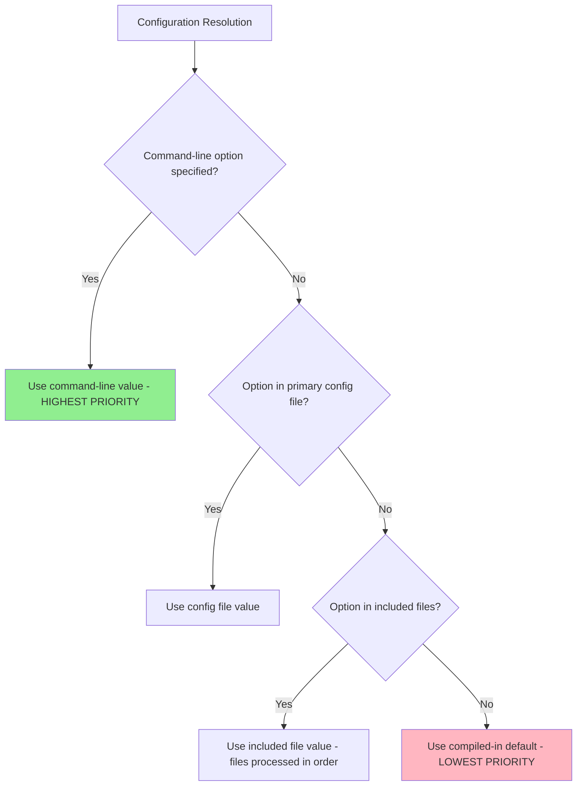
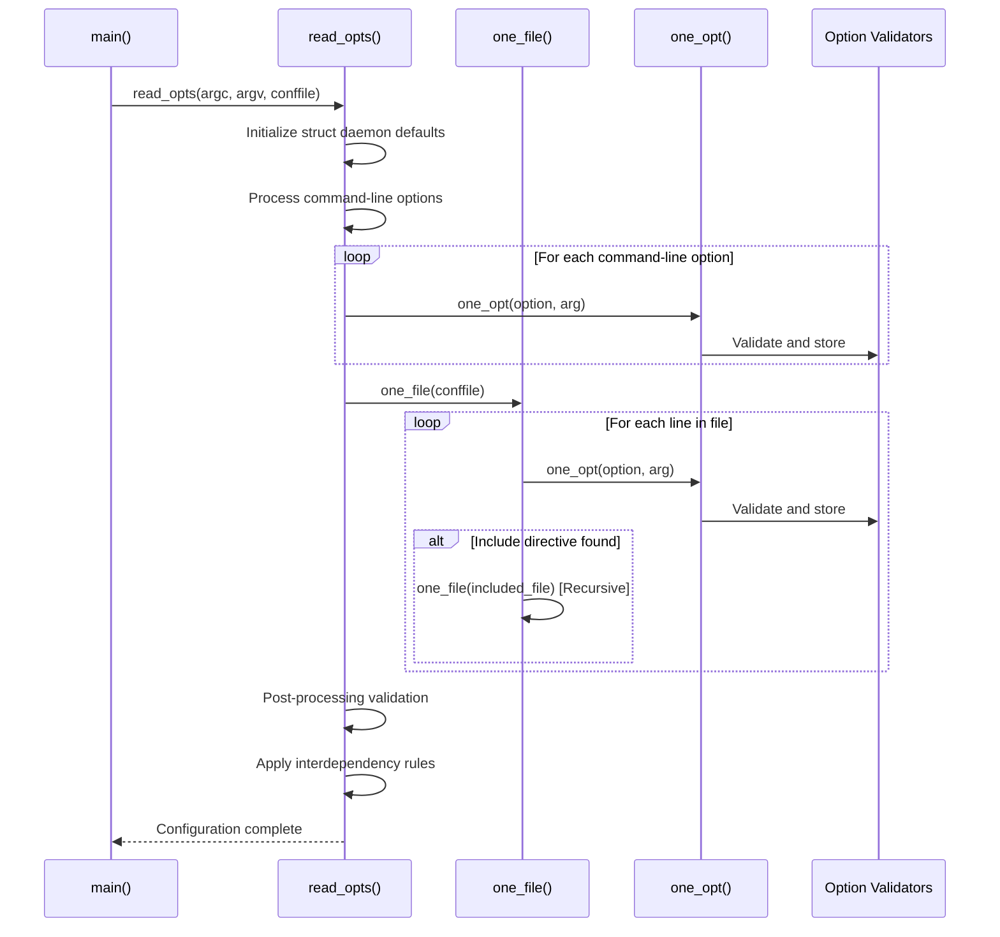

# dnsmasq Configuration System

## Table of Contents

- [Overview](#overview)
- [Configuration File Syntax](#configuration-file-syntax)
- [Command-Line vs File Precedence](#command-line-vs-file-precedence)
- [Configuration Parsing Algorithm](#configuration-parsing-algorithm)
- [Multi-Level Include System](#multi-level-include-system)
- [Dynamic Reload Semantics](#dynamic-reload-semantics)
- [Option Validation and Conflict Detection](#option-validation-and-conflict-detection)
- [Compile-Time Options Matrix](#compile-time-options-matrix)
- [Tuning Constants](#tuning-constants)
- [Default Value Assignment](#default-value-assignment)
- [Configuration Examples](#configuration-examples)
- [Related Documentation](#related-documentation)

## Overview

The dnsmasq configuration system provides flexible, hierarchical configuration management combining compile-time feature selection, configuration file directives, and command-line options. Configuration is processed through a sophisticated multi-pass parser implemented in `src/option.c` (5794 lines), which validates options, detects conflicts, and constructs the runtime configuration stored in the global `struct daemon` instance.

This document describes the complete configuration system architecture, including file syntax, parsing algorithms, option precedence rules, dynamic reload capabilities, and the comprehensive compile-time options matrix that controls feature availability.

## Configuration File Syntax

### Basic Syntax

dnsmasq configuration files use a simple key-value format based on long option names. Each configuration directive corresponds to a command-line option, using the long option name without the leading double-dash prefix.

**Syntax Rules:**
```
# Comments start with hash symbol and continue to end of line
option-name         # Boolean option (equivalent to --option-name)
option-name=value   # Option with value (equivalent to --option-name=value)
```

**Example Configuration:**
```
# DNS configuration
server=8.8.8.8
server=1.1.1.1
cache-size=1000

# DHCP configuration (if HAVE_DHCP enabled at compile time)
dhcp-range=192.168.1.50,192.168.1.150,12h
dhcp-option=option:router,192.168.1.1
dhcp-option=option:dns-server,192.168.1.1

# Interface binding
interface=eth0
listen-address=192.168.1.1
```

### Line Continuation

Long configuration values can span multiple lines using backslash (`\`) continuation:

```
dhcp-option=option:domain-search,\
example.com,\
internal.example.com,\
test.example.com
```

**Implementation:** Implemented in `src/option.c` `read_opts()` function which processes line-by-line input and handles continuation characters.

### Comment Syntax

Comments are introduced by the hash symbol (`#`) and extend to the end of the line. Comments can appear on their own line or after a configuration directive:

```
# Full-line comment
cache-size=500  # Inline comment explaining cache size choice
```

**Whitespace Handling:** Leading and trailing whitespace is stripped from option names and values. Whitespace around the equals sign is ignored.

### Include Directives

Configuration can reference external files using include directives:

```
# Single file inclusion
conf-file=/etc/dnsmasq.d/local.conf

# Directory inclusion (loads all files in lexicographic order)
conf-dir=/etc/dnsmasq.d
conf-dir=/etc/dnsmasq.d,*.conf  # With filename pattern filter
```

**Recursive Includes:** Include directives can be nested, with depth limits to prevent infinite recursion. See [Multi-Level Include System](#multi-level-include-system) for details.

## Command-Line vs File Precedence

### Precedence Hierarchy

dnsmasq resolves configuration from multiple sources with a well-defined precedence order:



**Precedence Order (Highest to Lowest):**

1. **Command-line options** - Always override file-based configuration
2. **Primary configuration file** - Specified via `-C` or `--conf-file`, defaults to `/etc/dnsmasq.conf`
3. **Included configuration files** - Loaded via `conf-file` or `conf-dir` directives in order encountered
4. **Compiled-in defaults** - Default values from `src/config.h` (lines 17-60)

### Multiple Specification Handling

**Single-Value Options:** For options that accept only one value (e.g., `cache-size`, `port`), the **last occurrence wins**:

```bash
# Command line overrides file
dnsmasq --cache-size=1000 --conf-file=/etc/dnsmasq.conf  # cache-size=1000 even if file specifies different value

# In configuration file, last occurrence wins
cache-size=500
cache-size=1000  # Final value: 1000
```

**Multi-Value Options:** For options that can be specified multiple times (e.g., `server`, `address`, `dhcp-range`), **all occurrences accumulate**:

```bash
# Multiple upstream DNS servers - all are used
server=8.8.8.8
server=1.1.1.1
server=208.67.222.222

# Command-line and file specifications combine
dnsmasq --server=8.8.8.8  # Adds to servers from config file
```

**Implementation:** Handled in `src/option.c` `one_opt()` function which dispatches to option-specific handlers. Boolean flags use bitwise OR to accumulate, while list-based options (servers, DHCP ranges) append to linked lists in `struct daemon`.

### Option Override Examples

**Example 1: Cache Size Override**
```bash
# /etc/dnsmasq.conf
cache-size=500

# Command line execution
$ dnsmasq --cache-size=2000
# Effective cache size: 2000 (command-line wins)
```

**Example 2: Multiple Servers Accumulation**
```bash
# /etc/dnsmasq.conf
server=8.8.8.8

# Command line adds additional server
$ dnsmasq --server=1.1.1.1
# Result: Both 8.8.8.8 and 1.1.1.1 configured as upstream servers
```

## Configuration Parsing Algorithm

### Overview

Configuration parsing is implemented in `src/option.c`, the largest source file in dnsmasq at 5794 lines. The parser performs multi-pass processing to handle option dependencies, validate configurations, and construct the runtime environment.

### Main Entry Point: read_opts()

The `read_opts()` function (located in `src/option.c`) serves as the primary configuration parser entry point, orchestrating the complete configuration loading process:

**Processing Flow:**



**Key Responsibilities:**

1. **Default Initialization:** Populates `struct daemon` with default values from `src/config.h` macros
2. **Command-Line Parsing:** Uses `getopt_long()` (or custom implementation if `HAVE_GETOPT_LONG` not defined) to process `argc`/`argv`
3. **File Processing:** Opens and reads configuration file line-by-line
4. **Include Expansion:** Recursively processes `conf-file` and `conf-dir` directives
5. **Option Dispatching:** Calls `one_opt()` for each parsed option
6. **Validation:** Performs comprehensive validation after all options loaded
7. **Memory Allocation:** Allocates heap memory for dynamic configuration structures (server lists, DHCP ranges, etc.)

### Option Dispatcher: one_opt()

The `one_opt()` function dispatches individual configuration options to specialized handlers based on option type:

**Option Categories:**

| Category | Examples | Handler Logic |
|----------|----------|---------------|
| DNS Configuration | `server`, `address`, `local` | Adds entries to DNS server list or local domain list in `struct daemon` |
| DHCP Configuration | `dhcp-range`, `dhcp-option`, `dhcp-host` | Creates `struct dhcp_context`, `struct dhcp_opt`, `struct dhcp_config` (requires `HAVE_DHCP` at compile time) |
| Interface Binding | `interface`, `listen-address`, `except-interface` | Configures network interface filters and socket binding addresses |
| Cache Configuration | `cache-size`, `no-negcache`, `local-ttl` | Sets cache parameters in `struct daemon` |
| Logging | `log-queries`, `log-dhcp`, `log-facility` | Configures logging subsystem flags and syslog facility |
| Security | `dnssec`, `trust-anchor`, `dnssec-check-unsigned` | Enables DNSSEC validation (requires `HAVE_DNSSEC` compile option) |

**Implementation Detail:** The function uses a large switch statement (with over 100 case labels corresponding to `LOPT_*` constants defined in `src/option.c` lines 67-200) to route to appropriate handlers.

### Memory Management

Configuration structures are allocated from the heap and linked into the global `struct daemon` instance. Memory ownership follows these rules:

- **Static Options:** Stored directly in `struct daemon` fields (integers, booleans, file descriptors)
- **Dynamic Lists:** Allocated via `whine_malloc()` wrapper and linked via `next` pointers (servers, DHCP contexts, options)
- **String Options:** Duplicated using `safe_string_alloc()` to ensure lifetime independence from input buffers

**Lifetime:** All configuration memory persists for the daemon's lifetime except during `SIGHUP` reload, where reloadable configuration is freed and reconstructed.

## Multi-Level Include System

### Include Directives

dnsmasq supports hierarchical configuration through two include mechanisms:

**1. Single File Inclusion (`conf-file`):**
```
conf-file=/etc/dnsmasq.d/custom.conf
```

Loads a specific configuration file. File must exist or dnsmasq will report an error and exit.

**2. Directory Inclusion (`conf-dir`):**
```
conf-dir=/etc/dnsmasq.d
conf-dir=/etc/dnsmasq.d,*.conf     # With glob pattern
conf-dir=/etc/dnsmasq.d,*.conf,*.hosts  # Multiple patterns
```

Loads all files in the specified directory matching the optional glob pattern(s). Files are processed in **lexicographic order** (alphabetical sorting). Non-existent directories are silently ignored.

### Recursive Processing

Include directives can be nested arbitrarily deep, subject to implementation-defined recursion limits:

```
# /etc/dnsmasq.conf
conf-file=/etc/dnsmasq.d/base.conf

# /etc/dnsmasq.d/base.conf
conf-file=/etc/dnsmasq.d/advanced.conf
server=8.8.8.8

# /etc/dnsmasq.d/advanced.conf
cache-size=2000
```

**Processing Order:**
1. `/etc/dnsmasq.conf` processed first
2. Include encountered → recursively process `/etc/dnsmasq.d/base.conf`
3. Include in `base.conf` encountered → recursively process `/etc/dnsmasq.d/advanced.conf`
4. Return to `base.conf`, process `server=8.8.8.8`
5. Return to `/etc/dnsmasq.conf`, continue processing

**Implementation:** Recursive descent implemented in `src/option.c` `one_file()` function, which calls itself when include directives are encountered.

### Include File Path Resolution

**Absolute Paths:** Used as-is:
```
conf-file=/etc/dnsmasq.d/local.conf
```

**Relative Paths:** Resolved relative to the working directory when dnsmasq was started (typically `/` for system daemons).

**Directory Scanning:** The `conf-dir` directive uses POSIX directory enumeration (`opendir()`, `readdir()`) to discover files, applies glob pattern matching, sorts results lexicographically, and processes in order.

### Depth Limits and Loop Prevention

**Recursion Protection:** While no explicit maximum depth is enforced in code, practical limits exist due to:
- Operating system file descriptor limits (each nested file consumes one descriptor)
- Stack depth limits for recursive `one_file()` calls
- Memory consumption for parsing state

**Infinite Loop Prevention:** The parser does NOT detect circular includes (e.g., file A includes file B which includes file A). Administrators must ensure acyclic include graphs. Circular includes will cause infinite recursion and process termination.

## Dynamic Reload Semantics

### SIGHUP Signal Handling

dnsmasq supports dynamic configuration reload without full daemon restart by sending the `SIGHUP` signal:

```bash
kill -HUP $(cat /var/run/dnsmasq.pid)
# or
systemctl reload dnsmasq
```

**Implementation:** Signal handler registered in `src/dnsmasq.c` queues reload event via self-pipe pattern. Main event loop invokes `clear_cache_and_reload()` function which re-reads configuration.

### Reloadable Configuration

The following configuration aspects can be modified and reloaded via `SIGHUP`:

**DNS Configuration:**
- Upstream DNS servers (`server` directives)
- Local domain resolutions (`address`, `local`, `server` with domain specifications)
- Hosts file entries (`/etc/hosts`, `--addn-hosts` files)
- DNS rebinding protection rules (`rebind-domain-ok`, `rebind-localhost-ok`)

**DHCP Configuration (if `HAVE_DHCP` enabled):**
- DHCP options (`dhcp-option` directives)
- Static host assignments (`dhcp-host` directives)
- DHCP lease database refresh (re-reads lease file from disk)

**Other:**
- Logging configuration (`log-queries`, `log-dhcp`, `log-facility`)
- Domain filtering rules (`bogus-nxdomain`, `ignore-address`)

**Processing:** Reload implementation in `src/option.c` `reread_dhcp()` and related functions frees old configuration structures and reconstructs from files.

### Non-Reloadable Configuration

The following require full daemon restart (stop and start, not just `SIGHUP`):

**Network Configuration:**
- Listen addresses (`listen-address`, `interface`, `bind-interfaces`)
- Port bindings (`port`, `dhcp-alternate-port`)
- Interface selection (`interface`, `except-interface`)

**Structural Parameters:**
- Cache size (`cache-size`) - requires reallocation of hash table
- Maximum DHCP leases (`dhcp-lease-max`)
- Process limits (`dns-forward-max`, `tftp-max-connections`)

**Feature Flags:**
- Any compile-time feature (`HAVE_DHCP`, `HAVE_DNSSEC`, etc.) - requires recompilation
- Boolean mode switches that affect socket creation (`bind-interfaces`, `bind-dynamic`)

**Rationale:** These parameters affect fundamental resource allocation (sockets, memory structures, file descriptors) performed during daemon initialization. Changing them requires re-initialization which is equivalent to full restart.

### Reload Limitations

**Caveats:**

1. **Lease Preservation:** DHCP leases are NOT lost on reload - they persist in memory and are synchronized with the lease file
2. **Active Connections:** Ongoing DNS queries and DHCP transactions continue without interruption
3. **Cache Flush:** DNS cache is cleared during reload, causing temporary performance impact until cache repopulates
4. **Configuration Errors:** If reload fails due to configuration errors, dnsmasq continues running with previous configuration and logs errors

**Error Handling:** Configuration validation occurs before old configuration is freed. If new configuration is invalid, reload fails gracefully without affecting running daemon state.

## Option Validation and Conflict Detection

### Address Range Validation

For DHCP address ranges (`dhcp-range` directive), the parser performs comprehensive validation:

**Checks Performed:**

1. **Syntax Validation:** Ensures start address, end address, and optional netmask/prefix are parseable
2. **Range Ordering:** Verifies start address ≤ end address numerically
3. **Overlap Detection:** Checks new range against existing ranges for same interface to detect conflicts
4. **Network Consistency:** Validates that start and end addresses are on the same subnet if netmask specified

**Example Invalid Configurations:**
```bash
# ERROR: End address before start address
dhcp-range=192.168.1.100,192.168.1.50,12h

# ERROR: Overlapping ranges on same interface
dhcp-range=192.168.1.50,192.168.1.150,12h
dhcp-range=192.168.1.100,192.168.1.200,12h  # Overlap: 100-150

# ERROR: Addresses on different subnets
dhcp-range=192.168.1.10,192.168.2.20,255.255.255.0,12h
```

**Implementation:** Validation implemented in `src/dhcp.c` `complete_context()` and `src/option.c` DHCP option parsing code.

### Port Conflict Detection

dnsmasq validates that configured ports do not conflict:

**Port Assignments:**
- **DNS Port:** Default 53 (configurable via `--port`)
- **DHCP Server Port:** Default 67 (configurable via `--dhcp-alternate-port`)
- **TFTP Port:** Default 69 (if `HAVE_TFTP` enabled, configurable via `--tftp-port`)

**Conflict Rules:**
- DNS and DHCP ports must differ if both services enabled
- TFTP port must not conflict with DNS or DHCP
- Port 0 disables the respective service

**Example:**
```bash
# Valid: Different ports
port=53
dhcp-alternate-port=1067
tftp-port=1069

# Invalid: DNS and DHCP on same port (error on startup)
port=5353
dhcp-alternate-port=5353
```

### Feature Dependency Checking

Configuration options that require specific compile-time features are validated:

**Dependency Examples:**

| Option | Required Compile Flag | Validation |
|--------|-----------------------|------------|
| `dhcp-range`, `dhcp-host` | `HAVE_DHCP` | Parser rejects with error if DHCP not compiled in |
| `dhcp-range=...::...` (IPv6) | `HAVE_DHCP6` | Requires both `HAVE_DHCP` and `HAVE_DHCP6` |
| `dnssec`, `trust-anchor` | `HAVE_DNSSEC` | Rejected with error if DNSSEC support not compiled |
| `enable-tftp`, `tftp-root` | `HAVE_TFTP` | Rejected if TFTP not compiled in |
| `auth-zone`, `auth-server` | `HAVE_AUTH` | Requires authoritative DNS support |

**Implementation:** Feature checks use `#ifdef HAVE_FEATURE` preprocessor conditionals around option parsing code. Attempts to use unsupported options trigger compile-time code exclusion, causing parser to report "unknown option" error.

**Example Error:**
```bash
# dnsmasq compiled without HAVE_DNSSEC
$ dnsmasq --dnssec
dnsmasq: unknown option: --dnssec
```

### Invalid Option Error Handling

When invalid configuration is detected:

1. **Error Reporting:** Descriptive error message printed to stderr and/or syslog identifying the specific problem
2. **Exit Code:** dnsmasq exits with non-zero status (typically exit code 1)
3. **No Partial Operation:** Daemon does NOT start with partial configuration - fails completely on any error

**Error Message Format:**
```
dnsmasq: bad <option-name> at line <N> of <config-file>: <description>
```

**Example:**
```bash
$ dnsmasq --conf-file=/etc/dnsmasq.conf
dnsmasq: bad dhcp-range at line 42 of /etc/dnsmasq.conf: start address after end address
```

## Compile-Time Options Matrix

### Feature Macros Overview

dnsmasq's functionality is controlled by compile-time feature macros defined in `src/config.h` (lines 62-200) and specified via `COPTS` during build. Features can be enabled by defining `HAVE_<feature>` macros or explicitly disabled using `NO_<feature>` macros.

**Build Command Example:**
```bash
# Enable DNSSEC and D-Bus support
make COPTS="-DHAVE_DNSSEC -DHAVE_DBUS"

# Minimal build: disable DHCP and TFTP
make COPTS="-DNO_DHCP -DNO_TFTP"
```

### Complete Feature Macro Table

| Macro Name | Default | Effect When Defined | Required Dependencies | Affected Files |
|------------|---------|---------------------|----------------------|----------------|
| **HAVE_BROKEN_RTC** | Disabled | Use uptime instead of epoch time for lease tracking; reduce lease file writes for flash-friendly operation on embedded systems without RTC | None | `lease.c`, `dhcp.c`, `dhcp6.c` |
| **HAVE_TFTP** | **Enabled** | Enable built-in TFTP server for network boot and file transfer (RFC 1350) | None | `tftp.c`, `network.c`, `dnsmasq.c` |
| **HAVE_DHCP** | **Enabled** | Enable DHCPv4 server for IPv4 address assignment per RFC 2131 | None | `dhcp.c`, `rfc2131.c`, `lease.c`, `dhcp-common.c`, `network.c` |
| **HAVE_DHCP6** | **Enabled** | Enable DHCPv6 server for IPv6 address assignment per RFC 3315; automatically implies `HAVE_DHCP` | `HAVE_DHCP` (implicit) | `dhcp6.c`, `rfc3315.c`, `radv.c`, `slaac.c`, `outpacket.c` |
| **HAVE_SCRIPT** | **Enabled** | Enable external script execution on DHCP lease changes via `--dhcp-script` option | None (shell execution) | `helper.c`, `lease.c`, `dnsmasq.c` |
| **HAVE_LUASCRIPT** | Disabled | Enable Lua scripting for DHCP lease events; automatically implies `HAVE_SCRIPT` | `lua5.2` library, `HAVE_SCRIPT` (implicit) | `helper.c` with Lua bindings |
| **HAVE_DBUS** | Disabled | Enable D-Bus IPC interface for runtime control (SetServers, ClearCache, GetVersion methods) | `libdbus-1` (pkg-config: `dbus-1`) | `dbus.c`, `dnsmasq.c` |
| **HAVE_UBUS** | Disabled | Enable OpenWrt ubus IPC interface for runtime control (alternative to D-Bus) | `libubox`, `libubus` (OpenWrt-specific) | `ubus.c`, `dnsmasq.c` |
| **HAVE_IDN** | Disabled | Enable Internationalized Domain Names support using IDNA2003 standard | `libidn` (pkg-config: `libidn`) | `rfc1035.c`, `util.c`, `option.c` |
| **HAVE_LIBIDN2** | Disabled | Enable Internationalized Domain Names support using IDNA2008 standard (preferred over IDN) | `libidn2` (pkg-config: `libidn2`) | `rfc1035.c`, `util.c`, `option.c` |
| **HAVE_CONNTRACK** | Disabled | Propagate netfilter conntrack marks from incoming DNS queries to upstream queries for policy routing | `libnetfilter_conntrack` (pkg-config: `libnetfilter_conntrack`) | `conntrack.c`, `forward.c` |
| **HAVE_IPSET** | **Enabled** | Enable selective addition of resolved IP addresses to Linux ipsets for firewall integration | Kernel ipset support (no library) | `ipset.c`, `rfc1035.c`, `forward.c` |
| **HAVE_NFTSET** | Disabled | Enable selective addition of resolved IP addresses to nftables sets (modern replacement for ipset) | `libnftables` (pkg-config: `libnftables`) | `nftset.c`, `rfc1035.c`, `forward.c` |
| **HAVE_AUTH** | **Enabled** | Enable authoritative DNS server mode for serving local zones with SOA records | None | `auth.c`, `forward.c`, `cache.c` |
| **HAVE_CRYPTOHASH** | Disabled | Include cryptographic hash functions (SHA-256, etc.) without full DNSSEC validation | `libnettle` (pkg-config: `nettle`) | `crypto.c`, `hash-questions.c` |
| **HAVE_DNSSEC** | Disabled | Enable full DNSSEC validation with signature checking, trust anchor verification, and NSEC/NSEC3 proofs per RFCs 4033-4035 | `libnettle`, `libhogweed`, `libgmp` (pkg-config: `nettle hogweed`) | `dnssec.c`, `crypto.c`, `blockdata.c`, `forward.c`, `rfc1035.c` |
| **HAVE_DUMPFILE** | **Enabled** | Enable packet capture to libpcap format file for debugging (write-only, not read) | None (libpcap format writing only) | `dump.c`, `forward.c` |
| **HAVE_LOOP** | **Enabled** | Enable DNS forwarding loop detection to prevent resolver loops | None | `loop.c`, `forward.c` |
| **HAVE_INOTIFY** | Disabled | Use Linux inotify facility for efficient configuration file monitoring and automatic reload | Linux kernel inotify support | `inotify.c`, `dnsmasq.c` |
| **NO_ID** | Disabled | Disable `*.bind` CHAOS TXT record responses (version, authors); forward such queries upstream instead | N/A (disables feature) | `rfc1035.c` |
| **NO_TFTP** | Disabled | Explicitly disable TFTP server even if `HAVE_TFTP` would be enabled by default | N/A (disables feature) | Build system excludes `tftp.c` |
| **NO_DHCP** | Disabled | Explicitly disable DHCPv4 server; also disables DHCPv6 | N/A (disables feature) | Build system excludes DHCP modules |
| **NO_DHCP6** | Disabled | Explicitly disable DHCPv6 server while retaining DHCPv4 | N/A (disables feature) | Build system excludes `dhcp6.c`, `rfc3315.c`, `radv.c` |
| **NO_SCRIPT** | Disabled | Disable lease-change script execution support | N/A (disables feature) | `helper.c` excluded or stubbed |
| **NO_LARGEFILE** | Disabled | Disable large file support (files >2GB) on 32-bit systems | N/A (disables feature) | File I/O in `lease.c`, `log.c` |
| **NO_AUTH** | Disabled | Disable authoritative DNS server mode | N/A (disables feature) | Build system excludes `auth.c` |
| **NO_DUMPFILE** | Disabled | Disable packet capture functionality | N/A (disables feature) | Build system excludes `dump.c` |
| **NO_LOOP** | Disabled | Disable loop detection mechanism | N/A (disables feature) | Build system excludes `loop.c` |
| **NO_INOTIFY** | Disabled | Disable inotify usage even on Linux systems | N/A (disables feature) | Build system excludes `inotify.c` |
| **NO_GMP** | Disabled | Don't link against `libgmp` for DNSSEC; use nettle's mini-gmp instead (smaller binary, slightly slower) | `libnettle` compiled with `--enable-mini-gmp` | `crypto.c` (linker flags) |

### Feature Dependency Graph

```mermaid
graph TD
    DHCP6[HAVE_DHCP6] -->|implies| DHCP[HAVE_DHCP]
    LUASCRIPT[HAVE_LUASCRIPT] -->|implies| SCRIPT[HAVE_SCRIPT]
    DNSSEC[HAVE_DNSSEC] -->|requires| NETTLE[libnettle + libhogweed]
    DNSSEC -->|optionally requires| GMP[libgmp unless NO_GMP]
    CRYPTOHASH[HAVE_CRYPTOHASH] -->|requires| NETTLE_BASIC[libnettle]
    DBUS[HAVE_DBUS] -->|requires| LIBDBUS[libdbus-1]
    UBUS[HAVE_UBUS] -->|requires| LIBUBUS[libubox + libubus]
    CONNTRACK[HAVE_CONNTRACK] -->|requires| LIBCONNTRACK[libnetfilter_conntrack]
    NFTSET[HAVE_NFTSET] -->|requires| LIBNFT[libnftables]
    IDN[HAVE_IDN] -->|requires| LIBIDN[libidn]
    IDN2[HAVE_LIBIDN2] -->|requires| LIBIDN2[libidn2]
    LUASCRIPT -->|requires| LUA[lua5.2]
    
    NO_DHCP[NO_DHCP] -.->|disables| DHCP
    NO_DHCP6[NO_DHCP6] -.->|disables| DHCP6
    NO_SCRIPT[NO_SCRIPT] -.->|disables| SCRIPT
    NO_TFTP[NO_TFTP] -.->|disables| TFTP[HAVE_TFTP]
    
    style DHCP6 fill:#87CEEB
    style LUASCRIPT fill:#87CEEB
    style DHCP fill:#90EE90
    style SCRIPT fill:#90EE90
    style NETTLE fill:#FFD700
    style LIBDBUS fill:#FFD700
    style NO_DHCP fill:#FFB6C1
    style NO_DHCP6 fill:#FFB6C1
```



**Legend:**
- Blue nodes: Features that imply other features
- Green nodes: Implied base features
- Yellow nodes: External library dependencies
- Pink nodes: Explicit disable macros

### Default Compilation Configuration

The distributed `src/config.h` enables the following features by default (lines 176-183):

```c
#define HAVE_DHCP       /* DHCPv4 server */
#define HAVE_DHCP6      /* DHCPv6 server (implies HAVE_DHCP) */
#define HAVE_TFTP       /* TFTP server */
#define HAVE_SCRIPT     /* Lease-change scripts */
#define HAVE_AUTH       /* Authoritative DNS */
#define HAVE_IPSET      /* Linux ipset integration */
#define HAVE_LOOP       /* Loop detection */
#define HAVE_DUMPFILE   /* Packet capture */
```

**Rationale:** This default configuration provides full DNS, DHCP, and TFTP functionality without requiring external libraries beyond standard C library.

### Feature Build Examples

**Full-Featured Build (All Optional Features):**
```bash
make COPTS="-DHAVE_DNSSEC -DHAVE_DBUS -DHAVE_LIBIDN2 -DHAVE_CONNTRACK -DHAVE_LUASCRIPT -DHAVE_NFTSET -DHAVE_INOTIFY"
```

**Minimal DNS-Only Build:**
```bash
make COPTS="-DNO_DHCP -DNO_TFTP -DNO_AUTH -DNO_DUMPFILE"
```

**Embedded System Build (No RTC, Minimal Features):**
```bash
make COPTS="-DHAVE_BROKEN_RTC -DNO_DHCP6 -DNO_TFTP -DNO_AUTH -DNO_SCRIPT -DNO_INOTIFY"
```

**DNSSEC-Enabled with D-Bus Control:**
```bash
make COPTS="-DHAVE_DNSSEC -DHAVE_DBUS -DHAVE_LIBIDN2"
```

## Tuning Constants

In addition to feature macros, `src/config.h` defines tuning constants (lines 17-60) that control resource limits and timeout values:

| Constant | Default | Description | Compile-Time Override |
|----------|---------|-------------|----------------------|
| **FTABSIZ** | 150 | Maximum concurrent outstanding DNS queries (forward record freelist size) | `-DFTABSIZ=<value>` |
| **MAX_PROCS** | 20 | Maximum child processes for concurrent TCP DNS queries | `-DMAX_PROCS=<value>` |
| **CHILD_LIFETIME** | 150 seconds | TCP child process timeout per RFC 1035 (>120s recommended) | `-DCHILD_LIFETIME=<value>` |
| **TCP_MAX_QUERIES** | 100 | Maximum queries per incoming TCP connection before close | `-DTCP_MAX_QUERIES=<value>` |
| **EDNS_PKTSZ** | 4096 bytes | Default maximum EDNS0 UDP packet size per RFC 5625 | `-DEDNS_PKTSZ=<value>` |
| **CACHESIZ** | 150 entries | Default DNS cache size (overridden by `--cache-size` runtime option) | `-DCACHESIZ=<value>` |
| **MAXLEASES** | 1000 leases | Maximum number of DHCP leases | `-DMAXLEASES=<value>` |
| **PING_WAIT** | 3 seconds | Timeout for ICMP ping during DHCP address conflict detection | `-DPING_WAIT=<value>` |
| **TIMEOUT** | 10 seconds | DNS query timeout before retry or failure | `-DTIMEOUT=<value>` |
| **FORWARD_TEST** | 50 queries | Test all servers every N queries to update health metrics | `-DFORWARD_TEST=<value>` |
| **FORWARD_TIME** | 20 seconds | Test all servers every N seconds regardless of query count | `-DFORWARD_TIME=<value>` |
| **DNSSEC_WORK** | 50 queries | Maximum dependent queries for validating one DNSSEC question (prevents DoS) | `-DDNSSEC_WORK=<value>` |
| **CNAME_CHAIN** | 10 hops | Maximum CNAME chain length before loop detection triggers | `-DCNAME_CHAIN=<value>` |

**Example Custom Build:**
```bash
# Large cache, high query capacity, aggressive DNSSEC limits
make COPTS="-DCACHESIZ=10000 -DFTABSIZ=500 -DDNSSEC_WORK=100"
```

## Default Value Assignment

### Assignment Priority

Configuration values are resolved using the precedence hierarchy described earlier, with default assignment logic:

1. **Command-line option present:** Use explicit value
2. **Config file option present:** Use file value
3. **Compile-time default:** Use value from `src/config.h` constant
4. **Hardcoded fallback:** Use fallback value if constant undefined (rare)

### Platform-Specific Defaults

Certain paths and defaults vary by platform, controlled via preprocessor conditionals in `src/config.h` (lines 202-237):

**Lease File Paths:**
- **Linux:** `/var/lib/misc/dnsmasq.leases`
- **FreeBSD/OpenBSD/NetBSD:** `/var/db/dnsmasq.leases`
- **Solaris:** `/var/cache/dnsmasq.leases`
- **Android:** `/data/misc/dhcp/dnsmasq.leases`

**Configuration File Paths:**
- **FreeBSD:** `/usr/local/etc/dnsmasq.conf`
- **Other Unix:** `/etc/dnsmasq.conf`

**PID File Paths:**
- **Android:** `/data/dnsmasq.pid`
- **Other Unix:** `/var/run/dnsmasq.pid`

**Implementation:** Platform detection uses preprocessor macros (`__FreeBSD__`, `__OpenBSD__`, `__sun__`, `__ANDROID__`, etc.) to select appropriate paths at compile time.

### Default User/Group

Default privilege-drop user and group (lines 47-48):

```c
#define CHUSER "nobody"
#define CHGRP "dip"
```

Overridden at runtime with `--user` and `--group` options.

## Configuration Examples

### Complete Home Router Configuration

```
# /etc/dnsmasq.conf - Typical home router setup

# Interfaces
interface=br0
listen-address=192.168.1.1

# DNS Configuration
server=8.8.8.8
server=8.8.4.4
cache-size=1000
no-resolv  # Don't read /etc/resolv.conf

# DHCP Configuration
dhcp-range=192.168.1.50,192.168.1.200,24h
dhcp-option=option:router,192.168.1.1
dhcp-option=option:dns-server,192.168.1.1
dhcp-option=option:ntp-server,192.168.1.1

# Static DHCP leases
dhcp-host=00:11:22:33:44:55,192.168.1.10,desktop
dhcp-host=aa:bb:cc:dd:ee:ff,192.168.1.20,laptop

# Local domain
local=/home.lan/
domain=home.lan
expand-hosts

# Logging
log-queries
log-dhcp

# Additional configuration
conf-dir=/etc/dnsmasq.d,*.conf
```

### Enterprise DNS Forwarder

```
# /etc/dnsmasq.conf - Enterprise DNS with DNSSEC

# Network binding
interface=eth0
listen-address=10.0.0.53

# Upstream DNS servers with domain-specific routing
server=10.0.0.1
server=/internal.corp.com/10.0.0.10
server=/dmz.corp.com/10.0.0.20

# DNSSEC validation
dnssec
trust-anchor=.,20326,8,2,E06D44B80B8F1D39A95C0B0D7C65D08458E880409BBC683457104237C7F8EC8D

# Large cache for performance
cache-size=10000
min-cache-ttl=300

# Logging
log-queries
log-facility=local0

# Advanced options
no-resolv
no-poll
all-servers  # Query all servers simultaneously
```

### Minimal Embedded Device

```
# /etc/dnsmasq.conf - Minimal embedded configuration
# (Requires: make COPTS="-DHAVE_BROKEN_RTC -DNO_TFTP")

interface=eth0
no-dhcp-interface=wlan0

# Minimal DNS cache
cache-size=50

# Simple DHCP
dhcp-range=192.168.2.100,192.168.2.150,12h
dhcp-option=option:router,192.168.2.1

# Flash-friendly: reduce writes
leasefile-ro  # Read-only lease file

# No logging to conserve resources
log-queries=extra  # Log to /var/log/dnsmasq-queries.log only
```

## Related Documentation

- [System Architecture](ARCHITECTURE.md) - Overall dnsmasq architecture and event loop
- [DNS Forwarding](DNS_FORWARDING.md) - DNS query forwarding implementation
- [DHCP Server](DHCP_V4.md) - DHCPv4 server configuration and operation
- [Building dnsmasq](BUILDING.md) - Compilation instructions and COPTS usage
- [Back to Documentation Index](README.md)

---

**Implementation References:**
- Configuration parsing: `src/option.c` `read_opts()` (main parser), `one_opt()` (dispatcher), `one_file()` (file reader)
- Configuration storage: `src/dnsmasq.h` `struct daemon` (lines 800+)
- Compile-time options: `src/config.h` (lines 17-60 constants, 62-200 feature macros)
- Build system: `Makefile` COPTS processing (lines 29, 54-74)
- Reload handling: `src/dnsmasq.c` `clear_cache_and_reload()`, `src/option.c` `reread_dhcp()`

*This documentation covers dnsmasq version 2.90 (development snapshot). Configuration options and behavior may vary in other versions.*
