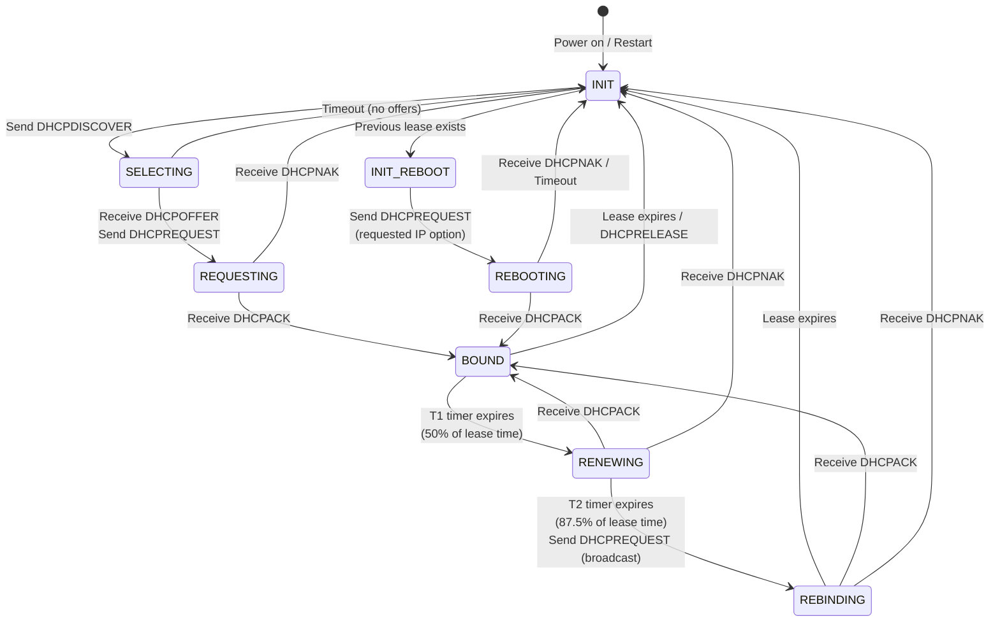
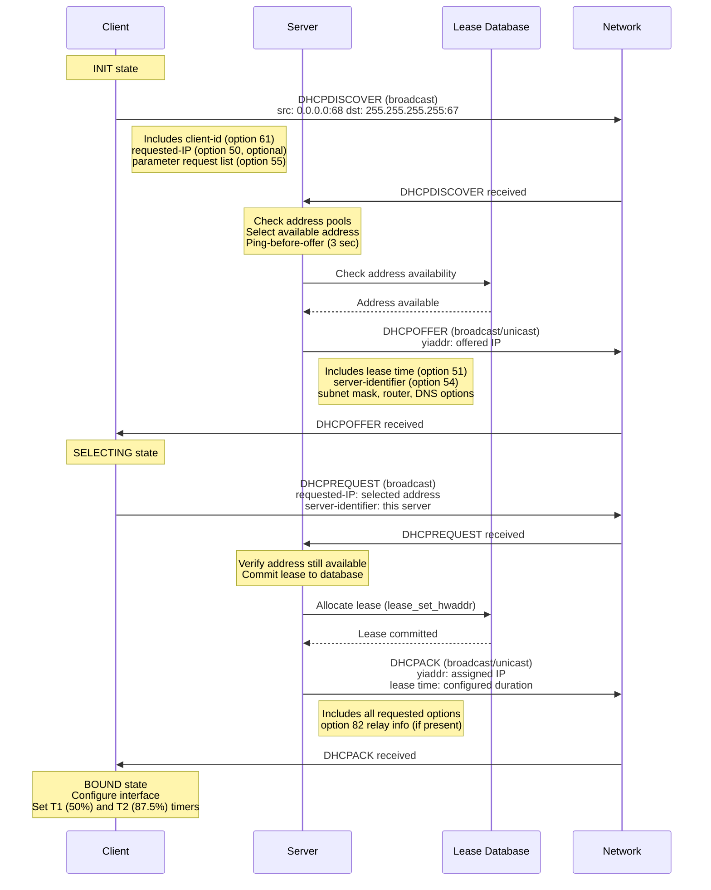
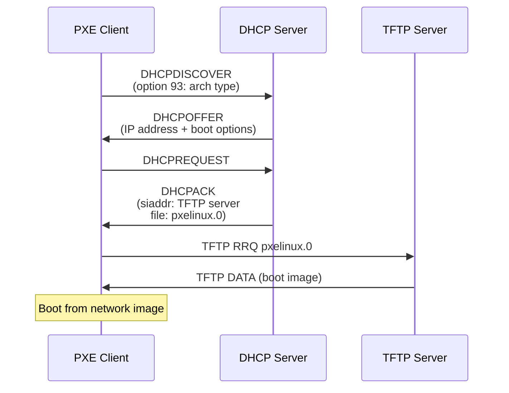

# DHCPv4 Server Implementation

## Overview

This document provides comprehensive documentation of dnsmasq's DHCPv4 server implementation per [RFC 2131](https://www.rfc-editor.org/rfc/rfc2131). The DHCPv4 server provides dynamic IP address allocation, lease management, PXE boot support, and full protocol compliance for IPv4 network autoconfiguration.

The implementation is split across multiple source files:
- **src/rfc2131.c** (2811 lines) - RFC 2131 protocol implementation and message handling
- **src/dhcp.c** (1191 lines) - DHCPv4 server core logic and address allocation
- **src/lease.c** (1205 lines) - Lease database persistence with atomic updates
- **src/dhcp-common.c** (1050 lines) - Shared DHCPv4/v6 utility functions

## RFC 2131 Compliance Matrix

dnsmasq implements full RFC 2131 DHCPv4 protocol compliance. The table below maps RFC 2131 message types to their implementation in the codebase.

| RFC 2131 Message Type | RFC Section | Description | Implementation | Code Location |
|----------------------|-------------|-------------|----------------|---------------|
| DHCPDISCOVER | Section 3.1, 4.3.1 | Client broadcast to locate servers | Fully implemented, address allocation from pools | src/rfc2131.c lines 1082-1200 |
| DHCPOFFER | Section 3.1, 4.3.1 | Server response with offered address | Generated in response to DISCOVER | src/rfc2131.c lines 1100-1200 |
| DHCPREQUEST | Section 3.1, 4.3.2 | Client request for specific address | Handles SELECTING, INIT-REBOOT, RENEWING, REBINDING states | src/rfc2131.c lines 1144-1528 |
| DHCPACK | Section 3.1, 4.3.1 | Server acknowledgment of lease | Confirms lease with options | src/rfc2131.c lines 1515-1528 |
| DHCPNAK | Section 3.1, 4.3.2 | Server negative acknowledgment | Rejects invalid requests, broadcasts to client | src/rfc2131.c lines 1351-1373 |
| DHCPRELEASE | Section 3.1, 4.3.4 | Client releases address | Prunes lease from database | src/rfc2131.c lines 1066-1080 |
| DHCPDECLINE | Section 3.1, 4.3.3 | Client reports address conflict | Marks address declined, backoff timer | src/rfc2131.c lines 1032-1064 |
| DHCPINFORM | Section 3.4 | Client requests configuration | Provides options without lease | src/rfc2131.c lines 1530-1596 |

The main entry point is `dhcp_reply()` in src/rfc2131.c (lines 71-1599), which processes all incoming DHCPv4 packets and dispatches to appropriate message type handlers via a switch statement (lines 1030-1596).

## DHCP State Machine

The DHCPv4 protocol implements a client state machine as specified in RFC 2131 Section 4.4. The diagram below illustrates the complete state transition model with message types and timer events.



### State Machine Implementation Details

The server-side implementation in src/rfc2131.c lines 1144-1528 handles three distinct client scenarios:

**SELECTING State (lines 1144-1242):** Client has received DHCPOFFER and sends DHCPREQUEST with server-identifier option selecting this server. Server verifies the server-identifier matches one of its addresses.

**INIT-REBOOT State (lines 1243-1251):** Client with previous lease sends DHCPREQUEST with requested-IP option but no server-identifier. Server validates the requested address is appropriate for the network.

**RENEWING/REBINDING States (lines 1253-1276):** Client sends DHCPREQUEST with ciaddr set. In RENEWING, the request is unicast to the server. In REBINDING (after T2 timer), the request is broadcast. Server responds with DHCPACK to extend the lease or DHCPNAK if the lease is no longer valid.

Lease time calculations use T1 = 50% of lease time and T2 = 87.5% of lease time per RFC 2131 Section 4.4.5. The server applies a random "fuzz" factor (lines 1273-1274) using `rand16()` to desynchronize renewal requests from multiple clients.

## DHCPv4 Message Exchange Sequence

The following sequence diagram illustrates the complete 4-message DHCP exchange for initial address allocation:



## Lease Allocation Algorithm

The lease allocation algorithm is implemented in src/dhcp.c and src/rfc2131.c with a hierarchical address selection strategy:

### Address Selection Priority (src/rfc2131.c lines 1287-1346)

1. **Static Reservations** (Highest Priority): If `have_config(config, CONFIG_ADDR)` returns true (lines 1287-1290), the address from `struct dhcp_config` is used. Static addresses are configured via `dhcp-host` directives with MAC-to-IP mappings.

2. **Existing Lease Reuse**: If client has an existing lease via `lease_find_by_client()` (src/rfc2131.c line 247) and the address is still valid for the network, that address is reused.

3. **Dynamic Allocation**: If no static reservation or existing lease exists, `address_allocate()` (src/dhcp.c) selects an available address from the configured address pools.

### Dynamic Address Allocation (src/dhcp.c)

The `address_allocate()` function (implementation spans multiple helper functions) implements the following algorithm:

1. **Context Validation**: Iterate through `struct dhcp_context` linked list to find applicable address pools for the requesting interface and network tags (src/dhcp.c lines 640-668).

2. **Address Range Checking**: Each context defines a start and end address. The allocator searches for an available address within `[context->start, context->end]` (lines 657-665).

3. **Conflict Avoidance**: Before allocating an address:
   - Check if address is already leased via `lease_find_by_addr()`
   - Verify address is not the server's own address (line 652)
   - Execute ping-before-offer if enabled (see Conflict Detection section)

4. **Allocation Strategy**: Addresses are allocated sequentially from the pool with an epoch-based rotation mechanism (`context->addr_epoch`, line 1062) to distribute addresses over time and avoid always starting from the pool beginning.

### Code Example - Address Pool Validation

```c
struct dhcp_context *tmp;
unsigned int start = ntohl(tmp->start.s_addr);
unsigned int end = ntohl(tmp->end.s_addr);

if (!(tmp->flags & (CONTEXT_STATIC | CONTEXT_PROXY)) &&
    addr >= start && addr <= end &&
    match_netid(tmp->filter, netids, 1))
    return tmp; /* Address is within valid pool */
```

## Address Pool Management

Address pools are configured using `struct dhcp_context` structures defined in src/dnsmasq.h (lines 550-600). Each context represents an address range with associated network configuration.

### Pool Configuration Structure

```c
struct dhcp_context {
  struct in_addr start, end;        /* Address range boundaries */
  struct in_addr netmask;            /* Subnet mask */
  struct in_addr broadcast;          /* Broadcast address */
  struct in_addr router;             /* Default gateway */
  struct in_addr local;              /* Server identifier address */
  unsigned int lease_time;           /* Lease duration in seconds */
  int flags;                         /* CONTEXT_* flags */
  struct dhcp_netid *filter;         /* Tag-based filtering */
  struct dhcp_context *current;      /* Linked list for interface */
  struct dhcp_context *next;         /* Next context in global list */
};
```

### Pool Selection and Tag-Based Filtering

Multiple address pools can be configured for a single interface using tag-based selection (src/dhcp.c lines 655-665). Tags are assigned based on:

- **Interface Name**: Automatically tagged with interface name (src/rfc2131.c lines 109-112)
- **Vendor Class**: Matched against option 60 vendor class identifier
- **User Class**: Matched against option 77 user class
- **MAC Address**: Matched against configured MAC address tags via `dhcp-mac`
- **Relay Agent**: Circuit-ID and Remote-ID from option 82

The `match_netid()` function determines if a client's tags match a pool's filter, enabling sophisticated conditional address assignment.

### Range Validation

During initialization, src/dhcp.c `complete_context()` (lines 555-638) validates address ranges:

- Checks range consistency with interface netmask (lines 536-553)
- Warns if range boundaries don't match subnet (lines 548-550)
- Configures broadcast addresses if not explicitly set (lines 600-601, 623-629)
- Links contexts to physical interfaces via `context->current` chain

### Multiple Range Support

Multiple non-overlapping ranges can be configured per interface:

```
dhcp-range=set:office,192.168.1.50,192.168.1.100,24h
dhcp-range=set:guest,192.168.1.150,192.168.1.200,1h
```

Clients receive addresses from ranges matching their tag set. This enables separate pools for different client classes with distinct lease times and options.

## Lease Database Persistence

Lease persistence is implemented in src/lease.c with atomic file updates to prevent corruption and support embedded systems.

### Lease File Format

The lease file stores one lease per line with space-separated fields:

```
<lease-expiry> <MAC-address> <IP-address> <hostname> <client-id>
```

Example lease file entries:
```
1234567890 01:23:45:67:89:ab 192.168.1.100 workstation-1 *
1234567900 aa:bb:cc:dd:ee:ff 192.168.1.101 laptop-2 01:aa:bb:cc:dd:ee:ff
```

Lease expiry is stored as Unix timestamp (seconds since epoch). For systems without RTC (HAVE_BROKEN_RTC defined), expiry is stored as remaining lease duration instead of absolute time.

### Atomic File Update Mechanism (src/lease.c)

The `lease_update_file()` function implements atomic updates via rename:

1. **Write to Temporary File**: New lease data written to `<leasefile>.tmp` (line references depend on function implementation)
2. **Atomic Rename**: `rename()` system call atomically replaces old lease file
3. **Corruption Recovery**: If lease file is corrupted or missing, retry after `LEASE_RETRY` seconds (60 seconds, defined in src/config.h line 32)

```c
/* Atomic lease file update pattern */
FILE *leasestream;
leasestream = fopen(daemon->lease_file, "w");
/* Write all leases */
fclose(leasestream);
/* File is now consistent on disk */
```

### HAVE_BROKEN_RTC Support

For embedded systems without real-time clocks (src/config.h lines 65-77), dnsmasq modifies lease handling:

- **Relative Time Storage**: Stores remaining lease time instead of absolute expiry timestamp
- **Reduced Write Frequency**: Only writes lease file on lease creation or deletion, not on renewal
- **Flash-Friendly**: Minimizes flash wear by avoiding frequent rewrites

When HAVE_BROKEN_RTC is defined, lease times are calculated from system uptime rather than wall-clock time.

### Lease Database Recovery

On startup, `read_leases()` (src/lease.c lines 24-300) parses the lease file:

- Validates each lease entry format
- Checks IP address validity via `inet_pton()`
- Reconstructs in-memory lease structures
- Logs warnings for invalid entries and continues parsing (lines 64-68)
- Handles both DHCPv4 and DHCPv6 leases (conditional on HAVE_DHCP6)

If lease file is corrupt beyond recovery, dnsmasq starts with empty lease database and logs errors.

## DHCP Option Encoding and Decoding

DHCP options follow RFC 2132 format with TLV (Type-Length-Value) encoding. Implementation is split between src/rfc2131.c (encoding) and src/dhcp-common.c (shared utilities).

### Option Format (RFC 2132)

Each option consists of:
- **Type**: 1 byte option code
- **Length**: 1 byte data length (0-255 bytes)
- **Value**: Variable-length data

Special option codes:
- **Option 0 (OPTION_PAD)**: Padding byte
- **Option 255 (OPTION_END)**: End of options marker

### Option Parsing Functions

**option_find()** (src/rfc2131.c line 38): Locates an option in a DHCP packet by type, validates minimum length:

```c
unsigned char *opt;
opt = option_find(mess, sz, OPTION_MESSAGE_TYPE, 1);
if (opt)
    mess_type = option_uint(opt, 0, 1);
```

**option_find1()** (src/rfc2131.c line 39): Searches within a specific option range, used for sub-options.

**option_uint()** (src/rfc2131.c line 35): Extracts integer values from options with specified byte length and offset.

**option_addr()** (src/rfc2131.c line 34): Extracts IPv4 address from 4-byte option value.

### Option Encoding Functions

**option_put()** (src/rfc2131.c line 31): Writes an integer option to packet:

```c
option_put(mess, end, OPTION_MESSAGE_TYPE, 1, DHCPACK);
option_put(mess, end, OPTION_LEASE_TIME, 4, time);
```

**option_put_string()** (src/rfc2131.c line 32): Writes string options with optional null termination for broken Microsoft clients.

**do_options()** (src/rfc2131.c lines 43-58): Master function that encodes all DHCP options into response packet based on configuration, requested options list (option 55), and client context.

### Option Overload Support

RFC 2132 Section 9.3 allows using the `file` and `sname` fields for additional options when option space in the standard options field is exhausted. dnsmasq implements option overload (option 52) when needed to accommodate large option sets, particularly for PXE boot configurations.

### Vendor-Specific Options (Option 43)

Vendor-specific information (option 43) is encapsulated and matched against vendor class identifier (option 60). The `do_encap_opts()` function (src/rfc2131.c line 62) handles vendor option encoding with tag matching via `match_vendor_opts()` (line 61).

## Option 82 Relay Agent Information

DHCP Relay Agent Information Option (option 82) is defined in RFC 3046 and implemented in src/rfc2131.c lines 185-233.

### Option 82 Structure

Option 82 contains sub-options:
- **Sub-option 1 (Circuit ID)**: Identifies the circuit (interface) on which request was received
- **Sub-option 2 (Remote ID)**: Identifies the remote host (client) that sent the request
- **Sub-option 5 (Link Selection)**: RFC 3527 subnet selection (lines 203-205)
- **Sub-option 11 (Server ID Override)**: RFC 5107 server identifier override (lines 207-209)

### Relay Agent Processing

When a DHCP request arrives with option 82 (src/rfc2131.c lines 185-233):

1. **Option Preservation**: The entire option 82 is copied to the end of the packet buffer (lines 192-201) to ensure it's not overwritten during option processing.

2. **Sub-Option Extraction**: 
   - Link Selection sub-option (SUBOPT_SUBNET_SELECT) overrides subnet determination (lines 203-205)
   - Server ID Override sub-option (SUBOPT_SERVER_OR) changes server identifier in responses (lines 207-209)
   - Circuit ID and Remote ID are matched against configured vendor matching rules (lines 211-232)

3. **Tag Assignment**: Circuit ID, Remote ID, and Subscriber ID (sub-option 6) can be matched against configuration to assign network tags, enabling tag-based pool and option selection.

4. **Response Handling**: Option 82 is echoed back verbatim in DHCP responses per RFC 3046 Section 2.0.

### Circuit ID and Remote ID Matching

The relay agent matching mechanism (lines 211-232) allows conditional configuration based on relay information:

```c
if (vendor->match_type == MATCH_CIRCUIT)
    search = SUBOPT_CIRCUIT_ID;
else if (vendor->match_type == MATCH_REMOTE)
    search = SUBOPT_REMOTE_ID;

if (vendor->len == option_len(sopt) &&
    memcmp(option_ptr(sopt, 0), vendor->data, vendor->len) == 0) {
    vendor->netid.next = netid;
    netid = &vendor->netid;  /* Assign tag */
}
```

This enables configurations like:
```
dhcp-circuitid=set:vlan10,circuit-id-value
dhcp-remoteid=set:office,remote-id-value
```

## PXE and Network Boot Integration

dnsmasq provides comprehensive PXE (Pre-boot Execution Environment) support for network booting, implemented in src/rfc2131.c lines 850-1017.

### PXE Client Detection

PXE clients are identified by the presence of option 93 (client architecture) in DHCPDISCOVER or DHCPREQUEST messages (lines 939-941). The `pxearch` variable stores the architecture type:

- **0**: x86 BIOS
- **6**: x86_64 EFI
- **7**: EFI BC (Byte Code)
- **9**: x86_64 EFI HTTP
- **10**: ARM 32-bit UEFI

### PXE Boot Options

**Option 66 (TFTP Server Name)**: Specifies the TFTP server hostname or IP address. Set via `mess->siaddr` field and optionally as a DHCP option.

**Option 67 (Boot Filename)**: Specifies the boot file path. Written to `mess->file` field (196 bytes) and optionally duplicated as DHCP option (lines 914-919).

**Option 43 (Vendor-Specific Information)**: PXE-specific options encapsulated within option 43, including:
- PXE discovery control (sub-option 6)
- PXE boot servers (sub-option 8)
- PXE boot menu (sub-option 9)
- PXE menu prompt (sub-option 10)

### PXE Proxy DHCP Mode

PXE proxy mode (lines 943-1017) allows dnsmasq to provide boot information without allocating IP addresses:

1. **Proxy Context Detection**: Check for `CONTEXT_PROXY` flag in dhcp_context (line 950)
2. **Zero yiaddr**: Proxy responses don't assign an IP address (`mess->yiaddr.s_addr = 0`, line 967)
3. **Broadcast Flag**: Sets broadcast flag for client visibility (lines 968-972)
4. **PXE Options Only**: Includes only boot configuration, no lease (lines 1000-1006)

Proxy mode is useful when a separate DHCP server provides addresses, but dnsmasq provides boot information.

### TFTP Server Integration

When PXE boot filename is configured, dnsmasq's integrated TFTP server (src/tftp.c) serves boot images:

- **siaddr Field**: Points to TFTP server IP (lines 908-912)
- **filename Field**: Specifies boot file relative to TFTP root (lines 914-919)
- **Port 4011 Redirect**: EFI clients (pxearch >= 6) are redirected to port 4011 for PXE boot services (lines 977-981)

The `find_boot()` function (line 66) retrieves configured boot settings based on client tags and architecture.

### PXE Boot Sequence Example



## Ping-Before-Offer Conflict Detection

To prevent address conflicts, dnsmasq implements ICMP ping testing before offering an address. This is configured via the `PING_WAIT` constant in src/config.h line 36, set to 3 seconds.

### Conflict Detection Mechanism

The ping-before-offer mechanism is implemented across src/dhcp.c and address allocation logic:

1. **Address Selection**: When an address is selected from the pool (either static or dynamic), dnsmasq checks if ping testing is enabled.

2. **ICMP Echo Request**: Before sending DHCPOFFER, dnsmasq sends an ICMP Echo Request (ping) to the proposed address.

3. **Wait Period**: Dnsmasq waits for `PING_WAIT` seconds (3 seconds per src/config.h line 36) for an ICMP Echo Reply.

4. **Conflict Detection**: If a reply is received, the address is in use:
   - Address is marked as unavailable
   - Next available address is selected
   - Ping test repeats for new address

5. **Timeout Success**: If no reply within 3 seconds, address is considered available and DHCPOFFER is sent.

### Ping Cache

To avoid repeated ping tests for the same address, dnsmasq maintains a ping test cache valid for `PING_CACHE_TIME` seconds (30 seconds, src/config.h line 37). If an address was successfully pinged within the cache time, the test is skipped.

### DHCPDECLINE Handling

If a client detects an address conflict after receiving DHCPACK (via ARP probe), it sends DHCPDECLINE (src/rfc2131.c lines 1032-1064):

1. **Lease Pruning**: The declined lease is removed via `lease_prune(lease, now)` (line 1047)

2. **Static Address Backoff**: If the declined address is a static reservation, it's disabled for `DECLINE_BACKOFF` seconds (600 seconds = 10 minutes, src/config.h line 38) to allow the conflicting device to be removed (lines 1049-1058):

```c
config->flags |= CONFIG_DECLINED;
config->decline_time = now;
```

3. **Epoch Increment**: For dynamic addresses, the address pool epoch is incremented (`context->addr_epoch++`, line 1062) to ensure the client gets a different address on next DISCOVER.

### Configuration Considerations

Ping-before-offer adds a 3-second delay to address allocation. This is acceptable for initial address assignment but can be disabled for performance in controlled environments where conflicts are unlikely.

## Static Host Reservations

Static reservations assign fixed IP addresses to specific clients, configured via `dhcp-host` directives and stored in `struct dhcp_config` structures.

### Configuration Structure

Static reservations use `struct dhcp_config` (defined in src/dnsmasq.h lines 650-700) with the following key fields:

```c
struct dhcp_config {
  unsigned int flags;              /* CONFIG_* flags */
  struct in_addr addr;             /* Reserved IPv4 address */
  unsigned char *clid;             /* Client identifier */
  int clid_len;                    /* Client ID length */
  unsigned char hwaddr[DHCP_CHADDR_MAX];  /* MAC address */
  int hwaddr_len;                  /* MAC address length */
  int hwaddr_type;                 /* Hardware type (ARPHRD_ETHER) */
  char *hostname;                  /* Assigned hostname */
  unsigned int lease_time;         /* Custom lease time */
  struct dhcp_netid *netid;        /* Associated tags */
  struct dhcp_config *next;        /* Linked list */
};
```

### Static Reservation Matching

Client-to-config matching uses `find_config()` (implementation in dhcp module) with the following precedence:

1. **Client Identifier (Option 61)**: Primary matching method (lines 240-244). Client ID is more stable than MAC address for some devices.

2. **MAC Address (chaddr field)**: Falls back to hardware address matching if no client ID (lines 261-268).

3. **Hostname**: Optional matching via configured hostname if above methods fail.

### Reservation Priority in Allocation

Static reservations have highest priority in address allocation (src/rfc2131.c lines 1287-1290, 1099-1114):

```c
if (have_config(config, CONFIG_ADDR)) {
    conf = config->addr;
    nailed = 1;
    logaddr = &config->addr;
    mess->yiaddr = config->addr;
    /* Check if address already in use by different client */
    if ((lease = lease_find_by_addr(config->addr)) &&
        (lease->hwaddr_len != mess->hlen ||
         lease->hwaddr_type != mess->htype ||
         memcmp(lease->hwaddr, mess->chaddr, lease->hwaddr_len) != 0))
        message = _("address in use");
}
```

### Configuration Examples

Static reservations are configured with dhcp-host directives:

```
# MAC address to IP mapping
dhcp-host=11:22:33:44:55:66,192.168.1.100

# MAC address with hostname and custom lease
dhcp-host=11:22:33:44:55:66,workstation,192.168.1.100,12h

# Client ID based reservation
dhcp-host=id:01:11:22:33:44:55:66,192.168.1.101

# Multiple MAC addresses for same host
dhcp-host=11:22:33:44:55:66,aa:bb:cc:dd:ee:ff,192.168.1.102
```

### Hostname Assignment

Static reservations can assign hostnames to clients (lines 782-800):

```c
if (have_config(config, CONFIG_NAME)) {
    hostname = config->hostname;
    domain = config->domain;
    hostname_auth = 1;  /* Authoritative hostname */
}
```

The `hostname_auth` flag indicates the hostname is authoritative (from configuration) rather than client-provided. Authoritative hostnames are used for DNS registration and override client-supplied hostnames.

### Static Lease Interaction

When a client with a static reservation requests its address:

1. **Lease Lookup**: Check if lease exists for the client
2. **Address Verification**: Verify lease address matches static configuration
3. **Lease Update**: Update lease with any configuration changes (hostname, lease time)
4. **Lease Creation**: If no lease exists, create new lease with static address

Static reservations bypass dynamic address allocation entirely, ensuring the client always receives its configured address regardless of pool state.

## DHCPv4 Packet Structure

The DHCPv4 packet format follows RFC 2131 Section 2 and is implemented via `struct dhcp_packet` (defined in src/dhcp-protocol.h):

```
     0                   1                   2                   3
     0 1 2 3 4 5 6 7 8 9 0 1 2 3 4 5 6 7 8 9 0 1 2 3 4 5 6 7 8 9 0 1
     +-+-+-+-+-+-+-+-+-+-+-+-+-+-+-+-+-+-+-+-+-+-+-+-+-+-+-+-+-+-+-+-+
     |     op (1)    |   htype (1)   |   hlen (1)    |   hops (1)    |
     +---------------+---------------+---------------+---------------+
     |                            xid (4)                            |
     +-------------------------------+-------------------------------+
     |           secs (2)            |           flags (2)           |
     +-------------------------------+-------------------------------+
     |                          ciaddr  (4)                          |
     +---------------------------------------------------------------+
     |                          yiaddr  (4)                          |
     +---------------------------------------------------------------+
     |                          siaddr  (4)                          |
     +---------------------------------------------------------------+
     |                          giaddr  (4)                          |
     +---------------------------------------------------------------+
     |                          chaddr  (16)                         |
     |                                                               |
     |                                                               |
     |                                                               |
     +---------------------------------------------------------------+
     |                          sname   (64)                         |
     +---------------------------------------------------------------+
     |                          file    (128)                        |
     +---------------------------------------------------------------+
     |                          options (variable)                   |
     +---------------------------------------------------------------+

     op:     Message op code / message type (1 = BOOTREQUEST, 2 = BOOTREPLY)
     htype:  Hardware address type (1 = Ethernet)
     hlen:   Hardware address length (6 for Ethernet MAC)
     hops:   Client sets to zero, optionally used by relay agents
     xid:    Transaction ID, random number chosen by client
     secs:   Seconds elapsed since client began address acquisition
     flags:  Bit 0x8000 = broadcast flag
     ciaddr: Client IP address (only in BOUND, RENEW, or REBINDING)
     yiaddr: 'Your' (client) IP address (set by server)
     siaddr: IP address of next server (TFTP server for PXE)
     giaddr: Relay agent IP address
     chaddr: Client hardware address (MAC address)
     sname:  Server host name (optional, 64 bytes)
     file:   Boot file name (optional, 128 bytes, used for PXE)
     options: DHCP options (variable length, starts with magic cookie)
```

### Magic Cookie

The options field begins with a 4-byte magic cookie: `0x63 0x82 0x53 0x63` (decimal 99, 130, 83, 99). This is defined as `DHCP_COOKIE` and verified in src/rfc2131.c lines 123-127:

```c
u32 cookie = htonl(DHCP_COOKIE);
if (memcmp(mess->options, &cookie, sizeof(u32)) != 0)
    return 0;  /* Not a valid DHCP packet */
```

### Packet Size Constraints

- **Minimum Size**: 576 bytes (RFC 2131 Section 2)
- **Default Maximum**: `DHCP_PACKET_MAX` = 16384 bytes (src/config.h line 39)
- **Option 57 (Maximum Message Size)**: Client can request larger packets (lines 134-148)
- **Dynamic Expansion**: dnsmasq uses `expand_buf()` to accommodate large option sets

## Implementation Notes

### Thread Safety

The DHCPv4 server runs in dnsmasq's single-process, event-driven architecture. All DHCP processing occurs in the main event loop, eliminating the need for locking or synchronization. The `dhcp_reply()` function is called synchronously when a DHCP packet arrives on the listening socket.

### Memory Management

Lease structures are allocated from a freelist for efficiency. The lease database is maintained as a linked list (`leases` global variable in src/lease.c line 21). Memory for leases is allocated via `lease4_allocate()` and freed via `lease_prune()` when leases expire or are released.

### Platform Considerations

**Socket Binding**: DHCPv4 server binds to UDP port 67 (BOOTPS) using `SO_REUSEADDR` and optionally `SO_REUSEPORT` on platforms that support it (src/dhcp.c lines 73-88). This enables multiple dnsmasq instances on different interfaces.

**Broadcast Handling**: The server sets `SO_BROADCAST` socket option (line 65) to enable sending broadcast DHCPOFFER and DHCPACK responses.

**Packet Info**: On Linux, `IP_PKTINFO` is used to determine the arrival interface (line 61). On BSD systems, `IP_RECVIF` provides equivalent functionality (line 63).

### Performance Characteristics

**Address Allocation**: O(n) search through lease database where n is the number of active leases. For typical deployments (<1000 leases), this is negligible.

**Lease Expiry**: Periodic scanning via timer-driven `lease_prune()` removes expired leases. Scans are rate-limited to avoid CPU spikes on large lease databases.

**Ping Overhead**: Ping-before-offer adds a 3-second delay per address offer. This is mitigated by the 30-second ping cache.

## Configuration Reference

Key configuration options affecting DHCPv4 operation:

**dhcp-range**: Defines address pools with optional tags and lease time:
```
dhcp-range=192.168.1.50,192.168.1.150,12h
dhcp-range=set:guest,192.168.1.200,192.168.1.250,1h
```

**dhcp-host**: Static reservations by MAC address or client-id:
```
dhcp-host=11:22:33:44:55:66,192.168.1.10
dhcp-host=11:22:33:44:55:66,hostname,192.168.1.10,infinite
```

**dhcp-option**: Provides DHCP options to clients:
```
dhcp-option=3,192.168.1.1          # Router (default gateway)
dhcp-option=6,192.168.1.1,8.8.8.8  # DNS servers
dhcp-option=15,example.com          # Domain name
```

**dhcp-boot**: PXE boot configuration:
```
dhcp-boot=pxelinux.0,tftp-server,192.168.1.1
```

**dhcp-authoritative**: Enables DHCPNAK for invalid requests, allowing faster recovery from network changes.

**dhcp-leasefile**: Specifies lease database file location (default: `/var/lib/misc/dnsmasq.leases`).

## Troubleshooting

**No DHCPOFFER Responses**: 
- Check that dhcp-range includes available addresses
- Verify interface is configured in dnsmasq configuration
- Check firewall allows UDP port 67/68
- Review logs for "no address available" messages

**Address Conflicts**:
- Enable ping-before-offer (default enabled)
- Increase PING_WAIT if 3 seconds is insufficient
- Review static reservations for duplicates
- Check for rogue DHCP servers on network

**Lease Database Corruption**:
- dnsmasq automatically recovers by starting fresh
- Check disk space and permissions on lease file
- Review logs for "ignoring invalid line" warnings

**PXE Boot Failures**:
- Verify TFTP server is accessible (option 66)
- Check boot filename is correct (option 67)
- Test TFTP file retrieval manually
- Review PXE client architecture type (option 93)

---

**Related Documentation:**
- [System Architecture](ARCHITECTURE.md)
- [DHCPv6 Server](DHCP_V6.md) - For DHCPv4 vs DHCPv6 comparison
- [TFTP Server](TFTP.md) - For PXE boot integration
- [Configuration System](CONFIGURATION.md) - For DHCP configuration options
- [Back to Documentation Index](README.md)
