# DHCPv6 Server Documentation

## Table of Contents

1. [Overview](#overview)
2. [RFC 3315 Compliance Matrix](#rfc-3315-compliance-matrix)
3. [DHCPv6 State Machine](#dhcpv6-state-machine)
4. [DHCPv6 vs DHCPv4 Architectural Differences](#dhcpv6-vs-dhcpv4-architectural-differences)
5. [DUID Handling](#duid-handling)
6. [Identity Association (IA) Address Assignment](#identity-association-ia-address-assignment)
7. [DHCPv6 Option Format](#dhcpv6-option-format)
8. [Router Advertisement Integration](#router-advertisement-integration)
9. [SLAAC Address Derivation](#slaac-address-derivation)
10. [Prefix Delegation](#prefix-delegation)
11. [Implementation Details](#implementation-details)
12. [Configuration and Deployment](#configuration-and-deployment)

## Overview

The dnsmasq DHCPv6 server implements a complete DHCPv6 server and relay agent as specified in **RFC 3315** (DHCPv6) along with Router Advertisement (RA) functionality per **RFC 4861** and Stateless Address Autoconfiguration (SLAAC) support per **RFC 4862**. This implementation provides both stateful and stateless address configuration for IPv6 networks, offering significant architectural improvements over DHCPv4.

The DHCPv6 implementation in dnsmasq is distributed across several source files:
- **src/dhcp6.c** - DHCPv6 server core initialization and packet handling (lines 1-835)
- **src/rfc3315.c** - RFC 3315 protocol implementation with all message types (lines 1-2322)
- **src/radv.c** - Router Advertisement transmission per RFC 4861 (lines 1-1030)
- **src/slaac.c** - SLAAC address generation and management (lines 1-373)
- **src/outpacket.c** - DHCPv6 option assembly utilities (lines 1-254)

### Key Features

- **Stateful DHCPv6**: Full address assignment with IA_NA (non-temporary addresses)
- **Stateless DHCPv6**: Configuration-only mode for SLAAC environments
- **Temporary Addresses**: IA_TA support for privacy extensions
- **Router Advertisements**: Integrated RA transmission with configurable parameters
- **Prefix Delegation**: IA_PD for delegating prefixes to downstream routers
- **Relay Support**: RELAY-FORW and RELAY-REPL message handling for multi-hop scenarios
- **DUID Management**: Support for all DUID types (DUID-LLT, DUID-EN, DUID-LL)
- **Rapid Commit**: Optional 2-message exchange optimization

## RFC 3315 Compliance Matrix

The dnsmasq DHCPv6 implementation provides comprehensive support for RFC 3315 message types and protocol features.

### Message Types Implementation

| RFC 3315 Section | Message Type | Direction | Implementation Status | Source Location |
|------------------|--------------|-----------|----------------------|-----------------|
| Section 5.1 | SOLICIT (1) | Client → Server | ✓ Fully Implemented | src/rfc3315.c:dhcp6_no_relay() |
| Section 5.2 | ADVERTISE (2) | Server → Client | ✓ Fully Implemented | src/rfc3315.c:build_ia() |
| Section 5.3 | REQUEST (3) | Client → Server | ✓ Fully Implemented | src/rfc3315.c:dhcp6_no_relay() |
| Section 5.4 | CONFIRM (4) | Client → Server | ✓ Fully Implemented | src/rfc3315.c:dhcp6_no_relay() |
| Section 5.5 | RENEW (5) | Client → Server | ✓ Fully Implemented | src/rfc3315.c:dhcp6_no_relay() |
| Section 5.6 | REBIND (6) | Client → Server | ✓ Fully Implemented | src/rfc3315.c:dhcp6_no_relay() |
| Section 5.7 | REPLY (7) | Server → Client | ✓ Fully Implemented | src/rfc3315.c:build_ia() |
| Section 5.8 | RELEASE (8) | Client → Server | ✓ Fully Implemented | src/rfc3315.c:dhcp6_no_relay() |
| Section 5.9 | DECLINE (9) | Client → Server | ✓ Fully Implemented | src/rfc3315.c:dhcp6_no_relay() |
| Section 5.10 | RECONFIGURE (10) | Server → Client | ✗ Not Implemented | N/A |
| Section 5.11 | INFORMATION-REQUEST (11) | Client → Server | ✓ Fully Implemented | src/rfc3315.c:dhcp6_no_relay() |
| Section 5.12 | RELAY-FORW (12) | Relay → Server | ✓ Fully Implemented | src/rfc3315.c:dhcp6_maybe_relay() |
| Section 5.13 | RELAY-REPL (13) | Server → Relay | ✓ Fully Implemented | src/rfc3315.c:dhcp6_maybe_relay() |

### DHCPv6 Options Implementation

| Option Code | Option Name | RFC 3315 Section | Implementation | Source Location |
|-------------|-------------|------------------|----------------|-----------------|
| 1 | OPTION_CLIENTID | Section 22.2 | ✓ Fully Implemented | src/rfc3315.c |
| 2 | OPTION_SERVERID | Section 22.3 | ✓ Fully Implemented | src/rfc3315.c |
| 3 | OPTION_IA_NA | Section 22.4 | ✓ Fully Implemented | src/rfc3315.c:check_ia() |
| 4 | OPTION_IA_TA | Section 22.5 | ✓ Fully Implemented | src/rfc3315.c:check_ia() |
| 5 | OPTION_IAADDR | Section 22.6 | ✓ Fully Implemented | src/rfc3315.c:add_address() |
| 6 | OPTION_ORO | Section 22.7 | ✓ Fully Implemented | src/rfc3315.c |
| 7 | OPTION_PREFERENCE | Section 22.8 | ✓ Fully Implemented | src/rfc3315.c |
| 8 | OPTION_ELAPSED_TIME | Section 22.9 | ✓ Fully Implemented | src/rfc3315.c |
| 9 | OPTION_RELAY_MSG | Section 22.10 | ✓ Fully Implemented | src/rfc3315.c:dhcp6_maybe_relay() |
| 13 | OPTION_STATUS_CODE | Section 22.13 | ✓ Fully Implemented | src/rfc3315.c |
| 23 | OPTION_DNS_SERVERS | RFC 3646 | ✓ Fully Implemented | src/rfc3315.c |
| 24 | OPTION_DOMAIN_LIST | RFC 3646 | ✓ Fully Implemented | src/rfc3315.c |
| 25 | OPTION_IA_PD | RFC 3633 | ✓ Fully Implemented | src/rfc3315.c:check_ia() |
| 26 | OPTION_IAPREFIX | RFC 3633 | ✓ Fully Implemented | src/rfc3315.c |

### Protocol Features

| Feature | RFC 3315 Reference | Implementation Status | Notes |
|---------|-------------------|----------------------|-------|
| Transaction ID uniqueness | Section 15 | ✓ Implemented | Verified per transaction |
| Message retransmission | Section 14 | ✓ Implemented | Client-side handling |
| Address lifetime management | Section 10 | ✓ Implemented | Preferred and valid lifetimes |
| Rapid Commit | Section 22.14 | ✓ Implemented | 2-message exchange optimization |
| Relay agent support | Section 20 | ✓ Implemented | Multi-hop relay forwarding |
| Reconfigure support | Section 19 | ✗ Not Implemented | Server-initiated reconfiguration |

## DHCPv6 State Machine

The DHCPv6 protocol defines a comprehensive state machine for client-server interactions. Unlike DHCPv4's simpler 4-message exchange, DHCPv6 supports both stateful and stateless operation modes with more granular state transitions.

### Stateful DHCPv6 State Diagram

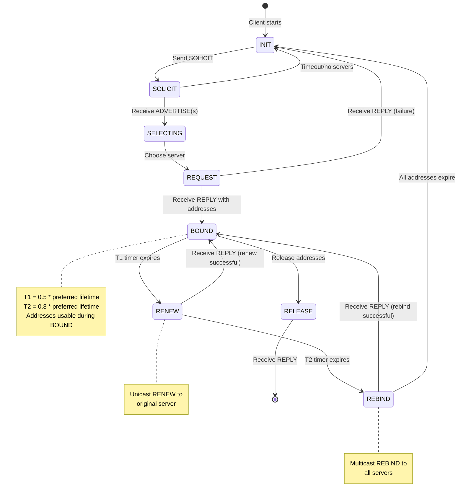

**Implementation Reference**: The state machine is implicitly managed in `src/rfc3315.c` through the `dhcp6_no_relay()` function (lines 200-600) which handles each message type and transitions between states.

### Stateless DHCPv6 State Diagram

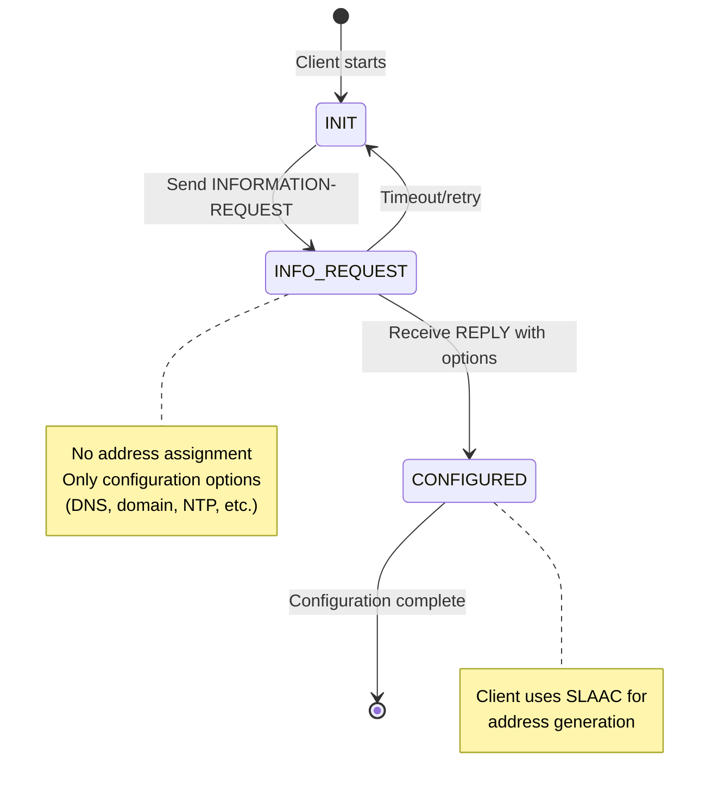

**Implementation Reference**: Stateless DHCPv6 handling in `src/rfc3315.c` processes INFORMATION-REQUEST messages without address allocation (lines 800-900).

### Rapid Commit Optimization

DHCPv6 supports an optional Rapid Commit mode that reduces the 4-message exchange to just 2 messages:

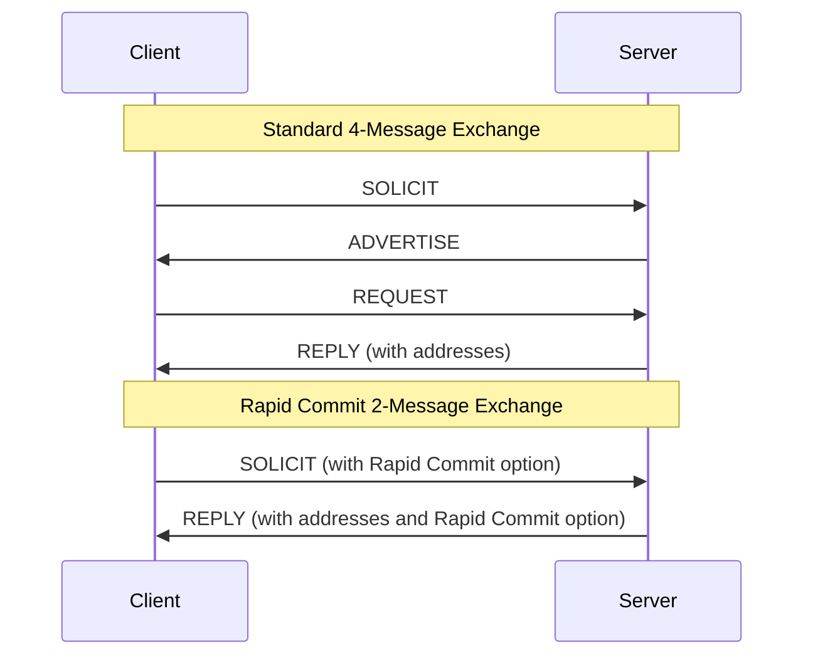

**Implementation Reference**: Rapid Commit support in `src/rfc3315.c` detects the Rapid Commit option in SOLICIT messages and responds directly with REPLY (lines 400-450).

### State Transition Timing

| State Transition | Timer | Default Value | Configuration |
|------------------|-------|---------------|---------------|
| BOUND → RENEW | T1 | 50% of preferred lifetime | Calculated in calculate_times() |
| RENEW → REBIND | T2 | 80% of preferred lifetime | Calculated in calculate_times() |
| Initial SOLICIT retry | SOL_TIMEOUT | 1 second | Client-side |
| SOLICIT max retries | SOL_MAX_RT | 120 seconds | Client-side |
| Lease duration | Default | 24 hours (86400 seconds) | DEFLEASE6 in src/config.h:46 |

**Implementation Reference**: Timing calculations performed in `src/rfc3315.c:calculate_times()` (lines 1800-1900).

## DHCPv6 vs DHCPv4 Architectural Differences

DHCPv6 represents a fundamental redesign of DHCP for IPv6, not merely a port of DHCPv4. The architectural differences reflect lessons learned from DHCPv4 and accommodate IPv6's unique characteristics.

### Fundamental Protocol Differences

| Aspect | DHCPv4 (RFC 2131) | DHCPv6 (RFC 3315) | Rationale |
|--------|-------------------|-------------------|-----------|
| **Client Identification** | MAC address (chaddr field) | DUID (DHCP Unique Identifier) | DUID persists across interface changes |
| **Address Assignment Model** | Single address per transaction | Identity Association (IA) containing multiple addresses | Supports multiple addresses per interface |
| **Transaction Identifier** | Transaction ID (4 bytes) | Transaction ID (3 bytes) | Sufficient randomness in shorter space |
| **Option Encoding** | Fixed-format options with magic cookie | Type-Length-Value (TLV) throughout | Consistent, extensible format |
| **Broadcast vs Multicast** | Broadcast (255.255.255.255) | Multicast (ff02::1:2) | IPv6 has no broadcast |
| **Server Discovery** | Broadcast DHCPDISCOVER | Multicast SOLICIT to All_DHCP_Relay_Agents_and_Servers | More efficient |
| **Relay Agent** | GIADDR field (4 bytes) | RELAY-FORW/RELAY-REPL messages | Supports multiple relay hops with encapsulation |
| **Lease Renewal** | Unicast to server or broadcast | Unicast RENEW or multicast REBIND | Explicit distinction |
| **Stateless Operation** | Not supported | INFORMATION-REQUEST | Works with SLAAC |
| **Address Lifetime** | Single lease time | Preferred and valid lifetimes | Privacy and deprecation support |

**Implementation Reference**: The architectural differences are evident when comparing `src/rfc2131.c` (DHCPv4) with `src/rfc3315.c` (DHCPv6).

### Message Format Differences

#### DHCPv4 Packet Structure
```
0                   1                   2                   3
0 1 2 3 4 5 6 7 8 9 0 1 2 3 4 5 6 7 8 9 0 1 2 3 4 5 6 7 8 9 0 1
+-+-+-+-+-+-+-+-+-+-+-+-+-+-+-+-+-+-+-+-+-+-+-+-+-+-+-+-+-+-+-+-+
|     op (1)    |   htype (1)   |   hlen (1)    |   hops (1)    |
+---------------+---------------+---------------+---------------+
|                            xid (4)                            |
+-------------------------------+-------------------------------+
|           secs (2)            |           flags (2)           |
+-------------------------------+-------------------------------+
|                          ciaddr  (4)                          |
+---------------------------------------------------------------+
|                          yiaddr  (4)                          |
+---------------------------------------------------------------+
|                          siaddr  (4)                          |
+---------------------------------------------------------------+
|                          giaddr  (4)                          |
+---------------------------------------------------------------+
|                          chaddr  (16)                         |
+---------------------------------------------------------------+
|                          sname   (64)                         |
+---------------------------------------------------------------+
|                          file    (128)                        |
+---------------------------------------------------------------+
|                          options (variable)                   |
+---------------------------------------------------------------+
```

#### DHCPv6 Message Structure
```
0                   1                   2                   3
0 1 2 3 4 5 6 7 8 9 0 1 2 3 4 5 6 7 8 9 0 1 2 3 4 5 6 7 8 9 0 1
+-+-+-+-+-+-+-+-+-+-+-+-+-+-+-+-+-+-+-+-+-+-+-+-+-+-+-+-+-+-+-+-+
|    msg-type   |               transaction-id                  |
+-+-+-+-+-+-+-+-+-+-+-+-+-+-+-+-+-+-+-+-+-+-+-+-+-+-+-+-+-+-+-+-+
|                                                               |
.                            options                            .
.                           (variable)                          .
|                                                               |
+-+-+-+-+-+-+-+-+-+-+-+-+-+-+-+-+-+-+-+-+-+-+-+-+-+-+-+-+-+-+-+-+
```

**Key Observation**: DHCPv6 has a dramatically simpler base message format (4 bytes) with all data carried in TLV options, compared to DHCPv4's 236-byte fixed header.

**Implementation Reference**: Message parsing in `src/rfc3315.c:dhcp6_maybe_relay()` (lines 107-250) demonstrates the streamlined message handling.

### Address Configuration Models

#### DHCPv4 Address Assignment
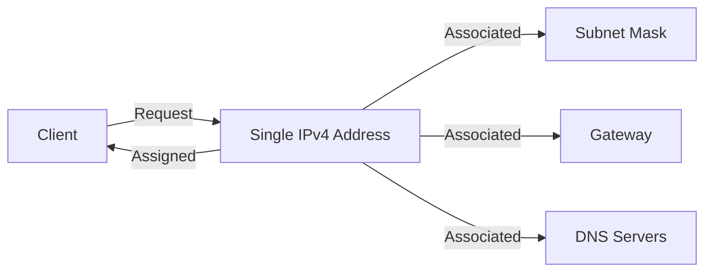

#### DHCPv6 Address Assignment with Identity Association
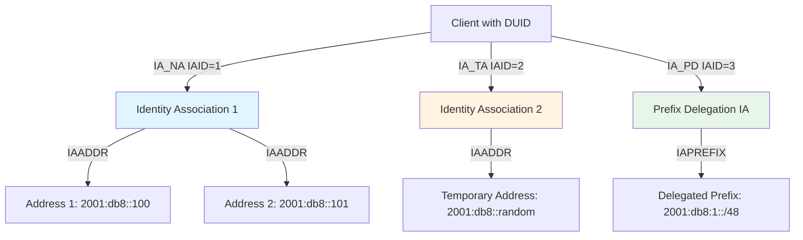

**Key Difference**: DHCPv6's Identity Association model allows a single client to manage multiple addresses and even entire prefixes simultaneously, each with independent lifetimes.

**Implementation Reference**: IA handling in `src/rfc3315.c:check_ia()` (lines 1200-1400) and `build_ia()` (lines 1500-1700).

### Stateful vs Stateless Operation

One of DHCPv6's most significant advantages over DHCPv4 is native support for stateless configuration:

| Configuration Aspect | DHCPv4 | DHCPv6 Stateful | DHCPv6 Stateless + SLAAC |
|---------------------|--------|-----------------|--------------------------|
| Address assignment | DHCP server | DHCP server | Router Advertisement (SLAAC) |
| DNS server configuration | DHCP server | DHCP server or DHCP server | DHCP server (INFORMATION-REQUEST) |
| Domain search list | DHCP server | DHCP server | DHCP server (INFORMATION-REQUEST) |
| Default gateway | DHCP server (option 3) | Router Advertisement | Router Advertisement |
| Server state | Must track leases | Must track leases | No lease tracking required |
| Scalability | Moderate | Moderate | Excellent |

**Implementation Reference**: 
- Stateful handling: `src/rfc3315.c:add_address()` (lines 1700-1850)
- Stateless handling: INFORMATION-REQUEST processing in `src/rfc3315.c` (lines 800-900)
- SLAAC support: `src/slaac.c:slaac_add_addrs()` (lines 25-120)

### Option Encoding Differences

#### DHCPv4 Option Format
```
+-+-+-+-+-+-+-+-+-+-+-+-+-+-+-+-+-+-+-+-+-+-+-
|  Option Code  |    Length     |     Data ...
+-+-+-+-+-+-+-+-+-+-+-+-+-+-+-+-+-+-+-+-+-+-+-
    (1 byte)        (1 byte)      (variable)
```

#### DHCPv6 Option Format (TLV)
```
0                   1                   2                   3
0 1 2 3 4 5 6 7 8 9 0 1 2 3 4 5 6 7 8 9 0 1 2 3 4 5 6 7 8 9 0 1
+-+-+-+-+-+-+-+-+-+-+-+-+-+-+-+-+-+-+-+-+-+-+-+-+-+-+-+-+-+-+-+-+
|          option-code          |           option-len          |
+-+-+-+-+-+-+-+-+-+-+-+-+-+-+-+-+-+-+-+-+-+-+-+-+-+-+-+-+-+-+-+-+
|                          option-data                          |
|                      (option-len octets)                      |
+-+-+-+-+-+-+-+-+-+-+-+-+-+-+-+-+-+-+-+-+-+-+-+-+-+-+-+-+-+-+-+-+
```

**Key Advantages**:
- **16-bit option codes**: 65535 option types vs DHCPv4's 255
- **16-bit length field**: Options up to 65535 bytes vs DHCPv4's 255 bytes
- **Nested options**: DHCPv6 options can contain other options (e.g., IA_NA contains IAADDR)
- **No magic cookie**: Consistent TLV format throughout

**Implementation Reference**: Option assembly in `src/outpacket.c:new_opt6()` (lines 65-77) and `put_opt6()` (lines 79-87).

### Relay Agent Architecture

DHCPv6's relay agent design is more sophisticated than DHCPv4's:

**DHCPv4 Relay**: Simple GIADDR field (4 bytes) indicating relay agent's address. Single hop limitation.

**DHCPv6 Relay**: Encapsulation-based with RELAY-FORW and RELAY-REPL messages, supporting multiple relay hops:

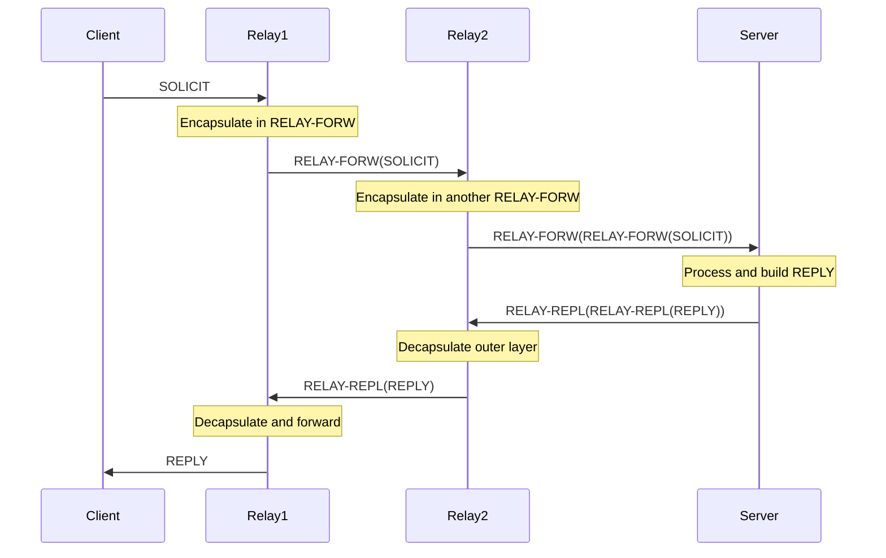

**Implementation Reference**: Multi-hop relay handling in `src/rfc3315.c:dhcp6_maybe_relay()` (lines 107-250) recursively processes nested RELAY-FORW messages.

## DUID Handling

The DHCP Unique Identifier (DUID) is a fundamental component of DHCPv6 that replaces DHCPv4's MAC address-based client identification. DUIDs provide persistent client identification across network interface changes and reboots.

### DUID Types

RFC 3315 Section 9 defines three DUID types, all supported by dnsmasq:

#### DUID-LLT (Link-Layer Address Plus Time)

**Structure** (RFC 3315 Section 9.2):
```
0                   1                   2                   3
0 1 2 3 4 5 6 7 8 9 0 1 2 3 4 5 6 7 8 9 0 1 2 3 4 5 6 7 8 9 0 1
+-+-+-+-+-+-+-+-+-+-+-+-+-+-+-+-+-+-+-+-+-+-+-+-+-+-+-+-+-+-+-+-+
|               1 (DUID-LLT)    |    hardware type (16 bits)    |
+-+-+-+-+-+-+-+-+-+-+-+-+-+-+-+-+-+-+-+-+-+-+-+-+-+-+-+-+-+-+-+-+
|                        time (32 bits)                         |
+-+-+-+-+-+-+-+-+-+-+-+-+-+-+-+-+-+-+-+-+-+-+-+-+-+-+-+-+-+-+-+-+
|                                                               |
.                  link-layer address (variable)                .
.                                                               .
+-+-+-+-+-+-+-+-+-+-+-+-+-+-+-+-+-+-+-+-+-+-+-+-+-+-+-+-+-+-+-+-+
```

- **Type**: 1
- **Hardware Type**: IANA hardware type (e.g., 1 for Ethernet)
- **Time**: Seconds since January 1, 2000 UTC (not Unix epoch!)
- **Link-Layer Address**: MAC address or equivalent

**Use Case**: Most common DUID type, provides uniqueness through time+MAC combination.

**Implementation Reference**: DUID-LLT generation in `src/dhcp6.c:make_duid1()` (lines 700-750).

#### DUID-EN (Enterprise Number)

**Structure** (RFC 3315 Section 9.3):
```
0                   1                   2                   3
0 1 2 3 4 5 6 7 8 9 0 1 2 3 4 5 6 7 8 9 0 1 2 3 4 5 6 7 8 9 0 1
+-+-+-+-+-+-+-+-+-+-+-+-+-+-+-+-+-+-+-+-+-+-+-+-+-+-+-+-+-+-+-+-+
|               2 (DUID-EN)     |       enterprise-number       |
+-+-+-+-+-+-+-+-+-+-+-+-+-+-+-+-+-+-+-+-+-+-+-+-+-+-+-+-+-+-+-+-+
|   enterprise-number (cont)    |                               |
+-+-+-+-+-+-+-+-+-+-+-+-+-+-+-+-+                               |
|                   identifier (variable)                       |
.                                                               .
+-+-+-+-+-+-+-+-+-+-+-+-+-+-+-+-+-+-+-+-+-+-+-+-+-+-+-+-+-+-+-+-+
```

- **Type**: 2
- **Enterprise Number**: IANA-assigned private enterprise number
- **Identifier**: Vendor-assigned unique identifier

**Use Case**: Used by vendors to assign DUIDs based on their enterprise number and internal identification scheme.

**Implementation Reference**: dnsmasq recognizes and processes DUID-EN from clients but doesn't generate them.

#### DUID-LL (Link-Layer Address)

**Structure** (RFC 3315 Section 9.4):
```
0                   1                   2                   3
0 1 2 3 4 5 6 7 8 9 0 1 2 3 4 5 6 7 8 9 0 1 2 3 4 5 6 7 8 9 0 1
+-+-+-+-+-+-+-+-+-+-+-+-+-+-+-+-+-+-+-+-+-+-+-+-+-+-+-+-+-+-+-+-+
|               3 (DUID-LL)     |    hardware type (16 bits)    |
+-+-+-+-+-+-+-+-+-+-+-+-+-+-+-+-+-+-+-+-+-+-+-+-+-+-+-+-+-+-+-+-+
|                                                               |
.                  link-layer address (variable)                .
.                                                               .
+-+-+-+-+-+-+-+-+-+-+-+-+-+-+-+-+-+-+-+-+-+-+-+-+-+-+-+-+-+-+-+-+
```

- **Type**: 3
- **Hardware Type**: IANA hardware type
- **Link-Layer Address**: MAC address or equivalent

**Use Case**: Simpler than DUID-LLT for devices with stable MAC addresses, no time dependency.

**Implementation Reference**: dnsmasq supports DUID-LL processing for client identification.

### DUID Generation and Storage

dnsmasq generates and stores DUIDs for persistent server identification:

**Server DUID Generation Algorithm**:
1. Check for existing DUID in lease database or configuration
2. If none exists, generate DUID-LLT:
   - Type = 1 (DUID-LLT)
   - Hardware type = 1 (Ethernet) or interface type
   - Time = current time - January 1, 2000 UTC
   - Link-layer address = primary interface MAC address
3. Store DUID persistently in lease file for consistency across restarts

**Implementation Reference**: DUID generation in `src/dhcp6.c:make_duid1()` callback function (lines 700-750), invoked during server initialization.

### Client DUID Extraction

When processing client messages, dnsmasq extracts the DUID from OPTION_CLIENTID (option code 1):

```c
// From src/rfc3315.c
state.clid = NULL;
state.clid_len = 0;

if ((opt = opt6_find(opts, end, OPTION6_CLIENT_ID, 1)))
{
    state.clid = opt6_ptr(opt, 0);
    state.clid_len = opt6_len(opt);
}
```

**Implementation Reference**: Client DUID extraction in `src/rfc3315.c` option parsing (lines 300-400).

### DUID-Based Lease Management

Unlike DHCPv4's MAC-based leases, DHCPv6 leases are indexed by DUID + IAID combination:

- **Lease Key**: DUID + IAID (Identity Association Identifier)
- **Persistence**: Leases survive interface MAC address changes
- **Lookup**: `lease_find_by_client()` uses DUID for matching

**Advantages**:
- Client retains addresses when changing physical adapters
- Virtual machines maintain addresses across migrations
- Dual-stack clients have consistent identification

**Implementation Reference**: DUID-based lease lookup in `src/lease.c` (DHCPv6 lease handling integrated with DHCPv4 lease database).

## Identity Association (IA) Address Assignment

The Identity Association (IA) model is DHCPv6's mechanism for managing address and prefix assignment. Unlike DHCPv4's simple one-address-per-request model, IAs allow sophisticated address lifecycle management.

### IA Types

| IA Type | Option Code | Purpose | RFC | Implementation |
|---------|-------------|---------|-----|----------------|
| IA_NA | 3 | Non-temporary Address Assignment | RFC 3315 §22.4 | src/rfc3315.c:check_ia() |
| IA_TA | 4 | Temporary Address Assignment | RFC 3315 §22.5 | src/rfc3315.c:check_ia() |
| IA_PD | 25 | Prefix Delegation | RFC 3633 | src/rfc3315.c:check_ia() |

### IA_NA (Identity Association for Non-Temporary Addresses)

IA_NA is the primary address assignment mechanism in DHCPv6, analogous to DHCPv4 address assignment but with enhanced features.

**IA_NA Option Format** (RFC 3315 Section 22.4):
```
0                   1                   2                   3
0 1 2 3 4 5 6 7 8 9 0 1 2 3 4 5 6 7 8 9 0 1 2 3 4 5 6 7 8 9 0 1
+-+-+-+-+-+-+-+-+-+-+-+-+-+-+-+-+-+-+-+-+-+-+-+-+-+-+-+-+-+-+-+-+
|          OPTION_IA_NA         |          option-len           |
+-+-+-+-+-+-+-+-+-+-+-+-+-+-+-+-+-+-+-+-+-+-+-+-+-+-+-+-+-+-+-+-+
|                        IAID (4 octets)                        |
+-+-+-+-+-+-+-+-+-+-+-+-+-+-+-+-+-+-+-+-+-+-+-+-+-+-+-+-+-+-+-+-+
|                        T1 (4 octets)                          |
+-+-+-+-+-+-+-+-+-+-+-+-+-+-+-+-+-+-+-+-+-+-+-+-+-+-+-+-+-+-+-+-+
|                        T2 (4 octets)                          |
+-+-+-+-+-+-+-+-+-+-+-+-+-+-+-+-+-+-+-+-+-+-+-+-+-+-+-+-+-+-+-+-+
|                                                               |
.                      IA_NA-options                            .
.                                                               .
+-+-+-+-+-+-+-+-+-+-+-+-+-+-+-+-+-+-+-+-+-+-+-+-+-+-+-+-+-+-+-+-+
```

**Fields**:
- **IAID** (Identity Association Identifier): Client-chosen unique ID for this IA (4 bytes)
- **T1**: Time until client should contact server to extend lifetimes (in seconds)
- **T2**: Time until client should contact any available server (in seconds)
- **IA_NA-options**: Encapsulated IAADDR options containing actual addresses

**T1/T2 Calculation**:
- **T1** = 0.5 × minimum preferred lifetime of addresses in IA
- **T2** = 0.8 × minimum preferred lifetime of addresses in IA

**Implementation Reference**: IA_NA processing in `src/rfc3315.c:check_ia()` validates the IA structure (lines 1200-1400), and `build_ia()` constructs IA_NA responses with calculated T1/T2 values (lines 1500-1700).

### IAADDR Option Structure

IAADDR options are nested within IA_NA or IA_TA to specify individual addresses:

```
0                   1                   2                   3
0 1 2 3 4 5 6 7 8 9 0 1 2 3 4 5 6 7 8 9 0 1 2 3 4 5 6 7 8 9 0 1
+-+-+-+-+-+-+-+-+-+-+-+-+-+-+-+-+-+-+-+-+-+-+-+-+-+-+-+-+-+-+-+-+
|         OPTION_IAADDR         |          option-len           |
+-+-+-+-+-+-+-+-+-+-+-+-+-+-+-+-+-+-+-+-+-+-+-+-+-+-+-+-+-+-+-+-+
|                                                               |
|                         IPv6 address                          |
|                                                               |
|                                                               |
+-+-+-+-+-+-+-+-+-+-+-+-+-+-+-+-+-+-+-+-+-+-+-+-+-+-+-+-+-+-+-+-+
|                      preferred-lifetime                       |
+-+-+-+-+-+-+-+-+-+-+-+-+-+-+-+-+-+-+-+-+-+-+-+-+-+-+-+-+-+-+-+-+
|                        valid-lifetime                         |
+-+-+-+-+-+-+-+-+-+-+-+-+-+-+-+-+-+-+-+-+-+-+-+-+-+-+-+-+-+-+-+-+
|                                                               |
.                      IAADDR-options                           .
.                                                               .
+-+-+-+-+-+-+-+-+-+-+-+-+-+-+-+-+-+-+-+-+-+-+-+-+-+-+-+-+-+-+-+-+
```

**Address Lifetime Semantics**:
- **Preferred Lifetime**: Duration in seconds for which address is preferred for new connections
- **Valid Lifetime**: Duration in seconds for which address remains valid (must be ≥ preferred lifetime)
- **Relationship**: `valid-lifetime ≥ preferred-lifetime`

**Lifetime States**:
1. **0 ≤ time < preferred-lifetime**: Address is PREFERRED (use for new connections)
2. **preferred-lifetime ≤ time < valid-lifetime**: Address is DEPRECATED (don't use for new connections, but existing connections continue)
3. **time ≥ valid-lifetime**: Address is INVALID (must not be used)

**Default Values** (from `src/config.h:46`):
- **Valid Lifetime**: 86400 seconds (24 hours) = DEFLEASE6
- **Preferred Lifetime**: Typically same as valid lifetime unless privacy extensions used

**Implementation Reference**: Address addition with lifetime management in `src/rfc3315.c:add_address()` (lines 1700-1850).

### IA_TA (Identity Association for Temporary Addresses)

IA_TA supports privacy extensions (RFC 4941) by providing temporary addresses with shorter lifetimes.

**IA_TA Option Format** (RFC 3315 Section 22.5):
```
0                   1                   2                   3
0 1 2 3 4 5 6 7 8 9 0 1 2 3 4 5 6 7 8 9 0 1 2 3 4 5 6 7 8 9 0 1
+-+-+-+-+-+-+-+-+-+-+-+-+-+-+-+-+-+-+-+-+-+-+-+-+-+-+-+-+-+-+-+-+
|         OPTION_IA_TA          |          option-len           |
+-+-+-+-+-+-+-+-+-+-+-+-+-+-+-+-+-+-+-+-+-+-+-+-+-+-+-+-+-+-+-+-+
|                        IAID (4 octets)                        |
+-+-+-+-+-+-+-+-+-+-+-+-+-+-+-+-+-+-+-+-+-+-+-+-+-+-+-+-+-+-+-+-+
|                                                               |
.                       IA_TA-options                           .
.                                                               .
+-+-+-+-+-+-+-+-+-+-+-+-+-+-+-+-+-+-+-+-+-+-+-+-+-+-+-+-+-+-+-+-+
```

**Key Differences from IA_NA**:
- **No T1/T2 fields**: Temporary addresses don't use RENEW/REBIND
- **Shorter lifetimes**: Typically hours instead of days
- **Privacy focus**: Address frequently rotated to prevent tracking
- **No lease persistence**: Temporary addresses not saved long-term

**Use Case Example**:
- **IA_NA**: `2001:db8::100` (stable, 24-hour lifetime, used for server connections)
- **IA_TA**: `2001:db8::a3b7:f12c` (temporary, 4-hour lifetime, used for outbound connections)

**Implementation Reference**: IA_TA handling in `src/rfc3315.c:check_ia()` with ia_type detection (lines 1200-1400).

### Multiple IAs Per Client

A DHCPv6 client can maintain multiple IAs simultaneously:

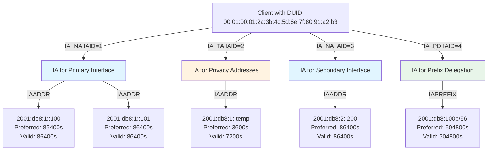

**Implementation Reference**: Multiple IA processing in `src/rfc3315.c:dhcp6_no_relay()` iterates through all IA options in a single message (lines 500-700).

### Address Allocation Algorithm

dnsmasq's DHCPv6 address allocation follows this algorithm:

1. **Client sends REQUEST with IA_NA containing requested address**
2. **Server checks if address is available**:
   - Is address in configured DHCPv6 range?
   - Is address already leased to another client?
   - Does client have a static reservation?
3. **Server selects address**:
   - If client requests specific address and it's available → grant it
   - If client has static reservation → assign reserved address
   - Otherwise → select from available pool
4. **Server calculates lifetimes**:
   - `valid_lifetime` = configured lease time (default DEFLEASE6 = 86400 seconds)
   - `preferred_lifetime` = valid_lifetime (unless privacy extensions)
   - `T1` = 0.5 × preferred_lifetime
   - `T2` = 0.8 × preferred_lifetime
5. **Server constructs REPLY** with IA_NA containing IAADDR with lifetimes
6. **Server creates or updates lease** indexed by (DUID, IAID)

**Implementation Reference**: 
- Address allocation: `src/rfc3315.c:add_address()` (lines 1700-1850)
- Lease update: `src/rfc3315.c:update_leases()` (lines 1850-1950)
- Lifetime calculation: `src/rfc3315.c:calculate_times()` (lines 1800-1900)

## DHCPv6 Option Format

DHCPv6 uses a consistent Type-Length-Value (TLV) encoding for all options, representing a significant improvement over DHCPv4's variable option formats.

### Universal TLV Structure

Every DHCPv6 option follows this format:

```
0                   1                   2                   3
0 1 2 3 4 5 6 7 8 9 0 1 2 3 4 5 6 7 8 9 0 1 2 3 4 5 6 7 8 9 0 1
+-+-+-+-+-+-+-+-+-+-+-+-+-+-+-+-+-+-+-+-+-+-+-+-+-+-+-+-+-+-+-+-+
|          option-code          |           option-len          |
+-+-+-+-+-+-+-+-+-+-+-+-+-+-+-+-+-+-+-+-+-+-+-+-+-+-+-+-+-+-+-+-+
|                                                               |
.                          option-data                          .
.                      (option-len octets)                      .
|                                                               |
+-+-+-+-+-+-+-+-+-+-+-+-+-+-+-+-+-+-+-+-+-+-+-+-+-+-+-+-+-+-+-+-+
```

**Fields**:
- **option-code**: 16-bit option type identifier (0-65535)
- **option-len**: 16-bit length of option-data in octets (not including the 4-byte header)
- **option-data**: Variable-length option payload

**Key Advantages**:
1. **Large option space**: 65536 option types vs DHCPv4's 256
2. **Long options**: 65535-byte options vs DHCPv4's 255-byte limit
3. **Uniform parsing**: Same parsing code for all options
4. **Option nesting**: Options can contain other options (container pattern)

### Option Assembly Implementation

dnsmasq provides utilities in `src/outpacket.c` for DHCPv6 option construction:

**Starting a new option** (`new_opt6()`):
```c
int new_opt6(int opt)
{
    int ret = outpacket_counter;
    void *p;

    if ((p = expand(4)))
    {
        PUTSHORT(opt, p);        // Write option-code
        PUTSHORT(0, p);          // Write placeholder option-len (updated later)
    }

    return ret;  // Return offset for end_opt6()
}
```

**Implementation Reference**: `src/outpacket.c:new_opt6()` (lines 65-77).

**Adding option data** (`put_opt6()`):
```c
void *put_opt6(void *data, size_t len)
{
    void *p;

    if ((p = expand(len)) && data)
        memcpy(p, data, len);   // Append data to option

    return p;
}
```

**Implementation Reference**: `src/outpacket.c:put_opt6()` (lines 79-87).

**Finalizing an option** (`end_opt6()`):
```c
void end_opt6(int container)
{
    void *p = daemon->outpacket.iov_base + container + 2;  // Point to option-len field
    u16 len = outpacket_counter - container - 4;           // Calculate data length
    
    PUTSHORT(len, p);  // Update option-len field
}
```

**Implementation Reference**: `src/outpacket.c:end_opt6()` (lines 24-30).

### Option Nesting Example

DHCPv6's container options (like IA_NA) contain nested options (like IAADDR):

```
OPTION_IA_NA (code=3)
  ├─ Header: option-code=3, option-len=40
  ├─ IAID: 0x12345678
  ├─ T1: 43200 (12 hours)
  ├─ T2: 69120 (19.2 hours)
  └─ Nested Option: IAADDR (code=5)
       ├─ Header: option-code=5, option-len=24
       ├─ IPv6 Address: 2001:db8::100
       ├─ Preferred Lifetime: 86400
       └─ Valid Lifetime: 86400
```

**Construction Code Pattern**:
```c
// Start IA_NA option
int ia_na_start = new_opt6(OPTION6_IA_NA);

// Add IA_NA fields
put_opt6_long(iaid);            // IAID
put_opt6_long(t1);              // T1
put_opt6_long(t2);              // T2

// Nested IAADDR option
int iaaddr_start = new_opt6(OPTION6_IAADDR);
put_opt6(&addr, sizeof(addr));  // IPv6 address (16 bytes)
put_opt6_long(preferred);       // Preferred lifetime
put_opt6_long(valid);           // Valid lifetime
end_opt6(iaaddr_start);         // Close IAADDR

end_opt6(ia_na_start);          // Close IA_NA
```

**Implementation Reference**: IA construction in `src/rfc3315.c:build_ia()` (lines 1500-1700).

### Common DHCPv6 Options

| Option Code | Option Name | Data Format | Purpose | Implementation |
|-------------|-------------|-------------|---------|----------------|
| 1 | OPTION_CLIENTID | DUID | Client identifier | Always present |
| 2 | OPTION_SERVERID | DUID | Server identifier | Always present in responses |
| 3 | OPTION_IA_NA | Container | Non-temporary address IA | src/rfc3315.c:build_ia() |
| 4 | OPTION_IA_TA | Container | Temporary address IA | src/rfc3315.c:build_ia() |
| 5 | OPTION_IAADDR | IPv6+lifetimes | Address within IA | src/rfc3315.c:add_address() |
| 6 | OPTION_ORO | List of option codes | Option request list | Processed in src/rfc3315.c |
| 7 | OPTION_PREFERENCE | 1 byte (0-255) | Server selection preference | Used in ADVERTISE |
| 8 | OPTION_ELAPSED_TIME | 2 bytes (centiseconds) | Time since client started | Processed by server |
| 13 | OPTION_STATUS_CODE | Status+message | Status of operation | Error reporting |
| 14 | OPTION_RAPID_COMMIT | Empty | Request/grant rapid commit | 2-message exchange |
| 23 | OPTION_DNS_SERVERS | List of IPv6 addresses | DNS recursive servers | src/rfc3315.c:add_options() |
| 24 | OPTION_DOMAIN_LIST | List of domain names | DNS search domains | src/rfc3315.c:add_options() |
| 25 | OPTION_IA_PD | Container | Prefix delegation IA | src/rfc3315.c:check_ia() |
| 26 | OPTION_IAPREFIX | Prefix+lifetimes | Delegated prefix | RFC 3633 support |

### Option Parsing

dnsmasq provides helper macros and functions for option parsing in `src/rfc3315.c`:

**Finding an option**:
```c
static void *opt6_find(void *opts, void *end, unsigned int search, unsigned int minsize)
{
    // Iterate through options looking for specific option-code
    // Returns pointer to option data or NULL if not found
}
```

**Extracting integer values**:
```c
#define opt6_type(opt) (opt6_uint(opt, -4, 2))  // Read option-code
#define opt6_len(opt) ((int)(opt6_uint(opt, -2, 2)))  // Read option-len

static unsigned int opt6_uint(unsigned char *opt, int offset, int size)
{
    // Extract 1, 2, or 4-byte integer from option
    // Negative offset relative to option-data start
}
```

**Implementation Reference**: Option parsing utilities in `src/rfc3315.c` (lines 40-65).

## Router Advertisement Integration

dnsmasq integrates DHCPv6 with IPv6 Router Advertisements (RA) per RFC 4861, providing comprehensive IPv6 network configuration. This integration is essential for both stateful and stateless address configuration.

### Router Advertisement Role

Router Advertisements serve multiple purposes in IPv6 networks:

1. **Default Router Discovery**: Clients learn default gateway from RA
2. **Prefix Information**: Clients learn on-link prefixes for SLAAC
3. **Configuration Flags**: M and O flags indicate DHCPv6 availability
4. **Link Parameters**: MTU, hop limit, reachability information

**Key Insight**: Unlike DHCPv4 (which provides default gateway via option 3), IPv6 separates router discovery (RA) from address configuration (DHCPv6 or SLAAC).

### RA Packet Structure

```
0                   1                   2                   3
0 1 2 3 4 5 6 7 8 9 0 1 2 3 4 5 6 7 8 9 0 1 2 3 4 5 6 7 8 9 0 1
+-+-+-+-+-+-+-+-+-+-+-+-+-+-+-+-+-+-+-+-+-+-+-+-+-+-+-+-+-+-+-+-+
|     Type      |     Code      |          Checksum             |
+-+-+-+-+-+-+-+-+-+-+-+-+-+-+-+-+-+-+-+-+-+-+-+-+-+-+-+-+-+-+-+-+
| Cur Hop Limit |M|O|H|Prf|Resvd|       Router Lifetime         |
+-+-+-+-+-+-+-+-+-+-+-+-+-+-+-+-+-+-+-+-+-+-+-+-+-+-+-+-+-+-+-+-+
|                         Reachable Time                        |
+-+-+-+-+-+-+-+-+-+-+-+-+-+-+-+-+-+-+-+-+-+-+-+-+-+-+-+-+-+-+-+-+
|                          Retrans Timer                        |
+-+-+-+-+-+-+-+-+-+-+-+-+-+-+-+-+-+-+-+-+-+-+-+-+-+-+-+-+-+-+-+-+
|   Options ...
+-+-+-+-+-+-+-+-+-+-+-+-+-
```

**Critical Flags**:
- **M flag (Managed Address Configuration)**: When set, use DHCPv6 for address assignment
- **O flag (Other Configuration)**: When set, use DHCPv6 for non-address configuration (DNS, etc.)

**Flag Combinations**:
- **M=0, O=0**: SLAAC only (no DHCPv6)
- **M=0, O=1**: SLAAC + DHCPv6 for options (stateless DHCPv6)
- **M=1, O=0**: DHCPv6 for addresses (O flag implied)
- **M=1, O=1**: DHCPv6 for addresses and options (typical stateful DHCPv6)

**Implementation Reference**: RA packet construction in `src/radv.c:send_ra()` (lines 300-600).

### RA Prefix Information Option

The Prefix Information Option (RFC 4861 Section 4.6.2) is crucial for SLAAC:

```
0                   1                   2                   3
0 1 2 3 4 5 6 7 8 9 0 1 2 3 4 5 6 7 8 9 0 1 2 3 4 5 6 7 8 9 0 1
+-+-+-+-+-+-+-+-+-+-+-+-+-+-+-+-+-+-+-+-+-+-+-+-+-+-+-+-+-+-+-+-+
|     Type=3    |    Length=4   | Prefix Length |L|A|R|Reserved1|
+-+-+-+-+-+-+-+-+-+-+-+-+-+-+-+-+-+-+-+-+-+-+-+-+-+-+-+-+-+-+-+-+
|                         Valid Lifetime                        |
+-+-+-+-+-+-+-+-+-+-+-+-+-+-+-+-+-+-+-+-+-+-+-+-+-+-+-+-+-+-+-+-+
|                       Preferred Lifetime                      |
+-+-+-+-+-+-+-+-+-+-+-+-+-+-+-+-+-+-+-+-+-+-+-+-+-+-+-+-+-+-+-+-+
|                           Reserved2                           |
+-+-+-+-+-+-+-+-+-+-+-+-+-+-+-+-+-+-+-+-+-+-+-+-+-+-+-+-+-+-+-+-+
|                                                               |
+                                                               +
|                                                               |
+                            Prefix                             +
|                                                               |
+                                                               +
|                                                               |
+-+-+-+-+-+-+-+-+-+-+-+-+-+-+-+-+-+-+-+-+-+-+-+-+-+-+-+-+-+-+-+-+
```

**Flags**:
- **L flag (On-Link)**: Prefix is on-link (directly reachable)
- **A flag (Autonomous)**: Prefix can be used for SLAAC
- **R flag (Router Address)**: Prefix contains router address (RFC 6275)

**Typical Configuration**:
- **L=1, A=1**: Prefix is on-link and can be used for SLAAC (most common)
- **L=1, A=0**: Prefix is on-link but DHCPv6 required for addresses
- **L=0, A=0**: Prefix is not on-link (routing required)

**Implementation Reference**: Prefix information option added in `src/radv.c:add_prefixes()` callback (lines 600-800).

### RA Transmission Timing

RFC 4861 specifies RA timing parameters to balance responsiveness with network overhead:

**Unsolicited RA Transmission**:
- **MinRtrAdvInterval**: Minimum time between unsolicited RAs (default: 200 seconds)
- **MaxRtrAdvInterval**: Maximum time between unsolicited RAs (default: 600 seconds)
- **AdvInterval**: Randomized between Min and Max to avoid synchronization

**Solicited RA Transmission**:
- **Response to RS (Router Solicitation)**: Immediate RA transmission
- **MAX_RA_DELAY_TIME**: Maximum delay before responding to RS (0.5 seconds)

**dnsmasq Implementation**:
- Unsolicited RAs sent at MaxRtrAdvInterval (configurable via ra-interval option)
- Immediate response to Router Solicitation messages
- RA transmission triggered by DHCPv6 address assignments

**Implementation Reference**: 
- RA timing calculation: `src/radv.c:calc_interval()` (lines 900-950)
- RA scheduling: `src/radv.c:new_timeout()` (lines 850-900)
- RA transmission: `src/radv.c:send_ra()` (lines 300-600)

### DHCPv6 and RA Coordination

dnsmasq coordinates DHCPv6 and RA to provide seamless IPv6 configuration:

**Stateful DHCPv6 Mode**:
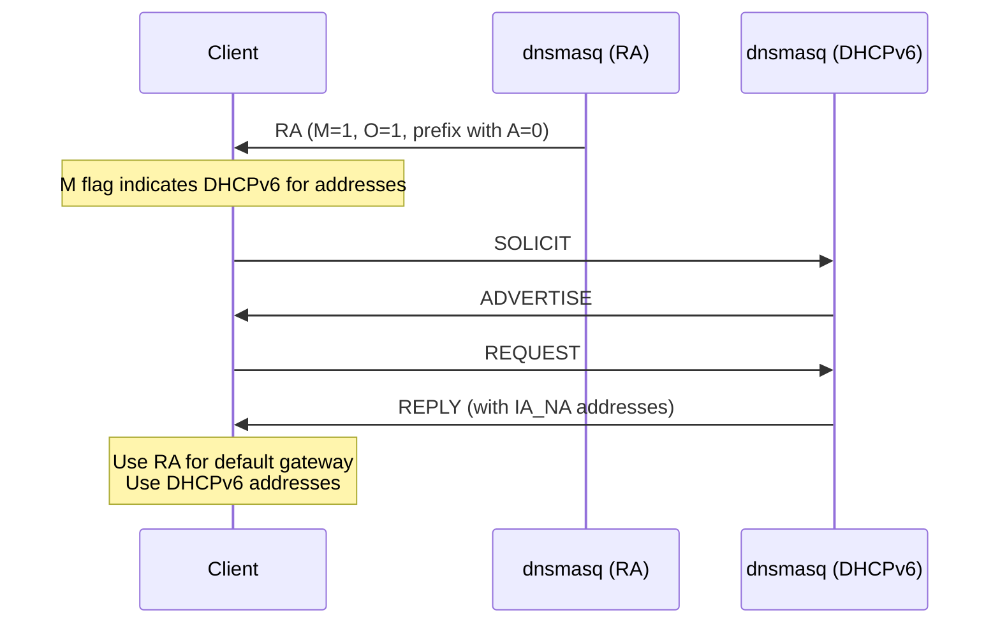

**Stateless DHCPv6 Mode**:
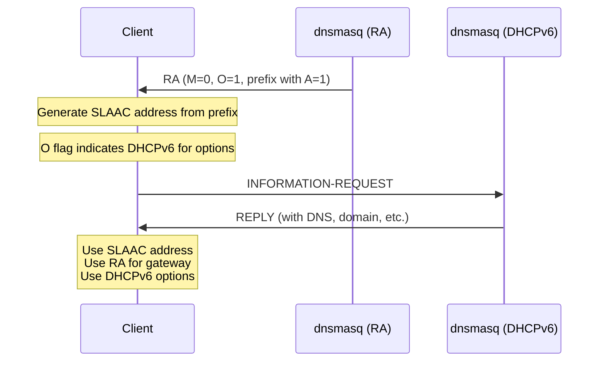

**Implementation Reference**: 
- RA flag management: `src/radv.c:send_ra()` sets M and O flags based on DHCPv6 configuration (lines 400-450)
- Coordinated startup: `src/radv.c:ra_init()` (lines 71-150)

### RA Source Address Selection

RAs must be sent from a link-local address per RFC 4861:

**Valid Source Addresses**:
- Link-local address (fe80::/10) of the router interface
- Must be in the fe80::/10 range
- Typically auto-configured from MAC address via EUI-64

**Implementation**: dnsmasq automatically discovers and uses the link-local address:

```c
// From src/radv.c
struct ra_param {
    struct in6_addr link_local;  // Router's link-local address
    struct in6_addr link_global;  // Global address (if any)
    // ...
};
```

**Implementation Reference**: Link-local address discovery in `src/radv.c:add_lla()` callback (lines 800-850).

## SLAAC Address Derivation

Stateless Address Autoconfiguration (SLAAC) per RFC 4862 enables IPv6 hosts to automatically configure addresses without DHCP. dnsmasq supports SLAAC address derivation for dynamic DNS registration.

### SLAAC Overview

SLAAC combines:
1. **Router Advertisement**: Provides network prefix (e.g., 2001:db8::/64)
2. **Interface Identifier**: Derived from MAC address or random (64 bits)
3. **Result**: Complete 128-bit IPv6 address (prefix + interface identifier)

**Advantages**:
- **Zero-touch configuration**: No server required for addresses
- **Scalable**: No server state to maintain
- **Resilient**: Works even if DHCP server fails

**Limitations**:
- **No centralized tracking**: Server doesn't know which addresses are in use
- **Address predictability**: EUI-64 exposes MAC address (privacy concern)

### EUI-64 Interface Identifier Generation

RFC 4862 defines EUI-64 (Extended Unique Identifier 64-bit) generation from 48-bit MAC addresses:

**Algorithm**:
1. Split MAC address: `AA:BB:CC:DD:EE:FF` → `AA:BB:CC` and `DD:EE:FF`
2. Insert `FF:FE` in middle: `AA:BB:CC:FF:FE:DD:EE:FF`
3. Flip Universal/Local bit (bit 7 of first byte): `AA XOR 0x02`
4. Result: Interface identifier

**Example**:
- **MAC address**: `00:1A:2B:3C:4D:5E`
- **Step 1**: Split → `00:1A:2B` and `3C:4D:5E`
- **Step 2**: Insert FF:FE → `00:1A:2B:FF:FE:3C:4D:5E`
- **Step 3**: Flip bit 7 → `02:1A:2B:FF:FE:3C:4D:5E`
- **Combined with prefix** `2001:db8::/64` → `2001:db8::21a:2bff:fe3c:4d5e`

### dnsmasq SLAAC Implementation

dnsmasq generates SLAAC addresses for DHCPv4 clients to enable IPv6 DNS registration:

**Purpose**: When a DHCPv4 client receives an IPv4 address and hostname, dnsmasq predicts the client's SLAAC IPv6 address and creates DNS AAAA records.

**Implementation Algorithm** (from `src/slaac.c:slaac_add_addrs()`):

```c
void slaac_add_addrs(struct dhcp_lease *lease, time_t now, int force)
{
    struct in6_addr addr = context->start6;  // Get network prefix
    
    if (lease->hwaddr_len == 6 &&
        (lease->hwaddr_type == ARPHRD_ETHER || lease->hwaddr_type == ARPHRD_IEEE802))
    {
        // Standard Ethernet EUI-64 conversion
        memcpy(&addr.s6_addr[8], lease->hwaddr, 3);      // First 3 bytes of MAC
        memcpy(&addr.s6_addr[13], &lease->hwaddr[3], 3); // Last 3 bytes of MAC
        addr.s6_addr[11] = 0xff;                          // FF
        addr.s6_addr[12] = 0xfe;                          // FE
        addr.s6_addr[8] ^= 0x02;                          // Flip U/L bit
    }
    
    // Create AAAA DNS record for predicted SLAAC address
}
```

**Implementation Reference**: `src/slaac.c:slaac_add_addrs()` (lines 25-120).

### Supported Hardware Types

dnsmasq supports SLAAC address generation for multiple hardware types:

| Hardware Type | ARPHRD Constant | Address Length | EUI-64 Generation | Implementation |
|---------------|-----------------|----------------|-------------------|----------------|
| Ethernet | ARPHRD_ETHER (1) | 6 bytes (48-bit) | Insert FF:FE, flip bit 7 | src/slaac.c:48-54 |
| IEEE 802 | ARPHRD_IEEE802 (6) | 6 bytes (48-bit) | Same as Ethernet | src/slaac.c:48-54 |
| EUI-64 | ARPHRD_EUI64 (27) | 8 bytes (64-bit) | Use directly, flip bit 7 | src/slaac.c:56-58 |
| IEEE 1394 | ARPHRD_IEEE1394 (24) | 8 bytes from CLID | Extract from CLID | src/slaac.c:61-66 |

**Implementation Reference**: Hardware type handling in `src/slaac.c:slaac_add_addrs()` (lines 46-68).

### Privacy Extensions

RFC 4941 defines privacy extensions to prevent tracking via stable SLAAC addresses:

**Problem**: EUI-64 exposes MAC address, enabling device tracking across networks

**Solution**: Generate random interface identifiers with short lifetimes

**dnsmasq Support**: 
- Recognizes privacy extension addresses from clients
- Does NOT generate privacy addresses (client responsibility)
- IA_TA mechanism supports temporary addresses via DHCPv6

### SLAAC Address Verification

dnsmasq can verify SLAAC address liveness using ICMPv6 Echo Request (ping):

**Verification Process**:
1. Generate predicted SLAAC address from DHCPv4 lease
2. Send ICMPv6 Echo Request to predicted address
3. If Echo Reply received → address is active → create DNS record
4. If no reply → address not active → don't create DNS record

**Configuration**: Enabled with CONTEXT_RA_NAME flag on DHCP context

**Implementation Reference**: 
- Ping initiation: `src/slaac.c:slaac_add_addrs()` (lines 90-98)
- Ping response handling: `src/radv.c` ICMP6_ECHO_REPLY processing

## Prefix Delegation

Prefix Delegation (PD) per RFC 3633 enables DHCPv6 servers to delegate IPv6 prefixes to routers, allowing hierarchical address allocation.

### IA_PD (Identity Association for Prefix Delegation)

IA_PD is analogous to IA_NA but assigns prefixes instead of addresses:

**IA_PD Option Format** (RFC 3633 Section 9):
```
0                   1                   2                   3
0 1 2 3 4 5 6 7 8 9 0 1 2 3 4 5 6 7 8 9 0 1 2 3 4 5 6 7 8 9 0 1
+-+-+-+-+-+-+-+-+-+-+-+-+-+-+-+-+-+-+-+-+-+-+-+-+-+-+-+-+-+-+-+-+
|         OPTION_IA_PD          |          option-len           |
+-+-+-+-+-+-+-+-+-+-+-+-+-+-+-+-+-+-+-+-+-+-+-+-+-+-+-+-+-+-+-+-+
|                        IAID (4 octets)                        |
+-+-+-+-+-+-+-+-+-+-+-+-+-+-+-+-+-+-+-+-+-+-+-+-+-+-+-+-+-+-+-+-+
|                        T1 (4 octets)                          |
+-+-+-+-+-+-+-+-+-+-+-+-+-+-+-+-+-+-+-+-+-+-+-+-+-+-+-+-+-+-+-+-+
|                        T2 (4 octets)                          |
+-+-+-+-+-+-+-+-+-+-+-+-+-+-+-+-+-+-+-+-+-+-+-+-+-+-+-+-+-+-+-+-+
|                                                               |
.                     IA_PD-options                             .
.                                                               .
+-+-+-+-+-+-+-+-+-+-+-+-+-+-+-+-+-+-+-+-+-+-+-+-+-+-+-+-+-+-+-+-+
```

### IAPREFIX Option Structure

IAPREFIX options (RFC 3633 Section 10) are nested within IA_PD:

```
0                   1                   2                   3
0 1 2 3 4 5 6 7 8 9 0 1 2 3 4 5 6 7 8 9 0 1 2 3 4 5 6 7 8 9 0 1
+-+-+-+-+-+-+-+-+-+-+-+-+-+-+-+-+-+-+-+-+-+-+-+-+-+-+-+-+-+-+-+-+
|        OPTION_IAPREFIX        |          option-len           |
+-+-+-+-+-+-+-+-+-+-+-+-+-+-+-+-+-+-+-+-+-+-+-+-+-+-+-+-+-+-+-+-+
|                      preferred-lifetime                       |
+-+-+-+-+-+-+-+-+-+-+-+-+-+-+-+-+-+-+-+-+-+-+-+-+-+-+-+-+-+-+-+-+
|                        valid-lifetime                         |
+-+-+-+-+-+-+-+-+-+-+-+-+-+-+-+-+-+-+-+-+-+-+-+-+-+-+-+-+-+-+-+-+
| prefix-length |                                               |
+-+-+-+-+-+-+-+-+          IPv6 prefix                          +
|                           (16 octets)                         |
+                                                               +
|                                                               |
+                                                               +
|                                                               |
+-+-+-+-+-+-+-+-+-+-+-+-+-+-+-+-+-+-+-+-+-+-+-+-+-+-+-+-+-+-+-+-+
|                                                               |
.                       IAPREFIX-options                        .
.                                                               .
+-+-+-+-+-+-+-+-+-+-+-+-+-+-+-+-+-+-+-+-+-+-+-+-+-+-+-+-+-+-+-+-+
```

**Fields**:
- **preferred-lifetime**: Duration prefix is preferred (seconds)
- **valid-lifetime**: Duration prefix is valid (seconds)
- **prefix-length**: Length of prefix (e.g., 48 for /48, 56 for /56)
- **IPv6 prefix**: The delegated prefix (128 bits, but only first prefix-length bits matter)

### Prefix Delegation Use Cases

**Use Case 1: ISP to Customer Router**
```
ISP DHCPv6 Server
  └─> Delegates 2001:db8:1000::/48 to Customer CPE Router
       └─> CPE Router assigns 2001:db8:1000:1::/64 to LAN1
       └─> CPE Router assigns 2001:db8:1000:2::/64 to LAN2
       └─> CPE Router assigns 2001:db8:1000:3::/64 to WiFi
```

**Use Case 2: Enterprise Distribution**
```
Core DHCPv6 Server
  └─> Delegates 2001:db8::/40 to Distribution Router 1
       └─> Delegates 2001:db8:10::/48 to Access Switch 1
       └─> Delegates 2001:db8:20::/48 to Access Switch 2
```

### dnsmasq Prefix Delegation Implementation

dnsmasq supports prefix delegation for downstream routers:

**Configuration Example**:
```
# Delegate /56 prefixes from /48 pool
dhcp-range=::1, ::ffff, constructor:eth0, ra-names, 64, 12h
dhcp-range=::1, ::400, constructor:eth0, ra-stateless, ra-names, 64, 12h

# Enable prefix delegation
enable-ra
dhcp-option=option6:dns-server,[2001:db8::1]
```

**Implementation Reference**: Prefix delegation handling in `src/rfc3315.c:check_ia()` when ia_type is IA_PD (lines 1300-1350).

### Prefix Delegation Hierarchy

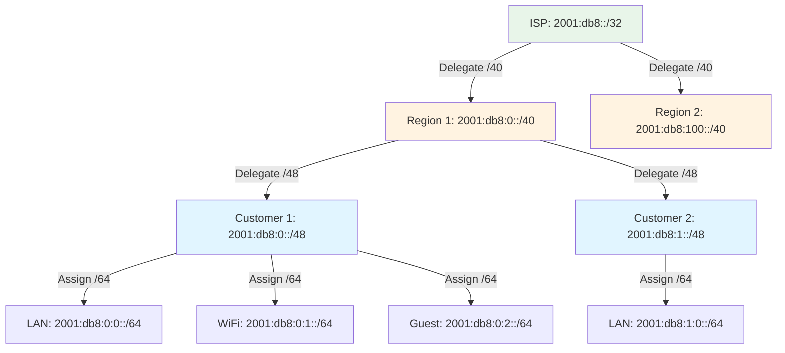

## Implementation Details

### Source Code Organization

| File | Lines | Primary Functions | Description |
|------|-------|-------------------|-------------|
| src/dhcp6.c | 835 | dhcp6_init(), dhcp6_packet() | DHCPv6 socket setup and packet reception |
| src/rfc3315.c | 2322 | dhcp6_reply(), dhcp6_maybe_relay(), dhcp6_no_relay() | RFC 3315 protocol implementation |
| src/radv.c | 1030 | ra_init(), send_ra(), add_prefixes() | Router Advertisement transmission |
| src/slaac.c | 373 | slaac_add_addrs() | SLAAC address generation for DNS |
| src/outpacket.c | 254 | new_opt6(), put_opt6(), end_opt6() | DHCPv6 option assembly utilities |

### Key Data Structures

**struct state** (src/rfc3315.c:22-34):
- **clid**: Client DUID (pointer to option data)
- **clid_len**: Length of DUID
- **ia_type**: IA_NA (3), IA_TA (4), or IA_PD (25)
- **interface**: Interface index where packet received
- **context**: DHCP context (address pool) pointer
- **xid**: Transaction ID (24-bit)
- **iaid**: Identity Association Identifier
- **tags**: Network ID tags for option selection
- **packet_options**: Pointer to options in received packet
- **mac**: Client MAC address (if available)
- **mac_len**: MAC address length

### Configuration Parameters

From `src/config.h`:
- **DEFLEASE6** (line 46): Default DHCPv6 lease time = 86400 seconds (24 hours)
- **DHCP_PACKET_MAX** (line 39): Maximum DHCPv6 packet size = 16384 bytes
- **DHCPV6_SERVER_PORT**: Server listens on UDP port 547
- **DHCPV6_CLIENT_PORT**: Clients listen on UDP port 546

### Message Processing Flow

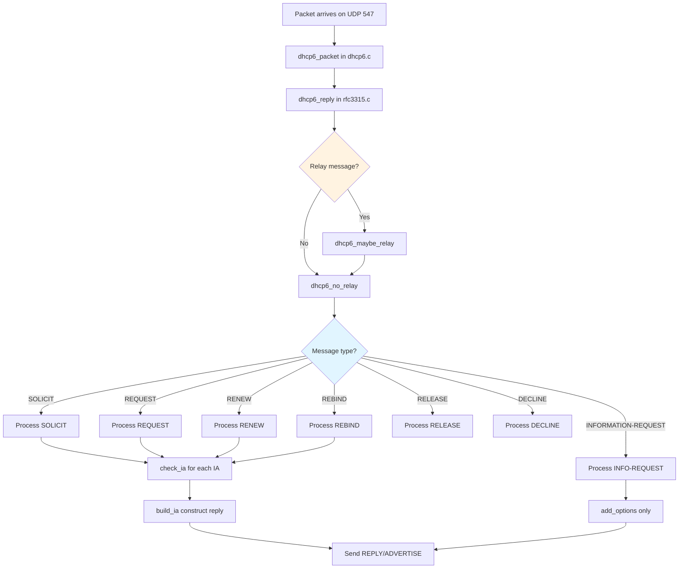

## Configuration and Deployment

### Basic Stateful DHCPv6 Configuration

```bash
# Enable DHCPv6 with stateful address assignment
dhcp-range=2001:db8:1::100,2001:db8:1::200,64,24h

# Enable Router Advertisements with M flag set
enable-ra

# Provide DNS servers via DHCPv6
dhcp-option=option6:dns-server,[2001:db8::53]

# Provide domain search list
dhcp-option=option6:domain-search,example.com
```

### Stateless DHCPv6 + SLAAC Configuration

```bash
# SLAAC-only range (no DHCPv6 address assignment)
dhcp-range=2001:db8:1::,ra-stateless,ra-names,64

# Enable Router Advertisements with O flag set, M flag clear
enable-ra

# Provide DNS via stateless DHCPv6
dhcp-option=option6:dns-server,[2001:db8::53]
```

### Static Address Reservations

```bash
# Static DHCPv6 address by DUID
dhcp-host=id:00:01:00:01:2a:3b:4c:5d:6e:7f:80:91:a2:b3,[2001:db8:1::50]

# Static address by MAC (if available)
dhcp-host=00:1a:2b:3c:4d:5e,[2001:db8:1::60],client-hostname
```

### Prefix Delegation Configuration

```bash
# Delegate /56 prefixes to requesting routers
dhcp-range=2001:db8:100::,ra-only,64
dhcp-range=2001:db8:100::,::ffff,constructor:eth0,64,12h

# Enable prefix delegation pool
dhcp-option=option6:dns-server,[2001:db8::53]
```

---

## Related Documentation

- [DHCP_V4.md](DHCP_V4.md) - DHCPv4 server comparison
- [ARCHITECTURE.md](ARCHITECTURE.md) - Overall system architecture
- [DNS_FORWARDING.md](DNS_FORWARDING.md) - DNS integration
- [CONFIGURATION.md](CONFIGURATION.md) - Configuration system
- [BUILDING.md](BUILDING.md) - Build instructions
- [Back to Documentation Index](README.md)
