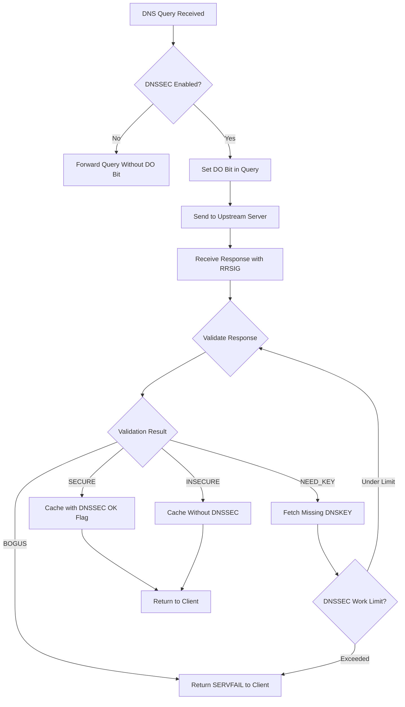
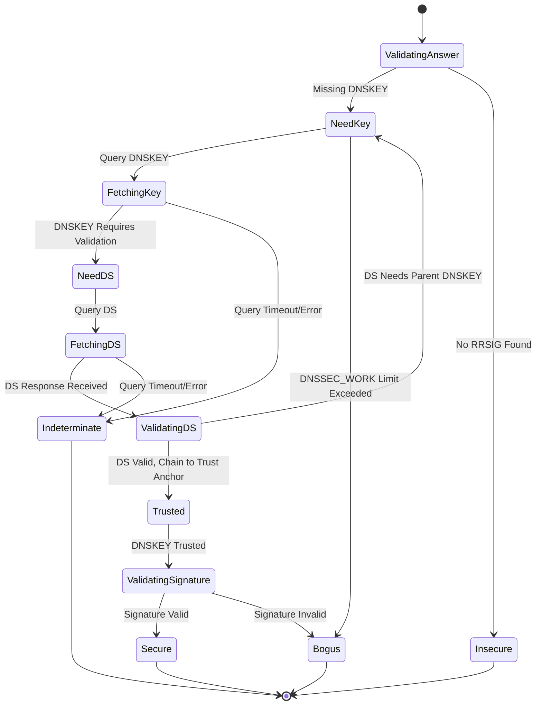
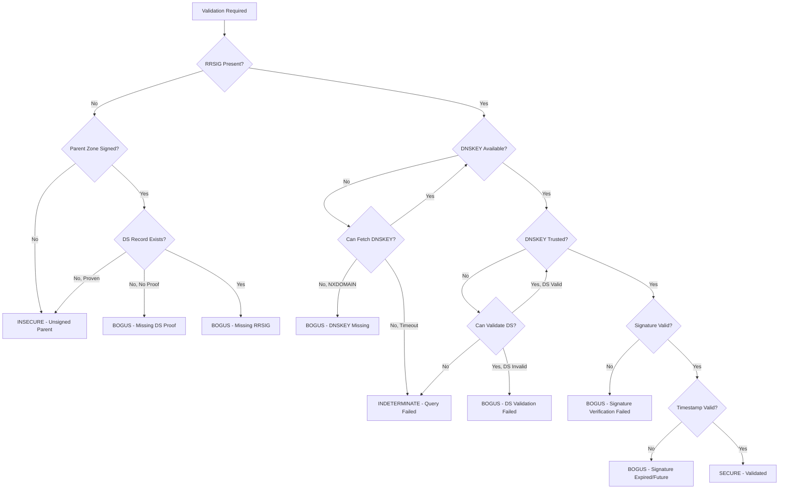

# DNSSEC Validation in dnsmasq

## Overview

This document provides comprehensive documentation of dnsmasq's DNSSEC (DNS Security Extensions) validation implementation, covering RFC compliance, supported cryptographic algorithms, trust anchor management, validation processes, and performance considerations. The DNSSEC implementation allows dnsmasq to validate DNS responses using cryptographic signatures, ensuring data integrity and authenticity of DNS records.

DNSSEC validation in dnsmasq is implemented primarily in `src/dnssec.c` (2202 lines) with cryptographic operations handled by `src/crypto.c` (724 lines) and record storage managed through `src/blockdata.c` (263 lines). The implementation depends on the libnettle and libhogweed cryptographic libraries for signature verification.

## RFC Standards Compliance

### RFC 4033: DNS Security Introduction and Requirements

[RFC 4033](https://www.rfc-editor.org/rfc/rfc4033) defines the DNSSEC architecture and requirements. Dnsmasq implements the validator role, processing DNSSEC-secured DNS responses and verifying cryptographic signatures. The implementation handles:

- **Chain of Trust**: Validates from configured trust anchors (typically root zone) down to target records
- **Security Status Determination**: Classifies responses as secure, insecure, bogus, or indeterminate
- **DO Bit Handling**: Sets DNSSEC OK (DO) bit in queries when DNSSEC validation is enabled
- **CD Bit Processing**: Respects Checking Disabled bit for selective validation bypass

Implementation in `src/dnssec.c` lines 1-2202 and `src/forward.c` (DNS forwarding pipeline integration).

### RFC 4034: Resource Records for DNSSEC

[RFC 4034](https://www.rfc-editor.org/rfc/rfc4034) specifies DNSSEC resource record types. Dnsmasq processes and validates:

- **RRSIG (Resource Record Signature)**: Cryptographic signatures over RRsets, verified in `src/dnssec.c` validation functions
- **DNSKEY (DNS Public Key)**: Public keys used for signature verification, cached with minimum TTL defined by `DNSSEC_MIN_TTL` (60 seconds, `src/config.h` line 42)
- **DS (Delegation Signer)**: Hash of child zone DNSKEY, establishing trust chain between parent and child zones (handled in `src/dnssec.c` lines 950-1126)
- **NSEC (Next Secure)**: Authenticated denial of existence, validated in `src/dnssec.c` lines 1193-1300+
- **NSEC3 (Next Secure version 3)**: Hashed authenticated denial of existence with salt, providing zone enumeration protection

**Canonical Form Processing**: Domain names are converted to canonical form (lowercase, uncompressed) before signature verification per RFC 4034 Section 6.2, implemented in `src/dnssec.c` lines 27-72 (`to_wire()` function).

### RFC 4035: Protocol Modifications for DNSSEC

[RFC 4035](https://www.rfc-editor.org/rfc/rfc4035) defines protocol-level changes for DNSSEC. Dnsmasq implements:

- **DO Bit in EDNS0**: Signals DNSSEC support to upstream servers
- **AD Bit Validation**: Authenticates Data bit indicates validated responses
- **CD Bit Handling**: Checking Disabled for debugging
- **Chain Validation**: Validates complete chain from trust anchor to target
- **NSEC/NSEC3 Proof Validation**: Verifies authenticated denial of existence

Validation result codes defined in `src/dnssec.c`:
- `STAT_SECURE`: Successfully validated with cryptographic signatures
- `STAT_INSECURE`: No DNSSEC signatures (unsigned zone or insecure delegation)
- `STAT_BOGUS`: Validation failed (invalid signatures, missing keys, broken chain)
- `STAT_NEED_KEY`: Additional DNSKEY required for validation

## Supported Cryptographic Algorithms

Dnsmasq supports multiple DNSSEC algorithm families through libnettle integration. Algorithm support is determined at compile time based on libnettle version.

### Algorithm Support Matrix

| Algorithm Number | Algorithm Name | Hash Function | Nettle Version | Implementation |
|-----------------|----------------|---------------|----------------|----------------|
| 5 | RSASHA1 | SHA-1 | 2.0+ | `dnsmasq_rsa_verify()` (`src/crypto.c` lines 175-208) |
| 7 | RSASHA1-NSEC3-SHA1 | SHA-1 | 2.0+ | `dnsmasq_rsa_verify()` |
| 8 | RSASHA256 | SHA-256 | 2.0+ | `dnsmasq_rsa_verify()` |
| 10 | RSASHA512 | SHA-512 | 2.0+ | `dnsmasq_rsa_verify()` |
| 12 | ECC-GOST | GOST R 34.11-94 | 3.6+ | `dnsmasq_gostdsa_verify()` (`src/crypto.c` lines 284-323) |
| 13 | ECDSAP256SHA256 | SHA-256 | 2.0+ | `dnsmasq_ecdsa_verify()` (`src/crypto.c` lines 210-282) |
| 14 | ECDSAP384SHA384 | SHA-384 | 2.0+ | `dnsmasq_ecdsa_verify()` |
| 15 | ED25519 | SHA-512 | 3.1+ | `dnsmasq_eddsa_verify()` (`src/crypto.c` lines 326-368) |
| 16 | ED448 | SHAKE256 | 3.6+ | `dnsmasq_eddsa_verify()` |

**Algorithm Selection Logic**: The `verify_func()` dispatcher in `src/crypto.c` lines 370-399 selects the appropriate verification function based on algorithm number, returning NULL for unsupported algorithms.

**Runtime Detection**: Algorithm support is checked at runtime through `hash_find()` to ensure the required hash function is available in the linked libnettle version.

### RSA Algorithms (5, 7, 8, 10)

RSA-based algorithms use public-key cryptography with varying hash functions:

- **Algorithm 5/7 (RSASHA1)**: Uses SHA-1 hash, considered weak but still deployed. Verified via `nettle_rsa_sha1_verify_digest()`
- **Algorithm 8 (RSASHA256)**: Most widely deployed, uses SHA-256. Current root zone KSK uses this algorithm. Verified via `nettle_rsa_sha256_verify_digest()`
- **Algorithm 10 (RSASHA512)**: Uses SHA-512 for higher security margin, less common. Verified via `nettle_rsa_sha512_verify_digest()`

**Implementation**: RSA verification in `src/crypto.c` lines 175-208 using GNU MP (GMP) library via nettle wrappers.

### ECDSA Algorithms (13, 14)

Elliptic Curve Digital Signature Algorithm provides equivalent security with smaller key sizes:

- **Algorithm 13 (ECDSAP256SHA256)**: Uses NIST P-256 curve (secp256r1) with SHA-256, 64-byte signatures
- **Algorithm 14 (ECDSAP384SHA384)**: Uses NIST P-384 curve (secp384r1) with SHA-384, 96-byte signatures

**Implementation**: ECDSA verification in `src/crypto.c` lines 210-282 using nettle ECC point operations. Public key coordinates (x, y) are imported from DNS wire format and validated on the specified curve before signature verification.

### EdDSA Algorithms (15, 16)

Edwards-curve Digital Signature Algorithm offers performance advantages and resistance to timing attacks:

- **Algorithm 15 (ED25519)**: Uses Curve25519 with SHA-512, 32-byte public keys and 64-byte signatures. Fast verification with strong security guarantees
- **Algorithm 16 (ED448)**: Uses Curve448 with SHAKE256, 57-byte public keys and 114-byte signatures. Higher security level

**Unique Implementation**: EdDSA operates on the entire message rather than a digest. Dnsmasq implements a "null hash" function (`src/crypto.c` lines 53-116) that accumulates the message data without hashing, then passes it to EdDSA verification functions.

### GOST Algorithm (12)

Russian cryptographic standard GOST R 34.10-2012:

- **Algorithm 12 (ECC-GOST)**: Uses GOST R 34.11-94 hash and GOST 34.10 signature, 64-byte signatures
- **Regional Use**: Primarily deployed in Russian Federation ccTLD (.ru, .рф)
- **Nettle 3.6+ Required**: Support added in recent nettle versions

Implementation in `src/crypto.c` lines 284-323 using nettle GOST-specific functions.

## Trust Anchor Management

### Trust Anchor Configuration

DNSSEC validation requires at least one configured trust anchor, typically the root zone DS record. Dnsmasq loads trust anchors from `trust-anchors.conf`:

```
# Current root DNSSEC trust anchor (valid as of 2019)
trust-anchor=.,20326,8,2,E06D44B80B8F1D39A95C0B0D7C65D08458E880409BBC683457104237C7F8EC8D
```

**Trust Anchor Format**: `name,keytag,algorithm,digest-type,digest-hex`
- **Name**: `.` (root zone)
- **Keytag**: 20326 (key identifier for lookups)
- **Algorithm**: 8 (RSASHA256)
- **Digest Type**: 2 (SHA-256 hash of DNSKEY)
- **Digest**: Hexadecimal SHA-256 hash of root zone Key Signing Key (KSK)

This trust anchor is a DS record representing a hash of the root zone DNSKEY, not the key itself. During validation, dnsmasq:

1. Retrieves the root DNSKEY with matching keytag (20326) and algorithm (8)
2. Computes SHA-256 hash of the retrieved DNSKEY
3. Compares computed hash with configured trust anchor digest
4. If match: Root DNSKEY is trusted and can validate root zone signatures
5. If mismatch: Validation fails as BOGUS

### Root KSK Rollover

The root Key Signing Key changes periodically (approximately every 5 years). Trust anchor updates require:

1. Download updated trust anchor from IANA: https://data.iana.org/root-anchors/root-anchors.xml
2. Extract DS record details (keytag, algorithm, digest type, digest)
3. Update `trust-anchors.conf` with new DS record
4. Reload dnsmasq configuration (SIGHUP signal or restart)
5. Optionally: Temporarily include both old and new trust anchors during rollover period

**RFC 5011 Automated Updates**: Dnsmasq does not currently implement automated trust anchor updates per RFC 5011. Manual updates are required.

### Multiple Trust Anchors

Dnsmasq supports multiple trust anchors for different zones:

```
# Root zone trust anchor
trust-anchor=.,20326,8,2,E06D44B80B8F1D39A95C0B0D7C65D08458E880409BBC683457104237C7F8EC8D

# Enterprise internal zone trust anchor
trust-anchor=example.com,12345,8,2,ABCDEF...
```

This allows validation of both public DNS and private/internal DNSSEC-signed zones.

### Negative Trust Anchors

For broken DNSSEC deployments, negative trust anchors disable validation for specific domains:

```
# Disable DNSSEC validation for broken.example (hypothetical)
trust-anchor=broken.example,0,0,0,00
```

This treats the specified domain as insecure (unsigned), bypassing validation failures.

## Validation Process Flow

### High-Level Validation Pipeline



**Validation Entry Point**: `dnssec_validate_reply()` in `src/dnssec.c` is the main validation entry point called from the DNS forwarding pipeline in `src/forward.c`.

### Detailed Validation Steps

#### Step 1: Pre-Validation Checks

Before cryptographic validation:

1. **Response Completeness**: Verify response contains expected RRSIG records
2. **Query Match**: Confirm response answers original query
3. **Time Validity**: Check current time against RRSIG validity period (Inception and Expiration timestamps)

**Broken RTC Handling**: On embedded systems with unreliable clocks (compiled with `HAVE_BROKEN_RTC`), timestamp validation can be disabled until system time becomes valid, tracked via timestamp file (`src/dnssec.c` lines 134-216).

#### Step 2: DNSKEY Retrieval and Validation

For each RRSIG covering the answer:

1. **Extract RRSIG Fields**: Keytag, algorithm, labels, original TTL, signature inception/expiration, signer name
2. **Locate DNSKEY**: Search cache for DNSKEY matching keytag, algorithm, and signer name
3. **DNSKEY Not Found**: Trigger DNSKEY query (counted against `DNSSEC_WORK` limit of 50 queries, `src/config.h` line 25)
4. **DNSKEY Found**: Verify DNSKEY is trusted (validated via DS record from parent zone)

#### Step 3: DS Record Chain Validation

To trust a DNSKEY, validate the DS record from parent zone:

1. **Query Parent Zone**: Send DS query for child zone to parent zone nameservers
2. **Retrieve DS Records**: Parent zone returns DS record(s) for child zone
3. **Validate Parent Response**: Recursively validate parent's response (chain to trust anchor)
4. **Compute DNSKEY Hash**: Hash child's DNSKEY using digest algorithm specified in DS record
5. **Compare Hashes**: Match computed hash against DS digest
6. **Chain Established**: If match, child DNSKEY is trusted

**Loop Prevention**: If DS and DNSKEY are in same zone, validation would loop infinitely. Detected and failed in `src/dnssec.c` lines 1026-1033.

#### Step 4: Signature Verification

With trusted DNSKEY:

1. **Canonicalize RRset**: Convert all RRs in set to canonical form (lowercase, uncompressed, sorted per RFC 4034 Section 6.3)
2. **Construct Signed Data**: Concatenate RRSIG RDATA (excluding signature) with canonical RRset
3. **Compute Digest**: Hash signed data using algorithm specified in RRSIG (SHA-1, SHA-256, SHA-384, or SHA-512)
4. **Verify Signature**: Call algorithm-specific verification function in `src/crypto.c`:
   - RSA: `dnsmasq_rsa_verify()` validates RSA signature over digest
   - ECDSA: `dnsmasq_ecdsa_verify()` validates ECDSA signature
   - EdDSA: `dnsmasq_eddsa_verify()` validates EdDSA signature over message (not digest)
   - GOST: `dnsmasq_gostdsa_verify()` validates GOST signature
5. **Signature Valid**: Mark response as SECURE
6. **Signature Invalid**: Mark response as BOGUS

**Wildcard Expansion**: Special handling for wildcards per RFC 4035 Section 5.3, validating wildcard source and labels count.

#### Step 5: Authenticated Denial of Existence

For negative responses (NXDOMAIN or NODATA), validate NSEC or NSEC3 proofs:

**NSEC Validation** (`src/dnssec.c` lines 1193-1300+):
1. **Locate NSEC Record**: Find NSEC covering query name in canonical order
2. **Verify Name Range**: Confirm query name falls between NSEC owner and next name
3. **Verify Type Bitmap**: For NODATA, confirm query type not in NSEC type bitmap
4. **Validate NSEC RRSIG**: Verify NSEC record itself is signed

**NSEC3 Validation**:
1. **Compute Hash**: Hash query name with salt and iterations from NSEC3PARAM
2. **Locate NSEC3 Record**: Find NSEC3 covering hashed name
3. **Verify Hash Range**: Confirm hashed name falls between NSEC3 owner hash and next hash
4. **Opt-Out Handling**: Check opt-out flag for insecure delegations
5. **Validate NSEC3 RRSIG**: Verify NSEC3 record signature

### Validation State Machine



## DS Record Chain of Trust

### Trust Chain Structure

DNSSEC establishes trust through a hierarchical chain from root to target zone:

```
Root Trust Anchor (configured in trust-anchors.conf)
  ↓ validates
Root DNSKEY (retrieved and verified against trust anchor)
  ↓ signs
.com DS record (in root zone, signed by root DNSKEY)
  ↓ validates
.com DNSKEY (retrieved and verified against DS from root)
  ↓ signs
example.com DS record (in .com zone, signed by .com DNSKEY)
  ↓ validates
example.com DNSKEY (retrieved and verified against DS from .com)
  ↓ signs
www.example.com A record (in example.com zone, signed by example.com DNSKEY)
```

### Chain Validation Process

1. **Start at Target**: Validating www.example.com A record requires example.com DNSKEY
2. **Validate Child Key**: example.com DNSKEY validated via DS record from parent (.com)
3. **Validate Parent Response**: .com DS response validated via .com DNSKEY
4. **Validate Parent Key**: .com DNSKEY validated via DS record from root
5. **Validate Root Response**: Root DS response validated via root DNSKEY
6. **Validate Root Key**: Root DNSKEY validated against configured trust anchor
7. **Trust Established**: Chain complete, original signature can be verified

### Insecure Delegations

Not all zones are DNSSEC-signed. Insecure delegations handled via:

- **No DS Record**: Parent zone returns authenticated NSEC/NSEC3 proof of DS non-existence
- **Insecure Status**: Child zone treated as insecure (unsigned)
- **No Validation**: Responses from insecure zones not validated, returned without DNSSEC OK flag
- **Security Degradation**: Insecure delegation breaks chain, all child zones insecure

**Opt-Out**: NSEC3 supports opt-out flag, allowing unsigned delegations in signed zones (reduces zone size for large delegation-heavy zones like TLDs).

## NSEC and NSEC3 Proof Validation

### NSEC Authenticated Denial

NSEC provides authenticated proof of non-existence through canonical ordering:

**Canonical Order**: DNS names sorted lexicographically per RFC 4034 Section 6.1, implemented in `hostname_cmp()` (`src/dnssec.c` lines 1129-1191).

**NSEC Chain**: Each NSEC record points to next name in zone, forming complete chain. Gaps in chain prove non-existence.

**NXDOMAIN Proof**: To prove name doesn't exist:
1. Locate NSEC record where: `NSEC_owner <= query_name < NSEC_next`
2. Verify NSEC signature (signed by zone DNSKEY)
3. If query_name in gap: Name provably doesn't exist

**NODATA Proof** (name exists but not queried type):
1. Locate NSEC record with owner matching query name
2. Check type bitmap in NSEC RDATA
3. If query type not in bitmap: Type provably doesn't exist for this name
4. Verify NSEC signature

**Wildcard Proof**: Proving no wildcard matches requires NSEC covering wildcard position.

Implementation in `src/dnssec.c` `prove_non_existence_nsec()` lines 1193-1300+.

### NSEC3 Hashed Denial

NSEC3 addresses NSEC zone enumeration vulnerability by hashing names:

**Hash Computation**:
```
hash = H(H(H(name, salt), salt), salt)  // Iterated 'iterations' times
```

Where H is SHA-1, salt is random data, iterations adds computational cost.

**NSEC3 Parameters**:
- **Hash Algorithm**: Always SHA-1 (algorithm 1)
- **Flags**: Opt-out flag for insecure delegations
- **Iterations**: Hash iteration count (higher = more CPU, defense against rainbow tables)
- **Salt**: Random salt value (hex encoded)

**NSEC3 Chain**: Like NSEC but in hashed order. Each NSEC3 record covers range of hash values.

**NXDOMAIN Proof with NSEC3**:
1. Hash query name with NSEC3 parameters
2. Locate NSEC3 where: `NSEC3_owner_hash <= query_name_hash < NSEC3_next_hash`
3. Verify NSEC3 signature
4. Verify closest encloser and next closer name NSEC3 records
5. Three NSEC3 records typically required for complete proof

**Wildcard Proof**: Requires proving no matching wildcard through additional NSEC3 records.

**Opt-Out**: If opt-out flag set, unsigned delegations allowed. Affects validation logic for NODATA proofs.

### NSEC vs NSEC3 Comparison

| Feature | NSEC | NSEC3 |
|---------|------|-------|
| Zone Enumeration | Vulnerable (plaintext next name) | Protected (hashed names) |
| Validation Complexity | Simpler (2-3 NSEC records) | Complex (3-5 NSEC3 records) |
| Computational Cost | Low (direct name comparison) | Higher (hash computation) |
| Proof Size | Smaller (fewer records) | Larger (more records needed) |
| Opt-Out Support | No | Yes (for unsigned delegations) |
| Algorithm | Name comparison | SHA-1 hashing |

Both NSEC and NSEC3 validation implemented in `src/dnssec.c`.

## Validation Failure Modes

### SECURE Status

**Meaning**: Response is cryptographically validated from trust anchor to target record.

**Requirements**:
- Complete RRSIG chain from target to trust anchor
- All DNSKEY records validated via DS records
- All signatures verify correctly with trusted keys
- Timestamps within valid ranges
- NSEC/NSEC3 proofs valid (for negative responses)

**Cache Behavior**: Cached with `F_DNSSECOK` flag, served with AD bit set to clients.

**Implementation**: Returned as `STAT_SECURE` from validation functions.

### INSECURE Status

**Meaning**: Zone is not DNSSEC-signed (unsigned zone or insecure delegation).

**Cause**:
- Parent zone returns authenticated proof that no DS record exists for child
- NSEC/NSEC3 in parent proves DS non-existence
- Parent is validated (signatures verify), but child has no DS

**Security Implication**: No cryptographic protection, same security as non-DNSSEC DNS.

**Cache Behavior**: Cached without `F_DNSSECOK` flag, no AD bit set.

**Implementation**: Returned as `STAT_INSECURE` when DS query returns authenticated negative response (`src/dnssec.c` lines 1013-1018).

**User Notification**: Logged as warning: "Insecure DS reply received for %s, check domain configuration" to alert administrators of potential configuration issues.

### BOGUS Status

**Meaning**: DNSSEC validation failed - signatures invalid, missing, or expired.

**Causes**:
- Signature verification fails (cryptographic mismatch)
- Missing RRSIG records when DNSSEC expected
- DNSKEY not found or not trusted
- DS record mismatch (hash doesn't match DNSKEY)
- Signature expired or not yet valid
- NSEC/NSEC3 proof invalid or missing
- DNSSEC_WORK limit exceeded
- Malformed DNSSEC records

**Client Response**: SERVFAIL (response code 2) returned to client per RFC 4035.

**Cache Behavior**: Not cached (or cached as negative with short TTL).

**Logging**: Specific failure reason logged with F_UPSTREAM flag for troubleshooting.

**Implementation**: Returned as `STAT_BOGUS` with optional failure reason flags.

**Security Rationale**: Conservative approach - any validation failure treated as attack or misconfiguration, rejecting response.

### INDETERMINATE Status

**Meaning**: Unable to complete validation due to operational issues (not cryptographic failure).

**Causes**:
- DNSKEY query timeout (upstream not responding)
- DS query timeout
- Upstream server SERVFAIL response
- Network errors during validation queries
- Resource exhaustion (memory allocation failure)

**Difference from BOGUS**: Indeterminate is operational failure (try again later), BOGUS is cryptographic failure (data is bad).

**Client Response**: Typically SERVFAIL, may retry with different upstream.

**Cache Behavior**: Not cached, allowing retry.

**Implementation**: Returned as `STAT_BOGUS | DNSSEC_FAIL_INDET` to distinguish from cryptographic failures.

### Failure Mode Decision Tree



## Cryptographic Library Integration

### Libnettle and Libhogweed Dependencies

Dnsmasq DNSSEC implementation requires:

- **libnettle**: Core cryptographic primitives (hashing, symmetric crypto)
- **libhogweed**: Public-key cryptography (RSA, ECDSA, EdDSA, GOST)
- **GMP (GNU Multiple Precision)**: Large integer arithmetic (dependency of libhogweed)

**Minimum Version**: Nettle 2.0, but newer features require later versions:
- Nettle 3.1+ for EdDSA (algorithms 15, 16)
- Nettle 3.6+ for GOST (algorithm 12) and Ed448 (algorithm 16)

**Version Detection**: Nettle version macros in `src/crypto.c` lines 22-31:
```c
#define MIN_VERSION(major, minor) ((NETTLE_VERSION_MAJOR == (major) && \
    NETTLE_VERSION_MINOR >= (minor)) || (NETTLE_VERSION_MAJOR > (major)))
```

**Compilation**: When `HAVE_DNSSEC` defined, links against `-lnettle -lhogweed -lgmp`.

### Algorithm Availability Detection

Not all algorithms available on all systems (depends on nettle version and build options).

**Runtime Checking**: `verify_func()` in `src/crypto.c` lines 370-399 checks algorithm support:
1. Verify hash function available via `hash_find(algo_digest_name(algo))`
2. Check algorithm number against compiled-in support (MIN_VERSION checks)
3. Return verification function pointer or NULL if unsupported

**Unsupported Algorithm Handling**: If signature uses unsupported algorithm, validation returns INDETERMINATE (cannot validate, but not provably bogus).

### Hash Function Abstraction

Nettle hash functions accessed through uniform API:

**Hash Initialization**: `hash_init()` (`src/crypto.c` lines 121-157) allocates context and digest buffers, calls hash-specific init function.

**Supported Hash Functions**:
- SHA-1 (deprecated but still used)
- SHA-256 (most common)
- SHA-384
- SHA-512
- GOST R 34.11-94 (Russian standard)

**EdDSA Special Case**: EdDSA algorithms sign entire message, not digest. "Null hash" function (`src/crypto.c` lines 53-116) accumulates message bytes without hashing, passing buffer to EdDSA verification.

### Memory Management

**Static Buffers**: Cryptographic context and digest buffers statically allocated and reused (`src/crypto.c` lines 123-126), growing as needed for larger hash outputs.

**Key Storage**: Public keys and signatures stored in blockdata structures (`src/blockdata.c`) providing efficient storage of variable-length data with minimal fragmentation. Blockdata uses linked 40-byte chunks (`KEYBLOCK_LEN`, `src/config.h` line 24).

**Security Considerations**: No explicit zeroization of cryptographic material (keys, signatures) after use, relying on process memory protection. Acceptable for validator role (public keys only, no private keys handled).

## Performance Considerations

### Validation Overhead

DNSSEC adds computational and network overhead:

**Computational Cost**:
- RSA signature verification: ~1-5ms per signature (depends on key size, CPU)
- ECDSA verification: ~0.5-2ms per signature
- EdDSA verification: ~0.1-0.5ms per signature (fastest)
- Hash computation: ~0.01-0.1ms per record

**Network Overhead**:
- Additional DNSKEY queries (cached after first fetch, TTL typically 1-7 days)
- Additional DS queries for chain validation (cached)
- Larger response sizes (RRSIG records add ~100-200 bytes each)

**Latency Impact**: First query for new domain may require 2-5 additional round trips (DNSKEY, DS queries up chain). Subsequent queries served from cache.

### DNSSEC Work Limit

To prevent infinite recursion and DoS attacks, dnsmasq limits validation queries.

**DNSSEC_WORK Constant**: Maximum 50 validation-related queries per original query (`src/config.h` line 25).

**Counted Queries**:
- DNSKEY queries for missing keys
- DS queries for trust chain validation
- Dependent queries for validating DNSKEY signatures

**Limit Exceeded**: If validation requires >50 queries, marked as BOGUS and SERVFAIL returned. Indicates either:
- Pathological DNSSEC configuration (excessive delegations)
- Attack attempt (complex chain to exhaust resources)
- Broken DNSSEC requiring excessive retries

**Tuning**: Can be increased at compile time if legitimate use cases require deeper validation chains (unlikely in practice).

### Caching Strategy

**DNSSEC Record Caching**:
- **DNSKEY Records**: Cached with minimum TTL of 60 seconds (`DNSSEC_MIN_TTL`, `src/config.h` line 42), even if zone specifies shorter TTL, providing stability
- **DS Records**: Cached with minimum TTL of 60 seconds
- **Validated Answers**: Cached with `F_DNSSECOK` flag, TTL from original response
- **Negative Answers**: Cached with validation status, TTL from NSEC/NSEC3

**Cache Benefits**:
- DNSKEY typically cached for hours/days, subsequent validations fast (no additional queries)
- DS records cached, parent zone not queried repeatedly
- Validated responses served from cache with AD bit

**Cache Invalidation**: Stale DNSKEY/DS removed on TTL expiry. Configuration reload (SIGHUP) purges cache.

### Negative Trust Anchors

For broken DNSSEC deployments causing widespread validation failures, negative trust anchors disable validation for specific domains without disabling DNSSEC globally.

**Configuration**: `trust-anchor=broken.example,0,0,0,00` in trust-anchors.conf

**Effect**: Zone `broken.example` and all subdomains treated as insecure (unsigned), bypassing validation.

**Use Cases**:
- Temporarily work around broken DNSSEC during operator repairs
- Enterprise bypassing specific public domains with known DNSSEC issues
- Testing and development environments

**Security Impact**: Reverts to pre-DNSSEC security for affected domains - no protection against cache poisoning or man-in-the-middle attacks. Use sparingly and temporarily.

---

## Related Documentation

- [DNS Forwarding](DNS_FORWARDING.md) - DNSSEC integration in query forwarding pipeline
- [DNS Caching](DNS_CACHING.md) - DNSSEC record caching strategies  
- [System Architecture](ARCHITECTURE.md) - DNSSEC validation in event-driven architecture
- [Configuration System](CONFIGURATION.md) - DNSSEC compilation options and runtime configuration
- [Building dnsmasq](BUILDING.md) - Libnettle dependency requirements
- [Back to Documentation Index](README.md)
