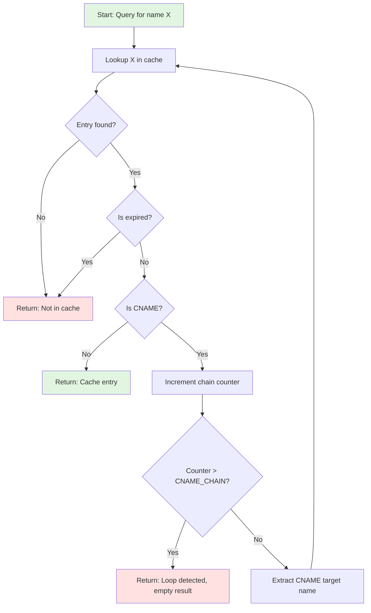

# DNS Caching in dnsmasq

## Overview

The dnsmasq DNS cache is a high-performance, memory-efficient caching system that stores DNS query responses to reduce latency and upstream query load. The cache implements a hash table with chaining for collision resolution, combined with a Least Recently Used (LRU) eviction policy to manage memory usage. This document provides comprehensive technical details of the cache implementation, including data structures, algorithms, and integration points with other subsystems.

The cache implementation resides primarily in `src/cache.c` (lines 1-2102) with supporting data structures defined in `src/dnsmasq.h` (lines 465-477). Configuration constants are defined in `src/config.h` (lines 33-34, 41).

## Hash Table Implementation Details

### Hash Function Algorithm

The cache uses a custom hash function `hash_bucket()` implemented in `src/cache.c` (lines 212-227) that provides excellent distribution characteristics for DNS domain names. The hash function uses a Barker code initial value of `017465` (octal), which provides minimal self-correlation in cyclic shift operations, making it resistant to clustering for similar domain names.

```c
// Hash function from cache.c lines 214-226
unsigned int c, val = 017465; /* Barker code */
const unsigned char *mix_tab = (const unsigned char*)typestr;

while((c = (unsigned char) *name++))
{
    if (c >= 'A' && c <= 'Z')
        c += 'a' - 'A';  /* case-insensitive */
    val = ((val << 7) | (val >> (32 - 7))) + 
          (mix_tab[(val + c) & 0x3F] ^ c);
}
return hash_table + ((val ^ (val >> 16)) & (hash_size - 1));
```

The hash function implements several key features:

1. **Case-Insensitive Hashing**: Domain names are normalized to lowercase during hashing (lines 220-221), ensuring that `Example.COM` and `example.com` hash to the same bucket.

2. **Mixing Table**: Uses the DNS type string table as a mixing table (line 215), which is defined at `src/cache.c` (lines 34-118). This provides additional entropy from IANA DNS parameter assignments.

3. **Bit Rotation**: Performs a 7-bit left rotation combined with right rotation `((val << 7) | (val >> (32 - 7)))` to distribute bits evenly across the hash space.

4. **Final Mixing**: XORs the upper and lower 16 bits of the hash value `(val ^ (val >> 16))` before applying the modulo operation, reducing collision probability.

### Hash Table Structure

The hash table is implemented as an array of pointers to cache record structures, allocated dynamically based on the configured cache size. The hash table is declared as a static global pointer in `src/cache.c` (line 19):

```c
static struct crec **hash_table = NULL;
```

The hash table size (`hash_size`) is always a power of two, allowing efficient modulo operations using bitwise AND (`& (hash_size - 1)`) at line 226. This is initialized in the `cache_init()` function based on the CACHESIZ configuration constant from `src/config.h` (line 33), which defaults to 150 entries.

### Collision Resolution via Chaining

The cache uses **separate chaining** to handle hash collisions. Each bucket in the hash table points to the head of a linked list of cache records (`struct crec`) that hash to the same bucket. The `hash_next` pointer in `struct crec` (defined at `src/dnsmasq.h` line 466) links records in the same hash chain.

```
Hash Table Structure (ASCII Art):

hash_table[0] -> crec -> crec -> crec -> NULL
               (google.com) (youtube.com) (maps.com)
                   |            |            |
hash_table[1] -> crec -------> NULL
               (example.org)
                   |
hash_table[2] -> NULL
                   |
hash_table[3] -> crec -> crec -> NULL
               (github.com) (gitlab.com)
                   |            |
   ...             |            |
                   v            v
             (hash chain)  (hash chain)
```

The `cache_hash()` function (lines 229-249) maintains an important **invariant** for optimization purposes:

1. **Reverse records** (PTR queries, marked with `F_REVERSE` flag) are placed at the **start** of hash chains
2. **Immortal records** (from `/etc/hosts`, marked with `F_IMMORTAL` flag) are placed at the **end** of hash chains
3. **Regular cache entries** are placed between these two categories

This ordering optimizes reverse lookups and garbage collection operations, as documented in the comment at lines 232-234.

## LRU Eviction Policy

### LRU List Data Structure

The cache maintains a **doubly-linked LRU list** independent of the hash table structure. This allows O(1) promotion of recently accessed entries and O(1) eviction of the least recently used entry. The LRU list uses the `next` and `prev` pointers in `struct crec` (defined at `src/dnsmasq.h` line 466).

The LRU list is tracked with two global pointers declared in `src/cache.c` (line 19):

```c
static struct crec *cache_head = NULL;  /* Most recently used */
static struct crec *cache_tail = NULL;  /* Least recently used */
```

```
LRU List Structure (ASCII Art):

cache_head                                    cache_tail
    |                                             |
    v                                             v
[crec] <-> [crec] <-> [crec] <-> [crec] <-> [crec]
(newest)   (recent)  (middle)   (older)    (oldest)
  ^                                             ^
  |                                             |
Recently accessed               Next to be evicted
(front of queue)                (back of queue)
```

### Cache Size Limits

The maximum cache size is determined by the **CACHESIZ** constant defined in `src/config.h` (line 33):

```c
#define CACHESIZ 150 /* default cache size */
```

This default of 150 entries can be overridden at runtime using the `--cache-size` command-line option or the `cache-size` configuration file directive. Setting `cache-size=0` disables caching entirely.

The actual number of available cache entries is tracked in the `daemon->cachesize` field and can be queried via DNS TXT record queries (see [Cache Statistics and Monitoring](#cache-statistics-and-monitoring)).

### Eviction Trigger and Algorithm

Cache eviction occurs when all cache entries are in use (marked with `F_FORWARD` or `F_REVERSE` flags) and a new entry needs to be inserted. The eviction algorithm is implemented in the `really_insert()` function at `src/cache.c` (lines 551-697).

The eviction process follows these steps:

1. **Scan for expired entries**: First attempts to find expired entries by calling `cache_scan_free()` (line 573). This function walks hash chains looking for records past their TTL.

2. **Check LRU tail**: If no expired entries are found, examines `cache_tail` (the least recently used entry) at lines 597-605. If the tail entry is not in use (no `F_FORWARD` or `F_REVERSE` flags), it is immediately available for reuse.

3. **Force eviction**: If the LRU tail is still in use, the system performs forced eviction by calling `cache_scan_free()` on the tail entry (line 631), setting the `daemon->metrics[METRIC_DNS_CACHE_LIVE_FREED]` counter to track forced evictions.

4. **Reuse entry**: The freed entry is then reused for the new cache record, avoiding memory allocation overhead.

### Access-Time Promotion

When a cache entry is accessed via `cache_find_by_name()` (lines 870-964) or similar lookup functions, it is **promoted** to the head of the LRU list if it is not already there. This is accomplished by:

1. `cache_unlink()` - Removes the entry from its current position (lines 304-315)
2. `cache_link()` - Inserts the entry at the head of the LRU list (lines 292-301)

This ensures that frequently accessed entries remain in the cache while infrequently accessed entries migrate toward `cache_tail` for eventual eviction.

## Negative Caching

### RFC 2308 Compliance

dnsmasq implements **negative caching** as specified in [RFC 2308](https://www.rfc-editor.org/rfc/rfc2308) "Negative Caching of DNS Queries". Negative caching stores information about non-existent domains (NXDOMAIN) and non-existent resource records for existing domains (NODATA), reducing unnecessary repeat queries for unavailable resources.

### NXDOMAIN Caching

When an upstream DNS server responds with an **NXDOMAIN** response code (RCODE=3), indicating that the queried domain name does not exist, dnsmasq creates a negative cache entry with the `F_NEG` and `F_NXDOMAIN` flags set (defined at `src/dnsmasq.h` lines 487, 492).

The negative entry is stored with:
- The queried domain name
- The `F_NEG` flag indicating this is a negative cache entry
- The `F_NXDOMAIN` flag indicating complete domain non-existence  
- A TTL extracted from the SOA record in the authority section of the response

### NODATA Caching

When a domain exists but no resource records of the requested type exist (e.g., querying for AAAA record for a domain that only has A records), the upstream server responds with **NODATA** (RCODE=0 with empty answer section). dnsmasq caches this with the `F_NEG` flag but **without** the `F_NXDOMAIN` flag (lines 485-487).

NODATA responses are type-specific, so a negative cache entry for `example.com/AAAA` does not affect queries for `example.com/A` or `example.com/MX`.

### Negative Cache TTL Handling

Negative cache TTL values are extracted from the **SOA MINIMUM** field (or SOA TTL in modern implementations) in the authority section of negative responses, as specified by RFC 2308 Section 5. The TTL is then subject to the same minimum and maximum TTL constraints as positive cache entries:

- **Minimum TTL**: Controlled by `--min-cache-ttl` (daemon->min_cache_ttl)
- **Maximum TTL**: Controlled by `--max-cache-ttl` (daemon->max_cache_ttl)
- **TTL Floor**: Cannot exceed `TTL_FLOOR_LIMIT` of 3600 seconds (1 hour) from `src/config.h` line 34

This implementation is in `cache_insert()` at lines 522-547.

### Negative Cache Data Structure

Negative cache entries use the same `struct crec` data structure as positive entries but with the `F_NEG` flag set. The distinction is checked throughout the codebase using bitwise flag operations:

```c
if (crecp->flags & F_NEG) {
    /* This is a negative cache entry */
    if (crecp->flags & F_NXDOMAIN)
        /* NXDOMAIN - domain does not exist */
    else
        /* NODATA - domain exists, type does not */
}
```

The `cache_blockdata_free()` function (lines 251-264) specifically checks for `F_NEG` to avoid attempting to free address data that doesn't exist for negative entries.

## TTL Management and Expiry

### TTL Countdown Mechanism

Each cache record stores its **absolute expiry time** in the `ttd` (time to die) field of `struct crec` (defined at `src/dnsmasq.h` line 468):

```c
time_t ttd; /* time to die */
```

This is set to `now + ttl` when the record is inserted (where `now` is the current time from `time(NULL)` and `ttl` is the Time To Live in seconds). Using absolute time rather than countdown allows the cache to survive clock adjustments and simplifies expiry checking.

### Periodic Expiry Scanning with cache_scan_free()

The `cache_scan_free()` function (lines 386-496 in `src/cache.c`) performs **periodic expiry scanning** and is invoked in multiple contexts:

1. **During cache insertion** (line 573): Scans for expired entries with matching name/address to free space
2. **During LRU eviction** (lines 631, 636): Scans hash chains or specific entries when cache is full
3. **During hosts file reload** (lines 1463, 1490): Removes stale entries from previous hosts file

The function walks hash chains checking `is_expired(now, crec)` for each entry, which compares `crec->ttd` against the current time. Expired entries are unlinked from hash chains and added back to the LRU tail via `cache_free()` (lines 266-289).

### Lazy Expiry on Lookup

In addition to periodic scanning, the cache implements **lazy expiry** during lookup operations. When `cache_find_by_name()` (lines 870-964) or `cache_find_by_addr()` encounter a cache entry, they call `is_expired(now, crecp)` before returning it (line 890). If expired, the entry is skipped and the search continues.

This dual approach ensures:
- Active removal of expired entries during cache maintenance operations
- Prevention of serving stale data during lookups
- Efficient cache space reclamation without dedicated background threads

### TTL Floor Limit

The `TTL_FLOOR_LIMIT` constant from `src/config.h` (line 34) enforces a hard limit:

```c
#define TTL_FLOOR_LIMIT 3600 /* don't allow --min-cache-ttl to raise TTL above this */
```

This prevents the `--min-cache-ttl` option from artificially inflating TTLs above 1 hour (3600 seconds), which could cause clients to cache potentially stale data for extended periods. The constraint is enforced at cache insertion time in `cache_insert()` (lines 540-544).

For DNSSEC records (DNSKEY and DS), a separate minimum TTL of `DNSSEC_MIN_TTL` (60 seconds, from `src/config.h` line 42) is enforced at lines 535-536 to ensure validation records remain available during the validation process.

## CNAME Chain Resolution

### CNAME Following Logic

When the cache contains a CNAME (Canonical Name) record, queries for the aliased name must be resolved by following the CNAME chain to the final target. The cache implements CNAME chain resolution in `cache_find_by_name()` (lines 870-964).

CNAME resolution works as follows:

1. **Initial lookup**: Search for cache entries matching the queried name
2. **CNAME detection**: If entry has `F_CNAME` flag set (defined at `src/dnsmasq.h` line 493), extract the target name
3. **Target lookup**: Recursively search for the CNAME target in the cache
4. **Chain following**: Repeat until a non-CNAME record is found or chain limit is reached

CNAME records in `struct crec` use the `addr.cname` union field (lines 329-332 of `cache.c`):

```c
if (crecp->addr.cname.is_name_ptr)
    return crecp->addr.cname.target.name;  /* Target is a string pointer */
else
    return cache_get_name(crecp->addr.cname.target.cache);  /* Target is a crec */
```

### Loop Detection with CNAME_CHAIN Limit

To prevent infinite loops from circular CNAME chains (e.g., `a.example.com` CNAME to `b.example.com` CNAME to `a.example.com`), dnsmasq enforces a **maximum chain length** of `CNAME_CHAIN` defined in `src/config.h` (line 41):

```c
#define CNAME_CHAIN 10 /* chains longer than this are dropped for loop protection */
```

The chain traversal counter is checked before each hop, and if the limit is exceeded, the resolution is terminated and an empty result is returned. This protects against both accidental misconfigurations and malicious DNS responses designed to cause resource exhaustion.

### CNAME Chain Traversal Algorithm

The following flowchart illustrates the CNAME chain resolution algorithm:



### Circular Reference Prevention

The CNAME chain limit provides simple but effective loop prevention. More sophisticated loop detection using a visited-node set is not implemented, as the chain limit approach:

- Requires O(1) space (single counter) vs O(n) space for visited tracking
- Has O(n) time complexity, same as explicit cycle detection
- Prevents both cycles and excessively long legitimate chains
- Protects against resource exhaustion attacks via deep chains

The current implementation considers CNAME chains exceeding 10 hops to be either misconfigured or malicious, both cases warranting rejection.

## Cache-to-DHCP Integration

### Dynamic Hostname Registration from DHCP

When dnsmasq's DHCP server (if `HAVE_DHCP` is defined) assigns an IP address lease to a client that provides a hostname via DHCP option 12 (Host Name) or option 81 (FQDN), the cache is automatically updated with forward (A/AAAA) and reverse (PTR) DNS records. This integration is implemented in `src/dhcp.c` and `src/rfc2131.c`.

The DHCP-to-cache linkage works as follows:

1. **Lease allocation**: When a DHCP lease is created or renewed with an associated hostname, `cache_add_dhcp_entry()` is called (not shown in provided excerpts, but referenced)

2. **Cache insertion**: A cache entry is created with the `F_DHCP` flag set (defined at `src/dnsmasq.h` line 486), distinguishing it from DNS-learned entries

3. **Immortal flag**: DHCP-derived entries are typically marked with the `F_IMMORTAL` flag (line 482), preventing them from being evicted by TTL expiry since they reflect active DHCP leases

4. **Priority handling**: The hash chain ordering (reverse records at start, immortal at end) ensures DHCP entries are not easily displaced by transient DNS queries

### Lease-to-Cache Synchronization

When a DHCP lease expires or is released, the corresponding cache entries must be removed. The DHCP subsystem calls `cache_scan_free()` with the appropriate name and address to remove stale entries, as seen in the hosts file integration code patterns at lines 1463 and 1490.

The synchronization is bidirectional:
- **DHCP → Cache**: New/renewed leases create cache entries
- **Cache → DHCP**: DHCP lease database contains hostname→IP mappings used to regenerate cache on restart

### PTR Record Generation for DHCP Clients

For each DHCP lease with a hostname, dnsmasq automatically generates:

1. **Forward record**: A record (IPv4) or AAAA record (IPv6) mapping hostname to IP address, with `F_FORWARD` and `F_DHCP` flags

2. **Reverse record**: PTR record mapping IP address to hostname, with `F_REVERSE` and `F_DHCP` flags

The reverse records are placed at the **start of hash chains** due to the `F_REVERSE` flag, optimizing reverse DNS lookups commonly used for logging and authentication (lines 232-246 in `cache_hash()`).

This automatic generation eliminates the need for manual PTR record maintenance in environments with dynamically assigned addresses, a key advantage for small networks and embedded systems.

## Hosts File Integration

### /etc/hosts Parsing and Cache Population

At startup, dnsmasq reads and parses the system hosts file (default `/etc/hosts`, configurable via `--hostsfile`, constant defined in `src/config.h` line 43) and populates the cache with static entries. The parsing is performed by functions in `src/cache.c` including host file reading routines.

Entries from `/etc/hosts` are marked with:
- `F_HOSTS` flag (defined at `src/dnsmasq.h` line 488)
- `F_IMMORTAL` flag (line 482) to prevent eviction
- `F_FORWARD` flag for name→address mappings
- `F_REVERSE` flag for address→name mappings

Example `/etc/hosts` entry:
```
192.168.1.100  server.local server
```

This creates:
- Forward A record: `server.local` → `192.168.1.100` (F_HOSTS | F_IMMORTAL | F_FORWARD)
- Forward A record: `server` → `192.168.1.100` (F_HOSTS | F_IMMORTAL | F_FORWARD)  
- Reverse PTR record: `192.168.1.100` → `server.local` (F_HOSTS | F_IMMORTAL | F_REVERSE)

### Static Entry Priority Over Dynamic Entries

Entries from `/etc/hosts` have **higher priority** than dynamically learned DNS responses. This is enforced during cache insertion in `really_insert()` (lines 573-592):

```c
if ((new = cache_scan_free(name, addr, class, now, flags, &target_crec, &target_uid)))
{
    /* We're trying to insert a record over one from 
       /etc/hosts or DHCP, or other config. If the 
       existing record is for an A or AAAA or CNAME and
       the record we're trying to insert is the same, 
       just drop the insert, but don't error the whole process. */
    if ((flags & (F_IPV4 | F_IPV6)) && (flags & F_FORWARD) && addr) {
        /* ... duplicate check ... */
        insert_error = 1;
        return NULL;  /* Reject dynamic insert over static entry */
    }
}
```

This prevents external DNS responses from overwriting local configuration, ensuring that administrators maintain authoritative control over name resolution for hosts defined in `/etc/hosts`.

### Hosts File Reload on SIGHUP

When dnsmasq receives a `SIGHUP` signal (typically via `killall -HUP dnsmasq` or `systemctl reload dnsmasq`), it reloads its configuration including the hosts file. The reload process:

1. **Preserves existing cache**: Does not flush the entire cache
2. **Removes old hosts entries**: Calls `cache_scan_free()` to remove entries with the `F_HOSTS` flag from the previous load (lines 1463-style pattern)
3. **Re-reads hosts file**: Parses the hosts file again
4. **Inserts new entries**: Adds updated hosts file entries to the cache
5. **Maintains other entries**: DNS-learned and DHCP entries remain untouched

This selective reload minimizes service disruption, preserving the cache of dynamically learned records while updating only the static configuration.

Additional hosts files can be configured via:
- `--addn-hosts=<file>` - Specify additional hosts files
- `--hostsdir=<directory>` - Directory of hosts files to read

All files are reloaded on SIGHUP, allowing dynamic management of local DNS records without restarting the service.

## Cache Statistics and Monitoring

### cache_make_stat() Output Format

The `cache_make_stat()` function (lines 1612-1707) generates cache statistics in DNS TXT record format, allowing monitoring via standard DNS query tools. Statistics are encoded as `chaos` class TXT records responding to queries for special names under the `bind` pseudo-domain.

Available statistics (from lines 1627-1651):

| Statistic | Query Name | Metric | Description |
|-----------|------------|--------|-------------|
| Cache Size | `cachesize.bind` | `daemon->cachesize` | Total configured cache entries |
| Insertions | `insertions.bind` | `METRIC_DNS_CACHE_INSERTED` | Total cache insertions since start |
| Evictions | `evictions.bind` | `METRIC_DNS_CACHE_LIVE_FREED` | Forced evictions of live entries |
| Misses | `misses.bind` | `METRIC_DNS_QUERIES_FORWARDED` | Cache misses requiring upstream queries |
| Hits | `hits.bind` | `METRIC_DNS_LOCAL_ANSWERED` | Cache hits answered locally |

Example query:
```bash
dig @localhost chaos txt cachesize.bind
dig @localhost chaos txt hits.bind
```

These queries return TXT records containing the numeric values as ASCII strings.

### SIGUSR1 Cache Dump to Syslog

Sending `SIGUSR1` signal to the dnsmasq process triggers a **cache dump** to syslog, useful for debugging and monitoring. The signal handler invokes cache enumeration and logs each entry's:

- Domain name
- Record type (A, AAAA, CNAME, PTR, etc.)
- IP address or target
- Flags (DHCP, hosts, immortal, etc.)
- Remaining TTL

Example command:
```bash
kill -USR1 $(pidof dnsmasq)
# Then check syslog:
tail -f /var/log/syslog | grep dnsmasq
```

This is particularly useful for:
- Verifying hosts file entries were loaded correctly
- Checking DHCP-to-DNS integration
- Debugging CNAME chain issues
- Auditing cached upstream responses

### Hit/Miss Ratio Tracking

Cache effectiveness can be measured using the hits and misses metrics:

**Hit Ratio** = `hits / (hits + misses) * 100%`

A high hit ratio (>80%) indicates effective caching, reducing upstream query load and improving response latency. A low hit ratio may indicate:
- Cache size too small for the workload
- TTLs too short from authoritative servers
- Diverse query patterns with little repetition
- Short-lived clients querying once and disconnecting

### Cache Size and Utilization Metrics

The number of active cache entries can be computed by enumerating the cache using `cache_enumerate()` (lines 337-363), though this is not exposed as a direct TXT record query. The function iterates through all hash table buckets and chains, counting non-free entries.

**Cache Utilization** = `active_entries / cachesize * 100%`

High utilization (>90%) suggests:
- Frequent evictions (check `evictions.bind` metric)
- Consider increasing `--cache-size`
- Verify TTL configuration is not artificially extended

Low utilization (<50%) suggests:
- Cache size larger than needed
- Can reduce to save memory on resource-constrained systems
- May indicate low query diversity

## Performance Characteristics

### Hash Table Complexity

- **Lookup**: O(1) average case, O(n) worst case where n is the chain length
- **Insert**: O(1) assuming hash bucket is found
- **Delete**: O(1) for unlinking from hash chain

The hash function provides good distribution for typical domain names, keeping average chain lengths small (typically 1-3 entries per bucket with default cache size).

### LRU List Complexity

- **Promote to head**: O(1) - constant time unlink and relink
- **Evict tail**: O(1) - constant time to access tail and relink
- **No scanning required**: LRU maintains ordering automatically

### Memory Footprint

Each `struct crec` entry occupies:
- **Base structure**: Approximately 64-80 bytes depending on platform pointer size
- **Small name**: Up to 50 bytes inline (`SMALLDNAME` from `src/config.h` line 40)
- **Large name**: Additional heap allocation for names >50 characters
- **RR data**: Variable size for SRV, DNSSEC, and other complex record types

With default `CACHESIZ=150`, total cache memory is approximately:
- Minimum: 150 × 64 = 9.6 KB (base structures)
- Typical: 150 × 120 = 18 KB (including average names and addresses)
- Maximum: 150 × 200 = 30 KB (long names and DNSSEC records)

Plus hash table overhead: `hash_size × sizeof(pointer)` = typically 2-4 KB

Total cache memory: **~20-35 KB** for default configuration, making dnsmasq suitable for embedded systems with limited RAM.

## Integration with DNS Forwarding

The cache is tightly integrated with the DNS forwarding pipeline documented in [DNS_FORWARDING.md](DNS_FORWARDING.md):

1. **Query reception**: `receive_query()` in `src/forward.c` calls `cache_find_by_name()` before considering upstream forwarding

2. **Cache hit**: If found and not expired, response is constructed immediately from cache without upstream query

3. **Cache miss**: Query is forwarded to upstream server via `forward_query()`

4. **Response caching**: When upstream response arrives in `reply_query()`, `cache_insert()` is called to store the response

5. **CNAME handling**: If response contains CNAME, chain resolution occurs during cache insertion

This tight integration is critical for achieving low query latency and reducing upstream server load.

## Conclusion

The dnsmasq DNS cache is a carefully engineered component balancing performance, memory efficiency, and standards compliance. Key design decisions include:

- Hash table with chaining for O(1) average-case lookups
- LRU eviction for intelligent cache space management
- RFC 2308 negative caching to avoid repeated failed queries
- CNAME chain resolution with loop protection
- Seamless DHCP integration for dynamic environments
- Hosts file integration with priority over dynamic entries
- Comprehensive statistics for monitoring and debugging

The cache's modest memory footprint (20-35 KB default) combined with its sophisticated algorithms makes it ideal for embedded systems, small networks, and resource-constrained environments where full recursive DNS resolvers would be impractical.

For additional information on cache behavior during query processing, refer to the [DNS Forwarding](DNS_FORWARDING.md) documentation. For DHCP integration details, see [DHCPv4](DHCP_V4.md) and [DHCPv6](DHCP_V6.md) documentation.

---

## Related Documentation

- [System Architecture](ARCHITECTURE.md)
- [DNS Forwarding](DNS_FORWARDING.md)
- [DHCPv4 Server](DHCP_V4.md)
- [DHCPv6 Server](DHCP_V6.md)
- [DNSSEC Validation](DNSSEC.md)
- [TFTP Server](TFTP.md)
- [Configuration System](CONFIGURATION.md)
- [Building dnsmasq](BUILDING.md)
- [Back to Documentation Index](README.md)
