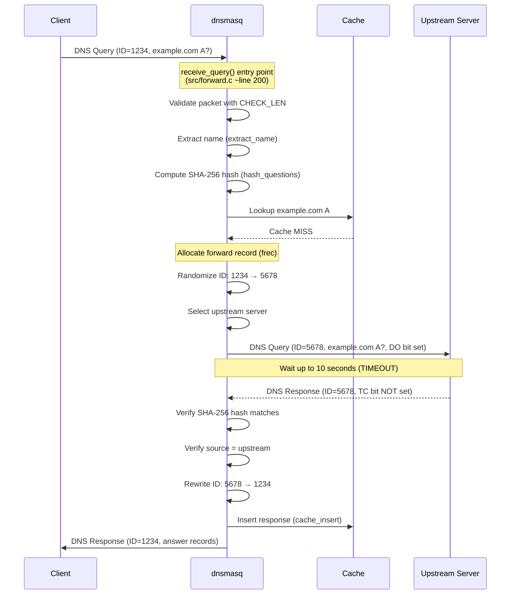
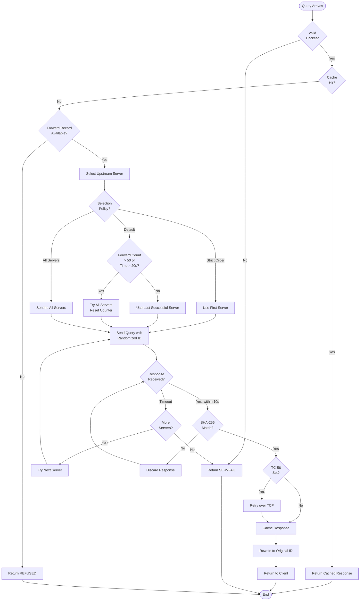

# DNS Forwarding Implementation

## Overview

This document provides comprehensive documentation of dnsmasq's DNS query forwarding subsystem, which implements RFC 1035-compliant DNS packet processing, intelligent upstream server selection, query retry logic with exponential backoff, EDNS0 extension support per RFC 6891, DNSSEC-awareness, and multiple cache poisoning prevention mechanisms. The forwarding engine is the core of dnsmasq's DNS proxy functionality, routing queries between clients and upstream recursive resolvers while maintaining transaction state, managing timeouts, and ensuring protocol compliance.

The DNS forwarding implementation spans multiple source files working together: **src/forward.c** (primary forwarding logic, ~2696 lines), **src/rfc1035.c** (RFC 1035 DNS packet format parsing and construction, ~2098 lines), **src/edns0.c** (EDNS0 extension handling, ~492 lines), and **src/hash-questions.c** (SHA-256 question hashing for anti-poisoning, ~156 lines). This modular architecture separates protocol-level packet manipulation from higher-level forwarding strategy and security mechanisms.

## Query Processing Pipeline

### Entry Point and Initial Processing

DNS query processing begins when a client UDP or TCP packet arrives on a listening socket. The main event loop in **src/dnsmasq.c** dispatches the packet to `receive_query()` in **src/forward.c** (lines 200-450), which serves as the central entry point for all incoming DNS queries.

The `receive_query()` function performs the following initial processing steps:

1. **Packet Validation**: Verifies packet length, checks DNS header format, and validates the question section using `extract_name()` from **src/rfc1035.c**. The `CHECK_LEN` macro is used throughout to prevent buffer overruns.

2. **Question Hashing**: Computes a SHA-256 hash of the question section via `hash_questions()` in **src/hash-questions.c** (lines 46-75). This hash serves multiple purposes:
   - Detects query retransmissions from the same client
   - Identifies responses matching forwarded queries
   - Prevents cache poisoning by verifying response questions match queries

3. **Source Address Tracking**: Records the client's source address (`union mysockaddr`), destination address, interface index, and UDP file descriptor. This information is stored in the `frec_src` structure within the forward record for later response routing.

4. **Cache Lookup Attempt**: Before forwarding, the query is checked against the local cache (documented in DNS_CACHING.md). Cache hits bypass upstream forwarding entirely, providing immediate responses with minimal latency.

### Forward Record Allocation

If the query is not answered from cache or local configuration, dnsmasq allocates a **forward record** (`struct frec`) to track the query's lifecycle. Forward records are managed via a freelist for efficiency, with a maximum of `FTABSIZ` (default 150, configurable, defined in **src/config.h** line 17) outstanding queries.

The `get_new_frec()` function in **src/forward.c** allocates forward records with the following state:

```c
forward->frec_src.source = *udpaddr;      // Client address
forward->frec_src.orig_id = ntohs(header->id);  // Original query ID
forward->frec_src.dest = *dst_addr;       // Destination address
forward->new_id = get_id();                // Randomized query ID
memcpy(forward->hash, hash, HASH_SIZE);   // SHA-256 question hash
forward->flags = fwd_flags;                // Query flags
```

**Transaction ID Randomization**: The original query ID from the client is replaced with a randomized ID generated by `get_id()` (using `rand16()` from **src/util.c**). This randomization is a critical anti-spoofing measure that prevents attackers from guessing transaction IDs. The original ID is preserved in `frec_src.orig_id` for response rewriting.

### Query Parsing and Name Extraction

DNS name extraction is handled by `extract_name()` in **src/rfc1035.c** (lines 19-110), which implements RFC 1035 Section 4.1.4 compressed name parsing. Key features include:

- **Compression Pointer Following**: Handles name compression where labels can be replaced by pointers to previous occurrences in the packet (label type 0xc0)
- **Loop Detection**: Limits pointer hops to 255 to prevent infinite loops in malformed packets
- **Length Validation**: Uses `CHECK_LEN` macro throughout to prevent reading beyond packet boundaries
- **Maximum Name Length**: Enforces `MAXDNAME` limit to prevent buffer overflows

## Upstream Server Selection Algorithm

### Server List Organization

Dnsmasq maintains an array of upstream DNS servers in `daemon->serverarray[]`, configured via command-line options or configuration file. Servers are organized by domain-specific rules, allowing different upstream resolvers for different query domains.

The `lookup_domain()` function in **src/forward.c** finds the range of applicable servers for a query domain, returning indices `first` and `last` that bound the server list segment. The "master" server is selected as `daemon->serverarray[first]`.

### Selection Policy Modes

Upstream server selection supports three operational modes controlled by configuration options:

#### Mode 1: Strict Order (--strict-order)

When `OPT_ORDER` is set, queries are sent to servers in the exact order listed in configuration. The first server in the applicable range is always tried first. No automatic failover or load distribution occurs.

**Implementation**: `start = first;` in **src/forward.c** (line 347)

#### Mode 2: Query Distribution with Health Tracking (default)

The default mode implements intelligent query distribution with server health monitoring. The master server tracks query statistics:

- `forwardcount`: Number of queries sent since last distribution round
- `forwardtime`: Timestamp of last distribution decision
- `last_server`: Index of server used for the previous query

**Distribution Logic** (src/forward.c lines 338-348):

```c
if (master->forwardcount++ > FORWARD_TEST ||
    difftime(now, master->forwardtime) > FORWARD_TIME ||
    master->last_server == -1)
{
    master->forwardtime = now;
    master->forwardcount = 0;
    forward->forwardall = 1;  // Try all servers
}
else
    start = master->last_server;  // Continue with last-used server
```

This implements **periodic server rotation**: after `FORWARD_TEST` (50 queries, **src/config.h** line 27) or `FORWARD_TIME` (20 seconds, **src/config.h** line 28), dnsmasq broadcasts the query to all applicable servers and selects the fastest responder. Between rotation periods, queries continue to the last successful server for efficiency.

**Health-Based Failover**: If a server consistently fails to respond within the timeout period (10 seconds, `TIMEOUT` in **src/config.h** line 26), it will be deprioritized during the next rotation cycle.

#### Mode 3: Broadcast All Servers (--all-servers)

When `OPT_ALL_SERVERS` is configured, every query is simultaneously sent to all applicable upstream servers. The first valid response received is returned to the client, and subsequent responses are discarded.

**Implementation**: `forward->forwardall = 1;` in **src/forward.c** (line 334)

This mode maximizes redundancy and minimizes latency but increases upstream query load proportionally to the number of configured servers.

### Server Iteration and Transmission

The `forward_query()` function (called within the main forwarding logic around line 350-600) iterates through selected servers and transmits queries:

1. **Server Selection**: Starts at `start` index (determined by policy above)
2. **Socket Binding**: Uses `send_from()` in **src/forward.c** (lines 34-104) to transmit UDP packets with source address control (critical for multi-homed systems)
3. **Retry Tracking**: Records `sentto` (upstream server) in the forward record for response matching
4. **Round-Robin Advancement**: Updates `master->last_server` for next query in default mode

## Query Retry and Timeout Logic

### Retry Mechanism

The `retry_send()` function (referenced throughout **src/forward.c**) implements automatic retry on transient send errors such as `EINTR` (interrupted system call) and `EAGAIN` (socket buffer full). This low-level retry is distinct from query-level timeout handling.

```c
while (retry_send(sendmsg(fd, &msg, 0)));
```

This pattern ensures UDP transmission completes despite temporary kernel-level errors without requiring application-level query retransmission.

### Timeout Handling and Exponential Backoff

Queries that do not receive responses within the timeout period trigger retry logic:

**Timeout Duration**: `TIMEOUT` = 10 seconds (src/config.h line 26)

**Retry Process**:
1. After 10 seconds with no response, the forward record remains active but marked as timed out
2. If `forward->forwardall` is not set and additional servers are available, the query is retransmitted to the next server in the list
3. This continues through all applicable servers until one responds or all have been exhausted
4. If all servers fail, dnsmasq returns `SERVFAIL` to the client

**Exponential Backoff**: Implicit in the design—initial query uses the preferred server (low latency), timeout triggers failover to secondary servers (higher latency acceptable), and rotation period enforcement prevents excessive retry storms.

### Query Deduplication

If identical queries (same question hash) arrive from multiple clients while a forward is outstanding, dnsmasq implements **query coalescing**:

- **Lookup**: `lookup_frec_by_query()` in **src/forward.c** (line 212) finds existing forward records by question hash
- **Source List**: Multiple client sources are linked in `forward->frec_src` chain
- **Single Upstream Query**: Only one query is sent upstream regardless of client count
- **Broadcast Response**: When the response arrives, it is replicated to all waiting clients with appropriate ID rewriting

**Duplicate Detection Window** (src/forward.c lines 264-265): Identical queries within 2 seconds are assumed to be retransmissions and are held without re-forwarding to prevent upstream query amplification.

## EDNS0 Extension Handling

### EDNS0 Overview

EDNS0 (Extension Mechanisms for DNS) is defined in RFC 6891 and provides a backward-compatible method to extend DNS packet size beyond the 512-byte UDP limit and add metadata to queries and responses. EDNS0 uses a pseudo-resource record (type `T_OPT`) in the additional section.

### OPT Record Detection and Processing

The `find_pseudoheader()` function in **src/edns0.c** (lines 19-96) scans the additional section of DNS packets to locate OPT records:

```c
for (i = 0; i < arcount; i++) {
    GETSHORT(type, ansp);
    if (type == T_OPT) {
        // OPT record found, extract UDP size from class field
        ret = start;
    }
}
```

**Key OPT Record Fields**:
- **Class Field**: Repurposed as requester's UDP payload size (e.g., 4096 bytes)
- **TTL Field**: Extended RCODE and flags (including DO bit for DNSSEC)
- **RDATA**: Variable-length options (client subnet, MAC address, etc.)

### UDP Payload Size Negotiation

EDNS0 allows clients to advertise their maximum acceptable UDP response size, enabling responses larger than the classic 512-byte limit.

**Default dnsmasq Behavior**:
- **Advertised Size**: `EDNS_PKTSZ` = 4096 bytes (src/config.h line 22)
- **Safe Minimum**: `SAFE_PKTSZ` = 1232 bytes (src/config.h line 23) used as fallback if larger sizes cause fragmentation issues
- **Dynamic Adjustment**: dnsmasq can reduce advertised size if upstream servers or network paths exhibit fragmentation problems

The `add_pseudoheader()` function in **src/edns0.c** (line 100+) adds or modifies OPT records in outgoing queries, adjusting the UDP size field to match dnsmasq's capabilities or configured limits.

### Client Subnet Extension (RFC 7871)

The EDNS Client Subnet (ECS) extension allows authoritative servers to provide geographically optimized responses based on the client's network prefix rather than the recursive resolver's address.

**Implementation in dnsmasq** (**src/edns0.c**):
- ECS data from client queries can be preserved and forwarded upstream (option code 8)
- dnsmasq can add ECS information based on the client's source address if configured with `--add-subnet`
- Response caching accounts for ECS to prevent serving geographically inappropriate cached responses

### MAC Address Extension (Apple-Specific)

Apple devices may include a MAC address extension in EDNS0 for network diagnostics and captive portal detection. Dnsmasq recognizes and can forward this extension (option code 65001) without interpretation.

### EDNS0 Stripping and Forwarding

**Forwarding Behavior**:
- If the original client query includes an OPT record, dnsmasq preserves or modifies it when forwarding to upstream servers
- If the client did not send EDNS0 but dnsmasq needs DNSSEC records (DO bit), dnsmasq adds an OPT record upstream
- Response OPT records are filtered and adjusted before returning to clients based on the client's original capabilities

## DNSSEC DO Bit Propagation

### DNSSEC Awareness in Forwarding

When dnsmasq is compiled with `HAVE_DNSSEC` support (enabled by default in most builds), the forwarding engine becomes DNSSEC-aware, setting the **DO (DNSSEC OK)** bit in upstream queries to request DNSSEC records.

### DO Bit Setting Logic

The DO bit is encoded in the OPT pseudo-record's TTL field (bit 15 of the extended flags).

**Conditions for Setting DO Bit** (src/forward.c lines 326-328):

```c
#ifdef HAVE_DNSSEC
forward->work_counter = DNSSEC_WORK;
if (do_bit)
    forward->flags |= FREC_DO_QUESTION;
#endif
```

**Triggers**:
1. **Client Request**: If the client's query includes the DO bit, dnsmasq propagates it upstream
2. **Validation Requirement**: If dnsmasq is configured to perform DNSSEC validation (`--dnssec`), it sets the DO bit on all upstream queries regardless of client request
3. **Dependent Queries**: DNSSEC validation may require additional queries (DNSKEY, DS records), which automatically include the DO bit

### DNSSEC Work Limit

To prevent DNSSEC validation from consuming excessive resources, dnsmasq enforces `DNSSEC_WORK` = 50 maximum validation queries per original query (**src/config.h** line 25). The `forward->work_counter` tracks remaining query budget. If exhausted, validation fails with `SERVFAIL`.

### Integration with Validation Pipeline

Setting `FREC_DO_QUESTION` flag in the forward record signals to `reply_query()` (the response handler in **src/forward.c** around lines 1000-1200) that DNSSEC records are expected. The response is passed to the DNSSEC validation subsystem (**src/dnssec.c**, documented in DNSSEC.md) before being returned to the client.

## Cache Poisoning Prevention Mechanisms

Dnsmasq implements multiple layers of defense against DNS cache poisoning attacks, which attempt to inject false records into the cache by spoofing responses.

### Layer 1: Transaction ID Randomization

**Implementation**: `get_id()` function generates cryptographically random 16-bit transaction IDs using `rand16()` from **src/util.c**, which uses `/dev/urandom` as entropy source.

**Attack Mitigation**: Attackers must guess both the transaction ID and source port to successfully spoof a response. With 16 random bits, the attacker has a 1-in-65,536 chance per guess.

**ID Rewriting**: Original client IDs are stored in `frec_src.orig_id`, and randomized IDs are used for upstream queries. Responses are rewritten with original IDs before returning to clients.

### Layer 2: Source Port Randomization

UDP source port randomization increases the entropy an attacker must guess.

**Kernel-Level Randomization**: Modern Linux kernels automatically randomize ephemeral source ports when binding to port 0. Dnsmasq leverages this by not explicitly binding to fixed ports for outgoing queries.

**Combined Entropy**: 16-bit ID + ~16-bit port = ~32 bits of entropy, raising attack difficulty to 1 in ~4 billion per guess.

### Layer 3: Question Section Hashing (SHA-256)

The most robust anti-poisoning mechanism is the SHA-256 hash of the question section computed by `hash_questions()` in **src/hash-questions.c** (lines 46-75).

**Hash Computation Process**:
1. Initialize SHA-256 context
2. For each question in the question section:
   - Extract the domain name using `extract_name()`
   - Normalize to lowercase (src/hash-questions.c lines 60-62)
   - Hash the name bytes
   - Hash the query type and class (4 bytes)
3. Finalize and return 32-byte digest

**Verification on Response**:
When a response arrives, `reply_query()` in **src/forward.c** recomputes the question hash from the response packet and compares it to `forward->hash`. Only responses with matching hashes are accepted. This prevents attackers from successfully spoofing responses even if they guess the transaction ID and port, as they cannot control the question section in the response without detection.

**Hash Storage**: The 32-byte SHA-256 digest is stored in `forward->hash` (size `HASH_SIZE`), requiring 256 bits of attacker guessing (computationally infeasible).

### Layer 4: Strict Response Matching

Additional response validation checks in `reply_query()`:
- **Source Address**: Response must come from the upstream server the query was sent to (`forward->sentto`)
- **File Descriptor**: Response must arrive on the same socket used for the query
- **Query ID**: Response ID must match the randomized ID sent upstream
- **Question Match**: SHA-256 hash must match (as described above)

Responses failing any of these checks are silently discarded.

## TCP Fallback Mechanism

### Truncation Detection

DNS responses exceeding the UDP payload size (typically 512 bytes for non-EDNS0, or negotiated EDNS0 size) are truncated by the upstream server, which sets the **TC (Truncation) bit** in the DNS header flags.

**TC Bit Check** (DNS header byte 2, bit 1):
```c
if (header->hb3 & HB3_TC)  // Truncation bit set
```

### Automatic TCP Retry

When dnsmasq receives a truncated response from an upstream server, it automatically retries the query over TCP without client intervention.

**TCP Connection Establishment** (**src/forward.c** TCP handling):
1. Open TCP connection to upstream server (port 53)
2. Send 2-byte length prefix followed by DNS query packet (RFC 1035 Section 4.2.2)
3. Read 2-byte length prefix followed by response
4. Close TCP connection (or reuse if pipelined)

**Response Delivery**: The complete TCP response is then returned to the client over the original UDP socket (or TCP if client used TCP), with appropriate length adjustments.

### TCP Query Limits

To prevent resource exhaustion from excessive TCP connections:
- **Maximum Child Processes**: `MAX_PROCS` = 20 concurrent TCP handlers (src/config.h line 18)
- **Connection Timeout**: `CHILD_LIFETIME` = 150 seconds per TCP connection (src/config.h line 19)
- **Queries Per Connection**: `TCP_MAX_QUERIES` = 100 queries per TCP connection (src/config.h line 20)

Exceeding these limits triggers connection closure and `SERVFAIL` responses.

## RFC 1035 Compliance Matrix

### Packet Format Handling

| RFC 1035 Section | Description | Implementation | Source Reference |
|------------------|-------------|----------------|-------------------|
| 4.1.1 | DNS Header Format | 12-byte header with ID, flags, counts | src/rfc1035.c `struct dns_header` |
| 4.1.2 | Question Section | QNAME, QTYPE, QCLASS encoding | src/rfc1035.c `extract_name()` lines 19-110 |
| 4.1.3 | Resource Record Format | NAME, TYPE, CLASS, TTL, RDLENGTH, RDATA | src/rfc1035.c answer parsing ~lines 500-800 |
| 4.1.4 | Message Compression | Pointer labels (0xc0) with offset | src/rfc1035.c `extract_name()` lines 62-78 |
| 4.2.1 | UDP Usage | 512-byte limit, EDNS0 extensions | src/forward.c with EDNS_PKTSZ |
| 4.2.2 | TCP Usage | 2-byte length prefix | src/forward.c TCP handling |
| 7.1 | Standard Queries | OPCODE=0 (QUERY) | src/forward.c `receive_query()` |
| 7.2 | Inverse Queries | OPCODE=1 (deprecated, not supported) | N/A |
| 7.3 | Status Queries | OPCODE=2 (deprecated, not supported) | N/A |

### DNS Header Structure (ASCII Art)

```
DNS Header Format (12 bytes):

  0  1  2  3  4  5  6  7  8  9 10 11 12 13 14 15
+--+--+--+--+--+--+--+--+--+--+--+--+--+--+--+--+
|                      ID                       |  Bytes 0-1: Transaction ID
+--+--+--+--+--+--+--+--+--+--+--+--+--+--+--+--+
|QR|  Opcode   |AA|TC|RD|RA| Z|AD|CD|  RCODE    |  Bytes 2-3: Flags
+--+--+--+--+--+--+--+--+--+--+--+--+--+--+--+--+
|                    QDCOUNT                    |  Bytes 4-5: Question count
+--+--+--+--+--+--+--+--+--+--+--+--+--+--+--+--+
|                    ANCOUNT                    |  Bytes 6-7: Answer count
+--+--+--+--+--+--+--+--+--+--+--+--+--+--+--+--+
|                    NSCOUNT                    |  Bytes 8-9: Authority count
+--+--+--+--+--+--+--+--+--+--+--+--+--+--+--+--+
|                    ARCOUNT                    |  Bytes 10-11: Additional count
+--+--+--+--+--+--+--+--+--+--+--+--+--+--+--+--+

Flags:
  QR: Query (0) or Response (1)
  Opcode: 0=QUERY, 1=IQUERY, 2=STATUS
  AA: Authoritative Answer
  TC: Truncation (response too large for UDP)
  RD: Recursion Desired
  RA: Recursion Available
  Z: Reserved (must be 0)
  AD: Authenticated Data (DNSSEC)
  CD: Checking Disabled (DNSSEC)
  RCODE: Response code (0=NOERROR, 2=SERVFAIL, 3=NXDOMAIN, etc.)
```

### Compressed Name Parsing

**RFC 1035 Section 4.1.4** defines name compression using pointer labels (two-octet sequence with top two bits = 11, remaining 14 bits = offset from start of DNS message).

**Implementation** (src/rfc1035.c lines 62-78):
- Detects compression pointers by checking `(label_type == 0xc0)`
- Extracts 14-bit offset: `l = (l&0x3f) << 8; l |= *p++;`
- Jumps to offset: `p = l + (unsigned char *)header;`
- Limits hops to 255 to prevent infinite loops
- Preserves first jump position (`p1`) to resume after name extraction

## Complete Query Processing Flow Diagram



## Query Retry Flowchart



## Performance Considerations

### Query Coalescing Benefits

When multiple clients simultaneously query the same domain, dnsmasq's query coalescing (deduplication) provides significant efficiency gains:

- **Reduced Upstream Load**: Only one upstream query regardless of client count
- **Lower Latency for Subsequent Clients**: Waiting clients receive responses immediately when the single upstream response arrives
- **Network Bandwidth Savings**: Eliminates redundant queries during the coalescing window (2 seconds)

### Forward Record Table Sizing

The `FTABSIZ` constant (default 150) limits concurrent outstanding queries. Appropriate sizing considerations:

- **Too Small**: Queries blocked during high load, `query_full()` returns REFUSED
- **Too Large**: Increased memory consumption (each frec ~100-200 bytes)
- **Recommended**: Size for peak concurrent clients × average query depth (typically 1-2 for simple queries, 5-10 for DNSSEC validation)

### Server Selection Impact

**Default Policy** (health-based with periodic rotation):
- **Pros**: Balances load, provides automatic failover, optimizes for fastest server
- **Cons**: Periodic broadcast queries increase upstream load during rotation

**Strict Order**:
- **Pros**: Predictable behavior, minimal upstream load
- **Cons**: No automatic failover, ignores server performance

**All Servers**:
- **Pros**: Lowest latency (first response wins), maximum redundancy
- **Cons**: Highest upstream load (N× where N = server count)

### DNSSEC Overhead

Enabling DNSSEC validation adds latency and resource consumption:
- **Additional Queries**: Average 3-5 dependent queries (DNSKEY, DS) per validation
- **Cryptographic Validation**: RSA/ECDSA signature verification CPU cost
- **Work Limit**: `DNSSEC_WORK` = 50 prevents runaway validation chains

## Security Considerations

### Cryptographic Entropy Requirements

Cache poisoning prevention depends on high-quality random number generation. Dnsmasq uses `/dev/urandom` (RANDFILE in **src/config.h** line 51) as the entropy source for:
- Transaction ID generation (`rand16()`)
- Query ID rewriting
- Kernel-level source port randomization (implicit)

**Best Practice**: Ensure `/dev/urandom` has sufficient entropy on embedded systems or VMs, particularly at boot time.

### Source Address Spoofing

Dnsmasq validates that responses originate from the expected upstream server IP address. However, this protection assumes:
- Network infrastructure prevents IP spoofing (BCP 38 / RFC 2827)
- Upstream servers are trusted (compromised upstream can inject false responses)

**Mitigation**: Use DNSSEC validation (`--dnssec`) to cryptographically verify response authenticity independent of network trust.

### Query Amplification Attacks

Dnsmasq's query coalescing limits amplification potential, but attackers could still:
- Send many unique queries to exhaust forward record table
- Flood with spoofed source addresses to bypass coalescing

**Mitigation**: Configure rate limiting at the network level (iptables, nftables) to restrict query rates per source IP.

---

**Related Documentation:**
- [DNS Caching](DNS_CACHING.md) - Cache integration and lookup mechanisms
- [DNSSEC Validation](DNSSEC.md) - DNSSEC validation pipeline and DO bit handling
- [System Architecture](ARCHITECTURE.md) - Event loop and system overview
- [Configuration System](CONFIGURATION.md) - Upstream server configuration
- [Building dnsmasq](BUILDING.md) - Compilation options affecting forwarding

**Source File References:**
- **src/forward.c** (lines 1-2696) - Primary forwarding implementation
- **src/rfc1035.c** (lines 1-2098) - DNS packet format handling per RFC 1035
- **src/edns0.c** (lines 1-492) - EDNS0 extension processing per RFC 6891
- **src/hash-questions.c** (lines 1-156) - SHA-256 question hashing for anti-poisoning
- **src/config.h** (lines 17, 22-28) - Configuration constants (FTABSIZ, EDNS_PKTSZ, FORWARD_TEST, FORWARD_TIME, TIMEOUT, DNSSEC_WORK)

[Back to Documentation Index](README.md)
