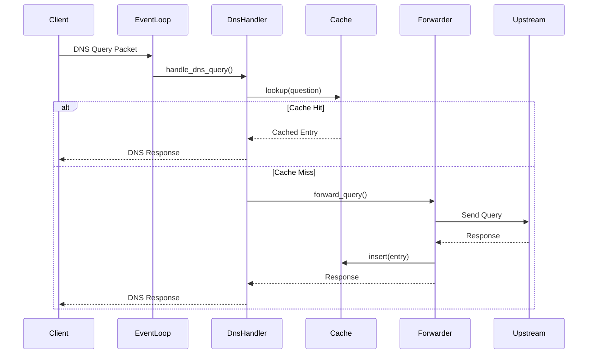

# dnsmasq Rust Implementation Architecture

## Table of Contents

- [System Overview](#system-overview)
- [Async Event-Driven Architecture](#async-event-driven-architecture)
- [Module Structure](#module-structure)
- [Ownership Patterns and Memory Safety](#ownership-patterns-and-memory-safety)
- [Trait-Based Abstractions](#trait-based-abstractions)
- [Data Structure Transformations](#data-structure-transformations)
- [Async I/O Patterns](#async-io-patterns)
- [Platform Abstraction Layer](#platform-abstraction-layer)
- [Subsystem Architecture](#subsystem-architecture)
- [Concurrency Model](#concurrency-model)
- [Error Handling](#error-handling)
- [Testing Architecture](#testing-architecture)
- [C to Rust Pattern Mapping](#c-to-rust-pattern-mapping)

---

## System Overview

The Rust implementation of dnsmasq represents a complete refactoring from C to Rust, transforming a single-threaded, poll()-based event loop into a modern async/await architecture powered by the tokio runtime. This refactoring maintains 100% functional equivalence with the C implementation while eliminating entire classes of memory safety vulnerabilities through Rust's ownership system and borrow checker.

**Architectural Transformation:**

| Aspect | C Implementation | Rust Implementation |
|--------|------------------|---------------------|
| **Concurrency Model** | Single-threaded with poll() | Async/await with tokio tasks |
| **Memory Management** | Manual malloc/free with freelists | Automatic via ownership system |
| **Error Handling** | errno + return codes | Result<T, E> types |
| **Type Safety** | C89/C99 manual type checking | Strong static typing with enums |
| **I/O Model** | Blocking with multiplexed poll() | Non-blocking async I/O |
| **Process Model** | fork() for TCP handlers | Lightweight tokio::spawn() tasks |
| **Signal Handling** | Self-pipe trick | tokio::signal integration |
| **State Management** | Global daemon pointer | Arc<RwLock<Daemon>> shared state |

**Core Design Principles:**

1. **Memory Safety First**: Zero unsafe code except at FFI boundaries for platform-specific system calls
2. **Functional Preservation**: Byte-for-byte network protocol compatibility with C implementation
3. **Performance Parity**: Comparable or better throughput with acceptable memory overhead
4. **Maintainability**: Explicit module boundaries and dependency injection for testability

**Cross-Reference to C Architecture**: See [docs/ARCHITECTURE.md](ARCHITECTURE.md) for the C implementation's single-process event-driven design that this Rust implementation functionally replaces.

---

## Async Event-Driven Architecture

### Tokio Runtime Foundation

The Rust implementation replaces the C version's poll()-based event loop (src/poll.c) with tokio's async runtime, providing a modern async/await programming model while maintaining the same event-driven architecture at the system level.

**Runtime Initialization** (src_rust/main.rs):

```rust
use tokio::runtime::Runtime;

fn main() -> Result<(), Box<dyn std::error::Error>> {
    // Create multi-threaded runtime for maximum throughput
    let runtime = Runtime::new()?;
    
    runtime.block_on(async {
        // Parse configuration
        let config = config::parse_args_and_files().await?;
        
        // Build daemon with dependency injection
        let daemon = core::DaemonBuilder::new()
            .with_config(config)
            .build()
            .await?;
        
        // Run main event loop
        daemon.run().await
    })
}
```

**C Comparison**: The C implementation's main() function (src/dnsmasq.c lines 40-1100) performs synchronous initialization then enters the poll() loop. The Rust version performs async initialization and enters the tokio event loop via `block_on()`.

### Async Event Loop with tokio::select!

The core event loop uses tokio::select! to multiplex multiple async operations, replacing the C version's poll() system call with safe, composable async primitives.

**Event Loop Structure** (src_rust/core/event_loop.rs):

```rust
use tokio::select;
use tokio::signal::unix::{signal, SignalKind};

pub async fn run_event_loop(daemon: Arc<RwLock<Daemon>>) -> Result<(), Error> {
    // Create signal handlers
    let mut sighup = signal(SignalKind::hangup())?;
    let mut sigterm = signal(SignalKind::terminate())?;
    let mut sigusr1 = signal(SignalKind::user_defined1())?;
    let mut sigusr2 = signal(SignalKind::user_defined2())?;
    
    loop {
        select! {
            // DNS UDP queries
            result = daemon.read().await.dns_socket.recv_from(&mut buf) => {
                handle_dns_query(daemon.clone(), result?).await?;
            }
            
            // DNS TCP connections
            result = daemon.read().await.dns_tcp_listener.accept() => {
                let (stream, addr) = result?;
                tokio::spawn(handle_tcp_dns(daemon.clone(), stream, addr));
            }
            
            // DHCPv4 packets
            result = daemon.read().await.dhcp_socket.recv_from(&mut buf) => {
                handle_dhcp_packet(daemon.clone(), result?).await?;
            }
            
            // DHCPv6 packets
            result = daemon.read().await.dhcp6_socket.recv_from(&mut buf) => {
                handle_dhcp6_packet(daemon.clone(), result?).await?;
            }
            
            // TFTP requests
            result = daemon.read().await.tftp_socket.recv_from(&mut buf) => {
                handle_tftp_request(daemon.clone(), result?).await?;
            }
            
            // Platform events (netlink/routing socket)
            result = daemon.read().await.platform.recv_event() => {
                handle_platform_event(daemon.clone(), result?).await?;
            }
            
            // Timer events
            _ = daemon.read().await.timer.tick() => {
                handle_timer_tick(daemon.clone()).await?;
            }
            
            // SIGHUP: Reload configuration
            _ = sighup.recv() => {
                reload_config(daemon.clone()).await?;
            }
            
            // SIGTERM: Graceful shutdown
            _ = sigterm.recv() => {
                shutdown_gracefully(daemon.clone()).await?;
                break;
            }
            
            // SIGUSR1: Dump statistics
            _ = sigusr1.recv() => {
                dump_statistics(daemon.clone()).await?;
            }
            
            // SIGUSR2: Reopen log files
            _ = sigusr2.recv() => {
                reopen_logs(daemon.clone()).await?;
            }
        }
    }
    
    Ok(())
}
```

**C Comparison**: This replaces the C implementation's event loop (src/dnsmasq.c lines 1050-1630) that:
1. Calls poll_reset() to clear FD list
2. Registers each socket with poll_listen()
3. Calls do_poll() to block on poll()
4. Checks each FD with poll_check()
5. Dispatches to handlers

The Rust version achieves the same multiplexing with better composability and safety—each branch compiles independently, and borrow checker prevents data races.

### Signal Handling with tokio::signal

**C Self-Pipe Pattern vs. Rust tokio::signal:**

The C implementation (src/dnsmasq.c lines 1289-1377) uses the "self-pipe trick" to convert asynchronous signals into synchronous events:

1. Signal handler writes event to pipe (async-signal-safe)
2. Main loop polls pipe read end
3. Event read triggers handler in safe context

The Rust implementation uses tokio::signal which provides async signal streams that integrate directly into the event loop, eliminating the need for manual pipe management:

```rust
// C: Manual self-pipe setup
int pipefd[2];
pipe2(pipefd, O_NONBLOCK | O_CLOEXEC);
signal(SIGHUP, sig_handler);  // Handler writes to pipefd[1]

// Rust: Tokio signal stream
let mut sighup = tokio::signal::unix::signal(SignalKind::hangup())?;
// Use directly in select!: _ = sighup.recv() => { ... }
```

**Memory Safety Benefit**: The tokio::signal implementation eliminates manual pipe FD management and ensures signal handlers can't corrupt shared state—all signal-triggered code runs in safe async context.

### Task Spawning Replaces fork()

The C implementation uses fork() to handle TCP DNS connections (src/network.c), creating separate processes that communicate back to the parent via pipes. The Rust implementation uses lightweight tokio tasks:

**C fork() Pattern**:
```c
// src/network.c: TCP connection handling
if ((confd = accept(listener, NULL, NULL)) == -1)
    return;
    
if (daemon->max_logs != 0 && (pid = fork()) != 0) {
    close(confd);
    return;  // Parent continues
}

// Child process handles connection
tcp_request(confd, now, ...);
exit(0);
```

**Rust Task Pattern**:
```rust
// src_rust/dns/tcp_handler.rs
let (stream, addr) = tcp_listener.accept().await?;

// Spawn lightweight task (not OS process)
tokio::spawn(async move {
    handle_tcp_connection(stream, addr, daemon.clone()).await
        .unwrap_or_else(|e| error!("TCP handler error: {}", e));
});

// Main task continues immediately
```

**Performance Benefit**: Tokio tasks are ~100x cheaper than fork() (microseconds vs milliseconds), use less memory (KB vs MB per task), and share memory safely through Arc instead of requiring IPC.

### Timer Management with tokio::time

The C implementation uses SIGALRM for timer events (src/dnsmasq.c lines 1339-1349, 1500-1513), scheduling alarms via alarm() system call and handling them through the self-pipe. The Rust implementation uses tokio::time intervals:

```rust
use tokio::time::{interval, Duration};

// Lease expiry timer (every 10 seconds)
let mut lease_timer = interval(Duration::from_secs(10));

// Router Advertisement timer (periodic)
let mut ra_timer = interval(Duration::from_secs(daemon.ra_interval));

loop {
    select! {
        _ = lease_timer.tick() => {
            prune_expired_leases(&mut daemon.write().await.leases).await?;
            persist_lease_database(&daemon.read().await).await?;
        }
        
        _ = ra_timer.tick() => {
            send_router_advertisements(&daemon.read().await).await?;
        }
        
        // ... other events
    }
}
```

**C Comparison**: The C version maintains a single alarm() timer that must be rescheduled after each firing. The Rust version supports multiple concurrent timers with precise durations, no manual rescheduling, and no signal handling complexity.

### Async Socket Operations

All network I/O uses tokio's async socket primitives, providing non-blocking operations with automatic readiness notification:

```rust
use tokio::net::UdpSocket;

// Create and bind socket
let dns_socket = UdpSocket::bind("0.0.0.0:53").await?;

// Receive with async/await (no blocking)
let (len, addr) = dns_socket.recv_from(&mut buf).await?;

// Send response asynchronously
dns_socket.send_to(&response, &addr).await?;
```

**C Comparison**: The C implementation (src/network.c) uses blocking socket calls within the poll() loop—sockets are set to non-blocking mode, and EAGAIN/EWOULDBLOCK errors trigger re-registration with poll(). The Rust version handles this complexity internally within tokio, presenting a simple async API.

---

## Module Structure

The Rust implementation organizes functionality into explicit modules with clear boundaries, replacing the C version's file-based organization with Rust's hierarchical module system. All source code resides in `src_rust/` directory.

### Core Module (src_rust/core/)

**Purpose**: Daemon lifecycle, event loop, signal handling, and core types.

**Key Files**:
- `daemon.rs`: Main Daemon struct (replaces C's global `struct daemon`)
- `event_loop.rs`: Async event loop (replaces src/poll.c)
- `signals.rs`: Signal handling setup
- `config.rs`: Compile-time configuration constants (from src/config.h)

**Daemon Struct Definition**:
```rust
pub struct Daemon {
    // Configuration
    pub config: Config,
    
    // Network sockets
    pub dns_socket: Arc<UdpSocket>,
    pub dns_tcp_listener: Arc<TcpListener>,
    pub dhcp_socket: Option<Arc<UdpSocket>>,
    pub dhcp6_socket: Option<Arc<UdpSocket>>,
    pub tftp_socket: Option<Arc<UdpSocket>>,
    
    // Service components (dependency injection)
    pub dns_cache: Arc<RwLock<DnsCache>>,
    pub dns_forwarder: Arc<DnsForwarder>,
    pub dhcp_server: Option<Arc<RwLock<DhcpServer>>>,
    pub dhcp6_server: Option<Arc<RwLock<Dhcp6Server>>>,
    pub tftp_server: Option<Arc<TftpServer>>,
    
    // Platform abstraction
    pub platform: Box<dyn Platform + Send + Sync>,
    
    // Logging
    pub logger: Arc<Logger>,
}
```

**C Comparison**: The C version uses a single global `struct daemon *daemon` pointer (src/dnsmasq.h lines 1099-1400) accessible from all modules. The Rust version wraps Daemon in `Arc<RwLock<Daemon>>` and passes it explicitly to functions, eliminating global mutable state.

### DNS Module (src_rust/dns/)

**Purpose**: DNS forwarding, caching, parsing, serialization, and DNSSEC validation.

**Module Hierarchy**:

```
dns/
├── mod.rs              # Module exports, public API
├── protocol.rs         # DNS protocol constants (from src/dns-protocol.h)
├── parser.rs           # Packet parsing with nom (from src/rfc1035.c)
├── serializer.rs       # Packet serialization (from src/rfc1035.c)
├── compression.rs      # Name compression/decompression (from src/rfc1035.c)
├── cache.rs            # DNS cache implementation (from src/cache.c)
├── cache_types.rs      # Cache record types
├── forwarder.rs        # Query forwarding logic (from src/forward.c)
├── upstream.rs         # Upstream server selection
├── edns0.rs            # EDNS0 option handling (from src/edns0.c)
├── domain.rs           # Domain name utilities (from src/domain.c)
├── pattern.rs          # Pattern matching (from src/domain-match.c)
├── hash.rs             # Question hashing (from src/hash-questions.c)
├── rrfilter.rs         # RR filtering (from src/rrfilter.c)
├── auth.rs             # Authoritative DNS (from src/auth.c)
├── blockdata.rs        # Block-chained storage (from src/blockdata.c)
└── dnssec/             # DNSSEC subsystem
    ├── mod.rs          # DNSSEC exports
    ├── validator.rs    # Validation logic (from src/dnssec.c)
    ├── crypto.rs       # Cryptographic operations (from src/crypto.c)
    ├── trust_anchor.rs # Trust anchor management
    └── types.rs        # DNSSEC-specific types
```

**Key Type: DnsCache**:
```rust
use std::collections::HashMap;
use std::collections::VecDeque;

pub struct DnsCache {
    // Hash table for O(1) lookup (replaces C's manual hash table)
    entries: HashMap<DnsQuestion, Arc<CacheEntry>>,
    
    // LRU queue for eviction (replaces C's doubly-linked list)
    lru_queue: VecDeque<DnsQuestion>,
    
    // Statistics
    hits: AtomicU64,
    misses: AtomicU64,
    insertions: AtomicU64,
    evictions: AtomicU64,
    
    // Configuration
    max_size: usize,
    min_ttl: u32,
    max_ttl: u32,
}

impl DnsCache {
    pub fn lookup(&self, question: &DnsQuestion) -> Option<Arc<CacheEntry>> {
        self.entries.get(question).cloned()
    }
    
    pub fn insert(&mut self, question: DnsQuestion, entry: CacheEntry) {
        // Evict if at capacity
        if self.entries.len() >= self.max_size {
            if let Some(oldest) = self.lru_queue.pop_front() {
                self.entries.remove(&oldest);
                self.evictions.fetch_add(1, Ordering::Relaxed);
            }
        }
        
        self.entries.insert(question.clone(), Arc::new(entry));
        self.lru_queue.push_back(question);
        self.insertions.fetch_add(1, Ordering::Relaxed);
    }
}
```

**C Comparison**: The C version (src/cache.c) implements a manual hash table with chaining and a separate doubly-linked LRU list requiring careful pointer manipulation. The Rust version uses HashMap + VecDeque, eliminating manual memory management and pointer errors.

### DHCP Module (src_rust/dhcp/)

**Purpose**: DHCPv4 and DHCPv6 server implementations with lease management.

**Module Hierarchy**:
```
dhcp/
├── mod.rs              # DHCP module exports
├── common.rs           # Shared DHCP utilities (from src/dhcp-common.c)
├── lease.rs            # Lease management (from src/lease.c)
├── v4/                 # DHCPv4 implementation
│   ├── mod.rs          # DHCPv4 exports
│   ├── protocol.rs     # Constants (from src/dhcp-protocol.h)
│   ├── server.rs       # DHCPv4 server (from src/dhcp.c)
│   ├── handler.rs      # State machine (from src/rfc2131.c)
│   ├── options.rs      # Option parsing/building
│   └── ping.rs         # Ping-before-offer
└── v6/                 # DHCPv6 implementation
    ├── mod.rs          # DHCPv6 exports
    ├── protocol.rs     # Constants (from src/dhcp6-protocol.h)
    ├── server.rs       # DHCPv6 server (from src/dhcp6.c)
    ├── handler.rs      # Message processing (from src/rfc3315.c)
    ├── options.rs      # Option assembly (from src/outpacket.c)
    ├── ia.rs           # IA_NA/IA_TA/IA_PD handling
    └── duid.rs         # DUID generation
```

**Key Type: LeaseManager**:
```rust
use std::collections::HashMap;
use std::net::IpAddr;
use tokio::fs::File;
use tokio::io::AsyncWriteExt;

pub struct LeaseManager {
    // Active leases indexed by IP
    leases: HashMap<IpAddr, Lease>,
    
    // Reverse index: MAC -> IP
    mac_to_ip: HashMap<MacAddr, IpAddr>,
    
    // Lease file path for persistence
    lease_file: PathBuf,
    
    // Configuration
    default_lease_time: Duration,
    max_lease_time: Duration,
}

impl LeaseManager {
    pub async fn allocate_lease(
        &mut self,
        mac: MacAddr,
        requested_ip: Option<IpAddr>,
    ) -> Result<Lease, DhcpError> {
        // Check for existing lease
        if let Some(ip) = self.mac_to_ip.get(&mac) {
            if let Some(lease) = self.leases.get_mut(ip) {
                lease.renew()?;
                return Ok(lease.clone());
            }
        }
        
        // Allocate new lease
        let ip = self.find_available_ip(requested_ip)?;
        let lease = Lease::new(ip, mac, self.default_lease_time);
        
        self.leases.insert(ip, lease.clone());
        self.mac_to_ip.insert(mac, ip);
        
        Ok(lease)
    }
    
    pub async fn persist(&self) -> Result<(), io::Error> {
        // Atomic write-rename pattern (same as C)
        let temp_file = self.lease_file.with_extension("tmp");
        let mut file = File::create(&temp_file).await?;
        
        for lease in self.leases.values() {
            file.write_all(lease.serialize().as_bytes()).await?;
        }
        
        file.sync_all().await?;
        drop(file);
        
        tokio::fs::rename(&temp_file, &self.lease_file).await?;
        Ok(())
    }
}
```

**C Comparison**: The C version (src/lease.c) maintains a linked list of leases and uses blocking file I/O with fsync(). The Rust version uses HashMap for O(1) lookups and tokio::fs for async I/O, but preserves the atomic write-rename pattern for durability.

### IPv6 Module (src_rust/ipv6/)

**Purpose**: Router Advertisement and SLAAC support.

**Module Hierarchy**:
```
ipv6/
├── mod.rs              # IPv6 module exports
├── radv/               # Router Advertisement
│   ├── mod.rs          # RA exports
│   ├── protocol.rs     # Constants (from src/radv-protocol.h)
│   ├── server.rs       # RA server (from src/radv.c)
│   └── options.rs      # RA option building
├── slaac.rs            # SLAAC/DAD coordination (from src/slaac.c)
└── addr.rs             # IPv6 utilities (from src/ip6addr.h)
```

### Network Module (src_rust/network/)

**Purpose**: Socket management, interface enumeration, platform-specific networking.

**Module Hierarchy**:
```
network/
├── mod.rs              # Network module exports
├── sockets.rs          # Socket management (from src/network.c)
├── interfaces.rs       # Interface enumeration
├── loop_detect.rs      # Loop detection (from src/loop.c)
├── arp.rs              # ARP handling (from src/arp.c)
└── platform/           # Platform-specific implementations
    ├── mod.rs          # Platform selection (conditional compilation)
    ├── linux.rs        # Linux netlink (from src/netlink.c)
    ├── bsd.rs          # BSD routing sockets (from src/bpf.c)
    └── solaris.rs      # Solaris ioctl fallback
```

**Platform Trait**:
```rust
#[async_trait]
pub trait Platform: Send + Sync {
    /// Enumerate network interfaces
    async fn enumerate_interfaces(&self) -> Result<Vec<Interface>, PlatformError>;
    
    /// Monitor interface/address changes
    async fn monitor_changes(&mut self) -> Result<PlatformEvent, PlatformError>;
    
    /// Get interface by index
    async fn get_interface(&self, index: u32) -> Result<Interface, PlatformError>;
}

// Linux implementation using netlink
#[cfg(target_os = "linux")]
pub struct LinuxPlatform {
    netlink_socket: NetlinkSocket,
}

// BSD implementation using routing sockets
#[cfg(any(target_os = "freebsd", target_os = "openbsd", target_os = "netbsd"))]
pub struct BsdPlatform {
    routing_socket: RoutingSocket,
}
```

**C Comparison**: The C version uses conditional compilation with #ifdef (src/netlink.c for Linux, src/bpf.c for BSD). The Rust version uses traits for polymorphism with compile-time selection via #[cfg], providing better type safety and testability.

### Services Module (src_rust/services/)

**Purpose**: TFTP server implementation.

**Files**:
- `tftp.rs`: Complete TFTP server (from src/tftp.c)

```rust
pub struct TftpServer {
    socket: Arc<UdpSocket>,
    root_dir: PathBuf,
    transfers: RwLock<HashMap<SocketAddr, TftpTransfer>>,
}

impl TftpServer {
    pub async fn handle_request(
        &self,
        data: &[u8],
        addr: SocketAddr,
    ) -> Result<(), TftpError> {
        let request = TftpPacket::parse(data)?;
        
        match request {
            TftpPacket::ReadRequest { filename, mode } => {
                self.handle_read_request(filename, mode, addr).await
            }
            TftpPacket::WriteRequest { filename, mode } => {
                self.handle_write_request(filename, mode, addr).await
            }
            TftpPacket::Data { block, data } => {
                self.handle_data_packet(block, data, addr).await
            }
            TftpPacket::Ack { block } => {
                self.handle_ack_packet(block, addr).await
            }
            TftpPacket::Error { code, message } => {
                self.handle_error_packet(code, message, addr).await
            }
        }
    }
}
```

### Integration Module (src_rust/integration/)

**Purpose**: External system integrations (D-Bus, ubus, conntrack, ipset, nftables, PF tables, inotify).

**Module Hierarchy**:
```
integration/
├── mod.rs              # Integration module exports
├── dbus.rs             # D-Bus interface (from src/dbus.c)
├── ubus.rs             # ubus interface (from src/ubus.c)
├── conntrack.rs        # Connection tracking (from src/conntrack.c)
├── ipset.rs            # ipset integration (from src/ipset.c)
├── nftset.rs           # nftables (from src/nftset.c)
├── pf_tables.rs        # PF tables (from src/tables.c)
└── inotify.rs          # inotify watcher (from src/inotify.c)
```

**D-Bus Integration Example**:
```rust
use zbus::{dbus_interface, ConnectionBuilder};

pub struct DnsmasqDbusInterface {
    daemon: Arc<RwLock<Daemon>>,
}

#[dbus_interface(name = "uk.org.thekelleys.dnsmasq")]
impl DnsmasqDbusInterface {
    /// Get version
    async fn get_version(&self) -> String {
        env!("CARGO_PKG_VERSION").to_string()
    }
    
    /// Clear DNS cache
    async fn clear_cache(&self) -> Result<(), zbus::fdo::Error> {
        self.daemon.write().await.dns_cache.write().await.clear();
        Ok(())
    }
    
    /// Get cache statistics
    async fn get_cache_stats(&self) -> (u64, u64, u64) {
        let cache = self.daemon.read().await.dns_cache.read().await;
        (cache.hits(), cache.misses(), cache.size())
    }
}
```

**C Comparison**: The C version (src/dbus.c) uses libdbus-1 with manual message parsing. The Rust version uses zbus with procedural macros for automatic serialization, eliminating manual marshaling code.

### Config Module (src_rust/config/)

**Purpose**: Configuration file parsing, CLI argument parsing, validation.

**Module Hierarchy**:
```
config/
├── mod.rs              # Config module exports
├── parser.rs           # Config file parser (from src/option.c)
├── cli.rs              # CLI argument parsing (from src/option.c)
├── validator.rs        # Config validation logic
├── defaults.rs         # Default configuration values
└── types.rs            # Config data structures
```

**Configuration Structure with serde**:
```rust
use serde::{Deserialize, Serialize};
use clap::Parser;

#[derive(Debug, Clone, Serialize, Deserialize)]
pub struct Config {
    // DNS settings
    pub port: u16,
    pub domain_suffix: Option<String>,
    pub upstream_servers: Vec<SocketAddr>,
    pub cache_size: usize,
    pub min_ttl: u32,
    pub max_ttl: u32,
    pub no_negcache: bool,
    
    // DHCP settings
    pub dhcp_ranges: Vec<DhcpRange>,
    pub dhcp_options: Vec<DhcpOption>,
    pub lease_file: PathBuf,
    pub default_lease_time: Duration,
    
    // Feature flags
    pub enable_dnssec: bool,
    pub enable_tftp: bool,
    pub enable_ra: bool,
    
    // Logging
    pub log_level: LogLevel,
    pub log_queries: bool,
    pub log_dhcp: bool,
}

#[derive(Parser, Debug)]
#[clap(author, version, about)]
pub struct CliArgs {
    /// Configuration file path
    #[clap(short = 'C', long, value_name = "FILE")]
    pub conf_file: Option<PathBuf>,
    
    /// DNS port
    #[clap(short = 'p', long, default_value = "53")]
    pub port: u16,
    
    /// Cache size
    #[clap(short = 'c', long, default_value = "150")]
    pub cache_size: usize,
    
    /// Run in foreground
    #[clap(short = 'd', long)]
    pub no_daemon: bool,
    
    /// Test configuration and exit
    #[clap(long)]
    pub test: bool,
}
```

**C Comparison**: The C version (src/option.c, 4000 lines) implements manual parsing of command-line arguments and configuration files. The Rust version uses clap derive macros for CLI parsing and a custom parser for backward-compatible config file syntax.

### Process Module (src_rust/process/)

**Purpose**: Process management, privilege dropping, PID file handling, helper process spawning.

**Files**:
- `helper.rs`: Helper process management (from src/helper.c)
- `privileges.rs`: Privilege dropping with nix::unistd
- `pidfile.rs`: PID file creation and locking

```rust
use nix::unistd::{setuid, setgid, User, Group};

pub async fn drop_privileges(user: &str) -> Result<(), ProcessError> {
    // Look up user
    let user = User::from_name(user)?
        .ok_or_else(|| ProcessError::UserNotFound(user.to_string()))?;
    
    // Drop to user's group
    setgid(user.gid)?;
    
    // Drop to user's UID
    setuid(user.uid)?;
    
    // Verify we can't regain privileges
    if setuid(nix::unistd::Uid::from_raw(0)).is_ok() {
        return Err(ProcessError::PrivilegeDropFailed);
    }
    
    Ok(())
}
```

### Logging Module (src_rust/logging/)

**Purpose**: Structured logging with tracing crate.

**Files**:
- `logger.rs`: Logger implementation (from src/log.c)
- `structured.rs`: JSON structured logging

```rust
use tracing::{info, warn, error, debug};
use tracing_subscriber::{EnvFilter, fmt, prelude::*};

pub fn init_logging(config: &Config) -> Result<(), LogError> {
    let filter = EnvFilter::try_from_default_env()
        .unwrap_or_else(|_| EnvFilter::new(config.log_level.as_str()));
    
    let fmt_layer = fmt::layer()
        .with_target(true)
        .with_thread_ids(true)
        .with_level(true);
    
    // JSON logging for structured output
    let json_layer = if config.structured_logging {
        Some(fmt::layer().json())
    } else {
        None
    };
    
    tracing_subscriber::registry()
        .with(filter)
        .with(fmt_layer)
        .with(json_layer)
        .init();
    
    Ok(())
}

// Usage in code
info!(query = ?dns_question, upstream = ?upstream_addr, "Forwarding DNS query");
warn!(lease = ?lease, "Lease expired");
error!(error = ?e, "Failed to bind socket");
```

**C Comparison**: The C version (src/log.c) uses printf-style logging to syslog or files. The Rust version uses structured logging with key-value pairs, enabling better observability and log aggregation.

### Monitoring Module (src_rust/monitoring/)

**Purpose**: Prometheus metrics export.

**Files**:
- `metrics.rs`: Metrics implementation (from src/metrics.c)
- `types.rs`: Metric type definitions

```rust
use prometheus::{IntCounter, IntGauge, Histogram, Registry};

pub struct DnsmasqMetrics {
    // DNS metrics
    dns_queries_total: IntCounter,
    dns_cache_hits: IntCounter,
    dns_cache_misses: IntCounter,
    dns_query_duration: Histogram,
    
    // DHCP metrics
    dhcp_requests_total: IntCounter,
    dhcp_leases_active: IntGauge,
    dhcp_leases_allocated: IntCounter,
    
    // System metrics
    uptime_seconds: IntGauge,
    
    // Registry for export
    registry: Registry,
}

impl DnsmasqMetrics {
    pub fn record_dns_query(&self, duration: Duration, cached: bool) {
        self.dns_queries_total.inc();
        if cached {
            self.dns_cache_hits.inc();
        } else {
            self.dns_cache_misses.inc();
        }
        self.dns_query_duration.observe(duration.as_secs_f64());
    }
    
    pub fn export(&self) -> String {
        // Export in Prometheus text format
        prometheus::TextEncoder::new()
            .encode_to_string(&self.registry.gather())
            .unwrap_or_default()
    }
}
```

### Utils Module (src_rust/utils/)

**Purpose**: General utility functions, string manipulation, random number generation, pattern matching.

**Files**:
- `general.rs`: General utilities (from src/util.c)
- `string.rs`: Safe string manipulation
- `rand.rs`: Random number generation (replaces C's SURF)
- `pattern_match.rs`: Pattern matching (from src/pattern.c)
- `dump.rs`: PCAP dumping (from src/dump.c)

```rust
use rand::Rng;

/// Safe domain name validation
pub fn is_valid_domain_name(name: &str) -> bool {
    if name.is_empty() || name.len() > 253 {
        return false;
    }
    
    for label in name.split('.') {
        if label.is_empty() || label.len() > 63 {
            return false;
        }
        
        if !label.chars().all(|c| c.is_alphanumeric() || c == '-') {
            return false;
        }
        
        if label.starts_with('-') || label.ends_with('-') {
            return false;
        }
    }
    
    true
}

/// Generate random transaction ID
pub fn generate_txid() -> u16 {
    rand::thread_rng().gen()
}
```

**C Comparison**: The C version (src/util.c, 2000 lines) includes manual string manipulation with strcpy/strcat. The Rust version uses String/str methods that prevent buffer overflows.

### FFI Module (src_rust/ffi/)

**Purpose**: Safe wrappers around platform-specific system calls requiring FFI.

**Files**:
- `libc_wrappers.rs`: Safe libc wrappers
- `platform.rs`: Platform-specific FFI

```rust
use nix::sys::socket::{socket, bind, SockFlag, SockType, AddressFamily};
use nix::sys::socket::sockopt::{ReuseAddr, ReusePort};

/// Safe wrapper for creating and binding a UDP socket
pub fn create_udp_socket(addr: SocketAddr, reuse: bool) -> Result<RawFd, io::Error> {
    // SAFETY: socket() is a safe system call
    let fd = socket(
        AddressFamily::Inet,
        SockType::Datagram,
        SockFlag::SOCK_CLOEXEC | SockFlag::SOCK_NONBLOCK,
        None,
    )?;
    
    if reuse {
        nix::sys::socket::setsockopt(fd, ReuseAddr, &true)?;
        nix::sys::socket::setsockopt(fd, ReusePort, &true)?;
    }
    
    bind(fd, &addr.into())?;
    
    Ok(fd)
}
```

**Unsafe Usage Policy**: The Rust implementation restricts `unsafe` blocks to:
1. FFI calls to platform-specific system calls (netlink, routing sockets)
2. Raw packet manipulation for specific protocol requirements
3. Signal handler registration

All unsafe blocks include SAFETY comments documenting preconditions and invariants.

---

## Ownership Patterns and Memory Safety

Rust's ownership system eliminates entire classes of memory safety vulnerabilities present in the C implementation without requiring garbage collection or manual memory management.

### Memory Safety Vulnerabilities Eliminated

**1. Buffer Overflows**

**C Pattern** (src/rfc1035.c):
```c
char buffer[MAXDNAME];
// Potential overflow if name > MAXDNAME
strcpy(buffer, name);
```

**Rust Pattern**:
```rust
let name: String = parse_domain_name(&packet)?;
// String automatically grows, no overflow possible
```

**2. Use-After-Free**

**C Pattern** (src/cache.c):
```c
struct crec *cache = whine_malloc(sizeof(struct crec));
cache_link(cache);
free(cache);
// Dangling pointer if cache_link stored the pointer
```

**Rust Pattern**:
```rust
let cache_entry = CacheEntry::new(...);
let shared = Arc::new(cache_entry);
cache.insert(shared.clone());
// Arc reference counting prevents use-after-free
// Entry freed only when last Arc is dropped
```

**3. Double-Free**

**C Pattern**:
```c
free(ptr);
// ... later ...
free(ptr);  // Double-free vulnerability
```

**Rust Pattern**:
```rust
let data = Box::new(some_data);
drop(data);
// Compile error: value used after move
// drop(data);
```

The borrow checker prevents double-free at compile time.

**4. Null Pointer Dereference**

**C Pattern** (src/forward.c):
```c
struct server *serv = daemon->servers;
if (serv->flags & SERV_TYPE) {  // Null check missing!
    // ...
}
```

**Rust Pattern**:
```rust
let server: Option<&Server> = daemon.servers.first();
if let Some(serv) = server {
    if serv.flags.contains(ServerFlags::TYPE) {
        // ...
    }
}
// Compile error if Option not checked
```

### Ownership Patterns for Data Structures

**Exclusive Ownership: Box<T>**

Use when a single owner needs heap allocation:

```rust
// DNS packet buffer on heap
let packet: Box<[u8; 4096]> = Box::new([0; 4096]);

// Automatically freed when packet goes out of scope
// No manual free() needed, no leak possible
```

**C Comparison**: Replaces malloc/free pairs. Drop trait ensures automatic deallocation.

**Shared Ownership: Arc<T>**

Use when multiple parts of the system need read access to the same data:

```rust
// DNS cache shared across tasks
let cache = Arc::new(RwLock::new(DnsCache::new()));

// Clone Arc for each task (cheap, just ref count increment)
let cache_clone = cache.clone();
tokio::spawn(async move {
    let entries = cache_clone.read().await;
    // ...
});

// Original cache still valid
```

**C Comparison**: Replaces manual reference counting. Arc uses atomic operations for thread-safe ref counting.

**Dynamic Arrays: Vec<T>**

Use for growable arrays with automatic memory management:

```rust
// DNS upstream servers
let mut upstreams: Vec<SocketAddr> = Vec::new();
upstreams.push("8.8.8.8:53".parse()?);
upstreams.push("1.1.1.1:53".parse()?);

// Automatic reallocation as needed
// Automatic deallocation when upstreams dropped
```

**C Comparison**: Replaces manual realloc() management. Vec handles capacity growth with amortized O(1) append.

**String Ownership: String and &str**

```rust
// Owned string (heap-allocated, growable)
let mut domain: String = String::from("example.com");
domain.push_str(".local");

// String slice (borrowed view, no allocation)
fn validate_domain(name: &str) -> bool {
    !name.is_empty() && name.len() <= 253
}

// No manual strlen, strcpy, or buffer overflow risk
```

**C Comparison**: Replaces char* with manual length tracking. String tracks length and capacity, preventing buffer overflows.

### Shared Mutable State with Arc<RwLock<T>>

The C implementation uses a global `struct daemon *daemon` pointer (src/dnsmasq.h) accessible from all modules. The Rust implementation wraps the Daemon in Arc<RwLock<Daemon>> for thread-safe shared mutable access:

```rust
use std::sync::Arc;
use tokio::sync::RwLock;

// Shared daemon state
type SharedDaemon = Arc<RwLock<Daemon>>;

async fn handle_dns_query(daemon: SharedDaemon, query: DnsQuery) -> Result<(), Error> {
    // Acquire read lock (multiple concurrent readers allowed)
    let daemon_read = daemon.read().await;
    
    // Read-only access
    let config = &daemon_read.config;
    let cache = &daemon_read.dns_cache;
    
    // Lock automatically released at end of scope
    drop(daemon_read);
    
    // Acquire write lock if mutation needed (exclusive access)
    let mut daemon_write = daemon.write().await;
    daemon_write.stats.queries += 1;
    
    // Write lock released
    Ok(())
}
```

**Deadlock Prevention**: The borrow checker prevents overlapping mutable borrows at compile time. Runtime locks (RwLock) use RAII—locks automatically release when guards drop, even on early return or panic.

### Lifetime Annotations for Borrowed Data

Lifetimes ensure references remain valid:

```rust
pub struct DnsResponse<'a> {
    // Borrows packet buffer, doesn't own it
    packet: &'a [u8],
    
    // Owns the parsed questions
    questions: Vec<DnsQuestion>,
}

impl<'a> DnsResponse<'a> {
    // Lifetime 'a ensures packet buffer outlives DnsResponse
    pub fn parse(packet: &'a [u8]) -> Result<Self, ParseError> {
        let questions = parse_questions(packet)?;
        Ok(DnsResponse { packet, questions })
    }
}

// Compile error if packet buffer freed before response used
```

**C Comparison**: The C version (src/rfc1035.c) uses raw pointers into packet buffers. If the buffer is freed while pointers remain, use-after-free occurs. Rust's lifetime system prevents this at compile time.

### Zero-Copy Parsing with Borrowed Slices

```rust
pub fn parse_dns_name(packet: &[u8], offset: usize) -> Result<(&str, usize), ParseError> {
    // Validate bounds
    if offset >= packet.len() {
        return Err(ParseError::InvalidOffset);
    }
    
    let remaining = &packet[offset..];
    
    // Parse name without copying
    // Slice borrows from packet, no allocation
    let (name_bytes, consumed) = parse_name_bytes(remaining)?;
    
    let name = std::str::from_utf8(name_bytes)?;
    Ok((name, offset + consumed))
}
```

**C Comparison**: The C version (src/rfc1035.c) uses pointer arithmetic. Out-of-bounds access causes undefined behavior. Rust's slice indexing includes automatic bounds checking.

---

## Trait-Based Abstractions

Rust uses traits to achieve polymorphism without inheritance or virtual function tables. This enables compile-time polymorphism (monomorphization) and runtime polymorphism (trait objects) with explicit opt-in.

### Platform Abstraction Trait

**Problem**: Different platforms use different mechanisms for network interface monitoring (Linux netlink, BSD routing sockets, Solaris ioctl).

**Trait Definition**:
```rust
#[async_trait]
pub trait Platform: Send + Sync {
    /// Enumerate all network interfaces
    async fn enumerate_interfaces(&self) -> Result<Vec<Interface>, PlatformError>;
    
    /// Get interface by index
    async fn get_interface(&self, index: u32) -> Result<Interface, PlatformError>;
    
    /// Monitor for interface/address/route changes
    async fn monitor_changes(&mut self) -> Result<PlatformEvent, PlatformError>;
    
    /// Get interface IPv4 addresses
    async fn get_ipv4_addrs(&self, ifindex: u32) -> Result<Vec<Ipv4Addr>, PlatformError>;
    
    /// Get interface IPv6 addresses
    async fn get_ipv6_addrs(&self, ifindex: u32) -> Result<Vec<Ipv6Addr>, PlatformError>;
}
```

**Linux Implementation**:
```rust
#[cfg(target_os = "linux")]
pub struct LinuxPlatform {
    netlink_socket: NetlinkSocket,
    interface_cache: HashMap<u32, Interface>,
}

#[cfg(target_os = "linux")]
#[async_trait]
impl Platform for LinuxPlatform {
    async fn enumerate_interfaces(&self) -> Result<Vec<Interface>, PlatformError> {
        // Use netlink RTM_GETLINK messages
        let response = self.netlink_socket
            .send_request(NetlinkMessage::GetLink)
            .await?;
        
        parse_netlink_interfaces(&response)
    }
    
    async fn monitor_changes(&mut self) -> Result<PlatformEvent, PlatformError> {
        // Receive netlink multicast notifications
        let msg = self.netlink_socket.recv().await?;
        parse_netlink_event(&msg)
    }
}
```

**BSD Implementation**:
```rust
#[cfg(any(target_os = "freebsd", target_os = "openbsd", target_os = "netbsd"))]
pub struct BsdPlatform {
    routing_socket: RoutingSocket,
}

#[cfg(any(target_os = "freebsd", target_os = "openbsd", target_os = "netbsd"))]
#[async_trait]
impl Platform for BsdPlatform {
    async fn enumerate_interfaces(&self) -> Result<Vec<Interface>, PlatformError> {
        // Use SIOCGIFCONF ioctl or sysctl
        nix::sys::socket::getifaddrs()
            .map(|addrs| parse_bsd_interfaces(addrs))
            .map_err(|e| e.into())
    }
    
    async fn monitor_changes(&mut self) -> Result<PlatformEvent, PlatformError> {
        // Receive routing socket messages
        let msg = self.routing_socket.recv().await?;
        parse_routing_message(&msg)
    }
}
```

**Platform Selection**:
```rust
pub fn create_platform() -> Box<dyn Platform> {
    #[cfg(target_os = "linux")]
    return Box::new(LinuxPlatform::new());
    
    #[cfg(any(target_os = "freebsd", target_os = "openbsd", target_os = "netbsd"))]
    return Box::new(BsdPlatform::new());
    
    #[cfg(target_os = "solaris")]
    return Box::new(SolarisPlatform::new());
    
    #[cfg(not(any(
        target_os = "linux",
        target_os = "freebsd",
        target_os = "openbsd",
        target_os = "netbsd",
        target_os = "solaris"
    )))]
    compile_error!("Unsupported platform");
}
```

**C Comparison**: The C version (src/netlink.c, src/bpf.c) uses #ifdef for conditional compilation with duplicate function definitions. The Rust version provides a single trait interface with platform-specific implementations, enabling better testing (mock Platform) and code reuse.

### Cache Policy Trait

**Problem**: Different caching strategies may be needed (LRU, LFU, FIFO).

```rust
pub trait CachePolicy: Send + Sync {
    /// Called when entry accessed
    fn on_access(&mut self, key: &DnsQuestion);
    
    /// Called when entry inserted
    fn on_insert(&mut self, key: DnsQuestion);
    
    /// Select entry to evict
    fn select_eviction(&mut self) -> Option<DnsQuestion>;
}

pub struct LruPolicy {
    queue: VecDeque<DnsQuestion>,
}

impl CachePolicy for LruPolicy {
    fn on_access(&mut self, key: &DnsQuestion) {
        // Move to back of queue (most recently used)
        if let Some(pos) = self.queue.iter().position(|k| k == key) {
            self.queue.remove(pos);
            self.queue.push_back(key.clone());
        }
    }
    
    fn on_insert(&mut self, key: DnsQuestion) {
        self.queue.push_back(key);
    }
    
    fn select_eviction(&mut self) -> Option<DnsQuestion> {
        // Evict from front (least recently used)
        self.queue.pop_front()
    }
}

pub struct DnsCache<P: CachePolicy> {
    entries: HashMap<DnsQuestion, CacheEntry>,
    policy: P,
    max_size: usize,
}
```

### Repository Pattern for Data Access

**Problem**: Separate data access logic from business logic for testability.

```rust
#[async_trait]
pub trait LeaseRepository: Send + Sync {
    async fn get_lease(&self, ip: IpAddr) -> Result<Option<Lease>, RepositoryError>;
    async fn get_lease_by_mac(&self, mac: MacAddr) -> Result<Option<Lease>, RepositoryError>;
    async fn save_lease(&mut self, lease: Lease) -> Result<(), RepositoryError>;
    async fn delete_lease(&mut self, ip: IpAddr) -> Result<(), RepositoryError>;
    async fn get_all_leases(&self) -> Result<Vec<Lease>, RepositoryError>;
}

// Production implementation (file-based)
pub struct FileLeaseRepository {
    file_path: PathBuf,
    leases: HashMap<IpAddr, Lease>,
}

#[async_trait]
impl LeaseRepository for FileLeaseRepository {
    async fn save_lease(&mut self, lease: Lease) -> Result<(), RepositoryError> {
        self.leases.insert(lease.ip, lease);
        self.persist_to_disk().await
    }
    
    // ... other methods
}

// Test implementation (in-memory)
pub struct MockLeaseRepository {
    leases: HashMap<IpAddr, Lease>,
}

#[async_trait]
impl LeaseRepository for MockLeaseRepository {
    async fn save_lease(&mut self, lease: Lease) -> Result<(), RepositoryError> {
        self.leases.insert(lease.ip, lease);
        Ok(())
    }
    
    // ... other methods
}

// Business logic depends on trait, not implementation
pub struct DhcpServer<R: LeaseRepository> {
    repository: R,
    config: DhcpConfig,
}

impl<R: LeaseRepository> DhcpServer<R> {
    pub async fn allocate_lease(&mut self, mac: MacAddr) -> Result<Lease, DhcpError> {
        // Check existing lease
        if let Some(lease) = self.repository.get_lease_by_mac(mac).await? {
            return Ok(lease);
        }
        
        // Allocate new lease
        let ip = self.find_available_ip().await?;
        let lease = Lease::new(ip, mac, self.config.default_lease_time);
        self.repository.save_lease(lease.clone()).await?;
        
        Ok(lease)
    }
}
```

**Testing Benefit**: Unit tests use MockLeaseRepository (no file I/O), integration tests use FileLeaseRepository.

### Service Layer Traits

```rust
#[async_trait]
pub trait DnsForwarder: Send + Sync {
    async fn forward_query(
        &self,
        query: &DnsQuery,
        upstream: &SocketAddr,
    ) -> Result<DnsResponse, ForwardError>;
    
    async fn select_upstream(&self, query: &DnsQuery) -> Result<SocketAddr, ForwardError>;
}

#[async_trait]
pub trait DhcpService: Send + Sync {
    async fn handle_discover(&mut self, packet: DhcpPacket) -> Result<DhcpPacket, DhcpError>;
    async fn handle_request(&mut self, packet: DhcpPacket) -> Result<DhcpPacket, DhcpError>;
    async fn handle_release(&mut self, packet: DhcpPacket) -> Result<(), DhcpError>;
}
```

---

## Data Structure Transformations

The Rust implementation replaces C's manual data structures with safe standard library types.

### Hash Table Transformation

**C Implementation** (src/cache.c):
```c
#define HASH_SIZE 1000

struct crec {
    struct crec *next;  // Chain for collisions
    struct crec *prev;  // LRU list
    struct crec *hash_next;  // Hash bucket chain
    // ... data fields
};

struct crec *hash_table[HASH_SIZE];

// Manual hash insertion with collision handling
unsigned int hash = hash_questions(name, type);
unsigned int index = hash % HASH_SIZE;
cache->hash_next = hash_table[index];
hash_table[index] = cache;
```

**Rust Implementation**:
```rust
use std::collections::HashMap;

pub struct DnsCache {
    // Standard HashMap with automatic resizing
    entries: HashMap<DnsQuestion, Arc<CacheEntry>>,
}

// Safe insertion, no collision handling needed
cache.entries.insert(question, Arc::new(entry));

// Safe lookup, no null pointer risk
if let Some(entry) = cache.entries.get(&question) {
    // ...
}
```

**Benefits**:
- Automatic resizing (no fixed HASH_SIZE)
- No manual collision chaining
- No null pointer dereferences
- Iterator support: `for (key, value) in &cache.entries`

### Linked List Transformation

**C Implementation** (src/lease.c):
```c
struct dhcp_lease {
    struct dhcp_lease *next;
    // ... data fields
};

struct dhcp_lease *leases = NULL;

// Manual list traversal
for (struct dhcp_lease *lease = leases; lease; lease = lease->next) {
    if (lease->expires < now)
        // Remove lease - complex pointer manipulation
}
```

**Rust Implementation**:
```rust
pub struct LeaseManager {
    leases: Vec<Lease>,  // or HashMap<IpAddr, Lease>
}

// Safe filtering without pointer manipulation
leases.retain(|lease| lease.expires >= now);

// Or with HashMap:
leases.retain(|_ip, lease| lease.expires >= now);
```

**Benefits**:
- No manual pointer manipulation
- Memory-safe removal
- Efficient random access (Vec) or key-based lookup (HashMap)

### Union Type Transformation

**C Implementation**:
```c
union all_addr {
    struct in_addr addr4;
    struct in6_addr addr6;
};

// Must manually track which variant is valid
int is_ipv6;
union all_addr addr;
```

**Rust Implementation**:
```rust
#[derive(Debug, Clone, Copy)]
pub enum IpAddr {
    V4(Ipv4Addr),
    V6(Ipv6Addr),
}

// Type-safe variant access
match addr {
    IpAddr::V4(ipv4) => handle_ipv4(ipv4),
    IpAddr::V6(ipv6) => handle_ipv6(ipv6),
}

// Compile error if variant not checked
```

**Benefits**:
- Type-safe discriminated unions
- Exhaustive pattern matching enforced by compiler
- No risk of accessing wrong variant

### Bit Flag Transformation

**C Implementation** (src/dnsmasq.h):
```c
#define OPT_BOGUSPRIV  (1u<<0)
#define OPT_FILTER     (1u<<1)
#define OPT_LOG        (1u<<2)
// ...

unsigned int options = 0;
options |= OPT_LOG;
if (options & OPT_FILTER) { /* ... */ }
```

**Rust Implementation**:
```rust
use bitflags::bitflags;

bitflags! {
    pub struct DaemonOptions: u32 {
        const BOGUSPRIV = 1 << 0;
        const FILTER    = 1 << 1;
        const LOG       = 1 << 2;
        // ...
    }
}

let mut options = DaemonOptions::empty();
options.insert(DaemonOptions::LOG);
if options.contains(DaemonOptions::FILTER) { /* ... */ }
```

**Benefits**:
- Type-safe bit operations
- Named constants prevent typos
- Contains(), insert(), remove() methods prevent bit manipulation errors

---

## Async I/O Patterns

### UDP Socket Handling

**C Implementation** (src/network.c):
```c
int fd = socket(AF_INET, SOCK_DGRAM | SOCK_NONBLOCK, 0);
// ... bind ...

// In event loop:
poll_listen(fd, POLLIN);
// ...
if (poll_check(fd, POLLIN)) {
    ssize_t len = recvfrom(fd, buffer, sizeof(buffer), 0, &addr, &addrlen);
    if (len > 0)
        handle_packet(buffer, len, &addr);
}
```

**Rust Implementation**:
```rust
use tokio::net::UdpSocket;

let socket = UdpSocket::bind("0.0.0.0:53").await?;

loop {
    let mut buf = vec![0u8; 4096];
    let (len, addr) = socket.recv_from(&mut buf).await?;
    
    // Process packet
    handle_packet(&buf[..len], addr).await?;
}
```

**Benefits**:
- No manual poll() registration
- Automatic EAGAIN handling
- Safe buffer management

### TCP Connection Handling

**C Implementation** (src/network.c):
```c
int listener = socket(AF_INET, SOCK_STREAM | SOCK_NONBLOCK, 0);
// ... bind, listen ...

if (poll_check(listener, POLLIN)) {
    int conn = accept(listener, NULL, NULL);
    if (conn >= 0) {
        pid_t pid = fork();
        if (pid == 0) {
            // Child process handles connection
            tcp_request(conn, ...);
            exit(0);
        }
        close(conn);  // Parent closes
    }
}
```

**Rust Implementation**:
```rust
use tokio::net::TcpListener;

let listener = TcpListener::bind("0.0.0.0:53").await?;

loop {
    let (stream, addr) = listener.accept().await?;
    
    // Spawn lightweight task (not process)
    tokio::spawn(async move {
        handle_tcp_connection(stream, addr).await
            .unwrap_or_else(|e| error!("TCP error: {}", e));
    });
}
```

**Benefits**:
- No fork() overhead
- Automatic connection cleanup via Drop
- Task-based concurrency

### File I/O (Async)

**C Implementation** (src/lease.c):
```c
FILE *fp = fopen(lease_file, "w");
for (struct dhcp_lease *lease = leases; lease; lease = lease->next) {
    fprintf(fp, "%s %s %ld\n", lease->hwaddr, lease->addr, lease->expires);
}
fsync(fileno(fp));
fclose(fp);
rename(temp_file, lease_file);
```

**Rust Implementation**:
```rust
use tokio::fs::File;
use tokio::io::AsyncWriteExt;

let temp_path = lease_file.with_extension("tmp");
let mut file = File::create(&temp_path).await?;

for lease in &leases {
    let line = format!("{} {} {}\n", lease.mac, lease.ip, lease.expires);
    file.write_all(line.as_bytes()).await?;
}

file.sync_all().await?;
drop(file);

tokio::fs::rename(&temp_path, &lease_file).await?;
```

**Benefits**:
- Non-blocking file I/O (doesn't stall event loop)
- Automatic file closure via Drop
- Same atomic write-rename pattern as C

### Channel-Based Communication

Replace C's pipes with typed channels:

```rust
use tokio::sync::mpsc;

// Create channel
let (tx, mut rx) = mpsc::channel::<DnsQuery>(100);

// Sender task
tokio::spawn(async move {
    tx.send(query).await.unwrap();
});

// Receiver task
tokio::spawn(async move {
    while let Some(query) = rx.recv().await {
        process_query(query).await;
    }
});
```

**Benefits**:
- Type-safe message passing
- Automatic backpressure with bounded channels
- No manual pipe FD management

---

## Platform Abstraction Layer

The Rust implementation maintains cross-platform support through conditional compilation and trait-based abstractions, matching the C version's platform coverage (Linux, BSD variants, macOS, Solaris).

### Conditional Compilation Strategy

**Feature Flags in Cargo.toml**:
```toml
[features]
default = ["dhcp", "dhcp6", "tftp", "dnssec"]

# Core features
dhcp = []
dhcp6 = ["dhcp"]
tftp = []
dnssec = ["ring", "rustls"]

# Platform-specific (auto-detected)
linux = ["nix/socket", "nix/net"]
bsd = []
macos = []
solaris = []

# Optional integrations
dbus = ["zbus"]
conntrack = []
ipset = []
nftables = []
```

**Platform Selection**:
```rust
// src_rust/network/platform/mod.rs

#[cfg(target_os = "linux")]
mod linux;
#[cfg(target_os = "linux")]
pub use linux::LinuxPlatform as NativePlatform;

#[cfg(any(target_os = "freebsd", target_os = "openbsd", target_os = "netbsd"))]
mod bsd;
#[cfg(any(target_os = "freebsd", target_os = "openbsd", target_os = "netbsd"))]
pub use bsd::BsdPlatform as NativePlatform;

#[cfg(target_os = "macos")]
mod bsd;  // macOS uses BSD routing sockets
#[cfg(target_os = "macos")]
pub use bsd::BsdPlatform as NativePlatform;

#[cfg(target_os = "solaris")]
mod solaris;
#[cfg(target_os = "solaris")]
pub use solaris::SolarisPlatform as NativePlatform;
```

### Linux Platform Implementation (Netlink)

**C Implementation** (src/netlink.c):
- Uses AF_NETLINK socket with RTMGRP_LINK, RTMGRP_IPV4_IFADDR, RTMGRP_IPV6_IFADDR multicast groups
- Sends RTM_GETLINK/RTM_GETADDR to enumerate interfaces
- Receives RTM_NEWLINK/RTM_DELLINK/RTM_NEWADDR/RTM_DELADDR for change notifications

**Rust Implementation**:
```rust
use nix::sys::socket::{socket, bind, recv, AddressFamily, SockFlag, SockType};
use nix::sys::socket::NetlinkAddr;

pub struct LinuxPlatform {
    netlink_socket: RawFd,
    seq_num: u32,
}

impl LinuxPlatform {
    pub fn new() -> Result<Self, PlatformError> {
        // SAFETY: Creating netlink socket with safe parameters
        let fd = socket(
            AddressFamily::Netlink,
            SockType::Raw,
            SockFlag::SOCK_CLOEXEC,
            Some(libc::NETLINK_ROUTE),
        )?;
        
        let mut addr = NetlinkAddr::new(0, 
            libc::RTMGRP_LINK | libc::RTMGRP_IPV4_IFADDR | libc::RTMGRP_IPV6_IFADDR);
        
        bind(fd, &addr)?;
        
        Ok(LinuxPlatform {
            netlink_socket: fd,
            seq_num: 0,
        })
    }
    
    pub async fn enumerate_interfaces(&mut self) -> Result<Vec<Interface>, PlatformError> {
        self.seq_num += 1;
        
        // Build RTM_GETLINK request
        let request = NetlinkMessage::new_getlink(self.seq_num);
        
        // Send request
        send(self.netlink_socket, &request.serialize(), MsgFlags::empty(), None)?;
        
        // Receive response
        let mut buf = vec![0u8; 8192];
        let len = recv(self.netlink_socket, &mut buf, MsgFlags::empty())?;
        
        // Parse response
        parse_netlink_interfaces(&buf[..len])
    }
}

#[async_trait]
impl Platform for LinuxPlatform {
    async fn monitor_changes(&mut self) -> Result<PlatformEvent, PlatformError> {
        let mut buf = vec![0u8; 8192];
        
        // Wrap blocking recv in spawn_blocking for async
        let fd = self.netlink_socket;
        let len = tokio::task::spawn_blocking(move || {
            recv(fd, &mut buf, MsgFlags::empty())
        }).await??;
        
        parse_netlink_event(&buf[..len])
    }
}
```

**C Comparison**: The C version (src/netlink.c lines 50-850) uses poll() to detect netlink socket readiness. The Rust version wraps blocking recv() in spawn_blocking for async integration.

### BSD Platform Implementation (Routing Sockets)

**C Implementation** (src/bpf.c):
- Uses PF_ROUTE socket with AF_ROUTE
- Sends RTM_GET messages
- Receives RTM_IFINFO/RTM_NEWADDR/RTM_DELADDR

**Rust Implementation**:
```rust
pub struct BsdPlatform {
    routing_socket: RawFd,
}

impl BsdPlatform {
    pub fn new() -> Result<Self, PlatformError> {
        // SAFETY: Creating routing socket
        let fd = socket(
            AddressFamily::Route,
            SockType::Raw,
            SockFlag::SOCK_CLOEXEC,
            None,
        )?;
        
        Ok(BsdPlatform { routing_socket: fd })
    }
}

#[async_trait]
impl Platform for BsdPlatform {
    async fn enumerate_interfaces(&self) -> Result<Vec<Interface>, PlatformError> {
        // Use getifaddrs() system call (safer than ioctl)
        let ifaddrs = nix::ifaddrs::getifaddrs()?;
        
        let mut interfaces = HashMap::new();
        for ifaddr in ifaddrs {
            let name = ifaddr.interface_name;
            let addr = ifaddr.address;
            
            let interface = interfaces.entry(name.clone())
                .or_insert_with(|| Interface::new(name));
            
            if let Some(addr) = addr {
                match addr {
                    SockAddr::Inet(inet) => interface.add_ipv4(inet.ip()),
                    SockAddr::Inet6(inet6) => interface.add_ipv6(inet6.ip()),
                    _ => {}
                }
            }
        }
        
        Ok(interfaces.into_values().collect())
    }
    
    async fn monitor_changes(&mut self) -> Result<PlatformEvent, PlatformError> {
        let fd = self.routing_socket;
        let mut buf = vec![0u8; 2048];
        
        let len = tokio::task::spawn_blocking(move || {
            recv(fd, &mut buf, MsgFlags::empty())
        }).await??;
        
        parse_routing_message(&buf[..len])
    }
}
```

**C Comparison**: The C version (src/bpf.c) uses SIOCGIFCONF ioctl or sysctl on some BSDs. The Rust version prefers getifaddrs() which is safer and more portable.

### Solaris Platform Implementation

**C Implementation** (src/bpf.c Solaris sections):
- Falls back to SIOCGIFCONF ioctl
- Uses SIOCGLIFCONF for IPv6
- No asynchronous notifications

**Rust Implementation**:
```rust
pub struct SolarisPlatform {
    last_interfaces: Vec<Interface>,
}

#[async_trait]
impl Platform for SolarisPlatform {
    async fn enumerate_interfaces(&self) -> Result<Vec<Interface>, PlatformError> {
        // Use libc ioctl calls wrapped safely
        solaris_get_interfaces()
    }
    
    async fn monitor_changes(&mut self) -> Result<PlatformEvent, PlatformError> {
        // Solaris has no async notification mechanism
        // Poll for changes every N seconds
        tokio::time::sleep(Duration::from_secs(5)).await;
        
        let current = self.enumerate_interfaces().await?;
        let diff = compute_interface_diff(&self.last_interfaces, &current);
        self.last_interfaces = current;
        
        Ok(diff)
    }
}
```

### Safe FFI Wrappers

All platform-specific system calls use safe wrappers:

```rust
// src_rust/ffi/libc_wrappers.rs

use nix::errno::Errno;

/// Safe wrapper for netlink send
pub fn netlink_send(fd: RawFd, msg: &[u8]) -> Result<usize, Errno> {
    // SAFETY: fd is valid, msg is valid slice
    nix::sys::socket::send(fd, msg, MsgFlags::empty())
}

/// Safe wrapper for setting socket options
pub fn set_sock_opt<T>(fd: RawFd, opt: T) -> Result<(), Errno>
where
    T: nix::sys::socket::SetSockOpt,
{
    // SAFETY: nix handles safety internally
    nix::sys::socket::setsockopt(fd, opt, &true)
}
```

**Unsafe Policy**: All FFI unsafe blocks include SAFETY comments documenting:
1. Preconditions (FD validity, buffer sizes)
2. Invariants maintained
3. Why the operation is safe

---

## Subsystem Architecture

### DNS Subsystem

**Data Flow**:


**Key Components**:

1. **DNS Parser** (src_rust/dns/parser.rs):
   - Uses nom parser combinators for safe parsing
   - Zero-copy where possible
   - Automatic bounds checking

```rust
use nom::{IParser, bytes::complete::take, number::complete::be_u16};

pub fn parse_dns_question(input: &[u8]) -> IResult<&[u8], DnsQuestion> {
    let (input, name) = parse_domain_name(input)?;
    let (input, qtype) = be_u16(input)?;
    let (input, qclass) = be_u16(input)?;
    
    Ok((input, DnsQuestion {
        name: name.to_string(),
        qtype: QueryType::from_u16(qtype),
        qclass: QueryClass::from_u16(qclass),
    }))
}
```

2. **DNS Cache** (src_rust/dns/cache.rs):
   - HashMap for O(1) lookups
   - VecDeque for LRU eviction
   - TTL-based expiry with async timer

```rust
impl DnsCache {
    pub async fn prune_expired(&mut self) {
        let now = SystemTime::now();
        
        self.entries.retain(|_key, entry| {
            entry.expires > now
        });
    }
    
    pub fn get_with_ttl(&self, question: &DnsQuestion) -> Option<(Arc<CacheEntry>, u32)> {
        self.entries.get(question).and_then(|entry| {
            let remaining_ttl = entry.remaining_ttl()?;
            Some((entry.clone(), remaining_ttl))
        })
    }
}
```

3. **DNS Forwarder** (src_rust/dns/forwarder.rs):
   - Upstream server selection
   - Query retry logic
   - Response validation

```rust
pub struct DnsForwarder {
    upstreams: Vec<UpstreamServer>,
    socket: Arc<UdpSocket>,
    pending_queries: Arc<RwLock<HashMap<u16, PendingQuery>>>,
}

impl DnsForwarder {
    pub async fn forward_query(&self, query: &DnsQuery) -> Result<DnsResponse, ForwardError> {
        let upstream = self.select_upstream(query)?;
        let txid = generate_txid();
        
        // Track pending query
        let (tx, rx) = oneshot::channel();
        self.pending_queries.write().await.insert(txid, PendingQuery {
            original_txid: query.txid,
            response_channel: tx,
            timestamp: Instant::now(),
        });
        
        // Send query
        let mut query_packet = query.clone();
        query_packet.txid = txid;
        self.socket.send_to(&query_packet.serialize(), &upstream.addr).await?;
        
        // Wait for response with timeout
        let response = tokio::time::timeout(Duration::from_secs(5), rx).await??;
        
        Ok(response)
    }
}
```

**C Comparison**: The C version (src/forward.c) maintains a forward record (frec) array with manual index management. The Rust version uses HashMap for pending queries with automatic cleanup.

### DHCP Subsystem

**DHCPv4 State Machine**:

```rust
pub enum DhcpV4State {
    Init,
    Selecting,
    Requesting,
    Bound,
    Renewing,
    Rebinding,
}

pub async fn handle_dhcp_packet(
    server: &mut DhcpServer,
    packet: DhcpV4Packet,
) -> Result<Option<DhcpV4Packet>, DhcpError> {
    match packet.message_type {
        MessageType::Discover => {
            // Client looking for servers
            let offer = server.create_offer(&packet).await?;
            Ok(Some(offer))
        }
        
        MessageType::Request => {
            // Client requesting specific IP
            if server.validate_request(&packet)? {
                let ack = server.create_ack(&packet).await?;
                server.commit_lease(&packet).await?;
                Ok(Some(ack))
            } else {
                let nak = server.create_nak(&packet);
                Ok(Some(nak))
            }
        }
        
        MessageType::Release => {
            // Client releasing IP
            server.release_lease(&packet).await?;
            Ok(None)
        }
        
        MessageType::Decline => {
            // Client detected IP conflict
            server.mark_declined(&packet).await?;
            Ok(None)
        }
        
        _ => Err(DhcpError::InvalidMessageType),
    }
}
```

**Lease Management**:
```rust
pub struct LeaseManager {
    active_leases: HashMap<IpAddr, Lease>,
    mac_to_ip: HashMap<MacAddr, IpAddr>,
    ip_pool: IpPool,
}

impl LeaseManager {
    pub async fn allocate(&mut self, mac: MacAddr, requested_ip: Option<IpAddr>) 
        -> Result<Lease, DhcpError> 
    {
        // Check for existing lease
        if let Some(&ip) = self.mac_to_ip.get(&mac) {
            if let Some(lease) = self.active_leases.get_mut(&ip) {
                lease.renew();
                return Ok(lease.clone());
            }
        }
        
        // Allocate new IP
        let ip = if let Some(req_ip) = requested_ip {
            if self.ip_pool.is_available(req_ip) {
                req_ip
            } else {
                self.ip_pool.allocate_any()?
            }
        } else {
            self.ip_pool.allocate_any()?
        };
        
        let lease = Lease::new(ip, mac, self.default_lease_time);
        self.active_leases.insert(ip, lease.clone());
        self.mac_to_ip.insert(mac, ip);
        
        Ok(lease)
    }
}
```

**C Comparison**: The C version (src/dhcp.c, src/rfc2131.c) uses linked lists for leases. The Rust version uses HashMap for O(1) lookups and reverse index for MAC->IP mapping.

### TFTP Subsystem

**Transfer State Machine**:
```rust
pub struct TftpTransfer {
    state: TransferState,
    file: File,
    block_num: u16,
    addr: SocketAddr,
}

pub enum TransferState {
    Reading,
    Writing,
    Complete,
    Error(TftpError),
}

pub async fn handle_tftp_read(
    server: &TftpServer,
    filename: &str,
    addr: SocketAddr,
) -> Result<(), TftpError> {
    // Validate filename
    let path = server.validate_path(filename)?;
    
    // Open file
    let mut file = File::open(path).await?;
    
    let mut block_num = 1u16;
    let mut buf = vec![0u8; 512];
    
    loop {
        // Read block
        let len = file.read(&mut buf).await?;
        
        // Send DATA packet
        let data_packet = TftpPacket::Data {
            block: block_num,
            data: &buf[..len],
        };
        server.socket.send_to(&data_packet.serialize(), addr).await?;
        
        // Wait for ACK
        let ack = server.wait_for_ack(block_num, addr).await?;
        
        if len < 512 {
            // Last block
            break;
        }
        
        block_num = block_num.wrapping_add(1);
    }
    
    Ok(())
}
```

### DNSSEC Subsystem

**Validation Pipeline**:
```rust
pub struct DnssecValidator {
    trust_anchors: Vec<TrustAnchor>,
    crypto: DnssecCrypto,
}

impl DnssecValidator {
    pub async fn validate_response(
        &self,
        response: &DnsResponse,
    ) -> Result<ValidationResult, DnssecError> {
        // Extract RRSIG records
        let signatures = response.get_rrsigs()?;
        
        // Get DNSKEY for zone
        let dnskey = self.fetch_dnskey(&response.zone).await?;
        
        // Verify signature chain
        for sig in signatures {
            let valid = self.crypto.verify_signature(
                &response.rrset,
                &sig,
                &dnskey,
            )?;
            
            if !valid {
                return Ok(ValidationResult::Bogus);
            }
        }
        
        // Verify trust chain to root
        self.verify_trust_chain(&dnskey).await?;
        
        Ok(ValidationResult::Secure)
    }
}
```

---

## Concurrency Model

The Rust implementation uses task-based concurrency with tokio, eliminating the need for fork() and providing safe shared-state concurrency.

### Task Spawning

**Single-Task-Per-Connection**:
```rust
// Spawn task for each TCP DNS connection
tokio::spawn(async move {
    handle_tcp_dns(stream, addr, daemon.clone()).await
        .unwrap_or_else(|e| error!("TCP handler error: {}", e));
});
```

**Background Tasks**:
```rust
// Lease expiry background task
tokio::spawn(async move {
    let mut interval = tokio::time::interval(Duration::from_secs(10));
    loop {
        interval.tick().await;
        
        let mut server = dhcp_server.write().await;
        server.prune_expired_leases().await;
    }
});

// Statistics dumper
tokio::spawn(async move {
    let mut sigusr1 = signal(SignalKind::user_defined1())?;
    loop {
        sigusr1.recv().await;
        dump_statistics(&daemon).await;
    }
});
```

### Shared State with Arc and RwLock

**Read-Heavy Workload (DNS Cache)**:
```rust
// Multiple concurrent readers
let cache = Arc::new(RwLock::new(DnsCache::new()));

// Reader tasks
for _ in 0..10 {
    let cache_clone = cache.clone();
    tokio::spawn(async move {
        loop {
            let cache_read = cache_clone.read().await;
            let _ = cache_read.lookup(&question);
        }
    });
}

// Single writer task
let cache_clone = cache.clone();
tokio::spawn(async move {
    let mut cache_write = cache_clone.write().await;
    cache_write.insert(question, entry);
});
```

**Mutex for Short Critical Sections**:
```rust
// Statistics counters
let stats = Arc::new(Mutex::new(Statistics::default()));

async fn record_query(stats: Arc<Mutex<Statistics>>) {
    let mut s = stats.lock().await;
    s.total_queries += 1;
}  // Lock released
```

### Lock-Free Patterns with Atomic Types

**For Simple Counters**:
```rust
use std::sync::atomic::{AtomicU64, Ordering};

pub struct CacheStats {
    hits: AtomicU64,
    misses: AtomicU64,
}

impl CacheStats {
    pub fn record_hit(&self) {
        self.hits.fetch_add(1, Ordering::Relaxed);
    }
    
    pub fn get_hit_rate(&self) -> f64 {
        let hits = self.hits.load(Ordering::Relaxed) as f64;
        let misses = self.misses.load(Ordering::Relaxed) as f64;
        hits / (hits + misses)
    }
}
```

### Deadlock Prevention

**Lock Ordering**:
```rust
// Always acquire locks in consistent order
async fn transfer_lease(
    from_server: Arc<RwLock<DhcpServer>>,
    to_server: Arc<RwLock<DhcpServer>>,
) {
    // Establish consistent ordering by memory address
    let (first, second) = if Arc::as_ptr(&from_server) < Arc::as_ptr(&to_server) {
        (from_server, to_server)
    } else {
        (to_server, from_server)
    };
    
    let mut first_lock = first.write().await;
    let mut second_lock = second.write().await;
    
    // Safe to use both locks
}
```

**Timeout-Based Locking**:
```rust
use tokio::time::timeout;

async fn safe_lock_with_timeout<T>(
    lock: Arc<RwLock<T>>,
) -> Result<RwLockWriteGuard<T>, LockError> {
    timeout(Duration::from_secs(5), lock.write())
        .await
        .map_err(|_| LockError::Timeout)
}
```

---

## Error Handling

The Rust implementation uses Result<T, E> types for explicit error propagation, replacing C's errno-based error handling.

### Error Type Hierarchy

```rust
use thiserror::Error;

#[derive(Error, Debug)]
pub enum DnsmasqError {
    #[error("DNS error: {0}")]
    Dns(#[from] DnsError),
    
    #[error("DHCP error: {0}")]
    Dhcp(#[from] DhcpError),
    
    #[error("Network error: {0}")]
    Network(#[from] io::Error),
    
    #[error("Configuration error: {0}")]
    Config(#[from] ConfigError),
    
    #[error("Platform error: {0}")]
    Platform(#[from] PlatformError),
}

#[derive(Error, Debug)]
pub enum DnsError {
    #[error("Parse error: {0}")]
    ParseError(String),
    
    #[error("Invalid query type: {0}")]
    InvalidQueryType(u16),
    
    #[error("Cache full")]
    CacheFull,
    
    #[error("Forward timeout")]
    ForwardTimeout,
    
    #[error("DNSSEC validation failed")]
    DnssecValidationFailed,
}

#[derive(Error, Debug)]
pub enum DhcpError {
    #[error("No available leases")]
    NoAvailableLeases,
    
    #[error("Invalid MAC address")]
    InvalidMacAddress,
    
    #[error("Lease not found for IP: {0}")]
    LeaseNotFound(IpAddr),
    
    #[error("IP pool exhausted")]
    IpPoolExhausted,
}
```

### Error Propagation with ? Operator

**C Pattern**:
```c
int result = some_function();
if (result < 0) {
    log_error("Function failed: %s", strerror(errno));
    return -1;
}
```

**Rust Pattern**:
```rust
async fn process_query(query: DnsQuery) -> Result<DnsResponse, DnsError> {
    let cached = check_cache(&query)?;  // Auto-propagate error
    
    if cached.is_none() {
        let response = forward_to_upstream(&query).await?;  // Auto-propagate
        cache_response(&response)?;  // Auto-propagate
        Ok(response)
    } else {
        Ok(cached.unwrap())
    }
}
```

### Context-Rich Errors

```rust
use anyhow::{Context, Result};

async fn load_config(path: &Path) -> Result<Config> {
    let contents = tokio::fs::read_to_string(path).await
        .context(format!("Failed to read config file: {}", path.display()))?;
    
    let config: Config = toml::from_str(&contents)
        .context("Failed to parse TOML config")?;
    
    validate_config(&config)
        .context("Config validation failed")?;
    
    Ok(config)
}

// Error message includes full context chain:
// "Config validation failed: Failed to parse TOML config: Failed to read config file: /etc/dnsmasq.conf"
```

### Graceful Error Recovery

```rust
async fn handle_dns_query_with_recovery(
    query: DnsQuery,
    daemon: Arc<RwLock<Daemon>>,
) {
    match process_dns_query(query.clone(), daemon.clone()).await {
        Ok(response) => {
            send_response(response, query.addr).await
                .unwrap_or_else(|e| warn!("Failed to send response: {}", e));
        }
        
        Err(DnsError::CacheFull) => {
            // Recoverable: clear old entries
            daemon.write().await.dns_cache.write().await.prune_expired();
            warn!("Cache full, pruned expired entries");
        }
        
        Err(DnsError::ForwardTimeout) => {
            // Recoverable: return SERVFAIL
            send_servfail(query.addr).await
                .unwrap_or_else(|e| error!("Failed to send SERVFAIL: {}", e));
        }
        
        Err(e) => {
            // Log and continue
            error!(query = ?query, error = ?e, "Query processing failed");
        }
    }
}
```

---

## Testing Architecture

The Rust implementation includes comprehensive testing at multiple levels.

### Unit Tests

Embedded in source files with #[cfg(test)]:

```rust
// src_rust/dns/parser.rs

#[cfg(test)]
mod tests {
    use super::*;
    
    #[test]
    fn test_parse_domain_name() {
        let packet = b"\x07example\x03com\x00";
        let (name, consumed) = parse_domain_name(packet).unwrap();
        assert_eq!(name, "example.com");
        assert_eq!(consumed, 13);
    }
    
    #[test]
    fn test_parse_invalid_domain() {
        let packet = b"\x07example";  // Truncated
        assert!(parse_domain_name(packet).is_err());
    }
}
```

### Integration Tests

In tests/ directory:

```rust
// tests/dns_tests.rs

use dnsmasq::dns::{DnsCache, DnsQuestion, QueryType};

#[tokio::test]
async fn test_cache_insert_and_lookup() {
    let mut cache = DnsCache::new(100);
    
    let question = DnsQuestion {
        name: "example.com".to_string(),
        qtype: QueryType::A,
        qclass: QueryClass::IN,
    };
    
    let entry = CacheEntry::new(/* ... */);
    cache.insert(question.clone(), entry.clone());
    
    let retrieved = cache.lookup(&question);
    assert!(retrieved.is_some());
    assert_eq!(retrieved.unwrap().as_ref(), &entry);
}

#[tokio::test]
async fn test_dhcp_lease_allocation() {
    let mut manager = LeaseManager::new(/* ... */);
    
    let mac = MacAddr::from([0x00, 0x11, 0x22, 0x33, 0x44, 0x55]);
    let lease = manager.allocate(mac, None).await.unwrap();
    
    assert!(lease.ip.is_ipv4());
    assert_eq!(lease.mac, mac);
}
```

### Property-Based Testing with proptest

```rust
use proptest::prelude::*;

proptest! {
    #[test]
    fn test_domain_name_roundtrip(name in "[a-z]{1,63}(\\.[a-z]{1,63}){0,3}") {
        // Generate random valid domain names
        let serialized = serialize_domain_name(&name).unwrap();
        let (deserialized, _) = parse_domain_name(&serialized).unwrap();
        assert_eq!(name, deserialized);
    }
    
    #[test]
    fn test_dhcp_option_parsing(option_code in 0u8..255, data in prop::collection::vec(any::<u8>(), 0..255)) {
        // Test all possible DHCP options
        let option = DhcpOption::new(option_code, data.clone());
        let serialized = option.serialize();
        let parsed = DhcpOption::parse(&serialized).unwrap();
        assert_eq!(parsed.code, option_code);
        assert_eq!(parsed.data, data);
    }
}
```

### Mock Testing with mockall

```rust
use mockall::*;

#[automock]
#[async_trait]
pub trait LeaseRepository {
    async fn get_lease(&self, ip: IpAddr) -> Result<Option<Lease>>;
    async fn save_lease(&mut self, lease: Lease) -> Result<()>;
}

#[tokio::test]
async fn test_dhcp_server_with_mock() {
    let mut mock_repo = MockLeaseRepository::new();
    
    // Set expectations
    mock_repo.expect_get_lease()
        .returning(|_| Ok(None));
    
    mock_repo.expect_save_lease()
        .times(1)
        .returning(|_| Ok(()));
    
    let mut server = DhcpServer::new(mock_repo);
    let result = server.allocate_lease(test_mac()).await;
    
    assert!(result.is_ok());
}
```

### Benchmarking with criterion

```rust
// benches/dns_bench.rs

use criterion::{black_box, criterion_group, criterion_main, Criterion};
use dnsmasq::dns::DnsCache;

fn bench_cache_lookup(c: &mut Criterion) {
    let mut cache = DnsCache::new(1000);
    
    // Populate cache
    for i in 0..1000 {
        let question = DnsQuestion {
            name: format!("host{}.example.com", i),
            qtype: QueryType::A,
            qclass: QueryClass::IN,
        };
        cache.insert(question, test_entry());
    }
    
    c.bench_function("cache_lookup", |b| {
        b.iter(|| {
            let question = test_question();
            black_box(cache.lookup(&question))
        });
    });
}

criterion_group!(benches, bench_cache_lookup);
criterion_main!(benches);
```

### C Test Compatibility

The Rust implementation must pass the existing C test suite:

```bash
# Run C tests against Rust binary
cd test
./run-tests.sh ../target/release/dnsmasq

# Tests validate:
# - DNS query forwarding
# - DHCP lease allocation
# - Configuration parsing
# - Signal handling
# - Log output format
```

---

## C to Rust Pattern Mapping

Comprehensive reference of how C patterns translate to Rust:

| C Pattern | Rust Replacement | Memory Safety Benefit |
|-----------|------------------|----------------------|
| `malloc()`/`free()` | `Box::new()`, automatic Drop | No leaks, no double-free |
| `strcpy()`/`strcat()` | `String` methods | No buffer overflow |
| `memcpy()` | `slice.copy_from_slice()` | Bounds checked |
| `NULL` pointer | `Option::None` | Compile-time null check |
| `-1` error return | `Result::Err` | Explicit error handling |
| `errno` | `io::Error` | Type-safe errors |
| `goto` cleanup | `?` operator + RAII | No cleanup code duplication |
| `union` | `enum` variants | Type-safe discriminated union |
| Bit flags | `bitflags!` macro | Type-safe bit operations |
| Manual ref counting | `Arc<T>` | Atomic, leak-free |
| Linked list | `Vec<T>` or `VecDeque<T>` | Safe indexed access |
| Hash table | `HashMap<K, V>` | Safe concurrent access |
| `poll()` event loop | `tokio::select!` | Composable async |
| `fork()` for tasks | `tokio::spawn()` | Lightweight tasks |
| `pthread_mutex_t` | `Mutex<T>` | RAII lock guards |
| Signal handler | `tokio::signal` | Safe async signals |
| Raw pointers | `&T`, `&mut T` | Borrow-checked lifetimes |

**Key Transformation Example - Event Loop**:

**C (src/dnsmasq.c lines 1050-1630)**:
```c
while (1) {
    poll_reset();
    poll_listen(dns_fd, POLLIN);
    poll_listen(dhcp_fd, POLLIN);
    poll_listen(signal_pipe[0], POLLIN);
    
    do_poll(timeout);
    
    if (poll_check(dns_fd, POLLIN))
        handle_dns();
    if (poll_check(dhcp_fd, POLLIN))
        handle_dhcp();
    if (poll_check(signal_pipe[0], POLLIN))
        handle_signal();
}
```

**Rust (src_rust/core/event_loop.rs)**:
```rust
loop {
    select! {
        result = dns_socket.recv_from(&mut buf) => {
            handle_dns(result?).await?;
        }
        result = dhcp_socket.recv_from(&mut buf) => {
            handle_dhcp(result?).await?;
        }
        _ = sighup.recv() => {
            reload_config().await?;
        }
    }
}
```

**Benefits**: 
- No manual FD management
- No poll_check() on every FD
- Automatic EAGAIN handling
- Type-safe event dispatch
- Composable async operations

---

## Appendix: Cargo Commands

**Development**:
```bash
# Build with all default features
cargo build

# Build release with optimizations
cargo build --release

# Build with specific features
cargo build --features "dnssec,dbus"

# Build without default features
cargo build --no-default-features --features "dhcp"
```

**Testing**:
```bash
# Run all tests
cargo test

# Run specific test
cargo test test_cache_lookup

# Run with output
cargo test -- --nocapture

# Run benchmarks
cargo bench
```

**Code Quality**:
```bash
# Lint with clippy
cargo clippy -- -D warnings

# Format code
cargo fmt

# Check without building
cargo check

# Audit dependencies for vulnerabilities
cargo audit
```

**Documentation**:
```bash
# Generate and open docs
cargo doc --open

# Generate with private items
cargo doc --document-private-items
```

---

## Related Documentation

- [C Architecture](ARCHITECTURE.md) - Original C implementation architecture
- [Building Guide](BUILDING.md) - Build instructions for both C and Rust
- [Configuration Guide](CONFIGURATION.md) - Configuration file syntax
- [Migration Guide](../MIGRATION.md) - Transitioning from C to Rust implementation
- [Cargo Book](https://doc.rust-lang.org/cargo/) - Cargo package manager documentation
- [Tokio Documentation](https://docs.rs/tokio/) - Async runtime documentation
- [Rust Book](https://doc.rust-lang.org/book/) - The Rust Programming Language

---

*This document describes the Rust implementation architecture of dnsmasq, emphasizing memory safety, async I/O patterns, and functional equivalence with the C implementation. For the original C architecture, see [ARCHITECTURE.md](ARCHITECTURE.md).*


