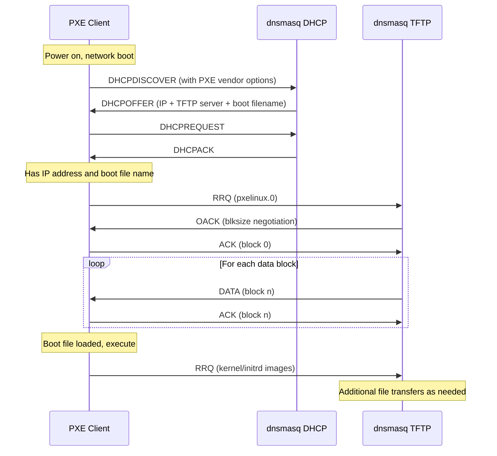
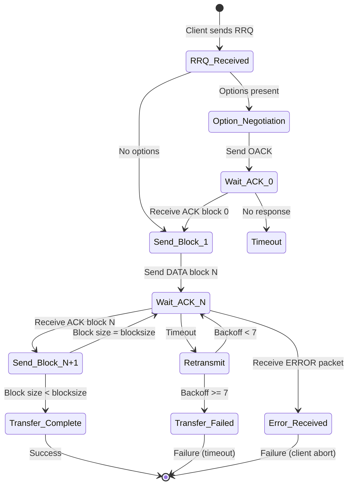

# TFTP Server Implementation

## Overview

dnsmasq includes a built-in Trivial File Transfer Protocol (TFTP) server designed primarily to support network booting via PXE (Pre-boot Execution Environment). The TFTP server implements RFC 1350 with additional support for the OACK (Option Acknowledgment) and blksize extensions defined in RFC 2347 and RFC 2348. The implementation is optimized for embedded systems and network boot scenarios while maintaining security through file permission checking and chroot jail support.

The TFTP server is enabled at compile-time with the `HAVE_TFTP` macro and integrates seamlessly with dnsmasq's DHCPv4 server to provide complete PXE boot functionality. All TFTP functionality is implemented in `src/tftp.c` (894 lines).

## RFC 1350 Compliance

### Protocol Overview

TFTP is a simple file transfer protocol that operates over UDP port 69. Unlike FTP, TFTP has no authentication mechanism and no directory browsing capabilities. It supports only two modes: `octet` (binary) and `netascii` (text with CR-LF conversion).

### TFTP Opcodes

dnsmasq implements all standard TFTP opcodes as defined in RFC 1350, plus the OACK extension:

| Opcode | Name | Value | Description | Implementation |
|--------|------|-------|-------------|----------------|
| RRQ | Read Request | 1 | Initial request to read a file | `src/tftp.c:364` (OP_RRQ) |
| WRQ | Write Request | 2 | Request to write a file | Not supported (read-only server) |
| DATA | Data Packet | 3 | File data transfer packet | `src/tftp.c:824-874` (OP_DATA) |
| ACK | Acknowledgment | 4 | Acknowledge data receipt | `src/tftp.c:690` (OP_ACK) |
| ERROR | Error Packet | 5 | Error condition notification | `src/tftp.c:762-783` (OP_ERR) |
| OACK | Option Acknowledgment | 6 | RFC 2347 option negotiation | `src/tftp.c:798-821` (OP_OACK) |

**Source Code:** Opcode definitions at `src/tftp.c` lines 30-35:
```c
#define OP_RRQ  1
#define OP_WRQ  2
#define OP_DATA 3
#define OP_ACK  4
#define OP_ERR  5
#define OP_OACK 6
```

### TFTP Error Codes

Standard TFTP error codes implemented in dnsmasq:

| Error Code | Name | Value | Description | Usage |
|------------|------|-------|-------------|-------|
| ERR_NOTDEF | Not Defined | 0 | Generic error | I/O errors (`src/tftp.c:785-790`) |
| ERR_FNF | File Not Found | 1 | Requested file does not exist | `src/tftp.c:518-522` |
| ERR_PERM | Access Violation | 2 | Permission denied | `src/tftp.c:572-576` |
| ERR_FULL | Disk Full | 3 | No space (not used in read-only mode) | Reserved |
| ERR_ILL | Illegal Operation | 4 | Invalid TFTP operation | `src/tftp.c:364-371` |
| ERR_TID | Unknown Transfer ID | 5 | Wrong source port/address | `src/tftp.c:607-615` |

**Source Code:** Error code definitions at `src/tftp.c` lines 37-42.

### TFTP Packet Formats

#### Read Request (RRQ) Packet
```
 2 bytes    string    1 byte   string   1 byte   string   1 byte   string   1 byte
+--------+----------+------+----------+------+----------+------+----------+------+
| Opcode | Filename |  0   |   Mode   |  0   |  Option  |  0   |  Value   |  0   |
+--------+----------+------+----------+------+----------+------+----------+------+
  (0x01)              \0     "octet"    \0    "blksize"  \0     "1468"     \0
                            or "netascii"      "tsize"           "0"
```

#### Data Packet
```
 2 bytes     2 bytes      n bytes
+--------+------------+------------+
| Opcode | Block #    |   Data     |
+--------+------------+------------+
  (0x03)   (1-65535)    (0-blksize)
```

Block numbering starts at 1. A DATA packet smaller than the negotiated blocksize signals the end of the transfer.

#### Acknowledgment (ACK) Packet
```
 2 bytes     2 bytes
+--------+------------+
| Opcode | Block #    |
+--------+------------+
  (0x04)   (0-65535)
```

ACK for block 0 is sent after receiving an OACK packet.

#### Error Packet
```
 2 bytes   2 bytes     string    1 byte
+--------+---------+------------+------+
| Opcode | ErrCode | ErrMsg     |  0   |
+--------+---------+------------+------+
  (0x05)   (0-7)                  \0
```

#### Option Acknowledgment (OACK) Packet
```
 2 bytes    string   1 byte  string   1 byte
+--------+----------+------+----------+------+
| Opcode | Option1  |  0   |  Value1  |  0   | ...
+--------+----------+------+----------+------+
  (0x06)  "blksize"   \0     "1468"    \0
```

## PXE Boot Integration

### Overview

PXE (Pre-boot Execution Environment) allows network interface cards to boot from the network before an operating system is loaded. dnsmasq's integrated TFTP server works seamlessly with its DHCPv4 server to provide complete PXE boot functionality.

### DHCP Options for PXE

The TFTP server integrates with DHCP through two critical options defined in RFC 2132:

**Option 66: TFTP Server Name**
- Specifies the hostname or IP address of the TFTP server
- Client uses this to locate the boot file server
- Configuration: `dhcp-option=66,<tftp-server-address>`

**Option 67: Bootfile Name**
- Specifies the name of the boot file (e.g., `pxelinux.0`)
- Client requests this file via TFTP after DHCP completes
- Configuration: `dhcp-option=67,<boot-filename>`

**Example Configuration:**
```
# Enable TFTP server
enable-tftp
tftp-root=/var/lib/tftpboot

# PXE boot for BIOS clients
dhcp-match=set:bios,option:client-arch,0
dhcp-boot=tag:bios,pxelinux.0

# PXE boot for UEFI clients
dhcp-match=set:efi-x86_64,option:client-arch,7
dhcp-boot=tag:efi-x86_64,bootx64.efi

# Specify TFTP server explicitly if needed
dhcp-option=66,192.168.1.1
```

### PXE Boot Sequence



### Client Architecture Detection

dnsmasq can serve different boot files based on client architecture using DHCP option 93 (Client Architecture):

| Architecture Code | Description | Typical Boot File |
|-------------------|-------------|-------------------|
| 0 | Intel x86 BIOS | pxelinux.0 |
| 6 | Intel x86 UEFI | bootia32.efi |
| 7 | Intel x64 UEFI | bootx64.efi |
| 9 | EFI BC (byte code) | bootx64.efi |

**Implementation:** Architecture-based boot file selection is handled by DHCP option matching, with TFTP serving the requested file regardless of client type.

## OACK and blksize Extension

### Option Acknowledgment (OACK)

RFC 2347 defines the OACK (Option Acknowledgment) mechanism, allowing TFTP clients and servers to negotiate transfer parameters. dnsmasq supports OACK for enhanced performance and compatibility.

**Implementation:** `src/tftp.c` lines 798-821 (`get_block()` function when `transfer->block == 0`)

When a client sends an RRQ with options, the server responds with an OACK packet instead of the first DATA packet. The OACK echoes the agreed-upon options and their values.

### Block Size (blksize) Negotiation

The `blksize` option (RFC 2348) allows negotiation of block sizes larger than the default 512 bytes, significantly improving transfer performance on modern networks.

**Configuration:**
- Option: `--tftp-no-blocksize` disables blksize negotiation
- Default behavior: blksize enabled, negotiates up to MTU limit

**Implementation Details** (`src/tftp.c` lines 379-395):

1. **Client Request:** Client sends RRQ with `blksize` option:
   ```
   RRQ | filename | 0 | octet | 0 | blksize | 0 | 1468 | 0
   ```

2. **Server Validation:** dnsmasq validates the requested blocksize:
   ```c
   transfer->blocksize = atoi(opt);
   if (transfer->blocksize < 1)
       transfer->blocksize = 1;
   if (transfer->blocksize > (unsigned)daemon->packet_buff_sz - 4)
       transfer->blocksize = (unsigned)daemon->packet_buff_sz - 4;
   if (mtu != 0 && transfer->blocksize > (unsigned)mtu - overhead)
       transfer->blocksize = (unsigned)mtu - overhead;
   ```

3. **MTU Consideration:** The blocksize is limited by:
   - Packet buffer size: `daemon->packet_buff_sz - 4` (typically 4092 bytes)
   - Interface MTU minus overhead (32 bytes for IPv4, 52 bytes for IPv6)
   - Configured `--tftp-mtu` limit if specified

4. **Server Response:** OACK packet confirms accepted blocksize:
   ```
   OACK | blksize | 0 | 1468 | 0
   ```

5. **Client Acknowledgment:** Client sends ACK for block 0

6. **Data Transfer:** Subsequent DATA packets use negotiated blocksize

**Performance Impact:**

| Block Size | Efficiency | Use Case |
|------------|------------|----------|
| 512 bytes | ~93% (default RFC 1350) | Compatibility, unreliable networks |
| 1468 bytes | ~97% (Ethernet MTU - overhead) | Standard Ethernet networks |
| 1408 bytes | ~97% (PPPoE-safe) | Networks with PPPoE encapsulation |
| 8192 bytes | ~99% (jumbo frames) | Specialized high-speed networks |

### Transfer Size (tsize) Option

The `tsize` option (RFC 2349) allows the client to learn the file size before transfer begins, enabling progress indication.

**Client Behavior:**
- Client sends `tsize` with value `0` (unknown size request)
- Server responds in OACK with actual file size

**Implementation:** `src/tftp.c` lines 396-400 (option parsing) and lines 814-818 (OACK response)

```c
if (transfer->opt_transize)
{
    p += (sprintf(p,"tsize") + 1);
    p += (sprintf(p, "%u", (unsigned int)transfer->file->size) + 1);
}
```

**Note:** tsize is only supported for `octet` mode. It is disabled for `netascii` mode because the file size changes due to LF to CR-LF conversion (`src/tftp.c:396`).

## Concurrent Transfer Management

### Transfer Limit

dnsmasq limits the number of simultaneous TFTP transfers to prevent resource exhaustion during mass network boot scenarios.

**Configuration Constant:** `TFTP_MAX_CONNECTIONS` = 50 (defined in `src/config.h` line 49)

**Implementation:** Transfer count enforcement at `src/tftp.c` lines 252-279

### Transfer Tracking

Each active TFTP transfer is tracked using a `struct tftp_transfer` containing:

- **Connection Information:**
  - `sockfd`: Socket file descriptor (per-transfer in multi-port mode, shared in single-port mode)
  - `peer`: Client address (IP and port)
  - `source`: Server source address
  - `if_index`: Interface index

- **Transfer State:**
  - `file`: Pointer to `struct tftp_file` (may be shared across transfers)
  - `block`: Current block number (0 for OACK, 1+ for DATA)
  - `offset`: Current file position
  - `blocksize`: Negotiated block size (default 512)

- **Timing and Reliability:**
  - `timeout`: Next retransmission time
  - `backoff`: Exponential backoff counter
  
- **Options:**
  - `opt_blocksize`: blksize option negotiated
  - `opt_transize`: tsize option requested
  - `netascii`: Transfer mode (0 = octet, 1 = netascii)
  - `carrylf`: Netascii mode LF carry-over flag

**Transfer List:** Active transfers are maintained in a linked list: `daemon->tftp_trans`

### Single-Port vs. Multi-Port Mode

dnsmasq supports two TFTP operation modes:

#### Multi-Port Mode (Default)

- **Mechanism:** Each transfer uses a unique ephemeral port (per RFC 1350)
- **Port Range:** `--tftp-port-range=<start>,<end>` (default: ephemeral ports)
- **Implementation:** New socket created for each transfer (`src/tftp.c:313-317`)
- **Transfer Limit Enforcement:** Server stops listening when limit reached
- **Advantage:** Better compatibility with firewalls that track TFTP TID (transfer ID)

#### Single-Port Mode

- **Option:** `--tftp-single-port`
- **Mechanism:** All transfers use port 69 for both requests and data
- **Implementation:** Transfers share the listening socket (`src/tftp.c:311-312`)
- **Transfer Limit Enforcement:** Explicit check before accepting new transfer (`src/tftp.c:278-279`)
- **Advantage:** Simplified firewall rules (only port 69/udp needed)
- **Trade-off:** Must track client address/port combinations to multiplex transfers

**Transfer Identification:**
- Multi-port: Server port uniquely identifies transfer (RFC 1350 TID)
- Single-port: Client IP and port combination identifies transfer (`src/tftp.c:258`)

### File Descriptor Sharing

To optimize resource usage during mass boot scenarios, dnsmasq shares file descriptors when multiple clients request the same file simultaneously.

**Implementation:** `src/tftp.c` lines 543-556 (`check_tftp_fileperm()`)

```c
for (t = daemon->tftp_trans; t; t = t->next)
    if (t->file->dev == statbuf.st_dev && 
        t->file->inode == statbuf.st_ino &&
        strcmp(t->file->filename, namebuff) == 0)
    {
        close(fd);
        t->file->refcount++;
        return t->file;
    }
```

**Sharing Criteria:**
- Same device (`st_dev`)
- Same inode (`st_ino`)
- Same filename (prevents confusion in error messages)

**Reference Counting:** The `refcount` member tracks how many transfers are using the file. The file is closed only when the last transfer completes (`src/tftp.c:728-732`).

## Transfer State Machine

The TFTP transfer state machine manages the protocol flow for each active transfer.

### State Diagram



### State Descriptions

**RRQ_Received** (`src/tftp.c:364-486`)
- Initial state when Read Request arrives
- Parse filename, mode, and options
- Check file permissions and existence
- Validate request parameters

**Option_Negotiation** (`src/tftp.c:377-401`)
- Process `blksize` option if present
- Process `tsize` option if present
- Validate and clamp blocksize to MTU/buffer limits

**Wait_ACK_0** (OACK sent, waiting for acknowledgment)
- Server sent OACK packet with agreed options
- Waiting for client ACK with block number 0
- State: `transfer->block == 0` after OACK sent

**Send_Block_N** (`src/tftp.c:823-874`)
- Read data from file at current offset
- Apply netascii conversion if needed (LF → CR-LF)
- Send DATA packet with block number
- Transition to Wait_ACK_N

**Wait_ACK_N** (`src/tftp.c:688-720`)
- Waiting for client ACK with expected block number
- On correct ACK: advance block number and offset
- On ERROR: log error and terminate transfer
- On timeout: enter Retransmit state

**Retransmit** (`src/tftp.c:623-646`)
- Exponential backoff algorithm: `timeout += 1 + (1<<(backoff/2))`
- Retransmit last DATA block
- Increment backoff counter
- Give up after 7 retransmission attempts (backoff >= 7)

**Transfer_Complete** (`src/tftp.c:832-833`, `src/tftp.c:662`)
- Final DATA block sent (size < blocksize)
- Log successful transfer
- Move to completed transfer queue for script execution
- Free transfer resources

**Transfer_Failed** (`src/tftp.c:639-646`)
- Timeout with no ACK after maximum retransmissions
- Log failure (unless awaiting final ACK)
- Free transfer resources immediately

**Error_Received** (`src/tftp.c:698-719`)
- Client sent ERROR packet
- Log error code and message
- Set backoff to 100 to force immediate cleanup
- Free transfer resources

### Timeout and Retransmission

**Initial Timeout:** 2 seconds (`src/tftp.c:322`)
```c
transfer->timeout = now + 2;
```

**Exponential Backoff:** `src/tftp.c:629`
```c
transfer->timeout += 1 + (1<<(transfer->backoff/2));
```

**Backoff Sequence:**
| Attempt | Backoff | Delay (seconds) | Cumulative Time |
|---------|---------|-----------------|-----------------|
| 0 | 0 | 2 | 2s |
| 1 | 1 | 2 | 4s |
| 2 | 2 | 3 | 7s |
| 3 | 3 | 3 | 10s |
| 4 | 4 | 5 | 15s |
| 5 | 5 | 5 | 20s |
| 6 | 6 | 9 | 29s |
| 7 | 7 | (give up) | - |

**Total Timeout:** Approximately 29 seconds before giving up

**Special Case:** When waiting for the final ACK (last block sent), timeout does not generate an error log, as some clients never send the final ACK per RFC 1350 ambiguity (`src/tftp.c:641-644`).

## Error Handling

### File Access Errors

**File Not Found** (`src/tftp.c:518-522`)
```c
if (errno == ENOENT)
{
    *len = tftp_err(ERR_FNF, packet, _("file %s not found for %s"), 
                    namebuff, client);
    return NULL;
}
```
- Error Code: 1 (ERR_FNF)
- Message: "file <filename> not found for <client-ip>"
- Logged unless `--quiet-tftp` option is set

**Permission Denied** (`src/tftp.c:572-576`)
```c
*len = tftp_err(ERR_PERM, packet, _("cannot access %s: %s"), 
                namebuff, strerror(EACCES));
```
- Error Code: 2 (ERR_PERM)
- Causes: File not world-readable (when running as root), file not owned by dnsmasq user (in secure mode)
- Security: Prevents unauthorized file access

**I/O Error** (`src/tftp.c:785-790`)
```c
return tftp_err(ERR_NOTDEF, packet, _("cannot read %s: %s"), 
                daemon->namebuff, strerror(errno));
```
- Error Code: 0 (ERR_NOTDEF)
- Causes: `lseek()` or `read()` failure during transfer
- Logged with system error message

### Protocol Errors

**Illegal TFTP Operation** (`src/tftp.c:364-371`)
- Triggered by:
  - Opcode other than RRQ (WRQ not supported)
  - Missing filename or mode fields
  - Unsupported mode (not "octet" or "netascii")
- Error Code: 4 (ERR_ILL)
- Message: "unsupported request from <client-ip>"

**Unknown Transfer ID** (`src/tftp.c:607-615`)
- Triggered by: Packet from wrong source address/port during active transfer
- Error Code: 5 (ERR_TID)
- Message: "ignoring packet from <source-ip> (TID mismatch)"
- Behavior: Error sent to wrong source, transfer continues with correct client

**Client Error** (`src/tftp.c:698-719`)
- Client sent ERROR packet to server
- Server logs the error code and message
- Transfer immediately terminated

### Network Errors

**Retransmission Exhaustion** (`src/tftp.c:639-646`)
- After 7 failed retransmission attempts
- Log message: "failed sending <filename> to <client-ip>"
- Transfer terminated and resources freed

**Receive Errors**
- Short packet (< 2 bytes): Silently ignored (`src/tftp.c:96-97`)
- Invalid control message: Silently ignored (`src/tftp.c:127-128`)

### Error Recovery

dnsmasq employs several strategies for error resilience:

1. **Stateless Operation:** Each RRQ is independent; failed transfers don't affect server state
2. **Automatic Cleanup:** Failed transfers are automatically removed from active list
3. **Resource Reclamation:** File descriptors and memory freed immediately on error
4. **Graceful Degradation:** Errors don't crash server, logging continues for diagnostics

## Security Considerations

### File Access Restrictions

dnsmasq implements multiple layers of security to prevent unauthorized file access.

#### TFTP Root Directory

**Configuration:** `--tftp-root=<directory>`
- All file paths are relative to the TFTP root
- Absolute paths are only allowed if they match the configured prefix
- Implementation: `src/tftp.c` lines 410-476

#### Directory Traversal Prevention

**Path Sanitization:** `src/tftp.c` lines 513-514
```c
if (prefix && strstr(namebuff, "/../"))
    goto perm;  /* Access denied */
```
- Rejects any filename containing `/../` sequence
- Prevents escaping the TFTP root directory
- Applies when a prefix (TFTP root) is configured

**Backslash Conversion:** `src/tftp.c` lines 404-406
```c
for (p = filename; *p; p++)
    if (*p == '\\')
        *p = '/';
```
- Converts Windows-style backslashes to forward slashes
- Ensures consistent path handling across platforms

#### Permission Checks

**Running as Root:** `src/tftp.c` lines 534-538
```c
if (uid == 0)
{
    if (!(statbuf.st_mode & S_IROTH))
        goto perm;  /* Must be world-readable */
}
```
- Files must have world-readable permission (mode & 0004)
- Prevents serving sensitive files that are only root-readable

**Secure Mode:** `--tftp-secure` option (`src/tftp.c` lines 540-541)
```c
else if (option_bool(OPT_TFTP_SECURE) && uid != statbuf.st_uid)
    goto perm;  /* Must be owned by dnsmasq user */
```
- Files must be owned by the user running dnsmasq
- Additional security layer for multi-user systems
- Recommended for production deployments

### Chroot Jail Support

For maximum security, dnsmasq can be run in a chroot jail, isolating the TFTP file system.

**Setup Example:**
```bash
# Create chroot environment
mkdir -p /var/lib/dnsmasq-jail/tftpboot
cp -r /tftpboot/* /var/lib/dnsmasq-jail/tftpboot/

# Run dnsmasq in chroot
dnsmasq --user=tftp --group=tftp \
        --tftp-root=/tftpboot \
        --enable-tftp \
        --conf-file=/dev/null \
        --no-daemon \
        --chroot=/var/lib/dnsmasq-jail
```

**Note:** When using chroot, the `--tftp-root` path is relative to the chroot directory.

### Read-Only Operation

dnsmasq's TFTP server is **read-only** by design:
- WRQ (Write Request) operations are not supported
- Attempting WRQ results in ERR_ILL (Illegal Operation)
- Implementation: `src/tftp.c:364` only accepts OP_RRQ

**Rationale:**
- PXE boot only requires read operations
- Write support would require extensive access control
- Eliminates entire class of security vulnerabilities

### Resource Limits

**Concurrent Connection Limit:** `TFTP_MAX_CONNECTIONS` = 50
- Prevents denial-of-service via connection exhaustion
- Adjustable by modifying `src/config.h` and recompiling

**Packet Size Limits:**
- Maximum blocksize: `daemon->packet_buff_sz - 4` (typically 4092 bytes)
- Further limited by interface MTU
- Prevents buffer overflow attacks

**Timeout Enforcement:**
- Maximum 7 retransmission attempts (~29 seconds total)
- Automatic cleanup of stalled transfers
- Prevents resource leaks from abandoned transfers

### PXE-Only Mode

**Configuration:** `--tftp-pxe-only`
- TFTP server only responds to PXE clients (identified by DHCP vendor options)
- Non-PXE clients are ignored
- Reduces attack surface by limiting TFTP access

### Interface Restrictions

**TFTP Interface Filtering:**
- `--tftp-interfaces=<interface-list>`: Limit TFTP to specific interfaces
- Integration with DHCP interface filtering: `--except-interface`, `--dhcp-except`
- Implementation: `src/tftp.c` lines 206-234

**Use Case:** Serve TFTP only on internal network, not on WAN interface

### Filename Sanitization

**Lowercase Conversion:** `--tftp-lowercase` option (`src/tftp.c:407-408`)
```c
else if (option_bool(OPT_TFTP_LC))
    *p = tolower(*p);
```
- Convert all filenames to lowercase
- Useful for case-insensitive file systems
- Improves compatibility with various PXE clients

### Logging

**Access Logging:** All TFTP transfers are logged
- Successful transfers: `"sent <filename> to <client-ip>"` (LOG_INFO)
- Failed transfers: `"failed sending <filename> to <client-ip>"` (LOG_INFO)
- Errors: Various error messages (LOG_ERR)

**Quiet Mode:** `--quiet-tftp`
- Suppresses File Not Found errors
- Reduces log noise during PXE menu browsing
- Other errors still logged

## Configuration Examples

### Basic PXE Boot Setup

```
# Enable TFTP server
enable-tftp
tftp-root=/var/lib/tftpboot

# Enable DHCP
dhcp-range=192.168.1.50,192.168.1.150,12h

# PXE boot configuration
dhcp-boot=pxelinux.0
```

### Multi-Architecture PXE Boot

```
enable-tftp
tftp-root=/var/lib/tftpboot

# Detect client architecture
dhcp-match=set:bios,option:client-arch,0
dhcp-match=set:efi32,option:client-arch,6
dhcp-match=set:efi64,option:client-arch,7

# Serve appropriate boot file
dhcp-boot=tag:bios,bios/pxelinux.0
dhcp-boot=tag:efi32,efi32/bootia32.efi
dhcp-boot=tag:efi64,efi64/bootx64.efi
```

### High-Performance TFTP

```
enable-tftp
tftp-root=/var/lib/tftpboot
tftp-mtu=1468              # Optimize block size
tftp-port-range=4096,4196  # Explicit port range (100 ports = 100 concurrent transfers)
```

### Secure TFTP Configuration

```
enable-tftp
tftp-root=/var/lib/tftpboot
tftp-secure                 # Files must be owned by dnsmasq user
tftp-lowercase              # Case-insensitive filenames
user=tftp                   # Run as non-root user
group=tftp
```

### Per-Interface TFTP Root

```
enable-tftp
tftp-root=/srv/tftp

# Interface-specific roots
tftp-unique-root=eth0
tftp-root=/srv/tftp-eth0,eth0

tftp-unique-root=eth1
tftp-root=/srv/tftp-eth1,eth1
```

### IP-Based Subdirectories

```
enable-tftp
tftp-root=/var/lib/tftpboot
tftp-unique-root=ip  # Create per-client-IP subdirectories

# Client 192.168.1.100 accesses files from:
# /var/lib/tftpboot/192.168.1.100/ (if exists)
# Otherwise: /var/lib/tftpboot/
```

### MAC-Based Subdirectories (with DHCP integration)

```
enable-tftp
tftp-root=/var/lib/tftpboot
tftp-unique-root=mac  # Create per-client-MAC subdirectories

# Client with MAC 00:11:22:33:44:55 accesses files from:
# /var/lib/tftpboot/00-11-22-33-44-55/ (if exists and MAC known via DHCP/ARP)
# Otherwise: /var/lib/tftpboot/
```

### Single-Port Mode for Restrictive Firewalls

```
enable-tftp
tftp-root=/var/lib/tftpboot
tftp-single-port            # All transfers use port 69

# Firewall rule required:
# iptables -A INPUT -p udp --dport 69 -j ACCEPT
```

---

**Related Documentation:**
- [System Architecture](ARCHITECTURE.md) - Event-driven architecture and subsystem integration
- [DHCP v4](DHCP_V4.md) - DHCPv4 server for PXE integration (options 66/67)
- [Configuration System](CONFIGURATION.md) - TFTP configuration options and compile-time features
- [Building dnsmasq](BUILDING.md) - Compile with HAVE_TFTP feature flag
- [Back to Documentation Index](README.md)
