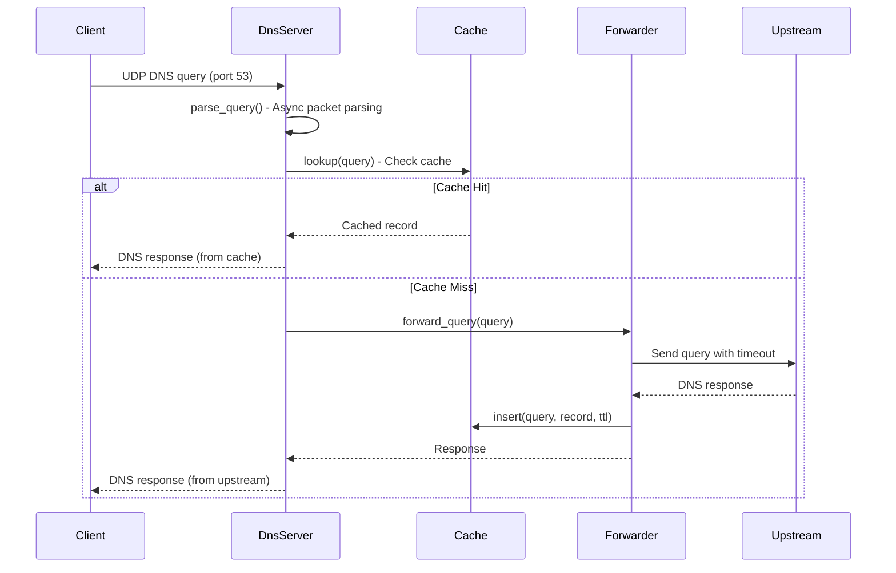
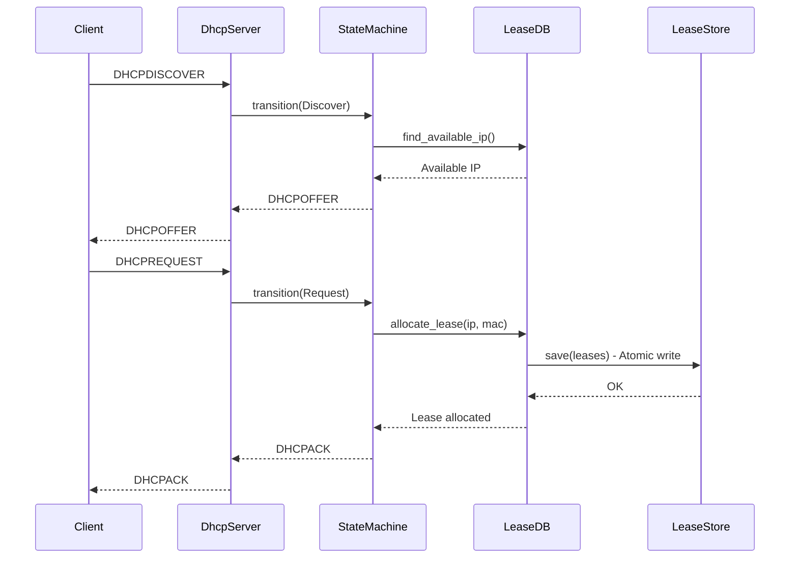
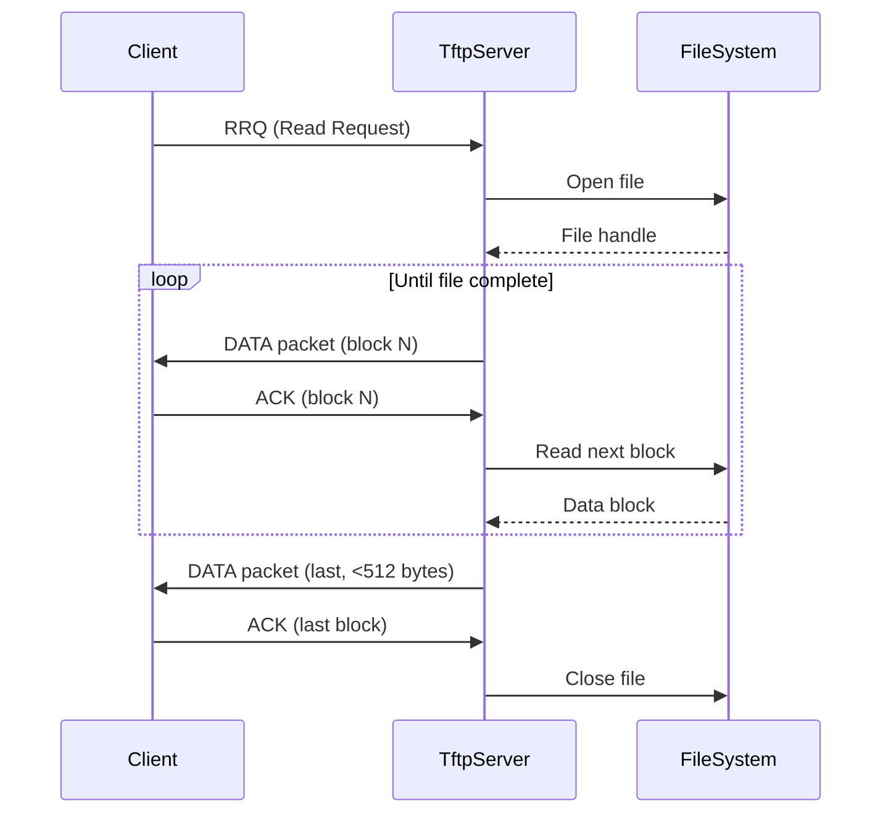

# dnsmasq-rs System Architecture

## Table of Contents

- [System Overview](#system-overview)
- [Architectural Transformation: C to Rust](#architectural-transformation-c-to-rust)
- [Module Organization](#module-organization)
- [Async Runtime Architecture](#async-runtime-architecture)
- [Memory Management Strategy](#memory-management-strategy)
- [Core Subsystems](#core-subsystems)
- [Data Flow Diagrams](#data-flow-diagrams)
- [Platform Abstraction Layer](#platform-abstraction-layer)
- [Inter-Module Dependencies](#inter-module-dependencies)
- [Design Patterns](#design-patterns)

---

## System Overview

dnsmasq-rs is the Rust implementation of dnsmasq, providing memory-safe DNS forwarding, DNS caching, DHCPv4/v6 server, Router Advertisement, SLAAC, and TFTP server capabilities. The Rust version maintains 100% feature parity with the C implementation while leveraging Rust's ownership system, borrow checker, and async runtime for enhanced safety and performance.

**Core Architectural Principle**: The Rust implementation transforms C's single-threaded, poll()-based event-driven model into a **Tokio-based async runtime** with structured concurrency, RAII-based resource management, and compile-time memory safety guarantees per Section 0.1.3.

### Key Architectural Goals (Section 0.1.1)

1. **Memory Safety Modernization**: Eliminate buffer overflows, use-after-free, double-free, and null pointer dereferences through Rust's ownership verification
2. **Feature Parity Preservation**: Maintain complete functional equivalence with C implementation
3. **Configuration Compatibility**: Support identical dnsmasq.conf syntax and command-line arguments
4. **Drop-in Replacement**: Enable seamless migration with zero behavioral differences

---

## Architectural Transformation: C to Rust

### From: Event-Driven C Architecture

**C Implementation (src/dnsmasq.c, src/poll.c)**:
- Single process, poll()-based reactor
- Manual memory management with malloc/free
- Global daemon state struct with explicit pointer management
- Platform-specific code via conditional compilation (#ifdef HAVE_*)
- Optional features via compile-time macros

### To: Async Rust Architecture

**Rust Implementation (src/main.rs, src/runtime/)**:
- Tokio-based async runtime with non-blocking I/O
- RAII-based memory management with ownership and borrowing
- Structured state management using Rust's type system
- Platform abstraction through Cargo feature flags and traits
- Module-based organization mirroring C file structure

### Transformation Rules (Section 0.1.3)

| C Pattern | Rust Equivalent | Benefit |
|-----------|----------------|---------|
| `malloc/free` | `Vec`, `Box`, `Arc` | Automatic memory management, no leaks |
| Pointer arithmetic | Slices with bounds checking | Compile-time safety, no overflows |
| `poll()` event loop | Tokio `select!` and async/await | Cleaner async code, better performance |
| Manual buffer management | `bytes::Bytes`, `Vec<u8>` | Zero-copy where possible, safe resizing |
| `#ifdef HAVE_*` macros | Cargo feature flags `#[cfg(feature = "..")]` | Fine-grained compile-time selection |
| Global state with locks | `Arc<RwLock<T>>` | Thread-safe shared state |
| Signal handling via self-pipe | `tokio::signal` | Native async signal handling |
| Forked TCP processes | Tokio tasks | Structured concurrency, no fork overhead |

---

## Module Organization

The Rust implementation is organized into a hierarchical module structure (Section 0.3.1):

```
src/
├── main.rs                      # Entry point, CLI parsing (replaces src/dnsmasq.c main)
├── lib.rs                       # Library exports for testing
│
├── runtime/
│   ├── mod.rs                   # Runtime module root
│   ├── daemon.rs                # Daemonization (replaces src/daemon.c)
│   ├── event_loop.rs            # Async event loop (replaces src/poll.c)
│   ├── signal.rs                # Signal handling
│   └── helpers.rs               # Process spawning (replaces src/helper.c)
│
├── config/
│   ├── mod.rs                   # Configuration module root
│   ├── parser.rs                # Config file parsing (replaces src/option.c)
│   ├── options.rs               # Option definitions
│   ├── types.rs                 # Configuration data structures
│   └── defaults.rs              # Default values (replaces src/config.h constants)
│
├── dns/
│   ├── mod.rs                   # DNS subsystem root
│   ├── protocol.rs              # DNS message parsing (replaces src/rfc1035.c)
│   ├── cache.rs                 # DNS cache (replaces src/cache.c)
│   ├── forward.rs               # Query forwarding (replaces src/forward.c)
│   ├── server.rs                # DNS server listener
│   ├── edns.rs                  # EDNS0 support (replaces src/edns0.c)
│   ├── compression.rs           # DNS name compression
│   ├── domain.rs                # Domain matching (replaces src/domain.c)
│   ├── blockdata.rs             # Large record storage (replaces src/blockdata.c)
│   ├── auth/
│   │   ├── mod.rs               # Authoritative DNS (replaces src/auth.c)
│   │   └── zone.rs              # Zone data management
│   └── dnssec/
│       ├── mod.rs               # DNSSEC module root
│       ├── validation.rs        # Signature validation (replaces src/dnssec.c)
│       └── crypto.rs            # Crypto primitives (replaces src/dnssec-crypto.c)
│
├── dhcp/
│   ├── mod.rs                   # DHCP subsystem root
│   ├── v4/
│   │   ├── mod.rs               # DHCPv4 module root
│   │   ├── server.rs            # DHCPv4 server (replaces src/dhcp.c)
│   │   ├── protocol.rs          # RFC 2131 (replaces src/rfc2131.c)
│   │   └── state_machine.rs    # Type-safe state transitions
│   ├── v6/
│   │   ├── mod.rs               # DHCPv6 module root
│   │   ├── server.rs            # DHCPv6 server (replaces src/dhcp6.c)
│   │   ├── protocol.rs          # RFC 3315 (replaces src/rfc3315.c)
│   │   └── state_machine.rs    # Type-safe DHCPv6 states
│   ├── common.rs                # Shared utilities (replaces src/dhcp-common.c)
│   ├── lease.rs                 # Lease database (replaces src/lease.c)
│   ├── lease_store.rs           # Persistent storage
│   └── ipv6/
│       ├── radv.rs              # Router Advertisement (replaces src/radv.c)
│       └── slaac.rs             # SLAAC (replaces src/slaac.c)
│
├── tftp/
│   ├── mod.rs                   # TFTP module root
│   ├── server.rs                # TFTP server (replaces src/tftp.c)
│   ├── protocol.rs              # TFTP protocol
│   └── transfer.rs              # File transfer state machine
│
├── network/
│   ├── mod.rs                   # Network module root
│   ├── socket.rs                # Socket abstractions
│   ├── packet.rs                # Packet I/O
│   └── interface.rs             # Interface enumeration
│
├── platform/
│   ├── mod.rs                   # Platform abstraction root
│   ├── linux/
│   │   ├── netlink.rs           # Linux netlink (replaces src/netlink.c)
│   │   ├── inotify.rs           # File monitoring (replaces src/inotify.c)
│   │   ├── ipset.rs             # ipset integration (replaces src/ipset.c)
│   │   └── conntrack.rs         # Connection tracking (replaces src/conntrack.c)
│   ├── bsd/
│   │   ├── bpf.rs               # BPF interface (replaces src/bpf.c)
│   │   └── kqueue.rs            # BSD kqueue
│   └── generic/
│       └── network.rs           # Generic networking (replaces src/network.c)
│
├── integration/
│   ├── mod.rs                   # Integration module root
│   ├── dbus.rs                  # D-Bus interface (replaces src/dbus.c)
│   ├── ubus.rs                  # ubus interface (replaces src/ubus.c)
│   └── scripts.rs               # DHCP script execution
│
├── util/
│   ├── mod.rs                   # Utilities module root
│   ├── string.rs                # String utilities (replaces src/util.c)
│   ├── time.rs                  # Time handling
│   ├── logging.rs               # Logging (replaces src/log.c)
│   ├── crypto.rs                # Hash functions (replaces src/crypto.c)
│   └── metrics.rs               # Metrics collection (replaces src/metrics.c)
│
└── types/
    ├── mod.rs                   # Common types module root
    ├── daemon_state.rs          # Main daemon state (replaces struct daemon)
    ├── addresses.rs             # IP address types
    └── errors.rs                # Error types using thiserror
```

---

## Async Runtime Architecture

### Tokio Runtime Initialization

**Entry Point (src/main.rs)**:

```rust
#[tokio::main]
async fn main() -> Result<()> {
    // Parse CLI arguments with clap
    let config = config::parse_args()?;
    
    // Initialize logging
    util::logging::init_logger(config.log_level);
    
    // Daemonize if requested
    if config.daemonize {
        runtime::daemon::daemonize(config.pid_file.as_ref())?;
    }
    
    // Drop privileges after binding to ports <1024
    runtime::daemon::drop_privileges(&config.user, &config.group)?;
    
    // Start event loop
    runtime::event_loop::start(config).await
}
```

### Event Loop Structure (src/runtime/event_loop.rs)

Replaces C's poll()-based event loop with Tokio's async runtime:

```rust
pub async fn start(config: ConfigOptions) -> Result<()> {
    // Initialize shared state
    let state = Arc::new(RwLock::new(DaemonState::new(config)));
    
    // Spawn subsystem tasks
    let dns_handle = tokio::spawn(dns::server::start(Arc::clone(&state)));
    let dhcp_handle = tokio::spawn(dhcp::server::start(Arc::clone(&state)));
    let tftp_handle = tokio::spawn(tftp::server::start(Arc::clone(&state)));
    
    // Spawn signal handler
    let signal_handle = tokio::spawn(signal::handler(Arc::clone(&state)));
    
    // Wait for any task to complete (usually on shutdown signal)
    tokio::select! {
        result = dns_handle => result??,
        result = dhcp_handle => result??,
        result = tftp_handle => result??,
        result = signal_handle => result??,
    }
    
    Ok(())
}
```

### Signal Handling (src/runtime/signal.rs)

Replaces C's self-pipe pattern with native Tokio signals:

```rust
pub async fn handler(state: Arc<RwLock<DaemonState>>) -> Result<()> {
    use tokio::signal::unix::{signal, SignalKind};
    
    let mut sighup = signal(SignalKind::hangup())?;
    let mut sigusr1 = signal(SignalKind::user_defined1())?;
    let mut sigterm = signal(SignalKind::terminate())?;
    
    loop {
        tokio::select! {
            _ = sighup.recv() => {
                tracing::info!("Received SIGHUP, reloading configuration");
                reload_config(&state).await?;
            }
            _ = sigusr1.recv() => {
                tracing::info!("Received SIGUSR1, dumping statistics");
                dump_statistics(&state).await?;
            }
            _ = sigterm.recv() => {
                tracing::info!("Received SIGTERM, shutting down gracefully");
                break;
            }
        }
    }
    
    Ok(())
}
```

---

## Memory Management Strategy

### Ownership and Borrowing Replace Manual Allocation

**C Pattern (manual memory management)**:
```c
struct cache_entry *entry = whine_malloc(sizeof(struct cache_entry));
if (!entry) return NULL;
// ... use entry ...
free(entry);
```

**Rust Pattern (RAII, automatic cleanup)**:
```rust
// Box: single owner, heap allocation
let entry = Box::new(CacheEntry::new());
// ... use entry ...
// Automatically freed when entry goes out of scope

// Vec: dynamic array with automatic resizing
let mut entries = Vec::with_capacity(100);
entries.push(entry);
// Automatically freed when entries is dropped
```

### Shared State with Arc and RwLock

**C Pattern (global state with mutex)**:
```c
static struct daemon *daemon_global;
pthread_mutex_lock(&cache_mutex);
// ... access cache ...
pthread_mutex_unlock(&cache_mutex);
```

**Rust Pattern (Arc<RwLock<T>> for shared mutable state)**:
```rust
// Arc: Atomic Reference Counting for shared ownership
// RwLock: Multiple readers OR single writer
pub struct DaemonState {
    config: ConfigOptions,
    dns_cache: Arc<RwLock<DnsCache>>,
    dhcp_leases: Arc<RwLock<LeaseDatabase>>,
}

// Read access (multiple readers allowed)
let cache = state.dns_cache.read().await;
let entry = cache.lookup(query);

// Write access (exclusive access)
let mut cache = state.dns_cache.write().await;
cache.insert(query, record, ttl)?;
```

### Zero-Copy Buffer Management

**Bytes Crate for Efficient Packet Handling**:

```rust
use bytes::{Bytes, BytesMut};

// Zero-copy buffer for network I/O
let mut buf = BytesMut::with_capacity(4096);
socket.recv_buf(&mut buf).await?;

// Freeze to immutable, shareable Bytes (no copy)
let packet = buf.freeze();

// Clone is cheap (reference counted pointer, not data copy)
let packet_copy = packet.clone();
```

---

## Core Subsystems

### DNS Subsystem (src/dns/)

#### DNS Caching (src/dns/cache.rs)

Replaces C's manual hash table with Rust HashMap:

```rust
pub struct DnsCache {
    entries: HashMap<DnsQuery, CacheEntry>,
    lru: VecDeque<DnsQuery>,
    max_size: usize,
}

impl DnsCache {
    /// Insert with LRU eviction
    pub fn insert(&mut self, query: DnsQuery, record: DnsRecord, ttl: u32) -> Result<()> {
        // Check capacity
        if self.entries.len() >= self.max_size {
            // Evict LRU entry
            if let Some(lru_key) = self.lru.pop_front() {
                self.entries.remove(&lru_key);
            }
        }
        
        // Insert new entry
        let entry = CacheEntry {
            record,
            expires_at: SystemTime::now() + Duration::from_secs(ttl as u64),
        };
        self.entries.insert(query.clone(), entry);
        self.lru.push_back(query);
        
        Ok(())
    }
    
    /// Lookup with LRU promotion
    pub fn lookup(&mut self, query: &DnsQuery) -> Option<&DnsRecord> {
        if let Some(entry) = self.entries.get(query) {
            // Check expiration
            if SystemTime::now() < entry.expires_at {
                // Promote to MRU
                if let Some(pos) = self.lru.iter().position(|q| q == query) {
                    self.lru.remove(pos);
                    self.lru.push_back(query.clone());
                }
                return Some(&entry.record);
            }
        }
        None
    }
}
```

#### DNS Query Forwarding (src/dns/forward.rs)

Async query pipeline replacing C's blocking I/O:

```rust
pub struct DnsForwarder {
    upstream_servers: Vec<SocketAddr>,
    cache: Arc<RwLock<DnsCache>>,
}

impl DnsForwarder {
    pub async fn forward_query(&self, query: &DnsQuery) -> Result<DnsResponse> {
        // Check cache first
        {
            let mut cache = self.cache.write().await;
            if let Some(record) = cache.lookup(query) {
                tracing::debug!("Cache hit for {:?}", query);
                return Ok(DnsResponse::from_record(record.clone()));
            }
        }
        
        // Forward to upstream servers with timeout
        for server in &self.upstream_servers {
            match tokio::time::timeout(
                Duration::from_secs(5),
                self.query_upstream(server, query)
            ).await {
                Ok(Ok(response)) => {
                    // Cache response
                    let mut cache = self.cache.write().await;
                    cache.insert(query.clone(), response.record.clone(), response.ttl)?;
                    return Ok(response);
                }
                Ok(Err(e)) => tracing::warn!("Upstream {:?} error: {}", server, e),
                Err(_) => tracing::warn!("Upstream {:?} timeout", server),
            }
        }
        
        Err(DnsError::AllUpstreamsFailed)
    }
    
    async fn query_upstream(&self, server: &SocketAddr, query: &DnsQuery) -> Result<DnsResponse> {
        let socket = UdpSocket::bind("0.0.0.0:0").await?;
        let query_bytes = query.serialize()?;
        
        socket.send_to(&query_bytes, server).await?;
        
        let mut buf = vec![0u8; 4096];
        let (len, _) = socket.recv_from(&mut buf).await?;
        
        DnsResponse::parse(&buf[..len])
    }
}
```

#### DNS Protocol Parsing (src/dns/protocol.rs)

Safe protocol parsing replacing C's manual pointer manipulation:

```rust
use nom::{
    bytes::complete::{tag, take},
    number::complete::{be_u16, be_u32},
    IResult,
};

/// Parse DNS header (12 bytes)
pub fn parse_dns_header(input: &[u8]) -> IResult<&[u8], DnsHeader> {
    let (input, id) = be_u16(input)?;
    let (input, flags) = be_u16(input)?;
    let (input, qdcount) = be_u16(input)?;
    let (input, ancount) = be_u16(input)?;
    let (input, nscount) = be_u16(input)?;
    let (input, arcount) = be_u16(input)?;
    
    Ok((input, DnsHeader {
        id,
        flags: DnsFlags::from_bits(flags),
        question_count: qdcount,
        answer_count: ancount,
        authority_count: nscount,
        additional_count: arcount,
    }))
}

/// Parse DNS name with compression pointer handling
pub fn parse_dns_name<'a>(
    input: &'a [u8],
    original_packet: &'a [u8],
    depth: usize,
) -> IResult<&'a [u8], String> {
    // Prevent infinite recursion
    if depth > 255 {
        return Err(nom::Err::Error(nom::error::Error::new(
            input,
            nom::error::ErrorKind::TooLarge,
        )));
    }
    
    let mut labels = Vec::new();
    let mut current = input;
    
    loop {
        let (rest, label_len) = take(1usize)(current)?;
        let label_len = label_len[0];
        
        match label_len {
            0 => {
                // End of name
                current = rest;
                break;
            }
            len if len & 0xC0 == 0xC0 => {
                // Compression pointer (top 2 bits set)
                let (rest, offset_low) = take(1usize)(rest)?;
                let offset = (((len & 0x3F) as u16) << 8) | (offset_low[0] as u16);
                
                // Follow pointer recursively
                let (_, suffix) = parse_dns_name(
                    &original_packet[offset as usize..],
                    original_packet,
                    depth + 1,
                )?;
                labels.push(suffix);
                current = rest;
                break;
            }
            len => {
                // Regular label
                let (rest, label_bytes) = take(len as usize)(rest)?;
                let label = String::from_utf8_lossy(label_bytes).to_string();
                labels.push(label);
                current = rest;
            }
        }
    }
    
    Ok((current, labels.join(".")))
}
```

### DHCP Subsystem (src/dhcp/)

#### Type-Safe State Machine (src/dhcp/v4/state_machine.rs)

Replaces C's manual state tracking with Rust enums:

```rust
#[derive(Debug, Clone, PartialEq)]
pub enum DhcpState {
    Init,
    Selecting,
    Requesting,
    Bound { lease: Lease, expires_at: SystemTime },
    Renewing { lease: Lease },
    Rebinding { lease: Lease },
}

impl DhcpState {
    /// Type-safe state transitions
    pub fn transition(&mut self, event: DhcpEvent) -> Result<DhcpMessage> {
        match (self, event) {
            (DhcpState::Init, DhcpEvent::Discover) => {
                *self = DhcpState::Selecting;
                Ok(DhcpMessage::discover())
            }
            (DhcpState::Selecting, DhcpEvent::Offer(offer)) => {
                *self = DhcpState::Requesting;
                Ok(DhcpMessage::request(offer.ip))
            }
            (DhcpState::Requesting, DhcpEvent::Ack(lease)) => {
                *self = DhcpState::Bound {
                    lease: lease.clone(),
                    expires_at: SystemTime::now() + Duration::from_secs(lease.lease_time),
                };
                Ok(DhcpMessage::ack())
            }
            _ => Err(DhcpError::InvalidStateTransition),
        }
    }
}
```

#### Lease Persistence (src/dhcp/lease_store.rs)

Atomic file updates preserving C's lease file format:

```rust
pub struct LeaseStore {
    path: PathBuf,
}

impl LeaseStore {
    /// Save leases with atomic write-rename
    pub async fn save(&self, leases: &[Lease]) -> Result<()> {
        // Write to temporary file
        let temp_path = self.path.with_extension("tmp");
        let mut file = tokio::fs::File::create(&temp_path).await?;
        
        for lease in leases {
            // Format: timestamp MAC IP hostname client-id
            let line = format!(
                "{} {} {} {} {}\n",
                lease.expires_at,
                lease.mac,
                lease.ip,
                lease.hostname.as_deref().unwrap_or("*"),
                lease.client_id.as_deref().unwrap_or("*")
            );
            file.write_all(line.as_bytes()).await?;
        }
        
        file.sync_all().await?;
        
        // Atomic rename (POSIX guarantee)
        tokio::fs::rename(&temp_path, &self.path).await?;
        
        Ok(())
    }
    
    /// Load leases from file
    pub async fn load(&self) -> Result<Vec<Lease>> {
        let contents = tokio::fs::read_to_string(&self.path).await?;
        
        let mut leases = Vec::new();
        for line in contents.lines() {
            let fields: Vec<&str> = line.split_whitespace().collect();
            if fields.len() >= 3 {
                leases.push(Lease {
                    expires_at: fields[0].parse()?,
                    mac: fields[1].parse()?,
                    ip: fields[2].parse()?,
                    hostname: (fields.get(3) != Some(&"*"))
                        .then(|| fields[3].to_string()),
                    client_id: (fields.get(4) != Some(&"*"))
                        .then(|| fields[4].to_string()),
                });
            }
        }
        
        Ok(leases)
    }
}
```

### TFTP Subsystem (src/tftp/)

#### TFTP Server (src/tftp/server.rs)

Async TFTP server replacing C's forked process model:

```rust
pub struct TftpServer {
    listen_addr: SocketAddr,
    root_dir: PathBuf,
}

impl TftpServer {
    pub async fn start(self) -> Result<()> {
        let socket = UdpSocket::bind(&self.listen_addr).await?;
        tracing::info!("TFTP server listening on {}", self.listen_addr);
        
        let mut buf = vec![0u8; 516]; // TFTP max packet size
        
        loop {
            let (len, client_addr) = socket.recv_from(&mut buf).await?;
            let packet = buf[..len].to_vec();
            
            // Spawn task for each transfer
            let root_dir = self.root_dir.clone();
            tokio::spawn(async move {
                if let Err(e) = handle_tftp_request(packet, client_addr, root_dir).await {
                    tracing::error!("TFTP transfer error: {}", e);
                }
            });
        }
    }
}

async fn handle_tftp_request(
    packet: Vec<u8>,
    client_addr: SocketAddr,
    root_dir: PathBuf,
) -> Result<()> {
    let request = TftpRequest::parse(&packet)?;
    
    match request {
        TftpRequest::ReadRequest { filename, mode } => {
            handle_read_request(filename, mode, client_addr, root_dir).await
        }
        TftpRequest::WriteRequest { filename, mode } => {
            handle_write_request(filename, mode, client_addr, root_dir).await
        }
        _ => Err(TftpError::InvalidRequest),
    }
}
```

---

## Data Flow Diagrams

### DNS Query Processing Flow



### DHCP Lease Allocation Flow



### TFTP File Transfer Flow



---

## Platform Abstraction Layer

### Trait-Based Platform Interface

**Platform Trait (src/platform/mod.rs)**:

```rust
#[async_trait]
pub trait PlatformInterface: Send + Sync {
    /// Monitor network interface changes
    async fn watch_interfaces(&self) -> Result<InterfaceStream>;
    
    /// Monitor file changes
    async fn watch_file(&self, path: &Path) -> Result<FileWatcher>;
    
    /// Get list of network interfaces
    async fn list_interfaces(&self) -> Result<Vec<NetworkInterface>>;
    
    /// Add route to routing table (platform-specific)
    async fn add_route(&self, route: &Route) -> Result<()>;
}

// Linux implementation
#[cfg(target_os = "linux")]
pub struct LinuxPlatform {
    netlink_socket: NetlinkSocket,
    inotify: Inotify,
}

#[cfg(target_os = "linux")]
#[async_trait]
impl PlatformInterface for LinuxPlatform {
    async fn watch_interfaces(&self) -> Result<InterfaceStream> {
        // Use netlink for interface monitoring
        self.netlink_socket.subscribe_link_events().await
    }
    
    async fn watch_file(&self, path: &Path) -> Result<FileWatcher> {
        // Use inotify for file monitoring
        self.inotify.add_watch(path, WatchMask::MODIFY).await
    }
    
    async fn list_interfaces(&self) -> Result<Vec<NetworkInterface>> {
        // Query interfaces via netlink
        self.netlink_socket.get_links().await
    }
    
    async fn add_route(&self, route: &Route) -> Result<()> {
        // Add route via netlink RTM_NEWROUTE
        self.netlink_socket.add_route(route).await
    }
}

// BSD implementation
#[cfg(any(target_os = "freebsd", target_os = "openbsd"))]
pub struct BsdPlatform {
    routing_socket: RoutingSocket,
    kqueue: Kqueue,
}

#[cfg(any(target_os = "freebsd", target_os = "openbsd"))]
#[async_trait]
impl PlatformInterface for BsdPlatform {
    async fn watch_interfaces(&self) -> Result<InterfaceStream> {
        // Use routing socket for interface monitoring
        self.routing_socket.subscribe_route_events().await
    }
    
    async fn watch_file(&self, path: &Path) -> Result<FileWatcher> {
        // Use kqueue for file monitoring
        self.kqueue.watch(path).await
    }
    
    async fn list_interfaces(&self) -> Result<Vec<NetworkInterface>> {
        // Use getifaddrs(3) via libc
        platform::bsd::get_interfaces()
    }
    
    async fn add_route(&self, route: &Route) -> Result<()> {
        // Add route via routing socket
        self.routing_socket.add_route(route).await
    }
}
```

### Conditional Compilation Strategy

**Feature-Based Platform Selection**:

```rust
// In src/platform/mod.rs
#[cfg(target_os = "linux")]
pub use linux::LinuxPlatform as Platform;

#[cfg(any(target_os = "freebsd", target_os = "openbsd", target_os = "netbsd"))]
pub use bsd::BsdPlatform as Platform;

#[cfg(target_os = "macos")]
pub use macos::MacosPlatform as Platform;

#[cfg(not(any(
    target_os = "linux",
    target_os = "freebsd",
    target_os = "openbsd",
    target_os = "netbsd",
    target_os = "macos"
)))]
pub use generic::GenericPlatform as Platform;

// Usage in application code
pub async fn initialize_platform() -> Result<Platform> {
    Platform::new().await
}
```

---

## Inter-Module Dependencies

### Dependency Graph

```
main.rs
  ├─> config (parse args, load config)
  ├─> runtime (daemonization, event loop)
  │    ├─> signal (SIGHUP, SIGUSR1, SIGTERM)
  │    └─> daemon (privilege dropping)
  │
  ├─> dns (server, cache, forward)
  │    ├─> types (DaemonState, errors)
  │    ├─> network (sockets)
  │    └─> util (logging, crypto)
  │
  ├─> dhcp (v4, v6, leases)
  │    ├─> types (DaemonState, addresses)
  │    ├─> network (sockets)
  │    └─> util (logging, time)
  │
  ├─> tftp (server, transfers)
  │    ├─> types (errors)
  │    ├─> network (sockets)
  │    └─> util (logging)
  │
  └─> platform (Linux/BSD/macOS specific)
       ├─> network (interface monitoring)
       └─> util (logging)
```

### Import Patterns

**Explicit Module Imports Replace C Headers**:

```rust
// In src/dns/server.rs

// Standard library imports
use std::net::{IpAddr, SocketAddr};
use std::sync::Arc;
use std::time::Duration;

// External crate imports
use tokio::net::UdpSocket;
use tokio::sync::RwLock;
use tracing::{debug, error, info, warn};

// Internal module imports
use crate::config::ConfigOptions;
use crate::dns::{cache::DnsCache, forward::DnsForwarder, protocol::DnsMessage};
use crate::types::{daemon_state::DaemonState, errors::DnsError};
use crate::util::logging::log_query;

// Feature-gated imports
#[cfg(feature = "dnssec")]
use crate::dns::dnssec::validation::DnssecValidator;
```

---

## Design Patterns

### Repository Pattern (Lease Storage)

**Trait abstraction for testability**:

```rust
#[async_trait]
pub trait LeaseRepository: Send + Sync {
    async fn load(&self) -> Result<Vec<Lease>>;
    async fn save(&self, leases: &[Lease]) -> Result<()>;
    async fn find_by_mac(&self, mac: &MacAddr) -> Result<Option<Lease>>;
    async fn find_by_ip(&self, ip: &IpAddr) -> Result<Option<Lease>>;
}

// Production implementation
pub struct FileLeaseRepository {
    path: PathBuf,
}

#[async_trait]
impl LeaseRepository for FileLeaseRepository {
    async fn load(&self) -> Result<Vec<Lease>> {
        // Implementation shown earlier
    }
    
    async fn save(&self, leases: &[Lease]) -> Result<()> {
        // Atomic write-rename implementation
    }
    
    async fn find_by_mac(&self, mac: &MacAddr) -> Result<Option<Lease>> {
        let leases = self.load().await?;
        Ok(leases.into_iter().find(|l| &l.mac == mac))
    }
    
    async fn find_by_ip(&self, ip: &IpAddr) -> Result<Option<Lease>> {
        let leases = self.load().await?;
        Ok(leases.into_iter().find(|l| &l.ip == ip))
    }
}

// Test implementation
pub struct MemoryLeaseRepository {
    leases: Arc<RwLock<Vec<Lease>>>,
}

#[async_trait]
impl LeaseRepository for MemoryLeaseRepository {
    async fn load(&self) -> Result<Vec<Lease>> {
        Ok(self.leases.read().await.clone())
    }
    
    async fn save(&self, leases: &[Lease]) -> Result<()> {
        *self.leases.write().await = leases.to_vec();
        Ok(())
    }
    
    async fn find_by_mac(&self, mac: &MacAddr) -> Result<Option<Lease>> {
        let leases = self.leases.read().await;
        Ok(leases.iter().find(|l| &l.mac == mac).cloned())
    }
    
    async fn find_by_ip(&self, ip: &IpAddr) -> Result<Option<Lease>> {
        let leases = self.leases.read().await;
        Ok(leases.iter().find(|l| &l.ip == ip).cloned())
    }
}
```

### Builder Pattern (Configuration)

**Incremental configuration construction with validation**:

```rust
pub struct ConfigBuilder {
    options: ConfigOptions,
}

impl ConfigBuilder {
    pub fn new() -> Self {
        Self {
            options: ConfigOptions::default(),
        }
    }
    
    pub fn with_dns_port(mut self, port: u16) -> Self {
        self.options.dns_port = port;
        self
    }
    
    pub fn with_upstream_servers(mut self, servers: Vec<SocketAddr>) -> Self {
        self.options.upstream_servers = servers;
        self
    }
    
    pub fn with_cache_size(mut self, size: usize) -> Self {
        self.options.cache_size = size;
        self
    }
    
    pub fn with_dhcp_range(mut self, range: DhcpRange) -> Self {
        self.options.dhcp_ranges.push(range);
        self
    }
    
    pub fn enable_dnssec(mut self) -> Self {
        self.options.enable_dnssec = true;
        self
    }
    
    pub fn build(self) -> Result<ConfigOptions> {
        // Validate configuration
        self.options.validate()?;
        Ok(self.options)
    }
}

// Usage
let config = ConfigBuilder::new()
    .with_dns_port(53)
    .with_upstream_servers(vec![
        "8.8.8.8:53".parse()?,
        "8.8.4.4:53".parse()?,
    ])
    .with_cache_size(1000)
    .enable_dnssec()
    .build()?;
```

### Strategy Pattern (DNS Upstream Selection)

**Pluggable algorithms for server selection**:

```rust
pub trait UpstreamStrategy: Send + Sync {
    fn select_server(&self, servers: &[SocketAddr]) -> Option<SocketAddr>;
    fn record_success(&self, server: SocketAddr);
    fn record_failure(&self, server: SocketAddr);
}

pub struct RoundRobinStrategy {
    index: AtomicUsize,
}

impl UpstreamStrategy for RoundRobinStrategy {
    fn select_server(&self, servers: &[SocketAddr]) -> Option<SocketAddr> {
        if servers.is_empty() {
            return None;
        }
        let idx = self.index.fetch_add(1, Ordering::Relaxed) % servers.len();
        Some(servers[idx])
    }
    
    fn record_success(&self, _server: SocketAddr) {
        // No-op for round-robin
    }
    
    fn record_failure(&self, _server: SocketAddr) {
        // No-op for round-robin
    }
}

pub struct RandomStrategy;

impl UpstreamStrategy for RandomStrategy {
    fn select_server(&self, servers: &[SocketAddr]) -> Option<SocketAddr> {
        if servers.is_empty() {
            return None;
        }
        use rand::Rng;
        let idx = rand::thread_rng().gen_range(0..servers.len());
        Some(servers[idx])
    }
    
    fn record_success(&self, _server: SocketAddr) {}
    fn record_failure(&self, _server: SocketAddr) {}
}

pub struct HealthBasedStrategy {
    health: Arc<RwLock<HashMap<SocketAddr, HealthMetrics>>>,
}

impl UpstreamStrategy for HealthBasedStrategy {
    fn select_server(&self, servers: &[SocketAddr]) -> Option<SocketAddr> {
        // Select server with best health score
        let health = self.health.blocking_read();
        servers.iter()
            .max_by_key(|addr| {
                health.get(addr)
                    .map(|m| m.success_rate())
                    .unwrap_or(0.0) as i32
            })
            .copied()
    }
    
    fn record_success(&self, server: SocketAddr) {
        let mut health = self.health.blocking_write();
        health.entry(server)
            .or_insert_with(HealthMetrics::default)
            .record_success();
    }
    
    fn record_failure(&self, server: SocketAddr) {
        let mut health = self.health.blocking_write();
        health.entry(server)
            .or_insert_with(HealthMetrics::default)
            .record_failure();
    }
}
```

### Type State Pattern (DHCP State Machine)

**Compile-time state transition validation**:

```rust
// States as types
pub struct Init;
pub struct Selecting;
pub struct Requesting;
pub struct Bound;

pub struct DhcpClient<State> {
    state: State,
    config: ClientConfig,
    transaction_id: u32,
}

// Init state can only transition to Selecting
impl DhcpClient<Init> {
    pub fn new(config: ClientConfig) -> Self {
        Self {
            state: Init,
            config,
            transaction_id: rand::random(),
        }
    }
    
    pub fn discover(self) -> DhcpClient<Selecting> {
        DhcpClient {
            state: Selecting,
            config: self.config,
            transaction_id: self.transaction_id,
        }
    }
}

// Selecting state can only transition to Requesting
impl DhcpClient<Selecting> {
    pub fn request(self, offer: Offer) -> DhcpClient<Requesting> {
        DhcpClient {
            state: Requesting,
            config: self.config,
            transaction_id: self.transaction_id,
        }
    }
}

// Requesting state can transition to Bound
impl DhcpClient<Requesting> {
    pub fn ack(self, lease: Lease) -> DhcpClient<Bound> {
        DhcpClient {
            state: Bound,
            config: self.config,
            transaction_id: self.transaction_id,
        }
    }
}

// Bound state has lease information
impl DhcpClient<Bound> {
    pub fn get_lease(&self) -> &Lease {
        &self.state
    }
}

// Compiler prevents invalid transitions
// This won't compile:
// let client = DhcpClient::<Init>::new(config);
// let bound = client.ack(lease); // ERROR: Init doesn't have ack() method
```

### Error Handling Strategy

**Custom error types with context propagation**:

```rust
use thiserror::Error;

#[derive(Error, Debug)]
pub enum DnsError {
    #[error("DNS query parse error: {0}")]
    ParseError(String),
    
    #[error("DNS query timeout")]
    Timeout,
    
    #[error("All upstream servers failed")]
    AllUpstreamsFailed,
    
    #[error("Invalid domain name: {0}")]
    InvalidDomain(String),
    
    #[error("Cache error: {0}")]
    CacheError(String),
    
    #[error("IO error: {0}")]
    Io(#[from] std::io::Error),
}

#[derive(Error, Debug)]
pub enum DhcpError {
    #[error("Invalid DHCP message type: {0}")]
    InvalidMessageType(u8),
    
    #[error("No available IP addresses")]
    NoAvailableAddresses,
    
    #[error("Invalid state transition")]
    InvalidStateTransition,
    
    #[error("Lease database error: {0}")]
    LeaseDbError(String),
    
    #[error("IO error: {0}")]
    Io(#[from] std::io::Error),
}

// Usage with context
pub async fn forward_query(query: &DnsQuery) -> Result<DnsResponse, DnsError> {
    let response = query_upstream(&query)
        .await
        .map_err(|e| DnsError::ParseError(format!("Failed to parse response: {}", e)))?;
    
    Ok(response)
}
```

---

## Related Documentation

- [Building](BUILDING.md) - Build instructions and dependencies
- [Testing](TESTING.md) - Testing strategy and coverage
- [API](API.md) - Public API reference
- [Migration](MIGRATION.md) - Migrating from C version
- [Contributing](CONTRIBUTING.md) - Coding standards

---

**The Rust architecture maintains 100% feature parity with C while leveraging async runtime, ownership system, and type safety for enhanced reliability, maintainability, and memory safety.**
